# 0B · Maths du lycée au ML — fiche de cours

> Ce chapitre n'a pas d'équivalent dans le livre de Glassner : **cette fiche est le cours**. Elle part de ce que tu as vu au lycée et va jusqu'aux outils mathématiques dont le workbook a besoin : vecteurs et matrices, dérivées et gradient, règle de la chaîne, bases des probabilités.

| | |
|---|---|
| **Sections** | 101.1 à 101.7 (numérotation interne du workbook : 101 = chapitre 0B) |
| **Temps total estimé** | ≈ 21 h : lecture lente de la fiche ≈ 2,5 h, exercices ≈ 17 h, flashcards ≈ 1 h |
| **Prérequis** | les maths du lycée (calcul, fonctions, un peu de géométrie) et le chapitre 0A (Python, NumPy, matplotlib) |
| **Fichiers du chapitre** | `02_exercices.md` (quiz, rappels, papier, entretien) · `03_notebook.ipynb` · `04_indices.md` · `05_solutions.md` et `05_solutions.ipynb` · `06_mes_reponses.md` · `flashcards.csv` |
| **mylearn** | `linalg_basics.py` : l'algèbre linéaire en Python pur (0B.38, 0B.39, 0B.42, 0B.43) |

## Comment utiliser ce chapitre

Ce chapitre ne suppose rien d'autre que le lycée. Chaque notion suit le même plan : **l'idée** en une phrase, **la formule**, **un exemple chiffré** que tu peux refaire à la main, puis **le lien avec le machine learning** (ML). Ne saute pas les exemples : refais-les sur une feuille, c'est là que tout se joue.

**Ordre conseillé : en spirale.**
1. **D'abord 0B.32** (🛠️, 10 min) : apprends à écrire des formules en LaTeX, car tes réponses papier iront dans `mon_travail/ch00b_maths/06_mes_reponses.md`.
2. **Premier passage (★)** : lis chaque section, fais son quiz 🧠, puis ses exercices ★ (0B.1 à 0B.11). Tu survoles ainsi tout le chapitre en quelques heures.
3. **Deuxième passage (★★)** : relis chaque section et fais ses exercices ★★ (0B.12 à 0B.28), puis ceux du notebook.
4. **Pour finir (★★★)** : 0B.29, la règle de la chaîne à deux variables, qui prépare la rétropropagation, puis le défi du notebook 0B.54.

Les exercices de réflexion se glissent dans la spirale : le gradient expliqué à un randonneur (0B.31) au premier passage, après 101.6 ; le calcul d'ordre de grandeur 0B.30 au deuxième, après 101.4.

**Calculatrice** : autorisée partout, sauf mention contraire (« sans calculatrice »). Le but n'est pas le calcul mental, c'est de comprendre chaque étape.

**Lire les formules.** Les formules sont écrites en LaTeX (0B.32) : $x$ en italique est un nombre, $\mathbf{x}$ en gras minuscule un vecteur, $\mathbf{A}$ en gras majuscule une matrice (convention du workbook, BIBLE §6). Les exemples en Python ont été exécutés avec les versions du workbook (Python 3.13, NumPy 2.1) ; une ligne qui commence par `>>>` est ce que tu tapes (une ligne qui commence par `...` en est la suite), la ligne suivante ce que Python affiche.

| Section | Quiz 🧠 et rappels 🔁 | Papier ✏️ ∂ et réflexion | Notebook | Entretien 💼 |
|---|---|---|---|---|
| 101.1 Nombres, notations et dénombrement | Q1 à Q5, R1 | 0B.1 à 0B.5, 0B.12 à 0B.14, 0B.32 | 0B.33 à 0B.35 | |
| 101.2 Fonctions usuelles | Q6, Q7, R3 | 0B.6, 0B.7, 0B.15 à 0B.17 | 0B.36, 0B.37 | E3 |
| 101.3 Vecteurs | Q8 | 0B.8, 0B.18, 0B.19 | 0B.38 à 0B.41 | E2 |
| 101.4 Matrices | Q9, R2 | 0B.9, 0B.20, 0B.21, 0B.30 | 0B.42 à 0B.46, 0B.54 | |
| 101.5 Dérivées | Q10 | 0B.10, 0B.22 à 0B.24 | 0B.47, 0B.48 | E4 |
| 101.6 Fonctions de plusieurs variables | Q11 | 0B.25, 0B.29, 0B.31 | 0B.49 à 0B.51 | E1, E4 |
| 101.7 Probabilités | Q12 | 0B.11, 0B.26 à 0B.28 | 0B.52, 0B.53 | E3, E5 |

## Objectifs d'apprentissage

À la fin du chapitre, tu sais :
- **lire et calculer** des expressions avec $\Sigma$, $\Pi$, des puissances, la valeur absolue, la partie entière, des coefficients binomiaux et des suites géométriques ;
- **reconnaître et manipuler** les fonctions usuelles du ML : affine, polynôme, exponentielle, logarithmes en bases 2, $e$ et 10, sigmoïde, tanh, cosinus ;
- **calculer à la main** normes, distances, produits scalaires, similarités cosinus, produits matrice-vecteur et produits matriciels, en **vérifiant les formes** ;
- **dériver** une fonction avec les règles usuelles et la règle de la chaîne, et **trouver un minimum** en annulant la dérivée ;
- **calculer** dérivées partielles et gradient, **lire** des lignes de niveau et **appliquer** la règle de la chaîne à plusieurs variables (la somme sur les chemins) ;
- **calculer** probabilités, espérance et variance d'une variable discrète, **tester** l'indépendance et **confirmer** par simulation ;
- **implémenter** en Python pur les opérations d'algèbre linéaire (`mylearn.linalg_basics`) et les **valider** contre NumPy.

## L'essentiel en 10 lignes

1. $\Sigma$ et $\Pi$ sont des boucles écrites en maths : $\sum_{i=1}^{n} x_i$ additionne, $\prod_{i=1}^{n} x_i$ multiplie.
2. Une suite géométrique $q^k$ **fond** vers 0 si $|q| < 1$ et **explose** si $|q| > 1$ : c'est le sort d'un signal multiplié à chaque étape.
3. L'exponentielle transforme les sommes en produits, le logarithme les produits en sommes : $\ln(ab) = \ln a + \ln b$. En ML, « log » veut dire $\ln$.
4. La sigmoïde $\sigma(x) = 1 / (1 + e^{-x})$ écrase n'importe quel nombre entre 0 et 1 : elle transforme un score en probabilité.
5. Un **vecteur** est une liste de nombres (un exemple, un embedding) ; sa **norme** est sa longueur, le **produit scalaire** mesure à quel point deux vecteurs vont dans le même sens.
6. Une **matrice** est un tableau de nombres (un dataset, une couche de poids) ; le produit d'une matrice $(m, n)$ par une matrice $(n', p)$ n'existe que si $n = n'$ (colonnes de la première = lignes de la seconde), et donne une matrice $(m, p)$.
7. La **dérivée** est la pente de la tangente : elle dit de combien $f$ change quand $x$ bouge un peu. Au minimum d'une fonction lisse, elle est nulle.
8. La **règle de la chaîne** dérive une composition étape par étape : $\frac{dz}{dx} = \frac{dz}{dy} \frac{dy}{dx}$. Avec plusieurs chemins, on **additionne** les chemins.
9. Le **gradient** rassemble les dérivées partielles ; il pointe vers la plus forte montée. Descendre le gradient, pas à pas, c'est entraîner un modèle.
10. L'**espérance** est la moyenne pondérée par les probabilités ; la **variance** mesure la dispersion ; une simulation assez longue retrouve les deux.

## 101.1 · Nombres, notations et dénombrement

### 101.1.1 Puissances, racines, notation scientifique, ordres de grandeur

Pour un nombre $a$ et un entier $n \geq 1$, $a^n = a \times a \times \dots \times a$ ($n$ facteurs). Les règles découlent de cette définition :

| Règle | Exemple |
|---|---|
| $a^m \times a^n = a^{m+n}$ | $2^3 \times 2^4 = 2^7 = 128$ |
| $(a^m)^n = a^{mn}$ | $(10^2)^3 = 10^6$ |
| $a^0 = 1$ et $a^{-n} = \frac{1}{a^n}$ | $10^{-3} = 0{,}001$ |
| $(ab)^n = a^n b^n$ | $(2 \times 5)^3 = 8 \times 125 = 1000$ |
| $\sqrt{a} = a^{1/2}$ et $\sqrt{ab} = \sqrt{a}\sqrt{b}$ | $\sqrt{50} = \sqrt{25}\sqrt{2} = 5\sqrt{2} \approx 7{,}07$ |

La **notation scientifique** écrit un nombre $m \times 10^k$ avec $1 \leq m < 10$ : $0{,}00042 = 4{,}2 \times 10^{-4}$, et 60 000 images de MNIST, de $28 \times 28 = 784$ pixels chacune, contiennent $6 \times 10^4 \times 784 \approx 4{,}7 \times 10^7$ pixels. En Python, on écrit `4.2e-4` et `4.7e7`.

Un **ordre de grandeur** est la puissance de 10 la plus proche : il suffit souvent pour savoir si un calcul tiendra en mémoire ou en temps. Un repère très utile en informatique : $2^{10} = 1024 \approx 10^3$, donc $2^{20} \approx 10^6$ (un « méga ») et $2^{30} \approx 10^9$ (un « giga »).

```python
>>> 2 ** 10, 2 ** -3, 10 ** 0
(1024, 0.125, 1)
>>> 4.2e-4, 6e4 * 784
(0.00042, 47040000.0)
>>> f"{6e4 * 784:.1e}"
'4.7e+07'
>>> 50 ** 0.5, 8 ** (1 / 3)
(7.0710678118654755, 2.0)
```

> 🧮 **Ordre de grandeur en ML** — Un nombre à virgule `float32` occupe 4 octets. Les 60 000 images MNIST en `float32` pèsent donc $4{,}7 \times 10^7 \times 4 \approx 1{,}9 \times 10^8$ octets, soit environ 190 Mo : ça tient en mémoire. Un modèle de langage de 7 milliards de paramètres ($7 \times 10^9$), stockés en `float32`, en demande $2{,}8 \times 10^{10}$ octets, 28 Go : il ne tient pas sur un ordinateur portable ordinaire. C'est pourquoi on range souvent ces paramètres sur 16, 8 ou même 4 bits (la quantification, chapitre bonus B4).

### 101.1.2 Valeur absolue, inégalités, partie entière, fonction signe

La **valeur absolue** $|x|$ est la distance de $x$ à 0 : $|x| = x$ si $x \geq 0$, et $|x| = -x$ sinon. Ainsi $|-3| = |3| = 3$. La distance entre deux nombres est $|a - b|$ : $|2 - 7| = 5$.

Une **inégalité** se manipule comme une équation, avec une exception : **multiplier ou diviser par un nombre négatif renverse le sens**. Par exemple $-2x < 6 \iff x > -3$. Un **intervalle** regroupe les nombres entre deux bornes : $[3, 7]$ (bornes comprises) ou $]3, 7[$ (bornes exclues). La valeur absolue permet d'écrire « $x$ est à une distance d'au plus $r$ de $a$ » : $|x - a| \leq r \iff a - r \leq x \leq a + r$. Par exemple $|x - 5| \leq 2$ veut dire $x \in [3, 7]$.

La **partie entière** existe en deux versions :
- le **plancher** $\lfloor x \rfloor$ est le plus grand entier inférieur ou égal à $x$ : $\lfloor 2{,}7 \rfloor = 2$, $\lfloor -2{,}7 \rfloor = -3$ ;
- le **plafond** $\lceil x \rceil$ est le plus petit entier supérieur ou égal à $x$ : $\lceil 2{,}1 \rceil = 3$, $\lceil -2{,}1 \rceil = -2$.

Tu les connais déjà : `//` calcule un plancher (`-17 // 5` vaut −4, 0A.1), et le nombre de mini-lots est un plafond, $\lceil n / b \rceil$ (0A.5).

La **fonction signe** vaut $\mathrm{sign}(x) = -1$ si $x < 0$, $0$ si $x = 0$, $1$ si $x > 0$. On a $x = \mathrm{sign}(x) \times |x|$. Elle reviendra avec la régularisation L1 (ch. 9) ; le perceptron (ch. 10) en utilise une variante qui vaut $-1$ en 0 (`sign_step`), car `np.sign(0)` vaut 0.

```python
>>> import math
>>> import numpy as np
>>> abs(-3), math.floor(-2.7), math.ceil(-2.1), int(-2.7)
(3, -3, -2, -2)
>>> np.sign(np.array([-4.0, 0.0, 2.5]))
array([-1.,  0.,  1.])
```

⚠️ `int(-2.7)` vaut −2 : `int` **tronque** vers zéro, ce n'est pas un plancher.

### 101.1.3 Notations Σ et Π

Le symbole $\Sigma$ (sigma majuscule) note une **somme** :

$$\sum_{i=1}^{n} x_i = x_1 + x_2 + \dots + x_n$$

On lit « somme pour $i$ allant de 1 à $n$ de $x_i$ ». La variable $i$ est un **indice muet** : $\sum_{i=1}^{n} x_i$ et $\sum_{k=1}^{n} x_k$ désignent la même somme. En Python, c'est exactement une boucle : `sum(x[i] for i in range(n))`, avec des indices qui commencent à 0.

Exemples : $\sum_{i=1}^{4} i^2 = 1 + 4 + 9 + 16 = 30$ ; $\sum_{k=0}^{3} 2^k = 1 + 2 + 4 + 8 = 15$ ; et une somme d'une constante compte les termes : $\sum_{i=1}^{n} c = n\,c$.

Le symbole $\Pi$ (pi majuscule) note un **produit** : $\prod_{i=1}^{n} x_i = x_1 \times x_2 \times \dots \times x_n$. Par exemple $\prod_{i=1}^{4} i = 1 \times 2 \times 3 \times 4 = 24$.

Deux règles de calcul servent tout le temps :
- on sort les constantes et on sépare les sommes : $\sum_i (a\,x_i + b\,y_i) = a \sum_i x_i + b \sum_i y_i$ ;
- attention, **on ne sépare pas un produit** : $\sum_i x_i y_i \neq \left(\sum_i x_i\right)\left(\sum_i y_i\right)$ en général.

**En ML**, presque tout est une somme : la **loss** (*perte*), le nombre qui mesure l'erreur d'un modèle, est une moyenne sur les exemples, $L = \frac{1}{n}\sum_{i=1}^{n} (\hat{y}_i - y_i)^2$, où $\hat{y}_i$ (« y chapeau ») est la prédiction du modèle pour l'exemple $i$ et $y_i$ la vraie valeur ; la probabilité d'un dataset est un produit $\prod_i p_i$ (si les exemples sont indépendants, 101.7.2), que l'on transforme en somme avec le logarithme (101.2.4).

```python
>>> sum(i ** 2 for i in range(1, 5)), sum(2 ** k for k in range(4))
(30, 15)
>>> math.prod(range(1, 5))
24
```

### 101.1.4 Moyenne, moyenne pondérée, somme pondérée, moyenne mobile

La **moyenne** de $n$ nombres est $\bar{x} = \frac{1}{n}\sum_{i=1}^{n} x_i$. La **moyenne pondérée** donne à chaque valeur un poids $w_i \geq 0$ :

$$\bar{x}_w = \frac{\sum_i w_i\,x_i}{\sum_i w_i}$$

Exemple : les notes 12 (coefficient 2), 15 (coefficient 1) et 9 (coefficient 3) donnent $\frac{24 + 15 + 27}{6} = \frac{66}{6} = 11$.

Une **somme pondérée** ne divise pas par la somme des poids, et les poids peuvent être négatifs. Avec un **biais** $b$ en plus, c'est **le calcul d'un neurone** (ch. 10) : les **poids** $w_i$ disent l'importance de chaque entrée, le biais décale le résultat, et tous sont appris pendant l'entraînement :

$$z = \sum_{i=1}^{n} w_i\,x_i + b$$

Avec $\mathbf{w} = (0{,}5 ; -1 ; 2)$, $\mathbf{x} = (4 ; 1 ; 0{,}5)$ et $b = 0{,}5$ : $z = 2 - 1 + 1 + 0{,}5 = 2{,}5$.

La **moyenne mobile** d'ordre $k$ d'une série $x_1, x_2, \dots$ fait la moyenne des $k$ dernières valeurs, à chaque instant $t \geq k$ :

$$m_t = \frac{1}{k}\sum_{j=0}^{k-1} x_{t-j}$$

Pour la série $3, 5, 4, 8, 6$ et $k = 3$ : $m_3 = \frac{3 + 5 + 4}{3} = 4$, $m_4 = \frac{5 + 4 + 8}{3} \approx 5{,}67$, $m_5 = \frac{4 + 8 + 6}{3} = 6$. Elle **lisse** une série bruitée (figure ci-dessous) : on s'en sert pour lire une courbe de loss agitée, ou pour les séries temporelles (ch. 1 et 22). Plus $k$ est grand, plus la courbe est lisse… et plus elle réagit en retard.

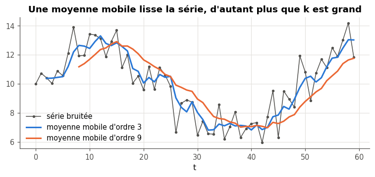

```python
>>> np.average([12, 15, 9], weights=[2, 1, 3])
np.float64(11.0)
>>> x = np.array([3, 5, 4, 8, 6])
>>> np.convolve(x, np.ones(3) / 3, mode="valid").round(2)
array([4.  , 5.67, 6.  ])
```

### 101.1.5 Suites géométriques et leur somme

Une **suite géométrique** multiplie chaque terme par le même nombre $q$, la **raison** : $u_{k+1} = q\,u_k$, donc $u_k = u_0\,q^k$. Son comportement ne dépend que de $q$ :
- si $|q| < 1$, $q^k$ **fond** vers 0 : $0{,}5^{10} \approx 0{,}001$ ;
- si $|q| > 1$, $|q^k|$ **explose** : $2^{10} = 1024$ ;
- si $q = 1$, elle reste constante ; si $q < 0$, elle change de signe à chaque étape.

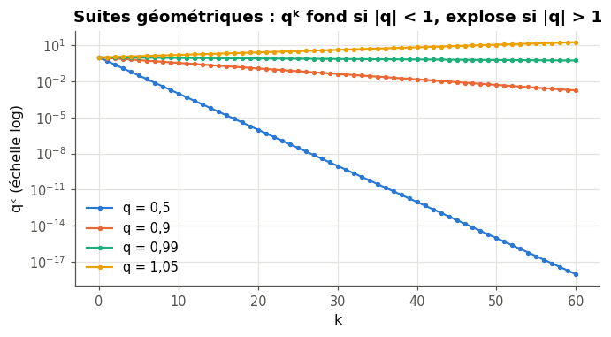

Ce qui compte est souvent la **vitesse** : $0{,}9^{10} \approx 0{,}35$ mais $0{,}99^{10} \approx 0{,}90$ ; il faut environ 69 étapes à $0{,}99^k$ pour passer sous 0,5 (on saura le calculer avec les logarithmes, 101.2.4).

La **somme** des $n$ premiers termes se calcule sans les additionner un par un. Pour $q \neq 1$ :

$$\sum_{k=0}^{n-1} q^k = 1 + q + q^2 + \dots + q^{n-1} = \frac{1 - q^n}{1 - q}$$

Exemple avec $q = 0{,}5$ et $n = 4$ : $1 + 0{,}5 + 0{,}25 + 0{,}125 = 1{,}875$, et la formule donne $\frac{1 - 0{,}0625}{0{,}5} = 1{,}875$. Si $|q| < 1$, $q^n \to 0$ et la somme **infinie** a une valeur finie : $\sum_{k=0}^{\infty} q^k = \frac{1}{1 - q}$ (ici 2). Tu démontreras la formule en 0B.14.

**En ML**, les suites géométriques sont partout : un signal multiplié par 0,9 à chaque étape (chaque couche d'un réseau profond, chaque pas de temps d'un réseau récurrent ou RNN) s'évanouit : c'est le gradient évanescent (*vanishing gradient*, ch. 22) ; en apprentissage par renforcement, une récompense reçue dans $k$ étapes compte $\gamma^k$ fois (ch. 26), et une récompense 1 à chaque étape vaut au total $\frac{1}{1 - \gamma}$, soit 10 pour $\gamma = 0{,}9$ ; les optimiseurs avec momentum additionnent des gradients passés pondérés par $\beta^k$ (ch. 19).

```python
>>> 0.9 ** 10, 0.99 ** 10, 0.99 ** 69
(0.3486784401000001, 0.9043820750088044, 0.4998370298991989)
>>> sum(0.5 ** k for k in range(4)), (1 - 0.5 ** 4) / (1 - 0.5)
(1.875, 1.875)
```

### 101.1.6 Ensembles : union, intersection, complémentaire, cardinal

Un **ensemble** est une collection d'éléments sans ordre ni doublon, noté entre accolades : $\{2, 4, 6\}$. On écrit $x \in A$ (« $x$ appartient à $A$ ») et $\varnothing$ pour l'ensemble vide. Le **cardinal** $|A|$ est son nombre d'éléments. Dans un univers $\Omega$ :

| Opération | Notation | Contient | Python (0A.19) |
|---|---|---|---|
| union | $A \cup B$ | les éléments de $A$ **ou** de $B$ | `A \| B` |
| intersection | $A \cap B$ | les éléments de $A$ **et** de $B$ | `A & B` |
| complémentaire | $\bar{A}$ | les éléments de $\Omega$ qui ne sont pas dans $A$ | `omega - A` |
| différence | $A \setminus B$ | les éléments de $A$ qui ne sont pas dans $B$ | `A - B` |

Pour compter une union, on retire ce qu'on a compté deux fois :

$$|A \cup B| = |A| + |B| - |A \cap B|$$

Exemple dans $\Omega = \{1, \dots, 10\}$ : $A$ = les nombres pairs, $B$ = les multiples de 3. $A \cap B = \{6\}$, donc $|A \cup B| = 5 + 3 - 1 = 7$, et $\bar{A} = \{1, 3, 5, 7, 9\}$. Deux ensembles sans élément commun ($A \cap B = \varnothing$) sont dits **disjoints**.

```python
>>> omega = set(range(1, 11))
>>> A = {n for n in omega if n % 2 == 0}
>>> B = {n for n in omega if n % 3 == 0}
>>> A & B, len(A | B), sorted(omega - A)
({6}, 7, [1, 3, 5, 7, 9])
```

### 101.1.7 Dénombrement : principe multiplicatif, factorielle, coefficient binomial

**Principe multiplicatif** : si un choix se fait en deux étapes, avec $a$ possibilités pour la première et $b$ pour la seconde, il y a $a \times b$ possibilités en tout. Une grille de 3 learning rates (*taux d'apprentissage* : la taille des pas de l'entraînement, 101.6.3), 3 tailles de lot et 2 nombres d'epochs contient $3 \times 3 \times 2 = 18$ réglages (0A.46).

La **factorielle** $n! = n \times (n - 1) \times \dots \times 2 \times 1$ compte les façons de **ranger** $n$ objets dans un ordre : $5! = 120$ (et, par convention, $0! = 1$). Elle grandit très vite : $10! = 3\,628\,800$.

Le **coefficient binomial** $\binom{n}{k}$ (lire « $k$ parmi $n$ ») compte les façons de **choisir** $k$ objets parmi $n$, sans tenir compte de l'ordre :

$$\binom{n}{k} = \frac{n!}{k!\,(n-k)!}$$

Exemple : les paires de features parmi 4, $\binom{4}{2} = \frac{24}{2 \times 2} = 6$ (0A.46). Le cas $k = 2$ revient souvent : $\binom{K}{2} = \frac{K(K-1)}{2}$, par exemple les $\binom{10}{2} = 45$ duels entre les 10 chiffres de MNIST d'une stratégie « un-contre-un » (ch. 7).

Les coefficients binomiaux se rangent dans le **triangle de Pascal** : chaque nombre est la somme des deux au-dessus, $\binom{n}{k} = \binom{n-1}{k-1} + \binom{n-1}{k}$. Ils sont symétriques : choisir les $k$ qu'on garde revient à choisir les $n - k$ qu'on laisse, $\binom{n}{k} = \binom{n}{n-k}$.

```text
n = 0:            1
n = 1:          1   1
n = 2:        1   2   1
n = 3:      1   3   3   1
n = 4:    1   4   6   4   1
```

```python
>>> math.factorial(5), math.comb(4, 2), math.comb(10, 2), math.perm(4, 2)
(120, 6, 45, 12)
```

`math.perm(4, 2)` compte les choix **ordonnés** de 2 objets parmi 4 : $4 \times 3 = 12$, soit deux fois plus que $\binom{4}{2}$, puisque chaque paire peut être rangée de 2 façons.

## 101.2 · Fonctions usuelles

Une poignée de fonctions revient sans cesse en ML. Voici leurs allures, à reconnaître d'un coup d'œil (0B.Q6, 0B.36).

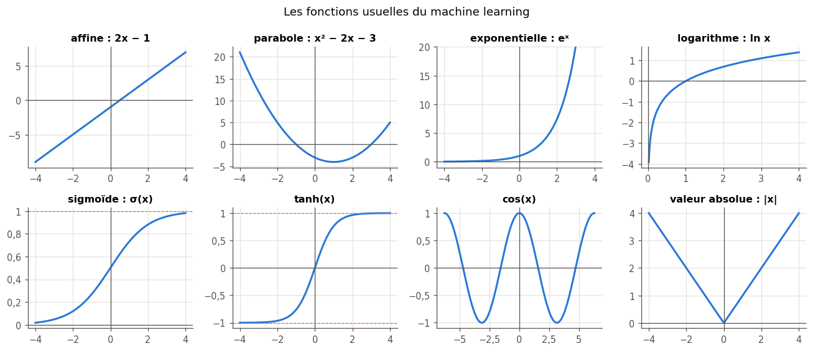

### 101.2.1 Fonction, graphe, fonction affine

Une **fonction** $f$ associe à chaque nombre $x$ de son **ensemble de définition** un unique nombre $f(x)$. Son **graphe** est l'ensemble des points $(x, f(x))$. En Python, c'est une fonction qui prend un nombre et en renvoie un.

Une fonction **affine** s'écrit $f(x) = a\,x + b$ : son graphe est une droite. $b = f(0)$ est l'**ordonnée à l'origine**, et $a$ est la **pente** (ou coefficient directeur) : quand $x$ augmente de 1, $f(x)$ augmente de $a$. Entre deux points de la droite,

$$a = \frac{\Delta y}{\Delta x} = \frac{y_2 - y_1}{x_2 - x_1}$$

Exemple : la droite qui passe par $(1, 3)$ et $(3, 7)$ a pour pente $a = \frac{7 - 3}{3 - 1} = 2$, et $b = 3 - 2 \times 1 = 1$ : $f(x) = 2x + 1$. Elle coupe l'axe des abscisses en $x = -\frac{b}{a} = -0{,}5$ (sa **racine**).

**En ML**, la régression linéaire (ch. 9) cherche la droite $\hat{y} = w\,x + b$ la plus proche des données ; un neurone sans fonction d'activation calcule une fonction affine de ses entrées.

### 101.2.2 Polynômes et paraboles

Un **polynôme** est une somme de puissances entières positives (ou nulles) de $x$ multipliées par des coefficients : $3x^3 - x + 7$ est de **degré** 3. Le degré 2 donne une **parabole**, $f(x) = a\,x^2 + b\,x + c$ ($a \neq 0$) :
- elle est tournée vers le haut si $a > 0$ (elle a un **minimum**), vers le bas si $a < 0$ ;
- son **sommet** est en $x = -\frac{b}{2a}$ ;
- ses **racines** (les $x$ où $f(x) = 0$) dépendent du **discriminant** $\Delta = b^2 - 4ac$ : deux racines $\frac{-b \pm \sqrt{\Delta}}{2a}$ si $\Delta > 0$, une seule si $\Delta = 0$, aucune (réelle) si $\Delta < 0$.

Exemple : $x^2 - 2x - 3$. $\Delta = 4 + 12 = 16$, racines $\frac{2 \pm 4}{2}$, soit $-1$ et $3$ ; on peut donc factoriser : $x^2 - 2x - 3 = (x + 1)(x - 3)$. Le sommet est en $x = 1$, où $f(1) = -4$ : c'est le minimum.

**En ML**, l'erreur au carré $(\hat{y} - y)^2$ est une parabole en $\hat{y}$ : c'est pour cela qu'elle a un minimum unique, facile à trouver. La régression polynomiale (ch. 9) ajuste des polynômes de degré de plus en plus grand… jusqu'à l'overfitting (le surapprentissage, ch. 9).

### 101.2.3 Exponentielle

L'**exponentielle** $x \mapsto e^x$ (aussi notée $\exp(x)$) utilise le nombre $e \approx 2{,}718$. Ses propriétés sont celles des puissances :

$$e^0 = 1 \qquad e^{a+b} = e^a\,e^b \qquad e^{-a} = \frac{1}{e^a} \qquad (e^a)^b = e^{ab}$$

Elle est **toujours strictement positive**, croissante, et **explose** : $e^{10} \approx 22\,026$, et elle finit par dépasser n'importe quel polynôme. Vers $-\infty$, elle tend vers 0 : $e^{-10} \approx 0{,}000045$.

| $x$ | $-2$ | $-1$ | $0$ | $1$ | $2$ | $10$ |
|---|---|---|---|---|---|---|
| $e^x$ | $0{,}135$ | $0{,}368$ | $1$ | $2{,}718$ | $7{,}389$ | $22\,026$ |

**En ML**, l'exponentielle transforme des scores quelconques en nombres positifs : c'est le cœur de la sigmoïde (101.2.5) et du **softmax** (ch. 17), qui change une liste de scores en probabilités. Elle déborde vite : `np.exp(1000)` vaut `inf` en virgule flottante (0B.37).

```python
>>> import math
>>> import numpy as np
>>> math.e, math.exp(1), math.exp(-1)
(2.718281828459045, 2.718281828459045, 0.36787944117144233)
>>> [round(math.exp(v), 3) for v in (-2, 0, 2, 10)]
[0.135, 1.0, 7.389, 22026.466]
>>> np.exp(np.array([-2.0, 0.0, 2.0])).round(3)
array([0.135, 1.   , 7.389])
```

### 101.2.4 Logarithmes : ln, log₂, log₁₀, changement de base

Le **logarithme népérien** $\ln$ est la fonction **réciproque** de l'exponentielle : $\ln(e^x) = x$ pour tout $x$, et $e^{\ln x} = x$ pour $x > 0$. Il n'est défini que pour $x > 0$, vaut $\ln 1 = 0$ et $\ln e = 1$, et tend vers $-\infty$ quand $x$ tend vers 0. Il **transforme les produits en sommes** :

$$\ln(ab) = \ln a + \ln b \qquad \ln\frac{a}{b} = \ln a - \ln b \qquad \ln(a^k) = k \ln a$$

Le logarithme **en base $b$** répond à la question « à quelle puissance faut-il élever $b$ pour obtenir $x$ ? » : $\log_2 8 = 3$ car $2^3 = 8$, $\log_{10} 1000 = 3$, $\log_2 1024 = 10$. Tous les logarithmes se ramènent à $\ln$ par la **formule de changement de base** (démontrée en 0B.16) :

$$\log_b x = \frac{\ln x}{\ln b}$$

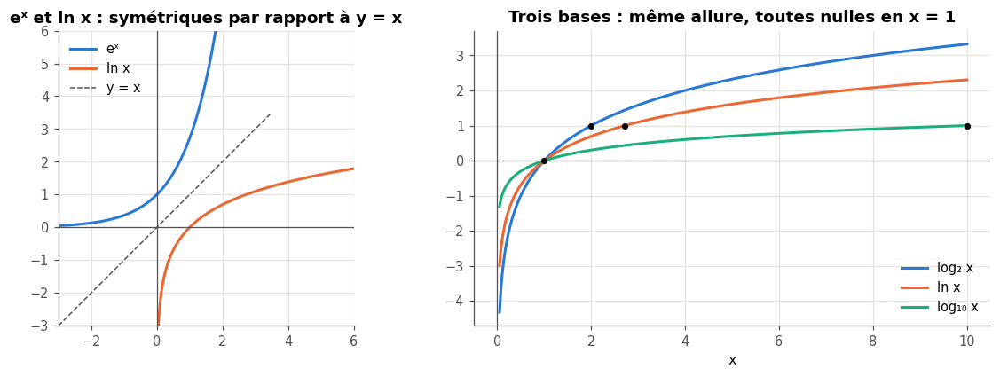

Trois usages en ML :
- **Bits et nats** : la théorie de l'information (ch. 6) mesure l'information en **bits** avec $\log_2$, ou en **nats** avec $\ln$ ; $1 \text{ nat} = \frac{1}{\ln 2} \approx 1{,}443$ bit.
- **Des produits aux sommes** : la probabilité que 200 événements indépendants (101.7.2), chacun de probabilité 0,01, se produisent **tous** vaut $0{,}01^{200} = 10^{-400}$, trop petit pour un `float64`, qui renvoie 0. Son logarithme, lui, se calcule sans problème : $200 \ln 0{,}01 \approx -921$. C'est pourquoi on travaille en **log-probabilités** (0B.E3) et que la loss de classification est une « log-loss » (ch. 13).
- **Compter des étapes** : $q^k = \frac{1}{2} \iff k = \frac{\ln 0{,}5}{\ln q}$ ; pour $q = 0{,}99$, $k \approx 69$ (101.1.5).

```python
>>> math.log(math.e), math.log2(8), math.log10(1000), math.log(8, 2)
(1.0, 3.0, 3.0, 3.0)
>>> 0.01 ** 200, 200 * math.log(0.01)
(0.0, -921.0340371976182)
>>> math.log(0.5) / math.log(0.99)
68.96756393652842
```

⚠️ `math.log(x, base)` passe par une division de deux logarithmes et peut tomber à côté : `math.log(1000, 10)` renvoie `2.9999999999999996`. Pour les bases 2 et 10, préfère `math.log2` et `math.log10`.

> 🕰️ **Mise à jour (2026)** — **Au lycée et sur les calculatrices :** « log » désigne souvent le logarithme décimal $\log_{10}$, et « ln » le logarithme népérien. · **Aujourd'hui en ML :** dans les articles, dans NumPy et dans PyTorch, **log veut dire ln** : `np.log` et `torch.log` calculent le logarithme népérien ; les bases 2 et 10 sont toujours explicites (`np.log2`, `np.log10`). Exception : en théorie de l'information, c'est l'unité (bits ou nats) qui indique la base (ch. 6). · **Faut-il quand même l'apprendre ?** Oui : lis le contexte (un « log » dans une formule de loss est un $\ln$), et en code, `np.log` est **toujours** $\ln$. · *Sources :* [doc `numpy.log`](https://numpy.org/doc/stable/reference/generated/numpy.log.html) (« Natural logarithm, element-wise »), [doc `torch.log`](https://docs.pytorch.org/docs/stable/generated/torch.log.html).

### 101.2.5 Sigmoïde et tangente hyperbolique : définitions et allure

La **sigmoïde** (ou fonction logistique) écrase tout nombre réel dans l'intervalle $]0, 1[$ :

$$\sigma(x) = \frac{1}{1 + e^{-x}}$$

- $\sigma(0) = \frac{1}{2}$ ; $\sigma(x) \to 1$ quand $x \to +\infty$ et $\sigma(x) \to 0$ quand $x \to -\infty$ ;
- elle est croissante, en forme de « S » ;
- **symétrie** : $\sigma(-x) = 1 - \sigma(x)$. Par exemple $\sigma(2) \approx 0{,}881$ et $\sigma(-2) \approx 0{,}119$.

La **tangente hyperbolique** fait de même, mais dans $]-1, 1[$ :

$$\tanh(x) = \frac{e^x - e^{-x}}{e^x + e^{-x}}$$

- $\tanh(0) = 0$, $\tanh(x) \to 1$ en $+\infty$ et $-1$ en $-\infty$ ; $\tanh(1) \approx 0{,}762$ ;
- elle est **impaire** : $\tanh(-x) = -\tanh(x)$ ;
- c'est une sigmoïde « étirée » : $\tanh(x) = 2\,\sigma(2x) - 1$ (vérifié en 0B.17).

**En ML**, la sigmoïde transforme un score en **probabilité** (la régression logistique, ch. 13) et $\tanh$ sert de fonction d'activation, notamment dans les réseaux récurrents (ch. 17 et 22). La dérivée de $\sigma$ viendra au ch. 13, celle de $\tanh$ au ch. 17.

```python
>>> def sigmoid(x):
...     return 1 / (1 + math.exp(-x))
...
>>> round(sigmoid(0), 3), round(sigmoid(2), 3), round(sigmoid(-2), 3)
(0.5, 0.881, 0.119)
>>> round(math.tanh(1), 3), round(2 * sigmoid(2) - 1, 3)
(0.762, 0.762)
```

### 101.2.6 Cosinus (aperçu)

Sur le **cercle trigonométrique** (de rayon 1, centré à l'origine), un angle $\theta$ désigne un point ; son **cosinus** $\cos\theta$ est l'abscisse de ce point. Les angles se mesurent en **radians** : un tour complet vaut $2\pi$, donc $\pi \text{ rad} = 180°$.

| $\theta$ | $0$ | $\frac{\pi}{3}$ (60°) | $\frac{\pi}{2}$ (90°) | $\frac{2\pi}{3}$ (120°) | $\pi$ (180°) |
|---|---|---|---|---|---|
| $\cos\theta$ | $1$ | $\frac{1}{2}$ | $0$ | $-\frac{1}{2}$ | $-1$ |

Le cosinus est compris entre $-1$ et $1$, **pair** ($\cos(-\theta) = \cos\theta$) et **périodique** de période $2\pi$ : $\cos(\theta + 2\pi) = \cos\theta$.

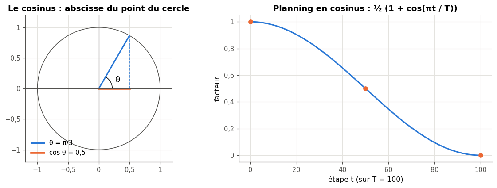

**En ML**, le cosinus sert deux fois :
- la **similarité cosinus** mesure l'angle entre deux vecteurs (101.3.3) : proche de 1, ils vont dans le même sens ;
- les **plannings en cosinus** (*cosine schedule*, ch. 19) font décroître doucement le learning rate de sa valeur maximale jusqu'à 0 sur $T$ étapes, avec le facteur $\frac{1}{2}\left(1 + \cos\frac{\pi t}{T}\right)$, qui vaut 1 en $t = 0$, $\frac{1}{2}$ en $t = \frac{T}{2}$ et 0 en $t = T$.

### 101.2.7 Composition de fonctions

**Composer**, c'est enchaîner : $(g \circ f)(x) = g(f(x))$, « $g$ rond $f$ », on applique d'abord $f$, puis $g$ au résultat. **L'ordre compte** : avec $f(x) = 2x + 1$ et $g(u) = u^2$,

$$(g \circ f)(x) = (2x + 1)^2 \qquad (f \circ g)(x) = 2x^2 + 1$$

et en $x = 1$ : $(g \circ f)(1) = 9$ mais $(f \circ g)(1) = 3$.

Dans l'autre sens, **décomposer** une formule compliquée en étapes simples est la clé de la règle de la chaîne (101.5.3) : $h(x) = \ln(1 + x^2)$ s'écrit $g(f(x))$ avec $f(x) = 1 + x^2$ et $g(u) = \ln u$.

**En ML**, un réseau de neurones est une composition : chaque couche applique une fonction au résultat de la précédente, $\hat{y} = f_3(f_2(f_1(\mathbf{x})))$. En Python, composer revient à passer des fonctions en arguments (0A.41) :

```python
>>> def compose(g, f):
...     return lambda x: g(f(x))
...
>>> f = lambda x: 2 * x + 1
>>> g = lambda u: u ** 2
>>> compose(g, f)(1), compose(f, g)(1)
(9, 3)
```

## 101.3 · Vecteurs

### 101.3.1 Composantes, somme, produit par un scalaire

Un **vecteur** de dimension $n$ est une liste ordonnée de $n$ nombres, ses **composantes** : $\mathbf{x} = (x_1, x_2, \dots, x_n)$, on dit que $\mathbf{x} \in \mathbb{R}^n$. Géométriquement, en dimension 2 ou 3, c'est une flèche ; en ML, c'est surtout **une ligne de données** : un manchot décrit par (longueur du bec, longueur de la nageoire) est un vecteur de $\mathbb{R}^2$, une image MNIST aplatie un vecteur de $\mathbb{R}^{784}$, un mot un **embedding** de quelques centaines de composantes (B2).

Deux opérations se font **composante par composante** :
- la **somme** : $\mathbf{a} + \mathbf{b} = (a_1 + b_1, \dots, a_n + b_n)$ (les deux vecteurs doivent avoir la même dimension) ;
- le **produit par un scalaire** (un nombre) $c$ : $c\,\mathbf{a} = (c\,a_1, \dots, c\,a_n)$.

Exemple : $\mathbf{a} = (3, 1)$ et $\mathbf{b} = (1, 2)$ donnent $\mathbf{a} + \mathbf{b} = (4, 3)$, $2\mathbf{a} = (6, 2)$ et $\mathbf{a} - \mathbf{b} = (2, -1)$. Géométriquement, on met les flèches bout à bout.

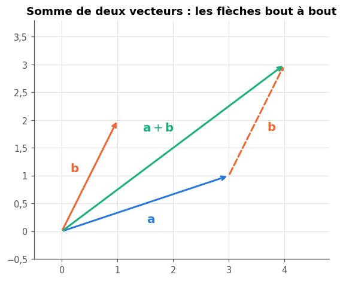

```python
>>> import numpy as np
>>> a, b = np.array([3, 1]), np.array([1, 2])
>>> a + b, 2 * a, a - b
(array([4, 3]), array([6, 2]), array([ 2, -1]))
>>> [3, 1] + [1, 2]
[3, 1, 1, 2]
```

⚠️ Avec des **listes** Python, `+` **colle** les listes au lieu de les additionner : c'est tout l'intérêt de NumPy… et de `mylearn.linalg_basics.vector_add` (0B.38), que tu écriras en Python pur.

### 101.3.2 Norme et distance

La **norme** euclidienne (ou norme L2) d'un vecteur est sa longueur, par le théorème de Pythagore :

$$\|\mathbf{x}\|_2 = \sqrt{\sum_{i=1}^{n} x_i^2}$$

Pour $\mathbf{x} = (3, 4)$ : $\|\mathbf{x}\|_2 = \sqrt{9 + 16} = 5$. On utilise aussi la norme **L1**, $\|\mathbf{x}\|_1 = \sum_i |x_i|$ (ici 7), et la norme **L∞**, $\|\mathbf{x}\|_\infty = \max_i |x_i|$ (ici 4). Sans précision, « la norme » est la norme L2. Un vecteur de norme 1 est dit **unitaire** : $\frac{\mathbf{x}}{\|\mathbf{x}\|}$ garde la direction de $\mathbf{x}$ avec une longueur 1.

La **distance** entre deux points est la norme de leur différence : $d(\mathbf{a}, \mathbf{b}) = \|\mathbf{a} - \mathbf{b}\|$. Deux manchots de Penguins, décrits par (bec, nageoire) en mm, $(39{,}1 ; 181)$ et $(46{,}5 ; 217)$, sont à la distance

$$\sqrt{(46{,}5 - 39{,}1)^2 + (217 - 181)^2} = \sqrt{7{,}4^2 + 36^2} = \sqrt{54{,}76 + 1296} \approx 36{,}75 \text{ mm}$$

La nageoire, mesurée sur une échelle plus grande, écrase la différence de bec : c'est pourquoi on **standardise** les colonnes avant de calculer des distances (0A.52, ch. 12).

**En ML**, les distances décident des plus proches voisins (ch. 13) et des groupes du k-means (ch. 7) ; les normes L1 et L2 des poids servent à la régularisation (ch. 9).

```python
>>> x = np.array([3.0, 4.0])
>>> np.linalg.norm(x), np.linalg.norm(x, ord=1), np.linalg.norm(x, ord=np.inf)
(np.float64(5.0), np.float64(7.0), np.float64(4.0))
>>> float(np.linalg.norm(np.array([46.5, 217]) - np.array([39.1, 181])))
36.75268697660077
```

### 101.3.3 Produit scalaire, angle, similarité cosinus

Le **produit scalaire** (*dot product*) de deux vecteurs de même dimension est un **nombre** :

$$\mathbf{a} \cdot \mathbf{b} = \sum_{i=1}^{n} a_i\,b_i$$

Avec $\mathbf{a} = (3, 1)$ et $\mathbf{b} = (1, 2)$ : $\mathbf{a} \cdot \mathbf{b} = 3 + 2 = 5$. Ses propriétés : $\mathbf{a} \cdot \mathbf{b} = \mathbf{b} \cdot \mathbf{a}$ ; $\mathbf{a} \cdot (\mathbf{b} + \mathbf{c}) = \mathbf{a} \cdot \mathbf{b} + \mathbf{a} \cdot \mathbf{c}$ ; $(k\,\mathbf{a}) \cdot \mathbf{b} = k\,(\mathbf{a} \cdot \mathbf{b})$ ; et $\mathbf{a} \cdot \mathbf{a} = \|\mathbf{a}\|^2$.

Il a aussi une lecture **géométrique** : si $\theta$ est l'angle entre les deux flèches,

$$\mathbf{a} \cdot \mathbf{b} = \|\mathbf{a}\|\,\|\mathbf{b}\|\,\cos\theta$$

Il est donc positif quand les vecteurs vont dans des directions proches, nul quand ils sont **orthogonaux** (perpendiculaires, $\theta = 90°$), négatif quand ils s'opposent. En isolant le cosinus, on obtient la **similarité cosinus** :

$$\cos(\mathbf{a}, \mathbf{b}) = \frac{\mathbf{a} \cdot \mathbf{b}}{\|\mathbf{a}\|\,\|\mathbf{b}\|}$$

Ici $\cos(\mathbf{a}, \mathbf{b}) = \frac{5}{\sqrt{10}\,\sqrt{5}} = \frac{5}{\sqrt{50}} \approx 0{,}707$ : l'angle vaut 45°. La similarité cosinus est comprise entre $-1$ et $1$, et **ne change pas si l'on allonge un vecteur** (multiplier par un nombre positif) : elle compare des directions, pas des longueurs (0B.41).

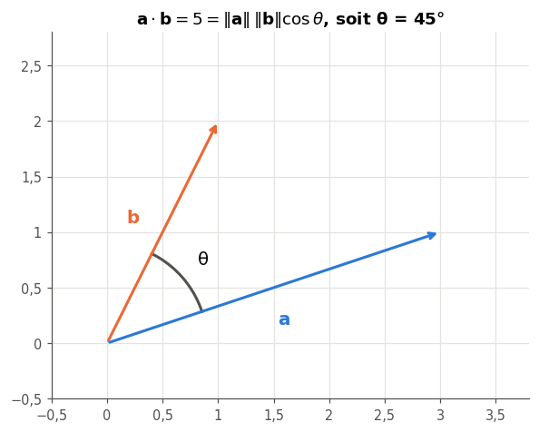

**En ML** : le calcul d'un neurone est un produit scalaire, $z = \mathbf{w} \cdot \mathbf{x} + b$ (101.1.4) ; la recherche par **embeddings** (moteurs de recherche, génération augmentée par recherche de documents ou RAG, B2 et B4) classe les documents par similarité cosinus avec la question.

```python
>>> a, b = np.array([3.0, 1.0]), np.array([1.0, 2.0])
>>> a @ b, np.dot(a, b)
(np.float64(5.0), np.float64(5.0))
>>> cos = a @ b / (np.linalg.norm(a) * np.linalg.norm(b))
>>> round(float(cos), 3), round(float(np.degrees(np.arccos(cos))), 1)
(0.707, 45.0)
```

### 101.3.4 Produit élément par élément (Hadamard)

Le **produit de Hadamard** $\mathbf{a} \odot \mathbf{b}$ multiplie composante par composante et donne un **vecteur** :

$$(\mathbf{a} \odot \mathbf{b})_i = a_i\,b_i$$

$(1, 2, 3) \odot (4, 5, 6) = (4, 10, 18)$, dont la somme, $32$, est le produit scalaire : $\mathbf{a} \cdot \mathbf{b} = \sum_i (\mathbf{a} \odot \mathbf{b})_i$. En NumPy, c'est simplement `a * b`.

**En ML**, il sert à appliquer un **masque** (dropout, ch. 20 : on multiplie par des 0 et des 1), à combiner des « portes » dans les LSTM, des réseaux récurrents perfectionnés (ch. 22) et, partout en rétropropagation, à multiplier un gradient par la dérivée d'une activation (ch. 18).

```python
>>> u, v = np.array([1, 2, 3]), np.array([4, 5, 6])
>>> u * v, (u * v).sum(), u @ v
(array([ 4, 10, 18]), np.int64(32), np.int64(32))
```

## 101.4 · Matrices

### 101.4.1 Forme, éléments, transposée ; un dataset est une matrice

Une **matrice** de forme $(m, n)$ est un tableau de nombres à $m$ lignes et $n$ colonnes ; on écrit $\mathbf{A} \in \mathbb{R}^{m \times n}$. L'élément $A_{ij}$ est à la ligne $i$ et à la colonne $j$ :

$$\mathbf{A} = \begin{pmatrix} 1 & 2 & 3 \\ 4 & 5 & 6 \end{pmatrix} \qquad \text{forme } (2, 3), \quad A_{12} = 2, \quad A_{23} = 6$$

⚠️ En maths, les indices commencent à 1 ; en Python, à 0 : $A_{23}$ s'écrit `A[1, 2]`.

La **transposée** $\mathbf{A}^\top$ échange lignes et colonnes, $(\mathbf{A}^\top)_{ij} = A_{ji}$ ; elle a la forme $(n, m)$, et $(\mathbf{A}^\top)^\top = \mathbf{A}$ :

$$\mathbf{A}^\top = \begin{pmatrix} 1 & 4 \\ 2 & 5 \\ 3 & 6 \end{pmatrix}$$

**Un dataset est une matrice** : $\mathbf{X}$ de forme `(n_samples, n_features)` a une **ligne par exemple** et une **colonne par feature**, comme les 333 manchots × 4 mesures de 0A.35. Chaque ligne est un vecteur (un manchot), chaque colonne une variable. Les poids d'une couche de réseau forment aussi une matrice (101.4.3).

```python
>>> import numpy as np
>>> A = np.array([[1, 2, 3], [4, 5, 6]])
>>> A.shape, A[1, 2], A.T.shape
((2, 3), np.int64(6), (3, 2))
>>> A.T
array([[1, 4],
       [2, 5],
       [3, 6]])
```

### 101.4.2 Produit matrice-vecteur

Multiplier une matrice $\mathbf{A}$ de forme $(m, n)$ par un vecteur $\mathbf{v}$ de dimension $n$ donne un vecteur de dimension $m$ : **chaque composante est le produit scalaire d'une ligne de $\mathbf{A}$ avec $\mathbf{v}$**,

$$(\mathbf{A}\mathbf{v})_i = \sum_{j=1}^{n} A_{ij}\,v_j$$

Avec la matrice $\mathbf{A}$ ci-dessus et $\mathbf{v} = (1, 0, -1)$ :

$$\mathbf{A}\mathbf{v} = \begin{pmatrix} 1 \times 1 + 2 \times 0 + 3 \times (-1) \\ 4 \times 1 + 5 \times 0 + 6 \times (-1) \end{pmatrix} = \begin{pmatrix} -2 \\ -2 \end{pmatrix}$$

**Deuxième lecture** : $\mathbf{A}\mathbf{v}$ est une **combinaison des colonnes** de $\mathbf{A}$, pondérées par les composantes de $\mathbf{v}$ : $1 \times (1, 4) + 0 \times (2, 5) + (-1) \times (3, 6) = (-2, -2)$. Les deux lectures donnent le même résultat ; la seconde explique pourquoi $\mathbf{A}\mathbf{v}$ « mélange » les colonnes.

**En ML**, un modèle linéaire prédit **tout le dataset d'un coup** : $\hat{\mathbf{y}} = \mathbf{X}\mathbf{w} + b$, avec $\mathbf{X}$ de forme `(n_samples, n_features)` et $\mathbf{w}$ de dimension `n_features` ; chaque prédiction $\hat{y}_i = \mathbf{x}_i \cdot \mathbf{w} + b$ est le produit scalaire de la ligne $i$ de $\mathbf{X}$ avec les poids, plus le biais.

```python
>>> v = np.array([1, 0, -1])
>>> A @ v, 1 * A[:, 0] + 0 * A[:, 1] + (-1) * A[:, 2]
(array([-2, -2]), array([-2, -2]))
```

> 🕰️ **Mise à jour (2026)** — **Les manuels de maths :** les vecteurs sont des **colonnes** (des matrices à une colonne, de forme $(n, 1)$ ; un vecteur **ligne** a la forme $(1, n)$, et la transposée passe de l'un à l'autre), et une couche calcule $\mathbf{y} = \mathbf{W}\mathbf{x}$. · **Aujourd'hui dans le code ML :** un exemple par **ligne**, et une couche calcule sur tout un lot $\mathbf{Z} = \mathbf{X}\mathbf{W} + \mathbf{b}$, avec $\mathbf{W}$ de forme `(n_in, n_out)` (convention de mylearn) ; PyTorch range les poids de `torch.nn.Linear` dans l'autre sens, de forme `(out_features, in_features)`, et calcule $\mathbf{y} = \mathbf{x}\mathbf{A}^\top + \mathbf{b}$. · **Faut-il quand même l'apprendre ?** Oui : on passe d'une convention à l'autre avec une transposée, $(\mathbf{W}\mathbf{x})^\top = \mathbf{x}^\top\mathbf{W}^\top$ (101.4.3). Vérifie toujours les formes. · *Source :* [doc `torch.nn.Linear`](https://docs.pytorch.org/docs/stable/generated/torch.nn.Linear.html) (« y = xA^T + b », poids de forme `(out_features, in_features)`).

### 101.4.3 Produit matriciel et vérification des formes

Le **produit matriciel** de $\mathbf{A}$, de forme $(m, n)$, par $\mathbf{B}$, de forme $(n, p)$, est la matrice $\mathbf{A}\mathbf{B}$ de forme $(m, p)$ dont l'élément $(i, j)$ est le produit scalaire de la **ligne $i$ de $\mathbf{A}$** et de la **colonne $j$ de $\mathbf{B}$** :

$$(\mathbf{A}\mathbf{B})_{ij} = \sum_{k=1}^{n} A_{ik}\,B_{kj}$$

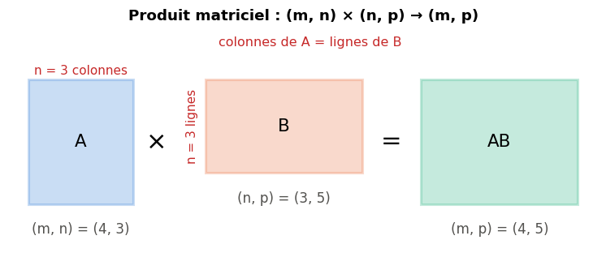

**Règle d'or : $(m, n) \times (n, p) \to (m, p)$.** Le produit n'existe que si le nombre de colonnes de $\mathbf{A}$ est égal au nombre de lignes de $\mathbf{B}$ (les deux dimensions « intérieures ») ; elles « s'annulent », et il reste les deux dimensions extérieures. Avant tout calcul, **écris les formes**.

Exemple : avec $\mathbf{A} = \begin{pmatrix} 1 & 2 \\ 3 & 4 \end{pmatrix}$ et $\mathbf{B} = \begin{pmatrix} 0 & 1 \\ 1 & 0 \end{pmatrix}$,

$$\mathbf{A}\mathbf{B} = \begin{pmatrix} 1 \times 0 + 2 \times 1 & 1 \times 1 + 2 \times 0 \\ 3 \times 0 + 4 \times 1 & 3 \times 1 + 4 \times 0 \end{pmatrix} = \begin{pmatrix} 2 & 1 \\ 4 & 3 \end{pmatrix} \qquad \mathbf{B}\mathbf{A} = \begin{pmatrix} 3 & 4 \\ 1 & 2 \end{pmatrix}$$

Trois propriétés à retenir :
- le produit **n'est pas commutatif** : en général $\mathbf{A}\mathbf{B} \neq \mathbf{B}\mathbf{A}$ (ici, $\mathbf{A}\mathbf{B}$ échange les colonnes de $\mathbf{A}$, $\mathbf{B}\mathbf{A}$ ses lignes) ;
- il est **associatif** : $(\mathbf{A}\mathbf{B})\mathbf{C} = \mathbf{A}(\mathbf{B}\mathbf{C})$, mais les deux ordres de calcul n'ont pas le même coût (0B.30, 0B.54) ;
- la transposée d'un produit **inverse l'ordre** : $(\mathbf{A}\mathbf{B})^\top = \mathbf{B}^\top\mathbf{A}^\top$.

**Coût** : chaque élément du résultat demande $n$ multiplications, et il y a $m \times p$ éléments : un produit $(m, n) \times (n, p)$ coûte $m\,n\,p$ multiplications.

**En ML**, une couche dense calcule $\mathbf{Z} = \mathbf{X}\mathbf{W} + \mathbf{b}$ sur un lot : pour 64 images MNIST aplaties et 128 neurones, $(64, 784) \times (784, 128) \to (64, 128)$, soit $64 \times 784 \times 128 \approx 6{,}4 \times 10^6$ multiplications. Les GPU (processeurs graphiques) sont faits pour ces produits.

```python
>>> A, B = np.array([[1, 2], [3, 4]]), np.array([[0, 1], [1, 0]])
>>> A @ B
array([[2, 1],
       [4, 3]])
>>> B @ A
array([[3, 4],
       [1, 2]])
>>> np.array_equal((A @ B).T, B.T @ A.T)
True
>>> np.ones((2, 3)) @ np.ones((2, 2))
Traceback (most recent call last):
  ...
ValueError: matmul: Input operand 1 has a mismatch in its core dimension 0, with gufunc signature (n?,k),(k,m?)->(n?,m?) (size 2 is different from 3)
```

⚠️ En NumPy, `A * B` est le produit **élément par élément** (Hadamard, 101.3.4), pas le produit matriciel : c'est `A @ B` (0B.45).

### 101.4.4 Identité et idée de l'inverse

La **matrice identité** $\mathbf{I}_n$ a des 1 sur la diagonale et des 0 ailleurs ; elle joue le rôle du nombre 1 : pour $\mathbf{A}$ de forme $(m, n)$, $\mathbf{A}\mathbf{I}_n = \mathbf{A}$ et $\mathbf{I}_m\mathbf{A} = \mathbf{A}$ (l'identité doit avoir la bonne taille) ; et $\mathbf{I}\mathbf{v} = \mathbf{v}$.

L'**inverse** d'une matrice carrée $\mathbf{A}$, si elle existe, est la matrice $\mathbf{A}^{-1}$ telle que $\mathbf{A}\mathbf{A}^{-1} = \mathbf{A}^{-1}\mathbf{A} = \mathbf{I}$. Pour une matrice $2 \times 2$, il existe une formule, qui n'a de sens que si le **déterminant** $ad - bc$ n'est pas nul :

$$\begin{pmatrix} a & b \\ c & d \end{pmatrix}^{-1} = \frac{1}{ad - bc}\begin{pmatrix} d & -b \\ -c & a \end{pmatrix}$$

Exemple : $\mathbf{A} = \begin{pmatrix} 2 & 1 \\ 5 & 3 \end{pmatrix}$ a pour déterminant $2 \times 3 - 1 \times 5 = 1$, et $\mathbf{A}^{-1} = \begin{pmatrix} 3 & -1 \\ -5 & 2 \end{pmatrix}$. L'inverse **résout un système** : $2x + y = 3$ et $5x + 3y = 8$ s'écrit $\mathbf{A}\begin{pmatrix} x \\ y \end{pmatrix} = \begin{pmatrix} 3 \\ 8 \end{pmatrix}$, donc

$$\begin{pmatrix} x \\ y \end{pmatrix} = \mathbf{A}^{-1}\begin{pmatrix} 3 \\ 8 \end{pmatrix} = \begin{pmatrix} 9 - 8 \\ -15 + 16 \end{pmatrix} = \begin{pmatrix} 1 \\ 1 \end{pmatrix}$$

Vérification : $2 + 1 = 3$ et $5 + 3 = 8$. Toutes les matrices ne sont pas inversibles : $\begin{pmatrix} 1 & 2 \\ 2 & 4 \end{pmatrix}$ a un déterminant nul (sa deuxième ligne est le double de la première).

**En ML**, on résout des systèmes linéaires (les moindres carrés de la régression linéaire, ch. 9), mais en pratique on n'inverse presque jamais une matrice : `np.linalg.solve` est plus rapide et plus précis (0B.46).

```python
>>> A = np.array([[2.0, 1.0], [5.0, 3.0]])
>>> np.linalg.inv(A).round(6), np.linalg.solve(A, np.array([3.0, 8.0]))
(array([[ 3., -1.],
       [-5.,  2.]]), array([1., 1.]))
>>> np.eye(2) @ A
array([[2., 1.],
       [5., 3.]])
```

## 101.5 · Dérivées

### 101.5.1 Taux d'accroissement, tangente, dérivée

Entre deux points d'abscisses $a$ et $a + h$ du graphe de $f$, la pente de la droite qui les relie (la **sécante**) est le **taux d'accroissement** :

$$\frac{f(a + h) - f(a)}{h}$$

Quand $h$ devient très petit, la sécante se rapproche de la **tangente** au graphe en $a$, et sa pente se rapproche d'un nombre : la **dérivée** de $f$ en $a$,

$$f'(a) = \lim_{h \to 0} \frac{f(a + h) - f(a)}{h}$$

Exemple avec $f(x) = x^2$ en $a = 1$ : $\frac{(1 + h)^2 - 1}{h} = \frac{2h + h^2}{h} = 2 + h$. Pour $h = 1$ on trouve 3, pour $h = 0{,}1$ on trouve 2,1, pour $h = 0{,}01$ on trouve 2,01 : la limite est $f'(1) = 2$.

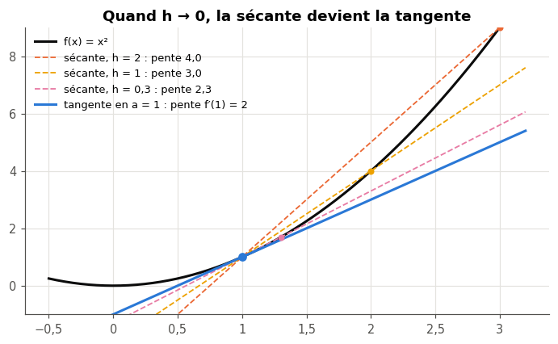

Ce que dit la dérivée :
- c'est la **vitesse de variation** de $f$ : si $f'(a) = 2$, un petit pas $h$ fait varier $f$ d'environ $2h$ ;
- d'où l'**approximation linéaire** $f(a + h) \approx f(a) + f'(a)\,h$ pour $h$ petit ; la tangente a pour équation $y = f(a) + f'(a)(x - a)$ ;
- son **signe** dit si $f$ monte ($f' > 0$) ou descend ($f' < 0$) autour de $a$.

En code, on peut **estimer** une dérivée avec un petit $h$ : la pente centrée $\frac{f(a + h) - f(a - h)}{2h}$ est plus précise que le taux d'accroissement simple. Tu t'en serviras pour vérifier tes calculs à la main (0B.47) ; le ch. 5 étudie le choix de $h$.

```python
>>> f = lambda x: x ** 2
>>> [round((f(1 + h) - f(1)) / h, 4) for h in [1, 0.1, 0.01, 0.001]]
[3.0, 2.1, 2.01, 2.001]
>>> h = 1e-5
>>> round((f(1 + h) - f(1 - h)) / (2 * h), 6)
2.0
```

### 101.5.2 Dérivées usuelles et règles (somme, produit, quotient, exp, ln)

On ne repasse pas par la limite à chaque fois : quelques dérivées usuelles et quelques règles suffisent. On note indifféremment $f'(x)$ ou $\frac{df}{dx}$.

| Fonction | Dérivée | Remarque |
|---|---|---|
| $c$ (constante) | $0$ | |
| $x^n$ | $n\,x^{n-1}$ | vaut aussi pour $n$ négatif ou fractionnaire |
| $\sqrt{x} = x^{1/2}$ | $\frac{1}{2\sqrt{x}}$ | $x > 0$ |
| $\frac{1}{x} = x^{-1}$ | $-\frac{1}{x^2}$ | $x \neq 0$ |
| $e^x$ | $e^x$ | l'exponentielle est sa propre dérivée |
| $\ln x$ | $\frac{1}{x}$ | $x > 0$ |

| Règle | Formule |
|---|---|
| somme | $(u + v)' = u' + v'$ |
| constante multiplicative | $(k\,u)' = k\,u'$ |
| produit | $(u\,v)' = u'\,v + u\,v'$ |
| quotient | $\left(\frac{u}{v}\right)' = \frac{u'\,v - u\,v'}{v^2}$ |

Exemples :
- $f(x) = 3x^2 - 5x + 2$ : $f'(x) = 6x - 5$ ;
- $g(x) = x\,e^x$ (produit, $u = x$, $v = e^x$) : $g'(x) = 1 \times e^x + x\,e^x = (1 + x)\,e^x$ ;
- $h(x) = \frac{\ln x}{x}$ (quotient, $u = \ln x$, $v = x$) : $h'(x) = \frac{\frac{1}{x} \times x - \ln x \times 1}{x^2} = \frac{1 - \ln x}{x^2}$.

⚠️ La dérivée d'un produit **n'est pas** le produit des dérivées : $(x \cdot x)' = 2x$, pas $1 \times 1$.

### 101.5.3 Règle de la chaîne

Pour dériver une **composition** $g(f(x))$ (101.2.7), on dérive chaque étape et on **multiplie** :

$$(g \circ f)'(x) = g'(f(x)) \times f'(x)$$

Avec des noms pour les étapes, $y = f(x)$ puis $z = g(y)$, la notation de Leibniz rend la règle naturelle, comme une fraction qui se simplifie :

$$\frac{dz}{dx} = \frac{dz}{dy} \times \frac{dy}{dx}$$

**Méthode** : 1. décompose en étapes simples en nommant les résultats intermédiaires ; 2. dérive chaque étape par rapport à son entrée ; 3. multiplie ; 4. remplace les variables intermédiaires.

Exemples :
- $z = (2x + 1)^3$ : $u = 2x + 1$ et $z = u^3$, donc $\frac{dz}{dx} = 3u^2 \times 2 = 6(2x + 1)^2$ ; en $x = 1$, $6 \times 9 = 54$ ;
- $z = e^{-x^2}$ : $u = -x^2$ et $z = e^u$, donc $\frac{dz}{dx} = e^u \times (-2x) = -2x\,e^{-x^2}$ ;
- $z = \ln(1 + x^2)$ : $u = 1 + x^2$ et $z = \ln u$, donc $\frac{dz}{dx} = \frac{1}{u} \times 2x = \frac{2x}{1 + x^2}$.

**En ML**, c'est **la** règle de l'entraînement. Une prédiction $\hat{y} = w\,x + b$ et sa loss $L = (\hat{y} - y)^2$ forment une chaîne $w \to \hat{y} \to L$ :

$$\frac{dL}{dw} = \frac{dL}{d\hat{y}} \times \frac{d\hat{y}}{dw} = 2(\hat{y} - y) \times x$$

Avec $w = 2$, $b = 1$, $x = 3$, $y = 5$ : $\hat{y} = 7$, $L = 4$ et $\frac{dL}{dw} = 2 \times 2 \times 3 = 12$ (et $\frac{dL}{db} = 2 \times 2 \times 1 = 4$). Un réseau de neurones n'est qu'une chaîne beaucoup plus longue ; la **rétropropagation** (ch. 18) applique cette règle, étape par étape, en partant de la loss.

### 101.5.4 Variations, minimum et maximum

Le signe de la dérivée donne le sens de variation :
- si $f'(x) > 0$ sur un intervalle, $f$ y est **croissante** ;
- si $f'(x) < 0$, $f$ y est **décroissante** ;
- en un **extremum** (minimum ou maximum) situé à l'intérieur de l'intervalle, une fonction dérivable a une **dérivée nulle** : $f'(a) = 0$.

⚠️ La réciproque est fausse : $f(x) = x^3$ a une dérivée nulle en 0 ($3x^2 = 0$), mais elle monte avant et après ; ce n'est ni un minimum ni un maximum. Pour conclure, on regarde le **signe** de $f'$ autour du point.

Exemple : $f(x) = \frac{x^3}{3} - \frac{x^2}{2} - 2x + 1$ a pour dérivée $f'(x) = x^2 - x - 2 = (x + 1)(x - 2)$, qui s'annule en $-1$ et en $2$. Le tableau de signes montre que $f$ monte, puis descend, puis remonte : **maximum local** en $x = -1$, **minimum local** en $x = 2$.

| $x$ | $-\infty$ … $-1$ | $-1$ … $2$ | $2$ … $+\infty$ |
|---|---|---|---|
| signe de $f'(x)$ | $+$ | $-$ | $+$ |
| $f$ | croissante ↗ | décroissante ↘ | croissante ↗ |

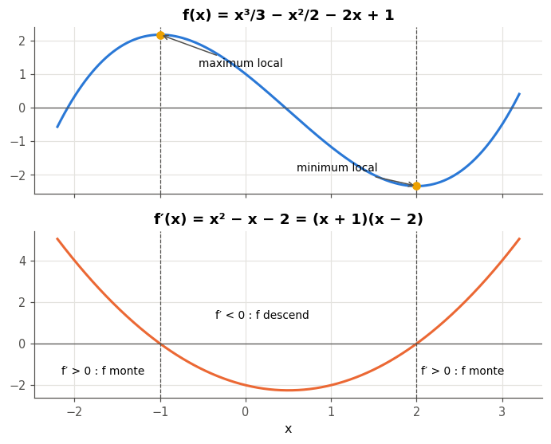

**En ML**, entraîner un modèle, c'est **minimiser une loss**. Pour une loss simple, on trouve le minimum en annulant la dérivée : la valeur $a$ qui minimise $(a - 3)^2 + (a - 5)^2$ vérifie $2(a - 3) + 2(a - 5) = 0$, soit $a = 4$, la **moyenne** de 3 et 5 (tu le démontreras en général en 0B.24). Pour les modèles réels, on ne sait pas résoudre l'équation : on **descend** pas à pas dans la direction qui fait baisser la loss (101.6.3).

## 101.6 · Fonctions de plusieurs variables

### 101.6.1 Fonctions de deux variables et lignes de niveau

Une loss dépend de **tous** les paramètres d'un modèle à la fois. Commençons par deux variables : une fonction $f(x, y)$ associe un nombre à chaque point du plan, par exemple

$$f(x, y) = x^2 + 4y^2$$

qui vaut $f(2, 1) = 4 + 4 = 8$ et $f(0, 0) = 0$ (son minimum). Son graphe est une **surface**, un paysage en relief au-dessus du plan. Pour le dessiner à plat, on trace ses **lignes de niveau** : l'ensemble des points où $f$ prend une valeur donnée $c$, comme les courbes de niveau d'une carte de randonnée. Ici, la ligne de niveau 4 est l'ellipse $x^2 + 4y^2 = 4$, qui passe par $(2, 0)$ et $(0, 1)$.

Lire une carte de lignes de niveau :
- quand les niveaux sont régulièrement espacés (1, 2, 3… ou 4, 8, 12…), des lignes **serrées** signalent une pente **raide** ; des lignes espacées, un terrain presque plat ;
- des lignes fermées emboîtées entourent un **minimum** (ou un maximum) ;
- se déplacer **le long** d'une ligne de niveau ne change pas $f$.

Les « paysages de loss » des ch. 5 et 19 se lisent exactement ainsi.

### 101.6.2 Dérivées partielles

La **dérivée partielle** de $f$ par rapport à $x$, notée $\frac{\partial f}{\partial x}$ (« d rond f sur d rond x »), se calcule en dérivant par rapport à $x$ **comme si $y$ était une constante**. De même pour $y$.

Pour $f(x, y) = x^2 + 4y^2$ :

$$\frac{\partial f}{\partial x} = 2x \qquad \frac{\partial f}{\partial y} = 8y$$

Pour $g(x, y) = x^2 y + 3y$ : $\frac{\partial g}{\partial x} = 2xy$ (le terme $3y$ ne dépend pas de $x$, sa dérivée partielle est nulle) et $\frac{\partial g}{\partial y} = x^2 + 3$. Au point $(1, 2)$ : $\frac{\partial g}{\partial x} = 4$ et $\frac{\partial g}{\partial y} = 4$.

Chaque dérivée partielle est une pente **dans une direction** : $\frac{\partial f}{\partial x}(2, 1) = 4$ dit que si l'on bouge $x$ un tout petit peu à partir de $(2, 1)$, sans toucher $y$, $f$ varie environ 4 fois plus vite que $x$.

### 101.6.3 Gradient et direction de plus grande pente

Le **gradient** rassemble les dérivées partielles dans un vecteur :

$$\nabla f(x, y) = \left(\frac{\partial f}{\partial x}, \frac{\partial f}{\partial y}\right)$$

Ses trois propriétés fondamentales :
- il pointe dans la direction où $f$ **augmente le plus vite** (la plus grande pente) ;
- sa norme mesure cette pente : plus elle est grande, plus le terrain est raide ;
- il est **perpendiculaire** aux lignes de niveau.

Pour **descendre**, on va donc dans la direction **opposée** au gradient. Un **pas de descente de gradient**, avec un learning rate $\eta$, s'écrit :

$$\mathbf{x} \leftarrow \mathbf{x} - \eta\,\nabla f(\mathbf{x})$$

Exemple avec $f(x, y) = x^2 + 4y^2$ au point $(2, 1)$ : $\nabla f(2, 1) = (4, 8)$. Avec $\eta = 0{,}1$, le nouveau point est $(2, 1) - 0{,}1 \times (4, 8) = (1{,}6 ; 0{,}2)$, où $f$ vaut $2{,}56 + 0{,}16 = 2{,}72$ au lieu de 8 : on a bien descendu.

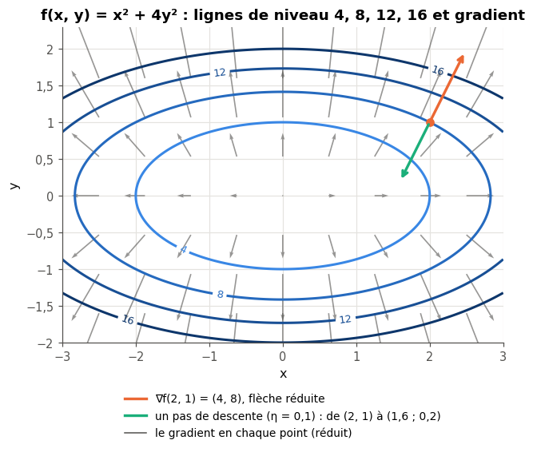

**En ML**, les « variables » sont les poids du modèle, parfois des milliards, et $f$ est la loss. Le gradient a autant de composantes qu'il y a de poids ; l'entraînement répète des pas de descente de gradient (ch. 5 et 19). Calculer ce gradient efficacement est le travail de la rétropropagation (ch. 18).

### 101.6.4 Règle de la chaîne à plusieurs variables : la somme sur les chemins

Et si une variable influence le résultat **par plusieurs chemins** ? Soit $z = f(u, v)$, où $u$ et $v$ dépendent tous les deux de $x$. Une petite variation de $x$ se propage par $u$ **et** par $v$ ; les deux effets s'**additionnent** :

$$\frac{dz}{dx} = \frac{\partial z}{\partial u}\,\frac{du}{dx} + \frac{\partial z}{\partial v}\,\frac{dv}{dx}$$

**Un terme par chemin**, et le long de chaque chemin on multiplie les dérivées (la règle de la chaîne de 101.5.3).

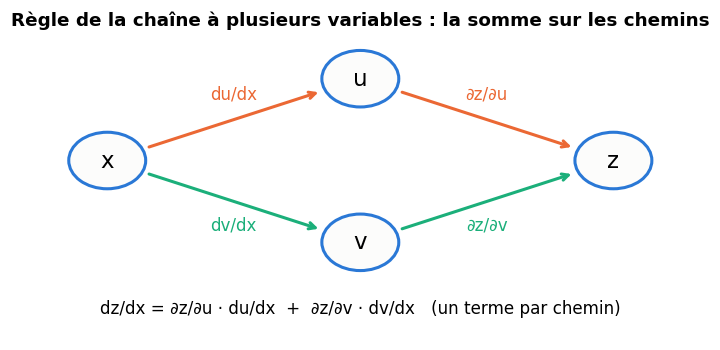

Exemple : $z = u\,v$, avec $u = x^2$ et $v = 3x + 1$. Les dérivées sur les arêtes sont $\frac{\partial z}{\partial u} = v$, $\frac{\partial z}{\partial v} = u$, $\frac{du}{dx} = 2x$ et $\frac{dv}{dx} = 3$, d'où

$$\frac{dz}{dx} = v \times 2x + u \times 3 = (3x + 1) \times 2x + 3x^2$$

En $x = 1$ : $4 \times 2 + 1 \times 3 = 11$. Vérification en développant d'abord : $z = x^2(3x + 1) = 3x^3 + x^2$, donc $\frac{dz}{dx} = 9x^2 + 2x$, qui vaut bien 11 en $x = 1$.

**En ML**, un réseau est un grand **graphe de calcul** : un poids influence la loss par tous les chemins qui partent de lui. La rétropropagation (ch. 18) calcule, arête par arête, les dérivées locales, puis **somme les produits le long des chemins**, en réutilisant les calculs communs. Tu en feras une première version à la main en 0B.29, puis en code en 0B.51.

## 101.7 · Probabilités

### 101.7.1 Expérience aléatoire, événement, probabilité, complémentaire

Une **expérience aléatoire** (lancer deux dés) a un ensemble d'**issues** possibles, l'**univers** $\Omega$ ; pour deux dés, $|\Omega| = 6 \times 6 = 36$ couples. Un **événement** est un ensemble d'issues (101.1.6) : « la somme vaut 7 » $= \{(1, 6), (2, 5), (3, 4), (4, 3), (5, 2), (6, 1)\}$.

Une **probabilité** $P$ associe à chaque événement un nombre entre 0 et 1, avec $P(\Omega) = 1$. Quand toutes les issues sont **équiprobables** :

$$P(A) = \frac{|A|}{|\Omega|} = \frac{\text{nombre d'issues favorables}}{\text{nombre d'issues possibles}}$$

Ainsi $P(\text{somme} = 7) = \frac{6}{36} = \frac{1}{6}$. Deux règles, qui découlent des ensembles :
- **complémentaire** : $P(\bar{A}) = 1 - P(A)$. C'est souvent le chemin le plus court : $P(\text{au moins un 6}) = 1 - P(\text{aucun 6}) = 1 - \frac{25}{36} = \frac{11}{36}$ ;
- **union** : $P(A \cup B) = P(A) + P(B) - P(A \cap B)$, qui devient $P(A) + P(B)$ quand $A$ et $B$ sont incompatibles (disjoints).

**En ML**, un classifieur renvoie des probabilités (« 92 % Gentoo ») ; une accuracy est une probabilité estimée sur des données de test (ch. 3).

### 101.7.2 Indépendance

Deux événements $A$ et $B$ sont **indépendants** quand savoir que l'un s'est produit ne change rien aux chances de l'autre. En formule :

$$P(A \cap B) = P(A)\,P(B)$$

- On lance une pièce et un dé : $A$ = « pile » ($\frac{1}{2}$), $B$ = « le dé donne 6 » ($\frac{1}{6}$). Les 12 issues (pièce, dé) sont équiprobables et $A \cap B$ en contient une seule : $P(A \cap B) = \frac{1}{12} = \frac{1}{2} \times \frac{1}{6}$. Indépendants, comme on s'y attendait.
- On lance **un seul** dé : $A$ = « pair » $= \{2, 4, 6\}$ et $B$ = « au moins 4 » $= \{4, 5, 6\}$. $A \cap B = \{4, 6\}$, donc $P(A \cap B) = \frac{2}{6} = \frac{1}{3}$, alors que $P(A)\,P(B) = \frac{1}{2} \times \frac{1}{2} = \frac{1}{4}$. **Pas** indépendants : savoir que le résultat est au moins 4 rend « pair » plus probable.

⚠️ Indépendants ne veut pas dire incompatibles : deux événements incompatibles de probabilités non nulles ne sont **jamais** indépendants (si l'un arrive, l'autre ne peut plus arriver).

**En ML**, on suppose souvent que les exemples d'un dataset sont **indépendants** : la probabilité de tout le dataset est alors le **produit** des probabilités de chaque exemple, un produit que le logarithme transforme en somme (101.2.4). Le classifieur « Naive Bayes » (ch. 13) fait, lui, l'hypothèse (naïve) que les features sont indépendantes. Les probabilités conditionnelles et la règle de Bayes viendront aux ch. 3 et 4.

### 101.7.3 Variable aléatoire discrète et espérance

Une **variable aléatoire** $X$ associe un nombre à chaque issue : le résultat d'un dé, le gain d'un jeu, l'erreur d'un modèle. Quand elle prend un nombre fini de valeurs $x_1, \dots, x_K$, sa **loi** est le tableau des probabilités $p_k = P(X = x_k)$, avec $\sum_k p_k = 1$.

L'**espérance** $\mathbb{E}[X]$ est la moyenne des valeurs **pondérée par leurs probabilités** (101.1.4) :

$$\mathbb{E}[X] = \sum_{k=1}^{K} x_k\,p_k$$

- Un dé équilibré : $\mathbb{E}[X] = \frac{1 + 2 + 3 + 4 + 5 + 6}{6} = 3{,}5$ (une valeur que le dé ne donne jamais : l'espérance est une moyenne, pas un résultat possible).
- Un jeu où l'on gagne 10 € avec probabilité 0,1 et où l'on perd 1 € sinon : $\mathbb{E}[X] = 10 \times 0{,}1 + (-1) \times 0{,}9 = 0{,}1$ €. En moyenne, sur beaucoup de parties, on gagne 10 centimes par partie.

L'espérance est **linéaire** : $\mathbb{E}[aX + b] = a\,\mathbb{E}[X] + b$ (démontré en 0B.28) ; on admet aussi que $\mathbb{E}[X + Y] = \mathbb{E}[X] + \mathbb{E}[Y]$ **toujours**, même quand $X$ et $Y$ sont liées.

**En ML**, la loss que l'on minimise est l'espérance de l'erreur sur les données ; on l'estime par la moyenne sur un échantillon (101.7.5, ch. 2 et 8). En apprentissage par renforcement, on maximise une récompense espérée (ch. 26).

### 101.7.4 Variance et écart-type

L'espérance ne dit rien de la **dispersion** : un gain de 0 € à coup sûr et un jeu à +10 ou −10 € avec une chance sur deux ont la même espérance. La **variance** mesure l'écart moyen au carré autour de l'espérance, l'**écart-type** $\sigma$ en est la racine carrée, dans l'unité de $X$ (même lettre que la sigmoïde : le contexte les distingue) :

$$\mathrm{Var}(X) = \mathbb{E}\left[(X - \mathbb{E}[X])^2\right] = \mathbb{E}[X^2] - \mathbb{E}[X]^2 \qquad \sigma = \sqrt{\mathrm{Var}(X)}$$

La deuxième formule (démontrée en 0B.28) est souvent plus rapide. Pour un dé : $\mathbb{E}[X^2] = \frac{1 + 4 + 9 + 16 + 25 + 36}{6} = \frac{91}{6}$, donc $\mathrm{Var}(X) = \frac{91}{6} - 3{,}5^2 = \frac{35}{12} \approx 2{,}92$ et $\sigma \approx 1{,}71$. Pour le jeu de 101.7.3 : $\mathbb{E}[X^2] = 100 \times 0{,}1 + 1 \times 0{,}9 = 10{,}9$, $\mathrm{Var}(X) = 10{,}9 - 0{,}01 = 10{,}89$ et $\sigma = 3{,}3$ €.

Une règle utile : $\mathrm{Var}(aX + b) = a^2\,\mathrm{Var}(X)$. Ajouter une constante ne change pas la dispersion ; multiplier par $a$ multiplie l'écart-type par $|a|$.

**En ML** : standardiser une colonne (0A.52), c'est la ramener à une moyenne 0 et un écart-type 1 ; la variance des prédictions d'un modèle sur différents échantillons mesure son instabilité (ch. 9) ; l'écart-type d'un score sur plusieurs graines dit si une amélioration est réelle (ch. 8).

### 101.7.5 Simuler pour estimer : fréquences et loi des grands nombres

Quand on répète une expérience $n$ fois, la **fréquence** observée d'un événement (le nombre de fois où il se produit, divisé par $n$) se rapproche de sa probabilité quand $n$ grandit : c'est la **loi des grands nombres**. De même, la moyenne des résultats se rapproche de l'espérance. Les écarts diminuent environ comme $\frac{1}{\sqrt{n}}$ : pour une précision 10 fois meilleure, il faut 100 fois plus d'essais.

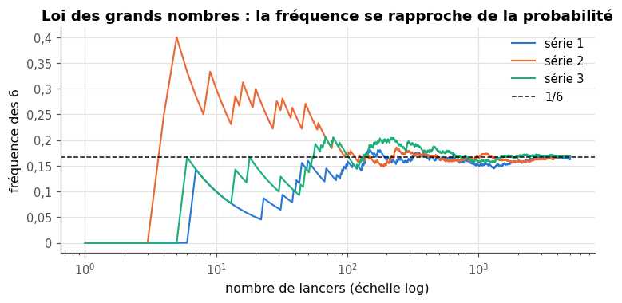

```python
>>> import numpy as np
>>> rng = np.random.default_rng(0)
>>> rolls = rng.integers(1, 7, size=100_000)
>>> round(float((rolls == 6).mean()), 4), round(1 / 6, 4)
(0.1654, 0.1667)
>>> round(float(rolls.mean()), 3), round(float(rolls.var()), 3), round(35 / 12, 3)
(3.498, 2.91, 2.917)
```

Simuler est donc un excellent moyen de **vérifier un calcul** de probabilité, d'espérance ou de variance (0B.52, 0B.53). C'est aussi une méthode à part entière, dite de Monte-Carlo, quand le calcul exact est trop difficile.

**En ML**, un score mesuré sur un jeu de test est une fréquence : il fluctue d'autant moins que le jeu de test est grand (ch. 2 et 8).

## Les pièges classiques ⚠️ (récapitulatif)

| Piège | Exemple faux | Réflexe |
|---|---|---|
| multiplier une inégalité par un négatif sans la retourner | $-2x < 6 \Rightarrow x < -3$ | $-2x < 6 \iff x > -3$ |
| confondre plancher et troncature | $\lfloor -2{,}7 \rfloor = -2$ | $\lfloor -2{,}7 \rfloor = -3$ ; `int(-2.7)` vaut −2 |
| séparer une somme de produits | $\sum x_i y_i = (\sum x_i)(\sum y_i)$ | seules les sommes et les constantes se séparent |
| croire que $0{,}99^k$ reste proche de 1 | $0{,}99^{1000} \approx 1$ | $0{,}99^{1000} \approx 4 \times 10^{-5}$ (0B.34) |
| le log d'une somme | $\ln(a + b) = \ln a + \ln b$ | $\ln(ab) = \ln a + \ln b$ ; $\ln(a + b)$ ne se simplifie pas |
| « log » sans base | lire $\log_{10}$ dans une formule de loss | en ML et en code, `log` = $\ln$ |
| `+` sur des listes | `[3, 1] + [1, 2]` vaut `[4, 3]` | des arrays NumPy, ou une boucle |
| produit matriciel et produit élément par élément | `A * B` pour $\mathbf{A}\mathbf{B}$ | `A @ B` ; vérifier $(m, n) \times (n, p)$ |
| ordre du produit | $\mathbf{A}\mathbf{B} = \mathbf{B}\mathbf{A}$ | le produit matriciel n'est pas commutatif |
| transposée d'un produit | $(\mathbf{A}\mathbf{B})^\top = \mathbf{A}^\top\mathbf{B}^\top$ | $(\mathbf{A}\mathbf{B})^\top = \mathbf{B}^\top\mathbf{A}^\top$ |
| dérivée d'un produit | $(uv)' = u'v'$ | $(uv)' = u'v + uv'$ |
| oublier la dérivée intérieure | $\left((2x + 1)^3\right)' = 3(2x + 1)^2$ | règle de la chaîne : $\times 2$ |
| $f'(a) = 0$ donc extremum | $x^3$ en 0 | regarder le signe de $f'$ autour de $a$ |
| aller dans le sens du gradient pour minimiser | $\mathbf{x} + \eta \nabla f$ | on **soustrait** : $\mathbf{x} - \eta \nabla f$ |
| une seule branche de la chaîne | $\frac{dz}{dx} = \frac{\partial z}{\partial u}\frac{du}{dx}$ seulement | additionner **tous** les chemins |
| incompatibles = indépendants | | deux événements incompatibles (non impossibles) sont dépendants |
| $\mathrm{Var}(aX) = a\,\mathrm{Var}(X)$ | | $\mathrm{Var}(aX) = a^2\,\mathrm{Var}(X)$ |

## Liens avec les autres chapitres 🔗

- **Ch. 1, 9, 10 et 13** : la moyenne mobile (ch. 1), la régression linéaire $\hat{\mathbf{y}} = \mathbf{X}\mathbf{w} + b$ (ch. 9), la somme pondérée d'un neurone $z = \mathbf{w} \cdot \mathbf{x} + b$ (ch. 10) et la sigmoïde de la régression logistique (ch. 13).
- **Ch. 2 à 4** : moyenne, variance et simulation (ch. 2) ; probabilités, indépendance et accuracy (ch. 3) ; probabilités conditionnelles et Bayes (ch. 4).
- **Ch. 5** : dérivées, gradient et lignes de niveau, puis la descente de gradient complète et les dérivées numériques.
- **Ch. 6** : logarithmes en base 2, bits et nats, entropie.
- **Ch. 7, 12 et 13** : distances, standardisation, k plus proches voisins, $\binom{K}{2}$ classifieurs « un-contre-un ».
- **Ch. 16 à 18** : produits matriciels et formes des couches, fonctions d'activation et leurs dérivées, règle de la chaîne et somme sur les chemins pour la rétropropagation ; `mylearn.linalg_basics` montre ce que cache `@`.
- **Ch. 19, 22 et 26** : suites géométriques (momentum, gradient évanescent, facteur d'actualisation $\gamma$), planning en cosinus.
- **B2 et B4** : produit scalaire et similarité cosinus des embeddings, recherche de documents.

## Guide de lecture et de travail

Ce chapitre n'a pas de lecture dans le livre : la fiche est le cours, et **tous les parcours la lisent en entier**. Pour chaque section :

1. **Lis** la section, un crayon à la main : refais chaque exemple chiffré sur papier avant de lire la solution.
2. Fais le **quiz** 🧠 de la section (dans `02_exercices.md`), sans regarder la fiche.
3. Fais les exercices **papier** ✏️ et ∂, en écrivant ta démarche en LaTeX dans `mon_travail/ch00b_maths/06_mes_reponses.md` ; vérifie les ✏️ dans la partie 0 du notebook (`wb.check`).
4. Vérifie ensuite en **code** avec les exercices du notebook : NumPy doit retrouver tes calculs.
5. En fin de journée : 10 minutes de **flashcards**, et une ligne dans ton journal.

Rappel de l'ordre en spirale : 0B.32 d'abord, puis les ★ (0B.1 à 0B.11, et 0B.31) sur toutes les sections, puis les ★★ (0B.12 à 0B.28, 0B.30 et le notebook), et enfin les ★★★ 0B.29 et 0B.54.

**Parcours rapide.** Il lit toute la fiche et fait le cœur des exercices : les quiz et les rappels, les ✏️ centraux (0B.3, 0B.4, 0B.6, 0B.8 à 0B.11, 0B.15, 0B.18, 0B.20, 0B.22, 0B.23, 0B.25, 0B.27), le gradient expliqué (0B.31), LaTeX (0B.32), puis dans le notebook `dot`, `norm` et le cosinus (0B.39, 0B.40), les matrices et `matmul` (0B.42 à 0B.45) et la simulation (0B.52, 0B.53), et les cinq questions d'entretien. La liste exacte est dans `docs/PARCOURS.md`.

**Parcours maths.** Tous les exercices papier, démonstrations ∂ comprises, et l'essentiel du notebook. **Parcours code.** Les rappels, le notebook, et les corrigés des exercices papier à lire.

**Si tu bloques** : règle des 15 minutes, puis les indices de `04_indices.md`, un niveau à la fois. Et n'hésite pas à revenir au lycée : un bon manuel de terminale est une excellente référence pour 101.2 et 101.5.

## Pour aller plus loin

- 3Blue1Brown, [*Essence of linear algebra*](https://www.youtube.com/playlist?list=PLZHQObOWTQDPD3MizzM2xVFitgF8hE_ab) et [*Essence of calculus*](https://www.youtube.com/playlist?list=PLZHQObOWTQDMsr9K-rj53DwVRMYO3t5Yr) : deux séries de vidéos courtes et très visuelles sur les vecteurs, les matrices et les dérivées (en anglais, sous-titres disponibles).
- M. P. Deisenroth, A. A. Faisal et C. S. Ong, [*Mathematics for Machine Learning*](https://mml-book.github.io/), Cambridge University Press, 2020 : le livre de référence des maths du ML, dont le PDF est librement disponible ; chapitres 2 (algèbre linéaire), 5 (calcul différentiel) et 6 (probabilités).
- T. Parr et J. Howard, « [The Matrix Calculus You Need For Deep Learning](https://arxiv.org/abs/1802.01528) », 2018 : la suite naturelle de 101.6, des dérivées partielles aux gradients de matrices, pour préparer les ch. 17 et 18.
