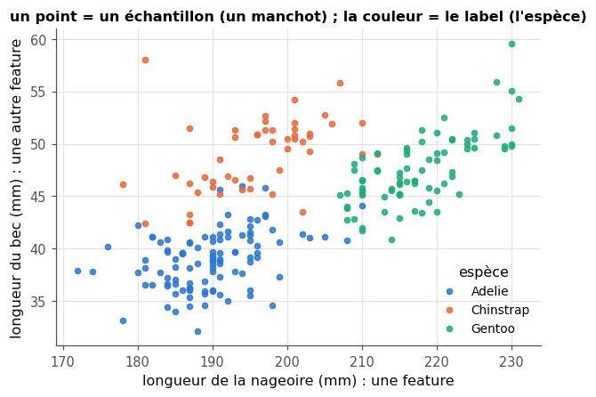
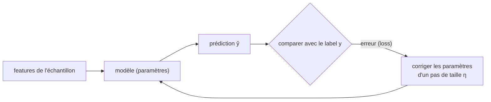
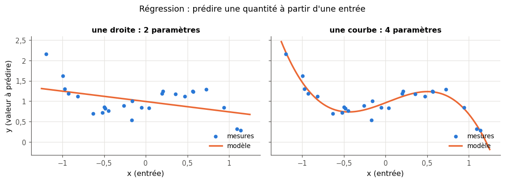
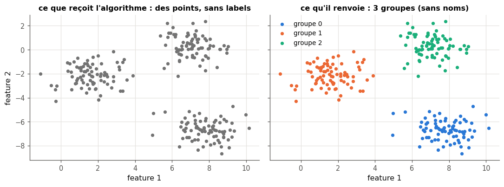
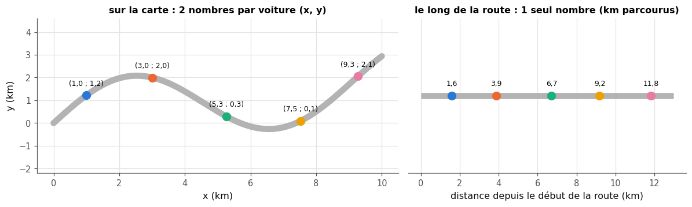
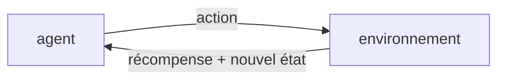
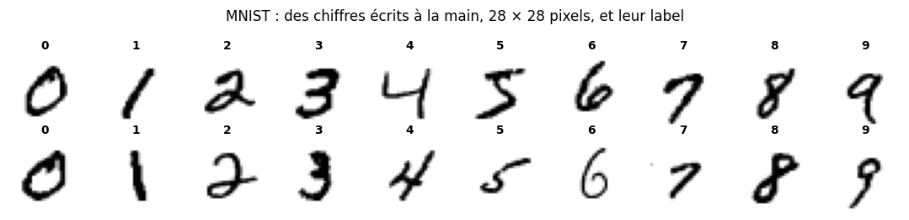
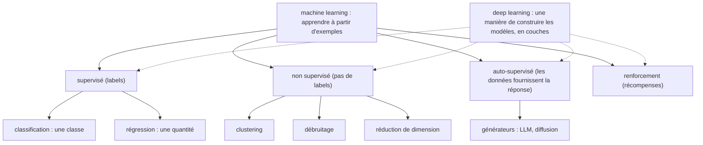

# 1 · Introduction au machine learning et au deep learning — fiche de cours

> Cette fiche accompagne le chapitre 1 du livre. Elle reprend ses idées avec **les données du workbook** (les quatre fils rouges) et d'autres exemples, et les met à jour : en 2018, les modèles de langage comme ChatGPT n'existaient pas encore. Les anecdotes du livre ne sont pas racontées ici : chaque section te dit où les lire.

| | |
|---|---|
| **Livre** | vol. 1, ch. 1 « An Introduction to Machine Learning and Deep Learning », p. 1-45 (§1.1 à §1.8) |
| **Temps total estimé** | ≈ 14 h : lecture du livre et de la fiche ≈ 3,8 h, exercices ≈ 9,5 h, 20 flashcards ≈ 0,7 h |
| **Prérequis** | 0A (Python, pandas, NumPy, matplotlib) et 0B (vecteurs et distances, droites, moyenne mobile, loss) |
| **Fichiers du chapitre** | `02_exercices.md` (quiz, rappels, papier, réflexion, entretien) · `03_notebook.ipynb` · `04_indices.md` · `05_solutions.md` et `05_solutions.ipynb` · `06_mes_reponses.md` · `flashcards.csv` |
| **mylearn** | aucun module : c'est un chapitre de découverte. Ton premier code d'apprentissage (1.16) s'écrit directement dans le notebook. |

## Comment utiliser ce chapitre

Ce chapitre est une **carte** : il présente le vocabulaire et les grandes familles du machine learning, que les chapitres suivants détaillent un par un. Il y a peu de maths, mais beaucoup de mots nouveaux : ce sont eux qu'il faut maîtriser. Chaque mot est défini à sa première apparition, et les plus importants reviennent dans les flashcards.

**Ordre conseillé.**
1. Lis le livre §1.1 à §1.4 et les sections correspondantes de la fiche ; fais les quiz Q1 à Q8 et les rappels R1 à R3.
2. Notebook, parties A et B (1.9 à 1.20) : tu ouvres les fils rouges, tu mets à l'épreuve un programme qui apprend par cœur, tu écris des règles, tu entraînes une droite, tu évalues honnêtement. Fais en parallèle les exercices papier 1.1, 1.2 et 1.4.
3. Lis le livre §1.5 à §1.8 et la fin de la fiche (le panorama 2026) ; fais les quiz Q9 à Q11 et l'exercice papier 1.3.
4. Notebook, parties C et D (1.21 à 1.25), puis les exercices de réflexion (1.5 à 1.8) et l'entretien (E1 à E4).

| Section | Quiz 🧠 et rappels 🔁 | Papier ✏️ et réflexion | Notebook | Entretien 💼 |
|---|---|---|---|---|
| 1.1 Le machine learning, les systèmes experts | Q1, Q2 | 1.5, 1.6, 1.7 | 1.10, 1.11, 1.15 | E1 |
| 1.2 Apprendre à partir d'exemples étiquetés | Q3 à Q6, R1 | 1.1 | 1.9, 1.14, 1.16, 1.17, 1.20 | E1, E2 |
| 1.3 Apprentissage supervisé | Q7, R2, R3 | 1.2, 1.8 | 1.12, 1.18, 1.19, 1.25 | E3 |
| 1.4 Apprentissage non supervisé | Q8 | 1.4 | 1.12, 1.21 | E3 |
| 1.5 Générateurs | Q9, Q11 | | 1.24 | E4 |
| 1.6 Apprentissage par renforcement | Q9 | | 1.22 | E3 |
| 1.7 Deep learning | Q10, Q11 | 1.1, 1.3 | 1.10, 1.23 | E4 |
| 1.8 La suite, les fils rouges | Q11 | | 1.13 | |

**Lire les formules.** Comme dans tout le workbook : $x$ en italique est un nombre, $\mathbf{x}$ en gras un vecteur, $\hat{y}$ (« y chapeau ») une prédiction, $y$ la vraie valeur, $L$ la loss et $\eta$ (« êta ») le learning rate (BIBLE §6).

## Objectifs d'apprentissage

À la fin du chapitre, tu sais :
- **expliquer** la différence entre un programme à règles écrites (système expert) et un modèle appris à partir d'exemples ;
- **employer** correctement le vocabulaire de base : échantillon, feature, label, paramètre, hyperparamètre, loss, learning rate, généralisation ;
- **classer** une tâche en classification, régression, clustering, débruitage, réduction de dimension, génération ou renforcement ;
- **charger et décrire** les quatre fils rouges du workbook, et dire quel type de problème chacun illustre ;
- **coder** une boucle d'entraînement minimale et **observer** l'effet du learning rate ;
- **diagnostiquer** une évaluation faussée (mémorisation, jeu de test vu pendant l'entraînement, fuite de données) ;
- **situer** les LLM, les modèles de diffusion et les foundation models sur la carte du machine learning.

## L'essentiel en 10 lignes

1. Le **machine learning** (*apprentissage automatique*) regroupe les méthodes qui tirent automatiquement une information utile des données : au lieu d'écrire les règles, on les fait **apprendre à partir d'exemples**.
2. Un **système expert** applique des règles écrites à la main ; il cale dès que les cas particuliers se multiplient.
3. Un **dataset** (*jeu de données*) est un tableau : une ligne par **échantillon**, une colonne par **feature** ; en apprentissage supervisé, chaque échantillon a aussi un **label**, la réponse attendue.
4. **Entraîner**, c'est répéter : prédire, mesurer l'erreur (la **loss**), corriger un peu les **paramètres** ; la taille des corrections est le **learning rate**.
5. Le but n'est pas de réussir sur les exemples vus (on peut les apprendre par cœur) mais de **généraliser** : on le mesure sur un **jeu de test** mis de côté, qui ne sert jamais à apprendre.
6. Un **modèle** = une structure + des paramètres appris ; sa **capacité** dit ce qu'il peut représenter ; les **hyperparamètres** (learning rate, taille…) sont choisis par nous.
7. **Supervisé** : **classification** (choisir une catégorie dans une liste connue) ou **régression** (prédire une quantité).
8. **Non supervisé** (sans labels) : **regrouper** (clustering), **débruiter**, **réduire** le nombre de features.
9. Les **générateurs** fabriquent de nouvelles données qui ressemblent aux exemples ; en **renforcement**, un agent apprend par essais et récompenses.
10. Le **deep learning** empile des couches de neurones artificiels qui apprennent leurs propres features ; les LLM et les modèles de diffusion d'aujourd'hui en sont les héritiers.

## 1.1 · Le machine learning : extraire du sens des données ⏩

### 1.1.1 · Des données au sens ⏩

Le **machine learning** (ML) part de **données** de toutes sortes (tu en découvriras quatre avec les fils rouges, plus bas) pour répondre à une question précise : quel chiffre est écrit sur cette image ? de quelle espèce est ce manchot ? La réponse cherchée, c'est l'**information utile**. Trois exemples de ta vie courante :
- ta messagerie range les spams toute seule ;
- ton application photos regroupe les visages de tes proches ;
- ton téléphone transforme ta voix en texte.

Le livre ajoute d'autres usages, du tri du courrier à la physique des particules (§1.1.1). Tous portent sur des volumes qu'aucune équipe humaine ne pourrait traiter à la main.

Les quatre fils rouges du workbook sont de cette nature (voir « Les quatre fils rouges », plus bas) : des chiffres manuscrits (MNIST), des mesures d'animaux (Penguins), des textes (Holmes et Verne), une série de mesures dans le temps (les taches solaires).

Le **deep learning** (*apprentissage profond*) n'est pas un algorithme de plus : c'est une **manière** de construire des modèles de ML, en empilant des couches de calcul (§1.7).

### 1.1.2 · Les systèmes experts et leurs limites ⏩

Avant le ML, l'idée naturelle était d'interroger des spécialistes, puis de **traduire leur savoir en règles** dans un programme : c'est un **système expert** (*expert system*). Choisir à la main les indices qu'un programme doit surveiller s'appelle le **feature engineering** (*ingénierie des features*). Le livre montre comment des règles pour reconnaître le chiffre 7 cèdent au premier 7 barré (§1.1.2).

**Exemple.** Une biologiste résume les manchots en trois règles : « plus de 4 700 g : Gentoo ; sinon, bec de plus de 45 mm : Chinstrap ; sinon : Adélie ». Ses règles sont raisonnables… et pourtant elles se trompent sur des manchots bien réels, que tu identifieras en 1.15. Pour les rattraper, il faudrait une règle de plus, puis une autre pour l'exception suivante, sans fin.

Pourquoi cette approche a calé :
- il manque toujours un cas ;
- une partie du savoir-faire ne se formule pas (comment reconnais-tu le visage d'un ami ?) ;
- les règles ajoutées finissent par se contredire.

Le ML inverse la démarche : on fournit des **exemples avec leur bonne réponse**, et l'algorithme trouve lui-même les régularités. Un **arbre de décision** (un modèle qui pose une suite de questions du type « bec ≤ 40 mm ? », ch. 13) construit ainsi ses règles à partir des manchots, sans qu'on lui en écrive une seule (1.18). En échange, le ML a besoin de **beaucoup d'exemples étiquetés**, et les étiqueter a un coût : tu l'estimeras pour MNIST en 1.5.

## 1.2 · Apprendre à partir d'exemples étiquetés ⏩

Pour faire passer une droite au plus près de points, on a deux moyens : une **formule**, qui donne la réponse en une fois (1.R3, 1.2, ch. 9), ou des **retouches** successives, en partant d'une droite quelconque (1.16). Pour un réseau de millions de paramètres, aucune formule n'existe : il ne reste que les retouches, et c'est la voie du deep learning (§1.2).

### 1.2.1 · Une stratégie d'apprentissage étrange ⏩

Le livre imagine une école où l'on récite toujours les mêmes faits, avec deux tests par semaine : l'un sur ces faits, l'autre sur des questions nouvelles (§1.2.1). Ce qu'il faut en retenir tient en une ligne : **se souvenir** (réussir le premier test) ne prouve rien ; ce qui compte, c'est **généraliser** (réussir le second). Pour un programme, repasser sur les mêmes exemples n'a rien d'absurde : chaque passage, ou **epoch** (voir plus bas, en 1.2.3), sert à ajuster un peu ses réglages.

### 1.2.2 · La version pour ordinateur : échantillons, features, labels ⏩

**Le vocabulaire.** Un **dataset** étiqueté est un tableau :
- chaque ligne est un **échantillon** (*sample*) : une observation (un manchot, une image, un jour) ;
- chaque colonne qui le décrit est une **feature** (*caractéristique*), en général un nombre ;
- la colonne à prédire est le **label** (*étiquette*), fourni au départ par un humain ou par la mesure réelle.

| | bill_length_mm | bill_depth_mm | flipper_length_mm | body_mass_g | **species** (label) |
|---|---|---|---|---|---|
| manchot A | 39,5 | 17,4 | 186 | 3 800 | Adelie |
| manchot B | 40,3 | 18,0 | 195 | 3 250 | Adelie |
| … | … | … | … | … | … |

Sans son label, chaque ligne est un **vecteur** de features (0B) : le manchot A est le vecteur $(39{,}5 ;\ 17{,}4 ;\ 186 ;\ 3\,800)$. Ce qui est feature ou label dépend de la question posée : pour prédire le sexe d'un manchot, c'est la colonne `sex` qui devient le label, et l'espèce une feature parmi d'autres.



**Une étape d'entraînement** (la figure 1.8 du livre). Le modèle reçoit les features d'un échantillon et **prédit** un label $\hat{y}$ ; on **compare** avec le vrai label $y$ ; on **corrige** ses réglages internes, ses **paramètres**, pour qu'il se trompe moins la prochaine fois. On résume l'écart entre $\hat{y}$ et $y$ par un seul nombre, la **loss** (*perte*, 0B ; on trouve aussi **erreur** ou **coût**) : 0 quand $\hat{y} = y$, et d'autant plus grand que $\hat{y}$ s'éloigne de $y$. **Entraîner** (*train*) le modèle, c'est répéter ces étapes sur tous les échantillons du **jeu d'entraînement** (*training set*).



**Le learning rate.** De combien corriger ? Cette taille de pas s'appelle le **learning rate** (*taux d'apprentissage*), noté $\eta$ (0B). Pense au réglage d'une douche :
- tourner le robinet d'un cran à la fois est sûr, mais on grelotte longtemps ;
- le tourner d'un grand coup fait passer du glacé au brûlant, puis l'inverse, sans jamais se stabiliser.

Aucune valeur ne convient à tous les problèmes : on en essaie plusieurs et on compare les courbes de loss (1.17) ; le ch. 19 montre comment faire varier $\eta$ pendant l'entraînement. Le livre prend une autre image : un détecteur de métaux qui guide vers une caisse enterrée (§1.2.2).

**Mini-exemple chiffré : une étape d'entraînement.** Le modèle est une droite $\hat{y} = w\,x + b$, avec deux paramètres $w$ et $b$. La règle de correction utilisée au notebook (1.16, justifiée aux ch. 5 et 19) est :

$$w \leftarrow w + \eta\,(y - \hat{y})\,x \qquad b \leftarrow b + \eta\,(y - \hat{y})$$

Partons de $w = 1$, $b = 0$, avec l'échantillon $x = 2$, $y = 5$. On prédit $\hat{y} = 1 \times 2 + 0 = 2$ ; l'erreur vaut $y - \hat{y} = 3$. Avec $\eta = 0{,}1$ : $w \leftarrow 1 + 0{,}1 \times 3 \times 2 = 1{,}6$ et $b \leftarrow 0 + 0{,}1 \times 3 = 0{,}3$. Nouvelle prédiction : $1{,}6 \times 2 + 0{,}3 = 3{,}5$, plus proche de 5. Avec $\eta = 0{,}5$, on obtiendrait $w = 4$, $b = 1{,}5$ et $\hat{y} = 9{,}5$ : on dépasse largement la cible, c'est le pas trop grand.

**Mémoriser ou généraliser.** Une fois en service, un modèle ne voit que des cas **nouveaux** ; réussir sur eux, c'est **généraliser**. Que vaut alors un programme qui apprend ses exemples par cœur ? Tu prévois son score en 1.14, avant de le mesurer.

### 1.2.3 · Généraliser : le jeu de test ⏩

Dès le départ, on **met de côté** une partie des échantillons étiquetés : le **jeu de test** (*test set*). Le modèle ne le voit jamais pendant l'entraînement. À la fin, on lui fait prédire les labels du jeu de test et on compare avec les vrais : c'est la mesure de la généralisation. Pendant cette évaluation, **rien n'est appris** : les paramètres ne bougent pas.

Pour un **classifieur** (*classifier*), un modèle qui range chaque échantillon dans une **classe** (*catégorie*) parmi une liste, la mesure la plus simple est l'**accuracy** (*taux de bonnes réponses* ; le mot reste en anglais, BIBLE §5) :

$$\text{accuracy} = \frac{\text{nombre de prédictions correctes}}{\text{nombre total d'échantillons}} \qquad \text{taux d'erreur} = 1 - \text{accuracy}$$

**Mini-exemple.** Sur 50 photos de test, un classifieur en reconnaît 47 : accuracy $= 47/50 = 0{,}94$, soit 94 %, et taux d'erreur de 6 %. S'il avait été entraîné sur ces mêmes 50 photos, ce 94 % ne voudrait plus rien dire.

L'entraînement, lui, repasse de nombreuses fois sur tout le jeu d'entraînement, souvent dans un ordre tiré au hasard à chaque tour. Un passage complet s'appelle une **epoch** (*époque*).

> ⚠️ **Piège classique — le test qui sert à régler le modèle** — Si le jeu de test sert, d'une manière ou d'une autre, à entraîner ou à régler le modèle, son score devient optimiste et ne mesure plus la généralisation : à force de retoucher le modèle jusqu'à ce que le test soit bon, on finit par « apprendre » le test. C'est pourtant la boucle que décrit le livre en §1.2.3 (tester, réentraîner, retester) : une simplification. Au ch. 8 (§8.4), il met de côté un troisième jeu, le **jeu de validation** (*validation set*), qui sert à comparer des modèles et à régler les hyperparamètres, et le jeu de test ne sert alors **qu'une fois**, à la toute fin. Même piège quand une feature contient, sous une autre forme, la réponse elle-même. Dans les deux cas, une information interdite s'est glissée dans l'entraînement : c'est une **fuite de données** (*data leakage*, ch. 8 et 12). Un score trop beau doit toujours éveiller le soupçon (1.20).

### 1.2.4 · Modèle, paramètres, capacité, hyperparamètres ⏩

Apprendre suppose un **lien** entre les features et le label : la longueur de la nageoire renseigne sur l'espèce d'un manchot, le numéro de sa bague, non. Sans lien réel, un modèle peut tout au plus apprendre ses exemples par cœur ; s'il existe, c'est le jeu de test qui dira si l'entraînement l'a trouvé.

- Un **modèle**, c'est une **architecture** (la forme des calculs : une droite, un arbre, un réseau), choisie par nous, **plus** les valeurs de ses paramètres, trouvées par l'entraînement.
- Les **paramètres** sont les nombres que l'algorithme ajuste **lui-même** pendant l'entraînement : $w$ et $b$ pour une droite, les seuils d'un arbre de décision, les poids d'un réseau de neurones.
- La **capacité** (*capacity*) mesure la richesse de ce qu'un modèle peut représenter. Une droite ne suivra jamais une courbe en S ; un modèle avec plus de paramètres le peut. Plus de capacité coûte plus de calcul et de mémoire, et peut même nuire, en permettant d'apprendre par cœur (ch. 9). Le livre l'illustre par un vocabulaire trop pauvre pour décrire un véhicule d'un nouveau genre (§1.2.4).
- Les **hyperparamètres** sont les réglages que **nous** fixons avant l'entraînement : le learning rate, le nombre d'epochs, la taille du modèle, la profondeur maximale d'un arbre (`max_depth`, 1.18).

Quand le modèle est jugé assez bon, on le **déploie** (*deploy*) : on le met en service pour de vrais utilisateurs.

**Mini-exemple.** Dans `DecisionTreeClassifier(max_depth=2)`, `max_depth=2` est un hyperparamètre (choisi par toi) ; après l'entraînement, les questions de l'arbre et leurs seuils (du type « bec ≤ 40 mm ? ») sont des paramètres (appris).

## 1.3 · Apprentissage supervisé

Quand chaque échantillon d'entraînement a un label, on parle d'**apprentissage supervisé** (*supervised learning*) : les labels jouent le rôle d'un professeur qui dit au modèle s'il a eu juste. Deux grandes tâches en relèvent.

### 1.3.1 · Classification ⏩

La **classification** consiste à ranger chaque échantillon dans une **classe** d'une liste connue à l'avance : l'espèce d'un manchot, le chiffre d'une image, spam ou non. La liste des classes est celle des labels vus à l'entraînement.

Conséquence importante : un classifieur **ne sait répondre qu'avec les classes qu'il a apprises**. Montre-lui un objet d'une catégorie inconnue : il répondra quand même l'une des classes connues, et souvent avec aplomb (la figure 1.10 du livre en montre des exemples). Dans le notebook, tu prévois ce que répond un arbre de décision face à un manchot d'une espèce qu'il n'a jamais vue (1.19).

### 1.3.2 · Régression

La **régression** consiste à prédire une **quantité** : combler une valeur manquante dans une série de mesures, prévoir la suivante (la fréquentation d'un concert, les taches solaires du mois prochain, le prix d'un logement). Le modèle le plus simple est une **droite** : c'est la **régression linéaire** (ch. 9). Une **courbe** colle mieux aux points, mais elle a plus de paramètres et risque de suivre le bruit plutôt que la tendance.



**D'où vient le mot « régression » ?** En 1886, Francis Galton compare la taille d'enfants devenus adultes à celle de leurs parents. Les enfants de parents très grands sont grands, mais en moyenne **moins** que leurs parents ; ceux de parents très petits sont petits, mais moins petits qu'eux. Il appelle cela une « régression vers la médiocrité », c'est-à-dire vers la moyenne ; on dit aujourd'hui **régression vers la moyenne**. Le mot est resté pour toutes les méthodes qui prédisent une quantité (tu liras l'article en 1.8 ; le livre raconte aussi un précédent, §1.3.2).

**Mini-exemple.** Un bar a servi 180 cafés le lundi (jour 1) et 240 le vendredi (jour 5). La droite qui passe par ces deux points monte de $\frac{240 - 180}{5 - 1} = 15$ cafés par jour ; elle prévoit $240 + 15 = 255$ cafés le samedi. Prévoir, c'est prolonger une tendance ; tout l'art est de choisir la bonne (0B, 1.2).

## 1.4 · Apprentissage non supervisé

Sans labels, un algorithme peut encore découvrir une structure dans les données : c'est l'**apprentissage non supervisé** (*unsupervised learning*). Personne ne lui dit s'il a juste. Trois tâches typiques :

### 1.4.1 · Clustering

Le **clustering** (*partitionnement*, regroupement) forme des **groupes** d'échantillons qui se ressemblent : des clients aux habitudes d'achat proches, des chansons du même style, des articles qui parlent du même sujet. Les groupes n'ont **pas de nom** : c'est à l'humain de dire ce qu'ils signifient. Et « se ressembler » dépend de la façon de mesurer la distance entre échantillons, donc des unités des features (1.R1, 1.21). Le livre prend l'exemple d'une archéologue et de motifs de poteries (§1.4.1).



### 1.4.2 · Débruitage

Les mesures réelles sont **bruitées** : grain d'une photo prise de nuit, souffle d'un vieil enregistrement, capteur imprécis, valeurs manquantes. Un algorithme de **débruitage** (*denoising*) apprend à quoi ressemblent des données propres, pour séparer dans chaque échantillon le signal du bruit. Dans le notebook, une moyenne mobile (0B) lisse la série très irrégulière des taches solaires et fait apparaître un cycle (1.12) : c'est le plus simple des débruitages. Une valeur manquante peut aussi se reconstituer par régression (1.2). Le livre montre une photo abîmée puis restaurée (§1.4.2).

### 1.4.3 · Réduction de dimension

Chaque feature est une **dimension** de l'échantillon, et il y en a souvent plus que nécessaire :
- une feature **constante** n'apporte rien : sur les 784 pixels des images d'entraînement de MNIST, 67 valent 0 sur **toutes** les images (sur les bords : presque toute la rangée du haut et les coins, jamais encrés) ;
- deux features **redondantes** disent la même chose : une température notée en degrés Celsius, puis en degrés Fahrenheit ;
- des données peuvent être **plus simples qu'elles n'en ont l'air** : sur une route à une seule voie, la position d'une voiture tient en **un** nombre (la distance parcourue depuis le début de la route) au lieu de deux (ses coordonnées sur la carte). C'est l'exemple du livre (§1.4.3), repris dans la figure et en 1.4.



La **réduction de dimension** (*dimensionality reduction*) remplace les features par un plus petit nombre de features qui gardent l'essentiel. Sur la route à une voie, on ne perd rien ; sur une route à deux voies, la position le long de la route ne dit plus l'écart entre la voiture et l'axe (1.4 g). Moins de features, c'est aussi moins de calcul (ch. 12).

## 1.5 · Générateurs

Un **générateur** apprend, à partir d'exemples, à fabriquer de **nouvelles** données qui leur ressemblent sans les recopier : des visages qui n'existent pas, des textes, des musiques. On parle de **génération de données**. Un générateur n'a pas besoin de labels, mais il reçoit un retour sur la qualité de ce qu'il produit ; le livre le place donc entre supervisé et non supervisé, sous le nom de « semi-supervisé » (§1.5, avec l'exemple des tapis d'un décor de film). Ce classement a vieilli, et le mot avait déjà un autre sens en 2018 (encadré ci-dessous).

**Mini-exemple** (1.24). Compter, dans un roman, quel caractère suit chaque caractère, puis écrire un faux texte en tirant chaque caractère suivant au hasard selon ces comptes : on obtient du « faux Holmes » qui a l'allure de l'anglais sans en avoir le sens. Les grands modèles de langage font la même chose, en immensément plus grand.

> 🕰️ **Mise à jour (2026) — les familles d'apprentissage** — **Le livre :** trois familles (supervisé, non supervisé, renforcement), et les générateurs rangés dans un entre-deux baptisé « semi-supervisé ». · **Aujourd'hui :**
> - la case majeure est l'**apprentissage auto-supervisé** (*self-supervised learning*) : les données fournissent elles-mêmes les réponses, en masquant un morceau de l'entrée (un mot, une zone d'image) ou en prédisant la suite d'un texte ; c'est ainsi que sont **pré-entraînés** (un premier entraînement, long et général) tous les grands modèles de langage ;
> - « semi-supervisé » désigne en général autre chose, et c'était déjà le cas en 2018 : apprendre avec **peu** d'exemples étiquetés et **beaucoup** d'exemples non étiquetés ;
> - le renforcement sert aussi à **aligner** les modèles de langage sur des préférences humaines (RLHF, *reinforcement learning from human feedback* : apprendre à partir de réponses notées par des humains ; puis des variantes plus simples comme DPO).
>
> **Faut-il quand même l'apprendre ?** Oui : les trois familles du livre restent la base ; ajoute simplement la case « auto-supervisé ». · *Sources :* Y. LeCun et I. Misra, « [Self-supervised learning: The dark matter of intelligence](https://ai.meta.com/blog/self-supervised-learning-the-dark-matter-of-intelligence/) », Meta AI, 2021 ; L. Ouyang et coll., « [Training language models to follow instructions with human feedback](https://arxiv.org/abs/2203.02155) », 2022 ; R. Rafailov et coll., « [Direct Preference Optimization](https://arxiv.org/abs/2305.18290) », 2023.

## 1.6 · Apprentissage par renforcement

Imagine un robot aspirateur qui découvre ton appartement : personne ne lui montre le bon trajet, mais il sait s'il a bien nettoyé, s'il s'est cogné, si sa batterie s'est vidée en route. Il apprend par **essais et retours**, sans jamais recevoir « la bonne réponse ». C'est l'**apprentissage par renforcement** (*reinforcement learning*, RL). Le livre raconte l'histoire d'un baby-sitter qui cherche ce qu'une enfant veut bien manger (§1.6) : tu la simuleras en 1.22.

Le vocabulaire :
- l'**agent** décide et agit (le robot) ;
- l'**environnement** est tout le reste (l'appartement, les meubles, le chat) ;
- à chaque pas, l'agent choisit une **action** ; l'environnement change éventuellement d'**état** et renvoie une **récompense** (*reward*) : un nombre, positif si l'action était bonne, négatif si elle était mauvaise.



**Différence avec le supervisé** : aucun label ne dit ce qu'il fallait faire ; seulement une évaluation de ce qui a été fait, parfois bien plus tard (une partie gagnée après cent coups). Il faut donc aussi **explorer** : essayer de temps en temps autre chose que ce qui a marché jusqu'ici (1.22). Autres exemples : un programme qui apprend à jouer au go, une voiture autonome, le réglage d'un chauffage selon les réactions des occupants.

## 1.7 · Deep learning ⏩

Le **deep learning** construit un modèle en **couches** (*layers*) successives de **neurones artificiels** (*artificial neurons*). Prends le réseau que tu entraîneras sur MNIST (1.23) : les 784 pixels d'une image entrent dans une couche de 128 neurones ; chacun calcule une somme pondérée de ces 784 nombres (0B), la passe dans une fonction (ch. 10) et produit un seul nombre. Ces 128 nombres alimentent la couche de sortie : 10 neurones, un par chiffre ; celui qui sort le plus grand nombre désigne la réponse. Empiler beaucoup de couches donne un réseau « profond » ; la figure 1.21 du livre en montre un tout petit.

**Compter les connexions.** Dans une couche **pleine** (*dense*), chaque neurone reçoit **toutes** les sorties de la couche précédente : entre une couche de $n$ valeurs et une couche de $m$ neurones, il y a $n \times m$ connexions, chacune avec son **poids** (un paramètre) ; chaque neurone a en plus un **biais** (0B). Un réseau 3 → 4 → 2 a donc $3 \times 4 + 4 \times 2 = 20$ poids et $4 + 2 = 6$ biais : 26 paramètres. Tu compteras ceux du réseau du livre et d'un réseau pour MNIST en 1.3, puis tu les retrouveras dans scikit-learn (1.23).

**Un réseau se trompe en silence.** Une faute de frappe fait planter un programme, avec un message d'erreur ; un mauvais réglage, lui, ne déclenche aucune alerte : l'entraînement va jusqu'au bout, et seule la courbe de loss (1.16, 1.17), qui stagne ou s'envole, trahit le problème.

**Le feature learning.** La grande force du deep learning : il **apprend lui-même ses features** (*feature learning*). Plus besoin d'écrire « un 7 a un trait horizontal en haut » : les premières couches découvrent des traits et des courbes, les suivantes des combinaisons de traits, et ainsi de suite. C'est la réponse au problème des systèmes experts (§1.1.2).

**Sur MNIST**, le petit réseau du livre reconnaît 9 905 chiffres sur 10 000 (§1.7) ; en 2018, les meilleurs dépassaient déjà 99 %.



> 🕰️ **Mise à jour (2026) — MNIST aujourd'hui** — **Le livre :** plus de 99 % d'accuracy sur MNIST, 9 905 sur 10 000 pour son petit réseau. · **Aujourd'hui :**
> - MNIST est considéré comme **résolu** : dès 2012, un ensemble de réseaux convolutifs y faisait 0,23 % d'erreur (99,77 %), proche des humains ;
> - les créateurs de Fashion-MNIST l'ont jugé trop facile et trop utilisé pour comparer des méthodes ; on compare aujourd'hui les modèles sur des **benchmarks** (*jeux de test de référence*) plus durs : Fashion-MNIST, CIFAR, ImageNet et au-delà ;
> - la page d'origine de MNIST n'est plus accessible de façon fiable : on le charge par des copies (torchvision, Hugging Face, ou `data/mnist.npz` dans le workbook).
>
> **Faut-il quand même l'apprendre ?** Oui : c'est le terrain d'apprentissage idéal (petit, rapide, visuel) ; mais un bon score sur MNIST ne prouve presque rien. · *Sources :* D. Cireşan, U. Meier, J. Schmidhuber, « [Multi-column Deep Neural Networks for Image Classification](https://arxiv.org/abs/1202.2745) », CVPR 2012 ; H. Xiao, K. Rasul, R. Vollgraf, « [Fashion-MNIST](https://arxiv.org/abs/1708.07747) », 2017, et [la section « Why we made Fashion-MNIST »](https://github.com/zalandoresearch/fashion-mnist) ; data card `data/cards/mnist.md`.

**Le matériel.** Les gros réseaux ont des millions, aujourd'hui des milliards, de paramètres ; leur entraînement enchaîne des produits de matrices (0B). Le **GPU** (*Graphics Processing Unit*, processeur graphique), conçu pour afficher des jeux vidéo, fait ce type de calcul très vite, des milliers **en parallèle** ; le **CPU** (*Central Processing Unit*) est le processeur principal, polyvalent mais moins parallèle.

> 🕰️ **Mise à jour (2026) — le matériel** — **Le livre :** le GPU accélère l'entraînement, et des puces dédiées au deep learning « commencent à apparaître ». · **Aujourd'hui :**
> - elles sont partout : GPU de centres de données, **TPU** de Google (dans le cloud), **NPU** (*Neural Processing Unit*) dans les ordinateurs portables et les téléphones, pour faire tourner des modèles localement ; Microsoft exige par exemple un NPU d'au moins 40 000 milliards d'opérations par seconde pour ses PC « Copilot+ » ;
> - côté workbook : Colab offre un GPU gratuit, mais **ni garanti ni illimité** ; tous les notebooks tournent donc aussi sur CPU en `FAST_MODE`, et les cellules qui gagnent vraiment à avoir un GPU sont marquées 🚀.
>
> **Faut-il quand même l'apprendre ?** Oui : comprendre pourquoi le deep learning a besoin d'accélérateurs aide à estimer coûts et temps de calcul (🧮, dès le ch. 16). · *Sources :* [FAQ de Google Colab](https://research.google.com/colaboratory/faq.html) ; [Google Cloud TPU](https://cloud.google.com/tpu) ; [Microsoft Learn, « NPU devices »](https://learn.microsoft.com/en-us/windows/ai/npu-devices/).

Le deep learning n'est pas toujours le meilleur choix : sur un petit tableau comme celui des manchots, un arbre de décision (ch. 13) ou une forêt aléatoire (ch. 14) fait souvent aussi bien qu'un réseau, plus vite, et un arbre se lit d'un coup d'œil ; le deep learning s'impose surtout pour les images, le son et le texte.

## 1.8 · La suite du livre… et du workbook

Le livre avance ainsi (§1.8) : les bases communes à tout le ML (probabilités, statistiques, théorie de l'information), les premiers réseaux et leur entraînement, avec scikit-learn, puis le deep learning et ses grandes familles de réseaux, et enfin la pratique avec Keras. Le workbook suit le même chemin, avec quelques différences : deux chapitres de prérequis (0A, 0B), la pratique du deep learning en **PyTorch** (ch. 20, 23 et 24), et des chapitres bonus sur ce qui est apparu depuis 2018 (Transformers, LLM, diffusion…).

> 🕰️ **Mise à jour (2026) — les bibliothèques** — **Le livre :** scikit-learn pour le ML classique, puis Keras (dans sa version de 2018, adossée à TensorFlow 1) pour le deep learning. · **Aujourd'hui :** scikit-learn reste la référence du ML classique ; en deep learning, le workbook utilise **PyTorch**, très répandu en recherche comme en entreprise. Keras existe toujours : Keras 3 est une réécriture **multi-backend** qui tourne au-dessus de JAX, TensorFlow ou PyTorch (et d'OpenVINO pour l'inférence) ; le code Keras du livre ne tourne plus tel quel. · **Faut-il quand même l'apprendre ?** scikit-learn, oui, dès ce chapitre en boîte noire ; Keras, pas besoin : les ch. 23 et 24 donnent les équivalents PyTorch. · *Sources :* [keras.io, « Introducing Keras 3.0 »](https://keras.io/keras_3/) ; BIBLE §4 et §21.

## Les quatre fils rouges du workbook

Quatre familles de données reviennent dans tout le workbook. Tu les ouvres dans la partie A du notebook ; chacune a sa **data card** (*fiche de données*) dans `data/cards/`, à lire avant de t'en servir (1.13).

| Fil rouge | Contenu | Chargement | Type de problème | Au ch. 1 |
|---|---|---|---|---|
| **Penguins** | des manchots de 3 espèces : 4 mesures, île, sexe, année | `wb.datasets.load_penguins()` | classification (l'espèce), régression (la masse), clustering | 1.9, 1.14, 1.15, 1.18 à 1.21, 1.25 |
| **MNIST** | 70 000 chiffres manuscrits en niveaux de gris | `wb.datasets.load_mnist()` | classification d'images | 1.10, 1.23 |
| **Holmes et Verne** | deux romans du domaine public, en anglais et en français | `wb.datasets.load_holmes()`, `load_verne()` | texte : langue, auteur, génération | 1.11, 1.24 |
| **Taches solaires** | nombre mensuel de taches solaires depuis 1749 | `wb.datasets.load_sunspots()` | série temporelle : débruitage, prévision (régression) | 1.12 |

S'y ajoutent des **données synthétiques** (`wb.synth`), fabriquées à la demande pour des expériences contrôlées (la droite de 1.16), et des environnements de renforcement (ch. 26).

> 🧮 **Rappel outil — scikit-learn en boîte noire** — Plusieurs exercices utilisent déjà des modèles de scikit-learn (un arbre de décision, k-means, un réseau de neurones), expliqués en détail plus tard (ch. 7, 13, 15 et 16). Ils ont tous la même interface, en trois lignes :
> ```python
> model = DecisionTreeClassifier(max_depth=2)   # 1. créer le modèle : les hyperparamètres
> model.fit(X_train, y_train)                   # 2. entraîner : apprendre les paramètres
> y_pred = model.predict(X_new)                 # 3. prédire pour de nouveaux échantillons
> ```
> `X_train` est le tableau des features (une ligne par échantillon), `y_train` les labels ; `model.score(X_test, y_test)` donne directement l'accuracy d'un classifieur. Pour un algorithme non supervisé, `fit` ne reçoit que `X` (pas de labels) et `fit_predict(X)` renvoie les groupes. Les attributs appris portent un tiret bas final : `model.tree_`, `model.coefs_`.

## Panorama 2026 : où en est l'IA ?

En 2018, le deep learning, c'était surtout des réseaux convolutifs pour les images et des réseaux récurrents pour les séquences ; les générateurs, notamment les GAN (ch. 27), étaient un sujet de recherche en plein essor, encore loin des usages grand public d'aujourd'hui. Tout ce que tu apprends dans ce chapitre reste vrai, mais le paysage a changé d'échelle.

> 🕰️ **Mise à jour (2026) — les architectures et les modèles génératifs** — **Le livre :** réseaux convolutifs de type VGG pour les images (le réseau à 16 couches de ses figures 1.10 et 1.22), réseaux récurrents pour les séquences, Keras ; les générateurs (les GAN, ch. 27), un sujet de recherche en plein essor. · **Aujourd'hui :**
> - l'architecture **Transformer** (2017, une architecture de réseau fondée sur un mécanisme d'« attention », bonus B3) s'est imposée partout ;
> - les **grands modèles de langage** (*large language models*, LLM) comme GPT, Claude, Gemini, Llama ou Mistral sont **pré-entraînés** à prédire le **token** (*jeton*) suivant (un morceau de texte : un mot, un bout de mot, une ponctuation) sur d'immenses quantités de texte (auto-supervisé), puis **alignés** sur des préférences humaines ; depuis 2024, des modèles « de raisonnement » sont en plus entraînés par **renforcement** sur des tâches dont la réponse se vérifie automatiquement (mathématiques, code), ch. 11 ; ChatGPT, lancé le 30 novembre 2022, les a fait connaître du grand public ;
> - les **modèles de diffusion** génèrent images, vidéos et sons (Stable Diffusion, 2022) ;
> - on appelle **foundation models** (*modèles de fondation*) ces modèles géants entraînés une fois sur des données très variées, puis réutilisés pour mille tâches : par simple **prompting** (en leur écrivant une consigne, le *prompt*), en leur donnant des documents à consulter (**RAG**, *retrieval-augmented generation*), ou par un **fine-tuning** (*réglage fin*) léger, qui réentraîne un peu le modèle sur une nouvelle tâche (par exemple avec la méthode **LoRA**) ;
> - selon l'AI Index 2026 de Stanford, l'industrie a produit plus de 90 % des modèles d'IA marquants de 2025.
>
> **Faut-il quand même l'apprendre ?** Oui : un LLM est un réseau de neurones profond, entraîné par une boucle « prédire, mesurer l'erreur, corriger » sur des échantillons, avec une loss et un learning rate, et on vérifie qu'il généralise. Le socle de ce chapitre est exactement le sien ; les chapitres bonus B2 à B5 y mènent. · *Sources :* A. Vaswani et coll., « [Attention Is All You Need](https://arxiv.org/abs/1706.03762) », 2017 ; R. Bommasani et coll., « [On the Opportunities and Risks of Foundation Models](https://arxiv.org/abs/2108.07258) », 2021 ; OpenAI, « [Introducing ChatGPT](https://openai.com/index/chatgpt/) », 2022 ; R. Rombach et coll., « [High-Resolution Image Synthesis with Latent Diffusion Models](https://arxiv.org/abs/2112.10752) », CVPR 2022 ; [Stanford HAI, AI Index Report 2026](https://hai.stanford.edu/ai-index/2026-ai-index-report).

Où ranger ces systèmes sur la carte du chapitre ? Un LLM est un **modèle génératif** (§1.5) construit par **deep learning** (§1.7), pré-entraîné de façon **auto-supervisée**, puis ajusté avec du supervisé et du **renforcement** ; un modèle de diffusion est lui aussi un générateur profond (Q11, E4).



> ⚖️ **Reconnaissance faciale : une application encadrée** — Le livre cite la reconnaissance des visages sur les réseaux sociaux comme une application parmi d'autres (§1.1.1). En Europe, c'est aujourd'hui l'un des usages les plus encadrés :
>
> > 🕰️ **Mise à jour (2026) — la reconnaissance faciale encadrée** — **Le livre :** une application comme une autre. · **Aujourd'hui :**
> > - le RGPD range les **données biométriques** qui servent à identifier une personne parmi les données sensibles, dont le traitement est interdit sauf exceptions, comme un consentement explicite (article 9) ;
> > - l'**AI Act** européen (règlement (UE) 2024/1689) interdit depuis le **2 février 2025** plusieurs pratiques (article 5) : constituer des bases de reconnaissance faciale en **moissonnant** sans cible des visages sur Internet ou dans des vidéos de surveillance ; reconnaître les **émotions** au travail ou à l'école (sauf raisons médicales ou de sécurité) ; déduire d'une donnée biométrique l'origine, les opinions, la religion ou l'orientation sexuelle ; et, sauf exceptions strictes, l'**identification biométrique à distance en temps réel** dans l'espace public par les forces de l'ordre ; en 2026, un règlement « omnibus » a repoussé au 2 décembre 2027 les obligations des systèmes à haut risque (dont l'identification biométrique à distance hors cas interdits), sans toucher à ces interdictions ;
> > - la société Clearview AI, qui avait constitué une base de visages moissonnés sur le web, a été sanctionnée de 20 millions d'euros par la CNIL (2022) et de 30,5 millions par l'autorité néerlandaise de protection des données (2024).
> >
> > **Faut-il quand même l'apprendre ?** Oui : un professionnel du ML doit savoir si ce qu'on lui demande de construire est légal, pas seulement si c'est faisable (⚖️ 1.7). Le texte évolue : consulte toujours sa version consolidée. · *Sources :* [règlement (UE) 2024/1689 sur EUR-Lex](https://eur-lex.europa.eu/eli/reg/2024/1689/oj) ; [« EU Digital Omnibus on AI enters into force », National Law Review, 2026](https://natlawreview.com/article/eu-digital-omnibus-ai-enters-force) ; [RGPD, EUR-Lex](https://eur-lex.europa.eu/eli/reg/2016/679/oj/eng) ; CNIL, « [Biométrie](https://www.cnil.fr/fr/biometrie) » ; [délibération CNIL SAN-2022-019 (Clearview AI), Légifrance](https://www.legifrance.gouv.fr/cnil/id/CNILTEXT000046444859) ; [Autoriteit Persoonsgegevens, 2024](https://www.autoriteitpersoonsgegevens.nl/en/current/dutch-dpa-imposes-a-fine-on-clearview-because-of-illegal-data-collection-for-facial-recognition).

## Les pièges classiques ⚠️ (récapitulatif)

| Piège | Exemple | Ce qu'il faut faire |
|---|---|---|
| juger un modèle sur ses données d'entraînement | « parfait sur mes exemples, donc parfait » | mesurer sur un jeu de test **jamais vu** |
| laisser le jeu de test influencer l'entraînement ou les réglages | retoucher le modèle jusqu'à ce que le score de test soit bon | mettre le test de côté **avant** tout ; régler sur un jeu de validation ; regarder le test une seule fois, à la fin |
| une feature qui contient la réponse (une **fuite de données**) | une colonne dérivée du label, ou une information connue seulement après coup | pour chaque feature : l'aurai-je vraiment au moment de prédire ? |
| confondre paramètre et hyperparamètre | « le learning rate est appris » | appris par l'algorithme : paramètre ; choisi par nous : hyperparamètre |
| croire qu'un classifieur sait dire « je ne sais pas » | un modèle de chats et de chiens face à une voiture | il répond toujours une classe connue |
| confondre classification et régression | traiter un code postal comme une quantité parce qu'il s'écrit avec des chiffres | une catégorie à choisir : classification ; une quantité qui se mesure : régression (Q7) |
| un learning rate au hasard | $\eta = 1$ « pour aller vite » | l'essayer sur une petite plage de valeurs et regarder la loss (1.17) |
| comparer des features d'unités différentes | des grammes et des millimètres dans une même distance | mettre les features à la même échelle (0A.52, ch. 12) |
| prendre un bon score sur MNIST pour une preuve | « 97 % sur MNIST, mon modèle est excellent » | MNIST est résolu ; comparer à une référence simple et sur un benchmark plus dur |

## Liens avec les autres chapitres 🔗

- **0A et 0B** : pandas pour les tableaux de données, NumPy pour les images, les vecteurs et les distances (1.R1, 1.11, 1.21), la droite (1.R3, 1.2, 1.16), la moyenne mobile (1.12), la loss et le learning rate.
- **Ch. 2 à 4** : hasard, statistiques et probabilités, pour décrire les données et mesurer la qualité d'un modèle (l'accuracy et ses limites au ch. 3).
- **Ch. 5 et 18-19** : pourquoi la règle de correction de 1.16 marche (la dérivée, la descente de gradient) et comment on l'étend à des millions de paramètres (la rétropropagation, les optimiseurs).
- **Ch. 7, 8 et 9** : le clustering (k-means), le découpage entraînement, validation et test, la validation croisée, et l'overfitting (*surapprentissage*) quand un modèle apprend trop bien son entraînement.
- **Ch. 10 et 16-17** : les neurones et les couches de la §1.7 ; **ch. 11** : le cuisinier de 1.22 devient un vrai « bandit » ; **ch. 13** : les arbres de décision de 1.18.
- **Ch. 21-22 et 25-28** : réseaux convolutifs, récurrents, autoencodeurs (débruitage), renforcement, GAN ; **bonus B2 à B5** : tokens, Transformers, LLM et diffusion.

## Guide de lecture et de travail

**Lecture du livre.** Lis le chapitre 1 dans l'ordre, avec la fiche à côté : chaque section de la fiche porte le numéro de la section du livre, et te dit quelle anecdote du livre l'illustre. Les figures du livre sont surtout des schémas et des photos ; celles de la fiche sont calculées sur nos données. Les sections marquées ⏩ sont celles du **parcours rapide** (§1.1, §1.1.1, §1.1.2, §1.2 à §1.2.4, §1.3.1 et §1.7, environ 2,5 h avec la fiche entière) ; les autres parcours lisent tout le chapitre.

**Travail.** Pour chaque bloc de sections :
1. **Lis** le livre et la fiche ; refais les mini-exemples chiffrés sur papier.
2. Fais le **quiz** 🧠 correspondant, sans la fiche, puis corrige-le avec `05_solutions.md`.
3. Fais les exercices **papier** ✏️ dans `mon_travail/ch01_introduction/06_mes_reponses.md`, et vérifie-les dans la partie 0 du notebook.
4. Passe au **notebook** (ta copie : `python tools/start_chapter.py 1`).
5. En fin de journée : 10 minutes de **flashcards**, et une ligne dans ton journal.

**Parcours rapide.** La fiche entière et les sections ⏩ du livre ; les quiz, les rappels, 1.1, le machine learning en cinq lignes (1.6), la reconnaissance faciale (1.7) ; dans le notebook : les fils rouges Penguins, MNIST, Holmes et Verne (1.9 à 1.11), mémoriser n'est pas apprendre (1.14), la boucle d'entraînement (1.16), l'arbre de décision (1.18), le réseau sur MNIST (1.23), et les quatre questions d'entretien. **Parcours maths** : les rappels 1.R1 et 1.R3, les exercices papier 1.1 à 1.4, l'estimation 1.5, et dans le notebook les textes devenus nombres (1.11) et la boucle d'entraînement (1.16). **Parcours code** : le rappel 1.R2 et tout le notebook. La liste exacte est dans `docs/PARCOURS.md`.

**Si tu bloques** : règle des 15 minutes, puis les indices de `04_indices.md`, un niveau à la fois.

## Pour aller plus loin

- Google, [*Machine Learning Crash Course*](https://developers.google.com/machine-learning/crash-course) : un cours gratuit et progressif, avec des exercices interactifs, qui reprend ce vocabulaire (en anglais).
- 3Blue1Brown, [*Neural networks*](https://www.youtube.com/playlist?list=PLZHQObOWTQDNU6R1_67000Dx_ZCJB-3pi) : des vidéos très visuelles sur ce qu'est un réseau de neurones et comment il apprend, sur l'exemple des chiffres manuscrits (sous-titres disponibles).
- Université d'Helsinki, [*Elements of AI*](https://course.elementsofai.com/fr/) : une introduction gratuite à l'IA pour les non-spécialistes, disponible en français, pour prendre du recul sur ce qu'est (et n'est pas) l'IA.
- Stanford HAI, [*AI Index Report 2026*](https://hai.stanford.edu/ai-index/2026-ai-index-report) : l'état des lieux annuel de l'IA (modèles, coûts, usages, réglementation), pour suivre le panorama au-delà de 2026.
