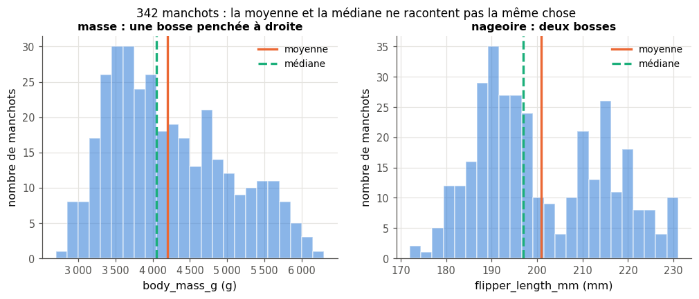
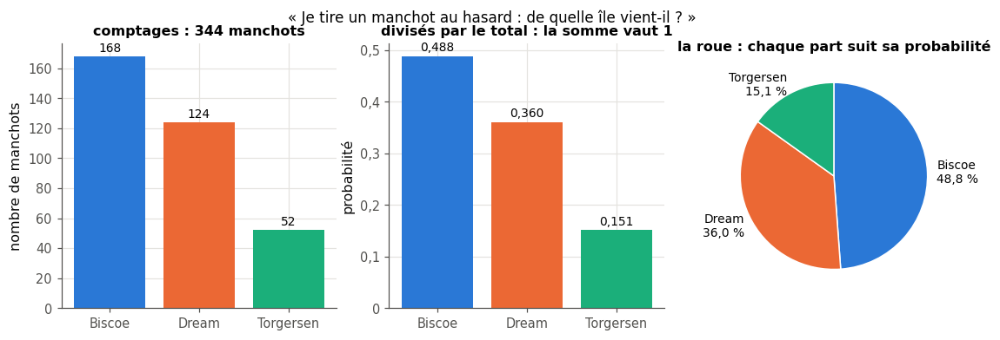
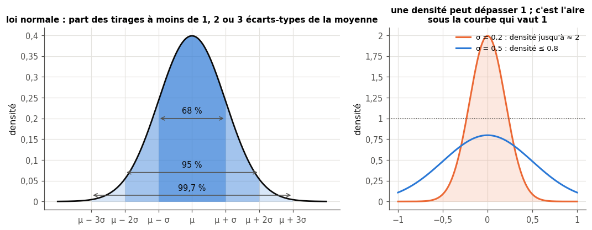
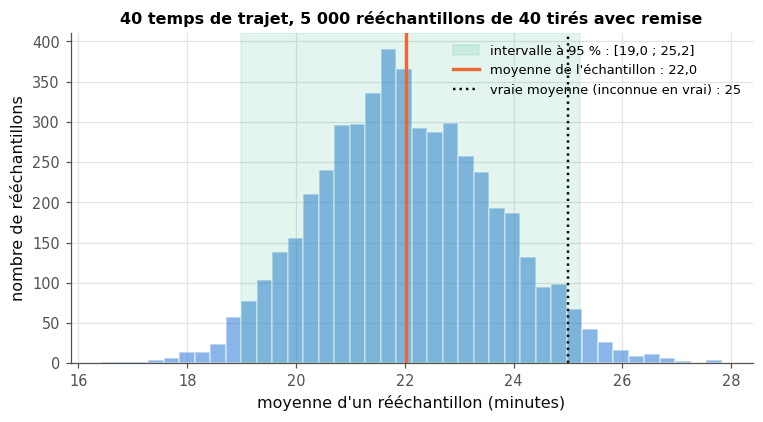
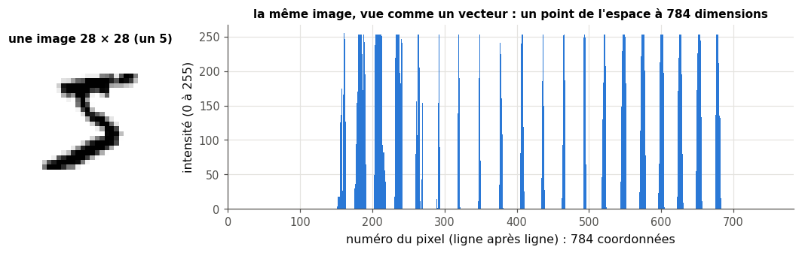
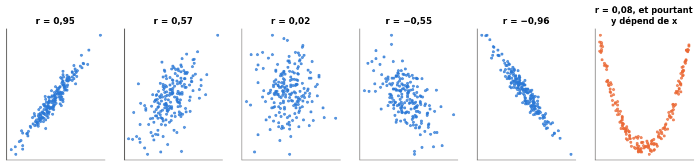
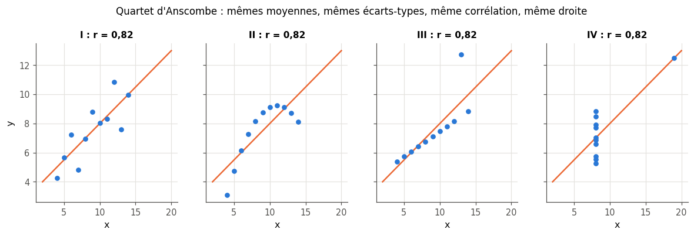

# 2 · Hasard et statistiques de base — fiche de cours

> Cette fiche accompagne le chapitre 2 du livre. Le livre y reste volontairement qualitatif : la fiche ajoute les formules, un mini-exemple chiffré par notion et les réglages de NumPy et de pandas, avec les données du workbook (surtout les manchots). Les images du livre (la casse de voitures, la bibliothèque, la guitare…) ne sont pas racontées ici : chaque section te dit où les lire.

| | |
|---|---|
| **Livre** | vol. 1, ch. 2 « Randomness and Basic Statistics », p. 46-96 (§2.1 à §2.9) |
| **Temps total estimé** | ≈ 17 h : lecture du livre et de la fiche ≈ 3,8 h, exercices ≈ 13 h, 28 flashcards ≈ 0,9 h |
| **Prérequis** | 0A (NumPy : `axis`, `np.random.default_rng`, tri ; pandas : `describe`, `groupby`, `dropna`) · 0B (Σ, racine carrée, vecteurs et norme ; probabilités : indépendance, espérance, variance, dénombrement) · ch. 1 (vocabulaire du ML) |
| **Fichiers du chapitre** | `02_exercices.md` (quiz, rappels, papier, réflexion, entretien) · `03_notebook.ipynb` · `04_indices.md` · `05_solutions.md` et `05_solutions.ipynb` · `06_mes_reponses.md` · `flashcards.csv` |
| **mylearn** | `stats.py` : 16 fonctions (tendances centrales, dispersion, histogramme, covariance et corrélation, tirages, bootstrap), écrites dans le notebook (2.13, 2.15, 2.16, 2.19, 2.21, 2.22, 2.26, 2.28) |

## Comment utiliser ce chapitre

Ce chapitre pose le vocabulaire statistique de base du ML. Il y a un peu plus de maths qu'au ch. 1, mais rien au-delà de 0B, sauf cinq notions introduites ici dans des encadrés 🧮 (densité, variance corrigée, percentiles, intervalle de confiance, matrice de covariance). Tu programmeras toi-même chaque outil dans `mylearn.stats`, puis tu le compareras à NumPy.

**Ordre conseillé.**
1. Lis le livre §2.1 à §2.3 et les sections correspondantes de la fiche ; fais les quiz Q1 à Q7, les rappels R1 à R3 et les exercices papier 2.1 à 2.5.
2. Notebook, partie A et début de la partie B (2.13 à 2.19) : résumer des données, puis tirer dans une loi.
3. Lis le livre §2.4 à §2.6 et la fiche ; fais les quiz Q8 à Q10, l'exercice papier 2.6 et l'oral 2.9 ; puis la fin de la partie B et la partie C du notebook (2.20 à 2.24 : dépendance, tirages avec ou sans remise, bootstrap).
4. Lis le livre §2.7 à §2.9 et la fiche ; fais les quiz Q11 et Q12, les exercices 2.7, 2.8 et 2.10 à 2.12, la partie D du notebook (2.25 à 2.32) et l'entretien (E1 à E5).

| Section | Quiz 🧠 et rappels 🔁 | Papier ✏️ ∂ et réflexion | Notebook | Entretien 💼 |
|---|---|---|---|---|
| 2.1 Pourquoi ce chapitre | Q1, R1 | | | |
| 2.2 Variables aléatoires | Q1, Q2, R2 | 2.1, 2.2 | 2.13, 2.16, 2.19 | E1 |
| 2.2.1 Nombres aléatoires en pratique | Q3 | | 2.14 | E5 |
| 2.3 Lois usuelles (2.3.1 à 2.3.4) | Q4, Q5, Q6 | 2.3, 2.4, 2.5 | 2.15, 2.17, 2.18, 2.31 | |
| 2.3.5 Espérance | Q7, R3 | 2.5 | | |
| 2.4 Dépendance, i.i.d. | Q8 | | 2.20 | E2 |
| 2.5 Tirages avec ou sans remise | Q9 | 2.6 | 2.21 | |
| 2.6 Bootstrap | Q10 | 2.6, 2.9, 2.10 | 2.22, 2.23, 2.24 | E3 |
| 2.7 Grande dimension | Q11 | 2.11 | 2.25 | |
| 2.8 Covariance et corrélation | Q12 | 2.7, 2.8, 2.10 | 2.26 à 2.29 | E4 |
| 2.9 Quartet d'Anscombe | Q12 | 2.12 | 2.30, 2.32 | E4 |

**Lire les formules.** Comme dans tout le workbook : $x_i$ est la $i$-ième valeur, $n$ le nombre de valeurs, $\bar{x}$ (« x barre ») la moyenne d'un échantillon, $\mu$ (« mu ») la moyenne d'une loi, $\sigma$ (« sigma ») un écart-type (celui d'une loi ou de données), $\mathbb{E}[X]$ l'espérance, $P(\ldots)$ une probabilité (BIBLE §6).

## Objectifs d'apprentissage

À la fin du chapitre, tu sais :
- **calculer** à la main et en NumPy la moyenne, la médiane, le mode, la variance (en divisant par $n$ ou par $n - 1$), l'écart-type, des percentiles et des z-scores ;
- **implémenter** un tirage dans une loi discrète et des tirages avec ou sans remise, de façon reproductible (graine) ;
- **reconnaître** les lois uniforme, normale, de Bernoulli et catégorielle, et **utiliser** la règle 68-95-99,7 ;
- **expliquer** l'hypothèse i.i.d. et **repérer** une dépendance entre variables ;
- **construire** un intervalle de confiance par bootstrap et **discuter** la taille des rééchantillons ;
- **calculer et interpréter** covariance, corrélation et leurs matrices, sans confondre corrélation et causalité ;
- **justifier** par un graphique pourquoi des statistiques identiques peuvent cacher des données très différentes.

## L'essentiel en 10 lignes

1. Résumer des nombres, c'est donner un **centre** (moyenne, médiane, mode) et une **dispersion** (variance, écart-type, percentiles) ; une valeur extrême tire la moyenne, pas la médiane.
2. Une **distribution de probabilité** répartit une probabilité totale de 1 entre les valeurs possibles : chaque valeur a sa probabilité pour une loi **discrète** ; pour une loi **continue**, ce sont des aires sous une **densité**.
3. Une **variable aléatoire** associe un nombre à chaque issue d'une expérience ; **tirer**, c'est en produire une valeur au hasard. L'ordinateur tire des nombres **pseudo-aléatoires**, reproductibles grâce à une **graine**.
4. Quatre lois reviennent partout : **uniforme**, **normale** (la cloche, définie par $\mu$ et $\sigma$), **Bernoulli** (0 ou 1) et **catégorielle** (une classe parmi $K$).
5. L'**espérance** est la moyenne des tirages à long terme ; ce n'est pas forcément une valeur qu'on peut tirer.
6. Beaucoup de méthodes supposent des données **i.i.d.** : tirées indépendamment les unes des autres, toutes selon la même loi.
7. **Avec remise**, un élément tiré peut ressortir ; **sans remise**, il sort au plus une fois.
8. Le **bootstrap** rééchantillonne les données avec remise pour mesurer combien une statistique varierait, et en tire un **intervalle de confiance**.
9. Une donnée décrite par $d$ nombres est un **point** d'un espace à $d$ dimensions : une image de MNIST est un point d'un espace à 784 dimensions.
10. **Covariance** et **corrélation** mesurent si deux variables évoluent ensemble le long d'une droite ; une corrélation ne prouve pas une cause, une corrélation nulle ne prouve pas l'absence de lien, et mieux vaut toujours **regarder** les données (Anscombe).

## 2.1 · Pourquoi des statistiques ?

Un modèle ne voit que des nombres ; avant de l'entraîner, on les regarde. Sur les manchots, `describe()`, deux histogrammes et un nuage de points suffisent pour décider s'il faut retirer des lignes, changer d'échelle ou préférer la médiane : la préparation des données (ch. 12) et l'évaluation (ch. 8) partent de là. Le livre compare ce travail au choix du bon outil (§2.1).

Le hasard, lui, est partout en machine learning : les poids d'un réseau sont initialisés au hasard, les exemples sont mélangés à chaque epoch, le découpage entraînement/test est tiré au sort (ch. 1), et un modèle de langage choisit chaque mot en tirant dans une distribution. Savoir tirer au hasard, et savoir refaire exactement le même tirage, fait partie du métier.

## 2.2 · Variables aléatoires ⏩

### Résumer une liste de nombres : moyenne, médiane, mode

- La **moyenne** (*mean*) : $\bar{x} = \frac{1}{n}\sum_{i=1}^{n} x_i$, la somme divisée par le nombre de valeurs (0B, 101.1.4).
- La **médiane** (*median*) : la valeur du milieu une fois les valeurs **triées** ; avec un nombre pair de valeurs, la moyenne des deux du milieu. La moitié des valeurs est en dessous, l'autre moitié au-dessus.
- Le **mode** : la valeur la plus fréquente. C'est le seul des trois qui a un sens pour des catégories (l'île la plus fréquente, l'espèce la plus représentée).

**Mini-exemple.** Sept requêtes vers un site web ont répondu en 120, 95, 110, 2 400, 105, 98 et 110 millisecondes. Moyenne : $\frac{3\,038}{7} = 434$ ms. Triées : 95, 98, 105, **110**, 110, 120, 2 400 : la médiane vaut 110 ms, le mode aussi. Une seule requête lente a fait quadrupler la moyenne (106 ms sans elle) ; la médiane, elle, décrit bien une requête ordinaire. On dit que la médiane est **robuste** aux valeurs extrêmes.

```python
>>> import numpy as np
>>> t = np.array([120, 95, 110, 2400, 105, 98, 110])   # temps de réponse (ms)
>>> t.mean(), np.median(t)
(np.float64(434.0), np.float64(110.0))
```

Sur de vraies données, la moyenne et la médiane racontent déjà quelque chose de la **forme** de la distribution. La masse des manchots forme une bosse étirée vers la droite : les Gentoo, bien plus lourds que les autres espèces, tirent la moyenne au-dessus de la médiane. La longueur de nageoire a deux bosses, une par groupe d'espèces : la moyenne tombe entre les deux, là où il y a peu de manchots.



> ⚠️ **Le mode quand tout est à égalité** — Le livre dit qu'une liste n'a « pas de mode » si aucune valeur n'est plus fréquente que les autres. Les bibliothèques font autrement : `statistics.multimode` (Python) et `Series.mode()` (pandas) renvoient **toutes** les valeurs à égalité, et c'est la convention de `mylearn.stats.mode` (2.13). Sur une grandeur mesurée finement, presque chaque valeur est unique et le mode ne dit pas grand-chose ; les masses du dataset, arrondies à 25 g, se répètent souvent, et leur mode dépend surtout de cet arrondi. Le mode est surtout utile pour des valeurs discrètes ou des catégories.

### Des comptages à une distribution de probabilité

Une **distribution de probabilité** (*probability distribution*) discrète est une liste de nombres positifs ou nuls de somme 1, un par issue possible. Les comptages des manchots par île (168, 124, 52) n'en sont pas une : leur somme vaut 344. Divisés par 344 (on dit qu'on les **normalise**), ils deviennent 0,488, 0,360 et 0,151 : les probabilités qu'un manchot tiré au hasard vienne de chaque île.



On peut voir la distribution comme une roue de loterie dont chaque part est proportionnelle à sa probabilité : faire tourner la roue, c'est **tirer** une île. Le livre développe cette image avec une casse de voitures et sa roue de fête foraine (§2.2, figures 2.1 à 2.4).

### Variable aléatoire, tirage, loi discrète et densité

Une **variable aléatoire** (*random variable*) $X$ associe un nombre à chaque issue d'une expérience aléatoire (0B, 101.7.3) ; sa **loi** dit avec quelle probabilité elle prend chaque valeur. **Tirer** (*draw*, *sample*) une valeur, c'est produire une valeur au hasard selon cette loi : c'est ce que font `rng.integers(...)` ou `rng.normal(...)`.

> ⚠️ **Deux définitions de « variable aléatoire »** — Le livre présente une variable aléatoire comme une procédure qui reçoit une distribution et renvoie une valeur tirée selon elle (§2.2). C'est le point de vue du programmeur : une fonction de tirage. En mathématiques, une variable aléatoire est une fonction qui associe un nombre à chaque issue possible ; la distribution est sa loi, pas son entrée. Les deux visions se rejoignent en pratique : on choisit une loi, puis on tire des valeurs.

- Une variable **discrète** prend des valeurs séparées qu'on peut énumérer, $x_1, x_2, \ldots$ (le plus souvent en nombre fini), chacune avec une probabilité $p_k = P(X = x_k)$, et $\sum_k p_k = 1$. Le tableau des $p_k$ s'appelle la **fonction de masse** (*probability mass function*, **pmf**).
- Une variable **continue** peut prendre n'importe quelle valeur réelle d'un intervalle (une durée, une masse). La probabilité d'une valeur **exacte** y vaut 0 : on ne parle que d'intervalles, dont la probabilité est une **aire** sous une courbe, la **densité** (*probability density function*, **pdf**).

> 🧮 **Rappel maths — densité : l'aire sous la courbe est une probabilité** — Pour une loi continue de densité $f$, la probabilité que $X$ tombe entre $a$ et $b$ est l'aire sous la courbe de $f$ entre $a$ et $b$ (on l'écrit $\int_a^b f(x)\,dx$, une intégrale, mais tu n'auras pas à la calculer : pense « aire »). L'aire totale sous $f$ vaut 1. Pour une densité constante de hauteur 2 entre 0 et 0,5, $P(0{,}1 \le X \le 0{,}3) = 0{,}2 \times 2 = 0{,}4$ : une aire de rectangle. Conséquence contre-intuitive : **une densité n'est pas une probabilité** et peut dépasser 1 (ici elle vaut 2) ; seule l'aire doit rester égale à 1. Un histogramme tracé avec `density=True` (2.16) a exactement cette propriété : la hauteur de chaque barre est le comptage divisé par (nombre de valeurs comptées × largeur de la barre), si bien que l'aire totale des barres vaut 1.

> 🕰️ **Mise à jour (2026)** — **Le livre :** appelle « pdf » la loi d'une variable discrète comme celle d'une variable continue (il cite « pmf » comme autre nom), et préfère « multinoulli » à « catégorielle » pour la loi à plusieurs issues. · **Aujourd'hui :** on réserve **pmf** (fonction de masse) aux lois discrètes et **pdf** (densité) aux lois continues ; la loi à $K$ issues s'appelle presque toujours **loi catégorielle** (*categorical distribution*) : c'est le nom des classes `Categorical` (qui tire un indice entre $0$ et $K - 1$) et `OneHotCategorical` (qui tire un vecteur one-hot) de `torch.distributions`. · **Faut-il quand même l'apprendre ?** Oui, avec ces mots-là : ce sont ceux des documentations. · *Source :* [PyTorch, « torch.distributions »](https://docs.pytorch.org/docs/stable/distributions.html) (docstrings de `Categorical` et `OneHotCategorical`, version 2.11 figée par le workbook).

### 2.2.1 Nombres aléatoires en pratique

Un **générateur pseudo-aléatoire** (*pseudo-random number generator*, PRNG) garde un **état** interne : à chaque appel, un calcul met cet état à jour et en déduit un nombre. Rien n'est tiré au sort, d'où le « pseudo » ; mais les suites obtenues passent les tests statistiques courants. La **graine** (*seed*) fixe l'état de départ : même graine, même suite, et l'expérience devient **reproductible**. Sans graine, NumPy part de l'entropie de ton système d'exploitation, et chaque exécution donne d'autres nombres. Pour la cryptographie, où l'imprévisibilité compte vraiment, on utilise en Python le module `secrets` ; le livre cite aussi des sources physiques de hasard (§2.2.1).

```python
>>> rng = np.random.default_rng(42)          # un générateur, avec sa graine
>>> rng.integers(1, 7, size=5)               # 5 lancers de dé (7 est exclu)
array([1, 5, 4, 3, 3])
>>> np.random.default_rng(42).integers(1, 7, size=5)   # même graine : même suite
array([1, 5, 4, 3, 3])
```

**En ML**, une graine fixée permet de rejouer une expérience à l'identique pour chercher un bug ou comparer deux réglages « toutes choses égales par ailleurs ». `wb.setup(seed=42)` fixe d'un coup les graines de NumPy, du module `random` et de PyTorch. Mais un résultat obtenu avec **une** graine peut être un coup de chance : on vérifie qu'une amélioration tient sur plusieurs graines (ch. 8).

> 🕰️ **Mise à jour (2026)** — **Le livre :** explique l'idée de graine et de générateur, sans API particulière (et le NumPy de 2018 s'utilisait avec `np.random.seed(...)` puis `np.random.rand(...)`). · **Aujourd'hui :** on crée un générateur avec `rng = np.random.default_rng(seed)` (un objet `Generator`, algorithme PCG64 par défaut), puis on appelle ses méthodes (`rng.random`, `rng.integers`, `rng.normal`, `rng.choice`, `rng.permutation`…). L'ancienne interface (`RandomState`, `np.random.seed`, `np.random.rand`) est déclarée « legacy » et figée ; ses fonctions de module sont déconseillées parce qu'elles partagent un état global, que n'importe quelle partie du code peut modifier. · **Faut-il quand même l'apprendre ?** Oui pour l'idée ; pour le code, écris `default_rng`, et sache seulement reconnaître l'ancienne forme dans du code existant. · *Sources :* [NumPy, « Random Generator »](https://numpy.org/doc/stable/reference/random/generator.html) ; [NumPy, « Legacy random generation »](https://numpy.org/doc/stable/reference/random/legacy.html).

## 2.3 · Quelques lois usuelles

Voici les quatre lois du §2.3 du livre, avec leurs formules et leurs fonctions NumPy.

### 2.3.1 La loi uniforme

La loi **uniforme** sur $[a, b]$ donne la même chance à toutes les valeurs de l'intervalle : sa densité vaut $\frac{1}{b - a}$ sur $[a, b]$ et 0 ailleurs, si bien que $P(c \le X \le d) = \frac{d - c}{b - a}$ pour $a \le c \le d \le b$. Sa moyenne est le milieu $\frac{a + b}{2}$. Pour la loi uniforme sur $[0, 1]$ : $P(0{,}2 \le X \le 0{,}5) = 0{,}3$, et $P(X = 0{,}5) = 0$ (une valeur exacte).

En NumPy, `rng.random()` tire dans $[0, 1)$ (le 1 n'est jamais atteint), `rng.uniform(a, b)` dans $[a, b)$. La version **discrète** donne la même probabilité à chaque entier d'une liste : `rng.integers(1, 7)` simule un dé, la borne haute étant exclue.

### 2.3.2 La loi normale ⏩

La loi **normale** (ou **gaussienne**, la « courbe en cloche ») a pour densité

$$f(x) = \frac{1}{\sigma\sqrt{2\pi}}\, e^{-\frac{(x - \mu)^2}{2\sigma^2}}$$

On la note $\mathcal{N}(\mu, \sigma^2)$ : la **moyenne** $\mu$ place le sommet, l'**écart-type** $\sigma > 0$ règle la largeur ($\sigma^2$ est la **variance**). Elle est symétrique : sa moyenne, sa médiane et son mode sont égaux. Elle est positive partout mais minuscule loin du centre : à $5\sigma$ de la moyenne, sa hauteur ne vaut plus qu'environ quatre millionièmes de celle du sommet.

**La règle 68-95-99,7.** Pour toute loi normale, environ 68 % des tirages tombent à moins d'un écart-type de la moyenne, 95 % à moins de deux, 99,7 % à moins de trois (valeurs plus précises : 68,27 %, 95,45 %, 99,73 %).



**Mini-exemple.** Si les notes d'un examen suivent à peu près $\mathcal{N}(12, 3^2)$ : environ 68 % des copies ont entre 9 et 15, 95 % entre 6 et 18, et presque toutes (99,7 %) entre 3 et 21. Une note au-dessus de 18 ne concerne qu'environ 2,5 % des copies (la moitié des 5 % restants, par symétrie).

Beaucoup de mesures naturelles ont une distribution proche d'une normale (la taille des adultes d'un même sexe, des erreurs de mesure répétées), parce qu'elles résultent de nombreuses petites influences qui s'additionnent. Beaucoup d'autres non : les salaires, les temps d'attente ou les masses de toutes les espèces mélangées sont asymétriques ou à plusieurs bosses (figure du début). Avant d'appliquer la règle, on regarde l'histogramme (2.18).

> ⚠️ **L'écart-type ne se définit pas par les 68 %** — Le livre présente l'écart-type d'une normale comme la demi-largeur de la bande centrale qui contient 68 % de l'aire (§2.3.2). C'est une **propriété** de la loi normale, pas une définition. L'écart-type se définit pour n'importe quelle loi comme la racine de la variance (0B, 101.7.4, et ci-dessous) ; pour une loi uniforme sur $[0, 1]$, par exemple, $\sigma \approx 0{,}289$ et la bande de ± 1 écart-type ne contient que 57,7 % des tirages.

### Mesurer la dispersion de données : variance, écart-type, ddof

Sur $n$ valeurs, la **variance** est la moyenne des carrés des écarts à la moyenne, et l'**écart-type** (*standard deviation*) sa racine, dans l'unité des données :

$$\mathrm{Var}(x) = \frac{1}{n - \mathrm{ddof}}\sum_{i=1}^{n}(x_i - \bar{x})^2 \qquad \sigma = \sqrt{\mathrm{Var}(x)}$$

avec $\mathrm{ddof} = 0$ (on divise par $n$) ou $\mathrm{ddof} = 1$ (on divise par $n - 1$).

**Mini-exemple.** Pour 2, 4, 4, 4, 5, 5, 7, 9 : la moyenne vaut 5 ; les écarts −3, −1, −1, −1, 0, 0, 2, 4 ont des carrés dont la somme vaut 32. Avec ddof = 0 : variance $32 / 8 = 4$, écart-type 2. Avec ddof = 1 : variance $32 / 7 \approx 4{,}571$, écart-type $\approx 2{,}138$.

> 🧮 **Rappel maths — pourquoi diviser par $n - 1$ ?** — On veut souvent estimer la variance d'une **population** entière (tous les manchots Adélie qui existent) à partir d'un **échantillon** (les 151 Adélie mesurés du dataset). Or les écarts sont mesurés par rapport à $\bar{x}$, la moyenne de l'échantillon, qui est le nombre rendant la somme des carrés des écarts **la plus petite possible** : autour de la vraie moyenne $\mu$, cette somme est plus grande (ou égale). Diviser par $n$ sous-estime donc la variance en moyenne ; on démontre que diviser par $n - 1$ corrige exactement ce biais (résultat admis). Le paramètre **ddof** (*delta degrees of freedom*) fixe le diviseur $n - \mathrm{ddof}$. Avec 8 valeurs, l'écart est de 14 % ; avec 1 000, il devient négligeable. Retiens surtout que les bibliothèques n'ont pas toutes la même valeur par défaut (encadré 🕰️ de la §2.8) : c'est une source classique d'écarts inexpliqués (2.29).

> 🧮 **Rappel maths — percentiles et quantiles** — Le **percentile** $q$ (entre 0 et 100) est la valeur sous laquelle se trouvent environ $q$ % des données : la médiane est le percentile 50, le premier et le troisième **quartile** sont les percentiles 25 et 75 (ceux qu'affiche `describe()` de pandas). Un **quantile** est la même chose sur une échelle de 0 à 1 (le quantile 0,9 est le percentile 90). Entre deux valeurs, on **interpole** : on trie les $n$ valeurs, on les place aux positions $0, 1, \ldots, n - 1$, et le percentile $q$ se trouve à la position $\frac{q}{100}(n - 1)$, entre les deux valeurs voisines, au prorata. Pour 2, 4, 4, 4, 5, 5, 7, 9 : le percentile 90 est à la position $0{,}9 \times 7 = 6{,}3$, entre la valeur n° 6 (7) et la n° 7 (9), donc à $7 + 0{,}3 \times (9 - 7) = 7{,}6$. Plusieurs conventions d'interpolation coexistent (NumPy en propose treize) : celle-ci est la méthode par défaut de NumPy, `'linear'`.

Le **z-score** d'une valeur dit à combien d'écarts-types elle se trouve de la moyenne :

$$z_i = \frac{x_i - \bar{x}}{\sigma}$$

Il n'a pas d'unité. Remplacer chaque valeur d'une colonne par son z-score, c'est la **standardiser** (0A.52) : la colonne a ensuite une moyenne 0 et un écart-type 1. Dans l'exemple, 9 a pour z-score $\frac{9 - 5}{2} = 2$. Pour des données à peu près normales, un $|z| > 3$ est rare (0,3 % des cas) : c'est un premier signal de valeur aberrante, à vérifier avant toute décision.

```python
>>> x = np.array([2, 4, 4, 4, 5, 5, 7, 9])
>>> x.var(), x.var(ddof=1), x.std()
(np.float64(4.0), np.float64(4.571428571428571), np.float64(2.0))
>>> np.percentile(x, [25, 50, 90])
array([4. , 4.5, 7.6])
>>> (x - x.mean()) / x.std()            # les z-scores
array([-1.5, -0.5, -0.5, -0.5,  0. ,  0. ,  1. ,  2. ])
```

### 2.3.3 La loi de Bernoulli

Une variable de **Bernoulli** ne prend que deux valeurs, 1 (« succès ») avec probabilité $p$ et 0 avec probabilité $1 - p$ : pile ou face, spam ou non, client qui résilie son abonnement ou non. Son espérance et sa variance se calculent en deux lignes (0B) : $\mathbb{E}[X] = 0 \times (1 - p) + 1 \times p = p$ ; comme $X^2 = X$, $\mathbb{E}[X^2] = p$ et $\mathrm{Var}(X) = p - p^2 = p(1 - p)$, qui est maximale pour $p = 0{,}5$.

**Mini-exemple.** Si un e-mail sur dix est un spam, l'indicatrice « c'est un spam » suit une loi de Bernoulli de paramètre $p = 0{,}1$ : espérance 0,1, variance $0{,}1 \times 0{,}9 = 0{,}09$.

**En ML**, les labels d'une classification binaire sont des variables de Bernoulli, et le *dropout* (ch. 20) éteint chaque neurone au hasard selon une loi de Bernoulli. Le livre illustre la loi avec une pièce équilibrée et une pièce truquée (§2.3.3).

### 2.3.4 La loi catégorielle (multinoulli)

La loi **catégorielle** généralise Bernoulli à $K$ issues de probabilités $p_1, \ldots, p_K$ (positives, de somme 1). Un tirage donne le **numéro** d'une catégorie ; on le code souvent par un **vecteur one-hot** : $K$ composantes nulles, sauf un 1 à la place de la catégorie tirée (0A, `one_hot`). Avec $K = 2$, c'est une loi de Bernoulli.

**Tirer dans une loi catégorielle** revient à faire tourner la roue de la §2.2 : on range les probabilités bout à bout entre 0 et 1, on tire $u$ uniforme dans $[0, 1)$, et on regarde dans quel segment il tombe. Avec $p = (0{,}2 ;\ 0{,}5 ;\ 0{,}3)$, les **sommes cumulées** valent $0{,}2$, $0{,}7$ et $1$ : les segments sont $[0 ; 0{,}2)$, $[0{,}2 ; 0{,}7)$ et $[0{,}7 ; 1)$. Pour $u = 0{,}63$, on obtient la catégorie n° 1 (en comptant à partir de 0) ; en one-hot, $(0, 1, 0)$. C'est l'algorithme de `mylearn.stats.sample_categorical` (2.19).

**En ML**, un classifieur à $K$ classes renvoie justement une loi catégorielle (« 92 % Gentoo, 6 % Chinstrap, 2 % Adélie »), et un modèle de langage choisit chaque token en tirant dans une loi catégorielle sur tout son vocabulaire (ch. 1, Panorama). Le livre donne l'exemple d'un dé à 20 faces et celui des dates d'anniversaire (§2.3.4).

### 2.3.5 L'espérance

L'**espérance** d'une variable aléatoire est la moyenne de ses valeurs pondérée par leurs probabilités (0B, 101.7.3) : $\mathbb{E}[X] = \sum_k x_k\,p_k$. C'est aussi la limite de la moyenne des tirages quand on tire de plus en plus (la loi des grands nombres, 0B, 101.7.5). Elle n'a aucune raison d'être une valeur possible : une roue qui rapporte 0 € (probabilité 0,7), 2 € (0,2) ou 10 € (0,1) a pour espérance $0 + 0{,}4 + 1 = 1{,}4$ €, un gain qu'elle ne donne jamais. Le livre fait la même remarque avec quatre nombres impairs (§2.3.5).

## 2.4 · Dépendance

Deux variables aléatoires sont **indépendantes** quand connaître la valeur de l'une ne change rien à la loi de l'autre (0B, 101.7.2, pour des événements). Deux lancers de dé sont indépendants. En revanche, si l'on tire d'abord l'espèce d'un manchot, puis la longueur de sa nageoire, la seconde **dépend** de la première : chez les Gentoo, elle tourne autour de 217 mm, chez les Adélie autour de 190 mm. Le livre prend l'exemple de la longueur du pelage selon l'animal tiré (§2.4) ; tu le simuleras en 2.20.

### 2.4.1 Des variables i.i.d.

Des variables sont **i.i.d.** (*independent and identically distributed*, indépendantes et identiquement distribuées) quand elles sont indépendantes les unes des autres et suivent toutes la même loi : des lancers successifs du même dé, ou des manchots tirés au hasard, avec remise, dans une même population.

**En ML**, on suppose presque toujours que les exemples d'entraînement et de test sont i.i.d. C'est ce qui permet de croire qu'un score mesuré sur le jeu de test vaudra aussi pour les données futures (ch. 1, §1.2.3). Cette hypothèse se casse facilement :
- dans une **série temporelle**, deux jours voisins se ressemblent (les taches solaires, 1.12) : les exemples ne sont pas indépendants, et un découpage au hasard mélange passé et futur (ch. 8, 22) ;
- plusieurs photos de la **même** personne, les unes à l'entraînement, les autres au test, font paraître le modèle meilleur qu'il n'est : c'est une fuite de données (ch. 1) ;
- si les données de test ou de production ne suivent plus la même loi que celles d'entraînement (un autre capteur, une autre époque, une autre population), le score annoncé ne tient plus.

## 2.5 · Tirages avec et sans remise ⏩

Découper un dataset en entraînement et test, former les mini-batches d'une epoch, fabriquer un rééchantillon bootstrap : trois tirages au hasard, et deux règles, comparées ci-dessous.

### 2.5.1 Avec remise, 2.5.2 Sans remise ⏩

| | **Avec remise** (*with replacement*) | **Sans remise** (*without replacement*) |
|---|---|---|
| En ML | bootstrap (§2.6), *bagging* et forêts aléatoires (ch. 14) | découpage entraînement/test (ch. 1, 8), mélange des exemples et mini-batches d'une epoch (0A) |
| Un élément peut-il sortir deux fois ? | oui | non |
| Nombre de tirages possibles | illimité | au plus $n$, la taille du lot |
| Les tirages sont-ils indépendants ? | oui : chaque tirage se fait dans le lot complet, avec la probabilité $\frac{1}{n}$ pour chaque élément | non : l'élément sorti passe à une probabilité 0, et chacun des autres de $\frac{1}{n}$ à $\frac{1}{n - 1}$ |
| NumPy | `rng.integers(0, n, size)` (des indices), `rng.choice(a, size)` | `rng.permutation(n)[:k]`, `rng.choice(a, size, replace=False)` |

Le livre illustre la différence par des livres empruntés ou photocopiés, des boissons dans un café et des cartes distribuées au poker (§2.5).

```python
>>> rng = np.random.default_rng(0)
>>> rng.choice(["A", "B", "C", "D"], size=6)                 # avec remise : c'est le défaut !
array(['D', 'C', 'C', 'B', 'B', 'A'], dtype='<U1')
>>> rng.choice(["A", "B", "C", "D"], size=4, replace=False)  # sans remise : une permutation
array(['A', 'C', 'B', 'D'], dtype='<U1')
```

### 2.5.3 Combien de résultats possibles ?

Tirer $k$ fois parmi $n$ éléments ne donne pas le même nombre de résultats possibles selon la règle (0B, 101.1.7) :
- **avec remise, dans l'ordre** : $n^k$ suites (chaque tirage a $n$ issues) ;
- **sans remise, sans tenir compte de l'ordre** : $\binom{n}{k}$ sous-ensembles ;
- **avec remise, sans tenir compte de l'ordre** : encore plus que $\binom{n}{k}$, puisqu'on ajoute les répétitions.

**Mini-exemple.** Deux tirages parmi 4 objets A, B, C, D : 16 suites avec remise (AA, AB, BA…) ; $\binom{4}{2} = 6$ paires sans remise (AB, AC, AD, BC, BD, CD) ; 10 paires avec remise si l'ordre ne compte pas (les 6 précédentes, plus AA, BB, CC, DD). Le livre fait la même comparaison avec trois objets (§2.5.3) ; tu la refais en 2.6 avec cinq.

**Combien d'éléments manquent dans un tirage avec remise ?** Tirons $n$ fois avec remise parmi $n$ éléments. Un élément donné n'est pas tiré à un tirage avec probabilité $1 - \frac{1}{n}$, donc jamais (tirages indépendants) avec probabilité $\left(1 - \frac{1}{n}\right)^n$. Pour $n = 10$ : $0{,}9^{10} \approx 0{,}349$. Quand $n$ grandit, ce nombre se rapproche de $e^{-1} \approx 0{,}368$ : un tirage de $n$ parmi $n$ avec remise contient en moyenne environ **63 %** d'éléments distincts, les autres sont des répétitions. Ce chiffre reviendra au ch. 14 (les exemples « hors du sac » d'une forêt aléatoire).

## 2.6 · Le bootstrap ⏩

Une enquête auprès de 40 salariés d'une ville (un **échantillon**) donne un temps de trajet moyen de 22 minutes. Avec 40 autres salariés, on aurait trouvé un autre chiffre : pour savoir ce que cette moyenne dit de tous les salariés de la ville (la **population**), il faut savoir **de combien** elle varie d'un échantillon à l'autre. Faute d'autres enquêtes, on fabrique des échantillons de rechange à partir de celui qu'on a.

Le **bootstrap** (Efron, 1979) procède ainsi :
1. tirer **avec remise** $n$ éléments parmi les $n$ de l'échantillon : c'est un **rééchantillon** (*bootstrap sample*), où certains éléments apparaissent plusieurs fois et environ 37 % pas du tout (§2.5.3) ;
2. calculer la statistique voulue (moyenne, médiane, corrélation…) sur ce rééchantillon ;
3. recommencer $B$ fois ($B$ = 1 000 à 10 000) : les $B$ valeurs forment la **distribution bootstrap** ;
4. lire sa dispersion : l'**intervalle de confiance percentile** de niveau 95 % garde les 95 % centraux de ces valeurs, en coupant 2,5 % de chaque côté (les percentiles 2,5 et 97,5).



Sur la figure, 40 temps de trajet simulés (on connaît donc la vraie moyenne, 25 minutes, ce qui n'arrive jamais en vrai) donnent une moyenne de 22,0 minutes et un intervalle à 95 % de 19,0 à 25,2 minutes : il contient ici la vraie valeur, de justesse.

> 🧮 **Rappel maths — ce que veut dire « intervalle de confiance à 95 % »** — Une fois l'intervalle calculé, la vraie valeur est dedans ou pas : il n'y a plus rien d'aléatoire. Le « 95 % » décrit la **méthode** : si l'on refaisait toute l'enquête un grand nombre de fois, en construisant chaque fois un intervalle de la même façon, environ 95 % de ces intervalles contiendraient la vraie valeur (et 5 %, soit un sur vingt, la rateraient). La phrase courante « on est confiant à 95 % que la moyenne est entre 19,0 et 25,2 » est un raccourci acceptable si on l'entend ainsi. Un intervalle est d'autant plus **large** que les données sont dispersées, que l'échantillon est petit (sa largeur diminue environ comme $\frac{1}{\sqrt{n}}$, 0B, 101.7.5) et que le niveau de confiance demandé est élevé (un intervalle à 99 % est plus large qu'un intervalle à 80 %).

**Ce que le bootstrap ne fait pas.** Il ne crée aucune information : il mesure l'incertitude due au **hasard de l'échantillonnage**, pas les défauts de l'échantillon. Si les 40 personnes interrogées habitent toutes près de leur travail, l'intervalle sera étroit… et faux. Il marche mal aussi sur de très petits échantillons (à titre indicatif, moins d'une vingtaine de valeurs) et pour des statistiques extrêmes comme le maximum, que le rééchantillonnage ne peut jamais dépasser.

Le livre illustre le principe (§2.6, figures 2.15 et 2.16), puis le déroule sur une population de 5 000 entiers (figures 2.17 et 2.18) ; tu le programmeras en 2.22, tu compareras la taille des rééchantillons en 2.23 et tu retrouveras tes résultats avec SciPy en 2.24. Le livre y reviendra au ch. 14 : les forêts aléatoires entraînent chaque arbre sur un rééchantillon.

> 🕰️ **Mise à jour (2026)** — **Le livre :** construit des rééchantillons **petits** (20 éléments tirés dans un échantillon de 500), en très grand nombre, et présente leur petite taille comme un avantage (§2.6). · **Aujourd'hui :** chaque rééchantillon a la **même taille $n$ que l'échantillon** ; c'est cette taille qui fait que la dispersion des rééchantillons imite celle d'un nouvel échantillon. Des rééchantillons plus petits donnent une distribution plus étalée, donc un intervalle **artificiellement large** (de combien ? tu le mesures en 2.23). Augmenter le **nombre** de rééchantillons ($B$) rend l'intervalle plus stable d'une exécution à l'autre, mais ne le rétrécit pas. En pratique, on utilise `scipy.stats.bootstrap`, qui fait 9 999 rééchantillons par défaut et propose l'intervalle percentile (`method='percentile'`), l'intervalle `'basic'` (un percentile « inversé ») et, par défaut, `'BCa'`, corrigé du biais et en général plus précis. · **Faut-il quand même l'apprendre ?** Oui : l'idée du livre est la bonne, avec des rééchantillons de taille $n$. · *Sources :* B. Efron et R. J. Tibshirani, *An Introduction to the Bootstrap*, Chapman & Hall/CRC, 1993 ; [SciPy, « scipy.stats.bootstrap »](https://docs.scipy.org/doc/scipy/reference/generated/scipy.stats.bootstrap.html).

## 2.7 · Espaces de grande dimension

Une donnée décrite par $d$ nombres est un **point** d'un espace à $d$ dimensions, chaque nombre donnant la position le long d'un axe (0B, 101.3). Un manchot décrit par ses 4 mesures est un point d'un espace à 4 dimensions ; une image de MNIST, avec ses $28 \times 28 = 784$ pixels, un point d'un espace à 784 dimensions ; une image couleur de CIFAR-10 ($32 \times 32$ pixels × 3 couleurs) un point d'un espace à 3 072 dimensions.



Au-delà de trois axes, on ne dessine plus, mais on calcule : la distance entre deux images de MNIST est la formule de 0B avec 784 termes au lieu de 2, et il en va de même pour le produit scalaire et la norme. Le livre compte les dimensions d'une photo de 500 × 500 pixels (§2.7).

Ces espaces réservent pourtant des surprises. Leur « volume » grandit si vite avec la dimension que les données y sont toujours **clairsemées** : aucun dataset ne remplit l'espace de toutes les images possibles (tu l'estimes en 2.11). On appelle ces difficultés le **fléau de la dimension** (*curse of dimensionality*) ; tu les verras sur les distances entre chiffres de MNIST en 2.25, et elles justifient la réduction de dimension (ch. 1, ch. 12).

## 2.8 · Covariance et corrélation ⏩

Deux variables mesurées sur les mêmes individus (la masse et la nageoire de chaque manchot) varient-elles **ensemble** ? Pour le voir, on trace un **nuage de points** (*scatter plot*) : un point par individu, une variable par axe. Le livre prend l'exemple de la température, de la neige et des baigneurs d'un lac (§2.8).

### 2.8.1 La covariance ⏩

La **covariance** est la moyenne des **produits des écarts** à la moyenne :

$$\mathrm{Cov}(x, y) = \frac{1}{n - \mathrm{ddof}}\sum_{i=1}^{n}(x_i - \bar{x})(y_i - \bar{y})$$

Quand un individu est au-dessus de la moyenne pour $x$ **et** pour $y$ (ou en dessous pour les deux), le produit est positif ; quand il est au-dessus pour l'une et en dessous pour l'autre, il est négatif. Une covariance **positive** signifie donc que les deux variables ont tendance à monter ensemble, une covariance **négative** que l'une baisse quand l'autre monte, une covariance proche de 0 qu'aucune tendance en ligne droite ne domine. On a $\mathrm{Cov}(x, x) = \mathrm{Var}(x)$.

**Mini-exemple.** Pour les points $(1, 1)$, $(2, 3)$, $(3, 2)$, $(4, 4)$ : $\bar{x} = \bar{y} = 2{,}5$, les écarts valent $(-1{,}5 ; -0{,}5 ; 0{,}5 ; 1{,}5)$ pour $x$ et $(-1{,}5 ; 0{,}5 ; -0{,}5 ; 1{,}5)$ pour $y$, les produits $2{,}25$, $-0{,}25$, $-0{,}25$ et $2{,}25$, de somme 4. Avec ddof = 0 : $\mathrm{Cov}(x, y) = 4 / 4 = 1$.

La covariance a un défaut : son **unité** est le produit des unités (des mm × g pour la nageoire et la masse), et sa taille change avec elles. Mesure la masse en kilogrammes plutôt qu'en grammes, et la covariance est divisée par 1 000 : impossible de dire si une covariance est « grande ». Le livre montre le problème avec une douzaine de mesures sur une guitare (§2.8.2).

> ⚠️ **Ce que mesure vraiment la covariance** — Le livre présente la covariance à partir de la façon dont $y$ change quand on passe d'un point au **suivant**, de gauche à droite (§2.8.1). La définition compare pourtant chaque point au **centre** du nuage $(\bar{x}, \bar{y})$, pas à son voisin : dans un nuage croissant mais bruité, $y$ monte ou descend au hasard d'un point au suivant, et la covariance est pourtant nettement positive.

### 2.8.2 La corrélation ⏩

Pour se débarrasser des unités, on divise la covariance par les deux écarts-types : c'est le **coefficient de corrélation de Pearson** (*Pearson correlation coefficient*), ou simplement la **corrélation** :

$$r = \frac{\mathrm{Cov}(x, y)}{\sigma_x\,\sigma_y} \in [-1, 1]$$

(avec le même ddof partout : il se simplifie). $r = 1$ exactement quand les points sont alignés sur une droite croissante, $r = -1$ sur une droite décroissante ; plus $|r|$ est proche de 1, plus le nuage est serré autour d'une droite. Dans le mini-exemple, $\sigma_x = \sigma_y = \sqrt{1{,}25}$ et $r = \frac{1}{1{,}25} = 0{,}8$. La corrélation ne change pas quand on change d'unité ou d'origine (degrés Celsius ou Fahrenheit, grammes ou kilogrammes) : tu le démontres en 2.8. C'est aussi le **cosinus** de l'angle entre les deux vecteurs d'écarts $(x_i - \bar{x})$ et $(y_i - \bar{y})$ (0B, 101.3.3), ce qui explique qu'elle reste entre −1 et 1.

```python
>>> x, y = np.array([1, 2, 3, 4]), np.array([1, 3, 2, 4])
>>> np.cov(x, y, ddof=0)[0, 1], round(np.corrcoef(x, y)[0, 1], 4)
(np.float64(1.0), np.float64(0.8))
```



Des repères courants : $|r|$ en dessous de 0,3 environ, corrélation faible ; entre 0,3 et 0,7, modérée ; au-dessus de 0,7, forte. Ces seuils varient d'un domaine à l'autre : regarde toujours le nuage.

> ⚠️ **Deux contresens à éviter** — (1) **Une corrélation nulle ne veut pas dire « aucun lien ».** Elle veut dire « aucun lien **en ligne droite** ». Sur le dernier nuage de la figure, $y$ est presque entièrement déterminé par $x$ (une parabole), et pourtant $r \approx 0$ ; le livre montre lui-même des points en arc de cercle, de covariance nulle (figure 2.24), avant d'affirmer qu'une corrélation nulle signifie qu'on ne peut rien prédire. De même, ce que le livre appelle « corrélation non linéaire » pour toute valeur de $r$ autre que ±1 n'est pas le vocabulaire usuel : le $r$ de Pearson mesure toujours la **part linéaire** du lien, et $|r| < 1$ veut simplement dire que les points ne sont pas tous sur une droite. (2) **Corrélation n'est pas causalité.** Les ventes de glaces et les noyades sont corrélées, parce que toutes deux augmentent en été : une troisième variable, la **variable de confusion** (*confounder*), explique les deux. Il peut aussi y avoir une causalité à l'envers, ou une simple coïncidence. Le moyen le plus sûr d'établir une cause est une expérience contrôlée (tirer au sort qui reçoit un traitement).

### Matrices de covariance et de corrélation

> 🧮 **Rappel maths — la matrice de covariance** — Avec $p$ variables (les colonnes d'un tableau $\mathbf{X}$ de forme $(n, p)$, 0B), on range toutes les covariances deux à deux dans un tableau $p \times p$ : la case $(j, k)$ contient $\mathrm{Cov}(\text{colonne } j, \text{colonne } k)$. La **diagonale** contient les variances (la covariance d'une colonne avec elle-même), et le tableau est **symétrique** ($\mathrm{Cov}(x, y) = \mathrm{Cov}(y, x)$). La **matrice de corrélation** fait de même avec $r$ : des 1 sur la diagonale, des valeurs entre −1 et 1 ailleurs. Pour $\mathbf{X} = \begin{pmatrix} 1 & 2 \\ 2 & 4 \\ 3 & 6 \\ 4 & 8 \end{pmatrix}$ (la seconde colonne est le double de la première), la matrice de covariance (ddof = 0) vaut $\begin{pmatrix} 1{,}25 & 2{,}5 \\ 2{,}5 & 5 \end{pmatrix}$ et la matrice de corrélation n'a que des 1.

En pratique : `df.cov()` et `df.corr()` en pandas, `np.cov(X, rowvar=False)` et `np.corrcoef(X, rowvar=False)` en NumPy (sans `rowvar=False`, NumPy considère que chaque **ligne** est une variable : piège classique). La matrice de corrélation d'un tableau de features repère d'un coup d'œil les colonnes redondantes (ch. 1, 1.4) ; la matrice de covariance est le point de départ de l'analyse en composantes principales (ch. 12). Tu les calculeras pour les manchots en 2.28.

> 🕰️ **Mise à jour (2026)** — **Le livre :** parle de variance, d'écart-type et de covariance sans préciser si l'on divise par $n$ ou par $n - 1$. · **Aujourd'hui :** chaque bibliothèque a sa valeur par défaut, et elles ne s'accordent pas : NumPy divise par $n$ pour `var` et `std` (`ddof=0`) mais par $n - 1$ pour `cov` ; pandas divise par $n - 1$ pour `var`, `std` et `cov` (`ddof=1`) ; le `StandardScaler` de scikit-learn utilise l'écart-type avec `ddof=0`. `mylearn.stats` divise par $n$ partout par défaut (`ddof=0`), en laissant le paramètre réglable. La corrélation, elle, ne dépend pas de ce choix. · **Faut-il quand même l'apprendre ?** Oui : c'est une cause fréquente de petits écarts entre deux calculs « identiques » (tu la traques en 2.29). Précise toujours ddof quand tu publies un écart-type. · *Sources :* [NumPy, `numpy.var`](https://numpy.org/doc/stable/reference/generated/numpy.var.html) et [`numpy.cov`](https://numpy.org/doc/stable/reference/generated/numpy.cov.html) ; [pandas, `DataFrame.std`](https://pandas.pydata.org/docs/reference/api/pandas.DataFrame.std.html) ; [scikit-learn, `StandardScaler`](https://scikit-learn.org/stable/modules/generated/sklearn.preprocessing.StandardScaler.html).

## 2.9 · Le quartet d'Anscombe

En 1973, le statisticien Francis Anscombe publie quatre petits jeux de 11 points $(x, y)$ qui ont les **mêmes** statistiques : moyenne de $x$ égale à 9, moyenne de $y$ à 7,50, mêmes variances, corrélation 0,816 et même droite de régression $y = 3 + 0{,}5\,x$. Leurs nuages n'ont pourtant rien en commun : un nuage allongé ordinaire, une courbe, une droite parfaite dérangée par un point isolé, et une colonne verticale plus un point extrême.



La leçon : les statistiques résument, elles ne remplacent pas un **graphique**. Avant de calculer une moyenne ou une corrélation, trace l'histogramme de chaque variable et le nuage de chaque paire de variables. Tu redessines le quartet en 2.30, tu lis l'article en 2.12 et tu fabriques ton propre jeu « mêmes statistiques, autre dessin » en 2.32.

Remarque sur les chiffres : le livre donne des écarts-types de 3,16 pour $x$ et 1,94 pour $y$ (§2.9), les tableaux habituels des variances de 11 et 4,125. Ce n'est pas une contradiction, mais encore la question du diviseur (§2.3.2) : tu trancheras en 2.12.

> 🕰️ **Mise à jour (2026)** — **Le livre :** présente le quartet d'Anscombe et signale qu'on sait fabriquer autant de jeux de ce genre qu'on veut (§2.9). · **Aujourd'hui :** l'exemple de référence est le **Datasaurus Dozen** de J. Matejka et G. Fitzmaurice (CHI 2017) : treize nuages (le dinosaure et douze autres : un cercle, une étoile…) qui partagent, à deux décimales près, les mêmes moyennes, les mêmes écarts-types et la même corrélation, obtenus en déplaçant les points petit à petit sans changer ces statistiques. Regarder systématiquement les données (histogrammes, nuages de points, matrice de nuages, *pairplot*) est devenu une étape obligée de toute **analyse exploratoire** (*exploratory data analysis*, EDA). · **Faut-il quand même l'apprendre ?** Oui : le quartet reste l'argument le plus court pour convaincre quelqu'un de tracer ses données. · *Sources :* F. J. Anscombe, « Graphs in Statistical Analysis », *The American Statistician*, 27 (1), 1973, p. 17-21 ; [Autodesk Research, « Same Stats, Different Graphs »](https://www.research.autodesk.com/publications/same-stats-different-graphs/).

## Les pièges classiques ⚠️ (récapitulatif)

| Piège | Exemple faux | Réflexe |
|---|---|---|
| résumer par la moyenne des données asymétriques | « le salaire moyen de l'équipe est 4 800 € », à cause d'un seul salaire très élevé | donner aussi la médiane, et regarder l'histogramme |
| appeler « probabilités » des comptages | « Biscoe : 168 » | diviser par le total (la somme doit valoir 1) |
| lire une densité comme une probabilité | « la densité vaut 2, donc la probabilité aussi » | une probabilité est une **aire** sous la densité |
| oublier la graine, ou utiliser l'état global | `np.random.seed(0)` au milieu du code | `rng = np.random.default_rng(seed)` et le passer aux fonctions |
| appliquer 68-95-99,7 à n'importe quelle distribution | une loi uniforme, des salaires | vérifier d'abord que l'histogramme ressemble à une cloche |
| mélanger ddof = 0 et ddof = 1 | NumPy et pandas donnent deux écarts-types différents | préciser `ddof` à chaque calcul |
| `np.cov(X)` sur un tableau (individus × variables) | une matrice $n \times n$ au lieu de $p \times p$ | `rowvar=False` |
| croire que `rng.choice` tire sans remise | un « sous-échantillon » avec des doublons | `replace=False` |
| supposer des données i.i.d. quand elles ne le sont pas | découpage au hasard d'une série temporelle | découper dans le temps, grouper par individu (ch. 8) |
| rééchantillonner le bootstrap avec une taille plus petite que $n$ | intervalle bien trop large | rééchantillons de taille $n$ |
| croire que le bootstrap corrige un échantillon biaisé | un sondage auprès des seuls utilisateurs d'une application | se demander d'abord **qui** est dans l'échantillon |
| conclure « pas de lien » de $r \approx 0$ | une relation en U | tracer le nuage |
| conclure « cause » de $r$ élevé | glaces et noyades | chercher une variable de confusion |

## Liens avec les autres chapitres 🔗

- **0A et 0B** : NumPy (`axis`, `default_rng`, tri), pandas (`describe`, `groupby`), Σ, moyenne pondérée, variance et espérance, indépendance, dénombrement, vecteurs, produit scalaire et cosinus.
- **Ch. 1** : le jeu de test et l'accuracy, qui supposent des données i.i.d. ; le découpage entraînement/test, un tirage sans remise ; le mélange des exemples à chaque epoch.
- **Ch. 3 et 4** : probabilités conditionnelles et jointes, règle de Bayes, mesures de la qualité d'un classifieur.
- **Ch. 8** : découpages, validation croisée, variabilité d'un score selon la graine et le découpage.
- **Ch. 12** : standardisation (z-score), valeurs manquantes, matrice de covariance et analyse en composantes principales.
- **Ch. 14** : *bagging* et forêts aléatoires, fondés sur des rééchantillons bootstrap.
- **Ch. 16, 17 et 20** : initialisation aléatoire des poids (lois uniforme et normale), softmax et loi catégorielle, *dropout* (loi de Bernoulli).
- **Ch. 22 et 27, bonus B3 à B5** : générer un texte ou une image, c'est tirer dans une loi apprise.

## Guide de lecture et de travail

**Lecture du livre.** Lis le chapitre 2 dans l'ordre, avec la fiche à côté : chaque section de la fiche porte le numéro de la section du livre et te dit quel exemple du livre l'illustre. Le livre reste qualitatif : les formules, les mini-exemples et les réglages de NumPy sont dans la fiche. Les sections marquées ⏩ sont celles du **parcours rapide** (§2.2, §2.3.2, §2.5, §2.5.1, §2.5.2, §2.6, §2.8, §2.8.1 et §2.8.2, environ 1,9 h avec la fiche entière) ; les autres parcours lisent tout le chapitre.

**Travail.** Pour chaque bloc de sections :
1. **Lis** le livre et la fiche ; refais les mini-exemples chiffrés sur papier.
2. Fais le **quiz** 🧠 correspondant, sans la fiche, puis corrige-le avec `05_solutions.md`.
3. Fais les exercices **papier** ✏️ et ∂ dans `mon_travail/ch02_stats/06_mes_reponses.md`, et vérifie les ✏️ dans la partie 0 du notebook.
4. Passe au **notebook** (ta copie : `python tools/start_chapter.py 2`) et complète `mylearn/stats.py`.
5. En fin de journée : 10 minutes de **flashcards**, et une ligne dans ton journal.

**Parcours rapide.** La fiche entière et les sections ⏩ du livre ; les quiz Q1 à Q3, Q5, Q6 et Q8 à Q10, Q12, les rappels, les exercices papier 2.1, 2.4 et 2.7, l'oral 2.9 et le cas 2.10 ; dans le notebook : les tendances centrales (2.13), la dispersion (2.15), les tirages avec ou sans remise (2.21), le bootstrap (2.22, 2.24), la covariance et la corrélation (2.26, 2.27) ; les cinq questions d'entretien. **Parcours maths** : les quiz Q2, Q4, Q5, Q7 et Q11, le rappel R3, tous les exercices papier (2.1 à 2.8), l'estimation 2.11 et, dans le notebook, les exercices qui programment les formules (2.13, 2.15, 2.16, 2.18, 2.19, 2.21 à 2.23, 2.25 à 2.28, 2.30 et 2.32). **Parcours code** : le rappel 2.R2 et tout le notebook, sauf la lecture de nuages de points 2.27. La liste exacte est dans `docs/PARCOURS.md`.

**Si tu bloques** : règle des 15 minutes, puis les indices de `04_indices.md`, un niveau à la fois.

## Pour aller plus loin

- Brown University, [*Seeing Theory*](https://seeing-theory.brown.edu/) : une introduction très visuelle et interactive aux probabilités et aux statistiques (lois, estimation, intervalles de confiance), gratuite, en anglais.
- [Khan Academy, *Statistiques et probabilités*](https://fr.khanacademy.org/math/statistics-probability) : des cours et exercices gratuits en français, pour reprendre pas à pas moyenne, écart-type, loi normale et corrélation.
- [Autodesk Research, *Same Stats, Different Graphs*](https://www.research.autodesk.com/publications/same-stats-different-graphs/) : la page du Datasaurus Dozen, avec l'animation qui transforme un dinosaure en étoile sans changer les statistiques.
- [SciPy, `scipy.stats.bootstrap`](https://docs.scipy.org/doc/scipy/reference/generated/scipy.stats.bootstrap.html) : la documentation de l'outil professionnel du bootstrap, avec des exemples commentés (à lire après 2.22).
- B. Efron et R. J. Tibshirani, *An Introduction to the Bootstrap* (Chapman & Hall/CRC, 1993) : le livre de référence de l'inventeur de la méthode, pour qui voudra aller au fond des choses.
