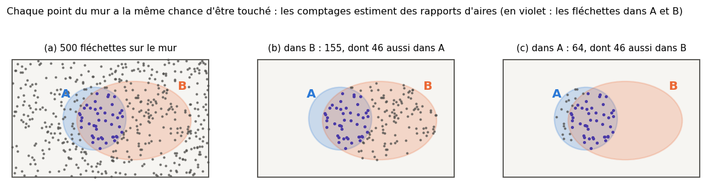
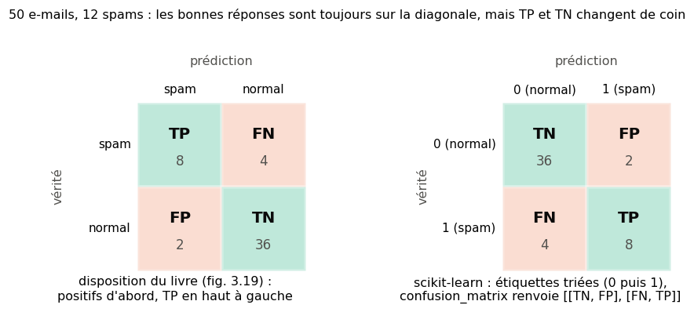
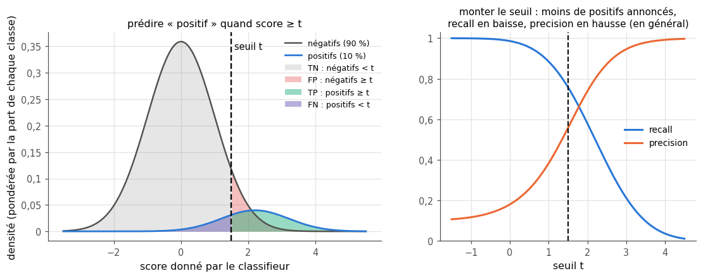
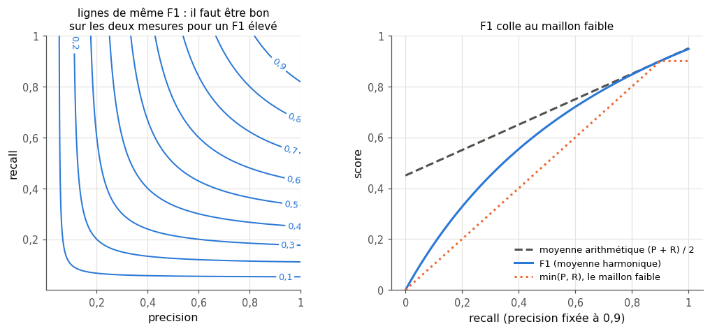
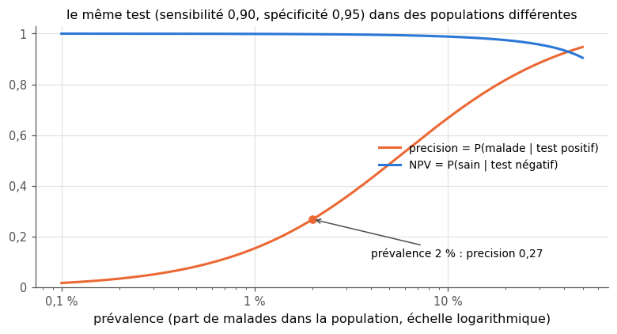
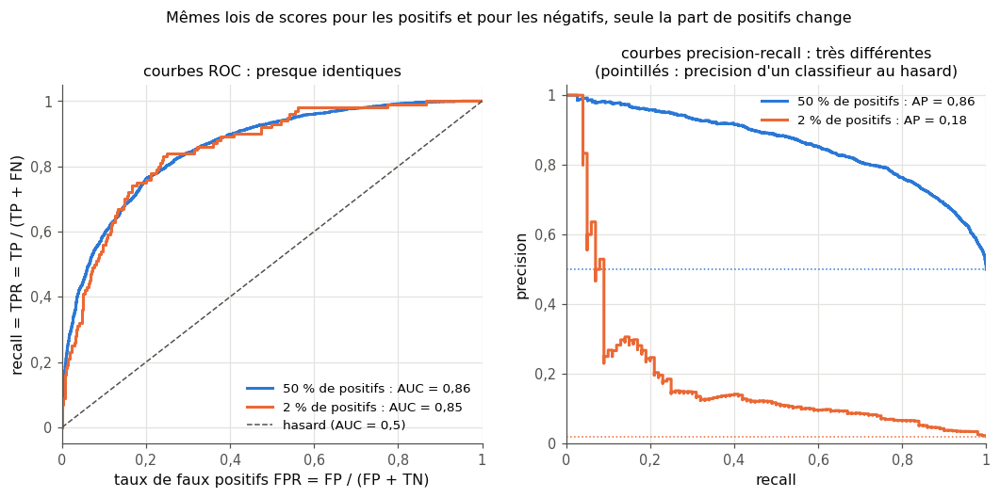
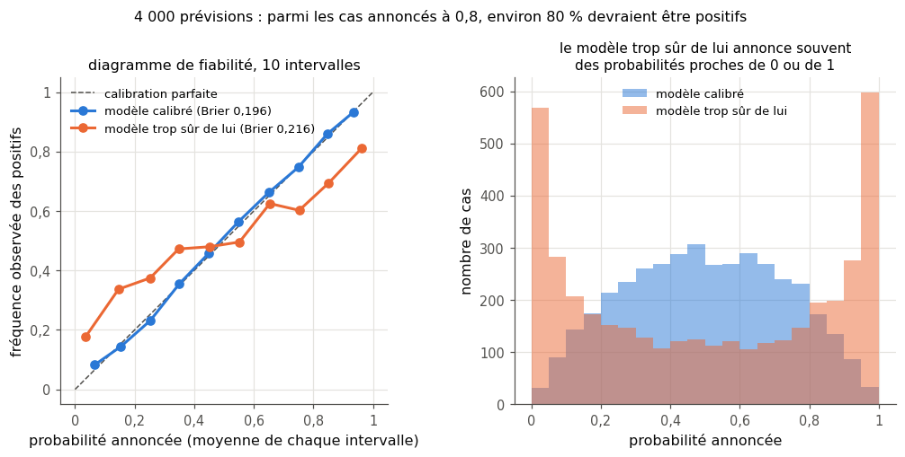

# 3 · Probabilités et mesure de la qualité — fiche de cours

> Cette fiche accompagne le chapitre 3 du livre. Le livre construit l'intuition des probabilités avec des fléchettes lancées sur un mur peint, puis s'en sert pour une question très concrète : comment juger un classifieur ? La fiche ajoute les formules, un mini-exemple chiffré par notion et les conventions de scikit-learn. Elle ajoute aussi des outils standard que le livre laisse de côté : les courbes ROC et precision-recall, les moyennes sur plusieurs classes et la calibration des probabilités. Les dessins et les histoires du livre (taches de peinture, figurines, maladie imaginaire) ne sont que résumés ici : chaque section te dit où les lire.

| | |
|---|---|
| **Livre** | vol. 1, ch. 3 « Probability », p. 97-152 (§3.1 à §3.8) |
| **Temps total estimé** | ≈ 19 h : lecture du livre et de la fiche ≈ 4,2 h, exercices ≈ 13,4 h, 30 flashcards ≈ 1,0 h |
| **Prérequis** | 0A (pandas : `value_counts`, `groupby`, filtres) · 0B (ensembles : intersection, union, complémentaire ; indépendance) · ch. 1 (jeu de test, vocabulaire de la classification) · ch. 2 (loi uniforme, loi de Bernoulli, tirages avec ou sans remise, graine ; `mylearn.stats`) |
| **Fichiers du chapitre** | `02_exercices.md` (quiz, rappels, papier, réflexion, entretien) · `03_notebook.ipynb` · `04_indices.md` · `05_solutions.md` et `05_solutions.ipynb` · `06_mes_reponses.md` · `flashcards.csv` |
| **mylearn** | `metrics.py` : 14 fonctions (matrice de confusion, accuracy, precision, recall, F-beta et F1, toutes les mesures d'une matrice binaire, courbes ROC et precision-recall avec leurs aires, calibration), écrites dans le notebook (3.15, 3.16, 3.19, 3.24, 3.25, 3.26, 3.28) et réutilisées dans tous les chapitres suivants |

## Comment utiliser ce chapitre

Le chapitre a deux moitiés très différentes. La première (§3.1 à §3.6) parle de probabilités : simple, conditionnelle, jointe et marginale, d'abord avec des aires, puis avec des tableaux de comptages. La seconde (§3.7 et §3.8) est l'une des plus utiles du workbook pour ton futur métier. On y apprend les mesures de la qualité d'un classifieur : tu les calculeras dans chaque projet, et on te demandera de les expliquer en entretien. Rien ne dépasse 0B, sauf quatre notions introduites dans des encadrés 🧮 : les tables de contingence avec `pd.crosstab`, la moyenne harmonique, le score et le seuil de décision, l'aire sous une courbe par la méthode des trapèzes. Tu programmeras chaque mesure dans `mylearn.metrics`, puis tu la compareras à scikit-learn.

**Ordre conseillé.**
1. Lis le livre §3.1 à §3.6 et les sections correspondantes de la fiche. Fais ensuite les quiz Q1 à Q5, les rappels R1 et R2, les exercices papier 3.1, 3.3 et 3.4, puis la partie A du notebook (3.12 à 3.14 : fléchettes simulées et tables de contingence).
2. Lis le livre §3.7 à §3.7.11 et les sections correspondantes de la fiche (la section « plusieurs classes » peut attendre). Fais les quiz Q6 à Q11, le rappel R3, les exercices papier 3.2 et 3.5 et l'oral 3.9, puis la partie B du notebook (3.15 à 3.19 : la matrice de confusion et les mesures dans `mylearn.metrics`).
3. Lis le livre §3.8, puis, dans la fiche, la section « plusieurs classes » et la §3.8. Fais le quiz Q12, les exercices papier 3.6 à 3.8 et le cas 3.10, puis la partie C du notebook (3.20 à 3.23 : seuil, prévalence, outils de scikit-learn). Termine par les questions d'entretien E1, E2 et E4.
4. Lis les trois dernières sections « au-delà du livre » de la fiche (ROC, precision-recall, calibration). Fais l'article 3.11, la partie D du notebook (3.24 à 3.29) et les questions d'entretien E3 et E5.

| Section | Quiz 🧠 et rappels 🔁 | Papier ✏️ ∂ et réflexion | Notebook | Entretien 💼 |
|---|---|---|---|---|
| 3.1 Pourquoi ce chapitre | Q1 | | 3.28 | E5 |
| 3.2 et 3.3 Fléchettes, probabilité simple | Q2 | 3.1 | 3.12 | |
| 3.4 Probabilité conditionnelle | Q3, R1 | 3.1, 3.3 | 3.13, 3.14 | |
| 3.5 Probabilité jointe | Q4, R2 | 3.3, 3.4 | 3.14 | |
| 3.6 Probabilité marginale | Q5, R3 | 3.3, 3.4 | 3.14 | |
| 3.7.1 et 3.7.2 Classer, matrice de confusion | Q6, Q7 | 3.2 | 3.15, 3.17 | |
| 3.7.3 et 3.7.4 Interpréter, erreurs acceptables | Q8 | 3.7, 3.10 | 3.17, 3.20, 3.29 | E2 |
| 3.7.5 à 3.7.8 Accuracy, precision, recall | Q9, Q10 | 3.2, 3.9 | 3.16, 3.20, 3.23 | E1, E2 |
| 3.7.9 Autres mesures, plusieurs classes | Q11 | 3.5, 3.6 | 3.19, 3.22, 3.25 | E4 |
| 3.7.10 Precision et recall ensemble | Q11 | 3.11 | 3.18, 3.20, 3.22 | |
| 3.7.11 Score F1 | Q12 | 3.2, 3.6, 3.8 | 3.16, 3.25 | E4 |
| 3.8 La prévalence | Q12 | 3.7, 3.10 | 3.21 | E1 |
| Au-delà du livre : ROC, PR, calibration | | 3.11 | 3.24, 3.26 à 3.29 | E3, E5 |

**Lire les formules.** $P(A)$ est la probabilité de l'événement $A$ ; $P(A \mid B)$ se lit « A sachant B » et $P(A, B)$ « A et B » ; « non $A$ » est l'événement contraire. Le livre écrit $P(A, B)$ et « non $A$ » là où 0B écrivait $P(A \cap B)$ et $\bar{A}$ : ce sont les mêmes objets, et la fiche suit le livre. TP, FP, FN et TN sont les quatre cases de la matrice de confusion (vrais positifs, faux positifs, faux négatifs, vrais négatifs) ; $P$ et $R$ désignent la precision et le recall quand il n'y a pas d'ambiguïté avec une probabilité ; $n$ est le nombre d'échantillons (BIBLE §6).

## Objectifs d'apprentissage

À la fin du chapitre, tu sais :
- **calculer** des probabilités simples, conditionnelles, jointes et marginales à partir d'aires, de comptages ou d'une table ;
- **construire** une matrice de confusion et en **tirer** accuracy, precision, recall, spécificité, F1 et les autres mesures ;
- **choisir** la mesure adaptée au coût des faux positifs et des faux négatifs d'un problème ;
- **expliquer** pourquoi, quand la maladie est rare, la plupart des résultats positifs d'un très bon test peuvent être faux ;
- **implémenter et interpréter** la courbe ROC, l'AUC, la courbe precision-recall et l'average precision ;
- **distinguer** les moyennes macro, micro et pondérée quand il y a plusieurs classes ;
- **vérifier** la calibration de probabilités prédites (diagramme de fiabilité, score de Brier).

## L'essentiel en 10 lignes

1. Si chaque point d'un mur a la même chance d'être touché, la probabilité de toucher une région est le **rapport de son aire à celle du mur** ; en lançant beaucoup de fléchettes, les comptages **estiment** ces rapports.
2. $P(A \mid B)$ est la probabilité de $A$ quand on sait déjà que $B$ s'est produit : on ne regarde plus que $B$. En général, $P(A \mid B) \neq P(B \mid A)$.
3. La **probabilité jointe** $P(A, B)$ ($A$ et $B$ à la fois) suit la **règle du produit** : $P(A, B) = P(A \mid B)\,P(B) = P(B \mid A)\,P(A)$.
4. Dans une **table de contingence**, les totaux des lignes et des colonnes (les marges) donnent les **probabilités marginales**.
5. Pour juger un classifieur à deux classes, on range ses prédictions face à la **vérité terrain** dans une **matrice de confusion** : vrais positifs, faux positifs, faux négatifs, vrais négatifs.
6. **Accuracy** (*exactitude*) : la part de bonnes réponses. **Precision** (*précision*, un mot ambigu en français) : la part de vrais positifs parmi les positifs annoncés. **Recall** (*rappel* ou *sensibilité*) : la part des positifs retrouvés.
7. Une mesure seule est facile à truquer : tout déclarer positif donne un recall de 1. Le **F1**, moyenne harmonique de la precision et du recall, reste bas dès que l'une des deux est basse.
8. Le **coût des erreurs** décide de la mesure à surveiller : un faux négatif et un faux positif n'ont presque jamais le même prix.
9. Quand la maladie est rare, la plupart des résultats positifs d'un très bon test peuvent être faux : la precision dépend de la **prévalence**.
10. Au-delà du livre : un modèle donne des **scores**. On évalue alors tous les seuils à la fois avec les courbes **ROC** et **precision-recall** (et leurs aires), et on vérifie que les probabilités annoncées sont **calibrées**.

## 3.1 · Pourquoi ce chapitre ?

Ouvre la documentation de n'importe quel outil de ML : les probabilités sont partout. `predict_proba` renvoie une probabilité par classe ; `train_test_split(..., stratify=y)` conserve la part de chaque classe ; beaucoup de méthodes supposent des données « i.i.d. » (ch. 2), et le bootstrap tire « avec remise ». Si l'un de ces mots t'échappe, tu risques d'utiliser un outil là où ses hypothèses ne tiennent pas. Le livre n'en présente que les bases utiles au ML (§3.1).

Une probabilité est un nombre entre 0 et 1, qu'on écrit aussi en pourcentage : 0,25 = 25 %. Aux deux bouts de l'échelle, 0 correspond à l'impossible et 1 au certain. Entre les deux, une probabilité peut aussi chiffrer un **degré de confiance** : « je parie à 90 % que le train aura du retard ». Une telle confiance se vérifie. Si, parmi tous tes paris « à 90 % », environ 9 sur 10 se réalisent, ta confiance est **calibrée** (*calibrated*). Le livre cite cet usage sans aller plus loin ; la fiche y revient dans sa dernière section.

La seconde moitié du chapitre applique ces idées à l'évaluation des modèles : juger un classifieur, c'est calculer des probabilités sur un tableau de comptages.

## 3.2 · Lancer des fléchettes

Le livre raisonne avec un mur couvert de taches de peinture, sur lequel on lance des fléchettes (§3.2). La règle qu'il en tire tient en une ligne : **la probabilité de toucher une région est le rapport de son aire à l'aire du mur**. Elle repose sur deux conventions :
- aucune fléchette ne manque le mur, et le mur est découpé en régions, le fond compris : les probabilités de toutes les régions font 1 ensemble ;
- le point d'impact suit une loi uniforme sur le mur (ch. 2) : aucun endroit n'est favorisé.

Un vrai joueur vise le centre ; la seconde convention est donc fausse en pratique. Sans elle, pourtant, une grande tache ne serait pas forcément touchée plus souvent qu'une petite, et le rapport d'aires ne voudrait plus rien dire.

*Mini-exemple.* Un mur de 5 m × 3 m (15 m²) porte une tache de 3 m². Une fléchette la touche avec la probabilité $\frac{3}{15} = 0{,}2$. Si l'on double toutes les longueurs (mur et tache), les aires sont multipliées par 4 et le rapport reste 0,2 : une probabilité est un rapport d'aires, elle ne dépend pas de l'unité de longueur.

On peut aussi faire l'inverse et **estimer** une aire en lançant des fléchettes. On compte la part des impacts qui tombent dans la région : avec beaucoup de lancers, cette proportion s'approche du rapport des aires (l'écart typique diminue comme $1/\sqrt{n}$, 0B et ch. 2). Le livre illustre ce comptage avec des points placés à la main pour bien couvrir le mur, sans deux points trop proches (figure 3.6) ; la figure ci-dessous le refait avec de vrais tirages au hasard et deux taches de notre choix.



## 3.3 · Probabilité simple

Un **événement** est quelque chose qui peut se produire ou non : « la fléchette tombe dans la tache A », « le manchot est un Gentoo », « l'e-mail est un spam ». On le note par une majuscule, et sa probabilité s'écrit $P(A)$. Avec les fléchettes :

$$P(A) = \frac{\text{aire}(A)}{\text{aire}(\text{mur})}.$$

L'événement contraire « non $A$ » (la fléchette tombe hors de $A$) a pour probabilité $1 - P(A)$ (0B). On appelle $P(A)$ la **probabilité simple** de $A$ (*simple probability*), ou **probabilité marginale** (*marginal probability*) quand on la lit dans les totaux d'un tableau (§3.6).

## 3.4 · Probabilité conditionnelle

Deux taches, maintenant. On sait que la fléchette est tombée dans $B$ : quelle chance a-t-elle d'être aussi dans $A$ ? On note ce nombre $P(A \mid B)$, « probabilité de $A$ sachant $B$ » : c'est la **probabilité conditionnelle** (*conditional probability*). Tout se passe comme si $B$ devenait le nouveau mur :

$$P(A \mid B) = \frac{\text{aire}(A \cap B)}{\text{aire}(B)} = \frac{P(A, B)}{P(B)} \qquad (P(B) > 0),$$

où $A \cap B$ est la partie commune aux deux taches (0B) et $P(A, B)$ sa probabilité (§3.5). Pour l'**estimer**, on compte : $\frac{\text{fléchettes dans } A \text{ et } B}{\text{fléchettes dans } B}$. Sur la figure précédente, 155 fléchettes sont dans $B$, dont 46 aussi dans $A$ : $P(A \mid B) \approx \frac{46}{155} \approx 0{,}30$.

**L'ordre compte.** $P(B \mid A)$ garde le même numérateur (la partie commune), mais divise par l'aire de $A$. Sur la figure, 64 fléchettes sont dans $A$ : $P(B \mid A) \approx \frac{46}{64} \approx 0{,}72$, plus du double. Près des trois quarts de la petite tache $A$ sont dans $B$, alors que $B$ déborde largement de $A$. Deux cas extrêmes : si $A$ contient $B$, $P(A \mid B) = 1$ ; si $A$ et $B$ ne se touchent pas, $P(A \mid B) = 0$. Le livre prend l'exemple de la soif et de l'eau (§3.4) : la probabilité d'avoir soif sachant qu'on boit de l'eau n'est pas celle de boire de l'eau sachant qu'on a soif.

> ⚠️ **Piège classique — confondre $P(A \mid B)$ et $P(B \mid A)$** — « Ce test repère 99 % des malades » donne $P(\text{positif} \mid \text{malade})$. Le patient, lui, veut connaître $P(\text{malade} \mid \text{positif})$ ; ces deux nombres peuvent être très différents (§3.8 de la fiche, et ch. 4 pour passer de l'un à l'autre). Réflexe : écris toujours ta question avec le mot « sachant ».

> ⚠️ **L'indépendance, définie précisément** — Le livre évoque l'indépendance en passant, dans une phrase informelle du §3.4. La définition de 0B est plus précise : $A$ et $B$ sont **indépendants** si $P(A, B) = P(A)\,P(B)$, ce qui revient (quand $P(B) > 0$) à $P(A \mid B) = P(A)$ : savoir que $B$ s'est produit ne change rien à la probabilité de $A$. La soif et le fait de boire de l'eau ne sont pas indépendants, puisqu'on a plus souvent soif quand on boit. Le sexe et l'espèce des manchots le sont presque (§3.6).

## 3.5 · Probabilité jointe

Sur le mur, $P(A, B)$ garde le même numérateur que $P(A \mid B)$, la partie commune, mais divise par l'aire du **mur entier** au lieu de celle de $B$. On lit $P(A, B)$ « $A$ et $B$ » : c'est la **probabilité jointe** (*joint probability*), la probabilité que les deux événements se produisent à la fois. En multipliant par $P(B)$ la définition de $P(A \mid B)$, on obtient la **règle du produit** (*product rule*) :

$$P(A, B) = P(A \mid B)\,P(B) = P(B \mid A)\,P(A).$$

Elle se lit comme un chemin en deux étapes : pour tomber dans $A$ et $B$, il faut d'abord tomber dans $B$, puis, parmi les fléchettes de $B$, tomber aussi dans $A$. Le livre la retrouve en « simplifiant » des fractions d'aires dessinées (figures 3.11 à 3.13) ; l'exercice ∂ 3.4 en fait une vraie démonstration.

*Mini-exemple.* 30 % des e-mails d'une boîte contiennent un lien, et 20 % des e-mails avec lien sont des spams. Alors $P(\text{lien}, \text{spam}) = P(\text{spam} \mid \text{lien})\,P(\text{lien}) = 0{,}2 \times 0{,}3 = 0{,}06$. Sur 1 000 e-mails, on attend 300 e-mails avec lien, dont 60 spams.

Trois conséquences utiles. D'abord, $P(A, B) = P(B, A)$ : « A et B » est la même chose que « B et A ». Ensuite, $P(A, B) \le P(A)$ et $P(A, B) \le P(B)$, car la partie commune est plus petite que chaque tache. Enfin, si $A$ et $B$ sont indépendants, $P(A, B) = P(A)\,P(B)$. Le livre termine par l'exemple d'un glacier qui vend de la vanille ou du chocolat, en cornet ou en pot (§3.5) ; l'exercice 3.3 lui donne des chiffres.

## 3.6 · Probabilité marginale et tables de contingence

Quand on observe deux variables catégorielles sur les mêmes individus, on range les comptages dans une **table de contingence** (*contingency table*) : une ligne par valeur de la première variable, une colonne par valeur de la seconde. Les totaux des lignes et des colonnes s'écrivent dans les **marges** (*margins*) du tableau et donnent les **probabilités marginales**, d'où leur nom ; le livre raconte l'origine, peut-être légendaire, du mot (§3.6). Voici les 333 manchots dont le sexe est connu :

| | Adélie | Chinstrap | Gentoo | **total** |
|---|---|---|---|---|
| **femelle** | 73 | 34 | 58 | **165** |
| **mâle** | 73 | 34 | 61 | **168** |
| **total** | **146** | **68** | **119** | **333** |

- Probabilité **marginale** : $P(\text{femelle}) = \frac{165}{333} \approx 0{,}495$ et $P(\text{Gentoo}) = \frac{119}{333} \approx 0{,}357$.
- Probabilité **jointe** : $P(\text{femelle}, \text{Gentoo}) = \frac{58}{333} \approx 0{,}174$ (une case divisée par le total).
- Probabilités **conditionnelles** : $P(\text{femelle} \mid \text{Gentoo}) = \frac{58}{119} \approx 0{,}487$ (une case divisée par le total de sa **colonne**) et $P(\text{Gentoo} \mid \text{femelle}) = \frac{58}{165} \approx 0{,}352$ (divisée par le total de sa **ligne**).

Chaque marge est la somme des probabilités jointes de sa ligne ou de sa colonne : $P(\text{femelle}) = P(\text{femelle}, \text{Adélie}) + P(\text{femelle}, \text{Chinstrap}) + P(\text{femelle}, \text{Gentoo})$. En général, si une variable $B$ (ici l'espèce) prend les valeurs $b$ (Adélie, Chinstrap, Gentoo), l'événement « $B = b$ » est « l'espèce est $b$ », et

$$P(A) = \sum_b P(A, B = b) = \sum_b P(A \mid B = b)\,P(B = b),$$

la **formule des probabilités totales** (*law of total probability*, ∂ 3.4). Les probabilités jointes de toute la table somment à 1, comme les probabilités marginales d'une même variable : chaque manchot est compté une fois et une seule. Ici, $P(\text{femelle} \mid \text{Gentoo}) \approx 0{,}487$ est très proche de $P(\text{femelle}) \approx 0{,}495$ : connaître l'espèce ne change presque rien à la probabilité d'être une femelle. Le sexe et l'espèce sont presque **indépendants** (et, en effet, $0{,}495 \times 0{,}357 \approx 0{,}177$, très proche de 0,174). Tu feras le même examen pour l'espèce et l'île en 3.14.

> 🧮 **Rappel outil — une table de contingence avec `pd.crosstab`** — `pd.crosstab(lignes, colonnes)` compte les couples de valeurs de deux colonnes. `margins=True` ajoute les totaux (ligne et colonne `All`). `normalize=` divise les comptages : `"all"` par le total (probabilités jointes), `"index"` par le total de chaque ligne (chaque ligne somme à 1 : la probabilité de la colonne **sachant** la ligne), `"columns"` par le total de chaque colonne (la probabilité de la ligne **sachant** la colonne).
> ```python
> >>> import pandas as pd
> >>> import wb
> >>> df = wb.datasets.load_penguins().dropna(subset=["sex"])
> >>> pd.crosstab(df["sex"], df["species"], margins=True)
> species  Adelie  Chinstrap  Gentoo  All
> sex
> female       73         34      58  165
> male         73         34      61  168
> All         146         68     119  333
> >>> pd.crosstab(df["sex"], df["species"], normalize="columns").round(3)   # P(sex | species)
> species  Adelie  Chinstrap  Gentoo
> sex
> female      0.5        0.5   0.487
> male        0.5        0.5   0.513
> >>> pd.crosstab(df["sex"], df["species"], normalize="index").round(3)     # P(species | sex)
> species  Adelie  Chinstrap  Gentoo
> sex
> female    0.442      0.206   0.352
> male      0.435      0.202   0.363
> ```
> Pour une seule variable, `df["species"].value_counts(normalize=True)` donne directement ses probabilités marginales (0A, rappel R3).

> ⚠️ **Piège classique — deux marges ne font pas une table** — Connaître les totaux des lignes et des colonnes ne suffit pas pour reconstruire la table, sauf si les deux variables sont indépendantes : chaque case vaut alors (total de la ligne × total de la colonne) / total général.

## 3.7 · Mesurer la qualité d'un classifieur

La seconde moitié du chapitre répond à une question de métier : mon classifieur est-il bon, et **en quoi** se trompe-t-il ? Un taux d'erreur global mélange des erreurs de nature différente : un spam qui arrive dans la boîte et une facture classée en spam n'ont ni la même cause ni le même prix. Pour améliorer un modèle, il faut les compter séparément. Le livre se limite ici à deux classes (§3.7) ; plusieurs classes, c'est plus bas dans la fiche et au ch. 7.

Un mot de vocabulaire. En métrologie, *accuracy* et *precision* ont un autre sens : la « précision » d'un appareil y décrit la dispersion de ses mesures. En français, on lit parfois « exactitude » ou « justesse » pour *accuracy*, « précision » pour *precision*, « rappel » ou « sensibilité » pour *recall*. Le workbook garde les mots anglais, comme en entreprise (BIBLE §5) : « précision » serait ambigu.

### 3.7.1 Classer des échantillons ⏩

Un classifieur binaire répond par oui ou par non à une question sur chaque échantillon : « est-ce un spam ? ». La **classe positive** (*positive class*) est celle qu'on cherche (spam, maladie, fraude) ; ce n'est pas un jugement de valeur, un positif est souvent une mauvaise nouvelle. L'autre classe est la **classe négative** (*negative class*).

- La **vérité terrain** (*ground truth*) est l'étiquette qu'on **tient pour** correcte, fournie par un humain qui a vérifié ou par un test fiable mais coûteux. Elle peut elle-même contenir des erreurs d'étiquetage.
- La **prédiction** est ce que répond le classifieur.
- Dans l'espace des features, la **frontière de décision** (*decision boundary*) sépare la région où le classifieur répond « positif » de celle où il répond « négatif ». Le livre la dessine avec les petits triangles des fronts sur les cartes météo, tournés vers le côté positif (§3.7.1, 20 points de la figure 3.17).

On mesure la qualité sur un **jeu de test** qui n'a pas servi à l'entraînement (ch. 1), sinon les scores sont trop beaux. *Exemple fil conducteur de la fiche* : un filtre anti-spam est testé sur 50 e-mails, dont 12 spams. Il signale 10 e-mails comme spams : 8 en sont vraiment, 2 sont des e-mails normaux. Il laisse passer 4 spams.

### 3.7.2 La matrice de confusion ⏩

La **matrice de confusion** (*confusion matrix*) croise la vérité (en lignes) et la prédiction (en colonnes). Avec deux classes, elle a quatre cases :

- **TP**, vrai positif (*true positive*) : positif, prédit positif ;
- **FN**, faux négatif (*false negative*) : positif, prédit négatif ;
- **FP**, faux positif (*false positive*) : négatif, prédit positif ;
- **TN**, vrai négatif (*true negative*) : négatif, prédit négatif.

Règle de lecture : le second mot est la **prédiction**, le premier dit si elle est juste. Un faux négatif est une prédiction « négatif » erronée : un positif manqué. Pour le filtre anti-spam : TP = 8, FN = 4, FP = 2, TN = 36, et la somme des quatre cases vaut 50. Les bonnes réponses sont sur la **diagonale** principale, tant que les lignes et les colonnes rangent les classes dans le même ordre. Avec $K$ classes, la matrice a $K \times K$ cases, et la diagonale contient encore les bonnes réponses (3.6, 3.25).



> 🕰️ **Mise à jour (2026)** — **Le livre :** met la vérité en lignes, la prédiction en colonnes et les positifs d'abord, donc TP en haut à gauche (figure 3.19) ; il prévient qu'il n'y a pas de convention universelle. · **Aujourd'hui :** avec scikit-learn, `confusion_matrix(y_true, y_pred)` renvoie une matrice $C$ où $C_{i,j}$ compte les échantillons de classe vraie $i$ prédits dans la classe $j$ (vérité en lignes, prédiction en colonnes), et les étiquettes sont **triées**. Pour des étiquettes 0 et 1, on obtient donc `[[TN, FP], [FN, TP]]` : TN en haut à gauche, TP en bas à droite. `ConfusionMatrixDisplay` dessine cette matrice avec ses axes « True label » et « Predicted label ». D'autres outils font l'inverse : la fonction `confusionMatrix` du paquet R *caret*, par exemple, met la prédiction en lignes et la vérité en colonnes. · **Faut-il quand même l'apprendre ?** Oui, parce que la notion est la même partout ; mais **lis les étiquettes des axes à chaque fois**. `mylearn.metrics` suit la convention de scikit-learn (le 🐛 3.17 en montre le piège). · *Sources :* [documentation de `sklearn.metrics.confusion_matrix`](https://scikit-learn.org/1.6/modules/generated/sklearn.metrics.confusion_matrix.html) ; [documentation de *caret*, « Measuring performance »](https://topepo.github.io/caret/measuring-performance.html).

```python
>>> from sklearn.metrics import confusion_matrix
>>> y_true = [1] * 12 + [0] * 38                  # 12 spams (1), then 38 normal e-mails (0)
>>> y_pred = [1] * 8 + [0] * 4 + [1] * 2 + [0] * 36
>>> confusion_matrix(y_true, y_pred)
array([[36,  2],
       [ 4,  8]])
```

### 3.7.3 Interpréter la matrice de confusion ⏩

Le livre raconte une maladie imaginaire, grave, qu'un test sanguin rapide doit repérer ; un test lent mais parfait donne la vérité terrain (§3.7.3). « Positif » veut dire « malade ». Chaque case a sa conséquence : un vrai positif est soigné à temps, un vrai négatif rentre chez lui à raison. Un faux positif subit un traitement lourd pour rien, et un faux négatif rentre chez lui malade.

Avant de chiffrer quoi que ce soit, le livre met en garde contre les questions trop étroites (§3.7.3). Transpose l'idée au filtre anti-spam. Un filtre qui envoie **tout** dans les spams n'en laisse passer aucun ; un filtre qui ne bloque **rien** n'envoie jamais une facture dans les spams. Chacun a un score parfait sur une ligne de la matrice, et ne sert à rien. Une mesure qui ne regarde qu'une ligne se laisse donc berner : il en faut plusieurs, qui regardent la matrice sous des angles différents.

### 3.7.4 Quand une erreur est acceptable ⏩

Un faux positif et un faux négatif ont rarement le même coût, et la bonne règle de décision dépend du contexte. Le livre l'illustre avec une usine de figurines, où deux contrôles successifs demandent des règles opposées (§3.7.4). Deux exemples de plus :
- **détection de fraude bancaire** (positif = fraude) : un faux négatif coûte l'argent volé, un faux positif coûte un appel de vérification au client. On tolère des faux positifs pour réduire les faux négatifs ;
- **filtre anti-spam** (positif = spam) : un faux positif envoie un vrai e-mail (une offre d'emploi, une facture) dans les spams. Mieux vaut laisser passer quelques spams.

Réflexe professionnel : **écris le coût de chaque type d'erreur avant de choisir une mesure**. Les exercices 3.20 et 3.29 montrent comment régler ensuite le **seuil de décision** (§3.7.10) selon ces coûts.

### 3.7.5 Accuracy ⏩

$$\text{accuracy} = \frac{TP + TN}{TP + TN + FP + FN},$$

la part de bonnes réponses, entre 0 et 1. Pour le filtre anti-spam : $\frac{8 + 36}{50} = 0{,}88$. (Dans la légende de la figure 3.23, « 6 red circles » désigne les 6 cercles **verts** bien classés.)

Ce seul nombre mélange les deux sortes d'erreurs, et il trompe quand les classes sont déséquilibrées. Sur 2 000 transactions dont 30 frauduleuses, un modèle qui répond toujours « pas de fraude » a une accuracy de 0,985 et ne détecte rien. Compare toujours une accuracy à celle de la classe majoritaire (ch. 1), et donne d'autres mesures.

### 3.7.6 Precision ⏩

$$\text{precision} = \frac{TP}{TP + FP}$$

On ne regarde que la colonne « prédit positif » de la matrice : parmi les alertes du modèle, quelle part était fondée ? Pour le filtre anti-spam, 8 des 10 e-mails bloqués étaient des spams : $\frac{8}{10} = 0{,}8$. Les deux autres, des e-mails normaux, sont les fausses alertes (FP). En médecine, on parle de **valeur prédictive positive** (VPP ; *positive predictive value*, PPV). Les 4 spams passés (FN) n'entrent pas dans le calcul : un modèle très prudent peut avoir une precision parfaite et rater presque tout (§3.7.10).

### 3.7.7 Recall ⏩

$$\text{recall} = \frac{TP}{TP + FN}$$

C'est, parmi les échantillons réellement positifs (TP + FN), la part que le modèle retrouve. On l'appelle aussi **sensibilité** (*sensitivity*), taux de vrais positifs (*true positive rate*, TPR) ou taux de détection (*hit rate*). Il répond à la question « est-ce que je rate des cas ? ». Filtre anti-spam : $\frac{8}{12} \approx 0{,}667$, donc un spam sur trois passe. Le recall ignore les fausses alertes : les FP n'y apparaissent pas.

Attention à la légende de la figure 3.27 du livre : il y manque le mot « correctement ». Au numérateur du recall, on ne compte que les éléments de la classe A **étiquetés A**, pas tous les éléments étiquetés A.

### 3.7.8 Precision et recall : l'exemple de la recherche ⏩

Le livre prend l'exemple d'une recherche dans le wiki interne d'une entreprise (§3.7.8). Le mot *recall* vient de ce domaine, la recherche d'information : on y parle des documents qu'un moteur « fait revenir » (*recalls*, *retrieves*) pour une requête.
- La **precision** est la part de résultats pertinents parmi les résultats renvoyés : un moteur imprécis noie les bons résultats dans le bruit.
- Le **recall** est la part des documents pertinents que le moteur a retrouvés : un moteur au recall faible oublie des documents utiles.
- L'accuracy, elle, est presque inutile ici : les pages non pertinentes et non renvoyées (les TN) sont si nombreuses qu'elles écrasent tout.

À retenir en une phrase : **la precision juge les alertes, le recall juge les oublis.**

### 3.7.9 Les autres mesures ⏩

Le livre rassemble dans un tableau toutes les mesures qu'on peut tirer des quatre cases, en conseillant de ne pas les apprendre par cœur (figure 3.32). Les voici, avec leur valeur pour le filtre anti-spam :

| Mesure | Autres noms | Formule | Filtre anti-spam |
|---|---|---|---|
| spécificité (*specificity*) | taux de vrais négatifs (*true negative rate*, TNR) | $\frac{TN}{TN + FP}$ | $\frac{36}{38} \approx 0{,}947$ |
| NPV | valeur prédictive négative (VPN ; *negative predictive value*) | $\frac{TN}{TN + FN}$ | $\frac{36}{40} = 0{,}9$ |
| FPR | taux de faux positifs (*false positive rate*, *fall-out*), $1 - $ spécificité | $\frac{FP}{FP + TN}$ | $\frac{2}{38} \approx 0{,}053$ |
| FNR | taux de faux négatifs (*false negative rate*, *miss rate*), $1 - $ recall | $\frac{FN}{FN + TP}$ | $\frac{4}{12} \approx 0{,}333$ |
| FDR | taux de fausses découvertes (*false discovery rate*), $1 - $ precision | $\frac{FP}{FP + TP}$ | $\frac{2}{10} = 0{,}2$ |
| FOR | taux de fausses omissions (*false omission rate*), $1 - $ NPV | $\frac{FN}{FN + TN}$ | $\frac{4}{40} = 0{,}1$ |
| prévalence (*prevalence*) | part de positifs dans les données | $\frac{TP + FN}{n}$ | $\frac{12}{50} = 0{,}24$ |
| balanced accuracy | accuracy équilibrée | $\frac{\text{recall} + \text{spécificité}}{2}$ | $\approx 0{,}807$ |
| MCC | coefficient de corrélation de Matthews (*Matthews correlation coefficient*) | $\frac{TP \cdot TN - FP \cdot FN}{\sqrt{(TP + FP)(TP + FN)(TN + FP)(TN + FN)}}$ | $\approx 0{,}656$ |

Deux familles, faciles à retenir :
- les **taux** divisent par le total d'une **ligne** de la matrice, donc par le nombre de positifs réels (TP + FN) ou de négatifs réels (TN + FP) : recall, FNR, spécificité, FPR. Ils décrivent le test lui-même et ne dépendent pas de la proportion de positifs ;
- les **valeurs prédictives** divisent par le total d'une **colonne**, donc par le nombre de prédictions positives (TP + FP) ou négatives (TN + FN) : precision, FDR, NPV, FOR. Elles décrivent ce que vaut une réponse du test, et **dépendent de la prévalence** (§3.8).

Quatre paires s'additionnent à 1 : recall et FNR, spécificité et FPR, precision et FDR, NPV et FOR.

> 🕰️ **Mise à jour (2026)** — **Le livre :** retient l'accuracy, la precision, le recall et le F1, et range les autres mesures dans un tableau « à consulter au besoin » (§3.7.9). · **Aujourd'hui :** deux mesures qui restent parlantes quand les classes sont déséquilibrées sont d'usage courant. La **balanced accuracy** est la moyenne des recalls de chaque classe ; avec deux classes, $\frac{\text{recall} + \text{spécificité}}{2}$. Le **MCC** (coefficient de Matthews), entre −1 et +1, utilise les quatre cases : +1 pour une prédiction parfaite, 0 pour une prédiction au hasard, −1 pour une prédiction toujours inverse. La documentation de scikit-learn le décrit comme une mesure équilibrée, utilisable même quand les classes sont de tailles très différentes. Enfin, `classification_report` affiche d'un coup precision, recall, F1 et effectif (*support*) de chaque classe, avec les moyennes macro et pondérée. · **Faut-il quand même l'apprendre ?** Oui : ce sont les réflexes attendus face à des classes déséquilibrées, et `mylearn.metrics.classification_rates` calcule tout le tableau (3.19). · *Sources :* documentation scikit-learn : [`matthews_corrcoef`](https://scikit-learn.org/1.6/modules/generated/sklearn.metrics.matthews_corrcoef.html) et [« Metrics and scoring », mesures de classification](https://scikit-learn.org/1.6/modules/model_evaluation.html#classification-metrics).

### Au-delà du livre : plusieurs classes et moyennes macro, micro, pondérée

Le livre reste au cas binaire, mais on classe souvent en plus de deux classes : les trois espèces de manchots, les dix chiffres de MNIST. On calcule alors les mesures **classe par classe**, chaque classe devenant tour à tour la classe positive face à toutes les autres : c'est le schéma **un-contre-tous** (*one-vs-rest*). Puis on combine les valeurs de trois façons :
- **macro** : la moyenne simple des valeurs par classe. Chaque classe compte autant, même une classe rare ;
- **pondérée** (*weighted*) : la moyenne pondérée par l'effectif réel de chaque classe (son *support*). Les grandes classes pèsent plus ;
- **micro** : on additionne les TP, FP et FN de toutes les classes, puis on calcule **une seule** mesure. Quand chaque échantillon a exactement une classe, precision, recall et F1 micro valent tous l'accuracy.

*Mini-exemple.* Un classifieur d'images de chats, de chiens et de lapins est testé sur 30 images (10 chats, 15 chiens, 5 lapins) :

| vérité \ prédiction | chat | chien | lapin |
|---|---|---|---|
| **chat** | 8 | 2 | 0 |
| **chien** | 1 | 13 | 1 |
| **lapin** | 1 | 2 | 2 |

```python
>>> from sklearn.metrics import classification_report
>>> labels = ["chat", "chien", "lapin"]
>>> counts = [[8, 2, 0], [1, 13, 1], [1, 2, 2]]        # rows: truth, columns: prediction
>>> y_true, y_pred = [], []
>>> for i, row in enumerate(counts):
...     for j, k in enumerate(row):
...         y_true += [labels[i]] * k
...         y_pred += [labels[j]] * k
>>> print(classification_report(y_true, y_pred, digits=3))
              precision    recall  f1-score   support

        chat      0.800     0.800     0.800        10
       chien      0.765     0.867     0.812        15
       lapin      0.667     0.400     0.500         5

    accuracy                          0.767        30
   macro avg      0.744     0.689     0.704        30
weighted avg      0.760     0.767     0.756        30
```

Le lapin, rare et mal reconnu (recall 0,4), fait baisser le F1 macro (0,704) plus que le F1 pondéré (0,756). Le F1 micro vaut l'accuracy, 0,767 ; `classification_report` affiche d'ailleurs la ligne `accuracy` à la place d'une ligne « micro ». Choisis la moyenne macro si chaque classe compte autant, et regarde toujours les scores par classe (3.6, 3.22, 3.25, E4).

### 3.7.10 Utiliser precision et recall ensemble ⏩

Chacune des deux mesures, seule, est facile à truquer (§3.7.10, figures 3.35 à 3.38) :
- ne déclarer positif que le cas le plus évident donne une precision de 1 s'il est juste, mais un recall minuscule ;
- tout déclarer positif donne un recall de 1, mais une precision égale à la prévalence (la part de positifs).

On annonce donc toujours les deux, ou une mesure qui les combine (F1, §3.7.11), ou toute la courbe qui les relie (au-delà du livre, plus bas).

> 🧮 **Rappel maths — score, seuil de décision et balayage de seuils** — La plupart des classifieurs ne donnent pas directement une classe, mais un **score** : une probabilité (`predict_proba` dans scikit-learn), une distance, un nombre quelconque. (Ne confonds pas ce score, la sortie du modèle pour un échantillon, avec le « score » d'un modèle au sens de sa note globale, comme le score F1 ou le score de Brier.) La classe vient d'un **seuil de décision** (*decision threshold*) $t$ : on prédit « positif » quand score $\ge t$. Changer $t$ déplace la frontière de décision. En montant le seuil, on déclare moins de positifs : les FP diminuent et les FN augmentent. Le recall ne peut que baisser ou rester égal ; la precision monte en général, mais pas toujours (un contre-exemple est donné plus bas, avec la courbe precision-recall ; la figure de droite montre la tendance générale). Pour choisir $t$, on **balaie** tous les seuils possibles, c'est-à-dire toutes les valeurs distinctes des scores, et on calcule les mesures pour chacun.



Le livre raisonne avec une frontière déjà fixée, donc un seul seuil. Aujourd'hui, on évalue les scores eux-mêmes, sur tous les seuils à la fois : ce sont les courbes ROC et precision-recall.

### 3.7.11 Le score F1 ⏩

Le **F1** combine precision et recall par une **moyenne harmonique** :

$$F_1 = \frac{2PR}{P + R} = \frac{2\,TP}{2\,TP + FP + FN}.$$

Filtre anti-spam : $\frac{2 \times 8}{16 + 2 + 4} = \frac{16}{22} \approx 0{,}727$. D'après la seconde forme, $F_1$ vaut 0 quand aucun positif n'est trouvé (TP = 0), et 1 seulement sans aucune erreur (FP = FN = 0).

> 🧮 **Rappel maths — la moyenne harmonique** — La **moyenne harmonique** (*harmonic mean*) de deux nombres **strictement** positifs $a$ et $b$ est l'inverse de la moyenne de leurs inverses : $H = \frac{2}{\frac{1}{a} + \frac{1}{b}} = \frac{2ab}{a + b}$. Elle apparaît dès qu'on fait la moyenne de **taux** sur une même quantité. Tu fais l'aller à 90 km/h et le retour, sur la même route, à 45 km/h : ta vitesse moyenne est de 60 km/h, et non de 67,5, car tu roules deux fois plus longtemps au retour (∂ 3.8 en traite un autre cas). Elle reste toujours entre le plus petit des deux nombres et leur moyenne ordinaire, et ne dépasse jamais le double du plus petit : elle **colle au maillon faible**. Avec une precision de 0,8 et un recall de 0,2, la moyenne ordinaire vaut 0,5, mais le F1 vaut $\frac{2 \times 0{,}8 \times 0{,}2}{1} = 0{,}32$.



Le **F-beta** généralise le F1 en donnant plus de poids au recall ($\beta > 1$) ou à la precision ($\beta < 1$) :

$$F_\beta = \frac{(1 + \beta^2)\,P R}{\beta^2 P + R} = \frac{(1 + \beta^2)\,TP}{(1 + \beta^2)\,TP + \beta^2 FN + FP}.$$

Avec $\beta = 2$, chaque faux négatif pèse 4 fois plus qu'un faux positif au dénominateur. Filtre anti-spam : $F_2 \approx 0{,}690$ et $F_{0,5} \approx 0{,}769$ ; le filtre est meilleur en precision qu'en recall.

> ⚠️ **Ce que le F1 ne voit pas** — Le F1 n'utilise pas les vrais négatifs. C'est parfait en recherche d'information, où les TN sont innombrables et sans intérêt. C'est trompeur quand bien reconnaître les négatifs compte aussi. Et il change si l'on échange les rôles de « positif » et « négatif » : dis toujours quelle classe est positive.

## 3.8 · Appliquer la matrice de confusion : le piège de la prévalence ⏩

Le livre revient à sa maladie imaginaire avec des chiffres : un test sanguin repère presque tous les malades et se trompe rarement sur les personnes saines, dans une ville où 1 % des habitants sont malades (§3.8). Question : une personne dont le test est positif est-elle probablement malade ? La réponse surprend presque tout le monde.

La méthode la plus sûre est l'**arbre des fréquences naturelles** (*natural frequency tree*) : on part d'une population entière et on suit des effectifs plutôt que des probabilités. Prenons un autre test que celui du livre : sensibilité (recall) 0,90, spécificité 0,95, dans une population de 10 000 personnes où la **prévalence**, la part de malades, vaut 2 %.

| | test positif | test négatif | total |
|---|---|---|---|
| **malade** | TP = 0,90 × 200 = **180** | FN = **20** | 200 (2 %) |
| **sain** | FP = 0,05 × 9 800 = **490** | TN = 0,95 × 9 800 = **9 310** | 9 800 |
| **total** | 670 | 9 330 | 10 000 |

- Precision : $P(\text{malade} \mid \text{positif}) = \frac{180}{670} \approx 0{,}27$. Près de **trois positifs sur quatre sont sains**.
- NPV : $P(\text{sain} \mid \text{négatif}) = \frac{9\,310}{9\,330} \approx 0{,}998$. Un résultat négatif rassure beaucoup.
- Accuracy : $\frac{180 + 9\,310}{10\,000} \approx 0{,}95$, un chiffre flatteur qui ne répond pas à la question du patient.

Pourquoi ? Compte les fausses alertes : 5 % de 9 800 personnes saines, cela fait 490 personnes, plus que les 180 malades détectés (90 % de 200). Plus la maladie est rare, plus les faux positifs l'emportent, même avec un bon test. La figure montre la precision du même test quand la prévalence change.



Trois conséquences pratiques (le livre tire la première) :
1. un test de dépistage positif appelle un **test de confirmation**, plus fiable (et souvent plus coûteux) ;
2. la precision mesurée dans un hôpital, où la prévalence est élevée, ne vaut pas pour un **dépistage de masse** : recalcule-la avec la prévalence de la population visée (3.7, 3.10, 3.21) ;
3. cibler le dépistage sur des personnes à risque **augmente la prévalence**, donc la precision.

Oublier la prévalence porte un nom : l'**erreur du taux de base** (*base rate fallacy*). Le livre rappelle qu'elle a eu des conséquences réelles, notamment en cancérologie (§3.8). La precision est une probabilité conditionnelle « à l'envers » du recall : le recall vaut $P(\text{positif} \mid \text{malade})$, la precision $P(\text{malade} \mid \text{positif})$. Le ch. 4 (règle de Bayes) passe de l'une à l'autre grâce à la prévalence.

> ⚠️ **Deux phrases à vérifier dans le livre** — Au §3.8, le livre commente deux fois la spécificité de son test (son taux de vrais négatifs, 0,98) avec des phrases qui ne la décrivent pas. La première traduit ce 0,98 par « quand le test dit « non malade », il a raison 98 fois sur 100 ». La seconde tire une spécificité « presque égale à 1 » de l'unique malade déclaré négatif. Relis la définition de la spécificité (§3.7.9) : quelles cases de la matrice entrent dans son calcul ? L'exercice 3.7 (k à m) te fait trouver quelle mesure ces phrases décrivent vraiment.

## Au-delà du livre (1) : la courbe ROC et l'AUC

La courbe **ROC** (*receiver operating characteristic*, un nom hérité de la théorie de la détection du signal) montre tous les seuils à la fois. Pour chaque seuil $t$, on place le point (FPR, recall) : le taux de faux positifs en abscisse, le taux de vrais positifs en ordonnée. La courbe va de $(0, 0)$ (seuil $+\infty$ : rien n'est déclaré positif) à $(1, 1)$ (seuil très bas : tout est positif). La diagonale correspond à un classifieur qui tire au hasard ; plus la courbe monte vite vers le coin $(0, 1)$, meilleur est le classement.

*Mini-exemple.* Six échantillons, triés par score décroissant :

| score | 0,9 | 0,8 | 0,7 | 0,4 | 0,3 | 0,1 |
|---|---|---|---|---|---|---|
| classe | + | − | + | + | − | − |

On part de $(0, 0)$ et on descend la liste : chaque positif fait monter d'un cran de $\frac{1}{3}$ (il y a 3 positifs), chaque négatif fait avancer d'un cran de $\frac{1}{3}$ vers la droite (3 négatifs). Les points sont $(0, 0)$, $(0, \frac{1}{3})$, $(\frac{1}{3}, \frac{1}{3})$, $(\frac{1}{3}, \frac{2}{3})$, $(\frac{1}{3}, 1)$, $(\frac{2}{3}, 1)$, $(1, 1)$. Des scores égaux se traitent ensemble : ils forment un seul seuil, donc un seul point.

> 🧮 **Rappel maths — l'aire sous une courbe par la méthode des trapèzes** — On relie les points consécutifs par des segments. Sous chaque segment, entre $x_i$ et $x_{i+1}$, on a un **trapèze** d'aire $(x_{i+1} - x_i) \times \frac{y_i + y_{i+1}}{2}$ : la largeur fois la hauteur moyenne. L'aire totale est la somme des trapèzes ; il n'y a pas besoin d'intégrale. Pour le mini-exemple, les segments verticaux ont une largeur nulle, et il reste $\frac{1}{3} \times \frac{1}{3} + \frac{1}{3} \times 1 + \frac{1}{3} \times 1 = \frac{7}{9} \approx 0{,}778$. En NumPy : `np.trapezoid(y, x)` ; en scikit-learn : `sklearn.metrics.auc(x, y)`.

L'aire sous la courbe ROC, l'**AUC** (*area under the curve*, ou ROC-AUC), a une interprétation simple. C'est la probabilité qu'un positif tiré au hasard ait un score plus élevé qu'un négatif tiré au hasard, un ex-æquo comptant pour moitié. Dans le mini-exemple, 7 des 9 paires (positif, négatif) sont bien ordonnées : $\frac{7}{9}$. Une AUC de 0,5 correspond au hasard, 1 à un classement parfait, et une AUC inférieure à 0,5 à un classement pire que le hasard : inverser les scores donnerait $1 - \text{AUC}$. Comme la ROC n'utilise que des taux (divisés par les totaux des lignes), l'AUC ne dépend ni du seuil ni de la prévalence. C'est une force pour comparer des modèles, et une faiblesse quand les positifs sont rares (section suivante).

```python
>>> from sklearn.metrics import roc_curve, roc_auc_score
>>> y = [1, 0, 1, 1, 0, 0]
>>> scores = [0.9, 0.8, 0.7, 0.4, 0.3, 0.1]
>>> fpr, tpr, thresholds = roc_curve(y, scores, drop_intermediate=False)
>>> fpr.round(3), tpr.round(3)
(array([0.   , 0.   , 0.333, 0.333, 0.333, 0.667, 1.   ]), array([0.   , 0.333, 0.333, 0.667, 1.   , 1.   , 1.   ]))
>>> thresholds
array([inf, 0.9, 0.8, 0.7, 0.4, 0.3, 0.1])
>>> print(round(roc_auc_score(y, scores), 4))
0.7778
```

> 🕰️ **Mise à jour (2026)** — **Le livre :** traite le classifieur comme une frontière fixe et mesure donc un seul point (une seule matrice de confusion) ; il n'y a ni courbe ROC ni AUC dans le chapitre. · **Aujourd'hui :** les modèles donnent des scores et l'on évalue tous les seuils avec la courbe ROC et son aire, une mesure standard de la classification binaire. Dans scikit-learn : `roc_curve` (le premier seuil, `np.inf`, représente le cas où rien n'est déclaré positif ; `drop_intermediate=True` par défaut retire des points inutiles au dessin), `roc_auc_score` et `RocCurveDisplay`. L'article de référence pour débuter est celui de T. Fawcett (2006), lu en 3.11. · **Faut-il quand même l'apprendre ?** Oui : c'est incontournable en entretien, et le calcul à la main (3.24) fait comprendre ce que mesure l'AUC. · *Sources :* T. Fawcett, « An introduction to ROC analysis », *Pattern Recognition Letters*, 27 (8), 2006, p. 861-874 ([DOI 10.1016/j.patrec.2005.10.010](https://doi.org/10.1016/j.patrec.2005.10.010)) ; [documentation de `sklearn.metrics.roc_curve`](https://scikit-learn.org/1.6/modules/generated/sklearn.metrics.roc_curve.html).

## Au-delà du livre (2) : la courbe precision-recall et l'average precision

La courbe **precision-recall** (PR) place, pour chaque seuil, le recall en abscisse et la precision en ordonnée. Un classifieur au hasard y donne une droite horizontale à la hauteur de la **prévalence** : sa precision vaut la part de positifs. L'aire sous cette courbe se résume par l'**average precision** (AP), une somme en escalier :

$$\text{AP} = \sum_j (R_j - R_{j-1})\,P_j,$$

où $P_j$ et $R_j$ sont la precision et le recall au $j$-ième seuil (du plus haut au plus bas) et $R_0 = 0$. Chaque gain de recall est multiplié par la precision atteinte à ce moment-là. (La documentation de scikit-learn et la docstring de `mylearn` notent cet indice $n$ ; la fiche garde $n$ pour le nombre d'échantillons.)

*Mini-exemple* (les mêmes six échantillons). En descendant les seuils, les couples (recall, precision) sont $(\frac{1}{3}, 1)$, $(\frac{1}{3}, \frac{1}{2})$, $(\frac{2}{3}, \frac{2}{3})$, $(1, \frac{3}{4})$, $(1, \frac{3}{5})$, $(1, \frac{1}{2})$. Seuls les seuils où le recall augmente comptent : $\text{AP} = \frac{1}{3} \times 1 + \frac{1}{3} \times \frac{2}{3} + \frac{1}{3} \times \frac{3}{4} = \frac{29}{36} \approx 0{,}806$ (`average_precision_score(y, scores)` renvoie 0,8055…). Au passage, la precision n'est pas monotone : en montant le seuil de 0,4 à 0,7, elle **baisse** de $\frac{3}{4}$ à $\frac{2}{3}$, parce que le positif de score 0,4 quitte les alertes alors que le négatif de score 0,8 y reste.

La figure ci-dessous garde les mêmes lois de scores pour les positifs et les négatifs, et change seulement la part de positifs. Les deux courbes ROC se superposent presque (AUC 0,86 et 0,85), alors que la courbe PR s'effondre quand les positifs deviennent rares (AP 0,86 contre 0,18). La courbe PR montre ce que la ROC cache : avec 2 % de positifs, la plupart des alertes sont fausses.



> 🕰️ **Mise à jour (2026)** — **Le livre :** donne la precision et le recall pour un seul seuil. · **Aujourd'hui :** quand la classe positive est rare et que ce qui compte est la qualité des alertes (fraude, maladies rares, recherche d'information), la courbe precision-recall et l'average precision montrent ce que la courbe ROC cache : une ROC peut sembler excellente alors que la plupart des alertes sont fausses (T. Saito et M. Rehmsmeier, 2015). L'AP n'est pas pour autant « meilleure » en général : elle dépend de la prévalence, ce qui gêne pour comparer des modèles évalués sur des populations différentes, et une étude de 2024 (M. McDermott et coll.) réfute l'idée, très répandue, d'une supériorité générale de l'aire sous la courbe PR en cas de classes déséquilibrées. Montre les deux courbes. scikit-learn fournit `precision_recall_curve` (seuils croissants, plus un dernier point de precision 1 et de recall 0), `average_precision_score` et `PrecisionRecallDisplay`. Sa documentation précise que l'AP est calculée **en escalier**, sans interpolation : relier les points par des trapèzes, comme pour la ROC, peut être trop optimiste. · **Faut-il quand même l'apprendre ?** Oui : dès que la classe positive est rare, c'est une courbe à montrer à côté de la ROC, et `mylearn.metrics` la programme (3.26). · *Sources :* T. Saito et M. Rehmsmeier, « The Precision-Recall Plot Is More Informative than the ROC Plot When Evaluating Binary Classifiers on Imbalanced Datasets », *PLOS ONE*, 10 (3), 2015, e0118432 ([article en accès libre](https://journals.plos.org/plosone/article?id=10.1371/journal.pone.0118432)) ; M. McDermott, H. Zhang, L. H. Hansen, G. Angelotti, J. Gallifant, « A Closer Look at AUROC and AUPRC under Class Imbalance », NeurIPS 2024 ([article](https://proceedings.neurips.cc/paper_files/paper/2024/hash/4df3510ad02a86d69dc32388d91606f8-Abstract-Conference.html)) ; [documentation de `average_precision_score`](https://scikit-learn.org/1.6/modules/generated/sklearn.metrics.average_precision_score.html).

## Au-delà du livre (3) : la calibration des probabilités

Le §3.1 présente une probabilité comme un degré de confiance. Un modèle est **calibré** (*calibrated*) si ses probabilités sont honnêtes : parmi tous les cas auxquels il donne environ 0,8, à peu près 80 % sont vraiment positifs. On le vérifie avec un **diagramme de fiabilité** (*reliability diagram*). On découpe $[0, 1]$ en intervalles de même largeur (souvent 10) ; dans chaque intervalle non vide, on place la probabilité moyenne annoncée (en abscisse) et la fréquence observée des positifs (en ordonnée). Un modèle calibré suit la diagonale.

On résume par le **score de Brier** (*Brier score*), l'écart quadratique moyen entre la probabilité annoncée $p_i$ et le résultat $y_i$ (0 ou 1) :

$$\text{Brier} = \frac{1}{n}\sum_{i=1}^{n} (p_i - y_i)^2.$$

Il vaut 0 pour des prévisions parfaites et sûres d'elles, et 0,25 pour un modèle qui répond toujours 0,5. *Mini-exemple* : une prévision météo annonce 0,9, 0,2, 0,7 et 0,1 de pluie sur quatre jours, et il pleut seulement le premier jour. Le score vaut $\frac{0{,}1^2 + 0{,}2^2 + 0{,}7^2 + 0{,}1^2}{4} = \frac{0{,}55}{4} = 0{,}1375$ ; c'est la prévision à 0,7 d'un jour sec qui coûte le plus.



Un diagramme de fiabilité demande beaucoup de données : ici, les intervalles comptent de 120 à 600 cas environ. Avec une centaine de cas seulement, la fréquence observée fluctue de quelques centièmes (l'écart typique d'une proportion diminue comme $1/\sqrt{n}$, ch. 2), assez pour écarter un point de la diagonale par simple hasard.

Calibration et qualité du classement sont deux choses différentes. Un prévisionniste qui annonce chaque jour la fréquence moyenne de la pluie, 30 % par exemple, est parfaitement calibré à la longue, mais inutile pour choisir le jour du pique-nique. À l'inverse, deux modèles qui rangent les cas exactement dans le même ordre, donc de même AUC, peuvent être l'un calibré, l'autre non : le modèle orange de la figure range les cas comme le bleu (même AUC, environ 0,77), mais pousse ses probabilités vers 0 ou 1. Le score de Brier mélange les deux qualités.

> 🕰️ **Mise à jour (2026)** — **Le livre :** présente la probabilité comme une confiance (§3.1), sans vérifier que cette confiance est juste. · **Aujourd'hui :** on vérifie la calibration (diagramme de fiabilité, score de Brier, ou log loss du ch. 6) et l'on **recalibre** si besoin : méthode de Platt (une sigmoïde ajustée aux scores), régression isotonique (une fonction en escalier, croissante, ajustée aux scores : plus souple, mais qui demande plus de données, au moins un millier d'exemples d'après scikit-learn), *temperature scaling* pour les réseaux de neurones. C. Guo et ses coauteurs ont montré en 2017 que les réseaux profonds de l'époque, contrairement à ceux d'une décennie plus tôt, étaient mal calibrés et souvent trop sûrs d'eux, et qu'une simple « température » (un seul paramètre) corrigeait l'essentiel. Une étude de 2021 (M. Minderer et coll.) nuance ce constat : des architectures plus récentes, notamment sans convolutions, comptent parmi les mieux calibrées. La calibration se vérifie donc modèle par modèle. Dans scikit-learn : `calibration_curve`, `CalibrationDisplay`, `brier_score_loss` et `CalibratedClassifierCV` (`method="sigmoid"` ou `"isotonic"` dans la version 1.6 figée par le workbook ; `method="temperature"` existe depuis la version 1.8). · **Faut-il quand même l'apprendre ?** Oui : dès qu'une probabilité sert à décider (un prix, un risque, un tri de dossiers), elle doit être calibrée. · *Sources :* C. Guo, G. Pleiss, Y. Sun, K. Q. Weinberger, « On Calibration of Modern Neural Networks », ICML 2017 ([arXiv:1706.04599](https://arxiv.org/abs/1706.04599)) ; M. Minderer et coll., « Revisiting the Calibration of Modern Neural Networks », NeurIPS 2021 ([arXiv:2106.07998](https://arxiv.org/abs/2106.07998)) ; [guide « Probability calibration » de scikit-learn 1.6](https://scikit-learn.org/1.6/modules/calibration.html) ; [nouveautés de scikit-learn 1.8](https://scikit-learn.org/1.8/auto_examples/release_highlights/plot_release_highlights_1_8_0.html).

## Les pièges classiques ⚠️ (récapitulatif)

| Piège | Exemple faux | Réflexe |
|---|---|---|
| confondre $P(A \mid B)$ et $P(B \mid A)$ | « le test repère 99 % des malades, donc un positif est malade à 99 % » | écrire la question avec « sachant » ; dessiner l'arbre des fréquences |
| lire une matrice de confusion sans ses étiquettes | prendre la case en haut à gauche d'une matrice de scikit-learn pour les TP | lire les axes (vérité, prédiction) et l'ordre des étiquettes |
| juger des classes déséquilibrées sur l'accuracy | 99 % d'accuracy sans détecter une seule fraude | comparer à la classe majoritaire ; precision, recall, F1, MCC |
| n'annoncer qu'une mesure | « recall de 100 % » obtenu en déclarant tout positif | toujours precision **et** recall (ou F1), et la matrice |
| oublier la prévalence | appliquer à un dépistage de masse la precision mesurée à l'hôpital | recalculer avec la prévalence de la population visée |
| prendre le F1 pour une moyenne ordinaire | « P = 0,8 et R = 0,2 donnent 0,5 » | c'est une moyenne harmonique : 0,32 |
| choisir la moyenne au hasard | un F1 micro élevé qui cache une classe rare ratée | macro si chaque classe compte autant ; lire les scores par classe |
| régler le seuil sur le jeu de test | seuil choisi pour maximiser le F1 du test | choisir sur un jeu de validation (ch. 8, 3.29) |
| lire un score comme une probabilité | « `predict_proba` vaut 0,97, donc 97 % de chances » | vérifier la calibration (diagramme de fiabilité) |
| résumer une courbe PR par des trapèzes | une AP calculée comme une AUC | AP en escalier (`average_precision_score`) |

## Liens avec les autres chapitres 🔗

- **0B** : ensembles (intersection, union, complémentaire), indépendance, probabilités d'événements, $\Sigma$.
- **Ch. 1** : le jeu de test, l'accuracy, la classe majoritaire comme référence, le score « trop beau » d'une fuite de données.
- **Ch. 2** : la loi uniforme (fléchettes), la loi de Bernoulli (simuler un dépistage, une météo), les tirages et la graine ; le bootstrap donne un intervalle de confiance pour une accuracy ou une AUC.
- **Ch. 4** : la règle de Bayes passe de $P(\text{positif} \mid \text{malade})$ à $P(\text{malade} \mid \text{positif})$ grâce à la prévalence.
- **Ch. 6** : la log loss (cross-entropy), une autre mesure de la qualité des probabilités, et la loss d'entraînement des classifieurs.
- **Ch. 7 et 8** : la classification à plusieurs classes ; les jeux de validation pour choisir un seuil, la stratification, les classes déséquilibrées.
- **Ch. 13 et 15** : la régression logistique donne des probabilités (calibration) ; `classification_report` et les pipelines de scikit-learn ; les classes déséquilibrées (15.26).
- **Ch. 20 et suivants** : les probabilités softmax des réseaux de neurones, souvent trop sûres d'elles (à vérifier pour chaque modèle).
- **Bonus B6** : l'équité d'un modèle se juge en comparant ces taux (recall, FPR) d'un groupe de personnes à l'autre.

## Guide de lecture et de travail

**Lecture du livre.** Lis le chapitre 3 dans l'ordre, avec la fiche à côté : chaque section de la fiche porte le numéro de la section du livre et te dit quel exemple du livre l'illustre. Les quatre sections « au-delà du livre » (plusieurs classes, ROC, precision-recall, calibration) n'existent que dans la fiche. Les sections marquées ⏩ sont celles du **parcours rapide** : §3.7.1 à §3.7.11 et §3.8, environ 2,8 h avec la fiche entière. Les autres parcours lisent tout le chapitre.

**Travail.** Pour chaque bloc de sections :
1. **Lis** le livre et la fiche ; refais les mini-exemples chiffrés sur papier.
2. Fais le **quiz** 🧠 correspondant sans la fiche, puis corrige-le avec `05_solutions.md`.
3. Fais les exercices **papier** ✏️ et ∂ dans `mon_travail/ch03_probabilites/06_mes_reponses.md`, et vérifie les ✏️ dans la partie 0 du notebook.
4. Passe au **notebook** (ta copie : `python tools/start_chapter.py 3`) et complète `mylearn/metrics.py`.
5. En fin de journée : 10 minutes de **flashcards**, et une ligne dans ton journal.

**Parcours rapide.** La fiche entière et les sections ⏩ du livre. Au programme : les quiz Q1 à Q4 et Q6 à Q12, les rappels, les exercices papier 3.2 et 3.7, l'oral 3.9 et le cas 3.10, puis, dans le notebook, `confusion_matrix` (3.15), les mesures binaires (3.16), le seuil sur la nageoire (3.20), les outils de scikit-learn (3.22), la courbe ROC (3.24) et la lecture de courbes (3.27), sans oublier les cinq questions d'entretien. **Parcours maths** : le quiz Q4, les rappels R1 et R2, tous les exercices papier (3.1 à 3.8) et, dans le notebook, les exercices qui programment ou simulent les formules (3.12, 3.13, 3.15, 3.16, 3.19 à 3.21, 3.24 à 3.28). **Parcours code** : le rappel R3 et tout le notebook, sauf la lecture de courbes 3.27. La liste exacte est dans `docs/PARCOURS.md`.

**Si tu bloques** : règle des 15 minutes, puis les indices de `04_indices.md`, un niveau à la fois.

## Pour aller plus loin

- Google, *Machine Learning Crash Course*, en français : [« Classification : justesse, rappel, précision et métriques associées »](https://developers.google.com/machine-learning/crash-course/classification/accuracy-precision-recall?hl=fr) et [« Classification : ROC et AUC »](https://developers.google.com/machine-learning/crash-course/classification/roc-and-auc?hl=fr). Deux pages courtes et interactives ; elles traduisent *accuracy* par « justesse » et *precision* par « précision », un bon exemple de l'ambiguïté signalée en §3.7.
- scikit-learn, guide de l'utilisateur : [« Metrics and scoring », section sur les mesures de classification](https://scikit-learn.org/1.6/modules/model_evaluation.html#classification-metrics) et [« Probability calibration »](https://scikit-learn.org/1.6/modules/calibration.html). La référence de chaque fonction que tu programmes dans `mylearn.metrics` (3.23 t'apprend à les lire).
- T. Fawcett, « An introduction to ROC analysis » (2006) : l'article que tu lis en 3.11, clair et plein de conseils pratiques.
- T. Saito et M. Rehmsmeier (2015), l'article sur les courbes precision-recall cité plus haut, en accès libre.
- G. Gigerenzer et coll., « Helping Doctors and Patients Make Sense of Health Statistics », *Psychological Science in the Public Interest*, 8 (2), 2007, p. 53-96 ([DOI 10.1111/j.1539-6053.2008.00033.x](https://doi.org/10.1111/j.1539-6053.2008.00033.x)) : pourquoi les fréquences naturelles de la §3.8 aident médecins et patients à ne pas se tromper.
