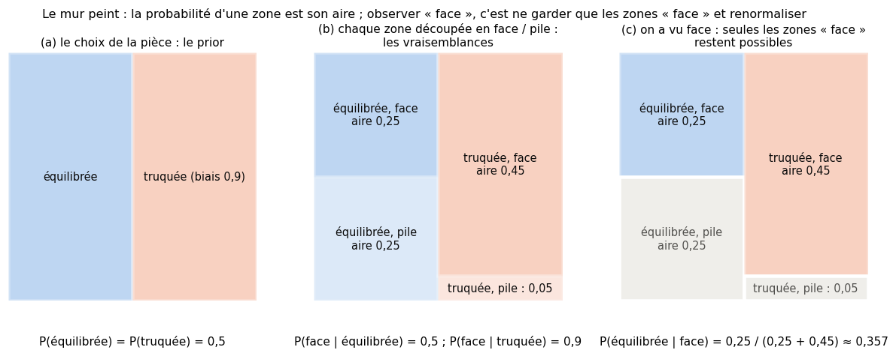
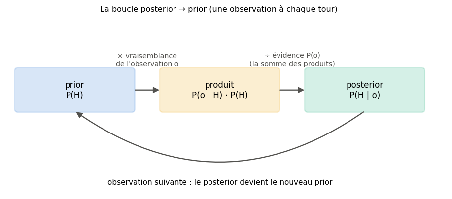
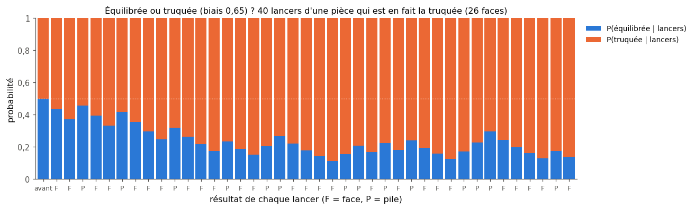
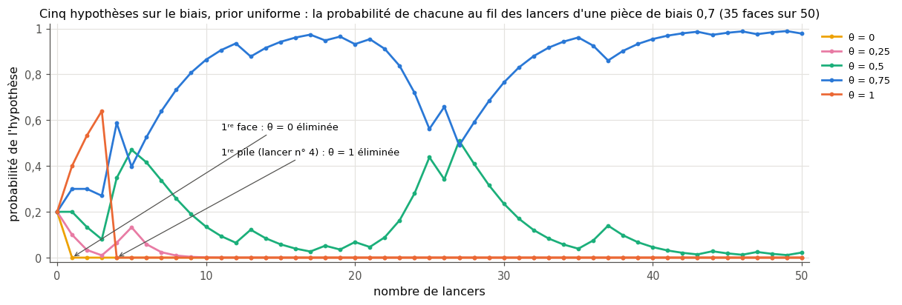
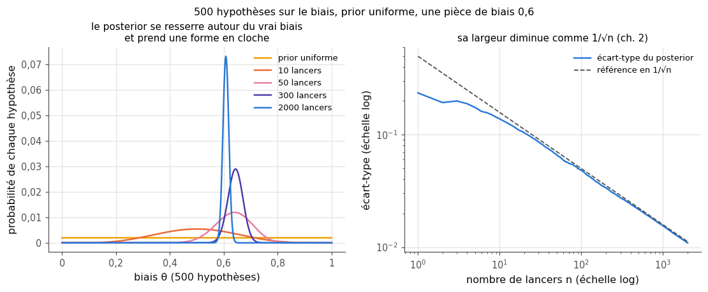
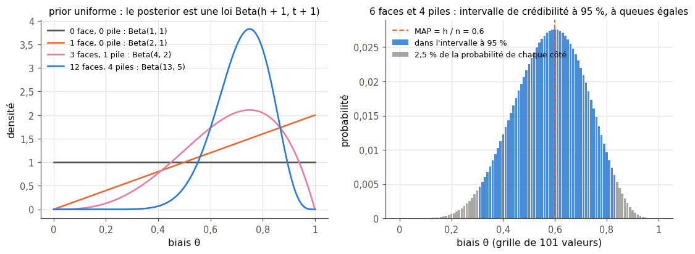

# 4 · Règle de Bayes — fiche de cours

> Cette fiche accompagne le chapitre 4 du livre. Le livre y présente les deux grandes façons de penser les probabilités, puis la règle de Bayes, qui permet de **mettre à jour une croyance** quand une observation arrive. Il l'applique à des pièces truquées et à une sonde spatiale, puis la répète en boucle sur 2, 5 et 500 hypothèses. La fiche ajoute les formules, un mini-exemple chiffré par notion, la forme « cotes », et quatre outils que le livre laisse de côté : les log-probabilités contre l'underflow, la loi Beta, l'estimateur MAP et l'intervalle de crédibilité. Les histoires du livre (l'épave et son jeu de pièces, le vaisseau en quête de planètes à exploiter) sont seulement résumées : chaque section te dit où les lire.

| | |
|---|---|
| **Livre** | vol. 1, ch. 4 « Bayes' Rule », p. 153-204 (§4.1 à §4.7) |
| **Temps total estimé** | ≈ 16 h : lecture du livre et de la fiche ≈ 4,4 h, exercices ≈ 11,2 h, 22 flashcards ≈ 0,7 h |
| **Prérequis** | 0B (notation $\prod$, logarithme et $\log(ab) = \log a + \log b$) · ch. 2 (loi de Bernoulli, espérance, `bootstrap_ci`) · ch. 3 (probabilités conditionnelle, jointe et marginale, règle du produit, formule des probabilités totales, matrice de confusion, precision, NPV, prévalence, `pd.crosstab`) |
| **Fichiers du chapitre** | `02_exercices.md` (quiz, rappels, papier, réflexion, entretien) · `03_notebook.ipynb` · `04_indices.md` · `05_solutions.md` et `05_solutions.ipynb` · `06_mes_reponses.md` · `flashcards.csv` |
| **mylearn** | `bayes.py` : 5 fonctions (l'évidence, la règle de Bayes, la boucle posterior → prior, le biais d'une pièce en log-probabilités, l'intervalle de crédibilité), écrites dans le notebook (4.14, 4.16, 4.24, 4.25) ; leurs idées resservent au ch. 9 (droite ajustée « à la Bayes ») et au ch. 13 (Naive Bayes) |

## Comment utiliser ce chapitre

Le chapitre se lit vite (il a beaucoup de figures) et repose presque entièrement sur une seule formule. Il demande pourtant de bien distinguer quatre probabilités qui se ressemblent, et c'est là que se font les erreurs. Le ch. 3 t'a donné tous les ingrédients : la règle du produit, la formule des probabilités totales et le piège de la prévalence. Ici, tu les assembles. Rien ne dépasse le ch. 3, sauf quatre notions introduites dans des encadrés 🧮 : les cotes et le rapport de vraisemblance, l'underflow des nombres à virgule flottante, l'astuce log-sum-exp et la loi Beta (sa formule est donnée, sans intégrale).

**Ordre conseillé.**
1. Lis le livre §4.1 à §4.4.2 et les sections correspondantes de la fiche. Fais les quiz Q1 à Q7, les rappels R2 et R3 et les exercices papier 4.1 à 4.3, puis la partie A du notebook (4.12 à 4.15 : la prédiction 🔮 4.12, à faire avant de lire le §4.6.2, puis les pièces simulées, `evidence` et `bayes_posterior`, Bayes chez les manchots).
2. Lis le livre §4.5 et §4.6, puis la fiche jusqu'à la section « Au-delà du livre (1) » comprise. Fais les quiz Q8 et Q9, le rappel R1, les exercices papier 4.4, 4.5 et 4.8 et l'oral 4.9, puis la partie B du notebook (4.16 à 4.20 : la boucle posterior → prior, l'underflow, les sondes).
3. Lis le livre §4.7 et la fin de la fiche. Fais le quiz Q10, les exercices papier 4.6 et 4.7, puis les parties C et D du notebook (4.21 à 4.26 : prior trompeur, loi Beta, refactorisation, 500 hypothèses en log, intervalles, défi).
4. Termine par la réflexion (4.10, 4.11) et les quatre questions d'entretien.

| Section | Quiz 🧠 et rappels 🔁 | Papier ✏️ ∂ et réflexion | Notebook | Entretien 💼 |
|---|---|---|---|---|
| 4.1 Pourquoi ce chapitre | Q1, R2 | | | |
| 4.2 Fréquentiste et bayésien | Q1, Q2, Q3 | 4.10, 4.11 | 4.13, 4.25 | E2, E4 |
| 4.3 Lancer des pièces | Q4, R3 | | 4.13 | |
| 4.4 Une pièce équilibrée ? | Q5 | 4.1, 4.2 | 4.14 | |
| 4.4.1 et 4.4.2 La règle de Bayes, ses quatre termes | Q6, Q7 | 4.1, 4.3, 4.9, 4.10 | 4.14, 4.15, 4.23 | E1, E3 |
| 4.5 Trouver la vie ailleurs | Q8, R1 | 4.4, 4.8 | 4.20 | E1 |
| 4.6 et 4.6.1 La boucle posterior → prior | Q9 | 4.5, 4.7, 4.8 | 4.16, 4.18, 4.20, 4.26 | |
| 4.6.2 Quelle pièce avons-nous ? | Q10 | | 4.12, 4.17, 4.19 | |
| 4.7 Plusieurs hypothèses | Q7, Q10 | 4.6, 4.7 | 4.15, 4.18, 4.21, 4.22, 4.24, 4.25, 4.26 | |
| Au-delà du livre : log-probabilités, loi Beta, MAP, intervalle de crédibilité | | 4.11 | 4.18, 4.22, 4.24, 4.25 | E2, E3 |

**Lire les formules.** $H$ désigne une **hypothèse** (« la pièce est équilibrée ») et $O$ une **observation** (« le lancer a donné face ») ; $H_1, \ldots, H_K$ sont $K$ hypothèses qui s'excluent et couvrent tous les cas. $P(H \mid O)$ se lit « probabilité de $H$ sachant $O$ », comme au ch. 3. Le **biais** d'une pièce, sa probabilité de tomber sur face, se note $\theta$ (thêta). Dans une suite de lancers, $h$ compte les faces et $t$ les piles, et $n = h + t$. Le livre écrit les règles avec des lettres ($F$, $H$, $R$, puis $A$ et $B$) ; la fiche garde $H$ et $O$, plus parlants. Attention : dans le livre, $H$ veut dire *heads* (face), pas « hypothèse ».

## Objectifs d'apprentissage

À la fin du chapitre, tu sais :
- **expliquer** la différence entre les points de vue fréquentiste et bayésien, sans caricature ;
- **démontrer** la règle de Bayes à partir de la règle du produit et **nommer** ses quatre termes ;
- **calculer** un posterior à la main pour deux hypothèses, puis pour un petit nombre d'hypothèses ;
- **relier** la règle de Bayes à la matrice de confusion (precision, NPV) et au problème de la prévalence ;
- **implémenter** la mise à jour séquentielle et **vérifier** qu'elle ne dépend pas de l'ordre des observations ;
- **diagnostiquer et corriger** un underflow numérique en passant aux log-probabilités ;
- **calculer et interpréter** un intervalle de crédibilité et le **comparer** à un intervalle de confiance bootstrap.

## L'essentiel en 10 lignes

1. Deux lectures de la probabilité : pour un **fréquentiste**, c'est une fréquence sur des expériences répétées ; pour un **bayésien**, c'est aussi un **degré de croyance**, qui peut porter sur une grandeur inconnue (le biais d'une pièce).
2. La **règle de Bayes** retourne une probabilité conditionnelle : $P(H \mid O) = \frac{P(O \mid H)\,P(H)}{P(O)}$. Elle se déduit de la règle du produit en deux lignes.
3. Ses quatre termes : le **prior** (*a priori*) $P(H)$, avant l'observation ; la **vraisemblance** (*likelihood*) $P(O \mid H)$, qui dit si l'observation est probable quand $H$ est vraie ; l'**évidence** (*evidence*) $P(O)$, la probabilité totale de l'observation ; et le **posterior** (*a posteriori*) $P(H \mid O)$, après l'observation.
4. L'évidence se calcule avec la formule des probabilités totales : $P(O) = \sum_i P(O \mid H_i)\,P(H_i)$. Elle ne fait que **renormaliser** : le posterior est proportionnel à vraisemblance × prior.
5. Une seule observation peut déjà déplacer la croyance, d'autant plus que la vraisemblance diffère d'une hypothèse à l'autre.
6. Un test médical, une sonde ou un classifieur se lisent avec Bayes : la precision est un posterior, et elle dépend du prior, la **prévalence** (ch. 3).
7. **Boucle posterior → prior** : le posterior d'une observation sert de prior pour la suivante. Si les observations sont indépendantes sachant l'hypothèse, l'ordre n'y change rien.
8. On peut suivre 2, 5 ou 500 hypothèses à la fois. Avec beaucoup de données, le posterior se concentre sur la vérité si elle fait partie des hypothèses (sinon, sur la moins mauvaise), même avec un prior trompeur. Exception : une hypothèse de prior **nul** reste nulle pour toujours, même si c'est la bonne.
9. Au-delà du livre : multiplier des milliers de probabilités donne 0 en machine (**underflow**, *dépassement par le bas*). On additionne donc des **logarithmes**, et l'on renormalise avec l'astuce **log-sum-exp**.
10. Au-delà du livre : avec un prior uniforme, le posterior du biais d'une pièce est une **loi Beta** ; on le résume par son mode (le **MAP**, *maximum a posteriori*) et par un **intervalle de crédibilité** (*credible interval*), qui contient le paramètre avec une probabilité donnée.

## 4.1 · Pourquoi ce chapitre ?

Beaucoup d'articles et de pages de documentation de ML parlent de « prior », de « posterior » ou d'approche « bayésienne ». Le livre veut te donner assez de bases pour les lire (§4.1). Il met aussi en avant un atout de l'approche bayésienne : elle oblige à **écrire ce qu'on croit avant de voir les données**. Ce qu'on sait déjà sert alors, au lieu d'être caché dans des choix implicites.

Le nom vient de Thomas Bayes, un pasteur et mathématicien anglais du XVIIIᵉ siècle. Retiens surtout l'idée : une **probabilité qui se met à jour** quand une observation arrive. C'est exactement ce que fait un filtre anti-spam quand un mot suspect apparaît, ou un médecin qui reçoit un résultat d'analyse.

## 4.2 · Fréquentiste et bayésien : deux façons de penser les probabilités

Le livre en dresse deux portraits volontairement caricaturaux (§4.2.1 et §4.2.2), puis les applique à la longueur d'un crayon (§4.2.3 ⏩) :
- son **fréquentiste** postule une valeur exacte, que chaque mesure manque un peu ; c'est en combinant beaucoup de mesures qu'il pense s'en approcher ;
- son **bayésien** ne postule aucune valeur exacte : il raisonne seulement sur des valeurs plus ou moins plausibles, dont la répartition évolue avec les mesures.

Ces portraits déforment un peu les deux écoles. Voici les définitions qu'on utilise d'habitude.
- **Fréquentiste** : une probabilité est la **fréquence limite** d'un événement quand on répète l'expérience un très grand nombre de fois. Un paramètre (la hauteur d'une montagne, le biais d'une pièce) est un nombre **fixe et inconnu**. On ne lui donne pas de probabilité ; on étudie plutôt le comportement de nos méthodes d'estimation sur des répétitions imaginaires.
- **Bayésien** : une probabilité mesure aussi un **degré de certitude** sur une affirmation. On peut donc donner une distribution de probabilité à un paramètre inconnu. Elle ne dit pas que le paramètre « bouge » ; elle décrit **ce que l'on sait** de lui. Un bayésien peut très bien penser que le crayon a une longueur précise ; sa distribution décrit son incertitude sur cette longueur.

> ⚠️ **Le livre, corrigé — trois raccourcis** — (1) Le nom « fréquentiste » vient de la définition de la probabilité comme **fréquence** à long terme, et non de « la valeur la plus fréquente parmi les mesures » (§4.2.1). Pour estimer une grandeur à partir de mesures bruitées, un fréquentiste prend d'ailleurs souvent leur **moyenne**, pas leur mode. (2) Un bayésien n'a pas besoin de nier l'existence d'une vraie valeur (§4.2.2) : sa distribution décrit son incertitude sur elle. (3) Le livre ajoute que l'approche bayésienne suivrait naturellement une grandeur qui change avec le temps. Ce n'est vrai que si le modèle **prévoit** ce changement. Avec la boucle du §4.6 et un biais supposé fixe, le posterior se resserre lancer après lancer et réagit de moins en moins à un changement : après 2 000 lancers, il faut des centaines de nouveaux lancers pour le déplacer nettement.

> 🕰️ **Mise à jour (2026) — fréquentistes et bayésiens** — **Le livre :** oppose deux portraits imagés : le fréquentiste qui cherche la « vraie » valeur, le bayésien qui doute qu'elle existe. · **Aujourd'hui, comme déjà avant le livre :** les manuels définissent les deux écoles par leur définition de la probabilité. Pour J. VanderPlas (2014), un article que le livre cite d'ailleurs, un fréquentiste ne donne un sens à la probabilité qu'à travers la limite de mesures répétées ; un bayésien l'étend aux degrés de certitude sur des affirmations, y compris sur la valeur d'un paramètre. Les deux écoles posent alors des questions différentes. L'intervalle de confiance fréquentiste à 95 % est construit pour contenir la vraie valeur dans 95 % des expériences répétées. L'intervalle de crédibilité bayésien contient la valeur avec une probabilité de 95 %, sachant les données observées. Pour les problèmes simples, les deux donnent souvent des résultats très proches ; ils divergent avec peu de données ou des modèles compliqués. Le ML utilise les deux : bootstrap et tests statistiques d'un côté, priors, inférence bayésienne et optimisation bayésienne de l'autre. · **Faut-il quand même l'apprendre ?** Oui : ces deux mots reviennent sans cesse, en entretien comme dans la documentation, et l'article de VanderPlas (exercice 4.11) les présente avec du code Python. · *Source :* J. VanderPlas, « Frequentism and Bayesianism: A Python-driven Primer », *Proceedings of the 13th Python in Science Conference* (SciPy 2014), p. 85-93 ([arXiv:1411.5018](https://arxiv.org/abs/1411.5018)).

Le §4.2.3 se termine sur une idée juste : selon l'école choisie, on ne pose pas les mêmes questions aux données. L'encadré ci-dessus en donne un exemple : un intervalle de confiance et un intervalle de crédibilité ne promettent pas la même chose.

## 4.3 · Lancer des pièces

Le fil rouge du chapitre est la pièce de monnaie (§4.3) : le modèle probabiliste le plus simple qui soit, avec un seul paramètre. Ce paramètre, le **biais** $\theta$, est la probabilité de tomber sur face. Une pièce **équilibrée** a un biais de 0,5 ; une pièce **truquée** (*rigged*) un biais différent : avec $\theta = 0{,}6$, on attend environ 60 % de faces. Chaque lancer suit une **loi de Bernoulli** de paramètre $\theta$ (ch. 2), et deux lancers d'une pièce de biais **connu** sont **indépendants** : $P(\text{face, face}) = \theta^2$.

**L'estimation fréquentiste du biais** est la proportion de faces observées, $\hat\theta = h / n$, recalculée après chaque lancer : c'est la « moyenne courante » de la figure 4.1 du livre, que tu traceras en 4.13. Elle fluctue beaucoup au début, puis se stabilise ; son erreur typique diminue comme $1/\sqrt{n}$ (ch. 2). La suite du chapitre pose une autre question : au lieu d'une seule valeur, quelle **distribution de probabilité** donner à $\theta$ après avoir vu les lancers ?

## 4.4 · Cette pièce est-elle équilibrée ? ⏩

Le livre raconte l'histoire d'une archéologue qui a trouvé, dans une épave, un jeu fait de deux pièces identiques d'aspect : l'une est équilibrée, l'autre truquée (§4.4). On prend une pièce au hasard, on la lance une fois, et l'on se demande laquelle on tient. Le livre raisonne avec le mur peint du ch. 3 ; refaisons-le avec d'autres chiffres, **une pièce équilibrée et une pièce de biais 0,9**, chacune choisie avec la probabilité 0,5.

- Avant tout lancer, le mur est coupé en deux zones égales, « équilibrée » et « truquée » (figure, panneau a).
- On découpe chaque zone selon ce que la pièce donnerait : la zone équilibrée moitié face, moitié pile ; la zone truquée à 90 % face (panneau b). L'aire de la zone (équilibrée, face) vaut $0{,}5 \times 0{,}5 = 0{,}25$ ; celle de la zone (truquée, face) $0{,}5 \times 0{,}9 = 0{,}45$.
- On lance : **face**. La fléchette est donc tombée dans l'une des deux zones « face » ; les zones « pile » sont exclues (panneau c). La probabilité d'avoir la pièce équilibrée est la part de sa zone parmi les zones encore possibles :

$$P(\text{équilibrée} \mid \text{face}) = \frac{0{,}25}{0{,}25 + 0{,}45} = \frac{0{,}25}{0{,}70} \approx 0{,}357.$$

Une seule face fait passer la pièce truquée de 50 % à environ 64 %. Si le lancer avait donné **pile**, le calcul serait $\frac{0{,}5 \times 0{,}5}{0{,}5 \times 0{,}5 + 0{,}5 \times 0{,}1} = \frac{0{,}25}{0{,}30} \approx 0{,}833$ en faveur de la pièce équilibrée. Pile est un indice beaucoup plus fort que face, parce que la pièce truquée donne très rarement pile. Les deux mises à jour ne sont pas symétriques ; le livre fait la même remarque avec ses chiffres (§4.4).

### 4.4.1 · La règle de Bayes ⏩

Le dénominateur du calcul, $0{,}25 + 0{,}45 = 0{,}70$, est la probabilité totale d'obtenir face, quelle que soit la pièce : l'aire des deux zones « face » réunies. Chaque terme est une probabilité jointe, qu'on écrit avec la règle du produit (ch. 3) : $P(\text{face}, \text{équilibrée}) = P(\text{face} \mid \text{équilibrée})\,P(\text{équilibrée})$. En notant $H$ l'hypothèse et $O$ l'observation, on obtient la **règle de Bayes** (*Bayes' rule*, ou théorème de Bayes) :

$$P(H \mid O) = \frac{P(O \mid H)\,P(H)}{P(O)}, \qquad P(O) = \sum_{i=1}^{K} P(O \mid H_i)\,P(H_i).$$

La seconde formule est la formule des probabilités totales du ch. 3 : on additionne une probabilité jointe par hypothèse (§4.4.1). Un réflexe à prendre, sur lequel le livre insiste aussi : avant tout calcul, écris ce que tu cherches sous la forme $P(\text{ce que je veux savoir} \mid \text{ce que j'ai observé})$. C'est exactement ce que calcule la règle de Bayes.

### 4.4.2 · Retrouver la règle et nommer ses termes ⏩

La formule se démontre en une ligne à partir de la règle du produit, écrite dans les deux ordres (ch. 3, ∂ 3.4) :

$$P(O \mid H)\,P(H) = P(H, O) = P(H \mid O)\,P(O) \quad\Longrightarrow\quad P(H \mid O) = \frac{P(O \mid H)\,P(H)}{P(O)} \qquad (P(O) > 0).$$

Chaque terme a un nom (§4.4.2), à connaître pour lire la documentation :

| Terme | Nom | Ce qu'il dit | Dans l'exemple |
|---|---|---|---|
| $P(H)$ | **prior** (*a priori*) | ce qu'on croit **avant** l'observation | 0,5 pour chaque pièce |
| $P(O \mid H)$ | **vraisemblance** (*likelihood*) | l'observation est-elle probable **si** $H$ est vraie ? | 0,5 (équilibrée) ; 0,9 (truquée) |
| $P(O)$ | **évidence** (*evidence*) | la probabilité de l'observation, toutes hypothèses confondues | 0,70 |
| $P(H \mid O)$ | **posterior** (*a posteriori*) | ce qu'on croit **après** l'observation | 0,357 et 0,643 |

Trois remarques. D'abord, le mot « évidence » est un faux ami : ce n'est ni une chose évidente ni une preuve, c'est un **nombre**, la probabilité de l'observation. On l'appelle aussi **vraisemblance marginale** (*marginal likelihood*) : c'est le nom employé, par exemple, dans la documentation de scikit-learn. Ensuite, les **vraisemblances n'ont pas à sommer à 1** : ce sont des probabilités de la même observation sous des hypothèses différentes (0,5 et 0,9 font 1,4). Ce sont les priors, et les posteriors, qui somment à 1. Enfin, comme $P(O)$ ne dépend pas de l'hypothèse, on écrit souvent

$$P(H_i \mid O) \propto P(O \mid H_i)\,P(H_i).$$

Le symbole $\propto$ se lit « proportionnel à » : il reste à diviser par la somme des produits pour que les posteriors somment à 1. C'est ce que font les fonctions de `mylearn.bayes`.

**D'où vient le prior ?** Dans l'idéal, de données antérieures (une étude, un historique) ou d'une contrainte connue (un biais est forcément entre 0 et 1). Sinon, du jugement d'un expert, qu'il faut alors justifier. Sans aucune information, on prend souvent un prior uniforme. Le livre (§4.4.2) oppose le bayésianisme **subjectif**, où le prior traduit le jugement de l'analyste, et le bayésianisme **automatique**, où une règle fixée d'avance le fournit ; dans la littérature, on parle plus souvent de bayésianisme « objectif » (*objective Bayes*) pour des priors fixés par une règle. Dans les deux cas, le prior est **écrit noir sur blanc** : on peut le discuter, le contester, et mesurer son influence en le faisant varier.

> 🧮 **Rappel maths — cotes et rapport de vraisemblance** — La **cote** (*odds*) d'une hypothèse est le rapport $\frac{P(H)}{P(\text{non } H)}$ : une probabilité de 0,8 donne une cote de 4 (« 4 contre 1 »), et l'on revient à la probabilité par $P = \frac{\text{cote}}{1 + \text{cote}}$. Avec deux hypothèses $H_1$ et $H_2$ (non $H_1$, c'est $H_2$), on peut montrer (∂ 4.3) que l'évidence disparaît du rapport des posteriors :
> $$\underbrace{\frac{P(H_1 \mid O)}{P(H_2 \mid O)}}_{\text{cote a posteriori}} = \underbrace{\frac{P(O \mid H_1)}{P(O \mid H_2)}}_{\text{rapport de vraisemblance}} \times \underbrace{\frac{P(H_1)}{P(H_2)}}_{\text{cote a priori}}.$$
> Avec la pièce de biais 0,9, une face multiplie la cote « truquée contre équilibrée » par $\frac{0{,}9}{0{,}5} = 1{,}8$ : de 1 contre 1, elle passe à 1,8 contre 1, soit une probabilité de $\frac{1{,}8}{2{,}8} \approx 0{,}643$. Une pile la multiplie par $\frac{0{,}1}{0{,}5} = 0{,}2$. Cette forme sert à enchaîner les observations de tête (4.3, 4.8) ; les **log-cotes** (*log-odds*), elles, s'additionnent : chaque observation ajoute le logarithme de son rapport de vraisemblance.

## 4.5 · Trouver la vie ailleurs : Bayes et la matrice de confusion ⏩

Le §4.5 relit la matrice de confusion du ch. 3 à la lumière de la règle de Bayes. Un vaisseau cherche des planètes rocheuses à exploiter, avec une consigne absolue : ne jamais exploiter une planète où il y a de la vie. Une sonde a été testée sur 1 000 planètes connues ; son tableau de résultats (figures 4.17 à 4.19) donne ses taux d'erreur. Le capitaine lance une sonde sur une nouvelle planète et se demande quelle confiance lui accorder. On reconnaît le vocabulaire du ch. 3 :

| Ce que fournit le test de la sonde | Nom au ch. 3 | Ce que veut le capitaine | Nom au ch. 3 |
|---|---|---|---|
| $P(\text{détecté} \mid \text{vie})$ | recall (sensibilité) | $P(\text{vie} \mid \text{détecté})$ | precision |
| $P(\text{rien} \mid \text{pas de vie})$ | spécificité | $P(\text{pas de vie} \mid \text{rien})$ | NPV |
| $P(\text{rien} \mid \text{vie})$ | FNR | $P(\text{vie} \mid \text{rien})$ | FOR |

La règle de Bayes passe de la colonne de gauche à celle de droite, à condition de connaître le **prior** $P(\text{vie})$, la part des planètes habitées dans la région : la **prévalence** du ch. 3. Dans ses calculs (figures 4.19 à 4.21), le livre prend pour prior la part de planètes habitées du test, 101 sur 1 000, qui concorde avec l'expérience du capitaine (environ 10 %). Il trouve qu'une planète déclarée « sans vie » est habitée avec une probabilité d'environ 0,001 (1 sur 870), et qu'une planète déclarée « habitée » ne l'est qu'avec une probabilité d'environ 0,77.

Retiens le lien : **la precision d'un test est un posterior**, dont le prior est la prévalence. C'est pourquoi elle change d'une population à l'autre (ch. 3, §3.8). Si la région du capitaine comptait 1 % de planètes habitées au lieu de 10 %, la même sonde verrait sa precision s'effondrer, sans qu'aucune de ses caractéristiques ait changé. L'exercice 4.4 refait le calcul avec une autre sonde, et 4.8 envoie plusieurs sondes de suite.

> ⚠️ **Le livre, corrigé — une coquille** — Une phrase du §4.5 parle des « 100 planètes avec de la vie ». Le reste du texte, la légende de la figure 4.17 et les calculs du livre en comptent bien 101 (100 détectées et 1 manquée) : le recall vaut $\frac{100}{101}$.

## 4.6 · Répéter la règle de Bayes ⏩

En pratique, les observations arrivent les unes après les autres : lancers, sondes, analyses. Pour les enchaîner, on remarque que le posterior est la meilleure description de ce qu'on sait **une fois l'observation faite**. On l'utilise donc comme **prior** de l'observation suivante (§4.6). On parle de mise à jour séquentielle, ou bayésienne.

### 4.6.1 · La boucle posterior → prior ⏩

Le livre réécrit la règle avec des mots, « hypothèse » et « observation » (figure 4.22). Puis il en fait une boucle (figure 4.23) :

Pourquoi a-t-on le droit de boucler ? Parce que les lancers d'une même pièce sont **indépendants sachant la pièce** : si l'on sait laquelle on tient, le premier lancer ne change rien au second. Alors la vraisemblance de deux observations est le produit des vraisemblances, $P(o_1, o_2 \mid H) = P(o_1 \mid H)\,P(o_2 \mid H)$. En enchaînant les mises à jour, on obtient le même posterior qu'en traitant toutes les observations d'un coup (∂ 4.7) :

$$P(H_i \mid o_1, \ldots, o_n) = \frac{P(H_i) \prod_{k=1}^{n} P(o_k \mid H_i)}{\sum_j P(H_j) \prod_{k=1}^{n} P(o_k \mid H_j)}.$$

Conséquence : **l'ordre des observations n'a pas d'importance**, seul compte leur contenu (pour une pièce : le nombre de faces et de piles).

> ⚠️ **Piège classique — « Indépendants sachant la pièce » ne veut pas dire « indépendants »** — Avec la pièce équilibrée et la pièce de biais 0,9 du §4.4, $P(\text{face}) = 0{,}5 \times 0{,}5 + 0{,}5 \times 0{,}9 = 0{,}7$, mais $P(\text{face, face}) = 0{,}5 \times 0{,}25 + 0{,}5 \times 0{,}81 = 0{,}53 \neq 0{,}7^2 = 0{,}49$. Tant qu'on ne sait pas quelle pièce on tient, une première face rend une seconde face plus probable (0,757 au lieu de 0,7) : elle rend la pièce truquée plus probable. C'est précisément ce que la boucle exploite. L'hypothèse d'indépendance sachant l'hypothèse se discute dans chaque problème : deux sondes envoyées sur la même planète peuvent se tromper pour la même raison (4.8).

### 4.6.2 · Exemple : quelle pièce avons-nous ?

Le livre généralise le jeu de l'épave : une pièce équilibrée et une pièce truquée dont on choisit le biais, une chance sur deux pour chacune, puis 30 lancers (§4.6.2). Après chaque lancer, il trace la probabilité de chaque pièce en barres empilées (figures 4.24 à 4.26 ; tu les refais en 🎨 4.17). La figure ci-dessous reprend l'idée avec d'autres chiffres : une pièce de biais 0,65, qui est en fait celle qu'on lance. Sur ces 40 lancers (26 faces, une série ordinaire), la pièce truquée mène, sans être encore certaine.

Les grilles du livre, de 30 puis 1 000 lancers (figures 4.27 et 4.28 ; tu les recalcules en 🔬 4.19), montrent trois choses. Le livre tire les deux premières ; la troisième est une mise en garde de la fiche :
- quand les deux pièces ont des biais très différents, quelques lancers suffisent ; quand ils sont proches, il en faut beaucoup plus (combien ? c'est la question du 🔮 4.12) ;
- une série inhabituelle (beaucoup de faces avec une pièce qui en donne peu) peut faire pencher la balance du mauvais côté, mais de moins en moins souvent quand les lancers s'accumulent ;
- plus les observations sont nombreuses, plus le posterior se rapproche de 0 ou de 1… y compris quand **aucune** des deux hypothèses ne décrit bien la pièce. Bayes choisit la **moins mauvaise** des hypothèses proposées ; il ne dit pas si elles sont bonnes.

## 4.7 · Plusieurs hypothèses ⏩

Le §4.7 passe de deux hypothèses à plusieurs. L'archéologue trouve un coffre d'autres paires de pièces, dont les pièces truquées le sont plus ou moins ; pour chaque pièce, on cherche son biais. On commence par 5 hypothèses, $\theta \in \{0 ;\ 0{,}25 ;\ 0{,}5 ;\ 0{,}75 ;\ 1\}$, avec un prior uniforme (0,2 chacune). À chaque lancer, on multiplie chaque prior par sa vraisemblance ($\theta$ pour face, $1 - \theta$ pour pile), puis on renormalise. Trois faits apparaissent tout de suite :
- la première face **élimine pour toujours** l'hypothèse $\theta = 0$ (vraisemblance nulle), la première pile élimine $\theta = 1$ ;
- les vraisemblances ne somment pas à 1 (pour face : $0 + 0{,}25 + 0{,}5 + 0{,}75 + 1 = 2{,}5$), et ce n'est pas un problème ;
- si les priors forment une distribution (positifs, de somme 1), les posteriors aussi (∂ 4.7) : le livre parle ici de « pmf » (*probability mass function*, la fonction de masse), vue au **ch. 2** (le livre renvoie par erreur au ch. 3).

Sur cette figure, la pièce a un biais de 0,7, qui ne fait pas partie des cinq hypothèses (c'est le réglage de la figure 4.32 du livre, en miroir : 0,7 au lieu de 0,3). Après trois faces, θ = 1 mène ; la première pile (4ᵉ lancer) l'élimine. Après un court duel avec θ = 0,5, θ = 0,75 prend la tête et dépasse 0,9 dès le 11ᵉ lancer. Mais quatre piles de suite (lancers 22 à 25) la font vaciller : au 27ᵉ lancer, θ = 0,5 repasse un instant devant. θ = 0,75 ne reste au-dessus de 0,9 qu'à partir du 38ᵉ lancer. Une hypothèse en tête n'est pas encore une hypothèse sûre.

> ⚠️ **Le livre, corrigé — une incohérence** — Au §4.7, le texte décrit l'hypothèse n° 1 comme une pièce de biais 0,2 (vraisemblances 0,2 et 0,8), alors que la grille annoncée, et les figures 4.30 et 4.31, utilisent 0,25. C'est 0,25 qui compte.

Avec 500 hypothèses régulièrement espacées entre 0 et 1, on obtient presque une courbe (figure 4.33 du livre). Le posterior se resserre autour du vrai biais et prend une forme en cloche. Ce n'est pas exactement une gaussienne, c'est une loi Beta (plus bas), mais elle en devient très proche quand $n$ grandit. Sa largeur diminue comme $1/\sqrt{n}$, comme l'erreur d'une moyenne au ch. 2.

Le livre essaie enfin un **prior trompeur**, une bosse centrée sur 0,8 alors que la pièce a un biais de 0,3 (figures 4.34 et 4.35). Les données finissent par l'emporter ; à quelle vitesse ? Tu le prédiras, puis le mesureras, en 🔮 4.21. Une règle à retenir : **ne donne jamais un prior exactement nul à une hypothèse que tu n'es pas certain d'exclure**. Aucune quantité de données ne la ressuscitera (∂ 4.7) ; un prior très petit, lui, peut être rattrapé.

## Au-delà du livre (1) : log-probabilités et underflow

La boucle multiplie des probabilités inférieures à 1. Si l'on attend la fin pour normaliser, le produit devient vite minuscule : $0{,}5^{100} \approx 8 \times 10^{-31}$, et après quelques milliers de lancers au plus, l'ordinateur ne le distingue plus de 0. Tu l'as vu en 0B : $0{,}01^{200}$ vaut déjà 0 en `float64`. Toutes les hypothèses valent alors 0, et la normalisation calcule $\frac{0}{0}$ : `nan`.

> 🧮 **Rappel outil — l'underflow des nombres à virgule flottante** — Un `float64` (le type par défaut de NumPy) ne peut pas représenter des nombres positifs arbitrairement petits. Le plus petit nombre « normal » vaut environ $2{,}2 \times 10^{-308}$ (`np.finfo(float).tiny`). En dessous, on perd peu à peu des chiffres (nombres « dénormalisés »), jusqu'à environ $5 \times 10^{-324}$ ; plus bas encore, le résultat est arrondi à **0**. C'est l'**underflow** (*dépassement par le bas*). Il ne provoque aucune erreur ni aucun avertissement lors d'une multiplication : le résultat devient 0, simplement. L'erreur n'apparaît que plus tard, à la division $\frac{0}{0}$.

Deux remèdes :
1. **normaliser à chaque pas**, comme le fait la boucle posterior → prior (`update_discrete`) : les valeurs restent des probabilités de somme 1 ;
2. **passer aux logarithmes**, ce qui transforme le produit en somme (0B) : $\log P(\theta \mid \text{données}) = \log P(\theta) + h \log\theta + t \log(1 - \theta) + \text{constante}$. Une somme de milliers de termes négatifs ne pose aucun problème (−2 000 se représente très bien). Il reste à revenir aux probabilités sans retomber dans l'underflow.

> 🧮 **Rappel maths — l'astuce log-sum-exp** — Pour normaliser des log-probabilités $\ell_i$, on leur **soustrait d'abord leur maximum** $m$, puis on prend l'exponentielle : $p_i = \frac{e^{\ell_i - m}}{\sum_j e^{\ell_j - m}}$. Soustraire $m$ à tous les $\ell_i$ revient à multiplier toutes les probabilités par la même constante $e^{-m}$, qui disparaît à la normalisation ; mais maintenant la plus grande exponentielle vaut $e^0 = 1$ et rien ne s'annule. Exemple : avec $\ell = (-750, -752)$, $e^{-750}$ vaut 0 en `float64`, et le calcul direct donne $\frac{0}{0}$. Après soustraction du maximum, $(0, -2)$ donne $\frac{(1 ;\ 0{,}135)}{1{,}135} \approx (0{,}881 ;\ 0{,}119)$. Le logarithme de la somme se calcule de la même façon, $\log \sum_j e^{\ell_j} = m + \log \sum_j e^{\ell_j - m}$ : c'est `scipy.special.logsumexp`.

Une précaution pour les grilles qui contiennent 0 ou 1 : avec $\theta = 0$, $\log\theta = -\infty$, et $h \log\theta$ donne `nan` quand $h = 0$ (car $0 \times (-\infty)$ n'est pas défini), alors que $\theta^0 = 1$. Ne calcule donc $h \log\theta$ que si $h > 0$, et de même $t \log(1 - \theta)$ que si $t > 0$ (à cause de $\theta = 1$).

Beaucoup de modèles de ML font ce calcul : les modèles de langage, par exemple, additionnent les log-probabilités des mots (ou des morceaux de mots) qu'ils prédisent, au lieu de multiplier des probabilités (ch. 6, perplexité). Tu programmes cette méthode en 4.24 (`coin_bias_posterior`), après avoir vu le bug en 🐛 4.18.

## Au-delà du livre (2) : la limite continue, la loi Beta

Le livre s'arrête au seuil d'une idée, sans la développer : multiplier les hypothèses jusqu'à obtenir une courbe continue (fin du §4.7, figure 4.35). Allons jusqu'au bout. Avec un prior **uniforme** sur $[0, 1]$, après $h$ faces et $t$ piles, le posterior est proportionnel à $\theta^h (1 - \theta)^t$ : c'est la densité d'une **loi Beta** de paramètres $a = h + 1$ et $b = t + 1$.

> 🧮 **Rappel maths — la loi Beta** — Une variable continue sur $[0, 1]$ suit la loi $\mathrm{Beta}(a, b)$ (avec $a > 0$ et $b > 0$) si sa densité (ch. 2) vaut
> $$f(\theta) = \frac{\theta^{a-1}(1 - \theta)^{b-1}}{B(a, b)},$$
> où $B(a, b)$ est la constante qui rend égale à 1 l'aire sous la courbe ; pour des entiers, $B(a, b) = \frac{(a-1)!\,(b-1)!}{(a+b-1)!}$. Tu n'as pas à calculer d'intégrale : `scipy.stats.beta(a, b)` fournit `pdf`, `cdf`, `ppf`, `mean`, `std` et `interval`. Pour $\mathrm{Beta}(h + 1, t + 1)$, la **moyenne** vaut $\frac{h + 1}{n + 2}$ et le **mode** (le maximum de la densité) $\frac{h}{n}$, dès qu'il y a au moins un lancer. $\mathrm{Beta}(1, 1)$ est la loi uniforme.

*Mini-exemple.* Six faces et quatre piles : le posterior est $\mathrm{Beta}(7, 5)$, de moyenne $\frac{7}{12} \approx 0{,}583$ et de mode 0,6. La moyenne est un peu tirée vers 0,5 par le prior uniforme. Laplace a donné cette formule de la moyenne, $\frac{h + 1}{n + 2}$, au XVIIIᵉ siècle (sa « règle de succession »). C'est aussi, pour un bayésien, la probabilité que le **prochain** lancer donne face : on fait la moyenne de $P(\text{face} \mid \theta) = \theta$ sur tous les biais possibles, chacun pondéré par son posterior (la formule des probabilités totales du ch. 3). Après une seule face, elle vaut $\frac{2}{3}$, quand la proportion observée dit 1. Et $P(\theta > 0{,}5 \mid \text{données}) = $ `stats.beta(7, 5).sf(0.5)` $\approx 0{,}726$ : une probabilité sur le **paramètre** lui-même, ce qu'un fréquentiste ne calcule pas.

Mieux encore : si le prior est déjà une loi Beta, $\mathrm{Beta}(a, b)$, le posterior après $h$ faces et $t$ piles est $\mathrm{Beta}(a + h, b + t)$. Le prior et le posterior appartiennent à la même famille : on dit que la loi Beta est un prior **conjugué** (*conjugate prior*) de la loi de Bernoulli. On met alors à jour deux nombres au lieu d'une grille.

> 🕰️ **Mise à jour (2026) — au-delà de la grille** — **Le livre :** fait tous ses calculs sur une liste finie d'hypothèses (une « grille »), mise à jour lancer après lancer. · **Aujourd'hui :** la grille est parfaite pour comprendre et pour un ou deux paramètres. Mais son nombre de points explose avec la dimension : 100 valeurs par paramètre font $100^{10}$ points pour 10 paramètres. En pratique, on utilise un **prior conjugué** quand il en existe un (Beta pour une proportion, comme ci-dessus). Sinon, on passe par la **programmation probabiliste** (*probabilistic programming*) : on décrit le modèle, et la bibliothèque tire des milliers de valeurs de θ dont la répartition imite le posterior (méthodes MCMC, *Markov chain Monte Carlo*). PyMC et Stan utilisent par défaut l'algorithme NUTS ; ils proposent aussi des approximations plus rapides mais moins exactes, comme l'inférence variationnelle, qui remplace le posterior par une loi plus simple, ajustée par optimisation. · **Faut-il quand même l'apprendre ?** Oui : la grille montre ce que calculent ces outils, et c'est sur elle qu'on vérifie qu'on les a bien compris. · *Sources :* [documentation de PyMC, « Introductory Overview of PyMC »](https://www.pymc.io/projects/docs/en/stable/learn/core_notebooks/pymc_overview.html) ; [manuel de référence de Stan](https://mc-stan.org/docs/reference-manual/).

## Au-delà du livre (3) : MAP et intervalle de crédibilité

Un posterior est une distribution entière. Pour le résumer, on donne en général un nombre et une marge :
- l'**estimateur MAP** (*maximum a posteriori*) est l'hypothèse de plus grand posterior : $\hat\theta_{\text{MAP}} = \arg\max_\theta P(\theta \mid \text{données})$. ($\arg\max_\theta$ désigne la valeur de $\theta$ qui rend la quantité maximale, pas ce maximum.) Avec un prior uniforme, c'est aussi la proportion observée $h/n$ : le **maximum de vraisemblance** (*maximum likelihood*) du fréquentiste, c'est-à-dire la valeur de $\theta$ qui rend les données observées les plus probables. Avec un prior non uniforme, le MAP est tiré vers les valeurs que le prior favorise ;
- l'**intervalle de crédibilité** (*credible interval*) à 95 % contient le paramètre avec une probabilité de 0,95, **sachant les données**. Le plus simple laisse 2,5 % de la probabilité de chaque côté (on dit « à queues égales »). Sur une grille, on cumule les posteriors de gauche à droite ; la borne basse est la première valeur où le cumul atteint 0,025, la borne haute la première où il atteint 0,975. C'est `credible_interval` (4.25).

*Mini-exemple* (six faces, quatre piles) : l'intervalle à 95 % de $\mathrm{Beta}(7, 5)$ va d'environ 0,31 à 0,83. Avec dix lancers seulement, il est très large ; avec mille, il serait presque dix fois plus étroit.

**Crédibilité ou confiance ?** L'intervalle de confiance du ch. 2 (bootstrap) répond à une autre question. Sa promesse porte sur la **méthode** : si l'on répétait l'expérience, l'intervalle calculé contiendrait la vraie valeur dans environ 95 % des cas. L'intervalle de crédibilité porte sur le **paramètre**, sachant les données qu'on a. Avec beaucoup de données et un prior peu informatif, les deux se ressemblent souvent. Avec très peu de données, ils peuvent diverger nettement. Exemple : dix piles sur dix lancers. Que peut répondre un bootstrap qui ne rééchantillonne que ces dix piles ? Et un posterior parti d'un prior uniforme ? Tu compares les deux en 4.25.

## Bayes dans le ML d'aujourd'hui

> 🕰️ **Mise à jour (2026) — la règle de Bayes en ML** — **Le livre :** présente la règle de Bayes comme un outil de raisonnement, utile pour lire des articles. · **Aujourd'hui :** elle est aussi au cœur de méthodes très utilisées. Le classifieur **Naive Bayes** (ch. 13) applique la règle de Bayes en supposant les features (*caractéristiques*) indépendantes sachant la classe. D'après la documentation de scikit-learn, il est très rapide et marche souvent bien (classement de documents, filtres anti-spam), mais ses probabilités sont peu fiables. L'**optimisation bayésienne** des hyperparamètres choisit le prochain essai d'après les résultats des précédents. La bibliothèque Optuna utilise par défaut l'algorithme TPE (*Tree-structured Parzen Estimator*). Les **autoencodeurs variationnels** (VAE, ch. 25) reposent sur l'inférence variationnelle (Kingma et Welling, 2013). Enfin, la **quantification d'incertitude** (*uncertainty quantification*) cherche à faire dire à un modèle à quel point il est sûr de lui. · **Faut-il quand même l'apprendre ?** Oui : prior, vraisemblance et posterior reviennent dans tous ces outils, et le ch. 9 mettra un prior sur les paramètres d'une droite. · *Sources :* [scikit-learn 1.6, « Naive Bayes »](https://scikit-learn.org/1.6/modules/naive_bayes.html) ; [documentation d'Optuna, `create_study`](https://optuna.readthedocs.io/en/stable/reference/generated/optuna.create_study.html) et [`TPESampler`](https://optuna.readthedocs.io/en/stable/reference/samplers/generated/optuna.samplers.TPESampler.html) ; D. P. Kingma et M. Welling, « Auto-Encoding Variational Bayes » ([arXiv:1312.6114](https://arxiv.org/abs/1312.6114)).

## Les pièges classiques ⚠️ (récapitulatif)

| Piège | Exemple | Ce qu'il faut faire |
|---|---|---|
| inverser la condition (« erreur du procureur ») | « l'ADN d'un innocent correspond une fois sur un million, donc l'accusé est coupable à 99,9999 % » | écrire la question avec « sachant » ; $P(O \mid H) \neq P(H \mid O)$ |
| oublier le prior | lire la precision mesurée à l'hôpital comme valable pour toute la population | demander « quelle est la proportion de départ ? » |
| oublier l'évidence | répondre par $P(O \mid H)\,P(H)$, qui ne somme pas à 1 sur les hypothèses | diviser par la somme des produits |
| exiger que les vraisemblances somment à 1 | « 0,5 et 0,9 font 1,4, il y a une erreur » | ce sont les priors et les posteriors qui somment à 1 |
| donner un prior nul | exclure d'avance une hypothèse « improbable » | un prior petit, jamais 0, sauf impossibilité certaine |
| croire que deux observations sont indépendantes parce qu'elles le sont sachant l'hypothèse | $P(\text{face, face}) = P(\text{face})^2$ pour une pièce inconnue | indépendantes **sachant** la pièce seulement |
| multiplier des milliers de vraisemblances | un posterior qui vaut `nan` après 2 000 lancers | normaliser à chaque pas, ou additionner des logs |
| calculer $0 \times \log 0$ | `h * np.log(theta)` vaut `nan` pour $h = 0$ et $\theta = 0$ (de même `t * np.log(1 - theta)` pour $t = 0$ et $\theta = 1$) | n'ajouter chaque terme que si son nombre de lancers est positif |
| lire un intervalle de confiance comme un intervalle de crédibilité | « il y a 95 % de chances que la vraie valeur soit dans cet intervalle de confiance » | confiance : promesse sur la méthode ; crédibilité : probabilité sur le paramètre |

## Liens avec les autres chapitres 🔗

- **0B** : notation $\prod$ et $\Sigma$, logarithme et $\log(ab) = \log a + \log b$, probabilités d'événements.
- **Ch. 2** : loi de Bernoulli et lancers simulés, espérance, densité d'une loi continue, vitesse en $1/\sqrt{n}$, intervalle de confiance bootstrap (`bootstrap_ci`, comparé à l'intervalle de crédibilité en 4.25).
- **Ch. 3** : règle du produit et formule des probabilités totales (la règle de Bayes en sort en deux lignes), matrice de confusion, precision, NPV et prévalence.
- **Ch. 6** : log-probabilités, cross-entropy et log loss, qui additionnent des logarithmes comme en 4.24.
- **Ch. 8** : l'incertitude d'une mesure de qualité ; les tests statistiques fréquentistes.
- **Ch. 9** : régression « à la Bayes » : un prior gaussien sur une droite, mis à jour point par point comme en 4.16.
- **Ch. 13** : le classifieur Naive Bayes, sur les textes de Holmes et de Verne (`mylearn.naive_bayes` réutilise la règle de Bayes).
- **Ch. 25** : les autoencodeurs variationnels et l'inférence variationnelle.

## Guide de lecture et de travail

**Lecture du livre.** Lis le chapitre 4 dans l'ordre, avec la fiche à côté : chaque section de la fiche porte le numéro de la section du livre et te dit quel exemple du livre l'illustre. Les trois sections « au-delà du livre » (log-probabilités, loi Beta, MAP et intervalle de crédibilité) n'existent que dans la fiche. Les sections marquées ⏩ sont celles du **parcours rapide** : §4.2.3, §4.4 à §4.4.2, §4.5, §4.6, §4.6.1 et §4.7, environ 3,0 h avec la fiche entière. Les autres parcours lisent tout le chapitre.

**Travail.** Pour chaque bloc de sections :
1. **Lis** le livre et la fiche ; refais les mini-exemples chiffrés sur papier.
2. Fais le **quiz** 🧠 correspondant sans la fiche, puis corrige-le avec `05_solutions.md`.
3. Fais les exercices **papier** ✏️ et ∂ dans `mon_travail/ch04_bayes/06_mes_reponses.md`, et vérifie les ✏️ dans la partie 0 du notebook.
4. Passe au **notebook** (ta copie : `python tools/start_chapter.py 4`) et complète `mylearn/bayes.py`.
5. En fin de journée : 10 minutes de **flashcards**, et une ligne dans ton journal.

**Parcours rapide.** La fiche entière et les sections ⏩ du livre. Au programme : les quiz Q1, Q3, Q5, Q6, Q8, Q9 et Q10, les trois rappels, les exercices papier 4.1 et 4.4, l'oral 4.9 et le cas 4.10, puis, dans le notebook, `evidence` et `bayes_posterior` (4.14), Bayes chez les manchots (4.15), la boucle posterior → prior (4.16), l'underflow (4.18) et la refactorisation (4.23), sans oublier les quatre questions d'entretien. **Parcours maths** : les quiz Q6 et Q7, les rappels R1 et R3, tous les exercices papier (4.1 à 4.8) et, dans le notebook, 4.14, 4.16, 4.18, 4.21, 4.22, 4.24 et 4.25. **Parcours code** : tout le notebook (4.12 à 4.26). La liste exacte est dans `docs/PARCOURS.md`.

**Si tu bloques** : règle des 15 minutes, puis les indices de `04_indices.md`, un niveau à la fois.

## Pour aller plus loin

- 3Blue1Brown, [« Bayes' theorem »](https://www.3blue1brown.com/lessons/bayes-theorem) (vidéo et version écrite, en anglais) : la règle de Bayes dessinée avec des aires, comme le mur peint, sur l'exemple d'un portrait qui fait penser à un bibliothécaire plutôt qu'à un agriculteur. Il montre pourquoi on oublie si souvent le prior.
- A. B. Downey, [*Think Bayes*, 2ᵉ édition](https://allendowney.github.io/ThinkBayes2/), libre en ligne : la statistique bayésienne en Python, avec des grilles comme dans ce chapitre ; le ch. 4 estime une proportion, le ch. 18 présente les priors conjugués.
- J. VanderPlas, « Frequentism and Bayesianism: A Python-driven Primer » (2014, [arXiv:1411.5018](https://arxiv.org/abs/1411.5018)) : l'article de l'exercice 4.11, avec ses exemples en Python.
- [Documentation de PyMC, « Introductory Overview of PyMC »](https://www.pymc.io/projects/docs/en/stable/learn/core_notebooks/pymc_overview.html) : à quoi ressemble un modèle bayésien en pratique, quand la grille ne suffit plus.
- scikit-learn, [guide « Naive Bayes »](https://scikit-learn.org/1.6/modules/naive_bayes.html) : la règle de Bayes devenue classifieur, que tu programmeras au ch. 13.
