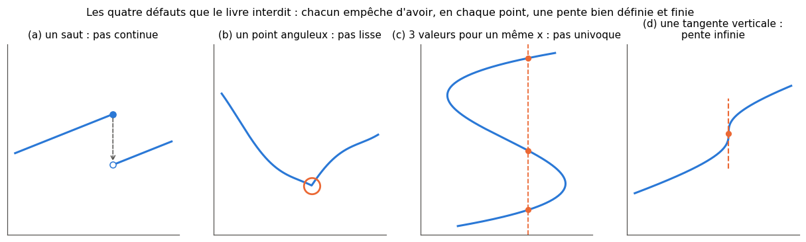
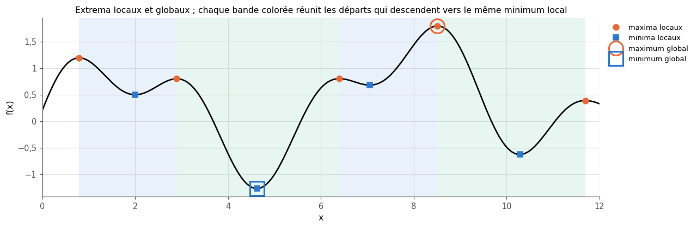
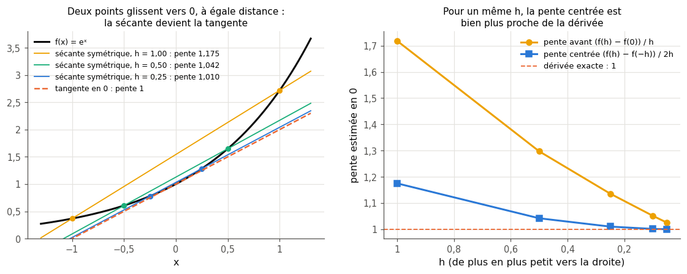
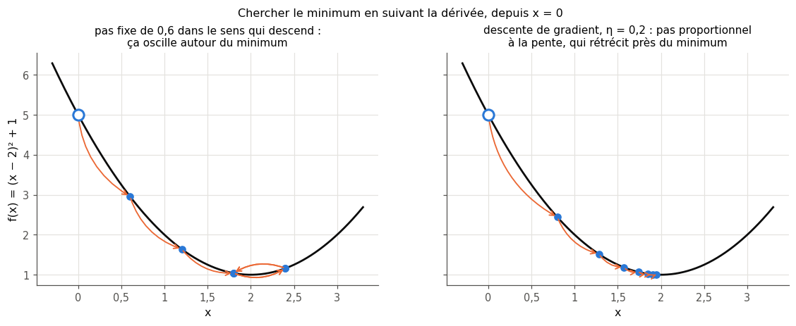
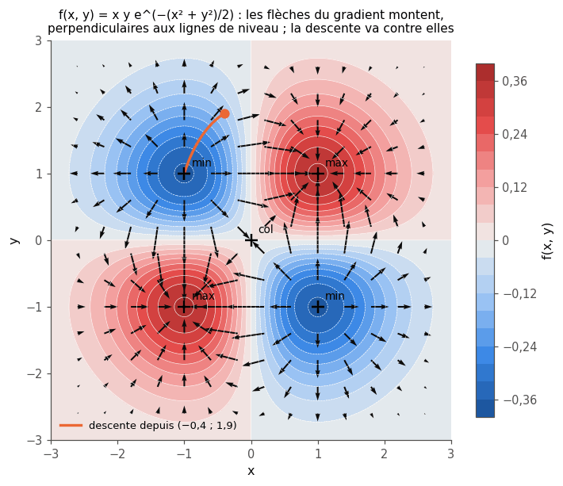
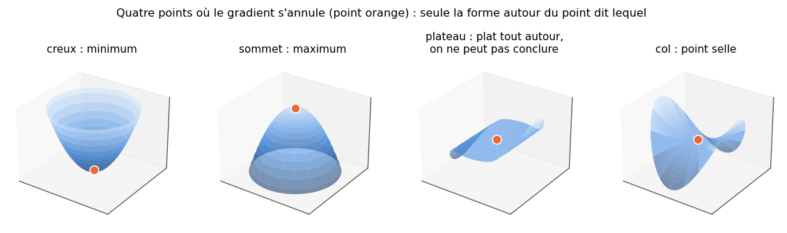
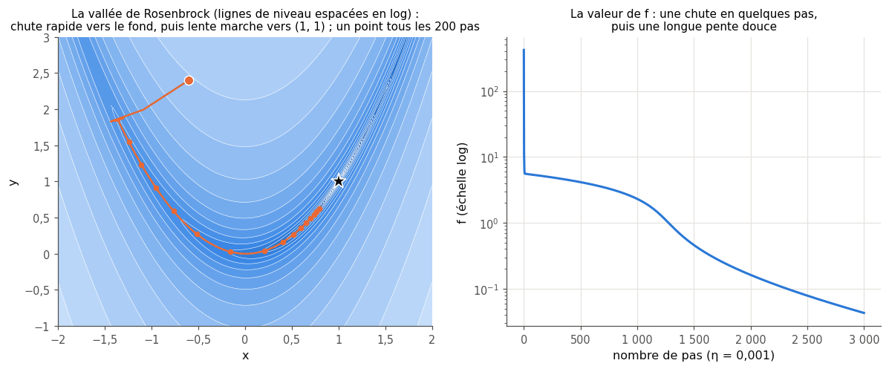

# 5 · Courbes et surfaces — fiche de cours

> Cette fiche accompagne le chapitre 5 du livre, qui pose le vocabulaire géométrique de tout l'ouvrage : les « bonnes » courbes, les extrema, puis la **dérivée** et le **gradient**, deux boussoles qui indiquent où la fonction monte. Pas une équation dans le livre : des dessins, un drap et de l'eau. La fiche ajoute les formules (vues en 0B, que tu retrouves ici), un mini-exemple chiffré par notion, et ce que le livre laisse de côté : calculer une dérivée sur ordinateur (différences finies et choix du pas), la dérivée seconde, la descente de gradient avec un learning rate, la pente dans une direction, les points selles en grande dimension et la différentiation automatique de PyTorch.

| | |
|---|---|
| **Livre** | vol. 1, ch. 5 « Curves and Surfaces », p. 205-230 (§5.1 à §5.4) |
| **Temps total estimé** | ≈ 14 h : lecture du livre et de la fiche ≈ 2,1 h, exercices ≈ 11 h, 20 flashcards ≈ 0,7 h |
| **Prérequis** | 0B (dérivée, règles de dérivation, règle de la chaîne, variations, dérivées partielles, gradient, lignes de niveau, un pas de descente de gradient, norme et produit scalaire) · ch. 1 (learning rate et boucle d'entraînement, 1.16 et 1.17 ; série des taches solaires et moyenne mobile, 1.12) · ch. 2 (loi normale) |
| **Fichiers du chapitre** | `02_exercices.md` (quiz, rappels, papier, réflexion, entretien) · `03_notebook.ipynb` · `04_indices.md` · `05_solutions.md` et `05_solutions.ipynb` · `06_mes_reponses.md` · `flashcards.csv` |
| **mylearn** | `calculus.py` : 6 fonctions (dérivées première et seconde numériques, gradient numérique, descente de gradient, extrema d'une courbe échantillonnée, nature d'un point critique), écrites dans le notebook (5.11, 5.14, 5.15, 5.18, 5.24) ; elles resservent au ch. 18 (vérifier une rétropropagation) et au ch. 19 (les optimiseurs et leurs trajectoires) |

## Comment utiliser ce chapitre

Le chapitre du livre est court (26 pages, quatre sections) et ne contient aucune formule : il donne l'**intuition**. Tu connais déjà l'essentiel des calculs depuis 0B (§101.5 et §101.6). Ce chapitre va plus loin sur trois points : comprendre **pourquoi** le gradient indique la plus grande pente, calculer dérivées et gradients **sur ordinateur** (et savoir quand on se trompe), et **descendre** une surface pas à pas, ce que fait tout réseau de neurones pendant l'entraînement. Cinq encadrés 🧮 introduisent trois notions (la dérivée seconde, les nombres à virgule flottante, la pente dans une direction) et deux outils (lignes de niveau et flèches avec matplotlib ; `requires_grad` et `backward()` avec PyTorch).

**Ordre conseillé.**
1. Lis le livre §5.1 et §5.2, puis les sections 5.1 et 5.2 de la fiche. Fais les quiz Q1 à Q3 et Q9, et le rappel R1.
2. Lis le livre §5.3, puis la fiche §5.3 et « Au-delà du livre (1) ». Fais les quiz Q4 à Q6, les rappels R2 et R3, les exercices papier 5.1, 5.3 et 5.4, les questions 1 à 6 de ∂ 5.6, puis, dans le notebook, les dérivées numériques (5.11) et la prédiction 🔮 5.12, **avant** de lire « Au-delà du livre (2) ». Lis ensuite cette section, fais la question 7 de ∂ 5.6, puis termine la partie A (5.13 et 5.14).
3. Lis le livre §5.4 et la fiche §5.4. Fais les quiz Q7, Q8 et Q10, les exercices papier 5.2, 5.5 et 5.7 et l'oral 5.8, puis le notebook de 5.15 à 5.20 (partie B et début de la partie C).
4. Lis « Au-delà du livre (3) » (la différentiation automatique), puis fais l'estimation 5.9, l'exercice 5.21 et la partie D du notebook (5.22 à 5.25), l'article 5.10 et les quatre questions d'entretien.

| Section | Quiz 🧠 et rappels 🔁 | Papier ✏️ ∂ et réflexion | Notebook | Entretien 💼 |
|---|---|---|---|---|
| 5.1 Pourquoi ce chapitre | Q1, Q10 | 5.9 | 5.21 | E1 |
| 5.2 Introduction : fonctions, courbes, surfaces | Q2, Q3, Q9 | | 5.14 | |
| 5.3 La dérivée | Q4, Q5, Q6, Q9 | 5.1, 5.3, 5.4, 5.6 | 5.11, 5.12, 5.13, 5.14, 5.18, 5.24 | E2, E3 |
| 5.4 Le gradient | Q7, Q8, Q10 | 5.2, 5.3, 5.5, 5.7, 5.8, 5.9, 5.10 | 5.15 à 5.25 | E1 à E4 |
| Au-delà du livre : différences finies, arrondis, différentiation automatique | | 5.6, 5.9 | 5.11, 5.12, 5.13, 5.15, 5.16, 5.21, 5.23 | E3 |
| Rappels (ch. 0B, 2, 4) | R1, R2, R3 | | | |

**Lire les formules.** $f(x)$ est une fonction d'une variable ; sa dérivée se note $f'(x)$, sa dérivée seconde $f''(x)$. Pour plusieurs variables, on regroupe les entrées dans un vecteur en gras, $\mathbf{x} = (x_1, \ldots, x_n)$, et l'on note $f(\mathbf{x})$. Le gradient se note $\nabla f(\mathbf{x})$ (« nabla f ») ; $\mathbf{e}_i$ est le vecteur qui vaut 1 en position $i$ et 0 ailleurs ; $\|\mathbf{v}\|$ est la norme d'un vecteur (0B). Le **pas** d'une différence finie se note $h$ ; le **learning rate** se note $\eta$ (êta) comme au ch. 1. Le livre n'écrit aucune formule : ces notations sont celles de la fiche.

## Objectifs d'apprentissage

À la fin du chapitre, tu sais :
- **reconnaître** une fonction continue, lisse et univoque, et **dire** pourquoi on l'exige (ou pas, pour ReLU) ;
- **distinguer** extrema locaux et globaux et les **trouver** sur une courbe échantillonnée ;
- **approcher** une dérivée par une différence centrée et **choisir** le pas $h$ (troncature contre arrondi) ;
- **calculer** un gradient à la main et numériquement, et **interpréter** sa direction et sa norme ;
- **implémenter** la descente (et la montée) de gradient et **diagnostiquer** un learning rate mal choisi ;
- **classer** un point critique en minimum, maximum, selle ou plateau ;
- **vérifier** un gradient numérique contre la différentiation automatique de PyTorch.

## L'essentiel en 10 lignes

1. Une fonction associe une sortie à des entrées, toujours la même pour les mêmes entrées : une **courbe** a une entrée, une **surface** deux, la loss d'un réseau autant que de poids.
2. Le livre veut des courbes **continues** (sans saut), **lisses** (sans point anguleux) et **univoques** (une seule valeur par abscisse, jamais de tangente verticale) : ainsi, en chaque point, la pente est bien définie, et jamais infinie.
3. Un extremum **global** est la plus grande (ou plus petite) valeur sur tout le domaine ; un extremum **local** ne l'est que dans un voisinage. La valeur d'un maximum global est unique ; elle peut être atteinte en plusieurs points.
4. La **dérivée** $f'(x)$ est la pente de la tangente : la limite de la pente de sécantes de plus en plus courtes. Son **signe** dit dans quel sens la courbe monte.
5. $f'(x) = 0$ en un sommet, un creux, un plateau… ou un point où la courbe continue de monter ($x^3$ en 0). La **dérivée seconde** (la courbure) aide à trancher.
6. Sur ordinateur, on approche la dérivée par une **différence finie**. La différence **centrée** $\frac{f(x + h) - f(x - h)}{2h}$ est bien plus précise que la différence avant, et le pas $h$ se choisit avec soin (🔮 5.12, 🔬 5.13).
7. Le **gradient** $\nabla f$ rassemble les dérivées partielles : il pointe vers la **plus grande montée**, sa norme est cette pente, et $-\nabla f$ indique la plus grande descente (c'est là que coule l'eau du livre).
8. Là où le gradient s'annule (**point critique**), on peut être sur un maximum, un minimum, un plateau ou un **point selle**, qui monte dans une direction et descend dans une autre.
9. La **descente de gradient** répète $\mathbf{x} \leftarrow \mathbf{x} - \eta\,\nabla f(\mathbf{x})$ : trop grand, $\eta$ fait osciller ou diverger ; trop petit, il fait ramper. C'est ainsi qu'apprend un réseau (ch. 18 et 19).
10. Au-delà du livre : les bibliothèques calculent les gradients **exactement** (aux arrondis près) par **différentiation automatique** ; en deep learning, les différences finies ne servent plus guère qu'à les **vérifier**.

## 5.1 · Pourquoi ce chapitre ? ⏩

Entraîner un réseau, c'est chercher les poids qui rendent sa loss la plus petite possible. La loss, vue comme une fonction des poids, est une « surface » dans un espace à des millions de dimensions ; le réseau part d'un point de cette surface et doit **descendre**. Pour savoir dans quel sens aller, il lui faut la pente : c'est le rôle de la dérivée (une variable) et du gradient (plusieurs variables). Le livre insiste : sans dérivée ni gradient, impossible de comprendre la **rétropropagation** (*backpropagation*) du ch. 18. Une précision de la fiche : la rétropropagation ne fait que **calculer** le gradient de la loss ; c'est la descente de gradient qui modifie ensuite les poids.

Le livre reste volontairement dans l'intuition, sans équations, et renvoie aux manuels d'analyse pour la rigueur (§5.1). La fiche te redonne les formules de 0B au fil du texte, puis va un cran plus loin là où le machine learning en a besoin : calculer, vérifier et suivre une pente avec un ordinateur.

## 5.2 · Introduction : fonctions, courbes et surfaces

En machine learning, une fonction est une règle **déterministe** : on lui donne des nombres, elle en rend d'autres, toujours les mêmes pour les mêmes entrées ($f(x) = x^2$ rend 9 pour 3, aujourd'hui comme demain). Le nombre d'entrées dit ce qu'on peut dessiner : une entrée, une **courbe** $y = f(x)$ ; deux entrées, une **surface** $z = f(x, y)$, un relief au-dessus du plan ; au-delà, plus de dessin, mais les mêmes idées. Le livre parle d'une table de correspondance (*look-up table*), sans fin puisque les réels sont en nombre infini. La loss d'un réseau sur un dataset fixé est une telle fonction : des millions d'entrées (les poids), une seule sortie.

Pour pouvoir suivre une pente, le livre pose trois conditions sur ses courbes (§5.2), et une quatrième en passant (§5.3) :
- **continue** : on la trace sans lever le crayon (pas de saut) ;
- **lisse** : sans point anguleux, là où la courbe change brusquement de direction ;
- **univoque** (*single-valued*) : une seule valeur pour chaque abscisse, autrement dit une vraie fonction ;
- et jamais **verticale** : une tangente verticale aurait une pente infinie.



Chacun de ces défauts empêche d'avoir une pente bien définie, unique et finie. Au niveau d'un saut, la sécante qui l'enjambe devient presque verticale quand $h$ diminue (sa pente vaut à peu près « hauteur du saut / $2h$ ») : aucune pente finie, même si les deux morceaux ont la même inclinaison (panneau a de la figure). En un point anguleux, ce sont les pentes de gauche et de droite qui diffèrent. Là où la courbe a plusieurs valeurs, plusieurs pentes sont possibles ; une tangente verticale, elle, a une pente infinie. *Mini-exemple* : pour $f(x) = |x|$ en 0, la pente vaut $-1$ juste à gauche et $+1$ juste à droite ; la sécante symétrique, qui passe par $(-h, h)$ et $(h, h)$, est horizontale pour tout $h$ : elle donne 0, une valeur qui ne décrit ni la pente de gauche ni celle de droite.

> ⚠️ **Vocabulaire** — Le livre appelle *cusp* tout point où la courbe change brusquement de direction. En français, on dit **point anguleux** (comme $|x|$ en 0). Un **point de rebroussement** (le sens mathématique précis de *cusp*) est un cas encore plus pointu, où la courbe repart en arrière, comme la pointe d'une goutte. Et en mathématiques, **lisse** veut dire « au moins continûment dérivable » (souvent même indéfiniment dérivable) : c'est plus exigeant que « sans pointe ».

> 🕰️ **Mise à jour (2026)** — **Le livre :** suppose toutes ses courbes lisses, et dit qu'il existe des techniques pour contourner le problème quand elles ne le sont pas (§5.3). · **Aujourd'hui :** la fonction d'activation la plus utilisée, **ReLU** (*rectified linear unit*), $\max(0, x)$ (ch. 17), a un point anguleux en 0, et l'entraînement marche très bien. Les bibliothèques **choisissent** une valeur de dérivée en ces points : selon la documentation de PyTorch, pour une fonction convexe comme ReLU, elles prennent le **sous-gradient de plus petite norme** (pour ReLU en 0, la valeur 0, entre la pente 0 de gauche et la pente 1 de droite). En théorie, ce choix ne compte pas : une entrée réelle ne tombe presque jamais pile sur 0. En pratique, Bertoin et coll. (2021) observent qu'en `float32`, la précision par défaut, la valeur choisie modifie les gradients calculés environ une fois sur deux (systématiquement en 16 bits, jamais en 64 bits), et qu'avec une descente de gradient simple, 0 semble le meilleur choix (plus de 10 points d'accuracy d'écart avec 1 sur ImageNet) ; la *batch normalization* et Adam atténuent l'effet. Tu verras en 5.21 que la valeur obtenue dépend même de la façon dont on écrit la fonction. · **Faut-il quand même l'apprendre ?** Oui : la règle du livre explique **pourquoi** on a besoin d'une pente bien définie, et ce qu'on perd quand il n'y en a pas. · *Sources :* [PyTorch, « Autograd mechanics », section *Gradients for non-differentiable functions*](https://docs.pytorch.org/docs/2.14/notes/autograd.html) ; D. Bertoin, J. Bolte, S. Gerchinovitz et E. Pauwels, « Numerical influence of ReLU'(0) on backpropagation », [NeurIPS 2021](https://papers.nips.cc/paper/2021/hash/043ab21fc5a1607b381ac3896176dac6-Abstract.html).

## 5.3 · La dérivée ⏩

### Extrema globaux et locaux

Entraîner un modèle, c'est chercher le point le plus bas d'une loss : les extrema sont au centre de tout. Sur tout le domaine, la plus grande valeur est le **maximum global**, la plus petite le **minimum global**. Autour d'un point seulement, c'est un **maximum local** : $x^*$ est un maximum local si $f(x^*) \ge f(x)$ pour tous les $x$ assez proches de $x^*$ (de même pour un minimum local, avec $\le$). Un extremum global situé à l'intérieur du domaine est aussi local ; l'inverse est faux.

*Mini-exemple* : $f(x) = x^4 - 2x^2$ a deux minima globaux, en $x = -1$ et $x = 1$, de valeur $-1$ ; en $x = 0$, elle a un maximum local de valeur 0, qui n'est pas global (la courbe monte sans fin quand $x$ s'éloigne). Elle n'a donc pas de maximum global du tout.



Le livre (§5.3) définit les extrema locaux à sa façon, à partir d'un point de départ : on marche vers la gauche tant que la courbe garde le même sens de variation, puis vers la droite ; parmi le point de départ et les deux points d'arrêt, le plus haut est « le maximum local de ce point de départ », le plus bas son « minimum local ». Chaque extremum a ainsi sa **zone d'influence**, l'ensemble des départs qui y mènent (bandes colorées de la figure, pour les minima). C'est exactement ce que fait une descente : partie d'un point, elle tombe dans le minimum local de sa zone, pas forcément dans le minimum global. Tu repéreras des extrema dans une vraie série (les cycles solaires) en 5.14.

> ⚠️ **Une phrase du livre à corriger** — Le livre écrit qu'il n'y a « qu'un seul » maximum global et qu'un seul minimum global, juste après avoir montré une courbe périodique où une infinité de points atteignent le maximum (la légende de sa figure 5.4 le reconnaît : c'est une maladresse de formulation). La bonne formulation : la **valeur** du maximum global est unique (s'il existe), mais elle peut être atteinte en **plusieurs points**, voire une infinité ($\cos x$ vaut 1 en tous les multiples de $2\pi$). Et une fonction peut n'avoir aucun extremum global : $x^3$ sur tous les réels, ou $e^x$, qui s'approche de 0 sans jamais l'atteindre.

### Tangente et dérivée

Pour trouver la tangente en un point, le livre place deux points sur la courbe, à égale distance de part et d'autre, et les fait glisser vers le point visé (figure 5.8 du livre). La droite qui passe par deux points de la courbe s'appelle une **sécante** ; quand les deux points se rapprochent, elle tend vers la **tangente**, et sa pente tend vers la **dérivée**. Avec les points d'abscisses $x - h$ et $x + h$ :

$$f'(x) = \lim_{h \to 0} \frac{f(x + h) - f(x - h)}{2h},$$

une variante symétrique de la définition de 0B, $f'(x) = \lim_{h \to 0} \frac{f(x + h) - f(x)}{h}$ ; pour une courbe lisse, les deux limites coïncident.



*Mini-exemple* avec $f(x) = e^x$ en 0, dont la dérivée vaut $e^0 = 1$ : la sécante symétrique a pour pente $\frac{e^{h} - e^{-h}}{2h}$, soit 1,175 pour $h = 1$, 1,042 pour $h = 0{,}5$ et 1,0017 pour $h = 0{,}1$. La sécante « avant », de 0 à $h$, est beaucoup plus loin du compte : $\frac{e^{0{,}1} - 1}{0{,}1} \approx 1{,}052$ pour $h = 0{,}1$.

**Le signe de la dérivée** dit dans quel sens la courbe monte : si $f'(x) > 0$, elle monte vers la droite ; si $f'(x) < 0$, elle descend vers la droite (elle monte donc vers la gauche). Pour trouver de plus grandes valeurs, on se déplace dans le sens du **signe** de la dérivée ; pour de plus petites, dans le sens opposé. Le livre utilise la fonction **signe** : $\mathrm{sign}(x)$ vaut $1$ si $x > 0$, $-1$ si $x < 0$ et $0$ si $x = 0$ (`np.sign`). Plus $|f'(x)|$ est grand, plus la pente est raide.

**Là où la dérivée s'annule.** La tangente est horizontale au sommet d'une bosse (maximum), au fond d'un creux (minimum), sur un plateau (une zone plate)… mais aussi en un point où la courbe continue de monter : $f(x) = x^3$ a une dérivée nulle en 0 et monte avant comme après. Une dérivée nulle est **nécessaire** pour un extremum situé à l'intérieur du domaine, mais elle ne suffit pas (0B, §101.5.4).

> ⚠️ **« Plateau »** — Le livre appelle *plateau* tout point de pente nulle qui n'est ni un sommet ni un creux (§5.3). Un vrai plateau est une **zone** entière où la courbe est plate. Un point isolé de pente nulle où la courbe continue de monter (ou de descendre) s'appelle un **point d'inflexion à tangente horizontale** ; c'est le cas de $x^3$ en 0.

> 🧮 **Rappel maths — dérivée seconde et courbure** — La **dérivée seconde** $f''(x)$ est la dérivée de la dérivée : elle dit comment la pente elle-même varie. Si $f''(x) > 0$, la pente augmente : la courbe tourne vers le haut, en forme de **cuvette** (on dit qu'elle est **convexe** autour de ce point). Si $f''(x) < 0$, elle tourne vers le bas, en forme de **dôme** (**concave**). D'où un test pour un point où $f'(x^*) = 0$ : $f''(x^*) > 0$ indique un minimum local, $f''(x^*) < 0$ un maximum local, et $f''(x^*) = 0$ ne permet pas de conclure ($x^3$, $x^4$ et $-x^4$ ont tous trois $f'(0) = f''(0) = 0$, et ce sont trois cas différents). Avec $f(x) = x^4 - 2x^2$ : $f''(x) = 12x^2 - 4$ vaut $-4$ en 0 (maximum local) et 8 en $\pm 1$ (minima). Sur ordinateur, on l'approche par la **différence seconde** $\frac{f(x + h) - 2f(x) + f(x - h)}{h^2}$ : la différence entre la pente à droite et la pente à gauche, divisée par $h$.

### Suivre la pente jusqu'à un extremum

Le livre (figures 5.12 à 5.14) décrit l'algorithme de base : en un point, calculer la dérivée, faire un petit pas dans le sens de son signe (pour monter) ou dans le sens opposé (pour descendre), recommencer, et s'arrêter quand la dérivée s'annule. Sur ses figures, les pas sont grands là où la pente est forte et rapetissent près de l'extremum.

C'est exactement la **descente de gradient** à une variable, à condition que le pas soit **proportionnel** à la dérivée :

$$x \leftarrow x - \eta\, f'(x) \quad \text{(descente)}, \qquad x \leftarrow x + \eta\, f'(x) \quad \text{(montée)},$$

où $\eta > 0$ est le **learning rate**. Comme le pas vaut $\eta\,|f'(x)|$, il rétrécit tout seul quand la pente s'aplatit, et l'on peut s'arrêter quand $|f'(x)|$ devient assez petit.

*Mini-exemple* : $f(x) = (x - 2)^2 + 1$, $f'(x) = 2(x - 2)$, départ $x_0 = 0$, $\eta = 0{,}2$. On trouve $x_1 = 0 - 0{,}2 \times (-4) = 0{,}8$, puis $x_2 = 0{,}8 - 0{,}2 \times (-2{,}4) = 1{,}28$, puis $x_3 = 1{,}568$ : la distance au minimum, situé en $x = 2$, est multipliée par 0,6 à chaque pas.



> ⚠️ **Pas fixe ou pas proportionnel** — Le texte du livre fait « un petit pas dans le sens du signe de la dérivée ». Avec un pas **fixe**, on ne s'arrête jamais exactement sur l'extremum : on finit par osciller autour, à moins d'une longueur de pas près (figure ci-dessus, à gauche). Ses figures, elles, montrent des pas qui rapetissent quand la pente faiblit : c'est la descente de gradient, dont le pas est proportionnel à la dérivée. Le livre signale lui-même qu'il reste à régler la taille des pas et à éviter de dépasser l'extremum (§5.3) : c'est tout le sujet du learning rate (🔬 5.19).

**Le learning rate.** S'il est trop petit, la descente rampe (ch. 1, 1.17) ; s'il est trop grand, chaque pas dépasse le minimum, et la suite oscille, voire s'éloigne (**diverge**). Dans le mini-exemple, la distance au minimum est multipliée par le même facteur à chaque pas, $1 - 2\eta = 0{,}6$ : la descente avance tant que ce facteur reste strictement entre $-1$ et 1. Pour une parabole plus creusée, ce facteur s'éloigne plus vite de 1 quand $\eta$ grandit : plus la courbure est forte, plus le learning rate doit être petit. Tu trouveras la limite exacte pour une parabole en ✏️ 5.3.

## Au-delà du livre (1) : calculer une dérivée sur ordinateur

Un ordinateur ne calcule pas de limite. Il **approche** la dérivée avec un petit pas $h$ fixé : c'est une **différence finie**. Trois formules sont courantes :

$$\underbrace{\frac{f(x + h) - f(x)}{h}}_{\text{avant (forward)}} \qquad \underbrace{\frac{f(x) - f(x - h)}{h}}_{\text{arrière (backward)}} \qquad \underbrace{\frac{f(x + h) - f(x - h)}{2h}}_{\text{centrée (central)}}$$

La différence **centrée** est la moyenne des deux autres. Son erreur, appelée **erreur de troncature** (*truncation error*) parce qu'elle vient de la formule elle-même, diminue comme $h^2$ ; celle des différences avant et arrière, comme $h$ seulement. Diviser $h$ par 10 divise donc l'erreur centrée par environ 100, et l'erreur avant par environ 10. Tu le démontreras sur $x^3$ par un calcul exact (∂ 5.6), et tu le mesureras en 🔬 5.13 ; le mini-exemple de $e^x$ ci-dessus le montre déjà. La **différence seconde** du §5.3 s'écrit de la même façon, avec trois évaluations de $f$.

En Python, chacune tient en une ligne et marche aussi sur un tableau de points, pourvu que $f$ accepte les tableaux (comme `np.sin`) : c'est `numerical_derivative` et `second_derivative` de `mylearn.calculus` (5.11).

## Au-delà du livre (2) : les arrondis et le choix du pas

> 🧮 **Rappel outil — les nombres à virgule flottante** — Un `float` Python (un `float64` de NumPy) garde environ **16 chiffres significatifs** : sa précision relative est $\varepsilon \approx 2{,}2 \times 10^{-16}$ (`np.finfo(float).eps`). Chaque opération arrondit donc son résultat. D'où des surprises : `0.1 + 0.2` vaut `0.30000000000000004`, et `1 + 1e-17 == 1` vaut `True`. Le pire arrive quand on **soustrait deux nombres presque égaux** : les chiffres communs s'annulent, et il ne reste que les derniers, ceux qui portent l'erreur d'arrondi. `(1 + 1e-12) - 1` donne `1.000088900582341e-12` : une erreur relative de presque $10^{-4}$, alors que chaque nombre était exact à $10^{-16}$ près. On parle d'**annulation catastrophique** (*catastrophic cancellation*).

**Le dilemme du pas $h$.** Le numérateur $f(x + h) - f(x - h)$ est justement une soustraction de deux nombres presque égaux. Ses erreurs d'arrondi, de l'ordre de $\varepsilon\,|f(x)|$, sont ensuite **divisées par $2h$** : cette **erreur d'arrondi** (*round-off error*) grandit quand $h$ diminue, comme $\frac{\varepsilon}{h}$. L'erreur totale additionne donc une partie qui baisse avec $h$ (la troncature) et une partie qui monte (l'arrondi) : il existe un **meilleur pas**, ni trop grand ni trop petit, et un $h$ minuscule ($10^{-15}$) donne une très mauvaise dérivée. Où se trouve ce meilleur pas, et pourquoi n'est-il pas le même pour la différence avant ? Prédis-le en 🔮 5.12, puis mesure-le en 🔬 5.13. Les pas par défaut de `mylearn.calculus` ($10^{-5}$ pour la pente, $10^{-4}$ pour la dérivée seconde) viennent de ce compromis. Pour la dérivée seconde, la division par $h^2$ amplifie encore plus l'arrondi : il faut un $h$ plus grand.

> 🕰️ **Mise à jour (2026)** — **Le livre :** ne dit pas comment calculer une dérivée. · **Aujourd'hui :** quand on n'a que la fonction (pas sa formule), SciPy propose depuis la version 1.15 le module `scipy.differentiate` (`derivative`, `jacobian`, `hessian`), qui choisit lui-même son pas et utilise des différences d'ordre élevé. L'ancienne `scipy.misc.derivative`, à pas fixe, dépréciée depuis SciPy 1.10, a disparu en 1.15 avec tout le sous-module `scipy.misc` : un code qui l'appelle ne tourne plus avec une version récente. Pour les réseaux de neurones, on n'utilise ni l'une ni l'autre : la différentiation automatique (plus bas) donne le gradient exact. · **Faut-il quand même l'apprendre ?** Oui : les différences finies restent l'outil pour **vérifier** un gradient (*gradient check*, ch. 18), et comprendre leurs erreurs évite des conclusions fausses. · *Sources :* [notes de version de SciPy 1.15.0](https://docs.scipy.org/doc/scipy-1.15.1/release/1.15.0-notes.html) ; [documentation de `scipy.misc.derivative`, SciPy 1.14.1](https://docs.scipy.org/doc/scipy-1.14.1/reference/generated/scipy.misc.derivative.html).

## 5.4 · Le gradient ⏩

Le gradient étend la dérivée aux fonctions de **plusieurs variables** : deux pour une surface (que l'on dessine en trois dimensions), des millions pour la loss d'un réseau. Le livre l'illustre par un drap suspendu, figé dans un instant, qui forme un relief et respecte les règles du §5.2 (§5.4). De l'eau versée dessus coule par le chemin le plus raide : cette direction de plus grande descente est l'opposé du **gradient**, qui pointe vers la **plus grande montée**.

En formules (0B, §101.6.3), le gradient rassemble les dérivées partielles :

$$\nabla f(\mathbf{x}) = \left(\frac{\partial f}{\partial x_1}(\mathbf{x}), \ldots, \frac{\partial f}{\partial x_n}(\mathbf{x})\right).$$

Ses propriétés : il pointe vers la plus grande montée ; sa **norme** $\|\nabla f(\mathbf{x})\|$ est la pente dans cette direction (le livre parle de *magnitude*) ; $-\nabla f$ pointe vers la plus grande descente ; et il est **perpendiculaire aux lignes de niveau**. Le livre affirme les trois premières propriétés, sans démonstration ; la quatrième n'y figure pas. L'encadré suivant les démontre.

> 🧮 **Rappel maths — la pente dans une direction** — Partons de $\mathbf{x}$ dans la direction d'un vecteur **unitaire** $\mathbf{u}$ (de norme 1). Pour un petit pas $t$, $f(\mathbf{x} + t\,\mathbf{u}) \approx f(\mathbf{x}) + t\,\nabla f(\mathbf{x}) \cdot \mathbf{u}$ : la **pente dans la direction $\mathbf{u}$** (dérivée directionnelle) est le produit scalaire $\nabla f(\mathbf{x}) \cdot \mathbf{u}$ (0B, §101.3.3). Or $\nabla f \cdot \mathbf{u} = \|\nabla f\|\,\|\mathbf{u}\| \cos\theta = \|\nabla f\| \cos\theta$, où $\theta$ est l'angle entre $\mathbf{u}$ et le gradient. Cette pente est **maximale** pour $\theta = 0$ ($\mathbf{u}$ dans le sens du gradient) et vaut alors $\|\nabla f\|$ ; elle est **minimale**, égale à $-\|\nabla f\|$, pour $\theta = 180°$ (contre le gradient) ; elle est **nulle** pour $\theta = 90°$ : on longe alors une ligne de niveau. *Mini-exemple* : $f(x, y) = x^2 + xy$ en $(1, 2)$ a pour gradient $(2x + y, x) = (4, 1)$. Dans la direction $\mathbf{u} = (0{,}6 ; 0{,}8)$, la pente vaut $4 \times 0{,}6 + 1 \times 0{,}8 = 3{,}2$ ; la pente maximale est $\|(4, 1)\| = \sqrt{17} \approx 4{,}12$ ; dans la direction $(-1, 4)/\sqrt{17}$, perpendiculaire au gradient, elle est nulle.



Sur cette carte, les flèches du gradient coupent les lignes de niveau à angle droit et s'allongent là où les lignes se resserrent (la pente y est plus forte) ; la descente, en orange, va contre elles, vers un creux.

> 🧮 **Rappel outil — lignes de niveau et flèches avec matplotlib** — Pour dessiner $f(x, y)$ à plat : `X, Y = np.meshgrid(xs, ys)` fabrique la grille des points, `Z = f(X, Y)` calcule les hauteurs (la fonction doit accepter des tableaux), `ax.contour(X, Y, Z, levels=...)` trace les lignes de niveau (`contourf` les remplit de couleurs), et `ax.quiver(X, Y, U, V)` dessine une flèche $(U, V)$ en chaque point, par exemple le gradient. N'oublie pas `ax.set_aspect("equal")`, sans quoi les angles droits ne le sont plus. `wb.plot.plot_contour(f, path=...)` fait la grille, les hauteurs et les lignes de niveau, et ajoute une trajectoire ; les flèches (`ax.quiver`) et `set_aspect("equal")` restent à ajouter (5.22).

**Calculer un gradient sur ordinateur.** On applique la différence centrée à chaque coordonnée, l'une après l'autre, en laissant les autres fixes :

$$\frac{\partial f}{\partial x_i}(\mathbf{x}) \approx \frac{f(\mathbf{x} + h\,\mathbf{e}_i) - f(\mathbf{x} - h\,\mathbf{e}_i)}{2h}.$$

Il faut donc **deux évaluations de $f$ par variable** : $2n$ évaluations pour $n$ variables. C'est rapide pour 2 variables, ruineux pour un million (🧮 5.9). Le point $\mathbf{x}$ peut avoir n'importe quelle forme : les poids d'une couche forment une matrice, et le gradient a la même forme. Un piège classique : modifier les coordonnées du tableau **reçu** au lieu d'une copie, ou travailler sur un tableau d'entiers (🐛 5.16).

### Les points où le gradient s'annule

Au sommet d'une colline, au fond d'une cuvette ou sur une plaine, le plan tangent est horizontal : au premier ordre, aucune direction ne monte ni ne descend, et le gradient est **nul** (le livre dit qu'il « s'évanouit », *vanishes*). On parle de **point critique** (ou point stationnaire). Les surfaces ajoutent un cas qui n'existe pas pour les courbes : le **point selle** (ou **col**), qui monte dans une direction et descend dans une autre, comme une selle de cheval (figure 5.22 du livre).



Pour savoir lequel, on regarde la **courbure** autour du point, dans plusieurs directions (la dérivée seconde le long de chaque direction) : positive partout, c'est un minimum ; négative partout, un maximum ; positive dans une direction et négative dans une autre, un point selle ; nulle, on ne peut pas conclure. Il faut regarder **plusieurs** directions, pas seulement les axes. *Mini-exemple* : $f(x, y) = xy$ est nulle sur les deux axes, donc plate dans leurs directions ; mais le long de la diagonale $y = x$, elle vaut $x^2$ (elle monte), et le long de $y = -x$, elle vaut $-x^2$ (elle descend) : $(0, 0)$ est un point selle. `classify_critical_point` (5.24) regarde ainsi les axes et les diagonales. L'outil complet, la matrice des dérivées secondes (la **matrice hessienne**), sera utile au ch. 19.

> 🕰️ **Mise à jour (2026)** — **Le livre :** présente le point selle comme une forme propre aux surfaces, sans parler de son rôle en optimisation. · **Aujourd'hui :** c'est un sujet central de l'optimisation des réseaux. Dauphin et coll. (2014) ont soutenu qu'en grande dimension, la principale difficulté vient de la **prolifération des points selles**, pas des mauvais minima locaux : les points critiques à loss élevée sont presque tous des points selles, entourés de **plateaux** qui ralentissent la descente et donnent l'illusion d'un minimum. Lee et coll. (2016) ont montré qu'une descente de gradient partie d'un point tiré **au hasard**, avec un learning rate assez petit, ne converge presque jamais vers un point selle (sous des hypothèses techniques sur la fonction) ; mais Du et coll. (2017) ont montré qu'elle peut mettre un temps exponentiellement long à s'en écarter, alors qu'une version qui ajoute un peu de bruit à ses pas s'en échappe vite. On y voit souvent une des raisons du succès de la descente **stochastique** (ch. 19), dont le bruit naturel jouerait ce rôle. · **Faut-il quand même l'apprendre ?** Oui : reconnaître un point selle et un plateau aide à comprendre une courbe de loss qui stagne. · *Sources :* Y. Dauphin et coll., « Identifying and attacking the saddle point problem in high-dimensional non-convex optimization », [NeurIPS 2014](https://proceedings.neurips.cc/paper_files/paper/2014/hash/04192426585542c54b96ba14445be996-Abstract.html) ([arXiv:1406.2572](https://arxiv.org/abs/1406.2572)) ; J. D. Lee et coll., « Gradient Descent Converges to Minimizers », COLT 2016 ([arXiv:1602.04915](https://arxiv.org/abs/1602.04915)) ; S. S. Du et coll., « Gradient Descent Can Take Exponential Time to Escape Saddle Points », [NeurIPS 2017](https://proceedings.neurips.cc/paper/2017/hash/f79921bbae40a577928b76d2fc3edc2a-Abstract.html).

### Descendre une surface pas à pas

Pour descendre, on suit l'eau du livre : on calcule le gradient là où l'on est, on fait un petit pas **contre** lui, et l'on recommence (figure 5.18 du livre). C'est la **descente de gradient** :

$$\mathbf{x}_{t+1} = \mathbf{x}_t - \eta\,\nabla f(\mathbf{x}_t),$$

et la **montée de gradient** remplace le signe moins par un plus. On s'arrête après un nombre de pas fixé, ou quand la norme du gradient passe sous un seuil (la surface est presque plate). Le livre referme le chapitre sur l'apprentissage : la descente de gradient appliquée à l'erreur d'un réseau (§5.4), que le ch. 18 détaillera.

**Un learning rate pour plusieurs courbures.** Sur une surface, la courbure n'est pas la même dans toutes les directions, et un seul $\eta$ doit convenir à toutes. *Mini-exemple* : $f(x, y) = (x - 1)^2 + 5y^2$, départ $(0, 1)$, $\eta = 0{,}08$. Le gradient vaut $(2(x - 1), 10y)$ ; à chaque pas, $x - 1$ est multiplié par $1 - 2\eta = 0{,}84$, et $y$ par $1 - 10\eta = 0{,}2$. Les points successifs sont $(0 ; 1)$, $(0{,}16 ; 0{,}2)$, $(0{,}294 ; 0{,}04)$, $(0{,}407 ; 0{,}008)$ : $y$ s'effondre, $x$ avance lentement. On ne peut pas augmenter $\eta$ à volonté pour accélérer $x$ : dès que $\eta \ge 0{,}2$, le facteur de $y$ atteint $-1$ et la descente cesse de converger. Le **plus grand** learning rate possible est fixé par la direction **la plus courbée**, et la vitesse par la direction **la plus plate**. Plus ces deux courbures sont différentes, plus la descente est lente (🔬 5.19).

La fonction de **Rosenbrock**, $f(x, y) = (a - x)^2 + b\,(y - x^2)^2$, est l'exemple classique de ce problème (avec $a = 1$ et $b = 100$). Son minimum, $(a, a^2) = (1, 1)$, est au fond d'une vallée étroite et courbe (∂ 5.7) : la pente est très forte en travers de la vallée, très faible le long de son fond. La descente tombe vite dans la vallée, puis en suit le fond, à petits pas. Elle te servira de banc d'essai jusqu'au ch. 19 (🏆 5.25).



> ⚠️ **Les limites de l'image de l'eau** — L'eau coule en continu ; la descente de gradient fait des **pas** de taille finie, qui peuvent enjamber la vallée et repartir de l'autre côté (c'est l'oscillation). L'eau a de l'**inertie** et accumule de la vitesse dans une pente régulière ; la descente simple n'en a aucune. Le **momentum** du ch. 19 ajoute justement cette inertie. Enfin, l'eau ne voit que son voisinage, comme la descente : ni l'une ni l'autre ne savent où est le point le plus bas du paysage.

## Au-delà du livre (3) : la différentiation automatique

Pour calculer le gradient d'une loss par rapport à des millions de poids, les différences finies sont trop lentes ($2n$ évaluations) et imprécises (troncature et arrondi). Les bibliothèques de deep learning font autrement : pendant le calcul de la loss, elles **enregistrent** chaque opération élémentaire (additions, produits, exponentielles…), dont elles connaissent la dérivée, puis elles appliquent la **règle de la chaîne** (0B, §101.5.3 et §101.6.4) en remontant de la sortie vers les entrées. C'est la **différentiation automatique en mode inverse** (*reverse-mode automatic differentiation*), dont la rétropropagation du ch. 18 est le cas particulier des réseaux. Son coût : quelques fois celui d'une évaluation de la loss, **quel que soit le nombre de paramètres**. Et le gradient obtenu est exact, aux arrondis près : pas de pas $h$ à choisir.

> 🧮 **Rappel outil — PyTorch en cinq lignes** — Un **tenseur** (*tensor*) est le tableau de PyTorch, l'équivalent d'un tableau NumPy (détails au ch. 20). Avec `requires_grad=True`, PyTorch enregistre les opérations faites avec lui ; `loss.backward()` remonte ces opérations et range la dérivée de `loss` dans l'attribut `.grad` du tenseur :
> ```python
> p = torch.tensor([0.5, -1.0], dtype=torch.float64, requires_grad=True)
> loss = p[0] ** 2 + 3 * p[0] * p[1]       # any formula written with tensors
> loss.backward()                          # chain rule, from loss back to p
> p.grad                                   # tensor([-2.0000,  1.5000], dtype=torch.float64)
> ```
> Ici $\frac{\partial\,\text{loss}}{\partial p_0} = 2p_0 + 3p_1 = -2$ et $\frac{\partial\,\text{loss}}{\partial p_1} = 3p_0 = 1{,}5$. On travaille en `float64` pour comparer à un gradient numérique ; les réseaux, eux, calculent en `float32`, voire en 16 bits.

> 🕰️ **Mise à jour (2026)** — **Le livre :** décrit dérivée et gradient par la géométrie et renvoie leur calcul au ch. 18. · **Aujourd'hui :** personne ne dérive une loss à la main ni par différences finies pour entraîner un réseau. PyTorch (`torch.autograd`), JAX et TensorFlow calculent les gradients par différentiation automatique : PyTorch enregistre un graphe des opérations pendant le calcul (feuilles : les entrées ; racines : les sorties) et applique la règle de la chaîne des racines vers les feuilles. Les différences finies servent à **vérifier** : `torch.autograd.gradcheck` compare le gradient automatique à des différences finies, et sa documentation précise que ses tolérances par défaut supposent des entrées en `float64`. · **Faut-il quand même l'apprendre ?** Oui : comprendre ce que calcule `backward()` (une pente, comme ici) et savoir la vérifier sert à chaque bug d'entraînement ; tu écriras ta propre mini-différentiation automatique au ch. 18. · *Sources :* [PyTorch, « Autograd mechanics »](https://docs.pytorch.org/docs/2.14/notes/autograd.html) ; [documentation de `torch.autograd.gradcheck`](https://docs.pytorch.org/docs/2.14/generated/torch.autograd.gradcheck.gradcheck.html) ; A. G. Baydin, B. A. Pearlmutter, A. A. Radul et J. M. Siskind, « Automatic differentiation in machine learning: a survey », *JMLR* 18, 2018 ([arXiv:1502.05767](https://arxiv.org/abs/1502.05767)).

**Différences finies ou différentiation automatique ?**

| | Différences finies | Différentiation automatique |
|---|---|---|
| Ce qu'il faut | seulement pouvoir évaluer $f$ | le calcul de $f$ écrit avec la bibliothèque (tenseurs) |
| Coût d'un gradient à $n$ variables | $2n$ évaluations de $f$ | quelques évaluations, quel que soit $n$ |
| Précision | erreur de troncature et d'arrondi, selon $h$ | exacte aux arrondis près |
| Usage en ML | vérifier un gradient (*gradient check*) | entraîner tous les réseaux |

## Les pièges classiques ⚠️ (récapitulatif)

| Piège | Exemple faux | Réflexe |
|---|---|---|
| croire qu'un maximum global est atteint en un seul point | « $\cos x$ a un seul maximum » | une seule **valeur** maximale, parfois plusieurs points |
| conclure à un extremum dès que $f' = 0$ | $x^3$ en 0 | regarder le signe de $f'$ autour, ou $f''$ |
| prendre un extremum local pour le global | une descente arrêtée dans une petite cuvette | essayer plusieurs départs ; le global n'est jamais garanti |
| un pas $h$ minuscule « pour être précis » | l'arrondi finit par dominer (🔮 5.12) | mesurer le meilleur pas (🔬 5.13), ou garder la valeur par défaut |
| la différence avant quand on veut de la précision | erreur en $h$ au lieu de $h^2$ | la différence centrée |
| modifier le tableau de l'appelant dans un gradient numérique | le point de départ « bouge » tout seul | travailler sur une copie : `np.array(x, dtype=float)` |
| un point de départ en entiers | `x[i] += 1e-5` dans un tableau d'entiers : la valeur est tronquée vers 0 ($-0{,}99999 \to 0$), et le gradient est absurde | travailler sur une copie en `float` |
| descendre dans le sens du gradient | `x = x + lr * grad` pour minimiser | le **moins** : $\mathbf{x} - \eta\,\nabla f$ |
| un learning rate trop grand | la loss grimpe, souvent en dents de scie, puis explose | le diviser par 2 ou 10, tracer la loss |
| tester un point critique seulement sur les axes | $xy$ en $(0, 0)$ semble « plat » | regarder aussi les diagonales |
| comparer un gradient `float32` avec une tolérance faite pour `float64` | un *gradient check* qui échoue à tort | vérifier en `float64` |

## Liens avec les autres chapitres 🔗

- **0B** : dérivée, règles de dérivation et règle de la chaîne, variations, dérivées partielles, gradient, lignes de niveau, un pas de descente ; norme et produit scalaire (la pente dans une direction).
- **Ch. 1** : learning rate et première boucle d'entraînement (1.16, 1.17) ; série des taches solaires et moyenne mobile (1.12), reprise en 5.14.
- **Ch. 2** : la loi normale, dont la densité atteint son maximum en sa moyenne (R2).
- **Ch. 4** : le MAP est l'endroit où un posterior atteint son maximum : c'est un argmax, donc une question d'extremum.
- **Ch. 9** : entraîner une régression, c'est minimiser une loss : en une seule formule (les moindres carrés), ou par descente.
- **Ch. 17** : ReLU et les fonctions d'activation, avec leurs points anguleux.
- **Ch. 18** : la rétropropagation calcule le gradient d'un réseau ; on la vérifie par différences finies (*gradient check*, avec `numerical_gradient`).
- **Ch. 19** : les optimiseurs (momentum, Adam…), les paysages de loss, les points selles et les plateaux, sur Rosenbrock (avec `gradient_descent`).
- **Ch. 20** : les tenseurs PyTorch et `torch.autograd` en détail.

## Guide de lecture et de travail

**Lecture du livre.** Lis le chapitre 5 dans l'ordre, avec la fiche à côté : chaque section de la fiche porte le numéro de la section du livre. Les trois sections « au-delà du livre » (différences finies, arrondis et choix du pas, différentiation automatique) et les encadrés sur la courbure, la pente dans une direction et les points selles en grande dimension n'existent que dans la fiche. Les sections marquées ⏩ sont celles du **parcours rapide** : §5.1, §5.3 et §5.4, environ 1,7 h avec la fiche entière. Les autres parcours lisent tout le chapitre.

**Travail.** Pour chaque bloc de sections :
1. **Lis** le livre et la fiche ; refais les mini-exemples chiffrés sur papier.
2. Fais le **quiz** 🧠 correspondant sans la fiche, puis corrige-le avec `05_solutions.md`.
3. Fais les exercices **papier** ✏️ et ∂ dans `mon_travail/ch05_courbes/06_mes_reponses.md`, et vérifie les ✏️ dans la partie 0 du notebook.
4. Passe au **notebook** (ta copie : `python tools/start_chapter.py 5`) et complète `mylearn/calculus.py`.
5. En fin de journée : 10 minutes de **flashcards**, et une ligne dans ton journal.

**Parcours rapide.** La fiche entière et les sections ⏩ du livre. Au programme : les quiz Q1, Q3, Q4, Q5, Q7, Q8 et Q10, les trois rappels, les exercices papier 5.1 à 5.3 et l'oral 5.8, puis, dans le notebook, les dérivées numériques (5.11), le gradient numérique (5.15), la lecture des lignes de niveau (5.17), la descente de gradient (5.18) et `torch.autograd` (5.21), sans oublier les quatre questions d'entretien. **Parcours maths** : les quiz Q3, Q5, Q6, Q7 et Q9, les rappels R2 et R3, tous les exercices papier (5.1 à 5.7), l'estimation 5.9 et, dans le notebook, 5.11 à 5.13, 5.15, 5.17, 5.18 et 5.24. **Parcours code** : tout le notebook (5.11 à 5.25), sauf la lecture 5.17. La liste exacte est dans `docs/PARCOURS.md`.

**Si tu bloques** : règle des 15 minutes, puis les indices de `04_indices.md`, un niveau à la fois.

## Pour aller plus loin

- 3Blue1Brown, [« The Paradox of the Derivative »](https://www.3blue1brown.com/lessons/derivatives) (série *Essence of calculus*, vidéo et version écrite, en anglais) : la dérivée comme pente de la tangente, et pourquoi « taux de variation instantané » n'est pas un paradoxe.
- 3Blue1Brown, [« Gradient descent, how neural networks learn »](https://www.3blue1brown.com/lessons/gradient-descent) : la descente de gradient sur la loss d'un vrai réseau de reconnaissance de chiffres, en images.
- G. Goh, [« Why Momentum Really Works »](https://distill.pub/2017/momentum/) (*Distill*, 2017) : la descente de gradient sur des vallées mal proportionnées, avec des figures interactives ; la limite du learning rate et le rôle des courbures, puis le momentum (ch. 19).
- PyTorch, [« A Gentle Introduction to `torch.autograd` »](https://docs.pytorch.org/tutorials/beginner/blitz/autograd_tutorial.html) : `requires_grad`, `backward()` et le graphe des opérations.
- A. G. Baydin et coll., « Automatic differentiation in machine learning: a survey » ([arXiv:1502.05767](https://arxiv.org/abs/1502.05767)) : différences finies, dérivation symbolique et différentiation automatique, comparées.
