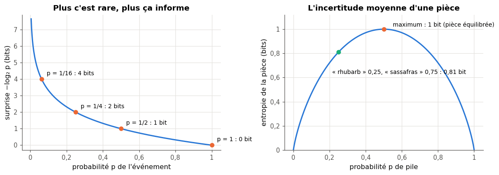
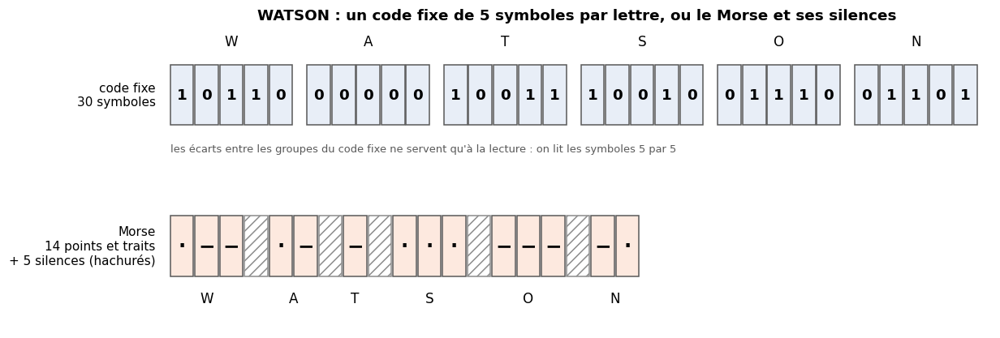
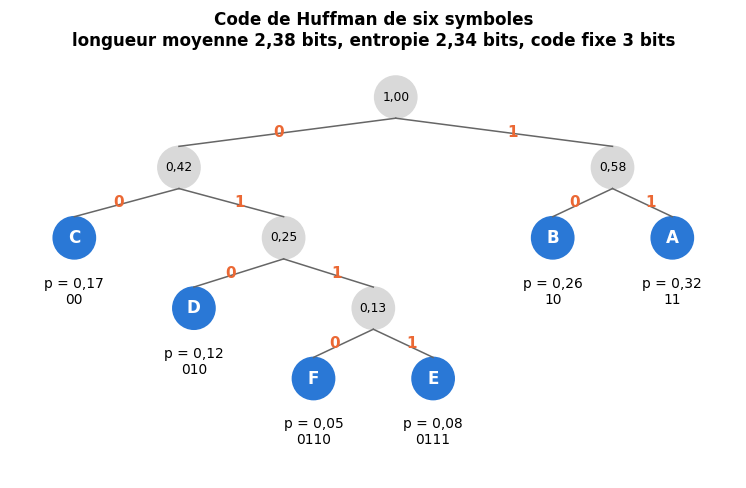
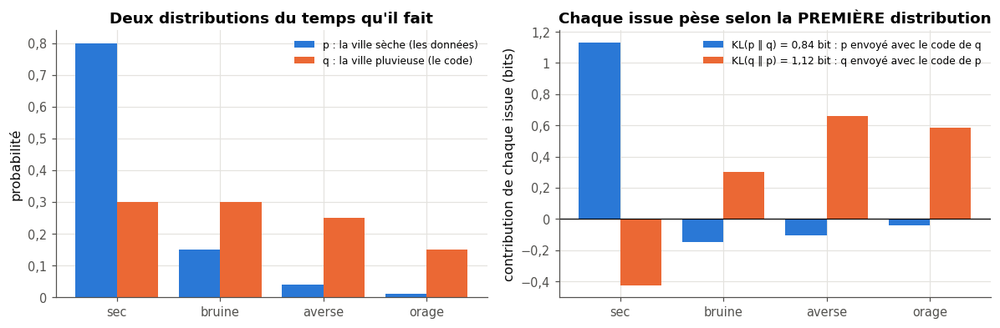
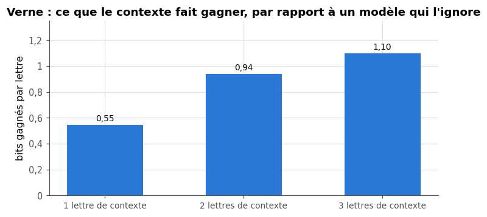

# 6 · Théorie de l'information — fiche de cours

> Cette fiche accompagne le chapitre 6 du livre, une visite guidée de la théorie de l'information de Claude Shannon : la surprise d'un événement, le bit comme unité, les codes qui s'adaptent aux fréquences (le Morse), l'entropie, la cross-entropy et la divergence de Kullback-Leibler. Le livre n'écrit aucune formule. La fiche les donne toutes, avec un mini-exemple chiffré par notion, et ajoute ce dont le machine learning a besoin : construire un code de Huffman, passer des bits aux nats, la log loss et la perplexité des modèles de langage, et ce que le contexte fait gagner, jusqu'aux compresseurs.

| | |
|---|---|
| **Livre** | vol. 1, ch. 6 « Information Theory », p. 231-264 (§6.1 à §6.9) |
| **Temps total estimé** | ≈ 17 h : lecture du livre et de la fiche ≈ 3,2 h, exercices ≈ 12,7 h, 25 flashcards ≈ 0,8 h |
| **Prérequis** | 0B (logarithmes, $\log_2$, $\log(ab) = \log a + \log b$, changement de base, bits et nats, §101.2.4) · 0A (`Counter`, `heapq`, §100.6.6 ; récursivité, §100.5.6) · ch. 1 (Holmes et Verne, fréquences des lettres, 1.11) · ch. 2 (distribution, espérance, loi catégorielle) · ch. 3 (indépendance, probabilité conditionnelle, probabilités prédites et calibration) · ch. 4 (le prior) · ch. 5 (dérivée et maximum, pour ∂ 6.8) |
| **Fichiers du chapitre** | `02_exercices.md` (quiz, rappels, papier, réflexion, entretien) · `03_notebook.ipynb` · `04_indices.md` · `05_solutions.md` et `05_solutions.ipynb` · `06_mes_reponses.md` · `flashcards.csv` |
| **mylearn** | `info.py` : 12 fonctions (surprise, entropie, cross-entropy, divergences KL et de Jensen-Shannon, distributions de tokens et de caractères, code de Huffman, perplexité, log loss), écrites dans le notebook (6.12, 6.13, 6.16, 6.22, 6.23) ; elles resservent au ch. 13 (le critère d'entropie des arbres de décision), au ch. 18 (la loss des réseaux), aux ch. 22, B2 et B3 (le texte) et au ch. 25 (le VAE) |

## Comment utiliser ce chapitre

Le chapitre du livre est court (34 pages, neuf sections) et très intuitif : surprise, codes, livres que l'on envoie mot à mot. Il nomme l'entropie, la cross-entropy et la divergence KL sans jamais en écrire la formule. Cette fiche suit ses sections une à une et donne chaque fois la formule, un exemple chiffré, et le lien avec le machine learning. Deux sections « au-delà du livre » expliquent ensuite ce que tu retrouveras partout : les nats, la log loss et la perplexité (1), puis le contexte, qui réduit la surprise et permet de comprimer davantage (2). Quatre encadrés 🧮 introduisent ou rappellent deux notions de maths (les logarithmes ; l'entropie conditionnelle), un outil théorique (les codes préfixes et l'inégalité de Kraft) et un outil de Python (la compression avec `zlib`).

**Ordre conseillé.**
1. Lis le livre §6.1 à §6.3, puis les sections 6.1 à 6.3 de la fiche. Fais les quiz Q1, Q3 et Q4, et les rappels R1 et R3.
2. Lis le livre §6.4 et §6.5, puis la fiche. Fais les quiz Q2, Q5 et Q6, le rappel R2, les exercices papier 6.1 et 6.2, puis, dans le notebook, la partie 0 pour les vérifier.
3. Lis le livre §6.6 et §6.7, puis la fiche. Fais les quiz Q7 à Q9, les exercices papier 6.3, 6.4 et 6.6 et l'oral 6.9, puis le notebook de 6.12 à 6.15 (pour 6.13, lis d'abord le paragraphe sur le lissage de Laplace, au §6.8).
4. Lis le livre §6.8 et §6.9, puis la fiche. Fais les quiz Q10 et Q11, l'exercice papier 6.5, ∂ 6.7 et ∂ 6.8, puis le notebook de 6.16 à 6.18.
5. Lis les deux sections « au-delà du livre », puis fais le quiz Q12, l'estimation 6.10, le notebook de 6.19 à 6.27, l'article 6.11 et les quatre questions d'entretien.

| Section | Quiz 🧠 et rappels 🔁 | Papier ✏️ ∂ et réflexion | Notebook | Entretien 💼 |
|---|---|---|---|---|
| 6.1 Pourquoi ce chapitre ; information, un mot, deux sens | Q1 | 6.11 | | |
| 6.2 Surprise et contexte | Q2, Q3 | | 6.19, 6.26 | |
| 6.3 Le bit comme unité | Q4, Q12 | 6.1 | 6.20 | |
| 6.4 Mesurer l'information | Q5 | 6.1, 6.11 | 6.12 | |
| 6.5 La taille d'un événement | Q6 | 6.2, 6.10 | 6.13, 6.21 | |
| 6.6 Les codes adaptatifs | Q7 | 6.4, 6.6 | 6.13, 6.15, 6.23, 6.24, 6.27 | |
| 6.7 L'entropie | Q8, Q9 | 6.3, 6.6, 6.8, 6.9, 6.10 | 6.12, 6.14, 6.19, 6.24, 6.27 | E2 |
| 6.8 La cross-entropy ; deux codes adaptatifs ; mélanger les codes | Q10, Q12 | 6.5, 6.7 | 6.16, 6.17, 6.18, 6.20, 6.22, 6.25, 6.26 | E1, E2, E3 |
| 6.9 La divergence KL | Q11 | 6.5, 6.7 | 6.16, 6.18, 6.25 | E2, E4 |
| Au-delà du livre : nats, log loss, perplexité ; contexte et compression | Q12 | 6.10 | 6.19, 6.20, 6.22, 6.26, 6.27 | E1, E3, E4 |
| Rappels (ch. 0B, 3, 5) | R1, R2, R3 | | | |

**Lire les formules.** $P(x)$ est la probabilité d'un événement $x$ ; une **distribution** sur $n$ issues est un vecteur $p = (p_1, \ldots, p_n)$ de nombres positifs de somme 1 (ch. 2). $\log_2$ est le logarithme en base 2, $\ln$ le logarithme népérien (0B). $I(x)$ est l'information (la surprise) d'un événement, $H(p)$ l'entropie d'une distribution, $H(p, q)$ la cross-entropy de $q$ par rapport à $p$, $\mathrm{KL}(p \,\|\, q)$ la divergence de Kullback-Leibler, qui se lit « KL de $p$ par rapport à $q$ ». Dans tout le chapitre, **$p$ décrit les données** (ce qui arrive vraiment) et **$q$ le code ou le modèle** (ce qu'on a prévu). Le livre n'écrit aucune formule : ces notations sont celles de la fiche, et les usuelles.

## Objectifs d'apprentissage

À la fin du chapitre, tu sais :
- **calculer** l'information d'un événement en bits et en nats, et le nombre de bits d'un code de longueur fixe ;
- **calculer** l'entropie d'une distribution, et **dire** quand elle est nulle ou maximale ;
- **construire** un code de Huffman à la main et en Python, puis **encoder** et **décoder** un texte ;
- **calculer** une cross-entropy et une divergence KL, **montrer** que $H(p, q) = H(p) + \mathrm{KL}(p \,\|\, q)$, et **expliquer** pourquoi la KL n'est pas symétrique ;
- **estimer** une distribution de lettres ou de mots avec lissage, et **comparer** l'anglais et le français ;
- **relier** cross-entropy, log loss et perplexité à l'entraînement des classifieurs et des modèles de langage ;
- **mesurer** ce que le contexte local fait gagner (bigrammes, compresseurs).

## L'essentiel en 10 lignes

1. Au sens de Shannon, l'information d'un message ne dépend pas de son **sens**, mais de sa **probabilité** : plus un message était improbable, plus il en apporte.
2. La surprise d'un événement de probabilité $p$ vaut $I = -\log_2 p$ **bits** : 0 pour un événement certain, 1 bit pour pile ou face, et elle s'**additionne** pour des événements indépendants.
3. Le **bit** est une unité de mesure de l'information : un chiffre binaire peut en porter un, ou moins s'il est prévisible.
4. Pour numéroter $N$ mots avec un code de longueur fixe, il faut $\lceil \log_2 N \rceil$ bits par mot ; adapter la liste au texte envoyé fait déjà gagner.
5. Un **code adaptatif** donne des mots courts aux symboles fréquents (le Morse, le code de **Huffman**). Un code **préfixe** se lit sans séparateur ; le Morse, lui, a besoin de silences.
6. L'**entropie** $H(p) = -\sum_i p_i \log_2 p_i$ est la surprise **moyenne** d'une distribution : 0 si une issue est certaine, $\log_2 n$ au plus, atteint pour la loi uniforme. Aucun code ne fait mieux en moyenne, et Huffman reste à moins d'un bit au-dessus.
7. La **cross-entropy** $H(p, q)$ est le coût moyen, en bits par symbole, de données tirées de $p$ envoyées avec un code fait pour $q$. Elle vaut au moins $H(p)$, et elle devient infinie si $q$ juge impossible ce qui arrive.
8. La **divergence KL** $\mathrm{KL}(p \,\|\, q) = H(p, q) - H(p)$ est le surcoût du mauvais code : toujours positive ou nulle, nulle seulement si $q = p$, et **pas symétrique**.
9. Au-delà du livre : les bibliothèques comptent en **nats** ($\ln$) ; la **log loss** d'un classifieur est une cross-entropy, et la **perplexité** d'un modèle de langage vaut $e^{\text{loss}}$, un « nombre de choix équivalent ».
10. Le **contexte** réduit la surprise : connaître les lettres précédentes fait baisser le nombre de bits par lettre, et un bon modèle de prédiction fait un bon compresseur.

## 6.1 · Pourquoi ce chapitre ?

En 1948, Claude Shannon, ingénieur aux laboratoires Bell, publie « A Mathematical Theory of Communication ». Il y pose une question d'ingénieur : comment transmettre un message le plus efficacement possible, malgré le bruit d'un canal ? Pour y répondre, il invente une façon de **mesurer** l'information. Ses idées ont débordé de très loin les télécommunications : elles sont au cœur de la compression des fichiers, du stockage, des réseaux… et du machine learning. La **cross-entropy** est la loss de presque tous les classifieurs (ch. 18 et 20), la **perplexité** juge les modèles de langage (B3, B4), la **divergence KL** apparaît dans les autoencodeurs variationnels (ch. 25) et l'alignement des grands modèles, et le **gain d'information** (une baisse d'entropie) choisit les questions des arbres de décision (ch. 13). Le livre en fait une visite rapide, sans formules ; la fiche te donne les calculs, pour que ces mots, que tu croiseras dans toutes les documentations, soient des outils.

### Information : un mot, deux sens

Au quotidien, une information a un **sens** : elle est vraie ou fausse, utile ou non, et sa valeur dépend de celui qui la reçoit. Shannon laisse tout cela de côté : pour l'ingénieur, écrit-il, ces aspects « sémantiques » ne comptent pas. Ce qui compte, c'est que le message envoyé soit **choisi parmi un ensemble de messages possibles**, avec plus ou moins de probabilité. Un message attendu n'apprend presque rien au destinataire ; un message improbable lui apprend beaucoup. La mesure de Shannon est précise, mathématique, et elle dépend de la distribution de probabilité que l'on prête à la source, donc, en un sens, des attentes du destinataire (§6.2).

## 6.2 · Surprise et contexte

### La surprise

Le livre part d'une idée familière : quand un message arrive, nous sommes plus ou moins **surpris**. Il imagine une échelle de surprise, subjective, de 0 (rien d'inattendu) à 100 (la stupéfaction), et la teste sur le premier mot d'un SMS venu d'un numéro inconnu : un mot banal surprend un peu, un mot saugrenu beaucoup. Cette échelle n'est pas une mesure ; le §6.4 la remplacera par une formule fondée sur la probabilité. Retiens l'idée : **plus c'est rare, plus ça surprend, et plus ça informe**.

### Le contexte

Un mot n'est surprenant que par rapport à ce qu'on attendait. Le livre distingue deux sortes de **contexte** :
- le **contexte global** : tout ce que l'émetteur et le récepteur partagent avant le message (la langue, ses mots et sa grammaire, la culture, le métier de chacun). Au ch. 4, c'est le rôle du **prior** : nos attentes avant d'observer. Pour une boulangère, « levain » est un mot banal ; pour un pilote de ligne, c'est « altimètre » qui l'est, et « levain » qui surprend ;
- le **contexte local** : les mots qui précèdent, dans le message même. « Je bois mon café sans… » rend « sucre » presque certain : la probabilité d'un mot **dépend** de ce qui le précède.

Un numéro de série tiré au hasard, comme « 7QX2LM9C », n'a pas de contexte local utile : chaque caractère est indépendant des autres. Un texte en a beaucoup : c'est ce que mesureront l'entropie conditionnelle et les compresseurs (au-delà du livre (2), 🔬 6.26, 📦 6.19).

> ⚠️ **Le livre, corrigé — une construction à oublier** — Le livre envisage d'abord de donner une note de surprise à chaque mot du dictionnaire, de ramener ces notes à une somme de 1 pour en faire une pmf (une loi de probabilité discrète, vue au **ch. 2**, et non au ch. 3 comme il l'écrit), puis de tirer des mots au hasard selon cette loi : les mots les plus surprenants sortiraient alors le plus souvent. Ce n'est pas ce qu'on veut : un mot surprenant est un mot **rare**, qui doit sortir rarement. Le livre passe aussitôt à l'approche usuelle : la pmf utile décrit **la fréquence** des mots, et la surprise d'un mot en découle (elle est d'autant plus grande que sa probabilité est petite, §6.4).

## 6.3 · Le bit, une unité ⏩

Le **bit** mesure une quantité d'information, comme le mètre mesure une longueur : ce n'est ni un fil, ni une charge électrique, ni le 0 ou le 1 gravé dans un circuit. Ce 0 ou ce 1, le **chiffre binaire**, n'est qu'un support : un registre de 8 chiffres binaires peut porter **jusqu'à** 8 bits d'information, mais s'il vaut toujours `00000000`, sa lecture n'en apporte **aucun**. Une pièce équilibrée apporte exactement 1 bit par lancer ; une pièce qui tombe presque toujours sur pile en apporte beaucoup moins, en moyenne. La norme IEC 80000-13 appelle *shannon* (Sh) le bit d'information, pour le distinguer du chiffre binaire ; l'usage garde « bit » pour les deux.

D'autres bases de logarithme donnent d'autres unités : le **nat** (logarithme népérien $\ln$), unité naturelle des calculs et de PyTorch ; plus rarement le *hartley* (logarithme décimal). On passe de l'une à l'autre par un facteur constant : $1 \text{ nat} = \frac{1}{\ln 2} \approx 1{,}443$ bit.

## 6.4 · Mesurer l'information ⏩

Le livre décrit une « formule » sans l'écrire. La voici : l'**information** (ou **surprise**, *self-information*) d'un événement de probabilité $P(x)$ vaut

$$I(x) = -\log_2 P(x) \quad \text{bits.}$$

Le livre lui demande quatre propriétés, et $-\log_2$ les a toutes :
1. un événement **probable** apporte **peu** d'information : $P = 1$ donne $I = 0$ ;
2. un événement **improbable** en apporte **beaucoup** : $I$ grandit sans limite quand $P$ tend vers 0 ;
3. l'ordre est respecté : plus $P$ est petite, plus $I$ est grande ;
4. pour deux événements **indépendants**, les informations **s'additionnent**. Comme $P(x, y) = P(x)\,P(y)$ (ch. 3) et que le logarithme transforme un produit en somme, $I(x, y) = -\log_2 P(x) - \log_2 P(y) = I(x) + I(y)$.

Le signe « moins » rend $I$ positive, puisque $\log_2 P \le 0$ quand $P \le 1$. Diviser une probabilité par 2 ajoute exactement 1 bit de surprise.

*Mini-exemple* : un événement de probabilité $\frac{1}{4}$ apporte $-\log_2 \frac{1}{4} = 2$ bits ; un autre, indépendant, de probabilité $\frac{1}{32}$, en apporte 5 ; les deux ensemble, de probabilité $\frac{1}{4} \times \frac{1}{32} = \frac{1}{128}$, en apportent $2 + 5 = 7$. Cette addition suppose l'indépendance : elle est exacte pour les caractères d'un numéro de série tiré au hasard, pas pour les mots d'une phrase. Là, chaque mot rend les suivants plus prévisibles, et la somme des surprises des mots pris isolément **dépasse**, en général, la surprise de la phrase entière.

> 🧮 **Rappel maths — logarithmes (0B, §101.2.4)** — $\log_2 x$ est l'exposant auquel il faut élever 2 pour obtenir $x$ : $\log_2 8 = 3$, $\log_2 \frac{1}{4} = -2$, $\log_2 1 = 0$. Trois règles suffisent dans ce chapitre : $\log(ab) = \log a + \log b$, $\log \frac{a}{b} = \log a - \log b$, $\log(a^k) = k \log a$. Pour une base quelconque, on passe par $\ln$ : $\log_2 x = \frac{\ln x}{\ln 2}$, ce qui donne aussi $1$ nat $= \frac{1}{\ln 2}$ bit. En Python : `np.log2`, `np.log` (qui est **toujours** $\ln$), ou `math.log2`. Enfin, $p \log p$ tend vers 0 quand $p$ tend vers 0 : c'est pourquoi on pose $0 \log 0 = 0$.

## 6.5 · La taille d'un événement ⏩

Pour envoyer un livre mot à mot, on peut numéroter les mots de sa liste de vocabulaire et envoyer les numéros. Avec un **code de longueur fixe**, chaque numéro s'écrit avec le même nombre de chiffres binaires. Avec $k$ chiffres, on numérote $2^k$ mots ; pour $N$ mots, il en faut donc

$$\left\lceil \log_2 N \right\rceil \quad \text{bits par mot,}$$

où $\lceil \cdot \rceil$ arrondit à l'entier supérieur. *Mini-exemple* : 100 mots demandent 7 bits ($2^6 = 64 < 100 \le 128 = 2^7$). Le livre compare ainsi un livre pour enfants au vocabulaire minuscule et un roman de plusieurs milliers de mots différents : plus le vocabulaire est grand, plus chaque mot coûte cher.

Deux leçons. D'abord, il vaut mieux numéroter les mots **du texte envoyé** que tous les mots de la langue : la liste, partagée à l'avance, est un contexte global commun. Ensuite, $\log_2 N$ (ici 6,64) est l'**information** d'un mot tiré uniformément parmi $N$ ; $\lceil \log_2 N \rceil$ (ici 7) est la **longueur d'un code**, qui doit être un nombre entier de chiffres.

## 6.6 · Les codes adaptatifs ⏩

Un code de longueur fixe traite tous les mots pareil. Or certains reviennent bien plus souvent que d'autres. Un **code adaptatif**, ou **code à longueur variable**, donne des mots de code **courts** aux symboles **fréquents** et des mots longs aux symboles rares : en moyenne, le message raccourcit.

Le code **Morse** en est l'exemple historique. Chaque lettre est une suite de points (brefs) et de traits (longs) : E est un seul point, T un seul trait, et les lettres rares (J, Q, Z) ont quatre symboles. La durée de référence est le *dit* : un point dure 1 dit, un trait 3, et l'on laisse 1 dit de silence entre deux symboles, 3 entre deux lettres et 7 entre deux mots. D'après les historiens du télégraphe que cite le livre, c'est Alfred Vail, l'associé de Samuel Morse, qui a choisi les codes des lettres (vers 1844, selon le livre), en estimant leurs fréquences par le nombre de caractères en plomb rangés dans les casses d'un imprimeur de journal : plus une lettre servait, plus la casse en contenait. Le livre lui reproche quelques erreurs, comme un O plus long que le M. Mais le code de Vail, le Morse américain, écrivait O avec deux points, plus court que M ; le Morse d'aujourd'hui, celui de ✏️ 6.4, est le Morse international, issu de la révision de F. C. Gerke (1848) et adopté en Europe en 1865 ; c'est ce code de 1865 qui donne à O ses trois traits, repris d'un code de Steinheil.

Pour simplifier les comptes, le livre transforme le Morse en code à **deux tons** de même durée, un grave pour le point, un aigu pour le trait : la durée d'une lettre ne dépend plus que de son nombre de symboles. Il compare ensuite ce Morse à un code de longueur fixe de 5 symboles par lettre ($2^5 = 32 \ge 26$), sur les deux mots qui ouvrent *Treasure Island*, puis sur tout le roman, où il annonce un rapport d'environ 42 % (sur Holmes, tu mesureras un rapport plus proche de la moitié, 🔬 6.24).

> ⚠️ **Le livre, corrigé — le Morse a besoin de ses silences** — Sans le silence entre deux lettres, le Morse est ambigu : `· · ·` peut se lire S, EEE, EI ou IE. Ce silence est un **troisième symbole**, que la comparaison du livre ne compte pas, alors que le code fixe, lui, n'a besoin d'aucun séparateur (on lit les symboles 5 par 5). En comptant les silences, l'avantage du Morse fond (✏️ 6.4, 🔬 6.24). Au passage, le livre compte 75 symboles pour sa phrase de 15 lettres avec le code fixe, puis en reprend 74 dans le calcul suivant : une coquille. Et il appelle ce genre de code *variable-bitrate code* : on dit plutôt **code à longueur variable** (*variable-length code*) ; le « débit variable » désigne autre chose, en audio et en vidéo.

> 🧮 **Rappel maths — codes préfixes, arbre binaire et inégalité de Kraft** — Un code est **préfixe** (*prefix code*) quand aucun mot de code n'est le début d'un autre. On peut alors lire une suite de bits sans séparateur : dès que les bits lus forment un mot de code, c'est le bon. Exemple : `{a: 0, b: 10, c: 11}` est préfixe, et `0101100` se lit sans hésitation `a b c a a`. Un code préfixe binaire se dessine comme un **arbre** : depuis la racine, on descend à gauche pour un 0, à droite pour un 1, et chaque symbole est une **feuille** ; son mot de code est le chemin qui y mène. Les longueurs $\ell_i$ des mots d'un code préfixe vérifient toujours l'**inégalité de Kraft** : $\sum_i 2^{-\ell_i} \le 1$ (les « parts » de l'arbre occupées par les feuilles ne dépassent pas le tout) ; réciproquement, des longueurs qui la vérifient peuvent toujours être réalisées par un code préfixe. Un code est **complet**, sans branche inutilisée, quand la somme vaut exactement 1.

### Le code de Huffman

Le livre cite le code de Huffman (1952) sans le construire. L'algorithme tient en une phrase : **fusionne les deux groupes les moins probables, et recommence** jusqu'à n'en avoir plus qu'un.
1. Au départ, chaque symbole forme un groupe, avec sa probabilité.
2. Retire les deux groupes les moins probables ; donne un `0` de plus, au début, aux mots de code des symboles du premier, et un `1` à ceux du second ; remets dans la liste un groupe qui les réunit, de probabilité la somme des deux.
3. Quand il ne reste qu'un groupe, chaque symbole a son mot de code.

Les fusions dessinent un arbre, construit des feuilles vers la racine. Le résultat est un code préfixe et complet, et c'est le **meilleur** code préfixe symbole par symbole : aucun n'a une longueur moyenne $\bar{L} = \sum_i p_i\,\ell_i$ plus courte. Quand deux probabilités sont égales, on peut fusionner dans un ordre ou dans l'autre : les codes diffèrent, leur longueur moyenne non. En Python, une file de priorité (`heapq`, 0A) donne à chaque étape les deux groupes les moins probables (🔨 6.23).

*Mini-exemple* (la figure) : six symboles de probabilités 0,32, 0,26, 0,17, 0,12, 0,08 et 0,05. Les fusions successives donnent les longueurs 2, 2, 2, 3, 4 et 4 : $\bar{L} = 2{,}38$ bits par symbole, contre 3 pour un code fixe, et une entropie (§6.7) de 2,34 bits.

> ⚠️ **Le livre, corrigé — « Le plus court possible, sans répétition »** — Le livre décrit un code adaptatif qui donne aux symboles, du plus probable au moins probable, des motifs « aussi courts que possible sans se répéter ». Cela ne suffit pas : avec 0 pour le plus fréquent, 1 pour le suivant, puis 00, 01, 10…, on ne sait plus où commence chaque mot. Il faut un code **préfixe** (ou des séparateurs, comme les silences du Morse). L'algorithme de Huffman garantit à la fois le préfixe et la longueur moyenne la plus courte.

## 6.7 · L'entropie ⏩

Tirons un symbole au hasard selon une distribution $p$. Avant de le voir, combien d'information pouvons-nous espérer ? Chaque issue $i$ apporte $-\log_2 p_i$ bits, et arrive avec la probabilité $p_i$ : la moyenne, c'est-à-dire l'**espérance** de la surprise (ch. 2), s'appelle l'**entropie** (ou entropie de Shannon) :

$$H(p) = -\sum_{i=1}^{n} p_i \log_2 p_i \quad \text{bits,}$$

avec la convention $0 \log_2 0 = 0$ : une issue impossible n'ajoute rien. Trois lectures de ce même nombre :
- la **surprise moyenne** d'un tirage ;
- l'**incertitude** avant le tirage : 0 quand on sait déjà, maximale quand tout est possible ;
- le **nombre moyen de bits par symbole** du meilleur code : aucun code ne descend en moyenne sous $H(p)$, et le code de Huffman vérifie $H(p) \le \bar{L} < H(p) + 1$ (c'est le théorème du codage de source de Shannon). En codant des **blocs** de symboles plutôt que les symboles un par un, on se rapproche encore de l'entropie par symbole ; pour un texte, dont les lettres dépendent les unes des autres, des blocs descendent même sous l'entropie des lettres prises isolément (au-delà du livre (2), 🏆 6.27).

Ses valeurs extrêmes : $H(p) = 0$ si et seulement si une issue est **certaine** ; $H(p) \le \log_2 n$ pour $n$ issues, avec égalité pour la loi **uniforme** (∂ 6.8). Pour une pièce de probabilité $p$, l'entropie vaut $-p \log_2 p - (1 - p) \log_2 (1 - p)$ : 1 bit pour $p = \frac{1}{2}$, et presque rien pour une pièce très truquée (figure du §6.4, à droite).

*Mini-exemple* (celui du livre, chiffré) : une distribution qui donne « rhubarb » avec la probabilité 0,25 et « sassafras » avec 0,75 a une entropie de $0{,}25 \times 2 + 0{,}75 \times 0{,}415 \approx 0{,}81$ bit : un peu moins qu'une pièce équilibrée, puisqu'on devine « sassafras » trois fois sur quatre. Avec trois mots équiprobables, on aurait $\log_2 3 \approx 1{,}58$ bit.

L'entropie se lit aussi comme un **jeu de questions** oui/non pour deviner l'issue tirée : avec la meilleure stratégie, le nombre moyen de questions est proche de $H(p)$, et il lui est égal quand toutes les probabilités sont des puissances de $\frac{1}{2}$ (🗣️ 6.9).

> ⚠️ **Le livre, corrigé — l'entropie est une propriété de la distribution** — Le livre écrit que l'entropie dépend « du message et de la distribution ». Non : $H(p)$ ne dépend que de $p$. Ce qui dépend du message, c'est le **coût** de son envoi avec un code donné (sa longueur en bits) ou l'information qu'il apporte. Quand on estime $p$ à partir d'un texte (les fréquences de ses lettres, 🔨 6.13), on mesure l'entropie de **cette** distribution estimée : changer d'alphabet change la distribution, donc l'entropie.

> ⚠️ **Le livre, corrigé — entropie et organisation : un faux ami** — Le livre rapproche l'entropie de l'« organisation » d'un système : plus il y a de structure, plus il y aurait d'information. Pour l'entropie de Shannon, c'est l'inverse qui est vrai à propos d'une **source** : une source très structurée est **prévisible**, donc d'entropie **faible** ; une source désordonnée, où tout est également possible, a l'entropie maximale. Le lien avec la physique va dans ce sens : l'entropie thermodynamique mesure aussi un « désordre », avec une formule de même forme (celle de Gibbs). Ce que le livre appelle l'information d'un système organisé se comprend plutôt comme ce que l'on sait déjà de lui : l'écart $\log_2 n - H(p)$ à l'entropie maximale, que Shannon rapporte à $\log_2 n$ pour définir la **redondance** d'une source (∂ 6.8).

## 6.8 · La cross-entropy ⏩

### Deux codes adaptatifs

Le livre construit deux codes de mots, l'un réglé sur les fréquences de *Treasure Island*, l'autre sur celles de *Huckleberry Finn*. Les deux livres puisent dans le même anglais, mais pas avec les mêmes fréquences : les mots les plus courants se ressemblent, puis les listes divergent, et chaque livre a ses mots propres (un mot de marin dans l'un, un mot du Mississippi dans l'autre). Pour qu'un code puisse envoyer **les deux** livres, le livre ajoute à chacun une occurrence de chaque mot de l'autre livre qui lui manque : aucun mot n'a alors une probabilité nulle. C'est un **lissage** (plus bas).

### Mélanger les codes

Le livre mesure ensuite le **taux de compression** (*compression ratio*) : le nombre de bits envoyés avec le code adaptatif, divisé par le nombre de bits du code de longueur fixe. Sous 1, on gagne ; à 0,5, le message est deux fois plus court. Sans surprise, chaque livre coûte moins cher avec **son** code qu'avec celui de l'autre ; reste à chiffrer cet écart.

La formule qui donne ce coût moyen est la **cross-entropy** (*entropie croisée*). Si les données suivent la distribution $p$ et que le code est idéal pour $q$, un symbole $i$ coûte $-\log_2 q_i$ bits (son mot de code a cette longueur idéale), et il arrive avec la fréquence $p_i$ :

$$H(p, q) = -\sum_{i} p_i \log_2 q_i \quad \text{bits par symbole.}$$

Elle vérifie toujours $H(p, q) \ge H(p)$, avec égalité seulement si $q = p$ (∂ 6.7) : aucun code ne bat le code fait pour les vraies fréquences. Et elle devient **infinie** si $q_i = 0$ pour une issue que $p$ produit : un code qui n'a rien prévu pour un symbole ne peut pas l'envoyer (🐛 6.17).

*Mini-exemple* : dans une ville sèche, le temps suit $p$ = (sec 0,8 ; bruine 0,15 ; averse 0,04 ; orage 0,01) ; dans une ville pluvieuse, $q$ = (0,3 ; 0,3 ; 0,25 ; 0,15). Le temps de la ville sèche coûte $H(p) \approx 0{,}92$ bit par jour avec son propre code, mais $H(p, q) \approx 1{,}76$ bit avec le code de la ville pluvieuse.

**Probabilités nulles et lissage de Laplace.** Une distribution estimée en comptant donne la probabilité 0 à tout ce qui n'a jamais été vu. Le **lissage de Laplace** (*Laplace smoothing*) ajoute un pseudo-compte $\alpha$ (souvent 1) à chaque élément d'un vocabulaire de $V$ éléments : $\hat{p}_i = \frac{n_i + \alpha}{n + \alpha V}$, où $n_i$ est le compte de l'élément $i$ et $n$ le total. Plus rien n'est impossible, et les éléments fréquents ne changent presque pas. Reste à choisir **quelle** distribution lisser, celle des données ou celle du code : c'est la question du 🐛 6.17.

En machine learning, la cross-entropy est la **loss** de la classification : pour un exemple de classe $y$, la « vraie » distribution $p$ met toute sa masse sur $y$ (un vecteur *one-hot*), et le modèle prédit des probabilités $q$. Alors $H(p, q) = -\log q_y$ : la surprise du modèle devant la bonne réponse. La moyenne sur les exemples est la **log loss** (au-delà du livre (1)). Le livre l'annonce pour le ch. 20 ; tu l'écris dès ce chapitre (🔨 6.22).

## 6.9 · La divergence KL ⏩

Combien coûte, **en plus**, le mauvais code ? La différence entre la cross-entropy et l'entropie s'appelle la **divergence de Kullback-Leibler** (KL), du nom des deux statisticiens qui l'ont introduite en 1951 :

$$\mathrm{KL}(p \,\|\, q) = H(p, q) - H(p) = \sum_i p_i \log_2 \frac{p_i}{q_i}.$$

On la trouve aussi sous les noms d'**entropie relative**, de gain d'information (*information gain* ; celui des arbres de décision, au ch. 13, en est une moyenne) ou d'information de discrimination. Ses propriétés :
- elle est **positive ou nulle**, et nulle seulement si $q = p$ (∂ 6.7) ;
- elle est **infinie** si $q$ juge impossible ce que $p$ produit ;
- elle n'est **pas symétrique** : en général $\mathrm{KL}(p \,\|\, q) \ne \mathrm{KL}(q \,\|\, p)$, car chaque écart est pondéré par la fréquence dans la **première** distribution, celle des données. Ce n'est donc pas une distance : on dit une *divergence*.

*Mini-exemple* (les deux villes du §6.8) : envoyer le temps de la ville sèche avec le code de la ville pluvieuse coûte $\mathrm{KL}(p \,\|\, q) \approx 0{,}84$ bit de plus par jour ; dans l'autre sens, $\mathrm{KL}(q \,\|\, p) \approx 1{,}12$ bit : les averses et les orages, 6 et 15 fois plus fréquents dans la ville pluvieuse, coûtent 4,6 et 6,6 bits avec le code de la ville sèche. Le livre trouve de même environ 0,29 bit par mot pour *Treasure Island* envoyé avec le code de *Huckleberry Finn*, et environ 0,5 dans l'autre sens.

> ⚠️ **Le livre, corrigé — l'ordre des arguments** — Le livre note correctement $\mathrm{KL}(\text{Treasure Island} \,\|\, \text{Huckleberry Finn})$ l'envoi de *Treasure Island* avec le code de *Huckleberry Finn*, puis décrit ce même envoi une seconde fois en écrivant $\mathrm{KL}(\text{Huckleberry Finn} \,\|\, \text{Treasure Island})$. La seconde notation correspond à l'envoi **inverse**, *Huckleberry Finn* avec le code de *Treasure Island*. Retiens : $\mathrm{KL}(\text{données} \,\|\, \text{code})$, comme $H(\text{données}, \text{code})$.

**Une divergence symétrique : Jensen-Shannon.** Pour comparer deux distributions sans privilégier l'une, on les compare toutes deux à leur **mélange** $m = \frac{p + q}{2}$ : $\mathrm{JS}(p, q) = \frac{1}{2}\mathrm{KL}(p \,\|\, m) + \frac{1}{2}\mathrm{KL}(q \,\|\, m)$. Elle est symétrique, toujours finie (le mélange n'est jamais nul là où $p$ ou $q$ ne l'est pas), et vaut au plus 1 bit, atteint quand $p$ et $q$ n'ont aucune issue en commun. Sa racine carrée est une vraie distance : c'est ce que renvoie `scipy.spatial.distance.jensenshannon`. Tu la retrouveras avec les GAN (ch. 27).

> 🕰️ **Mise à jour (2026) — la KL aujourd'hui** — **Le livre :** présente la KL comme le surcoût d'un code inadapté. · **Aujourd'hui :** c'est l'une des quantités les plus utilisées du deep learning. Entraîner un modèle $q$ par maximum de vraisemblance, c'est minimiser $\mathrm{KL}(p_{\text{données}} \,\|\, q)$ (∂ 6.7, question 4). Le **VAE** (Kingma et Welling, 2013) ajoute à sa loss une KL entre la distribution que l'encodeur donne au code latent et un prior gaussien (ch. 25). La **distillation** (Hinton, Vinyals et Dean, 2015) entraîne un petit modèle sur les probabilités « adoucies » (par une température) d'un grand : sa loss contient une cross-entropy avec ces cibles (souvent ajoutée à celle des vraies classes), donc, à une constante près, une KL. L'alignement des LLM par **RLHF** (*reinforcement learning from human feedback*, Ouyang et coll., 2022) ajoute à la récompense une pénalité de KL par token entre le modèle entraîné et le modèle de départ, pour qu'il ne s'en écarte pas trop ; **DPO** (*direct preference optimization*, Rafailov et coll., 2023) résout ce même problème contraint par la KL sans apprentissage par renforcement et sans générer de textes pendant l'entraînement : la contrainte est intégrée à sa loss. Dans les deux cas, la KL est prise dans l'autre sens, $\mathrm{KL}(q_{\text{modèle}} \,\|\, p_{\text{référence}})$ : le RLHF l'estime sur les textes que le modèle génère lui-même, et elle punit surtout le modèle quand il produit ce que la référence juge très improbable. · **Faut-il quand même l'apprendre ?** Oui : savoir lire $\mathrm{KL}(p \,\|\, q)$, dans quel sens et pourquoi, est indispensable pour lire ces méthodes. · *Sources :* D. P. Kingma et M. Welling, « Auto-Encoding Variational Bayes » ([arXiv:1312.6114](https://arxiv.org/abs/1312.6114)) ; G. Hinton, O. Vinyals et J. Dean, « Distilling the Knowledge in a Neural Network » ([arXiv:1503.02531](https://arxiv.org/abs/1503.02531)) ; L. Ouyang et coll., « Training language models to follow instructions with human feedback » ([arXiv:2203.02155](https://arxiv.org/abs/2203.02155), section 3.5) ; R. Rafailov et coll., « Direct Preference Optimization » ([arXiv:2305.18290](https://arxiv.org/abs/2305.18290)).

## Au-delà du livre (1) : bits, nats, log loss et perplexité

**Bits ou nats.** Le livre compte tout en bits ($\log_2$). Les bibliothèques de machine learning comptent en **nats** ($\ln$), plus commodes à dériver : une cross-entropy de $L$ nats vaut $\frac{L}{\ln 2} \approx 1{,}443\,L$ bits. Rien d'autre ne change : les mêmes formules, une autre unité.

> 🕰️ **Mise à jour (2026) — l'unité des losses** — **Le livre :** mesure l'information et la cross-entropy en bits. · **Aujourd'hui :** `torch.nn.CrossEntropyLoss` attend des **logits** (des scores quelconques, ni positifs ni de somme 1) et calcule $-\ln \mathrm{softmax}(\text{logits})_y$, en nats ; elle accepte aussi des probabilités comme cibles (la distillation) et un *label smoothing*, qui mélange la cible *one-hot* avec une loi uniforme. `sklearn.metrics.log_loss` utilise aussi le logarithme népérien, et coupe les probabilités à $[\varepsilon ; 1 - \varepsilon]$ ($\varepsilon$ : la précision machine) pour qu'une erreur certaine ne donne pas une loss infinie. · **Faut-il quand même l'apprendre ?** Oui : ce sont les mêmes quantités, et les bits restent l'unité de la compression ; il suffit de savoir convertir (🔨 6.22, 📈 6.20). · *Sources :* [documentation de `torch.nn.CrossEntropyLoss` (PyTorch 2.11)](https://docs.pytorch.org/docs/2.11/generated/torch.nn.CrossEntropyLoss.html) ; [documentation de `sklearn.metrics.log_loss` (scikit-learn 1.6)](https://scikit-learn.org/1.6/modules/generated/sklearn.metrics.log_loss.html).

**La log loss.** Pour $n$ exemples de vraies classes $y_1, \ldots, y_n$, et des probabilités prédites $\hat{p}_{i, k}$ :

$$\text{log loss} = -\frac{1}{n} \sum_{i=1}^{n} \ln \hat{p}_{i, y_i},$$

la moyenne des surprises du modèle devant la bonne réponse. En binaire, avec $\hat{p}_i$ la probabilité de la classe 1, le terme de l'exemple $i$ est $-\left[y_i \ln \hat{p}_i + (1 - y_i) \ln (1 - \hat{p}_i)\right]$. *Mini-exemple* : un modèle qui donnait 0,7 à la bonne classe paie $-\ln 0{,}7 \approx 0{,}357$ nat, soit 0,515 bit ; s'il lui donnait 0,01, il paierait 4,6 nats. Pourquoi cette loss plutôt qu'une autre (💼 E1) ? Elle punit très fort les erreurs **sûres d'elles** ; elle est minimale quand les probabilités prédites sont les vraies, ce qui pousse le modèle à être bien calibré (ch. 3) ; elle est lisse et donne des gradients utiles : avec une softmax en sortie, le gradient de la loss par rapport aux scores qui entrent dans la softmax (les *logits*) vaut simplement $q - p$, l'écart entre les probabilités prédites et la cible (ch. 18 et 20) ; et la minimiser revient à maximiser la vraisemblance des données.

**La perplexité.** Pour un modèle qui a donné les probabilités $q_1, \ldots, q_n$ aux tokens réellement observés,

$$\text{perplexité} = \exp\!\left(-\frac{1}{n}\sum_{t=1}^{n} \ln q_t\right) = 2^{\text{cross-entropy en bits}}.$$

Elle ne dépend pas de la base choisie, et se lit comme un **nombre de choix équivalent** : un modèle qui hésite uniformément entre $V$ tokens a une perplexité de $V$ ; un modèle parfait, de 1. *Mini-exemple* : un modèle qui donne $\frac{1}{6}$ à chaque face d'un dé, jugé sur des lancers, a une perplexité de 6. Plus elle est basse, mieux le modèle prédit.

> 🕰️ **Mise à jour (2026) — la loss et la perplexité des LLM** — **Le livre :** construit des codes adaptés à un livre, et mesure la cross-entropy entre deux livres. · **Aujourd'hui :** un modèle de langage est entraîné à minimiser exactement cela, la cross-entropy du **token suivant**, sur des milliers de milliards de tokens ; sa perplexité est l'exponentielle de cette loss moyenne. Les tokens ne sont ni des mots ni des lettres, mais des **sous-mots** appris par un algorithme comme BPE (*byte-pair encoding*) : le *tokenizer* de GPT-2, le programme qui découpe le texte en tokens, en connaît 50 257. La documentation de Hugging Face le rappelle : le découpage en tokens influe directement sur la perplexité, et il faut en tenir compte pour comparer deux modèles ; le plus sûr est de garder le même tokenizer, ou de ramener la loss à des bits par caractère. · **Faut-il quand même l'apprendre ?** Oui : c'est exactement l'idée du livre, appliquée aux tokens ; tu la retrouveras dans les chapitres bonus (B2 à B4). · *Sources :* [Hugging Face, « Perplexity of fixed-length models »](https://huggingface.co/docs/transformers/perplexity) ; [documentation du modèle GPT-2 (`vocab_size` = 50 257, BPE au niveau des octets)](https://huggingface.co/docs/transformers/model_doc/gpt2).

## Au-delà du livre (2) : le contexte réduit la surprise

Le §6.2 distinguait le contexte global et le contexte local. L'entropie de la distribution des lettres ne voit que le global : elle suppose chaque lettre tirée **indépendamment** des autres. Or, en français, après un « q » vient presque toujours un « u ». Tenir compte du contexte local réduit la surprise, donc le nombre de bits nécessaires.

> 🧮 **Rappel maths — entropie conditionnelle et bigrammes** — Un **bigramme** est une paire de lettres consécutives. En comptant les paires d'un texte, on estime $P(b \mid a)$, la probabilité que la lettre $b$ suive la lettre $a$ (une probabilité conditionnelle, ch. 3) : pour chaque lettre $a$, on compte les lettres qui la suivent, puis on normalise (avec un lissage). L'**entropie conditionnelle** (*conditional entropy*) $H(X_t \mid X_{t-1}) = -\sum_{a, b} P(a, b) \log_2 P(b \mid a)$ est la surprise moyenne d'une lettre **quand on connaît la précédente**. Elle vérifie toujours $H(X_t \mid X_{t-1}) \le H(X_t)$ : en moyenne, savoir plus ne rend jamais moins sûr. Un **modèle bigramme** prédit chaque lettre avec $P(\cdot \mid \text{lettre précédente})$ ; un trigramme, avec les deux précédentes. On juge ces modèles comme tout modèle, sur un texte qu'ils n'ont pas vu (ch. 8) : leur surprise moyenne est une cross-entropy (🔬 6.26).

> 🧮 **Rappel outil — la compression sans perte avec `zlib`** — Le module `zlib` de la bibliothèque standard comprime **sans perte** : `zlib.compress(data, 9)` prend des **octets** (`texte.encode("utf-8")`) et renvoie des octets, au niveau 9, le plus fort ; `zlib.decompress` redonne exactement les données d'origine. Son algorithme, DEFLATE (celui des fichiers `.zip` et `.gz`), remplace chaque suite déjà vue par une courte référence en arrière (« recopie 12 caractères pris 340 positions plus tôt »), puis code le tout avec des codes de Huffman. Pour comparer à une entropie : $8 \times$ `len(zlib.compress(…))` divisé par le nombre de caractères donne des bits par caractère (📦 6.19).

**Combien d'information dans l'anglais ?** Shannon a posé la question en 1951. En faisant deviner à des lecteurs la lettre suivante d'un texte, il a estimé qu'avec un long contexte (jusqu'à 100 lettres), l'anglais imprimé ne porte qu'entre 0,6 et 1,3 bit par lettre, bien moins que l'entropie des lettres prises une à une (que tu mesures en 🔮 6.14) : la langue est très **redondante**, et c'est ce qui la rend compressible.

> 🕰️ **Mise à jour (2026) — prédire, c'est compresser** — **Le livre :** fait du code de Huffman l'aboutissement des codes adaptatifs. · **Aujourd'hui :** Huffman perd jusqu'à un bit par symbole, puisque ses mots de code ont des longueurs entières. Le **codage arithmétique** et les systèmes **ANS** (*asymmetric numeral systems*) codent le message tout entier avec un coût presque égal à sa surprise totale, sans arrondir symbole par symbole. Les compresseurs modernes les combinent avec la recherche de répétitions : zstd utilise des codes de Huffman pour les littéraux (les octets qui ne répètent pas une suite déjà vue) et FSE, une variante d'ANS, pour les longueurs et les distances des répétitions ; Brotli garde des codes de Huffman, avec une modélisation de contexte. Surtout, le codage arithmétique transforme **n'importe quel modèle de prédiction** en compresseur : chaque symbole coûte $-\log_2$ de la probabilité que le modèle lui donnait, et un meilleur modèle comprime mieux. Delétang et ses coauteurs (ICLR 2024) ont ainsi comprimé, avec le modèle de langage Chinchilla 70B, des morceaux d'images d'ImageNet à 43,4 % de leur taille et des extraits sonores de LibriSpeech à 16,4 %, mieux que PNG (58,5 %) et FLAC (30,3 %) ; ce sont les chiffres du résumé de l'article, dont le tableau 1 donne 48,0 % et 21,0 %. Mais si l'on compte la taille du modèle dans le fichier comprimé (140 Go), l'avantage disparaît sur leurs datasets d'un gigaoctet : il faudrait des téraoctets de données pour que ce coût devienne négligeable. · **Faut-il quand même l'apprendre ?** Oui : Huffman reste dans zstd, Brotli et DEFLATE, il se construit en dix lignes, et il montre pourquoi l'entropie est la limite à viser. · *Sources :* G. Delétang et coll., « Language Modeling Is Compression », ICLR 2024 ([arXiv:2309.10668](https://arxiv.org/abs/2309.10668)) ; [RFC 8878 (Zstandard)](https://datatracker.ietf.org/doc/html/rfc8878) ; [RFC 7932 (Brotli)](https://datatracker.ietf.org/doc/html/rfc7932).

## Les pièges classiques ⚠️ (récapitulatif)

| Piège | Exemple | Ce qu'il faut faire |
|---|---|---|
| confondre information et sens | « un message important apporte beaucoup de bits » | l'information dépend de la **probabilité** du message |
| oublier le signe moins | $\log_2 \frac{1}{8} = -3$ « bits » | $I = -\log_2 p \ge 0$ |
| mélanger les bases | `np.exp` d'une moyenne de $\log_2$ | bits avec $\log_2$ et $2^x$ ; nats avec $\ln$ et $e^x$ |
| prendre $\log_2 N$ pour une longueur de code | « 100 mots : 6,64 bits par mot » | un code fixe a $\lceil \log_2 N \rceil$ bits |
| oublier les séparateurs du Morse | comparer des points et des traits à des bits | compter les silences, ou utiliser un code préfixe |
| calculer $0 \times \log 0$ | `p * np.log2(p)` donne `nan` pour $p = 0$ | ne sommer que sur $p_i > 0$ |
| comparer une somme de flottants à 1 avec `==` | `[0.6, 0.3, 0.1]` refusée | une tolérance : `abs(p.sum() - 1) <= 1e-6` |
| inverser les arguments de la KL | `kl(code, données)` | $\mathrm{KL}(\text{données} \,\|\, \text{code})$ |
| une probabilité nulle | cross-entropy infinie (🐛 6.17) | un lissage de Laplace, au bon endroit (🐛 6.17) |
| comparer des perplexités de tokenizers différents | « mon modèle à 15 bat le leur à 20 » | même tokenizer, mêmes données |
| juger un modèle sur ses données d'entraînement | un modèle de 4-grammes évalué sur le texte qui l'a construit : il paraît bien meilleur qu'il n'est | un texte qu'il n'a pas vu (ch. 8) |

## Liens avec les autres chapitres 🔗

- **0A** : `Counter` pour compter, `heapq` pour la file de priorité de Huffman, la récursivité pour parcourir un arbre.
- **0B** : logarithmes, changement de base, bits et nats.
- **Ch. 1** : Holmes et Verne, et les fréquences des lettres (1.11), reprises en 6.13 et 6.14.
- **Ch. 2** : distribution, espérance (l'entropie est une espérance), loi catégorielle.
- **Ch. 3** : indépendance (l'information s'additionne), probabilité conditionnelle (les bigrammes), calibration et score de Brier, à comparer avec la log loss.
- **Ch. 4** : le prior, une partie du contexte global ; les log-probabilités, qui sont des surprises au signe près.
- **Ch. 8 et 9** : évaluer un modèle sur des données non vues ; la courbe de validation qui remonte (📈 6.20).
- **Ch. 13** : l'entropie choisit les questions d'un arbre de décision (gain d'information) ; Naive Bayes sur Holmes et Verne.
- **Ch. 18 et 20** : la cross-entropy comme loss d'un réseau, et sa dérivée.
- **Ch. 22, B2, B3, B4** : modèles de langage, tokens et perplexité.
- **Ch. 25** : la KL du VAE. **Ch. 27** : la divergence de Jensen-Shannon des GAN.
- **Mini-projet de la partie I** : un détecteur de langue anglais / français, fondé sur des distributions de lettres lissées.

## Guide de lecture et de travail

**Lecture du livre.** Lis le chapitre 6 dans l'ordre, avec la fiche à côté : chaque section de la fiche porte le numéro de la section du livre. Les deux sections « au-delà du livre », le code de Huffman et l'encadré sur Kraft n'existent que dans la fiche. Les sections marquées ⏩ sont celles du **parcours rapide** : §6.3 à §6.9, environ 2,5 h avec la fiche entière. Les autres parcours lisent tout le chapitre.

**Travail.** Pour chaque bloc de sections :
1. **Lis** le livre et la fiche ; refais les mini-exemples chiffrés sur papier.
2. Fais le **quiz** 🧠 correspondant sans la fiche, puis corrige-le avec `05_solutions.md`.
3. Fais les exercices **papier** ✏️ et ∂ dans `mon_travail/ch06_information/06_mes_reponses.md`, et vérifie les ✏️ dans la partie 0 du notebook.
4. Passe au **notebook** (ta copie : `python tools/start_chapter.py 6`) et complète `mylearn/info.py`.
5. En fin de journée : 10 minutes de **flashcards**, et une ligne dans ton journal.

**Parcours rapide.** La fiche entière et les sections ⏩ du livre. Au programme : les quiz Q1 à Q3, Q6, Q8 et Q10 à Q12, les trois rappels, les exercices papier 6.1, 6.3 et 6.5, l'oral 6.9, puis, dans le notebook, la surprise et l'entropie (6.12), les distributions (6.13), la cross-entropy et la KL (6.16), le français envoyé avec le code de l'anglais (6.18), la courbe de loss (6.20), la perplexité et la log loss (6.22), sans oublier les quatre questions d'entretien. **Parcours maths** : les quiz Q5, Q8 et Q11, les rappels, tous les exercices papier (6.1 à 6.8), l'estimation 6.10 et, dans le notebook, 6.12, 6.13, 6.16, 6.20, 6.22 à 6.24 et 6.26. **Parcours code** : tout le notebook (6.12 à 6.27), sauf la lecture 6.20. La liste exacte est dans `docs/PARCOURS.md`.

**Si tu bloques** : règle des 15 minutes, puis les indices de `04_indices.md`, un niveau à la fois.

## Pour aller plus loin

- C. E. Shannon, [« A Mathematical Theory of Communication »](https://people.math.harvard.edu/~ctm/home/text/others/shannon/entropy/entropy.pdf) (1948, réimpression en accès libre) : l'introduction et la figure 1 se lisent sans maths avancées (📄 6.11).
- C. Olah, [« Visual Information Theory »](https://colah.github.io/posts/2015-09-Visual-Information/) (2015) : entropie, cross-entropy et KL dessinées comme des longueurs de code ; la meilleure introduction visuelle.
- 3Blue1Brown, [« Solving Wordle using information theory »](https://www.3blue1brown.com/lessons/wordle) : l'entropie comme nombre moyen de bits gagnés par une question, sur un jeu de devinettes.
- D. MacKay, [*Information Theory, Inference, and Learning Algorithms*](https://www.inference.org.uk/mackay/itila/book.html) (Cambridge University Press, 2003, lisible gratuitement à l'écran) : le livre de référence qui relie information, compression et apprentissage.
- Hugging Face, [« Perplexity of fixed-length models »](https://huggingface.co/docs/transformers/perplexity) : calculer la perplexité d'un vrai modèle de langage.
