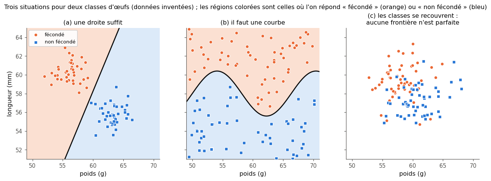
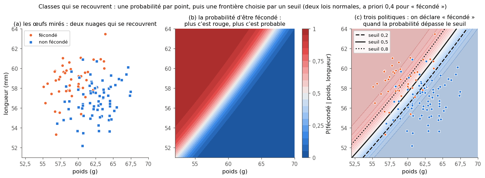
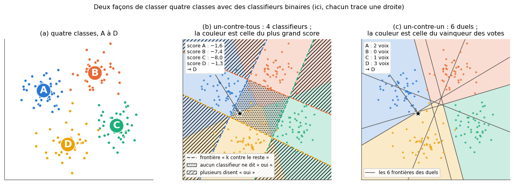
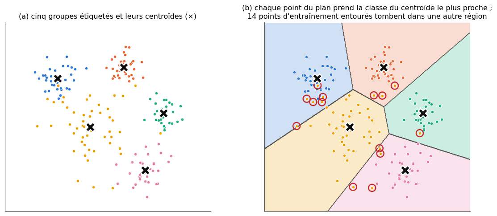
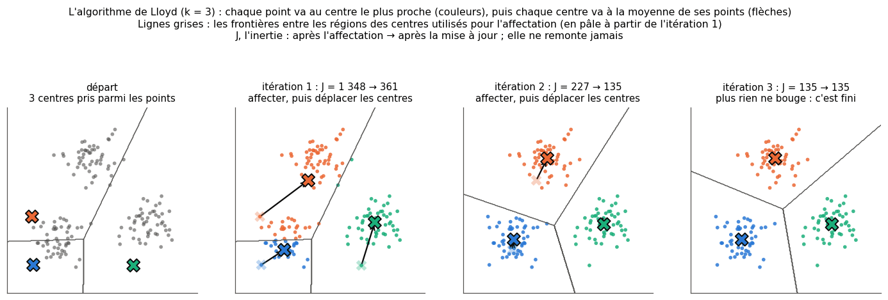
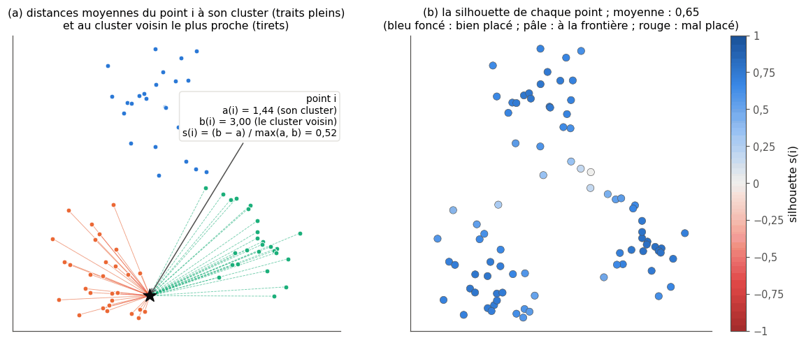
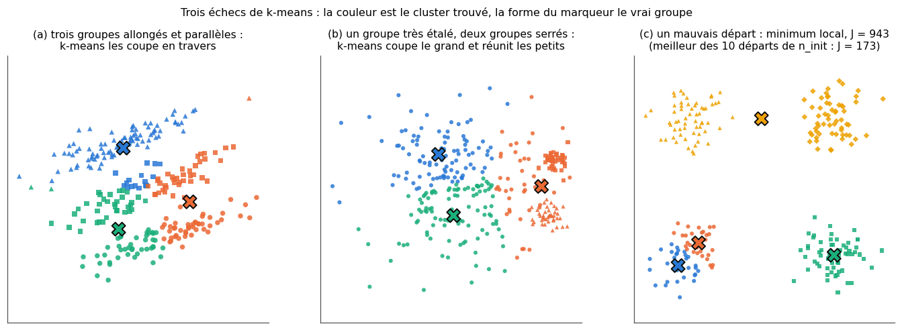
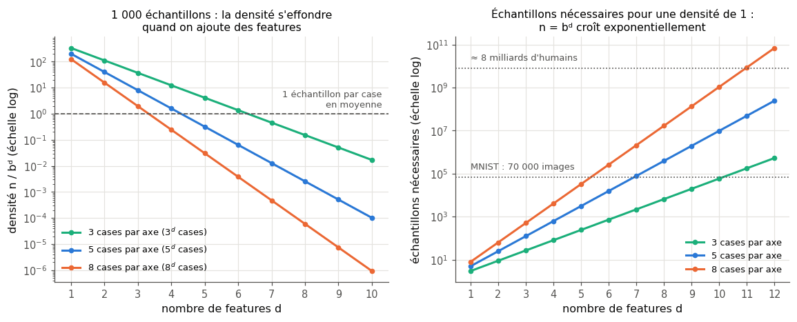

# 7 · Classification — fiche de cours

> Cette fiche accompagne le chapitre 7 du livre, qui ouvre la partie II. Le livre y installe le vocabulaire de la classification (classes, régions et frontières de décision), montre comment traiter plusieurs classes avec des classifieurs binaires, comment regrouper des données sans labels, et pourquoi trop de features peuvent nuire. Il prévient qu'il ne décrit aucun algorithme : ils arrivent au ch. 13. Pour que tu puisses pratiquer tout de suite, la fiche en ajoute quatre, très courts et fidèles à l'esprit du texte : le classifieur du centroïde le plus proche, l'algorithme de Lloyd pour k-means, l'initialisation k-means++ et le coefficient de silhouette. Elle ajoute aussi ce que le métier utilise aujourd'hui : les stratégies multi-classes de scikit-learn, le clustering par densité (DBSCAN, HDBSCAN) et la recherche de voisins dans les bases de vecteurs. Les œufs, les ballons et les oranges du livre ne sont que résumés ici : chaque section te dit où les lire.

| | |
|---|---|
| **Livre** | vol. 1, ch. 7 « Classification », p. 266-308 (§7.1 à §7.6.1) |
| **Temps total estimé** | ≈ 20 h : lecture du livre et de la fiche ≈ 3,2 h, exercices ≈ 16 h, 25 flashcards ≈ 0,8 h |
| **Prérequis** | 0A (classes Python : `__init__`, attributs, méthodes ; broadcasting et réductions par axe ; `rng.choice`) · 0B (norme, produit scalaire, distance euclidienne, coefficient binomial) · ch. 1 (apprentissage supervisé et non supervisé, hyperparamètre) · ch. 2 (moyenne, écart-type, z-score, loi normale) · ch. 3 (matrice de confusion, precision, recall, seuil) · ch. 4 (règle de Bayes) · ch. 6 (entropie) |
| **Fichiers du chapitre** | `02_exercices.md` (quiz, rappels, papier, réflexion, entretien) · `03_notebook.ipynb` · `04_indices.md` · `05_solutions.md` et `05_solutions.ipynb` · `06_mes_reponses.md` · `flashcards.csv` |
| **mylearn** | `cluster.py` : distances au carré vectorisées, classifieur du centroïde le plus proche, k-means++, classe `KMeans`, silhouette (7.13, 7.14, 7.25, 7.26, 7.28) · `multiclass.py` : `OneVsRestClassifier` et `OneVsOneClassifier` autour de n'importe quel classifieur binaire (7.22, 7.23), réutilisés aux ch. 10 et 13. Ce sont les premières classes « à la scikit-learn » du workbook : `fit` renvoie `self`, les attributs appris finissent par `_` |

## Comment utiliser ce chapitre

Le chapitre avance en quatre temps : les classes et leurs frontières (§7.1 à §7.3), plusieurs classes avec des classifieurs binaires (§7.4), le regroupement de données sans labels (§7.5), puis la grande dimension (§7.6). Le livre n'écrit presque aucune formule, et rien ici ne dépasse 0B et les ch. 1 à 6. Six encadrés 🧮 apportent les outils nouveaux : le seuil qui minimise un coût, les distances calculées toutes à la fois, le centroïde le plus proche, l'algorithme de Lloyd, k-means++ avec un tirage pondéré, et la silhouette ; un septième donne le volume d'une boule en dimension $d$. Tu programmeras deux modules : `cluster.py` et `multiclass.py`.

**Ordre conseillé.**
1. Lis le livre §7.1 à §7.3, puis les sections 7.1 à 7.3 de la fiche. Fais les quiz Q1 à Q5, le rappel R2 et le cas ⚖️ 7.10.
2. Lis le livre §7.4, puis la fiche. Fais les quiz Q6 et Q7 et les exercices papier 7.1 et 7.2 ; vérifie-les dans la partie 0 du notebook.
3. Lis le livre §7.5, puis la fiche jusqu'à « Combien de clusters ? » inclus. Fais le quiz Q8, les rappels R1 et R3, l'exercice papier 7.3, ∂ 7.7 et la lecture de documentation 🛠️ 7.9. Fais ensuite la partie A du notebook (7.11 à 7.16 : œufs en 2D, une prédiction sur k-means, distances, centroïde le plus proche, carte de probabilité, un-contre-tous avec des centroïdes) : le 🔮 7.12 se fait **avant** de lire la section « Quand k-means échoue » de la fiche. Lis enfin cette section, puis fais le début de la partie B (7.17 et 7.18 : k-means sur les manchots, DBSCAN et HDBSCAN).
4. Lis le livre §7.6, **sans** la §7.6.1, puis la section 7.6 de la fiche. Fais les quiz Q9 et Q10, l'exercice papier 7.4 et l'oral 🗣️ 7.8. Fais le 🔮 7.19 du notebook **avant** de lire la suite : il te demande une prédiction que la §7.6.1 dévoilerait.
5. Lis le livre §7.6.1 et la fiche. Fais le quiz Q11, ∂ 7.5 et ∂ 7.6, puis 7.20 et 7.21 (fin de la partie B).
6. Termine le notebook : partie C (7.22 à 7.24 : un-contre-tous et un-contre-un génériques, comparaison) et partie D (7.25 à 7.31 : k-means de zéro, bugs, silhouette, choix de k, phénomène de Hughes, défi). Finis par les quatre questions d'entretien.

| Section | Quiz 🧠 et rappels 🔁 | Papier ✏️ ∂ et réflexion | Notebook | Entretien 💼 |
|---|---|---|---|---|
| 7.1 Pourquoi ce chapitre | Q1, Q2 | | | |
| 7.2 et 7.2.1 Classer en 2D, frontières, seuil | Q2, Q3, Q4, R2 | 7.7, 7.10 | 7.11, 7.14, 7.15 | |
| 7.3 Plusieurs classes, plusieurs dimensions | Q2, Q5 | | 7.14, 7.24 | |
| 7.4 et 7.4.1 Un-contre-tous | Q6 | 7.1 | 7.16, 7.22, 7.24 | E1 |
| 7.4.2 Un-contre-un | Q7 | 7.1, 7.2 | 7.23, 7.24 | E1 |
| 7.5 Clustering : centroïdes, k-means, choix de k | Q8, R1, R3 | 7.3, 7.7, 7.9 | 7.12 à 7.14, 7.17, 7.18, 7.25 à 7.29, 7.31 | E2, E3 |
| 7.6 La malédiction de la dimension | Q9, Q10 | 7.4, 7.8 | 7.20, 7.30, 7.31 | E4 |
| 7.6.1 Bizarreries de la grande dimension | Q11 | 7.5, 7.6 | 7.19 à 7.21 | E4 |

**Lire les formules.** $K$ est le nombre de classes, $k$ le nombre de clusters de k-means (`n_clusters` dans scikit-learn), $n$ le nombre d'échantillons et $d$ le nombre de features, c'est-à-dire la dimension ; $k$ sert aussi d'indice pour parcourir les classes ou les clusters ($s_k$, $\boldsymbol{\mu}_k$), le contexte dit lequel. Un échantillon est un vecteur $\mathbf{x} \in \mathbb{R}^d$ (en gras), une ligne de la matrice $\mathbf{X}$ de forme $(n, d)$. $\lVert \mathbf{a} - \mathbf{b} \rVert$ est la distance euclidienne entre deux vecteurs (0B) ; $\boldsymbol{\mu}_k$ est un centroïde, la moyenne d'un groupe de vecteurs. Au §7.6, $b$ est le nombre de cases par axe ; ne le confonds pas avec $b(i)$, l'une des deux distances de la silhouette (§7.5).

## Objectifs d'apprentissage

À la fin du chapitre, tu sais :
- **distinguer** classification binaire, multi-classe et multi-étiquette, et **lire** des régions et des frontières de décision ;
- **choisir** un seuil de décision d'après le coût des faux positifs et des faux négatifs ;
- **compter** les classifieurs des stratégies un-contre-tous et un-contre-un, **dépouiller** leurs votes, et les **programmer** autour de n'importe quel classifieur binaire ;
- **implémenter** en NumPy vectorisé le classifieur du centroïde le plus proche et k-means (Lloyd, k-means++) ;
- **choisir** un nombre de clusters avec l'inertie et la silhouette, et **reconnaître** les cas où un clustering par densité (DBSCAN, HDBSCAN) convient mieux ;
- **calculer** une densité d'échantillons et quelques grandeurs géométriques en dimension $d$, et **expliquer** la malédiction de la dimension et ses parades.

## L'essentiel en 10 lignes

1. Classer, c'est attribuer à chaque échantillon une **classe** prise dans une liste fixée ; on compare la **prédiction** du modèle au **label**, la vérité terrain fixée par un expert.
2. Un classifieur découpe l'espace des features en **régions de décision**, séparées par des **frontières de décision** : une droite ou une courbe en 2D, une surface de dimension $d - 1$ en dimension $d$.
3. Quand les classes se recouvrent, aucune frontière n'est parfaite : on calcule une **probabilité** par point, puis on fixe un **seuil**, qui dépend du coût des erreurs autant que des données.
4. **Un-contre-tous** (OvR) : $K$ classifieurs binaires « la classe $k$ contre toutes les autres », et l'on prédit la classe dont le score est le plus grand.
5. **Un-contre-un** (OvO) : $\frac{K(K-1)}{2}$ duels, chacun entraîné sur deux classes seulement ; la classe qui gagne le plus de duels l'emporte, et une règle tranche les égalités.
6. Le **centroïde le plus proche** prédit la classe dont la moyenne est la plus proche : ses frontières sont des morceaux de **médiatrices**.
7. **k-means** regroupe des données **sans labels** en $k$ clusters. L'algorithme de **Lloyd** alterne deux étapes : chaque point rejoint le centre le plus proche, puis chaque centre va à la moyenne de ses points. L'**inertie** ne peut que baisser.
8. k-means s'arrête dans un **minimum local** qui dépend du départ : on soigne l'initialisation (**k-means++**) et on garde le meilleur de plusieurs départs ; $k$ se choisit avec un critère (coude de l'inertie, **silhouette**).
9. **Malédiction de la dimension** : la densité d'échantillons $n / b^d$ s'effondre quand le nombre $d$ de features grandit, et passé un certain point, ajouter des features dégrade le modèle (**phénomène de Hughes**).
10. En grande dimension, l'intuition trompe : volumes et distances ne s'y comportent pas comme en 2D ou en 3D (§7.6.1). Heureusement, les vraies données ont une **structure** et n'occupent qu'une toute petite partie de l'espace.

## 7.1 · Pourquoi ce chapitre ?

Reconnaître les mots prononcés dans un téléphone, les animaux d'une photo, un fruit mûr ou pas mûr (exemples du livre), un e-mail frauduleux, une tumeur maligne : toutes ces tâches choisissent, pour chaque entrée, la catégorie la plus probable dans une liste fixée d'avance. C'est la **classification** (*classification*), et chaque catégorie s'appelle une **classe** (*class*). Le vocabulaire du ch. 1 s'applique : on entraîne le modèle sur des exemples dont on connaît déjà la bonne classe, puis on lui demande de classer des entrées nouvelles.

- Le **label** (*étiquette*) est la classe qu'un humain a attribuée à l'échantillon et que l'on tient pour juste. Le livre lui donne trois autres noms : **valeur réelle** (*actual value*), **vérité terrain** (*ground truth*) et **label de l'expert** (*expert's label*).
- La **valeur prédite** (*predicted value*) est la classe que le modèle choisit.
- Ce qui compte n'est pas de bien classer les exemples d'entraînement, mais les entrées qui arriveront ensuite : la **généralisation** (ch. 1 et 8).

Le nombre de classes donne son nom au problème :
- **binaire** (*binary*) : exactement deux classes, par exemple une tumeur bénigne ou maligne ;
- **multi-classe** (*multi-class*) : trois classes ou plus, une seule par échantillon, par exemple la langue d'un texte parmi vingt ;
- **multi-étiquette** (*multi-label*) : chaque échantillon peut recevoir plusieurs labels à la fois, ou aucun, par exemple les genres d'un film à la fois comédie et romance. L'exemple du livre est une photo où l'on voit un tigre **et** un arbre. Le chapitre suppose ensuite qu'une classe domine toujours.

Le livre fait enfin deux annonces (§7.1) : il ne décrit ici aucun algorithme de classification (il faut attendre le ch. 13), et il présentera aussi le **clustering**, qui regroupe des échantillons **sans** labels (l'apprentissage non supervisé du ch. 1).

> 🕰️ **Mise à jour (2026)** — **Le livre :** évoque la photo du tigre et de l'arbre, et affirme que ses techniques se généralisent à plusieurs labels, sans dire comment. · **Aujourd'hui :** en multi-étiquette, la cible n'est plus un vecteur de classes mais une **matrice binaire** de forme `(n_samples, n_classes)` : un 1 dans la colonne de chaque label présent. La méthode de base entraîne un classifieur binaire par label et garde tous ceux qui disent « oui » ; en deep learning, c'est une sortie **sigmoïde par label** (et non une softmax, qui force une seule classe). scikit-learn fournit `MultiOutputClassifier` (un modèle indépendant par label) et `ClassifierChain` : les modèles y sont enchaînés, et chacun reçoit en plus les labels des précédents à l'entraînement, puis leurs prédictions au moment de prédire, pour tenir compte des labels qui vont ensemble. · **Faut-il quand même l'apprendre ?** Oui pour la notion : étiquetage d'images, de textes, de tickets d'assistance, beaucoup de problèmes réels sont multi-étiquettes. · *Sources :* [scikit-learn 1.6, « Multiclass and multioutput algorithms »](https://scikit-learn.org/1.6/modules/multiclass.html).

## 7.2 · Classer en 2D ⏩

Le livre part du cas le plus facile à dessiner : deux features, donc un point du plan par échantillon, et deux classes, donc deux couleurs (ou deux formes de marqueur). Un simple nuage de points montre alors si les classes se séparent ; on parle de **classification binaire** en 2D.

### 7.2.1 Classification binaire en 2D ⏩

Le fil conducteur du livre est un élevage de poules : on veut savoir si un œuf est **fécondé** d'après son poids et sa longueur. Les labels des œufs d'entraînement viennent du **mirage** (*candling*) : devant une lampe, un spécialiste lit l'ombre du contenu à travers la coquille. Le livre admet lui-même que rien ne garantit que ces deux mesures suffisent : c'est une expérience de pensée.

Une **méthode à frontière** (*boundary method*) trace une ligne, droite ou courbe, et donne une classe à chacun de ses côtés. Ces lignes découpent le plan en **régions de décision** (*decision regions*), séparées par des **frontières de décision** (*decision boundaries*) ; un œuf nouveau reçoit la classe de la région où il tombe. Entre deux frontières qui classent aussi bien les exemples, le livre conseille la plus simple. (Le ch. 9 dira pourquoi : une frontière trop tortueuse épouse le hasard des exemples, c'est l'**overfitting**.) Au fil des achats de nouvelles races de poules, le livre rencontre trois situations (figures 7.1 à 7.4) :

Dans le troisième cas, les nuages se mêlent : quelle que soit la frontière, des œufs restent du mauvais côté. On raisonne alors en **probabilités** : à chaque point $\mathbf{x}$ du plan, on associe la probabilité $P(\text{fécondé} \mid \mathbf{x})$ qu'un œuf qui tombe là soit fécondé. La règle de Bayes (ch. 4) la donne à partir de trois ingrédients : la part $\pi$ des œufs fécondés (l'a priori), et les densités $f_1$ et $f_0$ des mesures pour chaque classe (deux lois normales, par exemple, ch. 2) :

$$P(\text{fécondé} \mid \mathbf{x}) = \frac{\pi\, f_1(\mathbf{x})}{\pi\, f_1(\mathbf{x}) + (1 - \pi)\, f_0(\mathbf{x})}.$$

*Mini-exemple.* Avec $\pi = 0{,}4$, et, en un point donné, $f_1 = 0{,}05$ et $f_0 = 0{,}02$ : $P = \frac{0{,}4 \times 0{,}05}{0{,}4 \times 0{,}05 + 0{,}6 \times 0{,}02} = \frac{0{,}02}{0{,}032} = 0{,}625$.

> ⚠️ **La légende de la figure 7.5 est inversée** — Au centre de la figure, plus le rouge est vif, plus l'œuf est **probablement fécondé** (et non « non fécondé », comme l'écrit la légende) ; l'image de droite montre la probabilité inverse, celle de ne pas être fécondé. Le texte qui précède la figure, lui, est juste.

Il faut pourtant décider : chaque œuf finira dans un seul bac. On choisit donc un **seuil** $t$ (ch. 3) : on déclare « fécondé » quand $P(\text{fécondé} \mid \mathbf{x}) \ge t$. La frontière est alors une **ligne de niveau** de la carte des probabilités. Baisser le seuil agrandit la région « fécondé » : on rate moins d'œufs fécondés (le recall monte ou reste égal), au prix de plus de faux positifs. Le monter fait l'inverse. Le livre montre deux politiques de ce genre (figure 7.6) : ne laisser passer aucun œuf fécondé, ou ne se tromper sur aucun œuf non fécondé. La figure ci-dessous en trace trois sur une même carte.

Où placer la frontière ? Pour le livre, quand les classes se mêlent, aucune frontière n'est « la bonne » : c'est une décision d'éleveur autant que de statisticien. On peut quand même chiffrer ce raisonnement.

> 🧮 **Rappel maths — le seuil qui minimise le coût moyen** — Supposons que la probabilité $p = P(\text{positif} \mid \mathbf{x})$ soit **calibrée** (ch. 3) et notons $C_{FP}$ le coût d'un faux positif, $C_{FN}$ celui d'un faux négatif (une bonne réponse ne coûte rien). Déclarer « positif » coûte en moyenne $(1 - p)\,C_{FP}$ : on se trompe quand l'œuf n'est pas fécondé. Déclarer « négatif » coûte $p\,C_{FN}$. On déclare donc « positif » quand $(1 - p)\,C_{FP} < p\,C_{FN}$, c'est-à-dire quand
> $$p > t^* = \frac{C_{FP}}{C_{FP} + C_{FN}}$$
> (à égalité, les deux choix coûtent autant). *Mini-exemple.* Garder à tort un œuf non fécondé dans l'incubateur coûte une place (coût 1) ; jeter un œuf fécondé coûte un poussin (coût 9). Alors $t^* = \frac{1}{1 + 9} = 0{,}1$ : on garde tout œuf dont la probabilité d'être fécondé dépasse 10 %. Le seuil de 0,5 n'est le bon que si les deux erreurs coûtent autant. En pratique, on le choisit sur un jeu de **validation** (ch. 8), jamais sur le test.

## 7.3 · Plusieurs classes, plusieurs dimensions ⏩

Au §7.3, la classe « non fécondé » se dédouble. L'œuf **clair** (*yolker* dans le livre), jamais fécondé, part à la vente ; l'œuf à **embryon mort** (*quitter*) doit quitter la couveuse, qu'il peut contaminer. Avec les œufs viables, on a trois classes : un problème **multi-classe**. Rien ne change sur le principe : chaque classe reçoit une ou plusieurs régions, et un œuf nouveau prend la classe de la région où il tombe.

On peut aussi mesurer plus de choses sur chaque œuf : le livre ajoute la couleur, la circonférence moyenne et l'heure de ponte, soit cinq features avec le poids et la longueur (il écrit « *weight and volume* » : lis « poids et longueur »). Un œuf devient un point de $\mathbb{R}^5$. Les régions de décision sont alors des morceaux de l'espace à 5 dimensions, et les frontières des « surfaces » de dimension 4. En général, en dimension $d$, une frontière est de dimension $d - 1$ : une droite dans le plan, un plan dans l'espace, un **hyperplan** (*hyperplane*) au-delà quand elle est plate.

Deux nuances, que le livre souligne :
- les calculs ne dépendent pas du nombre de dimensions : une distance, une moyenne ou un produit scalaire s'écrivent de la même façon avec 2 ou 784 coordonnées (0B), et le code NumPy aussi ;
- le **coût**, lui, en dépend : temps de calcul et mémoire grandissent avec $d$, et notre intuition, formée en 2D et en 3D, cesse d'être fiable (§7.6).

## 7.4 · Plusieurs classes avec des classifieurs binaires ⏩

Beaucoup de modèles ne savent répondre qu'à une question binaire : le perceptron du ch. 10, les SVM du ch. 13, la régression logistique dans sa forme de base. Le livre montre deux façons de les combiner pour traiter $K$ classes ; ces stratégies sont parfois efficaces, car un classifieur binaire peut être très rapide.

### 7.4.1 Un-contre-tous (OvR) ⏩

**Un-contre-tous** (*one-versus-rest*, OvR, qu'on appelle aussi *one-versus-all*, OvA, ou *one-against-all*, OAA) entraîne $K$ classifieurs binaires. Le classifieur $k$ apprend à répondre à la question « est-ce la classe $k$ ? » : on recode les labels en 1 pour la classe $k$ et en 0 pour toutes les autres, et on l'entraîne sur **tous** les échantillons. Pour classer un point, on l'envoie aux $K$ classifieurs et l'on garde la classe dont le **score** est le plus grand (une probabilité, ou un score de décision) :

$$\hat{y} = \arg\max_{k} \, s_k(\mathbf{x}).$$

Le panneau (b) de la figure montre pourquoi on prend le maximum plutôt que de compter les « oui ». Les $K$ frontières, tracées séparément, laissent des zones où plusieurs classifieurs disent « oui » (hachures obliques) et d'autres où **aucun** ne le dit (pointillés). L'argmax tranche partout, même quand tous les scores sont négatifs. Deux précautions :
- les scores viennent de modèles entraînés séparément : rien ne garantit qu'ils aient la même échelle, ni qu'ils somment à 1. Pour les comparer sans arrière-pensée, il vaut mieux des scores calibrés (ch. 3) ;
- chaque problème binaire est **déséquilibré** : avec 10 classes de même taille, la classe « oui » ne représente que 10 % des exemples.

Côté coût, il y a $K$ modèles à entraîner et $K$ à interroger pour chaque prédiction ; avec beaucoup de classes, le livre suggère de passer à un seul modèle multi-classe.

> ⚠️ **« Binary relevance » n'est pas tout à fait un synonyme** — Le livre range *binary relevance* parmi les noms de l'OvR. Dans la littérature, ce nom désigne la méthode **multi-étiquette** de base (encadré 🕰️ du §7.1) : même entraînement, un classifieur binaire par label, mais une autre décision, puisqu'on garde **tous** les labels dont le classifieur dit « oui », au lieu d'un seul argmax.

### 7.4.2 Un-contre-un (OvO) ⏩

**Un-contre-un** (*one-versus-one*, OvO) entraîne un classifieur pour **chaque paire** de classes, sur les seuls échantillons de ces deux classes (les autres classes sont mises de côté). Le nombre de paires est le coefficient binomial de 0B :

$$N_{\text{OvR}} = K, \qquad N_{\text{OvO}} = \binom{K}{2} = \frac{K(K-1)}{2}.$$

Avec 4 classes, il faut 6 duels (le livre les dessine dans la figure 7.11 : A-B, A-C, A-D, B-C, B-D, C-D). Pour classer un point, on le soumet à **tous** les duels ; chacun vote pour l'une de ses deux classes, et la classe qui récolte le plus de voix l'emporte. Un duel vote même quand le point n'appartient à aucune de ses deux classes (il n'a pas d'autre choix), mais ces voix « hors sujet » se dispersent, alors que la vraie classe peut gagner ses $K - 1$ duels.

*Mini-exemple*, avec trois classes. Les duels donnent A-B → A, A-C → C, B-C → C : C a 2 voix, A en a 1, B aucune ; on prédit C. Si en revanche A bat B, B bat C et C bat A, chaque classe a une voix : il faut une **règle d'égalité**. `mylearn` choisit la classe de plus petit indice (A ici), comme `SVC` de scikit-learn par défaut. `OneVsOneClassifier`, dans scikit-learn, additionne plutôt les « confiances » des duels et garde la classe dont le total est le plus grand (`SVC` le fait aussi avec `break_ties=True`).

Le coût grandit vite : le nombre de duels est presque proportionnel au carré du nombre de classes. Le livre donne 190 duels pour 20 classes, 435 pour 30, et plus de 1 000 dès 46 classes (figure 7.13), et il faut tous les interroger pour chaque prédiction. En contrepartie, chaque duel s'entraîne sur moins de données : seulement deux classes (l'exercice 7.1 fait le compte). Quand le temps d'entraînement d'un modèle grandit plus vite que le nombre d'exemples, comme pour les SVM à noyau du ch. 13, beaucoup de petits problèmes peuvent coûter moins cher que $K$ gros. Le livre ajoute un avantage pour l'humain : les votes duel par duel montrent quelles classes se confondent.

> ⚠️ **Deux phrases du §7.4.2 à vérifier** — (1) Le livre écrit « *multiclass optimization* » : lis « classification ». (2) Il compare le nombre de duels à « un peu plus de la moitié » de $K \times K$. Compare toi-même $\frac{K(K-1)}{2}$ et $\frac{K^2}{2}$ : lequel est le plus grand ? (quiz Q7.)

> 🕰️ **Mise à jour (2026)** — **Le livre :** présente l'OvR et l'OvO comme la façon de faire du multi-classe avec des classifieurs binaires, et un « classifieur multi-classe unique » comme l'alternative quand il y a beaucoup de classes. · **Aujourd'hui :** dans scikit-learn, **tous** les classifieurs gèrent plusieurs classes d'office : on passe un `y` à $K$ classes à `fit`, sans rien faire de plus. Beaucoup sont multi-classes par nature (arbres, forêts, k plus proches voisins, `NearestCentroid`, Naïve Bayes, réseaux de neurones avec une softmax en sortie). D'autres appliquent une stratégie en interne : `SVC` et `NuSVC` font de l'un-contre-un, `LinearSVC` de l'un-contre-tous. Le module `sklearn.multiclass` (`OneVsRestClassifier`, `OneVsOneClassifier`) ne sert que si l'on veut choisir la stratégie soi-même ; sa documentation présente l'OvR comme la stratégie la plus courante et un choix par défaut raisonnable, et l'OvO comme plus lent, à cause de ses $\frac{K(K-1)}{2}$ modèles. · **Faut-il quand même l'apprendre ?** Oui : la question « OvR ou OvO ? » revient en entretien, les SVM du ch. 13 en dépendent, et `multiclass.py` te fera écrire un « méta-estimateur » qui enveloppe un autre modèle, un motif très courant en scikit-learn. · *Sources :* [scikit-learn 1.6, « Multiclass and multioutput algorithms »](https://scikit-learn.org/1.6/modules/multiclass.html) ; [documentation de `sklearn.svm.SVC`](https://scikit-learn.org/1.6/modules/generated/sklearn.svm.SVC.html) (paramètre `break_ties`).

## 7.5 · Clustering ⏩

Au lieu de découper l'espace en régions, on peut regrouper les données d'entraînement elles-mêmes en paquets d'échantillons semblables : des **clusters**. Le livre traite deux cas : avec des labels, puis sans.

### Avec des labels : le centroïde le plus proche

La figure 7.14 du livre fait grandir chaque groupe étiqueté jusqu'à ce que les groupes se touchent, si bien que chaque point du plan finit rattaché au groupe **le plus proche**. Pour en faire un algorithme, il faut préciser « le plus proche » ; la réponse la plus simple mesure la distance au **centre de gravité** de chaque groupe.

> 🧮 **Rappel outil — le classifieur du centroïde le plus proche** — *Entraînement* : pour chaque classe $k$, on calcule son **centroïde** (*centroid*) $\boldsymbol{\mu}_k = \frac{1}{|C_k|} \sum_{i \in C_k} \mathbf{x}_i$, la moyenne des échantillons de la classe ($C_k$ est l'ensemble de leurs indices, $|C_k|$ leur nombre). *Prédiction* : on attribue à $\mathbf{x}$ la classe du centroïde le plus proche, $\hat{y}(\mathbf{x}) = \arg\min_k \lVert \mathbf{x} - \boldsymbol{\mu}_k \rVert^2$ (comparer les carrés des distances donne le même classement, sans racine carrée). Les régions obtenues sont les **cellules de Voronoï** (*Voronoi cells*) des centroïdes : la frontière entre deux classes est un morceau de la **médiatrice** (*perpendicular bisector*) du segment qui joint leurs centroïdes, l'ensemble des points à égale distance des deux (∂ 7.7 le démontre). *Mini-exemple* : $\boldsymbol{\mu}_0 = (1, 1)$, $\boldsymbol{\mu}_1 = (3, 5)$ et $\mathbf{x} = (6, 0)$. On trouve $\lVert \mathbf{x} - \boldsymbol{\mu}_0 \rVert^2 = 25 + 1 = 26$ et $\lVert \mathbf{x} - \boldsymbol{\mu}_1 \rVert^2 = 9 + 25 = 34$ : on prédit la classe 0. scikit-learn en a une version, `sklearn.neighbors.NearestCentroid`.

Ce classifieur ne retient que les moyennes. La forme et l'étalement des classes ne comptent pas : sur la figure, le groupe jaune, très étalé, perd des points au profit de ses voisins plus serrés. Une autre lecture de « le groupe le plus proche » prend la distance au **point** d'entraînement le plus proche : c'est le classifieur du plus proche voisin, que le ch. 13 généralise aux $k$ plus proches voisins (kNN).

Pour programmer ce classifieur, et k-means juste après, il faut calculer beaucoup de distances : de chaque point à chaque centre. Une boucle Python sur les paires serait très lente.

> 🧮 **Rappel maths — toutes les distances d'un coup** — Le développement du rappel R3 (0B),
> $$\lVert \mathbf{a} - \mathbf{b} \rVert^2 = \lVert \mathbf{a} \rVert^2 - 2\,\mathbf{a} \cdot \mathbf{b} + \lVert \mathbf{b} \rVert^2,$$
> permet de calculer **toutes** les distances au carré entre les lignes d'une matrice $\mathbf{A}$ de forme $(n_a, d)$ et celles d'une matrice $\mathbf{B}$ de forme $(n_b, d)$ sans boucle. Les normes au carré s'obtiennent par une réduction par axe. Les produits scalaires de toutes les paires forment, d'un seul coup, un produit matriciel. Le broadcasting (0A) assemble les trois termes en une matrice $(n_a, n_b)$. *Mini-exemple* : pour $\mathbf{a} = (1, 2)$ et $\mathbf{b} = (3, 4)$, $5 - 2 \times 11 + 25 = 8$, soit bien $2^2 + 2^2$. Les arrondis des flottants peuvent produire de minuscules valeurs **négatives** pour deux points presque confondus : on les remplace par 0 avant de prendre une racine carrée. (Tu l'écris en 7.13.)

### Sans labels : k-means

Sans labels (apprentissage **non supervisé**, ch. 1), c'est à l'algorithme de trouver les groupes. Le plus connu, **k-means** (*k-moyennes*), représente chaque cluster par la moyenne de ses points, d'où son nom, et il faut lui donner le nombre $k$ de clusters à chercher : un **hyperparamètre**, fixé avant l'entraînement.

Fixer $k$ à l'avance a un prix (§7.5 du livre) : k-means rend **toujours** $k$ clusters, qu'ils aient un sens ou non, sans jamais signaler un mauvais choix. La figure 7.16 le montre sur 200 points en 5 paquets, découpés avec $k$ = 2 à 7 : un $k$ trop petit fusionne des paquets distincts, un $k$ trop grand coupe un paquet homogène en morceaux arbitraires. Et même avec le bon $k$, des paquets qui se chevauchent peuvent être partagés autrement que ne le ferait ton œil.

> 🧮 **Rappel outil — l'algorithme de Lloyd (k-means)** — Le livre nomme k-means sans le décrire. L'algorithme standard, dû à S. Lloyd, part de $k$ centres initiaux $\boldsymbol{\mu}_1, \ldots, \boldsymbol{\mu}_k$ et répète deux étapes :
> 1. **affectation** : chaque point $\mathbf{x}_i$ rejoint le centre le plus proche, $c_i = \arg\min_j \lVert \mathbf{x}_i - \boldsymbol{\mu}_j \rVert^2$ ;
> 2. **mise à jour** : chaque centre devient la moyenne des points qui l'ont rejoint (un centre que personne n'a rejoint garde sa place dans `mylearn` ; scikit-learn le déplace).
>
> On s'arrête quand les affectations ne changent plus, quand les centres ne bougent presque plus, ou après un nombre maximal d'itérations. La qualité d'un découpage se mesure par l'**inertie** (*inertia*), la somme des carrés des distances de chaque point à son centre :
> $$J = \sum_{i=1}^{n} \lVert \mathbf{x}_i - \boldsymbol{\mu}_{c_i} \rVert^2.$$
> Aucune des deux étapes ne peut augmenter $J$ : l'affectation choisit pour chaque point le centre le plus proche, et la moyenne est le point qui rend la somme des carrés des écarts la plus petite possible (ch. 2 et 0B.24). Comme il n'existe qu'un nombre fini de façons de répartir $n$ points en $k$ groupes, l'algorithme finit par s'arrêter, mais sur un **minimum local** (*local minimum*) de $J$, pas forcément le meilleur découpage.
>
> *Mini-exemple* en dimension 1 : les points 0, 2, 3, 9, 11, 12, $k = 2$, centres de départ 0 et 3. Affectation : {0} et {2, 3, 9, 11, 12} ($J = 182$ avec les centres de départ). Mise à jour : 0 et 7,4 ($J = 85{,}2$). Affectation : {0, 2, 3} et {9, 11, 12} ($J \approx 49{,}7$). Mise à jour : $\frac{5}{3} \approx 1{,}67$ et $\frac{32}{3} \approx 10{,}67$ ($J = \frac{28}{3} \approx 9{,}33$). L'affectation suivante ne change rien : c'est fini.

### Le départ compte : minima locaux et k-means++

Le résultat dépend des centres de départ. Un mauvais départ, par exemple deux centres dans le même groupe, peut piéger l'algorithme dans un découpage médiocre dont il ne sortira pas. Deux remèdes se combinent :
- relancer l'algorithme depuis plusieurs départs (le paramètre `n_init`) et garder le découpage de plus faible inertie ;
- choisir les centres de départ avec soin : c'est **k-means++** (D. Arthur et S. Vassilvitskii, 2007).

> 🧮 **Rappel outil — k-means++ et le tirage pondéré** — Le premier centre est un point des données tiré au hasard, uniformément. Chaque centre suivant est tiré parmi les points avec une probabilité proportionnelle à $D(\mathbf{x})^2$, le carré de la distance de $\mathbf{x}$ au centre déjà choisi le plus proche :
> $$P(\mathbf{x} \text{ choisi}) = \frac{D(\mathbf{x})^2}{\sum_{\mathbf{x}'} D(\mathbf{x}')^2}.$$
> Les points éloignés des centres déjà choisis ont donc plus de chances d'être pris, et un point déjà choisi ($D = 0$) ne peut pas l'être une seconde fois. En NumPy, `rng.choice(n, p=w / w.sum())` tire un indice entre 0 et $n - 1$ avec les probabilités $w / \sum w$ (0A ; ch. 2 pour le générateur). *Mini-exemple* : les points 0, 1, 5 et 9 sur une droite, premier centre 0. Les $D^2$ valent 0, 1, 25 et 81 (total 107), donc le point 9 sera le deuxième centre avec la probabilité $\frac{81}{107} \approx 0{,}76$, le point 5 avec $\frac{25}{107} \approx 0{,}23$, le point 1 avec moins de 1 %.

> 🕰️ **Mise à jour (2026)** — **Le livre :** nomme k-means, sans algorithme ni réglage. · **Aujourd'hui :** `sklearn.cluster.KMeans` initialise par défaut avec `init="k-means++"`, dans une version « gloutonne » (*greedy k-means++*) : à chaque étape, il essaie plusieurs candidats et garde le meilleur. `n_init` (le nombre de départs) vaut `"auto"` par défaut depuis la version 1.4, ce qui fait **un seul** départ avec k-means++ (la règle complète, selon `init`, est dans la documentation : 🛠️ 7.9). L'algorithme par défaut est `algorithm="lloyd"` ; la variante `"elkan"` évite des calculs de distance grâce à l'inégalité triangulaire, au prix de plus de mémoire, et le nom `"full"` a été remplacé par `"lloyd"` en 1.1. Après `fit`, on lit `cluster_centers_`, `labels_`, `inertia_` et `n_iter_`. · **Faut-il quand même l'apprendre ?** Oui : programmer Lloyd et k-means++ (7.25, 7.26) fait comprendre chaque paramètre ; le `KMeans` de `mylearn` garde `n_init=10` par défaut, plus simple que `"auto"`, et k-means++ dans sa version d'origine. · *Sources :* [documentation de `sklearn.cluster.KMeans` (1.6)](https://scikit-learn.org/1.6/modules/generated/sklearn.cluster.KMeans.html) ; [guide « Clustering » de scikit-learn 1.6, section k-means](https://scikit-learn.org/1.6/modules/clustering.html#k-means).

### Combien de clusters ?

Le livre propose d'entraîner pour plusieurs valeurs de $k$ et de garder celle qui « marche le mieux », ce qui coûte un entraînement par valeur essayée. Il conseille aussi de **regarder** les données avant (un nuage de points, ou une projection en 2D quand il y a beaucoup de features, ch. 12) pour viser juste.

> ⚠️ **« Le meilleur k » : selon quel critère ?** — Le livre écrit qu'on entraîne « notre réseau » plusieurs fois : il s'agit de k-means, pas d'un réseau de neurones. Surtout, il ne dit pas comment juger chaque $k$. Le critère qui vient en premier à l'esprit ne marche pas : la meilleure inertie possible **baisse toujours** quand $k$ augmente, jusqu'à 0 quand chaque point a son propre cluster (un lancer particulier peut faire exception, s'il tombe dans un minimum local). Il faut un critère qui pénalise les découpages inutiles.

Les critères usuels, sans labels :
- la **méthode du coude** (*elbow method*) : on trace l'inertie en fonction de $k$ et l'on cherche le point où elle cesse de baisser vite. C'est simple, mais le coude est souvent flou ;
- le **coefficient de silhouette**, ci-dessous, qui compare la cohésion de chaque cluster à sa séparation des autres ;
- d'autres indices du même genre (Calinski-Harabasz, Davies-Bouldin), et le **besoin métier** : un service marketing qui veut cinq segments de clientèle ne s'intéresse pas au $k$ « optimal ».

> 🧮 **Rappel maths — le coefficient de silhouette** — Pour un point $i$ de cluster $C$ :
> - $a(i)$ est la distance moyenne de $i$ aux **autres** points de $C$ : petite si le cluster est serré ;
> - $b(i)$ est, pour chacun des autres clusters, la distance moyenne de $i$ à ses points, puis la plus petite de ces moyennes (celle du « cluster voisin ») : grande si les clusters sont bien séparés.
>
> $$s(i) = \frac{b(i) - a(i)}{\max(a(i), b(i))} \in [-1, 1].$$
> Près de 1 : $i$ est bien à l'intérieur de son cluster, loin des autres ; près de 0 : il est à la frontière ; négatif : il serait mieux dans le cluster voisin. Par convention, $s(i) = 0$ pour un point seul dans son cluster. Le **score de silhouette** d'un découpage est la moyenne des $s(i)$ ; on préfère le $k$ qui le rend le plus grand. *Mini-exemple* sur une droite : clusters {0, 1, 2} et {6, 7}. Pour le point 2, $a = \frac{2 + 1}{2} = 1{,}5$ et $b = \frac{4 + 5}{2} = 4{,}5$, d'où $s = \frac{3}{4{,}5} \approx 0{,}67$. Pour le point 6, $a = 1$ et $b = \frac{6 + 5 + 4}{3} = 5$, d'où $s = 0{,}8$. Le calcul demande toutes les distances entre paires de points : c'est cher pour de gros datasets.

Quand on dispose de labels **pour évaluer** (pas pour entraîner), comme les espèces des manchots, on peut aussi comparer les clusters aux vraies classes. La **pureté** (*purity*) attribue à chaque cluster sa classe la plus fréquente et compte la part des points qui la portent. *Mini-exemple* : un cluster contient 40 Adélie et 10 Chinstrap, un autre 5 Adélie et 45 Gentoo ; pureté $= \frac{40 + 45}{100} = 0{,}85$. Attention, elle vaut 1 dès que chaque point forme son propre cluster : on la compare donc à $k$ fixé. scikit-learn propose aussi des indices corrigés du hasard, comme `adjusted_rand_score`. L'entropie du ch. 6 sert de la même façon : celle des labels d'un cluster mesure à quel point il est mélangé (rappel R1).

> 🕰️ **Mise à jour (2026)** — **Le livre :** réentraîne pour plusieurs $k$ et garde « le meilleur », sans critère. · **Aujourd'hui :** `sklearn.metrics` fournit des critères **internes**, qui n'utilisent que les données : `silhouette_score` et `silhouette_samples`, `calinski_harabasz_score`, `davies_bouldin_score` ; et des critères **externes**, quand des labels de référence existent : `adjusted_rand_score`, `normalized_mutual_info_score`, `homogeneity_score`. La documentation prévient que ces indices internes sont en général plus favorables aux clusters convexes qu'aux clusters de forme quelconque, comme ceux de DBSCAN : aucun critère n'est neutre. · **Faut-il quand même l'apprendre ?** Oui : « comment choisir $k$ sans labels ? » est une question d'entretien classique (E3), et tu programmes la silhouette en 7.28. · *Sources :* [guide « Clustering » de scikit-learn 1.6, section « Clustering performance evaluation »](https://scikit-learn.org/1.6/modules/clustering.html#clustering-performance-evaluation).

### Quand k-means échoue, et le clustering par densité

> Fais le 🔮 7.12 du notebook **avant** de lire cette section : elle répond à sa question.

k-means fait des hypothèses fortes, qu'il faut connaître pour lire ses résultats :
- les clusters sont à peu près **ronds** et d'étalements comparables : chaque cluster est une cellule de Voronoï de son centre, donc une région **convexe** (le segment qui joint deux de ses points y reste tout entier), délimitée par des morceaux de droites ;
- la distance euclidienne a un sens pour **toutes** les features à la fois. Si l'une est en grammes (de l'ordre de 4 000) et l'autre en millimètres (de l'ordre de 40), la première écrase la seconde : on **standardise** d'abord, par exemple avec des z-scores (ch. 2, puis ch. 12) ;
- tout point appartient à un cluster : k-means n'a pas de notion de **bruit**, et un point aberrant tire son centre vers lui.

Quand les groupes ont des formes quelconques, ou quand il y a du bruit, on préfère un **clustering par densité** (*density-based clustering*) : un cluster est une zone dense, séparée des autres par des zones vides. **DBSCAN** classe chaque point selon son voisinage de rayon `eps`. Un **point cœur** (*core point*) a au moins `min_samples` points dans ce voisinage. Les points cœurs proches les uns des autres forment un cluster, avec les points voisins qui ne sont pas cœurs eux-mêmes (les **points de bord**, *border points*). Les autres points sont du **bruit** (*noise*), noté −1. DBSCAN ne demande pas $k$ et suit des formes quelconques, mais il faut choisir `eps`, et un seul `eps` convient mal à des clusters de densités différentes. **HDBSCAN** essaie en quelque sorte toutes les valeurs de `eps` et garde les clusters les plus stables, ce qui lui permet de trouver des clusters de densités différentes. Tu compares ces méthodes à k-means en 7.18.

> 🕰️ **Mise à jour (2026)** — **Le livre :** ne présente que k-means, avec $k$ fixé à l'avance. · **Aujourd'hui :** scikit-learn propose `DBSCAN` (`eps=0.5` et `min_samples=5` par défaut, le point lui-même compté dans son voisinage ; bruit noté −1) et, depuis la version 1.3, `HDBSCAN` (`min_cluster_size=5` par défaut, sans `eps` ; il note −1 le bruit, −2 les points qui contiennent une valeur infinie, −3 ceux qui contiennent une valeur manquante). Aucun des deux n'a de méthode `predict` : on obtient les labels des clusters avec `fit_predict` ou `labels_`, et un point nouveau demande de relancer le clustering ou d'entraîner un classifieur sur les clusters trouvés. · **Faut-il quand même l'apprendre ?** Oui : k-means reste la base, rapide et facile à interpréter ; savoir reconnaître quand il échoue, et quoi utiliser à la place, fait partie du métier. · *Sources :* documentation scikit-learn 1.6 : [`DBSCAN`](https://scikit-learn.org/1.6/modules/generated/sklearn.cluster.DBSCAN.html) et [`HDBSCAN`](https://scikit-learn.org/1.6/modules/generated/sklearn.cluster.HDBSCAN.html).

## 7.6 · La malédiction de la dimension ⏩

Imagine 300 exemples décrits par 500 features. Chaque mesure apporte un peu d'information, mais elle ajoute aussi une dimension à remplir avec les mêmes exemples. À nombre d'exemples fixé, multiplier les features finit par **dégrader** le classifieur : tu le mesureras en 7.30, en ajoutant des features de bruit à de vraies données. Le livre (§7.6) fait cette expérience de pensée avec ses œufs, en leur ajoutant des mesures de plus en plus éloignées de la fécondation. Le phénomène porte le nom de **malédiction de la dimension** (*curse of dimensionality*), ou de **fléau de la dimension**, l'autre nom cité au ch. 2. R. Bellman a forgé l'expression en 1957 pour la programmation dynamique, où le nombre de cas à examiner explose avec le nombre de variables. En classification, la baisse de performance s'appelle aussi le **phénomène de Hughes** (*Hughes phenomenon*, ou *peaking phenomenon*), d'après G. F. Hughes (1968).

Pourquoi ? Une frontière est retenue par les exemples situés de part et d'autre. Dans une région vide, rien ne la retient : des frontières très différentes classent alors aussi bien les exemples d'entraînement (figure 7.17 du livre), le choix entre elles est arbitraire, et c'est sur les données nouvelles qu'on paie l'erreur. Pour mesurer ce vide, le livre compte la **densité** d'échantillons. Chaque feature est ramenée à $[0, 1]$, et chaque axe est découpé en $b$ cases : en dimension $d$, il y a $b^d$ cases, et $n$ échantillons donnent en moyenne

$$\rho = \frac{n}{b^d} \text{ échantillons par case,} \qquad \text{et il en faut } n = \rho\, b^d \text{ pour une densité } \rho.$$

Avec les 10 œufs et les 5 cases par axe du livre, la densité vaut $\frac{10}{5} = 2$ en dimension 1, $\frac{10}{25} = 0{,}4$ en dimension 2 et $\frac{10}{125} = 0{,}08$ en dimension 3 (figures 7.18 à 7.20). Dans l'autre sens, garder une densité de 0,5 demande $0{,}5 \times 5^5 \approx 1\,560$ échantillons en dimension 5, et près de 5 millions en dimension 10 (figure 7.24). La plupart des cases sont vides, et le classifieur doit décider pour elles sans aucun exemple : il devine.

> ⚠️ **Une densité n'est pas une probabilité** — Le livre traduit la densité de 0,08 par « 8 % de chances qu'une petite case contienne un échantillon ». Ce n'est pas la même chose : 0,08 est un nombre **moyen** d'échantillons par case, qui peut d'ailleurs dépasser 1, alors qu'une probabilité ne le peut pas. Les deux nombres sont proches ici, mais pas égaux. L'exercice 7.4 calcule la vraie probabilité qu'une case soit vide.

Pourquoi le ML marche-t-il quand même, avec des images de milliers de pixels ? Parce que les vraies données n'occupent qu'une infime partie de l'espace, souvent près d'une « surface » de quelques dimensions : les photos d'un visage qui tourne la tête ne varient presque qu'avec l'angle. P. Domingos parle d'une **bénédiction de la non-uniformité** (*blessing of non-uniformity*, 2012), que le livre préfère appeler **bénédiction de la structure**. C'est l'**hypothèse de la variété** (*manifold hypothesis*). Les 70 000 chiffres manuscrits de MNIST vivent dans un espace de 784 pixels : rien qu'en noir et blanc, il existe $2^{784} \approx 10^{236}$ images possibles, et presque toutes ressemblent à de la neige ; tirées au hasard, elles ne donnent en pratique jamais un chiffre. Là où les données se trouvent, la densité suffit (figure 7.23). Le livre précise que malédiction et bénédiction sont des **constats empiriques**, pas des théorèmes ; la chute de la densité, elle, est un simple calcul.

Les parades, que tu retrouveras dans tout le workbook :
- **plus de données**, la plus sûre, qui explique en partie la faim de données du deep learning ;
- **moins de features** : en choisir (sélection de features, ch. 12) ou les résumer (PCA, ch. 12) ;
- la **régularisation** (ch. 9), qui interdit les frontières trop tortueuses ;
- des **modèles qui exploitent la structure**, comme les réseaux convolutifs (ch. 21), qui savent qu'un pixel ressemble à ses voisins ;
- le **savoir du domaine** : mesurer ce qui compte vraiment plutôt que tout ce qui est mesurable.

## 7.6.1 · Bizarreries de la grande dimension

> Fais le 🔮 7.19 du notebook **avant** de lire cette section : elle répond à sa question.

Le livre réunit quelques résultats qui déroutent l'intuition dès que $d$ dépasse 3. Ils ne sont pas théoriques : un tableau de 30 colonnes est déjà un nuage de points de $\mathbb{R}^{30}$.

**Les distances.** Le livre répartit uniformément un nombre fixé de points en dimension 1, 2, 3, et ainsi de suite, et suit la distance moyenne : elle augmente, mais lentement (figure 7.25).

> ⚠️ **Que montre la figure 7.25 ?** — Sa légende parle de la distance au **plus proche voisin**, la phrase qui la précède de la **distance moyenne entre deux points**. Ses valeurs (environ 0,33 en dimension 1, 0,52 en dimension 2) sont celles de la seconde : sur un segment de longueur 1, deux points pris au hasard sont en moyenne à $\frac{1}{3}$ l'un de l'autre, alors qu'avec des centaines de points, le plus proche voisin serait tout près. Les deux quantités n'évoluent pas du tout de la même façon : 7.19 et 7.20 te les font mesurer.

Le vrai piège est la **concentration des distances** (*distance concentration*) : pour beaucoup de distributions, quand $d$ grandit, l'écart entre la distance au plus proche voisin et la distance au plus lointain devient négligeable devant ces distances elles-mêmes (K. Beyer et coll., 1999). Le « plus proche voisin » n'est alors guère plus proche que les autres points. Tu as déjà vu ce contraste des distances s'effondrer en 2.25, pour des points tirés au hasard en 784 dimensions, alors que les images de MNIST, qui ont de la structure, le gardent bien mieux. Les méthodes fondées sur les distances (kNN au ch. 13, k-means, recherche de documents semblables) en souffrent, sauf si les données ont assez de structure.

**La boule dans le cube.** On place dans un cube la plus grosse boule qui y tienne, et l'on compare leurs volumes (figures 7.26 et 7.27). En dimension 1, la « boule » remplit tout le « cube » (un segment) : rapport 1. En 2D, le disque occupe $\frac{\pi}{4} \approx 0{,}785$ du carré ; en 3D, la boule occupe $\frac{\pi}{6} \approx 0{,}524$ du cube. Ensuite, le rapport s'effondre vers 0 : en grande dimension, presque tout le volume du cube est dans ses **coins**.

> 🧮 **Rappel maths — le volume d'une boule en dimension $d$, par récurrence** — La formule générale du volume d'une boule utilise une fonction spéciale, hors programme. Une récurrence suffit, et on l'admet (elle vient du découpage de la boule en tranches). Le volume $V_d$ de la boule de rayon 1 en dimension $d$ vérifie
> $$V_d = \frac{2\pi}{d}\, V_{d-2}, \qquad V_1 = 2 \;(\text{un segment de longueur 2}), \qquad V_2 = \pi \;(\text{le disque}).$$
> *Vérification* : $V_3 = \frac{2\pi}{3} \times 2 = \frac{4\pi}{3}$, le volume connu de la boule. Une boule de rayon $r$ a pour volume $V_d\, r^d$. La boule de rayon 1 tient dans le cube de côté 2, de volume $2^d$ : le rapport de la figure 7.27 vaut $\frac{V_d}{2^d}$. L'exercice ∂ 7.6 suit cette récurrence pas à pas.

> ⚠️ **Les points de la figure 7.27** — Ils sont en dessous des valeurs exactes : un peu en 2D (le point est vers 0,75 au lieu de $\frac{\pi}{4} \approx 0{,}785$), nettement dès la dimension 3 (vers 0,47 au lieu de $\frac{\pi}{6} \approx 0{,}524$). Le texte, lui, donne les bons ordres de grandeur. Fie-toi au calcul : tu traceras les valeurs exactes en 🎨 7.21.

**Tout est dans l'écorce.** Une boule de rayon $1 - \varepsilon$ a pour volume $(1 - \varepsilon)^d$ fois celui de la boule de rayon 1. La part du volume située dans la « peau » d'épaisseur $\varepsilon$ (en fraction du rayon) vaut donc

$$1 - (1 - \varepsilon)^d.$$

Avec $\varepsilon = 10\,\%$ : $0{,}271$ en dimension 3, $0{,}651$ en dimension 10, $0{,}995$ en dimension 50. En grande dimension, presque tout le volume d'une orange est dans son écorce (le livre renvoie à B. Carpenter, 2017). Conséquence : des points tirés uniformément dans une boule sont presque tous près de sa surface. De même, les échantillons d'une loi normale en grande dimension sont presque tous loin de son centre, alors que c'est au centre que sa densité est la plus forte : il y a beaucoup plus de volume loin du centre.

**L'hyper-orange.** Le montage du livre (figures 7.28 à 7.30) : une boîte cubique de côté 4 ; dans chacun de ses $2^d$ coins, un ballon de rayon 1 ; au centre, la plus grosse orange possible, qui touche les ballons. Son rayon $r(d)$, d'après le livre :

| dimension $d$ | 2 | 3 | 4 | 9 | 10 |
|---|---|---|---|---|---|
| rayon de l'orange | ≈ 0,4 | ≈ 0,7 | 1 | 2 | ≈ 2,2 |

La demi-largeur de la boîte vaut 2 : dès la dimension 10, l'orange en **sort**. (Pour la dimension 9, le livre écrit « *in 9 directions* » : lis « en dimension 9 ».) L'exercice ∂ 7.5 établit la formule $r(d) = \sqrt{d} - 1$.

> ⚠️ **La « sphère hérissée » est une mauvaise image** — Pour expliquer ce paradoxe, le livre reprend une image répandue : l'hyper-orange enverrait des piquants entre les ballons. Pourtant, l'orange reste une boule parfaitement ronde : tous ses points sont à moins de $r$ de son centre. C'est la **boîte** qui défie l'intuition. Ses coins s'éloignent du centre comme $\sqrt{d}$, et les ballons, qui y sont logés, s'éloignent avec eux ; le milieu de chaque face, lui, reste à la même distance du centre, et aucun ballon ne le protège. L'orange grossit donc en restant ronde et finit par traverser les faces en leur milieu. Les notes de cours de T. Strohmer, que cite le livre, dessinent d'ailleurs en solide hérissé le **cube** de grande dimension, et non la boule.

À retenir : au-delà de trois features, ne raisonne pas par analogie avec le plan ou l'espace ; **calcule**, ou simule.

> 🕰️ **Mise à jour (2026)** — **Le livre :** s'arrête sur la densité des points et sur des curiosités géométriques. · **Aujourd'hui :** la grande dimension est le quotidien des **embeddings** (*plongements*), des vecteurs de quelques centaines ou milliers de coordonnées qui représentent des textes, des images ou des produits (B2). Retrouver les vecteurs les plus proches d'une requête parmi des millions est le cœur des moteurs de recherche sémantique et du RAG (*retrieval-augmented generation*, B4). Une recherche exacte comparerait la requête à tous les vecteurs ; on utilise donc une **recherche approchée des plus proches voisins** (*approximate nearest neighbor search*, ANN), qui accepte de rater parfois le vrai plus proche voisin pour aller beaucoup plus vite. Les graphes **HNSW** (*Hierarchical Navigable Small World*, Y. Malkov et D. Yashunin) servent d'index dans des bases de données vectorielles et des moteurs de recherche ; la bibliothèque **FAISS** (Meta) rassemble ces méthodes d'indexation. Ces outils ne marchent que parce que les embeddings ont de la structure (l'hypothèse de la variété) : sur des vecteurs uniformes, la concentration des distances rendrait le « plus proche » presque arbitraire. · **Faut-il quand même l'apprendre ?** Oui : la malédiction de la dimension explique pourquoi on réduit la dimension, pourquoi la recherche exacte devient trop lente sur des millions de vecteurs, et pourquoi on mesure la qualité d'une recherche approchée par son *recall* (la part des vrais plus proches voisins retrouvés, le recall du ch. 3). · *Sources :* Y. A. Malkov et D. A. Yashunin, « Efficient and robust approximate nearest neighbor search using Hierarchical Navigable Small World graphs », *IEEE TPAMI*, 42 (4), 2020, p. 824-836 ([arXiv:1603.09320](https://arxiv.org/abs/1603.09320)) ; [Wikipédia (en), « Hierarchical navigable small world »](https://en.wikipedia.org/wiki/Hierarchical_navigable_small_world) ; M. Douze et coll., « The Faiss library », *IEEE Transactions on Big Data*, 12 (2), 2026, p. 346-361 ([arXiv:2401.08281](https://arxiv.org/abs/2401.08281)) ; K. Beyer, J. Goldstein, R. Ramakrishnan, U. Shaft, « When Is "Nearest Neighbor" Meaningful? », ICDT 1999 ([DOI 10.1007/3-540-49257-7_15](https://doi.org/10.1007/3-540-49257-7_15)).

## Les pièges classiques ⚠️ (récapitulatif)

| Piège | Exemple faux | Réflexe |
|---|---|---|
| confondre multi-classe et multi-étiquette | une softmax pour prédire les genres d'un film | une sortie binaire (sigmoïde) par label |
| garder le seuil de 0,5 sans réfléchir | le même seuil pour un dépistage et pour un filtre anti-spam | $t^* = \frac{C_{FP}}{C_{FP} + C_{FN}}$, puis réglage sur la validation |
| comparer des scores OvR comme des probabilités | « 0,9 pour A contre 0,8 pour B : A est sûr à 90 % » | les scores viennent de modèles séparés : les calibrer, ou prendre un modèle multi-classe natif |
| oublier les égalités en OvO | un argmax des votes sans règle explicite | fixer la règle (plus petit indice, ou confiance cumulée) et la documenter |
| lancer k-means sur des features brutes | la masse en grammes écrase la longueur en millimètres | standardiser d'abord |
| choisir $k$ par l'inertie la plus basse | « $k = n$ donne une inertie nulle, c'est parfait » | coude, silhouette, besoin métier |
| se fier à un seul départ de k-means | un minimum local pris pour la solution | k-means++ et plusieurs départs (`n_init`) |
| demander à k-means des formes qu'il ne sait pas faire | des groupes allongés ou enroulés coupés en morceaux | DBSCAN ou HDBSCAN, après avoir regardé les données |
| confondre k-means et kNN | « kNN regroupe les données en k groupes » | k-means est non supervisé ; kNN classe d'après les labels de ses $k$ plus proches voisins (ch. 13) |
| ajouter des features « au cas où » | 500 features pour 300 exemples | sélection, réduction, régularisation, plus de données |
| raisonner en 3D sur des données à 100 dimensions | « le plus proche voisin est forcément proche » | mesurer les distances (7.20) |

## Liens avec les autres chapitres 🔗

- **0A** : les classes Python (`__init__`, attributs, méthodes) pour écrire `NearestCentroid`, `KMeans` et les méta-estimateurs ; le broadcasting et les réductions par axe pour les distances ; `rng.choice` pour k-means++.
- **0B** : norme, produit scalaire, distance ; le coefficient binomial $\binom{K}{2}$ ; la moyenne, qui minimise la somme des carrés des écarts (0B.24).
- **Ch. 1** : apprentissage supervisé et non supervisé, hyperparamètre, généralisation.
- **Ch. 2** : moyenne, écart-type et z-score (standardiser avant k-means), loi normale (les densités des classes), générateur aléatoire ; la malédiction de la dimension (le « fléau » du ch. 2) et le contraste des distances sur MNIST (2.25).
- **Ch. 3** : seuil, precision, recall, calibration ; l'un-contre-tous y servait déjà à calculer des mesures par classe.
- **Ch. 4** : la règle de Bayes donne la probabilité d'une classe en chaque point.
- **Ch. 6** : l'entropie mesure le mélange des labels d'un cluster.
- **Ch. 8** : un jeu de validation pour choisir le seuil et $k$ ; `clone`, qui remplacera `copy.deepcopy` dans les méta-estimateurs.
- **Ch. 9** : une frontière trop tortueuse fait de l'overfitting ; la régularisation, une parade à la dimension.
- **Ch. 10 et 13** : le perceptron, puis les SVM, utilisés avec `multiclass.py` ; le kNN et la malédiction de la dimension (13.15).
- **Ch. 12** : standardisation, sélection de features, PCA, t-SNE et UMAP pour regarder des données en grande dimension.
- **Ch. 17 et suivants** : la softmax, sortie multi-classe des réseaux ; une sigmoïde par label en multi-étiquette.
- **B2 et B4** : les embeddings et la recherche des plus proches voisins dans une base de vecteurs (RAG).

## Guide de lecture et de travail

**Lecture du livre.** Lis le chapitre 7 dans l'ordre, la fiche à côté : chaque section de la fiche porte le numéro de la section du livre et cite ses figures. Fais le 🔮 7.12 avant la section « Quand k-means échoue » de la fiche, et le 🔮 7.19 avant la §7.6.1. Les sections marquées ⏩ sont celles du **parcours rapide** : §7.2 à §7.6, sans la §7.1 ni la §7.6.1, soit environ 2,6 h avec la fiche entière. Les autres parcours lisent tout le chapitre.

**Travail.** Pour chaque bloc de sections :
1. **Lis** le livre et la fiche ; refais les mini-exemples sur papier.
2. Fais le **quiz** 🧠 correspondant sans la fiche, puis corrige-le avec `05_solutions.md` ; vérifie les réponses courtes dans la partie 0 du notebook.
3. Fais les exercices **papier** ✏️ et ∂ dans `mon_travail/ch07_classification/06_mes_reponses.md`, et vérifie les réponses chiffrées dans la partie 0 du notebook.
4. Passe au **notebook** (ta copie : `python tools/start_chapter.py 7`) et complète `mylearn/cluster.py` et `mylearn/multiclass.py`.
5. En fin de journée : 10 minutes de **flashcards**, et une ligne dans ton journal.

**Parcours rapide.** La fiche entière et les sections ⏩ du livre. Au programme : tous les quiz et les trois rappels, les exercices papier 7.1 et 7.3, l'oral 7.8 et le cas 7.10, puis, dans le notebook, les œufs en 2D (7.11), la prédiction 7.12, les distances (7.13), le centroïde le plus proche (7.14), k-means sur les manchots (7.17), DBSCAN et HDBSCAN (7.18), k-means++ (7.25), `KMeans` (7.26), la silhouette (7.28) et le choix de $k$ (7.29), sans oublier les quatre questions d'entretien. Corrigés à lire : 7.7, 7.20 et 7.23. **Parcours maths** : les quiz Q9 et Q11, les trois rappels, tous les exercices papier (7.1 à 7.7) et, dans le notebook, les exercices qui calculent ou simulent (7.13, 7.15, 7.19 à 7.21, 7.28). **Parcours code** : la lecture de documentation 7.9 et tout le notebook, en lisant les corrigés des rappels R2 et R3 et des exercices papier 7.1 à 7.7. La liste exacte est dans `docs/PARCOURS.md`.

**Si tu bloques** : règle des 15 minutes, puis les indices de `04_indices.md`, un niveau à la fois.

## Pour aller plus loin

- scikit-learn, guide de l'utilisateur : [« Clustering »](https://scikit-learn.org/1.6/modules/clustering.html), avec un tableau qui compare les méthodes et une figure qui les essaie sur des jeux de formes variées ; [« Multiclass and multioutput algorithms »](https://scikit-learn.org/1.6/modules/multiclass.html), pour les stratégies du §7.4.
- Google, [« Présentation du clustering »](https://developers.google.com/machine-learning/clustering?hl=fr), un cours court en français : mesures de similarité, k-means, évaluation, avantages et inconvénients.
- P. Domingos, [« A Few Useful Things to Know About Machine Learning »](https://homes.cs.washington.edu/~pedrod/papers/cacm12.pdf), *Communications of the ACM*, 55 (10), 2012 : douze leçons de métier, dont la malédiction de la dimension et la bénédiction de la non-uniformité (référence du livre).
- B. Carpenter, [« Typical Sets and the Curse of Dimensionality »](https://mc-stan.org/learn-stan/case-studies/curse-dims.html), étude de cas Stan, 2017 : les distances, la boule dans le cube et la « coquille mince » où tombent les tirages d'une loi normale, simulées en R (référence du livre, à sa nouvelle adresse).
- D. Arthur et S. Vassilvitskii, [« k-means++: The Advantages of Careful Seeding »](https://theory.stanford.edu/~sergei/papers/kMeansPP-soda.pdf), *Proceedings of the 18th ACM-SIAM Symposium on Discrete Algorithms* (SODA), 2007 : l'article de k-means++, dont tu programmes la version d'origine en 7.25.
