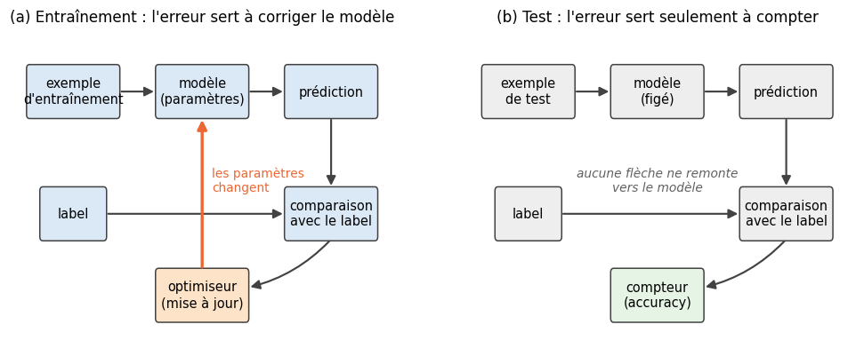
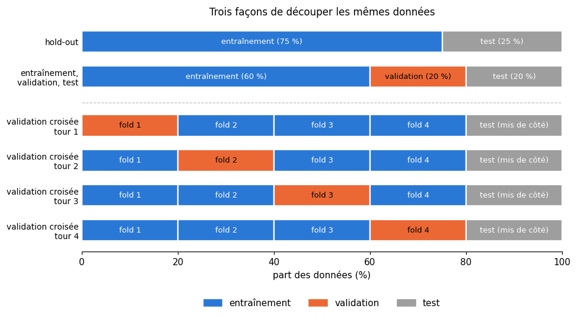
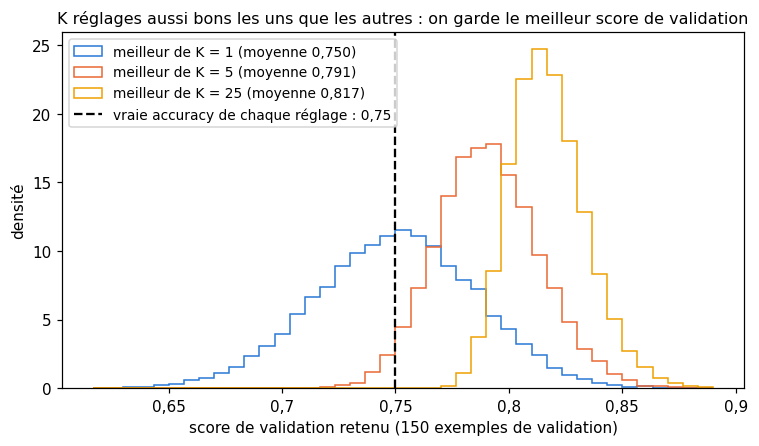
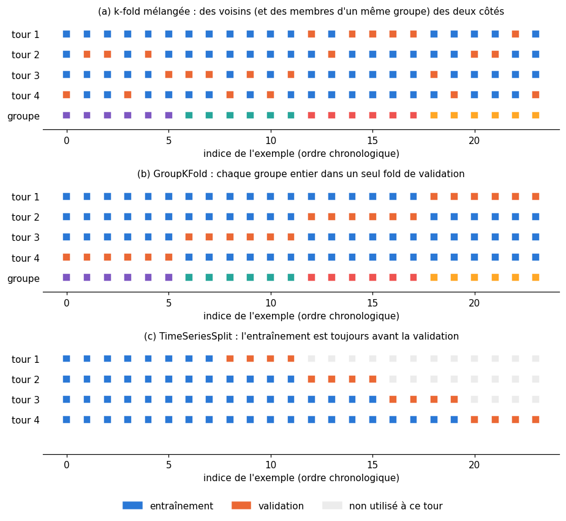

# 8 · Entraînement et test — fiche de cours

> Cette fiche accompagne le chapitre 8 du livre. Le chapitre est court et presque sans formule, mais il pose la question la plus importante du métier : **comment savoir si un modèle a vraiment appris ?** Le livre décrit la boucle d'entraînement, montre pourquoi le score obtenu sur les données d'entraînement trompe, puis construit un protocole honnête : un jeu de test gardé sous clé, un jeu de validation pour régler les hyperparamètres, et la validation croisée quand les données sont rares. La fiche ajoute ce que le livre laisse de côté et que tu devras savoir faire au travail : chiffrer l'incertitude d'un score, stratifier un découpage, cloner un modèle, reconnaître les fuites de données sous toutes leurs formes, traiter les données dépendantes (patients, séries temporelles) et comparer deux modèles avec un test statistique. Les chiens, le char d'assaut et la comète du livre ne sont que résumés ici : chaque section te dit où les lire.

| | |
|---|---|
| **Livre** | vol. 1, ch. 8 « Training and Testing », p. 310-336 (§8.1 à §8.6) |
| **Temps total estimé** | ≈ 16 h : lecture du livre et de la fiche ≈ 2,2 h, exercices ≈ 13 h, 22 flashcards ≈ 0,7 h |
| **Prérequis** | 0A (classes Python, `rng.permutation`, pytest) · 0B (polynômes, sommes) · ch. 1 (généralisation, hyperparamètre, apprentissage supervisé) · ch. 2 (moyenne, écart-type, loi de Bernoulli, tirage sans remise, bootstrap, erreur type) · ch. 3 (accuracy, matrice de confusion) · ch. 5 (descente de gradient) · ch. 7 (centroïde le plus proche, plus proche voisin, choix de $k$) |
| **Fichiers du chapitre** | `02_exercices.md` (quiz, rappels, papier, réflexion, entretien) · `03_notebook.ipynb` · `04_indices.md` · `05_solutions.md` et `05_solutions.ipynb` · `06_mes_reponses.md` · `flashcards.csv` |
| **mylearn** | `model_selection.py` : `train_test_split` (8.13), `kfold_indices` (8.14), `stratified_kfold_indices` (8.21), `clone` et `cross_val_score` (8.22). Tous les chapitres suivants évaluent leurs modèles avec ces fonctions |

## Comment utiliser ce chapitre

Le livre avance en six temps : la boucle d'entraînement (§8.2), le piège du score d'entraînement (§8.2.1), le jeu de test (§8.3), le jeu de validation (§8.4), la validation croisée (§8.5) et l'usage des résultats (§8.6). Ses 27 pages, illustrées de treize figures, se lisent vite : lis-le d'une traite, puis reprends la fiche section par section. Six encadrés 🧮 apportent les outils nouveaux : l'erreur type d'une accuracy, la loi du maximum de plusieurs scores, le coefficient $R^2$ d'une régression, la validation croisée imbriquée, la dépendance entre observations voisines d'une série temporelle, et le test par permutation avec sa p-valeur.

**Ordre conseillé.**
1. Lis le livre §8.1 à §8.2.1, puis les sections 8.1 et 8.2 de la fiche. Fais les quiz Q2 à Q4 et les rappels R2 et R3.
2. Lis le livre §8.3 et la section 8.3 de la fiche. Fais les quiz Q1, Q5 et Q6, et les exercices papier 8.1 a) et b).
3. Lis le livre §8.4 et la section 8.4 de la fiche. Fais les quiz Q7 et Q8, le rappel R1, la suite de 8.1 (c à e) et l'oral 🗣️ 8.7.
4. Lis le livre §8.5 et §8.5.1, puis la section 8.5 de la fiche, données dépendantes comprises. Fais les quiz Q9 et Q10, la fin de 8.1, puis 8.2, ∂ 8.6, 8.3, 8.5, le cas ⚖️ 8.9 et la lecture 📄 8.10.
5. Lis le livre §8.6 et la section 8.6 de la fiche. Fais le quiz Q11, l'exercice 8.4 et la lecture de graphique 📈 8.8. Vérifie tes réponses courtes dans la partie 0 du notebook.
6. Fais le notebook dans l'ordre : partie A (8.11 à 8.15 : découper), partie B (8.16 à 8.20 : choisir un hyperparamètre sur un jeu de validation), partie C (8.21 à 8.23 : la validation croisée dans `mylearn`), partie D (8.24 à 8.27 : fuites, comparaisons honnêtes et défi). Finis par les cinq questions d'entretien.

| Section | Quiz 🧠 et rappels 🔁 | Papier ✏️ ∂ et réflexion | Notebook | Entretien 💼 |
|---|---|---|---|---|
| 8.1 et 8.2 La boucle d'entraînement | Q1, Q2, R2 | | 8.16 | |
| 8.2.1 Le score d'entraînement trompe | Q3, Q4, R3 | 8.9 | 8.12 | E4 |
| 8.3 Le jeu de test et les fuites | Q5, Q6 | 8.1, 8.3, 8.4, 8.7, 8.10 | 8.11, 8.13, 8.20, 8.24, 8.25 | E1, E4 |
| 8.4 Le jeu de validation | Q7, Q8, R1 | 8.1, 8.2, 8.6 | 8.17, 8.18, 8.27 | E1 |
| 8.5 et 8.5.1 La validation croisée | Q9, Q10 | 8.1, 8.5, 8.8 | 8.14, 8.15, 8.19, 8.21 à 8.23, 8.25 | E3, E5 |
| 8.6 Utiliser les résultats du test | Q11 | 8.2, 8.4, 8.8 | 8.26, 8.27 | E2 |

**Lire les formules.** $n$ est le nombre d'échantillons ; $n_{\text{train}}$, $n_{\text{val}}$ et $n_{\text{test}}$ les tailles des trois jeux ; $t$ la part du test (`test_size`). $k$ est le nombre de folds de la validation croisée (ce n'est plus le $k$ de k-means du ch. 7) ; $s_j$ le score obtenu sur le fold $j$, $\bar{s}$ leur moyenne. $p$ désigne l'accuracy réelle d'un modèle et $\hat{p}$ celle qu'on mesure sur un jeu fini. $\lceil x \rceil$ est l'arrondi à l'entier supérieur (*ceil*) et $\lfloor x \rfloor$ la partie entière (*floor*).

## Objectifs d'apprentissage

À la fin du chapitre, tu sais :
- **décrire** la boucle d'entraînement (prédiction, comparaison, mise à jour, epochs) et le rôle de chaque jeu (entraînement, validation, test) ;
- **découper** des données en entraînement, validation et test, avec ou sans stratification, et **calculer** les tailles obtenues ;
- **implémenter** `train_test_split`, la k-fold simple et stratifiée, `clone` et `cross_val_score`, et les **vérifier** contre scikit-learn ;
- **détecter** et **corriger** une fuite de données : prétraitement, sélection de features, choix fait sur le test, doublons ;
- **chiffrer** l'incertitude d'un score (erreur type, dispersion des folds) et le biais d'optimisme d'une sélection ;
- **choisir** le schéma de validation adapté aux données : hold-out, k-fold, groupes, séries temporelles.

## L'essentiel en 10 lignes

1. Entraîner, c'est répéter une boucle : le modèle **prédit**, on **compare** sa prédiction au label, un algorithme **met à jour** ses paramètres. Un passage complet sur les données d'entraînement s'appelle une **epoch**.
2. Le score sur les données d'entraînement ne prédit pas le score sur des données nouvelles : le modèle peut avoir appris par cœur, ou s'être appuyé sur un détail sans rapport avec la tâche (un **raccourci appris**).
3. Pour estimer la performance future, il n'existe pas de formule : il faut **mesurer** sur des données que le modèle n'a jamais vues, le **jeu de test**.
4. Le jeu de test reste **sous clé** : on ne s'en sert ni pour apprendre, ni pour choisir quoi que ce soit, et on ne le regarde qu'une fois, à la fin. Toute information dont le modèle profite et qu'il n'aurait pas en usage réel (le plus souvent, une information venue du test) est une **fuite de données**.
5. Les fuites prennent des formes discrètes : statistiques de prétraitement calculées sur toutes les données, features choisies en regardant tout le dataset, doublons répartis des deux côtés, features connues seulement après coup, observations dépendantes séparées au hasard.
6. Pour régler les **hyperparamètres**, on met de côté un **jeu de validation** ; découpage typique : 60 % d'entraînement, 20 % de validation, 20 % de test.
7. Le meilleur score de validation est **optimiste** : on l'a choisi parce qu'il était le plus haut. Seul le test, jamais consulté pendant le choix, donne une estimation honnête.
8. La **validation croisée** à $k$ folds découpe les données d'entraînement en $k$ parts ; chaque part sert une fois de validation pendant que les autres entraînent un modèle **neuf**. On moyenne les $k$ scores et l'on regarde leur dispersion.
9. Un score mesuré sur un jeu fini a une **erreur type** : avec 100 exemples de test, une accuracy de 0,90 est connue à environ ±0,06 près. Pour comparer deux modèles, on les compare **sur les mêmes exemples**, avec un test statistique.
10. Le découpage doit respecter la structure des données : **stratifier** quand les classes sont déséquilibrées, garder ensemble les **groupes** (un patient, un client) et ne jamais mettre le **futur** dans l'entraînement d'une série temporelle.

## 8.1 · Pourquoi ce chapitre ?

Le plus souvent, on construit un modèle pour qu'il serve ensuite sur des données nouvelles : classer les e-mails de demain, estimer le prix d'une maison qui n'est pas encore en vente. Le chapitre traite donc de deux gestes indissociables :
- l'**entraînement** (*training*) ajuste les paramètres du modèle aux exemples dont on dispose ; au départ, ces paramètres n'ont aucune valeur utile ;
- l'**évaluation** répond à une autre question : que vaut ce modèle sur des cas qu'il ne connaît pas ? Le livre parle aussi de « valider » un modèle dans ce sens large ; à partir du §8.4, la **validation** prend un sens précis.

Le livre s'appuie sur l'exemple d'un réseau de neurones qui classe des images, mais presque aucune méthode du chapitre n'est propre aux réseaux : dans le notebook, tu les appliqueras au centroïde le plus proche du ch. 7, au plus proche voisin et à une régression polynomiale.

## 8.2 · La boucle d'entraînement ⏩

Le **jeu d'entraînement** (*training set*) rassemble les exemples étiquetés dont le modèle va apprendre. La figure 8.1 du livre schématise la boucle qui s'en sert ; en pseudo-code :

```text
pour chaque epoch :
    pour chaque exemple (x, y) du jeu d'entraînement, dans un ordre mélangé :
        ŷ ← modèle(x)                                  # prédire
        erreur ← comparer(ŷ, y)                        # comparer au label
        paramètres ← optimiseur(paramètres, erreur)    # corriger (dans le livre : seulement si ŷ ≠ y)
```

L'**optimiseur** (*optimizer* ; le livre dit *updater*) transforme l'erreur en une correction des paramètres. Il a besoin de trois ingrédients : ce que le modèle a répondu, ce qu'il aurait dû répondre, et la valeur actuelle des paramètres, qu'il modifie. Au ch. 5, c'était la descente de gradient, qui déplace chaque paramètre à contre-pente de la loss ; le ch. 1 (1.16) t'a fait écrire cette boucle pour une droite, et le ch. 19 présentera d'autres optimiseurs.

Une **epoch** est un passage complet sur le jeu d'entraînement ; un entraînement en compte des dizaines, parfois des centaines. Deux réglages de la boucle reviendront dans les chapitres suivants :
- l'ordre des exemples change d'une epoch à l'autre (on les **mélange**), pour que le modèle ne s'adapte pas à une séquence particulière, ni à une série d'exemples semblables qui se suivent ;
- la correction n'a pas lieu après chaque exemple, mais une fois par **mini-batch** (0A), un petit paquet d'exemples dont on combine les erreurs. *Mini-exemple.* 1 000 exemples et des mini-batches de 50 : 20 mises à jour par epoch, 200 en 10 epochs ; avec des mini-batches de 300, le dernier mini-batch d'une epoch n'a que 100 exemples, et l'on fait $\lceil 1000 / 300 \rceil = 4$ mises à jour par epoch.

> ⚠️ **Le livre, corrigé — « Tant que le score s'améliore sur les données de test » : non, sur la validation** — Au §8.2, le livre propose de poursuivre l'entraînement tant que le système progresse « sur les données de test ». C'est précisément ce qu'interdit le §8.3 : décider quand s'arrêter en regardant le test, c'est déjà s'en servir pour régler le modèle. Il faut surveiller un **jeu de validation** (§8.4) ; arrêter l'entraînement quand le score de validation plafonne s'appelle l'*early stopping* (ch. 9), et c'est le critère d'arrêt le plus courant, avec le budget de calcul.

> ⚠️ **Le livre, corrigé — « On ne corrige que les erreurs » : une simplification** — Dans la boucle du livre, une prédiction juste ne change rien. C'est la règle du perceptron (ch. 10). Les modèles modernes minimisent une **loss** (ch. 6, la log loss) : un exemple bien classé mais avec une confiance de 0,6 produit encore un gradient non nul, qui pousse le modèle vers plus de certitude. Le livre le reconnaît lui-même : sa figure est une version simplifiée.

### 8.2.1 · Pourquoi le score d'entraînement trompe ⏩

Ce qui compte, c'est la performance du modèle une fois **déployé**, sur des données qui n'existent pas encore au moment de l'entraînement (le livre les appelle *real-world*, *deployment* ou *user data*). Un score très haut sur l'entraînement ne la garantit pas, pour deux raisons :
- le modèle peut **apprendre par cœur** ses exemples sans rien en extraire de général (le mémoriseur du ch. 1, 1.14) ;
- il peut découvrir un **raccourci** (*shortcut learning*) : un détail qui, par hasard, accompagne toujours une classe dans les exemples d'entraînement, mais qui n'a rien à voir avec la tâche. Le livre en donne deux exemples avec un classifieur de races de chiens, suivis d'une anecdote célèbre sur des photos de chars d'assaut (§8.2.1, figures 8.2 à 8.4) : lis-les, ce sont de bons cas d'école.

*Mini-exemple (le nôtre).* Un modèle doit reconnaître des vélos et des trottinettes. Sur les photos d'entraînement, les vélos sont presque toujours photographiés sur une piste cyclable, peinte en vert, et les trottinettes sur un trottoir gris. La couleur du sol suffit alors à classer presque toutes les photos : le modèle peut atteindre 99 % sur l'entraînement sans avoir appris à quoi ressemble un vélo, et se tromper sur la première trottinette garée sur une piste cyclable.

Aucune formule ne lit la performance future dans les paramètres d'un modèle : il faut la **mesurer**, sur des données nouvelles. C'est l'objet du jeu de test.

> 🕰️ **Mise à jour (2026) — la légende du détecteur de chars** — **Le livre :** présente l'histoire du détecteur de chars (photos de chars prises par beau temps, photos sans char par temps couvert) comme un fait des années 1960. · **Aujourd'hui :** l'enquête de G. Branwen conclut que c'est une **légende urbaine** dans sa forme habituelle : son point de départ probable est une question **hypothétique** posée au début des années 1960 sur des perceptrons conçus pour reconnaître des chars, et sa première version imprimée qu'il a retrouvée date de 1992. Le phénomène, lui, est bien réel et étudié sous le nom d'**apprentissage de raccourcis** (*shortcut learning*) : des règles de décision qui réussissent sur les benchmarks habituels mais ne se transfèrent pas à des conditions de test plus difficiles (Geirhos et coll., 2020). Les cas documentés sont nombreux, en imagerie médicale notamment (⚖️ 8.9). · **Faut-il quand même l'apprendre ?** Oui : la leçon du livre est juste, seule l'anecdote est douteuse. Cite plutôt un cas documenté en entretien. · *Sources :* [G. Branwen, « The Neural Net Tank Urban Legend »](https://gwern.net/tank) ; [R. Geirhos et coll., « Shortcut learning in deep neural networks », *Nature Machine Intelligence* 2, 665-673, 2020](https://www.nature.com/articles/s42256-020-00257-z).

## 8.3 · Le jeu de test ⏩

Le jeu de test répond par l'expérience à la question du §8.2.1 : on garde des exemples que le modèle ne verra pas pendant l'entraînement, et l'on compte ses erreurs sur eux. On met donc de côté, avant tout entraînement, un **jeu de test** (*test set*) :
- **représentatif** du déploiement : un test qui ne contient que des photos prises de jour ne dit rien des photos de nuit. Le livre ajoute (§8.3, figure 8.7) qu'un jeu représentatif peut ne pas suffire : pour reconnaître des chiens issus de croisements, il faut en avoir des exemples étiquetés à l'entraînement ;
- **intouchable** jusqu'à la fin : aucun calcul de l'entraînement, aucun choix ne s'en sert ; on ne le consulte qu'une fois le modèle terminé, pour une estimation unique. Un résultat décevant renvoie à l'entraînement (plus de données, un autre modèle, d'autres réglages), avec les précautions de l'encadré ⚠️ plus bas.

Pendant le test, l'optimiseur ne reçoit rien : on se contente de compter les bonnes et les mauvaises réponses (figure 8.5 du livre, et la nôtre ci-dessous).



**Le hold-out.** Le découpage le plus simple, le **hold-out** (*mise de côté*), coupe les données en deux : en général 75 % pour l'entraînement et 25 % pour le test, ou 70 % et 30 %. On tire les exemples du test **au hasard**, après avoir mélangé les données : un fichier est souvent trié (par date, par classe, par source), et les dernières lignes ne ressemblent pas aux premières. Avec une part $t$ de test, scikit-learn (et ta fonction `train_test_split`, 8.13) arrondit la taille du test vers le haut :

$$n_{\text{test}} = \lceil t \cdot n \rceil, \qquad n_{\text{train}} = n - n_{\text{test}}.$$

*Mini-exemple.* 150 exemples et $t = 0{,}3$ : $n_{\text{test}} = 45$ et $n_{\text{train}} = 105$. Avec 87 exemples et $t = 0{,}2$ : $0{,}2 \times 87 = 17{,}4$, donc 18 exemples de test et 69 d'entraînement.

**Stratifier.** Le livre évoque des algorithmes « plus sophistiqués » qui veillent à ce que chaque jeu reste représentatif. Le plus courant est la **stratification** (*stratification*) : on découpe **classe par classe**, pour que chaque classe garde la même proportion dans l'entraînement et dans le test. C'est indispensable quand une classe est rare : avec 2 % de fraudes et un petit test tiré au hasard, le test peut n'en contenir presque aucune. Une règle simple pour répartir les $n_{\text{test}}$ exemples entre les classes : chaque classe reçoit la partie entière de sa part exacte $n_c \cdot n_{\text{test}} / n$ ; les exemples qui manquent vont, un par un, aux classes dont la partie décimale est la plus grande (méthode du **plus fort reste**). *Mini-exemple.* 120 exemples, trois classes de 60, 39 et 21, et $t = 0{,}25$, donc 30 exemples de test. Parts exactes : 15 ; 9,75 ; 5,25. Parties entières : 15 + 9 + 5 = 29 ; il en manque une, qui va à la classe de partie décimale 0,75. Le test contient 15, 10 et 5 exemples.

> 🧮 **Rappel maths — l'erreur type d'une accuracy** — Sur un test de $n$ exemples, chaque réponse est juste ou fausse : une loi de **Bernoulli** de paramètre $p$, l'accuracy réelle du modèle (ch. 2). L'accuracy mesurée $\hat{p}$ est la moyenne de ces $n$ résultats. Sa variance vaut $p(1-p)/n$, donc son **erreur type** (*standard error*), l'écart-type de $\hat{p}$ d'un jeu de test à l'autre, vaut
> $$\mathrm{SE}(\hat{p}) = \sqrt{\frac{p\,(1-p)}{n}},$$
> qu'on estime en remplaçant $p$ par $\hat{p}$. Pour $n$ assez grand, $\hat{p}$ suit presque une loi normale, et l'intervalle $\hat{p} \pm 1{,}96\,\mathrm{SE}$ contient l'accuracy réelle dans environ 95 % des cas (ch. 2, intervalle de confiance). *Mini-exemple.* $\hat{p} = 0{,}8$ sur $n = 400$ exemples : $\mathrm{SE} = \sqrt{0{,}8 \times 0{,}2 / 400} = 0{,}02$, et l'intervalle à 95 % va de $0{,}8 - 0{,}039 = 0{,}761$ à $0{,}839$. Deux conséquences : un test de quelques dizaines d'exemples donne une accuracy très imprécise ; et pour diviser l'incertitude par 2, il faut un test **4 fois** plus grand, puisque $n$ est sous une racine.

**Les fuites de données.** Il y a **fuite de données** (*data leakage* ; le livre parle aussi de données **contaminées**) quand le modèle, ou les choix qui l'ont construit, profitent d'une information qu'ils n'auraient pas dans l'usage réel : le plus souvent une information venue du jeu de test, parfois une information qui n'existera qu'après le moment de la prédiction. Le score mesuré devient trop beau, et l'on déploie un modèle qui déçoit. D'où la règle d'or du §8.3 : **rien de ce qui sert à évaluer ne sert à construire**. Le livre insiste sur les fuites discrètes, comme les statistiques du test (étendue, moyenne, écart-type) ; le ch. 12 y reviendra pour le prétraitement. Les formes les plus fréquentes :
- **prétraitement sur toutes les données** : la moyenne et l'écart-type d'une standardisation, la médiane qui remplace les valeurs manquantes, les composantes d'une PCA (ch. 12) se calculent sur l'**entraînement seulement**, puis s'appliquent telles quelles au test ;
- **sélection de features sur toutes les données** : choisir les features les plus corrélées au label en regardant aussi le test (🔬 8.25 montre jusqu'où cela peut aller) ;
- **choix fait sur le test** : comparer des modèles ou des réglages sur le test, puis publier le score du meilleur (§8.4) ;
- **doublons** : le même exemple (ou un quasi-doublon : la même photo recadrée, le même client inscrit deux fois) des deux côtés du découpage ;
- **features illégitimes** : une information qu'on n'aura pas au moment de prédire (une date de sortie d'hôpital pour prédire, à l'admission, la durée du séjour) ;
- **données dépendantes séparées au hasard** : plusieurs radios d'un même patient, des mesures prises à des instants voisins (§8.5 de la fiche, « Données dépendantes »).

Le livre compare le jeu de test à un examen (§8.3) : lis son analogie, tu t'en serviras pour l'oral 🗣️ 8.7.

> ⚠️ **Le livre, corrigé — « Si le test déçoit, on réentraîne et on reteste » : pas indéfiniment** — Le livre (§8.3 et §8.6) propose, quand le score de test est insuffisant, de retourner à l'entraînement puis d'évaluer de nouveau sur le test. Une fois, c'est raisonnable ; dix fois, c'est se servir du test comme d'un jeu de validation : chaque retour est une décision prise en le regardant, et le dernier score devient optimiste. Garde une trace du nombre de fois où tu as consulté le test, et réserve si possible un **nouveau** jeu de test pour l'évaluation finale.

> 🕰️ **Mise à jour (2026) — la taxonomie des fuites** — **Le livre :** définit la fuite comme le fait d'apprendre du test, y compris de ses statistiques, et renvoie au ch. 12. · **Aujourd'hui :** S. Kapoor et A. Narayanan ont recensé en 2023 des fuites dans **294 articles de 17 disciplines** scientifiques (648 articles dans 30 disciplines dans leur liste mise à jour en mai 2024) qui utilisent le machine learning, et les classent en huit types répartis en trois familles : une séparation imparfaite entre entraînement et test, des features illégitimes, et un jeu de test qui ne vient pas de la distribution qui intéresse vraiment (📄 8.10). La documentation de scikit-learn en fait la règle générale : ne jamais appeler `fit` (ni `fit_transform`) sur les données de test, et enchaîner prétraitement et modèle dans un `Pipeline`, pour que chaque étape soit réajustée sur la seule partie d'entraînement (ch. 12 et 15). · **Faut-il quand même l'apprendre ?** Oui : c'est l'erreur qui invalide le plus de résultats publiés. · *Sources :* [S. Kapoor et A. Narayanan, « Leakage and the reproducibility crisis in machine-learning-based science », *Patterns* 4 (9), 100804, 2023](https://doi.org/10.1016/j.patter.2023.100804) et [leur liste mise à jour](https://reproducible.cs.princeton.edu/) ; [scikit-learn 1.6, « Common pitfalls and recommended practices »](https://scikit-learn.org/1.6/common_pitfalls.html).

## 8.4 · Le jeu de validation ⏩

Beaucoup de choix se font **avant** l'entraînement : le learning rate, le degré d'un polynôme, le nombre de features, le modèle lui-même. Ce sont les **hyperparamètres** (ch. 1). Pour les choisir, il faut comparer plusieurs versions du modèle sur des données qu'aucune n'a vues ; mais pas sur le test, réservé à l'évaluation finale. On découpe donc les données en **trois** : entraînement, **validation** (*validation set*) et test, typiquement 60 %, 20 % et 20 % (figure 8.8 du livre). *Mini-exemple.* 1 000 exemples : 600 pour apprendre les paramètres, 200 pour comparer les réglages, 200 pour l'évaluation finale.



La boucle de recherche d'hyperparamètres (figure 8.9 du livre) :
1. pour chaque réglage candidat, entraîner un modèle neuf sur l'entraînement, puis le noter sur la validation ;
2. garder le réglage qui a le meilleur score de validation ;
3. (au-delà du livre, mais c'est l'usage) réentraîner ce réglage sur entraînement + validation, pour profiter de toutes les données ;
4. évaluer **une fois** sur le test.

**Pourquoi ne pas annoncer le score de validation du gagnant ?** Parce que ce score a servi à le désigner. Imagine vingt réglages aussi bons les uns que les autres : leurs scores de validation ne diffèrent que par le hasard du jeu de validation, et le plus haut des vingt est, presque par construction, un score chanceux. Le réglage retenu n'a appris aucun paramètre sur la validation, mais il a été **choisi** grâce à elle : le livre classe ce biais parmi les fuites (§8.4). Seul un jeu jamais consulté pendant le choix, le test, mesure honnêtement le modèle retenu.

> 🧮 **Rappel maths — la loi du maximum** — Soient $K$ scores **indépendants** $S_1, \dots, S_K$ qui ont tous la même loi. Le maximum est inférieur à $s$ si et seulement si **chacun** l'est ; par indépendance, les probabilités se multiplient :
> $$P\big(\max_j S_j < s\big) = P(S < s)^K, \qquad \text{donc} \qquad P\big(\max_j S_j \ge s\big) = 1 - \big(1 - P(S \ge s)\big)^K.$$
> *Mini-exemple.* Si un réglage a une chance sur 10 d'obtenir par chance un score de validation au-dessus d'un seuil donné, le meilleur de 5 réglages équivalents le dépasse avec une probabilité $1 - 0{,}9^5 \approx 0{,}41$. Plus on essaie de réglages, plus le meilleur score de validation est flatteur (∂ 8.6). En pratique, les scores ne sont pas indépendants (ils viennent du même jeu de validation et de modèles proches), mais le sens de l'effet reste le même.



> 🧮 **Rappel maths — le coefficient $R^2$ d'une régression** — Pour juger une **régression** (une valeur numérique à prédire), on compare l'erreur du modèle à celle de la prédiction la plus naïve : la moyenne $\bar{y}$ des cibles. Avec $SS_{\text{res}} = \sum_i (y_i - \hat{y}_i)^2$ (erreur du modèle) et $SS_{\text{tot}} = \sum_i (y_i - \bar{y})^2$ (erreur de la moyenne),
> $$R^2 = 1 - \frac{SS_{\text{res}}}{SS_{\text{tot}}}.$$
> $R^2 = 1$ : prédiction parfaite ; $R^2 = 0$ : pas mieux que la moyenne ; $R^2 < 0$ : pire que la moyenne, ce qui arrive sur des données nouvelles quand un modèle extrapole mal. *Mini-exemple.* Cibles 1, 2, 3, 6 et prédictions 1, 3, 3, 5 : $SS_{\text{res}} = 0 + 1 + 0 + 1 = 2$, $\bar{y} = 3$, $SS_{\text{tot}} = 4 + 1 + 0 + 9 = 14$, donc $R^2 = 1 - 2/14 \approx 0{,}857$. C'est le score par défaut des régresseurs de scikit-learn (`model.score(X, y)`) et de ta classe `PolyFit` (8.16) ; le ch. 9 y reviendra.

> 💼 **En entreprise** — Le choix d'un seuil de décision (ch. 3 et 7), du nombre de clusters (ch. 7) ou du nombre d'epochs (ch. 9) est un réglage comme un autre : il se fait sur la validation, jamais sur le test. Et un score annoncé sans dire sur quel jeu il a été mesuré ne vaut rien : demande-le toujours.

## 8.5 · La validation croisée ⏩

Un jeu de validation fixe a deux défauts. Il **prend des données** : avec 60 % pour l'entraînement, on apprend sur moins d'exemples. Et il est **unique** : le score dépend du hasard de ce découpage-là. Quand les données sont rares et chères (le livre évoque des images d'une comète prises pendant un survol, ou des mesures d'un ouragan disparu, §8.5), on préfère la **validation croisée** (*cross-validation*), que le livre appelle aussi validation par rotation (*rotation validation*). En pseudo-code :

```text
mettre le test de côté (il ne participe à rien de ce qui suit)
pour chaque tour r = 1, ..., R :
    couper les données restantes en (entraînement_r, validation_r)   # un découpage différent à chaque tour
    modèle_r ← un modèle neuf, entraîné sur entraînement_r
    s_r ← score de modèle_r sur validation_r
résultat : la moyenne des s_r, et leur dispersion
```

La validation croisée remplace donc le jeu de validation, **pas** le jeu de test. Chaque score est mesuré sur des exemples que son modèle n'a jamais vus, à condition que chaque tour reparte vraiment de zéro (voir `clone` plus bas) ; et chaque exemple sert à l'entraînement dans la plupart des tours. Le coût : un entraînement par tour.

### 8.5.1 · La validation croisée à k folds ⏩

Dans la **k-fold** (*k-fold cross-validation*), de loin la variante la plus utilisée, tous les découpages viennent d'une seule partition des données en $k$ parts de tailles presque égales, les **folds** (*plis* : le livre file l'image d'une longue feuille pliée en accordéon, §8.5.1, figure 8.11). Au tour $j$, le fold $j$ sert de validation et les $k - 1$ autres d'entraînement ; après $k$ tours, chaque exemple a servi exactement une fois de validation (figure 8.13 du livre, que tu reproduiras en 🎨 8.15). Avec $k$ scores $s_1, \dots, s_k$ :

$$\bar{s} = \frac{1}{k}\sum_{j=1}^{k} s_j, \qquad \sigma_s = \sqrt{\frac{1}{k}\sum_{j=1}^{k} \big(s_j - \bar{s}\big)^2}.$$

Valeurs courantes : $k = 5$ ou $k = 10$. Le cas extrême $k = n$ (un exemple par fold) s'appelle le *leave-one-out*.

**Quand $n$ n'est pas un multiple de $k$.** Les folds ne peuvent pas être tous égaux : scikit-learn (et ta `kfold_indices`, 8.14) donne un exemple de plus aux $n \bmod k$ **premiers** folds, qui ont donc $\lfloor n/k \rfloor + 1$ exemples, les autres $\lfloor n/k \rfloor$. *Mini-exemple.* $n = 23$ et $k = 4$ : $23 = 4 \times 5 + 3$, donc trois folds de 6 et un fold de 5 ; au dernier tour, le modèle s'entraîne sur 18 exemples.

> ⚠️ **Le livre, corrigé — une coquille et un raccourci au §8.5.1** — (1) Au premier tour, le livre écrit qu'on entraîne sur les folds 2 à 4 : il faut lire **2 à 5**, comme le dit la phrase précédente et le montre sa figure 8.13. (2) Les folds ne sont « de même taille » que si $n$ est un multiple de $k$ ; sinon leurs tailles diffèrent d'une unité (paragraphe ci-dessus).

> ⚠️ **Le livre, corrigé — répéter la rotation ne suffit pas** — Le livre suggère, pour faire plus de tours que de folds, de reprendre le même cycle de folds. Cela ne mesure que l'effet du hasard de l'entraînement (l'initialisation, l'ordre des exemples). La pratique courante, la **k-fold répétée** (`RepeatedKFold`, `RepeatedStratifiedKFold` dans scikit-learn), **remélange** les données avant chaque répétition, ce qui change aussi les folds.

**Stratifier les folds.** Comme le hold-out, la k-fold peut être **stratifiée** : chaque fold garde la proportion de chaque classe. La règle de ta fonction `stratified_kfold_indices` (8.21) : on trie les indices des exemples par classe (en gardant l'ordre d'origine à l'intérieur d'une classe), puis on les **distribue comme des cartes**, un par fold à tour de rôle : le fold $i$ reçoit les positions $i$, $i + k$, $i + 2k$… de cet ordre trié. *Mini-exemple.* Labels `[b, a, b, a, a, b, a]` et $k = 3$ : l'ordre trié par classe est (indices des `a`, puis des `b`) 1, 3, 4, 6, 0, 2, 5 ; le fold 0 reçoit les positions 0, 3 et 6, soit les indices 1, 6 et 5 ; le fold 1, les indices 3 et 0 ; le fold 2, les indices 4 et 2. Chaque fold a un ou deux `a` et un `b`, et les tailles 3, 2, 2 diffèrent au plus d'une unité. scikit-learn (`StratifiedKFold`) obtient les mêmes effectifs par classe, à l'ordre des folds près, mais n'affecte pas les mêmes exemples aux folds.

**Cloner un modèle.** « Repartir d'un modèle neuf à chaque tour » se programme avec une fonction **`clone`** : elle fabrique un modèle de la même classe, avec les mêmes **hyperparamètres**, mais **rien d'appris**. Elle s'appuie sur une convention de scikit-learn, que tes classes respectent depuis le ch. 7 : `__init__` ne fait **que ranger** ses arguments, sous leur propre nom, sans calcul ni vérification ; tout ce que `fit` apprend porte un nom qui finit par `_` (`centroids_`, `coef_`). Il suffit alors de relire les attributs qui ne commencent ni ne finissent par `_` et de rappeler la classe avec eux :

```python
params = {name: copy.deepcopy(value) for name, value in vars(model).items()
          if not name.startswith("_") and not name.endswith("_")}
fresh = type(model)(**params)          # same hyperparameters, nothing learnt
```

Sans `clone`, on risque d'entraîner le **même** objet d'un tour à l'autre : selon le modèle, il garde alors des traces des tours précédents (un réseau qui reprend ses poids), et la validation n'est plus honnête.

**`cross_val_score`.** La fonction qui fait tout le tour : pour chaque paire (indices d'entraînement, indices de validation), elle clone le modèle, l'entraîne, le note. Le score est par défaut celui de la méthode `score` du modèle (l'accuracy d'un classifieur, le $R^2$ d'un régresseur) ; on peut passer une autre fonction de score, avec la convention de scikit-learn `scoring(fitted_model, X_val, y_val)`, plus grande = meilleure. Une mesure `m(y_true, y_pred)` du ch. 3 s'y adapte en une ligne : `lambda est, X, y: m(y, est.predict(X))`.

> ⚠️ **Le livre, corrigé — « Pas de fuite, puisqu'on crée un modèle neuf à chaque tour » : seulement si tout est refait dans la boucle** — Le livre affirme que la validation croisée est à l'abri des fuites, chaque tour partant d'un classifieur neuf (§8.5). C'est vrai du modèle, mais pas de ce qu'on a fait **avant** la boucle : si la standardisation ou la sélection des features a été calculée une fois pour toutes sur l'ensemble des données, chaque fold de validation a déjà « vu » son propre contenu, et les scores sont optimistes, parfois énormément (Ambroise et McLachlan, 2002 ; 🔬 8.25). Toute étape qui apprend quelque chose des données se refait **dans** chaque tour, sur la seule partie d'entraînement. Et quand on choisit un réglage d'après sa moyenne de validation croisée, cette moyenne est optimiste pour la même raison qu'au §8.4 : il faut encore le test.

> 🧮 **Rappel maths — validation croisée imbriquée (au-delà du livre)** — Pour estimer honnêtement toute une **procédure** (« choisir le réglage par validation croisée, puis réentraîner »), on la place elle-même dans une validation croisée : une boucle **extérieure** découpe les données en folds de test ; dans chaque tour extérieur, une boucle **intérieure** choisit le réglage par validation croisée sur la partie restante, puis le réglage retenu est réentraîné sur cette partie et noté sur le fold de test extérieur. C'est la **validation croisée imbriquée** (*nested cross-validation*), recommandée par Cawley et Talbot (2010) quand on doit annoncer un score sans jeu de test séparé. Elle coûte cher : le nombre d'entraînements se multiplie (✏️ 8.2).

**La dispersion des folds n'est pas une erreur type.** On est tenté de diviser $\sigma_s$ par $\sqrt{k}$ pour obtenir l'erreur type de $\bar{s}$, comme pour une moyenne de mesures indépendantes (ch. 2). Mais les $k$ scores ne sont pas indépendants : les ensembles d'entraînement se recouvrent largement (avec $k = 5$, deux tours partagent les trois quarts de leurs exemples). [Y. Bengio et Y. Grandvalet (2004)](https://www.jmlr.org/papers/v5/grandvalet04a.html) ont montré qu'il n'existe **aucun** estimateur sans biais de la variance de la k-fold qui vaille pour toutes les distributions des données : $\sigma_s / \sqrt{k}$ sous-estime en général l'incertitude. Retiens que la k-fold **réduit** l'effet du hasard du découpage (🔬 8.23), sans dire tout à fait de combien un score changerait avec d'autres données.

> 🕰️ **Mise à jour (2026) — la validation croisée en deep learning** — **Le livre :** recommande la validation croisée quand les données sont rares, en notant qu'elle multiplie les entraînements, mais sans envisager qu'un seul entraînement prenne des heures. · **Aujourd'hui :** en deep learning, un entraînement coûte des heures ou des jours : on se contente presque toujours d'**un seul jeu de validation**, d'autant que les datasets sont grands. Les notes du cours CS231n de Stanford le disent sans détour : en pratique, on préfère éviter la validation croisée au profit d'un découpage de validation unique, car elle coûte cher en calcul. La k-fold reste la norme sur les **petits datasets tabulaires**, où un entraînement prend une seconde (c'est le terrain de scikit-learn). · **Faut-il quand même l'apprendre ?** Oui : elle est au cœur de scikit-learn et des entretiens, et le raisonnement (ne jamais noter un modèle sur ce qu'il a vu) vaut partout. · *Sources :* [CS231n, « Image Classification »](https://cs231n.github.io/classification/) ; [scikit-learn 1.6, « Cross-validation: evaluating estimator performance »](https://scikit-learn.org/1.6/modules/cross_validation.html).

### Données dépendantes : groupes et séries temporelles (au-delà du livre)

Tous les découpages précédents tirent les exemples au hasard, ce qui suppose les exemples **indépendants** les uns des autres. Deux situations fréquentes violent cette hypothèse.

> 🧮 **Rappel maths — série temporelle et dépendance** — Une **série temporelle** est une suite de mesures ordonnées dans le temps : un nombre de taches solaires par mois (ch. 1 et 5), un chiffre d'affaires par jour. Deux mesures **voisines** se ressemblent : le mois de mars ressemble à février plus qu'à un mois tiré au hasard dix ans plus tôt. Elles ne sont donc pas indépendantes : connaître l'une renseigne sur l'autre. Si l'on mélange les mois avant de découper, le mois de test a presque toujours au moins un de ses deux voisins dans l'entraînement, et un modèle qui recopie son voisin paraît excellent. C'est une fuite, qui ne correspond à aucun usage réel : en production, on prédit le **futur** à partir du **passé**.

- **Groupes** : plusieurs exemples viennent de la même source (les radios d'un patient, les achats d'un client, les phrases d'un locuteur). Si le même patient a des radios des deux côtés, le modèle peut reconnaître le patient plutôt que la maladie. On découpe donc **par groupe** : `GroupKFold` met tous les exemples d'un groupe dans le même fold, et `StratifiedGroupKFold` respecte en plus, autant que possible, les proportions des classes.
- **Séries temporelles** : on ne met jamais le futur dans l'entraînement. `TimeSeriesSplit` construit des découpages successifs où l'entraînement est toujours **avant** la validation, et s'allonge d'un tour à l'autre. Son paramètre `gap` retire quelques mesures entre les deux, quand les features d'un instant utilisent les mesures des instants précédents (📦 8.19).



> 🕰️ **Mise à jour (2026) — les découpeurs de scikit-learn** — **Le livre :** découpe les échantillons au hasard, et évoque seulement des algorithmes « plus sophistiqués » pour garder chaque jeu représentatif. · **Aujourd'hui :** `sklearn.model_selection` propose un découpeur par structure de données : `KFold` et `StratifiedKFold`, `GroupKFold` (qui sait mélanger les groupes depuis la version 1.6 avec `shuffle=True`), `StratifiedGroupKFold` (depuis la 1.0), `TimeSeriesSplit` (avec `gap`, `max_train_size` et `test_size`), `RepeatedKFold` et `RepeatedStratifiedKFold`. Attention à une différence avec ta librairie : quand `cv` est un entier, `cross_val_score` de scikit-learn utilise `StratifiedKFold` pour un classifieur et `KFold` sinon, **sans mélanger** ; ta `cross_val_score` utilise toujours `kfold_indices` sans mélange, et tu lui passes des folds stratifiés explicitement. `train_test_split` arrondit le test vers le haut ($\lceil t \cdot n \rceil$) et refuse `stratify` avec `shuffle=False`. · **Faut-il quand même l'apprendre ?** Oui, et c'est l'un des réflexes les plus utiles du chapitre : avant de découper, se demander si les exemples sont vraiment indépendants. · *Sources :* [scikit-learn 1.6, `sklearn.model_selection`](https://scikit-learn.org/1.6/api/sklearn.model_selection.html) ; [notes de version 1.6](https://scikit-learn.org/stable/whats_new/v1.6.html).

## 8.6 · Utiliser les résultats du test ⏩

Le livre distingue deux usages des évaluations (§8.6) : **estimer**, avant le déploiement, ce que le modèle vaudra sur des données nouvelles, rôle du test (le même chiffre sert à communiquer un résultat) ; et **choisir**, pendant l'entraînement, les hyperparamètres d'un modèle, rôle de la validation ou de la validation croisée. Quand le score déçoit, il laisse la suite à l'expérience. Deux outils rendent pourtant ces décisions plus sûres.

**Une accuracy n'est pas un nombre exact.** Avant de dire qu'un modèle en bat un autre de deux points, compare l'écart à l'erreur type (encadré du §8.3) : sur quelques centaines d'exemples, elle vaut déjà un à deux points. Mais deux modèles notés sur les **mêmes** exemples se comparent mieux **exemple par exemple** : ce qui compte, ce sont les exemples où ils **ne sont pas d'accord**. Ceux que les deux réussissent (ou ratent) ne disent rien sur leur différence.

> 🧮 **Rappel maths — test par permutation et p-valeur** — On veut savoir si l'écart observé entre A et B pourrait venir du seul hasard. On pose une **hypothèse nulle** $H_0$ : « A et B sont aussi bons l'un que l'autre ». Sur chaque exemple $i$ du test, note $d_i = 1$ si seul B a raison, $d_i = -1$ si seul A a raison, $d_i = 0$ s'ils sont d'accord ; la statistique observée est $D = \sum_i d_i$. Sous $H_0$, sur un exemple de désaccord, le gagnant est A ou B à pile ou face : on peut donc **échanger** les réponses de A et de B sur chaque exemple (changer le signe de $d_i$) sans changer la loi de $D$. Le **test par permutation** (*permutation test*) refait ces échanges au hasard un grand nombre de fois et compte la part des tirages où $|D|$ est au moins aussi grand que l'écart observé. Cette part est la **p-valeur** (*p-value*) : la probabilité, **si $H_0$ est vraie**, d'observer un écart au moins aussi extrême. Une p-valeur petite (moins de 0,05 par convention) rend $H_0$ peu crédible ; une p-valeur grande ne prouve pas que A et B se valent, elle dit seulement que les données ne permettent pas de les départager. *Mini-exemple.* A et B ne sont en désaccord que sur 5 exemples : B en gagne 4, A en gagne 1, donc $D = 4 - 1 = 3$. En changeant les signes de toutes les façons possibles ($2^5 = 32$ cas équiprobables), $|D| \ge 3$ arrive quand B gagne 0, 1, 4 ou 5 des duels : $1 + 5 + 5 + 1 = 12$ cas, d'où une p-valeur de $12/32 = 0{,}375$. Rien ne permet de dire que B est meilleur. En pratique, on tire les signes au hasard (par exemple 10 000 fois) et l'on ajoute 1 au numérateur et au dénominateur, pour ne jamais annoncer une p-valeur nulle. Ce test exact sur les désaccords est l'idée du **test de McNemar**.

Le **bootstrap apparié** (ch. 2) complète la p-valeur par un ordre de grandeur : on rééchantillonne **les exemples du test** avec remise, en gardant pour chacun les réponses de A **et** de B, et l'on regarde la distribution de l'écart d'accuracy ; ses percentiles 2,5 % et 97,5 % donnent un intervalle (🔬 8.26).

> 🕰️ **Mise à jour (2026) — tests et contamination** — **Le livre :** ne dit rien de la significativité des écarts, ni de ce qui arrive quand un test est public. · **Aujourd'hui :** scikit-learn fournit `permutation_test_score`, qui permute les **labels** pour tester si un modèle fait mieux que le hasard, avec une p-valeur $(C + 1)/(n_{\text{perm}} + 1)$ où $C$ compte les permutations au moins aussi bonnes (Ojala et Garriga, 2010). Pour les grands modèles de langage, la fuite a changé d'échelle : entraînés sur une bonne partie du Web, ils peuvent avoir vu les jeux de test des benchmarks publics. On parle de **contamination** des benchmarks (Sainz et coll., 2023), et des benchmarks comme LiveBench renouvellent régulièrement une partie de leurs questions à partir de sources récentes (concours, articles, actualités), avec des réponses vérifiables, pour la limiter. Même sur des images, les doublons existent : environ 3 % des images de test de CIFAR-10 et 10 % de celles de CIFAR-100 ont un quasi-doublon dans l'entraînement ou dans le test lui-même (Barz et Denzler, 2020). · **Faut-il quand même l'apprendre ?** Oui : « ce score est-il propre ? » est une question d'entretien classique. · *Sources :* [scikit-learn 1.6, `permutation_test_score`](https://scikit-learn.org/1.6/modules/generated/sklearn.model_selection.permutation_test_score.html) ; [O. Sainz et coll., « NLP Evaluation in trouble », *Findings of EMNLP*, 2023](https://aclanthology.org/2023.findings-emnlp.722/) ; [C. White et coll., « LiveBench », ICLR 2025](https://arxiv.org/abs/2406.19314) ; [B. Barz et J. Denzler, « Do We Train on Test Data? Purging CIFAR of Near-Duplicates », *Journal of Imaging* 6 (6), 41, 2020](https://www.mdpi.com/2313-433X/6/6/41).

## Les pièges classiques ⚠️ (récapitulatif)

| Piège | Exemple | Ce qu'il faut faire |
|---|---|---|
| juger un modèle sur ses données d'entraînement | « 99 %, il a appris » | mesurer sur des données jamais vues |
| découper un fichier trié sans le mélanger | « les 20 % du bas feront un bon test » | mélanger, et stratifier si les classes sont déséquilibrées |
| standardiser ou choisir les features avant de découper | « ce ne sont que des statistiques » | ajuster tout prétraitement sur l'entraînement seulement, dans chaque tour de validation croisée |
| choisir sur le test et publier ce score | « le modèle n'a pas appris sur le test » | choisir sur la validation, tester une fois |
| annoncer le meilleur score de validation | « c'est une mesure sur des données nouvelles » | réévaluer le réglage retenu sur le test |
| réutiliser le même objet modèle d'un tour à l'autre | « `fit` repart de zéro » | `clone` à chaque tour |
| couper au hasard des données groupées ou temporelles | « les lignes sont indépendantes » | `GroupKFold`, `TimeSeriesSplit` |
| conclure sur un écart de 1 ou 2 points | « B est meilleur » | erreur type, test apparié, bootstrap |
| diviser $\sigma_s$ par $\sqrt{k}$ | « c'est l'erreur type de la moyenne des folds » | les folds ne sont pas indépendants : cette division sous-estime en général l'incertitude |

## Liens avec les autres chapitres 🔗

- **0A** : classes Python et convention `fit` / `predict` ; `rng.permutation` et `rng.choice` ; pytest, pour tester tes découpages (🛠️ 8.20).
- **0B** : polynômes, pour la régression de `PolyFit` (8.16).
- **Ch. 1** : généralisation, hyperparamètres, jeu d'entraînement et de test ; le mémoriseur (1.14) et le score trop beau (1.20).
- **Ch. 2** : moyenne, écart-type, loi de Bernoulli, tirage sans remise ; l'erreur type et le bootstrap (2.22 à 2.24), réutilisés pour comparer deux modèles.
- **Ch. 3** : l'accuracy et les autres mesures, qui deviennent des fonctions de score pour `cross_val_score`.
- **Ch. 5** : la descente de gradient, l'optimiseur de la boucle d'entraînement.
- **Ch. 7** : le centroïde le plus proche et le plus proche voisin, les deux classifieurs du notebook ; le choix de $k$, un hyperparamètre ; `clone` fait mieux que le `copy.deepcopy` des méta-estimateurs de `multiclass.py` (7.22) : un modèle neuf, sans rien d'appris, même à partir d'un modèle déjà entraîné.
- **Ch. 9** : overfitting et underfitting, courbes d'apprentissage, early stopping sur la validation, $R^2$ ; ta `cross_val_score` y servira à choisir la régularisation.
- **Ch. 12** : prétraitement sans fuite (standardisation, imputation, sélection de features ajustées sur l'entraînement).
- **Ch. 15** : `Pipeline`, `GridSearchCV` et la validation croisée imbriquée avec scikit-learn ; 15.24 refait l'expérience de 8.25 avec un `Pipeline`.
- **Ch. 29 et projet final** : les doublons et les fuites d'un vrai dataset.

## Guide de lecture et de travail

**Lecture du livre.** Lis le chapitre 8 d'une traite (27 pages, treize figures), puis reprends-le avec la fiche : chaque section de la fiche porte le numéro de la section du livre et cite ses figures. Les sections marquées ⏩ sont celles du **parcours rapide** : §8.2 à §8.6, sans la §8.1, soit environ 2 h avec la fiche entière. Les autres parcours lisent tout le chapitre.

**Travail.** Pour chaque bloc de sections :
1. **Lis** le livre et la fiche ; refais les mini-exemples sur papier.
2. Fais le **quiz** 🧠 correspondant sans la fiche ; vérifie les réponses courtes dans la partie 0 du notebook, et les autres avec `05_solutions.md`.
3. Fais les exercices **papier** ✏️ et ∂ dans `mon_travail/ch08_train_test/06_mes_reponses.md`, et vérifie les réponses chiffrées dans la partie 0 du notebook.
4. Passe au **notebook** (ta copie : `python tools/start_chapter.py 8`) et complète `mylearn/model_selection.py`.
5. En fin de journée : 10 minutes de **flashcards**, et une ligne dans ton journal.

**Parcours rapide.** La fiche entière et les sections ⏩ du livre. Au programme : tous les quiz et les trois rappels, les exercices papier 8.1 et 8.3, l'oral 8.7 et le cas 8.9, puis, dans le notebook, `train_test_split` de scikit-learn (8.11) et la tienne (8.13), `kfold_indices` (8.14), `PolyFit` (8.16), la boucle de sélection (8.18), la k-fold stratifiée (8.21), `clone` et `cross_val_score` (8.22), les fuites (8.24), la sélection de features sur du bruit (8.25) et la comparaison de deux modèles (8.26), sans oublier les cinq questions d'entretien. Si tu sautes un exercice dont un autre a besoin, lis son corrigé (`docs/PARCOURS.md` en donne la liste).

**Si tu bloques** : règle des 15 minutes, puis les indices de `04_indices.md`, un niveau à la fois.

## Pour aller plus loin

- scikit-learn, guide de l'utilisateur : [« Cross-validation: evaluating estimator performance »](https://scikit-learn.org/1.6/modules/cross_validation.html), avec une figure de chaque découpeur ; [« Common pitfalls and recommended practices »](https://scikit-learn.org/1.6/common_pitfalls.html), sur les fuites et le hasard.
- S. Kapoor et A. Narayanan, [« Leakage and the reproducibility crisis in machine-learning-based science »](https://doi.org/10.1016/j.patter.2023.100804), *Patterns*, 2023, en accès libre : la taxonomie des fuites et des « fiches d'information sur le modèle » (*model info sheets*) pour s'en prémunir (📄 8.10).
- S. Raschka, [« Model Evaluation, Model Selection, and Algorithm Selection in Machine Learning »](https://arxiv.org/abs/1811.12808), 2018 : une synthèse claire du hold-out, du bootstrap, de la validation croisée (imbriquée comprise) et des tests pour comparer des modèles.
- G. C. Cawley et N. L. C. Talbot, [« On Over-fitting in Model Selection and Subsequent Selection Bias in Performance Evaluation »](https://www.jmlr.org/papers/v11/cawley10a.html), *JMLR* 11, 2010 : pourquoi la sélection d'un modèle biaise son évaluation, et la validation croisée imbriquée.
- C. Ambroise et G. J. McLachlan, [« Selection bias in gene extraction on the basis of microarray gene-expression data »](https://doi.org/10.1073/pnas.102102699), *PNAS* 99 (10), 2002 : la sélection de features faite hors de la validation croisée, qui donne des taux d'erreur presque nuls sur des données sans signal.
