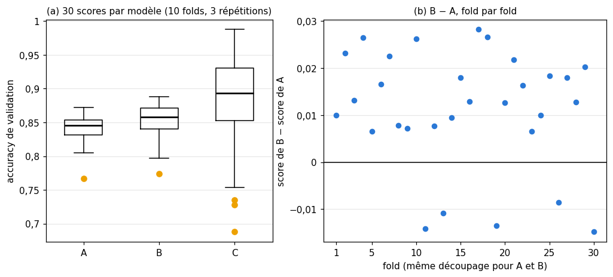

# 8 · Entraînement et test — quiz, rappels, exercices papier, réflexion et entretien

> Écris tes réponses dans **ta copie** `mon_travail/ch08_train_test/06_mes_reponses.md` (créée par `python tools/start_chapter.py 8`), jamais dans ce fichier : il est mis à jour par Claude.
> Les réponses courtes des **quiz** (sauf Q8), des **rappels** (sauf R3), des exercices ✏️ 8.1 à 8.5, de ∂ 8.6 et de la lecture de graphique 📈 8.8 se vérifient dans la **partie 0** du notebook (`wb.check`). Les questions marquées « dans ta copie », le quiz Q8, le rappel R3, la réflexion (🗣️ ⚖️ 📄) et l'entretien se corrigent avec `05_solutions.md`. Indices : `04_indices.md`. Calculatrice autorisée.
> Formats de réponse : un nombre (`0.25` ou `"0,25"`), `True` ou `False` pour un vrai ou faux, une lettre seule entre guillemets pour un choix (`"E"`), des lettres collées pour plusieurs choix (`"AC"`), une liste pour plusieurs nombres (`[2, 5]`).

**Sommaire** : [🧠 Quiz](#quiz) · [🔁 Rappels](#rappels) · [✏️ ∂ 📈 Papier-crayon](#papier) · [🗣️ ⚖️ 📄 Réflexion](#reflexion) · [💼 Entretien](#entretien) · [Exercices du notebook](#notebook)

Légende : ★ application directe · ★★ standard · ★★★ approfondi · ⏱️ durée indicative · parcours R = rapide, M = maths, C = code.

## 🧠 Quiz

Sans la fiche, en 3 minutes chacun. Réponds vite, vérifie les réponses courtes dans la partie 0 du notebook, puis lis les explications de `05_solutions.md`.

### 8.Q1 — La boucle d'entraînement : prédire, comparer, corriger 🧠 ⏱️ 3 min
*Fiche §8.1, §8.2 · livre §8.1, §8.2 · parcours R*

Un filtre anti-spam s'entraîne sur 2 000 e-mails labellisés, avec la boucle décrite par le livre.

a) Que fait-on quand la prédiction du modèle est **juste** ? (A) on met quand même à jour les paramètres, pour renforcer la bonne réponse ; (B) on passe à l'e-mail suivant sans rien changer ; (C) on retire l'e-mail du jeu d'entraînement ; (D) on arrête l'epoch.
b) De quoi l'algorithme de mise à jour (l'*updater* du livre) se sert-il pour corriger le modèle ? (A) du label seulement ; (B) du score sur le jeu de test ; (C) de la prédiction, du label et de l'état actuel du modèle ; (D) des features des autres e-mails.
c) Vrai ou faux : pendant l'évaluation sur le jeu de test, le modèle ne change pas, même quand il se trompe.
d) Les modèles modernes minimisent une loss. Pourquoi un e-mail bien classé peut-il quand même modifier les paramètres ? (dans ta copie)

### 8.Q2 — Epoch, ordre des exemples et fréquence des mises à jour 🧠 ⏱️ 3 min
*Fiche §8.2 · livre §8.2 · parcours R*

Le jeu d'entraînement compte 1 200 exemples.

a) Le modèle est mis à jour après chaque exemple, qu'il ait eu raison ou non. Combien de mises à jour en 5 epochs ?
b) On le met maintenant à jour une fois par mini-batch de 64 exemples ; le dernier mini-batch d'une epoch est plus petit. Combien de mises à jour par epoch ?
c) Vrai ou faux : au cours d'une epoch, chaque exemple est présenté exactement une fois.
d) Pourquoi mélange-t-on l'ordre des exemples d'une epoch à l'autre ? (A) pour que le modèle ne s'adapte pas à un ordre particulier, ni à une série d'exemples semblables qui se suivent ; (B) pour augmenter le nombre d'exemples ; (C) pour que l'accuracy de test change ; (D) parce que l'algorithme de mise à jour ne fonctionne qu'avec un ordre aléatoire.

### 8.Q3 — 99 % sur l'entraînement : que peut-on vraiment conclure ? 🧠 ⏱️ 3 min
*Fiche §8.2.1 · livre §8.2.1 · parcours R*

Un modèle atteint 99 % d'accuracy sur ses 1 000 photos d'entraînement.

a) Que peut-on en conclure ? (A) il fera environ 99 % une fois déployé ; (B) il a forcément appris des raccourcis ; (C) ce chiffre dit très peu de chose de ses performances sur des photos nouvelles ; (D) il faut l'entraîner encore pour atteindre 100 %.
b) Vrai ou faux : il existe une formule qui, appliquée au modèle entraîné, donne son accuracy sur des données nouvelles sans avoir à les lui montrer.
c) Selon le livre, comment estimer de façon fiable la performance sur des données nouvelles ? (A) en la mesurant sur des données que le modèle n'a jamais vues ; (B) en inspectant ses paramètres ; (C) en comptant ses paramètres ; (D) en recommençant l'entraînement avec une autre graine.

### 8.Q4 — Le renard et la neige : repérer un raccourci appris 🧠 ⏱️ 3 min
*Fiche §8.2.1 · livre §8.2.1 · parcours R*

Une application distingue les **renards** des **chats** sur des photos. Dans les données d'entraînement, toutes les photos de renards ont été prises en forêt, en hiver, sur fond de neige ; tous les chats, à l'intérieur d'une maison. Sur un jeu de test tiré du même lot de photos, l'accuracy atteint 98 %.

a) Quel raccourci le modèle a-t-il pu apprendre ? (A) la couleur du pelage ; (B) le décor (neige ou intérieur) ; (C) la forme des oreilles ; (D) la taille de l'animal sur la photo.
b) Vrai ou faux : un jeu de test tiré du même lot de photos suffit à révéler ce raccourci.
c) Laquelle de ces photos, ajoutée au test, révélerait le mieux le raccourci ? (A) un renard en forêt sous la neige ; (B) un chat dans un salon ; (C) un chat dehors, dans la neige ; (D) un deuxième renard en forêt.
d) Qu'aurait-il fallu faire en constituant le jeu de données ? (dans ta copie)

### 8.Q5 — La règle d'or du jeu de test 🧠 ⏱️ 3 min
*Fiche §8.3 · livre §8.3 · parcours R*

Vrai ou faux ?

a) On peut regarder l'accuracy de test pour choisir entre deux learning rates, du moment qu'on n'entraîne pas le modèle sur le test.
b) Le jeu de test sert une seule fois, à la fin, pour décider du déploiement.
c) Calculer la moyenne et l'écart-type d'une standardisation sur toutes les données, test compris, ne pose aucun problème, puisque le modèle n'apprend pas ces deux nombres.
d) Le jeu de test doit ressembler aux données que le modèle rencontrera une fois déployé.

### 8.Q6 — Fuite de données : ses formes courantes 🧠 ⏱️ 3 min
*Fiche §8.3 · livre §8.3 · parcours R*

(A) Supprimer les doublons exacts du dataset **avant** de le découper.
(B) Garder les 20 features les plus corrélées au label, calculées sur **toutes** les données, puis faire une validation croisée.
(C) Ajuster la standardisation sur le jeu d'entraînement, puis l'appliquer telle quelle au jeu de test.
(D) Découper au hasard un dataset de radiographies où chaque patient a plusieurs clichés.
(E) Utiliser la date de sortie de l'hôpital comme feature pour prédire, au moment de l'admission, la durée du séjour.

a) Lesquelles de ces pratiques créent une fuite de données ? Réponds par les lettres collées, dans l'ordre alphabétique (par exemple `"AC"`).
b) Pour chaque pratique qui crée une fuite, de quelle information le modèle profite-t-il, qu'il n'aurait pas au moment de prédire sur des données nouvelles ? (dans ta copie)

### 8.Q7 — Pourquoi un jeu de validation en plus du test ? 🧠 ⏱️ 3 min
*Fiche §8.4 · livre §8.4 · parcours R*

a) À quoi sert le jeu de validation ? (A) à avoir plus de données d'entraînement ; (B) à remplacer le test quand il est trop petit ; (C) à vérifier que le code tourne ; (D) à régler les hyperparamètres sans toucher au test, qui reste pour l'évaluation finale.
b) On découpe 500 exemples en 60 % / 20 % / 20 %. Pendant la recherche des hyperparamètres, sur combien d'exemples chaque réglage **apprend-il ses paramètres** ?
c) Vrai ou faux : pendant la recherche d'hyperparamètres, les paramètres du modèle ne sont jamais appris sur le jeu de validation.

### 8.Q8 — Le score de validation du modèle retenu est-il honnête ? 🧠 ⏱️ 4 min
*Fiche §8.4 · livre §8.4 · parcours R*

Une équipe essaie 40 réglages d'un modèle. Le meilleur obtient 91 % sur le jeu de validation, et l'équipe veut annoncer « 91 % d'accuracy » à ses clients. Explique en trois phrases au plus pourquoi ce chiffre est probablement trop optimiste, et ce qu'il faut faire à la place. (dans ta copie)

### 8.Q9 — Validation croisée : ce qu'on moyenne, et pourquoi 🧠 ⏱️ 3 min
*Fiche §8.5 · livre §8.5 · parcours R*

a) Que moyenne-t-on à la fin d'une validation croisée ? (A) les $k$ scores obtenus, chacun sur un fold de validation différent ; (B) les prédictions des $k$ modèles ; (C) les paramètres des $k$ modèles ; (D) les $k$ scores d'entraînement.
b) Vrai ou faux : à chaque tour, on repart d'un modèle neuf, qui n'a rien appris.
c) La validation croisée remplace : (A) le jeu de test ; (B) le jeu de validation ; (C) les deux ; (D) aucun des deux.

### 8.Q10 — k-fold : combien d'entraînements, quelle taille de fold ? 🧠 ⏱️ 3 min
*Fiche §8.5.1 · livre §8.5.1 · parcours R, M*

Il reste 1 003 exemples une fois le test mis de côté. On fait une validation croisée à $k = 5$ folds, avec la règle de la fiche (les premiers folds reçoivent un exemple de plus).

a) Combien d'entraînements faut-il pour évaluer **un** réglage ?
b) Combien d'exemples compte le plus grand fold ?
c) Combien de folds ont cette taille ?
d) Au dernier tour, le fold 5 sert de validation. Sur combien d'exemples le modèle s'entraîne-t-il ?
e) Avec le *leave-one-out* ($k$ = nombre d'exemples), combien d'entraînements pour évaluer un réglage ?

### 8.Q11 — Les deux usages des résultats de test 🧠 ⏱️ 3 min
*Fiche §8.6 · livre §8.6 · parcours R*

a) Le livre distingue deux usages des évaluations du chapitre. Lesquels ? Réponds par les deux lettres collées, dans l'ordre alphabétique. (A) estimer, avant le déploiement, la performance sur des données nouvelles, et la chiffrer pour la communiquer ; (B) corriger les labels erronés ; (C) entraîner le modèle sur ses erreurs de test ; (D) mesurer la vitesse d'exécution du modèle ; (E) choisir les hyperparamètres pendant l'entraînement.
b) Vrai ou faux : si le score de test est insuffisant et qu'on revient régler les hyperparamètres, le score qu'on obtiendra ensuite sur **ce même** jeu de test n'est plus une estimation tout à fait honnête.

## 🔁 Rappels

Des questions sur les chapitres précédents, pour ne pas oublier.

### 8.R1 — Ch. 7 : pourquoi l'inertie seule ne permet pas de choisir k 🔁 ★ ⏱️ 5 min
*Ch. 7 (§7.5) · parcours R*

On fait tourner k-means sur 200 points, pour plusieurs valeurs de $k$, et l'on garde chaque fois la meilleure inertie trouvée.

a) Que vaut l'inertie avec $k = 200$ (un cluster par point) ?
b) Vrai ou faux : la meilleure inertie possible ne peut que baisser, ou rester égale, quand $k$ augmente.
c) Quel critère du ch. 7 ne baisse pas mécaniquement quand $k$ augmente ? (A) l'inertie ; (B) le nombre d'itérations de Lloyd ; (C) la silhouette ; (D) la somme des distances au carré aux centres.
d) En quoi choisir $k$ d'après l'inertie ressemble-t-il à juger un modèle sur ses données d'entraînement ? (dans ta copie)

### 8.R2 — Ch. 5 : un pas de descente de gradient à la main 🔁 ★ ⏱️ 5 min
*Ch. 5 (§5.3, descente de gradient) · parcours R, M*

Un modèle à un seul paramètre $w$ prédit $\hat{y} = w\,x$. Sur un exemple $x = 2$, $y = 3$, la loss vaut $L(w) = (w\,x - y)^2$. On part de $w_0 = 0{,}5$ avec un learning rate $\eta = 0{,}05$. Donne chaque valeur avec 2 décimales au plus.

a) La loss $L(w_0)$.
b) La dérivée $L'(w_0) = 2x\,(w_0 x - y)$.
c) Le nouveau paramètre $w_1 = w_0 - \eta\,L'(w_0)$.
d) La loss $L(w_1)$.
e) Dans la boucle du §8.2, quel rôle joue ce calcul ? (dans ta copie)

### 8.R3 — Ch. 1 : généralisation, définition et exemple 🔁 ★ ⏱️ 5 min
*Ch. 1 (§1.2) · parcours R*

Définis la **généralisation** en une phrase, puis donne un exemple tiré des manchots (ch. 1) : un modèle qui généralise bien, et un qui généralise mal. Comment mesure-t-on la différence ? (dans ta copie)

## ✏️ ∂ 📈 Papier-crayon

Calculatrice autorisée. Écris la démarche dans ta copie de `06_mes_reponses.md`, puis reporte les résultats dans la partie 0 du notebook. Garde les valeurs exactes pendant tes calculs et **n'arrondis qu'à la fin**.

### Ex 8.1 — Découper 344 manchots : hold-out, validation et folds ✏️ ★ ⏱️ 15 min
**Objectif :** calculer les tailles des jeux produits par les découpages usuels, avec les règles d'arrondi de scikit-learn.
**Prérequis :** ch. 2 (proportions) · fiche §8.3, §8.4, §8.5.1 · **Parcours :** R, M

Le fichier brut des manchots compte 344 individus : 152 Adélie, 124 Gentoo et 68 Chinstrap. Règles (celles de la fiche) : $n_{\text{test}} = \lceil t \cdot n \rceil$ ; les $n \bmod k$ premiers folds reçoivent un exemple de plus.

a) Hold-out 75 / 25 : taille du jeu de test.
b) Taille du jeu d'entraînement correspondant.
On fait maintenant un découpage 60 / 20 / 20 en deux temps : d'abord le test, avec $t = 0{,}2$ ; puis la validation, prise dans ce qui reste, avec $t = 0{,}25$.
c) Taille du jeu de test.
d) Taille du jeu de validation.
e) Taille du jeu d'entraînement.
f) Une validation croisée à 5 folds remplace la validation : on l'applique aux manchots qui restent une fois le test (celui de c) mis de côté. Taille de chaque fold.
g) Sans jeu de test, une validation croisée à 10 folds sur les 344 manchots : combien de folds comptent 35 manchots ?
h) Dans cette validation croisée à 10 folds, sur combien de manchots s'entraîne le modèle au premier tour ?
i) Un découpage **stratifié** avec $t = 0{,}2$ répartit les manchots de test entre les espèces avec la règle du plus fort reste (fiche §8.3). Donne le nombre de manchots de test de chaque espèce, dans l'ordre Adélie, Chinstrap, Gentoo (une liste de trois entiers).
j) Pourquoi la proportion de Chinstrap dans le test d'un découpage **non** stratifié peut-elle s'éloigner de celle du dataset ? (dans ta copie)

### Ex 8.2 — Compter les entraînements d'une recherche d'hyperparamètres ✏️ ★ ⏱️ 10 min
**Objectif :** prévoir le coût en entraînements d'une recherche d'hyperparamètres selon le protocole de validation.
**Prérequis :** fiche §8.4, §8.5 (encadré sur la validation croisée imbriquée) · **Parcours :** M

On cherche le meilleur réglage d'un réseau parmi toutes les combinaisons de : learning rate dans $\{0{,}001 ;\ 0{,}01 ;\ 0{,}1\}$, taille de mini-batch dans $\{16, 32, 64, 128\}$, nombre de couches dans $\{1, 2\}$.

a) Combien de réglages différents faut-il essayer ?
b) Avec un jeu de validation unique, combien d'entraînements faut-il pour noter tous les réglages ?
c) Avec une validation croisée à 5 folds ?
d) On ajoute un réentraînement final du réglage retenu, sur toutes les données hors test. Nombre total d'entraînements avec la validation croisée à 5 folds ?
e) Chaque entraînement prend 4 minutes. Durée totale du protocole de d), en heures (1 décimale) ?
f) Validation croisée **imbriquée** : 5 folds extérieurs ; dans chaque tour extérieur, une validation croisée à 5 folds de chacun des réglages sur la partie d'entraînement, puis un réentraînement du réglage retenu sur toute cette partie (sa note sur le fold extérieur ne demande pas d'entraînement). Nombre total d'entraînements ?
g) Avec un budget de 200 entraînements, une validation croisée à 5 folds et le réentraînement final de d), combien de réglages, au plus, une recherche aléatoire peut-elle essayer ?

### Ex 8.3 — Fuite ou pas ? Six protocoles à auditer ✏️ ★★ ⏱️ 20 min
**Objectif :** reconnaître une fuite de données dans un protocole décrit en quelques lignes, et savoir la corriger.
**Prérequis :** fiche §8.3, §8.5 (données dépendantes) · **Parcours :** R, M

Pour chaque protocole, réponds `True` s'il contient une fuite de données, `False` sinon. Dans ta copie, nomme le type de fuite et propose une correction.

a) Une équipe prédit le prix d'appartements. Elle remplace les surfaces manquantes par la médiane calculée sur toutes les annonces, puis découpe les données en 80 / 20.
b) Un classifieur de chiffres manuscrits utilise les 60 000 images d'entraînement et les 10 000 images de test fournies séparément par les auteurs du dataset. La standardisation est ajustée sur les 60 000 images d'entraînement.
c) Un modèle de détection de fraude : l'équipe essaie 200 réglages, garde celui qui maximise le F1 sur le jeu de test, et publie ce F1.
d) Prévision des ventes mensuelles d'un magasin de 2015 à 2024 : les 120 mois sont répartis au hasard dans 5 folds de validation croisée.
e) Reconnaissance vocale : 300 locuteurs, 20 enregistrements chacun. Validation croisée avec `GroupKFold`, un groupe par locuteur.
f) Un modèle prédit si un client résiliera son abonnement le mois prochain. Parmi ses features : le nombre d'appels qu'il passera au service des résiliations le mois prochain.

### Ex 8.4 — Quelle confiance accorder à une accuracy de test ? Erreur type et taille du test ✏️ ★★ ⏱️ 20 min
**Objectif :** chiffrer l'incertitude d'une accuracy mesurée et dimensionner un jeu de test.
**Prérequis :** ch. 2 (loi de Bernoulli, intervalle de confiance) · ch. 3 (accuracy) · fiche §8.3 (encadré sur l'erreur type) · **Parcours :** M

Un modèle B obtient une accuracy de 0,92 sur un jeu de test de 250 exemples. On utilise $\mathrm{SE} = \sqrt{\hat{p}(1-\hat{p})/n}$ et l'intervalle à 95 % $\hat{p} \pm 1{,}96\,\mathrm{SE}$.

a) L'erreur type (4 décimales).
b) La demi-largeur de l'intervalle à 95 % (3 décimales).
c) La borne basse de l'intervalle (3 décimales).
d) Quel nombre minimal d'exemples de test faudrait-il pour une demi-largeur d'au plus 0,01, si l'accuracy reste voisine de 0,92 ?
e) Pour diviser la demi-largeur par 3, par combien faut-il multiplier la taille du test ?
f) Sur le même jeu de test, un modèle A obtient 0,90. Vrai ou faux : l'écart entre A et B dépasse la demi-largeur trouvée en b).
g) Quelle information te manque pour comparer A et B correctement ? (dans ta copie)

### Ex 8.5 — Moyenne et écart-type de scores de validation croisée ✏️ ★★ ⏱️ 15 min
**Objectif :** résumer des scores de validation croisée et comparer deux modèles fold par fold.
**Prérequis :** ch. 2 (moyenne, écart-type) · fiche §8.5.1 · **Parcours :** M

Deux modèles ont été évalués par validation croisée à 5 folds, **sur les mêmes folds** :

| fold | 1 | 2 | 3 | 4 | 5 |
|---|---|---|---|---|---|
| A | 0,82 | 0,88 | 0,79 | 0,85 | 0,86 |
| B | 0,85 | 0,84 | 0,86 | 0,85 | 0,83 |

L'écart-type se calcule avec la formule de la fiche (division par $k$).

a) La moyenne des scores de A (3 décimales).
b) L'écart-type des scores de A (3 décimales).
c) La moyenne des scores de B (3 décimales).
d) L'écart-type des scores de B (3 décimales).
e) Sur combien de folds B fait-il strictement mieux que A ?
f) La moyenne des différences B − A, fold par fold (3 décimales).
g) L'écart-type de ces différences (3 décimales).
h) Vrai ou faux : ces résultats montrent que B est meilleur que A.
i) Quel modèle choisirais-tu, et pourquoi ? (dans ta copie)

### Ex 8.6 — Le biais d'optimisme du meilleur de K modèles ∂ ★★★ ⏱️ 30 min
**Objectif :** démontrer et chiffrer pourquoi le meilleur score de validation surestime la performance du réglage retenu.
**Prérequis :** ch. 3 (accuracy) · Ex 8.2 · fiche §8.4 (encadré sur la loi du maximum) · **Parcours :** M

On compare $K$ réglages qui ont **tous** la même accuracy réelle $p = 0{,}80$, sur un jeu de validation de $n = 100$ exemples. On note $S_j$ l'accuracy de validation du réglage $j$, et l'on suppose les $S_j$ indépendants et de même loi.

1. (dans ta copie) Montre que $P\big(\max_j S_j < s\big) = P(S_1 < s)^K$, puis que $P\big(\max_j S_j \ge s\big) = 1 - \big(1 - P(S_1 \ge s)\big)^K$.
2. (dans ta copie) Montre, sans calcul de loi, que l'espérance de $\max(S_1, \dots, S_{K+1})$ est au moins égale à celle de $\max(S_1, \dots, S_K)$.

On admet que $P(S_1 \ge 0{,}86) \approx 0{,}0668$ (approximation normale de la loi de $S_1$).

a) L'erreur type d'une accuracy de validation, $\sqrt{p(1-p)/n}$ (2 décimales).
b) Avec $K = 10$ réglages, la probabilité que le meilleur score de validation atteigne au moins 0,86 (3 décimales).
c) Même question avec $K = 50$ (3 décimales).
d) Le plus petit $K$ pour lequel cette probabilité atteint au moins 0,9.
e) Vrai ou faux : si l'on évalue le réglage retenu sur un jeu de test neuf de 100 exemples, son accuracy attendue est 0,80.
3. (dans ta copie) En pratique, les $S_j$ ne sont pas indépendants. Pourquoi ? L'optimisme du meilleur score disparaît-il pour autant ?

### Ex 8.8 — Comparer des modèles à partir de boîtes à moustaches de scores 📈 ★★ ⏱️ 15 min
**Objectif :** lire des boîtes à moustaches de scores de validation croisée et voir ce qu'apporte une comparaison fold par fold.
**Prérequis :** Ex 8.5 · ch. 2 (médiane, quartiles) · fiche §8.5.1, §8.6 · **Parcours :** M

Trois modèles A, B et C ont été évalués par une validation croisée à 10 folds répétée 3 fois, soit 30 scores chacun, **sur les mêmes folds**. Le panneau (a) montre les boîtes à moustaches des trois séries de scores (la moustache s'arrête au dernier score situé à moins de 1,5 fois l'écart interquartile de la boîte ; au-delà, chaque score est un point isolé). Le panneau (b) montre, pour chacun des 30 folds, la différence entre le score de B et celui de A.

a) Quel modèle a la médiane la plus haute ? (une lettre)
b) Quel modèle a les scores les plus dispersés ? (une lettre)
c) Combien de points isolés compte la boîte de A ?
d) Sur combien des 30 folds A fait-il mieux que B ?
e) Vrai ou faux : les boîtes de A et de B se chevauchent largement, et pourtant B fait mieux que A sur la plupart des folds.
f) Vrai ou faux : C est le choix le plus sûr pour un déploiement où une mauvaise journée coûte cher.
g) Pourquoi le panneau (b) en dit-il plus que le panneau (a) sur la comparaison de A et B ? Que représente probablement le point isolé de A ? (dans ta copie)

## 🗣️ ⚖️ 📄 Réflexion

### Ex 8.7 — Pourquoi le jeu de test reste sous clé : l'analogie de l'examen 🗣️ ★ ⏱️ 10 min
**Objectif :** expliquer à un débutant pourquoi on ne regarde le jeu de test qu'une seule fois.
**Prérequis :** fiche §8.3 · livre §8.3 · **Parcours :** R

Une amie qui découvre le machine learning te demande : « Pourquoi ne pas utiliser toutes les données pour entraîner, et regarder le score de test aussi souvent qu'on veut ? » Réponds-lui en **cinq lignes au plus**, avec l'analogie de l'examen. Contraintes :
- les mots « nouveau », « mémoriser » et « une seule fois » ;
- un exemple de la vie courante autre que l'examen pour la règle « ne pas choisir sur le test » ;
- aucune formule.

Relis-toi à voix haute, puis compare avec la réponse modèle de `05_solutions.md`.

### Ex 8.9 — Raccourcis appris : radiographies, chars d'assaut et responsabilité ⚖️ ★★ ⏱️ 25 min
**Objectif :** analyser un cas réel d'apprentissage de raccourcis, et se demander qui doit vérifier quoi avant le déploiement d'un modèle.
**Prérequis :** fiche §8.2.1 (encadré 🕰️), §8.3 · **Parcours :** R

En 2018, J. Zech et ses collègues ont entraîné des réseaux de neurones à détecter la pneumonie sur des radiographies du thorax venant de plusieurs systèmes hospitaliers. Leurs réseaux savaient reconnaître **l'hôpital** d'origine d'une radiographie dans plus de 99,9 % des cas. Un modèle entraîné sur deux systèmes hospitaliers obtenait une AUC de 0,931 sur des radiographies de ces mêmes systèmes, mais de 0,815 sur celles d'un troisième, jamais vu ([Zech et coll., *PLOS Medicine*, 2018](https://journals.plos.org/plosmedicine/article?id=10.1371/journal.pmed.1002683)). En 2021, A. DeGrave, J. Janizek et S.-I. Lee ont montré que des modèles de détection du COVID-19 sur radiographies s'appuyaient sur des indices sans rapport avec la maladie (des marqueurs posés sur le cliché, les bords de l'image) : ils semblaient précis, mais échouaient dans de nouveaux hôpitaux ([DeGrave et coll., *Nature Machine Intelligence*, 2021](https://www.nature.com/articles/s42256-021-00338-7)).

1. Explique comment « reconnaître l'hôpital » peut aider à « détecter la pneumonie » dans les données d'entraînement. Quelle information sur les hôpitaux rend ce raccourci rentable ?
2. Pourquoi un jeu de test tiré des mêmes hôpitaux n'a-t-il pas révélé le problème ? Quel type de fuite de la fiche est-ce ?
3. Propose un protocole d'évaluation qui l'aurait révélé avant le déploiement.
4. L'histoire du détecteur de chars est probablement une légende (encadré 🕰️ de la fiche). Pourquoi continue-t-on de la raconter, et pourquoi vaut-il mieux citer, en entretien ou dans un rapport, un cas documenté comme ceux-ci ?
5. Un hôpital achète un modèle de détection « validé à 93 % d'AUC ». Qui doit vérifier qu'il fonctionne sur **ses** patients : l'entreprise qui l'a entraîné, l'hôpital, les médecins, une autorité ? Quelles informations la documentation du modèle (sa « fiche modèle ») devrait-elle donner pour qu'on puisse en juger ?

### Ex 8.10 — Kapoor & Narayanan (2023) : une taxonomie des fuites 📄 ★★ ⏱️ 30 min
**Objectif :** lire un article de recherche sur les fuites de données et relier sa taxonomie aux cas du chapitre.
**Prérequis :** Ex 8.3 · fiche §8.3 (encadré 🕰️ sur la taxonomie) · **Parcours :** aucun (lecture conseillée à tous)

Lis le résumé, l'introduction et la section qui présente la taxonomie de S. Kapoor et A. Narayanan, « Leakage and the reproducibility crisis in machine-learning-based science », *Patterns* 4 (9), 2023 ([lien DOI](https://doi.org/10.1016/j.patter.2023.100804) : la revue est en accès libre ; prends cette version publiée, dont les chiffres diffèrent de ceux de la première version déposée sur arXiv en 2022). Réponds dans ta copie.

1. Quelles sont les trois grandes familles de fuites de la taxonomie ? Pour chacune, donne un exemple pris dans ce chapitre (fiche, quiz Q6 ou exercice 8.3).
2. Dans quelle catégorie ranges-tu chacun des six protocoles de l'exercice 8.3 qui contiennent une fuite ?
3. Que sont les « fiches d'information sur le modèle » (*model info sheets*) proposées par les auteurs ? Combien de questions contiennent-elles, et à quoi servent-elles ?
4. Résume en trois phrases leur étude de cas sur la prédiction des guerres civiles : qu'affirmaient les articles fautifs, et que reste-t-il de leur conclusion une fois les fuites corrigées ?
5. Les auteurs parlent d'une « crise de reproductibilité ». Pourquoi une fuite dans un article scientifique est-elle plus grave qu'un score trop beau dans un projet d'entreprise, ou l'est-elle moins ?

## 💼 Entretien

Réponds **à voix haute**, en une minute, comme face à un recruteur ; puis compare avec la « réponse modèle en 60 secondes » de `05_solutions.md`.

### 8.E1 — Pourquoi trois jeux : entraînement, validation et test ? 💼 ★★ ⏱️ 10 min
*Fiche §8.3, §8.4 · prérequis 8.18 · parcours R*

« Pourquoi découpe-t-on les données en trois jeux, et pas seulement en deux ? Que se passe-t-il si l'on règle les hyperparamètres sur le jeu de test ? »

### 8.E2 — Qu'est-ce qu'une p-valeur ? Comment savoir si le modèle B bat vraiment le modèle A ? 💼 ★★ ⏱️ 10 min
*Fiche §8.6 · prérequis 8.26 · parcours R*

« Votre nouveau modèle B obtient 91,2 % d'accuracy, contre 90,5 % pour le modèle A en production, sur le même jeu de test de 2 000 exemples. Peut-on dire que B est meilleur ? Qu'est-ce qu'une p-valeur, et comment l'obtiendriez-vous ici ? »

### 8.E3 — Validation croisée ou simple hold-out : quand choisir quoi ? 💼 ★★ ⏱️ 10 min
*Fiche §8.5 · prérequis 8.23 · parcours R*

« Quand utilisez-vous une validation croisée, et quand un simple découpage entraînement / validation suffit-il ? Et en deep learning ? »

### 8.E4 — 99 % en test, échec en production : vos hypothèses 💼 ★★ ⏱️ 10 min
*Fiche §8.2.1, §8.3, §8.6 · parcours R*

« Votre modèle obtenait 99 % sur le jeu de test, et il déçoit en production. Quelles hypothèses examinez-vous, et dans quel ordre ? »

### 8.E5 — Stratifier un découpage : quand et pourquoi ? 💼 ★★ ⏱️ 10 min
*Fiche §8.3, §8.5.1 · prérequis 8.21 · parcours R*

« Qu'est-ce qu'un découpage stratifié ? Quand est-il indispensable, et dans quels cas ne suffit-il pas ? »

## Exercices du notebook

Les exercices suivants se font dans `03_notebook.ipynb` (ta copie : `mon_travail/ch08_train_test/03_notebook.ipynb`) ; ceux marqués 🔨 et accompagnés de « mylearn » complètent ta librairie `mylearn/model_selection.py`. La partie 0 du notebook vérifie tes réponses courtes aux quiz, aux rappels et aux exercices ✏️, ∂ et 📈 ci-dessus.

| ID | Titre | Type | ★ | ⏱️ |
|---|---|---|---|---|
| 8.11 | train_test_split de scikit-learn : tailles, stratify, random_state | 📦 | ★ | 10 |
| 8.12 | Le modèle qui apprend par cœur : accuracy d'entraînement et de test | 🔮 | ★ | 15 |
| 8.13 | train_test_split from scratch | 🔨 | ★★ | 30 |
| 8.14 | Les indices de la k-fold : kfold_indices | 🔨 | ★★ | 25 |
| 8.15 | Reproduire la figure 8.13 : la rotation des folds | 🎨 | ★★ | 20 |
| 8.16 | Un estimateur maison à la scikit-learn : PolyFit(degree) | 🔨 | ★★ | 25 |
| 8.17 | Validation ou test : lequel sera le plus optimiste ? | 🔮 | ★★ | 15 |
| 8.18 | Boucle de sélection sur un jeu de validation : le degré du polynôme | 🔨 | ★★ | 30 |
| 8.19 | Données dépendantes : GroupKFold et TimeSeriesSplit | 📦 | ★★ | 25 |
| 8.20 | Écrire tes propres tests pytest pour train_test_split | 🛠️ | ★★ | 25 |
| 8.21 | k-fold stratifiée : stratified_kfold_indices | 🔨 | ★★★ | 40 |
| 8.22 | clone et cross_val_score | 🔨 | ★★★ | 45 |
| 8.23 | Variabilité de l'évaluation : hold-out répétés contre k-fold | 🔬 | ★★★ | 40 |
| 8.24 | Un notebook trop beau pour être vrai : quatre fuites à corriger | 🐛 | ★★★ | 35 |
| 8.25 | Sélectionner des features avant la validation croisée : 90 % sur du bruit | 🔬 | ★★★ | 40 |
| 8.26 | Comparer deux modèles honnêtement : test par permutation, p-valeur et bootstrap apparié | 🔬 | ★★★ | 40 |
| 8.27 | Défi : la meilleure paire de features, choisie sans toucher au test | 🏆 | ★★★ | 60 |
