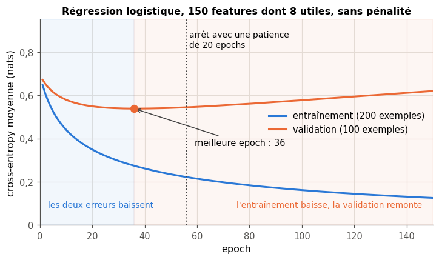
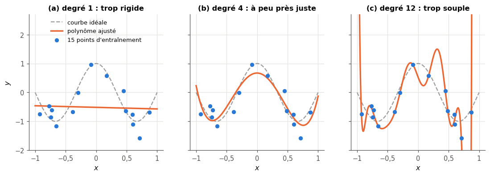
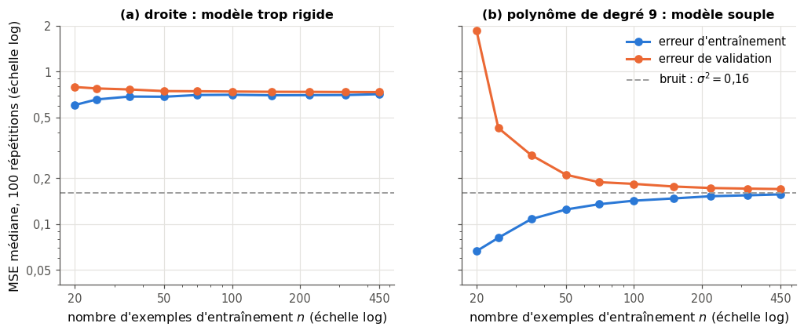
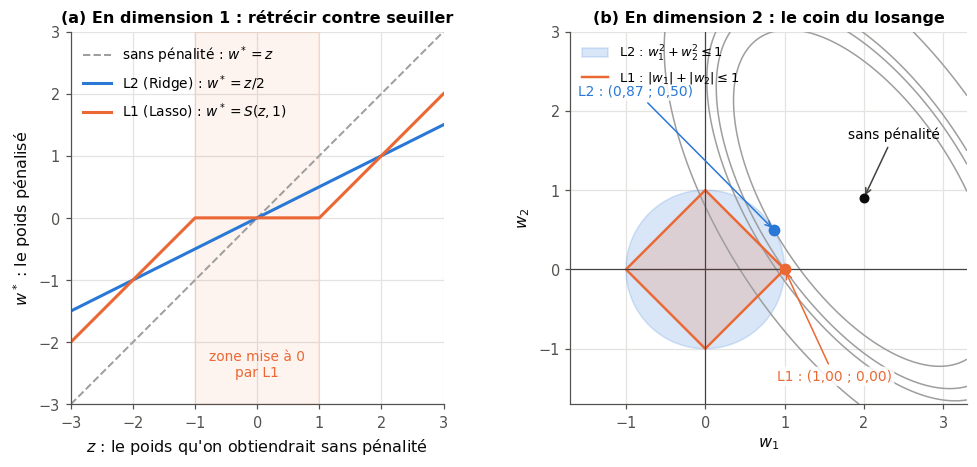
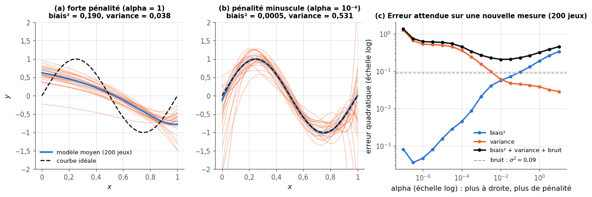
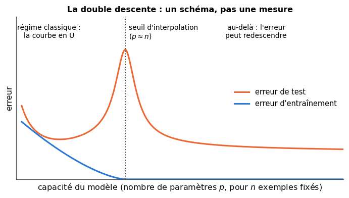
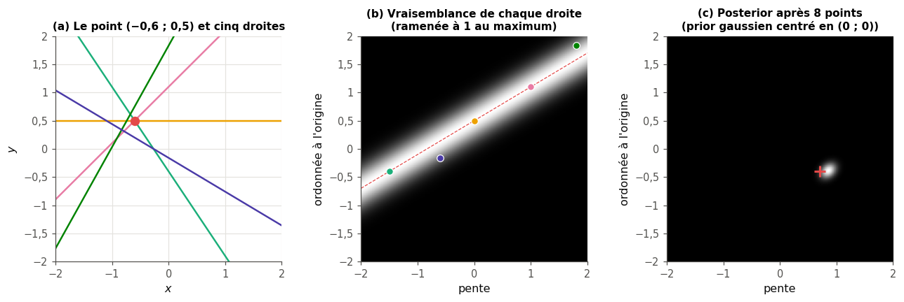

# 9 · Surapprentissage et sous-apprentissage — fiche de cours

> Cette fiche accompagne le chapitre 9 du livre, qui traite des deux façons de mal généraliser. Le livre raconte ces deux échecs, l'**underfitting** (*sous-apprentissage*) et l'**overfitting** (*surapprentissage*), montre comment les repérer sur les courbes d'erreur, présente deux parades, l'**early stopping** (*arrêt anticipé*) et la **régularisation** (*regularization*), relit tout cela en termes de **biais** et de **variance**, puis ajuste une droite à la manière bayésienne. Il le fait sans une seule formule. La fiche ajoute les outils que tu utiliseras au travail : les mesures d'erreur d'une régression, les moindres carrés, les pénalités L2 (Ridge) et L1 (Lasso) avec leurs formules, la décomposition de l'erreur en biais² + variance + bruit, les courbes d'apprentissage (*learning curves*) et la double descente (*double descent*), qui nuance le compromis biais-variance (*bias-variance trade-off*). Le mariage, la musique de la boutique et le vent au sommet de la montagne du livre ne sont que résumés ici : chaque section te dit où les lire.

| | |
|---|---|
| **Livre** | vol. 1, ch. 9 « Overfitting and Underfitting », p. 338-373 (§9.1 à §9.7) |
| **Temps total estimé** | ≈ 21 h : lecture du livre et de la fiche ≈ 2,8 h, exercices ≈ 17 h, 25 flashcards ≈ 0,8 h |
| **Prérequis** | 0A (classes Python, `itertools`) · 0B (dérivées partielles, minimum d'une fonction, produit matriciel, transposée, inverse, valeur absolue) · ch. 2 (moyenne, variance et ddof, z-score, loi normale, bootstrap) · ch. 4 (règle de Bayes, le posterior qui devient le prior suivant, log-probabilités) · ch. 5 (descente de gradient) · ch. 6 (cross-entropy) · ch. 8 (entraînement, validation et test, `cross_val_score`, fuites, coefficient $R^2$, `PolyFit`) |
| **Fichiers du chapitre** | `02_exercices.md` (quiz, rappels, papier, réflexion, entretien) · `03_notebook.ipynb` · `04_indices.md` · `05_solutions.md` et `05_solutions.ipynb` · `06_mes_reponses.md` · `flashcards.csv` |
| **mylearn** | `linear.py` : `mean_squared_error`, `mean_absolute_error` et `r2_score` (9.14), `polynomial_features` (9.15), `LinearRegression` (9.16), `Ridge` (9.17), `soft_threshold` et `Lasso` (9.23), `bias_variance_decomposition` (9.24), `bayes_line_posterior` (9.26). Le ch. 12 réutilise Ridge, le ch. 14 la décomposition biais-variance |

## Comment utiliser ce chapitre

Le livre avance en six temps : les deux échecs (§9.1 et §9.2), leurs symptômes sur des courbes (§9.3), l'early stopping (§9.4), la régularisation (§9.5), le biais et la variance d'une famille de courbes (§9.6) et l'ajustement bayésien d'une droite (§9.7). Ses 36 pages, illustrées de vingt figures, se lisent vite, mais il n'y a aucune formule : la fiche les apporte dans neuf encadrés 🧮 : les mesures d'erreur d'une régression, les features polynomiales, les moindres carrés, Ridge, Lasso et le seuillage doux, le biais et la variance (d'un estimateur, puis d'une famille de modèles), la décomposition biais² + variance + bruit, la solution de norme minimale, et le posterior d'une droite.

**Ordre conseillé.**
1. Lis le livre §9.1, §9.2 et le début du §9.3 (la boutique, p. 344-347), puis les sections 9.1 et 9.2 de la fiche. Fais les quiz Q1 à Q3, le rappel R2 et l'exercice papier 9.1. Dans le notebook, fais 📦 9.12 et 🔮 9.13 tout de suite, avant la section 9.3 de la fiche : le 🔮 te fait prédire ce que la suite explique.
2. Lis le livre §9.3 et la section 9.3 de la fiche. Fais les quiz Q4 et Q5, le rappel R1, l'exercice ∂ 9.2 et le cas ⚖️ 9.10.
3. Lis le livre §9.4 et la section 9.4 de la fiche. Fais le quiz Q6, l'exercice 9.5 et la lecture de graphique 📈 9.9.
4. Lis le livre §9.5 et la section 9.5 de la fiche. Fais les quiz Q7 et Q8, puis ∂ 9.3 et ∂ 9.6.
5. Lis le livre §9.6 (et ses quatre sous-sections), puis la section 9.6 de la fiche, double descente comprise. Fais les quiz Q9 et Q10, le rappel R3, l'exercice 9.4, l'oral 🗣️ 9.8 et la lecture 📄 9.11.
6. Lis le livre §9.7 et la section 9.7 de la fiche. Fais le quiz Q11 et l'exercice 9.7. Vérifie tes réponses courtes dans la partie 0 du notebook.
7. Fais le reste du notebook dans l'ordre : la fin de la partie A (9.14 à 9.17 : mesures d'erreur, features polynomiales, moindres carrés, Ridge ; 9.12 et 9.13 sont faits), partie B (9.18 à 9.23 : courbes de validation, chemins de régularisation, early stopping, courbes d'apprentissage, Lasso), partie C (9.24 à 9.27 : biais et variance mesurés, droites bayésiennes), partie D (9.28 à 9.31 : bugs de régularisation, refactorisation, double descente et défi). Finis par les cinq questions d'entretien.

| Section | Quiz 🧠 et rappels 🔁 | Papier ✏️ ∂ et réflexion | Notebook | Entretien 💼 |
|---|---|---|---|---|
| 9.1 et 9.2 Overfitting et underfitting | Q1, Q2, Q3, R2 | 9.1 | 9.12, 9.13, 9.14, 9.21 | E2 |
| 9.3 Reconnaître l'overfitting | Q4, Q5, R1 | 9.2, 9.9, 9.10 | 9.15, 9.16, 9.18, 9.20, 9.21 | E4 |
| 9.4 L'early stopping | Q6 | 9.5, 9.9 | 9.20 | E4 |
| 9.5 La régularisation | Q7, Q8 | 9.3, 9.6 | 9.17, 9.18, 9.19, 9.22, 9.23, 9.28, 9.31 | E3 |
| 9.6 Biais et variance | Q9, Q10, R3 | 9.4, 9.8, 9.11 | 9.24, 9.25, 9.29, 9.30 | E1, E5 |
| 9.7 Une droite par la règle de Bayes | Q11 | 9.7 | 9.26, 9.27 | |

**Lire les formules.** $n$ est le nombre d'exemples et $p$ le nombre de features ; $\mathbf{X}$ est la matrice des données ($n$ lignes, $p$ colonnes), $\mathbf{x}_i$ sa ligne $i$, $\mathbf{y}$ le vecteur des cibles et $\hat{y}_i$ la prédiction pour l'exemple $i$. Un modèle linéaire a des **poids** $\mathbf{w}$ (un par feature) et une **ordonnée à l'origine** $b$ (*intercept*) : $\hat{y}_i = \mathbf{x}_i \cdot \mathbf{w} + b$. $\lVert \mathbf{w} \rVert^2 = \sum_j w_j^2$ est la norme L2 au carré, $\lVert \mathbf{w} \rVert_1 = \sum_j |w_j|$ la norme L1. $f$ désigne la courbe idéale, sans bruit, qu'on cherche à retrouver ; $\hat{f}$ un modèle ajusté sur un jeu de données ; $\bar{f}$ le modèle moyen sur beaucoup de jeux ; $\sigma$ l'écart-type du bruit. Le livre note $\lambda$ (lambda) la force de la régularisation ; scikit-learn et `mylearn` l'appellent `alpha` : c'est le même réglage, avec des conventions d'échelle à surveiller (section 9.5).

## Objectifs d'apprentissage

À la fin du chapitre, tu sais :
- **diagnostiquer** l'underfitting et l'overfitting à partir des courbes d'entraînement, de validation et d'apprentissage, et choisir le remède qui convient ;
- **dériver** à la main les moindres carrés, Ridge et Lasso en dimension 1, et **expliquer** pourquoi la pénalité L1 met des poids exactement à zéro ;
- **implémenter** `LinearRegression`, `Ridge`, `Lasso` et `polynomial_features`, et les **vérifier** contre scikit-learn ;
- **appliquer** l'early stopping avec une patience, et **choisir** la force de la régularisation par validation croisée ;
- **mesurer** le biais² et la variance d'une famille de modèles par simulation, et les relier à la complexité ;
- **ajuster** une droite par mises à jour bayésiennes successives sur une grille pente-ordonnée ;
- **expliquer** la double descente et ce qu'elle change, ou non, au compromis biais-variance.

## L'essentiel en 10 lignes

1. Un modèle fait de l'**underfitting** quand il n'a pas assez appris des données d'entraînement : il se trompe autant sur elles que sur des données nouvelles, et beaucoup. Il fait de l'**overfitting** quand il a appris aussi les détails du hasard de son échantillon : excellent sur l'entraînement, il se trompe nettement plus sur des données nouvelles.
2. On les distingue en comparant l'erreur d'entraînement et l'erreur de **validation**, qui estime l'erreur sur des données nouvelles (ch. 8) : deux erreurs hautes et proches signalent l'underfitting ; une erreur d'entraînement basse et un **écart** qui se creuse, l'overfitting.
3. Au fil de l'entraînement, l'erreur d'entraînement baisse presque toujours ; l'erreur de validation baisse, plafonne, puis remonte quand l'overfitting commence. L'**early stopping** s'arrête au bon moment : il recharge les poids de la dernière amélioration de la validation (ceux de la meilleure epoch avec `min_delta` = 0, le réglage par défaut), avec une **patience** pour ne pas réagir au bruit.
4. La **capacité** (*capacity*) d'un modèle, sa souplesse, se règle par sa forme (le degré d'un polynôme, le nombre de features, la taille d'un réseau) et par la **régularisation**.
5. Régulariser, c'est ajouter une préférence pour les modèles simples : la plus courante pénalise la taille des poids. La pénalité **L2** (Ridge) rétrécit les poids dans leur ensemble, en général sans les annuler ; la pénalité **L1** (Lasso) en met beaucoup **exactement à zéro**. Leur force $\lambda$ est un hyperparamètre, choisi par validation.
6. Le **biais** et la **variance** décrivent une **famille** de modèles entraînés sur des jeux de données différents : le biais mesure l'écart entre le modèle moyen et la vraie courbe, la variance la dispersion des modèles autour de leur moyenne.
7. L'erreur **quadratique** attendue sur une donnée nouvelle se décompose exactement en **biais² + variance + bruit** ; le bruit est un plancher qu'aucun modèle ne franchit.
8. Augmenter la capacité fait en général baisser le biais et monter la variance : c'est le **compromis biais-variance**, et sa courbe en U. Mais ce n'est pas une loi : plus de données fait baisser la variance sans faire monter le biais, et la **double descente** montre que l'erreur peut redescendre au-delà du point où le modèle passe par tous les points d'entraînement.
9. Les remèdes ne sont pas les mêmes : contre l'overfitting, plus de données, plus de régularisation, un modèle plus simple, l'early stopping ; contre l'underfitting, plus de capacité, de meilleures features, moins de régularisation, un entraînement plus long. Plus de données ne soigne pas l'underfitting.
10. Le point de vue **bayésien** ne cherche pas une seule droite : il donne une probabilité à chaque droite candidate, et chaque nouveau point resserre cette distribution (le posterior devient le prior suivant, comme au ch. 4).

## 9.1 · Pourquoi ce chapitre ?

Un modèle n'apprend que de son échantillon, mais on le juge sur les cas qui viendront ensuite. Deux échecs le guettent : n'avoir pas retenu assez de la structure des données, c'est l'**underfitting** (*sous-apprentissage*) ; avoir retenu, en plus de la structure, les accidents propres à cet échantillon-là, c'est l'**overfitting** (*surapprentissage*). Le livre juge le second plus fréquent et plus gênant (p. 339), et lui consacre l'essentiel du chapitre.

Ce chapitre est le pivot de la partie II : il donne le vocabulaire (biais, variance, capacité, régularisation) et les gestes (courbes d'erreur, early stopping, choix de $\lambda$ par validation croisée) que tous les chapitres suivants supposent. Tu y construis aussi la première vraie famille de modèles de `mylearn` : la régression linéaire et ses deux versions pénalisées.

## 9.2 · Overfitting et underfitting ⏩

Trois erreurs se distinguent, à ne jamais confondre :
- l'**erreur d'entraînement** (*training error*, ou *training loss*), mesurée sur les exemples qui ont servi à apprendre ;
- l'**erreur de généralisation** (*generalization error*), celle que le modèle fera en moyenne sur des données nouvelles de la même source ; c'est elle qui compte, et on ne la connaît jamais exactement ;
- l'**erreur de validation**, mesurée sur un jeu que le modèle n'a pas vu (ch. 8) : une **estimation** de l'erreur de généralisation, d'autant meilleure que le jeu de validation ressemble aux données futures et qu'il est grand.

Le livre parle aussi d'*accuracy* d'entraînement et de généralisation : c'est le même découpage, vu du côté des bonnes réponses. La différence entre l'erreur de validation et l'erreur d'entraînement s'appelle l'**écart de généralisation** (*generalization gap*).

| Symptôme | Erreur d'entraînement | Erreur de validation | Écart | Diagnostic |
|---|---|---|---|---|
| le modèle ne capte même pas les exemples | haute | haute, proche | petit | underfitting |
| le modèle colle aux exemples | basse | nettement plus haute | grand, il se creuse | overfitting |
| le modèle a appris l'essentiel | basse | un peu plus haute | petit | bon compromis |

*Mini-exemple.* Un classifieur de chiffres manuscrits se trompe sur 1 % de ses images d'entraînement et sur 14 % des images de validation : l'écart de 13 points signale de l'overfitting. Un autre se trompe sur 20 % et 21 % : l'écart est faible, mais un humain fait moins de 1 % d'erreurs sur ces images. Le niveau, pas l'écart, signale ici l'underfitting. Pour juger le niveau, il faut une **référence** : l'erreur d'un humain, d'un modèle simple, ou le bruit des mesures.

> 🧮 **Rappel maths — mesurer l'erreur d'une régression** — Pour une cible numérique, on compare les prédictions $\hat{y}_i$ aux cibles $y_i$ par leurs **résidus** $y_i - \hat{y}_i$ :
> $$\mathrm{MSE} = \frac{1}{n}\sum_{i=1}^{n} (y_i - \hat{y}_i)^2, \qquad \mathrm{RMSE} = \sqrt{\mathrm{MSE}}, \qquad \mathrm{MAE} = \frac{1}{n}\sum_{i=1}^{n} |y_i - \hat{y}_i|, \qquad R^2 = 1 - \frac{\sum_i (y_i - \hat{y}_i)^2}{\sum_i (y_i - \bar{y})^2}.$$
> La **MSE** (*mean squared error*, erreur quadratique moyenne) est la loss des moindres carrés ; elle s'exprime dans l'unité de la cible **au carré**. La **RMSE** revient à l'unité de la cible. La **MAE** (*mean absolute error*, erreur absolue moyenne) est aussi dans l'unité de la cible, mais elle ne met pas les grosses erreurs au carré : quelques **points aberrants** (*outliers*, section 9.3) pèsent beaucoup moins sur elle que sur la MSE. Entre les deux, la **loss de Huber** (*Huber loss*) est quadratique pour les petits résidus, comme la MSE, et linéaire au-delà d'un seuil $\delta$, comme la MAE : elle reste peu sensible aux points aberrants (`sklearn.linear_model.HuberRegressor`, `torch.nn.HuberLoss`). Le $R^2$ (ch. 8) compare l'erreur du modèle à celle de la moyenne $\bar{y}$ : 1 est parfait, 0 ne fait pas mieux que la moyenne, et il devient négatif quand le modèle fait pire. *Mini-exemple.* Cibles 1, 4, 6 et prédictions 2, 4, 3 : résidus −1, 0 et 3, donc MSE $= 10/3 \approx 3{,}33$, RMSE $\approx 1{,}83$, MAE $= 4/3 \approx 1{,}33$ ; avec $\bar{y} = 11/3$, $\sum_i (y_i - \bar{y})^2 = 38/3$ et $R^2 = 1 - 10/(38/3) \approx 0{,}21$. Le résidu de 3 fournit 9 des 10 unités de la somme des carrés, mais seulement 3 des 4 unités de la somme des valeurs absolues. Dans `mylearn`, ce sont les trois fonctions de 9.14 ; dans scikit-learn, `sklearn.metrics.mean_squared_error`, `mean_absolute_error` et `r2_score`. Et pour une classification, la loss la plus courante est la cross-entropy du ch. 6.

### 9.2.1 · L'overfitting : apprendre le hasard de l'échantillon

Le livre raconte un mariage où l'on retient le prénom de chaque invité grâce à un seul détail de son apparence, et où ce détail trompe dès qu'un autre invité le partage (§9.2.1, p. 340-341). Le mécanisme est général : une règle qui s'appuie sur une particularité de l'échantillon (un détail qui, **par hasard**, suffit à reconnaître les exemples) réussit à l'entraînement et échoue ailleurs. Au ch. 8, c'était le décor des photos (les raccourcis appris) ; l'hôpital d'origine d'une radiographie en est un cousin plus tenace : une corrélation due à la collecte, que plus de données du même genre ne fait pas disparaître. *Mini-exemple.* Dans un jeu d'entraînement de 40 maisons, les trois maisons dont le numéro de rue finit par 7 se trouvent être les plus chères ; un modèle assez souple pour s'en servir obtient une erreur d'entraînement plus basse, et surestimera le prix des maisons nouvelles dont le numéro finit par 7.

Le livre annonce ses deux parades pour la suite : régulariser (§9.5) et arrêter l'entraînement à temps (§9.4). Il en existe une troisième, la plus efficace quand elle est possible : **plus de données**. Avec 4 000 maisons au lieu de 40, la coïncidence des numéros en 7 disparaît d'elle-même.

### 9.2.2 · L'underfitting ⏩

En face, l'underfitting : le modèle passe à côté d'une partie de la structure des données. Une droite pour une relation en cloche, un modèle à trois features quand il en faudrait dix, une régularisation trop forte, un réseau arrêté après deux epochs : le modèle se trompe dès l'entraînement.

> ⚠️ **« Plus de données soigne l'underfitting » : non** — Au §9.2.2, le livre affirme qu'on peut souvent guérir l'underfitting simplement avec plus de données d'entraînement. C'est l'inverse de ce qu'on observe : un modèle trop rigide reste trop rigide avec dix fois plus d'exemples. Ses erreurs d'entraînement et de validation se rejoignent vite et plafonnent haut (panneau (a) de la figure `apprentissage.png`, plus bas). Plus de données réduit surtout la **variance**, donc l'overfitting (panneau (b)). Contre l'underfitting, il faut plus de **capacité** : un modèle plus souple, de meilleures features, moins de régularisation, un entraînement plus long.

| | Contre l'overfitting | Contre l'underfitting |
|---|---|---|
| données | plus d'exemples, augmentation de données | de meilleures features (pas forcément plus d'exemples) |
| modèle | plus simple : moins de features, degré plus bas, réseau plus petit | plus souple : plus de features, degré plus haut, réseau plus grand |
| régularisation | plus forte ($\lambda$ plus grand), dropout | plus faible |
| entraînement | early stopping | plus long, learning rate mieux réglé |

> 💼 **En entreprise** — L'ordre des actions compte. Commence par vérifier les données et le protocole (une fuite fait croire à un modèle excellent, un label faux à un modèle médiocre), puis compare l'erreur d'entraînement à une référence pour savoir si tu sous-apprends, et seulement ensuite l'écart avec la validation pour savoir si tu surapprends. Collecter des données coûte cher : avant d'en demander, trace une courbe d'apprentissage (section 9.3) pour vérifier qu'elles aideraient.

## 9.3 · Reconnaître l'overfitting ⏩

### Les courbes d'erreur au fil de l'entraînement

La figure 9.1 du livre (p. 343) montre des courbes d'erreur idéalisées. La figure ci-dessous montre la même chose sur une vraie expérience : une régression logistique (un classifieur linéaire qui sort une probabilité, au programme du ch. 13) sur 200 exemples de 150 features, dont 8 seulement portent le signal, entraînée sans pénalité par descente de gradient sur des mini-batches.



Avec 150 poids à régler et 200 exemples seulement, le modèle finit par trouver des combinaisons de features qui « expliquent » les labels d'entraînement par hasard. Sa cross-entropy d'entraînement continue de baisser (il devient de plus en plus sûr de lui sur ces exemples) pendant que celle de validation remonte : il est aussi de plus en plus sûr de lui quand il se trompe sur les autres.

> ⚠️ **« Le score de validation est l'erreur de généralisation » : c'en est une estimation** — Au début du §9.3, le livre identifie les deux ; juste après la figure 9.1, il précise qu'on ne fait que l'**estimer** avec le jeu de validation. L'estimation est bruitée (l'erreur type du ch. 8), et elle devient optimiste dès qu'on s'en sert pour choisir (le biais d'optimisme du ch. 8). D'où le jeu de test, gardé pour la fin.

### Ajuster une courbe : complexité et capacité

Le livre illustre l'overfitting par une boutique dont la propriétaire règle le tempo de la musique au fil de la journée (§9.3, p. 344-347, figures 9.2 à 9.5) : une courbe qui suit chaque réglage d'un jour ferait varier le tempo sans raison le lendemain, une courbe trop douce manque les grands mouvements de la journée, et une courbe intermédiaire convient. Ajuster une courbe à des points, c'est faire une **régression** : prédire un nombre $y$ à partir d'une entrée $x$. La figure ci-dessous le fait sur 15 points bruités d'un cosinus, avec trois polynômes.



Le degré 1 ne peut pas suivre la forme en cloche : c'est l'underfitting. Le degré 12 passe tout près de chaque point, mais ses oscillations entre les points et ses envolées aux bords n'ont rien à voir avec la courbe idéale : c'est l'overfitting. La **capacité** d'un modèle mesure la variété des formes qu'il peut prendre ; pour un polynôme, elle croît avec le degré. On contrôle la capacité de deux façons : en changeant la **forme** du modèle (le degré, le nombre de features), ou en le **régularisant** (section 9.5). Choisir le bon degré, c'est choisir un hyperparamètre : on le fait sur la validation (ch. 8).

> 🧮 **Rappel maths — les features polynomiales** — Un modèle linéaire devient polynomial si on lui donne pour features les **puissances** de $x$ : avec les colonnes $x, x^2, \dots, x^d$, la prédiction $w_1 x + w_2 x^2 + \dots + w_d x^d + b$ est un polynôme de degré $d$, mais elle reste **linéaire en ses poids**, et les mêmes moindres carrés s'appliquent. Avec plusieurs features, on ajoute tous les **monômes** de degré total au plus $d$, produits croisés compris (les **interactions**). *Mini-exemple.* Pour deux features $(u, v) = (3 ;\ 0{,}5)$ et $d = 2$ : les colonnes $u, v, u^2, uv, v^2$ valent 3 ; 0,5 ; 9 ; 1,5 ; 0,25. Le nombre de colonnes explose : avec $p$ features et le degré $d$, il y a $\binom{p+d}{d} - 1$ monômes (sans la constante) : 9 pour $p = 3$ et $d = 2$, mais 285 pour $p = 10$ et $d = 3$. Deux précautions : les puissances élevées ont des ordres de grandeur très différents (avec $x = 10$, $x^{12} = 10^{12}$), ce qui rend le calcul instable et la pénalité injuste entre colonnes : on **standardise** les colonnes (z-score du ch. 2, calculé sur l'entraînement seul) ; et un polynôme de haut degré s'emballe aux bords de l'intervalle des données, là où peu de points le retiennent. Dans scikit-learn, c'est `PolynomialFeatures` (qui ajoute par défaut une colonne de 1 : `include_bias=False` pour l'éviter) ; dans `mylearn`, `polynomial_features` (9.15), qui produit les colonnes dans le même ordre, sans colonne de 1 par défaut.

### Les moindres carrés (au-delà du livre)

Le livre ne dit pas comment il ajuste les courbes du tempo ; plus loin (figure 9.10), il nomme seulement la régression Ridge, sans formule. La méthode standard est celle des **moindres carrés** (*least squares*) : parmi tous les poids possibles, choisir ceux qui rendent la somme des carrés des résidus la plus petite possible.

> 🧮 **Rappel maths — les moindres carrés et les équations normales** — Pour une droite $\hat{y} = a\,x + b$, on minimise $L(a, b) = \sum_i (y_i - a\,x_i - b)^2$. C'est une fonction de deux variables dont le minimum annule les deux dérivées partielles (0B), ce qui donne (∂ 9.2)
> $$a = \frac{\sum_i (x_i - \bar{x})(y_i - \bar{y})}{\sum_i (x_i - \bar{x})^2}, \qquad b = \bar{y} - a\,\bar{x}.$$
> La droite passe donc par le point moyen $(\bar{x}, \bar{y})$. *Mini-exemple.* Les points (0 ; 1), (1 ; 2) et (2 ; 4) : $\bar{x} = 1$, $\bar{y} = 7/3$, $a = 3/2 = 1{,}5$ et $b = 7/3 - 1{,}5 = 5/6 \approx 0{,}83$. Avec $p$ features, on range les données dans la matrice $\mathbf{X}$ et l'on minimise $\lVert \mathbf{y} - \mathbf{X}\mathbf{w} \rVert^2$ ; le minimum vérifie les **équations normales** $\mathbf{X}^\top\mathbf{X}\,\mathbf{w} = \mathbf{X}^\top\mathbf{y}$. Pour l'ordonnée à l'origine, la façon la plus propre est de **centrer** : retirer à chaque colonne de $\mathbf{X}$ sa moyenne et à $\mathbf{y}$ la sienne, résoudre sur les données centrées, puis retrouver $b = \bar{y} - \bar{\mathbf{x}} \cdot \mathbf{w}$ (c'est ce que font scikit-learn et ta `LinearRegression`, 9.16). En pratique, on ne calcule jamais $(\mathbf{X}^\top\mathbf{X})^{-1}$ : `np.linalg.lstsq(X, y)` résout le problème directement, de façon plus stable (former $\mathbf{X}^\top\mathbf{X}$ élève au carré le **conditionnement** du problème, c'est-à-dire sa sensibilité aux arrondis). Et quand des colonnes sont redondantes (deux features identiques, ou plus de features que d'exemples), il existe une infinité de solutions : `lstsq` rend celle dont les poids ont la plus petite norme (encadré de la section 9.6.4), là où `np.linalg.solve` sur les équations normales échoue le plus souvent (`LinAlgError` quand deux colonnes sont identiques) ou, pire, rend sans prévenir une autre solution, de plus grande norme (les arrondis font paraître la matrice inversible : c'est le cas habituel avec plus de features que d'exemples, et cela arrive même avec deux colonnes identiques).

### Le point isolé

La figure 9.6 du livre (p. 347) montre un rond isolé chez les carrés, et une frontière qui se contorsionne pour le classer juste. Erreur de saisie ou cas rare, un tel **point aberrant** (*outlier*) pèse peu face à ses nombreux voisins : pour un nouveau point tombé à côté de lui, « carré » reste le meilleur pari, et la frontière simple généralisera en général mieux, quitte à se tromper sur ce point d'entraînement. Le garder, le corriger ou l'écarter est une autre décision, qui se documente (⚖️ 9.10). Une loss robuste (en régression, la MAE ou la loss de Huber plutôt que la MSE) ou la régularisation limitent son influence sans le faire disparaître des données.

### Courbes de validation et courbes d'apprentissage (au-delà du livre)

Deux graphiques résument le diagnostic, et tu les traceras dans le notebook :
- la **courbe de validation** (*validation curve*) : l'erreur d'entraînement et celle de validation en fonction d'un hyperparamètre de capacité (le degré, $\lambda$, la profondeur d'un arbre), à données fixées. L'entraînement s'améliore avec la capacité ; la validation dessine en général un U, dont le creux indique le bon réglage (🔬 9.18) ;
- la **courbe d'apprentissage** (*learning curve*) : les mêmes deux erreurs en fonction du **nombre d'exemples d'entraînement**, à modèle fixé (📦 9.21). Elle dit si collecter plus de données vaut la peine.



Lis la figure ainsi. À gauche, une droite pour une relation courbe : avec 20 exemples comme avec 450, les deux erreurs restent proches l'une de l'autre et loin au-dessus du bruit ($\sigma^2 = 0{,}16$). C'est la signature de l'underfitting, et plus de données n'y change rien. À droite, un polynôme de degré 9 : avec peu d'exemples, l'écart est énorme (overfitting) ; il se referme quand $n$ grandit, et les deux courbes convergent vers le bruit. Pour ce modèle, plus de données aide beaucoup. (Les erreurs sont des **médianes** sur 100 tirages : avec 20 points, un polynôme de degré 9 s'emballe parfois aux bords, et quelques erreurs gigantesques écraseraient une moyenne.) Dans scikit-learn, `learning_curve` et `validation_curve` (module `model_selection`) font les calculs avec une validation croisée, et `LearningCurveDisplay` (depuis la version 1.2) et `ValidationCurveDisplay` (depuis la 1.3) les dessinent.

## 9.4 · L'early stopping ⏩

Reprends la figure de la section 9.3 : jusque vers l'epoch 36, les deux cross-entropies baissent ; ensuite, seule celle d'entraînement continue de baisser, et chaque epoch de plus n'ajoute que de l'overfitting. Garder le modèle du creux de la validation plutôt que celui de la dernière epoch, c'est l'**early stopping** (*arrêt anticipé* ; le livre suggère aussi « arrêt raisonnable », *sensible stopping*).

Mesurée sur quelques centaines d'exemples, la loss de validation fluctue d'une epoch à l'autre, d'autant plus que le jeu de validation est petit ou que les mini-batches sont bruités : une hausse isolée n'est souvent qu'un écart du hasard, et s'arrêter à la première serait souvent trop tôt. La règle usuelle ajoute une **patience** : on s'arrête quand la validation ne s'est pas améliorée depuis `patience` epochs, et l'on **revient aux poids de la dernière amélioration** (ceux de la meilleure epoch quand `min_delta`, la baisse minimale qui compte comme une amélioration, vaut 0, sa valeur par défaut). En pseudo-code :

```text
meilleure ← +∞ ; attente ← 0
pour epoch = 1, 2, 3, … :
    entraîner le modèle une epoch
    v ← loss de validation
    si v < meilleure − min_delta :             # une vraie amélioration
        meilleure ← v ; copier les poids ; attente ← 0
    sinon :
        attente ← attente + 1
        si attente = patience : sortir de la boucle
recharger la copie des poids                   # ceux de la dernière amélioration
```

*Mini-exemple.* Losses de validation des epochs 1 à 8 : 0,48 ; 0,41 ; 0,39 ; 0,40 ; 0,38 ; 0,39 ; 0,40 ; 0,41, avec une patience de 2 et `min_delta` = 0. La meilleure valeur passe à 0,39 (epoch 3), l'epoch 4 ne l'améliore pas (attente 1), l'epoch 5 descend à 0,38 (nouvelle meilleure, attente 0), les epochs 6 et 7 ne l'améliorent pas (attente 2) : on s'arrête à la fin de l'epoch 7 et l'on recharge les poids de l'epoch 5. Avec une patience de 1, on se serait arrêté à l'epoch 4 en gardant l'epoch 3, et l'on aurait manqué le minimum. Le réglage `min_delta` exige que la validation baisse de plus de cette quantité pour compter comme une amélioration. Par rapport à `min_delta` = 0, l'arrêt ne vient jamais plus tard ; mais une baisse trop petite ne met à jour ni la meilleure valeur ni la copie des poids, si bien que les poids gardés ne sont plus forcément ceux de la plus petite loss (exercice 9.5).

Trois remarques. (1) La patience est un hyperparamètre, et le nombre d'epochs retenu aussi : tous deux se règlent sur la **validation**, jamais sur le test (ch. 8). (2) L'early stopping est une forme de régularisation : un modèle arrêté tôt a en général des poids plus petits qu'il ne les aurait eus en continuant. Pour une régression linéaire entraînée par descente de gradient à partir de poids nuls, on montre même qu'arrêter tôt a un effet voisin de la pénalité L2 de la section 9.5 (I. Goodfellow, Y. Bengio et A. Courville, *Deep Learning*, 2016, §7.8). (3) Le livre annonce que l'early stopping est facile à mettre en place avec les bibliothèques des ch. 23 et 24 ; c'est encore plus vrai aujourd'hui.

> 🕰️ **Mise à jour (2026) — l'early stopping en pratique** — **Le livre :** renvoie aux ch. 23 et 24 (Keras), et parle d'outils qui lissent les erreurs pour repérer une vraie remontée. · **Aujourd'hui :** la patience est le mécanisme standard. En PyTorch pur, on écrit la boucle ci-dessus soi-même (ch. 23) ; PyTorch Lightning fournit `EarlyStopping(monitor="val_loss", patience=3, min_delta=0.0, mode="min")`, qui **ne restaure pas** les meilleurs poids (on les retrouve avec un `ModelCheckpoint`) ; dans Keras, `EarlyStopping` a une patience de 0 par défaut et `restore_best_weights=False` : sans cette option, le modèle garde les poids de la **dernière** epoch, pas ceux de la meilleure. Dans scikit-learn 1.6, `MLPClassifier`, `MLPRegressor` et `SGDClassifier` proposent `early_stopping=True` (ils mettent alors de côté `validation_fraction=0.1` de l'entraînement, avec `n_iter_no_change` comme patience), et `HistGradientBoostingClassifier` l'active d'office (`early_stopping="auto"`) dès que l'entraînement dépasse 10 000 exemples ; LightGBM et XGBoost arrêtent l'ajout d'arbres quand la validation ne progresse plus (`lightgbm.early_stopping(stopping_rounds)`, attribut `best_iteration`). · **Faut-il quand même l'apprendre ?** Oui : c'est la même règle partout, et il faut savoir quels poids on garde à la fin. · *Sources :* [Keras, `EarlyStopping`](https://keras.io/api/callbacks/early_stopping/) ; [PyTorch Lightning, code source d'`EarlyStopping`](https://github.com/Lightning-AI/pytorch-lightning/blob/master/src/lightning/pytorch/callbacks/early_stopping.py) ; [scikit-learn 1.6, `HistGradientBoostingRegressor`](https://scikit-learn.org/1.6/modules/generated/sklearn.ensemble.HistGradientBoostingRegressor.html) et [`MLPClassifier`](https://scikit-learn.org/1.6/modules/generated/sklearn.neural_network.MLPClassifier.html) ; [LightGBM, `early_stopping`](https://lightgbm.readthedocs.io/en/latest/pythonapi/lightgbm.early_stopping.html).

## 9.5 · La régularisation ⏩

Une loss d'entraînement ne distingue pas une régularité durable d'une coïncidence de l'échantillon : en la minimisant, l'optimiseur exploite les deux. Pour l'orienter, on lui impose une **préférence** choisie d'avance pour certaines solutions (un *a priori* au sens du ch. 4 ; la section 9.7 rend ce lien exact) : c'est la **régularisation** (*regularization*). On peut l'inscrire dans l'objectif lui-même, par une pénalité, ou dans la façon d'entraîner (l'early stopping de la section 9.4, le dropout, l'augmentation de données). La pénalité la plus répandue préfère les **petits poids** : on ajoute à la loss un terme qui grandit avec leur taille,
$$\text{loss régularisée} = \text{loss sur les données} + \lambda \times \text{pénalité}(\mathbf{w}).$$

Le livre justifie ce choix avec son invité à la moustache (§9.5, p. 350-351) : une règle où une seule feature écrase toutes les autres se laisse piéger par cette feature ; de petits poids forcent le modèle à tenir compte de plusieurs indices à la fois. Pour un polynôme, de petits coefficients donnent une courbe moins tourmentée : la régularisation est un **bouton de capacité** continu, là où le degré est un bouton à crans.

La **force** $\lambda$ de la régularisation est un **hyperparamètre** : on ne l'apprend pas avec les poids (la loss d'entraînement serait toujours la plus basse pour $\lambda = 0$), on la choisit par validation, le plus souvent sur une grille logarithmique (0,001 ; 0,01 ; 0,1 ; 1 ; 10…) et par validation croisée (ch. 8). Plus $\lambda$ est grand, plus la pénalité pèse : la taille des poids, mesurée par la pénalité elle-même, baisse, l'erreur d'entraînement monte, la courbe se lisse.

> ⚠️ **Deux confusions du §9.5** — (1) Le livre écrit que chaque paramètre du classifieur a un poids associé, qui règle son importance. En machine learning, les poids **sont** les paramètres appris ; ce sont les **features** (les caractéristiques de l'entrée) qui reçoivent chacune un poids. (2) Il présente la régularisation comme le moyen d'empêcher qu'un poids, ou un petit groupe de poids, ne domine les autres. C'est l'esprit de la pénalité L2, qui répartit l'importance entre features corrélées. La pénalité L1, tout aussi classique, fait l'inverse : elle **concentre** le modèle sur un petit nombre de features et met les autres exactement à zéro. Les deux régularisent ; ce qui les réunit, c'est la préférence pour des modèles « simples », pas l'interdiction qu'un poids domine les autres.

### La pénalité L2 : Ridge

La **régression Ridge** (A. Hoerl et R. Kennard, 1970) ajoute aux moindres carrés la somme des carrés des poids. Le livre en montre une dans ses figures du §9.6 (*Ridge regression* avec $\lambda = 10^{-7}$, figure 9.10).

> 🧮 **Rappel maths — Ridge en forme fermée** — On minimise $\lVert \mathbf{y} - \mathbf{X}\mathbf{w} - b\,\mathbf{1} \rVert^2 + \alpha \lVert \mathbf{w} \rVert^2$, où $\mathbf{1}$ est le vecteur de 1 (c'est la convention de scikit-learn et de `mylearn` : une **somme** de carrés, sans division par $n$ ; `alpha` est le $\lambda$ du livre). L'ordonnée à l'origine n'est **pas** pénalisée : la pénaliser ferait dépendre le modèle de l'origine choisie pour la cible (si l'on décalait tous les prix de 1 000 €, les prédictions ne se décaleraient plus de 1 000 €, et, sans centrage, les poids changeraient aussi ; des prédictions en degrés Fahrenheit ne seraient plus la simple conversion de celles en degrés Celsius). On centre donc les données, et le minimum vérifie
> $$\big(\mathbf{X}_c^\top \mathbf{X}_c + \alpha\,\mathbf{I}\big)\,\mathbf{w} = \mathbf{X}_c^\top \mathbf{y}_c, \qquad b = \bar{y} - \bar{\mathbf{x}} \cdot \mathbf{w},$$
> où $\mathbf{X}_c$ et $\mathbf{y}_c$ sont les données centrées et $\mathbf{I}$ la matrice identité. Ajouter $\alpha$ sur la diagonale rend le système toujours résoluble dès que $\alpha > 0$, même avec des features redondantes ou plus de features que d'exemples. En dimension 1 et sans ordonnée à l'origine, la solution est $w^* = \frac{\sum_i x_i y_i}{\sum_i x_i^2 + \lambda}$ (∂ 9.3, avec $\lambda = \alpha$). *Mini-exemple.* Si $\sum_i x_i y_i = 6$ et $\sum_i x_i^2 = 4$, les moindres carrés donnent $w = 1{,}5$ ; avec $\lambda = 2$, Ridge donne $w^* = 6/6 = 1$. Le poids rétrécit d'un facteur constant, mais ne s'annule jamais tant que $\sum_i x_i y_i \neq 0$. Deux précautions : la pénalité traite toutes les features de la même façon, donc elles doivent être sur la **même échelle** (standardise-les avec la moyenne et l'écart-type de l'entraînement seul, sinon c'est une fuite, ch. 8) ; et l'on résout le système avec `np.linalg.solve`, sans jamais calculer l'inverse. C'est ta classe `Ridge` (9.17).

### La pénalité L1 : Lasso et les zéros exacts

Le **Lasso** (R. Tibshirani, 1996) pénalise la somme des **valeurs absolues** des poids. La différence paraît mince ; elle change tout : beaucoup de poids deviennent **exactement nuls**, et le modèle est **parcimonieux** (*sparse*). Le Lasso fait donc en même temps une régression et une **sélection de features**.

> 🧮 **Rappel maths — Lasso, seuillage doux et descente de coordonnées** — scikit-learn et `mylearn` minimisent
> $$\frac{1}{2n}\,\lVert \mathbf{y} - \mathbf{X}\mathbf{w} - b\,\mathbf{1} \rVert^2 + \alpha\,\lVert \mathbf{w} \rVert_1 .$$
> Attention : ici la somme des carrés est divisée par $2n$, contrairement à Ridge. Un même `alpha` n'a donc pas du tout la même force dans `Ridge` et dans `Lasso`. En dimension 1, minimiser $\frac{1}{2}(w - z)^2 + \gamma\,|w|$, où $z$ est le poids qu'on aurait sans pénalité, donne le **seuillage doux** (*soft thresholding*) :
> $$S(z, \gamma) = \operatorname{signe}(z)\,\max\big(|z| - \gamma,\ 0\big).$$
> La valeur absolue n'est pas dérivable en 0, d'où l'étude par cas (0B, ∂ 9.6) : si $|z| \leq \gamma$, le minimum est exactement en 0 ; sinon, $z$ se rapproche de 0 de $\gamma$. *Mini-exemple.* $S(1{,}8 ;\ 0{,}5) = 1{,}3$ et $S(-0{,}3 ;\ 0{,}5) = 0$. Avec plusieurs features, il n'y a pas de formule close ; la **descente de coordonnées** (*coordinate descent*) règle les poids un par un, les autres étant fixés, et recommence jusqu'à ce que plus rien ne bouge :
> ```text
> centrer X et y ; w ← 0 ; résidu r ← y                  # r = y − X w, tenu à jour
> répéter (au plus max_iter passes) :
>     pour chaque feature j :
>         ρ_j ← x_jᵀ (r + x_j w_j) / n                   # x_j face au résidu calculé sans la feature j
>         z_j ← x_jᵀ x_j / n
>         nouveau ← S(ρ_j, α) / z_j                       # 0 si la colonne j est nulle
>         r ← r − x_j (nouveau − w_j) ; w_j ← nouveau
>     s'arrêter si le plus grand changement d'un poids pendant la passe est < tol
> b ← moyenne(y) − moyenne(X) · w
> ```
> Si $\alpha \geq \max_j |\mathbf{x}_{c,j}^\top \mathbf{y}_c| / n$, tous les poids restent nuls dès la première passe. C'est ta classe `Lasso` (9.23) ; scikit-learn utilise le même algorithme (J. Friedman, T. Hastie et R. Tibshirani, 2010), avec un critère d'arrêt plus fin (l'écart de dualité). Le mélange des deux pénalités s'appelle **Elastic Net** (`ElasticNet` dans scikit-learn).



Le panneau (a) montre le poids pénalisé en fonction du poids $z$ qu'on aurait sans pénalité : L2 le **rétrécit** dans une proportion fixe (ici de moitié), sans jamais l'annuler ; L1 le **seuille** : tout $z$ entre −1 et 1 donne exactement 0, les autres sont décalés de 1. Le panneau (b) donne l'image géométrique classique. Minimiser la loss sous la contrainte « $\lVert \mathbf{w} \rVert^2 \leq 1$ » ou « $\lVert \mathbf{w} \rVert_1 \leq 1$ » revient à minimiser loss + pénalité pour un certain $\lambda$. Les ellipses grises sont des lignes de niveau de la loss, autour de la solution sans pénalité. La plus petite ellipse qui touche le disque L2 le touche en un point quelconque de son bord : les deux poids sont non nuls. Celle qui touche le losange L1 le touche souvent en un **coin**, sur un axe : un poids est exactement nul.

### Pénalité sur les poids, dropout, batchnorm

Le livre annonce deux techniques propres aux réseaux de neurones. Le **dropout** (N. Srivastava et coll., 2014) éteint au hasard, à chaque pas d'entraînement, une fraction des neurones ; le réseau ne peut plus compter sur un neurone en particulier et doit répartir l'information (ch. 20). La **batchnorm** (*batch normalization*, S. Ioffe et C. Szegedy, 2015) renormalise les sorties d'une couche sur chaque mini-batch (ch. 20).

> ⚠️ **La batchnorm n'a pas été conçue pour régulariser** — Le livre range le dropout et la batchnorm parmi les techniques conçues pour empêcher un élément du réseau de dominer les autres. C'est juste pour le dropout. La batchnorm a été proposée pour **accélérer et stabiliser l'entraînement** (ses auteurs voulaient réduire le *décalage interne des covariables*, la dérive des entrées de chaque couche quand les couches précédentes changent) ; ils notent ensuite qu'elle agit aussi comme un régularisateur, au point de rendre parfois le dropout inutile. Ce sont deux effets différents : on ne remplace pas une pénalité sur les poids par une batchnorm sans le vérifier sur la validation. Et l'explication par le décalage des covariables a elle-même été contestée : S. Santurkar et coll. (2018) attribuent le gain surtout à une loss plus lisse, donc plus facile à optimiser.

> 🕰️ **Mise à jour (2026) — la régularisation des réseaux** — **Le livre :** cite la pénalité sur la taille des poids, le dropout et la batchnorm. · **Aujourd'hui :** avec les optimiseurs adaptatifs comme Adam (ch. 19), ajouter $\lambda \lVert \mathbf{w} \rVert^2$ à la loss n'équivaut plus à « rétrécir les poids à chaque pas » ; I. Loshchilov et F. Hutter (ICLR 2019) ont proposé de **découpler** de la loss ce rétrécissement, le **weight decay** (*décroissance des poids*) : d'où **AdamW**, l'optimiseur par défaut de la plupart des grands modèles (`torch.optim.AdamW`, `weight_decay=0.01` par défaut dans PyTorch 2.11, alors qu'`Adam` a `weight_decay=0` ; `Adam(..., decoupled_weight_decay=True)` équivaut à AdamW). Des concurrents apparaissent, comme **Muon** (`torch.optim.Muon` dans PyTorch 2.11), dont une variante, MuonClip, a servi à entraîner Kimi K2 (2025). S'y ajoutent l'**augmentation de données** (des copies transformées des exemples : rotations, recadrages, bruit), le **label smoothing** (*lissage des étiquettes* : viser un peu moins que 1 pour la bonne classe, environ 0,9 avec `nn.CrossEntropyLoss(label_smoothing=0.1)`) et, dans les Transformers, la **LayerNorm**, qui normalise chaque exemple séparément, plutôt que la batchnorm. · **Faut-il quand même l'apprendre ?** Oui : la pénalité L2 est la base de tout cela ; les détails viennent aux ch. 19 et 20. · *Sources :* [I. Loshchilov et F. Hutter, « Decoupled Weight Decay Regularization », ICLR 2019](https://arxiv.org/abs/1711.05101) ; [S. Ioffe et C. Szegedy, « Batch Normalization », 2015](https://arxiv.org/abs/1502.03167) ; [S. Santurkar et coll., « How Does Batch Normalization Help Optimization? », NeurIPS 2018](https://proceedings.neurips.cc/paper/2018/hash/905056c1ac1dad141560467e0a99e1cf-Abstract.html) ; [Kimi Team, « Kimi K2: Open Agentic Intelligence », 2025](https://arxiv.org/abs/2507.20534) ; signatures de `torch.optim.AdamW`, `torch.optim.Adam`, `torch.optim.Muon` et `torch.nn.CrossEntropyLoss` relues dans PyTorch 2.11.

> 💼 **En entreprise** — Dans scikit-learn, le nom et le sens du bouton changent d'un modèle à l'autre : `alpha` pour `Ridge`, `Lasso`, `ElasticNet` et `MLPClassifier` (plus grand = plus de régularisation), mais `C` pour `LogisticRegression` et `SVC`, qui joue le rôle de $1/\lambda$ à un facteur près (`LogisticRegression` minimise la somme des losses $+ \frac{1}{2C}\lVert \mathbf{w} \rVert^2$) : plus grand = **moins** de régularisation. Lis toujours la documentation avant de balayer une grille, et balaie-la en échelle logarithmique.

## 9.6 · Biais et variance ⏩

Le livre relit l'underfitting et l'overfitting avec deux mots de la statistique, en reprenant les définitions de P. Domingos (*The Master Algorithm*, 2015) : avoir du **biais**, c'est se tromper de la même façon quel que soit l'échantillon ; avoir de la **variance**, c'est se laisser influencer par des détails qui changent d'un échantillon à l'autre. Pour les rendre précis, il faut un cadre : une courbe idéale, du bruit, et beaucoup de jeux de données.

> ⚠️ **Le ch. 2 du livre ne parle pas de biais** — Le livre affirme deux fois (§9.1 et §9.6) avoir présenté le biais et la variance au ch. 2, et y renvoie encore au §9.6.4 pour dire qu'ils varient en sens inverse. Son ch. 2 définit bien la variance de données, mais jamais le biais, et ne dit rien de leur lien. Le ch. 2 du workbook a rencontré le biais une fois, à propos de la division par $n - 1$. L'encadré ci-dessous part de là.

> 🧮 **Rappel maths — biais et variance, d'un estimateur à une famille de modèles** — Un **estimateur** est une formule qui calcule, à partir d'un échantillon, une valeur censée approcher une grandeur inconnue $\theta$ ; comme l'échantillon est aléatoire, l'estimation $\hat{\theta}$ l'est aussi. Son **biais** est $\mathbb{E}[\hat{\theta}] - \theta$ (l'erreur systématique, en moyenne sur les échantillons possibles), sa **variance** $\mathbb{E}\big[(\hat{\theta} - \mathbb{E}[\hat{\theta}])^2\big]$ (sa dispersion d'un échantillon à l'autre). Au ch. 2, la variance divisée par $n$ sous-estime en moyenne celle de la population : elle a un biais négatif, que la division par $n - 1$ annule. Pour un modèle, l'« estimation » est toute une courbe. On imagine beaucoup de jeux d'entraînement $D$ tirés de la même source, avec $y = f(x) + \varepsilon$, un bruit $\varepsilon$ de moyenne 0 et de variance $\sigma^2$. Chaque jeu donne un modèle $\hat{f}_D$, et leur moyenne $\bar{f}(x) = \mathbb{E}_D[\hat{f}_D(x)]$ est le **modèle moyen**. En un point $x$ :
> $$\text{biais}^2(x) = \big(\bar{f}(x) - f(x)\big)^2, \qquad \text{variance}(x) = \mathbb{E}_D\Big[\big(\hat{f}_D(x) - \bar{f}(x)\big)^2\Big].$$
> Le biais compare le modèle **moyen** à la **courbe idéale** ; la variance compare les modèles **entre eux**. *Mini-exemple.* Trois modèles, entraînés sur trois jeux, prédisent 1, 2 et 4 en un point où $f(x) = 2$ : le modèle moyen vaut $7/3$, le biais² $(7/3 - 2)^2 = 1/9 \approx 0{,}11$, la variance $\frac{(4/3)^2 + (1/3)^2 + (5/3)^2}{3} = 14/9 \approx 1{,}56$. Ne confonds pas ce biais avec le biais d'un neurone (le nombre ajouté à sa somme pondérée, ch. 10), ni avec le « biais » d'une pièce (ch. 4), qui est sa probabilité de tomber sur face ($\theta$) : trois sens pour un même mot.

> 🧮 **Rappel maths — la décomposition biais² + variance + bruit** — Pour une nouvelle mesure $y = f(x) + \varepsilon$, le bruit étant indépendant du jeu d'entraînement, l'erreur quadratique attendue du modèle se décompose **exactement** :
> $$\mathbb{E}_{D,\,\varepsilon}\Big[\big(y - \hat{f}_D(x)\big)^2\Big] = \underbrace{\big(\bar{f}(x) - f(x)\big)^2}_{\text{biais}^2} + \underbrace{\mathbb{E}_D\Big[\big(\hat{f}_D(x) - \bar{f}(x)\big)^2\Big]}_{\text{variance}} + \underbrace{\sigma^2}_{\text{bruit}} .$$
> Pour le voir, écris $y - \hat{f}_D = \varepsilon + (f - \bar{f}) + (\bar{f} - \hat{f}_D)$, développe le carré et prends l'espérance : les doubles produits sont nuls, parce que $\mathbb{E}[\varepsilon] = 0$, que le bruit est indépendant de $D$ et que $\mathbb{E}_D[\bar{f} - \hat{f}_D] = 0$. Sur le mini-exemple, l'erreur moyenne des trois modèles face à $f$ vaut $\frac{1 + 0 + 4}{3} = 15/9$, soit bien $1/9 + 14/9$. Trois conséquences : (1) le bruit $\sigma^2$ est un **plancher** ; même le modèle parfait ($\hat{f} = f$) ne descend pas dessous ; (2) face à $f$, le **modèle moyen** $\bar{f}$ n'a plus que le biais² (face à de nouvelles mesures, biais² + bruit) : moyenner beaucoup de modèles entraînés sur des jeux indépendants supprime leur variance ; le *bagging* (ch. 14) imite cette moyenne avec des rééchantillons d'un seul jeu, et réduit la variance sans l'annuler ; (3) on peut mesurer chaque terme par simulation quand on connaît $f$ : on moyenne alors sur les points d'évaluation, ce que fait ta `bias_variance_decomposition` (9.24).

### 9.6.1 · La courbe idéale et le bruit ⏩

Le §9.6.1 (figures 9.8 à 9.10, p. 353-356) pose le cadre avec un an de mesures quotidiennes du vent au sommet d'une montagne : une **courbe idéale**, cachée sous un **bruit** dont on connaît la loi mais pas les valeurs. Une courbe ajustée par régression Ridge ($\lambda = 10^{-7}$) en retrouve à peu près la forme ; son sursaut au bord droit rappelle l'effet de bord des polynômes de haut degré (figure des trois ajustements).

Pour parler de biais et de variance, il faut plusieurs jeux de données. Le livre en fabrique 50 en tirant chaque fois 30 points **sans remise** parmi les 365 mesures (figure 9.11). Ce n'est pas un bootstrap (qui tire $n$ points avec remise, ch. 2), et ce n'est pas non plus le cadre idéal de l'encadré, où chaque jeu aurait son propre bruit : les 50 sous-échantillons puisent dans la même série. Avec 30 points sur 365, deux sous-échantillons ont peu de points communs, et l'approximation suffit pour l'illustration.

### 9.6.2 et 9.6.3 · Familles rigides, familles souples

Le livre ajuste ensuite à chaque sous-échantillon des courbes simples, puis des courbes complexes (figures 9.12 à 9.15). Les titres de ses figures 9.13 et 9.15 révèlent comment : c'est le **même** modèle, avec une pénalité forte ($\lambda = 1$) puis minuscule ($\lambda = 10^{-5}$). La régularisation de la section 9.5 règle donc directement l'équilibre entre biais et variance. La figure ci-dessous refait l'expérience sur une autre courbe idéale, un sinus, avec des jeux de 20 points et des polynômes de degré 9.



En (a), la pénalité forte donne des courbes peu dispersées (variance 0,04) qui ratent toutes la forme du sinus de la même façon (biais² 0,19) : biais élevé, variance faible. En (b), la pénalité minuscule donne des courbes qui suivent le sinus en moyenne (le modèle moyen, en bleu, le recouvre presque : biais² 0,0005) mais qui s'éparpillent, surtout aux bords (variance 0,53) : biais faible, variance élevée. Les deux panneaux dessinent 25 courbes, mais leurs chiffres viennent de 200 jeux, comme le panneau (c), qui mesure les deux termes pour toute une gamme de pénalités : le biais² monte avec la pénalité (au bruit de simulation près, pour les plus petites), la variance baisse, et leur somme, plus le bruit, dessine le **U** classique, dont le creux est le meilleur réglage.

> ⚠️ **Le biais ne se juge pas aux points traversés** — Pour le livre, une famille a un biais élevé parce que ses courbes passent par très peu des points de données (§9.6.2), et un biais faible quand tous les points sont correctement atteints (§9.6.4). C'est confondre le biais et l'erreur d'entraînement. Le biais se mesure contre la **courbe idéale**, sans bruit, et **en moyenne** sur les jeux de données ; une courbe qui passe exactement par des points bruités épouse leur bruit, ce qui relève de la variance (l'overfitting). Dans la figure, les courbes de (b) passent plus près de leurs 20 points (non dessinés) que la courbe idéale elle-même, et ont un biais faible parce que **leur moyenne** suit le sinus, pas parce qu'elles touchent leurs points.

### 9.6.4 · Le compromis biais-variance, et ses limites

Le §9.6.4 insiste : biais et variance qualifient une **famille** de courbes, et c'est par commodité qu'on les prête au modèle qui la produit. Vient ensuite le **compromis biais-variance** (*bias-variance trade-off*) : le long d'un bouton de capacité (le degré, $\lambda$, la durée d'entraînement), le biais baisse et la variance monte quand la capacité augmente, et l'on cherche le creux du U, comme dans le panneau (c) ci-dessus.

> ⚠️ **Biais et variance ne sont pas « inversement liés »** — Au §9.6.4, le livre affirme que le biais et la variance varient en sens inverse, qu'on ne peut pas les avoir faibles tous les deux, et qu'on l'a vu au ch. 2. Ce n'est vrai, en général, que le long d'**un** bouton de capacité, à données fixées. Plusieurs leviers font baisser la variance **sans** faire monter le biais : plus de données (panneau (b) de la courbe d'apprentissage), la moyenne de plusieurs modèles (le bagging, ch. 14) ; et un meilleur choix de features ou de famille de modèles peut faire baisser les deux à la fois. Les grands réseaux modernes vont plus loin encore : la double descente, ci-dessous.

> ⚠️ **Un jeu « parfaitement représentatif » ne dispense pas de la variance** — Le livre suggère que, si le jeu d'entraînement représentait parfaitement les données futures, on pourrait ignorer la variance et viser le biais le plus bas, et qu'avec un jeu très peu représentatif, on viserait au contraire la variance la plus basse. Mais la variance vient du **hasard de l'échantillon** (le bruit des labels, la taille finie du jeu), pas de son manque de représentativité : deux jeux parfaitement représentatifs mais bruités donnent quand même des modèles différents. Seul un problème où les cas futurs seraient exactement ceux de l'entraînement, avec les mêmes labels, justifierait d'apprendre par cœur. À l'inverse, un jeu non représentatif crée une erreur **systématique** (un biais, au sens large) qu'aucune réduction de variance ne corrige : un modèle très stable entraîné sur de mauvaises données se trompe de façon très stable.

> 🕰️ **Mise à jour (2026) — la double descente** — **Le livre :** présente le compromis comme inévitable : biais et variance varient en sens inverse, et un modèle qui colle trop aux données généralise mal. · **Aujourd'hui :** les réseaux modernes ont souvent bien plus de paramètres que d'exemples, atteignent une erreur d'entraînement nulle, et généralisent pourtant très bien. M. Belkin, D. Hsu, S. Ma et S. Mandal (*PNAS*, 2019) ont nommé **double descente** (*double descent*) la courbe qui réconcilie ces observations avec la théorie classique : à données fixées, l'erreur de test suit le U quand la capacité augmente, culmine au **seuil d'interpolation** (le point où le modèle a juste assez de paramètres pour passer par tous les points d'entraînement : environ un paramètre par exemple quand la sortie est un seul nombre), puis **redescend** au-delà, quand on choisit, parmi toutes les solutions qui interpolent, la plus « simple » (pour des features aléatoires, celle de plus petite norme). Ils l'observent avec des features aléatoires, des réseaux à une couche cachée, des forêts aléatoires et du boosting. P. Nakkiran et coll. (*Deep Double Descent*, ICLR 2020) la retrouvent dans des réseaux profonds, en fonction de la taille du modèle, mais aussi du **nombre d'epochs** et du nombre d'exemples : dans certains régimes, plus de données fait temporairement **monter** l'erreur de test. Nuance : pour les méthodes classiques (régression linéaire, arbres, boosting), A. Curth, A. Jeffares et M. van der Schaar (NeurIPS 2023) montrent que la seconde descente vient d'un changement de « bouton » de complexité en cours de route ; mesurée avec un nombre **effectif** de paramètres, la courbe redevient un U. · **Faut-il quand même l'apprendre ?** Oui : le compromis reste le bon cadre pour les modèles de taille raisonnable et les données tabulaires ; la double descente dit seulement que « zéro erreur d'entraînement » ne condamne pas un très grand modèle. Tu la reproduis en 🔬 9.30 et tu lis l'article en 📄 9.11. · *Sources :* [M. Belkin et coll., « Reconciling modern machine-learning practice and the classical bias–variance trade-off », *PNAS* 116 (32), 2019](https://www.pnas.org/doi/10.1073/pnas.1903070116) ; [P. Nakkiran et coll., « Deep Double Descent: Where Bigger Models and More Data Hurt », ICLR 2020 (arXiv 1912.02292)](https://arxiv.org/abs/1912.02292) ; [A. Curth, A. Jeffares et M. van der Schaar, « A U-turn on Double Descent », NeurIPS 2023](https://neurips.cc/virtual/2023/poster/71830).



> 🧮 **Rappel maths — la solution de norme minimale** — Quand le modèle a plus de paramètres que d'exemples ($p > n$), les équations $\mathbf{X}\mathbf{w} = \mathbf{y}$ ont une infinité de solutions (dès que les lignes de $\mathbf{X}$ sont indépendantes, le cas général) : toutes passent exactement par les points d'entraînement. Parmi elles, une seule a la plus petite norme $\lVert \mathbf{w} \rVert$ ; on l'obtient avec la **pseudo-inverse** : `w = np.linalg.pinv(X) @ y` (ou `np.linalg.lstsq(X, y)`, qui donne la même). Tu l'utiliseras comme une boîte noire en 🔬 9.30 ; sa construction (par la décomposition en valeurs singulières) dépasse ce chapitre. C'est aussi la limite de Ridge quand $\alpha \to 0$ : la plus petite norme est la préférence pour la simplicité qui reste quand la pénalité disparaît (📄 9.11 : quel rôle lui donnent Belkin et coll. ?).

## 9.7 · Ajuster une droite avec la règle de Bayes

Le §9.7 change de cadre (ch. 4). Le biais et la variance reposent sur une expérience de pensée : réentraîner le même modèle sur beaucoup de jeux de données, puis comparer les résultats ; ce sont des idées **fréquentistes**. Le point de vue **bayésien** se contente du jeu qu'on a : il tient une distribution de **probabilité** sur les modèles candidats, que la règle de Bayes met à jour à chaque nouvelle donnée. Pour pouvoir tout dessiner, le livre se limite aux **droites** $y = \text{pente} \times x + \text{ordonnée}$, avec une pente et une ordonnée à l'origine dans $[-2, 2]$ (figure 9.16), et range toutes ces droites dans un **diagramme pente-ordonnée** : la pente en abscisse, l'ordonnée à l'origine en ordonnée, chaque point du carré étant une droite (figure 9.17). Il s'inspire d'une figure de C. Bishop (*Pattern Recognition and Machine Learning*, 2006, §3.3).

**Une droite proche d'un point.** Un point mesuré $(x_0, y_0)$ ne désigne pas une droite, mais il rend plausibles celles qui passent près de lui. Avec un bruit gaussien d'écart-type $\sigma$, la **vraisemblance** d'une droite est $\exp\big(-(y_0 - \text{pente}\cdot x_0 - \text{ordonnée})^2 / (2\sigma^2)\big)$, à une constante près. Elle vaut 1 sur toutes les droites qui passent par le point, c'est-à-dire, dans le diagramme, sur la droite « ordonnée = $y_0 - x_0 \times$ pente » : une **bande** de pente $-x_0$ (figure 9.18 du livre, et panneau (b) ci-dessous).



En (a), trois des cinq droites passent par le point, les deux autres à côté. En (b), chaque droite devient un point du diagramme, de la même couleur : les trois qui passent par le point sont sur la ligne pointillée, au milieu de la bande blanche ; les deux autres sont dans le gris, d'autant plus sombre que la droite passe loin du point.

**Les mises à jour.** La figure 9.20 du livre déroule la règle de Bayes du ch. 4 : un **prior** gaussien centré sur la droite horizontale $y = 0$, multiplié par la vraisemblance d'un premier point, donne un **posterior**, qui devient le prior du point suivant, et ainsi de suite ; à chaque point, la tache se resserre, et les droites tirées au hasard dans le posterior se ressemblent de plus en plus. Le panneau (c) ci-dessus montre le posterior après 8 points, simulés autour de la droite de pente 0,7 et d'ordonnée −0,4 (la croix) : une petite tache centrée près de (0,86 ; −0,39). L'ordonnée est déjà bien placée ; avec 8 points bruités, la pente reste surestimée, d'environ 1,65 écart-type du posterior. C'est normal : le posterior résume ce que disent ces 8 points-là, pas la vérité.

> ⚠️ **La figure 9.18 montre une vraisemblance, pas des probabilités de droites** — Le livre l'appelle bien « vraisemblance bayésienne » (titre de la figure, et page suivante), mais sa légende dit y avoir marqué « la probabilité de chaque droite », de 0 (noir) à 1 (blanc), et son texte propose d'attribuer une probabilité à chaque droite. Ce qu'il dessine est la **vraisemblance** $p(\text{point} \mid \text{droite})$, ramenée à 1 à son maximum : la probabilité d'observer le point si la droite était la bonne. Ce n'est pas une distribution sur les droites (elle vaut 1 tout le long d'une droite infinie du diagramme, et ses valeurs ne somment pas à 1). Elle ne devient une probabilité des droites qu'après multiplication par un prior et normalisation : c'est le posterior, comme pour les pièces du ch. 4.

> 🧮 **Rappel maths — le posterior d'une droite** — Sur une grille de pentes $a$ et d'ordonnées $b$, avec un prior gaussien d'écart-type $\tau$ centré en (0 ; 0) et un bruit gaussien d'écart-type $\sigma$ :
> $$\log p(a, b \mid \text{données}) = -\frac{a^2 + b^2}{2\tau^2} - \sum_{i=1}^{n} \frac{(y_i - a\,x_i - b)^2}{2\sigma^2} + \text{constante}.$$
> On calcule cette somme en **log** (avec des centaines de points, le produit des vraisemblances tomberait à 0 par underflow, ch. 4), on retranche le maximum, on passe à l'exponentielle et l'on divise par la somme de la grille : c'est ta `bayes_line_posterior` (9.26), qui rend un tableau dont la ligne est l'ordonnée et la colonne la pente, comme dans les figures du livre. Traiter les points un par un (le posterior servant de prior) ou tous d'un coup donne le même résultat, puisque les vraisemblances se multiplient. Pour ce modèle, il existe même une formule : le posterior est une loi normale à deux dimensions, de moyenne et de covariance connues (C. Bishop, 2006, éq. 3.53 et 3.54), ce qui permet de vérifier la grille. Et sa droite la plus probable (le MAP, ch. 4) est celle qui minimise $\sum_i (y_i - a x_i - b)^2 + \frac{\sigma^2}{\tau^2}(a^2 + b^2)$ : une **régression Ridge** avec $\lambda = \sigma^2/\tau^2$, à ceci près que l'ordonnée à l'origine y est pénalisée elle aussi. *Mini-exemple.* Avec $\sigma = 0{,}25$ et $\tau = 1$, le prior gaussien équivaut à $\lambda = 0{,}0625$ : un prior étroit, ou un bruit fort, donne une régularisation forte.

Le livre conclut (fin du §9.7) qu'appliquer le biais et la variance aux droites tirées du posterior n'aurait pas de sens pour un bayésien. Que mesure alors leur dispersion, et que devient-elle quand les points s'accumulent ? C'est la question 🧠 Q11 ; la discussion est dans `05_solutions.md`.

> 🕰️ **Mise à jour (2026) — l'ajustement bayésien aujourd'hui** — **Le livre :** parcourt une grille de pentes et d'ordonnées, d'après la figure de Bishop. · **Aujourd'hui :** pour un modèle linéaire à prior gaussien, on n'a pas besoin de grille : la forme fermée suffit. scikit-learn propose `BayesianRidge`, qui va plus loin : il estime aussi la précision du bruit et celle du prior (avec des lois gamma comme a priori) en maximisant la vraisemblance marginale (d'après D. MacKay, 1992, et M. Tipping, 2001), et `predict(X, return_std=True)` rend l'écart-type de chaque prédiction. Pour des modèles plus riches, la **programmation probabiliste** (PyMC, NumPyro) échantillonne le posterior par des méthodes de Monte-Carlo par chaînes de Markov (l'algorithme NUTS), ou l'approxime par une loi plus simple (l'inférence variationnelle, ADVI). La grille ne passe pas à l'échelle : avec 10 paramètres et 100 valeurs par paramètre, elle aurait $10^{20}$ cases. · **Faut-il quand même l'apprendre ?** Oui : la grille rend visible ce que les autres méthodes calculent sans le montrer. · *Sources :* [scikit-learn 1.6, `BayesianRidge`](https://scikit-learn.org/1.6/modules/generated/sklearn.linear_model.BayesianRidge.html) et [guide « Bayesian Ridge Regression »](https://scikit-learn.org/1.6/modules/linear_model.html#bayesian-ridge-regression) ; [PyMC](https://www.pymc.io/welcome.html).

## Les pièges classiques ⚠️ (récapitulatif)

| Piège | Ce qu'on croit | Ce qu'il faut faire |
|---|---|---|
| juger un modèle sur son erreur d'entraînement | « 0,1 % d'erreur, il a tout compris » | comparer avec la validation, et l'écart avec une référence |
| conclure à l'underfitting sur le seul écart | « train et validation sont proches, tout va bien » | regarder aussi le **niveau** des deux erreurs |
| demander plus de données contre l'underfitting | « avec dix fois plus d'exemples, ça ira » | plus de capacité, de meilleures features, moins de régularisation |
| s'arrêter à la première remontée de la validation | « elle remonte, c'est l'overfitting » | une patience, et les poids de la dernière amélioration |
| garder les poids de la dernière epoch | « l'entraînement s'est arrêté au bon moment » | recharger les poids de la dernière amélioration (`restore_best_weights=True` dans Keras) |
| choisir $\lambda$ ou le nombre d'epochs sur le test | « c'est un réglage, pas un apprentissage » | validation ou validation croisée ; le test une seule fois |
| pénaliser des features d'échelles différentes | « la pénalité est la même pour tous » | standardiser, avec la moyenne et l'écart-type de l'entraînement |
| pénaliser l'ordonnée à l'origine | « c'est un poids comme un autre » | centrer les données, ne pénaliser que $\mathbf{w}$ |
| comparer `alpha` entre `Ridge` et `Lasso` | « même alpha, même force » | Ridge : somme des carrés ; Lasso : divisée par $2n$ ; et `C`, l'inverse d'une force (à un facteur près), ailleurs |
| calculer $(\mathbf{X}^\top\mathbf{X})^{-1}$ | « c'est la formule du cours » | `np.linalg.lstsq`, ou `np.linalg.solve` pour Ridge |
| juger le biais d'une seule courbe | « elle passe par peu de points, elle est biaisée » | le biais est celui d'une famille, contre la courbe idéale |
| croire le compromis biais-variance inévitable | « on ne peut pas baisser les deux » | plus de données, moyennes de modèles, meilleures features ; double descente |
| supprimer les points qui gênent | « ce sont des aberrations » | vérifier leur origine, documenter, préférer une loss robuste |

## Liens avec les autres chapitres 🔗

- **0B** : dérivées partielles et minimum (les moindres carrés, ∂ 9.2) ; valeur absolue et étude par cas (le seuillage doux, ∂ 9.6) ; produit matriciel et transposée (les équations normales).
- **Ch. 2** : variance, ddof et biais de la division par $n$ ; z-score, pour standardiser avant de pénaliser ; bootstrap, que le §9.6.1 imite sans l'utiliser.
- **Ch. 4** : la règle de Bayes, le posterior qui devient le prior suivant et le calcul en log-probabilités, réutilisés tels quels au §9.7 ; le MAP.
- **Ch. 5** : la descente de gradient, que l'early stopping interrompt (9.20) ; la descente de coordonnées en est une cousine.
- **Ch. 6** : la cross-entropy, la loss des courbes de la section 9.3.
- **Ch. 8** : validation, validation croisée et `cross_val_score` pour choisir le degré et $\lambda$ ; le $R^2$ et ta classe `PolyFit`, que `polynomial_features` et `LinearRegression` généralisent ; standardiser sans fuite.
- **Ch. 10 et 16 à 20** : le biais d'un neurone (rien à voir avec le biais statistique) ; dropout, batchnorm, weight decay et la classe `EarlyStopping` de `mylearn.nn` (ch. 20) ; Adam et AdamW (ch. 19).
- **Ch. 12** : la standardisation dans un pipeline, puis Ridge, sans fuite.
- **Ch. 13** : la régression logistique, et sa régularisation réglée par `C`.
- **Ch. 14** : le bagging réduit la variance ; tu le mesureras avec ta `bias_variance_decomposition`.
- **Ch. 15** : `GridSearchCV` pour choisir `alpha`, et les chemins de régularisation de scikit-learn.

## Guide de lecture et de travail

**Lecture du livre.** Lis le chapitre 9 d'une traite (35 pages, vingt figures), puis reprends-le avec la fiche : chaque section de la fiche porte le numéro de la section du livre et cite ses figures. Les sections marquées ⏩ sont celles du **parcours rapide** : §9.2, §9.2.2, §9.3, §9.4, §9.5, §9.6 et §9.6.1 du livre, soit environ 1,8 h avec la fiche entière ; les sections §9.1, §9.2.1, §9.6.2 à §9.6.4 et §9.7 du livre sont résumées par la fiche. Les autres parcours lisent tout le chapitre.

**Travail.** Pour chaque bloc de sections :
1. **Lis** le livre et la fiche ; refais les mini-exemples sur papier.
2. Fais le **quiz** 🧠 correspondant sans la fiche ; vérifie les réponses courtes dans la partie 0 du notebook, et les autres avec `05_solutions.md`.
3. Fais les exercices **papier** ✏️ et ∂ dans `mon_travail/ch09_overfitting/06_mes_reponses.md`, et vérifie les réponses chiffrées dans la partie 0 du notebook.
4. Passe au **notebook** (ta copie : `python tools/start_chapter.py 9`) et complète `mylearn/linear.py`.
5. En fin de journée : 10 minutes de **flashcards**, et une ligne dans ton journal.

**Parcours rapide.** La fiche entière et les sections ⏩ du livre. Au programme : les quiz (Q1 à Q11) et les trois rappels, les exercices papier 9.1 et 9.5, l'oral 9.8 et la lecture de courbes 9.9, puis, dans le notebook, le tempo de la boutique (9.12), les mesures d'erreur (9.14), `polynomial_features` (9.15), `LinearRegression` (9.16) et `Ridge` (9.17), les courbes de validation (9.18), l'early stopping (9.20), les courbes d'apprentissage (9.21) et Ridge contre Lasso sur California (9.22), sans oublier les cinq questions d'entretien. Si tu sautes un exercice dont un autre a besoin, lis son corrigé (`docs/PARCOURS.md` en donne la liste).

**Si tu bloques** : règle des 15 minutes, puis les indices de `04_indices.md`, un niveau à la fois.

## Pour aller plus loin

- G. James, D. Witten, T. Hastie, R. Tibshirani et J. Taylor, [*An Introduction to Statistical Learning with Applications in Python*](https://www.statlearning.com/), Springer, 2023, en accès libre : le compromis biais-variance (§2.2) et Ridge, Lasso et le choix de $\lambda$ par validation croisée (§6.2), avec des laboratoires en Python.
- C. Bishop, *Pattern Recognition and Machine Learning*, Springer, 2006 : §3.2 (la décomposition biais-variance, avec la figure des familles de courbes) et §3.3 (la régression linéaire bayésienne, dont s'inspire le §9.7 du livre).
- scikit-learn, guide de l'utilisateur : [« Linear Models »](https://scikit-learn.org/1.6/modules/linear_model.html) (moindres carrés, Ridge, Lasso, Elastic Net et `BayesianRidge`, avec leurs objectifs exacts) et [« Validation curves: plotting scores to evaluate models »](https://scikit-learn.org/1.6/modules/learning_curve.html).
- M. Belkin, D. Hsu, S. Ma et S. Mandal, [« Reconciling modern machine-learning practice and the classical bias–variance trade-off »](https://www.pnas.org/doi/10.1073/pnas.1903070116), *PNAS*, 2019 (📄 9.11).
- R. Tibshirani, « Regression Shrinkage and Selection via the Lasso », *Journal of the Royal Statistical Society B* 58 (1), 1996 : l'article qui a introduit le Lasso.
