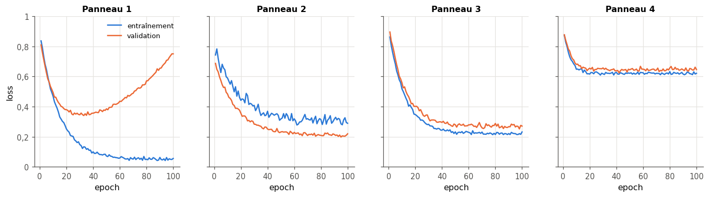

# 9 · Overfitting et underfitting — quiz, rappels, exercices papier, réflexion et entretien

> Écris tes réponses dans **ta copie** `mon_travail/ch09_overfitting/06_mes_reponses.md` (créée par `python tools/start_chapter.py 9`), jamais dans ce fichier : il est mis à jour par Claude.
> Les réponses courtes des **quiz** (sauf Q11), des **rappels** (sauf R1), des exercices ✏️ 9.1, 9.4, 9.5 et 9.7, de ∂ 9.2, 9.3 et 9.6 et de la lecture de graphique 📈 9.9 se vérifient dans la **partie 0** du notebook (`wb.check`). Les questions marquées « dans ta copie », le quiz Q11, le rappel R1, la réflexion (🗣️ ⚖️ 📄) et l'entretien se corrigent avec `05_solutions.md`. Indices : `04_indices.md`. Calculatrice autorisée.
> Formats de réponse : un nombre (`0.3` ou `"0,3"`), `True` ou `False` pour un vrai ou faux, une lettre seule entre guillemets pour un choix (`"E"`), des lettres collées pour plusieurs choix (`"BD"`), une liste pour plusieurs nombres (`[4, 7]`).

**Sommaire** : [🧠 Quiz](#quiz) · [🔁 Rappels](#rappels) · [✏️ ∂ 📈 Papier-crayon](#papier) · [🗣️ ⚖️ 📄 Réflexion](#reflexion) · [💼 Entretien](#entretien) · [Exercices du notebook](#notebook)

Légende : ★ application directe · ★★ standard · ★★★ approfondi · ⏱️ durée indicative · parcours R = rapide, M = maths, C = code.

## 🧠 Quiz

Sans la fiche, en 3 minutes chacun. Réponds vite, vérifie les réponses courtes dans la partie 0 du notebook, puis lis les explications de `05_solutions.md`.

### 9.Q1 — Overfitting ou underfitting ? Définitions et symptômes 🧠 ⏱️ 3 min
*Fiche §9.1, §9.2 · livre §9.1, §9.2 · parcours R*

On met au point un classifieur d'images. Un humain se trompe sur environ 2 % de ces images. Pour chacun des trois modèles, choisis le diagnostic : (A) bon compromis ; (B) overfitting ; (C) underfitting.

a) Modèle 1 : 0,5 % d'erreur sur l'entraînement, 18 % sur la validation.
b) Modèle 2 : 31 % sur l'entraînement, 33 % sur la validation.
c) Modèle 3 : 3 % sur l'entraînement, 4 % sur la validation.
d) Vrai ou faux : un petit écart entre l'erreur d'entraînement et l'erreur de validation suffit à écarter l'underfitting.

### 9.Q2 — Walter et sa moustache : qu'est-ce qui a été mal appris ? 🧠 ⏱️ 3 min
*Fiche §9.2.1 · livre §9.2.1 · parcours R*

Relis l'histoire du mariage (fiche §9.2.1, ou livre §9.2.1, p. 340-341).

a) Qu'est-ce qui a été mal appris ? (A) les prénoms eux-mêmes ; (B) l'apparence des invités ; (C) un lien entre chaque prénom et un seul détail, que d'autres personnes peuvent partager ; (D) rien : la mémoire a simplement flanché.
b) Pendant le mariage, avec les invités déjà rencontrés, l'erreur de reconnaissance était : (A) élevée ; (B) faible.
c) Vrai ou faux : associer chaque prénom à plusieurs détails à la fois (la taille, la voix, la coiffure) aurait rendu la reconnaissance plus robuste.
d) Quel est l'équivalent de ce détail en machine learning ? (A) un learning rate trop grand ; (B) un jeu de test trop petit ; (C) une loss mal choisie ; (D) une feature qui suffit à reconnaître les exemples d'entraînement, mais n'a pas de lien stable avec le label.

### 9.Q3 — Underfitting : les vrais remèdes 🧠 ⏱️ 3 min
*Fiche §9.2.2 · livre §9.2.2 · parcours R*

Une régression linéaire légèrement régularisée (Ridge) prédit le prix de maisons à partir de 5 features : $R^2 = 0{,}45$ sur l'entraînement et $0{,}44$ sur la validation. Un modèle plus souple atteint $0{,}80$ sur la même validation.

a) Diagnostic de la régression linéaire : (A) fuite de données ; (B) overfitting ; (C) bon compromis ; (D) underfitting.
b) Lesquels de ces remèdes ont des chances de l'améliorer ? (A) ajouter des features (produits de features, puissances) ; (B) collecter dix fois plus d'exemples du même genre ; (C) diminuer la régularisation ; (D) augmenter la régularisation ; (E) passer à un modèle plus souple. Réponds par les lettres collées, dans l'ordre alphabétique.
c) Vrai ou faux : doubler le nombre d'exemples d'entraînement fera nettement monter le $R^2$ de validation de cette régression linéaire.
d) Le livre affirme qu'on soigne souvent l'underfitting avec plus de données d'entraînement. Pourquoi est-ce faux en général, et dans quel cas plus de données aide-t-il vraiment ? (dans ta copie)

### 9.Q4 — Courbes d'erreur : où commence l'overfitting ? 🧠 ⏱️ 3 min
*Fiche §9.3 · livre §9.3 · parcours R*

Un réseau est entraîné 40 epochs ; on relève ses erreurs toutes les 5 epochs.

| epoch | 5 | 10 | 15 | 20 | 25 | 30 | 35 | 40 |
|---|---|---|---|---|---|---|---|---|
| entraînement | 0,80 | 0,55 | 0,40 | 0,31 | 0,25 | 0,20 | 0,16 | 0,13 |
| validation | 0,84 | 0,62 | 0,50 | 0,46 | 0,47 | 0,51 | 0,56 | 0,62 |

a) À quelle epoch du tableau l'erreur de validation est-elle la plus basse ?
b) Vrai ou faux : après cette epoch, le modèle apprend encore quelque chose des données d'entraînement.
c) Dans quel régime le modèle est-il à l'epoch 35 ? (A) overfitting ; (B) underfitting ; (C) impossible à dire sans le jeu de test.
d) Vrai ou faux : l'erreur de validation à l'epoch 20 est l'erreur de généralisation du modèle.

### 9.Q5 — Un point isolé : frontière tordue ou frontière simple ? 🧠 ⏱️ 3 min
*Fiche §9.3 · livre §9.3 (figure 9.6) · parcours R*

Deux classes de points dans le plan, des ronds en haut et des carrés en bas. Un seul rond se trouve au milieu des carrés.

a) Comment appelle-t-on un tel point ? (A) un centroïde ; (B) une fuite ; (C) un vecteur de support ; (D) un point aberrant (*outlier*).
b) Vrai ou faux : une frontière qui fait un détour pour englober ce rond a une erreur d'entraînement plus faible que la frontière simple.
c) Un nouveau point tombe juste à côté du rond isolé. Quelle classe la frontière simple lui donne-t-elle ? (A) carré ; (B) rond.
d) Vrai ou faux : il faut toujours supprimer un point aberrant avant d'entraîner un modèle.

### 9.Q6 — Early stopping : quand s'arrêter, et pourquoi c'est délicat 🧠 ⏱️ 3 min
*Fiche §9.4 · livre §9.4 · parcours R*

a) Sur quelle courbe décide-t-on de s'arrêter ? (A) l'erreur de test ; (B) l'erreur d'entraînement ; (C) le learning rate ; (D) l'erreur de validation.
b) Pourquoi ne s'arrête-t-on pas à la première hausse de l'erreur de validation ? (A) parce que l'erreur d'entraînement monte aussi ; (B) parce que la courbe est bruitée : une hausse passagère n'annonce pas forcément l'overfitting ; (C) parce que le jeu de test l'interdit ; (D) parce que l'overfitting ne commence jamais avant 28 epochs.
c) Avec une patience de 5 et `min_delta = 0` (la règle de la fiche), combien d'epochs le modèle fait-il encore après sa meilleure epoch de validation, avant que la règle ne l'arrête ?
d) À l'arrêt, quels poids faut-il garder ? (A) ceux de la meilleure epoch de validation ; (B) ceux de la dernière epoch ; (C) la moyenne des poids des dernières epochs ; (D) ceux de la première epoch.

### 9.Q7 — Régularisation : ce que change λ 🧠 ⏱️ 3 min
*Fiche §9.5 · livre §9.5 · parcours R, M*

a) Quand $\lambda$ augmente, la taille des poids appris, mesurée par la pénalité elle-même ($\lVert \mathbf{w} \rVert^2$ pour Ridge, $\lVert \mathbf{w} \rVert_1$ pour le Lasso) : (A) augmente ; (B) ne change pas ; (C) diminue ; (D) devient la même pour tous les poids.
b) Quand $\lambda$ augmente, l'erreur d'entraînement : (A) monte ou reste égale ; (B) baisse ou reste égale.
c) Vrai ou faux : $\lambda$ s'apprend par descente de gradient, en même temps que les poids.
d) Dans `LogisticRegression` de scikit-learn, la régularisation se règle avec le paramètre `C`. Plus `C` est grand, plus la régularisation est : (A) faible ; (B) forte.
e) Vrai ou faux : avec un $\lambda$ immense, une régression Ridge sur les features polynomiales de degré 10 d'une variable $x$ donne une courbe presque horizontale.

### 9.Q8 — Pénalité sur les poids, dropout, batchnorm : même objectif ? 🧠 ⏱️ 3 min
*Fiche §9.5 · livre §9.5 · parcours R*

a) Lesquelles de ces techniques visent d'abord à réduire l'overfitting ? (A) une pénalité L2 sur les poids ; (B) le dropout ; (C) l'early stopping ; (D) un learning rate plus grand ; (E) l'augmentation de données. Réponds par les lettres collées, dans l'ordre alphabétique.
b) Vrai ou faux : la batchnorm a d'abord été proposée pour accélérer et stabiliser l'entraînement ; son effet régularisant est venu en plus.
c) Pendant l'entraînement, le dropout : (A) retire des exemples du jeu d'entraînement ; (B) met définitivement des poids à zéro ; (C) éteint au hasard une partie des neurones, à chaque pas ; (D) supprime une fois pour toutes les neurones inutiles.
d) Vrai ou faux : la pénalité L1 (Lasso) répartit l'importance entre toutes les features, pour qu'aucun poids ne domine.

### 9.Q9 — Biais et variance : des propriétés d'une famille de courbes 🧠 ⏱️ 3 min
*Fiche §9.6, §9.6.1, §9.6.4 · livre §9.6, §9.6.1, §9.6.4 · parcours R*

a) Vrai ou faux : on peut mesurer le biais et la variance d'une seule courbe, ajustée sur un seul dataset.
b) Le biais d'une famille de modèles se mesure par rapport à : (A) la courbe idéale, sans bruit ; (B) les points bruités du jeu d'entraînement ; (C) le jeu de test ; (D) la courbe moyenne de la famille.
c) La variance d'une famille de modèles mesure : (A) l'écart entre la courbe moyenne et la courbe idéale ; (B) le bruit des mesures ; (C) l'erreur d'entraînement moyenne ; (D) la dispersion des courbes autour de leur moyenne, d'un dataset à l'autre.
d) Un modèle a un biais nul et une variance nulle. Son erreur quadratique attendue sur de nouvelles mesures bruitées vaut : (A) 0 ; (B) $\sigma^2$, la variance du bruit ; (C) le biais au carré ; (D) 1.

### 9.Q10 — Courbes raides ou souples : qui a quel biais, quelle variance ? 🧠 ⏱️ 3 min
*Fiche §9.6.2, §9.6.3 · livre §9.6.2, §9.6.3 · parcours R*

Sur une courbe idéale ondulée, on ajuste à 50 jeux de 30 points bruités deux familles de modèles : (A) des droites ; (B) des polynômes de degré 15, sans pénalité.

a) Quelle famille a le biais le plus élevé ? (une lettre)
b) Quelle famille a la variance la plus élevée ? (une lettre)
c) Vrai ou faux : les courbes de la famille (B) s'écartent surtout les unes des autres aux bords de l'intervalle des données.
d) Vrai ou faux : on peut faire baisser la variance de la famille (B) sans changer de modèle, en entraînant chaque courbe sur plus de points.

### 9.Q11 — Droites a posteriori : a-t-on le droit de parler de variance ? 🧠 ⏱️ 4 min
*Fiche §9.7 · livre §9.7 · parcours R*

À la fin du §9.7, le livre affirme qu'on pourrait calculer le biais et la variance des droites tirées au hasard dans le posterior, mais que ce calcul n'aurait pas de sens pour un bayésien. En quatre phrases au plus : que mesure la dispersion de ces droites ? Est-ce la même chose que la variance de la fiche §9.6 ? Que lui arrive-t-il quand on ajoute des points ? (dans ta copie)

## 🔁 Rappels

Des questions sur les chapitres précédents, pour ne pas oublier.

### 9.R1 — Ch. 8 : pourquoi le score de validation du modèle retenu est optimiste 🔁 ★ ⏱️ 5 min
*Ch. 8 (§8.4) · parcours R*

Une équipe essaie 25 degrés de polynôme et garde celui qui a la meilleure erreur de validation. En trois phrases au plus : pourquoi cette erreur de validation est-elle trop optimiste ? En quoi est-ce une forme d'overfitting, et de quoi ? Comment obtenir une estimation honnête ? (dans ta copie)

### 9.R2 — Ch. 6 : ce que mesure une cross-entropy utilisée comme loss 🔁 ★ ⏱️ 5 min
*Ch. 6 (§6.8 ; « bits, nats, log loss et perplexité ») · parcours R, M*

Un classifieur donne à la bonne classe de quatre exemples les probabilités 0,9 ; 0,6 ; 0,25 et 0,8. Utilise le logarithme népérien.

a) La cross-entropy moyenne (la log loss), en nats (3 décimales).
b) La même, en bits (3 décimales).
c) Quel exemple (1, 2, 3 ou 4) contribue le plus à la loss ?
d) Vrai ou faux : sur les données d'entraînement, la cross-entropy peut continuer de baisser alors que l'accuracy d'entraînement est déjà de 100 %.

### 9.R3 — Ch. 2 : biais et variance d'un estimateur, et le bootstrap 🔁 ★ ⏱️ 5 min
*Ch. 2 (§2.3, variance et ddof ; §2.6, bootstrap) · parcours R, M*

On a quatre mesures : 3, 5, 6 et 10.

a) Leur variance en divisant par $n$ (ddof = 0).
b) Leur variance en divisant par $n - 1$ (3 décimales).
c) On montre que, sur des échantillons de taille $n$, la variance divisée par $n$ vaut **en moyenne** $\frac{n-1}{n}\sigma^2$, où $\sigma^2$ est la variance de la population. Pour $n = 4$, quel est le biais de cet estimateur, exprimé en fraction de $\sigma^2$ (un nombre négatif) ?
d) Vrai ou faux : le bootstrap corrige un échantillon biaisé, par exemple un sondage fait auprès des seuls utilisateurs d'une application.
e) Quel lien vois-tu entre le biais d'un estimateur et le biais d'une famille de modèles (fiche §9.6) ? (dans ta copie)

## ✏️ ∂ 📈 Papier-crayon

Calculatrice autorisée. Écris la démarche dans ta copie de `06_mes_reponses.md`, puis reporte les résultats dans la partie 0 du notebook. Garde les valeurs exactes pendant tes calculs et **n'arrondis qu'à la fin**.

### Ex 9.1 — MSE et R² à la main sur cinq points ✏️ ★ ⏱️ 10 min
**Objectif :** calculer à la main les mesures d'erreur d'une régression, et voir comment chacune réagit à une valeur aberrante.
**Prérequis :** ch. 2 (moyenne) · fiche §9.2 (encadré sur les mesures d'erreur) · **Parcours :** R, M

Un modèle prédit cinq valeurs :

| $i$ | 1 | 2 | 3 | 4 | 5 |
|---|---|---|---|---|---|
| cible $y_i$ | 3 | 5 | 4 | 8 | 10 |
| prédiction $\hat{y}_i$ | 2 | 5,5 | 5 | 7,5 | 9 |

a) La MSE.
b) La RMSE (3 décimales).
c) La MAE.
d) Le $R^2$ (3 décimales).
e) Le $R^2$ d'un modèle qui prédirait toujours 8 (3 décimales).
On remplace la 5ᵉ cible par 20 (une erreur de saisie, ou une vraie valeur extrême) ; les prédictions ne changent pas.
f) La nouvelle MSE.
g) La nouvelle MAE.
h) Par combien la MSE a-t-elle été multipliée, et la MAE ? Laquelle de ces deux mesures choisirais-tu si quelques erreurs énormes sont des erreurs de saisie qu'on ne peut pas corriger ? (dans ta copie)

### Ex 9.2 — Moindres carrés : la meilleure droite par dérivées partielles ∂ ★★ ⏱️ 25 min
**Objectif :** démontrer les formules de la droite des moindres carrés, puis les appliquer.
**Prérequis :** 0B (dérivées partielles, minimum, produit matriciel) · fiche §9.3 (encadré sur les moindres carrés) · **Parcours :** M

On ajuste une droite $\hat{y} = a\,x + b$ à $n$ points $(x_i, y_i)$ en minimisant $L(a, b) = \sum_{i=1}^{n} (y_i - a\,x_i - b)^2$.

1. (dans ta copie) Calcule $\frac{\partial L}{\partial b}$ et montre que la condition $\frac{\partial L}{\partial b} = 0$ donne $b = \bar{y} - a\,\bar{x}$.
2. (dans ta copie) Calcule $\frac{\partial L}{\partial a}$, remplace $b$ par l'expression trouvée en 1, et montre que $a = \frac{\sum_i (x_i - \bar{x})(y_i - \bar{y})}{\sum_i (x_i - \bar{x})^2}$.
3. (dans ta copie) Montre qu'avec ces valeurs, la somme des résidus $y_i - \hat{y}_i$ est nulle, et que la droite passe par le point $(\bar{x}, \bar{y})$.

Application aux cinq points $(0, 1)$, $(1, 3)$, $(2, 2)$, $(3, 5)$ et $(4, 7)$ :

a) La pente $a$.
b) L'ordonnée à l'origine $b$.
c) La somme des résidus.
d) La somme des carrés des résidus.
e) La prédiction en $x = 6$.
f) Sous forme matricielle, avec une colonne de 1 dans $\mathbf{X}$ (première colonne : les 1, seconde : les $x_i$), la matrice $\mathbf{X}^\top\mathbf{X}$ vaut $\begin{pmatrix} n & \sum x_i \\ \sum x_i & \sum x_i^2 \end{pmatrix}$. Que vaut son déterminant ?
4. (dans ta copie) Pourquoi ce déterminant serait-il nul si tous les $x_i$ étaient égaux ? Que devient alors le problème ?

### Ex 9.3 — Ridge en dimension 1 : w* = Σxy / (Σx² + λ) ∂ ★★ ⏱️ 20 min
**Objectif :** dériver la solution de Ridge en dimension 1 et observer le rétrécissement du poids.
**Prérequis :** Ex 9.2 · fiche §9.5 (encadré sur Ridge) · **Parcours :** M

Modèle sans ordonnée à l'origine, $\hat{y} = w\,x$, et loss régularisée $L(w) = \sum_i (y_i - w\,x_i)^2 + \lambda\,w^2$ avec $\lambda \geq 0$.

1. (dans ta copie) Montre que $L$ est minimale en $w^* = \frac{\sum_i x_i y_i}{\sum_i x_i^2 + \lambda}$.
2. (dans ta copie) Montre que $w^*$ tend vers 0 quand $\lambda$ grandit, mais ne vaut jamais exactement 0 si $\sum_i x_i y_i \neq 0$.

Données : $x = (-2, -1, 0, 1, 2)$ et $y = (-3, -1, 0, 2, 2)$.

a) $w^*$ pour $\lambda = 0$.
b) $w^*$ pour $\lambda = 2{,}5$.
c) $w^*$ pour $\lambda = 5$ (4 décimales).
d) Pour quelle valeur de $\lambda$ le poids $w^*$ vaut-il exactement la moitié de sa valeur sans pénalité ?
e) Pour cette valeur de $\lambda$, la somme des carrés des résidus $\sum_i (y_i - w^* x_i)^2$, **sans** la pénalité (3 décimales).
f) Vrai ou faux : sur ces données, la somme des carrés des résidus augmente quand $\lambda$ augmente.

### Ex 9.4 — Biais² et variance à partir d'un tableau de prédictions ✏️ ★★ ⏱️ 20 min
**Objectif :** calculer à la main le biais² et la variance d'une famille de modèles, et vérifier la décomposition de l'erreur.
**Prérequis :** Rappel 9.R3 · fiche §9.6 (encadrés sur le biais, la variance et la décomposition) · **Parcours :** M

Quatre modèles, entraînés sur quatre datasets tirés de la même source, prédisent en trois points $x_1, x_2, x_3$ ; la courbe idéale $f$ y vaut 1, 2 et 3.

| | $x_1$ | $x_2$ | $x_3$ |
|---|---|---|---|
| modèle 1 | 1,5 | 2,0 | 2,0 |
| modèle 2 | 0,5 | 3,0 | 2,5 |
| modèle 3 | 1,0 | 2,5 | 1,5 |
| modèle 4 | 1,0 | 2,5 | 2,0 |
| $f$ | 1 | 2 | 3 |

On moyenne sur les trois points, comme `bias_variance_decomposition`, et la variance se calcule en divisant par le nombre de modèles.

a) Le modèle moyen aux trois points (une liste de trois nombres).
b) Le biais² (3 décimales).
c) La variance (3 décimales).
d) L'erreur quadratique moyenne des quatre modèles face à $f$, sur les douze couples (modèle, point) (3 décimales).
e) Les nouvelles mesures sont bruitées, avec une variance du bruit $\sigma^2 = 0{,}09$. Quelle erreur quadratique moyenne attend-on de ces modèles sur de nouvelles mesures aux mêmes points (3 décimales) ?
f) Vrai ou faux : utiliser le modèle moyen comme prédicteur donnerait, face à $f$, une erreur plus petite que l'erreur moyenne des quatre modèles.
g) Quel point contribue le plus au biais ? Que pourrait-on changer pour le réduire ? (dans ta copie)

### Ex 9.5 — Early stopping avec patience sur une courbe de loss ✏️ ★★ ⏱️ 15 min
**Objectif :** appliquer à la main la règle de l'early stopping avec patience et `min_delta`.
**Prérequis :** fiche §9.4 (pseudo-code) · **Parcours :** R, M

Losses de validation mesurées à la fin de chaque epoch :

| epoch | 1 | 2 | 3 | 4 | 5 | 6 | 7 | 8 | 9 | 10 | 11 | 12 | 13 | 14 | 15 |
|---|---|---|---|---|---|---|---|---|---|---|---|---|---|---|---|
| validation | 0,90 | 0,72 | 0,61 | 0,55 | 0,53 | 0,54 | 0,52 | 0,53 | 0,55 | 0,54 | 0,56 | 0,57 | 0,58 | 0,60 | 0,61 |

Règle (celle de la fiche) : une epoch est une amélioration si sa loss est **strictement** inférieure à la meilleure loss précédente moins `min_delta` ; seule une amélioration met à jour la meilleure loss et les poids gardés ; on s'arrête à la fin de l'epoch où le nombre d'epochs consécutives sans amélioration atteint la patience, puis on recharge les poids gardés. Sauf mention contraire, `min_delta = 0`.

a) Patience 2 : à la fin de quelle epoch l'entraînement s'arrête-t-il ?
b) Patience 2 : les poids de quelle epoch garde-t-on ?
c) Patience 1 : epoch d'arrêt.
d) Patience 1 : epoch dont on garde les poids.
e) Patience 4 : epoch d'arrêt.
f) Patience 2 et `min_delta = 0,02` : epoch d'arrêt.
g) Patience 2 et `min_delta = 0,02` : epoch dont on garde les poids.
h) Quel risque prend-on avec une patience trop petite ? Et trop grande ? (dans ta copie)

### Ex 9.6 — Lasso en dimension 1 : le seuillage doux et les zéros exacts ∂ ★★★ ⏱️ 35 min
**Objectif :** dériver le seuillage doux, et comprendre pourquoi la pénalité L1 met des poids exactement à zéro.
**Prérequis :** Ex 9.3 · 0B (valeur absolue) · fiche §9.5 (encadré sur le Lasso) · **Parcours :** M

On minimise $g(w) = \frac{1}{2}(w - z)^2 + \gamma\,|w|$, avec $\gamma > 0$.

1. (dans ta copie) Sur $w > 0$, $g$ est dérivable : trouve où sa dérivée s'annule, et montre que ce point n'est dans $w > 0$ que si $z > \gamma$. Fais de même sur $w < 0$.
2. (dans ta copie) Si $|z| \leq \gamma$, montre que $g(w) \geq g(0)$ pour tout $w$ (compare $\frac{1}{2}(w - z)^2 + \gamma|w|$ à $\frac{1}{2}z^2$). Conclus que le minimum vaut $S(z, \gamma) = \operatorname{signe}(z)\max(|z| - \gamma, 0)$.
3. (dans ta copie) Le Lasso de scikit-learn en dimension 1, sans ordonnée à l'origine, minimise $\frac{1}{2n}\sum_i (y_i - w\,x_i)^2 + \alpha\,|w|$. Montre que sa solution est $w^* = S(\rho, \alpha)/z$ avec $\rho = \frac{1}{n}\sum_i x_i y_i$ et $z = \frac{1}{n}\sum_i x_i^2$.

a) $S(2{,}5 ;\ 1)$.
b) $S(-0{,}4 ;\ 0{,}5)$.
c) $S(-3 ;\ 0{,}5)$.
Données de l'exercice 9.3 : $x = (-2, -1, 0, 1, 2)$ et $y = (-3, -1, 0, 2, 2)$.
d) La valeur de $\rho$.
e) $w^*$ pour $\alpha = 0{,}6$.
f) $w^*$ pour $\alpha = 1{,}3$.
g) La plus petite valeur de $\alpha$ pour laquelle $w^* = 0$.
h) Vrai ou faux : sur ces données, aucune valeur finie de $\lambda$ ne donne $w^* = 0$ avec Ridge (exercice 9.3).
4. (dans ta copie) Avec plusieurs features, pourquoi le Lasso donne-t-il des modèles plus faciles à expliquer qu'une régression Ridge ? Quel est le risque quand deux features sont presque identiques ?

### Ex 9.7 — Mise à jour bayésienne d'une droite sur une grille 3 × 3 ✏️ ★★★ ⏱️ 30 min
**Objectif :** appliquer à la main la règle de Bayes à des droites : prior, vraisemblance, posterior, puis un second point.
**Prérequis :** ch. 4 (règle de Bayes, posterior et prior) · Ex 9.2 · fiche §9.7 · **Parcours :** M

On ne considère que neuf droites $y = a\,x + b$, avec une pente $a$ et une ordonnée $b$ dans $\{-1, 0, 1\}$. Le prior donne le poids 4 à la droite $(a, b) = (0, 0)$, le poids 2 aux quatre droites où une seule des deux valeurs est nulle, et le poids 1 aux quatre droites restantes ; on normalise pour que la somme fasse 1. Pour simplifier les calculs, la vraisemblance d'une droite pour un point $(x_0, y_0)$ ne dépend que de l'écart $r = y_0 - (a\,x_0 + b)$ : elle vaut 1 si $r = 0$, 0,5 si $|r| = 1$, 0,1 si $|r| = 2$ et 0 au-delà.

a) La probabilité a priori de la droite $(a, b) = (0, 0)$.
On observe le point $P_1 = (1, 1)$.
b) La probabilité a posteriori de la droite $(a, b) = (0, 1)$ (3 décimales).
c) Combien de droites ont une probabilité a posteriori nulle ?
On observe ensuite le point $P_2 = (-1, 0)$ ; le posterior précédent sert de prior.
d) La probabilité a posteriori de la droite $(0, 0)$ (3 décimales).
e) La probabilité a posteriori de la droite $(1, 1)$ (3 décimales).
f) Vrai ou faux : observer $P_2$ avant $P_1$ aurait donné le même posterior final.
g) La droite la plus probable après les deux points : la liste `[a, b]`.
h) La droite qui passe exactement par $P_1$ et $P_2$ a la pente 0,5 et l'ordonnée 0,5. Pourquoi n'est-elle pas la réponse de g) ? Que faudrait-il changer à la grille ? (dans ta copie)

### Ex 9.9 — Diagnostiquer quatre paires de courbes d'entraînement et de validation 📈 ★★ ⏱️ 20 min
**Objectif :** reconnaître sur des courbes d'apprentissage l'underfitting, l'overfitting et des situations moins classiques.
**Prérequis :** Ex 9.5 · fiche §9.2, §9.3, §9.4 · **Parcours :** R, M

Les quatre panneaux montrent la loss d'entraînement et la loss de validation de quatre modèles entraînés sur la même tâche, au fil de 100 epochs (les courbes sont simulées).

a) Quel panneau montre de l'underfitting ? (son numéro)
b) Quel panneau montre de l'overfitting ? (son numéro)
c) Dans ce panneau, autour de quelle epoch la loss de validation est-elle la plus basse ? Choisis parmi 10, 30, 60 et 100.
d) Dans le panneau 2, la loss de validation reste au-dessous de la loss d'entraînement. Quelles explications sont plausibles ? (A) le dropout (ou l'augmentation de données) n'agit que pendant l'entraînement, et la loss d'entraînement est mesurée avec lui ; (B) le modèle fait de l'underfitting ; (C) le jeu de validation est plus facile que le jeu d'entraînement (moins de cas ambigus, moins de labels faux) ; (D) le learning rate est trop petit. Réponds par les lettres collées, dans l'ordre alphabétique.
e) Vrai ou faux : pour le modèle du panneau 4, collecter dix fois plus de données ferait nettement baisser les deux courbes.
f) Pour chacun des quatre panneaux, que ferais-tu ensuite ? (dans ta copie)

## 🗣️ ⚖️ 📄 Réflexion

### Ex 9.8 — Le compromis biais-variance raconté avec le tempo de la boutique 🗣️ ★ ⏱️ 10 min
**Objectif :** expliquer le compromis biais-variance à quelqu'un qui n'a jamais fait de statistiques.
**Prérequis :** fiche §9.3, §9.6 · livre §9.3 · **Parcours :** R

La propriétaire de la boutique du §9.3 du livre te demande : « Pourquoi ta première courbe changeait-elle de tempo sans arrêt, et pourquoi la deuxième ne suivait-elle même pas mes envies du matin et de l'après-midi ? » Réponds-lui en **cinq lignes au plus**. Contraintes :
- les mots « biais », « variance » et « une autre journée » ;
- un exemple de la vie courante, autre que la musique, qui montre les deux erreurs ;
- aucune formule.

Relis-toi à voix haute, puis compare avec la réponse modèle de `05_solutions.md`.

### Ex 9.10 — Écarter un point aberrant : nettoyage ou manipulation ? ⚖️ ★★ ⏱️ 20 min
**Objectif :** distinguer le nettoyage légitime de données et l'arrangement d'un résultat, et savoir documenter ses choix.
**Prérequis :** fiche §9.2 (encadré sur la MAE), §9.3 (le point isolé) · ch. 8 (fuites, jeu de test) · **Parcours :** complet seulement (réflexion conseillée à tous)

**Cas 1.** Une équipe prédit le prix de vente de maisons. Douze ventes, toutes au-dessus de trois fois le prix médian, « gâchent » la RMSE ; en les retirant de **toutes** les données, entraînement et test compris, la RMSE de test baisse de 18 %. Le rapport annonce ce chiffre, sans mentionner le retrait.

**Cas 2.** Depuis 1979, l'instrument TOMS du satellite Nimbus-7 de la NASA mesurait la quantité totale d'ozone de l'atmosphère. Son traitement **signalait** comme suspectes les valeurs très basses (sous 180 unités Dobson), et les chercheurs les comparaient aux autres mesures disponibles. En 1985, une équipe du British Antarctic Survey a publié la première, à partir de mesures au sol, l'effondrement de l'ozone au-dessus de l'Antarctique au printemps austral (J. Farman, B. Gardiner et J. Shanklin, *Nature* 315, 1985) ; la NASA a ensuite confirmé le phénomène dans les données du satellite. Une légende tenace affirme que le logiciel de la NASA avait **jeté** ces valeurs comme aberrantes, et que c'est pour cela que la découverte lui a échappé : c'est faux, elles avaient été signalées et examinées (R. Hyndman résume l'affaire et ses sources dans [*That's Weird! Anomaly Detection Using R*](https://otexts.com/weird/01-intro.html), chapitre 1).

1. Dans le cas 1, qu'est-ce qui pose problème : retirer les points, les retirer du test, ou ne pas le dire ? Dans quelles conditions un tel retrait serait-il légitime ?
2. Le modèle du cas 1 servira à estimer **toutes** les maisons mises en vente, y compris les plus chères. Que vaut alors la RMSE annoncée ? Que proposerais-tu à la place (pense à la MAE, à une loss robuste, ou à un modèle séparé) ?
3. Qu'enseigne le cas 2 sur la différence entre une valeur aberrante et une valeur erronée ? Pourquoi « signaler » vaut-il mieux que « supprimer » ?
4. Pourquoi la légende du cas 2 a-t-elle tant de succès ? Pourquoi faut-il, comme pour le détecteur de chars du ch. 8, vérifier une histoire avant de la raconter en entretien ou dans un rapport ?
5. Propose trois règles de conduite pour traiter les valeurs aberrantes dans un projet (qui décide, quand, et ce qu'on écrit dans le rapport).

### Ex 9.11 — Belkin et coll. (2019) : la double descente 📄 ★★ ⏱️ 30 min
**Objectif :** lire un article de recherche qui nuance le compromis biais-variance, et relier ses expériences au chapitre.
**Prérequis :** Ex 9.4 · fiche §9.6.4 (encadré 🕰️ et encadré sur la solution de norme minimale) · **Parcours :** M

Lis le résumé, l'introduction et la section sur les features de Fourier aléatoires (*random Fourier features*) de M. Belkin, D. Hsu, S. Ma et S. Mandal, « Reconciling modern machine-learning practice and the classical bias–variance trade-off », *PNAS* 116 (32), 2019 ([lien DOI](https://doi.org/10.1073/pnas.1903070116) ; une version en accès libre est sur [arXiv, 1812.11118](https://arxiv.org/abs/1812.11118)). Réponds dans ta copie.

1. Décris la figure 1 de l'article : que montre la courbe « classique », que montre la courbe en « double descente » ? Définis le **seuil d'interpolation** avec tes mots.
2. Dans l'expérience des features de Fourier aléatoires : quelles données, combien d'exemples d'entraînement, et comment les auteurs choisissent-ils le prédicteur quand il y a plus de paramètres que d'exemples ? Où se trouve le pic de l'erreur de test, et que devient la norme de la solution au-delà ?
3. Selon les auteurs, pourquoi un modèle plus grand peut-il généraliser mieux au-delà du seuil ? Relie leur argument à la préférence pour la simplicité de la fiche §9.5.
4. Pourquoi ce pic a-t-il été si peu remarqué avant eux ? Cite deux raisons qu'ils donnent, dont une vue dans ce chapitre.
5. La double descente contredit-elle le compromis biais-variance, ou l'étend-elle ? Appuie-toi sur l'article et sur la nuance de Curth et coll. (2023) citée par la fiche.
6. En 🔬 9.30, tu reproduiras l'expérience avec des features aléatoires ReLU et `np.linalg.pinv`. Que t'attends-tu à voir, et où ?

## 💼 Entretien

Réponds **à voix haute**, en une minute, comme face à un recruteur ; puis compare avec la « réponse modèle en 60 secondes » de `05_solutions.md`.

### 9.E1 — Expliquer le compromis biais-variance 💼 ★★ ⏱️ 10 min
*Fiche §9.6 · prérequis 9.24 · parcours R*

« Expliquez-moi le compromis biais-variance. Comment le voyez-vous sur un projet réel, et comment agissez-vous dessus ? »

### 9.E2 — MSE ou MAE : laquelle choisir, et pourquoi ? 💼 ★★ ⏱️ 10 min
*Fiche §9.2 · prérequis 9.14 · parcours R*

« Pour évaluer un modèle de prévision de la demande, préférez-vous la MSE (ou la RMSE) ou la MAE ? Qu'est-ce que chacune optimise, et comment choisissez-vous ? »

### 9.E3 — Régularisation L1 ou L2 : différences et usages 💼 ★★ ⏱️ 10 min
*Fiche §9.5 · prérequis 9.22 · parcours R*

« Quelle est la différence entre une régularisation L1 et une régularisation L2 ? Quand utilisez-vous l'une, l'autre, ou les deux (Elastic Net) ? »

### 9.E4 — Détecter l'overfitting avant la mise en production 💼 ★★ ⏱️ 10 min
*Fiche §9.2, §9.3, §9.4 · prérequis 9.21 · parcours R*

« Comment savez-vous qu'un modèle surapprend, avant de le mettre en production ? Et que faites-vous, dans quel ordre ? »

### 9.E5 — La double descente contredit-elle le compromis biais-variance ? 💼 ★★ ⏱️ 10 min
*Fiche §9.6.4 · prérequis 9.11 · parcours R*

« On entend que les grands réseaux de neurones contredisent le compromis biais-variance. Qu'en pensez-vous ? »

## Exercices du notebook

Les exercices suivants se font dans `03_notebook.ipynb` (ta copie : `mon_travail/ch09_overfitting/03_notebook.ipynb`) ; ceux marqués 🔨 et accompagnés de « mylearn » complètent ta librairie `mylearn/linear.py`. La partie 0 du notebook vérifie tes réponses courtes aux quiz, aux rappels et aux exercices ✏️, ∂ et 📈 ci-dessus.

| ID | Titre | Type | ★ | ⏱️ |
|---|---|---|---|---|
| 9.12 | Le tempo de la boutique : polynômes de degré 1, 4 et 15 | 📦 | ★ | 15 |
| 9.13 | Erreurs d'entraînement et de test selon le degré : ta courbe d'abord | 🔮 | ★ | 15 |
| 9.14 | mean_squared_error, mean_absolute_error et r2_score | 🔨 | ★★ | 20 |
| 9.15 | polynomial_features, interactions comprises | 🔨 | ★★ | 25 |
| 9.16 | LinearRegression par moindres carrés | 🔨 | ★★ | 30 |
| 9.17 | Ridge en forme fermée, intercept non pénalisé | 🔨 | ★★ | 30 |
| 9.18 | Courbes de validation : le degré, puis λ | 🔬 | ★★ | 30 |
| 9.19 | Que deviennent les coefficients quand λ grandit ? | 🔮 | ★★ | 15 |
| 9.20 | Early stopping d'une descente de gradient sur un polynôme de degré 12 | 🔨 | ★★ | 30 |
| 9.21 | Courbes d'apprentissage sur California avec learning_curve | 📦 | ★★ | 30 |
| 9.22 | Ridge contre Lasso sur California : chemins de régularisation | 📦 | ★★ | 30 |
| 9.23 | Lasso par descente de coordonnées et soft_threshold | 🔨 | ★★★ | 60 |
| 9.24 | Biais et variance mesurés : 50 sous-échantillons de 30 points | 🔨 | ★★★ | 45 |
| 9.25 | Reproduire les figures 9.13 et 9.15, puis la courbe en U | 🎨 | ★★★ | 40 |
| 9.26 | Le posterior des droites sur une grille pente-ordonnée | 🔨 | ★★★ | 45 |
| 9.27 | Reproduire la figure 9.20 : prior, vraisemblances, posteriors et droites tirées | 🎨 | ★★★ | 40 |
| 9.28 | Régularisation piégée : quatre erreurs qui faussent Ridge | 🐛 | ★★★ | 30 |
| 9.29 | Refactoriser l'expérience biais-variance en fonction testée | 🛠️ | ★★★ | 30 |
| 9.30 | Double descente avec des features aléatoires | 🔬 | ★★★ | 45 |
| 9.31 | Défi California : le meilleur modèle linéaire régularisé | 🏆 | ★★★ | 90 |
