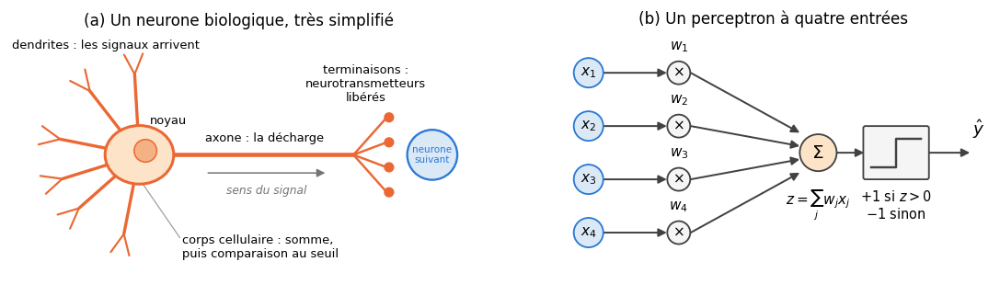
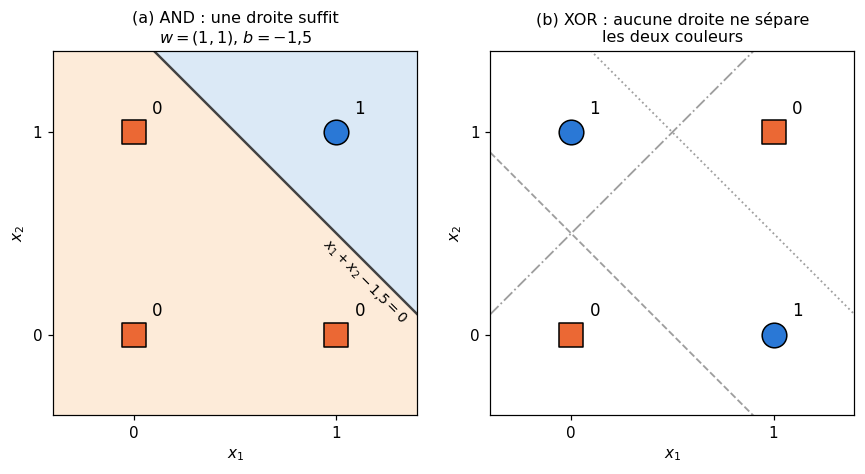
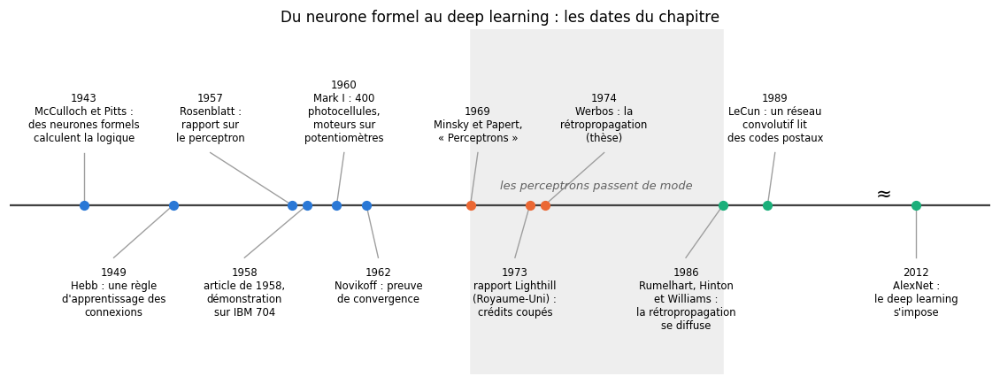
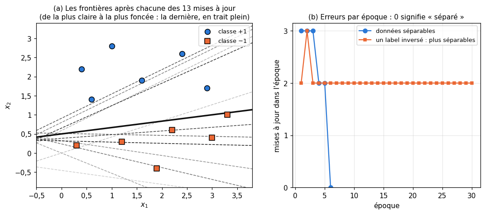
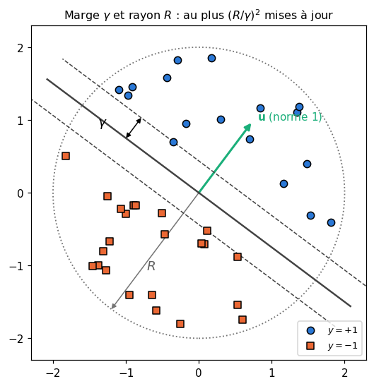
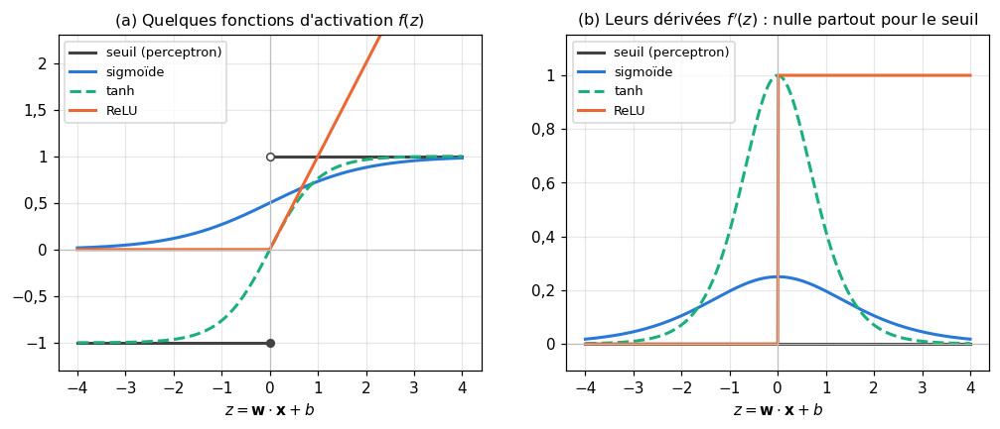
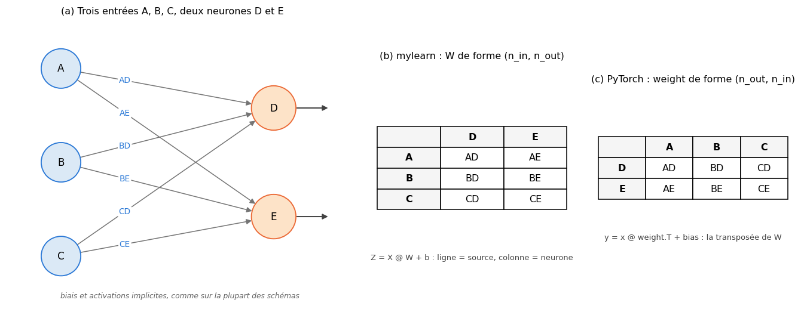

# 10 · Neurones — fiche de cours

> Cette fiche accompagne le chapitre 10 du livre, le plus court de la partie II et le plus historique. Le livre part de la cellule nerveuse, qui additionne des signaux et les compare à un seuil, en tire le perceptron de Rosenblatt, raconte sa gloire puis sa disgrâce, et termine par le neurone moderne : un biais en plus, une fonction d'activation à la place du seuil, et des conventions de dessin qu'il faut savoir lire. Il décrit la structure du perceptron, mais **pas la façon dont il apprend**. La fiche ajoute donc ce dont tu auras besoin pour coder et pour raisonner : la règle d'apprentissage du perceptron, la séparabilité linéaire et la preuve que XOR lui échappe, le théorème de convergence et sa marge, et le passage d'un schéma de réseau à une matrice de poids, la convention dont dépendent tous les chapitres de réseaux. Les passages historiques du livre ne sont que résumés : chaque section te dit où les lire.

| | |
|---|---|
| **Livre** | vol. 1, ch. 10 « Neurons », p. 375-392 (§10.1 à §10.4) |
| **Temps total estimé** | ≈ 14 h : lecture du livre et de la fiche ≈ 1,5 h, exercices ≈ 11,5 h, 18 flashcards ≈ 0,6 h |
| **Prérequis** | 0A (classes Python, docstrings au format NumPy, doctest, pytest) · 0B (produit scalaire, norme, inégalité de Cauchy-Schwarz, droites et plans, produit de matrices) · ch. 3 (matrice de confusion, accuracy) · ch. 5 (dérivée, descente de gradient) · ch. 7 (frontière de décision, centroïde le plus proche, un-contre-tous et un-contre-un) · ch. 8 (découpage entraînement et test, validation) · ch. 9 (pénalité L2 sur les poids) |
| **Fichiers du chapitre** | `02_exercices.md` (quiz, rappels, papier, réflexion, entretien) · `03_notebook.ipynb` · `04_indices.md` · `05_solutions.md` et `05_solutions.ipynb` · `06_mes_reponses.md` · `flashcards.csv` |
| **mylearn** | `perceptron.py` : `sign_step` et `add_bias_column` (10.12), `neuron_forward` (10.14), la classe `Perceptron` (10.21) ; elle se combine avec `multiclass.py` (ch. 7) en 10.24. Les chapitres de réseaux (16 à 18) partent de ce neurone |

## Comment utiliser ce chapitre

Le livre avance en trois temps : le neurone biologique (§10.2), le perceptron et son histoire (§10.3.1 et §10.3.2), puis le neurone moderne et la façon de le dessiner (§10.3.3). Compte une heure et demie pour ses 18 pages et cette fiche. La fiche suit le même plan et ajoute cinq encadrés 🧮 : des ordres de grandeur sur le cerveau, la séparabilité linéaire, la règle d'apprentissage du perceptron, le théorème de convergence, et l'écriture d'une couche de neurones sous forme matricielle.

**Ordre conseillé.**
1. Lis le livre §10.1 et §10.2, puis les sections 10.1 et 10.2 de la fiche. Fais les quiz Q1 à Q3.
2. Lis le livre §10.3 et §10.3.1, puis les sections correspondantes de la fiche, et, en avance, le paragraphe « À l'entrée : le biais » de la section 10.3.3 : les exercices 10.1 (e à i), 10.3, 10.4 et 10.6 en ont besoin. Fais les quiz Q4 à Q6, l'oral 🗣️ 10.8, les rappels R2 et R3, les exercices 10.1 et 10.3, puis la preuve ∂ 10.4 et la règle d'apprentissage à la main (10.6).
3. Lis le livre §10.3.2 et la section 10.3.2 de la fiche. Fais le quiz Q7, la preuve guidée ∂ 10.7 (parcours maths), le cas ⚖️ 10.10 et la lecture 📄 10.11.
4. Lis le livre §10.3.3 et §10.4, puis la section 10.3.3 de la fiche. Fais les quiz Q8 et Q9, le rappel R1, les exercices 10.2 et 10.5, et l'estimation 🧮 10.9. Vérifie tes réponses courtes dans la partie 0 du notebook.
5. Fais le notebook dans l'ordre : partie A (10.12 à 10.16 : un neurone, puis un petit réseau, câblés à la main), partie B (10.17 à 10.21 : apprendre, avec scikit-learn puis avec ta classe `Perceptron`), partie C (10.22 à 10.25 : déboguer, mesurer, combiner, et le défi « Mark I »). Finis par les quatre questions d'entretien.

| Section | Quiz 🧠 et rappels 🔁 | Papier ✏️ ∂ et réflexion | Notebook | Entretien 💼 |
|---|---|---|---|---|
| 10.1 Pourquoi ce chapitre | Q1 | | | |
| 10.2 Les vrais neurones | Q2, Q3 | 10.8, 10.9 | | E4 |
| 10.3 Les neurones artificiels | Q4 | 10.8, 10.9, 10.10 | | E4 |
| 10.3.1 Le perceptron | Q5, Q6, R2, R3 | 10.1, 10.3, 10.4, 10.6, 10.11 | 10.12, 10.17, 10.18, 10.21, 10.22 | E1 |
| 10.3.2 L'histoire du perceptron | Q7 | 10.4, 10.5, 10.7, 10.10, 10.11 | 10.13, 10.16, 10.19, 10.21, 10.23, 10.24, 10.25 | E1 |
| 10.3.3 et 10.4 Les neurones modernes | Q8, Q9, R1 | 10.1, 10.2, 10.5 | 10.12, 10.14, 10.15, 10.16, 10.20, 10.22, 10.24 | E2, E3 |

**Lire les formules.** $x_j$ est la $j$-ième entrée d'un neurone, $w_j$ son poids, $b$ le biais ; en gras, les vecteurs $\mathbf{x} = (x_1, \dots, x_n)$ et $\mathbf{w}$, avec le produit scalaire $\mathbf{w}\cdot\mathbf{x} = \sum_j w_j x_j$ (0B). $z = \mathbf{w}\cdot\mathbf{x} + b$ est la **somme pondérée** (on dit aussi pré-activation), $f$ la fonction d'activation, $a = f(z)$ la sortie. Les labels d'un perceptron valent $y_i \in \{-1, +1\}$ ; $\eta$ (« êta ») est le pas d'apprentissage (le *learning rate*), `eta0` dans le code. $\lVert \mathbf{x} \rVert$ est la norme euclidienne, $R$ la plus grande norme des exemples et $\gamma$ (« gamma ») la marge. Pour une couche, $\mathbf{X}$ est la matrice d'un lot (une ligne par exemple) et $\mathbf{W}$ la matrice des poids.

## Objectifs d'apprentissage

À la fin du chapitre, tu sais :
- **décrire** le fonctionnement simplifié d'un neurone biologique, et ce que le neurone artificiel en garde ou en jette ;
- **calculer** à la main la sortie d'un perceptron et d'un neurone moderne (poids, biais, activation), avec et sans l'astuce du biais ;
- **trouver** des poids pour les portes logiques, et **démontrer** qu'un perceptron seul ne peut pas calculer XOR ;
- **implémenter** la règle d'apprentissage du perceptron et la **vérifier** contre scikit-learn ;
- **lire** un schéma de réseau (poids implicites, conventions de nommage) et le **traduire** en matrice de poids, dans la convention de mylearn et dans celle de PyTorch ;
- **situer** le perceptron dans l'histoire : McCulloch et Pitts, le Mark I, Minsky et Papert, la rétropropagation.

## L'essentiel en 10 lignes

1. Un neurone biologique reçoit des messages chimiques, les transforme en petits signaux électriques positifs ou négatifs, les **additionne** sur un court intervalle et ne **décharge** que si le total dépasse un **seuil**.
2. Le neurone artificiel n'en garde que ce squelette : une somme pondérée, puis une décision. C'est une caricature, d'où le nom plus neutre d'**unité** que préfèrent beaucoup d'auteurs.
3. 1943 : McCulloch et Pitts montrent que des réseaux de neurones formels peuvent réaliser des expressions logiques. 1957 : Rosenblatt propose le **perceptron**, dont les poids s'**apprennent** à partir d'exemples.
4. Le perceptron calcule $z = \sum_j w_j x_j$ et sort $+1$ si $z > 0$, $-1$ sinon (ou 1 et 0, selon les versions).
5. Géométriquement, il coupe l'espace des entrées par un hyperplan : il ne peut séparer que des classes **linéairement séparables**. AND l'est, **XOR** ne l'est pas.
6. Sa règle d'apprentissage corrige les poids après chaque erreur : $\mathbf{w} \leftarrow \mathbf{w} + \eta\, y\, \mathbf{x}$. Sur des données séparables avec une marge $\gamma$, elle s'arrête après au plus $(R/\gamma)^2$ corrections ; sinon, elle ne s'arrête jamais.
7. 1969 : Minsky et Papert démontrent les limites des perceptrons à une seule couche de poids appris ; l'intérêt et les crédits s'effondrent (l'histoire réelle est plus nuancée). 1986 : la **rétropropagation** entraîne des réseaux à plusieurs couches, qui calculent XOR sans peine.
8. Le neurone moderne ajoute un **biais** $b$ (la frontière ne passe plus forcément par l'origine) et remplace le seuil par une **fonction d'activation** : $a = f(\mathbf{w}\cdot\mathbf{x} + b)$.
9. **Astuce du biais** : avec $\tilde{\mathbf{x}} = (1, \mathbf{x})$ et $\tilde{\mathbf{w}} = (b, \mathbf{w})$, on a $z = \tilde{\mathbf{w}}\cdot\tilde{\mathbf{x}}$ : le biais devient le poids d'une entrée constante.
10. Sur les schémas, poids et biais sont **implicites**. On nomme un poids par ses deux neurones (AD : de A vers D ; certains auteurs écrivent DA). En code, une couche est une matrice : $\mathbf{Z} = \mathbf{X}\mathbf{W} + \mathbf{b}$ dans mylearn, `x @ weight.T + bias` dans PyTorch.

## 10.1 · Pourquoi ce chapitre ?

Un réseau de neurones profond assemble des milliers, voire des millions, de petites unités de calcul bâties sur le même modèle, les **neurones artificiels**, reliées par des poids qui se comptent parfois en milliards. Comprendre une seule de ces unités, ce qu'elle calcule, ce qu'elle ne peut pas calculer et comment elle apprend, c'est comprendre la brique de tout ce qui suit.

Beaucoup de méthodes s'en passent très bien : le k-means du ch. 7, la régression linéaire par moindres carrés du ch. 9 ou les arbres de décision du ch. 13 calculent leur résultat par une formule ou par un algorithme dédié, sans aucun neurone (le centroïde le plus proche du ch. 7 aussi, même si sa décision est celle d'un neurone à seuil : rappel R2). Les neurones deviennent indispensables quand on veut apprendre des fonctions très générales à partir de données brutes (images, sons, textes) : ce sont les réseaux des ch. 16 à 20 et de la suite du workbook. Le ch. 17 passera en revue les fonctions d'activation, le ch. 18 la rétropropagation qui entraîne les réseaux.

## 10.2 · Les vrais neurones ⏩

Le **neurone** est la cellule nerveuse spécialisée dans le traitement de l'information. Il en existe de nombreux types, la plupart bâtis sur le même plan (figure (a) ci-dessous) : des **dendrites** ramifiées qui reçoivent les messages, un **corps cellulaire** qui contient le noyau, un long prolongement, l'**axone**, qui transporte la réponse, et des **terminaisons** qui la transmettent aux neurones suivants. Le livre en montre un croquis (figure 10.1).

Le traitement suit quatre étapes :
1. un neurone voisin libère des molécules, les **neurotransmetteurs**, qui se fixent un court instant sur des **récepteurs** du neurone ;
2. chaque fixation provoque un petit signal électrique, **positif** (il pousse vers la décharge : on dit excitateur) ou **négatif** (il la freine : inhibiteur) ;
3. le corps cellulaire fait le bilan des signaux reçus dans une courte fenêtre de temps : il les **additionne** et compare le total à un **seuil** ;
4. si le total dépasse le seuil, le neurone émet une impulsion électrique qui parcourt l'axone (c'est la **décharge** : tout ou rien, sans demi-mesure), et ses terminaisons libèrent à leur tour des neurotransmetteurs vers d'autres neurones.

Deux neurones sont dits **connectés** quand l'un peut recevoir les neurotransmetteurs de l'autre. En général, ils ne se touchent pas : dans une synapse chimique, la plus courante, un espace de quelques dizaines de nanomètres, la fente synaptique, les sépare (les synapses électriques, plus rares, relient directement les deux cellules par des canaux). Le schéma de câblage complet d'un cerveau, qui indique pour chaque neurone ceux dont il reçoit les messages, s'appelle le **connectome**. Il diffère d'une personne à l'autre (le livre le compare à une empreinte digitale) et se modifie avec l'expérience ; certains chercheurs y voient une clé de la pensée et de l'identité, au même titre que les neurones. Une autre école, celle de la **cognition incarnée**, juge qu'on ne comprendra pas l'intelligence en étudiant un cerveau isolé : elle se construirait dans l'interaction d'un corps, de ses sens et de son environnement.

Une voie plus directe consisterait à **émuler** un cerveau : reproduire en machine un très grand nombre de neurones simplifiés et attendre qu'un comportement intelligent apparaisse. Les projets de ce genre, sur des puces spécialisées ou des supercalculateurs, n'ont rien produit qui ressemble à de l'intelligence (le livre le note, et l'encadré 🕰️ ci-dessous fait le point). Le machine learning de ce workbook prend le chemin inverse : il conçoit des architectures pour des tâches bien définies, sans chercher à copier la biologie, et elles y réussissent très bien.

> 🧮 **Ordres de grandeur (au-delà du livre)** — Un cerveau humain adulte compte environ **86 milliards** de neurones (Azevedo et coll., 2009 : $86{,}1 \pm 8{,}1$ milliards, dont 69 dans le cervelet et 16 dans le cortex). Le nombre de **synapses**, les points de connexion, n'est connu qu'à un facteur 5 près : les estimations vont de $1 \times 10^{14}$ à $5 \times 10^{14}$, soit de l'ordre de **mille à plusieurs milliers de connexions par neurone**. Le tout consomme environ **20 W**, à peu près la puissance d'une ampoule basse consommation. À l'autre bout de l'échelle, le ver *C. elegans* a 302 neurones, et la mouche du vinaigre environ 140 000. Tu t'en serviras pour comparer un cerveau et un grand modèle de langage (🧮 10.9) : retiens qu'un nombre de **paramètres** et un nombre de **synapses** ne mesurent pas la même chose.

> 🕰️ **Mise à jour (2026) — connectomes et émulation du cerveau** — **Le livre :** cite le connectome comme une idée de recherche, et des tentatives d'émulation (les puces SpiNNaker, une puce d'IBM de 2014) qui n'ont pas produit d'intelligence. · **Aujourd'hui :** le premier connectome complet du cerveau d'un insecte adulte, la mouche du vinaigre, a été publié en 2024 par le consortium FlyWire : 139 255 neurones et environ 54,5 millions de synapses entre eux. Un modèle simplifié de ce cerveau, construit à partir du seul câblage (Shiu et coll., 2024), a servi à prédire des circuits sensorimoteurs, ensuite testés chez la mouche. En 2025, le projet MICrONS a cartographié un millimètre cube de cortex visuel de souris : plus de 200 000 cellules et plus de 500 millions de connexions. Côté matériel « neuromorphique », Intel a présenté en avril 2024 Hala Point (1 152 puces Loihi 2, 1,15 milliard de neurones artificiels, 128 milliards de synapses, 2 600 W au maximum), l'université technique de Dresde a mis en service en 2025 un supercalculateur de 35 000 puces SpiNNaker2, et l'université du Zhejiang a annoncé en août 2025 Darwin Monkey, plus de 2 milliards de neurones. Ces machines exécutent des réseaux **impulsionnels** (*spiking neural networks*), plus proches de la biologie et très économes, mais qui restent une niche : aucune n'a produit d'intelligence générale, et les grands modèles de langage sont faits des neurones artificiels très simplifiés de ce chapitre. · **Faut-il quand même l'apprendre ?** Non, c'est de la culture générale ; mais elle évite, en entretien, de confondre réseau de neurones et cerveau (💼 10.E4). · *Sources :* [S. Dorkenwald et coll., « Neuronal wiring diagram of an adult brain », *Nature* 634, 2024](https://doi.org/10.1038/s41586-024-07558-y) ; [P. K. Shiu et coll., « A Drosophila computational brain model reveals sensorimotor processing », *Nature* 634, 2024](https://doi.org/10.1038/s41586-024-07763-9) ; [NIH, MICrONS, avril 2025](https://www.nih.gov/news-events/news-releases/scientists-map-unprecedented-detail-connections-visual-perception-mouse-brain) ; [Intel, Hala Point, avril 2024](https://www.edge-ai-vision.com/2024/04/intel-builds-worlds-largest-neuromorphic-system-to-enable-more-sustainable-ai/) ; [université technique de Dresde, SpiNNcloud, avril 2025](https://tu-dresden.de/ing/der-bereich/news/milestone-for-energy-efficient-ai-systems-tud-launches-spinncloud-supercomputer) ; [université du Zhejiang, Darwin Monkey, 2025](https://www.zju.edu.cn/english/2025/0910/c19573a3079424/page.htm).

## 10.3 · Les neurones artificiels ⏩

Un neurone artificiel est au vrai neurone ce qu'un plan de métro est à la ville : les stations et les lignes qui les relient y sont, les rues, les distances et les immeubles ont disparu. Il garde l'idée centrale, **additionner des signaux pondérés puis décider**, et laisse de côté la chimie des neurotransmetteurs, la forme des dendrites, le moment précis de chaque impulsion, la fatigue, la croissance et la disparition des connexions… Son « apprentissage » n'a qu'un lointain rapport avec le renforcement des synapses : c'est une mise à jour de nombres, calculée par un algorithme.

Le mot « neurone » entretient pourtant un malentendu : on passe vite de « réseau de neurones » à « cerveau artificiel », puis à des machines qui penseraient, ressentiraient ou voudraient quelque chose. Pour éviter cette confusion, beaucoup d'auteurs parlent plutôt d'**unités** (*units*). L'usage a gardé les mots de la biologie (neurone, réseau de neurones, *neural network*), et ce workbook les garde aussi, en les prenant pour ce qu'ils sont : une métaphore.

> ⚠️ **« Inspiré du cerveau » ne veut pas dire « fonctionne comme le cerveau »** — L'inspiration biologique a donné l'idée de départ, en 1943 et en 1957. Ce qui fait marcher les réseaux actuels vient surtout d'ailleurs : la rétropropagation, les grandes quantités de données, les GPU, des architectures comme l'attention. Même les convolutions, inspirées du cortex visuel (les cellules étudiées par Hubel et Wiesel, puis le Neocognitron de K. Fukushima, 1980), n'en gardent que l'idée de petits champs récepteurs locaux. Et savoir si le cerveau apprend par un mécanisme proche de la rétropropagation reste une question ouverte en neurosciences.

### 10.3.1 · Le perceptron ⏩

**1943 : le neurone formel.** W. McCulloch et W. Pitts proposent une abstraction mathématique du neurone : des entrées binaires (0 ou 1), une somme, un seuil, une sortie binaire. Leur article établit que « pour toute expression logique satisfaisant certaines conditions, on peut trouver un réseau qui se comporte comme elle le décrit » (notre traduction). Or les machines calculent avec de la logique : un réseau de tels neurones peut donc, en principe, calculer, et biologie, logique et calcul se rejoignent pour la première fois dans un même modèle. Ces neurones ne **s'entraînent** pas : poids et seuils sont fixés à la main.

> ⚠️ **« Deux psychiatres » : à moitié vrai** — Le livre présente les auteurs de 1943 comme deux psychiatres férus de mathématiques. C'est juste pour Warren McCulloch, neurophysiologiste de formation médicale, alors professeur de psychiatrie à l'université de l'Illinois ; mais Walter Pitts était un logicien autodidacte d'une vingtaine d'années, sans diplôme. C'est l'alliance d'un médecin et d'un logicien qui a produit le neurone formel.

**1957 : le perceptron.** F. Rosenblatt propose un modèle de neurone dont les **poids** sont des nombres réels qui s'ajustent à partir d'exemples (rapport de janvier 1957, article de 1958 ; le livre cite son ouvrage de 1962). Avec $n$ entrées réelles $x_1, \dots, x_n$ et autant de poids $w_1, \dots, w_n$, le perceptron calcule la **somme pondérée** puis la compare à 0 :

$$z = \sum_{j=1}^{n} w_j x_j = \mathbf{w}\cdot\mathbf{x}, \qquad \hat{y} = \begin{cases} +1 & \text{si } z > 0 \\ -1 & \text{sinon.} \end{cases}$$

C'est la figure (b) plus haut (§10.2), et la figure 10.2 du livre. Attention à la convention : une somme **exactement nulle** donne $-1$. Certaines versions sortent 1 et 0 au lieu de $+1$ et $-1$ ; c'est la même décision, codée autrement. La fonction qui transforme $z$ en $\pm 1$ s'appelle ici `sign_step` (ce n'est pas `np.sign`, qui renvoie 0 en 0).

*Mini-exemple.* Trois entrées $\mathbf{x} = (1, 0, 2)$ et des poids $\mathbf{w} = (0{,}5;\ -1;\ 0{,}25)$ : $z = 0{,}5 + 0 + 0{,}5 = 1 > 0$, donc $\hat{y} = +1$. Avec $\mathbf{x} = (0, 1, 4)$ : $z = 0 - 1 + 1 = 0$, donc $\hat{y} = -1$.

**La géométrie d'un perceptron.** Les entrées pour lesquelles $z = 0$ forment une droite dans le plan (deux entrées), un plan dans l'espace (trois entrées), un **hyperplan** en général : c'est la **frontière de décision**. D'un côté, $z > 0$ et le perceptron répond $+1$ ; de l'autre, il répond $-1$. Le vecteur $\mathbf{w}$ est perpendiculaire à la frontière et pointe vers le côté $+1$. Un perceptron est donc un **classifieur linéaire**, exactement comme le centroïde le plus proche à deux classes du ch. 7 (rappel R2), dont la frontière est une droite.

> 🧮 **Séparabilité linéaire (au-delà du livre)** — Deux classes sont **linéairement séparables** s'il existe un hyperplan $\mathbf{w}\cdot\mathbf{x} + b = 0$ qui laisse toute une classe d'un côté ($\mathbf{w}\cdot\mathbf{x}_i + b > 0$) et toute l'autre de l'autre côté ($< 0$). Un perceptron ne peut classer parfaitement que des données linéairement séparables. Les **portes logiques** donnent les exemples les plus simples, avec deux entrées qui valent 0 ou 1 et une sortie 1 ou 0 (la version 0/1 du perceptron). AND est séparable : avec $\mathbf{w} = (1, 1)$ et $b = -1{,}5$, $z = x_1 + x_2 - 1{,}5$ n'est positif que pour $(1, 1)$ (figure (a) ci-dessous). OR, NOT et NAND le sont aussi (✏️ 10.3). **XOR** (« ou exclusif » : 1 si exactement une entrée vaut 1) ne l'est pas : les deux points de sortie 1, $(0, 1)$ et $(1, 0)$, sont aux coins opposés du carré, les deux points de sortie 0 aux deux autres coins, et aucune droite ne sépare deux diagonales qui se croisent (figure (b)). Tu le démontreras en ∂ 10.4, de deux façons.

> 🧮 **La règle d'apprentissage du perceptron (absente du livre)** — Le livre dit que la machine ajuste ses poids, pas comment. Voici la règle classique, celle de ta classe `Perceptron` (10.21). On code les deux classes par $y \in \{-1, +1\}$, on ajoute le biais $b$ du neurone moderne (§10.3.3), et l'on part de $\mathbf{w} = \mathbf{0}$, $b = 0$. On parcourt les exemples un par un ; un exemple $(\mathbf{x}_i, y_i)$ est **mal classé** quand $y_i(\mathbf{w}\cdot\mathbf{x}_i + b) \le 0$, c'est-à-dire quand le signe de $z$ n'est pas celui de $y_i$, **ou quand $z = 0$**. Alors, et seulement alors :
> $$\mathbf{w} \leftarrow \mathbf{w} + \eta\, y_i\, \mathbf{x}_i, \qquad b \leftarrow b + \eta\, y_i.$$
> Un passage complet sur les exemples est une **époque** (ch. 8). On s'arrête après une époque sans aucune correction (les données sont séparées) ou après un nombre maximal d'époques. *Pourquoi ça marche.* Après une correction sur $(\mathbf{x}_i, y_i)$, la nouvelle valeur de $y_i z_i$ vaut l'ancienne plus $\eta(\lVert \mathbf{x}_i \rVert^2 + 1)$ : elle augmente toujours, le perceptron se rapproche de la bonne réponse sur cet exemple (sans garantie pour les autres). *Mini-exemple.* Départ à zéro, $\eta = 1$, premier exemple $\mathbf{x} = (2, 1)$ de label $y = -1$ : $z = 0$, donc $y z = 0 \le 0$, c'est une erreur. Correction : $\mathbf{w} = (-2, -1)$, $b = -1$. Sur ce même exemple, $z$ vaut maintenant $-4 - 1 - 1 = -6$, et $y z = 6 = 0 + (4 + 1 + 1)$. *Remarque.* Cette règle est une descente de sous-gradient stochastique (ch. 5) sur la perte $\max(0, -y z)$, qui n'est pas dérivable en $y z = 0$, d'où le « sous- » ; scikit-learn l'implémente ainsi (`Perceptron` équivaut à `SGDClassifier(loss="perceptron", eta0=1, learning_rate="constant", penalty=None)`). Le livre y reviendra au ch. 11, où il présente cet entraînement comme une « punition positive ».

### 10.3.2 · L'histoire du perceptron ⏩

Après des simulations sur ordinateur (en juillet 1958, la Marine américaine présente à la presse un IBM 704 qui apprend, en une cinquantaine d'essais, à distinguer des cartes marquées à gauche de cartes marquées à droite), Rosenblatt fait construire une machine dédiée, le **Mark I Perceptron**, présentée en public en 1960. De la taille d'une armoire, elle lit une image par **400 cellules photoélectriques** disposées en carré de **20 × 20**. Ses poids sont des **potentiomètres** (des résistances réglables par un bouton) ; pour apprendre seule, la machine les tourne avec des **moteurs électriques**. Sur le papier, le succès était assuré pour les bons problèmes : si deux familles d'images sont séparables par un hyperplan, la règle d'apprentissage finit par trouver une frontière qui les sépare (le théorème de convergence, encadré 🧮 ci-dessous).

La suite tient en trois temps. D'abord, la plupart des problèmes intéressants ne sont pas linéairement séparables, et personne ne sait étendre la méthode. Ensuite, en 1969, *Perceptrons*, le livre de M. Minsky et S. Papert, démontre que ces limites tiennent à la **structure** du perceptron : si chaque unité d'association ne regarde qu'une petite partie de l'image, des questions simples échappent au perceptron, comme la parité du nombre de pixels allumés (XOR en est le cas à deux entrées) ou la connexité d'une figure (est-elle d'un seul tenant ?). L'intérêt et les crédits s'effondrent. Enfin, dix-sept ans plus tard, en 1986, Rumelhart, Hinton et Williams montrent comment entraîner des réseaux à plusieurs couches de neurones, et ces réseaux font sans difficulté ce qu'une unité isolée ne peut pas faire. Un réseau à deux couches calcule XOR (✏️ 10.5, 🔨 10.16).

> ⚠️ **Le Mark I de plus près, et deux références du livre à corriger** — (1) Une précision : la machine a été construite au **Cornell Aeronautical Laboratory**, à Buffalo, où travaillait Rosenblatt, un laboratoire rattaché à l'université Cornell mais loin de son campus. (2) Le livre simplifie l'architecture, en laissant entendre que toutes les connexions s'apprenaient par potentiomètre. Le Mark I avait trois étages : les 400 photocellules étaient reliées **au hasard**, par des connexions fixes, à 512 unités d'« association », et seules les connexions de ces 512 unités vers les 8 unités de réponse étaient apprises, par les potentiomètres motorisés. C'est l'ancêtre des modèles à features aléatoires (9.30). (3) Dans les références : l'article de 1986 est paru dans *Nature*, **vol. 323**, p. 533-536 (et non « vol. 223, no. 9 ») ; le premier auteur de *Perceptrons* est **Marvin** Minsky, pas « Martin ».

> 🧮 **Le théorème de convergence du perceptron (Novikoff, 1962)** — C'est la garantie théorique que le livre évoque sans l'énoncer. Supposons que : tous les exemples vérifient $\lVert \mathbf{x}_i \rVert \le R$ ; il existe un vecteur $\mathbf{u}$ de norme 1 qui sépare les classes avec une **marge** $\gamma > 0$, c'est-à-dire $y_i\, \mathbf{u}\cdot\mathbf{x}_i \ge \gamma$ pour tout $i$ (chaque exemple est à une distance au moins $\gamma$ de la frontière, du bon côté). Alors la règle du perceptron sans biais, partie de $\mathbf{w} = \mathbf{0}$, fait **au plus $(R/\gamma)^2$ corrections**, quel que soit l'ordre des exemples, quel que soit $\eta$, et quels que soient le nombre d'exemples et la dimension. L'idée de la preuve (∂ 10.7), avec $\eta = 1$ : chaque correction fait croître $\mathbf{u}\cdot\mathbf{w}$ d'au moins $\gamma$, donc linéairement avec le nombre $k$ de corrections, alors que $\lVert \mathbf{w} \rVert^2$ croît d'au plus $R^2$, donc $\lVert \mathbf{w} \rVert$ au plus comme $\sqrt{k}$ ; or $\mathbf{u}\cdot\mathbf{w} \le \lVert \mathbf{w} \rVert$ (Cauchy-Schwarz), ce qui borne $k$. Avec un biais, on applique le théorème aux vecteurs $(1, \mathbf{x}_i)$ de l'astuce du biais. Deux remarques : plus la marge est petite, plus la convergence peut être lente (🔬 10.23) ; et si les données ne sont **pas** séparables, aucune époque n'est sans erreur, et l'algorithme tourne indéfiniment (📈 10.19). En pratique, quand les données ne sont pas séparables, ou que la marge est si petite que la convergence se fait attendre, on limite le nombre d'époques et l'on fait la **moyenne** des poids successifs, ce qui donne un classifieur plus stable (le perceptron moyenné, 🏆 10.25).

> 🕰️ **Mise à jour (2026) — l'histoire du perceptron** — **Le livre :** raconte que le livre de Minsky et Papert a fermé la porte aux perceptrons, puis qu'« environ quinze ans » plus tard (dix-sept, en fait), des chercheurs ont trouvé comment entraîner des réseaux à plusieurs couches. · **Aujourd'hui :** les historiens nuancent ce récit, devenu « l'histoire officielle ». M. Olazaran (1996) montre que les arguments de *Perceptrons* circulaient dès le milieu des années 1960 : le livre a **consolidé** un abandon déjà engagé plutôt qu'il ne l'a provoqué. Les causes étaient multiples : l'absence de méthode pour entraîner plusieurs couches, la concurrence pour les crédits avec l'IA symbolique ; la mort accidentelle de Rosenblatt, en 1971, a ensuite privé le domaine de son principal défenseur. Minsky et Papert ne démontraient rien sur les réseaux à plusieurs couches : leur pessimisme sur ces réseaux était un jugement intuitif, que d'autres chercheurs ont contesté. Enfin, la rétropropagation n'est pas née en 1986 : son principe de calcul, la différentiation automatique en mode inverse, remonte à S. Linnainmaa (1970) ; P. Werbos en a esquissé l'usage pour entraîner des réseaux dans sa thèse de 1974, puis l'a décrit en détail en 1982 ; l'article de Rumelhart, Hinton et Williams l'a rendue célèbre en montrant ce que les couches cachées apprennent. · **Faut-il quand même l'apprendre ?** Oui : l'histoire courte suffit pour lire le livre, la version nuancée sert en entretien et dans les débats sur les « hivers » de l'IA (⚖️ 10.10). · *Sources :* [M. Olazaran, « A Sociological Study of the Official History of the Perceptrons Controversy », *Social Studies of Science* 26 (3), 611-659, 1996](https://doi.org/10.1177/030631296026003005) ; [D. E. Rumelhart, G. E. Hinton et R. J. Williams, « Learning representations by back-propagating errors », *Nature* 323, 533-536, 1986](https://doi.org/10.1038/323533a0) ; [Cornell Chronicle, « Professor's perceptron paved the way for AI – 60 years too soon », 2019](https://nbb.cornell.edu/news/professors-perceptron-paved-way-ai-60-years-too-soon).

### 10.3.3 · Les neurones modernes ⏩

Le neurone des réseaux actuels ne change que deux choses au perceptron, une à l'entrée et une à la sortie. On l'appelle encore parfois perceptron, le plus souvent neurone, ou unité.

**À l'entrée : le biais.** Le neurone moderne ajoute à sa somme pondérée un paramètre qui lui est propre, son **biais** $b$ : $z = \mathbf{w}\cdot\mathbf{x} + b$ (figure 10.3 du livre). Contrairement aux entrées, le biais ne dépend pas des données ; il s'apprend comme les poids. Son rôle est géométrique : sans biais, la frontière $\mathbf{w}\cdot\mathbf{x} = 0$ passe toujours par l'origine ; le biais la **déplace**. Le biais joue aussi le rôle d'un seuil réglable : $\mathbf{w}\cdot\mathbf{x} + b > 0$ équivaut à $\mathbf{w}\cdot\mathbf{x} > -b$. C'est l'ordonnée à l'origine (*intercept*) de la régression du ch. 9, et, comme elle, il n'est en général pas pénalisé dans une régularisation L2 (rappel R1).

**À la sortie : la fonction d'activation.** Le test « $z > 0$ ? » est remplacé par une fonction $f$ quelconque, la **fonction d'activation**, qui transforme la somme en la sortie du neurone :

$$a = f(\mathbf{w}\cdot\mathbf{x} + b).$$

Le seuil du perceptron n'en est qu'un cas particulier (la fonction échelon, *step function*). Le ch. 17 présentera les fonctions courantes ; la figure ci-dessous en montre quatre. La raison du changement apparaît au ch. 18 : pour entraîner un réseau à plusieurs couches par descente de gradient (ch. 5), il faut savoir comment un petit changement d'un poids modifie la sortie, donc une activation **dérivable**. Or la dérivée du seuil est nulle partout (sauf en 0, où elle n'existe pas) : elle ne dit jamais dans quel sens corriger (💼 10.E3). La sigmoïde, tanh ou ReLU fournissent une pente utilisable. Une autre raison, plus profonde : sans activation non linéaire, empiler des couches ne sert à rien, car une composée de fonctions affines reste affine (✏️ 10.5 h).

> 🕰️ **Mise à jour (2026) — les fonctions d'activation** — **Le livre :** annonce que le seuil est aujourd'hui remplacé par d'autres fonctions, présentées au ch. 17. · **Aujourd'hui :** les réseaux récents utilisent surtout **ReLU**, **GELU** (dans BERT et les GPT) ou **SiLU** (souvent dans une couche « SwiGLU », comme dans les modèles Llama) ; toutes figurent dans `torch.nn` (`nn.ReLU`, `nn.GELU`, `nn.SiLU`). Le seuil, de dérivée nulle, ne sert plus à entraîner un réseau par gradient, sauf avec des astuces : les réseaux binarisés et les réseaux impulsionnels gardent une sortie en marche d'escalier, mais remplacent sa dérivée, pendant l'entraînement, par celle d'une fonction douce (*straight-through estimator*, gradient de substitution). Attention : `nn.Threshold` de PyTorch n'est pas le seuil du perceptron (il garde $z$ au-dessus du seuil, et remplace le reste par une valeur fixe). · **Faut-il quand même l'apprendre ?** Oui : le perceptron reste la brique conceptuelle de tous les réseaux, et la question « pourquoi pas un seuil ? » est un classique d'entretien. · *Sources :* [PyTorch, `torch.nn`, « Non-linear Activations »](https://docs.pytorch.org/docs/stable/nn.html#non-linear-activations-weighted-sum-nonlinearity).

**Dessiner un neurone.** Les schémas de réseaux économisent l'encre, et il faut savoir les lire (figures 10.3 à 10.7 du livre) :
- les **poids sont implicites** : la multiplication de chaque entrée par son poids n'est presque jamais dessinée ; au mieux, le nom du poids est écrit sur la flèche. Une flèche entre deux neurones porte **toujours** un poids, même quand rien ne l'indique. Placer la multiplication dans le neurone ou sur la flèche qui y entre ne change rien au calcul : chaque auteur choisit la vue qui l'arrange ;
- une petite **marche d'escalier** dans le neurone (la fonction échelon) rappelle qu'une fonction d'activation, quelle qu'elle soit, suit la somme ;
- l'**astuce du biais** (*bias trick*) traite le biais comme une entrée de plus : on ajoute une entrée constante égale à 1, dont le poids est $b$. Avec $\tilde{\mathbf{x}} = (1, x_1, \dots, x_n)$ et $\tilde{\mathbf{w}} = (b, w_1, \dots, w_n)$, on a $z = \tilde{\mathbf{w}}\cdot\tilde{\mathbf{x}}$. Pour un lot, cela revient à ajouter une colonne de 1 en tête de la matrice des données (`add_bias_column`, 10.12), comme la colonne de 1 des moindres carrés au ch. 9. Les formules deviennent plus simples (plus de $b$ à part), et la plupart des schémas, finalement, ne dessinent ni le biais ni les poids (figure 10.6 du livre) ;
- dans un réseau, chaque flèche relie la sortie d'un neurone à l'entrée d'un autre (figure 10.7 du livre).

**Nommer les poids.** Pour parler d'un poids précis, on lui donne le nom de ses deux neurones. Dans la convention du livre (figure 10.8), **AD** est le poids qui multiplie la sortie du neurone A avant qu'elle n'entre dans le neurone D : la source d'abord, la destination ensuite. Certains auteurs écrivent **DA**, la destination d'abord : c'est l'ordre des indices quand on écrit une couche $\mathbf{z} = \mathbf{W}\mathbf{x}$, avec une ligne de $\mathbf{W}$ par neurone, comme PyTorch (encadré suivant). Quand tu lis un schéma ou un article, commence donc par repérer laquelle des deux conventions il suit.

> 🧮 **D'un schéma à une matrice : une couche en une ligne** — Une **couche** de $n_{\text{out}}$ neurones qui reçoivent tous les mêmes $n_{\text{in}}$ entrées se calcule d'un coup. On range les poids dans une matrice $\mathbf{W}$ de forme $(n_{\text{in}}, n_{\text{out}})$, dont l'élément $W_{jk}$ est le poids de l'entrée $j$ vers le neurone $k$ ; la colonne $k$ contient les poids du neurone $k$, et $\mathbf{b}$ contient les biais des $n_{\text{out}}$ neurones. Pour un lot $\mathbf{X}$ de forme $(n, n_{\text{in}})$, une ligne par exemple :
> $$\mathbf{Z} = \mathbf{X}\mathbf{W} + \mathbf{b}, \qquad \mathbf{A} = f(\mathbf{Z}),$$
> où $\mathbf{Z}$ a la forme $(n, n_{\text{out}})$ : la ligne $i$ contient les sommes pondérées des $n_{\text{out}}$ neurones pour l'exemple $i$ (le vecteur $\mathbf{b}$ est ajouté à chaque ligne par *broadcasting*, 0A). Un seul neurone, c'est le cas $n_{\text{out}} = 1$ : `neuron_forward(X, w, b)` calcule `f(X @ w + b)` (10.14). Avec les noms du livre, la ligne de $\mathbf{W}$ est la **source** et la colonne la **destination** : $W_{jk}$ est le poids « $jk$ », dans l'ordre AD (figure ci-dessous). PyTorch range les mêmes poids dans l'autre sens.

> 🕰️ **Mise à jour (2026) — les conventions des bibliothèques** — **Le livre :** signale que les auteurs écrivent AD ou DA, et que le biais peut être traité comme une entrée de plus. · **Aujourd'hui :** `torch.nn.Linear(in_features, out_features)` stocke `weight` avec la forme `(out_features, in_features)`, la convention « DA » (une ligne par neurone), et calcule `x @ weight.T + bias`. La couche `Dense` de Keras range son `kernel` dans l'autre sens, `(input_dim, units)`, et calcule `x @ kernel + bias`, comme mylearn (`X @ W + b`). Les bibliothèques gardent le biais dans un **vecteur séparé** (`bias=True` par défaut dans `nn.Linear`) : l'astuce du biais sert dans les démonstrations et dans les formes fermées (moindres carrés, ch. 9), pas dans le code des réseaux. · **Faut-il quand même l'apprendre ?** Oui : copier des poids d'une bibliothèque à l'autre sans transposer est une erreur classique, et silencieuse quand la matrice est carrée (🔨 10.15). · *Sources :* [PyTorch, `torch.nn.Linear`](https://docs.pytorch.org/docs/stable/generated/torch.nn.Linear.html) ; [Keras, `Dense` layer](https://keras.io/api/layers/core_layers/dense/).

**En résumé (§10.4 du livre).** Un neurone biologique additionne des signaux et décharge au-delà d'un seuil ; des neurones formels peuvent réaliser la logique, donc le calcul ; le neurone artificiel moderne pondère ses entrées, y ajoute un biais (que le livre traite comme une entrée de plus, avec son propre poids) et passe le total dans une fonction d'activation ; reliés entre eux, ces neurones forment un réseau de neurones. La fiche y ajoute la règle qui apprend les poids d'un neurone seul, et ses limites : un neurone seul ne trace qu'une frontière linéaire.

## Les pièges classiques ⚠️ (récapitulatif)

| Piège | Ce qu'on croit | Ce qu'il faut faire |
|---|---|---|
| utiliser `np.sign` comme seuil | « +1 ou −1, c'est la même chose » | `np.sign(0)` vaut 0 : la convention du perceptron donne −1 en 0 (`np.where(z > 0, 1.0, -1.0)`) |
| tester `y * z < 0` pour détecter une erreur | « z = 0 n'est pas une erreur » | `y * z <= 0` : partis de zéro, avec `< 0`, les poids ne bougent jamais |
| garder les labels 0 et 1 dans la règle | « le label 0 est la classe négative » | coder les labels en −1 et +1 : avec 0, les exemples de cette classe ne corrigent rien |
| oublier le biais | « les poids suffisent » | sans biais, la frontière passe par l'origine (AND devient impossible) |
| croire qu'un perceptron finit toujours par converger | « il suffit d'attendre » | seulement si les données sont linéairement séparables ; sinon limiter les époques |
| oublier de standardiser les entrées | « le perceptron s'adapte » | une feature en grammes écrase les autres, et le biais, corrigé de ±η, rattrape mal : standardiser |
| copier une matrice de poids PyTorch dans `X @ W` | « une matrice de poids est une matrice de poids » | `weight` de PyTorch a la forme `(n_out, n_in)` : transposer |
| empiler des couches sans activation | « plus de couches, plus de puissance » | sans non-linéarité, plusieurs couches font une seule fonction affine |
| confondre réseau de neurones et cerveau | « ça marche comme le cerveau » | c'est une métaphore : l'unité ne garde que la somme et le seuil |

## Liens avec les autres chapitres 🔗

- **0A** : classes Python et convention `fit` / `predict` ; docstrings au format NumPy et doctest (🛠️ 10.20) ; pytest.
- **0B** : produit scalaire, norme, inégalité de Cauchy-Schwarz (∂ 10.7), équation d'un hyperplan, produit de matrices.
- **Ch. 3** : la matrice de confusion et l'accuracy d'un classifieur binaire (rappel R3).
- **Ch. 5** : la descente de gradient, dont la règle du perceptron est un cas particulier, et la dérivée qui manque au seuil.
- **Ch. 7** : la frontière linéaire du centroïde le plus proche (rappel R2) ; un-contre-tous et un-contre-un, réutilisés avec des perceptrons (🔬 10.24).
- **Ch. 8** : découpage entraînement et test, validation, pour choisir le nombre d'époques (🏆 10.25).
- **Ch. 9** : le biais est l'intercept, non pénalisé ; la régularisation L2 des poids (rappel R1) ; les features aléatoires (9.30), héritières du Mark I.
- **Ch. 11** : l'entraînement du perceptron vu comme une « punition positive ».
- **Ch. 13** : le SVM, classifieur linéaire de **marge maximale** (la marge $\gamma$ de 10.23), et les noyaux qui rendent XOR séparable en ajoutant des features (∂ 10.4).
- **Ch. 16 à 18** : réseaux de neurones à plusieurs couches, fonctions d'activation (ch. 17), rétropropagation (ch. 18).

## Guide de lecture et de travail

**Lecture du livre.** Lis le chapitre 10 d'une traite (18 pages, huit figures), puis reprends-le avec la fiche : chaque section de la fiche porte le numéro de la section du livre et cite ses figures. Les sections marquées ⏩ sont celles du **parcours rapide** : §10.2 à §10.4, sans la §10.1, soit environ 1 h 25 avec la fiche entière. Les autres parcours lisent tout le chapitre.

**Travail.** Pour chaque bloc de sections :
1. **Lis** le livre et la fiche ; refais les mini-exemples sur papier.
2. Fais le **quiz** 🧠 correspondant sans la fiche ; vérifie les réponses courtes dans la partie 0 du notebook, et les autres avec `05_solutions.md`.
3. Fais les exercices **papier** ✏️ et ∂ dans `mon_travail/ch10_neurones/06_mes_reponses.md`, et vérifie les réponses chiffrées dans la partie 0 du notebook.
4. Passe au **notebook** (ta copie : `python tools/start_chapter.py 10`) et complète `mylearn/perceptron.py`.
5. En fin de journée : 10 minutes de **flashcards**, et une ligne dans ton journal.

**Parcours rapide.** La fiche entière et les sections ⏩ du livre. Au programme : tous les quiz et les trois rappels, les exercices papier 10.1 et 10.3, la preuve ∂ 10.4 et l'oral 10.8, puis, dans le notebook, `sign_step` et `add_bias_column` (10.12), la prédiction sur AND, OR et XOR (10.13), `neuron_forward` (10.14), le perceptron de scikit-learn (10.18), les courbes d'erreurs par époque (10.19) et ta classe `Perceptron` (10.21), sans oublier les quatre questions d'entretien. Lis les corrigés de 10.2 et de 10.6, dont ces exercices ont besoin (`docs/PARCOURS.md`).

**Si tu bloques** : règle des 15 minutes, puis les indices de `04_indices.md`, un niveau à la fois.

## Pour aller plus loin

- F. Rosenblatt, [« The perceptron: a probabilistic model for information storage and organization in the brain »](https://doi.org/10.1037/h0042519), *Psychological Review* 65 (6), 386-408, 1958 : l'article fondateur, lisible sans mathématiques avancées (📄 10.11).
- M. Minsky et S. Papert, *Perceptrons: An Introduction to Computational Geometry*, MIT Press, 1969 ; édition augmentée en 1988, avec un prologue et un épilogue où les auteurs répondent au renouveau des réseaux.
- M. Olazaran, [« A Sociological Study of the Official History of the Perceptrons Controversy »](https://doi.org/10.1177/030631296026003005), *Social Studies of Science*, 1996 : l'histoire nuancée de la controverse.
- H. Daumé III, [*A Course in Machine Learning*](http://ciml.info/), chapitre « The Perceptron » (accès libre) : la règle, la preuve de convergence, le perceptron moyenné et le perceptron voté, très clairement.
- Y. Freund et R. E. Schapire, [« Large margin classification using the perceptron algorithm »](https://doi.org/10.1023/A:1007662407062), *Machine Learning* 37, 277-296, 1999 : pourquoi moyenner les poids d'un perceptron le rend meilleur sur des données nouvelles (🏆 10.25).
