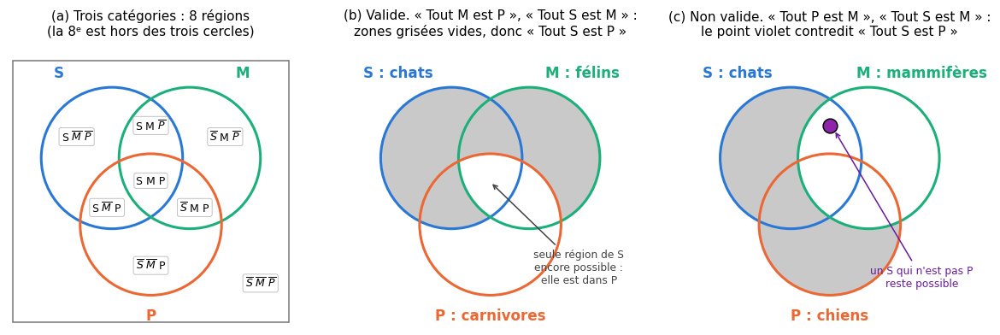
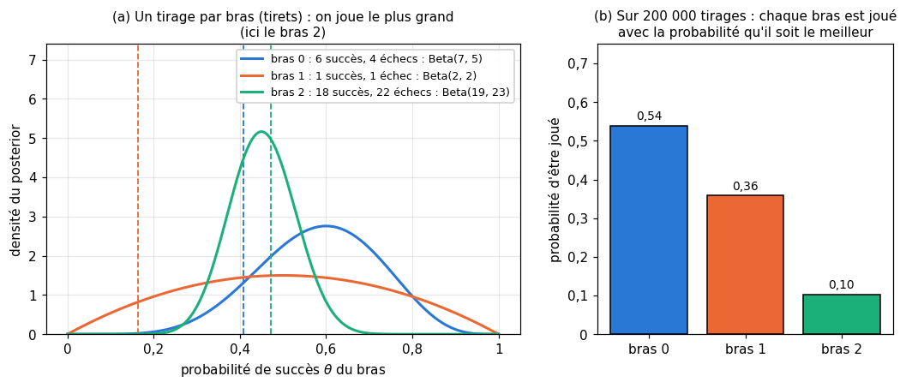

# 11 · Apprentissage et raisonnement — fiche de cours

> Cette fiche accompagne le chapitre 11 du livre, le plus « philosophique » du volume : il n'y a presque pas de formules, mais beaucoup de mots précis. Le livre décompose l'apprentissage d'une machine en trois étapes (représenter, évaluer, optimiser), puis présente les deux grandes façons de raisonner : la **déduction**, qui tire une conclusion certaine de prémisses, avec ses syllogismes et ses sophismes, et l'**induction**, qui tire une règle probable d'observations, là où vit le machine learning. Il termine par le **conditionnement opérant**, l'apprentissage par récompenses et punitions des behavioristes. La fiche ajoute ce dont tu as besoin pour juger un raisonnement et pour coder : la forme des propositions et la vérification d'un syllogisme par diagramme de Venn, les définitions usuelles des sophismes inductifs (le livre s'en écarte parfois), et, au-delà du livre, les **bandits manchots**, le plus petit problème où un agent apprend par essais, récompenses et erreurs. Les exemples du livre (l'enquête au manoir, la boutique de fruits, les citations de Sherlock Holmes) ne sont que résumés : chaque section te dit où les lire.

| | |
|---|---|
| **Livre** | vol. 1, ch. 11 « Learning and Reasoning », p. 394-430 (§11.1 à §11.7) |
| **Temps total estimé** | ≈ 17 h : lecture du livre et de la fiche ≈ 2,8 h, exercices ≈ 13 h, 25 flashcards ≈ 0,8 h |
| **Prérequis** | 0A (ensembles, `itertools`, fonctions, lecture de fichiers texte, module `re`, module `json`) · 0B (puissances, logarithme népérien, espérance) · ch. 2 (échantillonnage, proportion, loi de Bernoulli) · ch. 3 (probabilité conditionnelle, precision et recall) · ch. 4 (règle de Bayes, pièce biaisée, loi Beta) · ch. 5 (minimum local et global) · ch. 6 (bits, fréquences de mots de Holmes et Verne) · ch. 8 (représentativité, fuite de données, erreur type d'une proportion) · ch. 9 (overfitting) · ch. 10 (perceptron et sa règle d'apprentissage) |
| **Fichiers du chapitre** | `02_exercices.md` (quiz, rappels, papier, réflexion, entretien) · `03_notebook.ipynb` · `04_indices.md` · `05_solutions.md` et `05_solutions.ipynb` · `06_mes_reponses.md` · `flashcards.csv` |
| **mylearn** | `bandit.py` : `BernoulliBandit` et `GaussianBandit` (11.19), `argmax_random_tie`, `epsilon_greedy_action` et `incremental_update` (11.20), `run_bandit` (11.21), `ucb_action` et `thompson_action` (11.23). Le ch. 26 (apprentissage par renforcement) réutilisera les trois fonctions de 11.20 |

## Comment utiliser ce chapitre

Le livre avance en cinq temps : les trois étapes de l'apprentissage (§11.2), la déduction et ses sophismes (§11.3 et §11.4), l'induction et ses sophismes (§11.5), la façon dont les deux se combinent (§11.6), et le conditionnement opérant (§11.7). Compte un peu moins de trois heures pour ses 37 pages et cette fiche. La fiche suit le même plan, avec cinq encadrés 🧮 : compter ce qu'une représentation peut contenir, la forme des propositions et leur « distribution », le diagramme de Venn d'un syllogisme, ce que vaut une généralisation, et les bandits manchots (moyenne incrémentale, ε-greedy, UCB, échantillonnage de Thompson).

**Ordre conseillé.**
1. Lis le livre §11.1 à §11.2.3, puis les sections 11.1 et 11.2 de la fiche. Fais les quiz Q1 à Q5, le rappel R1 et l'exercice 11.1.
2. Lis le livre §11.3 à §11.4.1, puis les sections correspondantes de la fiche. Fais les quiz Q6 à Q8, les exercices 11.3 et 11.5.
3. Lis le livre §11.5 à §11.6.1, puis les sections correspondantes de la fiche. Fais les quiz Q9 à Q12, les rappels R2 et R3, les exercices 11.4 et 11.6, et l'oral 🗣️ 11.9.
4. Lis le livre §11.7 et la fin de la fiche (le conditionnement opérant, puis les bandits). Fais la preuve ∂ 11.2, les exercices 11.7 et 11.8, la lecture de courbes 📈 11.10, le cas ⚖️ 11.11 et la lecture 📄 11.12, sauf sa question 4, qui attend le tournoi 🔬 11.26. Vérifie tes réponses courtes dans la partie 0 du notebook.
5. Fais le notebook dans l'ordre : partie A (11.13 : prédire ce que fait un agent glouton), partie B (11.14 à 11.16 : Holmes, les syllogismes par force brute, la figure des sophismes), partie C (11.17 et 11.18 : l'induction mise à l'épreuve), partie D (11.19 à 11.23 : ta librairie `bandit.py`), partie E (11.24 à 11.27 : déboguer, journaliser, comparer, et le défi). Finis par la question 4 de 📄 11.12 et les quatre questions d'entretien.

| Section | Quiz 🧠 et rappels 🔁 | Papier ✏️ ∂ et réflexion | Notebook | Entretien 💼 |
|---|---|---|---|---|
| 11.1 Pourquoi ce chapitre | Q1 | 11.9 | | |
| 11.2 Les trois étapes de l'apprentissage | Q1 | 11.12 | 11.26 | E3 |
| 11.2.1 La représentation | Q2, Q3, R1 | 11.1, 11.12 | 11.18 | E3 |
| 11.2.2 L'évaluation | Q4 | 11.8, 11.12 | 11.21, 11.26 | |
| 11.2.3 L'optimisation | Q5 | 11.12 | 11.26, 11.27 | E3 |
| 11.3 Déduction et induction | Q6 | 11.9 | 11.14 | |
| 11.4 La déduction | Q7 | 11.3, 11.5 | 11.15 | |
| 11.4.1 Les sophismes syllogistiques | Q8 | 11.3, 11.4 | 11.15, 11.16 | |
| 11.5 L'induction | Q9, R3 | 11.6 | 11.17 | E4 |
| 11.5.1 Le vocabulaire inductif du ML | Q9, R2 | 11.6, 11.9 | 11.17 | E4 |
| 11.5.2 Les sophismes inductifs | Q10 | 11.4 | 11.17, 11.18 | E4 |
| 11.6 Raisonnement combiné | Q11 | 11.9 | | |
| 11.6.1 Sherlock Holmes | Q12 | | 11.14 | |
| 11.7 Le conditionnement opérant, puis les bandits | | 11.2, 11.7, 11.8, 11.10, 11.11 | 11.13, 11.19 à 11.27 | E1, E2 |

**Lire les formules.** En logique, $S$, $M$ et $P$ désignent trois catégories : le **sujet** de la conclusion, le **moyen terme** (qui relie les deux prémisses) et le **prédicat** de la conclusion. Pour les bandits, $K$ est le nombre de bras (d'actions), numérotés de 0 à $K - 1$ comme les indices d'un tableau NumPy ; $q_*(a)$ la vraie valeur du bras $a$, c'est-à-dire l'espérance de sa récompense (0B), inconnue de l'agent ; $q_* = \max_a q_*(a)$ celle du meilleur bras ; $A_t$ le bras joué au pas $t$ et $R_t$ la récompense reçue ; $Q_t(a)$ l'estimation de $q_*(a)$ avant le pas $t$ et $N_t(a)$ le nombre de fois que $a$ a été joué avant le pas $t$ ; $\varepsilon$ (« epsilon ») la probabilité d'explorer et $c$ la force de l'exploration d'UCB. $\ln$ est le logarithme népérien.

## Objectifs d'apprentissage

À la fin du chapitre, tu sais :
- **décomposer** un algorithme d'apprentissage en représentation, évaluation et optimisation, et **expliquer** ce que dit, et ne dit pas, le théorème « No Free Lunch » ;
- **distinguer** déduction et induction, validité et solidité, et **nommer** les sophismes syllogistiques et inductifs classiques ;
- **vérifier** mécaniquement la validité d'un syllogisme, par un diagramme de Venn puis par une recherche exhaustive de contre-exemple ;
- **relier** les principes de l'induction (généralisation, syllogisme statistique, prédiction) au vocabulaire du ML, et **repérer** un échantillon biaisé ;
- **classer** une rétroaction dans les quatre cases du conditionnement opérant ;
- **implémenter** un bandit manchot et les stratégies ε-greedy, UCB et Thompson, et **comparer** leurs regrets.

## L'essentiel en 10 lignes

1. Selon Domingos (2012), tout algorithme d'apprentissage combine une **représentation** (ce qu'il peut exprimer), une **évaluation** (la mesure qui dit si une solution est bonne) et une **optimisation** (la méthode qui cherche une bonne solution).
2. Ce qu'une représentation ne peut pas exprimer ne s'apprend pas ; ce qu'elle peut exprimer ne s'apprend pas forcément, ni en pratique, ni efficacement. Plus de puissance, c'est aussi plus de risque de surapprendre (ch. 9).
3. Optimiser, c'est améliorer ; ce n'est pas atteindre l'optimum. Le théorème **No Free Lunch** dit qu'en moyenne sur tous les problèmes possibles, aucun algorithme ne bat les autres : on gagne parce que ses hypothèses collent à la structure de **son** problème.
4. Une **déduction** est un raisonnement dont la conclusion est **nécessairement** vraie si les prémisses le sont. Une **induction** donne une conclusion seulement **probable**, que de nouvelles observations peuvent renverser.
5. Un **syllogisme** tire une conclusion de deux prémisses. Il est **valide** si sa forme garantit la conclusion, **solide** s'il est valide et que ses prémisses sont vraies. Un diagramme de Venn à trois cercles, ou l'examen des 256 « mondes » possibles, tranche la validité.
6. Un **sophisme** est un raisonnement invalide qui en a l'air : affirmer le conséquent, nier l'antécédent, majeur ou mineur illicite, moyen terme non distribué. Une conclusion vraie peut sortir d'un sophisme.
7. L'induction généralise d'un **échantillon** à une **population** (généralisation), applique une proportion à un individu (syllogisme statistique) ou au prochain cas observé (prédiction). Les mots « généraliser » et « prédire » du ML viennent de là ; tous supposent un échantillon **représentatif**.
8. Les sophismes inductifs (généralisation hâtive, échantillon biaisé, induction paresseuse, exception écrasante…) sont les erreurs quotidiennes d'un data scientist. La science combine les deux raisonnements : ses prémisses générales viennent de l'induction, et une déduction n'est pas plus sûre qu'elles.
9. Le **conditionnement opérant** classe les conséquences d'un comportement : on **ajoute** (positif) ou on **retire** (négatif) un stimulus, pour **renforcer** (plus fréquent) ou **punir** (moins fréquent) ce comportement. C'est l'ancêtre de l'apprentissage par renforcement (ch. 26).
10. Au-delà du livre : un **bandit manchot** à $K$ bras est le plus petit problème de renforcement. L'agent doit **explorer** (essayer les bras mal connus) et **exploiter** (jouer le meilleur connu). ε-greedy, UCB et Thompson règlent ce compromis ; on les compare par leur **regret**, ce que l'on perd à ne pas jouer toujours le meilleur bras.

## 11.1 · Pourquoi ce chapitre ?

Un modèle de ML passe son temps à conclure : « ce client va résilier », « cette radio montre une fracture ». Ces conclusions sont-elles justifiées, et jusqu'à quel point ? La question est bien plus vieille que l'informatique : depuis l'Antiquité, logiciens et philosophes classent les raisonnements selon ce qu'ils garantissent. Le ch. 4 y a déjà répondu par un calcul, la règle de Bayes, qui dit de combien une croyance doit bouger quand une observation arrive. Ici, on regarde la **forme** des raisonnements : laquelle conduit à coup sûr des prémisses à la conclusion, laquelle ne fait que la rendre plausible. Pour qu'un programme fasse ce tri, il faut savoir l'écrire : c'est l'objet des sections 11.3 à 11.6.

Le chapitre ne contient presque pas de calcul, mais il te donne un vocabulaire que tu emploieras sans cesse : validité, généralisation, échantillon représentatif, renforcement. Le workbook y ajoute deux outils de programmeur : vérifier un raisonnement par force brute, et faire apprendre un agent par essais et erreurs.

## 11.2 · Les trois étapes de l'apprentissage

Le livre reprend la décomposition de Pedro Domingos (📄 11.12) : quel que soit l'algorithme, apprendre combine trois ingrédients.

| Ingrédient | La question qu'il règle | Perceptron (ch. 10) | Régression linéaire (ch. 9) | k-means (ch. 7) |
|---|---|---|---|---|
| **Représentation** | Quelles solutions peut-on exprimer ? | un hyperplan $\mathbf{w}\cdot\mathbf{x} + b = 0$ | une droite (ou un plan) $\hat{y} = \mathbf{w}\cdot\mathbf{x} + b$ | $k$ centroïdes |
| **Évaluation** | Comment juge-t-on une solution ? | les exemples mal classés ($y z \le 0$), à travers la loss $\max(0, -y z)$ (ch. 10) | l'erreur quadratique moyenne | l'inertie |
| **Optimisation** | Comment cherche-t-on une bonne solution ? | la règle de correction après chaque erreur | une formule (moindres carrés) ou la descente de gradient | l'algorithme de Lloyd |

Un même ingrédient se combine avec d'autres. L'hyperplan du perceptron, jugé par la cross-entropy et cherché par descente de gradient, devient la **régression logistique** ; jugé par la largeur de la marge entre les classes, il devient le **SVM** (les deux au ch. 13). La représentation est la même, l'algorithme ne l'est plus.

### 11.2.1 · La représentation

La **représentation**, c'est l'ensemble des solutions qu'un algorithme est capable d'écrire : la forme de ses paramètres et la façon dont on les lit. Un perceptron écrit une frontière droite et rien d'autre (ch. 10) ; une régression linéaire sur la seule variable $x$, une droite, jamais une parabole (ch. 9) ; un k-means, $k$ centroïdes (ch. 7). Aucune quantité de données n'y change rien : si la bonne réponse est hors de cet ensemble, l'algorithme en donnera au mieux une approximation. On parle de **puissance de représentation** (*representational power*) ; au ch. 9, on disait la capacité ou la complexité d'un modèle. Dans le livre, un **modèle** est un algorithme, avec sa représentation et des valeurs précises de ses paramètres.

Cette puissance a un prix, on l'a vu au ch. 9 avec le polynôme de degré 15 qui suivait le bruit ; et une représentation taillée pour ses données, comme les convolutions pour les images (ch. 21) ou les réseaux récurrents pour les séquences (ch. 22), apprend avec moins d'exemples qu'une représentation générique.

Le livre range ce qu'un système peut apprendre en boîtes emboîtées (sa figure 11.1) : ce qui est **représentable** ; ce qui est **apprenable en théorie** ; ce qui est **apprenable en pratique**, avec des ressources finies ; ce qui est **apprenable efficacement**, avec les ressources dont on dispose. Il illustre d'abord la représentation elle-même : on ne peut pas stocker tous les chiffres de π, en nombre infini, mais on peut stocker un programme qui les calcule. Puis deux exemples de « représentable mais pas (encore) apprenable » : les ouragans de l'an prochain, dont on peut préparer les cases (date de formation, vent maximal…) sans pouvoir les remplir aujourd'hui, et le problème de l'arrêt (encadré ⚠️ ci-dessous).

> 🧮 **Rappel maths — compter ce qu'une représentation peut contenir** — Avec $n$ bits, on écrit $2^n$ valeurs différentes, pas une de plus (ch. 6) : 16 bits donnent 65 536 valeurs, de 0 à 65 535 si on les lit comme des entiers sans signe. Pour les entiers signés, les processeurs utilisent le **complément à deux** : la moitié des $2^n$ valeurs sert aux négatifs, l'autre moitié à 0 et aux positifs, si bien qu'on écrit les entiers de $-2^{n-1}$ à $2^{n-1} - 1$ (de $-32\,768$ à $32\,767$ sur 16 bits). Une **fonction booléenne** de $n$ entrées binaires associe 0 ou 1 à chacune des $2^n$ combinaisons d'entrées : il y en a donc $2^{2^n}$ (16 pour deux entrées). Un perceptron n'en représente qu'une partie, les fonctions **à seuil** : pour deux entrées, toutes sauf XOR et sa négation, soit 14 sur 16 (ch. 10). *Mini-exemple :* les carrés des entiers de 1 à un million vont jusqu'à $10^{12}$, qui demande 40 bits ($2^{40} \approx 1{,}1 \times 10^{12}$) ; les stocker tous prend donc environ 40 millions de bits, alors qu'une boucle de deux lignes les produit à la demande. Une représentation peut être un **calcul**, pas seulement une table (✏️ 11.1).

> ⚠️ **Le problème de l'arrêt, mal décrit par le livre** — Le livre affirme que, pour un programme **précis** et une entrée **précise**, il est impossible de prédire s'il s'arrêtera. Ce n'est pas ce que dit le théorème de Turing (1936). Pour un couple précis, la réponse existe (oui ou non), et on sait souvent la démontrer : `while True: pass` ne s'arrête jamais, un programme sans boucle s'arrête toujours. Ce qui est impossible, c'est un **algorithme unique** qui répondrait correctement, en un temps fini, pour **tous** les couples (programme, entrée). La leçon du livre tient avec cette correction. Dans ses boîtes, la fonction « ce programme s'arrête-t-il sur cette entrée ? » est **représentable** au sens où chaque réponse tient en un bit ; mais aucun programme ne calcule ce bit pour tous les couples, et comme il y en a une infinité, on ne peut pas non plus en stocker la table : aucun système ne l'apprendra exactement. Le livre a raison sur un point : regarder un programme tourner ne prouve jamais qu'il ne s'arrêtera pas.

### 11.2.2 · L'évaluation

Sous le seul mot d'« erreur », le livre range trois nombres qui ne jouent pas le même rôle :
- la **loss** (*fonction de perte*), le nombre que l'optimiseur fait baisser pendant l'entraînement : cross-entropy, erreur quadratique… Elle doit se prêter à l'optimisation, souvent être dérivable (ch. 5) ;
- la **métrique**, le nombre qui juge le modèle sur la validation ou le test : accuracy, precision, recall, F1 (ch. 3 ; ces noms restent en anglais, « précision » serait ambigu). Elle parle le langage du problème, mais elle est souvent en escalier : une petite modification des poids ne change pas le nombre d'exemples bien classés, sa dérivée est nulle presque partout, et la descente de gradient n'en tire rien ;
- l'**objectif**, ce que le projet cherche vraiment : réduire les fraudes, le temps d'attente, un coût.

On entraîne donc sur une loss qui sert de **substitut** (*surrogate*) à la métrique, et on choisit la métrique qui traduit le mieux l'objectif.

> ⚠️ **Accuracy, precision et recall mélangés** — Pour un détecteur de chats, le livre associe à l'accuracy le souhait de « n'appeler chat que ce qui est vraiment un chat » : c'est la définition de la **precision** (parmi les images prédites « chat », la part de vrais chats). Puis il propose, pour que la plupart des photos de chats soient reconnues, de pénaliser une precision faible : ce souhait-là, c'est le **recall** (parmi les vrais chats, la part reconnue). L'accuracy, elle, compte toutes les bonnes réponses, chats et non-chats confondus (ch. 3).

### 11.2.3 · L'optimisation

En ML, **optimiser** un modèle, c'est le rendre meilleur pas à pas ; rien ne dit qu'il deviendra **optimal**, c'est-à-dire impossible à améliorer (pour un critère donné). Une descente de gradient s'arrête là où plus aucun petit pas ne fait baisser la loss : un **minimum local**, pas forcément le **minimum global** (ch. 5). Le livre en donne une image domestique (du linge suspendu au ruban adhésif). En voici une autre : tu peux alléger ton vélo, changer ses pneus et ses vitesses, chaque réglage le rend meilleur, mais il ne deviendra pas un train.

Le ch. 19 présentera une dizaine d'**optimiseurs**, les algorithmes qui ajustent les paramètres (SGD, Adam…). Le théorème **No Free Lunch** (« pas de repas gratuit ») explique pourquoi aucun ne gagne partout. Démontré par Wolpert et Macready (1997) pour l'optimisation, et par Wolpert (1996) pour l'apprentissage supervisé, il dit qu'**en moyenne sur tous les problèmes possibles**, tous les algorithmes se valent : ce qu'un algorithme gagne sur une famille de problèmes, il le perd sur une autre.

Ce théorème est souvent mal cité. Il ne dit pas qu'un algorithme ne fait pas mieux qu'un autre sur **ton** problème. Il dit qu'un algorithme ne gagne que parce que ses hypothèses (on parle de **biais inductif** : préférer les frontières lisses, les modèles simples, les fonctions qui changent peu d'un point voisin à l'autre) correspondent à la structure des problèmes qu'on lui donne. Les données seules ne suffisent pas : sans hypothèse sur ce qu'on n'a pas vu, rien ne permet de préférer une prédiction à une autre. C'est la version mathématique d'une vieille question de Hume (§11.6).

> 🕰️ **Mise à jour (2026) — No Free Lunch et les choix par défaut** — **Le livre :** cite le théorème pour expliquer qu'on choisit l'optimiseur selon le problème, par expérience, intuition ou essais. · **Aujourd'hui :** le théorème est vrai, mais il fait la moyenne sur **tous** les problèmes possibles, y compris ceux, innombrables, qui n'ont aucune structure ; les problèmes réels en ont une. En pratique, quelques choix par défaut dominent donc largement : AdamW (Loshchilov et Hutter, ICLR 2019) pour entraîner les réseaux de neurones, et les arbres de décision boostés pour les données tabulaires de taille moyenne (environ 10 000 exemples), qui battaient encore l'apprentissage profond sur les 45 datasets de Grinsztajn, Oyallon et Varoquaux (NeurIPS 2022). Ces positions bougent : en 2025, TabPFN, un modèle de fondation tabulaire pré-entraîné sur des millions de datasets synthétiques, a dépassé les arbres boostés sur des jeux d'au plus 10 000 exemples (Hollmann et al., *Nature*, 2025), et sa version 2.5 (novembre 2025) monte à 50 000 exemples et 2 000 features (Grinsztajn et al., 2025). · **Faut-il quand même l'apprendre ?** Oui : il explique pourquoi on compare toujours plusieurs méthodes, sur ses propres données, en validation (ch. 8), et pourquoi « cet algorithme est le meilleur » n'a de sens que pour une famille de problèmes. · *Sources :* [Wolpert et Macready (1997)](https://ieeexplore.ieee.org/document/585893) ; [Wolpert (1996)](https://mlanthology.org/neco/1996/wolpert1996neco-lack) ; [Loshchilov et Hutter (2019)](https://arxiv.org/abs/1711.05101) ; [Grinsztajn et al. (2022)](https://arxiv.org/abs/2207.08815) ; [Hollmann et al. (2025)](https://www.nature.com/articles/s41586-024-08328-6) ; [Grinsztajn et al. (2025)](https://arxiv.org/abs/2511.08667).

## 11.3 · Déduction et induction ⏩

Deux façons de raisonner traversent tout le chapitre. La **déduction** part de ce qu'on tient pour vrai et en tire ce qui s'ensuit forcément ; l'**induction** part de ce qu'on a observé et en tire ce qui est probablement vrai au-delà. Un modèle de ML fait les deux : il induit une règle pendant l'entraînement, puis l'applique à chaque nouveau cas, comme on applique une prémisse (§11.6).

| | Déduction | Induction |
|---|---|---|
| Point de départ | des prémisses (des règles, des faits) | des observations |
| Lien entre prémisses et conclusion | **nécessaire** : si les prémisses sont vraies, la conclusion ne peut pas être fausse | **probable** : la conclusion peut être fausse même si toutes les observations sont exactes |
| Une nouvelle observation… | ne change rien à la validité | peut renverser la conclusion |
| Image d'école | « descendante » (du général au particulier) | « ascendante » (du particulier au général) |
| En ML | appliquer une règle, vérifier une preuve, un programme | apprendre un modèle à partir d'exemples |

> ⚠️ **Ce que le livre appelle « déduction » au §11.3** — Le livre décrit la déduction comme un cycle : partir d'une théorie, recueillir des données, la confirmer ou la restreindre. C'est la **méthode hypothético-déductive** des sciences, qui mélange les deux raisonnements : l'hypothèse naît souvent d'une induction, on en **déduit** des prédictions testables, puis on les confronte aux données. Au sens strict (celui du §11.4 du livre et de la logique), une déduction est un raisonnement dont la conclusion découle **nécessairement** des prémisses. Quant à l'image « du général au particulier », c'est un raccourci d'école : « tout chat est un félin, tout félin est carnivore, donc tout chat est carnivore » est une déduction qui va du général au général, et « les 100 pommes que j'ai goûtées étaient sucrées, donc la prochaine le sera » une induction qui va du particulier au particulier. Ce qui distingue vraiment les deux, c'est la **nécessité** contre la **probabilité**.

## 11.4 · La déduction ⏩

**L'enquête du livre.** Le livre raconte un meurtre dans un manoir isolé sur une île (pas de bateau, pas d'invité) : un inspecteur part de l'hypothèse que le coupable est l'un des cinq domestiques présents, puis élimine les suspects un par un en testant des prédictions (la vieille femme de chambre ne peut pas soulever l'arme : il le vérifie avec un objet plus léger). L'ensemble des possibilités dont parle le raisonnement s'appelle le **domaine du discours** ; enquêter, c'est le réduire. Lis-le dans le livre (§11.4, figure 11.2) : l'idée servira dans ✏️ 11.5.

> ⚠️ **Une prémisse invérifiée, et une conclusion de trop** — (1) Toute l'élimination repose sur une prémisse que l'inspecteur pose sans la vérifier : « le coupable est dans cette pièce » (personne d'autre sur l'île). On l'appelle l'**hypothèse du monde clos** ; si elle est fausse, la conclusion tombe. Un classifieur la fait aussi : entraîné sur dix chiffres, il range une lettre dans l'un des dix. (2) Le livre conclut que les deux derniers suspects, le cuisinier et le majordome, ont agi **ensemble**. Ce n'est pas une déduction : de « le coupable est l'un des cinq » et « trois sont innocents », on tire seulement « **au moins l'un** des deux restants est coupable ». La complicité demande d'autres indices.

**Le syllogisme catégorique.** La forme la plus dépouillée de la déduction est le **syllogisme** : deux prémisses, puis une conclusion. Dans un syllogisme **catégorique**, chaque phrase relie deux catégories. Exemple :

1. Tout félin est carnivore. (prémisse **majeure** : elle contient le **prédicat** de la conclusion, « carnivore »)
2. Tout chat est un félin. (prémisse **mineure** : elle contient le **sujet** de la conclusion, « chat »)
3. Donc tout chat est carnivore. (**conclusion**)

Le terme commun aux deux prémisses, « félin », est le **moyen terme** : il fait le lien, puis disparaît de la conclusion (figures 11.3 et 11.4 du livre, sur le syllogisme de Socrate). Les logiciens remplacent souvent les mots par des lettres : « Tout $M$ est $P$ ; tout $S$ est $M$ ; donc tout $S$ est $P$ ».

Un syllogisme est **valide** si la conclusion découle de la forme des prémisses, quoi qu'elles disent ; c'est une question de logique, pas de vérité. Il est **solide** (*sound*) s'il est valide **et** que ses prémisses sont vraies ; c'est seulement alors que la conclusion est garantie vraie. *Mini-exemple :* « Tout nombre pair est divisible par 4 ; 6 est pair ; donc 6 est divisible par 4 » est valide (même forme que le syllogisme des chats), mais pas solide : la majeure est fausse, et la conclusion aussi. Un syllogisme non valide, lui, ne garantit rien, même si sa conclusion est vraie. Pour un programme, c'est une aubaine : la validité se vérifie en manipulant des symboles, sans rien savoir des chats ni des félins. Tu le feras par force brute en 🔨 11.15.

> 🧮 **Rappel maths — les quatre formes de propositions et leur distribution (au-delà du livre)** — Une proposition catégorique a l'une de quatre formes, nommées par des voyelles depuis le Moyen Âge :
> - **A** « Tout $S$ est $P$ » (universelle affirmative) ;
> - **E** « Aucun $S$ n'est $P$ » (universelle négative) ;
> - **I** « Quelque $S$ est $P$ », c'est-à-dire au moins un (particulière affirmative) ;
> - **O** « Quelque $S$ n'est pas $P$ » (particulière négative).
>
> Un terme est **distribué** dans une proposition si elle dit quelque chose de **tous** ses membres : A distribue son sujet ; E ses deux termes ; I aucun ; O son prédicat (« quelque $S$ n'est pas $P$ » exclut ce $S$ de **tout** $P$). Une phrase sur un individu (« Socrate est un homme ») se traite comme une universelle : elle parle de tout Socrate. Un syllogisme catégorique est valide si et seulement s'il respecte quatre règles : (1) le moyen terme est distribué au moins une fois ; (2) un terme distribué dans la conclusion l'est aussi dans sa prémisse ; (3) les deux prémisses ne sont pas toutes deux négatives ; (4) la conclusion est négative si et seulement si une prémisse l'est. Ces règles supposent, comme Aristote, que chaque catégorie a au moins un membre ; la logique moderne ne le suppose pas, et quelques formes cessent alors d'être valides (🔨 11.15). Les logiciens du Moyen Âge ont donné un nom à chaque forme valide, dont les voyelles sont celles de la majeure, de la mineure et de la conclusion : **Barbara** (A, A, A : « tout $M$ est $P$ ; tout $S$ est $M$ ; donc tout $S$ est $P$ », le syllogisme des chats carnivores), **Celarent** (E, A, E), **Ferio** (E, I, O), ou **Darapti** (A, A, I : « tout $M$ est $P$ ; tout $M$ est $S$ ; donc quelque $S$ est $P$ », valide seulement si $M$ a au moins un membre). *Mini-exemple :* « Tout chat a quatre pattes ; toute table a quatre pattes ; donc toute table est un chat » : le moyen terme « avoir quatre pattes » est le prédicat de deux propositions A, jamais distribué ; la règle (1) est violée.

> 🧮 **Rappel maths — vérifier un syllogisme avec un diagramme de Venn** — Trois cercles $S$, $M$ et $P$ découpent le plan en **8 régions**, une par combinaison « dans ou hors de $S$, de $M$, de $P$ » (figure ci-dessous, (a)). Chaque prémisse universelle dit que des régions sont **vides** : on les grise (« Tout $M$ est $P$ » vide les deux régions de $M$ hors de $P$). Chaque prémisse particulière dit qu'une région **contient au moins un élément** : on y met une croix (sur la frontière si elle peut tomber dans deux régions). Le syllogisme est valide si, une fois les prémisses dessinées, la conclusion est **déjà** dessinée : (b) le montre pour les chats carnivores. Sinon, une région laissée libre fournit un **contre-exemple**, un monde où les prémisses sont vraies et la conclusion fausse (le point violet de (c)). Un ordinateur peut faire la même chose par force brute : chacune des 8 régions est vide ou non, ce qui fait $2^8 = 256$ « mondes » ; le syllogisme est valide si aucun des 256 ne rend les prémisses vraies et la conclusion fausse (🔨 11.15). Attention : le diagramme, comme la force brute, laisse une catégorie entière vide si les prémisses le permettent. C'est la lecture moderne, sans l'hypothèse d'Aristote de l'encadré précédent ; une forme comme Darapti y perd sa validité, à moins d'ajouter une prémisse qui dit que $M$ a un membre.

**Les autres syllogismes.** Le livre en présente deux autres familles.
- Le **syllogisme conditionnel** part d'un « si… alors… ». Deux formes sont valides : *modus ponens* (« s'il pleut, la route est mouillée ; il pleut ; donc la route est mouillée ») et *modus tollens* (« s'il pleut, la route est mouillée ; la route est sèche ; donc il ne pleut pas »). Deux formes ne le sont pas : **affirmer le conséquent** (« la route est mouillée, donc il pleut » : un arrosage suffit) et **nier l'antécédent** (« il ne pleut pas, donc la route est sèche »). L'exemple du livre sur John et son imperméable est une affirmation du conséquent, même s'il ne la nomme qu'au §11.4.1.
- Le **syllogisme disjonctif** part d'un « ou » : « le serveur est en panne ou le réseau est coupé ; le serveur fonctionne ; donc le réseau est coupé » est valide. Le second exemple du livre (le ciel clair ou nuageux, et Bob qui aime les étoiles) n'est pas un syllogisme disjonctif raté : sa seconde prémisse ne parle même pas des deux possibilités, et la conclusion ne suit de rien.

> ⚠️ **Le « ou » du syllogisme disjonctif n'a pas besoin d'être exclusif** — Le livre exige que les deux possibilités ne soient pas vraies ensemble. C'est inutile : « $A$ ou $B$ (peut-être les deux) ; pas $A$ ; donc $B$ » est valide. L'exclusivité ne sert qu'à la forme inverse, « $A$ ou $B$, pas les deux ; $A$ ; donc pas $B$ ». Avec un « ou » ordinaire, celle-ci est un sophisme : « le modèle surapprend ou les données sont bruitées ; il surapprend ; donc les données ne sont pas bruitées » ne tient pas, les deux peuvent être vrais.

### 11.4.1 · Les sophismes syllogistiques

Un **sophisme** (*fallacy*) est une erreur de raisonnement qui a l'apparence d'un raisonnement correct ; un sophisme **formel** est une forme invalide. Le livre en présente cinq, sur des fruits d'une boutique (figure 11.5, où un point violet montre à chaque fois un contre-exemple). Voici les mêmes formes sur d'autres exemples, avec une sixième que le livre ne cite pas.

| Sophisme | Forme | Exemple | Pourquoi c'est faux |
|---|---|---|---|
| **Affirmer le conséquent** | si $X$ alors $Y$ ; $Y$ ; donc $X$ | Si c'est un chat, il a quatre pattes. Cet animal a quatre pattes. Donc c'est un chat. | un chien aussi a quatre pattes |
| **Nier l'antécédent** | si $X$ alors $Y$ ; pas $X$ ; donc pas $Y$ | Si c'est un chat, il a quatre pattes. Cet animal n'est pas un chat. Donc il n'a pas quatre pattes. | idem : le chien |
| **Majeur illicite** | tout $M$ est $P$ ; aucun $S$ n'est $M$ ; donc aucun $S$ n'est $P$ | Tout chat a quatre pattes. Aucun chien n'est un chat. Donc aucun chien n'a quatre pattes. | $P$ (« quatre pattes ») est distribué dans la conclusion, pas dans la majeure |
| **Mineur illicite** | tout $M$ est $P$ ; tout $M$ est $S$ ; donc tout $S$ est $P$ | Tout chat a quatre pattes. Tout chat est un mammifère. Donc tout mammifère a quatre pattes. | $S$ (« mammifère ») est distribué dans la conclusion, pas dans la mineure : la baleine |
| **Moyen terme non distribué** | tout $P$ est $M$ ; tout $S$ est $M$ ; donc tout $S$ est $P$ | Tout chat a quatre pattes. Toute table a quatre pattes. Donc toute table est un chat. | le moyen terme ne relie rien |
| **Prémisses exclusives** (hors livre) | aucun $S$ n'est $M$ ; aucun $M$ n'est $P$ ; donc aucun $S$ n'est $P$ | Aucun chat n'est un poisson. Aucun poisson n'est un mammifère. Donc aucun chat n'est un mammifère. | deux négations n'établissent aucun lien |

> ⚠️ **Deux noms venus d'une autre logique, et une boutique incohérente** — « Affirmer le conséquent » et « nier l'antécédent » sont les noms des sophismes du **syllogisme conditionnel**. Les deux premiers exemples du livre (« toutes les pommes sont mûres ; ce fruit est mûr ; donc c'est une pomme ») se lisent aussi comme des syllogismes catégoriques ; ce sont alors un moyen terme non distribué et un majeur illicite. Les deux lectures mènent à la même conclusion : c'est invalide. Par ailleurs, le livre déclare mûrs les pommes, les bananes et les abricots, puis donne les abricots comme exemple de fruit peut-être pas mûr (mineur illicite) : c'est la pêche qui convient.

Connaître ces formes par leur nom aide à les reconnaître dans une discussion, un rapport d'analyse ou une revue de code. Attention à l'erreur inverse : repérer un sophisme ne réfute pas sa conclusion. « Aucun chat n'est un oiseau ; aucun oiseau n'est un chien ; donc aucun chat n'est un chien » a deux prémisses négatives, et pourtant sa conclusion est vraie ; le raisonnement ne l'établit pas, voilà tout. Dire « ton argument est un sophisme, donc ta conclusion est fausse » est d'ailleurs un sophisme à son tour (on l'appelle parfois le « sophisme du sophisme »).

> ⚠️ **« La conclusion est vraie ou pas »** — À la fin du §11.4.1, le livre écrit que, si les prémisses sont correctes, on peut affirmer avec certitude que la conclusion « est vraie ou pas » : la phrase a perdu un morceau. Ce qu'il faut retenir : si le syllogisme est **valide** et ses prémisses **vraies**, la conclusion est **nécessairement vraie** ; s'il n'est pas valide, il ne dit rien de la conclusion.

## 11.5 · L'induction ⏩

Une **induction** fait un pari : ce qui a été vrai de tous les cas observés le sera aussi des autres. Pendant des siècles, les Européens n'avaient vu que des cygnes blancs, et « tous les cygnes sont blancs » semblait acquis ; à la fin du XVIIᵉ siècle, des explorateurs en ont vu des noirs en Australie. Remarque l'asymétrie : des milliers de cygnes blancs ne démontraient pas la règle, **un seul** cygne noir l'a réfutée (Karl Popper en a fait le cœur de sa philosophie des sciences). Reste alors à affaiblir la règle, en « la plupart des cygnes sont blancs », comme le livre le fait avec ses pommes.

Autre leçon des cygnes : chaque observation était exacte, personne n'avait mal raisonné, et la conclusion était fausse. En déduction valide, c'est impossible ; en induction, c'est le risque normal, qu'on réduit en multipliant et en variant les observations, sans jamais l'annuler. La règle de Bayes (ch. 4) donne une façon de chiffrer la confiance : chaque observation met à jour la probabilité de l'hypothèse.

Le livre formalise l'induction avec quatre mots (figure 11.6) : la **population** (tout ce qu'on pourrait observer), l'**échantillon** (*sample set*, quelques membres tirés **au hasard** de la population : un ensemble, au sens statistique du ch. 2, et non une ligne du dataset comme au ch. 1), l'**individu** (un membre) et une **propriété** que possède une partie de la population (un poids, une couleur…). Trois principes en découlent. Exemple : une entreprise tire au hasard 400 e-mails de sa messagerie, dont 48 sont des spams, soit 12 %.

| Principe | De… à… | Exemple |
|---|---|---|
| **Généralisation** | de l'échantillon à la population | environ 12 % de tous les e-mails reçus sont des spams |
| **Syllogisme statistique** | de la population à un individu | si 12 % des e-mails sont des spams, un e-mail tiré au hasard dans la messagerie a 12 % de chances d'en être un |
| **Prédiction** | de l'échantillon au prochain individu observé | le prochain e-mail tiré au hasard a environ 12 % de chances d'être un spam |

On sous-entend d'ordinaire « probablement » ou « environ » dans la conclusion. Les trois principes reposent sur la même hypothèse : l'échantillon est **représentatif** de la population (ch. 8).

> 🧮 **Rappel maths — combien vaut une généralisation ?** — Une proportion $\hat{p}$ mesurée sur un échantillon aléatoire de taille $n$ a une **erreur type** $\mathrm{SE} = \sqrt{\hat{p}(1-\hat{p})/n}$ (ch. 8). Avec 48 spams sur 400, $\mathrm{SE} = \sqrt{0{,}12 \times 0{,}88 / 400} \approx 0{,}016$ : la vraie proportion est très probablement à moins de $2\,\mathrm{SE} \approx 3$ points de 12 % (environ 9 % à 15 %). Pour la prédiction, le ch. 4 propose aussi la **règle de succession** de Laplace : avec un prior uniforme, la probabilité que le prochain individu ait la propriété vaut $(h+1)/(n+2)$, ici $49/402 \approx 0{,}122$, un peu tirée vers 1/2 quand l'échantillon est petit. Aucune de ces formules ne corrige un échantillon **biaisé** : elles mesurent le hasard du tirage, pas les défauts de la collecte.

### 11.5.1 · Le vocabulaire inductif du ML ⏩

Les mots « généraliser » et « prédire » du ML viennent directement de ces principes. Un modèle **généralise** bien s'il transporte ce qu'il a appris sur le jeu d'entraînement (l'échantillon) aux données qu'il rencontrera en service (la population). Il **prédit** quand il attribue une valeur (un label, un nombre) à un nouvel exemple.

Le principe de généralisation du livre est exactement l'hypothèse qu'on fait en entraînant un modèle : le jeu d'entraînement est représentatif des données futures. En statistique, on la formule ainsi : les exemples sont **indépendants et identiquement distribués** (i.i.d.), tirés de la même loi que les données de service. Elle est fausse plus souvent qu'on ne le croit : la population change avec le temps (on parle de **dérive des données**, *distribution shift*), la collecte privilégie certains cas, le test ressemble trop à l'entraînement (fuite, ch. 8). Chaque fois, l'induction perd son fondement.

### 11.5.2 · Les sophismes inductifs ⏩

L'induction étant souple, elle offre beaucoup de façons de se tromper. Le livre en dessine huit (figures 11.10 et 11.11) : la population est un ensemble de points sur un cercle, et chaque sophisme fait conclure à une autre forme (une droite, une courbe en S, une boîte, une fleur…). Les définitions du livre s'écartent parfois de l'usage ; voici les définitions usuelles, avec des exemples de data science.

| Sophisme | Définition usuelle | Exemple | Figure du livre |
|---|---|---|---|
| **Généralisation abusive** (*faulty generalization*) | conclure sur tous les cas à partir de quelques-uns ; c'est la famille de la suivante | « nos trois premiers clients allemands ont résilié : les Allemands n'aiment pas le produit » | 11.10 (b) : une courbe en S tirée de quatre points |
| **Généralisation hâtive** (*hasty generalization*) | conclure à partir de trop peu d'observations, ou de cas non représentatifs | « deux clients sont partis après la hausse de prix : la hausse fait fuir les clients » | 11.10 (a) : une droite tirée de trois points proches |
| **Induction paresseuse** (*slothful induction*), aussi appelée **appel à la coïncidence** | refuser la conclusion qu'imposent des données nombreuses et nettes (« c'est le hasard ») | « le modèle échoue sur toutes les images de nuit depuis un an, mais c'est une coïncidence » | 11.10 (c) et 11.11 (b) : le livre en fait deux sophismes |
| **Échantillon biaisé** (*biased sample*) | l'échantillon n'est pas représentatif, à cause de la façon dont il a été collecté | estimer l'usage d'Internet par un sondage en ligne | 11.10 (d) : le livre parle de « voir ce qu'on veut voir » |
| **Exception écrasante** (*overwhelming exception*) | une généralisation exacte, mais assortie de tant d'exceptions qu'il n'en reste presque rien | « ce médicament n'a aucun effet secondaire, sauf chez les enfants, les seniors, les femmes enceintes et les insuffisants rénaux » | 11.11 (a) : le livre parle d'écarter des données gênantes |
| **Vivacité trompeuse** (*misleading vividness*) | une anecdote frappante pèse plus que des statistiques nombreuses | un crash d'avion très médiatisé fait croire l'avion plus dangereux que la voiture | 11.11 (c) : une droite qu'on « voit » et qu'on ne peut plus ne pas voir |
| **Plaidoyer spécial** (*special pleading*) | réclamer pour son cas une exception à une règle qu'on applique aux autres, sans justification | « les sondages qui donnent mon candidat perdant sont mal faits, les autres sont fiables », sans autre critère | 11.11 (d) : le livre y mêle l'argument d'autorité |

> ⚠️ **Où le livre s'écarte des définitions usuelles** — (1) Il distingue l'**induction paresseuse** et l'**appel à la coïncidence**, qui sont d'ordinaire deux noms du même sophisme. (2) Son « échantillon biaisé », qui consiste à voir ce qu'on veut voir, est le **biais de confirmation** ; un échantillon biaisé est un défaut de **collecte**, qui trompe même un observateur parfaitement honnête. (3) Son « exception écrasante » consiste à écarter les points gênants en les déclarant erronés : c'est la **sélection des données favorables** (*cherry picking*, ou suppression de preuves) ; il lui donne d'ailleurs le nom de « sophisme de l'exclusion ». (4) Son « plaidoyer spécial » s'en remet à un expert : c'est l'**argument d'autorité**. Ses figures restent de bonnes images ; ce sont les noms qu'il faut prendre avec précaution. Les quiz et les exercices suivent les définitions usuelles.

En ML, ces sophismes ont des noms techniques : l'**overfitting** est une généralisation hâtive (trop de paramètres pour trop peu d'exemples) ; une évaluation sur un jeu de test qui ne ressemble pas aux données de service repose sur un échantillon biaisé ; retirer du test les cas où le modèle échoue est une sélection des données favorables ; ignorer une dérive persistante des performances est une induction paresseuse.

## 11.6 · Raisonnement combiné ⏩

Une déduction a besoin de prémisses, et celles qui parlent du monde ne tombent pas du ciel. Prends « tout métal conduit l'électricité ; le titane est un métal ; donc le titane conduit l'électricité ». La forme est valide (c'est Barbara). Mais d'où vient la majeure ? De mesures faites sur un très grand nombre d'échantillons de métaux : c'est une **induction**, qu'aucun calcul ne garantit. Si l'on découvrait demain un métal isolant, le syllogisme resterait valide, mais il cesserait d'être solide : le risque n'est pas dans la forme, il est dans la majeure. Le livre fait la même analyse sur le syllogisme de Socrate (livre §11.6).

Il distingue pour cela deux sortes de prémisses. Une prémisse **rationnelle** se sait vraie par la seule raison, en mathématiques ou en logique : « la diagonale d'un carré de côté 1 mesure $\sqrt{2}$ », « la somme de deux nombres pairs est paire ». Une prémisse **empirique** se sait vraie par l'observation : « le cuivre conduit mieux l'électricité que le fer », « les clients résilient plus en janvier ». Une conclusion déduite d'une prémisse empirique hérite de son incertitude : la chaîne ne vaut pas mieux que son maillon inductif.

> ⚠️ **Hume, présenté de façon trompeuse** — Le livre résume la « fourche de Hume » en disant que Hume préférait les idées rationnelles aux observations, jugées fragiles. C'est trompeur : Hume tenait bien les faits pour moins certains que les mathématiques, mais il était **empiriste**, et pour lui toute connaissance du monde vient de l'expérience. Dans son *Enquête sur l'entendement humain* (1748), il range toute connaissance en deux catégories : les **relations d'idées** (mathématiques, logique), certaines et connaissables par la seule raison, mais qui ne disent rien du monde ; et les **faits** (*matters of fact*), connus par l'expérience, qui pourraient être autrement. Il montre surtout qu'aucun raisonnement ne justifie l'induction : une déduction ne peut pas établir un fait contingent, et un argument tiré de l'expérience (« l'induction a toujours marché ») tourne en rond. Nous généralisons par **habitude**. C'est le **problème de l'induction**, dont le théorème No Free Lunch (§11.2.3) est un cousin mathématique. Kant (*Critique de la raison pure*, 1781) a répondu en défendant des jugements à la fois **synthétiques** (ils disent quelque chose du monde) et **a priori** (connus sans expérience), une troisième catégorie que la fourche de Hume ne prévoit pas.

En ML, les deux raisonnements se combinent de la même façon. L'**entraînement** est une induction : des exemples, on tire une règle (« un e-mail dont le score dépasse 0,8 est un spam »). L'**utilisation** du modèle applique cette règle à un nouveau cas, comme une prémisse majeure : la conclusion n'est pas plus sûre que la règle apprise, et elle s'effondre si les données de service ne ressemblent plus à celles de l'entraînement.

### 11.6.1 · Sherlock Holmes, « maître de la déduction »

Le livre termine sur Sherlock Holmes, que l'on présente comme un maître de la déduction. Certaines de ses maximes sont bien déductives : « quand on a éliminé l'impossible, ce qui reste, si improbable soit-il, doit être la vérité » (*Le Signe des quatre*, 1890) décrit exactement la réduction du domaine du discours, sous l'hypothèse que la liste des possibles est complète. Mais ses conclusions les plus spectaculaires viennent d'observations : la montre cabossée et rayée dont il conclut que son propriétaire est négligent, ou le visage de Watson dont il suit les pensées (« The Cardboard Box »), avant de parler de « toutes ses déductions ». Ce sont des inductions, ou plus exactement des **abductions** : le philosophe Charles S. Peirce a nommé ainsi, à la fin du XIXᵉ siècle, l'inférence vers **la meilleure explication** d'une observation (« ces rayures s'expliquent le mieux par des pièces et des clés dans la même poche »). Une abduction est plausible, jamais certaine, et les « déductions » de Holmes sont, en logique, des abductions.

Le corpus du workbook contient *Les Aventures de Sherlock Holmes* (1892), d'autres nouvelles que celles que cite le livre. On y trouve une variante de la maxime de l'impossible (« The Beryl Coronet ») et un conseil de méthode : « c'est une erreur capitale de bâtir des théories avant d'avoir des données » (« A Scandal in Bohemia »). Tu compteras en 🔨 11.14 combien de fois Holmes « déduit » ou « observe ».

> ⚠️ **Une date à corriger** — Le livre date « The Cardboard Box » de 1892 : la nouvelle a paru dans le *Strand Magazine* en **janvier 1893**. Écartée de l'édition britannique des *Mémoires*, elle a été reprise dans *His Last Bow* (1917) ; entre-temps, le passage où Holmes lit les pensées de Watson avait été déplacé dans une autre nouvelle, « The Resident Patient ».

> 🕰️ **Mise à jour (2026) — les modèles qui « raisonnent »** — **Le livre :** parle de déduction et d'induction pour des algorithmes classiques, qui suivent des règles explicites. · **Aujourd'hui :** les grands modèles de langage produisent des raisonnements en langue naturelle. Demander une **chaîne de pensée** (*chain of thought*), c'est-à-dire les étapes intermédiaires avant la réponse, améliore nettement leurs résultats en arithmétique et en logique (Wei et al., NeurIPS 2022). Des modèles « de raisonnement » sont désormais entraînés par **renforcement** sur des tâches dont la réponse se vérifie automatiquement (mathématiques, programmation) : avec DeepSeek-R1-Zero, entraîné ainsi sans aucun exemple de raisonnement écrit par des humains, l'équipe de DeepSeek a montré que des comportements comme la vérification de ses propres étapes émergent d'eux-mêmes (DeepSeek-AI, *Nature*, 2025). Le débat reste ouvert sur la nature de ce raisonnement : sur GSM-Symbolic, changer seulement les nombres d'un problème fait varier les scores, et ajouter une phrase qui semble utile mais ne sert pas à la résolution les fait chuter jusqu'à 65 % (Mirzadeh et al., ICLR 2025). D'où les approches **neuro-symboliques**, qui confient la déduction à un moteur logique exact et l'intuition à un réseau : AlphaGeometry résout 25 des 30 problèmes de géométrie d'olympiade de son test, près des 25,9 d'un médaillé d'or moyen (Trinh et al., *Nature*, 2024). En 2025, la frontière a bougé : AlphaGeometry 2 résout 84 % des problèmes de géométrie de l'OIM posés de 2000 à 2024 (Chervonyi et al., 2025), et une version de Gemini (Deep Think) a atteint le niveau d'une médaille d'or à l'OIM 2025 (cinq problèmes sur six, 35 points sur 42) en rédigeant ses preuves directement en langue naturelle, sans traduction dans un langage formel (Google DeepMind, 2025). · **Faut-il quand même l'apprendre ?** Oui : distinguer une déduction valide d'une conclusion seulement plausible est exactement ce qu'il faut pour juger ces systèmes, et un vérificateur exact (comme ta force brute de 11.15) reste le seul juge d'une déduction. · *Sources :* [Wei et al. (2022)](https://arxiv.org/abs/2201.11903) ; [DeepSeek-AI (2025)](https://doi.org/10.1038/s41586-025-09422-z) ; [Mirzadeh et al. (2025)](https://arxiv.org/abs/2410.05229) ; [Trinh et al. (2024)](https://doi.org/10.1038/s41586-023-06747-5) ; [Chervonyi et al. (2025)](https://arxiv.org/abs/2502.03544) ; [Google DeepMind (2025)](https://deepmind.google/discover/blog/advanced-version-of-gemini-with-deep-think-officially-achieves-gold-medal-standard-at-the-international-mathematical-olympiad/).

## 11.7 · Le conditionnement opérant ⏩

Un enfant qui apprend à nager ne lit pas de manuel : il essaie, boit la tasse, recommence, et ses gestes changent selon ce qui suit chacun d'eux. Les **behavioristes** (la psychologie comportementale, dont B. F. Skinner est la figure principale) étudient l'apprentissage en ne regardant que les **comportements** observables et leurs conséquences, sans faire d'hypothèse sur les états mentaux. Avant eux, Thorndike avait énoncé la **loi de l'effet** : un comportement suivi d'une conséquence satisfaisante tend à se répéter. Skinner en a fait une théorie expérimentale (*The Behavior of Organisms*, 1938). Le **conditionnement opérant** (ou instrumental) décrit comment les conséquences d'une action, qui « opère » sur l'environnement, modifient la fréquence de cette action. Le ch. 26 en tirera l'**apprentissage par renforcement**.

Le conditionnement opérant croise deux questions sur la conséquence d'un comportement. Ajoute-t-elle quelque chose à ce que vit l'apprenant, ou lui retire-t-elle quelque chose ? Et le comportement devient-il ensuite plus fréquent, ou plus rare ? D'où quatre cases (figure 11.12 du livre).

| | **Ajouter** un stimulus (« positif ») | **Retirer** un stimulus (« négatif ») |
|---|---|---|
| **Renforcer** : le comportement devient plus fréquent | **renforcement positif** (récompense) : un « j'aime » sous une photo publiée | **renforcement négatif** (soulagement) : mettre un casque supprime le vacarme du chantier, on le remet plus volontiers |
| **Punir** : le comportement devient moins fréquent | **punition positive** : la clôture électrique d'un enclos | **punition négative** (pénalité) : un retrait de points sur le permis |

Le livre illustre chaque case par une scène entre parents et enfants (§11.7). Il remarque aussi que l'apprentissage va souvent dans les deux sens : l'enfant qui supplie jusqu'à obtenir une glace dresse aussi son père.

> ⚠️ **« Négatif » ne veut pas dire « désagréable »** — En conditionnement opérant, **positif** veut dire « on ajoute » et **négatif** « on retire », rien d'autre. Le **renforcement négatif** n'est donc pas une punition : il **augmente** un comportement, en le faisant suivre de la disparition de quelque chose de désagréable. Et le retrait de points sur le permis est une **punition négative** (on retire quelque chose), pas une punition positive, même s'il est désagréable. La confusion est l'erreur la plus fréquente sur ce sujet.

**Et le perceptron ?** Pour le livre, entraîner un perceptron relève de la **punition positive** : on n'agit qu'après une erreur, on **ajoute** une correction aux poids, et l'on veut rendre les erreurs plus rares. C'est un point de vue, discutable : un changement de poids n'est pas un stimulus que l'apprenant perçoit, et la correction rend aussi la bonne réponse plus probable sur cet exemple, comme un renforcement. L'analogie est lâche ; ce qui en reste de solide, c'est la loi de l'effet : les conséquences d'une action modifient sa fréquence future. L'agent d'un bandit manchot, ci-dessous, en est l'exemple le plus pur.

> ⚠️ **Un retour à chaque action ?** — Le livre écrit que l'apprentissage par renforcement donne un signal de retour à chaque action, et utilise donc renforcement positif et punition positive. Formellement, l'agent reçoit bien une **récompense** à chaque pas, mais elle est souvent nulle presque tout le temps, et l'information utile n'arrive qu'à la fin (une partie gagnée ou perdue) : la récompense est **rare** (*sparse*) et **retardée**. Savoir quelle action a mérité la récompense finale est l'une des grandes difficultés du renforcement (le ch. 26 en parlera). Le signe de la récompense, enfin, dit si une conséquence est bonne ou mauvaise, pas si un stimulus est ajouté ou retiré.

### Au-delà du livre : le bandit manchot

Un **bandit manchot** (*multi-armed bandit*) est une rangée de machines à sous. Chaque **bras** $a$ donne, quand on le tire, une récompense aléatoire de moyenne $q_*(a)$, que l'agent ne connaît pas. À chaque pas $t$, l'agent choisit un bras $A_t$ et reçoit une récompense $R_t$ ; son but est d'accumuler le plus de récompenses possible en $T$ pas. C'est le conditionnement opérant réduit à l'essentiel : une action, une conséquence, et un comportement qui s'ajuste. Et c'est le dilemme de toute décision sous incertitude : **exploiter** le bras qui semble le meilleur, ou **explorer** un bras mal connu qui est peut-être meilleur ? Un agent qui n'explore jamais peut rester bloqué sur un bras médiocre ; un agent qui explore trop gaspille ses tirages.

> 🧮 **Rappel maths — bandits manchots : estimer, choisir, mesurer le regret** —
> - **Estimer.** L'estimation naturelle de $q_*(a)$ est la moyenne des récompenses reçues de $a$. Inutile de garder toutes les récompenses : après la $n$-ième récompense $R$ du bras, $Q \leftarrow Q + \frac{1}{n}(R - Q)$ (démonstration en ∂ 11.2). *Mini-exemple :* récompenses 4, 2, 6 : $Q$ vaut 4, puis $4 + \frac{1}{2}(2 - 4) = 3$, puis $3 + \frac{1}{3}(6 - 3) = 4$, la moyenne des trois. Avec un **pas constant** $\alpha \in\ ]0, 1]$ à la place de $1/n$, $Q$ devient une moyenne qui donne plus de poids aux récompenses récentes, utile si les bras changent avec le temps.
> - **ε-greedy.** Avec la probabilité $1 - \varepsilon$, on joue le bras d'estimation maximale (en tirant au sort parmi les ex aequo) ; avec la probabilité $\varepsilon$, un bras au hasard, uniformément parmi les $K$. Une fois les estimations justes, le meilleur bras est joué avec la probabilité $1 - \varepsilon + \varepsilon/K$ ($0{,}925$ pour $\varepsilon = 0{,}1$ et $K = 4$) ; l'exploration ne s'arrête jamais, si bien que le regret croît **linéairement** avec $T$.
> - **Initialisation optimiste.** Partir d'estimations $Q_1(a)$ très supérieures à toute récompense possible pousse même un agent glouton à essayer chaque bras : un bras tiré voit son estimation redescendre vers ses récompenses, sous celle des bras jamais tirés, restés à leur valeur de départ.
> - **UCB** (*upper confidence bound*). Un bras jamais tiré est joué d'abord ; ensuite, on joue $\arg\max_a \left[Q_t(a) + c\sqrt{\ln t \,/\, N_t(a)}\right]$. Le **bonus** est grand pour un bras peu tiré (son estimation est incertaine) et diminue à mesure qu'on le tire : c'est l'**optimisme face à l'incertitude**. La variante UCB1 d'Auer, Cesa-Bianchi et Fischer (2002), pour des récompenses entre 0 et 1, prend $c = \sqrt{2}$ et garantit un regret qui ne croît que comme $\ln T$ ; Lai et Robbins (1985) avaient montré qu'aucune stratégie ne fait mieux, en ordre de grandeur. *Mini-exemple* ($c = 2$, $t = 25$) : le bras 0 a $Q = 0{,}60$ après 20 tirages, le bras 1 $Q = 0{,}50$ après 4 ; $\ln 25 \approx 3{,}22$ ; bonus $2\sqrt{3{,}22/20} \approx 0{,}80$ et $2\sqrt{3{,}22/4} \approx 1{,}79$ ; scores $1{,}40$ et $2{,}29$ : UCB joue le bras 1, que le glouton ($c = 0$) aurait délaissé.
> - **Échantillonnage de Thompson** (Thompson, 1933). Pour des récompenses 0 ou 1, chaque bras est une pièce biaisée (ch. 4) : avec un prior uniforme, après $s$ succès et $f$ échecs, le posterior de sa probabilité de succès est la loi $\mathrm{Beta}(1 + s, 1 + f)$. À chaque pas, on **tire** une valeur au hasard dans le posterior de chaque bras (`rng.beta(1 + s, 1 + f)`), et on joue le bras dont le tirage est le plus grand (figure ci-dessous). Chaque bras est ainsi joué avec la probabilité qu'il soit le meilleur, compte tenu des données : un bras incertain a sa chance, un bras clairement mauvais presque plus. Agrawal et Goyal (2012) ont montré que son regret ne croît, lui aussi, que comme $\ln T$.
> - **Mesurer.** Le **regret** (ici le *pseudo-regret*) après $T$ pas est $\sum_{t=1}^{T} \big(q_* - q_*(A_t)\big)$ : la perte, en espérance, d'avoir joué $A_t$ au lieu du meilleur bras. Il ne décroît jamais ; une bonne stratégie le fait croître de moins en moins vite. *Mini-exemple :* bras 0, 1 et 2 de moyennes $0{,}1$, $0{,}4$ et $0{,}7$ ; jouer les bras 0, 2, 2 puis 1 coûte $0{,}6 + 0 + 0 + 0{,}3 = 0{,}9$.

Les trois stratégies ne règlent pas le compromis de la même façon : ε-greedy explore au hasard et sans fin ; UCB explore là où l'incertitude est la plus grande, de façon déterministe ; Thompson explore en proportion de la probabilité d'avoir raison. Laquelle gagne dépend du problème et de l'horizon $T$ (encore No Free Lunch) : tu les compareras en 🔬 11.26, sur des bandits de Bernoulli, avant le défi 🏆 11.27.

> 🕰️ **Mise à jour (2026) — du conditionnement opérant aux bandits et à l'alignement des modèles** — **Le livre :** renvoie au ch. 26 pour l'apprentissage par renforcement. · **Aujourd'hui :** les bandits sont une brique courante des produits en ligne. Un exemple classique est la recommandation d'articles de Yahoo!, traitée comme un **bandit contextuel** : sur plus de 33 millions d'événements, un algorithme de type UCB qui tient compte du profil du lecteur a augmenté les clics de 12,5 % par rapport à un bandit qui l'ignore (Li et al., WWW 2010). Des plateformes de tests A/B proposent des allocations **adaptatives**, qui envoient progressivement plus de visiteurs vers la variante qui gagne, souvent par échantillonnage de Thompson (Russo et al., 2018, en donnent un tutoriel complet). L'idée de récompense a aussi changé l'histoire des modèles de langage : InstructGPT a été affiné par **apprentissage par renforcement à partir de retours humains** (RLHF), une récompense apprise à partir de classements faits par des annotateurs ; ses sorties étaient préférées à celles de GPT-3, avec 100 fois moins de paramètres (Ouyang et al., NeurIPS 2022). Depuis, les modèles de raisonnement apprennent par renforcement avec des récompenses vérifiables, comme DeepSeek-R1 (encadré du §11.6.1). · **Faut-il quand même l'apprendre ?** Oui : le compromis entre exploration et exploitation et la notion de récompense sont la base de tout ce qui précède, et le bandit est le terrain où on les comprend le mieux. · *Sources :* [Li et al. (2010)](https://arxiv.org/abs/1003.0146) ; [Russo et al. (2018)](https://arxiv.org/abs/1707.02038) ; [Ouyang et al. (2022)](https://arxiv.org/abs/2203.02155).

## Les pièges classiques ⚠️ (récapitulatif)

| Piège | Ce qu'on croit | Ce qu'il faut faire |
|---|---|---|
| confondre validité et vérité | « la conclusion est vraie, donc le raisonnement est bon » | la validité tient à la forme ; un raisonnement non valide peut avoir une conclusion vraie, et un raisonnement valide une conclusion fausse (prémisse fausse) |
| affirmer le conséquent | « si les labels sont bruités, l'accuracy baisse ; l'accuracy baisse, donc les labels sont bruités » | chercher les autres causes possibles de $Y$ avant de conclure $X$ |
| définir la déduction par « du général au particulier » | « une déduction part toujours d'une règle générale » | c'est la nécessité de la conclusion qui la définit |
| croire qu'une induction prouve | « 1 000 cas confirment la règle : elle est démontrée » | elle est probable ; un contre-exemple la réfute |
| oublier les prémisses cachées | « par élimination, c'est forcément l'un des deux » | vérifier que la liste des possibles était complète (monde clos) |
| généraliser depuis un échantillon biaisé | « avec plus de données, l'erreur disparaîtra » | l'erreur type mesure le hasard, pas la collecte : corriger la collecte |
| croire que « négatif » veut dire « désagréable » | « le renforcement négatif est une punition » | négatif = on retire ; un renforcement augmente toujours le comportement |
| lire No Free Lunch comme « tout se vaut » | « aucun algorithme n'est meilleur qu'un autre » | sur tous les problèmes possibles, oui ; sur le tien, compare en validation |
| ε-greedy avec `np.argmax` et des estimations à 0 | « au début, peu importe le bras choisi » | `np.argmax` prend toujours le premier ex aequo : tirer au sort parmi les ex aequo (`argmax_random_tie`) |
| UCB sur un bras jamais tiré | « le bonus est juste très grand » | $N = 0$ divise par zéro : jouer d'abord chaque bras jamais tiré |
| Thompson avec $\mathrm{Beta}(s, f)$ | « le posterior a pour paramètres les succès et les échecs » | avec le prior uniforme, c'est $\mathrm{Beta}(1 + s, 1 + f)$ ; $\mathrm{Beta}(0, \cdot)$ n'existe même pas |
| mesurer le regret avec les récompenses tirées | « regret = récompense max observée − récompense reçue » | le pseudo-regret compare les **moyennes** $q_*$ et $q_*(A_t)$ ; il ne décroît jamais |

## Liens avec les autres chapitres 🔗

- **0A** : ensembles et `itertools.product` (les 256 mondes de 🔨 11.15), expressions régulières `re` (🔨 11.14), `json` (🛠️ 11.25).
- **0B** : puissances de 2, logarithme népérien (le bonus d'UCB), espérance (la valeur $q_*(a)$ d'un bras).
- **Ch. 2** : échantillonnage aléatoire, proportion, loi de Bernoulli (les bandits de Bernoulli).
- **Ch. 3** : accuracy, precision et recall (§11.2.2), probabilité conditionnelle.
- **Ch. 4** : la règle de Bayes comme formalisation de l'induction ; le posterior Beta d'une pièce, qui fait l'échantillonnage de Thompson ; la règle de succession de Laplace (rappel R3).
- **Ch. 5** : minimum local et minimum global (§11.2.3).
- **Ch. 6** : bits et quantité d'information (✏️ 11.1) ; les fréquences de mots de Holmes et Verne (🔨 11.14).
- **Ch. 8** : représentativité, fuite de données (rappel R2), erreur type d'une proportion (✏️ 11.6), validation pour comparer des méthodes.
- **Ch. 9** : puissance de représentation et overfitting ; les features polynomiales (🔬 11.18).
- **Ch. 10** : le perceptron, sa représentation (un hyperplan) et sa règle d'apprentissage, vue ici comme une « punition positive » (rappel R1).
- **Ch. 19** : les optimiseurs (SGD, Adam…) dont §11.2.3 annonce la variété.
- **Ch. 26** : l'apprentissage par renforcement, avec `rl.py`, qui réutilise `epsilon_greedy_action`, `argmax_random_tie` et `incremental_update`.

## Guide de lecture et de travail

**Lecture du livre.** Lis le chapitre 11 d'une traite (37 pages, douze figures), puis reprends-le avec la fiche : chaque section de la fiche porte le numéro de la section du livre et cite ses figures. La dernière section de la fiche (les bandits manchots) n'existe que dans la fiche. Les sections marquées ⏩ sont celles du **parcours rapide** : §11.3 à §11.7, sans la §11.4.1 ni la §11.6.1, soit environ 1 h 40 avec la fiche entière. Les autres parcours lisent tout le chapitre.

**Travail.** Pour chaque bloc de sections :
1. **Lis** le livre et la fiche ; refais les mini-exemples sur papier.
2. Fais le **quiz** 🧠 correspondant sans la fiche ; vérifie les réponses courtes dans la partie 0 du notebook, et les autres avec `05_solutions.md`.
3. Fais les exercices **papier** ✏️ et ∂ dans `mon_travail/ch11_raisonnement/06_mes_reponses.md`, et vérifie les réponses chiffrées dans la partie 0 du notebook.
4. Passe au **notebook** (ta copie : `python tools/start_chapter.py 11`) et complète `mylearn/bandit.py`.
5. En fin de journée : 10 minutes de **flashcards**, et une ligne dans ton journal.

**Parcours rapide.** La fiche entière et les sections ⏩ du livre. Au programme : tous les quiz et les trois rappels, la preuve ∂ 11.2, les exercices 11.3, 11.7 et 11.8, l'oral 🗣️ 11.9 et la lecture de courbes 📈 11.10, puis, dans le notebook, l'échantillon biaisé chez les manchots (11.17) et ta librairie de bandits (11.19 à 11.21), sans oublier les quatre questions d'entretien (`docs/PARCOURS.md`).

**Si tu bloques** : règle des 15 minutes, puis les indices de `04_indices.md`, un niveau à la fois.

## Pour aller plus loin

- P. Domingos, [« A few useful things to know about machine learning »](https://homes.cs.washington.edu/~pedrod/papers/cacm12.pdf), *Communications of the ACM* 55 (10), 2012 : douze leçons en dix pages, dont la décomposition représentation, évaluation, optimisation (📄 11.12).
- R. S. Sutton et A. G. Barto, [*Reinforcement Learning: An Introduction*](http://incompleteideas.net/book/the-book-2nd.html), 2ᵉ édition, MIT Press, 2018 (accès libre) : le ch. 2 est la référence sur les bandits (ε-greedy, valeurs optimistes, UCB, le banc d'essai à 10 bras de 📈 11.10).
- T. Lattimore et C. Szepesvári, [*Bandit Algorithms*](https://tor-lattimore.com/downloads/book/book.pdf), Cambridge University Press, 2020 (édition en ligne gratuite) : la théorie complète, pour aller au-delà d'UCB et de Thompson.
- D. Russo, B. Van Roy, A. Kazerouni, I. Osband et Z. Wen, [« A Tutorial on Thompson Sampling »](https://arxiv.org/abs/1707.02038), *Foundations and Trends in Machine Learning*, 2018 : l'échantillonnage de Thompson, de la pièce biaisée aux problèmes réels.
- L. Henderson, [« The Problem of Induction »](https://plato.stanford.edu/entries/induction-problem/), *Stanford Encyclopedia of Philosophy*, révision de 2022 : Hume, et tout ce qu'on lui a répondu depuis.
- R. Zach et coll., [*forall x: Calgary*](https://forallx.openlogicproject.org/), manuel libre de logique (licence CC BY) : validité, tables de vérité et déduction naturelle, avec des exercices corrigés.
