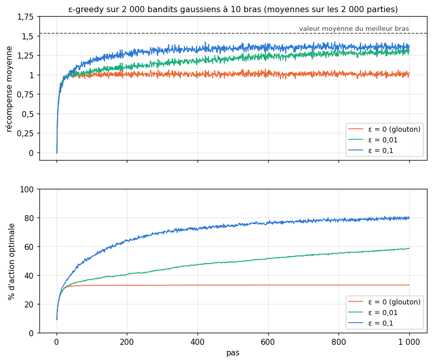

# 11 · Apprentissage et raisonnement — quiz, rappels, exercices papier, réflexion et entretien

> Écris tes réponses dans **ta copie** `mon_travail/ch11_raisonnement/06_mes_reponses.md` (créée par `python tools/start_chapter.py 11`), jamais dans ce fichier : il est mis à jour par Claude.
> Les réponses courtes des **quiz**, des **rappels**, des exercices ✏️ 11.1, 11.3, 11.5, 11.6, 11.7, 11.8 et du 📈 11.10 se vérifient dans la **partie 0** du notebook (`wb.check`). Les questions marquées « dans ta copie », l'exercice ✏️ 11.4, la preuve ∂ 11.2, la réflexion (🗣️ ⚖️ 📄) et l'entretien se corrigent avec `05_solutions.md`. Indices : `04_indices.md`. Calculatrice autorisée.
> Formats de réponse : un nombre (`0.25` ou `"0,25"`), `True` ou `False` pour un vrai ou faux, une lettre seule entre guillemets pour un choix (`"E"`), des lettres collées pour plusieurs choix (`"AC"`), une suite de codes, une lettre par élément et dans l'ordre (`"IDDI"`), éventuellement séparées par des virgules (`"I, D, D, I"`), une liste pour plusieurs nombres (`[2, 5]`).

**Sommaire** : [🧠 Quiz](#quiz) · [🔁 Rappels](#rappels) · [✏️ ∂ Papier-crayon](#papier) · [🗣️ 📈 ⚖️ 📄 Réflexion](#reflexion) · [💼 Entretien](#entretien) · [Exercices du notebook](#notebook)

Légende : ★ application directe · ★★ standard · ★★★ approfondi · ⏱️ durée indicative · parcours R = rapide, M = maths, C = code.

## 🧠 Quiz

Sans la fiche, en 3 minutes chacun. Réponds vite, vérifie les réponses courtes dans la partie 0 du notebook, puis lis les explications de `05_solutions.md`.

### 11.Q1 — Représentation, évaluation, optimisation : associer 🧠 ⏱️ 3 min
*Fiche §11.2 · livre §11.2 · parcours R*

a) Associe chaque élément à la composante de l'apprentissage qu'il réalise : R (représentation), E (évaluation) ou O (optimisation). Réponds par six lettres, dans l'ordre des éléments.
1. la descente de gradient (ch. 5) ;
2. l'erreur quadratique moyenne calculée sur la validation ;
3. les poids $(\mathbf{w}, b)$ d'un perceptron et sa règle « $+1$ si $\mathbf{w}\cdot\mathbf{x} + b > 0$ » ;
4. l'algorithme de Lloyd du k-means (affecter chaque point à son centroïde, recalculer les centroïdes, recommencer) ;
5. la vraisemblance des données sous le modèle (ch. 4) ;
6. un arbre de décision de profondeur au plus 3.

b) Dans l'apprentissage d'un perceptron (ch. 10), quel morceau joue le rôle de l'évaluation ? (A) le test « l'exemple est-il mal classé ? », $y(\mathbf{w}\cdot\mathbf{x} + b) \le 0$ ; (B) la mise à jour $\mathbf{w} \leftarrow \mathbf{w} + \eta\, y\, \mathbf{x}$ ; (C) l'hyperplan $\mathbf{w}\cdot\mathbf{x} + b = 0$ ; (D) le pas $\eta$.

### 11.Q2 — Puissance de représentation : ce qu'un perceptron ne peut pas « savoir » 🧠 ⏱️ 3 min
*Fiche §11.2.1 · livre §11.2.1 · ch. 10 · parcours R*

Un perceptron, avec biais, reçoit deux nombres réels $x_1$ et $x_2$ et répond 1 ou 0.

a) Lesquelles de ces règles peut-il représenter exactement ? (A) classe 1 si $x_1 + x_2 > 3$ ; (B) classe 1 si $x_1^2 + x_2^2 < 1$ ; (C) classe 1 si $x_1 > 2$ ; (D) classe 1 si $x_1$ et $x_2$ sont de même signe ; (E) classe 1 si $2x_1 - x_2 < 0{,}5$.
b) On lui donne maintenant quatre entrées : $x_1$, $x_2$, $x_1^2$ et $x_2^2$. Laquelle des règles de a) qu'il ne pouvait pas représenter devient représentable ?
c) Vrai ou faux : un modèle qui peut représenter plus de frontières fait toujours mieux sur des données nouvelles.

### 11.Q3 — Représentable mais pas apprenable : le problème de l'arrêt 🧠 ⏱️ 3 min
*Fiche §11.2.1 (encadré ⚠️) · livre §11.2.1 · parcours R*

Vrai ou faux ?
a) Pour un programme donné et une entrée donnée, la question « s'arrête-t-il ? » a une réponse, oui ou non, même si on ne la connaît pas.
b) Turing a démontré qu'aucun algorithme ne répond correctement, en un temps fini, pour tous les couples (programme, entrée).
c) On ne peut démontrer pour aucun programme précis qu'il tourne indéfiniment.
d) Un programme qui tourne depuis dix ans sans s'arrêter ne s'arrêtera jamais.

e) Dans la hiérarchie du livre (sa figure 11.1), où se trouve la fonction « ce programme s'arrête-t-il sur cette entrée ? » ? (A) hors de ce qui est représentable ; (B) représentable, mais pas apprenable ; (C) apprenable en théorie, mais pas en pratique ; (D) apprenable efficacement.

### 11.Q4 — Loss, métrique, objectif : qui sert à quoi ? 🧠 ⏱️ 3 min
*Fiche §11.2.2 · livre §11.2.2 · ch. 3 · parcours R*

Une banque entraîne un modèle qui détecte les transactions frauduleuses.

a) Classe chaque élément : L (loss, minimisée pendant l'entraînement), M (métrique, mesurée en validation ou en test) ou O (objectif du projet). Quatre lettres dans l'ordre.
1. l'entropie croisée que la descente de gradient fait baisser ;
2. le recall de la classe « fraude » sur le jeu de test ;
3. diviser par deux, d'ici un an, le montant des fraudes non détectées ;
4. la precision de la classe « fraude » sur la validation.

b) Pourquoi n'entraîne-t-on pas le modèle en maximisant directement son accuracy par descente de gradient ? (A) l'accuracy varie par sauts quand les poids changent : sa dérivée est nulle presque partout ; (B) l'accuracy est trop longue à calculer ; (C) l'accuracy ne dépend pas des poids ; (D) l'accuracy peut dépasser 1.
c) « Je veux que le modèle ne donne l'alerte que s'il s'agit vraiment d'une fraude. » Quelle mesure traduit ce souhait ? (A) l'accuracy ; (B) la precision ; (C) le recall ; (D) le taux de faux négatifs.
d) « Je veux que la plupart des fraudes soient détectées. » Mêmes choix.

### 11.Q5 — Optimiser n'est pas être optimal ; pas de repas gratuit 🧠 ⏱️ 3 min
*Fiche §11.2.3 · livre §11.2.3 · ch. 5 · parcours R*

a) Vrai ou faux : un optimiseur qui fait baisser la loss à chaque pas finit au minimum global.
b) Vrai ou faux : d'après le théorème No Free Lunch, aucun algorithme ne fait mieux que le hasard sur un problème réel.
c) Que faut-il retenir en pratique de ce théorème ? (A) qu'il faut choisir l'algorithme au hasard ; (B) qu'un algorithme ne gagne que si ses hypothèses correspondent à la structure du problème : on compare plusieurs méthodes sur ses propres données, en validation ; (C) que les réseaux de neurones battent toujours les autres modèles ; (D) qu'il suffit de prendre l'optimiseur le plus récent.

### 11.Q6 — Déduction ou induction ? Six situations 🧠 ⏱️ 3 min
*Fiche §11.3 · livre §11.3 · parcours R*

a) Pour chaque situation, écris D (déduction) ou I (induction). Six lettres dans l'ordre.
1. On entraîne un filtre anti-spam sur 50 000 e-mails étiquetés.
2. 97 est un nombre premier supérieur à 2 ; tout nombre premier supérieur à 2 est impair ; donc 97 est impair.
3. Une pièce a donné 140 faces en 200 lancers : on conclut qu'elle est probablement truquée.
4. Depuis trois ans, les ventes augmentent en décembre : on prévoit qu'elles augmenteront en décembre prochain.
5. Si le recall d'un modèle vaut 1, il n'a aucun faux négatif ; ce modèle a un recall de 1 ; donc il n'a aucun faux négatif.
6. Un perceptron seul ne sépare que des classes linéairement séparables ; XOR ne l'est pas ; donc un perceptron seul ne calcule pas XOR.

### 11.Q7 — Valide, solide, ou ni l'un ni l'autre ? 🧠 ⏱️ 3 min
*Fiche §11.4 · livre §11.4 · parcours R*

a) Pour chaque syllogisme, écris S s'il est solide (valide, avec des prémisses vraies), V s'il est valide mais pas solide, N s'il n'est pas valide. Six lettres dans l'ordre.
1. Tous les mammifères respirent de l'air. Les dauphins sont des mammifères. Donc les dauphins respirent de l'air.
2. Tous les oiseaux volent. Les manchots sont des oiseaux. Donc les manchots volent.
3. Tous les chats sont des mammifères. Tous les chiens sont des mammifères. Donc tous les chiens sont des chats.
4. Aucun nombre pair n'est premier. 2 est un nombre pair. Donc 2 n'est pas premier.
5. Tous les carrés sont des rectangles. Certains rectangles ne sont pas des losanges. Donc certains carrés ne sont pas des losanges.
6. Si un modèle surapprend, son erreur de validation dépasse son erreur d'entraînement. L'erreur de validation de ce modèle dépasse son erreur d'entraînement. Donc il surapprend.

b) Vrai ou faux : un syllogisme non valide peut avoir une conclusion vraie.

### 11.Q8 — Nommer le sophisme syllogistique 🧠 ⏱️ 3 min
*Fiche §11.4.1 · livre §11.4.1 · parcours R*

a) Nomme le sophisme de chaque raisonnement : (A) affirmation du conséquent ; (B) négation de l'antécédent ; (C) majeur illicite ; (D) mineur illicite ; (E) moyen terme non distribué. Cinq lettres dans l'ordre.
1. Si le serveur est surchargé, la page s'affiche lentement. La page s'affiche lentement. Donc le serveur est surchargé.
2. Tous les chiens sont des mammifères. Aucun chat n'est un chien. Donc aucun chat n'est un mammifère.
3. Si les données sont standardisées, la descente de gradient converge vite. Mes données ne sont pas standardisées. Donc elle ne convergera pas vite.
4. Toutes les baleines vivent dans l'eau. Tous les requins vivent dans l'eau. Donc tous les requins sont des baleines.
5. Tous les carrés sont des losanges. Tous les carrés sont des rectangles. Donc tous les rectangles sont des losanges.

### 11.Q9 — Généralisation, syllogisme statistique, prédiction 🧠 ⏱️ 3 min
*Fiche §11.5, §11.5.1 · livre §11.5, §11.5.1 · parcours R*

a) Pour chaque raisonnement, écris G (généralisation), S (syllogisme statistique) ou P (prédiction). Quatre lettres dans l'ordre.
1. 12 % des transactions de la banque sont frauduleuses ; cette transaction a été tirée au hasard parmi toutes celles de la banque ; elle a donc 12 % de chances d'être frauduleuse.
2. 8 % des 500 clients interrogés au hasard ont résilié leur abonnement : environ 8 % de tous les clients résilient.
3. Dans mon échantillon de 400 images tirées de la base, 30 % montrent un chat : la prochaine image que je tirerai de la base a environ 30 % de chances d'en montrer un.
4. Le modèle obtient 92 % d'accuracy sur un jeu de test tiré au hasard : on s'attend à environ 92 % sur toutes les données de service.

b) Quelle hypothèse ces principes partagent-ils ? (A) l'échantillon est représentatif de la population ; (B) la population est infinie ; (C) l'échantillon compte au moins 30 individus ; (D) la propriété est rare.
c) Vrai ou faux : le jeu de test a été tiré en 2019 et la clientèle a beaucoup changé depuis ; l'accuracy de test reste une bonne estimation de l'accuracy de 2026.

### 11.Q10 — Sophismes inductifs chez les data scientists 🧠 ⏱️ 3 min
*Fiche §11.5.2 · livre §11.5.2 · parcours R*

a) Avec les définitions de la fiche, nomme le sophisme de chaque situation : (A) généralisation hâtive ; (B) échantillon biaisé ; (C) induction paresseuse ; (D) exception écrasante ; (E) vivacité trompeuse ; (F) plaidoyer spécial. Six lettres dans l'ordre.
1. « Une voiture autonome a eu un accident spectaculaire, filmé et partagé des millions de fois : ces voitures sont plus dangereuses que les conducteurs humains. »
2. « Pour estimer la satisfaction de tous nos utilisateurs, on analyse les avis laissés volontairement sur l'application. »
3. « Les autres équipes doivent évaluer leurs modèles sur un jeu de test séparé ; le nôtre a été évalué sur l'entraînement, mais notre cas est particulier. »
4. « Le modèle a parfaitement classé les trois exemples que j'ai essayés : il est prêt pour la production. »
5. « Notre modèle est fiable, sauf pour les nouveaux clients, les clients étrangers, les achats sur mobile et le week-end » (ces cas font 70 % du trafic).
6. « Depuis six mois, le modèle se trompe sur 40 % des clients de plus de 60 ans, contre 5 % pour les autres ; c'est sans doute le hasard. »

### 11.Q11 — Prémisses rationnelles, empiriques, et la fourche de Hume 🧠 ⏱️ 3 min
*Fiche §11.6 · livre §11.6 · parcours R*

a) Pour chaque prémisse, écris R (rationnelle) ou E (empirique). Cinq lettres dans l'ordre.
1. La somme des angles d'un triangle du plan vaut 180°.
2. L'eau bout à 100 °C au niveau de la mer.
3. Si $A$ implique $B$ et $B$ implique $C$, alors $A$ implique $C$.
4. Les manchots Adélie pèsent en moyenne moins de 4 kg.
5. Un célibataire n'est pas marié.

b) Pour Hume, les vérités qui portent sur des faits (*matters of fact*) : (A) se démontrent par la seule raison ; (B) viennent de l'expérience et pourraient être autrement ; (C) sont toutes fausses ; (D) sont plus certaines que les mathématiques.
c) Vrai ou faux : la conclusion d'un syllogisme valide dont la prémisse majeure est empirique n'est pas plus sûre que cette prémisse.

### 11.Q12 — Holmes déduit-il vraiment ? 🧠 ⏱️ 3 min
*Fiche §11.6.1 · livre §11.6.1 · fil rouge Holmes · parcours R*

Dans « A Scandal in Bohemia », Holmes annonce à Watson qu'il s'est fait tremper récemment et que sa bonne est maladroite : il a vu, sur le cuir d'une de ses chaussures, six entailles presque parallèles, laissées par quelqu'un qui grattait sans soin de la boue séchée. « I see it, I deduce it », dit-il.

a) Ce raisonnement est : (A) une déduction au sens strict ; (B) une abduction, l'explication la plus plausible d'une observation.
b) « Quand on a exclu l'impossible, ce qui reste, si improbable soit-il, doit être la vérité » (« The Beryl Coronet »). Si la liste des possibles est complète, ce principe est : (A) une déduction (un syllogisme disjonctif répété) ; (B) une induction.
c) « C'est une erreur capitale de bâtir des théories avant d'avoir des données. » Ce conseil privilégie : (A) l'induction ; (B) la déduction.
d) Vrai ou faux : quand Holmes parle de « toutes ses déductions » après avoir suivi les pensées de Watson (« The Cardboard Box »), il emploie le mot au sens des logiciens.

## 🔁 Rappels

Des questions sur les chapitres précédents, pour ne pas oublier.

### 11.R1 — Ch. 10 : la règle du perceptron et le cas XOR 🔁 ★ ⏱️ 5 min
*Ch. 10 (fiche §10.3.1, encadré 🧮 sur la règle d'apprentissage) · parcours R*

Un perceptron a les poids $\mathbf{w} = (1, -1)$, le biais $b = 0$ et le pas $\eta = 1$ ; il sort $+1$ si $z = \mathbf{w}\cdot\mathbf{x} + b > 0$, $-1$ sinon, et corrige ses poids quand $y\,z \le 0$ (règle de la fiche du ch. 10).

a) Il reçoit $\mathbf{x} = (2, 1)$, de label $y = +1$. Vrai ou faux : les poids changent.
b) Il reçoit ensuite $\mathbf{x} = (1, 2)$, de label $+1$. Les poids $[w_1, w_2]$ après ce pas.
c) Le biais après ce pas.
d) Vrai ou faux : sur les quatre entrées de XOR, la règle du perceptron finit par ne plus faire d'erreur si on lui laisse assez d'époques.

### 11.R2 — Ch. 8 : représentativité du jeu d'entraînement et fuite de données 🔁 ★ ⏱️ 5 min
*Ch. 8 (§8.2 à §8.4, fuites de données) · parcours R*

a) Un modèle de prix immobiliers est entraîné et testé sur des ventes de 2015 à 2019, découpées au hasard. On veut l'utiliser en 2026. Quelle affirmation est juste ? (A) l'erreur de test estime bien l'erreur de 2026, puisque le test n'a pas servi à l'entraînement ; (B) l'erreur de test risque d'être optimiste : la population de 2026 n'est pas celle qu'on a échantillonnée ; (C) l'erreur de test surestime forcément l'erreur de 2026 ; (D) il suffit de doubler la taille du test.
b) Vrai ou faux : standardiser toutes les données (entraînement et test ensemble), puis les découper, est une fuite de données.
c) Un jeu de 1 000 patients compte 30 % de malades ; on en garde 20 % pour le test, par un découpage stratifié. Combien de malades dans le test ?
d) On veut prédire, au moment d'une transaction, si elle est frauduleuse. Laquelle de ces features est une fuite ? (A) le montant ; (B) l'heure de la transaction ; (C) la date de clôture du dossier d'enquête ; (D) le pays du marchand.

### 11.R3 — Ch. 4 : mettre à jour sa croyance sur une pièce avec Bayes 🔁 ★ ⏱️ 5 min
*Ch. 4 (fiche, « la limite continue, la loi Beta ») · parcours R, M*

On ne sait rien du biais $\theta$ d'une pièce : prior uniforme, $\mathrm{Beta}(1, 1)$. On observe 7 faces et 3 piles.

a) Les paramètres $[a, b]$ du posterior.
b) La moyenne du posterior, avec 2 décimales.
c) Le mode du posterior (le maximum de sa densité), avec 2 décimales.
d) On observe encore 2 piles. La nouvelle moyenne du posterior, avec 2 décimales.
e) Vrai ou faux : avec ce prior uniforme, la moyenne du posterior n'est jamais plus loin de 0,5 que la proportion de faces observée.
f) Selon le posterior de a), la probabilité que le prochain lancer donne face vaut : (A) 7/10 ; (B) 8/12 ; (C) 1/2 ; (D) 7/12.

## ✏️ ∂ Papier-crayon

Calculatrice autorisée. Écris la démarche dans ta copie de `06_mes_reponses.md`, puis reporte les résultats dans la partie 0 du notebook. Garde les valeurs exactes pendant tes calculs et **n'arrondis qu'à la fin**.

### Ex 11.1 — Représentable sur n bits : compter, puis conclure ✏️ ★ ⏱️ 10 min
**Objectif :** compter ce qu'une représentation peut contenir, et en tirer une conclusion sur la puissance d'un perceptron.
**Prérequis :** 0B (puissances, logarithmes) · ch. 6 (bits) · fiche §11.2.1 (encadré 🧮) · **Parcours :** M

a) Combien de valeurs différentes peut-on écrire avec 8 bits ?
b) Le plus grand entier sans signe sur 8 bits.
c) Le plus petit entier sur 8 bits en complément à deux.
d) Le nombre minimal de bits pour écrire n'importe quel entier de 0 à 1 000.
e) Le nombre de fonctions booléennes de 3 entrées binaires.
f) Parmi elles, 104 sont représentables par un perceptron à 3 entrées (avec biais). Quelle part des fonctions booléennes de 3 entrées est-ce ? (3 décimales)
g) Pour 4 entrées, 1 882 fonctions sont représentables par un perceptron. Quelle part des fonctions booléennes de 4 entrées ? (4 décimales)
h) Chaque chiffre décimal est l'un de 10 symboles équiprobables. Combien de bits faut-il, au minimum, pour stocker un million de chiffres de π, en **millions** de bits ? (2 décimales ; ch. 6)
i) On admet qu'il y a au plus $2^{n^2}$ fonctions à seuil de $n$ entrées. Vrai ou faux : la part des fonctions booléennes de $n$ entrées qu'un perceptron peut représenter tend vers 0 quand $n$ grandit.

Dans ta copie : que t'apprennent h) et le mini-exemple de la fiche (les carrés des entiers) sur la différence entre stocker une valeur et stocker un programme qui la calcule ?

### Ex 11.2 — Moyenne incrémentale : Qₙ₊₁ = Qₙ + (Rₙ − Qₙ)/n ∂ ★ ⏱️ 15 min
**Objectif :** démontrer la mise à jour incrémentale d'une moyenne, et comprendre ce que change un pas constant.
**Prérequis :** 0B (sommes, suites géométriques) · fiche §11.7 (encadré 🧮 sur les bandits) · **Parcours :** R, M

Un bras d'un bandit donne les récompenses successives $R_1, R_2, \dots$. On note $Q_{n+1} = \frac{1}{n}\sum_{i=1}^{n} R_i$ la moyenne des $n$ premières, et $Q_1$ une valeur initiale quelconque.

1. Montre que $Q_{n+1} = Q_n + \frac{1}{n}(R_n - Q_n)$ pour $n \ge 2$. Vérifie que la formule donne aussi $Q_2 = R_1$, quelle que soit $Q_1$.
2. Quel avantage, en mémoire et en calcul, par rapport au calcul direct de la moyenne à chaque pas ?
3. Avec un pas constant $\alpha \in\ ]0, 1]$, la mise à jour devient $Q_{n+1} = Q_n + \alpha(R_n - Q_n)$. Montre par récurrence que $Q_{n+1} = (1-\alpha)^n Q_1 + \sum_{i=1}^{n} \alpha(1-\alpha)^{n-i} R_i$.
4. Montre que la somme des poids, $(1-\alpha)^n + \sum_{i=1}^{n} \alpha(1-\alpha)^{n-i}$, vaut 1. Quelle récompense a le plus de poids ? Pourquoi parle-t-on d'une moyenne « à oubli exponentiel » ?
5. Que pèse la valeur initiale $Q_1$ dans $Q_{n+1}$, avec un pas constant ? Et avec le pas $1/n$ de la question 1, dès le premier tirage ?

### Ex 11.3 — Syllogismes : valides ? solides ? ✏️ ★★ ⏱️ 20 min
**Objectif :** juger la validité de syllogismes par les règles de distribution ou par un diagramme de Venn, puis leur solidité.
**Prérequis :** fiche §11.4 et §11.4.1 (encadrés 🧮 sur les formes et sur le diagramme de Venn) · **Parcours :** R, M

- **S1.** Aucun reptile n'a de poils. Tous les serpents sont des reptiles. Donc aucun serpent n'a de poils.
- **S2.** Tous les rapports d'audit sont confidentiels. Certains documents confidentiels sont des brouillons. Donc certains rapports d'audit sont des brouillons.
- **S3.** Aucun modèle linéaire ne calcule XOR. Certains perceptrons sont des modèles linéaires. Donc certains perceptrons ne calculent pas XOR.
- **S4.** Tous les nombres premiers supérieurs à 2 sont impairs. 9 n'est pas un nombre premier supérieur à 2. Donc 9 n'est pas impair.
- **S5.** Tous les nombres premiers sont impairs. 2 est un nombre premier. Donc 2 est impair.
- **S6.** Certains oiseaux ne volent pas. Tous les manchots sont des oiseaux. Donc certains manchots ne volent pas.
- **S7.** Aucun poisson n'est un mammifère. Aucun requin n'est un mammifère. Donc aucun requin n'est un poisson.

a) Dans S1, quels sont le moyen terme, le sujet et le prédicat de la conclusion ? Choisis parmi (A) les serpents ; (B) les choses qui ont des poils ; (C) les reptiles. Trois lettres, dans l'ordre : moyen terme, sujet, prédicat.
b) Pour chaque syllogisme, écris S (solide), V (valide mais pas solide) ou N (non valide). Sept lettres dans l'ordre.
c) Pour chaque syllogisme **non valide**, dans l'ordre, la règle violée : (A) le moyen terme n'est jamais distribué ; (B) un terme est distribué dans la conclusion sans l'être dans sa prémisse ; (C) la conclusion est négative alors que les deux prémisses sont affirmatives ; (D) les deux prémisses sont négatives.
d) Vrai ou faux : la conclusion de S6 est vraie, donc S6 est valide.
e) Dans le diagramme de Venn de S3 ($S$ = les perceptrons, $M$ = les modèles linéaires, $P$ = ce qui calcule XOR), combien de régions la prémisse majeure grise-t-elle ?

Dans ta copie : pour un syllogisme non valide de ton choix, décris un contre-exemple, un « monde » où les prémisses sont vraies et la conclusion fausse.

### Ex 11.4 — Six raisonnements fautifs à diagnostiquer et à réfuter ✏️ ★★ ⏱️ 25 min
**Objectif :** reconnaître la faute d'un raisonnement, déductif ou inductif, la nommer et la réfuter par un contre-exemple ou par une meilleure méthode.
**Prérequis :** Ex 11.3 · fiche §11.4.1, §11.5.2 · **Parcours :** M

Pour chaque raisonnement, dans ta copie : (1) est-il déductif ou inductif ? (2) quelle est sa faute (un sophisme de la fiche, ou une prémisse fausse) ? (3) pour un raisonnement déductif de forme invalide, un contre-exemple de même forme dont les prémisses sont vraies et la conclusion fausse ; pour un raisonnement déductif de forme valide, la prémisse fausse et un cas qui la réfute ; pour un raisonnement inductif, ce qu'il faudrait faire pour conclure correctement.

1. « Tous les modèles qui surapprennent ont une loss d'entraînement très basse. Mon modèle a une loss d'entraînement très basse. Donc il surapprend. »
2. « Aucune régression linéaire sur les variables brutes (sans produit comme $x_1 x_2$) ne capture les interactions entre variables. Le gradient boosting n'est pas une régression linéaire. Donc le gradient boosting capture les interactions. »
3. « S'il y a une fuite de données, le score de test est anormalement élevé. Notre score de test n'est pas anormalement élevé. Donc il n'y a pas de fuite. »
4. « On a validé le modèle sur les clients parisiens : il marchera aussi bien à Lyon, à Marseille et à Lille. »
5. « Les trois dernières mises en production ratées ont eu lieu un vendredi : déployer le vendredi fait échouer les mises en production. »
6. « Le modèle se trompe sur les photos prises de nuit ; ce sont des cas à part, on les retire du jeu de test. »

### Ex 11.5 — Enquête au phare : réduire le domaine du discours ✏️ ★★ ⏱️ 20 min
**Objectif :** mener une élimination rigoureuse, nommer la forme logique de chaque étape et repérer les prémisses cachées.
**Prérequis :** fiche §11.4 (l'enquête du livre, les syllogismes conditionnels) · **Parcours :** M

Nuit de tempête sur Kerbihan, une petite île (inventée). À 2 h, la lampe du phare s'éteint : quelqu'un a abaissé la manette du disjoncteur, dans la salle des machines, au pied de la tour. Depuis la veille, aucun bateau n'a pu accoster ni partir : six personnes sont sur l'île. Anne (A), la gardienne ; Bastien (B), son adjoint ; Chloé (C), météorologue ; Diego (D), le cuisinier ; Elsa (E), biologiste ; Félix (F), le fils d'Anne, 7 ans.

1. De 1 h 30 à 2 h 30, Chloé et Elsa relevaient ensemble les instruments sur la falaise nord, à vingt minutes de marche du phare ; la station météo a enregistré leurs deux badges à 1 h 50 et à 2 h 05.
2. Le seuil de la salle des machines a été repeint la veille au soir : quiconque y est entré cette nuit-là a de la peinture sous les semelles. Les semelles de Diego sont propres, et il n'a qu'une paire de chaussures.
3. La manette est à 1,90 m du sol, et rien dans la salle ne permet de grimper : Félix ne peut pas l'atteindre.
4. À 1 h 56, la caméra de la lanterne filme Anne au sommet de la tour. Avec la cheville qu'elle s'est foulée la veille, il lui faut au moins dix minutes pour descendre les 180 marches.

a) Les suspects restants après les indices 1 à 3, en initiales par ordre alphabétique.
b) Quelle forme logique l'indice 2 utilise-t-il pour innocenter Diego ? (A) modus ponens ; (B) modus tollens ; (C) affirmation du conséquent ; (D) syllogisme disjonctif.
c) Vrai ou faux : après les indices 1 à 3, on peut conclure qu'Anne et Bastien ont agi ensemble.
d) Vrai ou faux : après les indices 1 à 3, on peut conclure qu'au moins l'un des deux est coupable.
e) Après l'indice 4, le coupable (une initiale).
f) Quelle prémisse, si elle était fausse, ruinerait toute l'élimination ? (A) personne d'autre n'est sur l'île ; (B) Bastien a un mobile ; (C) la tempête a coupé le courant ; (D) Félix dormait.

On appelle **coupable** toute personne qui a abaissé la manette, de sa main (plusieurs complices ont pu le faire ensemble, dans la salle des machines), et **hypothèse** tout groupe non vide de coupables possibles (une personne seule, ou plusieurs complices).
g) Combien d'hypothèses au départ ?
h) Combien en reste-t-il après les indices 1 à 3 ?
i) Et après l'indice 4 ?

Dans ta copie : quelles prémisses empiriques (des faits observés, qui pourraient être faux) chaque indice suppose-t-il ? Quel lien fais-tu avec un classifieur, qui range toujours un exemple dans l'une des classes qu'il connaît ?

### Ex 11.6 — Syllogisme statistique et prédiction : 15 % de pommes mûres ✏️ ★★ ⏱️ 20 min
**Objectif :** appliquer les principes de l'induction en les chiffrant : probabilités de tirage, erreur-type d'une généralisation, prédiction, et limite d'un échantillon biaisé.
**Prérequis :** ch. 2 (proportion, tirages), ch. 3 (probabilités), ch. 8 (erreur-type), ch. 4 (règle de succession) · fiche §11.5 · **Parcours :** M

Une épicerie a reçu 2 000 pommes, dont 300 sont mûres.

a) On tire une pomme au hasard : la probabilité qu'elle soit mûre (2 décimales).
b) On tire deux pommes au hasard, **sans remise** : la probabilité que les deux soient mûres (5 décimales).
c) Même question **avec remise** (on repose la première pomme avant de tirer la seconde) (5 décimales).
d) On tire 5 pommes au hasard, avec remise : la probabilité qu'au moins une soit mûre (3 décimales).

Le gérant, lui, ne connaît pas la proportion. Un client remplit son panier de 40 pommes tirées au hasard ; 6 sont mûres.

e) La proportion $\hat{p}$ de pommes mûres estimée à partir du panier (2 décimales).
f) L'erreur-type de $\hat{p}$ (4 décimales).
g) Combien de pommes faudrait-il tirer, **avec remise**, pour que l'erreur-type ne dépasse pas 0,01, si la vraie proportion vaut 0,15 ?
h) La probabilité que la prochaine pomme tirée au hasard soit mûre, d'après le panier et la règle de succession de Laplace (ch. 4) (3 décimales).
i) Vrai ou faux : si les pommes mûres sont exposées sur le dessus du présentoir et que le client se sert sur le dessus, $\hat{p}$ surestime la proportion de pommes mûres de l'épicerie.
j) Vrai ou faux : dans la situation de i), en tirant de la même façon le nombre de pommes trouvé en g), l'estimation deviendrait fiable.

Dans ta copie : nomme le principe inductif (généralisation, syllogisme statistique ou prédiction) utilisé en a), en e) et en h).

### Ex 11.7 — Renforcement ou punition, positif ou négatif : classer huit situations ✏️ ★★ ⏱️ 15 min
**Objectif :** classer une rétroaction dans les quatre cases du conditionnement opérant, sans confondre « négatif » et « désagréable ».
**Prérequis :** fiche §11.7 · **Parcours :** R, M

Codes : (A) renforcement positif ; (B) renforcement négatif ; (C) punition positive ; (D) punition négative. Dans chaque situation, le comportement dont la fréquence change est en italique.

a) Huit lettres dans l'ordre :
1. Un chien reçoit une friandise quand il *s'assoit* sur commande.
2. Le bip de la voiture s'arrête dès que le conducteur *boucle sa ceinture* ; il la boucle de plus en plus vite.
3. Un conducteur reçoit une amende pour *excès de vitesse*.
4. Un adolescent est privé de téléphone pour être *rentré en retard*.
5. Un enfant *touche la plaque chaude* et se brûle.
6. Une employée reçoit une prime pour *un projet livré à temps*.
7. Un antidouleur fait disparaître la migraine ; on *en reprend* plus volontiers à la crise suivante.
8. Un chat reçoit un jet d'eau chaque fois qu'il *monte sur la table*.

b) Selon le livre, entraîner un perceptron relève de quelle case ?
c) Vrai ou faux : en conditionnement opérant, « négatif » veut dire « désagréable ».
d) Un agent de bandit tire un bras et reçoit 1 ; son estimation de ce bras augmente, et il le tirera plus souvent. Quelle case ?

Dans ta copie : le livre classe l'entraînement du perceptron en b). Es-tu d'accord ? Donne un argument pour et un argument contre.

### Ex 11.8 — Un bandit à la main : ε-greedy, moyennes et regret ✏️ ★★ ⏱️ 25 min
**Objectif :** dérouler à la main un agent ε-greedy, ses estimations incrémentales et son regret.
**Prérequis :** Ex 11.2 · fiche §11.7 (encadré 🧮 sur les bandits) · **Parcours :** R, M

Un bandit a trois bras de Bernoulli, numérotés 0, 1 et 2 comme en Python, de vraies moyennes $q_*(0) = 0{,}3$, $q_*(1) = 0{,}5$ et $q_*(2) = 0{,}8$ (inconnues de l'agent). L'agent est ε-greedy avec $\varepsilon = 0{,}2$ ; ses estimations partent de 0 et sont des moyennes exactes. À chaque pas $t$, il tire un nombre $u_t$ uniforme entre 0 et 1 : si $u_t < \varepsilon$, il explore et joue le « bras au hasard » du tableau ; sinon, il joue le bras de plus grande estimation, et en cas d'égalité, **le plus petit numéro**. Le tableau donne aussi la récompense obtenue à chaque pas, quel que soit le bras joué.

| Pas $t$ | 1 | 2 | 3 | 4 | 5 | 6 | 7 | 8 |
|---|---|---|---|---|---|---|---|---|
| $u_t$ | 0,65 | 0,12 | 0,47 | 0,83 | 0,05 | 0,71 | 0,38 | 0,91 |
| bras au hasard | 1 | 2 | 0 | 1 | 1 | 2 | 0 | 1 |
| récompense obtenue | 0 | 1 | 1 | 0 | 1 | 0 | 1 | 1 |

a) Le bras joué au pas 1.
b) Les trois estimations $[Q(0), Q(1), Q(2)]$ après le pas 4 (3 décimales).
c) Le bras joué au pas 6.
d) Les trois estimations après le pas 8 (3 décimales).
e) Le nombre de tirages de chaque bras après le pas 8.
f) Le pseudo-regret cumulé après le pas 8, $\sum_t \big(q_* - q_*(A_t)\big)$ (1 décimale).
g) Le regret « réalisé » après le pas 8 : $8 \times q_*$ moins la somme des récompenses obtenues (1 décimale).
h) Une fois les estimations justes, la probabilité que cet agent joue le meilleur bras à un pas donné (3 décimales).
i) Toujours avec des estimations justes, le pseudo-regret moyen **par pas** de cet agent (3 décimales).
j) Vrai ou faux : avec $\varepsilon = 0$ (et les mêmes règles : estimations nulles au départ, égalités au plus petit numéro), l'agent aurait joué le bras 0 à chaque pas, quelles que soient les récompenses.

Dans ta copie : pourquoi le pseudo-regret de f) et le regret réalisé de g) diffèrent-ils ? Que deviendrait le regret de cet agent après 10 000 pas, d'après i) ?

## 🗣️ 📈 ⚖️ 📄 Réflexion

### Ex 11.9 — Déduction et induction dans un projet de ML, en cinq lignes 🗣️ ★ ⏱️ 10 min
**Objectif :** expliquer à un non-spécialiste où sont l'induction et la déduction dans un projet de machine learning.
**Prérequis :** fiche §11.3, §11.5.1, §11.6 · **Parcours :** R

Un collègue du service juridique te demande si un modèle de ML « raisonne ». Réponds-lui à voix haute, en **cinq lignes** au plus. Contraintes :
- les mots « induction », « déduction », « généraliser » et « représentatif » ;
- dire ce qui garantit une conclusion et ce qui ne la garantit pas ;
- aucune formule.

Enregistre-toi ou écris ta réponse, puis compare avec la réponse modèle de `05_solutions.md`.

### Ex 11.10 — Lire les courbes d'un bandit : ε = 0, 0,01 et 0,1 📈 ★★ ⏱️ 15 min
**Objectif :** lire sur des courbes moyennes le compromis entre exploration et exploitation, et le relier aux formules.
**Prérequis :** Ex 11.8 · fiche §11.7 (encadré 🧮) · **Parcours :** R

La figure montre trois agents ε-greedy (moyennes exactes, estimations initiales nulles, ex aequo tirés au sort) sur 2 000 bandits gaussiens à 10 bras : les moyennes des bras sont tirées de la loi normale $\mathcal{N}(0, 1)$, et chaque récompense est tirée de $\mathcal{N}(q_*(a), 1)$. En haut, la récompense moyenne à chaque pas (sur les 2 000 parties) ; en bas, la part des parties où l'agent a choisi le meilleur bras. La ligne en tirets est la valeur moyenne du meilleur bras.

a) Au pas 1 000, quelle valeur de ε donne la meilleure récompense moyenne : 0, 0.01 ou 0.1 ?
b) Vers quelle part d'action optimale le glouton (ε = 0) plafonne-t-il ? (A) moins de 40 % ; (B) entre 40 et 60 % ; (C) entre 60 et 85 % ; (D) plus de 85 %.
c) Même question pour ε = 0,1 au pas 1 000.
d) Une fois les estimations justes, la part maximale d'action optimale de l'agent ε = 0,1 avec ces 10 bras (2 décimales).
e) Même chose pour ε = 0,01 (3 décimales).
f) Sur un horizon de 100 000 pas, quelle valeur de ε finira par donner la meilleure récompense moyenne : 0, 0.01 ou 0.1 ?
g) Dans ta copie : pourquoi le glouton reste-t-il bloqué, alors qu'il démarre aussi vite que les autres ?
h) Lis au pas 1 000 la récompense moyenne du glouton et la valeur du meilleur bras : quelle part de la récompense du meilleur bras le glouton obtient-il ? (A) environ un tiers ; (B) environ deux tiers ; (C) environ 90 % ; (D) plus de 100 %.

### Ex 11.11 — Explorer sur des humains : essais adaptatifs, recommandation, A/B tests ⚖️ ★★ ⏱️ 25 min
**Objectif :** peser ce que coûte l'exploration quand les « bras » sont des traitements, des contenus ou des prix proposés à des personnes.
**Prérequis :** fiche §11.7 (le bandit manchot, encadré 🕰️) · **Parcours :** aucun (réflexion conseillée à tous)

En 1985, une équipe du Michigan a évalué l'ECMO, une oxygénation extracorporelle, pour des nouveau-nés en détresse respiratoire, avec une allocation **adaptative** du type « jouer le gagnant » (*randomized play-the-winner*) : plus un traitement réussissait, plus le patient suivant avait de chances de le recevoir. Résultat : onze nouveau-nés ont reçu l'ECMO et ont tous survécu ; un seul a reçu le traitement classique, et il est mort (Bartlett et al., *Pediatrics*, 1985). Beaucoup ont jugé la preuve insuffisante, et d'autres essais ont suivi ; en 1996, un essai britannique randomisé de 185 nouveau-nés a confirmé le bénéfice (63 survivants sur 93 avec l'ECMO, contre 38 sur 92 avec le traitement classique). Réponds dans ta copie.

1. Traduis l'essai de 1985 en bandit : quels sont les bras, la récompense, l'exploration et l'exploitation ?
2. Quel est l'argument éthique **pour** une allocation adaptative ? Et l'argument **contre**, du point de vue de la preuve scientifique ?
3. Un site de commerce teste trois prix pour un même produit avec un bandit. Quels problèmes cela pose-t-il pour les clients ? Comparer avec un test A/B classique, où chaque client voit une variante tirée au hasard, avec des proportions fixes.
4. Une plateforme de vidéos recommande avec un bandit qui maximise le temps de visionnage. Quels effets indésirables la récompense choisie peut-elle produire ? Propose une autre récompense, ou une contrainte.
5. Écris trois règles que tu suivrais avant de lancer une expérience adaptative sur des personnes.

### Ex 11.12 — Domingos (2012) : représentation, évaluation, optimisation et autres leçons 📄 ★★ ⏱️ 30 min
**Objectif :** lire un article de synthèse de référence et le relier au chapitre.
**Prérequis :** fiche §11.2 · **Parcours :** aucun (lecture conseillée à tous)

Lis P. Domingos, « A few useful things to know about machine learning », *Communications of the ACM* 55 (10), 2012 ([PDF de l'auteur](https://homes.cs.washington.edu/~pedrod/papers/cacm12.pdf)), au moins les sections « Learning = Representation + Evaluation + Optimization », « It's Generalization that Counts », « Data Alone Is Not Enough », « Theoretical Guarantees Are Not What They Seem » et « Representable Does Not Imply Learnable ». Réponds dans ta copie.

1. Le tableau 1 de l'article donne des exemples des trois composantes. Range-y le perceptron, la régression linéaire par moindres carrés et le k-means (ch. 7 à 10).
2. Pourquoi Domingos insiste-t-il pour garder des données de test à part ? Quel lien avec le ch. 8 ?
3. Comment cite-t-il le théorème No Free Lunch ? Qu'en conclut-il sur le rôle des connaissances préalables (*knowledge*) ? Relie sa réponse au problème de l'induction de Hume (fiche §11.6).
4. Que dit-il des garanties théoriques ? Après le tournoi de 🔬 11.26, relie sa réponse au classement que tu as obtenu : UCB1 et l'échantillonnage de Thompson ont tous deux un regret garanti en $\ln T$, ε-greedy à ε fixe un regret linéaire. Le classement suit-il ces garanties ?
5. « Representable does not imply learnable » : quelle est l'idée, et quel exemple du chapitre l'illustre ?
6. L'article date de 2012, juste avant l'essor de l'apprentissage profond. Quelle leçon te paraît la plus datée aujourd'hui, et laquelle la plus actuelle ? Justifie.

## 💼 Entretien

Réponds **à voix haute**, en une minute, comme face à un recruteur ; puis compare avec la « réponse modèle en 60 secondes » de `05_solutions.md`.

### 11.E1 — Exploration contre exploitation : expliquer avec un exemple métier 💼 ★★ ⏱️ 10 min
*Fiche §11.7 · prérequis 11.26 · parcours R*

« Qu'est-ce que le dilemme exploration-exploitation ? Donnez un exemple tiré d'un métier, et une façon de le régler. »

### 11.E2 — A/B test ou bandit : lequel choisir ? 💼 ★★ ⏱️ 10 min
*Fiche §11.7 (encadré 🕰️) · prérequis 11.11 · parcours R*

« Nous voulons comparer deux versions d'une page de paiement. Faut-il un test A/B ou un bandit ? »

### 11.E3 — Que dit le théorème « No Free Lunch » pour le choix d'un modèle ? 💼 ★★ ⏱️ 10 min
*Fiche §11.2.3 · parcours R*

« Que dit le théorème No Free Lunch, et qu'est-ce que cela change à la façon dont vous choisissez un modèle ? »

### 11.E4 — Un biais d'échantillonnage qui a fait échouer un modèle : exemple et parade 💼 ★★ ⏱️ 10 min
*Fiche §11.5.1, §11.5.2 · prérequis 11.17 · parcours R*

« Racontez un cas, réel ou plausible, où un biais d'échantillonnage a fait échouer un modèle en production. Comment l'auriez-vous détecté, et que faire ? »

## Exercices du notebook

Les exercices suivants se font dans `03_notebook.ipynb` (ta copie : `mon_travail/ch11_raisonnement/03_notebook.ipynb`) ; ceux marqués 🔨 et accompagnés de « mylearn » complètent ta librairie `mylearn/bandit.py`. La partie 0 du notebook vérifie tes réponses courtes aux quiz, aux rappels et aux exercices ✏️ et 📈 ci-dessus.

| ID | Titre | Type | ★ | ⏱️ |
|---|---|---|---|---|
| 11.13 | Glouton pur sur trois bras : que va-t-il se passer ? | 🔮 | ★ | 10 |
| 11.14 | Holmes déduit-il ? Compter et citer le vocabulaire du raisonnement | 🔨 | ★★ | 25 |
| 11.15 | Valider un syllogisme par force brute : 256 mondes de Venn | 🔨 | ★★ | 30 |
| 11.16 | Reproduire la figure 11.5 : les cinq sophismes en diagrammes | 🎨 | ★★ | 25 |
| 11.17 | Généralisation hâtive et échantillon biaisé chez les manchots | 🔬 | ★★ | 25 |
| 11.18 | Des points sur un cercle : quand le modèle trahit l'induction | 🔬 | ★★ | 25 |
| 11.19 | BernoulliBandit et GaussianBandit | 🔨 | ★★ | 20 |
| 11.20 | argmax_random_tie, epsilon_greedy_action et incremental_update | 🔨 | ★★ | 25 |
| 11.21 | run_bandit : la boucle d'interaction et ses courbes | 🔨 | ★★★ | 40 |
| 11.22 | Initialisation optimiste sans ε : prédire, puis mesurer | 🔮 | ★★★ | 30 |
| 11.23 | ucb_action et thompson_action | 🔨 | ★★★ | 40 |
| 11.24 | Bandit piégé : l'agent qui n'explore jamais | 🐛 | ★★★ | 30 |
| 11.25 | Un journal d'expériences reproductible (JSON) | 🛠️ | ★★★ | 30 |
| 11.26 | Tournoi : ε-greedy, optimiste, UCB et Thompson | 🔬 | ★★★ | 45 |
| 11.27 | Défi : battre UCB1 sur un banc de bandits de Bernoulli | 🏆 | ★★★ | 60 |
