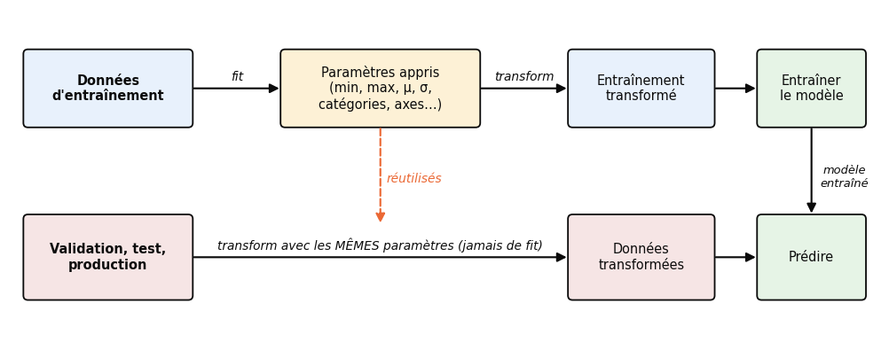
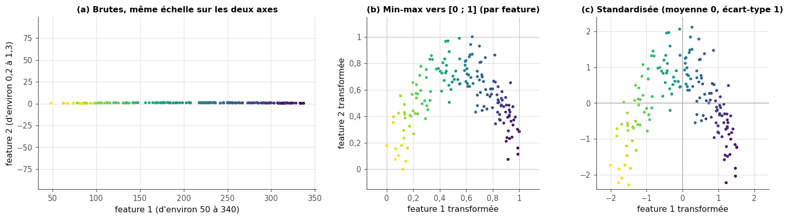
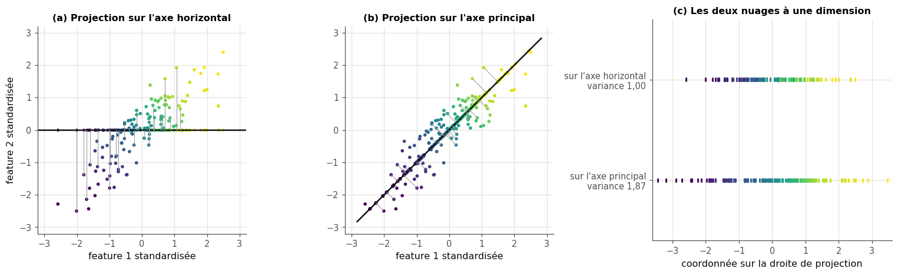
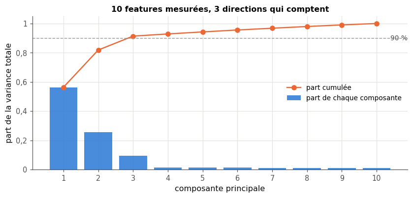
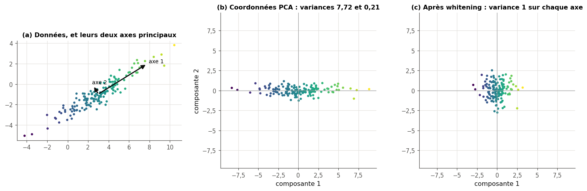
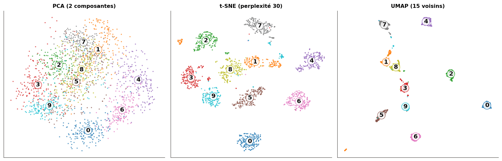

# 12 · Préparation des données — fiche de cours

> Cette fiche accompagne le chapitre 12 du livre, qui ouvre la partie consacrée au machine learning classique. Avant d'apprendre quoi que ce soit, un modèle reçoit des données qu'il faut **nettoyer**, **encoder** et **mettre à l'échelle**, et le livre insiste sur une règle d'or : une transformation s'apprend sur les données d'entraînement, puis se réapplique telle quelle à toute donnée nouvelle. Il passe ensuite en revue les types de données et le one-hot, le nettoyage, la normalisation et la standardisation, la sélection de features, l'analyse en composantes principales (PCA) et la fuite de données en validation croisée. La fiche ajoute ce qu'il faut pour le faire soi-même et le faire bien : les maths de la PCA (matrice de covariance, projection, vecteurs propres), l'imputation des valeurs manquantes, les mises à l'échelle robustes, le whitening, l'API des transformateurs de scikit-learn, le `Pipeline` qui protège des fuites, et, au-delà du livre, t-SNE et UMAP pour voir des données en grande dimension, puis pandas et SQL pour assembler des données brutes. Les exemples du livre (vaches et zèbres, crayons de couleur, éléphants, guitare, huskies, trafic du matin) ne sont que résumés : chaque section te dit où les lire.

| | |
|---|---|
| **Livre** | vol. 1, ch. 12 « Data Preparation », p. 431-487 (§12.1 à §12.10) |
| **Temps total estimé** | ≈ 23 h : lecture du livre et de la fiche ≈ 5,8 h, exercices ≈ 17 h, 26 flashcards ≈ 0,9 h |
| **Prérequis** | 0A (pandas : `read_csv`, `info`, `isna`, `value_counts`, `duplicated`, `groupby` ; classes Python) · 0B (produit scalaire, norme, produit matrice-vecteur, transposée ; $\mathbb{E}[aX + b]$ et $\mathrm{Var}(aX + b)$) · ch. 2 (moyenne, variance, écart-type, quartiles, z-score, covariance, corrélation, loi normale) · ch. 5 (descente de gradient) · ch. 7 (distances, malédiction de la dimension) · ch. 8 (découpage, validation croisée, fuite de données) · ch. 9 (Ridge et sa pénalité) · ch. 11 (représentation, évaluation, optimisation) |
| **Fichiers du chapitre** | `02_exercices.md` (quiz, rappels, papier, réflexion, entretien) · `03_notebook.ipynb` · `04_indices.md` · `05_solutions.md` et `05_solutions.ipynb` · `06_mes_reponses.md` · `flashcards.csv` |
| **mylearn** | `preprocessing.py` : `StandardScaler` (12.16), `MinMaxScaler` (12.17), `SimpleImputer` (12.18), `OrdinalEncoder` et `OneHotEncoder` (12.26), `PCA` (12.27). Les ch. 22 à 24 réutiliseront tes scalers |

## Comment utiliser ce chapitre

Le livre avance en quatre temps : la règle d'or et les types de données (§12.1 à §12.3.1), le nettoyage (§12.4), les mises à l'échelle et la façon de les retenir (§12.5 à §12.5.4), puis la réduction du nombre de features, par sélection (§12.6) ou par PCA (§12.7) ; il termine par la mécanique des transformations : l'objet qui apprend sa transformation et sait l'inverser (§12.8), les trois façons de découper un tableau (§12.9) et la validation croisée (§12.10). Compte un peu moins de six heures pour ses 57 pages et cette fiche. La fiche suit le même plan, avec trois encadrés 🧮 de maths (la matrice de covariance, la projection sur une droite, les vecteurs propres et la SVD) et trois 🧮 d'outils (les transformateurs de scikit-learn ; dates, jointures et tableaux croisés avec pandas ; SQL).

**Ordre conseillé.**
1. Lis le livre §12.1 à §12.3.1, puis les sections 12.1 à 12.3 de la fiche. Fais les quiz Q1 à Q3, le rappel R1 et l'exercice 12.1.
2. Lis le livre §12.4, puis la section 12.4 de la fiche. Fais le quiz Q4.
3. Lis le livre §12.5 à §12.5.4, puis la section 12.5 de la fiche. Fais les quiz Q5 et Q7, les rappels R2 et R3, les exercices 12.2 et 12.3 et la preuve ∂ 12.6.
4. Lis le livre §12.6 à §12.7.2, puis les sections 12.6 et 12.7 de la fiche. Fais les quiz Q8 et Q9, le cas ⚖️ 12.10, l'exercice 12.7 et la preuve ∂ 12.8.
5. Lis le livre §12.8 à §12.10, puis la fin de la fiche (sections 12.8 à 12.10 et « Au-delà du livre »). Fais les quiz Q6, Q10 et Q11, les exercices 12.4 et 12.5 et l'oral 🗣️ 12.9. Vérifie tes réponses courtes dans la partie 0 du notebook.
6. Fais le notebook dans l'ordre : partie A (12.11 à 12.15 : diagnostiquer des données brutes, prédire où tombent des données de test après un `MinMaxScaler`, puis assembler des tables avec pandas et SQL), partie B (12.16 à 12.21 : mises à l'échelle et imputation, dont trois classes de ta librairie), partie C (12.22 à 12.28 : PCA, sélection de features, encodeurs), partie D (12.29 à 12.33 : échelle et descente de gradient, visualisation, fuites, et le défi). Finis par les cinq questions d'entretien.

| Section | Quiz 🧠 et rappels 🔁 | Papier ✏️ ∂ et réflexion | Notebook | Entretien 💼 |
|---|---|---|---|---|
| 12.1 Pourquoi ce chapitre | Q1, R1 | | | |
| 12.2 La règle d'or | Q1 | 12.9 | 12.20, 12.31, 12.32, 12.33 | |
| 12.3 Les types de données | Q2, Q3 | 12.1 | 12.14, 12.26 | |
| 12.3.1 Le one-hot | Q3 | 12.1 | 12.20, 12.26, 12.33 | E5 |
| 12.4 Le nettoyage | Q4 | 12.10 | 12.11, 12.12, 12.14, 12.15, 12.18 | E3 |
| 12.5 Normaliser et standardiser | Q5, Q6, Q7, R2, R3 | 12.2, 12.3, 12.4, 12.6 | 12.13, 12.16, 12.17, 12.19, 12.29 | E2 |
| 12.6 La sélection de features | Q8 | 12.10 | 12.11, 12.25 | |
| 12.7 La réduction de dimension et la PCA | Q8, Q9 | 12.7, 12.8 | 12.22, 12.23, 12.24, 12.27, 12.28, 12.30 | E4 |
| 12.8 Transformer et revenir en arrière | Q6 | 12.4 | 12.17, 12.21 | |
| 12.9 Par échantillon, par feature, par élément | Q10 | 12.5 | | |
| 12.10 Transformations et validation croisée | Q11 | 12.9 | 12.31 | E1 |

**Lire les formules.** $\mathbf{X}$ est la matrice des données, de forme $(n, p)$ : $n$ exemples en lignes, $p$ features en colonnes ; $x_{ij}$ est la feature $j$ de l'exemple $i$. Pour une colonne $j$ de l'**entraînement**, $\min_j$ et $\max_j$ sont sa plus petite et sa plus grande valeur, $\mu_j$ sa moyenne et $\sigma_j$ son écart-type, calculé en divisant par $n$ (ddof = 0, la convention de scikit-learn pour la standardisation). $\boldsymbol{\mu}$ est le vecteur des moyennes et $\mathbf{X}_c = \mathbf{X} - \boldsymbol{\mu}$ les données **centrées** ($\boldsymbol{\mu}$ retiré de chaque ligne). $\boldsymbol{\Sigma}$ est la matrice de covariance, de forme $(p, p)$, calculée en divisant par $n - 1$ comme au ch. 2. $\mathbf{u}$ désigne un vecteur unitaire ($\lVert\mathbf{u}\rVert = 1$). Pour la PCA, $\lambda_j$ est la variance des données le long de la $j$-ième composante principale, $\mathbf{W}_k$ la matrice $(k, p)$ des $k$ premières composantes, une par ligne (l'attribut `components_` de scikit-learn), $\mathbf{Z}$ la matrice $(n, k)$ des coordonnées et $\hat{\mathbf{X}}$ la reconstruction. La lettre $k$ désigne ici le nombre de composantes gardées : le livre prévient qu'elle sert à bien d'autres choses (les $k$ clusters de k-means, les $k$ folds…).

## Objectifs d'apprentissage

À la fin du chapitre, tu sais :
- **choisir** un encodage (ordinal, one-hot) selon le type d'une donnée, et l'**appliquer** à la main et en code ;
- **nettoyer** un dataset réel : types, formats, doublons, valeurs manquantes, points aberrants, colonnes inutiles ;
- **implémenter** `StandardScaler`, `MinMaxScaler`, `SimpleImputer`, les encodeurs et la PCA avec l'API `fit` / `transform` / `inverse_transform` ;
- **calculer** une PCA à la main en dimension 2, et **interpréter** la variance expliquée pour choisir le nombre de composantes ;
- **distinguer** les traitements par échantillon, par feature et par élément, univariés et multivariés, et dire lesquels doivent être appris ;
- **diagnostiquer** une fuite de données due au prétraitement, et l'**éviter** avec un `Pipeline`, en validation croisée comme en production ;
- **visualiser** des données en grande dimension avec la PCA, t-SNE et UMAP, en connaissant leurs limites.

## L'essentiel en 10 lignes

1. **La règle d'or** : tout ce qu'une transformation apprend des données (un minimum, une moyenne, une liste de catégories, des axes de PCA) s'apprend sur l'**entraînement seul** (`fit`), puis s'applique sans changement à la validation, au test et à la production (`transform`).
2. Une donnée est **numérique**, **ordinale** (des catégories dont l'ordre a un sens) ou **nominale** (des catégories sans ordre). L'**encodage ordinal** remplace les catégories par des entiers rangés dans leur ordre ; le **one-hot** remplace une donnée nominale par une colonne 0/1 par catégorie.
3. **Nettoyer**, c'est corriger les formats et les orthographes, retirer les doublons, repérer les valeurs manquantes et les points aberrants : on cherche la cause avant de corriger ou de supprimer.
4. Une valeur manquante se traite en **supprimant** la ligne ou la colonne, ou en l'**imputant** (moyenne, médiane, valeur la plus fréquente, constante) ; dans les deux cas, on regarde **qui** disparaît ou qui est inventé.
5. La **normalisation min-max** envoie chaque feature dans $[0, 1]$ (ou $[a, b]$), la **standardisation** lui donne une moyenne 0 et un écart-type 1. Les méthodes à distances, à gradient ou à pénalité en ont besoin ; les arbres de décision, non. Un seul point aberrant suffit à fausser les deux : il existe des versions robustes.
6. Des données nouvelles, transformées avec les paramètres de l'entraînement, peuvent sortir de $[0, 1]$ et ne sont pas exactement centrées : c'est normal. `inverse_transform` ramène aux unités d'origine, y compris une prédiction faite sur une cible transformée.
7. Une transformation est **univariée** (chaque feature à part) ou **multivariée** (plusieurs features ensemble) ; elle se fait **par échantillon**, **par feature** ou **par élément**. Seules celles qui apprennent quelque chose des données ont besoin d'un `fit`.
8. **Sélectionner** des features, c'est garder certaines colonnes ; **réduire la dimension**, c'est en fabriquer de nouvelles. La **PCA** trouve des directions orthogonales de variance maximale ; la **variance expliquée** aide à choisir leur nombre $k$. Elle est linéaire, ne voit pas les labels et dépend des unités.
9. Ajuster une transformation sur des données qui servent ensuite à évaluer est une **fuite de données** : le score devient trop beau. En validation croisée, le `fit` se refait dans chaque fold ; un `Pipeline` le fait pour toi.
10. Au-delà du livre : **t-SNE** et **UMAP** montrent des données de grande dimension en 2D, sans que les distances entre groupes aient un sens ; **pandas** (dates, jointures, tableaux croisés) et **SQL** servent à assembler les données avant tout le reste.

## 12.1 · Pourquoi ce chapitre ?

Ouvre le fichier brut des manchots de Palmer, `penguins_raw.csv` (📦 12.11 te le fera diagnostiquer) : des manchots sans sexe, des mesures isotopiques du sang qui manquent, des oiseaux sans aucune mesure, des noms d'espèces à rallonge (« Adelie Penguin (Pygoscelis adeliae) »), des dates écrites en texte et des colonnes qui ne prennent qu'une seule valeur. Aucun modèle ne s'entraîne sur ce fichier tel quel. La **préparation des données** (*data preparation* ; on parle aussi de nettoyage, *data cleaning*) désigne tout ce qu'on fait entre un tel fichier et l'entraînement : vérifier et corriger, encoder les catégories, mettre à l'échelle, réduire le nombre de features. Pour le livre (p. 433), l'enjeu dépasse la propreté : les modèles calculent sur des nombres, si bien que la forme donnée aux données décide de ce qu'ils pourront en tirer. Au ch. 11, tu as distingué trois ingrédients d'un apprentissage, la représentation, l'évaluation et l'optimisation ; la préparation touche à plusieurs d'entre eux, et 🔁 12.R1 te demande lesquels.

> 💼 **En entreprise** — La préparation occupe une grande partie du travail. En 2020, une enquête d'Anaconda auprès de près de 2 400 personnes estimait le temps passé à charger les données à 19 % et à les nettoyer à plus d'un quart, contre 11 à 12 % pour chacune des étapes de sélection, d'entraînement et de déploiement des modèles. Savoir diagnostiquer un fichier brut avec pandas, puis écrire une préparation testée et réutilisable, est une compétence que les recruteurs vérifient. *Source :* [HPCwire, « Data Prep Still Dominates Data Scientists' Time, Survey Finds » (2020)](https://www.hpcwire.com/bigdatawire/2020/07/06/data-prep-still-dominates-data-scientists-time-survey-finds/).

## 12.2 · La règle d'or : apprendre la transformation sur l'entraînement ⏩

Beaucoup de transformations dépendent des données : pour ramener une feature dans $[0, 1]$, il faut connaître son minimum et son maximum ; pour la centrer, sa moyenne ; pour encoder une catégorie, la liste des catégories. La règle d'or tient en deux temps :

1. on **apprend** les paramètres de la transformation sur les données d'entraînement, et on les **garde** ;
2. on **applique** la transformation, avec ces mêmes paramètres, à toute donnée qui arrive ensuite : la validation, le test, et chaque nouvelle donnée en production.



Le livre l'illustre par un classifieur de vaches et de zèbres entraîné sur des carrés de pelage découpés dans les photos ; une fois en service, on lui donne des photos entières, et il échoue, faute d'avoir reçu le même découpage (livre p. 434-436). La leçon déborde la mise à l'échelle : **toute** étape de préparation (recadrer, supprimer une colonne, encoder, imputer) fait partie du modèle et doit être rejouée à l'identique.

Deux erreurs opposées violent la règle. La première est d'**oublier** la transformation sur les données nouvelles (les zèbres du livre). La seconde est de la **réapprendre** sur elles : refaire un `fit` du scaler sur le jeu de test, ou sur la seule mesure reçue en production, change le sens des nombres que le modèle reçoit (🐛 12.20). Quand on ajuste la transformation sur des données qui servent ensuite à évaluer le modèle, on crée en plus une fuite de données (§12.10).

> 🕰️ **Mise à jour (2026) — le décalage entre entraînement et service** — **Le livre :** illustre l'oubli de la préparation au déploiement par ses vaches et ses zèbres, et conseille de garder la transformation. · **Aujourd'hui :** le phénomène porte un nom, le **training-serving skew** (*décalage entre entraînement et service*) : une différence de performance entre l'entraînement et la mise en service, qui vient d'un traitement des données différent dans les deux chaînes, d'un changement des données entre les deux moments, ou d'une boucle de rétroaction entre le modèle et ce qu'il influence. Les « Rules of Machine Learning » de M. Zinkevich (Google) en tirent des règles devenues classiques : réutiliser le même code de préparation à l'entraînement et au service (règle n° 32), enregistrer les features telles qu'elles sont calculées au service pour s'en servir à l'entraînement (règle n° 29), mesurer l'écart entre les deux (règle n° 37). En pratique, on sérialise le **pipeline entier**, préparation comprise, et non le modèle seul (ch. 15 et bonus B7). · **Faut-il quand même l'apprendre ?** Oui : c'est la règle d'or du livre, appliquée à l'échelle d'une équipe. · *Source :* [M. Zinkevich, « Rules of Machine Learning » (Google for Developers)](https://developers.google.com/machine-learning/guides/rules-of-ml).

## 12.3 · Les types de données ⏩

Une feature est **numérique** (on dit aussi **quantitative**) quand sa valeur est un nombre qui se compare et se calcule : une température, un prix, un nombre de pièces. Sinon elle est **catégorielle**, et il y a deux cas :

- **ordinale** (*ordinal*) : les catégories ont un ordre naturel, qui a un sens pour le problème (« faible » < « moyen » < « fort », un niveau de diplôme, une note de une à cinq étoiles) ;
- **nominale** (*nominal*) : aucun ordre n'a de sens (une marque, une ville, une espèce, un numéro de téléphone, même s'il s'écrit avec des chiffres).

Le classement dépend du problème, pas seulement des valeurs. Le livre range les couleurs de l'arc-en-ciel parmi les données ordinales (p. 437) : c'est juste si le problème se sert de leur ordre, celui des longueurs d'onde ; pour la couleur d'une voiture, aucun ordre n'a de sens.

Un modèle numérique ne sait pas multiplier « Biscoe » par un poids : il faut **encoder** les catégories. L'**encodage ordinal** (*ordinal encoding*) remplace chaque catégorie par un entier de $0$ à $K - 1$, où $K$ est le nombre de catégories, en suivant un ordre fixé une fois pour toutes. Cet ordre se donne **explicitement** pour une donnée ordinale : par défaut, `OrdinalEncoder` de scikit-learn, comme celui de ta librairie, range les catégories dans l'ordre de tri de Python (`sorted`), l'ordre **alphabétique** pour des mots en minuscules (les majuscules passent avant les minuscules, et des nombres se rangent par valeur). Ici, cela donne $\text{faible} \to 0$, $\text{fort} \to 1$, $\text{moyen} \to 2$, l'ordre « faible, fort, moyen » ; avec `categories=[["faible", "moyen", "fort"]]`, on obtient $0$, $1$, $2$ dans le bon ordre. Le livre conseille aussi de prévoir les catégories qui pourraient apparaître plus tard : une catégorie inconnue au moment du `fit` n'a pas de code.

> ⚠️ **Le livre, corrigé — un ordre inventé ne rend pas une donnée ordinale** — Le livre affirme qu'on transforme une donnée nominale en donnée ordinale « en définissant un ordre et en s'y tenant », même sans aucun sens (ses vêtements rangés de la tête aux pieds, p. 437). Un ordre arbitraire permet de **trier** et d'attribuer des **codes** stables, ce qui est utile ; mais il n'en fait pas une donnée ordinale au sens qui compte pour un modèle. Coder trois marques de voiture par 0, 1 et 2 dit à une régression linéaire ou à un k plus proches voisins que la deuxième marque est « entre » les deux autres, et à égale distance de chacune : une information fausse, que le modèle utilisera. C'est pour cela qu'une donnée nominale se code d'ordinaire en **one-hot**, et qu'un code entier est réservé aux catégories vraiment ordonnées, ou aux arbres de décision, avec prudence : ils ne calculent pas sur les codes, mais ils les comparent à des seuils, si bien qu'un ordre arbitraire peut leur demander plus de séparations pour isoler une catégorie.

### 12.3.1 · Le one-hot ⏩

Le **one-hot** (*one-hot encoding*) remplace une feature à $K$ catégories par $K$ colonnes de 0 et de 1 : la colonne de la catégorie de l'exemple vaut 1, les autres 0 ; un seul 1 est « allumé » par exemple. Chaque colonne s'appelle une **variable indicatrice** (*dummy variable*) ; le livre donne ce nom à la liste entière, alors qu'en statistique il désigne chaque colonne 0/1. *Mini-exemple :* une feature « météo » prend les valeurs « soleil », « pluie » et « neige ». Rangées par ordre alphabétique, ses catégories sont neige, pluie, soleil : « pluie » devient $(0, 1, 0)$ et « soleil » $(0, 0, 1)$. Les features numériques de l'exemple restent telles quelles, à côté des nouvelles colonnes (le livre l'illustre avec les huit couleurs d'une boîte de crayons de 1903, p. 438-440).

Le one-hot a trois avantages : il n'invente aucun ordre ; toutes les catégories sont à la même distance les unes des autres ($\sqrt{2}$ entre deux vecteurs one-hot différents) ; un modèle linéaire reçoit **un poids par catégorie**, donc un effet propre à chacune. Le livre l'introduit d'ailleurs d'abord pour les **labels** d'une classification (p. 438) : la sortie d'un classifieur à $K$ classes est un vecteur de $K$ scores, et l'on compare ce vecteur au label encodé en one-hot (tu le retrouveras avec la cross-entropy des réseaux de neurones). Il conseille de faire cet encodage en fin de préparation, quand on n'a plus besoin de lire les données à l'œil.

Trois réglages comptent en pratique.
- **Retirer une colonne** (`drop="first"`). Les $K$ colonnes d'une feature font toujours 1 au total, comme la colonne constante de l'ordonnée à l'origine : pour une régression linéaire **sans régularisation**, les colonnes sont alors exactement liées (colinéaires) et les poids ne sont plus uniques. Retirer la colonne de la première catégorie lève le problème : cette catégorie devient la référence, codée par des zéros partout. Dans l'exemple, `drop="first"` retire « neige » : « pluie » devient $(1, 0)$, « soleil » $(0, 1)$ et « neige » $(0, 0)$. L'option `drop="if_binary"` ne retire une colonne que pour les features à deux catégories (une seule colonne 0/1 suffit alors). Avec un modèle régularisé, on garde souvent toutes les colonnes.
- **Une catégorie inconnue au `fit`** (une nouvelle île, un nouveau produit). Par défaut, l'encodeur lève une erreur (`handle_unknown="error"`) : c'est le comportement le plus sûr pour repérer un problème. Avec `handle_unknown="ignore"`, la catégorie inconnue reçoit un bloc de zéros.
- **Beaucoup de catégories.** Une feature à 10 000 modalités (des codes postaux, des identifiants de produits) donnerait 10 000 colonnes presque vides. On regroupe les catégories rares, on les encode autrement (encadré 🕰️ ci-dessous), ou on choisit un modèle qui les accepte telles quelles (💼 12.E5).

> 🕰️ **Mise à jour (2026) — l'encodage des catégories dans scikit-learn** — **Le livre :** explique le one-hot en deux temps : numéroter les catégories (une routine de bibliothèque s'en charge d'ordinaire), puis remplacer chaque numéro par une liste de zéros avec un 1 à sa place (p. 437-439). · **Aujourd'hui :** `OneHotEncoder` fait tout en une étape et garde la liste des catégories apprises (`categories_`) ; ses noms de colonnes viennent de `get_feature_names_out` (« meteo_pluie »…). Depuis la version 1.1, `min_frequency` et `max_categories` regroupent les catégories rares dans une colonne « infrequent », et `handle_unknown="infrequent_if_exist"` y envoie les catégories inconnues ; depuis la 1.2, le paramètre `sparse` s'appelle `sparse_output` (une matrice creuse par défaut ; `sparse_output=False` pour un tableau NumPy) ; la 1.6 ajoute `handle_unknown="warn"`. Pour une forte cardinalité, `TargetEncoder` (version 1.3) remplace chaque catégorie par une moyenne « rétrécie » de la cible dans cette catégorie ; son `fit_transform` utilise un **cross fitting** interne (chaque ligne est encodée par des moyennes calculées sur les autres folds), si bien que `fit(X, y).transform(X)` ne lui est **pas** équivalent sur l'entraînement. Côté pandas, `pd.get_dummies` est pratique pour explorer, mais pas pour un modèle : appliqué séparément à l'entraînement et au test, il produit des colonnes différentes dès qu'une catégorie manque d'un côté (🐛 12.20). · **Faut-il quand même l'apprendre ?** Oui : le one-hot reste l'encodage par défaut ; le coder à la main (🔨 12.26) montre ce que fait `OneHotEncoder`, et 🔬 12.31 mesure pourquoi un encodage par la cible doit être appris sans voir les lignes qu'il encode. · *Sources :* [`OneHotEncoder`](https://scikit-learn.org/stable/modules/generated/sklearn.preprocessing.OneHotEncoder.html) ; [`TargetEncoder`](https://scikit-learn.org/stable/modules/generated/sklearn.preprocessing.TargetEncoder.html) ; [notes de version 1.3](https://scikit-learn.org/stable/auto_examples/release_highlights/plot_release_highlights_1_3_0.html).

## 12.4 · Le nettoyage de base ⏩

Les §12.4 à §12.4.2 du livre traitent des corrections au cas par cas, avant toute transformation de colonnes entières. La fiche les regroupe en cinq vérifications, à faire sur tout dataset brut ; 📦 12.11 te les fera faire sur les données brutes des manchots.

**1. Les types et les formats.** Une colonne de nombres lue comme du texte (`dtype` `object` dans `df.info()`, ou `str` depuis pandas 3.0, sorti en janvier 2026) signale un problème de format : une virgule décimale (« 3750,5 »), un séparateur de milliers (« 1 000 », ou « 1.000 », qui vaut mille dans les conventions allemande et espagnole), une unité collée au nombre (« 12 kg »), ou une marque de valeur absente que pandas ne connaît pas, comme « ? », « - » ou « n.d. » (il reconnaît déjà seul la case vide, « NA », « NaN » ou « null »). `float("3,5")` lève une `ValueError` en Python ; `pd.read_csv` accepte `sep=";"`, `decimal=","`, `thousands=" "` et `na_values=["?"]`. Les tableurs ajoutent leurs propres pièges : ouverts dans Excel, des symboles de gènes comme *SEPT2* ou *MARCH1* deviennent des dates (« 2-Sep », « 1-Mar ») ; [Ziemann et coll. (2016)](https://doi.org/10.1186/s13059-016-1044-7) ont trouvé ce défaut dans environ un article sur cinq parmi ceux qui publiaient des listes de gènes sous Excel, et des gènes humains ont même été [renommés en 2020](https://www.theregister.com/2020/08/06/excel_gene_names/) (*SEPTIN2*, *MARCHF1*) pour l'éviter.

**2. Les orthographes des catégories.** Pour un ordinateur, `"Adelie"`, `"adelie"` et `"Adelie "` (avec une espace finale) sont trois catégories. On uniformise la casse et les espaces (`str.strip().str.lower()`), on corrige les fautes (le livre cite une girafe écrite « girafe » ou « giraffe-very tall », p. 440), puis on recompte les modalités avec `value_counts()`.

**3. Les doublons.** Une ligne copiée deux fois donne deux fois plus de poids au même exemple, dans les statistiques comme dans l'entraînement. `df.duplicated().sum()` compte les lignes identiques à une ligne précédente. Mais sans colonne d'identifiant, deux lignes identiques ne sont pas forcément un doublon (deux manchots peuvent avoir les mêmes mesures), et une même mesure saisie deux fois peut différer sur une colonne (une date de saisie) : on compare donc, quand on le peut, sur ce qui identifie un exemple. Dans les manchots bruts, l'identifiant `Individual ID` est réutilisé d'une saison à l'autre, parfois pour une autre espèce (N11A1 est un Adélie en 2007-08, puis un Gentoo en 2008-09) : seule la paire identifiant-saison désigne une mesure, `df.duplicated(subset=["Individual ID", "studyName"])`. Un doublon partagé entre l'entraînement et le test est en plus une fuite (ch. 8).

**4. Les valeurs manquantes.** Elles prennent plusieurs formes : une case vide, `NaN` après lecture par pandas, un « ? », ou une **valeur sentinelle** (*sentinel value* : −999, 0 pour une masse) qu'aucun outil ne reconnaît seul. `df.isna().sum()` compte les vraies valeurs manquantes par colonne ; les sentinelles se cherchent avec `describe()` et `value_counts()`. Attention, `NaN` n'est égal à rien, pas même à lui-même : `x == np.nan` est toujours faux, d'où `isna()`.

**5. Les points aberrants.** Un **point aberrant** (ch. 9) est une valeur très loin des autres. Deux règles simples les repèrent : un $|z|$ supérieur à 3 (ch. 2), qui suppose des données à peu près normales et que le point aberrant lui-même fausse, puisqu'il gonfle l'écart-type ; et la règle de Tukey, qui signale ce qui sort de $[Q_1 - 1{,}5\,\mathrm{IQR} ;\ Q_3 + 1{,}5\,\mathrm{IQR}]$, avec les quartiles $Q_1$ et $Q_3$ du ch. 2 et l'**écart interquartile** (*interquartile range*, IQR) $\mathrm{IQR} = Q_3 - Q_1$. *Mini-exemple :* pour 1, 2, 3, 4, 5, 6, 7, 8 et 30, `np.percentile` donne $Q_1 = 3$ et $Q_3 = 7$, d'où $\mathrm{IQR} = 4$ et l'intervalle $[3 - 6 ;\ 7 + 6] = [-3 ;\ 13]$ : seul 30 est signalé. Son z-score ne vaut pourtant qu'environ 2,7 : le point aberrant a gonflé l'écart-type qui devait le repérer. Repérer n'est pas supprimer : une virgule décimale perdue (un bec de 395 mm au lieu de 39,5) se corrige ; une valeur rare mais vraie (un district très riche, un manchot très lourd) se garde, et l'on choisit des outils qui la supportent (une mise à l'échelle robuste, §12.5 ; une loss de Huber, ch. 9). Le livre insiste à juste titre : c'est une décision qui demande de comprendre ce que mesurent les données.

```python
df = pd.read_csv("raw.csv", sep=";", decimal=",", na_values=["?"])
df.info()                       # numbers read as text (object, or str with pandas 3) = a format problem
df.isna().sum()                 # missing values per column
df.duplicated().sum()           # rows identical to an earlier row
df.nunique()                    # 1 distinct value = a constant column (§12.6)
df["species"] = df["species"].str.strip().str.lower()   # one spelling per category
df.describe()                   # ranges: sentinels (-999) and outliers stand out
```

> ⚠️ **Le livre, corrigé — NaN et « 7e-3 »** — (1) Le livre présente `NaN` comme une marque laissée par un ordinateur qui « voulait imprimer un nombre mais a reçu autre chose » (p. 441). C'est une **valeur spéciale** des nombres flottants (norme IEEE 754), « *Not a Number* », produite par un calcul indéfini comme $0/0$ ou $\infty - \infty$ en NumPy ; pandas et NumPy s'en servent en plus pour marquer une valeur **manquante**, quelle qu'en soit la cause. (2) Le livre craint qu'un programme lise « 7e-3 » comme $7 \times e - 3 \approx 16$, avec le nombre $e \approx 2{,}718$ (qu'il appelle « constante d'Euler », un nom qui désigne d'ordinaire un autre nombre, $\gamma \approx 0{,}577$). Python, NumPy et pandas lisent correctement la notation scientifique (`float("7e-3")` vaut `0.007`) ; le risque réel vient des conventions locales (virgule décimale, séparateurs de milliers) et des conversions automatiques des tableurs, comme celles des gènes ci-dessus. La leçon du livre tient : on vérifie que chaque nombre a été lu comme on le pense.

**Les valeurs manquantes : supprimer ou imputer ?** Le livre laisse le choix « au cas par cas ». Trois options :
- **supprimer les lignes** incomplètes (`dropna()`) : simple, mais on perd des exemples, et pas au hasard si les valeurs manquent plus souvent dans certains groupes (⚖️ 12.10) ;
- **supprimer la colonne** si elle manque presque partout, ou si elle n'apporte rien ;
- **imputer** (*imputation*) : remplacer chaque valeur manquante par une valeur plausible. Les stratégies simples remplacent les valeurs manquantes d'une colonne par sa **moyenne**, sa **médiane** (plus robuste aux points aberrants), sa valeur la **plus fréquente** (pour une catégorie), ou une **constante** (0, « inconnu »). La statistique s'apprend sur l'**entraînement** (`SimpleImputer`, 🔨 12.18) : imputer avec la moyenne de tout le dataset est une fuite. *Mini-exemple :* une colonne vaut 2, NaN, 4, 9 et NaN sur l'entraînement ; la moyenne des valeurs observées vaut 5, leur médiane 4. Avec la médiane, les deux NaN deviennent 4, et toute valeur manquante du test deviendra 4 aussi.

Imputer change les données : une colonne imputée par sa moyenne a une variance plus faible et des corrélations affaiblies, et le modèle ne sait plus quelles valeurs étaient inventées. On ajoute souvent une **colonne indicatrice** « cette valeur manquait » : le fait même qu'une valeur manque est parfois une information (un client qui ne déclare pas son revenu). Les statisticiens distinguent trois situations, qui changent ce qu'on peut faire : les valeurs manquent **complètement au hasard** (*missing completely at random*, MCAR : un tube de sang cassé) ; **au hasard une fois connues d'autres variables** (*missing at random*, MAR : une mesure plus souvent oubliée sur une île, quelle que soit sa valeur) ; ou **en fonction de la valeur elle-même** (*missing not at random*, MNAR : les plus hauts revenus moins souvent déclarés). Dans le dernier cas, aucune imputation à partir des seules données ne corrige le biais.

> 🕰️ **Mise à jour (2026) — imputer, ou laisser le modèle gérer les valeurs manquantes** — **Le livre :** propose de supprimer l'exemple ou de « boucher les trous » par un algorithme, au cas par cas. · **Aujourd'hui :** scikit-learn offre une boîte à outils complète : `SimpleImputer` (moyenne, médiane, valeur la plus fréquente, constante) avec `add_indicator=True` pour ajouter les colonnes indicatrices ; `KNNImputer`, qui remplace une valeur manquante par la moyenne des valeurs de ses plus proches voisins (parmi ceux qui ont cette feature) ; `IterativeImputer`, qui prédit chaque feature à partir des autres, toujours **expérimental** (il faut importer `enable_iterative_imputer`). Surtout, plusieurs modèles acceptent désormais les `NaN` sans imputation : les arbres de décision depuis la version 1.3, les forêts aléatoires depuis la 1.4, et `HistGradientBoostingClassifier` et `HistGradientBoostingRegressor`, qui apprennent de quel côté de chaque séparation envoyer les valeurs manquantes. · **Faut-il quand même l'apprendre ?** Oui : beaucoup de modèles (linéaires, à distances, réseaux de neurones) refusent les `NaN`, et l'imputation suit la même règle d'or que les mises à l'échelle. · *Sources :* [scikit-learn, « Imputation of missing values »](https://scikit-learn.org/stable/modules/impute.html) ; [notes de version 1.3](https://scikit-learn.org/stable/auto_examples/release_highlights/plot_release_highlights_1_3_0.html) et [1.4](https://scikit-learn.org/stable/auto_examples/release_highlights/plot_release_highlights_1_4_0.html).

## 12.5 · Normaliser et standardiser ⏩

Les features d'un même dataset vivent souvent à des échelles très différentes : un âge en années, un revenu en euros, une proportion entre 0 et 1. Le livre en donne une version extrême avec un troupeau d'éléphants (p. 443). Or l'échelle d'une feature tient souvent au hasard de l'unité choisie : une distance en mètres ou en kilomètres porte la même information, avec des nombres mille fois plus grands dans le premier cas. Le risque, pour le livre, est que les calculs donnent plus de poids aux grands nombres. C'est vrai pour une partie des méthodes seulement :

- les méthodes à **distances** (k-means et le centroïde le plus proche du ch. 7 ; les k plus proches voisins et les SVM à noyau du ch. 13) : une feature exprimée en grands nombres domine la distance. *Mini-exemple :* A a 30 ans et gagne 30 000 €, B 60 ans et 31 000 €, C 31 ans et 40 000 €. En unités brutes, la distance de A à B vaut environ 1 000 et celle de A à C environ 10 000 : B est le plus proche voisin de A, malgré 30 ans d'écart. Si l'âge a un écart-type de 15 ans et le revenu de 10 000 €, les mêmes distances en unités d'écart-type valent environ 2,0 et 1,0 : c'est C le plus proche ;
- les méthodes entraînées par **descente de gradient** : des features à des échelles différentes étirent la surface de la loss en une vallée longue et étroite, où le learning rate qui convient à une direction est trop grand pour l'autre (🔁 12.R3, 🔬 12.29) ;
- les méthodes **pénalisées** (Ridge, Lasso, ch. 9) : la pénalité porte sur la taille des poids, qui dépend des unités des features (🔁 12.R2) ;
- la **PCA**, qui cherche les directions de plus grande variance : une feature en grands nombres a une grande variance (§12.7).

Les **arbres de décision** (ch. 13) y sont insensibles : une séparation « masse < 4 000 g » se traduit exactement en « masse < 4 kg ». Une régression linéaire **sans** pénalité donne aussi les mêmes prédictions à toutes les échelles, ses poids compensant les unités.

### 12.5.1 · La normalisation min-max ⏩

Le livre emploie « normaliser » au sens de **ramener chaque feature dans un intervalle fixe**, $[0, 1]$ ou $[-1, 1]$ : c'est la **normalisation min-max** (*min-max scaling*). Pour une valeur $x$ de la feature $j$ :

$$x' = \frac{x - \min_j}{\max_j - \min_j} \qquad\text{et, vers } [a, b] :\qquad x' = a + (b - a)\,\frac{x - \min_j}{\max_j - \min_j}$$

*Mini-exemple :* une feature vaut 2, 4 et 9 sur l'entraînement ($\min = 2$, $\max = 9$, étendue 7). La normalisation min-max donne $0$, $\frac{2}{7} \approx 0{,}286$ et $1$ ; vers $[-1, 1]$, elle donne $-1$, $-1 + 2 \times \frac{2}{7} \approx -0{,}429$ et $1$. Elle ne change que l'échelle et la position : l'ordre des valeurs et les rapports entre leurs écarts sont conservés (c'est une transformation **affine** croissante). Une feature constante a une étendue nulle : la formule diviserait par 0. scikit-learn, comme ta librairie, évite cette division ; ∂ 12.6 te fait trouver ce que devient alors la feature. Le livre illustre la normalisation avec un nuage de points en forme de guitare, normalisé sur chaque axe (p. 444-447 ; le texte renvoie par erreur aux figures 12.11 et 12.12, il s'agit des figures 12.6 et 12.8). La figure ci-dessous fait la même chose avec un croissant, dont les deux features ont des échelles très différentes.



La normalisation min-max ne dépend que de deux valeurs, la plus petite et la plus grande : un seul point aberrant suffit à écraser toutes les autres valeurs dans un petit coin de l'intervalle (figure plus bas). Elle convient quand les bornes sont connues et stables (des pixels de 0 à 255, des notes de 0 à 20) ou quand un algorithme exige des entrées bornées.

> ⚠️ **Piège classique — « normaliser » a au moins trois sens** — (1) Au sens du livre, une **mise à l'échelle min-max** de chaque feature (`MinMaxScaler`). (2) Dans scikit-learn, `Normalizer` fait tout autre chose : il divise chaque **ligne** (chaque exemple) par sa norme, pour lui donner une longueur 1, sans rien apprendre des autres exemples (§12.9). (3) En probabilités (ch. 2 et 4), normaliser veut dire diviser par le total pour obtenir une somme de 1 ; et une loi **normale** est une loi gaussienne, sans rapport. Certains auteurs appellent même « mean normalization » la formule $(x - \mu)/(\max - \min)$, alors que le livre donne ce nom au seul retrait de la moyenne. Dans un document ou un entretien, on précise donc toujours de quelle normalisation on parle.

### 12.5.2 · La standardisation ⏩

La **standardisation** (*standardization*) remplace chaque valeur par son z-score (ch. 2) : on retire la moyenne de la feature, puis on divise par son écart-type, tous deux calculés sur l'entraînement.

$$z = \frac{x - \mu_j}{\sigma_j} \qquad\text{et, pour revenir en arrière :}\qquad x = z\,\sigma_j + \mu_j$$

Après standardisation, chaque feature de l'entraînement a une moyenne 0 et un écart-type 1 (∂ 12.6 le démontre). *Mini-exemple :* pour 2, 4 et 9, $\mu = 5$ ; les écarts à la moyenne valent $-3$, $-1$ et $4$, leurs carrés $9$, $1$ et $16$, d'où $\sigma = \sqrt{26/3} \approx 2{,}944$ ; les z-scores valent environ $-1{,}02$, $-0{,}34$ et $1{,}36$, de somme nulle. Le livre décompose l'opération en deux étapes : le **centrage** (retirer la moyenne) et la **réduction** (diviser par l'écart-type). Contrairement au min-max, la standardisation ne borne rien : une valeur éloignée garde un z-score élevé. Une feature constante a un écart-type nul : là encore, scikit-learn et ta librairie évitent la division par 0 (∂ 12.6). Attention, en nombres à virgule flottante, la variance calculée d'une colonne constante n'est pas toujours exactement nulle : pour sept valeurs égales à 0,1, NumPy trouve environ $2 \times 10^{-34}$. On repère donc une colonne constante en comparant son maximum à son minimum.

> ⚠️ **Le livre, corrigé — les 68 % ne valent que pour une loi normale** — Le livre affirme qu'après une standardisation, environ 68 % des valeurs tombent entre $-1$ et $1$ (p. 446). C'est vrai pour des données à peu près **normales** (ch. 2), pas en général : la standardisation déplace et dilate la distribution, **sans changer sa forme**. Pour une loi uniforme, $\pm 1$ écart-type ne contient que 57,7 % des valeurs ($2/\sqrt{12}$) ; pour les cinq valeurs 0, 0, 0, 0 et 10 (moyenne 2, écart-type 4), quatre z-scores valent $-0{,}5$ et le cinquième 2 : 80 % des valeurs sont entre $-1$ et $1$. Une distribution très asymétrique, comme des prix de maisons, reste aussi asymétrique après. Pour rapprocher une distribution de la loi normale, il faut une transformation **non linéaire** (un logarithme, `PowerTransformer` ou `QuantileTransformer`, encadré 🕰️ ci-dessous).

> ⚠️ **Piège classique — ddof = 0 ou ddof = 1 ?** — `StandardScaler` divise par l'écart-type calculé avec $n$ au dénominateur (ddof = 0, comme `np.std`), alors que `pandas.Series.std()` divise par $n - 1$ (ddof = 1). Sur la colonne 2, 4, 9, les deux écarts-types valent 2,944 et 3,606 : standardiser « à la main » avec pandas ne redonne pas les valeurs de scikit-learn. Les deux sont légitimes ; il faut juste ne pas les mélanger.


> 🕰️ **Mise à jour (2026) — des mises à l'échelle robustes** — **Le livre :** ne présente que la normalisation min-max et la standardisation. · **Aujourd'hui :** scikit-learn propose aussi `RobustScaler`, qui retire la **médiane** et divise par l'**écart interquartile** : deux statistiques qu'un petit nombre de points aberrants ne déplace presque pas ; `PowerTransformer` (Yeo-Johnson, Box-Cox), qui rend une distribution plus proche d'une loi normale ; et `QuantileTransformer`, qui envoie chaque valeur sur son rang (loi uniforme ou normale en sortie) et ramène les points extrêmes aux bornes. L'exemple de la documentation compare ces scalers sur deux features du dataset California Housing (revenu médian et occupation moyenne des logements) : avec des points aberrants, ni `StandardScaler` ni `MinMaxScaler` ne garantissent des features à des échelles comparables. `MaxAbsScaler` (division par la plus grande valeur absolue) garde les zéros des matrices creuses. · **Faut-il quand même l'apprendre ?** Oui : min-max et standardisation restent les choix par défaut, et 📦 12.19 te fait comparer les scalers sur les points aberrants de California. · *Source :* [scikit-learn, « Compare the effect of different scalers on data with outliers »](https://scikit-learn.org/stable/auto_examples/preprocessing/plot_all_scaling.html).

**Laquelle choisir ?** Il n'y a pas de règle universelle (💼 12.E2). La standardisation est le choix par défaut pour les méthodes linéaires, à distances, à gradient et la PCA ; le min-max convient aux données bornées par nature (pixels) et aux algorithmes qui attendent un intervalle fixe ; la version robuste, aux données qui gardent des points aberrants. Dans tous les cas, on la choisit comme un hyperparamètre, par validation (ch. 8), et on l'apprend sur l'entraînement.

### 12.5.3 · Retenir la transformation ⏩

Une transformation qui dépend des données a des **paramètres** : $\min_j$ et $\max_j$ pour le min-max, $\mu_j$ et $\sigma_j$ pour la standardisation, la liste des catégories pour un encodeur, les composantes d'une PCA. On les calcule une fois, sur l'entraînement, et on les **garde** pour transformer tout ce qui arrive ensuite. *Mini-exemple :* avec les paramètres appris sur 2, 4 et 9, une nouvelle valeur 11 donne $\frac{11 - 2}{7} \approx 1{,}29$ en min-max et $\frac{11 - 5}{2{,}944} \approx 2{,}04$ en standardisation. Elle sort de $[0, 1]$ : ce n'est pas un bug, elle est simplement plus grande que tout ce qu'on a vu à l'entraînement. Comme on ne recalcule pas les paramètres, les données nouvelles ne remplissent pas exactement $[0, 1]$, peuvent en sortir, et n'ont pas une moyenne exactement nulle après une standardisation. Le livre l'accepte sans détour (p. 448) : seule compte une transformation **identique** pour toutes les données.

> 🧮 **Rappel outil — les transformateurs de scikit-learn** — Un **transformateur** (*transformer*, au sens de scikit-learn ; rien à voir avec l'architecture de réseau Transformer) est un objet à trois méthodes. `fit(X)` apprend les paramètres et les range dans des attributs dont le nom finit par `_` (`mean_`, `scale_`, `data_min_`, `categories_`…), puis renvoie l'objet lui-même ; `transform(X)` applique la transformation apprise à n'importe quel `X` qui a les mêmes colonnes ; `inverse_transform(Z)` fait le chemin inverse, quand il existe. `fit_transform(X)` fait les deux sur les mêmes données : on le réserve à l'entraînement. Le constructeur ne fait que **stocker** les options (`StandardScaler(with_mean=False)`) ; tout apprentissage a lieu dans `fit`, si bien qu'un second `fit` repart de zéro.
> ```python
> from sklearn.preprocessing import StandardScaler
> scaler = StandardScaler()             # only stores the options
> scaler.fit(X_train)                   # learns mean_ and scale_ on the training set
> X_train_s = scaler.transform(X_train)
> X_test_s = scaler.transform(X_test)   # the SAME mean_ and scale_: never fit on the test set
> X_back = scaler.inverse_transform(X_test_s)   # back to the original units
> ```
> Ce sont aussi les conventions de ta librairie `mylearn.preprocessing`, et celles des estimateurs du ch. 8 (`fit` qui renvoie `self`, attributs appris suffixés par `_`).

> 🕰️ **Mise à jour (2026) — des tableaux qui gardent les noms de colonnes** — **Le livre :** décrit des objets qui transforment des tableaux de nombres, sans parler du nom des colonnes. · **Aujourd'hui :** les transformateurs de scikit-learn ont longtemps rendu des tableaux NumPy, sans ces noms ; depuis la version 1.2, `scaler.set_output(transform="pandas")` fait rendre des `DataFrame` aux colonnes nommées (`"polars"` est accepté depuis la 1.4), et `set_config(transform_output="pandas")` règle tous les transformateurs d'un coup ; `get_feature_names_out()` donne les noms des colonnes produites, par exemple ceux des colonnes d'un one-hot. On s'en sert surtout avec `ColumnTransformer`, qui applique une préparation différente à chaque groupe de colonnes (ch. 15). · **Faut-il quand même l'apprendre ?** Oui : l'API `fit` / `transform` ne change pas, elle gagne seulement des noms de colonnes, très utiles pour relire une préparation. · *Sources :* [scikit-learn, « Introducing the set_output API »](https://scikit-learn.org/stable/auto_examples/miscellaneous/plot_set_output.html) ; notes de version [1.2](https://scikit-learn.org/stable/auto_examples/release_highlights/plot_release_highlights_1_2_0.html) et [1.4](https://scikit-learn.org/stable/auto_examples/release_highlights/plot_release_highlights_1_4_0.html).

### 12.5.4 · Univariée ou multivariée ⏩

Une transformation est **univariée** quand les paramètres appris pour une feature ne viennent que des valeurs de cette feature ; elle est **multivariée** quand ils dépendent aussi d'autres features. Le livre oppose ainsi le min-max colonne par colonne, univarié, à un min-max **global**, multivarié : un seul minimum et un seul maximum, calculés sur toutes les colonnes ensemble, puis le même décalage et la même dilatation pour chacune (p. 448-450).

![Trois plages de features : (a) d'origine ; (b) après un min-max univarié, chacune remplit [0 ; 1] ; (c) après un min-max multivarié, calculé sur toutes les features ensemble](figures/univarie_multivarie.png)

Le choix dépend du sens des colonnes. Des features de natures différentes (une masse, une longueur) se transforment séparément. Pour des colonnes qui mesurent **la même grandeur** dans la même unité, le livre prend l'exemple de températures relevées à différents moments et conseille de les transformer ensemble (p. 450) ; ✏️ 12.3 te fait chercher pourquoi. Il justifie le choix inverse, pour son nuage en guitare, par des features « essentiellement indépendantes » : le vrai critère est plutôt qu'elles n'ont ni la même unité ni le même sens, car deux features très corrélées, comme une taille et une masse, se transforment très bien séparément.

## 12.6 · La sélection de features ⏩

Moins de features, c'est un entraînement plus rapide, un modèle plus simple à expliquer, et souvent moins d'overfitting (ch. 9) et moins de malédiction de la dimension (ch. 7). La **sélection de features** (*feature selection*) garde une partie des colonnes, **telles quelles**, et jette les autres. Le livre part d'un cas évident, un champ « nombre de têtes » qui vaut 1 pour tous les éléphants (p. 450), puis de deux features presque redondantes, comme la longueur de la trompe et la taille des oreilles si elles sont très corrélées.

Les méthodes courantes, de la plus simple à la plus coûteuse :
- **retirer les colonnes constantes ou presque** : `VarianceThreshold` élimine celles dont la variance est sous un seuil (attention, la variance dépend de l'unité : le seuil se choisit sur des données à la même échelle) ;
- **retirer les colonnes redondantes** : deux features corrélées à 0,98 apportent presque la même information ; on en garde une (la matrice de corrélation du ch. 2 les repère) ;
- **filtrer selon le lien avec la cible** : `SelectKBest` garde les $k$ features dont un score univarié est le plus élevé (un test statistique, ou l'**information mutuelle**, qui mesure avec l'entropie du ch. 6 combien connaître la feature réduit l'incertitude sur la cible ; scikit-learn la compte en nats) ;
- **juger un sous-ensemble par un modèle** : retirer une à une les features les moins utiles en réentraînant (`RFE`, *recursive feature elimination*), ou laisser une pénalité L1 mettre des poids à zéro (le Lasso du ch. 9).

Une sélection se rejoue comme toute préparation : une colonne retirée de l'entraînement l'est aussi du test et de la production. Et une sélection qui regarde la **cible** s'apprend sur l'entraînement seul : sinon, la cible des lignes d'évaluation a servi à choisir les colonnes, et sur des données de pur bruit le score devient excellent et faux (tu l'as mesuré en 8.25).

## 12.7 · La réduction de dimension ⏩

La **réduction de dimension** (*dimensionality reduction*) fabrique de **nouvelles** features, moins nombreuses, en combinant les anciennes, avec l'espoir de garder l'essentiel de l'information. Le livre compare cette idée à l'indice de masse corporelle (IMC), un seul nombre qui résume une taille et une masse (p. 451). Il annonce d'abord une compression « sans perdre d'information » (p. 451), puis reconnaît, avec la PCA, qu'on en jette une partie (p. 458) : c'est le second constat qui vaut en général. On ne garde tout que si des features sont exactement redondantes ; sinon, réduire la dimension, c'est accepter d'en perdre un peu, ce que mesure l'erreur de reconstruction du §12.7.1.

> ⚠️ **Le livre, corrigé — l'IMC n'est pas ce que fait une PCA** — L'IMC vaut la masse divisée par le **carré** de la taille : c'est une combinaison **non linéaire**. La PCA, présentée juste après dans le livre, ne fabrique que des combinaisons **linéaires**, des sommes pondérées comme $0{,}8 \times \text{taille} + 0{,}6 \times \text{masse}$ (après centrage) : elle ne trouvera jamais l'IMC. L'image reste bonne pour l'idée générale, « un nombre qui en résume plusieurs » ; pour obtenir l'IMC, il faut une feature construite à la main, ou une méthode non linéaire.

### 12.7.1 · L'analyse en composantes principales (PCA) ⏩

**L'idée.** On veut décrire chaque exemple par moins de nombres, en perdant le moins d'information possible. La PCA (*principal component analysis*, analyse en composantes principales) cherche pour cela une **droite** passant par le centre du nuage, puis **projette** chaque point sur elle : chaque exemple n'est plus décrit que par sa position le long de la droite. Le livre le montre en deux temps sur son nuage en forme de guitare, qu'il standardise d'abord (p. 452-458) : projeter sur l'axe horizontal revient à jeter la seconde feature, alors que projeter sur la droite de **plus grande variance** garde une coordonnée qui combine les deux. La figure ci-dessous rejoue l'expérience sur un nuage allongé : les points projetés sur l'axe principal sont plus étalés, ils gardent plus de ce qui distinguait les exemples.



Avant de formaliser, trois outils de maths, nouveaux pour toi.

> 🧮 **Rappel maths — la matrice de covariance** — Au ch. 2, la covariance de deux features mesurait leur tendance à varier ensemble. Avec $p$ features, on range toutes les covariances dans une matrice carrée $\boldsymbol{\Sigma}$ de taille $(p, p)$ : sur la diagonale, la variance de chaque feature ; hors de la diagonale, en position $(j, l)$, la covariance des features $j$ et $l$. La matrice est **symétrique** ($\Sigma_{jl} = \Sigma_{lj}$). Avec les données centrées $\mathbf{X}_c$ (chaque colonne de moyenne nulle), toutes ces sommes de produits s'écrivent d'un coup :
> $$\boldsymbol{\Sigma} = \frac{1}{n - 1}\,\mathbf{X}_c^\top \mathbf{X}_c$$
> car le coefficient $(j, l)$ de $\mathbf{X}_c^\top \mathbf{X}_c$ est $\sum_i x_{c,ij}\, x_{c,il}$, la somme des produits des écarts à la moyenne. *Mini-exemple :* les points $(0, 1)$, $(2, 2)$ et $(4, 6)$ ont pour moyenne $(2, 3)$ ; centrés, ils deviennent $(-2, -2)$, $(0, -1)$ et $(2, 3)$. Les sommes valent $\sum x^2 = 8$, $\sum y^2 = 14$, $\sum xy = 4 + 0 + 6 = 10$, d'où, en divisant par $n - 1 = 2$, $\boldsymbol{\Sigma} = \begin{pmatrix} 4 & 5 \\ 5 & 7 \end{pmatrix}$ : variances 4 et 7, covariance 5 (corrélation $5/\sqrt{28} \approx 0{,}94$). En NumPy, `np.cov(X, rowvar=False)` calcule la même matrice.

> 🧮 **Rappel maths — projeter un point sur une droite** — Soit une droite passant par l'origine, de direction un vecteur **unitaire** $\mathbf{u}$. Le point de la droite le plus proche d'un point $\mathbf{x}$ (sa **projection orthogonale**) est $t\,\mathbf{u}$, avec la **coordonnée** $t = \mathbf{x} \cdot \mathbf{u}$, un simple produit scalaire (0B) ; le segment qui va de $t\,\mathbf{u}$ à $\mathbf{x}$ est perpendiculaire à la droite. Si $\mathbf{u}$ n'est pas unitaire, on divise d'abord par sa norme. *Mini-exemple :* avec $\mathbf{u} = (0{,}6 ;\ 0{,}8)$ (de norme 1) et $\mathbf{x} = (2, 3)$ : $t = 1{,}2 + 2{,}4 = 3{,}6$, la projection est $(2{,}16 ;\ 2{,}88)$, et l'écart $(-0{,}16 ;\ 0{,}12)$ est bien perpendiculaire à $\mathbf{u}$ ($-0{,}096 + 0{,}096 = 0$) ; sa longueur, 0,2, est la distance du point à la droite. Pour un nuage centré $\mathbf{X}_c$, toutes les coordonnées s'obtiennent d'un coup : $\mathbf{t} = \mathbf{X}_c\,\mathbf{u}$, et leur variance vaut $\mathbf{u}^\top \boldsymbol{\Sigma}\,\mathbf{u}$ (∂ 12.8). Avec les trois points de l'encadré précédent et ce même $\mathbf{u}$, les coordonnées valent $-2{,}8$, $-0{,}8$ et $3{,}6$, de variance $\frac{7{,}84 + 0{,}64 + 12{,}96}{2} = 10{,}72$, et $\mathbf{u}^\top \boldsymbol{\Sigma}\,\mathbf{u} = 0{,}36 \times 4 + 2 \times 0{,}48 \times 5 + 0{,}64 \times 7 = 10{,}72$.

> 🧮 **Rappel maths — vecteurs propres, valeurs propres et SVD (l'intuition)** — Une matrice carrée transforme un vecteur en un autre vecteur. Un **vecteur propre** (*eigenvector*) de $\boldsymbol{\Sigma}$ est une direction que la matrice ne fait pas tourner : $\boldsymbol{\Sigma}\,\mathbf{u} = \lambda\,\mathbf{u}$, et le nombre $\lambda$ est la **valeur propre** (*eigenvalue*) associée. *Mini-exemple :* avec $\boldsymbol{\Sigma} = \begin{pmatrix} 3 & 1 \\ 1 & 3 \end{pmatrix}$, $\boldsymbol{\Sigma}(1, 1)^\top = (4, 4)^\top = 4\,(1, 1)^\top$ et $\boldsymbol{\Sigma}(1, -1)^\top = (2, -2)^\top = 2\,(1, -1)^\top$ : deux vecteurs propres, de valeurs propres 4 et 2. On admet trois propriétés d'une matrice de covariance : ses $p$ vecteurs propres peuvent être choisis **unitaires et orthogonaux** deux à deux ; ses valeurs propres sont positives ou nulles ; et, pour un vecteur propre unitaire $\mathbf{u}$, la variance du nuage dans la direction $\mathbf{u}$ vaut $\mathbf{u}^\top \boldsymbol{\Sigma}\,\mathbf{u} = \lambda$. La **direction de variance maximale est le vecteur propre de la plus grande valeur propre** (∂ 12.8 le démontre ; ici $(1, 1)/\sqrt{2}$, variance 4, contre 3 le long de chaque axe). Pour les calculer, on utilise la **décomposition en valeurs singulières** (SVD, *singular value decomposition*), en boîte noire : `np.linalg.svd(Xc, full_matrices=False)` écrit $\mathbf{X}_c = \mathbf{U}\,\mathbf{S}\,\mathbf{V}^\top$, où les lignes de $\mathbf{V}^\top$ sont unitaires et orthogonales et $\mathbf{S}$ est diagonale, de coefficients positifs $s_1 \ge s_2 \ge \dots$ rangés par ordre décroissant. Comme les colonnes de $\mathbf{U}$ sont elles aussi unitaires et orthogonales ($\mathbf{U}^\top\mathbf{U} = \mathbf{I}$), $\mathbf{X}_c^\top \mathbf{X}_c = \mathbf{V}\,\mathbf{S}\,\mathbf{U}^\top\mathbf{U}\,\mathbf{S}\,\mathbf{V}^\top = \mathbf{V}\,\mathbf{S}^2\,\mathbf{V}^\top$ : les lignes de $\mathbf{V}^\top$ sont les vecteurs propres de $\boldsymbol{\Sigma}$, et $\lambda_j = s_j^2/(n - 1)$.

**La PCA en une phrase.** La **première composante principale** (*principal component*) est la direction unitaire $\mathbf{u}_1$ qui maximise la variance des projections ; la deuxième est la direction de variance maximale parmi celles qui sont **orthogonales** à la première, et ainsi de suite. D'après les encadrés, ce sont les vecteurs propres de $\boldsymbol{\Sigma}$, rangés par valeur propre décroissante, et la variance le long de la composante $j$ vaut $\lambda_j$. Avec $n$ exemples et $p$ features, une PCA calcule au plus $\min(n, p)$ composantes, dont au plus $\min(n - 1, p)$ de variance non nulle (centrer fait perdre une dimension) ; on en garde $k$.

```text
fit(X):                                    # on the training set only
    mu  <- mean of each column of X
    Xc  <- X - mu                          # centring is required
    U, S, Vt <- svd(Xc)                    # black box: np.linalg.svd(Xc, full_matrices=False)
    W_k <- first k rows of Vt              # the k components, unit and orthogonal
    lambda_j <- S_j ** 2 / (n - 1)         # variance along each component
transform(X):          Z    <- (X - mu) @ W_k.T          # n x k coordinates
inverse_transform(Z):  Xhat <- Z @ W_k + mu              # back to the p original features
```

Les coordonnées d'un exemple dans la nouvelle base ont deux propriétés précieuses : elles ne sont **pas corrélées** entre elles, et leur variance décroît d'une composante à la suivante. Le **signe** d'une composante est arbitraire ($-\mathbf{u}$ est aussi un vecteur propre) : scikit-learn, et ta librairie, le fixent par une convention, pour que deux exécutions donnent le même résultat (🔨 12.27).

**Combien de composantes ?** La **part de variance expliquée** (*explained variance ratio*) par la composante $j$ vaut $\lambda_j / \sum_l \lambda_l$, où la somme porte sur toutes les composantes : c'est la part de la variance totale (la somme des variances des $p$ features) que garde cette direction. On trace souvent les parts une à une et leur cumul, et l'on garde le plus petit $k$ qui dépasse un seuil (90 % ou 95 %) ; dans scikit-learn comme dans ta librairie, `PCA(n_components=0.9)` le fait automatiquement. Dans la figure ci-dessous, dix features mesurées ne varient en fait que selon trois directions, plus un bruit : trois composantes dépassent 90 %. Le livre insiste à raison : $k$ est un **hyperparamètre**, et le meilleur moyen de le choisir est de mesurer, en validation, ce que le modèle qui suit fait avec chaque $k$ (ch. 15).



**Reconstruire.** Comme les composantes sont orthonormées, on revient dans l'espace des features par $\hat{\mathbf{X}} = \mathbf{Z}\,\mathbf{W}_k + \boldsymbol{\mu}$. Avec toutes les composantes, la reconstruction est exacte ; avec $k$ composantes, on perd ce qui était dans les directions écartées, et l'erreur de reconstruction (la moyenne des distances au carré entre $\mathbf{x}$ et $\hat{\mathbf{x}}$) vaut la somme des variances de ces directions, au facteur $(n - 1)/n$ près. La PCA est la meilleure projection linéaire de dimension $k$ au sens de cette erreur.

**Le whitening.** Après une PCA, les coordonnées ont des variances $\lambda_1 \ge \lambda_2 \ge \dots$ très différentes. Le **whitening** (*blanchiment*) divise chaque coordonnée par $\sqrt{\lambda_j}$ : les nouvelles features sont non corrélées **et** de variance 1 (`PCA(whiten=True)`). *Mini-exemple :* avec les valeurs propres 4 et 2 de l'encadré sur les vecteurs propres, une coordonnée de 3 sur la première composante devient $3/\sqrt{4} = 1{,}5$, et une coordonnée de 3 sur la seconde $3/\sqrt{2} \approx 2{,}12$ : la direction de plus faible variance est la moins réduite, et pèse donc davantage, relativement à l'autre. Certains algorithmes en profitent (des méthodes à distances, des réseaux de neurones sur des pixels), mais le whitening donne autant de poids aux directions de faible variance, souvent du bruit, qu'aux grandes : on ne l'emploie qu'en le sachant.



> ⚠️ **Le livre, corrigé — l'étendue n'est pas la variance** — Le livre cherche bien la direction de **variance** maximale, puis propose de se la représenter comme la droite qui donne, après projection, la plus grande **étendue** de points (p. 455). Les deux critères ne coïncident pas : l'étendue ne dépend que des deux points extrêmes, la variance de tous les points, chacun pesant selon le carré de son écart à la moyenne. Ils peuvent désigner des droites différentes, et la PCA suit la variance.

**Ce que la PCA ne fait pas.** Elle ne regarde jamais les **labels** : la direction de plus grande variance n'est pas forcément celle qui sépare les classes. Le livre la présente pourtant comme l'outil qui combine les features avec le plus petit effet sur nos résultats (p. 452) : elle ne connaît ni la cible ni le modèle, et minimise seulement l'erreur de reconstruction. Deux classes allongées côte à côte, comme deux cigares parallèles, se distinguent par la petite direction, que la PCA jette en premier. Elle ne fabrique que des combinaisons **linéaires**, et ne déplie pas une structure courbe (un ruban enroulé). Elle dépend des **unités** : sans standardisation, une feature en grands nombres accapare la première composante (centrer est obligatoire, réduire est un choix qui dépend des unités : encadré ⚠️ du §12.7.2). Comme la variance compte les écarts au carré, elle est **sensible aux points aberrants** : un seul point très éloigné peut faire tourner la première composante vers lui. Et ses composantes, des mélanges de toutes les features, sont rarement faciles à interpréter.

### 12.7.2 · Standardisation et PCA pour des images ⏩

Une image en niveaux de gris de $h \times l$ pixels se range en une **liste** de $h\,l$ nombres, une ligne de l'image après l'autre (`image.reshape(-1)` en NumPy) : chaque pixel devient une feature, et un dataset de $n$ images est une matrice $(n, h\,l)$. Les relations spatiales entre pixels voisins sont alors ignorées : les réseaux convolutifs (ch. 21) les exploiteront. La PCA d'un tel dataset donne des composantes qui sont elles-mêmes des images, que l'on peut afficher. Le livre en fait l'expérience avec six photos de huskies, alignées à la main, puis copiées des milliers de fois avec de petits décalages, rotations et symétries : les composantes qu'il obtient sont des « *eigendogs* », et les chiens se reconstruisent de mieux en mieux quand on garde plus de composantes (p. 459-468). Le classifieur peut alors travailler sur les coordonnées des images dans cette base, bien moins nombreuses que les pixels. La figure ci-dessous rejoue l'idée avec les petits chiffres manuscrits de scikit-learn (`load_digits` : 1 797 images de 8 × 8 pixels, des niveaux de gris de 0 à 16).


> ⚠️ **Le livre, corrigé — « 5D », standardiser chaque pixel, les reconstructions et *eigen*** — (1) Le livre dit qu'une image couleur est un dataset « à 5 dimensions » (x, y, rouge, vert, bleu ; p. 459). En ML, la dimension est le **nombre de features** : une image couleur de $h \times l$ pixels est un point d'un espace à $3\,h\,l$ dimensions, et une image en gris de 28 × 28 pixels, comme celles de MNIST, un point d'un espace à 784 dimensions. Le livre corrige d'ailleurs lui-même le tir aussitôt, en traitant chaque pixel comme une feature. (2) Il standardise chaque pixel avant la PCA, en citant Turk et Pentland (1991 ; p. 460 et 463). Leur méthode des *eigenfaces* **centre** seulement les images : on retire le visage moyen de chaque visage, sans diviser chaque pixel par son écart-type. Centrer est obligatoire pour une PCA ; réduire (diviser par l'écart-type) est un choix : utile quand les features ont des unités différentes, souvent nuisible pour des pixels qui ont tous la même unité, car un pixel du fond presque constant voit son bruit amplifié jusqu'à une variance 1. (3) Les reconstructions excellentes de ses huskies (p. 467) sont faites sur les images d'**entraînement**, des copies légèrement déplacées de six photos : elles disent peu de choses de ce que donnerait un chien jamais vu. Une PCA se juge, comme un modèle, sur des données qu'elle n'a pas vues (📦 12.28). (4) Le livre traduit l'allemand *eigen* par « même » (*same*, p. 463) : il veut dire « propre », au sens de « qui lui appartient » (*Eigenwert*, la valeur propre), d'où le français « vecteur propre ».

> 🕰️ **Mise à jour (2026) — des eigenfaces aux embeddings** — **Le livre :** propose de classer des images à partir de leurs coordonnées dans une PCA des pixels (les *eigendogs*), dans la lignée des *eigenfaces* de Turk et Pentland (1991). · **Aujourd'hui :** on représente une image par son **embedding**, le vecteur de quelques centaines de nombres que calcule un réseau pré-entraîné (bonus B1), bien plus discriminant que les pixels. Sur le benchmark de vérification de visages LFW, où il faut dire si deux photos montrent la même personne (le hasard y donne 50 %), la méthode des *eigenfaces* atteint 60,0 % d'accuracy, contre 97,35 % pour DeepFace (2014, dans sa version qui combine plusieurs réseaux) et 99,63 % pour FaceNet (2015), deux réseaux profonds entraînés sur des millions de visages extérieurs au benchmark. Les protocoles d'évaluation ne sont pas tout à fait les mêmes, mais l'écart parle de lui-même. La PCA reste très utilisée, mais sur ces embeddings : pour les compresser, les débruiter ou les visualiser. · **Faut-il quand même l'apprendre ?** Oui : la PCA est l'outil de base de toute réduction de dimension, et elle explique ce qu'un embedding améliore. · *Sources :* [résultats officiels de LFW](http://vis-www.cs.umass.edu/lfw/results.html) ; [Schroff et coll. (2015), FaceNet](https://arxiv.org/abs/1503.03832) ; [M. Turk et A. Pentland (1991)](https://doi.org/10.1162/jocn.1991.3.1.71).

> 🕰️ **Mise à jour (2026) — l'augmentation de données à la volée** — **Le livre :** fabrique une fois pour toutes des milliers de copies de ses six huskies (décalées, tournées, retournées), puis calcule sa PCA sur ce dataset figé. · **Aujourd'hui :** l'**augmentation de données** (*data augmentation*) se fait à la volée : à chaque passage dans le `Dataset` d'entraînement, chaque image reçoit une transformation tirée au hasard, si bien que le modèle ne voit presque jamais deux fois la même version. Dans PyTorch, la documentation de torchvision recommande les transformations de `torchvision.transforms.v2` (introduites dans la version 0.15, en 2023), qui gèrent aussi les boîtes et les masques ; tu t'en serviras au ch. 24. Comme toute préparation, l'augmentation se fait **après** le découpage, sur l'entraînement seul : des copies d'une même image de part et d'autre du découpage sont une fuite (🐛 8.24). · **Faut-il quand même l'apprendre ?** Oui : l'idée du livre (des variations qui ne changent pas le label) est exactement celle d'aujourd'hui ; seule la mise en œuvre a changé. · *Source :* [torchvision, « Transforming and augmenting images »](https://docs.pytorch.org/vision/stable/transforms.html).

## 12.8 · Transformer, puis revenir en arrière ⏩

Le livre reprend toute la mécanique sur un exemple de régression, qui prédit le trafic du matin à partir de la température de la nuit, les deux grandeurs étant ramenées dans $[0, 1]$ (p. 468-475). Retiens-en le principe : **un transformateur par grandeur**, un pour chaque feature et un pour la cible, chacun appris sur l'entraînement, et le chemin inverse pour revenir aux unités d'origine. En code, sur un autre exemple, une consommation électrique prédite à partir de la température extérieure :

```python
temp_scaler = StandardScaler().fit(T_train)     # T_train: (n, 1) temperatures, the feature
kwh_scaler = StandardScaler().fit(y_train)      # y_train: (n, 1) consumptions in kWh, the target
model.fit(temp_scaler.transform(T_train), kwh_scaler.transform(y_train).ravel())
z_hat = model.predict(temp_scaler.transform(T_new))           # in the scaled units of the target
y_hat = kwh_scaler.inverse_transform(z_hat.reshape(-1, 1))    # back to kWh, with the TARGET's transformer
```

*Mini-exemple :* si `kwh_scaler` a appris $\mu = 12$ kWh et $\sigma = 3$ kWh et que le modèle prédit $\hat{z} = 0{,}8$, la prédiction vaut $12 + 0{,}8 \times 3 = 14{,}4$ kWh. Passer $\hat{z}$ dans `temp_scaler.inverse_transform` donnerait un nombre sans aucun sens. scikit-learn emballe ces deux transformations de la cible dans `TransformedTargetRegressor` (📦 12.21).

Une température hors de la plage d'entraînement donne une valeur transformée hors de $[0, 1]$ ; pour le livre, la transformation n'en souffre pas (p. 474-475), et il a raison. Deux remarques s'ajoutent. D'abord, le **modèle**, lui, extrapole : ses prédictions loin des données d'entraînement sont fragiles (ch. 9). Ensuite, si un algorithme exige vraiment $[0, 1]$, `MinMaxScaler(clip=True)` ramène les valeurs aux bornes, au prix d'une information perdue : $-1{,}2$ et $-0{,}1$ deviennent tous deux $0$.

## 12.9 · Par échantillon, par feature, par élément

Le livre propose de classer les transformations selon la **tranche** du tableau $(n, p)$ qu'elles traitent d'un coup (p. 475-480), et les illustre par des extraits sonores, des relevés météo et des tailles converties d'une unité à l'autre. Avec d'autres exemples :

- **par échantillon** (*samplewise*) : chaque **ligne** est transformée à partir d'elle-même. Cela a un sens quand toutes les features d'un exemple mesurent la même chose, dans la même unité : les notes d'un élève dans plusieurs matières, ramenées à sa propre moyenne ; un spectre lumineux, divisé par sa norme pour que seule compte sa forme ;
- **par feature** (*featurewise*) : chaque **colonne** est transformée à partir de ses valeurs sur l'entraînement. C'est le cas des features de natures différentes, comme la masse et la longueur du bec d'un manchot ; ce sont les transformations univariées du §12.5.4 ;
- **par élément** (*elementwise*) : la même formule s'applique à **chaque case**, sans regarder les autres : des grammes convertis en kilogrammes, la racine carrée d'un nombre de visites.

La distinction a une conséquence pratique, que le livre ne tire pas : une transformation par feature **apprend** des paramètres sur l'entraînement, donc obéit à la règle d'or. Une transformation par élément à constante fixée d'avance, ou par échantillon qui n'utilise que la ligne elle-même, n'apprend rien des autres exemples : elle se calcule de la même façon partout, sans `fit`. Attention au cas intermédiaire : diviser des pixels par le maximum **observé** dans le dataset, au lieu de 255, c'est apprendre un paramètre.

> ⚠️ **Le livre, corrigé — échantillons ou features, et le silence d'un son** — (1) Au début du §12.9.2, le livre écrit que l'approche par feature convient quand les **échantillons** représentent des choses différentes (p. 477) ; il faut lire les **features** : ce sont les colonnes (température, vent, humidité) qui mesurent des grandeurs différentes, et c'est pour cela qu'on les traite chacune à part. (2) Pour l'audio, il annonce qu'un min-max par échantillon envoie les passages les plus calmes à 0 (p. 476). C'est vrai si les features mesurent un **volume**, comme le dit la légende de sa figure 12.35 ; mais son texte parle d'**amplitudes**, et un son s'enregistre en amplitudes signées : le minimum, envoyé à 0, est alors la pointe la plus négative, un passage fort, et le silence (amplitude 0) tombe vers le milieu de l'intervalle. Pour parler de volume, on prend d'abord la valeur absolue de l'amplitude.

## 12.10 · Transformations et validation croisée ⏩

Au ch. 8, tu as découpé l'entraînement en $k$ folds : à chaque tour, un fold sert de validation et les autres d'entraînement. Le livre montre que la règle d'or s'applique **à l'intérieur** de chaque tour (p. 480-485). Si l'on ajuste la mise à l'échelle sur tout le dataset **avant** la boucle, ses paramètres ont été calculés avec le fold de validation : la transformation porte déjà une trace de la validation, et le score de validation n'est plus celui d'un modèle face à des données vraiment nouvelles. Dans l'exemple du livre, ces paramètres sont le minimum et le maximum d'un min-max **global** (§12.5.4), que le livre appelle « *multivariate featurewise* » (p. 482) : avec ses propres définitions, c'est une transformation multivariée, pas une transformation par feature. La bonne boucle refait le `fit` à chaque tour :

```text
for each fold f:
    train <- all the folds except f ;  val <- fold f
    scaler.fit(train)                          # never on val
    model.fit(scaler.transform(train), y_train)
    score_f <- model.score(scaler.transform(val), y_val)
```

En pratique, on ne l'écrit pas à la main : on met le prétraitement et le modèle dans un **`Pipeline`**, que la validation croisée réentraîne en entier à chaque tour.

```python
from sklearn.pipeline import make_pipeline
from sklearn.preprocessing import StandardScaler
from sklearn.linear_model import LogisticRegression
from sklearn.model_selection import cross_val_score

pipe = make_pipeline(StandardScaler(), LogisticRegression())
scores = cross_val_score(pipe, X, y, cv=5)    # the scaler is fitted on 4 folds, applied to the 5th
```

Quelle est la taille de l'effet ? Pour une simple mise à l'échelle sur beaucoup d'exemples, la fuite change souvent peu le score : les statistiques de 80 % des données ressemblent à celles de 100 %. Mais elle peut être énorme pour une transformation qui regarde la **cible** (une sélection de features, un encodage par la moyenne de la cible) ou qui est très souple, et elle ne se voit pas à l'œil : la seule protection est une procédure qui l'empêche par construction (🔬 12.31). Le livre l'appelle *information leakage* ; la fiche du ch. 8 en a donné les familles (fuite par le test, par des features connues trop tard, par des groupes ou par le temps).

> ⚠️ **Le livre, corrigé — « les bibliothèques modernes font tout bien »** — Pour le livre, les bibliothèques modernes « font ce qu'il faut », si bien qu'on n'aurait pas à s'en soucier en les utilisant ; il ajoute aussitôt que la responsabilité reste la nôtre dans notre propre code, car la fuite est subtile (p. 485). La première phrase reste trompeuse : `cross_val_score` ne peut réajuster que ce qu'on lui donne. Si tu standardises `X` **avant** de l'appeler, la fonction ne reçoit que des nombres déjà transformés : elle ne sait même pas qu'un scaler a existé. La bibliothèque fait bien les choses seulement quand le prétraitement est **dans** l'estimateur évalué, grâce à un `Pipeline`. La documentation de scikit-learn consacre d'ailleurs une page entière à ce piège.

> 🕰️ **Mise à jour (2026) — la fuite par le prétraitement** — **Le livre :** l'illustre par une mise à l'échelle calculée avant la boucle de validation croisée. · **Aujourd'hui :** la règle est devenue une pratique standard, que la documentation de scikit-learn expose dans « Common pitfalls and recommended practices » : découper d'abord, n'appeler `fit` et `fit_transform` que sur l'entraînement, et mettre préparation et modèle dans un `Pipeline` qu'on donne tel quel à `cross_val_score` ou `GridSearchCV`. La page illustre la fuite par une sélection de features sur 10 000 features de pur bruit, et précise que le risque concerne presque toutes les transformations, dont `StandardScaler`, `SimpleImputer` et `PCA`. Les données à structure ajoutent leurs propres fuites : des mesures d'un même patient ou d'un même client de part et d'autre du découpage (`GroupKFold`), ou le futur utilisé pour prédire le passé (`TimeSeriesSplit`), vus au ch. 8. · **Faut-il quand même l'apprendre ?** Oui, c'est essentiel : un `Pipeline` protège de la fuite par le prétraitement, pas de toutes les fuites, et il faut savoir la reconnaître. · *Source :* [scikit-learn, « Common pitfalls and recommended practices »](https://scikit-learn.org/stable/common_pitfalls.html).

> 💼 **En entreprise** — Dans « *Leakage in Data Mining: Formulation, Detection, and Avoidance* » (*ACM TKDD*, 2012), Kaufman, Rosset, Perlich et Stitelman définissent la fuite comme l'introduction, dans les données d'apprentissage, d'une information sur la cible qui ne serait pas légitimement disponible au moment de prédire. Leurs exemples sont tirés de compétitions réelles : à la KDD Cup 2008 (dépistage du cancer du sein), le numéro de patient prédisait le diagnostic, vraisemblablement parce que des données de plusieurs sources avaient été fusionnées sans brouiller leur origine. Leur parade : marquer chaque information selon le moment où elle devient disponible, et séparer strictement ce qui sert à apprendre de ce qui sert à prédire. *Source :* [Kaufman et coll. (2012)](https://doi.org/10.1145/2382577.2382579).

## Au-delà du livre : voir des données en grande dimension

Pour **regarder** un dataset de dizaines ou de centaines de features, on le projette en deux dimensions. Les deux premières composantes d'une PCA sont un bon premier essai, rapide et fidèle aux grandes distances, mais une projection linéaire mélange souvent les groupes. Deux méthodes **non linéaires** font mieux pour cet usage précis.

- **t-SNE** (*t-distributed stochastic neighbor embedding*, van der Maaten et Hinton, 2008) cherche une carte en 2D où chaque point garde à peu près ses **voisins** de l'espace d'origine. Son réglage principal, la **perplexité**, est la même notion qu'au ch. 6 : 2 puissance une entropie, un nombre de choix équivalent ; ici, le nombre effectif de voisins pris en compte pour chaque point (30 par défaut dans scikit-learn).
- **UMAP** (*uniform manifold approximation and projection*, McInnes, Healy et Melville, 2018) poursuit le même but avec une autre construction mathématique ; il est en général plus rapide sur de gros datasets, et son réglage principal est le nombre de voisins (`n_neighbors`).



Ces cartes se lisent avec prudence : les **tailles** des groupes et les **distances entre groupes** n'y ont pas forcément de sens, et des réglages différents peuvent faire apparaître des groupes dans un nuage sans structure (Wattenberg et coll., 2016). Elles servent à **voir**, pas à mesurer : on ne calcule ni distances ni clusters définitifs sur leurs coordonnées, et l'on ne s'en sert pas comme features d'un modèle sans précaution.

> 🕰️ **Mise à jour (2026) — t-SNE et UMAP pour visualiser** — **Le livre :** ne présente que la PCA pour réduire la dimension. · **Aujourd'hui :** pour visualiser, on utilise couramment `sklearn.manifold.TSNE` (le paramètre `n_iter` s'appelle `max_iter` depuis la version 1.5 ; la fonction de coût n'est pas convexe, si bien que deux initialisations donnent des cartes différentes) et la bibliothèque `umap-learn` (version 0.5). Différence pratique : `TSNE` n'a **pas** de méthode `transform` (seulement `fit_transform` : un point nouveau ne se place pas sur une carte existante), alors qu'`UMAP` en a une ; son premier appel est lent, le temps que Numba, un compilateur à la volée pour Python, traduise son code en code machine. La documentation de scikit-learn recommande de réduire d'abord la dimension à une cinquantaine de features (par une PCA) quand elle est très grande. La PCA reste l'outil pour **compresser** : elle est linéaire, rapide, inversible à l'erreur de reconstruction près (exactement si l'on garde toutes les composantes), et s'applique telle quelle à des données nouvelles. · **Faut-il quand même l'apprendre ?** Oui : la PCA est la base, et t-SNE et UMAP la complètent pour la seule visualisation (📦 12.30). · *Sources :* [`sklearn.manifold.TSNE`](https://scikit-learn.org/stable/modules/generated/sklearn.manifold.TSNE.html) ; [umap-learn, « Transforming New Data with UMAP »](https://umap-learn.readthedocs.io/en/latest/transform.html) ; [van der Maaten et Hinton (2008)](https://www.jmlr.org/papers/v9/vandermaaten08a.html) ; [McInnes et coll. (2018)](https://arxiv.org/abs/1802.03426) ; [Wattenberg et coll. (2016), « How to Use t-SNE Effectively »](https://distill.pub/2016/misread-tsne/).

## Au-delà du livre : assembler les données avec pandas et SQL

Avant de nettoyer, il faut souvent **assembler** : les données d'un projet viennent de plusieurs tables (des ventes et des magasins, des mesures et des sites), avec des dates écrites en texte. Deux outils couvrent l'essentiel, et les deux sont demandés en entretien.

> 🧮 **Rappel outil — dates, jointures et tableaux croisés avec pandas** — `pd.to_datetime` convertit une colonne de texte en dates (`errors="coerce"` met `NaT`, la valeur manquante des dates, sur ce qui ne se lit pas) ; l'accesseur `.dt` en extrait l'année, le mois, le jour de la semaine (`.dt.year`, `.dt.month`, `.dt.dayofweek`), et la différence de deux dates est une durée. `merge` fait une **jointure** : il associe les lignes de deux tables qui partagent une clé. Par défaut (`how="inner"`), il ne garde que les lignes qui ont une correspondance des deux côtés ; avec `how="left"`, toutes les lignes de la table de gauche sont gardées, et celles qui n'ont pas de correspondance reçoivent `NaN` (à compter avant de continuer). `pivot_table` fait un **tableau croisé** : une ligne par valeur d'une clé, une colonne par valeur d'une autre, et dans chaque case une statistique (`aggfunc="sum"`, `"mean"`, `"count"`).
> ```python
> sales = pd.DataFrame({"shop": ["A", "B", "A", "C"],
>                       "date": ["2026-03-01", "2026-03-15", "2026-04-02", "2026-04-20"],
>                       "amount": [120.0, 80.0, 45.0, 60.0]})
> sales["date"] = pd.to_datetime(sales["date"])
> sales["month"] = sales["date"].dt.month
> shops = pd.DataFrame({"shop": ["A", "B"], "city": ["Lyon", "Nantes"]})
> full = sales.merge(shops, on="shop", how="left")      # shop C has no city: NaN
> full.pivot_table(index="city", columns="month", values="amount", aggfunc="sum")
> ```
> Le tableau croisé n'a pas de ligne pour le magasin C (sa ville est manquante) et a une case vide pour Nantes en avril : deux informations à remarquer, pas à ignorer.

> 🧮 **Rappel outil — SQL en six mots-clés** — Les données d'une entreprise vivent souvent dans une **base de données** relationnelle, qu'on interroge en SQL. Une requête s'écrit `SELECT … FROM … JOIN … WHERE … GROUP BY … ORDER BY …`, mais se comprend mieux dans son ordre logique d'évaluation : `FROM` (la table de départ) et `JOIN … ON …` (les tables associées par une clé ; `JOIN` seul ne garde que les lignes qui ont une correspondance, `LEFT JOIN` garde toutes les lignes de la table de gauche), `WHERE` (le filtre des lignes), `GROUP BY` (les groupes, avec des agrégats comme `COUNT(*)`, `AVG(…)`, `SUM(…)`), `SELECT` (les colonnes du résultat) et `ORDER BY` (le tri). En Python, le module `sqlite3` (fourni avec Python) crée une base dans un fichier ou en mémoire, et `pd.read_sql` rend le résultat d'une requête dans un `DataFrame`.
> ```python
> import sqlite3
> con = sqlite3.connect(":memory:")            # a database in memory
> sales.to_sql("sales", con, index=False)       # a DataFrame becomes a table
> shops.to_sql("shops", con, index=False)
> query = """
> SELECT s.city, COUNT(*) AS n_sales, AVG(v.amount) AS mean_amount
> FROM sales AS v
> JOIN shops AS s ON v.shop = s.shop
> WHERE v.amount > 50
> GROUP BY s.city
> ORDER BY n_sales DESC
> """
> pd.read_sql(query, con)
> ```
> Ici, la vente de 45 € est écartée par `WHERE`, et celle du magasin C par la jointure (pas de ville) : il reste une vente à Lyon et une à Nantes. Une jointure qui perd ou duplique des lignes sans qu'on le remarque est une source d'erreur classique ; on compte toujours les lignes avant et après (📦 12.15).

## Les pièges classiques ⚠️ (récapitulatif)

| Piège | Exemple | Ce qu'il faut faire |
|---|---|---|
| ajuster une transformation sur tout le dataset | standardiser `X`, puis le découper ou lancer une validation croisée | découper d'abord ; `fit` sur l'entraînement seul ; un `Pipeline` en validation croisée |
| refaire un `fit` sur les données nouvelles | `scaler.fit_transform(X_test)` ; un scaler réappris sur chaque mesure reçue en production | `transform` avec les paramètres appris à l'entraînement |
| croire à un bug quand le test sort de $[0, 1]$ | « la normalisation est cassée : une valeur dépasse 1 » | c'est normal : la donnée dépasse la plage d'entraînement ; `clip=True` seulement si l'algorithme l'exige |
| coder une catégorie nominale par des entiers | trois marques de voiture codées 0, 1 et 2 pour une régression linéaire | one-hot ; un code entier seulement pour un ordre qui a un sens |
| laisser l'ordre alphabétique décider d'un ordre | `OrdinalEncoder()` sur « faible, moyen, fort » donne faible < fort < moyen | `categories=[["faible", "moyen", "fort"]]` |
| `pd.get_dummies` séparément sur l'entraînement et le test | une catégorie absente du test : une colonne de moins, décalée | `OneHotEncoder` appris sur l'entraînement (`handle_unknown`) |
| comparer `NaN` avec `==` | `df[df["income"] == np.nan]` est toujours vide | `isna()` ; chercher aussi les « ? » et les sentinelles (−999) |
| supprimer les lignes incomplètes sans regarder lesquelles | `dropna()` retire surtout un groupe ou une période | compter les lignes perdues par groupe ; imputer, avec un indicateur si besoin |
| imputer avec une statistique de tout le dataset | la moyenne calculée avant le découpage | `SimpleImputer` appris sur l'entraînement |
| mélanger les écarts-types | `(x - x.mean()) / x.std()` en pandas contre `StandardScaler` | savoir que pandas divise par $n - 1$ et scikit-learn par $n$ |
| croire que la standardisation rend les données normales | « après un z-score, 68 % des valeurs sont dans $[-1, 1]$ » | vrai seulement pour des données normales ; un log ou `PowerTransformer` si besoin |
| min-max ou z-score avec des points aberrants | toutes les valeurs ordinaires écrasées près de 0 | `RobustScaler`, ou traiter les points aberrants d'abord |
| PCA sans standardiser des features d'unités différentes | un revenu en euros accapare la première composante face à un âge en années | standardiser d'abord ; seulement centrer si toutes les features ont la même unité |
| juger une PCA sur les seules données de son `fit` | « des reconstructions parfaites » des images d'entraînement | mesurer l'erreur de reconstruction, ou le modèle qui suit, sur des données que la PCA n'a pas vues |
| lire des distances sur une carte t-SNE | « ces deux groupes sont loin, donc très différents » | t-SNE et UMAP servent à voir des voisinages, pas à mesurer |
| `inverse_transform` avec le mauvais transformateur | la prédiction ramenée avec le scaler de la feature | un transformateur par grandeur ; la cible avec le sien |
| une jointure qui perd ou duplique des lignes | `merge` sur une clé qui se répète dans les deux tables | compter les lignes avant et après ; `validate="many_to_one"` |

## Liens avec les autres chapitres 🔗

- **0A** : pandas (`read_csv`, `info`, `isna`, `value_counts`, `duplicated`, `groupby`) pour le diagnostic ; les classes Python (`__init__`, attributs, méthodes) pour tes transformateurs.
- **0B** : produit scalaire et norme (la projection), produit matrice-vecteur et transposée ($\mathbf{X}_c^\top \mathbf{X}_c$), $\mathbb{E}[aX + b]$ et $\mathrm{Var}(aX + b)$ (∂ 12.6).
- **Ch. 2** : moyenne, variance (ddof 0 ou 1), quartiles, z-score, covariance et corrélation, loi normale et ses 68 %.
- **Ch. 5** : la descente de gradient, ralentie par des features à des échelles différentes (🔁 12.R3, 🔬 12.29).
- **Ch. 7** : les distances de k-means et du centroïde le plus proche, dominées par les grandes échelles ; la malédiction de la dimension, une raison de réduire.
- **Ch. 8** : le découpage, la validation croisée, les familles de fuites de données, et la sélection de features sur du bruit (8.25).
- **Ch. 9** : les points aberrants et la loss de Huber ; la pénalité de Ridge, sensible aux unités (🔁 12.R2) ; le Lasso, qui sélectionne des features.
- **Ch. 11** : les trois ingrédients d'un apprentissage ; 🔁 12.R1 te fait y placer la préparation.
- **Ch. 13** : les arbres de décision, insensibles à l'échelle ; les k plus proches voisins, qui en dépendent.
- **Ch. 15** : `Pipeline`, `ColumnTransformer`, la recherche d'hyperparamètres (dont $k$ d'une PCA) et la sauvegarde d'un pipeline complet.
- **Ch. 21 et 24** : les images comme tableaux de pixels, puis l'augmentation de données à la volée avec `torchvision.transforms.v2`.
- **Ch. 22 à 24** : tes scalers de `mylearn.preprocessing`, réutilisés sur des séries temporelles, ajustés sur la partie ancienne de la série.
- **Bonus B1** : les embeddings d'un réseau pré-entraîné, qui ont remplacé la PCA des pixels.

## Guide de lecture et de travail

**Lecture du livre.** Suis l'ordre conseillé en tête de fiche : un bloc de sections du livre (57 pages, une quarantaine de figures en tout), puis les sections correspondantes de la fiche, qui portent les mêmes numéros et citent les pages. Les deux sections « Au-delà du livre » n'existent que dans la fiche. Les sections marquées ⏩ sont celles du **parcours rapide** : toutes, sauf le §12.1 et le §12.9 (avec ses trois sous-sections), soit environ 4,9 h avec la fiche entière. Les autres parcours lisent tout le chapitre.

**Travail.** Pour chaque bloc de sections :
1. **Lis** le livre et la fiche ; refais les mini-exemples sur papier.
2. Fais le **quiz** 🧠 correspondant sans la fiche ; vérifie les réponses courtes dans la partie 0 du notebook, et les autres avec `05_solutions.md`.
3. Fais les exercices **papier** ✏️ et ∂ dans `mon_travail/ch12_preparation/06_mes_reponses.md`, et vérifie les réponses chiffrées dans la partie 0 du notebook.
4. Passe au **notebook** (ta copie : `python tools/start_chapter.py 12`) et complète `mylearn/preprocessing.py`.
5. En fin de journée : 10 minutes de **flashcards**, et une ligne dans ton journal.

**Parcours rapide.** La fiche entière et les sections ⏩ du livre. Au programme : tous les quiz et les trois rappels, les exercices 12.1, 12.2 et 12.4, l'oral 🗣️ 12.9 et le cas ⚖️ 12.10, puis, dans le notebook, le diagnostic de Penguins brut (12.11), où tombent les données de test après un `MinMaxScaler` (12.13), pandas et SQL (12.14, 12.15), `StandardScaler` et `MinMaxScaler` (12.16, 12.17), les scalers face aux points aberrants et les bugs de préparation (12.19, 12.20), la PCA en images (12.22, 12.23, 12.28) et la fuite par le prétraitement (12.31), sans oublier les cinq questions d'entretien (`docs/PARCOURS.md`).

**Si tu bloques** : règle des 15 minutes, puis les indices de `04_indices.md`, un niveau à la fois.

## Pour aller plus loin

- scikit-learn, [« Preprocessing data »](https://scikit-learn.org/stable/modules/preprocessing.html) et [« Common pitfalls and recommended practices »](https://scikit-learn.org/stable/common_pitfalls.html) : la référence des scalers, des encodeurs et de l'imputation, et la page sur les fuites par le prétraitement.
- J. Shlens, [« A Tutorial on Principal Component Analysis »](https://arxiv.org/abs/1404.1100), 2014 : la PCA expliquée pas à pas, de la variance à la SVD, avec des exemples simples.
- M. Wattenberg, F. Viégas et I. Johnson, [« How to Use t-SNE Effectively »](https://distill.pub/2016/misread-tsne/), *Distill*, 2016 : des cartes t-SNE interactives qui montrent ce qu'il ne faut pas leur faire dire.
- S. Kaufman, S. Rosset, C. Perlich et O. Stitelman, [« Leakage in Data Mining: Formulation, Detection, and Avoidance »](https://doi.org/10.1145/2382577.2382579), *ACM Transactions on Knowledge Discovery from Data* 6 (4), 2012 : la définition de la fuite, et des cas réels de compétitions.
- M. Turk et A. Pentland, [« Eigenfaces for Recognition »](https://doi.org/10.1162/jocn.1991.3.1.71), *Journal of Cognitive Neuroscience* 3 (1), 1991 : l'article fondateur des *eigenfaces*, la PCA appliquée aux visages.
