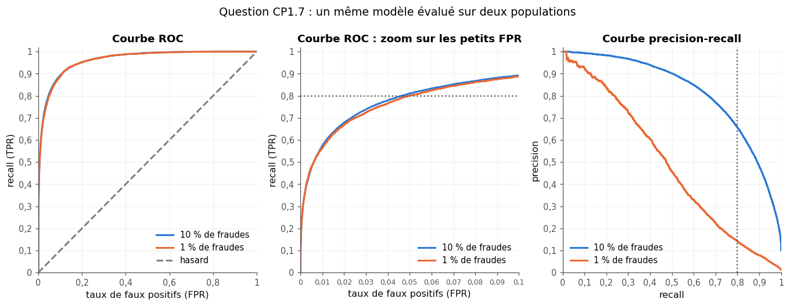

# Checkpoint I · Examen blanc de la partie I — Fondations

| | |
|---|---|
| **Durée** | 117 minutes (2 h au plus), d'une traite |
| **Note** | sur 20 points ; 2 points (10 %) portent sur la partie 0 (CP1.2 et CP1.3) |
| **Chapitres** | 1 à 6 (introduction, statistiques, probabilités et mesure de la qualité, Bayes, courbes et surfaces, théorie de l'information), plus 0A et 0B |
| **Ta copie** | `04_mes_reponses.md` (ou une feuille de papier) ; les deux questions de code se font dans `02_examen_notebook.ipynb`, partie A |
| **Après** | la partie B du notebook vérifie tes réponses chiffrées ; `03_examen_corrige.md` donne le corrigé détaillé, le barème et la remédiation |

## Règles

- **Livre, fiches, notes, flashcards et corrigés fermés.** Pas d'assistant IA, pas de recherche sur le web.
- **Calculatrice autorisée** pour les questions papier, ou Python comme simple calculatrice (`+`, `*`, `**`, `math.log2`, `math.sqrt`), sans NumPy ni fonction statistique toute faite.
- **Questions de code** (CP1.3 et CP1.5) : dans le notebook de l'examen, avec Python, NumPy et pandas, `help()` et la documentation officielle ; ni `mylearn`, ni `mylearn_ref`, ni les notebooks des chapitres.
- Donne le nombre de décimales demandé, et **n'arrondis qu'à la fin** du calcul. Quand une question dit « justifie », une réponse sans justification ne rapporte qu'une partie des points.
- Les durées sont indicatives : commence par ce que tu sais faire ; si tu bloques, passe à la question suivante et reviens-y à la fin.

| Question | Type | Sujet | Points | ⏱️ |
|---|---|---|---|---|
| CP1.1 | 🧠 | Questions flash sur toute la partie (vrai ou faux, justifié) | 1,5 | 10 min |
| CP1.2 | ✏️ | Partie 0 : norme, produit scalaire et log₂ | 1 | 5 min |
| CP1.3 | 🐛 | Partie 0 : la moyenne qui oublie `axis` (notebook) | 1 | 5 min |
| CP1.4 | ✏️ | Statistiques de cinq points à la main | 1,5 | 10 min |
| CP1.5 | 🔨 | Coder un intervalle de confiance bootstrap (notebook) | 1,5 | 10 min |
| CP1.6 | ✏️ | Dépistage : matrice de confusion, precision, NPV et règle de Bayes | 2 | 12 min |
| CP1.7 | 📈 | Lire une courbe ROC et une courbe PR déséquilibrées | 1,5 | 8 min |
| CP1.8 | ✏️ | Trois hypothèses, deux lancers | 2 | 10 min |
| CP1.9 | ∂ | Gradient, point selle et deux pas de descente | 2 | 12 min |
| CP1.10 | 🔮 | Prédire l'effet du learning rate | 1 | 5 min |
| CP1.11 | ✏️ | Entropie, cross-entropy, KL et Huffman | 2 | 12 min |
| CP1.12 | 🗣️ | Un LLM expliqué en cinq lignes : données, loss, perplexité | 1 | 5 min |
| CP1.13 | ⚖️ | Corrélation, causalité et échantillon : juger une affirmation | 1 | 5 min |
| CP1.14 | 💼 | Entretien express : 98 % d'accuracy sur la fraude | 1 | 8 min |
| | | **Total** | **20** | **117 min** |

---

### CP1.1 — Questions flash sur toute la partie (vrai ou faux, justifié) 🧠 ★ ⏱️ 10 min · 1,5 point

Pour chaque affirmation, réponds **Vrai** ou **Faux**, puis justifie en une ou deux phrases (un argument ou un contre-exemple). Chaque affirmation vaut 0,25 point : 0,1 pour le verdict, 0,15 pour la justification.

a) En apprentissage supervisé, le modèle a besoin des labels pour s'entraîner, mais pas pour faire une prédiction sur un nouvel exemple.
b) Si la corrélation de deux variables vaut 0, ces deux variables sont indépendantes.
c) Le score de Brier d'un classifieur peut baisser sans que son accuracy change.
d) Avec un prior uniforme, l'hypothèse MAP est celle qui a la plus grande vraisemblance.
e) Sur un ordinateur, la dérivée centrée $\frac{f(x + h) - f(x - h)}{2h}$ est d'autant plus précise que le pas $h$ est petit.
f) Deux modèles de langage qui n'utilisent pas le même tokenizer se comparent directement par leurs perplexités.

### CP1.2 — Partie 0 : norme, produit scalaire et log₂ ✏️ ★ ⏱️ 5 min · 1 point

Soit $\mathbf{u} = (1, -2, 2)$, $\mathbf{v} = (2, 3, 4)$ et $\mathbf{w} = (2, 1, 0)$.

a) La norme $\|\mathbf{u}\|$. **[0,2]**
b) Le produit scalaire $\mathbf{u} \cdot \mathbf{v}$. **[0,2]**
c) $\mathbf{u}$ et $\mathbf{w}$ sont-ils orthogonaux ? Justifie. **[0,2]**
d) $\log_2 \frac{1}{32}$. **[0,2]**
e) $\log_2 24$, à 3 décimales, sachant que $\log_2 3 \approx 1{,}585$ (sans calculatrice : écris le calcul). **[0,2]**

### CP1.3 — Partie 0 : la moyenne qui oublie `axis` 🐛 ★ ⏱️ 5 min · 1 point

**Dans le notebook** (`02_examen_notebook.ipynb`, partie A). Un collègue veut standardiser les quatre mesures des manchots (`X`, un tableau de forme (333, 4)) **colonne par colonne**, avec ddof = 0. Son code, `(X - X.mean()) / X.std()`, donne des colonnes dont les moyennes ne valent pas 0.

a) Que calcule `X.mean()` ? Quelle est la forme de son résultat ? Pourquoi la standardisation est-elle fausse ? (sur ta feuille) **[0,3]**
b) Écris `standardize(X)`, qui renvoie la version standardisée de `X` colonne par colonne (ddof = 0), sans modifier `X`. **[0,4]**
c) Le z-score de la masse du premier manchot (ligne 0, colonne `body_mass_g`), à 2 décimales. **[0,3]**

### CP1.4 — Statistiques de cinq points à la main ✏️ ★★ ⏱️ 10 min · 1,5 point

Cinq mesures $(x ; y)$ : $(2 ; 3)$, $(4 ; 7)$, $(6 ; 5)$, $(8 ; 11)$, $(10 ; 9)$. Sauf mention contraire, ddof = 0.

a) Les moyennes $\bar{x}$ et $\bar{y}$. **[0,2]**
b) La variance et l'écart-type de $x$ (2 décimales). **[0,3]**
c) Le z-score de la valeur $x = 10$ (2 décimales). **[0,2]**
d) La covariance de $x$ et $y$, avec ddof = 0, puis avec ddof = 1. **[0,3]**
e) La corrélation $r$ de $x$ et $y$ (2 décimales). **[0,3]**
f) On ajoute un sixième point, $(12 ; 40)$. Que deviennent la moyenne et la médiane de $y$ ? Laquelle des deux résiste à ce point extrême ? **[0,2]**

### CP1.5 — Coder un intervalle de confiance bootstrap 🔨 ★★ ⏱️ 10 min · 1,5 point

**Dans le notebook** (partie A), sur la masse des 119 manchots Gentoo (`gentoo_mass`, en grammes).

a) Écris `bootstrap_ci_mean(x, confidence=0.95, n_boot=1000, seed=0)`, qui renvoie l'intervalle de confiance bootstrap **percentile** de la moyenne de `x`, sous la forme d'un tuple `(bas, haut)`, bornes non arrondies : un générateur `np.random.default_rng(seed)` créé dans la fonction ; pour chacun des `n_boot` rééchantillons, dans l'ordre, `n` indices tirés avec remise par `rng.integers(0, n, size=n)`, et la moyenne de `x[idx]` ; les bornes sont les percentiles $50\,(1 - c)$ et $50\,(1 + c)$ de ces moyennes ($c$ = `confidence`). **[0,8]**
b) L'intervalle à 95 % (graine 0), à 1 décimale. **[0,2]**
c) L'intervalle à 90 % (graine 0) : est-il plus large ou plus étroit que celui de b) ? Pourquoi ? **[0,2]**
d) Laquelle de ces deux phrases est juste, et qu'est-ce qui ne va pas dans l'autre ? (1) « 95 % des manchots Gentoo pèsent entre … et … g. » (2) « Cette méthode donne un intervalle qui contient la vraie masse moyenne des Gentoo environ 95 fois sur 100. » **[0,3]**

### CP1.6 — Dépistage : matrice de confusion, precision, NPV et règle de Bayes ✏️ ★★ ⏱️ 12 min · 2 points

Un test de dépistage a une sensibilité (le recall) de 0,90 et une spécificité de 0,92. On l'applique à 25 000 personnes, dont 4 % sont malades.

a) Les quatre cases de la matrice de confusion : TP, FN, FP et TN. **[0,5]**
b) La precision du test, $P(\text{malade} \mid \text{positif})$ (3 décimales). **[0,3]**
c) La NPV, $P(\text{sain} \mid \text{négatif})$ (4 décimales). **[0,2]**
d) L'accuracy (3 décimales). **[0,1]**
e) Retrouve b) avec la règle de Bayes, sans la matrice de confusion : écris $P(\text{positif})$ comme une somme de deux termes, puis le posterior. **[0,3]**
f) Une personne positive refait le même test, et il est encore positif. On suppose les deux résultats indépendants quand on connaît l'état de la personne. Quelle est maintenant la probabilité qu'elle soit malade (3 décimales) ? **[0,4]**
g) Pourquoi la precision de b) est-elle si basse, alors que le test se trompe rarement ? Donne deux façons de l'augmenter **sans changer le test**. **[0,2]**

### CP1.7 — Lire une courbe ROC et une courbe PR déséquilibrées 📈 ★★ ⏱️ 8 min · 1,5 point

Un modèle antifraude donne un score à chaque transaction. On l'évalue sur deux populations de 400 000 transactions : l'une compte 10 % de fraudes, l'autre 1 %. Dans les deux, les scores des fraudes suivent la même loi, et ceux des transactions normales aussi. Lis les valeurs sur la figure, sans recalculer les courbes :

a) Pourquoi les deux courbes ROC sont-elles presque confondues ? **[0,2]**
b) Sur le zoom, lis le taux de faux positifs quand le recall vaut 0,8 (2 décimales). **[0,2]**
c) Une banque traite 100 000 transactions par jour, dont 1 % de fraudes. Au seuil de b), combien de fraudes détecte-t-elle par jour, et combien de fausses alertes déclenche-t-elle ? Déduis-en la precision. **[0,4]**
d) Lis la precision au recall 0,8 sur chacune des deux courbes precision-recall (1 décimale). Ta réponse à c) est-elle cohérente ? **[0,2]**
e) À quelle hauteur serait la « courbe » precision-recall d'un modèle qui répond au hasard, avec 1 % de fraudes ? **[0,2]**
f) Tu présentes ce modèle à l'équipe qui traite les alertes de la banque (1 % de fraudes). Quelle courbe lui montres-tu, et pourquoi ? **[0,3]**

### CP1.8 — Trois hypothèses, deux lancers ✏️ ★★ ⏱️ 10 min · 2 points

Une pièce peut avoir trois biais, $\theta = P(\text{face}) \in \{0{,}2 ;\ 0{,}5 ;\ 0{,}8\}$, avec le prior $[0{,}25 ;\ 0{,}5 ;\ 0{,}25]$. On la lance deux fois : face, puis face. Donne les listes dans l'ordre des $\theta$ croissants.

a) Le posterior après la première face (2 décimales). **[0,4]**
b) Le posterior après les deux faces (3 décimales, ou fractions exactes). **[0,5]**
c) L'évidence de la suite entière, $P(\text{face, face})$ (3 décimales). **[0,3]**
d) L'hypothèse MAP après les deux lancers. **[0,2]**
e) La probabilité que le troisième lancer donne face (3 décimales). Indice : c'est l'évidence d'une face, avec le posterior de b) comme prior (en fractions exactes, ou sans l'arrondir). **[0,4]**
f) Si le prior avait donné 0 à $\theta = 0{,}8$, que vaudrait le posterior de cette hypothèse, quels que soient les lancers ? Pourquoi est-ce dangereux ? **[0,2]**

### CP1.9 — Gradient, point selle et deux pas de descente ∂ ★★ ⏱️ 12 min · 2 points

Soit $f(x, y) = (x - 1)^2 - \frac{1}{2}(y + 2)^2$.

a) Calcule le gradient $\nabla f(x, y)$. **[0,3]**
b) Trouve le point critique, où le gradient est nul. **[0,2]**
c) Calcule la dérivée seconde de $t \mapsto f(1 + t, -2)$, puis celle de $t \mapsto f(1, -2 + t)$, en $t = 0$. Quelle est la nature du point critique ? **[0,4]**
d) Fais deux pas de descente de gradient depuis $(2 ; -1)$, avec le learning rate $\eta = 0{,}25$ : donne les deux points obtenus (valeurs exactes). **[0,5]**
e) Calcule $f$ au point de départ et aux deux points de d) (3 décimales). La valeur de $f$ baisse-t-elle ? Que deviennent $x - 1$ et $y + 2$ d'un pas à l'autre ? La descente converge-t-elle vers le point critique ? **[0,3]**
f) On part cette fois exactement de $(2 ; -2)$. Où va la descente ? Pourquoi est-ce un mauvais signe, et qu'est-ce qui la ferait repartir ? **[0,3]**

### CP1.10 — Prédire l'effet du learning rate 🔮 ★ ⏱️ 5 min · 1 point

On minimise $f(x) = 3x^2$ par descente de gradient, $x_{t+1} = x_t - \eta\, f'(x_t)$, en partant de $x_0 = 1$.

a) **Prédis d'abord, sans calculer de pas.** Pour chacun des learning rates $\eta = 0{,}3$ ; $0{,}02$ ; $0{,}4$ ; $0{,}15$, la descente : (A) converge vers 0 lentement, sans osciller ; (B) converge vite, sans osciller ; (C) converge en oscillant autour de 0 ; (D) diverge. Écris quatre lettres, dans l'ordre des $\eta$. **[0,6]**
b) Justifie : écris $x_{t+1}$ en fonction de $x_t$, puis donne la borne supérieure des learning rates pour lesquels la descente converge (valeur exacte ou 3 décimales). **[0,2]**
c) À quoi ressemble la courbe de la loss au fil des pas dans le cas (A), puis dans le cas (D) ? **[0,2]**

### CP1.11 — Entropie, cross-entropy, KL et Huffman ✏️ ★★ ⏱️ 12 min · 2 points

On range les lettres d'un texte anglais en quatre groupes : voyelles (V), consonnes fréquentes (F), consonnes moyennes (M) et consonnes rares (R), de probabilités $p = [0{,}4 ;\ 0{,}3 ;\ 0{,}2 ;\ 0{,}1]$. Toutes les réponses sont en bits. Tu peux utiliser les surprises $-\log_2 0{,}4 \approx 1{,}3219$ ; $-\log_2 0{,}3 \approx 1{,}7370$ ; $-\log_2 0{,}2 \approx 2{,}3219$ ; $-\log_2 0{,}1 \approx 3{,}3219$.

a) L'entropie $H(p)$ (3 décimales). **[0,3]**
b) Construis un code de Huffman pour $p$ : donne les longueurs des mots de code, dans l'ordre [V, F, M, R]. **[0,3]**
c) La longueur moyenne de ce code (2 décimales). **[0,2]**
d) Compare c) à $H(p)$ et à un code de longueur fixe. Pourquoi le code de Huffman ne peut-il pas atteindre $H(p)$ exactement ici ? **[0,2]**
e) Un code a été construit pour une source uniforme, $q = [0{,}25 ;\ 0{,}25 ;\ 0{,}25 ;\ 0{,}25]$. Que vaut $H(p, q)$ ? **[0,2]**
f) $\mathrm{KL}(p \,\|\, q)$ (3 décimales). **[0,3]**
g) $\mathrm{KL}(q \,\|\, p)$ (3 décimales). Que montrent f) et g) ? **[0,3]**
h) Un modèle $q'$ donne la probabilité 0 aux consonnes rares. Que vaut $H(p, q')$ ? Comment éviter cela ? **[0,2]**

### CP1.12 — Un LLM expliqué en cinq lignes : données, loss, perplexité 🗣️ ★ ⏱️ 5 min · 1 point

Explique à un ami qui ne fait pas de machine learning, en **cinq lignes au plus** et sans formule, comment on entraîne un modèle de langage comme ceux des assistants conversationnels : sur quelles données, pour quelle tâche, avec quelle loss. Puis dis-lui ce que veut dire « une perplexité de 10 ».

### CP1.13 — Corrélation, causalité et échantillon : juger une affirmation ⚖️ ★ ⏱️ 5 min · 1 point

Un site de cours en ligne publie : « Nos étudiants qui regardent les vidéos en vitesse ×1,5 réussissent mieux l'examen final : corrélation de 0,42 entre la vitesse de lecture et la note, sur 35 étudiants volontaires. Passez en ×1,5 pour réussir ! »

a) Donne trois raisons de douter de la conclusion (pense à la causalité, à l'échantillon et à l'incertitude). **[0,6]**
b) Quelle étude permettrait de savoir si regarder en ×1,5 fait réussir ? **[0,2]**
c) Que demanderais-tu au site pour juger de l'incertitude du chiffre 0,42 ? **[0,2]**

### CP1.14 — Entretien express : 98 % d'accuracy sur la fraude 💼 ★★ ⏱️ 8 min · 1 point

« Notre modèle de détection de fraude a 98 % d'accuracy sur un jeu de test qui contient 2 % de fraudes. On le met en production ? »

Réponds comme en entretien, en une minute : écris cinq à huit phrases sur ta copie, puis dis-les à voix haute.

---

**Fin de l'examen.** Enregistre ta copie et le notebook. Ensuite seulement : la partie B du notebook (vérification automatique), puis `03_examen_corrige.md` pour noter ta copie avec le barème.
