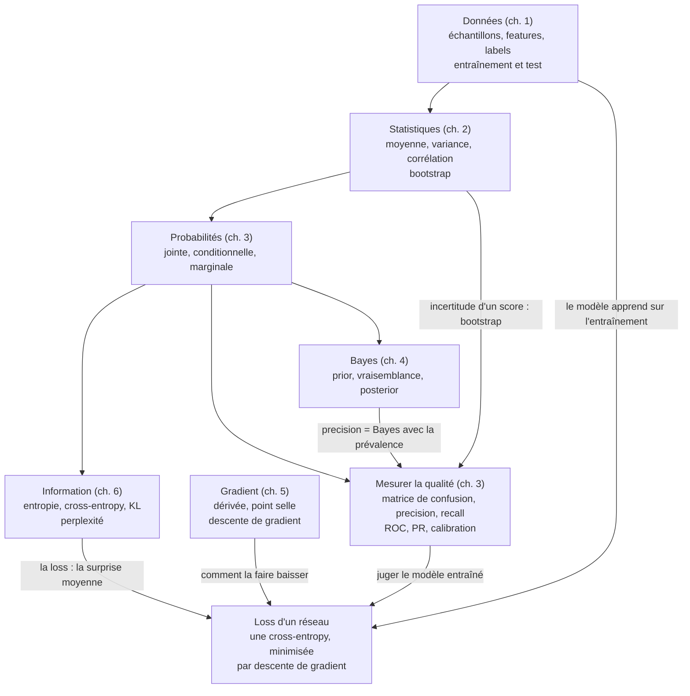

# Checkpoint I · Synthèse de la partie I — Fondations

> Une page à revoir avant l'examen blanc, puis avant la partie II. Compte environ 90 minutes : redessine d'abord la carte mentale, de mémoire, récite les formules colonne cachée, puis relis les pièges et dis le vocabulaire à voix haute (mode d'emploi en fin de page).

**Les six chapitres en une phrase chacun**
1. **Introduction** : un modèle apprend des règles à partir d'exemples (échantillons, features, labels), et on le juge sur des données qu'il n'a jamais vues.
2. **Statistiques** : résumer des données (moyenne, médiane, variance, corrélation) et mesurer l'incertitude d'un résumé, par le bootstrap.
3. **Probabilités et qualité** : probabilités jointes et conditionnelles ; mesurer un classifieur avec la matrice de confusion, la precision, le recall, les courbes ROC et precision-recall, la calibration.
4. **Bayes** : mettre à jour une croyance (prior) avec des observations (vraisemblance) pour obtenir un posterior, une fois ou en boucle.
5. **Courbes et surfaces** : la dérivée et le gradient donnent la pente ; la descente de gradient la suit vers un minimum, en se méfiant des points selles et du learning rate.
6. **Information** : l'entropie mesure la surprise moyenne, la cross-entropy le coût d'un mauvais modèle, la KL l'écart entre les deux ; la loss des classifieurs et des LLM est une cross-entropy.

## 1. Carte mentale

Redessine-la de mémoire, puis compare : chaque flèche doit pouvoir se justifier par un exemple (« la precision, c'est la règle de Bayes avec la prévalence comme prior »).

## 2. Fiche d'une page : les 20 formules clés

| # | Notion | Formule | Ce qu'il faut savoir dire | Ch. | `mylearn` |
|---|---|---|---|---|---|
| 1 | Moyenne | $\bar{x} = \frac{1}{n} \sum_i x_i$ | sensible aux valeurs extrêmes, contrairement à la médiane | 2 | `stats.mean` |
| 2 | Variance, écart-type | $\sigma^2 = \frac{1}{n - \text{ddof}} \sum_i (x_i - \bar{x})^2$, $\sigma = \sqrt{\sigma^2}$ | ddof = 0 pour NumPy, 1 pour pandas et pour estimer la variance d'une population | 2 | `stats.variance`, `stats.std` |
| 3 | z-score | $z_i = \frac{x_i - \bar{x}}{\sigma}$ | « à combien d'écarts-types de la moyenne » ; colonne par colonne (`axis=0`) | 2 | `stats.zscore` |
| 4 | Corrélation | $r = \frac{\mathrm{Cov}(x, y)}{\sigma_x \sigma_y}$, $\mathrm{Cov} = \frac{1}{n} \sum_i (x_i - \bar{x})(y_i - \bar{y})$ | entre −1 et 1, sans unité, linéaire seulement ; ni causalité ni indépendance | 2 | `stats.correlation` |
| 5 | Intervalle bootstrap | percentiles $50(1 - c)$ et $50(1 + c)$ de la statistique sur $B$ rééchantillons de taille $n$, tirés avec remise | l'incertitude d'une **moyenne** (ou d'un score), pas la dispersion des individus | 2 | `stats.bootstrap_ci` |
| 6 | Probabilité conditionnelle | $P(A \mid B) = \frac{P(A, B)}{P(B)}$ | $P(A \mid B) \ne P(B \mid A)$ en général | 3 | |
| 7 | Règle de Bayes | $P(H \mid O) = \frac{P(O \mid H)\, P(H)}{P(O)}$, $P(O) = \sum_j P(O \mid H_j)\, P(H_j)$ | le posterior d'aujourd'hui est le prior de demain ; un prior nul reste nul | 4 | `bayes.bayes_posterior`, `bayes.evidence` |
| 8 | Precision | $\frac{TP}{TP + FP}$ | la part des alertes justes ; dépend de la prévalence | 3 | `metrics.precision` |
| 9 | Recall | $\frac{TP}{TP + FN}$ | la part des positifs trouvés ; ne dépend pas de la prévalence | 3 | `metrics.recall` |
| 10 | F1 | $\frac{2\, P\, R}{P + R}$ | moyenne harmonique : punit le maillon faible | 3 | `metrics.f1` |
| 11 | AUC | aire sous la courbe ROC (TPR en fonction de FPR $= \frac{FP}{FP + TN}$) | $P(\text{score d'un positif} > \text{score d'un négatif})$ ; 0,5 = hasard ; flatteuse si les positifs sont rares | 3 | `metrics.roc_auc` |
| 12 | Dérivée centrée | $f'(x) \approx \frac{f(x + h) - f(x - h)}{2h}$ | erreur en $h^2$, mais pas de $h$ trop petit : $h \approx 10^{-5}$ | 5 | `calculus.numerical_derivative` |
| 13 | Gradient | $\nabla f = \left(\frac{\partial f}{\partial x_1}, \dots, \frac{\partial f}{\partial x_n}\right)$ | indique la plus forte montée ; nul en un minimum, un maximum **ou** un point selle | 5 | `calculus.numerical_gradient` |
| 14 | Pas de descente | $\mathbf{x} \leftarrow \mathbf{x} - \eta\, \nabla f(\mathbf{x})$ | $\eta$ trop petit : lent ; trop grand : oscille ou diverge | 5 | `calculus.gradient_descent` |
| 15 | Entropie | $H(p) = -\sum_i p_i \log_2 p_i$ | surprise moyenne ; de 0 (certain) à $\log_2 n$ (uniforme) ; borne de tout code | 6 | `info.entropy` |
| 16 | Cross-entropy | $H(p, q) = -\sum_i p_i \log_2 q_i \ge H(p)$ | coût de données $p$ envoyées avec le code de $q$ ; infinie si $q_i = 0$ là où $p_i > 0$ | 6 | `info.cross_entropy` |
| 17 | Divergence KL | $\mathrm{KL}(p \,\|\, q) = \sum_i p_i \log_2 \frac{p_i}{q_i} = H(p, q) - H(p)$ | $\ge 0$, nulle si $q = p$, **pas symétrique** | 6 | `info.kl_divergence` |
| 18 | Perplexité | $e^{\text{loss moyenne en nats}} = 2^{\text{loss en bits}}$ | un nombre de choix équiprobables équivalent ; se compare à tokenizer égal | 6 | `info.perplexity` |
| 19 | Log loss | $-\frac{1}{n} \sum_i \ln \hat{p}_{i, y_i}$ (binaire : $-\frac{1}{n} \sum_i [y_i \ln \hat{p}_i + (1 - y_i) \ln (1 - \hat{p}_i)]$) | la cross-entropy d'un classifieur, en nats ; punit les erreurs sûres d'elles | 6 | `info.log_loss` |
| 20 | Score de Brier | $\frac{1}{n} \sum_i (\hat{p}_i - y_i)^2$ | erreur quadratique des probabilités ; avec le diagramme de fiabilité, juge la calibration | 3 | `metrics.brier_score` |

## 3. Les pièges de la partie

| Piège | Comment il se voit | Le réflexe |
|---|---|---|
| **ddof selon les bibliothèques** | `np.std` divise par $n$, `pandas.Series.std` par $n - 1$ : 0,82 contre 1 sur les valeurs 1, 2, 3 | dire et fixer le ddof (`ddof=0` ou `ddof=1`), y compris dans un z-score |
| **Matrice de confusion à l'envers** | dans scikit-learn, lignes = vérité, colonnes = prédiction, ordre `[0, 1]` : `[[TN, FP], [FN, TP]]` | lire les axes avant de calculer ; `labels=[neg, pos]` pour fixer l'ordre |
| **Accuracy sur des classes rares** | 99 % d'accuracy avec 1 % de cas positifs : le score du modèle qui répond toujours « non » | comparer au modèle trivial ; regarder recall, precision, courbe PR |
| **Oubli de la prévalence** | un test sensible à 99 % et spécifique à 95 % n'a qu'une precision de 0,17 quand 1 % des gens sont malades | règle de Bayes, ou matrice de confusion sur une population entière (3.7) |
| **Underflow des produits de probabilités** | le produit de 200 probabilités de 0,01 vaut 0 en `float64` | additionner des log-probabilités ; normaliser avec log-sum-exp |
| **Cross-entropy infinie sans lissage** | une issue observée à laquelle le modèle donne 0 coûte $+\infty$ | lisser le **modèle** (Laplace), jamais les données (6.17) |
| **Pas $h$ trop petit** | en dessous du meilleur pas (vers $10^{-5}$ en différence centrée, $10^{-8}$ en différence avant), la dérivée numérique devient plus fausse, pas plus juste | $h \approx 10^{-5}$ en différence centrée (5.12) |
| **Gradient nul ≠ minimum** | une descente partie exactement sur le bon axe d'un point selle s'y arrête | regarder la courbure dans plusieurs directions (5.5, 5.20) |
| **Sens de la KL** | $\mathrm{KL}(p \,\|\, q) \ne \mathrm{KL}(q \,\|\, p)$ | dire quelle distribution pondère : celle de gauche |

## 4. Qui sert à quoi plus tard

| Module (chapitre) | Ce que tu y as écrit | Où il revient |
|---|---|---|
| `stats` (ch. 2) | moyenne, variance, z-score, covariance, tirages, bootstrap | standardiser des features (ch. 7, 12) ; covariance et PCA (ch. 12) ; bootstrap des estimateurs et bagging (ch. 9, 14) ; intervalles de confiance des scores (ch. 26, B6 à B8) |
| `metrics` (ch. 3) | matrice de confusion, precision, recall, F1, ROC, PR, calibration | partout où l'on juge un classifieur (ch. 7, 8, 10, 13, 15, 20, 21, 23) ; ROC-AUC (ch. 15, 25) ; calibration et équité (B6) |
| `bayes` (ch. 4) | évidence, posterior, boucle posterior-prior | classification par probabilités (ch. 7) ; boucle posterior-prior (ch. 9, 11) ; Naive Bayes et log-sum-exp (ch. 13) |
| `calculus` (ch. 5) | dérivée et gradient numériques, descente de gradient | l'entraînement de tous les modèles à paramètres (ch. 8, 9, 12 à 14) ; vérifier la rétropropagation (ch. 16, 18) ; optimiseurs (ch. 19) |
| `info` (ch. 6) | entropie, cross-entropy, KL, Huffman, perplexité, log loss | l'entropie des arbres de décision (ch. 13) ; la cross-entropy, loss des classifieurs et des réseaux (ch. 9, 17, 18, 22, 23) ; la KL du VAE (ch. 25) ; la perplexité des modèles de langage (ch. 22, 28, B2 à B4) ; la KL du RLHF (B8) |

## 5. Vocabulaire à maîtriser à l'oral

Dis chaque définition à voix haute, avec un exemple, **avant** d'ouvrir la réponse.

<b>Échantillon</b>
Un exemple du dataset (une ligne : un manchot, une image, une transaction). Le mot désigne aussi un sous-ensemble tiré d'une population, dont on calcule des statistiques.

<b>Feature</b>
Une caractéristique mesurée sur chaque échantillon, une entrée du modèle (la longueur du bec, un pixel, le montant d'une transaction).

<b>Label</b>
La réponse attendue pour un échantillon (l'espèce, le chiffre, « fraude » ou non) : ce que le modèle apprend à prédire en apprentissage supervisé.

<b>Loss</b>
Le nombre qui mesure l'erreur du modèle sur les données d'entraînement, et que l'entraînement fait baisser (une cross-entropy pour un classifieur).

<b>Learning rate</b>
La taille des pas de la descente de gradient, $\eta$ : trop petit, l'entraînement est lent ; trop grand, il oscille ou diverge.

<b>Généralisation</b>
La capacité d'un modèle à bien prédire sur des données qu'il n'a jamais vues ; on la mesure sur un jeu de test tenu à part.

<b>i.i.d.</b>
« Indépendants et identiquement distribués » : chaque échantillon est tiré de la même loi, sans dépendre des autres. Hypothèse de la plupart des méthodes (fausse pour les lettres d'un texte ou une série temporelle).

<b>Prior</b>
La probabilité qu'on donne à une hypothèse avant de voir les nouvelles données ; un prior nul ne peut plus jamais remonter.

<b>Posterior</b>
La probabilité de l'hypothèse après les données : prior × vraisemblance, divisé par l'évidence ; il devient le prior de l'observation suivante.

<b>Gradient</b>
Le vecteur des dérivées partielles d'une fonction : il pointe vers la plus forte montée, et la descente de gradient avance dans la direction opposée.

<b>Entropie</b>
La surprise moyenne d'une source, en bits : 0 si l'issue est certaine, $\log_2 n$ si les $n$ issues sont équiprobables ; une borne inférieure du nombre moyen de bits par symbole de tout code sans perte.

## Mode d'emploi (≈ 90 minutes)

1. **15 min** : redessine la carte mentale, de mémoire, puis compare avec la section 1.
2. **30 min** : cache les colonnes « Formule » et « Ce qu'il faut savoir dire » de la section 2 ; pour chaque notion, réécris la formule et invente un exemple chiffré.
3. **15 min** : pour chaque piège de la section 3, retrouve l'exercice où tu l'as rencontré.
4. **15 min** : le vocabulaire de la section 5, à voix haute.
5. **15 min** : les flashcards en retard des chapitres 1 à 6.

Ensuite : l'examen blanc (`01_examen_sujet.md`), en conditions réelles, puis le mini-projet (`projets/partie_1_detecteur_langue/`).
