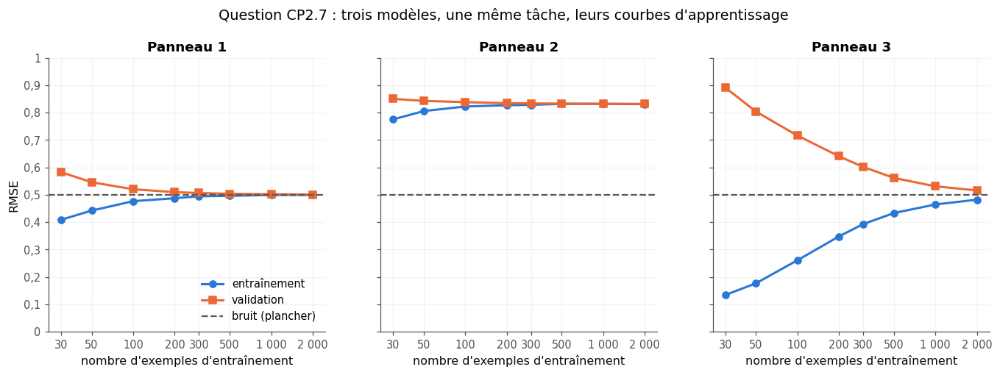

# Checkpoint II · Examen blanc de la partie II — Concepts

| | |
|---|---|
| **Durée** | 117 minutes (2 h au plus), d'une traite |
| **Note** | sur 20 points ; 2 points (10 %) portent sur la partie I (CP2.13) |
| **Chapitres** | 7 à 11 (classification, entraînement et test, overfitting et underfitting, neurones, apprentissage et raisonnement), plus les chapitres 3, 4 et 6 |
| **Ta copie** | `04_mes_reponses.md` (ou une feuille de papier) ; les deux questions de code se font dans `02_examen_notebook.ipynb`, partie A |
| **Après** | la partie B du notebook vérifie tes réponses chiffrées ; `03_examen_corrige.md` donne le corrigé détaillé, le barème et la remédiation |

## Règles

- **Livre, fiches, notes, flashcards et corrigés fermés.** Pas d'assistant IA, pas de recherche sur le web.
- **Calculatrice autorisée** pour les questions papier, ou Python comme simple calculatrice (`+`, `*`, `**`, `math.sqrt`, `math.log2`), sans NumPy ni fonction toute faite.
- **Questions de code** (CP2.10 et CP2.11) : dans le notebook de l'examen, avec Python et NumPy, `help()` et la documentation officielle ; ni `mylearn`, ni `mylearn_ref`, ni scikit-learn, ni les notebooks des chapitres.
- Donne le nombre de décimales demandé, et **n'arrondis qu'à la fin** du calcul. Quand une question dit « justifie » ou « montre », une réponse sans justification ne rapporte qu'une partie des points.
- Les durées sont indicatives : commence par ce que tu sais faire ; si tu bloques, passe à la question suivante et reviens-y à la fin.

| Question | Type | Sujet | Points | ⏱️ |
|---|---|---|---|---|
| CP2.1 | 🧠 | Vrai ou faux justifiés : huit affirmations sur la partie II | 2,5 | 10 min |
| CP2.2 | ✏️ | Un-contre-tous, un-contre-un : compter les modèles et dépouiller un vote | 1 | 5 min |
| CP2.3 | ✏️ | Une itération de k-means et l'inertie obtenue | 2 | 15 min |
| CP2.4 | ✏️ | Densité d'échantillons et hyper-orange en dimension $d$ | 1 | 6 min |
| CP2.5 | ✏️ | Plan d'évaluation : tailles des jeux, nombre d'entraînements, fuites | 1,5 | 8 min |
| CP2.6 | ∂ | Ridge en dimension 1 : dériver $w^*$ et interpréter $\lambda$ | 2 | 15 min |
| CP2.7 | 📈 | Diagnostiquer trois paires de courbes d'apprentissage | 1,5 | 6 min |
| CP2.8 | ✏️ | Perceptron : une epoch sur NAND, puis pourquoi pas XOR | 2 | 15 min |
| CP2.9 | ✏️ | Syllogismes et sophismes : valide, solide, nommer l'erreur | 1 | 5 min |
| CP2.10 | 🐛 | La fuite cachée d'une validation croisée (notebook) | 1,5 | 9 min |
| CP2.11 | 🔨 | Coder `epsilon_greedy_action` et une moyenne incrémentale (notebook) | 1 | 9 min |
| CP2.12 | 💼 | Entretien : « comment savez-vous que votre modèle ne surapprend pas ? » | 1 | 5 min |
| CP2.13 | ✏️ | Parties antérieures : matrice de confusion, Bayes et entropie | 2 | 9 min |
| | | **Total** | **20** | **117 min** |

---

### CP2.1 — Vrai ou faux justifiés : huit affirmations sur la partie II 🧠 ★ ⏱️ 10 min · 2,5 points

Pour chaque affirmation, réponds **Vrai** ou **Faux**, puis justifie en une ou deux phrases (un argument, un calcul ou un contre-exemple). Le verdict vaut 0,1 point ; la justification, 0,2 point (0,25 pour b et g, qui demandent un calcul ou un raisonnement pas à pas).

a) Standardiser les features avant k-means ne change pas les clusters trouvés : k-means ne dépend que des positions des points les uns par rapport aux autres. **[0,3]**
b) On tire des points au hasard, uniformément, dans le cube $[-1 ; 1]^{10}$. Plus de la moitié d'entre eux tombent dans le cube central $[-0{,}5 ; 0{,}5]^{10}$, dont le côté est la moitié de celui du grand cube. **[0,35]**
c) On essaie 50 réglages, chacun en validation croisée, et l'on garde le meilleur. Son score moyen de validation croisée estime sans biais le score que ce réglage obtiendra sur des données nouvelles. **[0,3]**
d) Pour obtenir l'erreur type du score moyen d'une validation croisée à $k$ folds, il suffit de diviser l'écart-type des $k$ scores par $\sqrt{k}$. **[0,3]**
e) Dans une régression Ridge, augmenter $\lambda$ ne peut pas faire baisser l'erreur d'entraînement (la somme des carrés des résidus, sans la pénalité). **[0,3]**
f) Le $R^2$ d'un modèle de régression, mesuré sur un jeu de validation, est toujours compris entre 0 et 1. **[0,3]**
g) Un perceptron part de poids et d'un biais nuls, et voit les exemples dans le même ordre. Si l'on multiplie son learning rate $\eta$ par 10, alors, à chaque étape, ses poids et son biais valent 10 fois ceux du perceptron d'origine, et ses prédictions ne changent pas. **[0,35]**
h) Un syllogisme valide dont la conclusion est fausse a au moins une prémisse fausse. **[0,3]**

### CP2.2 — Un-contre-tous, un-contre-un : compter les modèles et dépouiller un vote ✏️ ★ ⏱️ 5 min · 1 point

a) Avec $K = 12$ classes, les nombres de classifieurs binaires d'un un-contre-tous et d'un un-contre-un : la liste $[N_{\text{OvR}}, N_{\text{OvO}}]$. **[0,15]**
b) Le plus petit nombre de classes pour lequel un un-contre-un demande au moins 100 duels. **[0,15]**

Cinq classes A, B, C, D et E, rangées dans cet ordre (indices 0 à 4), sont traitées par un un-contre-un. Pour un premier point, les dix duels donnent ces vainqueurs :

| A-B | A-C | A-D | A-E | B-C | B-D | B-E | C-D | C-E | D-E |
|---|---|---|---|---|---|---|---|---|---|
| A | C | A | E | C | B | E | D | C | D |

c) Les voix de chaque classe, dans l'ordre $[A, B, C, D, E]$. **[0,15]**
d) La classe prédite (sa lettre). **[0,1]**

Pour un second point :

| A-B | A-C | A-D | A-E | B-C | B-D | B-E | C-D | C-E | D-E |
|---|---|---|---|---|---|---|---|---|---|
| B | C | D | A | B | D | B | C | E | D |

e) Les voix $[A, B, C, D, E]$. **[0,15]**
f) La classe prédite (sa lettre) avec la règle de `mylearn` : en cas d'égalité, la classe de plus petit indice. **[0,15]**
g) La classe prédite (sa lettre) si l'on départage plutôt deux classes à égalité par le duel qui les a opposées. **[0,15]**

### CP2.3 — Une itération de k-means et l'inertie obtenue ✏️ ★★ ⏱️ 15 min · 2 points

Six points du plan : $P_1\,(2 ; 6)$, $P_2\,(3 ; 6)$, $P_3\,(4 ; 6)$, $P_4\,(6 ; 4)$, $P_5\,(9 ; 5)$, $P_6\,(9 ; 6)$. On cherche $k = 2$ clusters avec l'algorithme de Lloyd, à partir des centres $c_1 = P_2$ et $c_2 = P_3$. L'inertie est la somme des carrés des distances de chaque point à son centre. Compare des distances **au carré** : pas besoin de racines.

a) Après la première affectation, le cluster (1 ou 2) de chaque point, dans l'ordre $P_1$ à $P_6$. **[0,2]**
b) L'inertie de cette affectation, calculée avec les centres de départ. **[0,2]**
c) Les deux nouveaux centres, sous la forme $[[x_1, y_1], [x_2, y_2]]$. **[0,2]**
d) L'inertie avec ces nouveaux centres, sans changer l'affectation (2 décimales). **[0,2]**
e) Lors de la deuxième affectation, un seul point change de cluster : son numéro (de 1 à 6). **[0,2]**
f) Les centres après la deuxième mise à jour. **[0,2]**
g) L'inertie finale. **[0,2]**
h) Vrai ou faux : une troisième affectation change encore au moins un point de cluster. **[0,1]**
i) Avec k-means++, le premier centre tiré est $P_1$. Quelle est la probabilité que le deuxième centre soit l'un des points $P_4$, $P_5$, $P_6$ (3 décimales) ? **[0,3]**
j) Pourquoi le départ $c_1 = P_2$, $c_2 = P_3$ était-il mauvais ? En quoi k-means++ protège-t-il de ce genre de départ ? **[0,2]**

### CP2.4 — Densité d'échantillons et hyper-orange en dimension $d$ ✏️ ★ ⏱️ 6 min · 1 point

On dispose de 2 000 échantillons. Chaque feature est ramenée à $[0 ; 1]$, et chaque axe est découpé en 4 cases.

a) La densité d'échantillons (le nombre moyen d'échantillons par case) en dimension 3, puis en dimension 6 : une liste de deux nombres (3 décimales). **[0,2]**
b) Le nombre d'échantillons qu'il faudrait pour une densité de 2 en dimension 8, toujours avec 4 cases par axe. **[0,15]**
c) La plus petite dimension où la densité de ces 2 000 échantillons passe sous 0,01. **[0,2]**

Une variante de l'hyper-orange. La boîte est le cube de côté 6 centré à l'origine (toutes les coordonnées entre −3 et 3). Dans chacun de ses $2^d$ coins, un ballon de rayon 1 est centré au point dont toutes les coordonnées valent +2 ou −2. Au centre, l'orange est la plus grosse boule centrée à l'origine qui ne chevauche aucun ballon : elle les touche.

d) Le rayon de l'orange en dimension 9. **[0,15]**
e) La plus petite dimension où l'orange sort de la boîte. **[0,15]**
f) En dimension 30, la part du volume d'une boule située dans sa « peau » d'épaisseur 5 % du rayon (3 décimales). **[0,15]**

### CP2.5 — Plan d'évaluation : tailles des jeux, nombre d'entraînements, fuites ✏️ ★ ⏱️ 8 min · 1,5 point

On veut prédire l'espèce des 333 manchots sans valeur manquante. Règles de la fiche du ch. 8 : un test de part $t$ a $n_{\text{test}} = \lceil t \cdot n \rceil$ exemples ; avec $k$ folds, les $n \bmod k$ premiers folds reçoivent un exemple de plus que les autres.

a) On met d'abord de côté un test de 20 % : sa taille. **[0,15]**
b) Une validation croisée à 5 folds sur les manchots restants : la taille de chaque fold, dans l'ordre des folds (une liste). **[0,2]**
c) On essaie toutes les combinaisons d'un degré de features polynomiales dans $\{1, 2, 3\}$ et d'une force de régularisation dans $\{0{,}01 ;\ 0{,}1 ;\ 1 ;\ 10 ;\ 100\}$, chacune en validation croisée à 5 folds, puis on réentraîne le réglage retenu sur tous les manchots hors test. Combien d'entraînements en tout ? **[0,2]**
d) La même recherche dans une validation croisée **imbriquée** : 5 folds extérieurs ; dans chaque tour extérieur, toute la recherche de c) (la validation croisée à 5 folds de chaque réglage, puis le réentraînement du réglage retenu) sur la partie qui reste. La note du modèle sur le fold extérieur ne demande pas d'entraînement, et l'on ne compte pas la recherche finale qui produirait le modèle livré. Combien d'entraînements en tout ? **[0,2]**
e) Le modèle retenu obtient une accuracy d'environ 0,94 sur les manchots de test. Avec $\hat{p} = 0{,}94$ et $n$ la taille du test, son erreur type $\sqrt{\hat{p}(1 - \hat{p})/n}$, puis la demi-largeur $1{,}96\,\mathrm{SE}$ de l'intervalle à 95 % : une liste de deux nombres (3 décimales). **[0,25]**
f) Parmi ces cinq façons de faire, lesquelles contiennent une fuite de données ? Donne leurs numéros. **[0,5]**
1. Remplacer les masses manquantes du fichier brut (344 manchots) par la moyenne de toutes les masses connues, puis tirer le jeu de test.
2. Standardiser les quatre mesures une seule fois, avec la moyenne et l'écart-type des manchots hors test, puis lancer la validation croisée.
3. Dans chaque tour de la validation croisée, ajuster la standardisation sur les folds d'entraînement, et l'appliquer telle quelle au fold de validation.
4. Choisir le réglage par validation croisée, le réentraîner sur tous les manchots hors test, puis l'évaluer une seule fois sur le test.
5. Le score de test déçoit : changer de degré, réévaluer sur le test, et recommencer jusqu'à dépasser 0,95.

### CP2.6 — Ridge en dimension 1 : dériver $w^*$ et interpréter $\lambda$ ∂ ★★ ⏱️ 15 min · 2 points

Un modèle avec ordonnée à l'origine, $\hat{y} = w\,x + b$, est ajusté par Ridge : on minimise
$$L(w, b) = \sum_{i=1}^{n} (y_i - w\,x_i - b)^2 + \lambda\,w^2, \qquad \lambda \ge 0,$$
où l'ordonnée à l'origine $b$ n'est pas pénalisée. On note $\bar{x}$ et $\bar{y}$ les moyennes, $S_{xx} = \sum_i (x_i - \bar{x})^2$ et $S_{xy} = \sum_i (x_i - \bar{x})(y_i - \bar{y})$.

1. Montre que la condition $\frac{\partial L}{\partial b} = 0$ donne $b = \bar{y} - w\,\bar{x}$. **[0,25]**
2. Remplace $b$ par cette expression, puis montre que $L$ est minimale en $w^* = \frac{S_{xy}}{S_{xx} + \lambda}$ (vérifie que c'est bien un minimum). **[0,35]**
3. Écris $w^*$ en fonction de la pente des moindres carrés, $w_{\text{MC}} = \frac{S_{xy}}{S_{xx}}$. Que devient le modèle quand $\lambda \to +\infty$ ? Pourquoi ne prédit-il pas 0 ? **[0,25]**

Données : $x = (1, 2, 3, 4, 5)$ et $y = (2, 3, 5, 4, 6)$.

a) $[w^*, b]$ pour $\lambda = 0$. **[0,2]**
b) $[w^*, b]$ pour $\lambda = 5$. **[0,2]**
c) La somme des carrés des résidus d'entraînement, $\sum_i (y_i - \hat{y}_i)^2$, pour $\lambda = 0$ puis pour $\lambda = 5$ : une liste de deux nombres. **[0,25]**
d) On mesure maintenant $x$ dans une unité dix fois plus petite : les données deviennent $x' = 10\,x = (10, 20, 30, 40, 50)$, et l'on garde $\lambda = 5$. Donne la prédiction du nouveau modèle pour le point $x' = 50$ (3 décimales). Compare-la à la prédiction du modèle de b) pour le même point ($x = 5$) : que montre l'écart, et que faut-il faire avant une régression Ridge ? **[0,3]**
e) Peut-on choisir $\lambda$ en minimisant l'erreur d'entraînement ? Comment le choisir ? **[0,2]**

### CP2.7 — Diagnostiquer trois paires de courbes d'apprentissage 📈 ★ ⏱️ 6 min · 1,5 point

Trois modèles sont entraînés sur la même tâche de régression, avec des jeux d'entraînement de 30 à 2 000 exemples. Pour chaque taille, la figure donne la RMSE d'entraînement et celle de validation (des médianes sur 200 tirages). Le bruit des mesures a un écart-type de 0,5 : aucun modèle ne peut avoir durablement une RMSE de validation inférieure à 0,5 (la ligne pointillée).

a) Le numéro du panneau qui montre de l'underfitting. **[0,2]**
b) Le numéro du panneau qui montre de l'overfitting quand les exemples sont peu nombreux (une forte variance). **[0,2]**
c) Dans le panneau de b), lis l'écart entre la RMSE de validation et celle d'entraînement à $n = 100$ (2 décimales). **[0,25]**
d) Pour le modèle du panneau 2, quelle action a le plus de chances de faire baisser l'erreur de validation ? (A) dix fois plus d'exemples d'entraînement ; (B) un modèle plus souple, ou de meilleures features ; (C) une régularisation plus forte ; (D) l'early stopping. **[0,2]**
e) Vrai ou faux : dans le panneau 2, les deux courbes sont proches l'une de l'autre, donc le modèle est bon. **[0,2]**
f) Pour chaque panneau, ton diagnostic et ce que tu ferais ensuite. **[0,45]**

### CP2.8 — Perceptron : une epoch sur NAND, puis pourquoi pas XOR ✏️ ★★ ⏱️ 15 min · 2 points

Un perceptron avec biais apprend la porte **NAND** (sa sortie vaut 0 seulement pour l'entrée $(1, 1)$), avec la règle de la fiche du ch. 10 : la sortie 1 est codée $y = +1$ et la sortie 0, $y = -1$ ; on part de $\mathbf{w} = (0, 0)$ et $b = 0$, avec $\eta = 1$ ; un exemple est mal classé quand $y\,(\mathbf{w}\cdot\mathbf{x} + b) \le 0$, et il déclenche alors $\mathbf{w} \leftarrow \mathbf{w} + \eta\, y\, \mathbf{x}$ et $b \leftarrow b + \eta\, y$. Les exemples sont présentés dans l'ordre $(0, 0)$, $(0, 1)$, $(1, 0)$, $(1, 1)$. Tiens un tableau : exemple, $z = \mathbf{w}\cdot\mathbf{x} + b$ calculé avant la mise à jour, erreur ou non, $\mathbf{w}$ et $b$ après l'exemple.

a) Les quatre valeurs de $z$ pendant la première epoch, dans l'ordre des exemples (une liste). **[0,3]**
b) $[w_1, w_2, b]$ à la fin de la première epoch. **[0,25]**
c) Le nombre de corrections pendant la première epoch. **[0,15]**
d) Avec les poids de b) et la règle de prédiction ($+1$ si $z > 0$, $-1$ sinon), combien des quatre entrées sont bien classées ? **[0,2]**
e) $[w_1, w_2, b]$ à la fin de la deuxième epoch. **[0,3]**
f) Montre qu'aucun perceptron ne calcule XOR (version 0/1 : la sortie vaut 1 si $w_1 x_1 + w_2 x_2 + b > 0$, et 0 sinon ; XOR vaut 1 pour $(0, 1)$ et $(1, 0)$, 0 pour $(0, 0)$ et $(1, 1)$) : écris les quatre inégalités, puis trouve la contradiction. **[0,6]**
g) Quelle feature ajouter aux deux entrées pour qu'un seul perceptron calcule XOR ? Donne des poids et un biais qui marchent, et vérifie-les sur les quatre entrées. **[0,2]**

### CP2.9 — Syllogismes et sophismes : valide, solide, nommer l'erreur ✏️ ★ ⏱️ 5 min · 1 point

1. Tous les modèles Ridge sont régularisés. Tous les modèles Lasso sont régularisés. Donc tous les modèles Lasso sont des modèles Ridge.
2. Tout estimateur sans biais a une erreur systématique nulle. La moyenne d'un échantillon est un estimateur sans biais de la moyenne de la population. Donc la moyenne d'un échantillon a une erreur systématique nulle.
3. Si un modèle surapprend, son erreur de validation dépasse nettement son erreur d'entraînement. Ce modèle ne surapprend pas. Donc son erreur de validation ne dépasse pas nettement son erreur d'entraînement.
4. Tout modèle qui atteint une erreur d'entraînement nulle généralise parfaitement. Ce modèle atteint une erreur d'entraînement nulle. Donc il généralise parfaitement.
5. Tout réseau profond a beaucoup de paramètres. Aucune régression linéaire n'est un réseau profond. Donc aucune régression linéaire n'a beaucoup de paramètres.
6. Si les features ne sont pas standardisées, k-means donne trop de poids à la feature de plus grande échelle. Dans ce découpage, k-means donne trop de poids à la masse en grammes, la feature de plus grande échelle. Donc les features n'étaient pas standardisées.

a) Pour chaque raisonnement, écris S s'il est solide (valide, avec des prémisses vraies), V s'il est valide mais pas solide, N s'il n'est pas valide. Six lettres dans l'ordre. **[0,45]**
b) Pour chaque raisonnement **non valide**, dans l'ordre, le nom de son sophisme : (A) affirmer le conséquent ; (B) nier l'antécédent ; (C) majeur illicite ; (D) mineur illicite ; (E) moyen terme non distribué ; (F) prémisses exclusives. A et B nomment les erreurs des raisonnements conditionnels (« si … alors … ») ; C à F, celles des syllogismes (« tout … », « aucun … »). **[0,4]**
c) Vrai ou faux : une induction dont les observations sont toutes exactes, et très nombreuses, ne peut pas aboutir à une conclusion fausse. **[0,15]**

### CP2.10 — La fuite cachée d'une validation croisée 🐛 ★ ⏱️ 9 min · 1,5 point

**Dans le notebook** (`02_examen_notebook.ipynb`, partie A), sur 2 000 districts de Californie. Un collègue estime la RMSE d'une régression Ridge par validation croisée à 5 folds. En plus des huit features, il ajoute « le prix du quartier » : la grille latitude-longitude est découpée en cases de 0,1° de côté, et chaque district reçoit la moyenne des prix (`MedHouseVal`) des districts de sa case. Il standardise ensuite les neuf colonnes, puis lance la validation croisée. Son code est dans le notebook, avec les fonctions dont il se sert (`cell_means`, `lookup`, `kfold`, `ridge_fit`, `ridge_predict`, `rmse`).

a) Deux étapes de son code apprennent quelque chose des données avant la boucle de validation croisée. Lesquelles ? Laquelle fausse vraiment son score, et pourquoi l'autre ne le change presque pas ? (sur ta feuille) **[0,4]**
b) Écris `cv_rmse_fixed(X, y, cells, k=5, alpha=1.0)`, qui fait le même calcul **sans fuite**. Dans chaque tour (`kfold(len(y), k)`, comme chez le collègue), le prix du quartier de chaque district, d'entraînement comme de validation, est la moyenne des prix des districts **d'entraînement du tour** qui sont dans sa case ; un district dont la case ne contient aucun district d'entraînement reçoit la moyenne des prix d'entraînement du tour ; la standardisation utilise la moyenne et l'écart-type des lignes d'entraînement du tour. La fonction renvoie la moyenne des $k$ RMSE de validation, sans modifier ses arguments. **[0,6]**
c) La RMSE moyenne de ta fonction avec les cases de 0,1° (3 décimales, sur ta feuille). **[0,2]**
d) Le collègue a aussi comparé des cases de 0,5°, 0,1° et 0,05° avec son code, et garde les plus petites, qui lui donnent la meilleure RMSE. Compare avec ta fonction (les cases sont données dans le notebook). Quelle taille garderais-tu ? Pourquoi la fuite le poussait-elle vers les plus petites cases ? **[0,3]**

### CP2.11 — Coder `epsilon_greedy_action` et une moyenne incrémentale 🔨 ★ ⏱️ 9 min · 1 point

**Dans le notebook** (partie A).

a) Écris `epsilon_greedy_action(q_values, epsilon, rng)`. Avec la probabilité $\varepsilon$ (un tirage `rng.random() < epsilon`), elle explore : un bras au hasard parmi **tous** les bras, `rng.integers(K)` ($K$ = nombre de bras). Sinon, elle exploite : un bras d'estimation maximale, tiré au hasard parmi les ex aequo avec `rng.choice`. Elle renvoie un `int` et ne modifie pas `q_values`. **[0,5]**
b) Écris `incremental_estimates(rewards, step=None)`, qui renvoie la liste des estimations successives d'un bras, une après chaque récompense, en partant de $Q = 0$ : à la $n$-ième récompense $R$, $Q \leftarrow Q + a\,(R - Q)$, avec $a = 1/n$ si `step` vaut `None` (la moyenne exacte), et $a$ = `step` sinon (un pas constant). La fonction ne recalcule jamais la somme de toutes les récompenses. **[0,3]**
c) Avec ta fonction, la dernière estimation pour les récompenses `[1, 0, 0, 1, 1, 1, 0, 1]` et un pas constant de 0,25 (4 décimales, sur ta feuille). **[0,2]**

### CP2.12 — Entretien : « comment savez-vous que votre modèle ne surapprend pas ? » 💼 ★ ⏱️ 5 min · 1 point

Le recruteur insiste : « Concrètement, comment savez-vous que votre modèle ne surapprend pas ? »

Réponds comme en entretien, en une minute : écris cinq à huit phrases sur ta copie, puis dis-les à voix haute.

### CP2.13 — Parties antérieures : matrice de confusion, Bayes et entropie ✏️ ★ ⏱️ 9 min · 2 points

Un filtre anti-spam est testé sur 1 000 e-mails, dont 150 spams. Il signale 160 e-mails, dont 120 sont des spams. La classe positive est « spam ».

a) TP, FP, FN et TN, dans cet ordre. **[0,3]**
b) La precision, le recall et le F1, dans cet ordre (3 décimales). **[0,4]**
c) L'accuracy (2 décimales). **[0,1]**
d) Le filtre est installé dans une entreprise où 40 % des e-mails sont des spams. Son recall et son taux de faux positifs, $\frac{FP}{FP + TN}$, restent ceux du test. Avec la règle de Bayes, la probabilité qu'un e-mail signalé soit un spam (3 décimales). **[0,5]**
e) Un cluster de k-means contient 30 manchots Adélie et 10 Chinstrap. L'entropie de ses labels, en bits (3 décimales). **[0,35]**
f) Un autre cluster contient 20 Adélie, 10 Chinstrap et 10 Gentoo : l'entropie de ses labels, en bits. Lequel des deux clusters est le plus pur ? **[0,35]**

---

**Fin de l'examen.** Enregistre ta copie et le notebook. Ensuite seulement : la partie B du notebook (vérification automatique), puis `03_examen_corrige.md` pour noter ta copie avec le barème.
