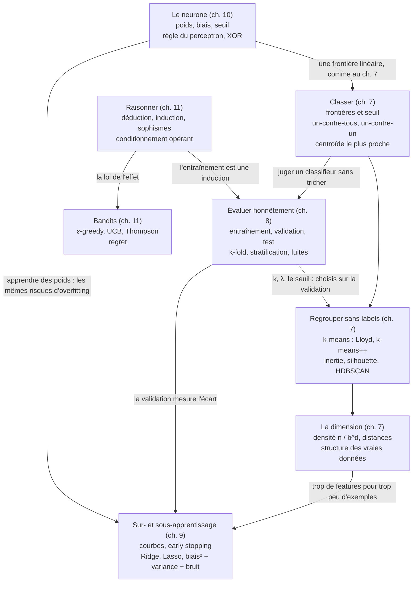

# Checkpoint II · Synthèse de la partie II — Concepts

> Une page à revoir avant l'examen blanc, puis avant la partie III. Compte environ 90 minutes : redessine d'abord la carte mentale, de mémoire, récite les formules en cachant les colonnes de droite, puis relis les pièges et dis le vocabulaire à voix haute (mode d'emploi en fin de page).

**Les cinq chapitres en une phrase chacun**

7. **Classification** : un classifieur découpe l'espace des features en régions ; on combine des classifieurs binaires (un-contre-tous, un-contre-un), on regroupe sans labels avec k-means, et l'on se méfie de la grande dimension, où les données deviennent rares.
8. **Entraînement et test** : on ne juge un modèle que sur des données qu'il n'a jamais vues ; la validation (ou la validation croisée) sert à choisir, le test à mesurer une seule fois, et toute fuite rend le score trop beau.
9. **Overfitting et underfitting** : l'écart entre entraînement et validation signale l'overfitting, leur niveau commun l'underfitting ; on règle la capacité par la forme du modèle, la régularisation (Ridge, Lasso) et l'early stopping, en raisonnant en biais et variance.
10. **Neurones** : un perceptron calcule une somme pondérée, ajoute un biais et compare à 0 ; sa règle d'apprentissage converge sur des données linéairement séparables, et un seul neurone ne calcule pas XOR.
11. **Apprentissage et raisonnement** : apprendre, c'est représenter, évaluer et optimiser ; l'entraînement est une induction, jamais certaine, et l'agent d'un bandit apprend de ses récompenses en arbitrant entre exploration et exploitation.

## 1. Carte mentale

Redessine-la de mémoire, puis compare : chaque flèche doit pouvoir se justifier par un exemple (« trop de features pour trop peu d'exemples : 5 000 gènes mesurés pour 300 patients, le phénomène de Hughes »).

## 2. Fiche d'une page : les 22 formules clés

| # | Notion | Formule | Ce qu'il faut savoir dire | Ch. | `mylearn` |
|---|---|---|---|---|---|
| 1 | Seuil de coût minimal | $t^* = \frac{C_{FP}}{C_{FP} + C_{FN}}$ | 0,5 seulement si les deux erreurs coûtent autant ; il suppose des probabilités calibrées | 7 | |
| 2 | Nombre de classifieurs | $N_{\text{OvR}} = K$, $N_{\text{OvO}} = \frac{K(K-1)}{2}$ | l'un-contre-un fait beaucoup de petits modèles ; une règle d'égalité se documente | 7 | `multiclass.OneVsRestClassifier`, `OneVsOneClassifier` |
| 3 | Centroïde le plus proche | $\hat{y} = \arg\min_k \lVert \mathbf{x} - \boldsymbol{\mu}_k \rVert^2$ | frontières : des morceaux de médiatrices | 7 | `cluster.NearestCentroid` |
| 4 | Inertie | $J = \sum_i \lVert \mathbf{x}_i - \boldsymbol{\mu}_{c_i} \rVert^2$ | ni l'affectation ni la mise à jour ne la font monter ; minimum local | 7 | `cluster.KMeans` (`inertia_`) |
| 5 | k-means++ | $P(\mathbf{x}) = \frac{D(\mathbf{x})^2}{\sum_{\mathbf{x}'} D(\mathbf{x}')^2}$ | les centres de départ s'écartent les uns des autres | 7 | `cluster.kmeans_plusplus` |
| 6 | Silhouette | $s(i) = \frac{b(i) - a(i)}{\max(a(i), b(i))} \in [-1, 1]$ | négative : le point serait mieux dans le cluster voisin | 7 | `cluster.silhouette_samples`, `silhouette_score` |
| 7 | Densité d'échantillons | $\rho = \frac{n}{b^d}$, donc $n = \rho\,b^d$ | un nombre moyen par case, pas une probabilité | 7 | |
| 8 | Grande dimension | hyper-orange $r(d) = \sqrt{d} - 1$ ; écorce $1 - (1 - \varepsilon)^d$ | au-delà de la 3D, calculer plutôt que dessiner | 7 | |
| 9 | Tailles des jeux | $n_{\text{test}} = \lceil t \cdot n \rceil$ ; les $n \bmod k$ premiers folds ont un exemple de plus | mélanger avant de découper, stratifier si les classes sont déséquilibrées | 8 | `model_selection.train_test_split`, `kfold_indices`, `stratified_kfold_indices` |
| 10 | Erreur type d'une accuracy | $\mathrm{SE} = \sqrt{\frac{\hat{p}(1 - \hat{p})}{n}}$, intervalle $\hat{p} \pm 1{,}96\,\mathrm{SE}$ | diviser l'incertitude par 2 demande un test 4 fois plus grand | 8 | |
| 11 | Optimisme de la sélection | $P(\max_j S_j \ge s) = 1 - \big(1 - P(S \ge s)\big)^K$ | plus on essaie de réglages, plus le meilleur score de validation flatte | 8 | |
| 12 | Validation croisée | $\bar{s} = \frac{1}{k}\sum_j s_j$ et leur dispersion $\sigma_s$ | un modèle **cloné** par tour ; $\sigma_s/\sqrt{k}$ n'est pas une erreur type | 8 | `model_selection.clone`, `cross_val_score` |
| 13 | Erreurs d'une régression | $\mathrm{MSE} = \frac{1}{n}\sum_i (y_i - \hat{y}_i)^2$, $\mathrm{RMSE} = \sqrt{\mathrm{MSE}}$, $\mathrm{MAE} = \frac{1}{n}\sum_i \lvert y_i - \hat{y}_i \rvert$ | la MSE punit les grosses erreurs, la MAE résiste aux points aberrants | 9 | `linear.mean_squared_error`, `mean_absolute_error` |
| 14 | $R^2$ | $1 - \frac{\sum_i (y_i - \hat{y}_i)^2}{\sum_i (y_i - \bar{y})^2}$ | 0 : pas mieux que la moyenne ; négatif sur des données nouvelles mal prédites | 8, 9 | `linear.r2_score` |
| 15 | Moindres carrés | $a = \frac{S_{xy}}{S_{xx}}$, $b = \bar{y} - a\,\bar{x}$ ; en général $\mathbf{X}^\top\mathbf{X}\,\mathbf{w} = \mathbf{X}^\top\mathbf{y}$ | `np.linalg.lstsq`, jamais l'inverse ; norme minimale s'il y a une infinité de solutions | 9 | `linear.LinearRegression` |
| 16 | Ridge | $(\mathbf{X}_c^\top\mathbf{X}_c + \lambda\,\mathbf{I})\,\mathbf{w} = \mathbf{X}_c^\top\mathbf{y}_c$ ; en 1D $w^* = \frac{S_{xy}}{S_{xx} + \lambda}$ ($\lambda$ : l'`alpha` du code) | rétrécit, en général sans annuler ; ordonnée non pénalisée ; features standardisées | 9 | `linear.Ridge` |
| 17 | Seuillage doux (Lasso) | $S(z, \gamma) = \operatorname{signe}(z)\max(\lvert z \rvert - \gamma, 0)$ | des poids exactement nuls : une sélection de features | 9 | `linear.soft_threshold`, `Lasso` |
| 18 | Biais et variance | $\mathbb{E}[(y - \hat{f}_D(x))^2] = (\bar{f} - f)^2 + \mathbb{E}[(\hat{f}_D - \bar{f})^2] + \sigma^2$ | des propriétés d'une **famille** de modèles ; le bruit est un plancher | 9 | `linear.bias_variance_decomposition` |
| 19 | Perceptron | $\hat{y} = +1$ si $\mathbf{w}\cdot\mathbf{x} + b > 0$, sinon $-1$ | une frontière linéaire ; une somme nulle donne $-1$ | 10 | `perceptron.sign_step`, `neuron_forward` |
| 20 | Règle du perceptron | si $y(\mathbf{w}\cdot\mathbf{x} + b) \le 0$ : $\mathbf{w} \mathrel{+}= \eta\,y\,\mathbf{x}$, $b \mathrel{+}= \eta\,y$ ; au plus $(R/\gamma)^2$ corrections | converge seulement sur des données linéairement séparables | 10 | `perceptron.Perceptron` |
| 21 | Moyenne incrémentale | $Q \leftarrow Q + \frac{1}{n}(R - Q)$ ; pas constant $\alpha$ : oubli exponentiel | aucune somme à garder en mémoire | 11 | `bandit.incremental_update` |
| 22 | Explorer | ε-greedy : le meilleur bras avec $1 - \varepsilon + \frac{\varepsilon}{K}$ ; UCB : $\arg\max_a\, Q(a) + c\sqrt{\frac{\ln t}{N(a)}}$ ; Thompson : $\mathrm{Beta}(1 + s, 1 + f)$ ; regret $\sum_t (q_* - q_*(A_t))$ | ε-greedy a un regret linéaire, UCB1 et Thompson un regret en $\ln T$ | 11 | `bandit.epsilon_greedy_action`, `ucb_action`, `thompson_action`, `run_bandit` |

## 3. Les pièges de la partie

| Piège | Comment il se voit | Le réflexe |
|---|---|---|
| **k-means sur des features brutes** | la masse en grammes écrase la longueur en millimètres | standardiser d'abord, avec les statistiques de l'entraînement |
| **Choisir $k$ à l'inertie la plus basse** | « $k = n$ donne une inertie nulle » | coude, silhouette, besoin métier, ou validation croisée du modèle qui utilise les clusters |
| **Raisonner en 3D sur 30 features** | « le plus proche voisin est forcément proche » | calculer ou simuler (densité, distances) |
| **Prétraiter avant de découper** | une standardisation, une sélection de features ou une moyenne par groupe calculées sur toutes les données | tout ce qui apprend des données se refait dans chaque tour, sur l'entraînement seul |
| **Choisir sur le test** | « le score de test déçoit, je change le degré et je recommence » | choisir sur la validation, tester une fois |
| **Annoncer le meilleur score de validation** | 0,92 en validation croisée, 0,85 au test | le score du réglage retenu se mesure sur le test |
| **Diviser $\sigma_s$ par $\sqrt{k}$** | une incertitude trop petite | les folds ne sont pas indépendants : le dire, ou comparer sur les mêmes exemples |
| **Plus de données contre l'underfitting** | deux courbes d'apprentissage plates et hautes | plus de capacité, de meilleures features, moins de régularisation |
| **Juger l'underfitting sur le seul écart** | « train et validation sont proches, tout va bien » | regarder aussi le niveau, face à une référence |
| **Un même `alpha` partout** | `Ridge` somme les carrés, `Lasso` les divise par $2n$, `C` est l'inverse d'une force | lire la documentation, balayer une grille logarithmique |
| **Le perceptron mal codé** | `np.sign` (0 en 0), un test `y * z < 0`, des labels 0/1 | `np.where(z > 0, 1, -1)`, `y * z <= 0`, des labels −1/+1 |
| **Les ex aequo d'un bandit** | `np.argmax` joue toujours le premier bras | tirer au hasard parmi les maxima ; l'exploration inclut le meilleur bras |
| **Juger un raisonnement à sa conclusion** | « la conclusion est vraie, donc l'argument tient » | la validité est une affaire de forme ; une induction n'est jamais certaine |

## 4. Qui sert à quoi plus tard

| Module (chapitre) | Ce que tu y as écrit | Où il revient |
|---|---|---|
| `cluster` (ch. 7) | distances au carré vectorisées, centroïde le plus proche, k-means et k-means++, silhouette | le mini-projet MP2 (zones géographiques) ; le kNN, qui n'est pas k-means, au ch. 13 ; `KMeans` et la silhouette de scikit-learn au ch. 15 |
| `multiclass` (ch. 7) | un-contre-tous et un-contre-un autour de n'importe quel classifieur binaire | les perceptrons en un-contre-tous (ch. 10) ; les SVM et les classifieurs binaires du ch. 13 |
| `model_selection` (ch. 8) | `train_test_split`, k-fold simple et stratifiée, `clone`, `cross_val_score` | la préparation sans fuite (ch. 12), le bagging, qui clone un modèle par rééchantillon (ch. 14), les pipelines et la recherche d'hyperparamètres de scikit-learn (ch. 15), le mini-projet MP2 |
| `linear` (ch. 9) | features polynomiales, moindres carrés, Ridge, Lasso, biais et variance | Ridge et ses cousins de scikit-learn, comme `RidgeClassifier` (ch. 13 et 15) ; la réduction de variance du bagging, mesurée (ch. 14) ; la pénalité L2 et l'early stopping des réseaux (ch. 20) ; le mini-projet MP2 |
| `perceptron` (ch. 10) | le seuil, l'astuce du biais, un neurone sur tout un lot, la règle du perceptron | le perceptron multicouche (ch. 16), les fonctions d'activation (ch. 17), la rétropropagation (ch. 18) |
| `bandit` (ch. 11) | estimations incrémentales, ε-greedy, UCB, Thompson, la boucle d'un agent | le Q-learning du ch. 26 réutilise `epsilon_greedy_action` et la mise à jour `incremental_update` vers une cible |

## 5. Vocabulaire à maîtriser à l'oral

Dis chaque définition à voix haute, avec un exemple, **avant** d'ouvrir la réponse.

<b>Frontière de décision</b>
La limite entre deux régions de l'espace des features où le classifieur prédit des classes différentes : une droite pour un perceptron à deux entrées, un morceau de médiatrice pour le centroïde le plus proche.

<b>Un-contre-tous, un-contre-un</b>
Deux façons de traiter K classes avec des classifieurs binaires : K modèles « la classe k contre les autres » et le plus grand score ; ou K(K − 1)/2 duels et le plus de voix.

<b>Inertie, silhouette</b>
L'inertie somme les carrés des distances de chaque point à son centre : la meilleure inertie possible baisse toujours quand k augmente, elle ne suffit donc pas à choisir k. La silhouette compare, pour chaque point, sa distance moyenne à son cluster et au cluster voisin : elle juge la séparation des clusters.

<b>Malédiction de la dimension</b>
Quand le nombre de features grandit, la densité d'échantillons s'effondre (n / b^d) et les distances se ressemblent : à nombre d'exemples fixé, trop de features dégradent le modèle (phénomène de Hughes).

<b>Fuite de données</b>
Le modèle, ou les choix qui l'ont construit, profitent d'une information qu'ils n'auraient pas en usage réel, le plus souvent venue du test ou des folds de validation : le score devient trop beau.

<b>Validation croisée</b>
Les données d'entraînement coupées en k folds ; chaque fold sert une fois de validation à un modèle neuf entraîné sur les autres ; on rapporte la moyenne des k scores et leur dispersion. Elle remplace le jeu de validation, pas le test.

<b>Hyperparamètre</b>
Un réglage fixé avant l'entraînement (le degré, λ, k, le nombre d'epochs) : il se choisit sur la validation, jamais sur le test.

<b>Biais, variance</b>
Le biais compare le modèle moyen (la moyenne des modèles d'une famille, entraînés sur beaucoup de datasets) à la vraie courbe ; la variance mesure la dispersion des modèles autour de ce modèle moyen. Erreur attendue = biais² + variance + bruit.

<b>Régularisation</b>
Une préférence pour les modèles simples, ajoutée à l'objectif (pénalités L2 ou L1) ou à l'entraînement (early stopping, dropout) ; sa force est un hyperparamètre.

<b>Early stopping</b>
Arrêter l'entraînement quand la loss de validation ne s'améliore plus depuis « patience » epochs, et recharger les poids de la dernière amélioration.

<b>Séparabilité linéaire</b>
Deux classes sont linéairement séparables si un hyperplan les sépare sans erreur ; c'est la condition pour que la règle du perceptron converge (XOR ne l'est pas).

<b>Valide, solide</b>
Un raisonnement est valide si sa conclusion découle de la forme de ses prémisses ; solide s'il est valide et que ses prémisses sont vraies : seule la solidité garantit la conclusion.

<b>Induction</b>
Conclure au-delà des cas observés (un modèle qui généralise) : la conclusion n'est que probable, et une seule observation peut la renverser.

<b>Exploration, exploitation, regret</b>
Exploiter, c'est jouer ce qui semble le meilleur ; explorer, essayer ce qu'on connaît mal. Le regret cumule ce qu'on a perdu, en espérance, à ne pas jouer le meilleur bras.

## Mode d'emploi (≈ 90 minutes)

1. **15 min** : redessine la carte mentale, de mémoire, puis compare avec la section 1.
2. **30 min** : cache les colonnes « Formule » et « Ce qu'il faut savoir dire » de la section 2 ; pour chaque notion, réécris la formule et invente un exemple chiffré.
3. **15 min** : pour chaque piège de la section 3, retrouve l'exercice où tu l'as rencontré.
4. **15 min** : le vocabulaire de la section 5, à voix haute.
5. **15 min** : les flashcards en retard des chapitres 7 à 11.

Ensuite : l'examen blanc (`01_examen_sujet.md`), en conditions réelles, puis le mini-projet (`projets/partie_2_california_validation/`).
