# SYLLABUS — plan détaillé et contrat du workbook

> **Statut : contrat.** Ce document fixe, pour chaque chapitre, les exercices (ID **stables**), les signatures de `mylearn` (**figées**), les sections du livre couvertes, les rappels, les points de modernisation et le temps d'étude. Il est **généré** à partir de `docs/syllabus/data/*.json` et des stubs `templates/mylearn_stubs/` par `python tools/syllabus.py build` : on ne l'édite pas à la main. Tout écart pendant la génération d'un chapitre est consigné dans `suivi/PROGRESS.md` (§ Écarts).

**En chiffres** : 39 chapitres, 6 checkpoints et le projet final · **2019 exercices** · **≈ 891 h d'étude** · 67 sessions de génération de chapitres (+ checkpoints, audits et finalisation).

## Sommaire

1. [Conventions](#conventions)
2. [Vue d'ensemble](#vue-densemble)
3. [Totaux par type et par partie](#totaux)
4. [Graphe de dépendances](#graphe-de-dépendances)
5. [Calendrier indicatif](#calendrier-indicatif)
6. [Plan détaillé des chapitres](#plan-détaillé)
7. [Matrice de couverture du livre](#matrice-de-couverture)

<a id="conventions"></a>

## 1. Conventions

- **ID des exercices** : `N.Qk` quiz 🧠 · `N.Rk` rappel 🔁 · `N.Ek` entretien 💼 · `N.k` (k consécutifs) pour tous les autres, dans l'ordre : papier (✏️, ∂) puis réflexion du fichier 02, puis notebook 03. Checkpoints : `CPk.n` et projet final : `PF.n`, pour tous les types (🧠 et 💼 compris) ; étapes des mini-projets : `MPk.n`. Un ID publié (chapitre généré) ne change jamais.
- **Fichier** : `02` = `02_exercices.md` (papier, réflexion, entretien) ; `03` = `03_notebook.ipynb`.
- **Difficulté** : ★ application directe (5–15 min) · ★★ standard (15–30) · ★★★ approfondi (30–90) · ★★★★ défi (> 90) · 🚀 GPU Colab conseillé en mode complet.
- **Parcours** : R = rapide (l'essentiel pour l'employabilité) · M = orienté maths · C = orienté code ; le parcours complet contient tout (voir `docs/PARCOURS.md`).
- **Vérification** : `wb.check` (réponse vérifiée par empreinte) · `pytest` (fonction mylearn comparée à un oracle) · `manual` (réponse rédigée, corrigée avec les solutions).
- **Temps d'étude** = lecture (livre + fiche) + exercices + première passe des flashcards (2 min/carte) ; checkpoints = examen + synthèse (90 min) + mini-projet.
- **Prérequis** : un exercice ne dépend que d'exercices ou de chapitres antérieurs (vérifié automatiquement). Notions au-delà de 0A/0B : introduites dans le chapitre (encadré 🧮). Un prérequis *de code* (notebook → notebook) est toujours dans les mêmes parcours que l'exercice qui en dépend (vérifié) ; hors parcours, un autre prérequis se remplace par la lecture de son corrigé.
- **mylearn** : NumPy + bibliothèque standard ; classes à la scikit-learn (`fit` renvoie `self`, attributs appris suffixés `_`) ; `random_state` pour les classes, `rng` pour les fonctions ; `X` de forme `(n_samples, n_features)`, images `(N, C, H, W)`, séquences `(N, T, D)` ; couches denses `z = x @ W + b` avec `W` de forme `(n_in, n_out)` ; imports relatifs vers les modules des chapitres antérieurs seulement. Les signatures ci-dessous sont extraites des stubs. Conventions de régularisation, noms du learning rate, orientation des poids et unités (bits ou nats) : `annexes/formulaire.md`. Un module d'un chapitre sauté est pris dans la référence (BIBLE §22).

<a id="vue-densemble"></a>

## 2. Vue d'ensemble

| ID | Chapitre | Livre | Exercices | Temps | Génération | mylearn |
|---|---|---|---|---|---|---|
| [0A](#ch-0a) | Python, notebooks et outils | — | 84 | 28 h | 2 | `_example`, `utils` |
| [0B](#ch-0b) | Maths du lycée au ML | — | 74 | 21 h | 2 | `linalg_basics` |
| [1](#ch-1) | Introduction au machine learning et au deep learning | V1 ch. 1 | 43 | 14 h | 1 | — |
| [2](#ch-2) | Hasard et statistiques de base | V1 ch. 2 | 52 | 18 h | 2 | `stats` |
| [3](#ch-3) | Probabilités et mesure de la qualité | V1 ch. 3 | 49 | 19 h | 2 | `metrics` |
| [4](#ch-4) | Règle de Bayes | V1 ch. 4 | 43 | 16 h | 1 | `bayes` |
| [5](#ch-5) | Courbes et surfaces | V1 ch. 5 | 42 | 14 h | 1 | `calculus` |
| [6](#ch-6) | Théorie de l'information | V1 ch. 6 | 46 | 16 h | 1 | `info` |
| [CP1](#ch-cp1) | Checkpoint I — Fondations | — | 14 | 11 h |  | — |
| [7](#ch-7) | Classification | V1 ch. 7 | 49 | 20 h | 2 | `cluster`, `multiclass` |
| [8](#ch-8) | Entraînement et test | V1 ch. 8 | 46 | 16 h | 1 | `model_selection` |
| [9](#ch-9) | Surapprentissage et sous-apprentissage | V1 ch. 9 | 50 | 21 h | 2 | `linear` |
| [10](#ch-10) | Neurones | V1 ch. 10 | 41 | 14 h | 1 | `perceptron` |
| [11](#ch-11) | Apprentissage et raisonnement | V1 ch. 11 | 46 | 17 h | 1 | `bandit` |
| [CP2](#ch-cp2) | Checkpoint II — Concepts | — | 13 | 13 h |  | — |
| [12](#ch-12) | Préparation des données | V1 ch. 12 | 52 | 22 h | 2 | `preprocessing` |
| [13](#ch-13) | Classifieurs | V1 ch. 13 | 56 | 26 h | 2 | `neighbors`, `tree`, `naive_bayes`, `logistic` |
| [14](#ch-14) | Ensembles | V1 ch. 14 | 47 | 19 h | 2 | `ensemble` |
| [15](#ch-15) | scikit-learn | V1 ch. 15 | 51 | 21 h | 2 | — |
| [CP3](#ch-cp3) | Checkpoint III — ML classique | — | 11 | 11 h |  | — |
| [16](#ch-16) | Réseaux feed-forward | V1 ch. 16 | 41 | 13 h | 1 | `nn/layers` |
| [17](#ch-17) | Fonctions d'activation | V1 ch. 17 | 43 | 14 h | 1 | `nn/activations` |
| [18](#ch-18) | Rétropropagation | V1 ch. 18 | 49 | 26 h | 2 | `nn/backward`, `autograd_mini` |
| [19](#ch-19) | Optimiseurs | V1 ch. 19 | 48 | 20 h | 2 | `optim` |
| [20](#ch-20) | Deep learning et premiers pas en PyTorch | V2 ch. 20 | 51 | 24 h | 2 | `nn/regularization` |
| [CP4](#ch-cp4) | Checkpoint IV — Réseaux de neurones | — | 12 | 11 h |  | — |
| [21](#ch-21) | Réseaux convolutifs (CNN) | V2 ch. 21 | 52 | 27 h | 2 | `conv` |
| [22](#ch-22) | Réseaux récurrents (RNN, LSTM, GRU) | V2 ch. 22 | 49 | 22 h | 2 | `rnn`, `sequences` |
| [23](#ch-23) | PyTorch en pratique 1 : du jeu de données au modèle sauvegardé | V2 ch. 23 | 49 | 19 h | 2 | — |
| [24](#ch-24) | PyTorch en pratique 2 : améliorer, chercher, CNN et RNN | V2 ch. 24 | 51 | 28 h | 2 | — |
| [CP5](#ch-cp5) | Checkpoint V — Architectures (CNN, RNN, PyTorch en pratique) | — | 10 | 13 h |  | — |
| [25](#ch-25) | Autoencodeurs et VAE | V2 ch. 25 | 59 | 28 h | 2 | `vae` |
| [26](#ch-26) | Apprentissage par renforcement | V2 ch. 26 | 58 | 29 h | 2 | `rl` |
| [27](#ch-27) | Réseaux antagonistes génératifs (GAN) | V2 ch. 27 | 46 | 20 h | 1 | `gen_metrics` |
| [28](#ch-28) | Applications créatives | V2 ch. 28 | 46 | 19 h | 2 | — |
| [29](#ch-29) | Datasets et préparation du projet final | V2 ch. 29 | 31 | 9,4 h | 1 | — |
| [CP6](#ch-cp6) | Checkpoint VI — Génératif et apprentissage par renforcement | — | 13 | 13 h |  | — |
| [B1](#ch-b1) | Transfer learning et modèles pré-entraînés | — | 47 | 19 h | 2 | — |
| [B2](#ch-b2) | Tokenisation et embeddings | — | 51 | 18 h | 2 | `tokenizer`, `embeddings` |
| [B3](#ch-b3) | Attention et Transformers : un mini-GPT from scratch | — | 50 | 22 h | 2 | `attention` |
| [B4](#ch-b4) | LLM en pratique : Hugging Face, prompting, RAG et LoRA | — | 50 | 21 h | 2 | `retrieval` |
| [B5](#ch-b5) | Modèles de diffusion : un DDPM minimal | — | 50 | 21 h | 2 | `diffusion` |
| [B6](#ch-b6) | Explicabilité, équité et éthique | — | 49 | 19 h | 2 | `explain` |
| [B7](#ch-b7) | Du notebook à la production | — | 44 | 18 h | 2 | — |
| [B8](#ch-b8) | RL moderne : DQN, gradient de politique, PPO et RLHF | — | 48 | 21 h | 2 | `deep_rl` |
| [PF](#ch-pf) | Projet final : un projet de bout en bout sur ton propre dataset | — | 13 | 41 h |  | — |

<a id="totaux"></a>

## 3. Totaux par type et par partie

| Partie | 🧠 | 🔁 | ✏️ | ∂ | 🔨 | 📦 | 🔬 | 🔮 | 🐛 | 📈 | 🧮 | 🗣️ | ⚖️ | 📄 | 🎨 | 🏆 | 💼 | 🛠️ | Total | Temps d'étude |
|---|---|---|---|---|---|---|---|---|---|---|---|---|---|---|---|---|---|---|---|---|
| 0 · Prérequis | 24 | 3 | 31 | 6 | 36 | 20 | 3 | 6 | 5 | 3 | 1 | 2 | 0 | 0 | 0 | 2 | 10 | 6 | **158** | 49 h |
| I · Fondations | 68 | 18 | 39 | 10 | 33 | 15 | 15 | 13 | 7 | 5 | 4 | 7 | 5 | 6 | 5 | 6 | 27 | 6 | **289** | 107 h |
| II · Concepts | 55 | 15 | 32 | 11 | 33 | 9 | 14 | 11 | 6 | 6 | 1 | 5 | 5 | 4 | 5 | 5 | 23 | 5 | **245** | 100 h |
| III · ML classique | 46 | 12 | 27 | 5 | 19 | 31 | 11 | 9 | 7 | 5 | 2 | 5 | 4 | 2 | 3 | 4 | 21 | 4 | **217** | 98 h |
| IV · Réseaux | 59 | 15 | 30 | 13 | 26 | 12 | 9 | 10 | 6 | 6 | 6 | 5 | 3 | 5 | 5 | 5 | 24 | 5 | **244** | 108 h |
| V · Architectures | 48 | 12 | 26 | 4 | 13 | 32 | 9 | 9 | 5 | 5 | 5 | 5 | 4 | 4 | 2 | 4 | 20 | 4 | **211** | 109 h |
| VI · Génératif et RL | 53 | 15 | 24 | 10 | 12 | 23 | 27 | 12 | 6 | 6 | 8 | 5 | 6 | 5 | 7 | 5 | 24 | 5 | **253** | 119 h |
| VII · Bonus | 93 | 24 | 40 | 10 | 21 | 50 | 27 | 16 | 8 | 9 | 9 | 8 | 10 | 8 | 0 | 8 | 40 | 8 | **389** | 158 h |
| PF · Projet final | 0 | 0 | 1 | 0 | 0 | 3 | 1 | 0 | 0 | 2 | 0 | 2 | 1 | 0 | 0 | 0 | 0 | 3 | **13** | 41 h |
| **Total** | **446** | **114** | **250** | **69** | **193** | **195** | **116** | **86** | **50** | **47** | **36** | **44** | **38** | **34** | **27** | **39** | **189** | **46** | **2019** | **891 h** |

Légende des types : 🧠 quiz · 🔁 rappel · ✏️ calcul · ∂ démonstration · 🔨 from scratch · 📦 librairie · 🔬 expérience · 🔮 prédiction · 🐛 bug · 📈 graphique · 🧮 Fermi · 🗣️ Feynman · ⚖️ éthique · 📄 article · 🎨 figure · 🏆 défi · 💼 entretien · 🛠️ pro

| Parcours | Exercices | Temps d'exercices | Temps total | Part du temps total |
|---|---|---|---|---|
| Complet | 2019 | 661 h | 891 h | 100 % |
| Rapide | 1298 | 312 h | 519 h | 58 % |
| Maths | 780 | 297 h | 527 h | 59 % |
| Code | 881 | 458 h | 707 h | 79 % |

Temps total d'un parcours = ses exercices + les corrigés de ses prérequis hors parcours (un tiers du temps) + la lecture (sélective pour le parcours rapide) + flashcards, synthèses, mini-projets et projet final (communs). Détail : `docs/PARCOURS.md`.

<a id="graphe-de-dépendances"></a>

## 4. Graphe de dépendances

### Chapitres

Arêtes déduites des prérequis des exercices (réduction transitive : une flèche A → B signifie qu'au moins un exercice de B s'appuie directement sur A).

```mermaid
flowchart TD
  subgraph P0["Partie 0 · Prérequis"]
    n0A["0A · Python, notebooks et outils"]
    n0B["0B · Maths du lycée au ML"]
  end
  subgraph PI["Partie I · Fondations"]
    n1["1 · Introduction au machine learning et au deep learning"]
    n2["2 · Hasard et statistiques de base"]
    n3["3 · Probabilités et mesure de la qualité"]
    n4["4 · Règle de Bayes"]
    n5["5 · Courbes et surfaces"]
    n6["6 · Théorie de l'information"]
  end
  subgraph PII["Partie II · Concepts"]
    n7["7 · Classification"]
    n8["8 · Entraînement et test"]
    n9["9 · Surapprentissage et sous-apprentissage"]
    n10["10 · Neurones"]
    n11["11 · Apprentissage et raisonnement"]
  end
  subgraph PIII["Partie III · ML classique"]
    n12["12 · Préparation des données"]
    n13["13 · Classifieurs"]
    n14["14 · Ensembles"]
    n15["15 · scikit-learn"]
  end
  subgraph PIV["Partie IV · Réseaux"]
    n16["16 · Réseaux feed-forward"]
    n17["17 · Fonctions d'activation"]
    n18["18 · Rétropropagation"]
    n19["19 · Optimiseurs"]
    n20["20 · Deep learning et premiers pas en PyTorch"]
  end
  subgraph PV["Partie V · Architectures"]
    n21["21 · Réseaux convolutifs (CNN)"]
    n22["22 · Réseaux récurrents (RNN, LSTM, GRU)"]
    n23["23 · PyTorch en pratique 1 : du jeu de données au modèle sauvegardé"]
    n24["24 · PyTorch en pratique 2 : améliorer, chercher, CNN et RNN"]
  end
  subgraph PVI["Partie VI · Génératif et RL"]
    n25["25 · Autoencodeurs et VAE"]
    n26["26 · Apprentissage par renforcement"]
    n27["27 · Réseaux antagonistes génératifs (GAN)"]
    n28["28 · Applications créatives"]
    n29["29 · Datasets et préparation du projet final"]
  end
  subgraph PVII["Partie VII · Bonus"]
    nB1["B1 · Transfer learning et modèles pré-entraînés"]
    nB2["B2 · Tokenisation et embeddings"]
    nB3["B3 · Attention et Transformers : un mini-GPT from scratch"]
    nB4["B4 · LLM en pratique : Hugging Face, prompting, RAG et LoRA"]
    nB5["B5 · Modèles de diffusion : un DDPM minimal"]
    nB6["B6 · Explicabilité, équité et éthique"]
    nB7["B7 · Du notebook à la production"]
    nB8["B8 · RL moderne : DQN, gradient de politique, PPO et RLHF"]
  end
  n0A --> n0B
  n0B --> n1
  n1 --> n2
  n2 --> n3
  n3 --> n4
  n4 --> n5
  n5 --> n6
  n6 --> n7
  n7 --> n8
  n8 --> n9
  n9 --> n10
  n10 --> n11
  n11 --> n12
  n12 --> n13
  n13 --> n14
  n14 --> n15
  n15 --> n16
  n16 --> n17
  n17 --> n18
  n18 --> n19
  n19 --> n20
  n20 --> n21
  n21 --> n22
  n22 --> n23
  n23 --> n24
  n24 --> n25
  n24 --> nB7
  n25 --> n26
  n26 --> n27
  n27 --> n28
  n28 --> n29
  n29 --> nB1
  nB1 --> nB2
  nB1 --> nB6
  nB2 --> nB3
  nB3 --> nB4
  nB3 --> nB5
  nB4 --> nB8
```



### Modules mylearn

Arêtes = imports relatifs entre stubs (le module de droite réutilise celui de gauche). Entre parenthèses : le chapitre qui publie le module.

```mermaid
flowchart LR
  m_example["_example (0A)"]
  mutils["utils (0A)"]
  mlinalg_basics["linalg_basics (0B)"]
  mstats["stats (2)"]
  mmetrics["metrics (3)"]
  mbayes["bayes (4)"]
  mcalculus["calculus (5)"]
  minfo["info (6)"]
  mcluster["cluster (7)"]
  mmulticlass["multiclass (7)"]
  mmodel_selection["model_selection (8)"]
  mlinear["linear (9)"]
  mperceptron["perceptron (10)"]
  mbandit["bandit (11)"]
  mpreprocessing["preprocessing (12)"]
  mneighbors["neighbors (13)"]
  mtree["tree (13)"]
  mnaive_bayes["naive_bayes (13)"]
  mlogistic["logistic (13)"]
  mensemble["ensemble (14)"]
  mnn_layers["nn/layers (16)"]
  mnn_activations["nn/activations (17)"]
  mnn_backward["nn/backward (18)"]
  mautograd_mini["autograd_mini (18)"]
  moptim["optim (19)"]
  mnn_regularization["nn/regularization (20)"]
  mconv["conv (21)"]
  mrnn["rnn (22)"]
  msequences["sequences (22)"]
  mvae["vae (25)"]
  mrl["rl (26)"]
  mgen_metrics["gen_metrics (27)"]
  mtokenizer["tokenizer (B2)"]
  membeddings["embeddings (B2)"]
  mattention["attention (B3)"]
  mretrieval["retrieval (B4)"]
  mdiffusion["diffusion (B5)"]
  mexplain["explain (B6)"]
  mdeep_rl["deep_rl (B8)"]
  minfo --> mlogistic
  mmodel_selection --> mensemble
  mtree --> mensemble
  mnn_activations --> mnn_backward
  mbandit --> mrl
  mnn_activations --> mattention
  mnn_regularization --> mattention
  membeddings --> mretrieval
  mmetrics --> mexplain
```



<a id="calendrier-indicatif"></a>

## 5. Calendrier indicatif

Rythme régulier de **10 h par semaine** (≈ 1 h 30 par jour), parcours complet, début le 5 oct. 2026. Pour un autre rythme, multiplie les numéros de semaine par 10/(tes heures par semaine). Le parcours rapide prend environ 58 % de ce temps.

| Semaines | Période | Chapitre | Temps |
|---|---|---|---|
| 1–3 | 5 oct. 2026 → 25 oct. 2026 | 0A · Python, notebooks et outils | 28 h |
| 3–5 | 19 oct. 2026 → 8 nov. 2026 | 0B · Maths du lycée au ML | 21 h |
| 5–7 | 2 nov. 2026 → 22 nov. 2026 | 1 · Introduction au machine learning et au deep learning | 14 h |
| 7–9 | 16 nov. 2026 → 6 déc. 2026 | 2 · Hasard et statistiques de base | 18 h |
| 9–10 | 30 nov. 2026 → 13 déc. 2026 | 3 · Probabilités et mesure de la qualité | 19 h |
| 10–12 | 7 déc. 2026 → 27 déc. 2026 | 4 · Règle de Bayes | 16 h |
| 12–13 | 21 déc. 2026 → 3 janv. 2027 | 5 · Courbes et surfaces | 14 h |
| 13–15 | 28 déc. 2026 → 17 janv. 2027 | 6 · Théorie de l'information | 16 h |
| 15–16 | 11 janv. 2027 → 24 janv. 2027 | CP1 · Checkpoint I — Fondations | 11 h |
| 16–18 | 18 janv. 2027 → 7 févr. 2027 | 7 · Classification | 20 h |
| 18–20 | 1 févr. 2027 → 21 févr. 2027 | 8 · Entraînement et test | 16 h |
| 20–22 | 15 févr. 2027 → 7 mars 2027 | 9 · Surapprentissage et sous-apprentissage | 21 h |
| 22–23 | 1 mars 2027 → 14 mars 2027 | 10 · Neurones | 14 h |
| 23–25 | 8 mars 2027 → 28 mars 2027 | 11 · Apprentissage et raisonnement | 17 h |
| 25–26 | 22 mars 2027 → 4 avr. 2027 | CP2 · Checkpoint II — Concepts | 13 h |
| 26–28 | 29 mars 2027 → 18 avr. 2027 | 12 · Préparation des données | 22 h |
| 28–31 | 12 avr. 2027 → 9 mai 2027 | 13 · Classifieurs | 26 h |
| 31–33 | 3 mai 2027 → 23 mai 2027 | 14 · Ensembles | 19 h |
| 33–35 | 17 mai 2027 → 6 juin 2027 | 15 · scikit-learn | 21 h |
| 35–36 | 31 mai 2027 → 13 juin 2027 | CP3 · Checkpoint III — ML classique | 11 h |
| 36–37 | 7 juin 2027 → 20 juin 2027 | 16 · Réseaux feed-forward | 13 h |
| 37–39 | 14 juin 2027 → 4 juil. 2027 | 17 · Fonctions d'activation | 14 h |
| 39–41 | 28 juin 2027 → 18 juil. 2027 | 18 · Rétropropagation | 26 h |
| 41–43 | 12 juil. 2027 → 1 août 2027 | 19 · Optimiseurs | 20 h |
| 43–46 | 26 juil. 2027 → 22 août 2027 | 20 · Deep learning et premiers pas en PyTorch | 24 h |
| 46–47 | 16 août 2027 → 29 août 2027 | CP4 · Checkpoint IV — Réseaux de neurones | 11 h |
| 47–50 | 23 août 2027 → 19 sept. 2027 | 21 · Réseaux convolutifs (CNN) | 27 h |
| 50–52 | 13 sept. 2027 → 3 oct. 2027 | 22 · Réseaux récurrents (RNN, LSTM, GRU) | 22 h |
| 52–54 | 27 sept. 2027 → 17 oct. 2027 | 23 · PyTorch en pratique 1 : du jeu de données au modèle sauvegardé | 19 h |
| 54–56 | 11 oct. 2027 → 31 oct. 2027 | 24 · PyTorch en pratique 2 : améliorer, chercher, CNN et RNN | 28 h |
| 56–58 | 25 oct. 2027 → 14 nov. 2027 | CP5 · Checkpoint V — Architectures (CNN, RNN, PyTorch en pratique) | 13 h |
| 58–61 | 8 nov. 2027 → 5 déc. 2027 | 25 · Autoencodeurs et VAE | 28 h |
| 61–63 | 29 nov. 2027 → 19 déc. 2027 | 26 · Apprentissage par renforcement | 29 h |
| 63–65 | 13 déc. 2027 → 2 janv. 2028 | 27 · Réseaux antagonistes génératifs (GAN) | 20 h |
| 65–67 | 27 déc. 2027 → 16 janv. 2028 | 28 · Applications créatives | 19 h |
| 67–68 | 10 janv. 2028 → 23 janv. 2028 | 29 · Datasets et préparation du projet final | 9,4 h |
| 68–70 | 17 janv. 2028 → 6 févr. 2028 | CP6 · Checkpoint VI — Génératif et apprentissage par renforcement | 13 h |
| 70–72 | 31 janv. 2028 → 20 févr. 2028 | B1 · Transfer learning et modèles pré-entraînés | 19 h |
| 72–73 | 14 févr. 2028 → 27 févr. 2028 | B2 · Tokenisation et embeddings | 18 h |
| 73–75 | 21 févr. 2028 → 12 mars 2028 | B3 · Attention et Transformers : un mini-GPT from scratch | 22 h |
| 75–78 | 6 mars 2028 → 2 avr. 2028 | B4 · LLM en pratique : Hugging Face, prompting, RAG et LoRA | 21 h |
| 78–80 | 27 mars 2028 → 16 avr. 2028 | B5 · Modèles de diffusion : un DDPM minimal | 21 h |
| 80–82 | 10 avr. 2028 → 30 avr. 2028 | B6 · Explicabilité, équité et éthique | 19 h |
| 82–83 | 24 avr. 2028 → 7 mai 2028 | B7 · Du notebook à la production | 18 h |
| 83–85 | 1 mai 2028 → 21 mai 2028 | B8 · RL moderne : DQN, gradient de politique, PPO et RLHF | 21 h |
| 85–90 | 15 mai 2028 → 25 juin 2028 | PF · Projet final : un projet de bout en bout sur ton propre dataset | 41 h |

Fin estimée : semaine 90 (25 juin 2028), soit environ 1,7 an à ce rythme. La génération garde deux chapitres d'avance sur l'étude (METHODE §1).

<a id="plan-détaillé"></a>

## 6. Plan détaillé

## Partie 0 · Prérequis

<a id="ch-0a"></a>

### 0A — Python, notebooks et outils

| | |
|---|---|
| **Partie** | 0 · Prérequis |
| **Livre** | — (chapitre propre au workbook) |
| **Dossier** | `chapitres/ch00a_python/` |
| **Exercices** | 84 : 🧠 12 · ✏️ 8 · 🔨 29 · 📦 15 · 🔬 1 · 🔮 3 · 🐛 3 · 📈 1 · 🗣️ 1 · 🏆 1 · 💼 5 · 🛠️ 5 |
| **Temps d'étude** | **28 h** (lecture 5,0 h, exercices 22 h, 30 flashcards 1,0 h) |
| **Génération** | 2 session(s) |
| **Rappels 🔁** | ch. — |
| **Compétence 🛠️** | Versionner son travail avec git (commits propres, .gitignore) et le tester avec pytest |

Le chapitre qui rend tout le reste possible : prendre en main Colab ou Jupyter et le terminal, écrire du Python lisible (types, structures de données, boucles, fonctions, classes, fichiers, erreurs), manipuler des données avec NumPy, pandas et matplotlib sur les manchots de Palmer et les chiffres MNIST, puis adopter les réflexes du métier : git, pytest, docstrings. Tu écris tes premières fonctions de mylearn, dont iterate_minibatches, qui découpera les données de tous tes entraînements.

**Objectifs d'apprentissage**

- Utiliser un notebook (Colab ou Jupyter) et le terminal sans se perdre : ordre d'exécution, « Run all », wb.check, pytest, git
- Écrire des programmes Python lisibles avec les types de base, les structures de données, les boucles, les compréhensions et les fonctions (lambda, *args/**kwargs, fermetures compris)
- Lire et écrire des classes (attributs, méthodes, méthodes spéciales, héritage, générateurs) comme celles de scikit-learn et PyTorch
- Manipuler des tableaux NumPy : formes, indexation, masques, broadcasting, réductions par axe, reshape, aléatoire reproductible
- Explorer un dataset avec pandas (lecture, sélection, valeurs manquantes, groupby) et le visualiser avec matplotlib
- Lire, écrire et sérialiser des fichiers (pathlib, json, pickle) et extraire de l'information avec des expressions régulières
- Documenter, tester et versionner son code : docstrings au format NumPy, doctest, pytest, commits git propres
- Implémenter les premières fonctions de mylearn (count_values, argmax, one_hot, iterate_minibatches) et les valider par des tests à oracle

**Sections du chapitre** : 100.1 Prise en main : notebooks, terminal et workbook · 100.2 Valeurs, variables et types · 100.3 Structures de données · 100.4 Contrôle du flux · 100.5 Fonctions · 100.6 Modules, erreurs et fichiers · 100.7 Classes et objets · 100.8 NumPy · 100.9 pandas · 100.10 matplotlib · 100.11 Outils du développeur

**Notions enseignées** : Colab / Jupyter : cellules, Markdown, noyau, « Run all » ; terminal : cd, chemins, lancer python et pytest ; variables et types, f-strings ; listes, tuples, dictionnaires, ensembles, collections.Counter ; if/for/while, enumerate, zip, compréhensions ; fonctions, valeurs par défaut, portée ; *args, **kwargs, arguments keyword-only ; lambda, fonctions en argument, Callable ; fermetures (closures) ; docstrings au format NumPy, annotations de type ; modules et imports ; exceptions (raise, try/except), lecture d'un traceback ; fichiers texte, pathlib ; json, pickle ; expressions régulières (re) : bases ; itertools, heapq (aperçu) ; classes : __init__, attributs, méthodes ; méthodes spéciales : __repr__, __len__, __getitem__, __call__, surcharge d'opérateurs (__add__, __radd__, __mul__, __eq__) ; héritage et super() ; itérables et générateurs (yield) ; NumPy : arrays, dtype, shape, indexation, masques, vues/copies ; NumPy : calcul vectorisé, broadcasting, réductions par axe, tri, argmax, unique ; NumPy : reshape, transpose, empilement ; np.random.default_rng, graine, permutation, choice ; images en arrays (N, H, W), (N, C, H, W) ; pandas : read_csv, head, info, describe, loc, iloc, filtres, isna, dropna, fillna, duplicated, value_counts, groupby, to_numpy ; matplotlib : plot, scatter, hist, subplots, imshow, légendes ; wb.plot.show_images ; git : clone, status, add, commit, push, pull --rebase, .gitignore, branches (aperçu) ; pytest : assert, approx, raises, parametrize ; doctest ; workbook : wb.check, wb.attempt, start_chapter.py, mylearn ; mini-lots : iterate_minibatches, drop_last ; one-hot, argmax, comptage de valeurs ; récursivité ; dataclasses (@dataclass)

**Notions mobilisées** : division euclidienne (quotient, reste) et arrondi supérieur (niveau collège, rappelés dans la fiche) (introduite ici, encadré 🧮) ; tableau de nombres à une ou deux dimensions vu comme vecteur ou matrice (intuition ; détaillé en 0B) (introduite ici, encadré 🧮) ; nombres à virgule flottante : 0.1 + 0.2 != 0.3 (aperçu ; précision détaillée au ch. 5) (introduite ici, encadré 🧮)

**Exercices**

| ID | Type | Titre | ★ | ⏱️ | Fil rouge | Fichier | Prérequis | Parcours | Vérif. |
|---|---|---|---|---|---|---|---|---|---|
| 0A.Q1 | 🧠 | Cellules, noyau, « Run all » et terminal : vrai ou faux | ★ | 3 | — | 02 | — | R | manual |
| 0A.Q2 | 🧠 | Le workbook : où j'écris, comment je vérifie | ★ | 3 | — | 02 | — | R | manual |
| 0A.Q3 | 🧠 | Que vaut cette expression ? Types et opérateurs | ★ | 3 | — | 02 | — | RC | manual |
| 0A.Q4 | 🧠 | Liste, tuple, dict, set ou Counter ? | ★ | 3 | — | 02 | — | RC | manual |
| 0A.Q5 | 🧠 | Conditions, boucles, compréhensions : qu'affiche ce code ? | ★ | 3 | — | 02 | — | RC | manual |
| 0A.Q6 | 🧠 | Paramètres, valeurs par défaut, *args et **kwargs | ★ | 3 | — | 02 | — | RC | manual |
| 0A.Q7 | 🧠 | Lire une signature : annotations, Callable, lambda, fermeture | ★ | 3 | — | 02 | — | C | manual |
| 0A.Q8 | 🧠 | Quel outil de la bibliothèque standard pour quelle tâche ? | ★ | 3 | — | 02 | — | C | manual |
| 0A.Q9 | 🧠 | Classes : self, méthodes spéciales, héritage, yield | ★ | 3 | — | 02 | — | C | manual |
| 0A.Q10 | 🧠 | NumPy : dtype, shape, vue ou copie, images | ★ | 3 | — | 02 | — | RC | manual |
| 0A.Q11 | 🧠 | axis, broadcasting, reshape et graine | ★ | 3 | — | 02 | — | RMC | manual |
| 0A.Q12 | 🧠 | pandas, matplotlib, git, pytest : quelle commande pour quoi ? | ★ | 4 | — | 02 | — | RC | manual |
| 0A.1 | ✏️ | Évaluer des expressions à la main : //, %, **, conversions | ★ | 10 | — | 02 | — | MC | wb.check |
| 0A.2 | ✏️ | Indices et tranches à la main : listes, tuples, chaînes | ★ | 10 | — | 02 | — | MC | wb.check |
| 0A.3 | ✏️ | Dérouler une boucle et une compréhension pas à pas | ★ | 15 | — | 02 | 0A.1 | MC | wb.check |
| 0A.4 | ✏️ | Un groupby à la main sur huit manchots | ★ | 10 | Penguins | 02 | — | MC | wb.check |
| 0A.5 | ✏️ | Mini-lots : combien de lots, de quelle taille, combien de mises à jour ? | ★ | 10 | Penguins | 02 | — | RM | wb.check |
| 0A.6 | ✏️ | Portée, valeurs par défaut et arguments nommés : qui vaut quoi ? | ★★ | 15 | — | 02 | 0A.3 | MC | wb.check |
| 0A.7 | ✏️ | Formes NumPy à la main : indexation, réductions, reshape | ★★ | 15 | — | 02 | 0A.2 | RMC | wb.check |
| 0A.8 | ✏️ | Broadcasting : compatibles ou non, et quelle forme ? | ★★ | 15 | — | 02 | 0A.7 | RMC | wb.check |
| 0A.9 | 🗣️ | Liste Python ou array NumPy : l'expliquer en cinq lignes | ★ | 10 | — | 02 | — | – | manual |
| 0A.10 | 🛠️ | Premier commit propre depuis le terminal | ★★ | 20 | — | 02 | — | RC | manual |
| 0A.11 | 🛠️ | .gitignore : ce qui ne doit jamais entrer dans le dépôt | ★★ | 15 | — | 02 | 0A.10 | C | manual |
| 0A.12 | 🛠️ | Une branche pour essayer sans risque (aperçu) | ★★ | 15 | — | 02 | 0A.10 | C | manual |
| 0A.13 | 🔮 | Ordre d'exécution des cellules : que vaut x ? | ★ | 10 | — | 03 | — | RC | wb.check |
| 0A.14 | 🔨 | Nombres et f-strings : la fiche d'un manchot | ★ | 13 | Penguins | 03 | 0A.1 | RMC | wb.check |
| 0A.15 | 🔨 | Chaînes : nettoyer les noms d'espèces de Penguins brut | ★ | 13 | Penguins | 03 | 0A.14 | C | wb.check |
| 0A.16 | 🔨 | Listes : les nageoires de dix manchots | ★ | 13 | Penguins | 03 | 0A.2 | RMC | wb.check |
| 0A.17 | 🔨 | Tuples et déballage : renvoyer et échanger plusieurs valeurs | ★ | 13 | — | 03 | 0A.16 | C | wb.check |
| 0A.18 | 🔨 | Dictionnaires : une fiche par espèce | ★ | 15 | Penguins | 03 | 0A.16 | RMC | wb.check |
| 0A.19 | 🔨 | Ensembles : quelles espèces sur quelles îles ? | ★ | 13 | Penguins | 03 | 0A.18 | C | wb.check |
| 0A.20 | 🔨 | Conditions : classer un manchot selon sa masse | ★ | 13 | Penguins | 03 | 0A.14 | RMC | wb.check |
| 0A.21 | 🔨 | Boucles : for, range, enumerate, zip et while | ★ | 15 | Penguins | 03 | 0A.3, 0A.20 | RMC | wb.check |
| 0A.22 | 🔨 | Compréhensions : filtrer et transformer en une ligne | ★ | 15 | Penguins | 03 | 0A.21 | RMC | wb.check |
| 0A.23 | 🔨 | Tes premières fonctions : paramètres, valeurs par défaut, return | ★ | 15 | Penguins | 03 | 0A.22 | RMC | wb.check |
| 0A.24 | 🔨 | Importer des modules : math, random, statistics et Counter | ★ | 13 | Penguins | 03 | 0A.23 | RMC | wb.check |
| 0A.25 | 🔨 | Exceptions : lever une ValueError et la rattraper | ★ | 15 | — | 03 | 0A.23 | RMC | wb.check |
| 0A.26 | 🔨 | Ton premier module mylearn : mean et son test | ★ | 15 | — | 03 | 0A.25 | RMC | pytest |
| 0A.27 | 📦 | Premiers arrays NumPy : dtype, shape, ndim | ★ | 13 | Penguins | 03 | 0A.16 | RMC | wb.check |
| 0A.28 | 📦 | Indexation, tranches et masques booléens | ★ | 15 | Penguins | 03 | 0A.27 | RMC | wb.check |
| 0A.29 | 🔮 | Vue ou copie : qui est modifié ? | ★ | 10 | — | 03 | 0A.28 | C | wb.check |
| 0A.30 | 📦 | Calcul vectorisé : unités, normalisation, fonctions universelles | ★ | 15 | Penguins | 03 | 0A.28 | RMC | wb.check |
| 0A.31 | 📦 | Aléatoire reproductible : default_rng, graine, permutation, choice | ★ | 15 | synth | 03 | 0A.27 | RC | wb.check |
| 0A.32 | 📦 | Premier contact avec Penguins : read_csv, head, info, describe | ★ | 13 | Penguins | 03 | 0A.24 | RMC | wb.check |
| 0A.33 | 📦 | Sélectionner : colonnes, loc, iloc et filtres | ★ | 15 | Penguins | 03 | 0A.32, 0A.4 | RMC | wb.check |
| 0A.34 | 📦 | Valeurs manquantes et doublons : isna, dropna, fillna, duplicated | ★ | 15 | Penguins | 03 | 0A.33 | RMC | wb.check |
| 0A.35 | 📦 | De pandas à NumPy : construire X et y | ★ | 13 | Penguins | 03 | 0A.34, 0A.27 | RMC | wb.check |
| 0A.36 | 📦 | Premiers graphiques : plot, scatter, hist | ★ | 15 | Penguins | 03 | 0A.35 | RC | manual |
| 0A.37 | 🐛 | Lire un traceback : cinq bugs de débutant | ★★ | 15 | — | 03 | 0A.25 | C | wb.check |
| 0A.38 | 🔨 | Lire penguins.csv comme un simple fichier texte (pathlib, with) | ★★ | 20 | Penguins | 03 | 0A.21, 0A.24 | C | wb.check |
| 0A.39 | 🔨 | Sauvegarder et recharger des résultats : json et pickle | ★★ | 20 | Penguins | 03 | 0A.38 | C | wb.check |
| 0A.40 | 🔨 | Arguments variables : *args, **kwargs et keyword-only | ★★ | 26 | — | 03 | 0A.6, 0A.23 | C | wb.check |
| 0A.41 | 🔨 | Fonctions en argument : lambda, key= et Callable | ★★ | 20 | Penguins | 03 | 0A.40 | C | wb.check |
| 0A.42 | 🔨 | Fermetures : une fabrique de fonctions | ★★ | 26 | — | 03 | 0A.41 | C | wb.check |
| 0A.43 | 🔮 | Le piège des lambdas créées dans une boucle | ★★ | 15 | — | 03 | 0A.42 | C | wb.check |
| 0A.44 | 🔨 | Fonctions récursives : parcourir un arbre de dictionnaires (profondeur, nombre de feuilles) | ★★ | 25 | — | 03 | 0A.18, 0A.23 | RMC | wb.check |
| 0A.45 | 🔨 | Expressions régulières : identifiants et dates de Penguins brut | ★★ | 26 | Penguins | 03 | 0A.15, 0A.38 | C | wb.check |
| 0A.46 | 🔨 | itertools et heapq : paires de features, grille, top-k | ★★ | 26 | Penguins | 03 | 0A.41 | C | wb.check |
| 0A.47 | 🔨 | Une classe RunningStats : __init__, attributs, méthodes, puis la même en @dataclass | ★★ | 26 | Penguins | 03 | 0A.23 | RMC | wb.check |
| 0A.48 | 🔨 | Méthodes spéciales : une classe Vector2D qui s'additionne | ★★ | 30 | — | 03 | 0A.47 | C | wb.check |
| 0A.49 | 🔨 | Héritage et super() : un mini-estimateur fit/predict appelable | ★★ | 30 | Penguins | 03 | 0A.47 | RMC | wb.check |
| 0A.50 | 🔨 | Générateurs et itérables : un mini-Dataset de manchots | ★★ | 30 | Penguins | 03 | 0A.49 | C | wb.check |
| 0A.51 | 📦 | Réductions par axe, tri, argmax et unique | ★★ | 26 | Penguins | 03 | 0A.7, 0A.35 | RMC | wb.check |
| 0A.52 | 📦 | Broadcasting : standardiser toutes les colonnes d'un coup | ★★ | 26 | Penguins | 03 | 0A.8, 0A.51 | RMC | wb.check |
| 0A.53 | 📦 | reshape, transpose et empilement | ★★ | 20 | — | 03 | 0A.52 | RMC | wb.check |
| 0A.54 | 📦 | Images MNIST : un tableau (N, 28, 28) | ★★ | 26 | MNIST | 03 | 0A.53 | RC | wb.check |
| 0A.55 | 🔬 | Boucle Python contre NumPy : mesurer le gain | ★★ | 20 | MNIST | 03 | 0A.30, 0A.54 | C | manual |
| 0A.56 | 🐛 | Bugs NumPy : axis oublié, formes (n,) et (n, 1), vue modifiée | ★★ | 20 | Penguins | 03 | 0A.52, 0A.29 | C | wb.check |
| 0A.57 | 📦 | Compter et regrouper : value_counts, groupby, agg, sort_values | ★★ | 26 | Penguins | 03 | 0A.34 | RC | wb.check |
| 0A.58 | 🐛 | Le filtre qui ne filtre pas : and, &, parenthèses et copies | ★★ | 15 | Penguins | 03 | 0A.57 | C | wb.check |
| 0A.59 | 📦 | Figures à plusieurs panneaux : subplots, imshow, show_images | ★★ | 26 | MNIST | 03 | 0A.36, 0A.54 | C | manual |
| 0A.60 | 📈 | Quelle mesure sépare le mieux les espèces ? | ★★ | 15 | Penguins | 03 | 0A.57, 0A.59 | C | wb.check |
| 0A.61 | 🛠️ | Une docstring au format NumPy, vérifiée par doctest | ★★ | 20 | — | 03 | 0A.26 | RC | manual |
| 0A.62 | 🛠️ | Écrire tes propres tests : assert, approx, raises, parametrize | ★★ | 25 | — | 03 | 0A.61 | RC | manual |
| 0A.63 | 🔨 | utils.count_values : compter sans pandas | ★★ | 26 | Penguins | 03 | 0A.26, 0A.24 | MC | wb.check+pytest |
| 0A.64 | 🔨 | utils.argmax : le premier maximum, avec des boucles | ★★★ | 35 | — | 03 | 0A.63, 0A.51 | MC | pytest |
| 0A.65 | 🔨 | utils.one_hot : des étiquettes aux vecteurs | ★★ | 26 | Penguins | 03 | 0A.64 | C | wb.check+pytest |
| 0A.66 | 🔨 | utils.iterate_minibatches : découper un dataset en mini-lots | ★★★ | 39 | Penguins | 03 | 0A.5, 0A.31, 0A.26 | RC | wb.check+pytest |
| 0A.67 | 🏆 | Enquête : dix questions sur les manchots, dix réponses vérifiées | ★★★ | 45 | Penguins | 03 | 0A.51, 0A.57, 0A.60 | C | wb.check |
| 0A.E1 | 💼 | Data analyst, data scientist, ML engineer : qui fait quoi, avec quels outils ? | ★★ | 10 | — | 02 | — | R | manual |
| 0A.E2 | 💼 | Liste, tuple, dictionnaire ou ensemble : comment choisir ? | ★★ | 10 | — | 02 | 0A.Q4 | R | manual |
| 0A.E3 | 💼 | Pourquoi vectoriser avec NumPy plutôt qu'écrire une boucle ? | ★★ | 10 | — | 02 | 0A.55 | R | manual |
| 0A.E4 | 💼 | Ton notebook est-il reproductible ? Run all, graine, versions | ★★ | 10 | — | 02 | 0A.13, 0A.31 | R | manual |
| 0A.E5 | 💼 | Ton workflow git : commit, branche, pull request | ★★ | 10 | — | 02 | 0A.12 | R | manual |

**mylearn : signatures figées** (source : `templates/mylearn_stubs/`)

**`_example.py`**

```python
def mean(values)
```

**`utils.py`**

```python
def count_values(values: Iterable[Hashable], normalize: bool=False) -> dict[Hashable, int | float]
def argmax(values: ArrayLike, axis: int | None=None) -> int | np.ndarray
def one_hot(y: ArrayLike, n_classes: int | None=None, dtype: DTypeLike=np.float64) -> np.ndarray
def iterate_minibatches(n_samples: int, batch_size: int, shuffle: bool=True, rng: np.random.Generator | None=None, drop_last: bool=False) -> list[np.ndarray]
```

**Points 🕰️ à traiter** (à vérifier par recherche web à la génération)

- **aléatoire NumPy** — livre : tutoriels anciens : np.random.seed(0) puis np.random.rand (état global partagé) · aujourd'hui : rng = np.random.default_rng(0), un Generator explicite passé aux fonctions (argument rng) · à vérifier : doc NumPy « Random Generator » et NEP 19
- **chemins de fichiers** — livre : os.path.join et chaînes de caractères · aujourd'hui : pathlib.Path : Path('data') / 'penguins.csv', .read_text(encoding='utf-8'), .exists() · à vérifier : doc Python pathlib
- **copies en pandas** — livre : affectations en chaîne df[df.x > 0]['y'] = … et SettingWithCopyWarning · aujourd'hui : Copy-on-Write : option en pandas 2.2 (version figée du workbook), comportement par défaut en pandas 3.0 ; toujours écrire df.loc[masque, 'y'] = … ou .copy() · à vérifier : doc pandas « Copy-on-Write (CoW) » et notes de version 3.0
- **annotations de type** — livre : typing.Optional[int], typing.List[float], typing.Callable · aujourd'hui : int | None, list[float], collections.abc.Callable (Python >= 3.10) · à vérifier : doc Python typing ; PEP 585 et PEP 604
- **git** — livre : branche par défaut master, git checkout pour tout · aujourd'hui : branche main (GitHub depuis 2020) ; git switch pour changer de branche, git restore pour annuler une modification · à vérifier : doc git-switch et git-restore ; annonce GitHub (2020)
- **sérialisation** — livre : pickle pour tout sauvegarder · aujourd'hui : JSON pour les résultats et les configurations ; ne jamais charger un pickle d'origine inconnue ; formats sûrs pour les poids (safetensors, torch.load(weights_only=True)) · à vérifier : doc Python pickle (encadré de sécurité) ; doc torch.load

**Thèmes 💼** : Les métiers de la data et leurs outils (analyst, scientist, ML engineer, AI engineer) · Choisir la bonne structure de données Python · Vectorisation NumPy et performances · Reproductibilité d'un notebook (ordre d'exécution, graine, versions) · Workflow git en équipe (commits, branches, pull requests)

**Articles 📄** : C. R. Harris et al. (2020), *Array programming with NumPy* · W. McKinney (2010), *Data Structures for Statistical Computing in Python*

<details><summary>Notes de planification</summary>

Chapitre-cours sans équivalent dans le livre : 01_fiche.md tient lieu de cours (≈ 30 pages, mini-exemples exécutables, renvois au tutoriel officiel Python, au guide NumPy « absolute beginners », à « 10 minutes to pandas » et à Pro Git ch. 2-3) ; reading_minutes = fiche + cheatsheets numpy/pandas/git existantes. Sections internes numérotées 100.x (convention 100 = 0A), 11 sections et 45 sous-sections, toutes couvertes. COMPOSITION (écarts voulus) : 🔁 = 0 et recall_from = [] (aucun chapitre antérieur) ; 🔨/📦 = 43 (cours de programmation : petites marches ★ de 10-15 min au début, échafaudage très fort — squelette, noms de variables fournis, un wb.check par exercice — puis dégressif) ; 🛠️ = 5 (git ×3 dans le 02, doctest et pytest dans le notebook) car les outils sont le sujet même du chapitre ; 🔮 = 3, 🐛 = 3. Durée ≈ 19 h d'exercices ; parcours rapide ≈ 50 % du temps (au-dessus de la cible de 35-45 % : le socle Python/NumPy/pandas/git sert à tous les parcours ; seuls les exercices papier de traçage, le 🗣️, le 📈, one_hot et le Python avancé en sont retirés) ; generation_sessions = 2 (session 1 : fiche + 02 + notebook 0A.13-0A.36 ; session 2 : notebook 0A.37-0A.67, utils.py, tests). PROGRESSION PAR PALIERS : ★ = bases de Python puis premiers pas NumPy/pandas/matplotlib (0A.13-0A.36) ; ★★ = Python intermédiaire et avancé, NumPy avancé, pandas groupby, outils (0A.37-0A.65) ; ★★★ = iterate_minibatches et 🏆. Le notebook est découpé en parties A-H avec table des matières. Le parcours rapide saute le Python avancé sauf 0A.47 (classe) et 0A.49 (héritage, fit/predict). RENVOIS pour les chapitres qui avaient introduit ces notions « localement » (ils peuvent désormais citer l'exercice) : Counter → 0A.24, 0A.63 ; *args/**kwargs/keyword-only → 0A.40 (ch. 2, 24) ; lambda, key=, Callable → 0A.41 (ch. 2, 23) ; fermetures → 0A.42-43 (ch. 18) ; fichiers texte et pathlib → 0A.38 (ch. 11, 23) ; json et pickle → 0A.39 (ch. 11, 23) ; re → 0A.45 (ch. 11) ; itertools et heapq → 0A.46 (ch. 6, 11) ; __add__/__radd__/__mul__ → 0A.48 (ch. 18) ; héritage, super(), __call__ → 0A.49 (ch. 15, 20, 24) ; __len__, __getitem__, yield → 0A.50 (ch. 20, 24) ; doctest et docstrings NumPy → 0A.61 (ch. 10) ; pytest.mark.parametrize → 0A.62 (ch. 5, 17) ; mini-lots → 0A.5, 0A.66 (ch. 18-20, 23.5). GIT : 0A.10-0A.12 se font dans un terminal sur l'ordinateur personnel (variante Colab documentée par subprocess, jamais de « ! ») ; l'apprenant ne committe que dans mon_travail/ et met à jour avec git pull --rebase --autostash (§22) ; branches en aperçu (créer, committer, revenir sur main, fusionner ou supprimer) ; la pull request n'est que citée (💼 E5). MYLEARN : _example.py existe déjà (mean, publié en session 1, non modifiable) → 0A.26, premier contact avec stub + pytest. utils.py (nouveau) : count_values garde l'ordre de première apparition (oracle Counter), refuse vide et NaN (fait découvrir NaN != NaN) et a normalize (comme value_counts, utile aux distributions des ch. 3 et 6) ; argmax écrit avec des boucles, premier maximum en cas d'égalité (convention NumPy), axis None/0/1/-1 pour 1-D et 2-D ; one_hot rend du float64 par défaut (pertes du ch. 18), n_classes et dtype paramétrables ; iterate_minibatches : signature proposée confirmée + drop_last (ajouté pour la batchnorm du ch. 20 et la parité avec DataLoader), renvoie une LISTE d'indices (len() = nombre de lots, indices valables pour X, y et des tenseurs) ; l'algorithme exact (rng.permutation puis tranches consécutives) est documenté pour un oracle déterministe (BatchSampler de torch sur le même ordre). FILS ROUGES : Penguins (propre et brut : chaînes, CSV à la main, regex), MNIST pour les images et la vectorisation ; synth pour l'aléatoire. Budget CPU négligeable (MNIST versionné, n = 2000 en FAST_MODE). RISQUES : volume (83 exercices) pour un vrai débutant — à recalibrer après les retours (PROGRESS §Calibrage) ; la fiche doit commencer par « comment utiliser ce chapitre » (ordre conseillé : fiche §100.1 → 0A.13, 0A.Q1-Q2, puis section par section). QUESTION OUVERTE : un seul 03_notebook.ipynb de 54 exercices est long ; si besoin, une DÉROGATION pourrait le scinder en deux notebooks (bases / avancé) sans changer les ID. Relecture indépendante (session 2) : ajout de 0A.44 (récursivité, section 100.5.6), nécessaire aux ch. 6 (Huffman), 13 (arbre), 16 (ordre topologique) et 18 (Value.backward) ; 0A.47 enseigne aussi @dataclass (tree.Node, B4, B7) ; durées des 🔨/📦 multipliées par 1,3 (plafonnées à la borne de l'étoile) et lecture de la fiche portée à 5 h : 19 h de Python pour un débutant complet était optimiste. Après la relecture, le parcours rapide contient aussi 0A.44 (récursivité), 0A.61 et 0A.62 (tests, utils) : la phrase « le rapide saute le Python avancé sauf 0A.47/0A.49 » est caduque.

</details>

<a id="ch-0b"></a>

### 0B — Maths du lycée au ML

| | |
|---|---|
| **Partie** | 0 · Prérequis |
| **Livre** | — (chapitre propre au workbook) |
| **Dossier** | `chapitres/ch00b_maths/` |
| **Exercices** | 74 : 🧠 12 · 🔁 3 · ✏️ 23 · ∂ 6 · 🔨 7 · 📦 5 · 🔬 2 · 🔮 3 · 🐛 2 · 📈 2 · 🧮 1 · 🗣️ 1 · 🏆 1 · 💼 5 · 🛠️ 1 |
| **Temps d'étude** | **21 h** (lecture 2,5 h, exercices 17 h, 30 flashcards 1,0 h) |
| **Génération** | 2 session(s) |
| **Rappels 🔁** | ch. 0A, 0A, 0A |
| **Compétence 🛠️** | Écrire des formules en LaTeX dans un notebook ou un fichier Markdown |

Le bagage mathématique du workbook, construit à partir du lycée : notations (Σ, Π, valeur absolue, partie entière), dénombrement et suites géométriques, fonctions usuelles (exp, log en bases 2, e et 10, sigmoïde, tanh, cosinus), vecteurs et matrices avec le produit matriciel et ses formes, dérivées jusqu'à la règle de la chaîne à plusieurs variables et au gradient, bases des probabilités. Chaque notion est travaillée à la main, pas à pas, puis vérifiée en code ; tu écris mylearn.linalg_basics en Python pur et tu le compares à NumPy.

**Objectifs d'apprentissage**

- Lire et calculer des expressions avec Σ, Π, puissances, valeur absolue, partie entière, coefficients binomiaux et suites géométriques
- Reconnaître et manipuler les fonctions usuelles du ML : affine, polynôme, exponentielle, logarithmes en bases 2, e et 10, sigmoïde, tanh, cosinus
- Calculer à la main normes, distances, produits scalaires, similarités cosinus, produits matrice-vecteur et matriciels, en vérifiant les formes
- Dériver une fonction avec les règles usuelles et la règle de la chaîne, et trouver un minimum en annulant la dérivée
- Calculer dérivées partielles et gradient, lire des lignes de niveau et appliquer la règle de la chaîne à plusieurs variables (somme sur les chemins)
- Calculer probabilités, espérance et variance d'une variable discrète, tester l'indépendance et confirmer par simulation
- Implémenter en Python pur les opérations d'algèbre linéaire (mylearn.linalg_basics) et les valider contre NumPy

**Sections du chapitre** : 101.1 Nombres, notations et dénombrement · 101.2 Fonctions usuelles · 101.3 Vecteurs · 101.4 Matrices · 101.5 Dérivées · 101.6 Fonctions de plusieurs variables · 101.7 Probabilités

**Notions enseignées** : puissances, racines, notation scientifique, ordres de grandeur ; valeur absolue, inégalités, partie entière ⌊x⌋ et ⌈x⌉, fonction signe ; notations Σ et Π ; moyenne pondérée, somme pondérée, moyenne mobile ; suites géométriques et leur somme (finie et infinie) ; ensembles : union, intersection, complémentaire, cardinal ; dénombrement, factorielle, coefficient binomial C(n, k) ; fonctions affines et polynômes ; exponentielle et logarithmes (ln, log₂, log₁₀), changement de base, bits et nats ; sigmoïde et tanh : définitions, allure, symétries ; cosinus (aperçu) ; composition de fonctions ; vecteurs : somme, produit par un scalaire, norme (L1, L2, L∞), distance euclidienne ; produit scalaire, similarité cosinus ; produit de Hadamard ; matrices : forme, transposée, produit matrice-vecteur, produit matriciel, vérification des formes ; matrice identité, inverse 2 × 2, système linéaire (idée) ; dérivée, taux d'accroissement, tangente ; dérivées usuelles (puissances, exp, ln) et règles (somme, produit, quotient) ; règle de la chaîne ; variations, minimum et maximum (dérivée nulle) ; fonctions de deux variables, lignes de niveau (lecture) ; dérivées partielles, gradient, pas de descente ; règle de la chaîne à plusieurs variables (somme sur les chemins, version simple) ; probabilités : événement, complémentaire, union, indépendance ; variable aléatoire discrète, espérance, variance, écart-type, linéarité de l'espérance ; simulation et loi des grands nombres (intuition) ; LaTeX dans Markdown ; mylearn.linalg_basics

**Notions mobilisées** : Python de base : listes, boucles, compréhensions, fonctions, lambda et Callable (ch. 0A) ; NumPy : arrays, shape, axis, opérations vectorisées, broadcasting, np.random.default_rng (ch. 0A) ; matplotlib : plot, subplots ; wb.plot (ch. 0A) ; mécanisme mylearn : stubs, wb.attempt, pytest (ch. 0A) ; Markdown dans un notebook (ch. 0A)

**Exercices**

| ID | Type | Titre | ★ | ⏱️ | Fil rouge | Fichier | Prérequis | Parcours | Vérif. |
|---|---|---|---|---|---|---|---|---|---|
| 0B.Q1 | 🧠 | Puissances, racines et notation scientifique : vrai ou faux | ★ | 3 | — | 02 | — | RM | manual |
| 0B.Q2 | 🧠 | \|x\|, ⌊x⌋, ⌈x⌉ et sign(x) : pièges de signe | ★ | 3 | — | 02 | — | RM | manual |
| 0B.Q3 | 🧠 | Lire une formule avec Σ, Π et une moyenne pondérée | ★ | 3 | — | 02 | — | RM | manual |
| 0B.Q4 | 🧠 | Suite géométrique : elle fond ou elle explose ? | ★ | 3 | — | 02 | — | RM | manual |
| 0B.Q5 | 🧠 | Ensembles et dénombrement : le bon réflexe | ★ | 3 | — | 02 | — | RM | manual |
| 0B.Q6 | 🧠 | Reconnaître l'allure d'une courbe | ★ | 3 | — | 02 | — | RM | manual |
| 0B.Q7 | 🧠 | Règles des logarithmes et des exponentielles : vrai ou faux | ★ | 3 | — | 02 | — | RM | manual |
| 0B.Q8 | 🧠 | Vecteurs : norme, produit scalaire, cosinus, Hadamard | ★ | 3 | — | 02 | — | RM | manual |
| 0B.Q9 | 🧠 | Formes compatibles : ce produit existe-t-il ? | ★ | 3 | — | 02 | — | RM | manual |
| 0B.Q10 | 🧠 | Dérivée : pente, signe, extremum | ★ | 3 | — | 02 | — | RM | manual |
| 0B.Q11 | 🧠 | Gradient et lignes de niveau : vrai ou faux | ★ | 3 | — | 02 | — | RM | manual |
| 0B.Q12 | 🧠 | Probabilités : indépendance, espérance, variance | ★ | 3 | — | 02 | — | RM | manual |
| 0B.R1 | 🔁 | 0A : une somme en Python, trois façons (boucle, sum, compréhension) | ★ | 5 | — | 02 | 0A | RC | manual |
| 0B.R2 | 🔁 | 0A : shape, ndim et axis d'un array | ★ | 5 | — | 02 | 0A | RC | manual |
| 0B.R3 | 🔁 | 0A : une fonction qui prend une fonction (lambda, Callable) | ★ | 5 | — | 02 | 0A | RC | manual |
| 0B.1 | ✏️ | Puissances, racines et notation scientifique sans calculatrice | ★ | 10 | — | 02 | — | M | wb.check |
| 0B.2 | ✏️ | Valeur absolue, partie entière et signe : tableau de valeurs | ★ | 10 | — | 02 | — | M | wb.check |
| 0B.3 | ✏️ | Lire et calculer des Σ et des Π | ★ | 15 | — | 02 | 0B.R1 | RM | wb.check |
| 0B.4 | ✏️ | Moyenne pondérée, somme pondérée et moyenne mobile à la main | ★ | 15 | — | 02 | 0B.3 | RM | wb.check |
| 0B.5 | ✏️ | Ensembles : union, intersection, complémentaire et cardinal | ★ | 10 | — | 02 | — | M | wb.check |
| 0B.6 | ✏️ | Droites et paraboles : pente, ordonnée à l'origine, racines, sommet | ★ | 15 | — | 02 | — | RM | wb.check |
| 0B.7 | ✏️ | Cosinus : cercle, période et planning en cosinus | ★ | 15 | — | 02 | — | M | wb.check |
| 0B.8 | ✏️ | Vecteurs : somme, multiple, norme et distance entre deux manchots | ★ | 10 | Penguins | 02 | — | RM | wb.check |
| 0B.9 | ✏️ | Transposée et produit matrice-vecteur : deux lectures | ★ | 15 | — | 02 | 0B.R2, 0B.8 | RM | wb.check |
| 0B.10 | ✏️ | Taux d'accroissement : de la sécante à la tangente | ★ | 15 | — | 02 | 0B.6 | RM | wb.check |
| 0B.11 | ✏️ | Probabilités : issues, complémentaire, union | ★ | 10 | — | 02 | 0B.5 | RM | wb.check |
| 0B.12 | ✏️ | Dénombrer : choix successifs, factorielle et C(n, k) | ★★ | 20 | — | 02 | 0B.1 | M | wb.check |
| 0B.13 | ✏️ | Suites géométriques : ce qui fond, ce qui explose | ★★ | 15 | — | 02 | 0B.1 | M | wb.check |
| 0B.14 | ∂ | La somme géométrique démontrée pas à pas | ★★ | 15 | — | 02 | 0B.3, 0B.13 | M | manual |
| 0B.15 | ✏️ | Exponentielles et logarithmes : règles de calcul en bases 2, e et 10 | ★★ | 20 | — | 02 | 0B.1 | RM | wb.check |
| 0B.16 | ∂ | Changer de base : log₂ x = ln x / ln 2, bits et nats | ★★ | 15 | — | 02 | 0B.15 | M | manual |
| 0B.17 | ✏️ | Sigmoïde et tanh : valeurs, limites, symétries | ★★ | 15 | — | 02 | 0B.15 | M | wb.check |
| 0B.18 | ✏️ | Produit scalaire, similarité cosinus et produit de Hadamard | ★★ | 15 | — | 02 | 0B.8, 0B.7 | RM | wb.check |
| 0B.19 | ∂ | Développer ‖a − b‖² avec le produit scalaire | ★★ | 15 | — | 02 | 0B.18 | M | manual |
| 0B.20 | ✏️ | Produit matriciel : calculer et vérifier les formes | ★★ | 20 | — | 02 | 0B.9 | RM | wb.check |
| 0B.21 | ✏️ | Identité, inverse 2 × 2 et système de deux équations | ★★ | 20 | — | 02 | 0B.20 | M | wb.check |
| 0B.22 | ✏️ | Dériver avec les règles : somme, produit, quotient, exp, ln | ★★ | 25 | — | 02 | 0B.10, 0B.15 | RM | wb.check |
| 0B.23 | ✏️ | Règle de la chaîne : décomposer, puis dériver | ★★ | 25 | — | 02 | 0B.22, 0B.R3 | RM | wb.check |
| 0B.24 | ∂ | La moyenne minimise la somme des carrés des écarts | ★★ | 20 | — | 02 | 0B.23, 0B.4 | M | manual |
| 0B.25 | ✏️ | Lignes de niveau, dérivées partielles, gradient et un pas de descente | ★★ | 25 | — | 02 | 0B.22 | RM | wb.check |
| 0B.26 | ✏️ | Indépendance : tester P(A ∩ B) = P(A) P(B) avec deux dés | ★★ | 15 | — | 02 | 0B.11 | M | wb.check |
| 0B.27 | ✏️ | Espérance et variance d'une variable discrète | ★★ | 20 | — | 02 | 0B.11, 0B.3 | RM | wb.check |
| 0B.28 | ∂ | Variance : deux formules, et l'espérance est linéaire | ★★ | 20 | — | 02 | 0B.27 | M | manual |
| 0B.29 | ∂ | Règle de la chaîne à deux variables : la somme sur les chemins | ★★★ | 30 | — | 02 | 0B.23, 0B.25 | M | manual |
| 0B.30 | 🧮 | Fermi : combien de multiplications dans un produit matriciel ? | ★★ | 15 | MNIST | 02 | 0B.20 | M | manual |
| 0B.31 | 🗣️ | Le gradient expliqué à un randonneur dans le brouillard | ★ | 10 | — | 02 | 0B.25 | R | manual |
| 0B.32 | 🛠️ | Écrire des maths en LaTeX dans Markdown | ★ | 10 | — | 02 | — | RMC | manual |
| 0B.33 | 📦 | Calculer avec Python : puissances, arrondis, \|x\|, signe et C(n, k) | ★ | 10 | — | 03 | 0A, 0B.2, 0B.12 | MC | wb.check |
| 0B.34 | 🔮 | 0,99 puissance 1000 : presque 1 ou presque 0 ? | ★ | 10 | — | 03 | 0B.13 | MC | wb.check |
| 0B.35 | 📦 | Σ, Π et moyennes en code : sum, math.prod, np.average, moyenne mobile | ★★ | 15 | synth | 03 | 0B.3, 0B.4 | MC | wb.check |
| 0B.36 | 📦 | Galerie des fonctions usuelles : de l'affine au cosinus | ★★ | 20 | synth | 03 | 0B.6, 0B.17, 0B.7 | MC | manual |
| 0B.37 | 🐛 | exp et log en NumPy : -inf, nan et dépassements | ★★ | 15 | — | 03 | 0B.36, 0B.15 | MC | wb.check |
| 0B.38 | 🔨 | linalg_basics (1) : additionner, soustraire, multiplier des vecteurs | ★★ | 15 | — | 03 | 0B.8, 0A | MC | pytest |
| 0B.39 | 🔨 | linalg_basics (2) : produit scalaire, norme, distance, cosinus | ★★ | 20 | — | 03 | 0B.18, 0A | RMC | pytest |
| 0B.40 | 📦 | Tes fonctions contre NumPy : mêmes résultats, autre vitesse | ★★ | 15 | — | 03 | 0B.39 | RMC | wb.check |
| 0B.41 | 🔬 | Distance ou similarité cosinus : l'effet de la longueur | ★★ | 20 | synth | 03 | 0B.40 | MC | manual |
| 0B.42 | 🔨 | linalg_basics (3) : forme, transposée, identité, matrice × vecteur | ★★ | 20 | — | 03 | 0B.39, 0B.9 | RMC | pytest |
| 0B.43 | 🔨 | linalg_basics (4) : matmul et vérification des formes | ★★ | 25 | — | 03 | 0B.42, 0B.20 | RMC | pytest |
| 0B.44 | 🔮 | AB = BA ? (AB)ᵀ = BᵀAᵀ ? Prédire, puis tester | ★★ | 15 | — | 03 | 0B.43 | RMC | wb.check |
| 0B.45 | 🐛 | Le produit qui n'en est pas un : *, @, (n,) et (n, 1) | ★★ | 20 | — | 03 | 0B.44 | RC | wb.check |
| 0B.46 | 📦 | Inverse et systèmes : np.linalg.inv et np.linalg.solve | ★★ | 15 | — | 03 | 0B.21, 0B.43 | MC | wb.check |
| 0B.47 | 🔨 | Pentes numériques : vérifier tes dérivées à la main | ★★ | 20 | — | 03 | 0B.22, 0B.23 | MC | wb.check |
| 0B.48 | 📈 | Lire les variations : f, f′ et les points où f′ s'annule | ★★ | 15 | synth | 03 | 0B.47 | MC | wb.check |
| 0B.49 | 📈 | Carte de lignes de niveau et flèches du gradient | ★★ | 20 | synth | 03 | 0B.25, 0B.48 | MC | wb.check |
| 0B.50 | 🔮 | Contre le gradient, avec lui ou le long d'une ligne de niveau : où va f ? | ★★ | 15 | synth | 03 | 0B.49 | M | wb.check |
| 0B.51 | 🔨 | Dérivées partielles numériques et somme sur les chemins | ★★ | 25 | — | 03 | 0B.29, 0B.47 | MC | wb.check |
| 0B.52 | 🔬 | Simuler des dés : fréquences, indépendance, loi des grands nombres | ★★ | 25 | synth | 03 | 0B.26, 0A | RMC | wb.check |
| 0B.53 | 🔨 | Espérance et variance : le calcul exact contre la simulation | ★★ | 20 | synth | 03 | 0B.27, 0B.52 | RMC | wb.check |
| 0B.54 | 🏆 | L'ordre des produits : calculer A·B·C·v des dizaines de fois plus vite | ★★★ | 40 | synth | 03 | 0B.30, 0B.46 | MC | wb.check |
| 0B.E1 | 💼 | Qu'est-ce qu'un gradient, et à quoi sert-il pour entraîner un modèle ? | ★★ | 10 | — | 02 | 0B.25 | R | manual |
| 0B.E2 | 💼 | Produit scalaire et similarité cosinus : à quoi servent-ils en ML ? | ★★ | 10 | — | 02 | 0B.41 | R | manual |
| 0B.E3 | 💼 | Pourquoi manipuler des log-probabilités plutôt que des probabilités ? | ★★ | 10 | — | 02 | 0B.15, 0B.26 | R | manual |
| 0B.E4 | 💼 | La règle de la chaîne, et pourquoi la rétropropagation en dépend | ★★ | 10 | — | 02 | 0B.29 | R | manual |
| 0B.E5 | 💼 | Espérance, moyenne d'un échantillon, variance : quelles différences ? | ★★ | 10 | — | 02 | 0B.53 | R | manual |

**mylearn : signatures figées** (source : `templates/mylearn_stubs/`)

**`linalg_basics.py`**

```python
def vector_add(u: Sequence[float], v: Sequence[float]) -> list[float]
def vector_subtract(u: Sequence[float], v: Sequence[float]) -> list[float]
def scalar_multiply(c: float, v: Sequence[float]) -> list[float]
def hadamard(u: Sequence[float], v: Sequence[float]) -> list[float]
def dot(u: Sequence[float], v: Sequence[float]) -> float
def norm(v: Sequence[float], p: float=2) -> float
def distance(u: Sequence[float], v: Sequence[float]) -> float
def cosine_similarity(u: Sequence[float], v: Sequence[float]) -> float
def shape(A: Sequence[Sequence[float]]) -> tuple[int, int]
def transpose(A: Sequence[Sequence[float]]) -> list[list[float]]
def identity(n: int) -> list[list[float]]
def matvec(A: Sequence[Sequence[float]], v: Sequence[float]) -> list[float]
def matmul(A: Sequence[Sequence[float]], B: Sequence[Sequence[float]]) -> list[list[float]]
```

**Points 🕰️ à traiter** (à vérifier par recherche web à la génération)

- **log sans base** — livre : au lycée et sur les calculatrices, « log » désigne souvent log₁₀ et « ln » le logarithme népérien · aujourd'hui : en ML, dans les articles et dans NumPy/PyTorch, log = ln ; log2 et log10 sont toujours explicites · à vérifier : doc numpy.log et torch.log
- **vecteurs en ligne ou en colonne** — livre : manuels de maths : vecteurs colonnes, y = W x · aujourd'hui : code ML : un exemple par ligne, Z = X W + b (convention mylearn) ; torch.nn.Linear stocke W transposé et calcule x Wᵀ + b · à vérifier : doc torch.nn.Linear

**Thèmes 💼** : Le gradient et son rôle dans l'entraînement · Produit scalaire, similarité cosinus et recherche par embeddings · Pourquoi travailler en log-probabilités · La règle de la chaîne, base de la rétropropagation · Espérance, moyenne empirique, variance

**Articles 📄** : T. Parr, J. Howard (2018), *The Matrix Calculus You Need For Deep Learning*

<details><summary>Notes de planification</summary>

Chapitre-cours sans équivalent dans le livre : 01_fiche.md tient lieu de cours (≈ 25 pages, un mini-exemple chiffré par notion, figures générées) ; reading_minutes = lecture lente de la fiche. Sections internes numérotées 101.x (convention 101 = 0B), 7 sections et 35 sous-sections, toutes couvertes. COMPOSITION (écarts voulus) : ✏️/∂ = 29 (23 ✏️ + 6 ∂), car c'est le cours de maths : énoncés très guidés (étapes numérotées, résultats intermédiaires donnés, calculatrice autorisée sauf mention), ✏️ vérifiés par wb.check, ∂ corrigés sur solutions. Ordre en spirale : un premier passage ★ sur toutes les sections (0B.1-0B.11), puis ★★ (0B.12-0B.28), puis ★★★ (0B.29) ; le guide de lecture de la fiche indique, pour chaque section, les exercices à faire. 🔨/📦 = 12 (4 🔨 mylearn, 3 🔨 de vérification numérique sans mylearn, 5 📦) ; 🧮 ajouté (coût d'un produit matriciel, réutilisé par le 🏆). 🛠️ 0B.32 (LaTeX dans Markdown) est à faire EN PREMIER (guide) : l'apprenant rédige ses réponses papier dans 06_mes_reponses.md. Durée ≈ 17 h, parcours rapide ≈ 44 % (les ✏️ centraux, NumPy, dot/norm/cosinus, matmul et le 🐛 des formes) ; generation_sessions = 2 (session 1 : fiche + 02 ; session 2 : notebook, linalg_basics, tests). RAPPELS : recall_from = [0A, 0A, 0A], seul chapitre antérieur ; chaque 🔁 relie un outil Python de 0A à une notion de 0B (sum/compréhension ↔ Σ, shape/axis ↔ matrices, fonction en argument ↔ composition). FRONTIÈRES (ne pas empiéter sur des exercices déjà planifiés) : on ne dérive ni σ, ni tanh, ni softplus (ch. 13 et 17 ; les exemples de règle du quotient et de la chaîne utilisent d'autres fonctions) ; pas d'étude de la précision des différences finies ni de boucle de descente de gradient (ch. 5) — 0B.47 et 0B.51 n'utilisent qu'une pente centrée de 3 lignes écrite dans le notebook ; pas de probabilité conditionnelle ni de Bayes (ch. 3-4), pas de covariance (ch. 2), pas de Jacobienne (ch. 17), pas de gradients matriciels dW = XᵀΔ (ch. 18), pas de moyenne mobile exponentielle (ch. 19 : 0B donne la moyenne mobile simple et les suites géométriques dont elle dépend), limite (1 − 1/n)ⁿ laissée au ch. 14 ; Var(X + Y) pour des variables indépendantes est seulement observée par simulation en 0B.53 (démontrée au ch. 16). RENVOIS pour les notions que les chapitres suivants introduisaient « localement » : C(n, k) → 0B.12 (ch. 2, 7, 14) ; valeur absolue → 0B.2 (ch. 9) ; partie entière et signe → 0B.2, 0B.33 (ch. 21) ; suites géométriques et leur somme → 0B.13, 0B.14, 0B.34 (ch. 19, 22, 26) ; sigmoïde et tanh (définition, allure) → 0B.17, 0B.36 (ch. 13, 17) ; cosinus → 0B.7 (ch. 19) ; Hadamard → 0B.18, 0B.38 (ch. 22) ; moyenne mobile → 0B.4, 0B.35 (ch. 1) ; changement de base → 0B.16 (ch. 6) ; somme sur les chemins → 0B.29, 0B.51 (ch. 18, version simple) ; lignes de niveau et quiver → 0B.25, 0B.49 (ch. 5) ; formes des produits → 0B.20, 0B.43, 0B.45 (ch. 16, 18). MYLEARN : linalg_basics.py en Python pur (NumPy seulement comme oracle), 13 fonctions en 4 exercices. Ajouts à l'esquisse : vector_subtract et distance (distance entre manchots au ch. 1, distances du ch. 7), hadamard, shape (détecte les matrices irrégulières et fournit les formes des messages d'erreur de matvec/matmul), norm(p) avec p = 1, 2, inf (L1 des ch. 9 et 20). numerical_slope n'est PAS ajouté : la dérivée numérique appartient à mylearn.calculus (ch. 5) et n'a pas sa place dans un module d'algèbre linéaire. sigmoid n'est pas ajouté non plus (déjà dans logistic.py au ch. 13 et nn/activations.py au ch. 17). FILS ROUGES : synthétiques (séries bruitées, fonctions, dés simulés), avec deux touches concrètes (distance entre manchots 0B.8, taille de MNIST dans le 🧮 0B.30). Budget CPU : négligeable sauf le 🏆 (matrices 1000 × 1000 en FAST_MODE, ≈ 1 s ; 2000 × 2000 en mode complet). 🕰️ : il n'y a rien de « dépassé » ; les deux entrées updates sont des conventions à signaler dans la fiche (log = ln en ML, exemples en lignes).

</details>

## Partie I · Fondations

<a id="ch-1"></a>

### 1 — Introduction au machine learning et au deep learning

| | |
|---|---|
| **Partie** | I · Fondations |
| **Livre** | vol. 1, ch. 1 « An Introduction to Machine Learning and Deep Learning », p. 1-45 |
| **Dossier** | `chapitres/ch01_introduction/` |
| **Exercices** | 43 : 🧠 11 · 🔁 3 · ✏️ 4 · 🔨 3 · 📦 7 · 🔬 2 · 🔮 2 · 🐛 1 · 🧮 1 · 🗣️ 1 · ⚖️ 1 · 📄 1 · 🏆 1 · 💼 4 · 🛠️ 1 |
| **Temps d'étude** | **14 h** (lecture 3,3 h, exercices 9,5 h, 20 flashcards 0,7 h) |
| **Génération** | 1 session(s) |
| **Rappels 🔁** | ch. 0B, 0A, 0B |
| **Compétence 🛠️** | Lire une data card (provenance, licence, biais, limites) avant d'utiliser un dataset |

Premier tour d'horizon : ce que veut dire « apprendre à partir d'exemples », le vocabulaire de base (échantillon, feature, label, paramètre, loss, learning rate, généralisation) et la carte des familles d'apprentissage (supervisé, non supervisé, génératif, par renforcement, deep learning). Tu découvres les quatre fils rouges du workbook (Penguins, MNIST, Holmes/Verne, taches solaires) et tu fais tourner tes premiers modèles, d'abord à la main puis en boîte noire. Un panorama 2026 (LLM, diffusion, foundation models) relie ces idées de 2018 à l'IA d'aujourd'hui.

**Objectifs d'apprentissage**

- Expliquer la différence entre un programme à règles écrites (système expert) et un modèle appris à partir d'exemples
- Employer correctement le vocabulaire de base : échantillon, feature, label, paramètre, hyperparamètre, loss, learning rate, généralisation
- Classer une tâche en classification, régression, clustering, débruitage, réduction de dimension, génération ou renforcement
- Charger et décrire les quatre fils rouges du workbook et dire quel type de problème chacun illustre
- Coder une boucle d'entraînement minimale et observer l'effet du learning rate
- Diagnostiquer une évaluation faussée (mémorisation, jeu de test vu pendant l'entraînement)
- Situer les LLM, les modèles de diffusion et les foundation models sur la carte du machine learning

**Sections du livre couvertes** : 19 sections et sous-sections, toutes couvertes (§1.1 à §1.8 ; détail dans la matrice de couverture).

**Lecture du parcours rapide** (fiche complète + sections ⏩ du livre, ≈ 2,0 h) : 10 sections sur 19 ; sections laissées de côté : §1.3, §1.3.2, §1.4, §1.4.1, §1.4.2, §1.4.3, §1.5, §1.6, §1.8.

**Notions enseignées** : vocabulaire du machine learning ; boucle d'entraînement ; learning rate ; généralisation ; jeu de test ; familles d'apprentissage ; fils rouges du workbook ; panorama 2026

**Notions mobilisées** : vecteur, norme d'une différence (distance) (ch. 0B) ; fonction affine : pente et ordonnée à l'origine (ch. 0B) ; pandas : read_csv, head, value_counts, filtres (ch. 0A) ; NumPy : reshape, masques booléens, np.random.default_rng (ch. 0A) ; matplotlib : plot, scatter, hist ; wb.plot.show_images (ch. 0A) ; API fit / predict de scikit-learn utilisée en boîte noire (3 lignes fournies, détaillée aux ch. 13 et 15) (introduite ici, encadré 🧮) ; moyenne glissante (lissage d'une série) (ch. 0B)

**Exercices**

| ID | Type | Titre | ★ | ⏱️ | Fil rouge | Fichier | Prérequis | Parcours | Vérif. |
|---|---|---|---|---|---|---|---|---|---|
| 1.Q1 | 🧠 | Règles écrites ou règles apprises ? | ★ | 3 | — | 02 | — | R | manual |
| 1.Q2 | 🧠 | Pourquoi les systèmes experts ont calé | ★ | 3 | — | 02 | — | R | manual |
| 1.Q3 | 🧠 | Échantillon, feature ou label ? | ★ | 3 | — | 02 | — | R | manual |
| 1.Q4 | 🧠 | L'école absurde : ce qui marche pour une machine | ★ | 3 | — | 02 | — | R | manual |
| 1.Q5 | 🧠 | Paramètre ou hyperparamètre ? | ★ | 3 | — | 02 | — | R | manual |
| 1.Q6 | 🧠 | À quoi sert le jeu de test | ★ | 3 | — | 02 | — | R | manual |
| 1.Q7 | 🧠 | Classification ou régression : six situations | ★ | 4 | — | 02 | — | R | manual |
| 1.Q8 | 🧠 | Clustering, débruitage ou réduction de dimension ? | ★ | 4 | — | 02 | — | R | manual |
| 1.Q9 | 🧠 | Générateurs et renforcement : sans labels, mais pas sans retour | ★ | 3 | — | 02 | — | R | manual |
| 1.Q10 | 🧠 | Profond, capacité et GPU | ★ | 3 | — | 02 | — | R | manual |
| 1.Q11 | 🧠 | Panorama 2026 : où ranger ChatGPT et Stable Diffusion ? | ★ | 4 | — | 02 | — | R | manual |
| 1.R1 | 🔁 | Distance entre deux manchots vus comme des vecteurs | ★ | 5 | — | 02 | 0B | RM | manual |
| 1.R2 | 🔁 | Compter les espèces avec value_counts | ★ | 5 | — | 02 | 0A | RC | manual |
| 1.R3 | 🔁 | La droite qui passe par deux points | ★ | 5 | — | 02 | 0B | RM | manual |
| 1.1 | ✏️ | Accuracy et erreurs à l'échelle d'un centre de tri | ★ | 10 | MNIST | 02 | — | RM | wb.check |
| 1.2 | ✏️ | Concerts : la valeur manquante et celle de demain | ★ | 15 | — | 02 | 0B, 1.R3 | M | wb.check |
| 1.3 | ✏️ | Compter les connexions d'un réseau en couches | ★ | 10 | MNIST | 02 | — | M | wb.check |
| 1.4 | ✏️ | Moins de nombres pour dire la même chose | ★★ | 15 | — | 02 | — | M | wb.check |
| 1.5 | 🧮 | Fermi : combien coûtent les étiquettes de MNIST ? | ★★ | 15 | MNIST | 02 | — | M | manual |
| 1.6 | 🗣️ | Le machine learning en cinq lignes | ★ | 10 | — | 02 | — | R | manual |
| 1.7 | ⚖️ | Reconnaissance faciale : utile, risquée, encadrée | ★★ | 20 | — | 02 | — | R | manual |
| 1.8 | 📄 | Galton (1886) : l'origine du mot « régression » | ★★ | 25 | — | 02 | 1.2 | – | manual |
| 1.9 | 📦 | Penguins : échantillons, features et labels | ★ | 10 | Penguins | 03 | 0A | RC | wb.check |
| 1.10 | 📦 | MNIST : une image, 784 nombres | ★ | 10 | MNIST | 03 | 0A | RC | wb.check |
| 1.11 | 📦 | Holmes et Verne : le texte devient des nombres | ★★ | 15 | Holmes/Verne | 03 | 0A | RMC | wb.check |
| 1.12 | 📦 | Taches solaires : tracer, lisser, repérer le cycle | ★★ | 20 | taches solaires | 03 | 0A | C | wb.check |
| 1.13 | 🛠️ | Lire les data cards des quatre fils rouges | ★★ | 15 | — | 03 | 1.9, 1.10, 1.11, 1.12 | C | manual |
| 1.14 | 🔮 | Mémoriser n'est pas apprendre | ★★ | 15 | Penguins | 03 | 1.9 | RC | wb.check |
| 1.15 | 🔨 | Un système expert pour les manchots | ★★ | 20 | Penguins | 03 | 1.9 | C | wb.check |
| 1.16 | 🔨 | La boucle d'entraînement à la main | ★★ | 30 | synth | 03 | 0B, 1.R3 | RMC | wb.check |
| 1.17 | 🔬 | Learning rate : trop prudent, trop pressé | ★★ | 20 | synth | 03 | 1.16 | C | manual |
| 1.18 | 📦 | Un arbre de décision apprend les règles à ta place | ★★ | 20 | Penguins | 03 | 1.9, 1.14 | RC | wb.check |
| 1.19 | 🔮 | Un manchot d'une espèce jamais vue | ★★ | 15 | Penguins | 03 | 1.18 | C | wb.check |
| 1.20 | 🐛 | Le score trop beau pour être vrai | ★★ | 20 | Penguins | 03 | 1.18 | C | manual |
| 1.21 | 📦 | Regrouper les manchots sans leurs étiquettes | ★★ | 20 | Penguins | 03 | 1.9 | C | manual |
| 1.22 | 🔬 | L'agent cuisinier : apprendre par la récompense | ★★ | 30 | bandit | 03 | 0A | C | wb.check |
| 1.23 | 📦 | Un réseau de neurones en boîte noire sur MNIST | ★★ | 25 | MNIST | 03 | 1.10, 1.Q10 | RC | wb.check |
| 1.24 | 🔨 | Fabriquer du faux Holmes et du faux Verne | ★★★ | 35 | Holmes/Verne | 03 | 1.11 | C | manual |
| 1.25 | 🏆 | Battre l'expert : 95 % avec tes propres règles | ★★★ | 40 | Penguins | 03 | 1.15, 1.18 | C | manual |
| 1.E1 | 💼 | Expliquer le machine learning à un recruteur non technique | ★★ | 10 | — | 02 | 1.6 | R | manual |
| 1.E2 | 💼 | Paramètres, hyperparamètres et jeu de test | ★★ | 10 | — | 02 | 1.14 | R | manual |
| 1.E3 | 💼 | Supervisé, non supervisé, auto-supervisé, renforcement : un exemple chacun | ★★ | 10 | — | 02 | — | R | manual |
| 1.E4 | 💼 | Un LLM, c'est quoi ? Réponse en une minute | ★★ | 10 | — | 02 | 1.Q11 | R | manual |

**Points 🕰️ à traiter** (à vérifier par recherche web à la génération)

- **Panorama de l'IA en 2026** — livre : deep learning de 2018 : réseaux convolutifs de type VGG pour les images, réseaux récurrents pour les séquences, Keras ; les générateurs (GAN) sont un sujet de recherche en plein essor, encore loin du grand public · aujourd'hui : Transformers partout ; LLM (GPT, Claude, Gemini, Llama, Mistral…) pré-entraînés à prédire le token suivant puis alignés sur des préférences humaines ; modèles de diffusion pour l'image, la vidéo et le son ; foundation models multimodaux réutilisés par prompting, RAG ou fine-tuning léger (LoRA) · à vérifier : Stanford AI Index (dernière édition), documentation Hugging Face, fiches techniques des modèles cités
- **Familles d'apprentissage** — livre : supervisé, non supervisé, « semi-supervisé » (pour les générateurs), renforcement · aujourd'hui : l'apprentissage auto-supervisé (prédire un morceau masqué ou le token suivant) est le mode de pré-entraînement dominant ; « semi-supervisé » désigne en général (c'était déjà le cas en 2018) l'apprentissage avec peu d'étiquettes et beaucoup de données non étiquetées ; le renforcement sert aussi à aligner les LLM (RLHF, puis DPO) · à vérifier : Ouyang et al. 2022 (InstructGPT), Rafailov et al. 2023 (DPO), billet « Self-supervised learning: the dark matter of intelligence » (Meta AI, 2021)
- **Matériel de calcul** — livre : le GPU accélère l'entraînement ; des puces dédiées « commencent à apparaître » · aujourd'hui : GPU de centre de données, TPU, NPU dans les ordinateurs portables et les téléphones ; GPU gratuit mais limité sur Colab ; le workbook tourne sur CPU en FAST_MODE · à vérifier : documentation Google Colab (ressources et limites), pages Google Cloud TPU
- **MNIST comme référence** — livre : plus de 99 % d'accuracy ; le petit réseau du livre fait 9 905/10 000 · aujourd'hui : MNIST est considéré comme résolu ; il reste idéal pour apprendre, mais on compare les modèles sur des benchmarks plus durs (Fashion-MNIST, CIFAR, ImageNet et au-delà) · à vérifier : Xiao et al. 2017 (Fashion-MNIST, arXiv:1708.07747) ; data card data/cards/mnist.md
- **Bibliothèques** — livre : scikit-learn puis Keras (§1.8) · aujourd'hui : scikit-learn pour le ML classique ; PyTorch pour le deep learning (framework du workbook) ; Keras 3 est multi-backend · à vérifier : BIBLE §21 ; keras.io
- **Reconnaissance faciale et réglementation** — livre : présentée comme une application parmi d'autres (réseaux sociaux) · aujourd'hui : encadrée en Europe par le RGPD (données biométriques) et l'AI Act (règlement (UE) 2024/1689), dont certaines pratiques sont interdites depuis février 2025 (constitution de bases de visages par moissonnage non ciblé, par exemple) · à vérifier : EUR-Lex, règlement (UE) 2024/1689 ; site de la CNIL

**Thèmes 💼** : Expliquer le machine learning à un non-spécialiste · Paramètre contre hyperparamètre · Pourquoi un jeu de test séparé, et ce qui arrive si on triche · Supervisé, non supervisé, auto-supervisé, renforcement · Qu'est-ce qu'un LLM, un foundation model

**Articles 📄** : F. Galton (1886), *Regression Towards Mediocrity in Hereditary Stature* · K. Simonyan, A. Zisserman (2014), *Very Deep Convolutional Networks for Large-Scale Image Recognition*

<details><summary>Notes de planification</summary>

Chapitre d'introduction conceptuel : composition volontairement allégée par rapport à un chapitre standard. Pas de module mylearn, pas de ∂, 4 ✏️ très courts ; les 10 🔨/📦 sont des découvertes fortement échafaudées (★ ou ★★, 10-30 min) et seuls 3 🔨 demandent d'écrire du code (règles à la main 1.15, boucle d'entraînement 1.16, générateur de bigrammes 1.24) ; aucun 📈 ni 🎨 (les figures du ch. 1 sont des schémas ou des photos). Charge ≈ 9 h contre 12-13 h pour les ch. 2-3. Toutes les sections sont couvertes (Q7 et Q8 regroupent des sous-sections). Les 4 fils rouges sont découverts en 1.9 (Penguins), 1.10 (MNIST), 1.11 (Holmes/Verne), 1.12 (taches solaires) et 1.13 (data cards). Panorama 2026 : encadré 🕰️ de la fiche + Q11 + E4 + lien explicite dans 1.24 (un modèle de bigrammes prédit le caractère suivant : un LLM fait la même chose avec des tokens, un contexte long et des milliards de paramètres). Boîtes noires : 1.18 (DecisionTreeClassifier), 1.21 (KMeans), 1.23 (MLPClassifier sur 5 000 images, FAST_MODE) utilisent scikit-learn avec 3 lignes fournies ; c'est signalé dans requires (local) et chaque énoncé renvoie au chapitre où l'outil est expliqué (13, 7, 16). 1.16 donne la règle de correction sans la dériver (dérivée au ch. 5, rétropropagation au ch. 18). 1.22 est un bandit minimal sans vocabulaire technique (préfigure le ch. 11). Rappels : ch. 1 n'a que 0A et 0B avant lui, d'où recall_from = [0B, 0A, 0B] (R1 et R3 portent sur deux notions différentes de 0B). 📄 Galton : article du domaine public, lisible sans maths (tableau des tailles parents/enfants). 🏆 1.25 : seuil de 95 % vérifié par une cellule assert sur le jeu de test fixé (graine 42) ; faisable avec 2-3 règles sur flipper_length_mm, bill_length_mm et bill_depth_mm. Risques : 1.12 (et 5.14) dépend de la version du CSV SILSO (mois provisoires) : utiliser definitive_only=True pour les réponses wb.check.

</details>

<a id="ch-2"></a>

### 2 — Hasard et statistiques de base

| | |
|---|---|
| **Partie** | I · Fondations |
| **Livre** | vol. 1, ch. 2 « Randomness and Basic Statistics », p. 46-96 |
| **Dossier** | `chapitres/ch02_stats/` |
| **Exercices** | 52 : 🧠 12 · 🔁 3 · ✏️ 7 · ∂ 1 · 🔨 8 · 📦 2 · 🔬 2 · 🔮 2 · 🐛 1 · 📈 1 · 🧮 1 · 🗣️ 1 · ⚖️ 1 · 📄 1 · 🎨 2 · 🏆 1 · 💼 5 · 🛠️ 1 |
| **Temps d'étude** | **18 h** (lecture 3,8 h, exercices 13 h, 28 flashcards 0,9 h) |
| **Génération** | 2 session(s) |
| **Rappels 🔁** | ch. 1, 0A, 0B |
| **Compétence 🛠️** | Écrire une docstring au format NumPy et un test pytest de cas limite |

Le vocabulaire statistique qu'on retrouve partout en machine learning : tendances centrales et dispersion, variables aléatoires et lois usuelles (uniforme, normale, Bernoulli, catégorielle), espérance, indépendance et hypothèse i.i.d., tirages avec ou sans remise, bootstrap et intervalle de confiance, espaces de grande dimension, covariance et corrélation, et le rappel d'Anscombe : toujours regarder les données. Tu codes ces outils dans mylearn.stats et tu les appliques aux manchots.

**Objectifs d'apprentissage**

- Calculer à la main et en NumPy moyenne, médiane, mode, variance (N ou N − 1), écart-type, percentiles et z-scores
- Implémenter un tirage dans une distribution discrète et des tirages avec ou sans remise, de façon reproductible (graine)
- Reconnaître les lois uniforme, normale, de Bernoulli et catégorielle et utiliser la règle 68-95-99,7
- Expliquer l'hypothèse i.i.d. et repérer une dépendance entre variables
- Construire un intervalle de confiance par bootstrap et en discuter la taille des rééchantillons
- Calculer et interpréter covariance, corrélation et leurs matrices, sans confondre corrélation et causalité
- Justifier par un graphique pourquoi des statistiques identiques peuvent cacher des données différentes

**Sections du livre couvertes** : 21 sections et sous-sections, toutes couvertes (§2.1 à §2.9 ; détail dans la matrice de couverture).

**Lecture du parcours rapide** (fiche complète + sections ⏩ du livre, ≈ 1,9 h) : 9 sections sur 21 ; sections laissées de côté : §2.1, §2.2.1, §2.3, §2.3.1, §2.3.3, §2.3.4, §2.3.5, §2.4, §2.4.1, §2.5.3, §2.7, §2.9.

**Notions enseignées** : statistiques descriptives ; variance et ddof ; percentiles ; z-score ; lois usuelles ; espérance ; i.i.d. ; échantillonnage avec ou sans remise ; tirage catégoriel ; bootstrap ; intervalle de confiance ; grande dimension ; covariance ; corrélation ; matrice de covariance ; matrice de corrélation ; reproductibilité (graine)

**Notions mobilisées** : probabilités de base : événement, indépendance, variable aléatoire, espérance, variance (ch. 0B) ; notation Σ, racine carrée, vecteurs et norme (ch. 0B) ; NumPy : réductions par axe, np.random.default_rng, tri (ch. 0A) ; pandas : read_csv, describe, groupby, dropna (ch. 0A) ; familles d'apprentissage (supervisé, non supervisé) (ch. 1) ; densité de probabilité : aire sous la courbe = probabilité (intégrale vue comme une aire, sans calcul) (introduite ici, encadré 🧮) ; variance corrigée (N − 1) et paramètre ddof (introduite ici, encadré 🧮) ; percentiles et quantiles (interpolation linéaire) (introduite ici, encadré 🧮) ; dénombrement : combinaisons C(n, k) et tirages avec répétition (ch. 0B) ; intervalle de confiance (sens et lecture) (introduite ici, encadré 🧮) ; matrice de covariance vue comme un tableau des covariances deux à deux (introduite ici, encadré 🧮) ; Callable et argument keyword-only (*) dans une signature (ch. 0A)

**Exercices**

| ID | Type | Titre | ★ | ⏱️ | Fil rouge | Fichier | Prérequis | Parcours | Vérif. |
|---|---|---|---|---|---|---|---|---|---|
| 2.Q1 | 🧠 | Moyenne, médiane, mode : laquelle résiste aux valeurs extrêmes ? | ★ | 3 | — | 02 | — | R | manual |
| 2.Q2 | 🧠 | Quand a-t-on le droit de parler de probabilités ? | ★ | 3 | — | 02 | — | RM | manual |
| 2.Q3 | 🧠 | Graine et pseudo-aléatoire : vrai ou faux | ★ | 3 | — | 02 | — | R | manual |
| 2.Q4 | 🧠 | Loi uniforme sur [0, 1] : questions pièges | ★ | 3 | — | 02 | — | M | manual |
| 2.Q5 | 🧠 | La règle 68-95-99,7 | ★ | 3 | — | 02 | — | RM | manual |
| 2.Q6 | 🧠 | Bernoulli ou multinoulli ? | ★ | 3 | — | 02 | — | R | manual |
| 2.Q7 | 🧠 | Une espérance qu'on ne tire jamais | ★ | 3 | — | 02 | — | M | manual |
| 2.Q8 | 🧠 | Dépendant, indépendant, i.i.d. | ★ | 3 | — | 02 | — | R | manual |
| 2.Q9 | 🧠 | Avec ou sans remise ? | ★ | 3 | — | 02 | — | R | manual |
| 2.Q10 | 🧠 | Ce que le bootstrap estime, et ce qu'il n'invente pas | ★ | 3 | — | 02 | — | R | manual |
| 2.Q11 | 🧠 | Une image est un point dans un espace à 784 dimensions | ★ | 3 | — | 02 | — | M | manual |
| 2.Q12 | 🧠 | Covariance, corrélation et quartet d'Anscombe | ★ | 4 | — | 02 | — | R | manual |
| 2.R1 | 🔁 | Supervisé ou non supervisé : quatre tâches sur Penguins | ★ | 5 | — | 02 | 1 | R | manual |
| 2.R2 | 🔁 | NumPy : moyenne par colonne avec axis | ★ | 5 | — | 02 | 0A | RC | manual |
| 2.R3 | 🔁 | Espérance et variance d'un dé équilibré | ★ | 5 | — | 02 | 0B | RM | manual |
| 2.1 | ✏️ | Moyenne, médiane et mode d'une liste de salaires | ★ | 10 | — | 02 | 0B | RM | wb.check |
| 2.2 | ✏️ | De la casse de voitures à la distribution de probabilité | ★ | 10 | — | 02 | — | M | wb.check |
| 2.3 | ✏️ | La règle 68-95-99,7 sur les nageoires des manchots | ★ | 10 | Penguins | 02 | — | M | wb.check |
| 2.4 | ✏️ | Variance : diviser par N ou par N − 1 ? | ★★ | 15 | — | 02 | 2.1 | RM | wb.check |
| 2.5 | ✏️ | Espérances : Bernoulli, multinoulli et jeu de hasard | ★★ | 15 | — | 02 | 2.R3 | M | wb.check |
| 2.6 | ✏️ | Compter les tirages avec et sans remise | ★★ | 20 | — | 02 | — | M | wb.check |
| 2.7 | ✏️ | Covariance et corrélation de cinq points à la main | ★★ | 20 | — | 02 | 2.4 | RM | wb.check |
| 2.8 | ∂ | Changer d'unité : la covariance bouge, pas la corrélation | ★★ | 25 | — | 02 | 2.7 | M | manual |
| 2.9 | 🗣️ | Le bootstrap en cinq lignes | ★ | 10 | — | 02 | — | R | manual |
| 2.10 | ⚖️ | Corrélation, causalité et échantillon biaisé | ★★ | 20 | — | 02 | — | R | manual |
| 2.11 | 🧮 | Fermi : la taille de l'espace des images | ★★ | 15 | MNIST | 02 | 0B | M | manual |
| 2.12 | 📄 | Anscombe (1973) : regarder avant de calculer | ★★ | 25 | — | 02 | 2.7 | – | manual |
| 2.13 | 🔨 | Tendances centrales : mean, median, mode | ★★ | 30 | Penguins | 03 | 2.1, 0A | RMC | wb.check+pytest |
| 2.14 | 🔮 | Graine fixée ou graine libre ? | ★ | 10 | synth | 03 | 0A | C | wb.check |
| 2.15 | 🔨 | Dispersion : variance, std, percentile, zscore | ★★★ | 40 | Penguins | 03 | 2.13, 2.4 | RMC | wb.check+pytest |
| 2.16 | 🔨 | Un histogramme fait maison | ★★ | 20 | Penguins | 03 | 2.13 | MC | pytest |
| 2.17 | 🎨 | Galerie des lois usuelles | ★★ | 20 | synth | 03 | 2.16 | C | manual |
| 2.18 | 🔬 | 68-95-99,7 : la théorie face aux tirages et aux manchots | ★★ | 20 | Penguins | 03 | 2.15, 2.3 | MC | wb.check |
| 2.19 | 🔨 | La roue de la fortune : tirer dans une distribution discrète | ★★ | 25 | synth | 03 | 2.2, 2.16 | MC | pytest |
| 2.20 | 🔮 | Le pelage des animaux : une variable qui dépend d'une autre | ★★ | 15 | synth | 03 | 2.19 | C | wb.check |
| 2.21 | 🔨 | Tirer avec ou sans remise | ★★ | 20 | synth | 03 | 2.Q9 | RMC | wb.check+pytest |
| 2.22 | 🔨 | Bootstrap : distribution et intervalle de confiance | ★★ | 30 | Penguins | 03 | 2.21, 2.15 | RMC | wb.check+pytest |
| 2.23 | 🔬 | Bootstraps de 20 (livre) ou de n (aujourd'hui) ? | ★★ | 30 | synth | 03 | 2.22 | MC | manual |
| 2.24 | 📦 | Comparer avec scipy.stats.bootstrap | ★★ | 15 | Penguins | 03 | 2.22 | RC | wb.check |
| 2.25 | 📦 | Distances entre chiffres dans l'espace à 784 dimensions | ★★ | 25 | MNIST | 03 | 0B, 2.11 | MC | wb.check |
| 2.26 | 🔨 | Covariance et corrélation | ★★ | 25 | Penguins | 03 | 2.7, 2.15 | RMC | wb.check+pytest |
| 2.27 | 📈 | Deviner la corrélation d'un nuage de points | ★★ | 20 | synth | 03 | 2.26 | RM | wb.check |
| 2.28 | 🔨 | Matrices de covariance et de corrélation des manchots | ★★ | 25 | Penguins | 03 | 2.26 | MC | wb.check+pytest |
| 2.29 | 🐛 | Le piège de ddof : NumPy, pandas et toi | ★★ | 20 | Penguins | 03 | 2.28 | C | wb.check |
| 2.30 | 🎨 | Le quartet d'Anscombe | ★★ | 25 | — | 03 | 2.26, 2.12 | MC | wb.check |
| 2.31 | 🛠️ | Docstring et test pytest pour zscore | ★★ | 30 | — | 03 | 2.15 | C | manual |
| 2.32 | 🏆 | Mêmes statistiques, autre dessin : fabrique ton quartet | ★★★ | 60 | synth | 03 | 2.30 | MC | manual |
| 2.E1 | 💼 | Moyenne ou médiane pour résumer des salaires ? | ★★ | 10 | — | 02 | 2.1 | R | manual |
| 2.E2 | 💼 | i.i.d. : définition et pourquoi le ML en a besoin | ★★ | 10 | — | 02 | — | R | manual |
| 2.E3 | 💼 | Expliquer un intervalle de confiance bootstrap | ★★ | 10 | — | 02 | 2.22 | R | manual |
| 2.E4 | 💼 | Corrélation nulle veut-elle dire indépendance ? | ★★ | 10 | — | 02 | 2.26 | R | manual |
| 2.E5 | 💼 | Pourquoi fixer la graine aléatoire d'une expérience ? | ★★ | 10 | — | 02 | 2.Q3 | R | manual |

**mylearn : signatures figées** (source : `templates/mylearn_stubs/`)

**`stats.py`**

```python
def mean(x: ArrayLike, axis: int | None=None) -> float | np.ndarray
def median(x: ArrayLike, axis: int | None=None) -> float | np.ndarray
def mode(x: ArrayLike) -> np.ndarray
def variance(x: ArrayLike, ddof: int=0, axis: int | None=None) -> float | np.ndarray
def std(x: ArrayLike, ddof: int=0, axis: int | None=None) -> float | np.ndarray
def percentile(x: ArrayLike, q: float | ArrayLike, axis: int | None=None) -> float | np.ndarray
def zscore(x: ArrayLike, ddof: int=0, axis: int | None=None) -> np.ndarray
def histogram(x: ArrayLike, bins: int=10, bin_range: tuple[float, float] | None=None, density: bool=False) -> tuple[np.ndarray, np.ndarray]
def covariance(x: ArrayLike, y: ArrayLike, ddof: int=0) -> float
def correlation(x: ArrayLike, y: ArrayLike) -> float
def covariance_matrix(X: ArrayLike, ddof: int=0) -> np.ndarray
def correlation_matrix(X: ArrayLike) -> np.ndarray
def sample(population: ArrayLike, size: int, replace: bool=True, rng: np.random.Generator | None=None) -> np.ndarray
def sample_categorical(p: ArrayLike, size: int | None=None, rng: np.random.Generator | None=None) -> int | np.ndarray
def bootstrap_distribution(x: ArrayLike, statistic: Callable[[np.ndarray], float]=np.mean, *, n_boot: int=1000, sample_size: int | None=None, rng: np.random.Generator | None=None) -> np.ndarray
def bootstrap_ci(x: ArrayLike, statistic: Callable[[np.ndarray], float]=np.mean, *, confidence: float=0.95, n_boot: int=1000, sample_size: int | None=None, rng: np.random.Generator | None=None) -> tuple[float, float]
```

**Points 🕰️ à traiter** (à vérifier par recherche web à la génération)

- **Générateurs pseudo-aléatoires en NumPy** — livre : idée générale de graine et de nombres pseudo-aléatoires · aujourd'hui : np.random.default_rng(seed) (objet Generator, algorithme PCG64) remplace l'ancienne API np.random.seed / np.random.rand ; en deep learning on fixe aussi random et torch (wb.setup) · à vérifier : documentation NumPy « Random Generator » et « Legacy random generation »
- **Taille et nombre des bootstraps** — livre : de petits bootstraps (20 éléments tirés d'un échantillon de 500), très nombreux · aujourd'hui : on rééchantillonne n éléments parmi n, de 1 000 à 10 000 fois ; intervalles percentile ou BCa (scipy.stats.bootstrap) ; des rééchantillons plus petits élargissent artificiellement l'intervalle · à vérifier : Efron & Tibshirani (1993) ; documentation scipy.stats.bootstrap
- **Vocabulaire des lois** — livre : « pdf » aussi pour une loi discrète ; « multinoulli » · aujourd'hui : pmf pour une loi discrète, pdf (densité) pour une loi continue ; on dit plutôt « loi catégorielle » (torch.distributions.Categorical, OneHotCategorical) · à vérifier : documentation torch.distributions
- **Conventions ddof des bibliothèques** — livre : variance et écart-type sans préciser N ou N − 1 · aujourd'hui : NumPy : var/std ddof=0 mais cov ddof=1 ; pandas : var/std/cov ddof=1 ; scikit-learn StandardScaler : ddof=0 ; mylearn.stats : ddof=0 partout, paramétrable · à vérifier : documentations NumPy (var, cov), pandas (DataFrame.std, DataFrame.cov), scikit-learn (StandardScaler)
- **Au-delà d'Anscombe** — livre : quartet d'Anscombe (1973) et mention de Matejka & Fitzmaurice (2017) · aujourd'hui : le « Datasaurus Dozen » est l'exemple de référence ; la visualisation systématique (pairplot, histogrammes) fait partie de toute analyse exploratoire (EDA) · à vérifier : Matejka & Fitzmaurice, CHI 2017 (site Autodesk Research)

**Thèmes 💼** : Moyenne ou médiane selon la distribution (valeurs extrêmes) · Hypothèse i.i.d. et ce qui la casse (séries temporelles, fuites de données) · Intervalle de confiance par bootstrap · Corrélation contre causalité ; corrélation nulle contre indépendance · Reproductibilité : graines aléatoires

**Articles 📄** : F. J. Anscombe (1973), *Graphs in Statistical Analysis* · J. Matejka, G. Fitzmaurice (2017), *Same Stats, Different Graphs: Generating Datasets with Varied Appearance and Identical Statistics through Simulated Annealing* · B. Efron, R. J. Tibshirani (1993), *An Introduction to the Bootstrap*

<details><summary>Notes de planification</summary>

Composition standard respectée (🧠 12, 🔁 3, ✏️/∂ 8, 🔨/📦 10, 🔬 2, 🔮 2, 🐛 1, 📈 1, 🎨 2, 🏆 1, 🛠️ 1, 💼 5) ; generation_sessions = 2 car le module stats.py compte 16 fonctions (stubs, référence, tests oracle) pour 52 exercices. Ajouts à l'esquisse du brief, justifiés par le livre : mode (§2.2), sample (§2.5), sample_categorical (roue de la casse §2.2 et multinoulli §2.3.4), bootstrap_distribution (histogramme fig. 2.17), covariance_matrix et correlation_matrix (utiles tout de suite sur Penguins et prévues pour la PCA du ch. 12). Choix figés : ddof=0 par défaut partout (variance, std, covariance, covariance_matrix), y compris là où NumPy (np.cov) et pandas utilisent 1 : c'est cohérent (covariance(x, x) == variance(x)) et le 🐛 2.29 exploite l'écart ; histogram prend bin_range (pas range, pour ne pas masquer la fonction native dans la boucle de l'apprenant) ; sample, sample_categorical et bootstrap_distribution documentent leur algorithme exact pour permettre un oracle déterministe à graine égale ; les fonctions de bootstrap ont des arguments keyword-only (*) après statistic, introduits localement. mode renvoie tous les ex-æquo (convention statistics.multimode) alors que le livre dit « pas de mode » si toutes les valeurs sont à égalité : à signaler dans la fiche (⚠️). NaN refusés avec ValueError : l'apprenant nettoie Penguins (dropna) avant. Écarts avec le livre à relever dans la fiche : le livre définit une variable aléatoire comme une fonction « qui prend la distribution en entrée » (définition usuelle : une fonction des issues vers des nombres) ; il appelle « pdf » une loi discrète ; ses bootstraps de 20 éléments (🔬 2.23 montre l'effet sur l'intervalle). Numérotation : le notebook suit l'ordre logique des sections de la fiche, pas l'ordre des ★ (le ★ 2.14 suit le ★★ 2.13 dont il réutilise la fonction mean ; le ★★★ 2.15 vient tôt parce que percentile et zscore servent à toute la suite ; le 🏆 2.32 ferme la marche). Session 9, après la relecture indépendante : 2.13 passe à ★★ et 30 min (trois fonctions, axis, validation, ex-æquo de mode), 2.15 à ★★★ et 40 min (quatre fonctions, percentile avec axis et une liste de q), 2.25 à 25 min (six sous-questions) et 2.31 à 30 min (docstring, doctests et tests confrontés à trois versions boguées). Le quartet d'Anscombe (44 nombres, domaine public) est fourni dans le notebook ; aucun ajout à wb n'est nécessaire. 🏆 2.32 : objectif « 5 statistiques d'Anscombe à 0,01 près avec un nuage de forme imposée » (méthode : standardiser puis combiner x et un résidu décorrélé, sans algèbre linéaire).

</details>

<a id="ch-3"></a>

### 3 — Probabilités et mesure de la qualité

| | |
|---|---|
| **Partie** | I · Fondations |
| **Livre** | vol. 1, ch. 3 « Probability », p. 97-152 |
| **Dossier** | `chapitres/ch03_probabilites/` |
| **Exercices** | 49 : 🧠 12 · 🔁 3 · ✏️ 6 · ∂ 2 · 🔨 7 · 📦 2 · 🔬 3 · 🔮 2 · 🐛 1 · 📈 1 · 🗣️ 1 · ⚖️ 1 · 📄 1 · 🏆 1 · 💼 5 · 🛠️ 1 |
| **Temps d'étude** | **19 h** (lecture 4,2 h, exercices 13 h, 30 flashcards 1,0 h) |
| **Génération** | 2 session(s) |
| **Rappels 🔁** | ch. 2, 0B, 0A |
| **Compétence 🛠️** | Lire la documentation officielle de scikit-learn (paramètres, conventions, version) avant d'utiliser une fonction |

Les probabilités simples, conditionnelles, jointes et marginales, vues comme des rapports d'aires sur un mur criblé de fléchettes, puis leur application directe : juger un classifieur. Matrice de confusion, accuracy, precision, recall, F1 et toutes les autres mesures, le piège de la prévalence (le test « fiable à 99 % »), et, au-delà du livre, les courbes ROC et precision-recall et la calibration des probabilités. Tu codes mylearn.metrics, que tu réutiliseras dans tous les chapitres.

**Objectifs d'apprentissage**

- Calculer des probabilités simples, conditionnelles, jointes et marginales à partir d'aires, de comptages ou d'une table
- Construire une matrice de confusion et en tirer accuracy, precision, recall, spécificité, F1 et les autres mesures
- Choisir la mesure adaptée au coût des faux positifs et des faux négatifs d'un problème
- Expliquer pourquoi, quand la maladie est rare, la plupart des résultats positifs d'un très bon test peuvent être faux
- Implémenter et interpréter courbe ROC, AUC, courbe precision-recall et average precision
- Distinguer moyennes macro, micro et pondérée en multiclasse
- Vérifier la calibration de probabilités prédites (diagramme de fiabilité, score de Brier)

**Sections du livre couvertes** : 19 sections et sous-sections, toutes couvertes (§3.1 à §3.8 ; détail dans la matrice de couverture).

**Lecture du parcours rapide** (fiche complète + sections ⏩ du livre, ≈ 2,8 h) : 12 sections sur 19 ; sections laissées de côté : §3.1, §3.2, §3.3, §3.4, §3.5, §3.6, §3.7.

**Notions enseignées** : probabilité conditionnelle ; probabilité jointe ; probabilité marginale ; table de contingence ; matrice de confusion ; accuracy ; precision ; recall ; spécificité ; F1 ; F-beta ; moyennes macro/micro/pondérée ; MCC ; balanced accuracy ; prévalence (base rate) ; seuil de décision ; courbe ROC ; AUC ; courbe precision-recall ; average precision ; calibration ; score de Brier

**Notions mobilisées** : loi uniforme, Bernoulli, tirage avec et sans remise, graine (ch. 2) ; moyenne et histogramme (mylearn.stats) (ch. 2) ; ensembles : intersection, union, complémentaire ; indépendance (ch. 0B) ; pandas : value_counts, groupby, filtres (ch. 0A) ; jeu de test, classification (vocabulaire) (ch. 1) ; pd.crosstab (tables de contingence, margins, normalize) (introduite ici, encadré 🧮) ; moyenne harmonique (introduite ici, encadré 🧮) ; score, seuil de décision et balayage de seuils (introduite ici, encadré 🧮) ; aire sous une courbe par la méthode des trapèzes (sans intégrale formelle) (introduite ici, encadré 🧮)

**Exercices**

| ID | Type | Titre | ★ | ⏱️ | Fil rouge | Fichier | Prérequis | Parcours | Vérif. |
|---|---|---|---|---|---|---|---|---|---|
| 3.Q1 | 🧠 | Probabilité, pourcentage, degré de confiance | ★ | 3 | — | 02 | — | R | manual |
| 3.Q2 | 🧠 | Fléchettes : pourquoi chaque point du mur doit être aussi probable | ★ | 3 | — | 02 | — | R | manual |
| 3.Q3 | 🧠 | P(A\|B) ou P(B\|A) ? | ★ | 3 | — | 02 | — | R | manual |
| 3.Q4 | 🧠 | Jointe = conditionnelle × simple | ★ | 3 | — | 02 | — | RM | manual |
| 3.Q5 | 🧠 | D'où vient le mot « marginale » | ★ | 3 | — | 02 | — | – | manual |
| 3.Q6 | 🧠 | Vérité terrain et prédiction | ★ | 3 | — | 02 | — | R | manual |
| 3.Q7 | 🧠 | Lire une matrice de confusion (et vérifier ses axes) | ★ | 3 | — | 02 | — | R | manual |
| 3.Q8 | 🧠 | Faux positif ou faux négatif : lequel coûte le plus ? | ★ | 3 | — | 02 | — | R | manual |
| 3.Q9 | 🧠 | L'accuracy face aux classes déséquilibrées | ★ | 3 | — | 02 | — | R | manual |
| 3.Q10 | 🧠 | Precision ou recall : le moteur de recherche du wiki | ★ | 4 | — | 02 | — | R | manual |
| 3.Q11 | 🧠 | Tricher sur une seule mesure | ★ | 3 | — | 02 | — | R | manual |
| 3.Q12 | 🧠 | F1 et test « fiable à 99 % » | ★ | 4 | — | 02 | — | R | manual |
| 3.R1 | 🔁 | Deux cartes rouges de suite : avec ou sans remise | ★ | 5 | — | 02 | 2 | RM | manual |
| 3.R2 | 🔁 | Ensembles : intersection, union, complémentaire | ★ | 5 | — | 02 | 0B | RM | manual |
| 3.R3 | 🔁 | pandas : value_counts(normalize=True) et groupby | ★ | 5 | — | 02 | 0A | RC | manual |
| 3.1 | ✏️ | Fléchettes et aires : probabilités simples et conditionnelles | ★ | 15 | — | 02 | 0B | M | wb.check |
| 3.2 | ✏️ | Les 20 points : matrice de confusion et quatre mesures | ★ | 15 | — | 02 | — | RM | wb.check |
| 3.3 | ✏️ | Le glacier : jointes, marginales et conditionnelles | ★★ | 20 | — | 02 | 3.1 | M | wb.check |
| 3.4 | ∂ | Règle du produit et formule des probabilités totales | ★★ | 20 | — | 02 | 3.3 | M | manual |
| 3.5 | ✏️ | Toutes les mesures du tableau récapitulatif | ★★ | 20 | — | 02 | 3.2 | M | wb.check |
| 3.6 | ✏️ | Trois espèces : moyennes macro, micro et pondérée | ★★ | 25 | Penguins | 02 | 3.2 | M | wb.check |
| 3.7 | ✏️ | Le test « fiable à 99 % » dans une ville à 1 % de malades | ★★ | 25 | — | 02 | 3.2 | RM | wb.check |
| 3.8 | ∂ | F1, moyenne harmonique : pourquoi elle punit le maillon faible | ★★ | 25 | — | 02 | 3.2 | M | manual |
| 3.9 | 🗣️ | Precision et recall expliqués à une médecin | ★ | 10 | — | 02 | — | R | manual |
| 3.10 | ⚖️ | Dépistage de masse : que dire à une personne testée positive ? | ★★ | 20 | — | 02 | 3.7 | R | manual |
| 3.11 | 📄 | Fawcett (2006) : une introduction à l'analyse ROC | ★★ | 30 | — | 02 | 3.5 | – | manual |
| 3.12 | 🔬 | Dix mille fléchettes : estimer des aires (et π) | ★ | 15 | synth | 03 | 2 | MC | wb.check |
| 3.13 | 🔮 | Deux disques : P(A\|B) = P(B\|A) ? | ★ | 10 | synth | 03 | 3.12 | MC | wb.check |
| 3.14 | 📦 | Penguins : espèce × île avec pd.crosstab | ★★ | 20 | Penguins | 03 | 3.3, 3.R3 | C | wb.check |
| 3.15 | 🔨 | confusion_matrix à la manière de scikit-learn | ★★ | 20 | Penguins | 03 | 3.2 | RMC | wb.check+pytest |
| 3.16 | 🔨 | accuracy, precision, recall, F-beta et F1 (cas binaire) | ★★★ | 40 | synth | 03 | 3.15 | RMC | pytest |
| 3.17 | 🐛 | La matrice à l'envers | ★★ | 15 | synth | 03 | 3.16 | C | wb.check |
| 3.18 | 🔮 | Tout positif, un seul positif : prédire les scores | ★★ | 15 | synth | 03 | 3.16 | C | wb.check |
| 3.19 | 🔨 | Le tableau de bord complet : classification_rates | ★★ | 20 | synth | 03 | 3.16, 3.5 | MC | pytest |
| 3.20 | 🔬 | Un seuil sur la nageoire : precision et recall en balance | ★★ | 25 | Penguins | 03 | 3.16 | RMC | wb.check |
| 3.21 | 🔬 | Simuler le dépistage : la prévalence fait la precision | ★★ | 30 | synth | 03 | 3.7, 3.19 | MC | wb.check |
| 3.22 | 📦 | Vérifier avec scikit-learn : classification_report et affichages | ★★ | 20 | Penguins | 03 | 3.16 | RC | wb.check |
| 3.23 | 🛠️ | Lire la documentation de sklearn.metrics | ★★ | 25 | — | 03 | 3.22 | C | manual |
| 3.24 | 🔨 | Courbe ROC et AUC | ★★★ | 40 | Penguins | 03 | 3.20 | RMC | pytest |
| 3.25 | 🔨 | Moyennes macro, micro et pondérée | ★★★ | 35 | Penguins | 03 | 3.16, 3.6 | MC | pytest |
| 3.26 | 🔨 | Courbe precision-recall et average precision | ★★★ | 40 | synth | 03 | 3.24 | MC | pytest |
| 3.27 | 📈 | ROC ou PR ? Lire les courbes d'un problème déséquilibré | ★★ | 25 | synth | 03 | 3.24 | RM | wb.check |
| 3.28 | 🔨 | Calibration : quand la météo annonce 70 % | ★★★ | 35 | synth | 03 | 3.16, 2.21 | MC | pytest |
| 3.29 | 🏆 | Recall ≥ 0,99 au meilleur prix | ★★★ | 45 | synth | 03 | 3.26 | C | manual |
| 3.E1 | 💼 | 99 % d'accuracy sur la détection de fraude : bonne nouvelle ? | ★★ | 10 | — | 02 | 3.7 | R | manual |
| 3.E2 | 💼 | Precision ou recall : anti-spam, dépistage, modération | ★★ | 10 | — | 02 | — | R | manual |
| 3.E3 | 💼 | Expliquer la courbe ROC et l'AUC | ★★ | 10 | — | 02 | 3.24 | R | manual |
| 3.E4 | 💼 | F1 macro ou micro : lequel choisir ? | ★★ | 10 | — | 02 | 3.22 | R | manual |
| 3.E5 | 💼 | Qu'est-ce qu'un modèle bien calibré ? | ★★ | 10 | — | 02 | — | R | manual |

**mylearn : signatures figées** (source : `templates/mylearn_stubs/`)

**`metrics.py`**

```python
def confusion_matrix(y_true: ArrayLike, y_pred: ArrayLike, labels: ArrayLike | None=None) -> np.ndarray
def accuracy(y_true: ArrayLike, y_pred: ArrayLike) -> float
def precision(y_true: ArrayLike, y_pred: ArrayLike, pos_label: int | str=1, average: str | None='binary', zero_division: float=0.0) -> float | np.ndarray
def recall(y_true: ArrayLike, y_pred: ArrayLike, pos_label: int | str=1, average: str | None='binary', zero_division: float=0.0) -> float | np.ndarray
def fbeta(y_true: ArrayLike, y_pred: ArrayLike, beta: float=1.0, pos_label: int | str=1, average: str | None='binary', zero_division: float=0.0) -> float | np.ndarray
def f1(y_true: ArrayLike, y_pred: ArrayLike, pos_label: int | str=1, average: str | None='binary', zero_division: float=0.0) -> float | np.ndarray
def classification_rates(y_true: ArrayLike, y_pred: ArrayLike, pos_label: int | str=1, zero_division: float=0.0) -> dict[str, float]
def roc_curve(y_true: ArrayLike, y_score: ArrayLike, pos_label: int | str=1) -> tuple[np.ndarray, np.ndarray, np.ndarray]
def auc(x: ArrayLike, y: ArrayLike) -> float
def roc_auc(y_true: ArrayLike, y_score: ArrayLike, pos_label: int | str=1) -> float
def precision_recall_curve(y_true: ArrayLike, y_score: ArrayLike, pos_label: int | str=1) -> tuple[np.ndarray, np.ndarray, np.ndarray]
def average_precision(y_true: ArrayLike, y_score: ArrayLike, pos_label: int | str=1) -> float
def calibration_curve(y_true: ArrayLike, y_prob: ArrayLike, n_bins: int=10) -> tuple[np.ndarray, np.ndarray]
def brier_score(y_true: ArrayLike, y_prob: ArrayLike) -> float
```

**Points 🕰️ à traiter** (à vérifier par recherche web à la génération)

- **Courbe ROC et AUC** — livre : absentes : le classifieur est une frontière fixe, on mesure un seul point · aujourd'hui : les modèles produisent des scores ; on évalue tous les seuils avec la courbe ROC et son aire (ROC-AUC), mesure standard (sklearn.metrics.roc_curve, roc_auc_score, RocCurveDisplay) · à vérifier : Fawcett (2006) ; guide utilisateur scikit-learn « Receiver operating characteristic (ROC) »
- **Courbe precision-recall et average precision** — livre : precision et recall pour un seul seuil · aujourd'hui : quand la classe positive est rare et que la qualité des alertes compte, la courbe PR et l'average precision montrent ce que la ROC cache ; pas de supériorité générale de l'aire PR (McDermott et coll., 2024) : montrer les deux ; l'AP se calcule en escalier (pas par trapèzes, trop optimiste) · à vérifier : Saito & Rehmsmeier (2015) ; documentation sklearn.metrics.average_precision_score
- **Calibration des probabilités** — livre : la probabilité exprime une confiance (§3.1), sans vérifier que cette confiance est juste · aujourd'hui : diagramme de fiabilité, score de Brier, recalibration (Platt, isotonique, temperature scaling) ; les réseaux profonds modernes sont souvent sur-confiants · à vérifier : Guo et al. (2017) ; documentation sklearn.calibration (CalibrationDisplay, CalibratedClassifierCV)
- **Disposition de la matrice de confusion** — livre : vérité en lignes, prédiction en colonnes, positifs d'abord (TP en haut à gauche) · aujourd'hui : scikit-learn : vérité en lignes, prédiction en colonnes, étiquettes triées, donc [[TN, FP], [FN, TP]] pour 0/1 ; toujours lire les étiquettes des axes · à vérifier : documentation sklearn.metrics.confusion_matrix et ConfusionMatrixDisplay
- **Mesures robustes au déséquilibre** — livre : accuracy, precision, recall, F1 et un tableau d'autres mesures « à ne pas mémoriser » · aujourd'hui : balanced accuracy et coefficient de Matthews (MCC) sont courants ; classification_report résume tout avec les moyennes macro et pondérée · à vérifier : documentation scikit-learn (balanced_accuracy_score, matthews_corrcoef, classification_report)

**Thèmes 💼** : Accuracy trompeuse sur données déséquilibrées · Precision contre recall selon le coût des erreurs · Courbe ROC, AUC et choix d'un seuil · Courbe precision-recall pour les classes rares · F1 macro, micro, pondéré · Calibration des probabilités · Base rate fallacy (prévalence)

**Articles 📄** : T. Fawcett (2006), *An introduction to ROC analysis* · T. Saito, M. Rehmsmeier (2015), *The Precision-Recall Plot Is More Informative than the ROC Plot When Evaluating Binary Classifiers on Imbalanced Datasets* · C. Guo, G. Pleiss, Y. Sun, K. Q. Weinberger (2017), *On Calibration of Modern Neural Networks*

<details><summary>Notes de planification</summary>

Chapitre dense : composition standard respectée (🧠 12, 🔁 3, ✏️/∂ 8, 🔨/📦 9, 🔬 3, 🔮 2, 🐛 1, 📈 1, 🏆 1, 🛠️ 1, 💼 5) ; generation_sessions = 2 (module de 14 fonctions avec oracles scikit-learn, 49 exercices). Ajouts à l'esquisse du brief : fbeta, classification_rates (le tableau fig. 3.32 en une fonction, avec balanced accuracy et MCC), roc_auc, precision_recall_curve, average_precision, calibration_curve, brier_score : ce sont les points 🕰️ ROC-AUC, PR-AUC et calibration exigés par la BIBLE §8 ; comme un module publié ne change plus, ils sont prévus dès maintenant. precision/recall/fbeta/f1 ont average (binary, macro, micro, weighted, None) pour servir le multiclasse des ch. 7, 13 et suivants ; ils sont testés en deux temps (3.16 binaire, 3.25 moyennes : tests pytest séparés par marqueur). log_loss n'est pas dans metrics.py mais dans info.py (ch. 6), car il suppose la cross-entropy. Conventions figées : matrice de confusion à la scikit-learn (différente du livre : 🐛 3.17 et 🕰️) ; roc_curve et precision_recall_curve alignés sur scikit-learn 1.6 avec drop_intermediate=False pour un oracle exact (premier seuil +inf pour la ROC) ; calibration_curve avec la règle de bord de scikit-learn. Erreurs du livre à ne pas reproduire (à signaler dans la fiche ⚠️ et dans les corrigés) : au §3.8, deux phrases décrivent mal la spécificité du test ; ✏️ 3.7 k–m fait trouver la mesure qu'elles décrivent vraiment, qu'il ne faut nommer ni dans ces notes ni dans la fiche. La légende de la fig. 3.23 parle de « 6 red circles » pour 6 cercles verts ; celle de la fig. 3.27 oublie « correctement » dans la définition du recall. Pas de modèle entraîné avant le ch. 7 : les scores viennent d'une seule feature de Penguins (longueur de nageoire pour « Gentoo contre le reste », 3.20 et 3.24) ou de données synthétiques (3.26-3.29, prévisionniste météo simulé par des tirages de Bernoulli pour la calibration). 3.25 réutilise les règles expertes du ch. 1 (1.15) comme classifieur à trois classes. 🏆 3.29 : sur un jeu synthétique déséquilibré (1 % de positifs) fourni avec graine, choisir un seuil sur la validation qui garde recall ≥ 0,99 sur le test avec la meilleure precision ; seuil de precision fixé à la génération. ORDRE DES ★ (session 11) : le notebook suit l'ordre des sections de la fiche, pas celui des ★ ; 3.16 (★★★ : cinq fonctions avec leurs contrôles et 81 tests) précède des ★★, et 3.27 (★★ : lecture de graphiques) se trouve parmi des ★★★ (durées revues après la vérification indépendante : 3.16, 3.21, 3.23, 3.27).

</details>

<a id="ch-4"></a>

### 4 — Règle de Bayes

| | |
|---|---|
| **Partie** | I · Fondations |
| **Livre** | vol. 1, ch. 4 « Bayes Rule », p. 153-204 |
| **Dossier** | `chapitres/ch04_bayes/` |
| **Exercices** | 43 : 🧠 10 · 🔁 3 · ✏️ 6 · ∂ 2 · 🔨 4 · 📦 2 · 🔬 3 · 🔮 2 · 🐛 1 · 🗣️ 1 · ⚖️ 1 · 📄 1 · 🎨 1 · 🏆 1 · 💼 4 · 🛠️ 1 |
| **Temps d'étude** | **16 h** (lecture 3,9 h, exercices 11 h, 22 flashcards 0,7 h) |
| **Génération** | 1 session(s) |
| **Rappels 🔁** | ch. 3, 1, 0B |
| **Compétence 🛠️** | Refactoriser du code copié-collé en une fonction documentée et testée |

Deux façons de penser les probabilités (fréquentiste et bayésienne), puis la règle de Bayes, retrouvée à partir de la règle du produit et nommée terme par terme (prior, vraisemblance, évidence, posterior). Tu l'appliques à une pièce peut-être truquée, à une sonde qui cherche la vie, puis en boucle (le posterior devient le prior) sur 2, 5 puis 500 hypothèses, jusqu'à retrouver la loi Beta. Tu codes mylearn.bayes en log-probabilités et tu compares intervalle de crédibilité et intervalle bootstrap.

**Objectifs d'apprentissage**

- Expliquer la différence entre les points de vue fréquentiste et bayésien, sans caricature
- Démontrer la règle de Bayes à partir de la règle du produit et nommer ses quatre termes
- Calculer un posterior à la main pour deux hypothèses puis pour un petit nombre d'hypothèses
- Relier la règle de Bayes à la matrice de confusion (precision, NPV) et au problème de la prévalence
- Implémenter la mise à jour séquentielle et vérifier qu'elle ne dépend pas de l'ordre des observations
- Diagnostiquer et corriger un underflow numérique en passant aux log-probabilités
- Calculer et interpréter un intervalle de crédibilité et le comparer à un intervalle de confiance bootstrap

**Sections du livre couvertes** : 14 sections et sous-sections, toutes couvertes (§4.1 à §4.7 ; détail dans la matrice de couverture).

**Lecture du parcours rapide** (fiche complète + sections ⏩ du livre, ≈ 2,5 h) : 8 sections sur 14 ; sections laissées de côté : §4.1, §4.2, §4.2.1, §4.2.2, §4.3, §4.6.2.

**Notions enseignées** : règle de Bayes ; prior ; vraisemblance ; évidence ; posterior ; mise à jour séquentielle ; hypothèses multiples ; log-probabilités ; underflow ; loi Beta (intuition) ; MAP ; intervalle de crédibilité ; fréquentisme contre bayésianisme

**Notions mobilisées** : probabilités conditionnelle, jointe, marginale ; règle du produit (ch. 3) ; matrice de confusion, precision, recall, NPV, prévalence (ch. 3) ; pd.crosstab (table espèce × île) (ch. 3) ; loi de Bernoulli, espérance, bootstrap_ci (ch. 2) ; notation Π, logarithme et log(ab) = log a + log b (ch. 0B) ; loi Beta : formule de la densité donnée, sans calcul d'intégrale (introduite ici, encadré 🧮) ; underflow des nombres à virgule flottante (plus petit float64 ≈ 1e-308) (introduite ici, encadré 🧮) ; astuce log-sum-exp pour normaliser des log-probabilités (introduite ici, encadré 🧮)

**Exercices**

| ID | Type | Titre | ★ | ⏱️ | Fil rouge | Fichier | Prérequis | Parcours | Vérif. |
|---|---|---|---|---|---|---|---|---|---|
| 4.Q1 | 🧠 | Deux écoles pour une même probabilité | ★ | 3 | — | 02 | — | R | manual |
| 4.Q2 | 🧠 | Le fréquentiste et la hauteur de la montagne | ★ | 3 | — | 02 | — | – | manual |
| 4.Q3 | 🧠 | Le bayésien et la longueur du crayon | ★ | 3 | — | 02 | — | R | manual |
| 4.Q4 | 🧠 | Biais d'une pièce : le vocabulaire | ★ | 3 | — | 02 | — | – | manual |
| 4.Q5 | 🧠 | Une seule face change déjà le verdict | ★ | 3 | — | 02 | — | R | manual |
| 4.Q6 | 🧠 | Prior, vraisemblance, évidence, posterior : qui est qui ? | ★ | 3 | — | 02 | — | RM | manual |
| 4.Q7 | 🧠 | La vraisemblance n'a pas à sommer à 1 | ★ | 3 | — | 02 | — | M | manual |
| 4.Q8 | 🧠 | Sonde spatiale : ne pas inverser la condition | ★ | 3 | — | 02 | — | R | manual |
| 4.Q9 | 🧠 | La boucle posterior → prior | ★ | 3 | — | 02 | — | R | manual |
| 4.Q10 | 🧠 | Plus de lancers, plus de certitude ? | ★ | 3 | — | 02 | — | R | manual |
| 4.R1 | 🔁 | Precision = P(malade \| test positif) | ★ | 5 | — | 02 | 3 | RM | manual |
| 4.R2 | 🔁 | Un filtre anti-spam apprend-il avec des étiquettes ? | ★ | 5 | — | 02 | 1 | R | manual |
| 4.R3 | 🔁 | Trois faces de suite avec une pièce truquée | ★ | 5 | — | 02 | 0B | RM | manual |
| 4.1 | ✏️ | Une face : la pièce est-elle équilibrée ? | ★ | 10 | synth | 02 | 3 | RM | wb.check |
| 4.2 | ✏️ | Une pile : le verdict s'inverse | ★ | 10 | synth | 02 | 4.1 | M | wb.check |
| 4.3 | ∂ | Retrouver la règle de Bayes en trois lignes | ★★ | 15 | — | 02 | 3.4 | M | manual |
| 4.4 | ✏️ | Vie extraterrestre : lire la sonde avec Bayes | ★★ | 20 | — | 02 | 4.1, 3.2 | RM | wb.check |
| 4.5 | ✏️ | Deux faces : une mise à jour double ou deux simples ? | ★★ | 20 | synth | 02 | 4.1 | M | wb.check |
| 4.6 | ✏️ | Cinq hypothèses de biais après face, pile, face | ★★ | 20 | synth | 02 | 4.5 | M | wb.check |
| 4.7 | ∂ | Le posterior reste une distribution, un prior nul reste nul | ★★ | 20 | — | 02 | 4.3 | M | manual |
| 4.8 | ✏️ | Combien de sondes pour descendre sous un sur un million ? | ★★ | 25 | — | 02 | 4.4, 4.5 | M | wb.check |
| 4.9 | 🗣️ | La règle de Bayes sans formule, en cinq lignes | ★ | 10 | — | 02 | — | R | manual |
| 4.10 | ⚖️ | Le prior est un choix : erreur du procureur et priors partiaux | ★★ | 20 | — | 02 | 4.4 | R | manual |
| 4.11 | 📄 | VanderPlas (2014) : fréquentisme et bayésianisme | ★★ | 30 | — | 02 | 4.3 | – | manual |
| 4.12 | 🔮 | Combien de lancers pour démasquer la pièce truquée ? | ★ | 10 | synth | 03 | 4.1 | C | manual |
| 4.13 | 🔬 | L'estimation fréquentiste : la moyenne courante des faces | ★ | 15 | synth | 03 | 2 | C | wb.check |
| 4.14 | 🔨 | evidence et bayes_posterior | ★★ | 20 | synth | 03 | 4.1 | RMC | wb.check+pytest |
| 4.15 | 📦 | Bayes chez les manchots : l'espèce sachant l'île | ★★ | 20 | Penguins | 03 | 4.14, 3 | RC | wb.check |
| 4.16 | 🔨 | La boucle posterior-prior : update_discrete | ★★ | 30 | synth | 03 | 4.14 | RMC | pytest |
| 4.17 | 🎨 | Reproduire les trente lancers de la figure 4.24 | ★★ | 25 | synth | 03 | 4.16 | C | manual |
| 4.18 | 🐛 | Le posterior qui s'évanouit : underflow | ★★ | 20 | synth | 03 | 4.16 | RMC | wb.check |
| 4.19 | 🔬 | La grille biais × proportion de faces | ★★ | 30 | synth | 03 | 4.16 | C | wb.check |
| 4.20 | 🔬 | Envoyer des sondes jusqu'à la décision | ★★ | 25 | synth | 03 | 4.4, 4.16 | C | wb.check |
| 4.21 | 🔮 | Un prior trompeur centré sur 0,8 | ★★ | 20 | synth | 03 | 4.16 | MC | wb.check |
| 4.22 | 📦 | Le posterior continu : vérifier avec scipy.stats.beta | ★★ | 20 | synth | 03 | 4.21 | MC | wb.check |
| 4.23 | 🛠️ | Refactoriser : du copier-coller à une fonction testée | ★★ | 20 | Penguins | 03 | 4.15 | RC | manual |
| 4.24 | 🔨 | coin_bias_posterior : 500 hypothèses en log-probabilités | ★★★ | 35 | synth | 03 | 4.16, 4.18 | MC | pytest |
| 4.25 | 🔨 | Intervalle de crédibilité contre intervalle bootstrap | ★★★ | 35 | synth | 03 | 4.24, 2.22 | MC | wb.check+pytest |
| 4.26 | 🏆 | Le détective de pièces : vingt pièces, le moins de lancers possible | ★★★ | 60 | synth | 03 | 4.24 | C | manual |
| 4.E1 | 💼 | Expliquer la règle de Bayes avec un test médical | ★★ | 10 | — | 02 | 4.4 | R | manual |
| 4.E2 | 💼 | Fréquentiste ou bayésien : quelle différence en pratique ? | ★★ | 10 | — | 02 | 4.Q3 | R | manual |
| 4.E3 | 💼 | Qu'est-ce qu'un prior et comment le choisir ? | ★★ | 10 | — | 02 | 4.10 | R | manual |
| 4.E4 | 💼 | Où utiliser des méthodes bayésiennes en data science ? | ★★ | 10 | — | 02 | — | R | manual |

**mylearn : signatures figées** (source : `templates/mylearn_stubs/`)

**`bayes.py`**

```python
def evidence(prior: ArrayLike, likelihood: ArrayLike) -> float
def bayes_posterior(prior: ArrayLike, likelihood: ArrayLike) -> np.ndarray
def update_discrete(prior: ArrayLike, likelihoods: ArrayLike, observations: ArrayLike, return_history: bool=False) -> np.ndarray
def coin_bias_posterior(flips: ArrayLike, grid: ArrayLike, prior: ArrayLike | None=None) -> np.ndarray
def credible_interval(grid: ArrayLike, posterior: ArrayLike, mass: float=0.95) -> tuple[float, float]
```

**Points 🕰️ à traiter** (à vérifier par recherche web à la génération)

- **Définir fréquentisme et bayésianisme** — livre : portrait imagé : le fréquentiste cherche la « vraie » valeur, le bayésien doute qu'elle existe · aujourd'hui : formulation usuelle : fréquentiste = probabilité comme fréquence limite, paramètres fixes et inconnus ; bayésien = probabilité comme degré de croyance, paramètres traités comme aléatoires ; le ML utilise les deux · à vérifier : VanderPlas (2014), arXiv:1411.5018
- **Calcul bayésien en pratique** — livre : grille d'hypothèses mise à jour à la main · aujourd'hui : priors conjugués (Beta-binomiale) quand c'est possible ; sinon programmation probabiliste (PyMC, NumPyro, Stan) avec MCMC ou inférence variationnelle · à vérifier : documentations PyMC et Stan
- **Bayes dans le ML moderne** — livre : outil de raisonnement, utile pour lire des articles · aujourd'hui : optimisation bayésienne des hyperparamètres (Optuna, TPE), Naive Bayes comme baseline (ch. 13), inférence variationnelle des VAE (ch. 25), quantification d'incertitude · à vérifier : documentation Optuna ; Kingma & Welling (2013), arXiv:1312.6114

**Thèmes 💼** : Règle de Bayes sur un test médical (prévalence) · Fréquentiste contre bayésien en pratique · Choisir un prior ; prior informatif ou non · Log-probabilités et stabilité numérique · Intervalle de crédibilité contre intervalle de confiance

**Articles 📄** : J. VanderPlas (2014), *Frequentism and Bayesianism: A Python-driven Primer*

<details><summary>Notes de planification</summary>

Composition standard (🧠 10, 🔁 3, ✏️/∂ 8, 🔨/📦 6, 🔬 3, 🔮 2, 🐛 1, 🎨 1, 🏆 1, 🛠️ 1, 💼 4) ; 43 exercices, 1 session. Ajouts à l'esquisse : evidence (le livre nomme et commente ce terme) et credible_interval (réponse bayésienne à la question « à quel point sommes-nous sûrs ? », comparée à bootstrap_ci du ch. 2 en 4.25). update_discrete prend une table de vraisemblances (hypothèses × issues) et des indices d'issues : il sert aussi bien aux pièces qu'aux sondes (issues « détecté / non détecté ») et aux 500 hypothèses de la fig. 4.33 ; il normalise à chaque pas, alors que le 🐛 4.18 montre le produit brut qui s'annule (underflow) après ≈ 1 000 lancers ; coin_bias_posterior fait le calcul par lot en log. Précisions à apporter dans la fiche (⚠️), sans reproduire le livre : sa présentation des deux écoles est une caricature assumée (Q2, Q3, 📄 4.11 et 🕰️ rétablissent les définitions usuelles) ; il renvoie au « ch. 3 » pour la pmf (vue au ch. 2) ; aux fig. 4.30-4.31 le texte parle d'un biais 0,2 pour l'hypothèse 1 alors que la grille est 0, 0,25, 0,5, 0,75, 1 ; la sonde du livre (§4.5) donne P(vie \| rien détecté) = 1/870 ≈ 0,0011 et P(vie \| détecté) = 100/130 ≈ 0,77 (🧠 Q8) ; ✏️ 4.4 et 4.8 utilisent une autre sonde, Argos-2 (son propre tableau de test, prior régional 5 %), pour que ces exercices ne se résolvent pas en lisant le livre ; ✏️ 4.8 suppose des sondes indépendantes sachant l'état de la planète (hypothèse discutée en g). La limite continue (fig. 4.35) est la loi Beta, introduite localement par sa formule en 📦 4.22 (sans intégrale). 🏆 4.26 : un sac de pièces aux biais cachés est simulé dans le notebook (graine fixée) ; objectif ≥ 19 bonnes identifications sur 20 avec un budget total de 2 400 lancers, sur le sac de la graine 434, et l'objectif tenu sur au moins 15 de 20 autres sacs (graines 1000 à 1019), pour qu'une stratégie taillée pour un seul sac ne passe pas : la stratégie de base de l'énoncé (règle d'arrêt posterior > 0,99, pièce après pièce) dépasse le budget sur ce sac ; il faut mieux répartir les lancers entre les pièces. Relecture indépendante (session 2) : exercices réorientés ou modifiés, le titre et les champs de l'exercice font foi sur les notes ci-dessus : 4.E4.

</details>

<a id="ch-5"></a>

### 5 — Courbes et surfaces

| | |
|---|---|
| **Partie** | I · Fondations |
| **Livre** | vol. 1, ch. 5 « Curves and Surfaces », p. 205-230 |
| **Dossier** | `chapitres/ch05_courbes/` |
| **Exercices** | 42 : 🧠 10 · 🔁 3 · ✏️ 5 · ∂ 2 · 🔨 5 · 📦 1 · 🔬 2 · 🔮 2 · 🐛 1 · 📈 1 · 🧮 1 · 🗣️ 1 · 📄 1 · 🎨 1 · 🏆 1 · 💼 4 · 🛠️ 1 |
| **Temps d'étude** | **14 h** (lecture 2,1 h, exercices 11 h, 20 flashcards 0,7 h) |
| **Génération** | 1 session(s) |
| **Rappels 🔁** | ch. 4, 2, 0B |
| **Compétence 🛠️** | Écrire des tests de propriétés paramétrés (pytest.mark.parametrize) |

Les outils de géométrie qui font apprendre les réseaux : courbes régulières, extrema locaux et globaux, tangente et dérivée, puis gradient, direction de plus grande pente et points critiques (sommet, creux, plateau, selle). Tu calcules dérivées et gradients numériquement, tu mesures leur précision, tu codes la descente de gradient et tu la compares à torch.autograd sur la fonction de Rosenbrock : tout le ch. 18 (rétropropagation) et le ch. 19 (optimiseurs) reposent sur ce chapitre.

**Objectifs d'apprentissage**

- Reconnaître une fonction continue, lisse et univoque et dire pourquoi on l'exige (ou pas, pour ReLU)
- Distinguer extrema locaux et globaux et les trouver sur une courbe échantillonnée
- Approcher une dérivée par une différence centrée et choisir le pas h (troncature contre arrondi)
- Calculer un gradient à la main et numériquement, et interpréter sa direction et sa norme
- Implémenter la descente (et la montée) de gradient et diagnostiquer un learning rate mal choisi
- Classer un point critique en minimum, maximum, selle ou plateau
- Vérifier un gradient numérique contre la différentiation automatique de PyTorch

**Sections du livre couvertes** : 4 sections et sous-sections, toutes couvertes (§5.1 à §5.4 ; détail dans la matrice de couverture).

**Lecture du parcours rapide** (fiche complète + sections ⏩ du livre, ≈ 1,7 h) : 3 sections sur 4 ; sections laissées de côté : §5.2.

**Notions enseignées** : dérivée numérique ; différence centrée ; choix du pas h ; dérivée seconde ; extrema locaux et globaux ; gradient numérique ; descente de gradient ; montée de gradient ; learning rate ; points critiques ; point selle ; lignes de niveau ; autograd (aperçu)

**Notions mobilisées** : dérivée, taux d'accroissement, règles usuelles, règle de la chaîne (ch. 0B) ; dérivées partielles et gradient, minimum d'une fonction (dérivée nulle) (ch. 0B) ; vecteurs et norme (ch. 0B) ; learning rate et boucle d'entraînement (ch. 1) ; moyenne glissante de la série des taches solaires (ch. 1) ; loi normale (courbe en cloche) (ch. 2) ; dérivée seconde, convexité et courbure (introduite ici, encadré 🧮) ; nombres à virgule flottante : précision relative ≈ 1e-16 et erreur d'arrondi (introduite ici, encadré 🧮) ; lignes de niveau (plot_contour) et flèches (plt.quiver) (introduite ici, encadré 🧮) ; tenseur PyTorch avec requires_grad et backward() (démonstration encadrée, détaillée au ch. 20) (introduite ici, encadré 🧮) ; pytest.mark.parametrize (ch. 0A)

**Exercices**

| ID | Type | Titre | ★ | ⏱️ | Fil rouge | Fichier | Prérequis | Parcours | Vérif. |
|---|---|---|---|---|---|---|---|---|---|
| 5.Q1 | 🧠 | Pourquoi dérivée et gradient sont au cœur de l'apprentissage | ★ | 3 | — | 02 | — | R | manual |
| 5.Q2 | 🧠 | Une fonction, une table d'entrées et de sorties | ★ | 3 | — | 02 | — | – | manual |
| 5.Q3 | 🧠 | Continue, lisse, univoque : reconnaître les courbes | ★ | 3 | — | 02 | — | RM | manual |
| 5.Q4 | 🧠 | Minimum local ou minimum global ? | ★ | 3 | — | 02 | — | R | manual |
| 5.Q5 | 🧠 | Le signe de la dérivée indique le chemin | ★ | 3 | — | 02 | — | RM | manual |
| 5.Q6 | 🧠 | Dérivée nulle : sommet, creux ou plateau ? | ★ | 3 | — | 02 | — | M | manual |
| 5.Q7 | 🧠 | Le gradient : une direction et une longueur | ★ | 3 | — | 02 | — | RM | manual |
| 5.Q8 | 🧠 | Point selle : un gradient nul sans extremum | ★ | 3 | — | 02 | — | R | manual |
| 5.Q9 | 🧠 | La fonction max(0, x) a un coin en 0 : est-ce grave ? | ★ | 3 | — | 02 | — | M | manual |
| 5.Q10 | 🧠 | Ce que fait un réseau quand il « descend le gradient » | ★ | 3 | — | 02 | — | R | manual |
| 5.R1 | 🔁 | Mettre à jour un prior après une observation | ★ | 5 | — | 02 | 4 | R | manual |
| 5.R2 | 🔁 | Où la courbe en cloche atteint-elle son maximum ? | ★ | 5 | — | 02 | 2 | RM | manual |
| 5.R3 | 🔁 | Règle de la chaîne : dériver (3x + 1)² | ★ | 5 | — | 02 | 0B | RM | manual |
| 5.1 | ✏️ | La sécante qui se resserre sur la tangente | ★ | 10 | synth | 02 | 0B | RM | wb.check |
| 5.2 | ✏️ | Gradient à la main et direction de plus grande pente | ★ | 15 | synth | 02 | 0B | RM | wb.check |
| 5.3 | ✏️ | Trois pas de descente de gradient à la main | ★★ | 15 | synth | 02 | 5.1 | RM | wb.check |
| 5.4 | ✏️ | Tableau de variations : extrema locaux et globaux de x³ − 3x | ★★ | 20 | synth | 02 | 0B | M | wb.check |
| 5.5 | ✏️ | Point selle : x² − y² vu dans deux directions | ★★ | 20 | synth | 02 | 5.2 | M | wb.check |
| 5.6 | ∂ | Pourquoi la différence centrée est plus précise (calcul exact sur x³) | ★★ | 25 | — | 02 | 5.1 | M | manual |
| 5.7 | ∂ | Rosenbrock : gradient et minimum à la main | ★★★ | 30 | Rosenbrock | 02 | 5.2, 0B | M | manual |
| 5.8 | 🗣️ | Le gradient expliqué avec de l'eau sur un drap | ★ | 10 | — | 02 | — | R | manual |
| 5.9 | 🧮 | Fermi : le prix d'un gradient numérique pour un million de paramètres | ★★ | 15 | — | 02 | 5.2 | M | manual |
| 5.10 | 📄 | Dauphin et al. (2014) : les points selles en grande dimension | ★★ | 30 | — | 02 | 5.5 | – | manual |
| 5.11 | 🔨 | Dérivées numériques : première et seconde | ★ | 15 | synth | 03 | 5.1 | RMC | pytest |
| 5.12 | 🔮 | Quel pas h choisir ? Prédire la courbe d'erreur | ★★ | 15 | synth | 03 | 5.11 | MC | manual |
| 5.13 | 🔬 | Erreur de troncature contre erreur d'arrondi | ★★ | 25 | synth | 03 | 5.12 | MC | wb.check |
| 5.14 | 🔨 | Les maxima des cycles solaires | ★★ | 30 | taches solaires | 03 | 5.11, 1.12 | C | wb.check+pytest |
| 5.15 | 🔨 | numerical_gradient sur la vallée de Rosenbrock | ★★ | 25 | Rosenbrock | 03 | 5.11, 5.2 | RMC | pytest |
| 5.16 | 🐛 | Le gradient qui abîme son entrée | ★★ | 20 | Rosenbrock | 03 | 5.15 | C | manual |
| 5.17 | 📈 | Lire des lignes de niveau : où pointe le gradient ? | ★★ | 20 | synth | 03 | 5.15 | RM | wb.check |
| 5.18 | 🔨 | gradient_descent, et sa version qui monte | ★★ | 30 | synth | 03 | 5.15, 5.3 | RMC | pytest |
| 5.19 | 🔬 | Learning rate sur un bol : trop petit, juste, trop grand | ★★ | 25 | synth | 03 | 5.18, 1.17 | C | manual |
| 5.20 | 🔮 | Démarrer pile sur un point selle | ★★ | 15 | synth | 03 | 5.18, 5.5 | C | wb.check |
| 5.21 | 📦 | Le même gradient avec torch.autograd | ★★ | 20 | Rosenbrock | 03 | 5.15 | RC | wb.check |
| 5.22 | 🎨 | L'eau qui descend la surface (figure 5.18) | ★★ | 25 | Rosenbrock | 03 | 5.18 | C | manual |
| 5.23 | 🛠️ | Tests de propriétés paramétrés avec pytest | ★★ | 20 | — | 03 | 5.15 | C | manual |
| 5.24 | 🔨 | Minimum, maximum, selle ou plat : classify_critical_point | ★★★ | 35 | synth | 03 | 5.11, 5.5 | MC | pytest |
| 5.25 | 🏆 | Atteindre le fond de la vallée de Rosenbrock | ★★★ | 60 | Rosenbrock | 03 | 5.18, 5.19 | C | manual |
| 5.E1 | 💼 | Descente de gradient : que se passe-t-il avec un learning rate trop grand, puis trop petit ? | ★★ | 10 | — | 02 | — | R | manual |
| 5.E2 | 💼 | Minimum local : un vrai problème en deep learning ? | ★★ | 10 | — | 02 | 5.Q4 | R | manual |
| 5.E3 | 💼 | Comment vérifier un gradient calculé ? | ★★ | 10 | — | 02 | 5.15 | R | manual |
| 5.E4 | 💼 | Point selle : définition et effet sur l'optimisation | ★★ | 10 | — | 02 | 5.Q8 | R | manual |

**mylearn : signatures figées** (source : `templates/mylearn_stubs/`)

**`calculus.py`**

```python
def numerical_derivative(f: Callable[[float], float], x: float | ArrayLike, h: float=1e-05, method: str='central') -> float | np.ndarray
def second_derivative(f: Callable[[float], float], x: float | ArrayLike, h: float=0.0001) -> float | np.ndarray
def numerical_gradient(f: Callable[[np.ndarray], float], x: ArrayLike, h: float=1e-05) -> np.ndarray
def gradient_descent(grad: Callable[[np.ndarray], np.ndarray], x0: ArrayLike, lr: float=0.01, n_steps: int=100, tol: float | None=None, maximize: bool=False) -> tuple[np.ndarray, np.ndarray]
def find_local_extrema(y: ArrayLike, order: int=1) -> tuple[np.ndarray, np.ndarray]
def classify_critical_point(f: Callable[[np.ndarray], float], x: ArrayLike, h: float=0.001, tol: float=1e-06, grad_tol: float=0.0001) -> str
```

**Points 🕰️ à traiter** (à vérifier par recherche web à la génération)

- **Différentiation automatique** — livre : dérivée et gradient décrits géométriquement ; leur calcul effectif est renvoyé au ch. 18 · aujourd'hui : PyTorch (torch.autograd), JAX et TensorFlow calculent des gradients exacts par différentiation automatique en mode inverse ; les dérivées numériques ne servent plus qu'à vérifier (gradient check) · à vérifier : documentation torch.autograd ; Baydin et al. (2018), arXiv:1502.05767
- **Fonctions non lisses** — livre : on se limite aux courbes lisses, continues et univoques · aujourd'hui : ReLU, anguleuse en 0, est l'activation la plus utilisée ; les frameworks fixent une valeur de dérivée en ce point (sous-gradient ; 0 pour ReLU dans PyTorch) et l'optimisation fonctionne très bien · à vérifier : documentation torch.nn.ReLU ; test torch.autograd sur relu en 0
- **Points selles en grande dimension** — livre : le point selle, curiosité propre aux surfaces · aujourd'hui : en très grande dimension, points selles et plateaux sont bien plus fréquents que les mauvais minima locaux ; le bruit de la descente stochastique et le momentum aident à s'en échapper · à vérifier : Dauphin et al. (2014), arXiv:1406.2572

**Thèmes 💼** : Gradient et descente de gradient expliqués simplement · Minima locaux, plateaux et points selles en deep learning · Vérifier un gradient (gradient check) · Choisir un learning rate · Différentiation automatique contre différences finies

**Articles 📄** : Y. Dauphin, R. Pascanu, C. Gulcehre, K. Cho, S. Ganguli, Y. Bengio (2014), *Identifying and attacking the saddle point problem in high-dimensional non-convex optimization* · A. G. Baydin, B. A. Pearlmutter, A. A. Radul, J. M. Siskind (2018), *Automatic differentiation in machine learning: a survey*

<details><summary>Notes de planification</summary>

Chapitre court dans le livre (26 pages, 4 sections sans sous-sections) mais central : composition standard complète (🧠 10, 🔁 3, ✏️/∂ 7, 🔨/📦 6, 🔬 2, 🔮 2, 🐛 1, 📈 1, 🎨 1, 🏆 1, 🛠️ 1, 💼 4), avec des ✏️ qui consolident 0B (dérivées, gradient) et une ouverture numérique (précision des différences finies, autograd). Ajouts à l'esquisse du brief : second_derivative (classer les points critiques sans Hessienne, dérivée seconde introduite localement), find_local_extrema (zones d'influence des extrema, appliqué aux cycles solaires : ≈ 11 ans entre maxima après lissage), classify_critical_point (sommet, creux, selle, plateau : repris au ch. 19 §19.2.1). gradient_descent a maximize=True (le livre traite montée et descente ; même paramètre que torch.optim.SGD, oracle exact) et renvoie le chemin, utile aux figures du ch. 19. classify_critical_point évite la Hessienne : secondes différences selon les axes et les diagonales e_i ± e_j, ce qui suffit à détecter la selle x·y ; l'oracle des tests utilise les valeurs propres de la Hessienne analytique (invisible pour l'apprenant). numerical_gradient travaille sur une copie float (🐛 5.16 : la version qui modifie x en place). 📦 5.21 fait toucher torch.autograd avant le ch. 20 (BIBLE §8 : 🕰️ autodiff pour ce chapitre) : 5 lignes fournies, l'apprenant compare seulement à son gradient numérique ; signalé dans requires (local). À corriger dans la fiche (⚠️) : le livre écrit qu'il n'y a « qu'un seul » maximum global alors que sa propre fig. 5.4 en montre une infinité (une seule valeur maximale, plusieurs points possibles) ; sa définition des extrema locaux (marcher à gauche et à droite depuis un point) est propre au livre ; son algorithme avance d'un pas fixe dans la direction du signe de la dérivée, alors que la descente de gradient fait un pas proportionnel à la dérivée (🔬 5.19). 🏆 5.25 : atteindre (1, 1) à 1e-3 près sur Rosenbrock (a = 1, b = 100) depuis (-1,5 ; 2) avec au plus N pas de gradient_descent (lr constant ou décroissant fourni par l'apprenant), N fixé à la génération. Relecture indépendante (session 2) : exercices réorientés ou modifiés, le titre et les champs de l'exercice font foi sur les notes ci-dessus : 5.Q9, 5.6 (sans développement de Taylor), 5.E1.

</details>

<a id="ch-6"></a>

### 6 — Théorie de l'information

| | |
|---|---|
| **Partie** | I · Fondations |
| **Livre** | vol. 1, ch. 6 « Information Theory », p. 231-264 |
| **Dossier** | `chapitres/ch06_information/` |
| **Exercices** | 46 : 🧠 12 · 🔁 3 · ✏️ 6 · ∂ 2 · 🔨 5 · 📦 1 · 🔬 3 · 🔮 2 · 🐛 1 · 📈 1 · 🧮 1 · 🗣️ 1 · 📄 1 · 🎨 1 · 🏆 1 · 💼 4 · 🛠️ 1 |
| **Temps d'étude** | **16 h** (lecture 2,7 h, exercices 12 h, 25 flashcards 0,8 h) |
| **Génération** | 1 session(s) |
| **Rappels 🔁** | ch. 5, 3, 0B |
| **Compétence 🛠️** | Mesurer avant d'optimiser : chronométrer du code (time.perf_counter, timeit) et comparer des implémentations |

Mesurer l'information au sens de Shannon : la surprise d'un événement en bits, le lien avec la taille d'un vocabulaire, les codes adaptatifs (Morse, Huffman), l'entropie d'une distribution, la cross-entropy quand on code avec la mauvaise distribution et la KL divergence qui mesure ce surcoût. Tu compares l'anglais de Holmes et le français de Verne, tu construis un code de Huffman et tu relies tout cela à la loss des classifieurs et des LLM (nats, perplexité). Tu codes mylearn.info.

**Objectifs d'apprentissage**

- Calculer l'information d'un événement et le nombre de bits d'un code de longueur fixe
- Calculer l'entropie d'une distribution et dire quand elle est nulle ou maximale
- Construire un code de Huffman à la main et en Python, encoder et décoder un texte
- Calculer cross-entropy et KL divergence, montrer que H(p, q) = H(p) + KL(p‖q) et que la KL n'est pas symétrique
- Estimer des distributions de lettres avec lissage et comparer anglais et français
- Relier cross-entropy, log loss et perplexité à l'entraînement des classifieurs et des modèles de langage
- Montrer par l'expérience que le contexte local (bigrammes, compresseurs) réduit la surprise

**Sections du livre couvertes** : 14 sections et sous-sections, toutes couvertes (§6.1 à §6.9 ; détail dans la matrice de couverture).

**Lecture du parcours rapide** (fiche complète + sections ⏩ du livre, ≈ 1,9 h) : 9 sections sur 14 ; sections laissées de côté : §6.1, §6.1.1, §6.2, §6.2.1, §6.2.2.

**Notions enseignées** : information de Shannon ; bits et nats ; codes de longueur fixe ; codes adaptatifs ; code de Huffman ; entropie ; cross-entropy ; KL divergence ; divergence de Jensen-Shannon ; lissage de Laplace ; log loss ; perplexité ; entropie conditionnelle

**Notions mobilisées** : logarithme, log en base 2, log(ab) = log a + log b (ch. 0B) ; distribution de probabilité, espérance, loi catégorielle (ch. 2) ; indépendance, P(A, B) = P(A) P(B), probabilité conditionnelle (ch. 3) ; prior comme connaissance préalable (contexte global) (ch. 4) ; dérivée et maximum d'une fonction (∂ 6.8) (ch. 5) ; chargement de Holmes et Verne (ch. 1) ; calibration et probabilités prédites (log_loss contre brier_score) (ch. 3) ; changement de base des logarithmes (bits ↔ nats) (ch. 0B) ; code préfixe, arbre binaire de codage, inégalité de Kraft (énoncé) (introduite ici, encadré 🧮) ; file de priorité avec heapq (ch. 0A) ; entropie conditionnelle et probabilités de bigrammes (introduite ici, encadré 🧮) ; compression sans perte avec zlib (bibliothèque standard) (introduite ici, encadré 🧮) ; fonctions récursives (cas de base, appel récursif) (ch. 0A)

**Exercices**

| ID | Type | Titre | ★ | ⏱️ | Fil rouge | Fichier | Prérequis | Parcours | Vérif. |
|---|---|---|---|---|---|---|---|---|---|
| 6.Q1 | 🧠 | Information : sens courant, sens de Shannon | ★ | 3 | — | 02 | — | R | manual |
| 6.Q2 | 🧠 | Plus c'est rare, plus ça informe | ★ | 3 | — | 02 | — | R | manual |
| 6.Q3 | 🧠 | Contexte global, contexte local | ★ | 3 | — | 02 | — | R | manual |
| 6.Q4 | 🧠 | Le bit est une unité | ★ | 3 | — | 02 | — | – | manual |
| 6.Q5 | 🧠 | Les quatre propriétés de l'information | ★ | 3 | — | 02 | — | M | manual |
| 6.Q6 | 🧠 | Taille du vocabulaire et bits par mot | ★ | 3 | — | 02 | — | R | manual |
| 6.Q7 | 🧠 | Morse, Vail et les codes adaptatifs | ★ | 3 | — | 02 | — | – | manual |
| 6.Q8 | 🧠 | Entropie nulle, entropie maximale | ★ | 3 | — | 02 | — | RM | manual |
| 6.Q9 | 🧠 | Entropie et « organisation » : attention au faux ami | ★ | 3 | — | 02 | — | – | manual |
| 6.Q10 | 🧠 | Le mauvais code coûte plus cher | ★ | 3 | — | 02 | — | R | manual |
| 6.Q11 | 🧠 | KL : positive, asymétrique, nulle quand… ? | ★ | 3 | — | 02 | — | RM | manual |
| 6.Q12 | 🧠 | Bits, nats et la loss d'un LLM | ★ | 4 | — | 02 | — | R | manual |
| 6.R1 | 🔁 | Un pas de descente de gradient à la main | ★ | 5 | — | 02 | 5 | RM | manual |
| 6.R2 | 🔁 | Événements indépendants : P(A, B) = P(A) P(B) | ★ | 5 | — | 02 | 3 | RM | manual |
| 6.R3 | 🔁 | Logarithmes : log₂ 8, log₂ ¼ et log(ab) | ★ | 5 | — | 02 | 0B | RM | manual |
| 6.1 | ✏️ | Combien de bits pour une pièce, un dé, une lettre E ? | ★ | 10 | — | 02 | 0B | RM | wb.check |
| 6.2 | ✏️ | Bits par mot : Seuss, Stevenson et l'alphabet | ★ | 10 | — | 02 | 6.1 | M | wb.check |
| 6.3 | ✏️ | Entropie de trois distributions | ★ | 15 | — | 02 | 6.1 | RM | wb.check |
| 6.4 | ✏️ | Morse contre code fixe : SQUIRE TRELAWNEY | ★★ | 20 | — | 02 | 6.2 | M | wb.check |
| 6.5 | ✏️ | Cross-entropy et KL dans les deux sens | ★★ | 20 | — | 02 | 6.3 | RM | wb.check |
| 6.6 | ✏️ | Un code de Huffman à la main | ★★ | 25 | — | 02 | 6.3, 6.4 | M | wb.check |
| 6.7 | ∂ | H(p, q) = H(p) + KL(p‖q), et KL(p‖p) = 0 | ★★ | 20 | — | 02 | 6.5 | M | manual |
| 6.8 | ∂ | L'entropie d'une pièce est maximale à p = 1/2 | ★★★ | 30 | — | 02 | 6.3, 5 | M | manual |
| 6.9 | 🗣️ | L'entropie expliquée avec un jeu de devinettes | ★ | 10 | — | 02 | — | R | manual |
| 6.10 | 🧮 | Fermi : combien de bits pour envoyer tout Holmes ? | ★★ | 20 | Holmes | 02 | 6.3 | M | manual |
| 6.11 | 📄 | Shannon (1948) : l'introduction et le schéma de communication | ★★ | 30 | — | 02 | 6.1 | – | manual |
| 6.12 | 🔨 | self_information et entropy | ★ | 15 | synth | 03 | 6.1, 6.3 | RMC | pytest |
| 6.13 | 🔨 | Distributions de caractères et de mots | ★★ | 20 | Holmes/Verne | 03 | 1.11, 6.12 | RMC | wb.check+pytest |
| 6.14 | 🔮 | Qui a l'entropie par lettre la plus haute : Holmes ou Verne ? | ★★ | 15 | Holmes/Verne | 03 | 6.13 | C | wb.check |
| 6.15 | 🎨 | Fréquences des lettres en anglais et en français | ★★ | 20 | Holmes/Verne | 03 | 6.13 | C | manual |
| 6.16 | 🔨 | cross_entropy, kl_divergence et js_divergence | ★★ | 25 | synth | 03 | 6.12, 6.5 | RMC | pytest |
| 6.17 | 🐛 | La cross-entropy infinie : la lettre qui manque | ★★ | 20 | Holmes/Verne | 03 | 6.16 | C | wb.check |
| 6.18 | 🔬 | Coder le français avec le code de l'anglais, et l'inverse | ★★ | 25 | Holmes/Verne | 03 | 6.13, 6.16 | RC | wb.check |
| 6.19 | 📦 | scipy.stats.entropy et un vrai compresseur (zlib) | ★★ | 20 | Holmes | 03 | 6.13 | C | wb.check |
| 6.20 | 📈 | Lire une courbe de loss : nats, bits et perplexité | ★★ | 20 | synth | 03 | 6.16 | RM | wb.check |
| 6.21 | 🛠️ | Mesurer avant d'optimiser : compter des caractères vite | ★★ | 20 | Holmes | 03 | 6.13 | C | manual |
| 6.22 | 🔨 | perplexity et log_loss | ★★ | 30 | Holmes | 03 | 6.16, 3 | RMC | pytest |
| 6.23 | 🔨 | Huffman : construire, encoder, décoder | ★★★ | 45 | Holmes | 03 | 6.6, 6.13 | MC | pytest |
| 6.24 | 🔬 | Compresser Holmes : code fixe, Morse, Huffman et entropie | ★★★ | 30 | Holmes | 03 | 6.23, 6.4 | MC | wb.check |
| 6.25 | 🔮 | Le code de Huffman de Holmes pour envoyer Verne | ★★★ | 30 | Holmes/Verne | 03 | 6.23, 6.18 | C | wb.check |
| 6.26 | 🔬 | Le contexte local réduit la surprise : les bigrammes | ★★★ | 40 | Holmes/Verne | 03 | 6.22 | MC | wb.check |
| 6.27 | 🏆 | Passer sous la barre de Huffman lettre à lettre | ★★★ | 60 | Holmes | 03 | 6.24, 6.26 | C | manual |
| 6.E1 | 💼 | Pourquoi la cross-entropy comme loss de classification ? | ★★ | 10 | — | 02 | 6.22 | R | manual |
| 6.E2 | 💼 | Entropie, cross-entropy, KL : les différences | ★★ | 10 | — | 02 | 6.16 | R | manual |
| 6.E3 | 💼 | La perplexité d'un modèle de langage | ★★ | 10 | — | 02 | 6.22 | R | manual |
| 6.E4 | 💼 | Où rencontre-t-on la KL divergence en ML moderne ? | ★★ | 10 | — | 02 | 6.16 | R | manual |

**mylearn : signatures figées** (source : `templates/mylearn_stubs/`)

**`info.py`**

```python
def self_information(p: float | ArrayLike, base: float=2.0) -> float | np.ndarray
def entropy(p: ArrayLike, base: float=2.0) -> float
def cross_entropy(p: ArrayLike, q: ArrayLike, base: float=2.0) -> float
def kl_divergence(p: ArrayLike, q: ArrayLike, base: float=2.0) -> float
def js_divergence(p: ArrayLike, q: ArrayLike, base: float=2.0) -> float
def token_distribution(tokens: Iterable[Hashable], vocabulary: Sequence[Hashable] | None=None, smoothing: float=0.0) -> tuple[list[Hashable], np.ndarray]
def char_distribution(text: str, alphabet: str | Sequence[str] | None=None, lowercase: bool=True, smoothing: float=0.0) -> tuple[list[str], np.ndarray]
def huffman_code(symbols: Sequence[Hashable], probs: ArrayLike) -> dict[Hashable, str]
def huffman_encode(symbols: Iterable[Hashable], code: Mapping[Hashable, str]) -> str
def huffman_decode(bits: str, code: Mapping[Hashable, str]) -> list[Hashable]
def perplexity(token_probs: ArrayLike) -> float
def log_loss(y_true: ArrayLike, y_prob: ArrayLike, base: float=np.e) -> float
```

**Points 🕰️ à traiter** (à vérifier par recherche web à la génération)

- **Unités de la cross-entropy** — livre : tout en bits (log en base 2) · aujourd'hui : les frameworks utilisent le logarithme naturel (nats) : torch.nn.CrossEntropyLoss (qui prend des logits) et sklearn.metrics.log_loss ; 1 nat ≈ 1,443 bit · à vérifier : documentations torch.nn.CrossEntropyLoss et sklearn.metrics.log_loss
- **Loss et perplexité des LLM** — livre : codes adaptés à un livre et cross-entropy entre deux livres · aujourd'hui : un LLM est entraîné à minimiser la cross-entropy du token suivant ; perplexité = exp(loss) ; les tokens sont des sous-mots (BPE), pas des mots ni des lettres · à vérifier : documentation Hugging Face « Perplexity of fixed-length models »
- **Prédire, c'est compresser** — livre : Huffman comme aboutissement des codes adaptatifs · aujourd'hui : codage arithmétique et ANS (zstd, Brotli) approchent l'entropie mieux que Huffman ; un bon modèle de langage fait un excellent compresseur · à vérifier : Delétang et al. (2023), arXiv:2309.10668 ; documentation zstd
- **La KL en ML moderne** — livre : surcoût d'un code inadapté · aujourd'hui : terme de régularisation des VAE (ch. 25), distillation de connaissances, pénalité KL dans l'alignement des LLM (RLHF avec PPO, DPO) · à vérifier : Kingma & Welling (2013) ; Hinton et al. (2015), arXiv:1503.02531 ; Ouyang et al. (2022)

**Thèmes 💼** : Pourquoi la cross-entropy comme loss de classification · Entropie, cross-entropy et KL : différences · Perplexité d'un modèle de langage · La KL divergence dans les VAE, la distillation et l'alignement des LLM · Bits contre nats

**Articles 📄** : C. E. Shannon (1948), *A Mathematical Theory of Communication* · D. A. Huffman (1952), *A Method for the Construction of Minimum-Redundancy Codes* · G. Delétang, A. Ruoss, P.-A. Duquenne, E. Catt, T. Genewein, C. Mattern, J. Grau-Moya, L. K. Wenliang, M. Aitchison, L. Orseau, M. Hutter, J. Veness (2023), *Language Modeling Is Compression*

<details><summary>Notes de planification</summary>

Composition standard (🧠 12, 🔁 3, ✏️/∂ 8, 🔨/📦 6, 🔬 3, 🔮 2, 🐛 1, 📈 1, 🎨 1, 🏆 1, 🛠️ 1, 💼 4) ; 46 exercices, 1 session (traitements de texte rapides sur CPU). Ajouts à l'esquisse du brief : self_information (la « surprise » du §6.4), js_divergence (version symétrique de la KL, utile au ch. 27), token_distribution (le livre raisonne sur des mots ; char_distribution en est le cas particulier), huffman_encode et huffman_decode (tests aller-retour), log_loss (perte de classification ; placée ici et non dans metrics.py car elle suppose la cross-entropy). perplexity ne prend pas de base (le résultat n'en dépend pas). Le lissage (smoothing) reprend l'astuce du livre qui ajoute « une occurrence de chaque mot de l'autre livre » pour éviter les probabilités nulles (🐛 6.17 : cross-entropy infinie à cause des lettres accentuées absentes de Holmes). Le fil rouge Holmes/Verne remplace Treasure Island et Huckleberry Finn : l'écart anglais / français rend la cross-entropy et l'asymétrie de la KL très visibles, et Verne apporte les accents. Erreurs ou imprécisions du livre à ne pas reproduire (fiche ⚠️) : « Squire Trelawney » donne 75 symboles puis 74 ; la phrase qui annonce KL(Huckleberry Finn ‖ Treasure Island) décrit en fait l'envoi de Treasure Island avec le code de Huckleberry Finn (ordre des arguments) ; « l'entropie dépend du message et de la distribution » (l'entropie est une propriété de la distribution) ; le lien entropie / « organisation » est trompeur (Q9) ; la pmf est dite vue au « ch. 3 » (c'est le ch. 2) ; tirer « les mots les plus surprenants plus souvent » n'a pas de sens (§6.2.2). 🏆 6.27 : coder les paires de lettres (Huffman sur bigrammes) pour descendre sous le nombre de bits par lettre du Huffman lettre à lettre sur Holmes ; seuil chiffré fixé à la génération après mesure. 📈 6.20 utilise une courbe de loss synthétique fournie (valeurs en nats) : aucune donnée d'entraînement nécessaire.

</details>

<a id="ch-cp1"></a>

### CP1 — Checkpoint I — Fondations

**Dossier** : `checkpoints/partie_1/` · chapitres : 1, 2, 3, 4, 5, 6 · examen blanc 117 min sur 20.0 points · temps total 11 h

**Objectifs**

- Décrire des données avec les bons outils statistiques et quantifier l'incertitude par bootstrap
- Calculer et interpréter les mesures d'un classifieur, y compris ROC et PR sur données déséquilibrées
- Appliquer la règle de Bayes une fois puis en boucle, et relier Bayes à la matrice de confusion
- Calculer un gradient, reconnaître un point selle et prévoir le comportement d'une descente de gradient
- Mesurer l'information : entropie, cross-entropy, KL, code de Huffman, perplexité
- Relier chaque notion à son module mylearn (stats, metrics, bayes, calculus, info) et à son rôle en deep learning

**Examen blanc**

| ID | Type | Titre | ★ | ⏱️ | Points | Couvre | Parcours |
|---|---|---|---|---|---|---|---|
| CP1.1 | 🧠 | Questions flash sur toute la partie (vrai ou faux, justifié) | ★ | 10 | 1.5 | 1, 2, 3, 4, 5, 6 | RMC |
| CP1.2 | ✏️ | Partie 0 : norme, produit scalaire et log₂ | ★ | 5 | 1 | 0B | RMC |
| CP1.3 | 🐛 | Partie 0 : la moyenne qui oublie axis | ★ | 5 | 1 | 0A | RMC |
| CP1.4 | ✏️ | Statistiques de cinq points à la main | ★★ | 10 | 1.5 | 2 | RMC |
| CP1.5 | 🔨 | Coder un intervalle de confiance bootstrap | ★★ | 10 | 1.5 | 2 | RMC |
| CP1.6 | ✏️ | Dépistage : matrice de confusion, precision, NPV et règle de Bayes | ★★ | 12 | 2 | 3, 4 | RMC |
| CP1.7 | 📈 | Lire une courbe ROC et une courbe PR déséquilibrées | ★★ | 8 | 1.5 | 3 | RMC |
| CP1.8 | ✏️ | Trois hypothèses, deux lancers | ★★ | 10 | 2 | 4 | RMC |
| CP1.9 | ∂ | Gradient, point selle et deux pas de descente | ★★ | 12 | 2 | 5 | RMC |
| CP1.10 | 🔮 | Prédire l'effet du learning rate | ★ | 5 | 1 | 1, 5 | RMC |
| CP1.11 | ✏️ | Entropie, cross-entropy, KL et Huffman | ★★ | 12 | 2 | 6 | RMC |
| CP1.12 | 🗣️ | Un LLM expliqué en cinq lignes : données, loss, perplexité | ★ | 5 | 1 | 1, 6 | RMC |
| CP1.13 | ⚖️ | Corrélation, causalité et échantillon : juger une affirmation | ★ | 5 | 1 | 2 | RMC |
| CP1.14 | 💼 | Entretien express : 98 % d'accuracy sur la fraude | ★★ | 8 | 1 | 3 | RMC |

**Synthèse** (carte mentale et fiche d'une page) : Carte mentale (Mermaid) : données → statistiques → probabilités → mesure de la qualité → Bayes → gradient → information → loss d'un réseau · Fiche d'une page : les 20 formules clés (moyenne, variance, z-score, corrélation, IC bootstrap, P(A|B), Bayes, precision, recall, F1, AUC, dérivée centrée, gradient, pas de descente, entropie, cross-entropy, KL, perplexité, log loss, Brier) · Les pièges de la partie : ddof selon les bibliothèques, matrice de confusion à l'envers, accuracy sur classes rares, oubli de la prévalence, underflow des produits de probabilités, cross-entropy infinie sans lissage, pas h trop petit · Qui sert à quoi plus tard : stats (ch. 12, 14), metrics (partout), bayes (ch. 9, 13), calculus (ch. 18, 19), info (ch. 13, 18, 22, 25) · Vocabulaire à maîtriser à l'oral : échantillon, feature, label, loss, learning rate, généralisation, i.i.d., prior, posterior, gradient, entropie

**Mini-projet MP1 — Détecteur de langue anglais / français from scratch** (`projets/partie_1_detecteur_langue/`, ≈ 8 h, données : Holmes (EN) et Verne (FR) via wb.datasets (textes Gutenberg versionnés), découpés en extraits de 5 à 200 caractères ; phrases de test écrites par l'apprenant)

Construire, sans bibliothèque de ML, un détecteur qui dit si un extrait est en anglais ou en français, et l'évaluer comme un professionnel. Le modèle estime une distribution de lettres lissée par langue sur des chapitres d'entraînement, score chaque extrait par sa log-vraisemblance (somme des log-probabilités des caractères, hypothèse i.i.d.) et combine ce score avec un prior par la règle de Bayes. On mesure la qualité selon la longueur de l'extrait (matrice de confusion, F1, ROC-AUC), on donne un intervalle de confiance bootstrap, puis on vérifie et on corrige la calibration des probabilités (température ajustée par descente de gradient sur la log loss). Le tout est livré comme un projet de portfolio.

| Étape | Titre | ⏱️ |
|---|---|---|
| MP1.1 | Cadrer le projet et découper les textes en extraits sans fuite (chapitres séparés pour l'entraînement et le test) | 45 |
| MP1.2 | Explorer : fréquences de lettres, entropies, table des cross-entropies EN/FR | 60 |
| MP1.3 | Modéliser : distributions lissées, log-vraisemblance et règle de Bayes avec prior | 90 |
| MP1.4 | Évaluer selon la longueur de l'extrait : matrice de confusion, precision, recall, F1, ROC-AUC | 60 |
| MP1.5 | Quantifier l'incertitude : intervalle de confiance bootstrap de l'accuracy | 45 |
| MP1.6 | Calibrer : diagramme de fiabilité, score de Brier, température ajustée par descente de gradient | 75 |
| MP1.7 | Emballer : module testé, figure principale, README de portfolio, commit propre | 75 |

Grille : Découpage entraînement / test sans fuite, justifié par écrit (2) · Modèle correct : distributions lissées, calculs en log-probabilités, règle de Bayes (4) · Évaluation complète selon la longueur : matrice de confusion, precision, recall, F1, ROC-AUC, bien interprétés (4) · Incertitude : intervalle bootstrap correctement construit et commenté (2) · Calibration : diagramme de fiabilité, Brier, température ajustée et effet mesuré (3) · Code professionnel : module testé avec pytest, docstrings, graines fixées, notebook qui s'exécute d'un bout à l'autre (3) · README de portfolio clair : résultats chiffrés, limites (textes du XIXᵉ siècle, deux langues, hypothèse i.i.d.) (2)

Extensions : Modèle de bigrammes de caractères (contexte local, ch. 6) : gain en accuracy sur les extraits très courts et perplexité comparée · Ajouter une troisième langue (texte Gutenberg allemand ou espagnol) : cas multiclasse, F1 macro et matrice 3 × 3 · Comparer avec MultinomialNB de scikit-learn après le ch. 13 · Comparer avec un détecteur pré-entraîné (modèle fastText lid.176 ou bibliothèque langdetect) 🕰️ · Tester sur tes propres phrases, des noms propres et des textes mélangés (alternance de langues) ; documenter les échecs

*Examen blanc de 117 minutes (maximum 120), noté sur 20, livre fermé, calculatrice autorisée pour le papier ; les deux exercices de code (CP1.3, CP1.5) se font dans un notebook vierge sans accès aux solutions ni à mylearn_ref. Répartition : ch. 1 ≈ 1,25 pt, ch. 2 ≈ 4,25 pts, ch. 3 ≈ 3,75 pts, ch. 4 ≈ 3,25 pts, ch. 5 ≈ 2,75 pts, ch. 6 ≈ 2,75 pts (les exercices à cheval sur deux chapitres sont partagés à parts égales) ; 2 points (10 %) portent sur la partie 0 : CP1.2 (0B : norme, produit scalaire, log₂) et CP1.3 (0A : NumPy/pandas, argument axis). Types présents : ✏️, ∂, 🔨, 🐛, 📈, 🔮, 🗣️, ⚖️. Les 🧠 et 💼 n'ont pas de type propre dans l'examen parce que le validateur impose les suffixes Q et E pour ces types alors que le brief demande des ID CP1.1, CP1.2… sans Q/R/E : leur contenu est couvert par les questions flash (CP1.1, vrai/faux justifié) et par l'entretien express (CP1.14, typé 🗣️). Barème détaillé et corrigé commenté dans checkpoints/partie_1 ; refaire l'examen une semaine plus tard sur les exercices où moins de la moitié des points ont été obtenus (remédiation). Mini-projet MP1 ≈ 8 h, noté sur 20 avec la grille ci-dessus ; il mobilise les cinq modules mylearn de la partie. Relecture indépendante (session 2) : les checkpoints acceptent maintenant tous les types avec des ID CPk.n ; CP1.1 est typé 🧠 et CP1.14 est typé 💼 (les mentions ✏️ ou 🗣️ ci-dessus pour ces items sont caduques). Les items d'examen, la synthèse et le mini-projet font partie des quatre parcours.*

## Partie II · Concepts

<a id="ch-7"></a>

### 7 — Classification

| | |
|---|---|
| **Partie** | II · Concepts |
| **Livre** | vol. 1, ch. 7 « Classification », p. 266-308 |
| **Dossier** | `chapitres/ch07_classification/` |
| **Exercices** | 49 : 🧠 11 · 🔁 3 · ✏️ 4 · ∂ 3 · 🔨 7 · 📦 3 · 🔬 4 · 🔮 3 · 🐛 1 · 📈 1 · 🗣️ 1 · ⚖️ 1 · 🎨 1 · 🏆 1 · 💼 4 · 🛠️ 1 |
| **Temps d'étude** | **20 h** (lecture 3,2 h, exercices 16 h, 25 flashcards 0,8 h) |
| **Génération** | 2 session(s) |
| **Rappels 🔁** | ch. 6, 4, 0B |
| **Compétence 🛠️** | Lire la documentation officielle et les notes de version d'une classe scikit-learn (KMeans) |

Premier chapitre « machine learning » : on apprend à parler de classes, de frontières et de régions de décision, à ramener un problème multi-classe à des classifieurs binaires (un-contre-tous, un-contre-un) et à regrouper des données sans étiquettes avec k-means. Le chapitre se termine sur la malédiction de la dimension et les bizarreries géométriques des espaces à beaucoup de features. À la fin, tu sais coder un classifieur du centroïde le plus proche, un k-means complet et les stratégies OvR/OvO, et tu sais expliquer pourquoi ajouter des features peut dégrader un modèle.

**Objectifs d'apprentissage**

- Distinguer classification binaire, multi-classe et multi-étiquette, et lire une frontière de décision en 2D
- Choisir un seuil de décision en fonction du coût des faux positifs et des faux négatifs
- Implémenter en NumPy le classifieur du centroïde le plus proche et les stratégies un-contre-tous et un-contre-un
- Calculer le nombre de classifieurs d'une stratégie OvO et dépouiller ses votes
- Implémenter k-means (Lloyd, k-means++) et choisir k avec l'inertie et la silhouette
- Utiliser KMeans, DBSCAN et HDBSCAN de scikit-learn et savoir quand préférer un clustering par densité
- Calculer la densité d'échantillons et quelques grandeurs géométriques en dimension d, et expliquer la malédiction de la dimension

**Sections du livre couvertes** : 10 sections et sous-sections, toutes couvertes (§7.1 à §7.6 ; détail dans la matrice de couverture).

**Lecture du parcours rapide** (fiche complète + sections ⏩ du livre, ≈ 2,6 h) : 8 sections sur 10 ; sections laissées de côté : §7.1, §7.6.1.

**Notions enseignées** : classification binaire et multi-classe ; frontière de décision ; politique de seuil ; un-contre-tous (OvR) ; un-contre-un (OvO) ; classifieur du centroïde le plus proche ; k-means (Lloyd) ; k-means++ ; inertie ; coefficient de silhouette ; DBSCAN et HDBSCAN (usage) ; malédiction de la dimension ; concentration des distances

**Notions mobilisées** : apprentissage supervisé et non supervisé, hyperparamètre (ch. 1) ; norme, distance euclidienne, produit scalaire (ch. 0B) ; classes Python (__init__, méthodes, attributs) (ch. 0A) ; broadcasting NumPy et réductions par axe (ch. 0A) ; moyenne, écart-type, z-score, loi normale (ch. 2) ; matrice de confusion, precision, recall (ch. 3) ; règle de Bayes (ch. 4) ; entropie (ch. 6) ; coefficient binomial C(K, 2) (ch. 0B) ; algorithme de Lloyd (k-means) — le livre ne détaille aucun algorithme (introduite ici, encadré 🧮) ; volume de la boule en dimension d par récurrence (sans fonction Gamma) (introduite ici, encadré 🧮) ; tirage pondéré avec rng.choice(p=...) (introduite ici, encadré 🧮)

**Exercices**

| ID | Type | Titre | ★ | ⏱️ | Fil rouge | Fichier | Prérequis | Parcours | Vérif. |
|---|---|---|---|---|---|---|---|---|---|
| 7.Q1 | 🧠 | Étiquette, prédiction, vérité terrain : le vocabulaire | ★ | 3 | — | 02 | — | R | wb.check |
| 7.Q2 | 🧠 | Binaire, multi-classe ou multi-étiquette ? Cinq situations | ★ | 3 | — | 02 | — | R | wb.check |
| 7.Q3 | 🧠 | Régions et frontières de décision | ★ | 3 | — | 02 | — | R | wb.check |
| 7.Q4 | 🧠 | Classes qui se recouvrent : probabilités et politique de seuil | ★ | 3 | — | 02 | — | R | wb.check |
| 7.Q5 | 🧠 | Cinq mesures par œuf : ce que change (ou non) la dimension | ★ | 3 | — | 02 | — | R | wb.check |
| 7.Q6 | 🧠 | Un-contre-tous : combien de modèles, quelle décision ? | ★ | 3 | — | 02 | — | R | wb.check |
| 7.Q7 | 🧠 | Un-contre-un : duels, votes et coût | ★ | 3 | — | 02 | — | R | wb.check |
| 7.Q8 | 🧠 | Ce que k-means ne peut pas deviner tout seul | ★ | 3 | — | 02 | — | R | wb.check |
| 7.Q9 | 🧠 | Densité d'échantillons quand les features s'accumulent | ★ | 3 | — | 02 | — | RM | wb.check |
| 7.Q10 | 🧠 | Bénédiction de la structure : vrai ou faux justifié | ★ | 4 | — | 02 | — | R | manual |
| 7.Q11 | 🧠 | Géométrie déroutante en grande dimension | ★ | 3 | — | 02 | — | RM | wb.check |
| 7.R1 | 🔁 | Ch. 6 — Entropie d'un cluster pur et d'un cluster mélangé | ★ | 5 | — | 02 | 6 | RM | wb.check |
| 7.R2 | 🔁 | Ch. 4 — Probabilité a posteriori « fécondé » par la règle de Bayes | ★ | 5 | — | 02 | 4 | RM | wb.check |
| 7.R3 | 🔁 | 0B — Développer ‖a − b‖² avec le produit scalaire | ★ | 5 | — | 02 | 0B | RM | wb.check |
| 7.1 | ✏️ | Compter les classifieurs OvR et OvO | ★ | 10 | — | 02 | 0B | RM | wb.check |
| 7.2 | ✏️ | Dépouiller les votes d'un un-contre-un à quatre classes | ★★ | 15 | — | 02 | 7.1 | M | wb.check |
| 7.3 | ✏️ | Une itération de k-means à la main | ★★ | 20 | — | 02 | 2, 0B | RM | wb.check |
| 7.4 | ✏️ | Densité d'échantillons et nombre d'œufs nécessaires | ★★ | 15 | — | 02 | 0B | M | wb.check |
| 7.5 | ∂ | Le rayon de l'hyper-orange : r(d) = √d − 1 | ★★ | 25 | — | 02 | 0B | M | wb.check |
| 7.6 | ∂ | Boule dans un cube : rapport des volumes par récurrence | ★★★ | 35 | — | 02 | 7.5 | M | wb.check |
| 7.7 | ∂ | La frontière du centroïde le plus proche est une droite | ★★★ | 30 | — | 02 | 0B, 7.R3 | M | manual |
| 7.8 | 🗣️ | La malédiction de la dimension en cinq lignes | ★ | 10 | — | 02 | — | R | manual |
| 7.9 | 🛠️ | Lire la documentation officielle de KMeans (scikit-learn) | ★ | 15 | — | 02 | — | C | manual |
| 7.10 | ⚖️ | Qui fixe le seuil ? Œufs, dépistage et coût des erreurs | ★★ | 20 | — | 02 | 3 | R | manual |
| 7.11 | 📦 | Des œufs en 2D : données, régions et frontière de décision | ★ | 15 | synth | 03 | — | RC | wb.check |
| 7.12 | 🔮 | k-means sur deux lunes : où tombera la coupure ? | ★ | 10 | synth | 03 | — | RC | manual |
| 7.13 | 🔨 | Distances au carré vectorisées : pairwise_sq_distances | ★★ | 20 | synth | 03 | 7.R3, 0A | RMC | pytest |
| 7.14 | 🔨 | Le classifieur du centroïde le plus proche | ★★ | 30 | synth | 03 | 7.13, 7.7 | RC | pytest |
| 7.15 | 📈 | Carte de probabilité et politique de seuil pour les œufs | ★★ | 25 | synth | 03 | 7.R2, 2, 3 | MC | wb.check |
| 7.16 | 🔮 | Un-contre-tous avec des centroïdes : quelle classe sera sacrifiée ? | ★★ | 15 | synth | 03 | 7.14 | C | manual |
| 7.17 | 📦 | Manchots sans étiquettes : k-means face aux espèces | ★★ | 25 | Penguins | 03 | 2, 3 | RC | wb.check |
| 7.18 | 📦 | Formes arbitraires et bruit : DBSCAN et HDBSCAN | ★★ | 25 | synth | 03 | 7.12 | RC | manual |
| 7.19 | 🔮 | Distance au plus proche voisin quand la dimension grimpe | ★★ | 15 | synth | 03 | — | MC | manual |
| 7.20 | 🔬 | Densité, plus proche voisin et concentration des distances | ★★ | 30 | synth | 03 | 7.19, 7.4 | MC | wb.check |
| 7.21 | 🎨 | Reproduire les figures 7.27 et 7.30 (boule/cube, hyper-orange) | ★★ | 25 | synth | 03 | 7.5, 7.6 | MC | manual |
| 7.22 | 🔨 | Un-contre-tous générique : OneVsRestClassifier | ★★★ | 40 | synth | 03 | 7.14, 7.1 | C | pytest |
| 7.23 | 🔨 | Un-contre-un générique : OneVsOneClassifier | ★★★ | 45 | synth | 03 | 7.22, 7.2 | C | pytest |
| 7.24 | 🔬 | OvR, OvO ou multi-classe natif : accuracy, nombre de modèles, temps | ★★★ | 35 | Penguins | 03 | 7.23 | C | manual |
| 7.25 | 🔨 | Initialisation k-means++ | ★★★ | 35 | synth | 03 | 7.13, 7.3 | RC | pytest |
| 7.26 | 🔨 | k-means de Lloyd : la classe KMeans | ★★★ | 60 | synth | 03 | 7.3, 7.13, 7.25 | RC | pytest |
| 7.27 | 🐛 | k-means piégé : quatre bugs à débusquer | ★★★ | 30 | synth | 03 | 7.26 | C | manual |
| 7.28 | 🔨 | Coefficient de silhouette | ★★★ | 40 | synth | 03 | 7.13 | RMC | pytest |
| 7.29 | 🔬 | Choisir k : coude de l'inertie et silhouette, de k = 2 à 7 | ★★★ | 35 | synth | 03 | 7.26, 7.28 | RC | wb.check |
| 7.30 | 🔬 | Phénomène de Hughes : des features de bruit qui font chuter l'accuracy | ★★★ | 40 | Penguins | 03 | 7.14, 7.20 | C | wb.check |
| 7.31 | 🏆 | Défi : retrouver les espèces de manchots sans étiquettes | ★★★ | 60 | Penguins | 03 | 7.26, 7.17 | C | wb.check |
| 7.E1 | 💼 | OvR ou OvO : lequel choisir, et pourquoi ? | ★★ | 10 | — | 02 | 7.23 | R | manual |
| 7.E2 | 💼 | Expliquer k-means, ses hypothèses et ses échecs | ★★ | 10 | — | 02 | 7.26 | R | manual |
| 7.E3 | 💼 | Choisir le nombre de clusters sans étiquettes | ★★ | 10 | — | 02 | 7.29 | R | manual |
| 7.E4 | 💼 | Malédiction de la dimension : symptômes et parades | ★★ | 10 | — | 02 | 7.20 | R | manual |

**mylearn : signatures figées** (source : `templates/mylearn_stubs/`)

**`cluster.py`**

```python
def pairwise_sq_distances(A: ArrayLike, B: ArrayLike) -> np.ndarray
class NearestCentroid:
    def __init__(self) -> None
    def fit(self, X: ArrayLike, y: ArrayLike) -> Self
    def decision_function(self, X: ArrayLike) -> np.ndarray
    def predict(self, X: ArrayLike) -> np.ndarray
    def score(self, X: ArrayLike, y: ArrayLike) -> float
def kmeans_plusplus(X: ArrayLike, n_clusters: int, rng: np.random.Generator | None=None) -> np.ndarray
class KMeans:
    def __init__(self, n_clusters: int=8, init: str | ArrayLike='k-means++', n_init: int=10, max_iter: int=300, tol: float=0.0001, random_state: int | None=None) -> None
    def fit(self, X: ArrayLike, y: ArrayLike | None=None) -> Self
    def predict(self, X: ArrayLike) -> np.ndarray
    def fit_predict(self, X: ArrayLike, y: ArrayLike | None=None) -> np.ndarray
    def transform(self, X: ArrayLike) -> np.ndarray
    def score(self, X: ArrayLike, y: ArrayLike | None=None) -> float
def silhouette_samples(X: ArrayLike, labels: ArrayLike) -> np.ndarray
def silhouette_score(X: ArrayLike, labels: ArrayLike) -> float
```

**`multiclass.py`**

```python
class OneVsRestClassifier:
    def __init__(self, estimator: Any) -> None
    def fit(self, X: ArrayLike, y: ArrayLike) -> Self
    def decision_function(self, X: ArrayLike) -> np.ndarray
    def predict(self, X: ArrayLike) -> np.ndarray
    def score(self, X: ArrayLike, y: ArrayLike) -> float
class OneVsOneClassifier:
    def __init__(self, estimator: Any) -> None
    def fit(self, X: ArrayLike, y: ArrayLike) -> Self
    def votes(self, X: ArrayLike) -> np.ndarray
    def predict(self, X: ArrayLike) -> np.ndarray
    def score(self, X: ArrayLike, y: ArrayLike) -> float
```

**Points 🕰️ à traiter** (à vérifier par recherche web à la génération)

- **clustering par densité** — livre : seul k-means est présenté, avec k fixé à l'avance · aujourd'hui : DBSCAN et HDBSCAN (sklearn.cluster.HDBSCAN depuis la 1.3) trouvent des clusters de forme quelconque et marquent le bruit, sans fixer k · à vérifier : doc scikit-learn sklearn.cluster.HDBSCAN et notes de version 1.3
- **KMeans dans scikit-learn** — livre : — · aujourd'hui : init='k-means++' par défaut ; n_init vaut 'auto' depuis la 1.4 (une seule initialisation avec k-means++) ; algorithm='lloyd' par défaut · à vérifier : notes de version scikit-learn 1.4 (KMeans n_init)
- **stratégies multi-classes** — livre : OvR et OvO présentés comme la façon générale de faire du multi-classe · aujourd'hui : arbres, forêts, régression softmax et réseaux de neurones sont nativement multi-classes ; OvR/OvO servent surtout aux modèles binaires (SVC fait de l'OvO en interne, LinearSVC de l'OvR) · à vérifier : doc scikit-learn « Multiclass and multioutput algorithms »
- **multi-étiquette** — livre : évoqué (un tigre et un arbre sur la même photo) sans méthode · aujourd'hui : une sigmoïde par étiquette en deep learning ; MultiOutputClassifier et ClassifierChain dans scikit-learn · à vérifier : doc scikit-learn « Multilabel classification »
- **grande dimension** — livre : densité de points et intuitions géométriques trompeuses · aujourd'hui : hypothèse de la variété (manifold hypothesis) ; recherche approchée de plus proches voisins (FAISS, HNSW) dans les bases vectorielles d'embeddings, où la concentration des distances est un vrai sujet · à vérifier : Malkov & Yashunin (2018) HNSW ; documentation FAISS
- **choix de k** — livre : réentraîner pour plusieurs k et garder le meilleur, sans dire selon quel critère · aujourd'hui : critères internes : inertie (coude), silhouette, Davies-Bouldin (sklearn.metrics) · à vérifier : doc scikit-learn « Clustering performance evaluation »

**Thèmes 💼** : OvR contre OvO : coût et cas d'usage · Fonctionnement, hypothèses et limites de k-means · Choisir le nombre de clusters sans étiquettes · Malédiction de la dimension et ses parades · Classification contre clustering

<details><summary>Notes de planification</summary>

Le livre annonce explicitement qu'il ne présente aucun algorithme dans ce chapitre (ils arrivent au ch. 13). Pour pouvoir pratiquer dès maintenant, le workbook introduit (encadrés 🧮 locaux) deux algorithmes minimaux et cohérents avec le texte : le centroïde le plus proche (c'est exactement la « croissance des clusters » de la fig. 7.14) et l'algorithme de Lloyd pour k-means (nommé mais non décrit par le livre). Fichier ajouté au module prévu : multiclass.py (OvR/OvO, §7.4 est une section entière) ; il sera réutilisé au ch. 10 (perceptron sur trois espèces) et au ch. 13 (SVM). Les wrappers copient l'estimateur de base avec copy.deepcopy car clone() n'arrive qu'au ch. 8. kmeans_plusplus est codé avant KMeans (init='k-means++' par défaut en dépend). KMeans : n_init=10 par défaut (entier, plus simple qu'« auto ») ; l'écart avec scikit-learn ≥ 1.4 est un point 🕰️ ; oracle exact avec init imposée et n_init=1 (vérifié en scikit-learn 1.8, à revérifier en 1.6.1). NearestCentroid.decision_function de scikit-learn (1.6+) normalise par l'écart-type intra-classe : l'oracle porte sur centroids_ et predict, pas sur les scores. Pas de régression logistique ici (absente du livre, cf. compte rendu) : les exercices multi-classes utilisent le centroïde le plus proche, LinearSVC n'apparaît que dans les tests. Composition : 10 🔨/📦 (maximum), notebook lourd (deux fichiers mylearn, 21 exercices) → 2 sessions de génération. 📈 placé dans le notebook (carte de probabilité calculée par Bayes avec deux gaussiennes, ch. 2 et 4). Seuil du 🏆 (pureté ≥ 0,90 sur Penguins avec k = 3) à calibrer à la génération. Coquilles du livre à ne pas reproduire : légende de la fig. 7.5 (« plus rouge = plus probablement non fécondé », c'est l'inverse), « in 9 directions » (lire dimensions), « multiclass optimization » au §7.4.2 (lire classification). Le volume de la boule est traité par la récurrence V_d = (2π/d)V_{d−2} pour éviter la fonction Gamma (hors lycée).

</details>

<a id="ch-8"></a>

### 8 — Entraînement et test

| | |
|---|---|
| **Partie** | II · Concepts |
| **Livre** | vol. 1, ch. 8 « Training and Testing », p. 310-336 |
| **Dossier** | `chapitres/ch08_train_test/` |
| **Exercices** | 46 : 🧠 11 · 🔁 3 · ✏️ 5 · ∂ 1 · 🔨 6 · 📦 2 · 🔬 3 · 🔮 2 · 🐛 1 · 📈 1 · 🗣️ 1 · ⚖️ 1 · 📄 1 · 🎨 1 · 🏆 1 · 💼 5 · 🛠️ 1 |
| **Temps d'étude** | **16 h** (lecture 2,2 h, exercices 13 h, 22 flashcards 0,7 h) |
| **Génération** | 1 session(s) |
| **Rappels 🔁** | ch. 7, 5, 1 |
| **Compétence 🛠️** | Écrire ses propres tests unitaires pytest (propriétés d'un découpage) |

Comment savoir si un modèle a vraiment appris ? Le chapitre décrit la boucle d'entraînement, montre pourquoi le score sur les données d'entraînement ment (raccourcis appris), et construit un protocole honnête : jeu de test gardé sous clé, jeu de validation pour régler les hyperparamètres, validation croisée k-fold quand les données sont rares. Tu codes les découpages et la validation croisée de mylearn, tu apprends à traquer les fuites de données et à estimer l'incertitude d'un score.

**Objectifs d'apprentissage**

- Décrire la boucle d'entraînement (prédiction, comparaison, mise à jour, epochs) et le rôle de chaque jeu de données
- Découper des données en entraînement, validation et test, avec ou sans stratification, et en calculer les tailles
- Implémenter train_test_split, la k-fold (simple et stratifiée), clone et cross_val_score, vérifiés contre scikit-learn
- Détecter et corriger une fuite de données (prétraitement, sélection de features, choix sur le test, doublons)
- Quantifier l'incertitude d'un score (erreur-type, dispersion des folds) et le biais d'optimisme d'une sélection
- Choisir le bon schéma de validation selon les données (hold-out, k-fold, groupes, séries temporelles)

**Sections du livre couvertes** : 8 sections et sous-sections, toutes couvertes (§8.1 à §8.6 ; détail dans la matrice de couverture).

**Lecture du parcours rapide** (fiche complète + sections ⏩ du livre, ≈ 2,0 h) : 7 sections sur 8 ; sections laissées de côté : §8.1.

**Notions enseignées** : boucle d'entraînement ; epoch ; raccourcis appris ; jeu de test ; fuite de données ; jeu de validation ; recherche d'hyperparamètres ; validation croisée k-fold ; k-fold stratifiée ; clone ; cross_val_score ; erreur-type d'un score ; GroupKFold et TimeSeriesSplit (usage) ; test par permutation ; p-valeur

**Notions mobilisées** : généralisation, hyperparamètre, supervisé (ch. 1) ; moyenne, écart-type, loi de Bernoulli, échantillonnage sans remise, corrélation (ch. 2) ; accuracy, matrice de confusion (ch. 3) ; descente de gradient (le « updater » de la boucle) (ch. 5) ; classifieur du centroïde le plus proche, k-means (ch. 7) ; polynôme (ch. 0B) ; np.random.default_rng, permutation, classes Python, pytest (ch. 0A) ; loi du maximum de variables aléatoires indépendantes (introduite ici, encadré 🧮) ; série temporelle et dépendance entre observations (introduite ici, encadré 🧮) ; test par permutation et p-valeur (encadré avant 8.26) (introduite ici, encadré 🧮)

**Exercices**

| ID | Type | Titre | ★ | ⏱️ | Fil rouge | Fichier | Prérequis | Parcours | Vérif. |
|---|---|---|---|---|---|---|---|---|---|
| 8.Q1 | 🧠 | La boucle d'entraînement : prédire, comparer, corriger | ★ | 3 | — | 02 | — | R | wb.check |
| 8.Q2 | 🧠 | Epoch, ordre des exemples et fréquence des mises à jour | ★ | 3 | — | 02 | — | R | wb.check |
| 8.Q3 | 🧠 | 99 % sur l'entraînement : que peut-on vraiment conclure ? | ★ | 3 | — | 02 | — | R | wb.check |
| 8.Q4 | 🧠 | Le pompon et le canapé : repérer un raccourci appris | ★ | 3 | — | 02 | — | R | wb.check |
| 8.Q5 | 🧠 | La règle d'or du jeu de test | ★ | 3 | — | 02 | — | R | wb.check |
| 8.Q6 | 🧠 | Fuite de données : ses déguisements courants | ★ | 3 | — | 02 | — | R | wb.check |
| 8.Q7 | 🧠 | Pourquoi un jeu de validation en plus du test ? | ★ | 3 | — | 02 | — | R | wb.check |
| 8.Q8 | 🧠 | Le score de validation du modèle retenu est-il honnête ? | ★ | 4 | — | 02 | — | R | manual |
| 8.Q9 | 🧠 | Validation croisée : ce qu'on moyenne, et pourquoi | ★ | 3 | — | 02 | — | R | wb.check |
| 8.Q10 | 🧠 | k-fold : combien d'entraînements, quelle taille de fold ? | ★ | 3 | — | 02 | — | RM | wb.check |
| 8.Q11 | 🧠 | Les deux usages des résultats de test | ★ | 3 | — | 02 | — | R | wb.check |
| 8.R1 | 🔁 | Ch. 7 — Pourquoi l'inertie seule ne permet pas de choisir k | ★ | 5 | — | 02 | 7 | R | wb.check |
| 8.R2 | 🔁 | Ch. 5 — Un pas de descente de gradient à la main | ★ | 5 | — | 02 | 5 | RM | wb.check |
| 8.R3 | 🔁 | Ch. 1 — Généralisation : définition et exemple | ★ | 5 | — | 02 | 1 | R | manual |
| 8.1 | ✏️ | Découper 344 manchots : hold-out, validation et folds | ★ | 10 | Penguins | 02 | 2 | RM | wb.check |
| 8.2 | ✏️ | Compter les entraînements d'une recherche d'hyperparamètres | ★ | 10 | — | 02 | — | M | wb.check |
| 8.3 | ✏️ | Fuite ou pas ? Six protocoles à auditer | ★★ | 20 | — | 02 | — | RM | wb.check |
| 8.4 | ✏️ | Quelle confiance accorder à une accuracy de test ? Erreur-type et taille du test | ★★ | 20 | — | 02 | 2, 3 | M | wb.check |
| 8.5 | ✏️ | Moyenne et écart-type de scores de validation croisée | ★★ | 15 | — | 02 | 2 | M | wb.check |
| 8.6 | ∂ | Le biais d'optimisme du meilleur de K modèles | ★★★ | 30 | — | 02 | 3, 8.2 | M | wb.check |
| 8.7 | 🗣️ | Pourquoi le jeu de test reste sous clé : l'analogie de l'examen | ★ | 10 | — | 02 | — | R | manual |
| 8.8 | 📈 | Comparer deux modèles à partir de boîtes à moustaches de scores | ★★ | 15 | — | 02 | 8.5 | M | wb.check |
| 8.9 | ⚖️ | Raccourcis appris : radiographies, chars d'assaut et responsabilité | ★★ | 25 | — | 02 | — | R | manual |
| 8.10 | 📄 | Kapoor & Narayanan (2023) : une taxonomie des fuites | ★★ | 30 | — | 02 | 8.3 | – | manual |
| 8.11 | 📦 | train_test_split de scikit-learn : tailles, stratify, random_state | ★ | 10 | Penguins | 03 | 8.1 | RC | wb.check |
| 8.12 | 🔮 | Le modèle qui apprend par cœur : accuracy d'entraînement et de test | ★ | 15 | Penguins | 03 | — | C | manual |
| 8.13 | 🔨 | train_test_split from scratch | ★★ | 30 | Penguins | 03 | 8.11, 0A | RC | pytest |
| 8.14 | 🔨 | Les indices de la k-fold : kfold_indices | ★★ | 25 | — | 03 | 8.1 | RMC | pytest |
| 8.15 | 🎨 | Reproduire la figure 8.13 : la rotation des folds | ★★ | 20 | — | 03 | 8.14 | C | manual |
| 8.16 | 🔨 | Un estimateur maison à la scikit-learn : PolyFit(degree) | ★★ | 25 | California | 03 | 0A, 0B | RC | wb.check |
| 8.17 | 🔮 | Validation ou test : lequel sera le plus optimiste ? | ★★ | 15 | California | 03 | 8.16, 8.6 | C | manual |
| 8.18 | 🔨 | Boucle de sélection sur un jeu de validation : le degré du polynôme | ★★ | 30 | California | 03 | 8.16, 8.13 | RC | wb.check |
| 8.19 | 📦 | Données dépendantes : GroupKFold et TimeSeriesSplit | ★★ | 25 | taches solaires | 03 | 8.14 | C | manual |
| 8.20 | 🛠️ | Écrire tes propres tests pytest pour train_test_split | ★★ | 25 | — | 03 | 8.13 | C | pytest |
| 8.21 | 🔨 | k-fold stratifiée : stratified_kfold_indices | ★★★ | 40 | Penguins | 03 | 8.14 | MC | pytest |
| 8.22 | 🔨 | clone et cross_val_score | ★★★ | 45 | Penguins | 03 | 8.14, 7 | RMC | pytest |
| 8.23 | 🔬 | Variabilité de l'évaluation : hold-out répétés contre k-fold | ★★★ | 40 | Penguins | 03 | 8.22, 8.21 | MC | manual |
| 8.24 | 🐛 | Un notebook trop beau pour être vrai : quatre fuites à corriger | ★★★ | 35 | Penguins | 03 | 8.22, 8.3 | RC | wb.check |
| 8.25 | 🔬 | Sélectionner des features avant la validation croisée : 90 % sur du bruit | ★★★ | 40 | synth | 03 | 8.22, 2 | RC | wb.check |
| 8.26 | 🔬 | Comparer deux modèles honnêtement : test par permutation, p-valeur et bootstrap apparié | ★★★ | 40 | Penguins | 03 | 8.22, 2 | RMC | wb.check |
| 8.27 | 🏆 | Défi : la meilleure paire de features, choisie sans toucher au test | ★★★ | 60 | Penguins | 03 | 8.22, 8.21 | C | wb.check |
| 8.E1 | 💼 | Pourquoi trois jeux : entraînement, validation et test ? | ★★ | 10 | — | 02 | 8.18 | R | manual |
| 8.E2 | 💼 | Qu'est-ce qu'une p-valeur ? Comment savoir si le modèle B bat vraiment le modèle A ? | ★★ | 10 | — | 02 | 8.26 | R | manual |
| 8.E3 | 💼 | Validation croisée ou simple hold-out : quand choisir quoi ? | ★★ | 10 | — | 02 | 8.23 | R | manual |
| 8.E4 | 💼 | 99 % en test, échec en production : vos hypothèses | ★★ | 10 | — | 02 | — | R | manual |
| 8.E5 | 💼 | Stratifier un découpage : quand et pourquoi ? | ★★ | 10 | — | 02 | 8.21 | R | manual |

**mylearn : signatures figées** (source : `templates/mylearn_stubs/`)

**`model_selection.py`**

```python
def train_test_split(*arrays: ArrayLike, test_size: float | int=0.25, shuffle: bool=True, stratify: ArrayLike | None=None, rng: np.random.Generator | None=None) -> list[np.ndarray]
def kfold_indices(n_samples: int, n_splits: int=5, shuffle: bool=False, rng: np.random.Generator | None=None) -> list[tuple[np.ndarray, np.ndarray]]
def stratified_kfold_indices(y: ArrayLike, n_splits: int=5, shuffle: bool=False, rng: np.random.Generator | None=None) -> list[tuple[np.ndarray, np.ndarray]]
def clone(estimator: Any) -> Any
def cross_val_score(estimator: Any, X: ArrayLike, y: ArrayLike, cv: int | Sequence[tuple[np.ndarray, np.ndarray]]=5, scoring: Callable[[Any, np.ndarray, np.ndarray], float] | None=None) -> np.ndarray
```

**Points 🕰️ à traiter** (à vérifier par recherche web à la génération)

- **fuites de données** — livre : apprendre du test, y compris ses statistiques ; renvoi au ch. 12 · aujourd'hui : taxonomie des fuites (Kapoor & Narayanan 2023) ; Pipeline de scikit-learn pour ajuster le prétraitement dans chaque fold (ch. 12 et 15) · à vérifier : Patterns 4(9), 2023 ; doc scikit-learn « Common pitfalls and recommended practices »
- **contamination des benchmarks** — livre : — · aujourd'hui : les grands modèles de langage peuvent avoir vu les jeux de test pendant leur pré-entraînement : benchmarks contaminés, jeux de test privés ou renouvelés · à vérifier : Sainz et al. (2023) sur la contamination ; LiveBench (2024)
- **l'histoire du char d'assaut** — livre : présentée comme un fait des années 1960 · aujourd'hui : probablement une légende urbaine ; le phénomène, lui, est bien réel et étudié sous le nom de shortcut learning · à vérifier : enquête de Gwern Branwen (gwern.net/tank) ; Geirhos et al. (2020), Nature Machine Intelligence
- **validation croisée en deep learning** — livre : k-fold présentée comme outil général · aujourd'hui : en deep learning, un seul jeu de validation (un entraînement coûte trop cher) ; la k-fold reste la norme sur les petites données tabulaires · à vérifier : doc scikit-learn « Cross-validation » ; pratiques PyTorch
- **données dépendantes** — livre : découpage aléatoire des échantillons · aujourd'hui : GroupKFold, StratifiedGroupKFold (patients, utilisateurs) et TimeSeriesSplit (jamais de futur dans l'entraînement) · à vérifier : doc scikit-learn sklearn.model_selection

**Thèmes 💼** : Rôle des jeux d'entraînement, de validation et de test · Fuites de données : exemples et prévention · Validation croisée contre hold-out · Écart entre test et production (raccourcis, dérive) · Stratification

**Articles 📄** : Kapoor, Narayanan (2023), *Leakage and the reproducibility crisis in machine-learning-based science*

<details><summary>Notes de planification</summary>

Ajouts à l'esquisse mylearn : clone() (nécessaire à cross_val_score ; c'est aussi la meilleure justification de la règle « __init__ ne fait que stocker les hyperparamètres ») ; cross_val_score accepte cv entier ou liste de paires d'indices (ce qui évite un paramètre stratify et permet de passer stratified_kfold_indices). Contrat inter-chapitres à signaler : avec scoring=None, cross_val_score appelle estimator.score ; tous les estimateurs mylearn à partir de la partie II exposent donc score (accuracy pour les classifieurs, R² pour les régresseurs) — à imposer aussi aux classes des ch. 13-14. Stratification absente du livre mais indispensable (Penguins déséquilibré, 🏆) : introduite localement. Deux modèles seulement sont disponibles à ce stade : NearestCentroid (ch. 7) et un estimateur maison PolyFit (np.polyfit) écrit dans le notebook pour avoir un hyperparamètre (le degré) ; il annonce le ch. 9. 📈 placé dans le 02 (boîtes à moustaches fournies). ⚠️ à écrire dans la fiche : le livre dit au §8.2 de continuer l'entraînement tant que le score « sur les données de test » s'améliore — c'est la validation qu'il faut surveiller ; au §8.5.1, « folds 2 through 4 » est une coquille (2 à 5). Le seuil du 🏆 (accuracy ≥ 0,95 révélée une seule fois) est à calibrer à la génération. 🔬 « 90 % sur du bruit » : n = 60, p = 1000 features gaussiennes, étiquettes aléatoires, sélection des 10 features les plus corrélées avant/dans la validation croisée. Relecture indépendante (session 2) : ajout du 🔬 8.26 (test par permutation, p-valeur, bootstrap apparié) et 💼 8.E2 réorienté sur la p-valeur (8.E2 recoupait 12.E1) ; 8.25 reste la seule expérience « sélection de features sur du bruit » avec 15.24, qui la refait avec un Pipeline.

</details>

<a id="ch-9"></a>

### 9 — Surapprentissage et sous-apprentissage

| | |
|---|---|
| **Partie** | II · Concepts |
| **Livre** | vol. 1, ch. 9 « Overfitting and Underfitting », p. 338-373 |
| **Dossier** | `chapitres/ch09_overfitting/` |
| **Exercices** | 50 : 🧠 11 · 🔁 3 · ✏️ 4 · ∂ 3 · 🔨 8 · 📦 3 · 🔬 2 · 🔮 2 · 🐛 1 · 📈 1 · 🗣️ 1 · ⚖️ 1 · 📄 1 · 🎨 2 · 🏆 1 · 💼 5 · 🛠️ 1 |
| **Temps d'étude** | **21 h** (lecture 2,8 h, exercices 17 h, 25 flashcards 0,8 h) |
| **Génération** | 2 session(s) |
| **Rappels 🔁** | ch. 8, 6, 2 |
| **Compétence 🛠️** | Refactoriser un code d'expérience copié-collé en fonction paramétrée, documentée et testée |

Un modèle peut trop peu apprendre (sous-apprentissage) ou apprendre les détails du hasard (surapprentissage). Le chapitre montre comment les repérer sur les courbes d'erreur, comment les combattre (arrêt anticipé, régularisation), relit ces phénomènes en termes de biais et de variance, puis ajuste une droite à la manière bayésienne. Tu construis le module linear.py (régression linéaire, Ridge, Lasso, features polynomiales), tu mesures biais et variance par simulation et tu découvres la double descente, qui nuance le compromis classique.

**Objectifs d'apprentissage**

- Diagnostiquer sous- et surapprentissage à partir de courbes d'entraînement, de validation et d'apprentissage
- Dériver à la main les moindres carrés, Ridge et Lasso en dimension 1 et expliquer pourquoi L1 produit des zéros
- Implémenter LinearRegression, Ridge, Lasso et polynomial_features et les vérifier contre scikit-learn
- Appliquer l'arrêt anticipé avec patience et choisir λ par validation croisée
- Mesurer biais² et variance d'une famille de modèles par simulation et relier le résultat à la complexité
- Ajuster une droite par mises à jour bayésiennes successives sur une grille pente-ordonnée
- Expliquer la double descente et ce qu'elle change (ou non) au compromis biais-variance

**Sections du livre couvertes** : 13 sections et sous-sections, toutes couvertes (§9.1 à §9.7 ; détail dans la matrice de couverture).

**Lecture du parcours rapide** (fiche complète + sections ⏩ du livre, ≈ 1,8 h) : 7 sections sur 13 ; sections laissées de côté : §9.1, §9.2.1, §9.6.2, §9.6.3, §9.6.4, §9.7.

**Notions enseignées** : surapprentissage ; sous-apprentissage ; courbes de validation ; courbes d'apprentissage ; arrêt anticipé (patience) ; régularisation L2 (Ridge) ; régularisation L1 (Lasso) ; seuillage doux ; moindres carrés ; MAE ; R² ; features polynomiales ; décomposition biais-variance ; ajustement bayésien d'une droite ; double descente

**Notions mobilisées** : dérivées partielles, minimum d'une fonction, produit matriciel, transposée, idée de l'inverse (ch. 0B) ; moyenne, variance, biais et variance d'un estimateur, loi normale, bootstrap, z-score (ch. 2) ; règle de Bayes, boucle posterior-prior (ch. 4) ; descente de gradient (ch. 5) ; cross-entropy (ch. 6) ; jeux d'entraînement/validation/test, cross_val_score, fuites (ch. 8) ; moindres carrés et équations normales (np.linalg.lstsq, np.linalg.solve) (introduite ici, encadré 🧮) ; valeur absolue non dérivable en 0 : étude par cas, seuillage doux (ch. 0B) ; décomposition biais² + variance + bruit (introduite ici, encadré 🧮) ; pseudo-inverse et solution de norme minimale (np.linalg.pinv), utilisée comme boîte noire (introduite ici, encadré 🧮)

**Exercices**

| ID | Type | Titre | ★ | ⏱️ | Fil rouge | Fichier | Prérequis | Parcours | Vérif. |
|---|---|---|---|---|---|---|---|---|---|
| 9.Q1 | 🧠 | Sur- ou sous-apprentissage ? Définitions et symptômes | ★ | 3 | — | 02 | — | R | wb.check |
| 9.Q2 | 🧠 | Walter et sa moustache : qu'est-ce qui a été mal appris ? | ★ | 3 | — | 02 | — | R | wb.check |
| 9.Q3 | 🧠 | Sous-apprentissage : les vrais remèdes | ★ | 3 | — | 02 | — | R | wb.check |
| 9.Q4 | 🧠 | Courbes d'erreur : où commence le surapprentissage ? | ★ | 3 | — | 02 | — | R | wb.check |
| 9.Q5 | 🧠 | Un point isolé : frontière tordue ou frontière simple ? | ★ | 3 | — | 02 | — | R | wb.check |
| 9.Q6 | 🧠 | Arrêt anticipé : quand s'arrêter, et pourquoi c'est délicat | ★ | 3 | — | 02 | — | R | wb.check |
| 9.Q7 | 🧠 | Régularisation : ce que change λ | ★ | 3 | — | 02 | — | RM | wb.check |
| 9.Q8 | 🧠 | Pénalité sur les poids, dropout, batchnorm : même objectif ? | ★ | 3 | — | 02 | — | R | wb.check |
| 9.Q9 | 🧠 | Biais et variance : des propriétés d'une famille de courbes | ★ | 3 | — | 02 | — | R | wb.check |
| 9.Q10 | 🧠 | Courbes raides ou souples : qui a quel biais, quelle variance ? | ★ | 3 | — | 02 | — | R | wb.check |
| 9.Q11 | 🧠 | Droites a posteriori : a-t-on le droit de parler de variance ? | ★ | 4 | — | 02 | — | R | manual |
| 9.R1 | 🔁 | Ch. 8 — Pourquoi le score de validation du modèle retenu est optimiste | ★ | 5 | — | 02 | 8 | R | manual |
| 9.R2 | 🔁 | Ch. 6 — Ce que mesure une cross-entropy utilisée comme loss | ★ | 5 | — | 02 | 6 | RM | wb.check |
| 9.R3 | 🔁 | Ch. 2 — Biais et variance d'un estimateur, et le bootstrap | ★ | 5 | — | 02 | 2 | RM | wb.check |
| 9.1 | ✏️ | MSE et R² à la main sur cinq points | ★ | 10 | — | 02 | 2 | RM | wb.check |
| 9.2 | ∂ | Moindres carrés : la meilleure droite par dérivées partielles | ★★ | 25 | — | 02 | 0B | M | wb.check |
| 9.3 | ∂ | Ridge en dimension 1 : w* = Σxy / (Σx² + λ) | ★★ | 20 | — | 02 | 9.2 | M | wb.check |
| 9.4 | ✏️ | Biais² et variance à partir d'un tableau de prédictions | ★★ | 20 | — | 02 | 9.R3 | M | wb.check |
| 9.5 | ✏️ | Arrêt anticipé avec patience sur une suite de pertes | ★★ | 15 | — | 02 | — | RM | wb.check |
| 9.6 | ∂ | Lasso en dimension 1 : le seuillage doux et les zéros exacts | ★★★ | 35 | — | 02 | 9.3 | M | wb.check |
| 9.7 | ✏️ | Mise à jour bayésienne d'une droite sur une grille 3 × 3 | ★★★ | 30 | — | 02 | 4, 9.2 | M | wb.check |
| 9.8 | 🗣️ | Le compromis biais-variance raconté avec le tempo de la boutique | ★ | 10 | — | 02 | — | R | manual |
| 9.9 | 📈 | Diagnostiquer quatre paires de courbes d'entraînement et de validation | ★★ | 20 | — | 02 | 9.5 | RM | wb.check |
| 9.10 | ⚖️ | Écarter un point aberrant : nettoyage ou manipulation ? | ★★ | 20 | — | 02 | — | – | manual |
| 9.11 | 📄 | Belkin et al. (2019) : la double descente | ★★ | 30 | — | 02 | 9.4 | M | manual |
| 9.12 | 📦 | Le tempo de la boutique : polynômes de degré 1, 4 et 15 | ★ | 15 | synth | 03 | 8 | RC | manual |
| 9.13 | 🔮 | Erreurs d'entraînement et de test selon le degré : ta courbe d'abord | ★ | 15 | synth | 03 | 9.12 | C | manual |
| 9.14 | 🔨 | mean_squared_error, mean_absolute_error et r2_score | ★★ | 20 | synth | 03 | 9.1 | RMC | pytest |
| 9.15 | 🔨 | polynomial_features, interactions comprises | ★★ | 25 | synth | 03 | 0A | RMC | pytest |
| 9.16 | 🔨 | LinearRegression par moindres carrés | ★★ | 30 | California | 03 | 9.14, 9.2, 0B | RMC | pytest |
| 9.17 | 🔨 | Ridge en forme fermée, intercept non pénalisé | ★★ | 30 | synth | 03 | 9.14, 9.16, 9.3 | RMC | pytest |
| 9.18 | 🔬 | Courbes de validation : le degré, puis λ | ★★ | 30 | synth | 03 | 9.17, 9.15, 8 | RC | wb.check |
| 9.19 | 🔮 | Que deviennent les coefficients quand λ grandit ? | ★★ | 15 | synth | 03 | 9.17 | C | manual |
| 9.20 | 🔨 | Arrêt anticipé d'une descente de gradient sur un polynôme de degré 12 | ★★ | 30 | synth | 03 | 5, 9.5, 9.15 | RC | wb.check |
| 9.21 | 📦 | Courbes d'apprentissage sur California avec learning_curve | ★★ | 30 | California | 03 | 8, 9.16 | RC | manual |
| 9.22 | 📦 | Ridge contre Lasso sur California : chemins de régularisation | ★★ | 30 | California | 03 | 2, 9.17 | RC | manual |
| 9.23 | 🔨 | Lasso par descente de coordonnées et soft_threshold | ★★★ | 60 | synth | 03 | 9.14, 9.6, 9.16 | MC | pytest |
| 9.24 | 🔨 | Biais et variance mesurés : 50 sous-échantillons de 30 points | ★★★ | 45 | synth | 03 | 9.4, 9.17, 2 | MC | wb.check+pytest |
| 9.25 | 🎨 | Reproduire les figures 9.13 et 9.15, puis la courbe en U | ★★★ | 40 | synth | 03 | 9.24 | C | manual |
| 9.26 | 🔨 | Le posterior des droites sur une grille pente-ordonnée | ★★★ | 45 | synth | 03 | 9.7, 4 | MC | pytest |
| 9.27 | 🎨 | Reproduire la figure 9.20 : prior, vraisemblances, posteriors et droites tirées | ★★★ | 40 | synth | 03 | 9.26 | MC | manual |
| 9.28 | 🐛 | Régularisation piégée : quatre erreurs qui faussent Ridge | ★★★ | 30 | California | 03 | 9.17, 8 | C | manual |
| 9.29 | 🛠️ | Refactoriser l'expérience biais-variance en fonction testée | ★★★ | 30 | synth | 03 | 9.24 | C | pytest |
| 9.30 | 🔬 | Double descente avec des features aléatoires | ★★★ | 45 | synth | 03 | 9.16, 9.11 | MC | manual |
| 9.31 | 🏆 | Défi California : le meilleur modèle linéaire régularisé | ★★★ | 90 | California | 03 | 9.23, 9.17, 8 | C | wb.check |
| 9.E1 | 💼 | Expliquer le compromis biais-variance | ★★ | 10 | — | 02 | 9.24 | R | manual |
| 9.E2 | 💼 | MSE ou MAE : laquelle choisir, et pourquoi ? | ★★ | 10 | — | 02 | 9.14 | R | manual |
| 9.E3 | 💼 | Régularisation L1 ou L2 : différences et usages | ★★ | 10 | — | 02 | 9.22 | R | manual |
| 9.E4 | 💼 | Détecter le surapprentissage avant la mise en production | ★★ | 10 | — | 02 | 9.21 | R | manual |
| 9.E5 | 💼 | La double descente contredit-elle le compromis biais-variance ? | ★★ | 10 | — | 02 | 9.11 | R | manual |

**mylearn : signatures figées** (source : `templates/mylearn_stubs/`)

**`linear.py`**

```python
def polynomial_features(X: ArrayLike, degree: int=2, include_bias: bool=False) -> np.ndarray
def mean_squared_error(y_true: ArrayLike, y_pred: ArrayLike) -> float
def mean_absolute_error(y_true: ArrayLike, y_pred: ArrayLike) -> float
def r2_score(y_true: ArrayLike, y_pred: ArrayLike) -> float
class LinearRegression:
    def __init__(self, fit_intercept: bool=True) -> None
    def fit(self, X: ArrayLike, y: ArrayLike) -> Self
    def predict(self, X: ArrayLike) -> np.ndarray
    def score(self, X: ArrayLike, y: ArrayLike) -> float
class Ridge:
    def __init__(self, alpha: float=1.0, fit_intercept: bool=True) -> None
    def fit(self, X: ArrayLike, y: ArrayLike) -> Self
    def predict(self, X: ArrayLike) -> np.ndarray
    def score(self, X: ArrayLike, y: ArrayLike) -> float
def soft_threshold(z: ArrayLike, gamma: float) -> np.ndarray
class Lasso:
    def __init__(self, alpha: float=1.0, fit_intercept: bool=True, max_iter: int=1000, tol: float=0.0001) -> None
    def fit(self, X: ArrayLike, y: ArrayLike) -> Self
    def predict(self, X: ArrayLike) -> np.ndarray
    def score(self, X: ArrayLike, y: ArrayLike) -> float
def bias_variance_decomposition(predictions: ArrayLike, f_true: ArrayLike) -> tuple[float, float]
def bayes_line_posterior(x: ArrayLike, y: ArrayLike, slopes: ArrayLike, intercepts: ArrayLike, noise_std: float=0.1, prior_std: float=1.0) -> np.ndarray
```

**Points 🕰️ à traiter** (à vérifier par recherche web à la génération)

- **double descente** — livre : biais et variance « inversement liés », compromis inévitable · aujourd'hui : au-delà du seuil d'interpolation, l'erreur de test peut redescendre (Belkin et al. 2019 ; Nakkiran et al. 2019, « Deep double descent ») ; les très grands réseaux généralisent malgré leur taille · à vérifier : PNAS 116(32), 2019 ; arXiv 1912.02292
- **arrêt anticipé en pratique** — livre : callbacks Keras (ch. 23-24) · aujourd'hui : PyTorch : boucle écrite à la main ou EarlyStopping de Lightning ; XGBoost/LightGBM : early stopping par callback ; scikit-learn : early_stopping=True (MLP, SGD, HistGradientBoosting) · à vérifier : docs PyTorch Lightning EarlyStopping, LightGBM callbacks, scikit-learn
- **régularisation des réseaux** — livre : petits poids, dropout, batchnorm · aujourd'hui : weight decay découplé (AdamW), augmentation de données, label smoothing ; LayerNorm plutôt que batchnorm dans les Transformers · à vérifier : Loshchilov & Hutter (2019) ; doc torch.optim.AdamW
- **ajustement bayésien** — livre : grille pente-ordonnée (d'après Bishop) · aujourd'hui : forme fermée conjuguée (sklearn.linear_model.BayesianRidge) ; programmation probabiliste (PyMC, NumPyro) pour les modèles plus riches · à vérifier : doc scikit-learn BayesianRidge ; doc PyMC

**Thèmes 💼** : Compromis biais-variance · Remèdes au surapprentissage et ordre des actions · L1 contre L2 (et Elastic Net) · Courbes d'apprentissage et de validation · Double descente

**Articles 📄** : Belkin, Hsu, Ma, Mandal (2019), *Reconciling modern machine-learning practice and the classical bias–variance trade-off*

<details><summary>Notes de planification</summary>

Chapitre dense : 11 🔨/📦 (> 10) car linear.py porte 9 fonctions/classes et le chapitre mêle régression, régularisation, biais-variance et Bayes ; 2 sessions de génération. Le livre ne définit ni la régression linéaire ni les moindres carrés (il parle de « curve fitting » et cite Ridge avec λ = 1e-7) : moindres carrés, Lasso et décomposition biais² + variance + bruit sont introduits localement (🧮). Lasso suit l'objectif de scikit-learn (1/2n) pour avoir un oracle exact ; le paramètre s'appelle alpha comme dans scikit-learn (λ dans le livre, à dire dans la fiche). Ajouts à l'esquisse : soft_threshold, bias_variance_decomposition (réutilisée au ch. 14 pour montrer que le bagging réduit la variance) et bayes_line_posterior (§9.7, lien direct avec update_discrete du ch. 4). L'arrêt anticipé reste un exercice de notebook (fonction écrite sur place) : la classe EarlyStopping est prévue au ch. 20 dans nn/regularization.py. ⚠️ fiche : le livre affirme que « plus de données » soigne le sous-apprentissage (§9.2.2) — c'est surtout un remède au surapprentissage ; contre le sous-apprentissage on augmente la capacité ou on réduit la régularisation (🧠 9.Q3). Il affirme aussi que biais et variance sont « inversement liés » : nuance moderne via 🔬 9.30 (features aléatoires ReLU, solution de norme minimale par np.linalg.pinv, pic autour de p = n, < 1 min sur CPU). Ridge/Lasso sur California exigent des features standardisées : on utilise le z-score du ch. 2 calculé sur le seul jeu d'entraînement (lien avec les fuites du ch. 8), StandardScaler n'arrive qu'au ch. 12. Seuil du 🏆 (RMSE en validation croisée) à calibrer à la génération. Relecture indépendante (session 2) : exercices réorientés ou modifiés, le titre et les champs de l'exercice font foi sur les notes ci-dessus : 9.14 (ajout de mean_absolute_error), 9.E2.

</details>

<a id="ch-10"></a>

### 10 — Neurones

| | |
|---|---|
| **Partie** | II · Concepts |
| **Livre** | vol. 1, ch. 10 « Neurons », p. 375-392 |
| **Dossier** | `chapitres/ch10_neurones/` |
| **Exercices** | 41 : 🧠 9 · 🔁 3 · ✏️ 5 · ∂ 2 · 🔨 5 · 📦 1 · 🔬 2 · 🔮 2 · 🐛 1 · 📈 1 · 🧮 1 · 🗣️ 1 · ⚖️ 1 · 📄 1 · 🏆 1 · 💼 4 · 🛠️ 1 |
| **Temps d'étude** | **14 h** (lecture 1,5 h, exercices 11 h, 18 flashcards 0,6 h) |
| **Génération** | 1 session(s) |
| **Rappels 🔁** | ch. 9, 7, 3 |
| **Compétence 🛠️** | Écrire une docstring au format NumPy avec un exemple exécuté par doctest |

Du neurone biologique au neurone artificiel : le chapitre raconte comment une cellule qui additionne des signaux et les compare à un seuil a inspiré le perceptron, pourquoi un perceptron seul ne sait séparer les données que par une droite (XOR), et comment le neurone moderne ajoute un biais et une fonction d'activation. Tu calcules des neurones à la main, tu câbles des portes logiques, tu démontres l'impossibilité de XOR et tu codes la classe Perceptron avec sa règle d'apprentissage.

**Objectifs d'apprentissage**

- Décrire le fonctionnement simplifié d'un neurone biologique et ce que le neurone artificiel en garde
- Calculer à la main la sortie d'un perceptron et d'un neurone moderne (poids, biais, activation), avec et sans l'astuce du biais
- Trouver des poids pour les portes logiques et démontrer qu'un perceptron seul ne peut pas calculer XOR
- Implémenter la règle d'apprentissage du perceptron et la vérifier contre scikit-learn
- Lire un schéma de réseau (poids implicites, conventions de nommage) et le traduire en matrice de poids
- Situer le perceptron dans l'histoire (McCulloch-Pitts, Mark I, Minsky-Papert, rétropropagation)

**Sections du livre couvertes** : 7 sections et sous-sections, toutes couvertes (§10.1 à §10.4 ; détail dans la matrice de couverture).

**Lecture du parcours rapide** (fiche complète + sections ⏩ du livre, ≈ 1,4 h) : 6 sections sur 7 ; sections laissées de côté : §10.1.

**Notions enseignées** : neurone biologique (modèle simplifié) ; neurone artificiel ; perceptron ; règle d'apprentissage du perceptron ; séparabilité linéaire ; XOR ; biais ; astuce du biais ; fonction d'activation ; convention des poids ; théorème de convergence du perceptron

**Notions mobilisées** : produit scalaire, norme, fonctions affines, inégalités (ch. 0B) ; classes Python, doctest (lecture de docstrings) (ch. 0A) ; accuracy, matrice de confusion (ch. 3) ; frontière de décision, un-contre-tous (multiclass.py) (ch. 7) ; train_test_split, cross_val_score (ch. 8) ; régularisation des poids (ch. 9) ; règle d'apprentissage du perceptron (absente du livre) (introduite ici, encadré 🧮) ; marge, inégalité de Cauchy-Schwarz (|cos| ≤ 1 vu en 0B) (introduite ici, encadré 🧮)

**Exercices**

| ID | Type | Titre | ★ | ⏱️ | Fil rouge | Fichier | Prérequis | Parcours | Vérif. |
|---|---|---|---|---|---|---|---|---|---|
| 10.Q1 | 🧠 | Neurones artificiels : où sont-ils indispensables, où s'en passe-t-on ? | ★ | 3 | — | 02 | — | R | wb.check |
| 10.Q2 | 🧠 | Le neurone biologique en quatre étapes | ★ | 3 | — | 02 | — | R | wb.check |
| 10.Q3 | 🧠 | Connectome et émulation du cerveau : vrai ou faux justifié | ★ | 4 | — | 02 | — | R | manual |
| 10.Q4 | 🧠 | Neurone, unité, « cerveau électronique » : bien nommer les choses | ★ | 3 | — | 02 | — | R | wb.check |
| 10.Q5 | 🧠 | McCulloch et Pitts (1943) : ce qu'ils ont démontré | ★ | 3 | — | 02 | — | R | wb.check |
| 10.Q6 | 🧠 | Anatomie d'un perceptron | ★ | 3 | — | 02 | — | R | wb.check |
| 10.Q7 | 🧠 | Mark I, Minsky-Papert, renaissance : la chronologie | ★ | 3 | — | 02 | — | R | wb.check |
| 10.Q8 | 🧠 | Du perceptron au neurone moderne : les deux changements | ★ | 3 | — | 02 | — | R | wb.check |
| 10.Q9 | 🧠 | Lire un schéma de réseau : poids implicites et convention AD/DA | ★ | 3 | — | 02 | — | R | wb.check |
| 10.R1 | 🔁 | Ch. 9 — Régularisation L2 : que deviennent les poids ? | ★ | 5 | — | 02 | 9 | R | wb.check |
| 10.R2 | 🔁 | Ch. 7 — La frontière du centroïde le plus proche : w·x + b = 0 | ★ | 5 | — | 02 | 7 | RM | wb.check |
| 10.R3 | 🔁 | Ch. 3 — Matrice de confusion et accuracy d'un classifieur binaire | ★ | 5 | — | 02 | 3 | R | wb.check |
| 10.1 | ✏️ | Sortie d'un perceptron à quatre entrées, avec et sans biais | ★ | 10 | — | 02 | 0B | RM | wb.check |
| 10.2 | ✏️ | L'astuce du biais : même neurone, une entrée de plus | ★ | 10 | — | 02 | 10.1 | M | wb.check |
| 10.3 | ✏️ | Portes logiques à la main : AND, OR, NOT, NAND | ★★ | 20 | portes logiques | 02 | 10.1 | RM | manual |
| 10.4 | ∂ | Pourquoi un seul perceptron ne peut pas calculer XOR | ★★ | 25 | portes logiques | 02 | 10.3 | RM | manual |
| 10.5 | ✏️ | XOR en deux couches : câbler et nommer les poids | ★★ | 25 | portes logiques | 02 | 10.4 | M | wb.check |
| 10.6 | ✏️ | Une époque de la règle du perceptron à la main | ★★ | 25 | portes logiques | 02 | 10.3 | M | wb.check |
| 10.7 | ∂ | Le théorème de convergence du perceptron, guidé pas à pas | ★★★ | 45 | — | 02 | 10.6, 0B | M | manual |
| 10.8 | 🗣️ | Pourquoi un neurone artificiel n'est pas un neurone | ★ | 10 | — | 02 | — | R | manual |
| 10.9 | 🧮 | Fermi : cerveau humain contre grands modèles | ★★ | 20 | — | 02 | — | M | manual |
| 10.10 | ⚖️ | « Cerveaux électroniques » : hype, hivers de l'IA et responsabilité | ★★ | 20 | — | 02 | — | – | manual |
| 10.11 | 📄 | Rosenblatt (1958) : le perceptron dans le texte | ★★ | 30 | — | 02 | 10.6 | – | manual |
| 10.12 | 🔨 | sign_step et add_bias_column | ★ | 10 | portes logiques | 03 | 0A | RMC | pytest |
| 10.13 | 🔮 | AND, OR, XOR : le perceptron va-t-il converger ? | ★ | 10 | portes logiques | 03 | 10.4 | RC | manual |
| 10.14 | 🔨 | neuron_forward : un neurone appliqué à tout un lot | ★★ | 15 | portes logiques | 03 | 10.12 | RMC | pytest |
| 10.15 | 🔨 | Des noms de poids (AD, BE…) à la matrice W | ★★ | 20 | — | 03 | 10.14 | MC | wb.check |
| 10.16 | 🔨 | XOR avec trois neurones câblés à la main | ★★ | 25 | portes logiques | 03 | 10.5, 10.14 | C | wb.check |
| 10.17 | 🔮 | Le learning rate change-t-il un perceptron qui part de zéro ? | ★★ | 15 | portes logiques | 03 | 10.6 | MC | manual |
| 10.18 | 📦 | Le perceptron de scikit-learn sur portes logiques et manchots | ★★ | 20 | Penguins | 03 | 10.13 | RC | wb.check |
| 10.19 | 📈 | Erreurs par époque : séparable ou pas ? | ★★ | 20 | Penguins | 03 | 10.18 | RC | wb.check |
| 10.20 | 🛠️ | Docstring NumPy et doctest pour neuron_forward | ★★ | 20 | — | 03 | 10.14 | C | pytest |
| 10.21 | 🔨 | La classe Perceptron et sa règle d'apprentissage | ★★★ | 45 | portes logiques | 03 | 10.6, 10.12 | RMC | pytest |
| 10.22 | 🐛 | Perceptron piégé : quatre bugs classiques | ★★★ | 30 | portes logiques | 03 | 10.21 | C | manual |
| 10.23 | 🔬 | Marge et vitesse de convergence : la borne (R/γ)² à l'épreuve | ★★★ | 40 | synth | 03 | 10.21, 10.7 | MC | manual |
| 10.24 | 🔬 | Trois espèces de manchots avec des perceptrons en un-contre-tous | ★★★ | 35 | Penguins | 03 | 10.21, 7, 8 | C | wb.check |
| 10.25 | 🏆 | Défi « Mark I » : un perceptron sur des chiffres de 20 × 20 pixels | ★★★ | 60 | MNIST | 03 | 10.21, 8 | C | wb.check |
| 10.E1 | 💼 | Qu'est-ce qu'un perceptron, et quelle est sa limite fondamentale ? | ★★ | 10 | — | 02 | 10.4 | R | manual |
| 10.E2 | 💼 | À quoi sert le biais d'un neurone ? | ★★ | 10 | — | 02 | 10.2 | R | manual |
| 10.E3 | 💼 | Pourquoi remplacer le seuil par une activation dérivable ? | ★★ | 10 | — | 02 | — | R | manual |
| 10.E4 | 💼 | Un réseau de neurones ressemble-t-il au cerveau ? | ★★ | 10 | — | 02 | 10.8 | R | manual |

**mylearn : signatures figées** (source : `templates/mylearn_stubs/`)

**`perceptron.py`**

```python
def sign_step(z: ArrayLike) -> np.ndarray
def add_bias_column(X: ArrayLike) -> np.ndarray
def neuron_forward(X: ArrayLike, w: ArrayLike, b: float=0.0, activation: Callable[[np.ndarray], np.ndarray]=sign_step) -> np.ndarray
class Perceptron:
    def __init__(self, eta0: float=1.0, max_iter: int=100, fit_intercept: bool=True, shuffle: bool=False, random_state: int | None=None) -> None
    def fit(self, X: ArrayLike, y: ArrayLike) -> Self
    def decision_function(self, X: ArrayLike) -> np.ndarray
    def predict(self, X: ArrayLike) -> np.ndarray
    def score(self, X: ArrayLike, y: ArrayLike) -> float
```

**Points 🕰️ à traiter** (à vérifier par recherche web à la génération)

- **fonction d'activation** — livre : le seuil sera remplacé par d'autres fonctions (ch. 17) · aujourd'hui : ReLU, GELU ou SiLU par défaut ; le seuil, non dérivable, n'est plus utilisé pour un entraînement par gradient · à vérifier : doc torch.nn (non-linear activations)
- **convention des poids** — livre : poids nommés AD (de A vers D) ou DA selon les auteurs · aujourd'hui : torch.nn.Linear stocke weight de forme (out_features, in_features) et calcule x @ W.T + b ; mylearn utilise W de forme (n_in, n_out) et x @ W + b · à vérifier : doc torch.nn.Linear
- **astuce du biais** — livre : le biais est traité comme une entrée de plus · aujourd'hui : les frameworks gardent un vecteur de biais séparé (bias=True) ; l'astuce sert en théorie et dans les formes fermées · à vérifier : doc torch.nn.Linear
- **matériel neuromorphique** — livre : puces IBM (2014) et SpiNNaker comme tentatives d'imiter le cerveau · aujourd'hui : Intel Loihi 2 et le système Hala Point (2024), SpiNNaker 2 ; les réseaux impulsionnels restent une niche · à vérifier : communiqué Intel Hala Point (avril 2024)
- **histoire du perceptron** — livre : le livre de Minsky et Papert aurait fermé la porte aux perceptrons · aujourd'hui : récit nuancé par les historiens : l'« hiver » a plusieurs causes et le livre discutait aussi des réseaux à plusieurs couches · à vérifier : Olazaran (1996), Social Studies of Science 26(3)

**Thèmes 💼** : Perceptron et séparabilité linéaire · Rôle du biais · Pourquoi des activations dérivables · Neurone artificiel contre neurone biologique

**Articles 📄** : Rosenblatt (1958), *The perceptron: a probabilistic model for information storage and organization in the brain*

<details><summary>Notes de planification</summary>

Chapitre court (18 pages) et surtout descriptif : le livre décrit la structure du perceptron mais pas sa règle d'apprentissage ; le workbook l'ajoute (encadré 🧮 local), car elle est nécessaire au module perceptron.py, au 🏆 et au ch. 11 (le livre y présente l'entraînement du perceptron comme une « punition positive »). Le théorème de convergence (∂ 10.7) n'est qu'évoqué par le livre (« la théorie garantissait… ») : exercice guidé, parcours maths seulement. Oracle exact vérifié : sklearn.linear_model.Perceptron(shuffle=False, tol=None) donne les mêmes poids que la règle classique partant de zéro ; coef_ de mylearn a la forme (n_features,), celle de scikit-learn (1, n_features). 🧮 et 📄 avant le ch. 16 : facultatifs selon la bible mais pertinents ici (ordres de grandeur cerveau/modèles ; article fondateur lisible). Pas de 🎨 : les figures du chapitre sont des schémas, traités par ✏️ et 🔨. 📈 dans le notebook (courbes d'erreurs par époque produites sur place). 🏆 : les chiffres MNIST sont centrés dans une boîte de 20 × 20 à l'intérieur de l'image 28 × 28, on recadre donc à 20 × 20 comme les 400 photocellules du Mark I ; paire de chiffres et seuil (ex. 3 contre 5, accuracy ≥ 0,95) à calibrer à la génération. Erreurs de références du livre à ne pas propager : Rumelhart et al. 1986 est dans Nature 323, p. 533-536 (pas « vol. 223, no. 9 ») ; « Martin Minsky » → Marvin Minsky ; le perceptron est présenté en 1957 (rapport Cornell) et publié en 1958.

</details>

<a id="ch-11"></a>

### 11 — Apprentissage et raisonnement

| | |
|---|---|
| **Partie** | II · Concepts |
| **Livre** | vol. 1, ch. 11 « Learning and Reasoning », p. 394-430 |
| **Dossier** | `chapitres/ch11_raisonnement/` |
| **Exercices** | 46 : 🧠 12 · 🔁 3 · ✏️ 7 · ∂ 1 · 🔨 6 · 🔬 3 · 🔮 2 · 🐛 1 · 📈 1 · 🗣️ 1 · ⚖️ 1 · 📄 1 · 🎨 1 · 🏆 1 · 💼 4 · 🛠️ 1 |
| **Temps d'étude** | **17 h** (lecture 2,8 h, exercices 13 h, 25 flashcards 0,8 h) |
| **Génération** | 1 session(s) |
| **Rappels 🔁** | ch. 10, 8, 4 |
| **Compétence 🛠️** | Journaliser une expérience de façon reproductible (graines, hyperparamètres, versions, résultats en JSON) |

Un chapitre de culture scientifique : apprendre se décompose en représentation, évaluation et optimisation ; raisonner se fait par déduction (du général au particulier, avec ses syllogismes et ses sophismes) ou par induction (de l'observation à la règle, là où vit le machine learning). Le chapitre se clôt sur le conditionnement opérant, ancêtre de l'apprentissage par renforcement, que le workbook prolonge par une simulation de bandits manchots. Tu apprends à juger la validité d'un raisonnement, à repérer les sophismes inductifs en data science et à coder les stratégies d'exploration ε-greedy, UCB et Thompson.

**Objectifs d'apprentissage**

- Décomposer un algorithme d'apprentissage en représentation, évaluation et optimisation, et expliquer le théorème « No Free Lunch »
- Distinguer déduction et induction, validité et solidité, et nommer les sophismes syllogistiques et inductifs classiques
- Vérifier mécaniquement la validité d'un syllogisme par recherche de contre-exemple
- Relier les principes de l'induction (généralisation, syllogisme statistique, prédiction) au vocabulaire du ML
- Classer une rétroaction selon les quatre cases du conditionnement opérant
- Implémenter un bandit manchot et les stratégies ε-greedy, UCB et Thompson, et comparer leurs regrets

**Sections du livre couvertes** : 14 sections et sous-sections, toutes couvertes (§11.1 à §11.7 ; détail dans la matrice de couverture).

**Lecture du parcours rapide** (fiche complète + sections ⏩ du livre, ≈ 1,7 h) : 7 sections sur 14 ; sections laissées de côté : §11.1, §11.2, §11.2.1, §11.2.2, §11.2.3, §11.4.1, §11.6.1.

**Notions enseignées** : représentation, évaluation, optimisation ; No Free Lunch ; déduction ; induction ; syllogismes ; validité et solidité ; sophismes syllogistiques ; sophismes inductifs ; biais d'échantillonnage ; conditionnement opérant ; bandit manchot ; ε-greedy ; UCB ; échantillonnage de Thompson ; regret ; moyenne incrémentale

**Notions mobilisées** : ensembles Python, itertools, fonctions, lecture de fichiers texte (ch. 0A) ; puissances, logarithme népérien, espérance (ch. 0B) ; échantillonnage, proportion, loi de Bernoulli (ch. 2) ; probabilité conditionnelle, précision d'une estimation (ch. 3) ; règle de Bayes, pièce biaisée et posterior (ch. 4) ; minimum local et global (ch. 5) ; fréquences de mots (Holmes/Verne) (ch. 6) ; représentativité, fuite de données (ch. 8) ; surapprentissage (ch. 9) ; perceptron et sa règle d'apprentissage (ch. 10) ; expressions régulières simples (module re) (ch. 0A) ; loi Beta comme posterior d'une pièce (forme fermée du ch. 4) (introduite ici, encadré 🧮) ; bandits manchots, exploration/exploitation, regret (introduite ici, encadré 🧮) ; module json (ch. 0A)

**Exercices**

| ID | Type | Titre | ★ | ⏱️ | Fil rouge | Fichier | Prérequis | Parcours | Vérif. |
|---|---|---|---|---|---|---|---|---|---|
| 11.Q1 | 🧠 | Représentation, évaluation, optimisation : associer | ★ | 3 | — | 02 | — | R | wb.check |
| 11.Q2 | 🧠 | Puissance de représentation : ce qu'un perceptron ne peut pas « savoir » | ★ | 3 | — | 02 | — | R | wb.check |
| 11.Q3 | 🧠 | Représentable mais pas apprenable : le problème de l'arrêt | ★ | 3 | — | 02 | — | R | wb.check |
| 11.Q4 | 🧠 | Loss, métrique, objectif : qui sert à quoi ? | ★ | 3 | — | 02 | — | R | wb.check |
| 11.Q5 | 🧠 | Optimiser n'est pas être optimal ; pas de repas gratuit | ★ | 3 | — | 02 | — | R | wb.check |
| 11.Q6 | 🧠 | Déduction ou induction ? Six situations | ★ | 3 | — | 02 | — | R | wb.check |
| 11.Q7 | 🧠 | Valide, solide, ou ni l'un ni l'autre ? | ★ | 3 | — | 02 | — | R | wb.check |
| 11.Q8 | 🧠 | Nommer le sophisme syllogistique | ★ | 3 | — | 02 | — | R | wb.check |
| 11.Q9 | 🧠 | Généralisation, syllogisme statistique, prédiction | ★ | 3 | — | 02 | — | R | wb.check |
| 11.Q10 | 🧠 | Sophismes inductifs chez les data scientists | ★ | 3 | — | 02 | — | R | wb.check |
| 11.Q11 | 🧠 | Prémisses rationnelles, empiriques, et la fourche de Hume | ★ | 3 | — | 02 | — | R | wb.check |
| 11.Q12 | 🧠 | Holmes déduit-il vraiment ? | ★ | 3 | Holmes | 02 | — | R | wb.check |
| 11.R1 | 🔁 | Ch. 10 — La règle du perceptron et le cas XOR | ★ | 5 | — | 02 | 10 | R | wb.check |
| 11.R2 | 🔁 | Ch. 8 — Représentativité du jeu d'entraînement et fuite de données | ★ | 5 | — | 02 | 8 | R | wb.check |
| 11.R3 | 🔁 | Ch. 4 — Mettre à jour sa croyance sur une pièce avec Bayes | ★ | 5 | — | 02 | 4 | RM | wb.check |
| 11.1 | ✏️ | Représentable sur n bits : compter, puis conclure | ★ | 10 | — | 02 | 0B | M | wb.check |
| 11.2 | ∂ | Moyenne incrémentale : Qₙ₊₁ = Qₙ + (Rₙ − Qₙ)/n | ★ | 15 | bandit | 02 | 0B | RM | manual |
| 11.3 | ✏️ | Syllogismes : valides ? solides ? | ★★ | 20 | — | 02 | — | RM | wb.check |
| 11.4 | ✏️ | Six raisonnements fautifs à diagnostiquer et à réfuter | ★★ | 25 | — | 02 | 11.3 | M | manual |
| 11.5 | ✏️ | Enquête au phare : réduire le domaine du discours | ★★ | 20 | — | 02 | — | M | wb.check |
| 11.6 | ✏️ | Syllogisme statistique et prédiction : 15 % de pommes mûres | ★★ | 20 | — | 02 | 2, 3 | M | wb.check |
| 11.7 | ✏️ | Renforcement ou punition, positif ou négatif : classer huit situations | ★★ | 15 | — | 02 | — | RM | wb.check |
| 11.8 | ✏️ | Un bandit à la main : ε-greedy, moyennes et regret | ★★ | 25 | bandit | 02 | 11.2 | RM | wb.check |
| 11.9 | 🗣️ | Déduction et induction dans un projet de ML, en cinq lignes | ★ | 10 | — | 02 | — | R | manual |
| 11.10 | 📈 | Lire les courbes d'un bandit : ε = 0, 0,01 et 0,1 | ★★ | 15 | bandit | 02 | 11.8 | R | wb.check |
| 11.11 | ⚖️ | Explorer sur des humains : essais adaptatifs, recommandation, A/B tests | ★★ | 25 | bandit | 02 | — | – | manual |
| 11.12 | 📄 | Domingos (2012) : représentation, évaluation, optimisation et autres leçons | ★★ | 30 | — | 02 | — | – | manual |
| 11.13 | 🔮 | Glouton pur sur trois bras : que va-t-il se passer ? | ★ | 10 | bandit | 03 | 11.8 | C | manual |
| 11.14 | 🔨 | Holmes déduit-il ? Compter et citer le vocabulaire du raisonnement | ★★ | 25 | Holmes/Verne | 03 | 0A, 6 | C | wb.check |
| 11.15 | 🔨 | Valider un syllogisme par force brute : 256 mondes de Venn | ★★ | 30 | — | 03 | 11.3, 0A | MC | wb.check |
| 11.16 | 🎨 | Reproduire la figure 11.5 : les cinq sophismes en diagrammes | ★★ | 25 | — | 03 | 11.4 | C | manual |
| 11.17 | 🔬 | Généralisation hâtive et échantillon biaisé chez les manchots | ★★ | 25 | Penguins | 03 | 2, 11.6 | RC | wb.check |
| 11.18 | 🔬 | Des points sur un cercle : quand le modèle trahit l'induction | ★★ | 25 | synth | 03 | 9 | C | manual |
| 11.19 | 🔨 | BernoulliBandit et GaussianBandit | ★★ | 20 | bandit | 03 | 2 | RMC | pytest |
| 11.20 | 🔨 | argmax_random_tie, epsilon_greedy_action et incremental_update | ★★ | 25 | bandit | 03 | 11.2, 11.19 | RMC | pytest |
| 11.21 | 🔨 | run_bandit : la boucle d'interaction et ses courbes | ★★★ | 40 | bandit | 03 | 11.20 | RMC | pytest |
| 11.22 | 🔮 | Initialisation optimiste sans ε : prédire, puis mesurer | ★★★ | 30 | bandit | 03 | 11.21 | C | manual |
| 11.23 | 🔨 | ucb_action et thompson_action | ★★★ | 40 | bandit | 03 | 11.21, 4 | MC | pytest |
| 11.24 | 🐛 | Bandit piégé : l'agent qui n'explore jamais | ★★★ | 30 | bandit | 03 | 11.21 | C | manual |
| 11.25 | 🛠️ | Un journal d'expériences reproductible (JSON) | ★★★ | 30 | bandit | 03 | 11.21 | C | manual |
| 11.26 | 🔬 | Tournoi : ε-greedy, optimiste, UCB et Thompson | ★★★ | 45 | bandit | 03 | 11.23 | C | wb.check |
| 11.27 | 🏆 | Défi : battre UCB1 sur un banc de bandits de Bernoulli | ★★★ | 60 | bandit | 03 | 11.26 | C | wb.check |
| 11.E1 | 💼 | Exploration contre exploitation : expliquer avec un exemple métier | ★★ | 10 | — | 02 | 11.26 | R | manual |
| 11.E2 | 💼 | A/B test ou bandit : lequel choisir ? | ★★ | 10 | — | 02 | 11.11 | R | manual |
| 11.E3 | 💼 | Que dit le théorème « No Free Lunch » pour le choix d'un modèle ? | ★★ | 10 | — | 02 | — | R | manual |
| 11.E4 | 💼 | Un biais d'échantillonnage qui a fait échouer un modèle : exemple et parade | ★★ | 10 | — | 02 | 11.17 | R | manual |

**mylearn : signatures figées** (source : `templates/mylearn_stubs/`)

**`bandit.py`**

```python
class BernoulliBandit:
    def __init__(self, probs: ArrayLike, random_state: int | None=None) -> None
    def pull(self, arm: int) -> float
class GaussianBandit:
    def __init__(self, means: ArrayLike, std: float=1.0, random_state: int | None=None) -> None
    def pull(self, arm: int) -> float
def argmax_random_tie(values: ArrayLike, rng: np.random.Generator | None=None) -> int
def epsilon_greedy_action(q_values: ArrayLike, epsilon: float, rng: np.random.Generator | None=None) -> int
def incremental_update(estimate: float | np.ndarray, target: float | np.ndarray, step_size: float) -> float | np.ndarray
def ucb_action(q_values: ArrayLike, counts: ArrayLike, t: int, c: float=2.0) -> int
def thompson_action(successes: ArrayLike, failures: ArrayLike, rng: np.random.Generator | None=None) -> int
def run_bandit(bandit: Any, select_action: Callable[[np.ndarray, np.ndarray, int, np.random.Generator], int], n_steps: int=1000, step_size: float | None=None, initial_value: float=0.0, rng: np.random.Generator | None=None) -> dict[str, np.ndarray]
```

**Points 🕰️ à traiter** (à vérifier par recherche web à la génération)

- **No Free Lunch** — livre : aucun optimiseur n'est meilleur que tous les autres sur tous les problèmes · aujourd'hui : vrai en moyenne sur tous les problèmes possibles ; en pratique, des choix par défaut dominent (AdamW pour les réseaux, gradient boosting pour le tabulaire) · à vérifier : Wolpert & Macready (1997) ; Grinsztajn et al. (2022) sur les données tabulaires
- **du conditionnement opérant au renforcement** — livre : renvoi au ch. 26 · aujourd'hui : bandits en production (recommandation, A/B tests adaptatifs, Thompson sampling) ; RLHF pour aligner les modèles de langage · à vérifier : Russo et al. (2018) « A Tutorial on Thompson Sampling » ; Ouyang et al. (2022, InstructGPT)
- **raisonnement des modèles** — livre : déduction et induction appliquées aux algorithmes classiques · aujourd'hui : modèles de langage « de raisonnement » (chaîne de pensée, entraînement par renforcement) ; débat ouvert sur leurs capacités de déduction ; approches neuro-symboliques · à vérifier : Wei et al. (2022) chain-of-thought ; DeepSeek-AI (2025) DeepSeek-R1

**Thèmes 💼** : Exploration contre exploitation · A/B test contre bandit · No Free Lunch et choix de modèle · Biais d'échantillonnage et généralisation

**Articles 📄** : Domingos (2012), *A few useful things to know about machine learning*

<details><summary>Notes de planification</summary>

Chapitre conceptuel (logique, philosophie des sciences, behaviorisme) : composition adaptée. 12 🧠 (maximum) et 8 ✏️/∂ (maximum) pour couvrir des sections surtout textuelles ; 6 🔨 dont 2 hors bandit (force brute sur les syllogismes, corpus Holmes/Verne) et aucun 📦 (aucune bibliothèque de référence pertinente pour ce contenu, et scikit-learn n'a pas de bandits). Les bandits ne sont pas dans le livre : la section 11.7 (conditionnement opérant, renvoi explicite au ch. 26) motive la simulation, conformément à la bible (§8). Signatures pensées pour rl.py (ch. 26) : epsilon_greedy_action(q_values, epsilon, rng) prend une ligne Q[state] ; argmax_random_tie sert de politique gloutonne ; incremental_update(estimate, target, step_size) est exactement la forme d'une mise à jour TD ; run_bandit utilise un callback (q_values, counts, t, rng) -> action. Thompson exige la loi Beta (hors 0B) : présentée localement comme la forme fermée du posterior d'une pièce du ch. 4. Les citations de Holmes du livre viennent de The Sign of the Four et de The Cardboard Box, absents du corpus du workbook (Adventures) : l'exercice 11.14 travaille sur Adventures (13 « deduce », 6 « deduction », la citation « capital mistake to theorise before one has data » de A Scandal in Bohemia, vérifiée) et montre les faux positifs (« deductible » de la licence, « infernal ») ; Verne ne contient aucun « déduction » mais des « observ* » : comparaison instructive. L'énigme du ✏️ 11.5 est originale (pas le manoir du livre). L'interprétation du livre (entraîner un perceptron = punition positive) est discutable : à présenter comme un point de vue dans le corrigé de ✏️ 11.7. Seuil du 🏆 (regret moyen sur 500 bandits × 1000 pas, en FAST_MODE 100 bandits) à calibrer à la génération.

</details>

<a id="ch-cp2"></a>

### CP2 — Checkpoint II — Concepts

**Dossier** : `checkpoints/partie_2/` · chapitres : 7, 8, 9, 10, 11 · examen blanc 117 min sur 20.0 points · temps total 13 h

**Objectifs**

- Vérifier la maîtrise des stratégies de classification (OvR/OvO), de k-means et des effets de la dimension
- Concevoir un protocole d'évaluation sans fuite et en estimer les coûts
- Diagnostiquer sous- et surapprentissage et raisonner sur la régularisation et le compromis biais-variance
- Calculer et entraîner un perceptron à la main, expliquer sa limite (XOR)
- Juger un raisonnement (validité, sophismes) et coder une stratégie d'exploration de bandit
- Réactiver les notions de la partie I (matrice de confusion, Bayes, entropie)

**Examen blanc**

| ID | Type | Titre | ★ | ⏱️ | Points | Couvre | Parcours |
|---|---|---|---|---|---|---|---|
| CP2.1 | 🧠 | Vrai ou faux justifiés : huit affirmations sur la partie II | ★ | 10 | 2.5 | 7, 8, 9, 10, 11 | RMC |
| CP2.2 | ✏️ | Un-contre-tous, un-contre-un : compter les modèles et dépouiller un vote | ★ | 5 | 1.0 | 7 | RMC |
| CP2.3 | ✏️ | Une itération de k-means et l'inertie obtenue | ★★ | 15 | 2.0 | 7 | RMC |
| CP2.4 | ✏️ | Densité d'échantillons et hyper-orange en dimension d | ★ | 6 | 1.0 | 7 | RMC |
| CP2.5 | ✏️ | Plan d'évaluation : tailles des jeux, nombre d'entraînements, fuites | ★ | 8 | 1.5 | 8 | RMC |
| CP2.6 | ∂ | Ridge en dimension 1 : dériver w* et interpréter λ | ★★ | 15 | 2.0 | 9 | RMC |
| CP2.7 | 📈 | Diagnostiquer trois paires de courbes d'apprentissage | ★ | 6 | 1.5 | 9 | RMC |
| CP2.8 | ✏️ | Perceptron : une époque sur NAND, puis pourquoi pas XOR | ★★ | 15 | 2.0 | 10 | RMC |
| CP2.9 | ✏️ | Syllogismes et sophismes : valide, solide, nommer l'erreur | ★ | 5 | 1.0 | 11 | RMC |
| CP2.10 | 🐛 | La fuite cachée d'une validation croisée | ★ | 9 | 1.5 | 8, 9 | RMC |
| CP2.11 | 🔨 | Coder epsilon_greedy_action et une moyenne incrémentale | ★ | 9 | 1.0 | 11 | RMC |
| CP2.12 | 💼 | Entretien : « comment savez-vous que votre modèle ne surapprend pas ? » | ★ | 5 | 1.0 | 8, 9 | RMC |
| CP2.13 | ✏️ | Parties antérieures : matrice de confusion, Bayes et entropie | ★ | 9 | 2.0 | 3, 4, 6 | RMC |

**Synthèse** (carte mentale et fiche d'une page) : Carte mentale (Mermaid) : classer (frontières, OvR/OvO, centroïdes) → regrouper (k-means, silhouette, HDBSCAN) → dimension (densité, distances, structure) · Protocole d'évaluation : entraînement / validation / test, k-fold et stratification, fuites et biais d'optimisme · Surapprentissage et sous-apprentissage : courbes, arrêt anticipé, Ridge/Lasso, biais² + variance + bruit, double descente · Du neurone biologique au perceptron : poids, biais, activation, séparabilité linéaire, XOR, règle d'apprentissage · Raisonner et apprendre : déduction/induction, sophismes, conditionnement opérant → bandits (ε-greedy, UCB, Thompson, regret) · Fiche de révision d'une page : K(K−1)/2, ρ = n/b^d, √d − 1, inertie, silhouette, erreur-type √(p(1−p)/n), MSE, R², ridge 1D, seuillage doux, règle du perceptron, moyenne incrémentale, UCB

**Mini-projet MP2 — Prix des logements californiens : un protocole d'évaluation honnête** (`projets/partie_2_california_validation/`, ≈ 10 h, données : California Housing (wb.datasets.load_california, recensement de 1990))

Prédire la valeur médiane des logements d'un district californien avec des modèles linéaires de mylearn, en appliquant un protocole d'évaluation irréprochable. Le jeu de test est tiré et gelé dès le départ (indices sauvegardés et commités), toutes les décisions (features polynomiales, α de Ridge/Lasso, nombre de clusters géographiques) se prennent par validation croisée avec un prétraitement ajusté dans chaque fold, et le test n'est ouvert qu'une fois, à la fin. Le projet compare mylearn et scikit-learn, diagnostique biais et variance, et se termine par un README de portfolio qui présente résultats, incertitudes et limites (données anciennes, biais géographiques).

| Étape | Titre | ⏱️ |
|---|---|---|
| MP2.1 | Cadrage, exploration et jeu de test gelé (indices sauvegardés et commités) | 60 |
| MP2.2 | Référence naïve (prédire la moyenne) et LinearRegression de mylearn en 5-fold | 60 |
| MP2.3 | Features polynomiales + Ridge et Lasso : courbes de validation, choix de α par validation croisée, z-score ajusté dans chaque fold | 120 |
| MP2.4 | Segmentation géographique par k-means (latitude, longitude), k choisi par silhouette, clusters encodés en one-hot comme features | 90 |
| MP2.5 | Diagnostic : courbes d'apprentissage, biais et variance, résidus par cluster (qui le modèle dessert-il mal ?) | 90 |
| MP2.6 | Évaluation finale unique sur le test et comparaison mylearn / scikit-learn | 45 |
| MP2.7 | README de portfolio, nettoyage du notebook, commit final | 75 |

Grille : Protocole sans fuite : test gelé et ouvert une seule fois, prétraitement et sélection ajustés dans chaque fold (4) · Modèles mylearn corrects et vérifiés contre scikit-learn, référence naïve présente (3) · Hyperparamètres choisis par validation croisée, avec leur incertitude (3) · Segmentation k-means justifiée (choix de k) et apport mesuré (2) · Diagnostic biais-variance argumenté par des courbes (3) · README clair, figures lisibles, limites et questions d'équité discutées (3) · Reproductibilité : graines, versions, results.json, historique git propre (2)

Extensions : Remplacer k-means par HDBSCAN pour les zones géographiques et comparer · Explorer la double descente avec des features aléatoires sur ce jeu de données · Choisir α par une recherche « bandit » (successive halving) avec bandit.py et comparer le coût à une grille · Aperçu du ch. 14 : comparer au HistGradientBoostingRegressor de scikit-learn · Carte interactive des résidus (folium ou plotly)

*Examen blanc de 120 min (117 min d'exercices + relecture), noté sur 20 : ch. 7 = 4 pts (CP2.2-2.4), ch. 8 = 1,5 pt (CP2.5) + moitié de CP2.10 et CP2.12, ch. 9 = 3,5 pts (CP2.6-2.7) + moitié de CP2.10 et CP2.12, ch. 10 = 2 pts (CP2.8), ch. 11 = 2 pts (CP2.9, CP2.11), transversal 2,5 pts (CP2.1, vrai/faux sur les cinq chapitres) ; 10 % (2 pts, CP2.13) sur la partie I : matrice de confusion et precision/recall (ch. 3), règle de Bayes (ch. 4), entropie (ch. 6). Types présents : ✏️, ∂, 📈, 🐛, 🔨, 🗣️ (🔮, 🔬, 🎨 et 🏆 relèvent du mini-projet). Les quiz 🧠, rappels 🔁 et questions 💼 n'apparaissent pas comme types : le validateur leur impose des IDs en Q/R/E alors que les checkpoints utilisent CP2.k ; leur contenu est porté par le vrai/faux justifié (CP2.1), la question de parties antérieures (CP2.13) et la question d'entretien posée en 🗣️ (CP2.12). Barème détaillé et corrigé dans checkpoints/partie_2 ; le mini-projet MP2 (≈ 10 h) se fait après l'examen. Relecture indépendante (session 2) : les checkpoints acceptent maintenant tous les types avec des ID CPk.n ; CP2.1 est typé 🧠 et CP2.12 est typé 💼 (les mentions ✏️ ou 🗣️ ci-dessus pour ces items sont caduques). Les items d'examen, la synthèse et le mini-projet font partie des quatre parcours.*

## Partie III · ML classique

<a id="ch-12"></a>

### 12 — Préparation des données

| | |
|---|---|
| **Partie** | III · ML classique |
| **Livre** | vol. 1, ch. 12 « Data Preparation », p. 431-487 |
| **Dossier** | `chapitres/ch12_preparation/` |
| **Exercices** | 52 : 🧠 11 · 🔁 3 · ✏️ 6 · ∂ 2 · 🔨 5 · 📦 8 · 🔬 2 · 🔮 2 · 🐛 2 · 📈 1 · 🗣️ 1 · ⚖️ 1 · 🎨 1 · 🏆 1 · 💼 5 · 🛠️ 1 |
| **Temps d'étude** | **22 h** (lecture 4,2 h, exercices 17 h, 25 flashcards 0,8 h) |
| **Génération** | 2 session(s) |
| **Rappels 🔁** | ch. 11, 9, 5 |
| **Compétence 🛠️** | Écrire une fonction de préparation documentée (docstring NumPy) et un test pytest qui prouve l'absence de fuite |

Avant tout apprentissage, les données doivent être nettoyées, encodées et mises à l'échelle, avec une règle d'or : chaque transformation est apprise sur le train puis réappliquée à l'identique à toute nouvelle donnée. Le chapitre couvre les types de données, le one-hot, le nettoyage, la normalisation et la standardisation, la sélection de features, la PCA et la fuite d'information en validation croisée. Tu codes les transformers de `mylearn.preprocessing` et tu sais préparer Penguins brut sans fuite.

**Objectifs d'apprentissage**

- Choisir un encodage (ordinal, one-hot) selon le type de donnée et l'appliquer à la main et en code
- Nettoyer un dataset réel : types, valeurs manquantes, doublons, valeurs aberrantes, colonnes inutiles
- Implémenter StandardScaler, MinMaxScaler, SimpleImputer, les encodeurs et la PCA avec l'API fit/transform/inverse_transform
- Calculer une PCA à la main en 2D et interpréter la variance expliquée
- Distinguer traitements samplewise, featurewise et elementwise, univariés et multivariés
- Diagnostiquer et éviter une fuite de données en validation croisée
- Visualiser des données en grande dimension avec PCA, t-SNE et UMAP en connaissant leurs limites

**Sections du livre couvertes** : 22 sections et sous-sections, toutes couvertes (§12.1 à §12.10 ; détail dans la matrice de couverture).

**Lecture du parcours rapide** (fiche complète + sections ⏩ du livre, ≈ 3,4 h) : 17 sections sur 22 ; sections laissées de côté : §12.1, §12.9, §12.9.1, §12.9.2, §12.9.3.

**Notions enseignées** : standardisation ; normalisation min-max ; encodage ordinal ; one-hot encoding ; imputation ; valeurs aberrantes ; sélection de features ; PCA ; variance expliquée ; whitening ; transformation inverse ; samplewise/featurewise/elementwise ; fuite de données ; t-SNE ; UMAP ; matrice de covariance ; dates avec pandas (to_datetime, dt) ; merge et pivot_table ; SQL de base (sqlite3, pd.read_sql)

**Notions mobilisées** : pandas : read_csv, info, isna, value_counts, duplicated (ch. 0A) ; classes Python (méthodes fit/transform, attributs) (ch. 0A) ; produit scalaire, norme, produit matrice-vecteur (ch. 0B) ; moyenne, variance, écart-type, z-score (ch. 2) ; covariance et corrélation de deux variables (ch. 2) ; loi normale (≈ 68 % à ±1 écart-type) (ch. 2) ; descente de gradient (ch. 5) ; malédiction de la dimension (ch. 7) ; train/test split, k-fold (ch. 8) ; ridge et pénalité L2 (ch. 9) ; matrice de covariance (d × d) (introduite ici, encadré 🧮) ; projection orthogonale sur un vecteur unitaire (introduite ici, encadré 🧮) ; vecteurs et valeurs propres (intuition), SVD utilisée en boîte noire (introduite ici, encadré 🧮) ; SQL : SELECT, WHERE, JOIN, GROUP BY (encadré avant 12.15) (introduite ici, encadré 🧮)

**Exercices**

| ID | Type | Titre | ★ | ⏱️ | Fil rouge | Fichier | Prérequis | Parcours | Vérif. |
|---|---|---|---|---|---|---|---|---|---|
| 12.Q1 | 🧠 | La règle d'or de la préparation | ★ | 3 | — | 02 | — | R | manual |
| 12.Q2 | 🧠 | Numérique, ordinale ou nominale ? | ★ | 3 | — | 02 | — | R | manual |
| 12.Q3 | 🧠 | Pourquoi un one-hot plutôt qu'un entier ? | ★ | 3 | — | 02 | — | R | manual |
| 12.Q4 | 🧠 | Doublons, NaN et valeurs aberrantes | ★ | 3 | — | 02 | — | R | manual |
| 12.Q5 | 🧠 | Normaliser ou standardiser ? | ★ | 3 | — | 02 | — | RM | manual |
| 12.Q6 | 🧠 | Données de test hors de [0, 1] : bug ou normal ? | ★ | 3 | — | 02 | — | R | manual |
| 12.Q7 | 🧠 | Univarié ou multivarié ? | ★ | 3 | — | 02 | — | RM | manual |
| 12.Q8 | 🧠 | Sélectionner ou réduire la dimension ? | ★ | 3 | — | 02 | — | R | manual |
| 12.Q9 | 🧠 | Ce que fait (et ne fait pas) une PCA | ★ | 4 | — | 02 | — | RM | manual |
| 12.Q10 | 🧠 | Quelle découpe pour ces données ? | ★ | 3 | — | 02 | — | R | manual |
| 12.Q11 | 🧠 | Où se cache la fuite ? | ★ | 4 | — | 02 | — | R | manual |
| 12.R1 | 🔁 | Ch. 11 : représentation, évaluation, optimisation — où placer la préparation ? | ★ | 5 | — | 02 | 11 | RMC | manual |
| 12.R2 | 🔁 | Ch. 9 : pourquoi la pénalité ridge dépend de l'échelle des features | ★ | 5 | — | 02 | 9 | RMC | manual |
| 12.R3 | 🔁 | Ch. 5 : descente de gradient dans une vallée très allongée | ★ | 5 | Rosenbrock | 02 | 5 | RMC | manual |
| 12.1 | ✏️ | One-hot à la main sur Penguins | ★ | 10 | Penguins | 02 | 0A | RM | wb.check |
| 12.2 | ✏️ | Min-max et z-score de cinq valeurs | ★ | 10 | — | 02 | 2 | RM | wb.check |
| 12.3 | ✏️ | Mise à l'échelle univariée ou multivariée | ★ | 10 | — | 02 | 12.2 | M | wb.check |
| 12.4 | ✏️ | Réappliquer la transformation : −10 °C, −50 °C et retour aux voitures | ★★ | 15 | — | 02 | 12.2 | RM | wb.check |
| 12.5 | ✏️ | Trois découpes d'un même tableau : échantillon, feature, élément | ★★ | 15 | — | 02 | 12.2 | M | wb.check |
| 12.6 | ∂ | Montrer que la standardisation donne moyenne 0 et variance 1 | ★★ | 20 | — | 02 | 2, 0B | M | manual |
| 12.7 | ✏️ | PCA à la main en 2D : covariance, axe principal, projection | ★★★ | 35 | — | 02 | 12.2, 2, 0B | M | wb.check |
| 12.8 | ∂ | Variance d'une projection et axe de variance maximale | ★★★ | 30 | — | 02 | 12.7 | M | manual |
| 12.9 | 🗣️ | La fuite de données expliquée en 5 lignes | ★ | 10 | — | 02 | 8 | R | manual |
| 12.10 | ⚖️ | Supprimer ou imputer : qui disparaît des données ? | ★★ | 20 | Penguins | 02 | 2 | R | manual |
| 12.11 | 📦 | Diagnostic de Penguins brut avec pandas | ★ | 15 | Penguins | 03 | 0A | RC | wb.check |
| 12.12 | 🐛 | CSV à la française : virgules décimales et « 7e-3 » | ★ | 15 | Penguins | 03 | 12.11 | C | wb.check |
| 12.13 | 🔮 | Où tombent les données de test après un MinMaxScaler ? | ★ | 10 | California | 03 | 12.4 | RC | wb.check |
| 12.14 | 📦 | pandas pour préparer : dates (« Date Egg »), jointure merge avec une table des îles, pivot_table | ★★ | 30 | Penguins | 03 | 12.11 | RC | wb.check |
| 12.15 | 📦 | Lire des données dans une base SQL : sqlite3, SELECT, JOIN, GROUP BY et pd.read_sql | ★★ | 30 | Penguins | 03 | 12.14 | RC | wb.check |
| 12.16 | 🔨 | Coder StandardScaler (fit, transform, inverse) | ★★ | 25 | Penguins | 03 | 12.2, 0A | RMC | pytest |
| 12.17 | 🔨 | Coder MinMaxScaler avec feature_range et clip | ★★ | 20 | California | 03 | 12.16 | RC | pytest |
| 12.18 | 🔨 | Coder SimpleImputer (moyenne, médiane, mode, constante) | ★★ | 25 | Penguins | 03 | 12.16, 12.11 | C | pytest |
| 12.19 | 📦 | Scalers de scikit-learn face aux outliers de California | ★★ | 25 | California | 03 | 12.17 | RC | wb.check |
| 12.20 | 🐛 | Le scaler réentraîné sur le test et les get_dummies désalignés | ★★ | 20 | Penguins | 03 | 12.16, 12.1 | RC | wb.check |
| 12.21 | 📦 | Trafic et température : transformer la cible et revenir aux voitures | ★★ | 25 | synth | 03 | 12.17, 9 | C | wb.check |
| 12.22 | 🎨 | Projeter un nuage 2D : axe horizontal contre axe de variance maximale | ★★ | 25 | synth | 03 | 12.7 | RMC | wb.check |
| 12.23 | 📈 | Lire une courbe de variance expliquée cumulée | ★★ | 15 | MNIST | 03 | 12.22 | RMC | wb.check |
| 12.24 | 🔮 | Combien de composantes pour 90 % de la variance de MNIST ? | ★★ | 20 | MNIST | 03 | 12.23 | MC | wb.check |
| 12.25 | 📦 | Sélection de features : colonnes constantes, VarianceThreshold, SelectKBest | ★★ | 25 | Penguins | 03 | 12.11, 2 | C | wb.check |
| 12.26 | 🔨 | Coder OrdinalEncoder et OneHotEncoder | ★★★ | 45 | Penguins | 03 | 12.1, 12.16 | C | pytest |
| 12.27 | 🔨 | Coder la PCA (SVD, variance expliquée, whitening, reconstruction) | ★★★ | 60 | synth | 03 | 12.7, 12.16 | MC | pytest |
| 12.28 | 📦 | Chiffres propres : PCA sur MNIST et reconstructions | ★★★ | 40 | MNIST | 03 | 12.23 | RC | wb.check |
| 12.29 | 🔬 | Échelle des features et descente de gradient | ★★★ | 40 | California | 03 | 12.16, 5, 9 | MC | wb.check |
| 12.30 | 📦 | PCA, t-SNE ou UMAP pour voir MNIST en 2D | ★★★ | 40 | MNIST | 03 | 12.28 | C | manual |
| 12.31 | 🔬 | Fuite de données par le prétraitement : scaler, imputation et TargetEncoder ajustés avant le split | ★★★ | 45 | synth | 03 | 12.16, 8 | RC | wb.check |
| 12.32 | 🛠️ | Une fonction de préparation documentée et son test anti-fuite | ★★★ | 30 | Penguins | 03 | 12.26, 12.18 | C | pytest |
| 12.33 | 🏆 | Défi : Penguins brut prêt pour l'entraînement, sans fuite | ★★★★ | 100 | Penguins | 03 | 12.32 | C | manual |
| 12.E1 | 💼 | Qu'est-ce qu'une fuite de données ? Donne deux exemples | ★★ | 10 | — | 02 | — | R | manual |
| 12.E2 | 💼 | Standardisation ou normalisation min-max : laquelle, et pourquoi ? | ★★ | 10 | — | 02 | — | R | manual |
| 12.E3 | 💼 | Comment traites-tu les valeurs manquantes ? | ★★ | 10 | — | 02 | — | R | manual |
| 12.E4 | 💼 | À quoi sert une PCA et quelles sont ses limites ? | ★★ | 10 | — | 02 | — | R | manual |
| 12.E5 | 💼 | Encoder une variable catégorielle à 10 000 modalités | ★★ | 10 | — | 02 | — | R | manual |

**mylearn : signatures figées** (source : `templates/mylearn_stubs/`)

**`preprocessing.py`**

```python
class StandardScaler:
    def __init__(self, with_mean: bool=True, with_std: bool=True) -> None
    def fit(self, X: ArrayLike, y: ArrayLike | None=None) -> Self
    def transform(self, X: ArrayLike) -> np.ndarray
    def fit_transform(self, X: ArrayLike, y: ArrayLike | None=None) -> np.ndarray
    def inverse_transform(self, Z: ArrayLike) -> np.ndarray
class MinMaxScaler:
    def __init__(self, feature_range: tuple[float, float]=(0.0, 1.0), clip: bool=False) -> None
    def fit(self, X: ArrayLike, y: ArrayLike | None=None) -> Self
    def transform(self, X: ArrayLike) -> np.ndarray
    def fit_transform(self, X: ArrayLike, y: ArrayLike | None=None) -> np.ndarray
    def inverse_transform(self, Z: ArrayLike) -> np.ndarray
class SimpleImputer:
    def __init__(self, strategy: str='mean', fill_value: float | None=None) -> None
    def fit(self, X: ArrayLike, y: ArrayLike | None=None) -> Self
    def transform(self, X: ArrayLike) -> np.ndarray
    def fit_transform(self, X: ArrayLike, y: ArrayLike | None=None) -> np.ndarray
class OrdinalEncoder:
    def __init__(self, categories: str | list[list]='auto') -> None
    def fit(self, X: ArrayLike, y: ArrayLike | None=None) -> Self
    def transform(self, X: ArrayLike) -> np.ndarray
    def fit_transform(self, X: ArrayLike, y: ArrayLike | None=None) -> np.ndarray
    def inverse_transform(self, X: ArrayLike) -> np.ndarray
class OneHotEncoder:
    def __init__(self, categories: str | list[list]='auto', drop: str | None=None, handle_unknown: str='error') -> None
    def fit(self, X: ArrayLike, y: ArrayLike | None=None) -> Self
    def transform(self, X: ArrayLike) -> np.ndarray
    def fit_transform(self, X: ArrayLike, y: ArrayLike | None=None) -> np.ndarray
    def inverse_transform(self, X: ArrayLike) -> np.ndarray
    def get_feature_names_out(self, input_features: list[str] | None=None) -> np.ndarray
class PCA:
    def __init__(self, n_components: int | float | None=None, whiten: bool=False) -> None
    def fit(self, X: ArrayLike, y: ArrayLike | None=None) -> Self
    def transform(self, X: ArrayLike) -> np.ndarray
    def fit_transform(self, X: ArrayLike, y: ArrayLike | None=None) -> np.ndarray
    def inverse_transform(self, Z: ArrayLike) -> np.ndarray
```

**Points 🕰️ à traiter** (à vérifier par recherche web à la génération)

- **set_output** — livre : les transformers renvoient des tableaux NumPy sans noms de colonnes · aujourd'hui : set_output(transform="pandas") (scikit-learn ≥ 1.2) garde des DataFrame nommés ; get_feature_names_out · à vérifier : doc scikit-learn 1.6 « Introducing the set_output API »
- **fuite de données** — livre : illustrée par la CV avec une transformation calculée hors boucle · aujourd'hui : Pipeline + cross_validate est la norme ; page « Common pitfalls and recommended practices » ; fuites temporelles et par groupes (GroupKFold, TimeSeriesSplit) · à vérifier : doc scikit-learn 1.6, Common pitfalls (data leakage)
- **visualisation en grande dimension** — livre : PCA seulement · aujourd'hui : t-SNE (sklearn.manifold.TSNE ; n_iter renommé max_iter en 1.5, pas de transform) et UMAP (umap-learn 0.5, a une méthode transform) pour visualiser ; PCA pour compresser · à vérifier : doc sklearn TSNE 1.6 ; doc umap-learn 0.5.12
- **encodage catégoriel** — livre : numérotation puis one-hot manuel · aujourd'hui : OneHotEncoder(sparse_output=..., handle_unknown='infrequent_if_exist', min_frequency) ; TargetEncoder (1.3) pour les fortes cardinalités ; piège de pd.get_dummies en train/test · à vérifier : doc OneHotEncoder et TargetEncoder 1.6
- **valeurs manquantes** — livre : supprimer ou « patcher » au cas par cas · aujourd'hui : SimpleImputer(add_indicator=True), KNNImputer, IterativeImputer (expérimental) ; HistGradientBoosting et les arbres (≥ 1.3) gèrent NaN nativement · à vérifier : doc sklearn.impute et changelog 1.3
- **mises à l'échelle robustes** — livre : min-max et z-score seulement · aujourd'hui : RobustScaler (médiane/IQR), QuantileTransformer, PowerTransformer face aux outliers · à vérifier : exemple scikit-learn « Compare the effect of different scalers on data with outliers »
- **PCA sur images (eigendogs)** — livre : PCA des pixels pour classer · aujourd'hui : on utilise plutôt des embeddings de réseaux pré-entraînés (B1) ; la PCA sert à compresser ou visualiser ces embeddings · à vérifier : référence B1
- **augmentation de données** — livre : copies décalées/tournées/retournées des huskies · aujourd'hui : torchvision.transforms.v2 appliquées à la volée pendant l'entraînement (ch. 24) · à vérifier : doc torchvision transforms v2
- **prétraitement au déploiement** — livre : vaches/zèbres : transformation oubliée · aujourd'hui : on parle de training-serving skew ; on sérialise le pipeline complet (ch. 15, B7) · à vérifier : Google, « Rules of ML » (training-serving skew)

**Thèmes 💼** : Définir la fuite de données et en donner deux exemples · Choisir entre standardisation et normalisation min-max · Stratégies pour les valeurs manquantes · Rôle et limites de la PCA · Encoder une variable catégorielle à très forte cardinalité

**Articles 📄** : Turk, Pentland (1991), *Eigenfaces for Recognition* · van der Maaten, Hinton (2008), *Visualizing Data using t-SNE* · McInnes, Healy, Melville (2018), *UMAP: Uniform Manifold Approximation and Projection for Dimension Reduction* · Kaufman, Rosset, Perlich, Stitelman (2012), *Leakage in Data Mining: Formulation, Detection, and Avoidance*

<details><summary>Notes de planification</summary>

Composition : 🔨/📦 = 11 (> 10) : chapitre dense (22 sections et sous-sections) et 🕰️ imposés par la bible (UMAP/t-SNE, set_output, fuite de données) ; aucun exercice n'est redondant (5 🔨 couvrent les 6 transformers du module, 6 📦 = pandas, scalers robustes, cible transformée, sélection, eigen-chiffres, t-SNE/UMAP). Rappels : 11 (N−1), 9 (N−3), 5 (N−7), chacun relié au chapitre (étapes de l'apprentissage, pénalité ridge sensible à l'échelle, vallée allongée de la descente de gradient → 🔬 12.29, où le gradient de la MSE est fourni dans le squelette, le ch. 9 ne l'ayant pas forcément dérivé). Les 🔁 ont covers = [] : ils portent sur un chapitre antérieur. ✏️ à réponse numérique : check wb.check via une cellule « Vérifie tes calculs papier » du notebook. 🏆 : seuil vérifié par un assert dans la cellule, donc check = manual. mylearn : OrdinalEncoder ajouté (le livre numérote les catégories avant le one-hot, §12.3) ; SimpleImputer limité aux tableaux numériques (catégorielles imputées avec scikit-learn en 📦) et lève ValueError sur une colonne entièrement NaN (écart documenté : scikit-learn la supprime) ; PCA par SVD (np.linalg.svd présentée en boîte noire), comparée à scikit-learn au signe près. RobustScaler, VarianceThreshold, SelectKBest, TSNE, UMAP restent en 📦. ∂ 12.8 : maximisation sur une covariance diagonale (pas de trigonométrie, absente de 0B). 🧮 locaux : matrice de covariance, projection orthogonale, vecteurs propres (intuition). Données : penguins_raw a Region et Stage constantes (analogue du « nombre de têtes »), 11 sexes manquants, isotopes manquants ; California a des plafonds (cible 5,0, HouseAge 52) et des outliers (AveOccup ≈ 1 243). Budget CPU : t-SNE/UMAP sur 2 000 images en FAST_MODE ; UMAP (numba) peut être lent au premier appel (compilation) : à mesurer. Risque : l'effet de fuite du scaler seul est faible ; 12.31 le montre (écart minime), puis le compare à un TargetEncoder ajusté sur tout le jeu avant le split, sur une colonne à forte cardinalité sans lien avec la cible (effet spectaculaire). Attention : TargetEncoder.fit_transform fait déjà un cross-fitting interne ; la fuite apparaît avec fit(X, y) puis transform(X). La fuite par sélection de features sur du bruit est traitée en 8.25 et reprise avec un Pipeline en 15.24. Relecture indépendante (session 2) : ajout de 12.14 (pandas : dates, merge, pivot_table) et 12.15 (SQL avec sqlite3 et pd.read_sql), compétences attendues en entretien et absentes du livre ; 🔨/📦 passe à 13 (chapitre de préparation des données, écart assumé). 12.31 est réorienté sur les fuites par le prétraitement (scaler, imputation, TargetEncoder) : la fuite par sélection de features est déjà traitée en 8.25 et 15.24.

</details>

<a id="ch-13"></a>

### 13 — Classifieurs

| | |
|---|---|
| **Partie** | III · ML classique |
| **Livre** | vol. 1, ch. 13 « Classifiers », p. 488-538 |
| **Dossier** | `chapitres/ch13_classifieurs/` |
| **Exercices** | 56 : 🧠 12 · 🔁 3 · ✏️ 7 · ∂ 1 · 🔨 9 · 📦 5 · 🔬 4 · 🔮 2 · 🐛 1 · 📈 1 · 🧮 1 · 🗣️ 1 · ⚖️ 1 · 🎨 1 · 🏆 1 · 💼 5 · 🛠️ 1 |
| **Temps d'étude** | **26 h** (lecture 3,9 h, exercices 21 h, 30 flashcards 1,0 h) |
| **Génération** | 2 session(s) |
| **Rappels 🔁** | ch. 12, 10, 6 |
| **Compétence 🛠️** | Mesurer le temps d'exécution (timeit, perf_counter) et vectoriser une boucle NumPy |

Tour d'horizon des classifieurs classiques qui servent de référence avant tout réseau de neurones : k plus proches voisins, SVM (marge, noyaux), arbres de décision (Gini, entropie, élagage) et Naïve Bayes, plus la régression logistique ajoutée par le workbook. Tu codes le kNN, les arbres (classification et régression, prêts pour les ensembles), Naïve Bayes et la régression logistique, puis tu compares leurs forces sur Penguins, MNIST et Holmes/Verne.

**Objectifs d'apprentissage**

- Expliquer la différence entre classifieurs paramétriques et non paramétriques (mémoire, vitesse, hypothèses)
- Calculer à la main un vote kNN, une impureté de Gini, un gain d'information et un postérieur de Naïve Bayes
- Implémenter kNN, un arbre de décision (classification et régression), Naïve Bayes gaussien et multinomial, et la régression logistique
- Expliquer la marge d'un SVM et l'astuce du noyau
- Régler k, C, gamma et la profondeur d'un arbre par validation croisée
- Diagnostiquer le surapprentissage d'un arbre et le limiter (profondeur, taille minimale, élagage)
- Choisir un classifieur de référence selon les données et le besoin d'explicabilité

**Sections du livre couvertes** : 10 sections et sous-sections, toutes couvertes (§13.1 à §13.7 ; détail dans la matrice de couverture).

**Lecture du parcours rapide** (fiche complète + sections ⏩ du livre, ≈ 3,9 h) : toutes les sections.

**Notions enseignées** : kNN ; distances ; SVM ; marge ; noyau RBF ; astuce du noyau ; arbre de décision ; Gini ; entropie ; gain d'information ; arbre de régression ; élagage ; Naïve Bayes ; lissage de Laplace ; logsumexp ; régression logistique ; sigmoïde ; log-loss ; paramétrique vs non paramétrique ; TF-IDF (TfidfVectorizer)

**Notions mobilisées** : standardisation, fuite de données (ch. 12) ; classification, un-contre-tous, malédiction de la dimension (ch. 7) ; validation croisée, jeu de validation (ch. 8) ; surapprentissage, biais/variance (ch. 9) ; perceptron, frontière linéaire w·x + b (ch. 10) ; entropie en bits, entropie croisée (ch. 6) ; règle de Bayes, prior, postérieur (ch. 4) ; probabilité conditionnelle, matrice de confusion (ch. 3) ; loi normale (ch. 2) ; descente de gradient (ch. 5) ; produit scalaire, norme, règle de la chaîne, exp/log (ch. 0B) ; densité gaussienne (formule) (introduite ici, encadré 🧮) ; indépendance conditionnelle (introduite ici, encadré 🧮) ; distance point-hyperplan (introduite ici, encadré 🧮) ; sigmoïde et sa dérivée σ(1 − σ) (introduite ici, encadré 🧮) ; lissage de Laplace (introduite ici, encadré 🧮) ; astuce logsumexp (normaliser des log-probabilités sans underflow) (ch. 4) ; fonctions récursives (cas de base, appel récursif) (ch. 0A) ; @dataclass (le nœud d'arbre tree.Node) (ch. 0A)

**Exercices**

| ID | Type | Titre | ★ | ⏱️ | Fil rouge | Fichier | Prérequis | Parcours | Vérif. |
|---|---|---|---|---|---|---|---|---|---|
| 13.Q1 | 🧠 | Pourquoi essayer des classifieurs classiques d'abord ? | ★ | 3 | — | 02 | — | R | manual |
| 13.Q2 | 🧠 | Paramétrique ou non paramétrique ? | ★ | 3 | — | 02 | — | R | manual |
| 13.Q3 | 🧠 | kNN n'est pas k-means | ★ | 3 | — | 02 | — | R | manual |
| 13.Q4 | 🧠 | Petit k, grand k | ★ | 3 | — | 02 | — | R | manual |
| 13.Q5 | 🧠 | Marge, vecteurs de support et C | ★ | 3 | — | 02 | — | RM | manual |
| 13.Q6 | 🧠 | Ce que l'astuce du noyau évite de calculer | ★ | 4 | — | 02 | — | RM | manual |
| 13.Q7 | 🧠 | Racine, feuilles, profondeur : le vocabulaire des arbres | ★ | 3 | — | 02 | — | R | manual |
| 13.Q8 | 🧠 | Pourquoi un arbre surapprend-il ? | ★ | 3 | — | 02 | — | R | manual |
| 13.Q9 | 🧠 | Gini ou gain d'information ? | ★ | 3 | — | 02 | — | RM | manual |
| 13.Q10 | 🧠 | Limiter la profondeur ou élaguer ? | ★ | 3 | — | 02 | — | R | manual |
| 13.Q11 | 🧠 | Ce qui est vraiment « naïf » dans Naïve Bayes | ★ | 4 | — | 02 | — | RM | manual |
| 13.Q12 | 🧠 | Quel classifieur pour quelle situation ? | ★ | 4 | — | 02 | — | R | manual |
| 13.R1 | 🔁 | Ch. 12 : pourquoi standardiser avant de mesurer des distances | ★ | 5 | Penguins | 02 | 12 | RMC | manual |
| 13.R2 | 🔁 | Ch. 10 : l'équation de la frontière d'un perceptron | ★ | 5 | portes logiques | 02 | 10 | RMC | manual |
| 13.R3 | 🔁 | Ch. 6 : entropie de deux distributions | ★ | 5 | — | 02 | 6 | RMC | manual |
| 13.1 | ✏️ | Vote des k plus proches voisins à la main | ★ | 15 | synth | 02 | 0B, 7 | RM | wb.check |
| 13.2 | ✏️ | Gini et entropie d'une feuille | ★ | 10 | — | 02 | 6 | RM | wb.check |
| 13.3 | ✏️ | Choisir le meilleur seuil sur la longueur des nageoires | ★★ | 20 | Penguins | 02 | 13.2 | M | wb.check |
| 13.4 | ✏️ | Distance à une droite et marge d'un SVM | ★★ | 20 | synth | 02 | 0B, 10 | M | wb.check |
| 13.5 | ✏️ | L'astuce du noyau vérifiée à la main | ★★ | 20 | — | 02 | 13.4 | M | wb.check |
| 13.6 | ✏️ | Anglais ou français ? Naïve Bayes multinomial sur des lettres | ★★ | 25 | Holmes/Verne | 02 | 4, 0B | M | wb.check |
| 13.7 | ✏️ | Postérieur d'un Naïve Bayes gaussien | ★★★ | 30 | Penguins | 02 | 13.6, 2 | M | wb.check |
| 13.8 | ∂ | Gradient de la log-loss de la régression logistique | ★★★ | 40 | — | 02 | 0B, 5, 6 | M | manual |
| 13.9 | 🧮 | Mémoire et temps d'un kNN sur MNIST complet | ★★ | 15 | MNIST | 02 | 13.1 | M | wb.check |
| 13.10 | 🗣️ | La marge d'un SVM expliquée en 5 lignes | ★ | 10 | — | 02 | 13.4 | R | manual |
| 13.11 | ⚖️ | Refus de crédit : arbre lisible ou SVM opaque ? | ★★ | 20 | — | 02 | — | R | manual |
| 13.12 | 🔮 | Prédire la frontière de cinq classifieurs avant de l'afficher | ★ | 15 | synth | 03 | 7 | RC | manual |
| 13.13 | 🔬 | Choisir k : de la frontière en dents de scie à l'érosion | ★★ | 30 | synth | 03 | 13.12, 8 | RC | wb.check |
| 13.14 | 🔨 | Coder pairwise_distances et KNeighborsClassifier | ★★★ | 45 | Penguins | 03 | 13.1, 12 | RC | pytest |
| 13.15 | 🔬 | kNN et malédiction de la dimension | ★★★ | 35 | Penguins | 03 | 13.14, 7, 12 | C | wb.check |
| 13.16 | 📦 | SVM linéaire : vecteurs de support et paramètre C | ★★ | 25 | synth | 03 | 13.4 | RMC | wb.check |
| 13.17 | 🎨 | Relever les cercles en 3D pour les séparer par un plan | ★★ | 30 | synth | 03 | 13.16, 13.5 | MC | wb.check |
| 13.18 | 📦 | Noyau RBF : régler C et gamma par validation croisée | ★★★ | 35 | synth | 03 | 13.16, 8 | C | wb.check |
| 13.19 | 🔬 | Instabilité et profondeur d'un arbre | ★★ | 30 | synth | 03 | 13.12, 9 | RC | wb.check |
| 13.20 | 🔨 | Coder les impuretés et le gain d'un split | ★★ | 25 | — | 03 | 13.3 | MC | pytest |
| 13.21 | 🐛 | L'arbre parfait qui triche : une colonne identifiant | ★★ | 20 | Penguins | 03 | 13.19, 12 | C | wb.check |
| 13.22 | 🔨 | Coder la recherche du meilleur split | ★★★ | 45 | Penguins | 03 | 13.20 | MC | pytest |
| 13.23 | 📦 | Arbres scikit-learn : plot_tree, export_text et élagage ccp_alpha | ★★★ | 35 | Penguins | 03 | 13.19 | RC | wb.check |
| 13.24 | 🔨 | Coder un arbre de décision récursif | ★★★★ | 100 | Penguins | 03 | 13.22 | MC | pytest |
| 13.25 | 🔨 | Préparer l'arbre pour les ensembles : poids, features tirées, importances | ★★★ | 50 | synth | 03 | 13.24 | C | pytest |
| 13.26 | 🔨 | Arbre de régression : même squelette, autre critère | ★★ | 30 | California | 03 | 13.24 | MC | pytest |
| 13.27 | 🔮 | Naïve Bayes sur des blobs gaussiens puis sur des lunes | ★ | 10 | synth | 03 | 13.12 | C | wb.check |
| 13.28 | 🔨 | Coder GaussianNB avec log-densités et logsumexp | ★★★ | 40 | Penguins | 03 | 13.7 | MC | pytest |
| 13.29 | 🔨 | Coder MultinomialNB avec lissage | ★★ | 30 | Holmes/Verne | 03 | 13.6, 13.28 | C | pytest |
| 13.30 | 📦 | Dialogue ou narration ? Classer des phrases de Holmes : sac de mots, TF-IDF et Naive Bayes | ★★★ | 40 | Holmes/Verne | 03 | 13.12, 6, 3 | RC | wb.check |
| 13.31 | 📦 | Régression logistique scikit-learn : coefficients et probabilités | ★★ | 25 | Penguins | 03 | 13.12, 12 | RC | wb.check |
| 13.32 | 🔨 | Coder la régression logistique par descente de gradient | ★★★ | 50 | Penguins | 03 | 13.8, 5, 12 | MC | pytest |
| 13.33 | 📈 | Associer quatre frontières à leurs classifieurs | ★ | 15 | synth | 03 | 13.12 | R | wb.check |
| 13.34 | 🛠️ | Mesurer et vectoriser : accélérer son kNN | ★★ | 25 | MNIST | 03 | 13.14 | C | manual |
| 13.35 | 🔬 | Comparatif mylearn contre scikit-learn : accuracy et temps | ★★★ | 45 | MNIST | 03 | 13.14, 13.24, 13.28 | C | wb.check |
| 13.36 | 🏆 | Défi : 96 % sur MNIST avec un classifieur classique | ★★★★ | 100 | MNIST | 03 | 13.18, 13.14, 12 | C | manual |
| 13.E1 | 💼 | Forces et faiblesses du kNN ; pourquoi standardiser | ★★ | 10 | — | 02 | — | R | manual |
| 13.E2 | 💼 | Comment un arbre de décision choisit-il ses splits ? | ★★ | 10 | — | 02 | — | R | manual |
| 13.E3 | 💼 | Comment limiter le surapprentissage d'un arbre ? | ★★ | 10 | — | 02 | — | R | manual |
| 13.E4 | 💼 | L'hypothèse de Naïve Bayes, et pourquoi il marche quand même | ★★ | 10 | — | 02 | — | R | manual |
| 13.E5 | 💼 | Quelle baseline : régression logistique, SVM ou arbre ? | ★★ | 10 | — | 02 | — | R | manual |

**mylearn : signatures figées** (source : `templates/mylearn_stubs/`)

**`neighbors.py`**

```python
def pairwise_distances(A: ArrayLike, B: ArrayLike, metric: str='euclidean') -> np.ndarray
class KNeighborsClassifier:
    def __init__(self, n_neighbors: int=5, weights: str='uniform', metric: str='euclidean') -> None
    def fit(self, X: ArrayLike, y: ArrayLike) -> Self
    def kneighbors(self, X: ArrayLike, n_neighbors: int | None=None, return_distance: bool=True) -> tuple[np.ndarray, np.ndarray] | np.ndarray
    def predict_proba(self, X: ArrayLike) -> np.ndarray
    def predict(self, X: ArrayLike) -> np.ndarray
    def score(self, X: ArrayLike, y: ArrayLike) -> float
```

**`tree.py`**

```python
def gini_impurity(y: ArrayLike, sample_weight: ArrayLike | None=None) -> float
def entropy_impurity(y: ArrayLike, sample_weight: ArrayLike | None=None) -> float
def variance_impurity(y: ArrayLike, sample_weight: ArrayLike | None=None) -> float
def split_gain(y: ArrayLike, left_mask: ArrayLike, criterion: str='gini', sample_weight: ArrayLike | None=None) -> float
def best_split(X: ArrayLike, y: ArrayLike, criterion: str='gini', sample_weight: ArrayLike | None=None, feature_indices: ArrayLike | None=None, min_samples_leaf: int=1, splitter: str='best', rng: np.random.Generator | None=None) -> tuple[int, float, float] | None
class Node:
class DecisionTreeClassifier:
    def __init__(self, criterion: str='gini', max_depth: int | None=None, min_samples_split: int=2, min_samples_leaf: int=1, max_features: int | float | str | None=None, splitter: str='best', random_state: int | None=None) -> None
    def fit(self, X: ArrayLike, y: ArrayLike, sample_weight: ArrayLike | None=None) -> Self
    def predict_proba(self, X: ArrayLike) -> np.ndarray
    def predict(self, X: ArrayLike) -> np.ndarray
    def get_depth(self) -> int
    def get_n_leaves(self) -> int
    def score(self, X: ArrayLike, y: ArrayLike) -> float
class DecisionTreeRegressor:
    def __init__(self, criterion: str='squared_error', max_depth: int | None=None, min_samples_split: int=2, min_samples_leaf: int=1, max_features: int | float | str | None=None, splitter: str='best', random_state: int | None=None) -> None
    def fit(self, X: ArrayLike, y: ArrayLike, sample_weight: ArrayLike | None=None) -> Self
    def predict(self, X: ArrayLike) -> np.ndarray
    def get_depth(self) -> int
    def get_n_leaves(self) -> int
    def score(self, X: ArrayLike, y: ArrayLike) -> float
```

**`naive_bayes.py`**

```python
def log_gaussian_pdf(x: ArrayLike, mean: ArrayLike, var: ArrayLike) -> np.ndarray
def logsumexp(a: ArrayLike, axis: int=-1) -> np.ndarray
class GaussianNB:
    def __init__(self, var_smoothing: float=1e-09, priors: ArrayLike | None=None) -> None
    def fit(self, X: ArrayLike, y: ArrayLike) -> Self
    def predict_joint_log_proba(self, X: ArrayLike) -> np.ndarray
    def predict_log_proba(self, X: ArrayLike) -> np.ndarray
    def predict_proba(self, X: ArrayLike) -> np.ndarray
    def predict(self, X: ArrayLike) -> np.ndarray
    def score(self, X: ArrayLike, y: ArrayLike) -> float
class MultinomialNB:
    def __init__(self, alpha: float=1.0, fit_prior: bool=True) -> None
    def fit(self, X: ArrayLike, y: ArrayLike) -> Self
    def predict_joint_log_proba(self, X: ArrayLike) -> np.ndarray
    def predict_log_proba(self, X: ArrayLike) -> np.ndarray
    def predict_proba(self, X: ArrayLike) -> np.ndarray
    def predict(self, X: ArrayLike) -> np.ndarray
    def score(self, X: ArrayLike, y: ArrayLike) -> float
```

**`logistic.py`**

```python
def sigmoid(z: ArrayLike) -> np.ndarray  # provided
class LogisticRegression:
    def __init__(self, alpha: float=0.0, learning_rate: float=0.1, max_iter: int=1000, tol: float=1e-06, fit_intercept: bool=True) -> None
    def fit(self, X: ArrayLike, y: ArrayLike) -> Self
    def decision_function(self, X: ArrayLike) -> np.ndarray
    def predict_proba(self, X: ArrayLike) -> np.ndarray
    def predict(self, X: ArrayLike) -> np.ndarray
    def score(self, X: ArrayLike, y: ArrayLike) -> float
```

**Points 🕰️ à traiter** (à vérifier par recherche web à la génération)

- **régression logistique** — livre : absente du livre (le ch. 15 utilise RidgeClassifier comme classifieur linéaire) · aujourd'hui : baseline n°1 en classification tabulaire et question d'entretien classique · à vérifier : doc sklearn.linear_model.LogisticRegression 1.6 (multi_class déprécié en 1.5)
- **sens de « naïf »** — livre : prior posé sans regarder les données · aujourd'hui : hypothèse d'indépendance conditionnelle des features sachant la classe ; var_smoothing et alpha sont des hyperparamètres · à vérifier : user guide scikit-learn 1.9 Naive Bayes
- **SVM à noyau** — livre : astuce du noyau « appliquée automatiquement » · aujourd'hui : on choisit kernel (SVC : 'rbf' et gamma='scale' par défaut) ; entraînement quadratique à cubique en n → LinearSVC, SGDClassifier ou approximations (Nystroem) ; souvent supplantés par le gradient boosting sur le tabulaire · à vérifier : doc sklearn SVC et 1.4 SVM
- **kNN à grande échelle** — livre : recherche des voisins lente · aujourd'hui : recherche approximative (HNSW, FAISS) au cœur des bases vectorielles et du RAG (B4) · à vérifier : doc FAISS ; article HNSW (Malkov & Yashunin)
- **élagage et valeurs manquantes** — livre : élagage décrit sans méthode précise · aujourd'hui : élagage coût-complexité ccp_alpha (≥ 0.22) ; les arbres gèrent NaN nativement (≥ 1.3) · à vérifier : doc DecisionTreeClassifier 1.6, changelog 1.3
- **explicabilité** — livre : les arbres sont préférés car lisibles · aujourd'hui : outils post-hoc (permutation importance, SHAP : B6) pour les modèles opaques ; contraintes réglementaires (RGPD, AI Act) à citer avec prudence · à vérifier : texte RGPD art. 22 ; doc SHAP
- **critère d'entropie** — livre : information gain · aujourd'hui : criterion='entropy' ou son alias 'log_loss' (1.1) ; entropie en base 2 dans les arbres · à vérifier : doc DecisionTreeClassifier 1.6

**Thèmes 💼** : Forces, faiblesses et prétraitement du kNN · Choix des splits d'un arbre (Gini, entropie) · Limiter le surapprentissage d'un arbre · Hypothèse de Naïve Bayes et cas d'usage (texte, spam) · Choisir une baseline : régression logistique, SVM, arbre

**Articles 📄** : Cover, Hart (1967), *Nearest neighbor pattern classification* · Cortes, Vapnik (1995), *Support-vector networks* · Quinlan (1986), *Induction of decision trees*

<details><summary>Notes de planification</summary>

Composition : 🔨/📦 = 14 (maximum autorisé pour un chapitre dense) : 4 modules à écrire (neighbors, tree, naive_bayes, logistic) dont l'arbre qui doit servir tel quel au ch. 14 ; 📦 réduits à SVM (pas de SVM from scratch, conforme au brief), arbres/élagage, texte et régression logistique. 🧠 = 12. RÉGRESSION LOGISTIQUE : absente du livre jusqu'au ch. 15 (qui utilise RidgeClassifier). Placée ici, au §13.2 (classifieur paramétrique par excellence) : ∂ 13.8, 🔨 13.32, 📦 13.31, 💼 13.E5 ; reprise comme baseline des pipelines au ch. 15. Le module logistic.py est un AJOUT à l'architecture du brief (à valider) ; repli si refusé : supprimer le 🔨 13.32 (la version from scratch viendra alors au ch. 16-18 : un neurone sigmoïde + entropie croisée = régression logistique). sigmoid est FOURNI dans le stub logistic.py (pas d'exercice) pour ne pas doublonner 17.13, où l'apprenant code sa sigmoïde stable ; log_loss (probabilités) complète binary_cross_entropy_with_logits (ch. 18). Arbre : API figée dès maintenant pour le ch. 14 (sample_weight, max_features, splitter='random', random_state, feature_importances_, DecisionTreeRegressor pour le gradient boosting). Nœuds en dataclass Node (plus lisible qu'un tableau plat pour un débutant). Seuils au milieu de deux valeurs triées comme scikit-learn ; égalités : plus petit indice de feature ; NaN non géré (ValueError). Oracle : scikit-learn convertit X en float32 et tire l'ordre des features au hasard : comparaisons exactes seulement sur des données continues sans égalités. Vérifié : entropie des arbres scikit-learn en base 2, seuil 3,5 entre 3 et 4. Correction du livre : « naïf » = indépendance conditionnelle (🧠 13.Q11, 💼 13.E4). 🏆 13.36 : cible 96 % sur les 2 000 premières images de test avec ≤ 20 000 images d'entraînement ; vérifié : PCA(50) + SVC(C=5) = 96,8 % en 4 s, PCA + kNN ≈ 95,4 % (défi réel). 🧮 ajouté (non exigé avant le ch. 16) car la mémoire d'un kNN est un vrai critère de choix. Budget CPU : l'arbre mylearn en NumPy est lent sur 784 pixels ; le comparatif 13.35 travaille en FAST_MODE sur 1 000 images réduites par PCA(50). Ordre du notebook : par blocs (kNN → SVM → arbres → Naïve Bayes → logistique → synthèse), chaque bloc commençant par la version scikit-learn ou l'expérience, difficulté croissante dans le bloc ; un ordre strictement croissant sur tout le notebook est impossible à cause des prérequis (arbre ★★★★ avant l'arbre de régression ★★). Rappels : 12, 10, 6 (N−1, N−3, N−7). Chapitre lourd : 2 sessions de génération. CONSOLIDATION (session 2) : logistic.log_loss supprimée au profit de `from .info import log_loss` (ch. 6) ; logistic.sigmoid est fournie dans le stub (pas d'exercice). Relecture indépendante (session 2) : exercices réorientés ou modifiés, le titre et les champs de l'exercice font foi sur les notes ci-dessus : 13.30 (dialogue ou narration, TF-IDF ; la détection de langue est au MP1).

</details>

<a id="ch-14"></a>

### 14 — Ensembles

| | |
|---|---|
| **Partie** | III · ML classique |
| **Livre** | vol. 1, ch. 14 « Ensembles », p. 539-562 |
| **Dossier** | `chapitres/ch14_ensembles/` |
| **Exercices** | 47 : 🧠 11 · 🔁 3 · ✏️ 5 · ∂ 2 · 🔨 5 · 📦 4 · 🔬 2 · 🔮 2 · 🐛 1 · 📈 1 · 🗣️ 1 · ⚖️ 1 · 📄 1 · 🎨 1 · 🏆 1 · 💼 5 · 🛠️ 1 |
| **Temps d'étude** | **19 h** (lecture 2,4 h, exercices 16 h, 25 flashcards 0,8 h) |
| **Génération** | 2 session(s) |
| **Rappels 🔁** | ch. 13, 11, 7 |
| **Compétence 🛠️** | Rendre un benchmark reproductible : graines, versions des bibliothèques, tableau de résultats généré par le code |

Un groupe d'apprenants imparfaits peut battre chacun de ses membres : vote, bagging, forêts aléatoires, ExtraTrees et boosting. Le workbook ajoute ce que le livre n'aborde pas : le gradient boosting (HistGradientBoosting, XGBoost, LightGBM), état de l'art actuel sur les données tabulaires. Tu codes le vote, le bagging, la forêt, AdaBoost et un gradient boosting minimal avec tes arbres du ch. 13, puis tu bats une baseline sur California.

**Objectifs d'apprentissage**

- Expliquer pourquoi un ensemble réduit l'erreur et quand il échoue (erreurs corrélées, biais commun)
- Calculer à la main un vote pondéré, une itération d'AdaBoost et deux itérations de gradient boosting
- Implémenter le vote, le bagging, la forêt aléatoire, ExtraTrees, AdaBoost et un gradient boosting de régression
- Utiliser HistGradientBoosting, XGBoost et LightGBM avec early stopping sur des données tabulaires
- Interpréter l'importance des features (impureté contre permutation)
- Choisir entre bagging et boosting selon le biais et la variance du modèle de base

**Sections du livre couvertes** : 7 sections et sous-sections, toutes couvertes (§14.1 à §14.7 ; détail dans la matrice de couverture).

**Lecture du parcours rapide** (fiche complète + sections ⏩ du livre, ≈ 2,4 h) : toutes les sections.

**Notions enseignées** : ensemble ; vote pondéré ; vote souple ; bootstrap ; out-of-bag ; bagging ; forêt aléatoire ; ExtraTrees ; souche ; AdaBoost ; SAMME ; gradient boosting ; learning rate (boosting) ; early stopping (boosting) ; XGBoost ; LightGBM ; HistGradientBoosting ; importance par permutation ; stacking

**Notions mobilisées** : arbres de décision (mylearn tree.py avec sample_weight, max_features, splitter, DecisionTreeRegressor) (ch. 13) ; bootstrap (ch. 2) ; loi de Bernoulli, indépendance (ch. 2) ; probabilités d'événements indépendants (ch. 3) ; validation croisée, jeu de validation (ch. 8) ; clone d'un estimateur (mylearn.model_selection.clone) (ch. 8) ; biais/variance, MSE, régression (ch. 9) ; descente de gradient (ch. 5) ; un-contre-tous (ch. 7) ; exp, ln et leurs propriétés (ch. 0B) ; coefficient binomial et loi binomiale (introduite ici, encadré 🧮) ; limite de (1 − 1/n)^n et nombre e (admise, vérifiée numériquement) (introduite ici, encadré 🧮)

**Exercices**

| ID | Type | Titre | ★ | ⏱️ | Fil rouge | Fichier | Prérequis | Parcours | Vérif. |
|---|---|---|---|---|---|---|---|---|---|
| 14.Q1 | 🧠 | Pourquoi un groupe peut battre chacun de ses membres | ★ | 3 | — | 02 | — | R | manual |
| 14.Q2 | 🧠 | Un ensemble corrige-t-il un biais des données ? | ★ | 3 | — | 02 | — | R | manual |
| 14.Q3 | 🧠 | Pluralité, majorité et vote pondéré | ★ | 3 | — | 02 | — | R | manual |
| 14.Q4 | 🧠 | Tirer avec remise | ★ | 3 | — | 02 | — | RM | manual |
| 14.Q5 | 🧠 | Ce que le bagging réduit | ★ | 3 | — | 02 | — | R | manual |
| 14.Q6 | 🧠 | Le hasard d'une forêt aléatoire | ★ | 3 | — | 02 | — | R | manual |
| 14.Q7 | 🧠 | ExtraTrees : encore plus de hasard | ★ | 3 | — | 02 | — | R | manual |
| 14.Q8 | 🧠 | Apprenant faible, souche et apprenant fort | ★ | 3 | — | 02 | — | R | manual |
| 14.Q9 | 🧠 | Ce que repondère AdaBoost | ★ | 3 | — | 02 | — | RM | manual |
| 14.Q10 | 🧠 | Bagging ou boosting ? | ★ | 4 | — | 02 | — | R | manual |
| 14.Q11 | 🧠 | Gradient boosting : corriger les résidus | ★ | 4 | — | 02 | — | RM | manual |
| 14.R1 | 🔁 | Ch. 13 : l'impureté de Gini d'un nœud | ★ | 5 | — | 02 | 13 | RMC | manual |
| 14.R2 | 🔁 | Ch. 11 : induction et généralisation | ★ | 5 | — | 02 | 11 | RMC | manual |
| 14.R3 | 🔁 | Ch. 7 : un-contre-tous et un-contre-un | ★ | 5 | — | 02 | 7 | RMC | manual |
| 14.1 | ✏️ | Dépouiller un vote pondéré | ★ | 10 | — | 02 | 7 | RM | wb.check |
| 14.2 | ✏️ | Additionner les voix de trois droites, région par région | ★★ | 15 | synth | 02 | 14.1, 10 | M | wb.check |
| 14.3 | ∂ | Probabilité d'être oublié par un bootstrap : vers 36,8 % | ★★ | 20 | — | 02 | 2, 0B | M | wb.check |
| 14.4 | ∂ | Ajuster les résidus, c'est descendre le gradient de la MSE | ★★ | 20 | — | 02 | 5, 9 | M | manual |
| 14.5 | ✏️ | Quand la majorité de votants indépendants se trompe | ★★ | 25 | — | 02 | 3, 14.1 | RM | wb.check |
| 14.6 | ✏️ | Une itération d'AdaBoost à la main | ★★★ | 30 | synth | 02 | 14.2, 13 | M | wb.check |
| 14.7 | ✏️ | Deux itérations de gradient boosting sur cinq points | ★★★ | 35 | — | 02 | 14.4, 13 | RM | wb.check |
| 14.8 | 🗣️ | Bagging et boosting expliqués en 5 lignes | ★ | 10 | — | 02 | 14.1 | R | manual |
| 14.9 | ⚖️ | Un jury de modèles biaisés reste biaisé | ★★ | 20 | — | 02 | 14.5 | R | manual |
| 14.10 | 📄 | Pourquoi les arbres battent encore le deep learning sur le tabulaire | ★★ | 30 | — | 02 | 14.7 | C | manual |
| 14.11 | 🔮 | Trois classifieurs du ch. 13 votent : mieux que le meilleur ? | ★ | 10 | Penguins | 03 | 13 | RC | wb.check |
| 14.12 | 🔨 | Coder le vote pondéré et le tirage bootstrap | ★★ | 25 | — | 03 | 14.1, 14.3 | C | pytest |
| 14.13 | 🔬 | Jury de votants : indépendants puis corrélés | ★★ | 30 | synth | 03 | 14.5 | RMC | wb.check |
| 14.14 | 📦 | Voting et stacking avec les classifieurs du ch. 13 | ★★ | 25 | Penguins | 03 | 14.11 | C | wb.check |
| 14.15 | 📦 | Forêts scikit-learn sur California : OOB et parallélisme | ★★ | 25 | California | 03 | 14.11, 13 | RC | wb.check |
| 14.16 | 🔬 | Combien d'arbres ? Bagging, forêt et ExtraTrees face au bruit | ★★ | 30 | synth | 03 | 14.15 | C | wb.check |
| 14.17 | 🔨 | Coder BaggingClassifier avec score out-of-bag | ★★★ | 50 | Penguins | 03 | 14.12, 13.25 | C | pytest |
| 14.18 | 🔨 | Coder RandomForest et ExtraTrees | ★★★ | 45 | synth | 03 | 14.17 | C | pytest |
| 14.19 | 📦 | Importance des features : impureté contre permutation | ★★★ | 35 | California | 03 | 14.15 | C | wb.check |
| 14.20 | 📈 | Lire les courbes train/validation d'un boosting | ★ | 15 | California | 03 | 14.7 | RC | wb.check |
| 14.21 | 🔮 | Learning rate et nombre d'arbres : prédire les courbes | ★ | 15 | California | 03 | 14.20 | C | wb.check |
| 14.22 | 🎨 | Frontières d'AdaBoost après 1, 3, 10 et 50 souches | ★★ | 25 | synth | 03 | 14.6 | C | manual |
| 14.23 | 🐛 | L'AdaBoost qui n'apprend rien | ★★ | 25 | synth | 03 | 14.6 | C | wb.check |
| 14.24 | 🔨 | Coder AdaBoost (SAMME) avec des souches pondérées | ★★★ | 50 | synth | 03 | 14.6, 13.25 | C | pytest |
| 14.25 | 🔨 | Coder un gradient boosting de régression | ★★★ | 50 | California | 03 | 14.7, 13.26 | MC | pytest |
| 14.26 | 📦 | HistGradientBoosting, XGBoost et LightGBM sur California | ★★★ | 45 | California | 03 | 14.7, 8, 9 | RC | wb.check |
| 14.27 | 🛠️ | Un benchmark reproductible : graines, versions et tableau de résultats | ★★ | 25 | California | 03 | 14.26 | C | manual |
| 14.28 | 🏆 | Défi : RMSE ≤ 0,45 sur California | ★★★★ | 100 | California | 03 | 14.26 | C | manual |
| 14.E1 | 💼 | Bagging contre boosting : différences et cas d'usage | ★★ | 10 | — | 02 | — | R | manual |
| 14.E2 | 💼 | Ajouter des arbres à une forêt fait-il surapprendre ? | ★★ | 10 | — | 02 | — | R | manual |
| 14.E3 | 💼 | XGBoost ou réseau de neurones sur un tableau de données ? | ★★ | 10 | — | 02 | — | R | manual |
| 14.E4 | 💼 | Peut-on se fier à feature_importances_ ? | ★★ | 10 | — | 02 | — | R | manual |
| 14.E5 | 💼 | Comment régler un gradient boosting ? | ★★ | 10 | — | 02 | — | R | manual |

**mylearn : signatures figées** (source : `templates/mylearn_stubs/`)

**`ensemble.py`**

```python
def plurality_vote(predictions: ArrayLike, weights: ArrayLike | None=None) -> np.ndarray
def bootstrap_indices(n_samples: int, n_draws: int | None=None, rng: np.random.Generator | None=None) -> np.ndarray
class BaggingClassifier:
    def __init__(self, estimator: object | None=None, n_estimators: int=10, max_samples: int | float=1.0, bootstrap: bool=True, oob_score: bool=False, random_state: int | None=None) -> None
    def fit(self, X: ArrayLike, y: ArrayLike) -> Self
    def predict_proba(self, X: ArrayLike) -> np.ndarray
    def predict(self, X: ArrayLike) -> np.ndarray
    def score(self, X: ArrayLike, y: ArrayLike) -> float
class RandomForestClassifier:
    def __init__(self, n_estimators: int=100, max_depth: int | None=None, min_samples_split: int=2, min_samples_leaf: int=1, max_features: int | float | str | None='sqrt', bootstrap: bool=True, oob_score: bool=False, random_state: int | None=None) -> None
    def fit(self, X: ArrayLike, y: ArrayLike) -> Self
    def predict_proba(self, X: ArrayLike) -> np.ndarray
    def predict(self, X: ArrayLike) -> np.ndarray
    def score(self, X: ArrayLike, y: ArrayLike) -> float
class ExtraTreesClassifier:
    def __init__(self, n_estimators: int=100, max_depth: int | None=None, min_samples_split: int=2, min_samples_leaf: int=1, max_features: int | float | str | None='sqrt', bootstrap: bool=False, random_state: int | None=None) -> None
    def fit(self, X: ArrayLike, y: ArrayLike) -> Self
    def predict_proba(self, X: ArrayLike) -> np.ndarray
    def predict(self, X: ArrayLike) -> np.ndarray
    def score(self, X: ArrayLike, y: ArrayLike) -> float
class AdaBoostClassifier:
    def __init__(self, estimator: object | None=None, n_estimators: int=50, learning_rate: float=1.0, random_state: int | None=None) -> None
    def fit(self, X: ArrayLike, y: ArrayLike) -> Self
    def decision_function(self, X: ArrayLike) -> np.ndarray
    def predict(self, X: ArrayLike) -> np.ndarray
    def staged_predict(self, X: ArrayLike) -> Iterator[np.ndarray]
    def score(self, X: ArrayLike, y: ArrayLike) -> float
class GradientBoostingRegressor:
    def __init__(self, n_estimators: int=100, learning_rate: float=0.1, max_depth: int=3, min_samples_leaf: int=1, subsample: float=1.0, random_state: int | None=None) -> None
    def fit(self, X: ArrayLike, y: ArrayLike) -> Self
    def predict(self, X: ArrayLike) -> np.ndarray
    def staged_predict(self, X: ArrayLike) -> Iterator[np.ndarray]
    def score(self, X: ArrayLike, y: ArrayLike) -> float
```

**Points 🕰️ à traiter** (à vérifier par recherche web à la génération)

- **gradient boosting** — livre : le boosting n'est présenté qu'à travers AdaBoost · aujourd'hui : le gradient boosting d'arbres (XGBoost 2016, LightGBM 2017, CatBoost 2018, HistGradientBoosting de scikit-learn) est l'état de l'art sur les données tabulaires · à vérifier : user guide scikit-learn 1.6 « Ensembles » ; docs xgboost 3.4 et lightgbm 4.6 ; Grinsztajn et al. 2022
- **boosting multi-classe** — livre : la théorie du boosting ne couvre que le binaire · aujourd'hui : SAMME (Zhu et al. 2009) est l'algorithme d'AdaBoostClassifier ; le paramètre algorithm est déprécié en 1.6 (sans effet, retrait en 1.8) ; le gradient boosting accepte toute perte différentiable · à vérifier : doc AdaBoostClassifier 1.6 (vérifié le 2026-09-30 sur scikit-learn 1.6.1)
- **nombre d'estimateurs** — livre : règle : à peu près autant de classifieurs que de classes · aujourd'hui : forêts de 100 à 500 arbres (n_estimators=100 par défaut depuis 0.22) : plus d'arbres ne fait pas surapprendre ; boosting : n_estimators réglé avec early stopping · à vérifier : doc RandomForestClassifier 1.6
- **taille des bootstraps** — livre : chaque bootstrap ne contient que quelques échantillons · aujourd'hui : par défaut max_samples=1.0 (n tirages avec remise) ; score out-of-bag gratuit (oob_score) · à vérifier : doc BaggingClassifier 1.6
- **règle de vote** — livre : vote à la pluralité · aujourd'hui : RandomForest et Bagging de scikit-learn moyennent les probabilités (vote souple) ; VotingClassifier(voting='soft') ; StackingClassifier (0.22) · à vérifier : user guide 1.11 Ensembles (voting, stacking)
- **importance des features** — livre : absente · aujourd'hui : feature_importances_ (MDI, biaisée vers les features à forte cardinalité) contre permutation_importance ; SHAP (B6) · à vérifier : exemple scikit-learn « Permutation Importance vs Random Forest Feature Importance (MDI) »
- **max_features** — livre : une fraction ou une formule selon la bibliothèque · aujourd'hui : 'sqrt' par défaut pour RandomForestClassifier, 1.0 pour RandomForestRegressor ('auto' retiré en 1.3) ; ExtraTrees sans bootstrap par défaut · à vérifier : vérifié sur scikit-learn 1.6.1 (2026-09-30)
- **CatBoost** — livre : — · aujourd'hui : gère nativement les catégorielles ; non installé dans l'environnement figé (§21) : mentionné dans la fiche seulement · à vérifier : doc CatBoost

**Thèmes 💼** : Bagging contre boosting · Nombre d'arbres et surapprentissage d'une forêt · Gradient boosting contre réseaux de neurones sur le tabulaire · Fiabilité de l'importance des features · Réglage d'un gradient boosting (learning rate, profondeur, early stopping)

**Articles 📄** : Breiman (1996), *Bagging predictors* · Breiman (2001), *Random Forests* · Geurts, Ernst, Wehenkel (2006), *Extremely randomized trees* · Freund, Schapire (1997), *A Decision-Theoretic Generalization of On-Line Learning and an Application to Boosting* · Zhu, Zou, Rosset, Hastie (2009), *Multi-class AdaBoost* · Friedman (2001), *Greedy Function Approximation: A Gradient Boosting Machine* · Chen, Guestrin (2016), *XGBoost: A Scalable Tree Boosting System* · Ke, Meng, Finley, Wang, Chen, Ma, Ye, Liu (2017), *LightGBM: A Highly Efficient Gradient Boosting Decision Tree* · Grinsztajn, Oyallon, Varoquaux (2022), *Why do tree-based models still outperform deep learning on typical tabular data?*

<details><summary>Notes de planification</summary>

Composition : 🔨/📦 = 9. 📄 inclus avant le ch. 16 (Grinsztajn et al. 2022) car il fonde l'affirmation « état de l'art sur le tabulaire » exigée par la bible §8. Gradient boosting from scratch : régression (perte quadratique) seulement, avec les DecisionTreeRegressor du ch. 13 ; vérifié sur scikit-learn 1.6.1 que train_score_ = MSE complète et que la boucle manuelle (moyenne initiale + arbres sur les résidus) reproduit exactement GradientBoostingRegressor(criterion='squared_error'). La classification par gradient boosting passe par HistGradientBoosting/XGBoost/LightGBM (📦). AdaBoost : SAMME multi-classe (vérifié : α = ln((1−ε)/ε) + ln(K−1), algorithm déprécié en 1.6), ce qui contredit l'affirmation du livre sur le binaire. Vote : Bagging/Forest prédisent par vote souple comme scikit-learn ; le vote dur du livre est plurality_vote, comparé en 🔬. Membres créés avec mylearn.model_selection.clone (ch. 8, exercice 8.22 : type(est)(**hyperparamètres)), d'où la convention stricte « __init__ ne fait que stocker » dans tree.py. Oracles statistiques pour bagging/forêt/ExtraTrees (flux aléatoires différents) ; exacts pour AdaBoost et le gradient boosting sur données continues sans égalités. 🏆 14.28 : RMSE ≤ 0,45 sur le test (train_test_split 20 %, random_state=42) ; vérifié : HistGradientBoosting par défaut 0,462, réglé 0,444 en 1,4 s ; forêt 0,505 ; ridge 0,746. CatBoost cité par la bible mais absent de l'environnement figé : mention seulement. Rappels : 13 (N−1), 11 (N−3), 7 (N−7) ; le bootstrap (ch. 2) n'est pas pris comme rappel car tout le chapitre le réemploie.

</details>

<a id="ch-15"></a>

### 15 — scikit-learn

| | |
|---|---|
| **Partie** | III · ML classique |
| **Livre** | vol. 1, ch. 15 « Scikit-learn », p. 563-654 |
| **Dossier** | `chapitres/ch15_sklearn/` |
| **Exercices** | 51 : 🧠 12 · 🔁 3 · ✏️ 4 · 📦 13 · 🔬 3 · 🔮 2 · 🐛 2 · 📈 1 · 🧮 1 · 🗣️ 1 · ⚖️ 1 · 📄 1 · 🏆 1 · 💼 5 · 🛠️ 1 |
| **Temps d'étude** | **21 h** (lecture 5,0 h, exercices 15 h, 25 flashcards 0,8 h) |
| **Génération** | 2 session(s) |
| **Rappels 🔁** | ch. 14, 12, 8 |
| **Compétence 🛠️** | Lire la documentation officielle et les avertissements de dépréciation pour moderniser du code ; sérialiser un pipeline avec ses versions |

Le livre passe à la pratique avec scikit-learn : estimateurs, clustering, transformers, PCA, ensembles, validation croisée, recherche d'hyperparamètres et pipelines. Écrit pour la version 0.19 (2017), son code ne tourne plus tel quel : chaque fragment est modernisé pour scikit-learn 1.6 (ColumnTransformer, set_output, DecisionBoundaryDisplay…). Tu compares tes implémentations mylearn à la bibliothèque et tu construis des pipelines complets, sans fuite, sur des données réelles.

**Objectifs d'apprentissage**

- Utiliser l'API commune de scikit-learn : estimateurs, transformers, predictors, attributs appris
- Choisir entre predict, decision_function et predict_proba et interpréter leurs sorties
- Construire des Pipeline et des ColumnTransformer pour des données hétérogènes, sans fuite
- Rechercher des hyperparamètres par grille et au hasard, et lire cv_results_
- Moderniser du code scikit-learn ancien en lisant la documentation et les messages de dépréciation
- Comparer ses propres implémentations à la bibliothèque (résultats et temps de calcul)
- Sauvegarder et recharger un modèle entraîné de façon reproductible

**Sections du livre couvertes** : 24 sections et sous-sections, toutes couvertes (§15.1 à §15.12 ; détail dans la matrice de couverture).

**Lecture du parcours rapide** (fiche complète + sections ⏩ du livre, ≈ 3,7 h) : 17 sections sur 24 ; sections laissées de côté : §15.1, §15.5, §15.6.1, §15.7, §15.8, §15.9.4, §15.11.

**Notions enseignées** : API scikit-learn ; get_params/set_params/clone ; decision_function ; predict_proba ; silhouette ; cross_validate ; StratifiedKFold ; GridSearchCV ; RandomizedSearchCV ; cv_results_ ; PolynomialFeatures ; Pipeline ; ColumnTransformer ; set_output ; DecisionBoundaryDisplay ; seuil de décision ; persistance joblib ; lecture de dépréciations ; classes déséquilibrées : class_weight, rééchantillonnage

**Notions mobilisées** : transformers mylearn et fuite de données (ch. 12) ; classifieurs du ch. 13, régression logistique, sigmoïde (ch. 13) ; ensembles et gradient boosting (ch. 14) ; k-means (ch. 7) ; k-fold, stratification (ch. 8) ; ridge, features polynomiales, régularisation (ch. 9) ; courbe ROC, precision/recall (ch. 3) ; coefficient binomial (ch. 14) ; héritage de classe (class A(B)) pour l'adaptateur BaseEstimator (ch. 0A) ; distributions de scipy.stats (uniform, loguniform) pour la recherche aléatoire (introduite ici, encadré 🧮)

**Exercices**

| ID | Type | Titre | ★ | ⏱️ | Fil rouge | Fichier | Prérequis | Parcours | Vérif. |
|---|---|---|---|---|---|---|---|---|---|
| 15.Q1 | 🧠 | Coder soi-même ou utiliser une bibliothèque ? | ★ | 3 | — | 02 | — | R | manual |
| 15.Q2 | 🧠 | Importer proprement et lire une dépréciation | ★ | 3 | — | 02 | — | RC | manual |
| 15.Q3 | 🧠 | Hyperparamètres au constructeur, attributs appris avec « _ » | ★ | 3 | — | 02 | — | RC | manual |
| 15.Q4 | 🧠 | Ce que renvoient fit et predict | ★ | 3 | — | 02 | — | RC | manual |
| 15.Q5 | 🧠 | decision_function ou predict_proba ? | ★ | 3 | — | 02 | — | R | manual |
| 15.Q6 | 🧠 | KMeans : n_clusters, labels_ et choix de k | ★ | 3 | — | 02 | — | R | manual |
| 15.Q7 | 🧠 | fit, transform, fit_transform, inverse_transform | ★ | 3 | — | 02 | — | RC | manual |
| 15.Q8 | 🧠 | Ce que la PCA fait vraiment aux features | ★ | 3 | — | 02 | — | RM | manual |
| 15.Q9 | 🧠 | Un ensemble est un estimateur comme les autres | ★ | 3 | — | 02 | — | R | manual |
| 15.Q10 | 🧠 | Grille ou recherche aléatoire ? | ★ | 4 | — | 02 | — | R | manual |
| 15.Q11 | 🧠 | Pipeline : step__param et absence de fuite | ★ | 4 | — | 02 | — | R | manual |
| 15.Q12 | 🧠 | Datasets, train_test_split et documentation | ★ | 3 | — | 02 | — | R | manual |
| 15.R1 | 🔁 | Ch. 14 : forêt aléatoire ou gradient boosting ? | ★ | 5 | — | 02 | 14 | RMC | manual |
| 15.R2 | 🔁 | Ch. 12 : où ajuster le scaler dans une validation croisée ? | ★ | 5 | — | 02 | 12 | RMC | manual |
| 15.R3 | 🔁 | Ch. 8 : combien de modèles pour une validation croisée à 5 folds ? | ★ | 5 | — | 02 | 8 | RMC | manual |
| 15.1 | ✏️ | Compter les modèles entraînés par une recherche en grille | ★ | 10 | — | 02 | 8 | RM | wb.check |
| 15.2 | ✏️ | De decision_function à predict_proba | ★ | 10 | — | 02 | 13 | RM | wb.check |
| 15.3 | ✏️ | Ramener une droite ajustée dans l'espace d'origine | ★★ | 15 | synth | 02 | 12 | M | wb.check |
| 15.4 | ✏️ | Combien de features polynomiales ? | ★★ | 20 | — | 02 | 9, 14.5 | M | wb.check |
| 15.5 | 🧮 | Budget d'une recherche d'hyperparamètres | ★★ | 15 | — | 02 | 15.1 | M | wb.check |
| 15.6 | 🗣️ | Le Pipeline expliqué en 5 lignes | ★ | 10 | — | 02 | 12 | R | manual |
| 15.7 | ⚖️ | Boston Housing : un dataset retiré pour raisons éthiques | ★★ | 20 | California | 02 | — | R | manual |
| 15.8 | 📄 | Lire l'article sur la conception de l'API de scikit-learn | ★★ | 30 | — | 02 | 15.6 | C | manual |
| 15.9 | 📦 | Anatomie d'un estimateur : Ridge sur un sinus bruité | ★ | 15 | synth | 03 | 9, 0A | RMC | wb.check |
| 15.10 | 🔮 | decision_function ou predict_proba : prédire formes et valeurs | ★ | 10 | Penguins | 03 | 15.2, 15.9 | RC | wb.check |
| 15.11 | 📦 | Datasets synthétiques, fetch_* et train_test_split stratifié | ★ | 15 | synth | 03 | 15.9 | C | wb.check |
| 15.12 | 🐛 | Faire tourner le code de 2018 avec scikit-learn 1.6 | ★★ | 25 | synth | 03 | 15.9 | RC | wb.check |
| 15.13 | 📦 | Clustering avec scikit-learn : KMeans (le coude du livre), DBSCAN et clustering hiérarchique sur deux lunes et sept blobs | ★★ | 25 | synth | 03 | 7, 15.9 | C | wb.check |
| 15.14 | 📦 | Transformers : test hors de [0, 1] et inverse_transform | ★★ | 20 | synth | 03 | 15.3 | C | wb.check |
| 15.15 | 📦 | PCA de 3D vers 2D et blanchiment | ★★ | 20 | synth | 03 | 12 | MC | wb.check |
| 15.16 | 🔬 | Cinq spirales : quel ensemble les démêle ? | ★★ | 30 | synth | 03 | 14, 15.9 | C | wb.check |
| 15.17 | 📦 | cross_validate, KFold, StratifiedKFold et RidgeClassifierCV | ★★ | 25 | Penguins | 03 | 8, 15.9 | RMC | wb.check |
| 15.18 | 📦 | GridSearchCV : best_params_, cv_results_ et score d'entraînement | ★★ | 25 | synth | 03 | 15.17, 15.1 | RMC | wb.check |
| 15.19 | 📦 | RandomizedSearchCV avec des distributions | ★★ | 25 | synth | 03 | 15.18 | MC | wb.check |
| 15.20 | 🔮 | Grille ou hasard : qui gagne avec 16 essais ? | ★★ | 20 | synth | 03 | 15.19, 15.5 | MC | wb.check |
| 15.21 | 📦 | Frontières de décision : DecisionBoundaryDisplay et surfaces 3D | ★★ | 20 | synth | 03 | 15.18, 15.10 | C | manual |
| 15.22 | 📦 | Pipeline polynomial + ridge : degré et alpha ensemble | ★★★ | 35 | synth | 03 | 15.18, 15.4 | RC | wb.check |
| 15.23 | 📈 | Lire cv_results_ : carte de chaleur et écarts-types | ★★ | 20 | synth | 03 | 15.22 | C | wb.check |
| 15.24 | 🔬 | Refaire l'expérience de fuite du ch. 8 (sélection de features sur du bruit) avec un Pipeline | ★★ | 25 | synth | 03 | 15.22, 8.25 | RC | wb.check |
| 15.25 | 🔬 | Régler le seuil de décision d'un classifieur | ★★★ | 35 | synth | 03 | 15.10, 3 | RC | wb.check |
| 15.26 | 📦 | Classes déséquilibrées : class_weight, rééchantillonnage et la bonne métrique (recall, PR-AUC) | ★★★ | 35 | synth | 03 | 15.25, 3 | RC | wb.check |
| 15.27 | 📦 | La même validation croisée pour six familles de modèles scikit-learn : score moyen, écart-type et temps | ★★★ | 40 | Penguins | 03 | 12, 13, 14, 15.9 | C | wb.check |
| 15.28 | 📦 | ColumnTransformer sur Penguins brut | ★★★ | 45 | Penguins | 03 | 15.22, 12 | RC | wb.check |
| 15.29 | 🐛 | Quand scikit-learn refuse un estimateur mylearn | ★★★ | 35 | Penguins | 03 | 13, 15.17 | C | wb.check |
| 15.30 | 🛠️ | Sauvegarder, recharger et versionner un pipeline | ★★ | 20 | Penguins | 03 | 15.28 | RC | manual |
| 15.31 | 🏆 | Défi : prédire le sexe des manchots depuis le fichier brut | ★★★★ | 100 | Penguins | 03 | 15.28 | C | manual |
| 15.E1 | 💼 | fit, transform, predict : pourquoi jamais fit sur le test ? | ★★ | 10 | — | 02 | — | R | manual |
| 15.E2 | 💼 | Grille, hasard ou optimisation bayésienne ? | ★★ | 10 | — | 02 | — | R | manual |
| 15.E3 | 💼 | Pipeline et ColumnTransformer sur des données hétérogènes | ★★ | 10 | — | 02 | — | R | manual |
| 15.E4 | 💼 | predict_proba donne-t-il une vraie probabilité ? | ★★ | 10 | — | 02 | — | R | manual |
| 15.E5 | 💼 | Mettre un modèle scikit-learn en production | ★★ | 10 | — | 02 | — | R | manual |

**Points 🕰️ à traiter** (à vérifier par recherche web à la génération)

- **version** — livre : scikit-learn 0.19 (août 2017) · aujourd'hui : scikit-learn 1.6.1 figé (Colab) ; 1.9 est la dernière stable · à vérifier : BIBLE §21
- **predict avec un scalaire** — livre : ridge_estimator.predict(x_left) · aujourd'hui : ValueError « Expected 2D array » : passer np.array([[x_left]]) · à vérifier : vérifié sur scikit-learn 1.6.1 (2026-09-30)
- **attributs de GridSearchCV** — livre : best_parameters_ ; mean_train_score toujours présent ; cv=3 par défaut · aujourd'hui : best_params_ (le nom du livre n'a jamais existé) ; mean_train_score seulement avec return_train_score=True (défaut False depuis 0.21) ; cv=5 par défaut (0.22) · à vérifier : doc GridSearchCV 1.6
- **RidgeClassifierCV** — livre : score() lance la validation croisée ; 8 folds par défaut · aujourd'hui : la CV (leave-one-out efficace par défaut, alphas=(0.1, 1, 10)) a lieu dans fit ; score() renvoie l'accuracy du modèle ajusté · à vérifier : doc RidgeClassifierCV 1.6
- **load_boston** — livre : datasets.load_boston() · aujourd'hui : retiré en 1.2 pour raisons éthiques ; fetch_california_housing, fetch_openml · à vérifier : data/cards/california_housing.md ; doc sklearn 1.1 load_boston
- **AdaBoost** — livre : AdaBoostClassifier(RidgeClassifier(), algorithm='SAMME') · aujourd'hui : argument estimator (base_estimator retiré en 1.4) ; algorithm déprécié en 1.6 (SAMME seul) · à vérifier : vérifié sur scikit-learn 1.6.1 (2026-09-30)
- **pipelines et données hétérogènes** — livre : Pipeline([(nom, objet), ...]) seulement · aujourd'hui : make_pipeline, ColumnTransformer / make_column_transformer / make_column_selector, set_output(transform='pandas'), get_feature_names_out, affichage HTML des pipelines ; RidgeClassifier(normalize=...) retiré en 1.2 → StandardScaler dans le pipeline · à vérifier : user guide 6.1 Pipelines and composite estimators
- **frontières et seuils** — livre : tracé manuel de decision_function en 3D · aujourd'hui : DecisionBoundaryDisplay (1.1) ; TunedThresholdClassifierCV et FixedThresholdClassifier (1.5) ; CalibratedClassifierCV pour calibrer predict_proba · à vérifier : doc sklearn.inspection et sklearn.model_selection 1.6
- **recherche d'hyperparamètres** — livre : grille et recherche aléatoire · aujourd'hui : HalvingGridSearchCV (expérimental), optimisation bayésienne (Optuna) · à vérifier : doc successive halving ; doc Optuna
- **divers** — livre : sns.set(), np.random.seed(42), KMeans(n_clusters) · aujourd'hui : sns.set_theme(), np.random.default_rng(42), KMeans(n_init='auto' par défaut depuis 1.4) · à vérifier : docs seaborn 0.13 et NumPy ; vérifié sur scikit-learn 1.6.1
- **persistance** — livre : absente · aujourd'hui : joblib.dump/load avec versions identiques ; skops.io comme format plus sûr (non installé) · à vérifier : user guide scikit-learn « Model persistence »

**Thèmes 💼** : API fit/transform/predict et fuite de données · Stratégies de recherche d'hyperparamètres · Pipeline et ColumnTransformer sur données hétérogènes · Calibration de predict_proba et choix du seuil · Déploiement et versions d'un modèle scikit-learn

**Articles 📄** : Pedregosa et al. (2011), *Scikit-learn: Machine Learning in Python* · Buitinck et al. (2013), *API design for machine learning software: experiences from the scikit-learn project* · Bergstra, Bengio (2012), *Random Search for Hyper-Parameter Optimization* · Domingos (2012), *A Few Useful Things to Know About Machine Learning*

<details><summary>Notes de planification</summary>

Composition : 📦 = 12, 🔨 = 0 (pas de module, conforme au brief) : le chapitre fait 92 pages de pratique de la bibliothèque, chaque 📦 couvre une section distincte. ✏️ = 4 + 🧮 1 (estimation de Fermi du coût d'une recherche, idée des « 54 jours » du livre). 🧠 = 12, 🔬 = 3, 🐛 = 2 : l'un répare le code de 2018 (predict scalaire, load_boston, best_parameters_, mean_train_score, sns.set), l'autre montre pourquoi cross_val_score refuse un objet mylearn (pas de get_params) et fait écrire un adaptateur BaseEstimator dans le notebook (jamais dans mylearn, qui reste sans scikit-learn). Erreurs du livre à signaler dans la fiche : best_parameters_ (→ best_params_), RidgeClassifierCV.score qui « ferait la CV », PCA qui « déterminerait quelles features supprimer », « tout transformer a inverse_transform » (faux), decision_function binaire de forme (n,), et le §15.9.1 qui renvoie au ch. 8 pour la fuite (c'est le ch. 12). La régression logistique (introduite au ch. 13) sert de baseline dans les pipelines (15.28, 15.31). 🏆 : prédire le sexe depuis penguins_raw ; vérifié : 0,916-0,919 avec les 4 mesures propres, 0,925 avec les isotopes imputés dans un Pipeline → seuil 0,92 en CV stratifiée 5 folds (shuffle, graine 0). ✏️ 15.4 s'appuie sur le coefficient binomial introduit en 14.5. Rappels : 14, 12, 8. Deux sessions de génération (≈ 50 exercices, notebook long). Relecture indépendante (session 2) : ajout de 15.26 (classes déséquilibrées) ; 15.13 réorienté vers DBSCAN et le clustering hiérarchique (k-means est fait au ch. 7) ; 15.27 compare six familles scikit-learn (mylearn contre scikit-learn est fait en 13.35) ; 📦 passe à 13. Lecture ramenée à 5 h (95 pages très pratiques, parcourues avec le notebook).

</details>

<a id="ch-cp3"></a>

### CP3 — Checkpoint III — ML classique

**Dossier** : `checkpoints/partie_3/` · chapitres : 12, 13, 14, 15 · examen blanc 95 min sur 20.0 points · temps total 11 h

**Objectifs**

- Préparer un dataset tabulaire réel sans fuite (nettoyage, encodage, mise à l'échelle, imputation)
- Calculer à la main les briques des classifieurs et des ensembles (distances, Gini, vote, boosting)
- Choisir et justifier un modèle classique selon les données (kNN, SVM, arbre, Naïve Bayes, régression logistique, forêt, gradient boosting)
- Construire, régler et évaluer un Pipeline scikit-learn complet
- Diagnostiquer surapprentissage et fuite de données à partir de code et de courbes
- Expliquer ses choix à l'oral comme en entretien

**Examen blanc**

| ID | Type | Titre | ★ | ⏱️ | Points | Couvre | Parcours |
|---|---|---|---|---|---|---|---|
| CP3.1 | 🔮 | Prédire la sortie de six extraits scikit-learn (formes, scores, avertissements) | ★ | 8 | 2 | 12, 13, 14, 15 | RMC |
| CP3.2 | ✏️ | Standardiser et encoder un mini-tableau, puis transformer une ligne de test | ★ | 8 | 2 | 12 | RMC |
| CP3.3 | ✏️ | Gini et meilleur seuil sur six points | ★ | 8 | 2 | 13 | RMC |
| CP3.4 | ✏️ | kNN à la main avant et après standardisation | ★ | 6 | 1.5 | 12, 13 | RMC |
| CP3.5 | ✏️ | Une itération d'AdaBoost et une de gradient boosting | ★ | 10 | 2 | 14 | RMC |
| CP3.6 | 🐛 | Trouver trois fuites dans un script d'entraînement | ★ | 12 | 2.5 | 12, 15 | RMC |
| CP3.7 | 📦 | Pipeline ColumnTransformer + HistGradientBoosting + recherche en grille | ★★ | 20 | 3 | 14, 15 | RMC |
| CP3.8 | 📈 | Lire une courbe de validation (max_depth) et une courbe de boosting | ★ | 5 | 1 | 13, 14 | RMC |
| CP3.9 | 🗣️ | Expliquer l'astuce du noyau en 5 lignes à un débutant | ★ | 5 | 1 | 13 | RMC |
| CP3.10 | 💼 | Comme en entretien : predict_proba vaut 0,9, est-ce fiable, et comment déployer ce pipeline ? | ★ | 5 | 1 | 15 | RMC |
| CP3.11 | ✏️ | Parties I et II : precision/recall/F1 d'une matrice de confusion ; modèles d'un 5-fold stratifié | ★ | 8 | 2 | 3, 8 | RMC |

**Synthèse** (carte mentale et fiche d'une page) : Carte mentale (Mermaid) : données brutes → nettoyage → encodage/mise à l'échelle → modèle → ensemble → pipeline et validation · Tableau « quel classifieur quand ? » : hypothèses, mémoire, vitesse d'entraînement et de prédiction, hyperparamètres clés (k, C, gamma, max_depth, n_estimators, learning_rate) · Les sources de fuite de données et leur parade (Pipeline, split avant tout fit, CV groupée ou temporelle) · Bagging contre boosting : biais, variance, parallèle ou séquentiel · Anatomie de l'API scikit-learn : estimator, transformer, predictor, méta-estimateur, step__param · Formules à connaître : z-score, min-max, Gini, entropie, marge, postérieur de Naïve Bayes, α d'AdaBoost, résidus du gradient boosting

**Mini-projet MP3 — Prédire un revenu à partir du recensement : pipeline tabulaire complet et audit d'équité** (`projets/partie_3_revenus/`, ≈ 8 h, données : Adult / Census Income (UCI, recensement américain de 1994, 48 842 lignes, 14 variables mixtes, valeurs manquantes codées « ? », licence CC BY 4.0), via sklearn.datasets.fetch_openml(data_id=1590) avec copie de secours à versionner (≈ 1 Mo compressé) ; repli : California Housing en régression si le téléchargement est impossible)

Construire, du CSV brut au modèle sauvegardé, un classifieur qui prédit si un revenu annuel dépasse 50 000 $, dans un unique Pipeline scikit-learn sans fuite. Comparer honnêtement une baseline, la régression logistique, les classifieurs du ch. 13 et un gradient boosting réglé, avec des métriques adaptées au déséquilibre des classes. Auditer les erreurs par sous-groupe (sexe, âge) et discuter les limites d'un jeu de données de 1994 (article « Retiring Adult »). Livrer un dépôt présentable : notebook propre, code testé, README et model card.

| Étape | Titre | ⏱️ |
|---|---|---|
| MP3.1 | Cadrage, data card et découpage train/test stratifié | 45 |
| MP3.2 | Exploration et nettoyage (types, « ? » manquants, doublons, déséquilibre) | 60 |
| MP3.3 | Baselines : DummyClassifier puis Pipeline + régression logistique | 45 |
| MP3.4 | Classifieurs des ch. 13-14 dans un même ColumnTransformer, validation croisée | 60 |
| MP3.5 | Gradient boosting (HistGradientBoosting ou LightGBM) et recherche d'hyperparamètres | 60 |
| MP3.6 | Métriques adaptées au déséquilibre (PR-AUC, ROC-AUC) et choix du seuil | 40 |
| MP3.7 | Audit : erreurs par sous-groupe (sexe, âge), importance par permutation | 60 |
| MP3.8 | Tests pytest (pas de fuite, reproductibilité), README, model card, commit | 60 |

Grille : pipeline unique sans fuite, vérifié par un test (4) · baseline et comparaison honnête des modèles en validation croisée (3) · gradient boosting réglé et justifié (3) · métriques adaptées au déséquilibre et choix du seuil argumenté (3) · audit par sous-groupe et discussion éthique (3) · reproductibilité : graines, versions, tests (2) · README et model card clairs (2)

Extensions : CatBoost et ses catégorielles natives (installation hors environnement figé) · explications SHAP des prédictions (B6) · calibration des probabilités (CalibratedClassifierCV) · données ACS récentes avec folktables pour remplacer Adult · API de prédiction minimale (B7)

*Examen blanc de 95 minutes noté sur 20 : ✏️ 7,5 pts (4 exercices), 📦 3, 🐛 2,5, 🔮 2, 🗣️ 2 (dont une question d'entretien), 📈 1, et ✏️ 2 pts, soit 10 %, sur les parties antérieures (partie I : precision/recall/F1, ch. 3 ; partie II : validation croisée stratifiée, ch. 8). Répartition par chapitre ≈ ch. 12 : 4,5 pts, ch. 13 : 4,75, ch. 14 : 4,5, ch. 15 : 4,25 (items partagés répartis à parts égales). Barème et corrigé détaillés dans checkpoints/partie_3. Mini-projet MP3 : 8 h environ, noté sur 20 selon la grille. Le dataset Adult demande un loader wb (fetch_openml + copie de secours versionnée, data card) à ajouter lors de la génération de MP3 : décision à valider (voir notes du compte rendu). Relecture indépendante (session 2) : les checkpoints acceptent maintenant tous les types avec des ID CPk.n ; CP3.10 est typé 💼 (les mentions ✏️ ou 🗣️ ci-dessus pour ces items sont caduques). Les items d'examen, la synthèse et le mini-projet font partie des quatre parcours.*

## Partie IV · Réseaux

<a id="ch-16"></a>

### 16 — Réseaux feed-forward

| | |
|---|---|
| **Partie** | IV · Réseaux |
| **Livre** | vol. 1, ch. 16 « Feed-Forward Networks », p. 655-671 |
| **Dossier** | `chapitres/ch16_feedforward/` |
| **Exercices** | 41 : 🧠 10 · 🔁 3 · ✏️ 5 · ∂ 2 · 🔨 5 · 📦 1 · 🔬 1 · 🔮 2 · 🐛 1 · 📈 1 · 🧮 1 · 🗣️ 1 · 📄 1 · 🎨 1 · 🏆 1 · 💼 4 · 🛠️ 1 |
| **Temps d'étude** | **13 h** (lecture 1,4 h, exercices 11 h, 18 flashcards 0,6 h) |
| **Génération** | 1 session(s) |
| **Rappels 🔁** | ch. 15, 13, 0B |
| **Compétence 🛠️** | Rendre un calcul aléatoire reproductible (générateur injecté, graine) et le tester avec pytest |

Le livre pose le vocabulaire des réseaux feed-forward (graphes orientés sans boucle, flux synchrone ou asynchrone) et la question de l'initialisation des poids. Le workbook y ajoute la passe avant matricielle sur des mini-lots, le comptage des paramètres et la justification des initialisations LeCun, Glorot et He par la conservation de la variance. À la fin, tu sais propager un lot à travers un MLP NumPy, choisir une initialisation et repérer des activations qui s'éteignent ou explosent.

**Objectifs d'apprentissage**

- Décrire un réseau feed-forward comme un graphe orienté acyclique et en déduire un ordre d'évaluation
- Calculer à la main puis en NumPy la passe avant d'un MLP sur un mini-lot (formes, diffusion du biais)
- Compter les paramètres d'un réseau dense et estimer sa mémoire et son coût de calcul
- Expliquer pourquoi une initialisation constante empêche les neurones de se différencier
- Dériver et implémenter les initialisations LeCun, Glorot et He, et choisir selon l'activation
- Diagnostiquer l'évanouissement ou l'explosion des activations dans un réseau profond

**Sections du livre couvertes** : 6 sections et sous-sections, toutes couvertes (§16.1 à §16.4 ; détail dans la matrice de couverture).

**Lecture du parcours rapide** (fiche complète + sections ⏩ du livre, ≈ 1,3 h) : 5 sections sur 6 ; sections laissées de côté : §16.3.

**Notions enseignées** : réseau feed-forward / MLP ; graphe orienté acyclique ; ordre topologique ; flux synchrone et asynchrone ; passe avant matricielle ; convention W (n_in, n_out) ; comptage des paramètres ; initialisation des poids (LeCun, Glorot, He) ; brisure de symétrie ; conservation de la variance ; fan-in / fan-out

**Notions mobilisées** : neurone artificiel : somme pondérée, biais (astuce du biais), perceptron (ch. 10) ; produit matriciel, transposée, formes compatibles (ch. 0B) ; arrays NumPy, broadcasting, np.random.default_rng (ch. 0A) ; lois uniforme et normale, écart-type, variance (ch. 2) ; dérivée / gradient numérique (mylearn.calculus) (ch. 5) ; API scikit-learn : fit/predict, attributs appris suffixés par _ (ch. 15) ; variance d'une somme de variables indépendantes, Var(aX) = a²Var(X), E[XY] = E[X]E[Y] (introduite ici, encadré 🧮) ; graphe orienté acyclique (DAG), ordre topologique (introduite ici, encadré 🧮) ; non-linéarité utilisée comme boîte noire (np.tanh, ReLU = np.maximum(0, z)) avant le ch. 17 (introduite ici, encadré 🧮) ; MLPClassifier de scikit-learn (coefs_, intercepts_) (introduite ici, encadré 🧮) ; fonctions récursives (cas de base, appel récursif) (ch. 0A)

**Exercices**

| ID | Type | Titre | ★ | ⏱️ | Fil rouge | Fichier | Prérequis | Parcours | Vérif. |
|---|---|---|---|---|---|---|---|---|---|
| 16.Q1 | 🧠 | Qu'est-ce qui rend un réseau « feed-forward » ? | ★ | 3 | — | 02 | — | R | manual |
| 16.Q2 | 🧠 | Vocabulaire des graphes : nœuds, arêtes, parents, descendants | ★ | 3 | — | 02 | — | R | manual |
| 16.Q3 | 🧠 | Vrai ou faux : la passe arrière crée une boucle de rétroaction | ★ | 3 | — | 02 | — | R | manual |
| 16.Q4 | 🧠 | Pourquoi des graphes sans boucle, et où est l'exception des RNN ? | ★ | 3 | — | 02 | — | R | manual |
| 16.Q5 | 🧠 | Réseau synchrone ou asynchrone : reconnaître les deux | ★ | 3 | — | 02 | — | – | manual |
| 16.Q6 | 🧠 | Horodatage : quand un nœud doit-il recalculer sa sortie ? | ★ | 3 | — | 02 | — | – | manual |
| 16.Q7 | 🧠 | Dans un programme, qui garantit l'ordre d'évaluation ? | ★ | 3 | — | 02 | — | – | manual |
| 16.Q8 | 🧠 | Un neurone, trois enfants : combien de poids ? | ★ | 3 | — | 02 | — | R | manual |
| 16.Q9 | 🧠 | Pourquoi pas le même poids partout au départ ? | ★ | 3 | — | 02 | — | R | manual |
| 16.Q10 | 🧠 | LeCun, Glorot, He : quel fan-in, pour quelle activation ? | ★ | 3 | — | 02 | — | RM | manual |
| 16.R1 | 🔁 | Rappel ch. 15 : que contient un estimateur après fit() ? | ★ | 5 | — | 02 | 15 | R | manual |
| 16.R2 | 🔁 | Rappel ch. 13 : combien de régions pour un arbre de profondeur 2 ? | ★ | 5 | — | 02 | 13 | R | manual |
| 16.R3 | 🔁 | Rappel 0B : formes compatibles dans un produit matriciel | ★ | 5 | — | 02 | 0B | RM | manual |
| 16.1 | ✏️ | Compter les poids et les biais d'un MLP | ★ | 10 | — | 02 | 10, 0B | RM | wb.check |
| 16.2 | ✏️ | Passe avant à la main dans un réseau 2-2-1 | ★ | 15 | — | 02 | 0B, 10 | RM | wb.check |
| 16.3 | ✏️ | Formes et broadcasting d'un mini-lot à travers les couches | ★★ | 15 | MNIST | 02 | 0A, 0B | RM | wb.check |
| 16.4 | ✏️ | Ordre d'évaluation d'un graphe et détection de boucle | ★★ | 15 | — | 02 | — | M | wb.check |
| 16.5 | ✏️ | Simuler un réseau asynchrone avec horodatage | ★★ | 20 | — | 02 | — | M | wb.check |
| 16.6 | ∂ | Symétrie : pourquoi une initialisation constante ne se brise jamais | ★★ | 20 | — | 02 | 0B, 5 | M | manual |
| 16.7 | ∂ | Conserver la variance : retrouver les règles de LeCun, Glorot et He | ★★★ | 40 | — | 02 | 2, 0B | M | wb.check |
| 16.8 | 🧮 | Fermi : taille, mémoire et coût d'un MLP pour MNIST | ★★ | 15 | MNIST | 02 | 16.1 | RM | wb.check |
| 16.9 | 🗣️ | Expliquer un réseau feed-forward avec une chaîne d'usine | ★ | 10 | — | 02 | — | R | manual |
| 16.10 | 📄 | Glorot & Bengio (2010) : pourquoi les réseaux profonds apprenaient mal | ★★★ | 45 | — | 02 | 16.7 | M | manual |
| 16.11 | 🔮 | Prédire les formes des sorties avant d'exécuter | ★ | 10 | MNIST | 03 | 16.3 | C | wb.check |
| 16.12 | 🔨 | Compter les paramètres par programme : count_parameters | ★ | 10 | synth | 03 | 16.1 | RC | pytest |
| 16.13 | 🔨 | La couche dense : dense_forward | ★ | 15 | synth | 03 | 0A, 0B | RMC | pytest |
| 16.14 | 🔨 | Dix façons d'initialiser : init_weights | ★★ | 25 | synth | 03 | 2, 16.13 | RMC | pytest |
| 16.15 | 🎨 | Reproduire les figures 16.5 et 16.6, puis comparer Glorot et He | ★★ | 20 | synth | 03 | 16.14 | C | manual |
| 16.16 | 🔨 | Ordre topologique d'un graphe : topological_order | ★★ | 25 | — | 03 | 16.4 | C | pytest |
| 16.17 | 🔨 | Empiler les couches : init_mlp et mlp_forward | ★★ | 30 | MNIST | 03 | 16.13, 16.14 | RMC | pytest |
| 16.18 | 📦 | Relire un MLPClassifier de scikit-learn avec ton mlp_forward | ★★ | 25 | MNIST | 03 | 16.17, 15 | C | wb.check |
| 16.19 | 🔮 | Initialisation constante : les neurones restent-ils jumeaux ? | ★★ | 20 | synth | 03 | 16.17, 5 | MC | wb.check |
| 16.20 | 🐛 | Chasse au bug : transposée, biais mal diffusé, variance prise pour un écart-type | ★★ | 25 | — | 03 | 16.17 | C | manual |
| 16.21 | 🛠️ | Rendre l'aléatoire reproductible et le prouver avec pytest | ★★ | 20 | — | 03 | 16.14 | C | manual |
| 16.22 | 📈 | Lire des histogrammes d'activations couche par couche | ★★ | 20 | MNIST | 03 | 16.17 | M | wb.check |
| 16.23 | 🔬 | Activations à travers 20 couches selon l'initialisation | ★★★ | 45 | MNIST | 03 | 16.17, 16.14 | MC | manual |
| 16.24 | 🏆 | Défi : garder vivant un réseau ReLU de 50 couches | ★★★ | 60 | MNIST | 03 | 16.23 | C | manual |
| 16.E1 | 💼 | Pourquoi ne pas initialiser tous les poids à zéro ? | ★★ | 10 | — | 02 | 16.Q9, 16.23 | R | manual |
| 16.E2 | 💼 | He ou Glorot : quelle initialisation pour quelle activation ? | ★★ | 10 | — | 02 | 16.23 | R | manual |
| 16.E3 | 💼 | Calculer de tête le nombre de paramètres d'un MLP | ★★ | 10 | — | 02 | 16.12 | R | manual |
| 16.E4 | 💼 | Feed-forward, récurrent, graphe acyclique : expliquer la différence | ★★ | 10 | — | 02 | 16.Q4 | R | manual |

**mylearn : signatures figées** (source : `templates/mylearn_stubs/`)

**`nn/layers.py`**

```python
def count_parameters(layer_sizes: Sequence[int], bias: bool=True) -> int
def dense_forward(x: ArrayLike, W: np.ndarray, b: np.ndarray | None=None) -> np.ndarray
def init_weights(n_in: int, n_out: int, method: str='he_normal', rng: np.random.Generator | None=None, *, scale: float=0.05) -> np.ndarray
def init_mlp(layer_sizes: Sequence[int], method: str='he_normal', rng: np.random.Generator | None=None) -> list[tuple[np.ndarray, np.ndarray]]
def mlp_forward(x: ArrayLike, params: Sequence[tuple[np.ndarray, np.ndarray]], activation: Callable[[np.ndarray], np.ndarray] | None=None, output_activation: Callable[[np.ndarray], np.ndarray] | None=None, return_cache: bool=False) -> np.ndarray | tuple[np.ndarray, list[tuple[np.ndarray, np.ndarray]]]
def topological_order(graph: Mapping[str, Sequence[str]]) -> list[str]
```

**Points 🕰️ à traiter** (à vérifier par recherche web à la génération)

- **initialisation par défaut** — livre : LeCun, Glorot et He présentés comme des options à essayer ; exemple uniforme ±0,05 · aujourd'hui : He pour ReLU et variantes, Glorot pour tanh/sigmoïde ; Keras : glorot_uniform par défaut ; PyTorch nn.Linear : kaiming_uniform_(a=√5), soit U(±1/√n_in) (≈ LeCun uniforme, PAS He) ; les Transformers (GPT-2) utilisent N(0 ; 0,02) · à vérifier : doc torch.nn.Linear (reset_parameters) et torch.nn.init ; doc keras.layers.Dense ; config GPT-2 (initializer_range)
- **flux synchrone / asynchrone** — livre : horloge maître ou horodatage des données · aujourd'hui : les frameworks exécutent le graphe de calcul couche par couche (ordre topologique) ; sur GPU, les noyaux CUDA sont lancés de façon asynchrone : pour chronométrer il faut torch.cuda.synchronize() · à vérifier : doc PyTorch « CUDA semantics » (asynchronous execution)
- **vocabulaire « feed-forward »** — livre : réseau dont les données ne vont que vers l'avant · aujourd'hui : on dit aussi MLP ou réseau dense ; « feed-forward » désigne en plus le bloc FFN (MLP à deux couches) de chaque couche de Transformer · à vérifier : Vaswani et al. 2017, §3.3

**Thèmes 💼** : Initialisation à zéro et brisure de symétrie · Choisir He ou Glorot selon l'activation · Compter les paramètres et la mémoire d'un MLP · Différence entre réseau feed-forward et récurrent

**Articles 📄** : Glorot, Bengio (2010), *Understanding the difficulty of training deep feedforward neural networks* · He, Zhang, Ren, Sun (2015), *Delving Deep into Rectifiers: Surpassing Human-Level Performance on ImageNet Classification* · LeCun, Bottou, Orr, Müller (1998), *Efficient BackProp*

<details><summary>Notes de planification</summary>

Chapitre court dans le livre (16 p.) : le workbook l'enrichit (passe avant matricielle, comptage, conservation de la variance), indispensable aux ch. 17-20. Composition standard respectée ; ⚖️ non pertinent. Les activations n'arrivent qu'au ch. 17 : ici on utilise np.tanh ou np.maximum(0, z) comme « pliage » boîte noire (encadré dans la fiche), et mlp_forward prend des callables (compatibles avec nn/activations.py du ch. 17). Le cache (a_prev, z) de mlp_forward est figé ici pour mlp_backward (ch. 18). nn/__init__.py ne contient aucun import pour ne jamais devoir être modifié. Ajout justifié : topological_order (pont vers Value.backward du ch. 18, oracle graphlib de la bibliothèque standard). Convention W (n_in, n_out) identique à coefs_ de scikit-learn, exploitée en 16.18 ; dans les oracles PyTorch, transposer (nn.Linear stocke (out, in)). 🕰️ à nuancer par rapport à la liste indicative de la bible : PyTorch n'initialise PAS nn.Linear en He par défaut (vérifié sur torch 2.11 : kaiming_uniform_(a=√5) = U(±1/√n_in)). 16.19 réutilise le gradient numérique du ch. 5 (mylearn.calculus) sans dépendre de sa signature exacte. 16.5 reste court (notion conceptuelle). Seuils du 🏆 à calibrer lors de la génération.

</details>

<a id="ch-17"></a>

### 17 — Fonctions d'activation

| | |
|---|---|
| **Partie** | IV · Réseaux |
| **Livre** | vol. 1, ch. 17 « Activation Functions », p. 672-702 |
| **Dossier** | `chapitres/ch17_activations/` |
| **Exercices** | 43 : 🧠 12 · 🔁 3 · ✏️ 4 · ∂ 3 · 🔨 5 · 📦 1 · 🔬 1 · 🔮 2 · 🐛 1 · 📈 1 · 🧮 1 · 🗣️ 1 · 📄 1 · 🎨 1 · 🏆 1 · 💼 4 · 🛠️ 1 |
| **Temps d'étude** | **14 h** (lecture 2,4 h, exercices 11 h, 22 flashcards 0,7 h) |
| **Génération** | 1 session(s) |
| **Rappels 🔁** | ch. 16, 14, 10 |
| **Compétence 🛠️** | Écrire des tests paramétrés (pytest.mark.parametrize) et des tests de propriétés |

Sans non-linéarité, un réseau profond se réduit à une seule couche affine : les fonctions d'activation sont ce qui lui donne sa puissance. Le chapitre passe en revue marches, ReLU et variantes, fonctions lisses (softplus, ELU, sigmoïde, tanh, swish) et la softmax de sortie ; le workbook ajoute GELU et SiLU, standards actuels. Tu implémentes chaque activation et sa dérivée de façon numériquement stable, tu compares saturation et coût, et tu sais justifier un choix couche par couche.

**Objectifs d'apprentissage**

- Démontrer qu'un réseau sans non-linéarité se réduit à une seule couche affine
- Implémenter de façon numériquement stable les activations usuelles et leurs dérivées
- Implémenter softmax, log_softmax (log-sum-exp) et la Jacobienne de la softmax
- Comparer les activations (saturation, neurones morts, coût) et choisir selon la couche
- Expliquer le rôle de la softmax en sortie et l'effet d'une température
- Tester systématiquement une famille de fonctions avec pytest (tests paramétrés et de propriétés)

**Sections du livre couvertes** : 11 sections et sous-sections, toutes couvertes (§17.1 à §17.8 ; détail dans la matrice de couverture).

**Lecture du parcours rapide** (fiche complète + sections ⏩ du livre, ≈ 1,7 h) : 7 sections sur 11 ; sections laissées de côté : §17.1, §17.2.1, §17.3, §17.3.2.

**Notions enseignées** : rôle de la non-linéarité ; activations linéaires par morceaux (ReLU et variantes, maxout) ; activations lisses (softplus, ELU, sigmoïde, tanh, SiLU, GELU) ; dérivées des activations ; saturation et neurones morts ; softmax, log-softmax, température ; Jacobienne de la softmax ; stabilité numérique (log-sum-exp) ; tests paramétrés pytest

**Notions mobilisées** : perceptron et fonction à seuil (ch. 10) ; sigmoïde stable (mylearn.logistic) et logsumexp (mylearn.naive_bayes) (ch. 13) ; dérivée, dérivée de exp, règle de la chaîne, règle du quotient (ch. 0B) ; continuité, point anguleux sans dérivée (ch. 5) ; entropie, distribution de probabilité (ch. 6) ; mlp_forward, init_weights, variance des activations (ch. 16) ; tangente hyperbolique (ch. 0B) ; fonction de répartition de la loi normale Φ et fonction erf (math.erf) (introduite ici, encadré 🧮) ; Jacobienne : matrice des dérivées partielles d'une fonction vectorielle (introduite ici, encadré 🧮) ; convention de dérivée en un point anguleux (sous-gradient) (introduite ici, encadré 🧮) ; pytest.mark.parametrize (ch. 0A)

**Exercices**

| ID | Type | Titre | ★ | ⏱️ | Fil rouge | Fichier | Prérequis | Parcours | Vérif. |
|---|---|---|---|---|---|---|---|---|---|
| 17.Q1 | 🧠 | À quoi sert la fonction d'activation ? | ★ | 3 | — | 02 | — | R | manual |
| 17.Q2 | 🧠 | Un nombre en entrée, un nombre en sortie : la forme d'une activation | ★ | 3 | — | 02 | — | – | manual |
| 17.Q3 | 🧠 | Linéaire ou non linéaire ? Classer six courbes | ★ | 3 | — | 02 | — | R | manual |
| 17.Q4 | 🧠 | Pourquoi une activation doit-elle donner une seule valeur par entrée ? | ★ | 3 | — | 02 | — | – | manual |
| 17.Q5 | 🧠 | Marche unité, Heaviside, signe : les distinguer | ★ | 3 | — | 02 | — | – | manual |
| 17.Q6 | 🧠 | ReLU, leaky, paramétrique, décalée : qui fait quoi ? | ★ | 3 | — | 02 | — | R | manual |
| 17.Q7 | 🧠 | Maxout et ReLU bruitée | ★ | 3 | — | 02 | — | – | manual |
| 17.Q8 | 🧠 | Saturation : quelles fonctions, et de quel côté ? | ★ | 3 | — | 02 | — | R | manual |
| 17.Q9 | 🧠 | Swish, SiLU, GELU : des ReLU lissées | ★ | 3 | — | 02 | — | R | manual |
| 17.Q10 | 🧠 | Reconnaître les courbes de la figure 17.22 | ★ | 3 | — | 02 | — | – | manual |
| 17.Q11 | 🧠 | Softmax : somme à 1, ordre conservé, mais pas une activation | ★ | 3 | — | 02 | — | R | manual |
| 17.Q12 | 🧠 | Vrai ou faux : des scores 0,6 / 0,3 / 0,1 se lisent comme des probabilités | ★ | 3 | — | 02 | — | R | manual |
| 17.R1 | 🔁 | Rappel ch. 16 : quelle initialisation va avec ReLU, et pourquoi ? | ★ | 5 | — | 02 | 16 | R | manual |
| 17.R2 | 🔁 | Rappel ch. 14 : d'où viennent les probabilités d'une forêt aléatoire ? | ★ | 5 | — | 02 | 14 | R | manual |
| 17.R3 | 🔁 | Rappel ch. 10 : pourquoi un perceptron à seuil ne s'entraîne pas par gradient ? | ★ | 5 | — | 02 | 10 | RM | manual |
| 17.1 | ✏️ | Effondrer un réseau linéaire en un seul neurone | ★ | 15 | — | 02 | 0B, 16 | RM | wb.check |
| 17.2 | ✏️ | Tableau de valeurs de neuf activations | ★ | 15 | — | 02 | 0B | RM | wb.check |
| 17.3 | ∂ | Une composition d'affines reste affine ; une ReLU casse tout | ★★ | 20 | — | 02 | 0B, 17.1 | M | manual |
| 17.4 | ∂ | Dériver la sigmoïde, tanh et softplus | ★★ | 25 | — | 02 | 0B | M | wb.check |
| 17.5 | ✏️ | Maxout et ReLU : construire \|x\|, une cuvette et une bosse | ★★ | 20 | — | 02 | — | M | manual |
| 17.6 | ✏️ | Softmax à la main : translation, température, rapports | ★★ | 20 | — | 02 | 6 | RM | wb.check |
| 17.7 | ∂ | La Jacobienne de la softmax | ★★★ | 30 | — | 02 | 17.6, 0B | M | manual |
| 17.8 | 🧮 | Fermi : une activation coûte-t-elle cher face au produit matriciel ? | ★★ | 15 | — | 02 | 16 | M | wb.check |
| 17.9 | 🗣️ | Expliquer la non-linéarité avec un train articulé | ★ | 10 | — | 02 | — | – | manual |
| 17.10 | 📄 | Hendrycks & Gimpel (2016) : les GELU | ★★★ | 45 | — | 02 | 17.4 | M | manual |
| 17.11 | 🔮 | Un MLP sans activation sur les lunes : quelle frontière ? | ★ | 15 | synth | 03 | 17.1, 15 | RC | manual |
| 17.12 | 🔨 | identity, step, relu, leaky_relu et leurs dérivées | ★ | 15 | synth | 03 | 17.2 | RMC | pytest |
| 17.13 | 🔨 | Sigmoïde, tanh et softplus sans débordement | ★★ | 25 | synth | 03 | 17.12 | RMC | pytest |
| 17.14 | 🔨 | ELU, SiLU, GELU et le registre get_activation | ★★ | 25 | synth | 03 | 17.13 | RMC | pytest |
| 17.15 | 🔨 | Softmax et log_softmax stables (astuce log-sum-exp) | ★★ | 25 | synth | 03 | 17.13 | RMC | pytest |
| 17.16 | 🔨 | La Jacobienne de la softmax en NumPy | ★★★ | 30 | synth | 03 | 17.15 | MC | pytest |
| 17.17 | 🐛 | Chasse au bug : nan, inf et mauvais axe | ★★ | 25 | — | 03 | 17.13, 17.15 | C | manual |
| 17.18 | 🎨 | Reproduire la galerie de la figure 17.22, dérivées comprises | ★★ | 25 | — | 03 | 17.14 | C | manual |
| 17.19 | 🔮 | Softmax et température : prédire la distribution | ★★ | 15 | — | 03 | 17.15, 6 | MC | wb.check |
| 17.20 | 📦 | Quatre activations de scikit-learn sur les lunes et les spirales | ★★ | 25 | synth | 03 | 17.11, 15 | RC | wb.check |
| 17.21 | 📈 | Diagnostiquer la saturation sur des histogrammes de pré-activations | ★★ | 20 | synth | 03 | 17.13, 16 | M | wb.check |
| 17.22 | 🛠️ | Une batterie de tests paramétrés pour toutes les activations | ★★ | 25 | — | 03 | 17.14 | C | manual |
| 17.23 | 🔬 | Produit des dérivées sur 10 couches : sigmoïde, tanh, ReLU, GELU | ★★★ | 45 | synth | 03 | 17.14, 16 | RMC | manual |
| 17.24 | 🏆 | Défi spirales : au moins 97 % avec au plus 2 000 paramètres | ★★★ | 60 | synth | 03 | 17.20, 16 | C | manual |
| 17.E1 | 💼 | Pourquoi ReLU plutôt que sigmoïde dans les couches cachées ? | ★★ | 10 | — | 02 | 17.23 | R | manual |
| 17.E2 | 💼 | Qu'est-ce qu'une ReLU morte, et comment l'éviter ? | ★★ | 10 | — | 02 | 17.12 | R | manual |
| 17.E3 | 💼 | Softmax ou sigmoïde en sortie : multi-classe contre multi-étiquette | ★★ | 10 | — | 02 | 17.15 | R | manual |
| 17.E4 | 💼 | Pourquoi GELU et SiLU dans les Transformers ? | ★★ | 10 | — | 02 | 17.14 | R | manual |

**mylearn : signatures figées** (source : `templates/mylearn_stubs/`)

**`nn/activations.py`**

```python
def identity(z: ArrayLike) -> np.ndarray
def identity_derivative(z: ArrayLike) -> np.ndarray
def step(z: ArrayLike, threshold: float=0.0, low: float=0.0, high: float=1.0) -> np.ndarray
def step_derivative(z: ArrayLike, threshold: float=0.0, low: float=0.0, high: float=1.0) -> np.ndarray
def relu(z: ArrayLike) -> np.ndarray
def relu_derivative(z: ArrayLike) -> np.ndarray
def leaky_relu(z: ArrayLike, negative_slope: float=0.01) -> np.ndarray
def leaky_relu_derivative(z: ArrayLike, negative_slope: float=0.01) -> np.ndarray
def sigmoid(z: ArrayLike) -> np.ndarray
def sigmoid_derivative(z: ArrayLike) -> np.ndarray
def tanh(z: ArrayLike) -> np.ndarray
def tanh_derivative(z: ArrayLike) -> np.ndarray
def softplus(z: ArrayLike, beta: float=1.0, threshold: float=20.0) -> np.ndarray
def softplus_derivative(z: ArrayLike, beta: float=1.0, threshold: float=20.0) -> np.ndarray
def elu(z: ArrayLike, alpha: float=1.0) -> np.ndarray
def elu_derivative(z: ArrayLike, alpha: float=1.0) -> np.ndarray
def silu(z: ArrayLike) -> np.ndarray
def silu_derivative(z: ArrayLike) -> np.ndarray
def gelu(z: ArrayLike, approximate: str='none') -> np.ndarray
def gelu_derivative(z: ArrayLike, approximate: str='none') -> np.ndarray
def softmax(z: ArrayLike, axis: int=-1) -> np.ndarray
def log_softmax(z: ArrayLike, axis: int=-1) -> np.ndarray
def softmax_derivative(z: ArrayLike) -> np.ndarray
def get_activation(name: str) -> tuple[Callable[[np.ndarray], np.ndarray], Callable[[np.ndarray], np.ndarray]]
```

**Points 🕰️ à traiter** (à vérifier par recherche web à la génération)

- **GELU / SiLU** — livre : swish présentée comme une nouveauté (2017) ; ReLU premier choix · aujourd'hui : GELU par défaut dans BERT et GPT, SiLU/SwiGLU dans les LLM de type LLaMA ; ReLU reste le défaut des CNN et MLP simples · à vérifier : Hendrycks & Gimpel 2016 ; Shazeer 2020 (GLU Variants Improve Transformer) ; article LLaMA (Touvron et al. 2023)
- **sigmoïde et tanh dans les couches cachées** — livre : premiers choix quand on veut une vraie dérivée · aujourd'hui : abandonnées dans les couches cachées des réseaux profonds (gradients évanescents) ; gardées en sortie (probabilité), dans les portes LSTM/GRU et pour borner une valeur · à vérifier : Goodfellow, Bengio, Courville, Deep Learning §6.3 ; doc torch.nn.LSTM
- **dérivée aux points anguleux** — livre : les bibliothèques « arrondissent les angles » par des outils mathématiques · aujourd'hui : l'autograd choisit une valeur conventionnelle (PyTorch : relu'(0) = 0, leaky'(0) = pente) · à vérifier : comportement de torch.relu en 0 (vérifié sur torch 2.11)
- **softmax en sortie** — livre : couche softmax finale du réseau · aujourd'hui : en PyTorch le modèle renvoie des logits ; nn.CrossEntropyLoss applique log_softmax en interne ; la softmax ne sert qu'à l'inférence pour lire des probabilités · à vérifier : doc torch.nn.CrossEntropyLoss

**Thèmes 💼** : ReLU contre sigmoïde dans les couches cachées · ReLU mortes : causes et remèdes · Softmax ou sigmoïde en sortie (multi-classe, multi-étiquette) · GELU et SiLU dans les Transformers

**Articles 📄** : Hendrycks, Gimpel (2016), *Gaussian Error Linear Units (GELUs)* · Ramachandran, Zoph, Le (2017), *Searching for Activation Functions* · Clevert, Unterthiner, Hochreiter (2016), *Fast and Accurate Deep Network Learning by Exponential Linear Units (ELUs)* · Goodfellow, Warde-Farley, Mirza, Courville, Bengio (2013), *Maxout Networks* · Glorot, Bordes, Bengio (2011), *Deep Sparse Rectifier Neural Networks*

<details><summary>Notes de planification</summary>

Composition standard : 🔨/📦 = 6 (5 🔨 + 1 📦 scikit-learn, PyTorch n'étant introduit qu'au ch. 20). ⚖️ non pertinent. Maxout, ReLU décalée, bruitée et paramétrique sont couvertes en papier/quiz mais pas dans mylearn (maxout change la forme du tenseur, pas de dérivée élément par élément ; PReLU = leaky_relu à pente apprise). GELU exacte : NumPy n'a pas erf → math.erf vectorisé (bibliothèque standard), plus l'approximation tanh. Toutes les dérivées prennent z (pré-activation) : c'est la convention qu'attend mlp_backward (ch. 18) et le 🐛 17.17 piège la confusion z/a. Deux imprécisions du livre à signaler sans le dénigrer : §17.8 évoque « la fonction d'activation softmax vue plus haut » alors qu'elle n'a pas été présentée, et suggère de comparer des scores bruts comme des probabilités (→ 🧠 17.Q12, ✏️ 17.6 : ce sont les rapports exp(z_i − z_j) qui comptent). Le 🏆 utilise MLPClassifier (seules activations disponibles : identity, logistic, tanh, relu) ; seuil de 97 % sur make_spirals à calibrer. get_activation fournit les couples (f, f') utilisés aux ch. 18-20. Le ch. 13 a fourni logistic.sigmoid (sans exercice) et fait coder naive_bayes ; activations.sigmoid, codée ici, en est la version numériquement stable.logsumexp : nn/activations.py peut les réutiliser par import relatif (from ..logistic import sigmoid) ; l'apport ici est la famille complète, les dérivées et la Jacobienne.

</details>

<a id="ch-18"></a>

### 18 — Rétropropagation

| | |
|---|---|
| **Partie** | IV · Réseaux |
| **Livre** | vol. 1, ch. 18 « Backpropagation », p. 703-804 |
| **Dossier** | `chapitres/ch18_backprop/` |
| **Exercices** | 49 : 🧠 12 · 🔁 3 · ✏️ 5 · ∂ 3 · 🔨 8 · 📦 1 · 🔬 2 · 🔮 2 · 🐛 1 · 📈 1 · 🧮 1 · 🗣️ 1 · 📄 1 · 🎨 1 · 🏆 1 · 💼 5 · 🛠️ 1 |
| **Temps d'étude** | **26 h** (lecture 7,3 h, exercices 17 h, 28 flashcards 0,9 h) |
| **Génération** | 2 session(s) |
| **Rappels 🔁** | ch. 17, 15, 11 |
| **Compétence 🛠️** | Écrire un test unitaire de gradient (pytest + différences finies) |

La rétropropagation calcule efficacement le gradient de la loss par rapport à tous les poids : c'est le moteur de l'apprentissage profond. Le livre la construit pas à pas avec les « deltas » d'un réseau minuscule, puis discute learning rate, saturation, mini-lots et histoire ; le workbook ajoute la règle de la chaîne en forme matricielle, les pertes calculées sur les logits et un micro-autograd. Tu sauras calculer des gradients à la main, implémenter et vérifier la rétropropagation d'un MLP NumPy, et diagnostiquer un entraînement qui diverge ou stagne.

**Objectifs d'apprentissage**

- Calculer à la main les deltas et les gradients d'un petit réseau, avec et sans activation
- Dériver les équations de la rétropropagation avec la règle de la chaîne, en forme scalaire puis matricielle
- Implémenter en NumPy les pertes, la rétropropagation d'un MLP et la vérification numérique du gradient
- Construire un micro-autograd scalaire (classe Value) et l'utiliser pour entraîner un petit réseau
- Entraîner un MLP from scratch et diagnostiquer l'effet du learning rate (divergence, plateaux)
- Repérer neurones saturés et ReLU mortes à partir des activations et des gradients
- Expliquer la rétropropagation, son coût et ses limites en entretien

**Sections du livre couvertes** : 27 sections et sous-sections, toutes couvertes (§18.1 à §18.12 ; détail dans la matrice de couverture).

**Lecture du parcours rapide** (fiche complète + sections ⏩ du livre, ≈ 5,0 h) : 18 sections sur 27 ; sections laissées de côté : §18.1, §18.1.1, §18.2, §18.2.2, §18.3, §18.12, §18.12.4, §18.12.6, §18.12.9.

**Notions enseignées** : rétropropagation ; delta d'un neurone ; règle de la chaîne multivariée ; forme matricielle des gradients ; pertes et leurs gradients (MSE, BCE sur logits, entropie croisée softmax) ; vérification du gradient ; boucle d'entraînement from scratch ; learning rate ; saturation et neurones morts ; mini-lots ; différentiation automatique en mode inverse ; micro-autograd (Value)

**Notions mobilisées** : règle de la chaîne, dérivées partielles, gradient (ch. 0B) ; descente de gradient, dérivée numérique (ch. 5) ; entropie croisée (bits et nats) (ch. 6) ; régression logistique et log-loss (entropie croisée binaire) (ch. 13) ; train / validation / test (ch. 8) ; terme de régularisation ajouté à la loss (ch. 9) ; one-hot encoding (ch. 12) ; mini-lots (iterate_minibatches) (ch. 0A) ; passe avant avec cache, init_mlp, ordre topologique (ch. 16) ; activations, dérivées en z, softmax, log_softmax, get_activation (ch. 17) ; règle de la chaîne multivariée (somme sur tous les chemins) (ch. 0B) ; gradients matriciels et vérification des formes (dW = XᵀΔ) (introduite ici, encadré 🧮) ; surcharge d'opérateurs Python (__add__, __radd__, __mul__…) et fermetures (closures) (ch. 0A) ; fonctions récursives (cas de base, appel récursif) (ch. 0A)

**Exercices**

| ID | Type | Titre | ★ | ⏱️ | Fil rouge | Fichier | Prérequis | Parcours | Vérif. |
|---|---|---|---|---|---|---|---|---|---|
| 18.Q1 | 🧠 | Pourquoi apprendre la rétropropagation si PyTorch la fait pour toi ? | ★ | 3 | — | 02 | — | R | manual |
| 18.Q2 | 🧠 | Perturber un poids au hasard : pourquoi est-ce si lent ? | ★ | 3 | — | 02 | — | R | manual |
| 18.Q3 | 🧠 | Ce que le gradient dit à chaque poids, et le cas du biais | ★ | 3 | — | 02 | — | R | manual |
| 18.Q4 | 🧠 | Le delta d'un neurone : signe et effet sur l'erreur | ★ | 3 | — | 02 | — | R | manual |
| 18.Q5 | 🧠 | Le réseau minuscule : couches, poids et leurs noms | ★ | 3 | — | 02 | — | – | manual |
| 18.Q6 | 🧠 | Delta de sortie, delta caché, mise à jour d'un poids | ★ | 3 | — | 02 | — | R | manual |
| 18.Q7 | 🧠 | Rétropropager couche par couche, puis avec une activation | ★ | 3 | — | 02 | — | R | manual |
| 18.Q8 | 🧠 | Learning rate trop grand ou trop petit : reconnaître les symptômes | ★ | 3 | — | 02 | — | R | manual |
| 18.Q9 | 🧠 | Ce que la rétropropagation propage vraiment | ★ | 3 | — | 02 | — | R | manual |
| 18.Q10 | 🧠 | Neurones saturés et ReLU mortes | ★ | 3 | — | 02 | — | R | manual |
| 18.Q11 | 🧠 | Mini-lots, mises à jour parallèles et coût du backward | ★ | 3 | — | 02 | — | R | manual |
| 18.Q12 | 🧠 | Aucune garantie, une longue histoire, des équations à apprivoiser | ★ | 3 | — | 02 | — | – | manual |
| 18.R1 | 🔁 | Rappel ch. 17 : la dérivée de la sigmoïde à partir de sa sortie | ★ | 5 | — | 02 | 17 | RM | manual |
| 18.R2 | 🔁 | Rappel ch. 15 : chercher le meilleur learning rate par recherche en grille | ★ | 5 | — | 02 | 15 | R | manual |
| 18.R3 | 🔁 | Rappel ch. 11 : représentation, évaluation, optimisation dans un MLP | ★ | 5 | — | 02 | 11 | R | manual |
| 18.1 | ✏️ | Le delta, amplificateur de changement | ★ | 10 | — | 02 | 5 | RM | wb.check |
| 18.2 | ✏️ | Deltas de sortie avec l'erreur quadratique : attention au signe | ★★ | 15 | — | 02 | 0B, 18.1 | RM | wb.check |
| 18.3 | ✏️ | Descente sur une parabole : quel learning rate ? | ★★ | 15 | — | 02 | 5 | RM | wb.check |
| 18.4 | ✏️ | Rétropropagation complète du réseau minuscule, sans activation | ★★ | 30 | — | 02 | 18.2 | RM | wb.check |
| 18.5 | ✏️ | Le même réseau avec une sigmoïde cachée : le facteur σ'(z) | ★★ | 25 | — | 02 | 18.4, 17 | M | wb.check |
| 18.6 | ∂ | La règle de la chaîne derrière les deltas | ★★ | 25 | — | 02 | 0B, 18.4 | M | manual |
| 18.7 | ∂ | Forme matricielle : XᵀΔ, ΔWᵀ et somme des lignes | ★★★ | 35 | — | 02 | 18.6, 16 | M | manual |
| 18.8 | ∂ | Softmax et entropie croisée : le gradient vaut p − y | ★★★ | 35 | — | 02 | 17, 6, 18.6 | M | manual |
| 18.9 | 🧮 | Fermi : rétropropagation contre force brute | ★★ | 20 | — | 02 | 16, 18.4 | RM | wb.check |
| 18.10 | 🗣️ | Expliquer la rétropropagation sans équation | ★ | 10 | — | 02 | — | R | manual |
| 18.11 | 📄 | Rumelhart, Hinton & Williams (1986) : l'article qui a relancé les réseaux | ★★★ | 45 | — | 02 | 18.6 | M | manual |
| 18.12 | 🔨 | mse_loss : la perte et son gradient | ★ | 10 | synth | 03 | 9 | RMC | pytest |
| 18.13 | 🔮 | La méthode très lente : combien d'essais pour progresser ? | ★★ | 20 | synth | 03 | 16 | C | manual |
| 18.14 | 🔨 | Entropies croisées calculées sur les logits (binaire et softmax) | ★★ | 30 | synth | 03 | 17, 6 | RMC | pytest |
| 18.15 | 🔨 | dense_backward : les trois gradients d'une couche | ★★ | 25 | synth | 03 | 16, 18.12 | RMC | pytest |
| 18.16 | 🔨 | gradient_check : vérifier un gradient par différences finies | ★★ | 25 | synth | 03 | 5, 18.15 | RMC | pytest |
| 18.17 | 🐛 | Chasse au bug : trois gradients faux démasqués | ★★ | 25 | synth | 03 | 18.16 | C | manual |
| 18.18 | 🔨 | mlp_backward : rétropropager à travers tout le réseau | ★★★ | 45 | synth | 03 | 18.15, 17 | RMC | pytest |
| 18.19 | 🔨 | Entraîner le réseau 2-4-4-1 à 37 poids sur les lunes | ★★★ | 45 | synth | 03 | 18.18, 18.14 | RC | wb.check |
| 18.20 | 📦 | La même expérience avec MLPClassifier(solver='sgd') | ★★ | 20 | synth | 03 | 18.19, 15 | C | manual |
| 18.21 | 🎨 | Reproduire les figures 18.49 à 18.57 (η = 0,5 ; 0,05 ; 0,01) | ★★ | 30 | synth | 03 | 18.19 | C | manual |
| 18.22 | 📈 | Lire des courbes de loss : divergence, lenteur, plateau, bug | ★★ | 20 | synth | 03 | 18.Q8, 18.3 | RM | wb.check |
| 18.23 | 🔬 | Balayage du learning rate sur cinq graines | ★★★ | 40 | synth | 03 | 18.19 | C | manual |
| 18.24 | 🔬 | Neurones saturés et ReLU mortes pendant l'entraînement | ★★★ | 45 | MNIST | 03 | 18.19, 17 | C | manual |
| 18.25 | 🛠️ | Écrire un test pytest de gradient pour une couche | ★★ | 25 | — | 03 | 18.16 | C | manual |
| 18.26 | 🔨 | Micro-autograd : la classe Value | ★★★ | 90 | — | 03 | 16, 0B | MC | pytest |
| 18.27 | 🔮 | À la main, Value, mlp_backward, différences finies : quatre gradients identiques ? | ★★ | 20 | — | 03 | 18.26, 18.18, 18.4 | MC | wb.check |
| 18.28 | 🔨 | MiniMLP : entraîner un petit réseau fait de Value | ★★★ | 45 | synth | 03 | 18.26 | C | pytest |
| 18.29 | 🏆 | Défi MNIST : au moins 97 % avec ton MLP NumPy | ★★★★ | 120 | MNIST | 03 | 18.19 | C | manual |
| 18.E1 | 💼 | Explique la rétropropagation en une minute | ★★ | 10 | — | 02 | 18.10 | R | manual |
| 18.E2 | 💼 | Pourquoi la rétropropagation bat-elle les différences finies ? | ★★ | 10 | — | 02 | 18.9 | R | manual |
| 18.E3 | 💼 | Gradient évanescent : causes, symptômes, remèdes | ★★ | 10 | — | 02 | 18.24 | R | manual |
| 18.E4 | 💼 | Comment vérifies-tu une implémentation de gradient ? | ★★ | 10 | — | 02 | 18.16 | R | manual |
| 18.E5 | 💼 | Pourquoi calculer la loss sur les logits plutôt qu'après la softmax ? | ★★ | 10 | — | 02 | 18.14 | R | manual |

**mylearn : signatures figées** (source : `templates/mylearn_stubs/`)

**`nn/backward.py`**

```python
def mse_loss(y_pred: ArrayLike, y_true: ArrayLike) -> tuple[float, np.ndarray]
def binary_cross_entropy_with_logits(logits: ArrayLike, y_true: ArrayLike) -> tuple[float, np.ndarray]
def softmax_cross_entropy(logits: ArrayLike, y_true: ArrayLike) -> tuple[float, np.ndarray]
def dense_backward(dout: np.ndarray, x: np.ndarray, W: np.ndarray) -> tuple[np.ndarray, np.ndarray, np.ndarray]
def mlp_backward(dout: np.ndarray, cache: Sequence[tuple[np.ndarray, np.ndarray]], params: Sequence[tuple[np.ndarray, np.ndarray]], activation_derivative: Callable[[np.ndarray], np.ndarray] | None=None, output_activation_derivative: Callable[[np.ndarray], np.ndarray] | None=None, return_input_grad: bool=False) -> list[tuple[np.ndarray, np.ndarray]] | tuple[list[tuple[np.ndarray, np.ndarray]], np.ndarray]
def gradient_check(f: Callable[[], float], param: np.ndarray, analytic_grad: ArrayLike, eps: float=1e-06, n_checks: int | None=None, rng: np.random.Generator | None=None) -> float
```

**`autograd_mini.py`**

```python
class Value:
    def __init__(self, data: float, _children: tuple[Value, ...]=(), _op: str='', label: str='') -> None
    def __add__(self, other: Value | float) -> Value
    def __radd__(self, other: float) -> Value
    def __neg__(self) -> Value
    def __sub__(self, other: Value | float) -> Value
    def __rsub__(self, other: float) -> Value
    def __mul__(self, other: Value | float) -> Value
    def __rmul__(self, other: float) -> Value
    def __truediv__(self, other: Value | float) -> Value
    def __rtruediv__(self, other: float) -> Value
    def __pow__(self, exponent: float) -> Value
    def exp(self) -> Value
    def log(self) -> Value
    def tanh(self) -> Value
    def relu(self) -> Value
    def sigmoid(self) -> Value
    def backward(self) -> None
class MiniMLP:
    def __init__(self, n_in: int, layer_sizes: Sequence[int], activation: str='relu', random_state: int | None=None) -> None
    def __call__(self, x: Sequence[float | Value]) -> Value | list[Value]
    def parameters(self) -> list[Value]
    def zero_grad(self) -> None
    def to_params(self) -> list[tuple[np.ndarray, np.ndarray]]
```

**Points 🕰️ à traiter** (à vérifier par recherche web à la génération)

- **autodiff** — livre : calcul manuel des deltas, présenté comme ce que font les bibliothèques en interne · aujourd'hui : l'autograd (PyTorch, JAX) applique la différentiation automatique en mode inverse à n'importe quel graphe ; plus personne ne dérive un réseau à la main · à vérifier : doc torch.autograd ; Baydin et al. 2018
- **signe du delta de sortie** — livre : delta d'un neurone de sortie = étiquette − sortie (fig. 18.20) · aujourd'hui : convention standard δ = ∂L/∂ŷ = ŷ − y pour L = ½(ŷ − y)², et mise à jour w ← w − η·a·δ · à vérifier : Nielsen, Neural Networks and Deep Learning, ch. 2 (équation BP1)
- **perte pour la classification** — livre : erreur quadratique (MSE) sur des sorties « vraisemblances » · aujourd'hui : entropie croisée calculée sur les logits (nn.CrossEntropyLoss, nn.BCEWithLogitsLoss) ; MSE réservée à la régression · à vérifier : doc torch.nn.CrossEntropyLoss et BCEWithLogitsLoss
- **choix du learning rate** — livre : commencer vers 0,01 et ajuster par essais · aujourd'hui : LR range test (Smith 2017), plannings (ch. 19), défauts d'Adam 1e-3 / 3e-4 · à vérifier : Smith 2017, Cyclical Learning Rates ; doc torch.optim.lr_scheduler
- **mini-lots** — livre : on moyenne les deltas d'un mini-lot de 16 à 64 exemples · aujourd'hui : la moyenne vient de reduction='mean' de la loss ; lots de 32 à plusieurs milliers, accumulation de gradients quand la mémoire manque · à vérifier : doc torch.nn.functional (paramètre reduction)

**Thèmes 💼** : Expliquer la rétropropagation en une minute · Coût de la rétropropagation face aux différences finies · Gradient évanescent et neurones morts · Vérifier une implémentation de gradient · Pertes calculées sur les logits

**Articles 📄** : Rumelhart, Hinton, Williams (1986), *Learning representations by back-propagating errors* · Baydin, Pearlmutter, Radul, Siskind (2018), *Automatic differentiation in machine learning: a survey* · Dauphin, Pascanu, Gulcehre, Cho, Ganguli, Bengio (2014), *Identifying and attacking the saddle point problem in high-dimensional non-convex optimization*

<details><summary>Notes de planification</summary>

Chapitre dense (≈ 100 p.) : ✏️/∂ = 8 (maximum) et 🔨/📦 = 9 ; deux sessions de génération (notebook from scratch + micro-autograd). ⚖️ non pertinent. Signe du delta : le livre écrit « étiquette − sortie » (fig. 18.20) puis soustrait a·δ, ce qui est l'opposé du gradient ∂L/∂ŷ = ŷ − y ; l'exercice 18.2 fait vérifier le signe avec la pente de la parabole, sans dénigrer le livre. Coquille fig. 18.46 : « learning rate δ » pour η. Le livre renvoie la régularisation aux ch. 23-24 : ici on s'en tient au terme ajouté à la loss (ch. 9), le reste au ch. 20. mlp_backward consomme le cache figé au ch. 16 ; return_input_grad prévu pour les exemples adverses (ch. 21) et le MP4. gradient_check est autonome (ne dépend pas de la signature de calculus.numerical_gradient, fixée par une autre session). autograd_mini.py : Value + MiniMLP.to_params() pour comparer avec mlp_forward (18.27). Notions Python absentes de 0A à introduire localement (encadré) : surcharge d'opérateurs et fermetures. PyTorch n'apparaît que comme oracle des tests (bases au ch. 20). Budget CPU : MiniMLP en Python pur est lent → FAST_MODE ≈ 100 points et 50 pas ; les pertes du ch. 18 utilisent le logarithme népérien (nats, comme PyTorch) alors que info.cross_entropy du ch. 6 est en bits par défaut : à signaler dans la fiche ; le 🏆 MNIST (≥ 97 %) tient en quelques minutes en mode complet (MLP 784-256-128-10, SGD mini-lot), seuil FAST_MODE à calibrer.

</details>

<a id="ch-19"></a>

### 19 — Optimiseurs

| | |
|---|---|
| **Partie** | IV · Réseaux |
| **Livre** | vol. 1, ch. 19 « Optimizers », p. 805-871 |
| **Dossier** | `chapitres/ch19_optimiseurs/` |
| **Exercices** | 48 : 🧠 12 · 🔁 3 · ✏️ 6 · ∂ 2 · 🔨 5 · 📦 1 · 🔬 3 · 🔮 2 · 🐛 1 · 📈 1 · 🧮 1 · 🗣️ 1 · ⚖️ 1 · 📄 1 · 🎨 1 · 🏆 1 · 💼 5 · 🛠️ 1 |
| **Temps d'étude** | **20 h** (lecture 4,9 h, exercices 15 h, 26 flashcards 0,9 h) |
| **Génération** | 2 session(s) |
| **Rappels 🔁** | ch. 18, 16, 12 |
| **Compétence 🛠️** | Lire la documentation officielle (pseudo-code de torch.optim) et la relier à une implémentation |

Les optimiseurs améliorent la descente de gradient : plannings de learning rate, mises à jour batch, stochastiques ou par mini-lots, momentum, Nesterov et méthodes adaptatives (Adagrad, Adadelta, RMSprop, Adam). Le workbook les implémente avec les conventions exactes de torch.optim et ajoute les pratiques actuelles : AdamW, warmup + cosinus, gradient clipping. Tu sauras calculer leurs premiers pas à la main, les comparer expérimentalement et défendre une configuration.

**Objectifs d'apprentissage**

- Relier la géométrie de la surface d'erreur (minima, selles, plateaux) au comportement de la descente de gradient
- Comparer batch, stochastique et mini-lot (bruit, coût, nombre de mises à jour)
- Calculer à la main les premiers pas de momentum, Nesterov, Adagrad, RMSprop et Adam
- Implémenter SGD, Momentum, Nesterov, Adagrad, RMSprop, Adadelta, Adam et AdamW selon torch.optim
- Implémenter des plannings de learning rate (exponentiel, paliers, bold driver, warmup + cosinus) et le gradient clipping
- Choisir un optimiseur et ses hyperparamètres de façon expérimentale et justifiée

**Sections du livre couvertes** : 19 sections et sous-sections, toutes couvertes (§19.1 à §19.6 ; détail dans la matrice de couverture).

**Lecture du parcours rapide** (fiche complète + sections ⏩ du livre, ≈ 3,3 h) : 12 sections sur 19 ; sections laissées de côté : §19.1, §19.2, §19.2.1, §19.3, §19.4, §19.4.1, §19.4.3.

**Notions enseignées** : géométrie de la surface d'erreur ; learning rate critique ; plannings de learning rate ; batch / stochastique / mini-lot ; momentum ; Nesterov ; Adagrad ; RMSprop ; Adadelta ; Adam ; AdamW (weight decay découplé) ; warmup + cosinus ; gradient clipping ; choix d'un optimiseur

**Notions mobilisées** : minimum, maximum, point selle, plateau, courbes de niveau (ch. 5) ; descente de gradient, fonction de Rosenbrock (ch. 5) ; norme L2 d'un vecteur (ch. 0B) ; batch, epoch, validation (ch. 8) ; régularisation L2 (ridge) (ch. 9) ; recherche d'hyperparamètres (grille, aléatoire) (ch. 15) ; initialisation, init_mlp (ch. 16) ; rétropropagation, boucle d'entraînement NumPy (mlp_backward, pertes) (ch. 18) ; moyenne mobile exponentielle (introduite ici, encadré 🧮) ; suites géométriques (γ^k, 1 − β^t) (ch. 0B) ; fonction cosinus (ch. 0B) ; théorème No Free Lunch (ch. 11)

**Exercices**

| ID | Type | Titre | ★ | ⏱️ | Fil rouge | Fichier | Prérequis | Parcours | Vérif. |
|---|---|---|---|---|---|---|---|---|---|
| 19.Q1 | 🧠 | Qu'appelle-t-on un optimiseur ? | ★ | 3 | — | 02 | — | R | manual |
| 19.Q2 | 🧠 | Minimum, maximum, plateau, selle : où le gradient s'annule-t-il ? | ★ | 3 | — | 02 | — | R | manual |
| 19.Q3 | 🧠 | Minima locaux ou points selles : le vrai piège en grande dimension | ★ | 3 | — | 02 | — | R | manual |
| 19.Q4 | 🧠 | Pourquoi lisser une erreur de comptage ? | ★ | 3 | — | 02 | — | – | manual |
| 19.Q5 | 🧠 | Pas constant : pourquoi rebondit-on au fond de la vallée ? | ★ | 3 | — | 02 | — | R | manual |
| 19.Q6 | 🧠 | Décroissance exponentielle : que vaut η après 50 pas ? | ★ | 3 | — | 02 | — | M | manual |
| 19.Q7 | 🧠 | Plannings : exponentiel, retardé, par paliers, sur l'erreur, bold driver | ★ | 3 | — | 02 | — | R | manual |
| 19.Q8 | 🧠 | Batch, stochastique, mini-lot : compter les mises à jour | ★ | 3 | — | 02 | — | R | manual |
| 19.Q9 | 🧠 | Momentum : que se passe-t-il si γ = 0 ? si γ = 1 ? | ★ | 3 | — | 02 | — | R | manual |
| 19.Q10 | 🧠 | Nesterov : regarder là où l'on va | ★ | 3 | — | 02 | — | – | manual |
| 19.Q11 | 🧠 | Adagrad, Adadelta, RMSprop : un learning rate par poids | ★ | 3 | — | 02 | — | R | manual |
| 19.Q12 | 🧠 | Adam, No Free Lunch et choix d'un optimiseur | ★ | 3 | — | 02 | — | R | manual |
| 19.R1 | 🔁 | Rappel ch. 18 : du delta au gradient d'un poids | ★ | 5 | — | 02 | 18 | RM | manual |
| 19.R2 | 🔁 | Rappel ch. 16 : pourquoi l'initialisation He garde la variance stable | ★ | 5 | — | 02 | 16 | R | manual |
| 19.R3 | 🔁 | Rappel ch. 12 : standardiser les features, et l'effet sur la descente | ★ | 5 | — | 02 | 12 | R | manual |
| 19.1 | ✏️ | Plannings exponentiel et par paliers à la main | ★ | 10 | — | 02 | 0B | RM | wb.check |
| 19.2 | ✏️ | Trois pas de momentum, deux conventions | ★★ | 15 | — | 02 | 5 | M | wb.check |
| 19.3 | ✏️ | Nesterov : gradient anticipé et reformulation de PyTorch | ★★ | 20 | — | 02 | 19.2 | M | wb.check |
| 19.4 | ✏️ | Adagrad et RMSprop sur une suite de gradients | ★★ | 15 | — | 02 | 0B | RM | wb.check |
| 19.5 | ✏️ | Un pas d'Adam et la correction de biais | ★★ | 20 | — | 02 | 19.4 | RM | wb.check |
| 19.6 | ✏️ | Adam + L2 ou AdamW : la même pénalité ? Convertir alpha, lambda et weight_decay d'une convention à l'autre | ★★ | 25 | — | 02 | 19.5, 9 | M | wb.check |
| 19.7 | ∂ | Sur une parabole, η doit rester sous 2/a | ★★★ | 30 | — | 02 | 5, 19.1 | M | manual |
| 19.8 | ∂ | Moyenne mobile exponentielle : mémoire effective et biais initial | ★★★ | 30 | — | 02 | 19.5 | M | manual |
| 19.9 | 🧮 | Fermi : la mémoire des optimiseurs, du MLP au LLM | ★★ | 15 | — | 02 | 16 | RM | wb.check |
| 19.10 | 🗣️ | Expliquer le momentum avec une bille qui roule | ★ | 10 | — | 02 | — | R | manual |
| 19.11 | ⚖️ | Le coût énergétique d'une recherche d'hyperparamètres | ★★ | 20 | — | 02 | 15 | R | manual |
| 19.12 | 📄 | Kingma & Ba (2014) : l'algorithme Adam ligne par ligne | ★★★ | 45 | — | 02 | 19.5 | M | manual |
| 19.13 | 🛠️ | Lire la doc de torch.optim : correspondance livre ↔ PyTorch | ★★ | 25 | — | 02 | 19.2 | C | manual |
| 19.14 | 🔮 | Pas constant sur une vallée : combien de pas pour le fond ? | ★ | 15 | synth | 03 | 5 | RC | wb.check |
| 19.15 | 🔨 | Plannings : exponential_decay_lr, step_decay_lr, bold_driver_lr | ★ | 15 | — | 03 | 19.1 | C | pytest |
| 19.16 | 🔨 | SGD, Momentum et Nesterov à la manière de torch.optim | ★★ | 30 | Rosenbrock | 03 | 18 | RMC | pytest |
| 19.17 | 🔨 | Adagrad, RMSprop et Adadelta | ★★ | 30 | Rosenbrock | 03 | 19.16 | MC | pytest |
| 19.18 | 🔨 | Adam et AdamW | ★★ | 30 | Rosenbrock | 03 | 19.16 | RMC | pytest |
| 19.19 | 🔨 | Warmup + cosinus et gradient clipping | ★★ | 25 | — | 03 | 19.1 | RC | pytest |
| 19.20 | 🔮 | Trop de momentum : la bille quitte-t-elle la vallée ? | ★★ | 15 | synth | 03 | 19.16 | C | manual |
| 19.21 | 🎨 | Reproduire les figures du chapitre : pas constant, décroissant, momentum, Nesterov | ★★ | 30 | synth | 03 | 19.16, 19.15 | C | manual |
| 19.22 | 🐛 | Chasse au bug : un Adam qui diverge | ★★ | 25 | Rosenbrock | 03 | 19.18 | C | manual |
| 19.23 | 📈 | Diagnostiquer des courbes de loss d'optimiseurs | ★★ | 20 | MNIST | 03 | 19.18 | RM | wb.check |
| 19.24 | 📦 | Les solveurs de MLPClassifier : sgd, momentum, adaptive, adam | ★★ | 25 | MNIST | 03 | 15, 19.16 | RC | manual |
| 19.25 | 🔬 | Batch, stochastique, mini-lot sur les lunes | ★★★ | 45 | synth | 03 | 19.16, 18.19 | C | manual |
| 19.26 | 🔬 | Course d'optimiseurs sur la fonction de Rosenbrock | ★★★ | 45 | Rosenbrock | 03 | 19.18, 5 | MC | manual |
| 19.27 | 🔬 | Huit optimiseurs sur MNIST, avec warmup, cosinus et clipping | ★★★ | 60 | MNIST | 03 | 19.18, 19.19, 18.19 | C | manual |
| 19.28 | 🏆 | Défi : 98 % sur MNIST en cinq epochs | ★★★ | 90 | MNIST | 03 | 19.27 | C | manual |
| 19.E1 | 💼 | Adam ou SGD avec momentum : lequel choisir, et pourquoi ? | ★★ | 10 | — | 02 | 19.18, 19.25 | R | manual |
| 19.E2 | 💼 | Adam avec weight_decay contre AdamW | ★★ | 10 | — | 02 | 19.18 | R | manual |
| 19.E3 | 💼 | À quoi servent le warmup et la décroissance en cosinus ? | ★★ | 10 | — | 02 | 19.19 | R | manual |
| 19.E4 | 💼 | Qu'est-ce que le gradient clipping, et quand l'utiliser ? | ★★ | 10 | — | 02 | 19.19 | R | manual |
| 19.E5 | 💼 | Taille du mini-lot : quels compromis ? | ★★ | 10 | — | 02 | 19.25 | R | manual |

**mylearn : signatures figées** (source : `templates/mylearn_stubs/`)

**`optim.py`**

```python
class Optimizer:
    def __init__(self, params: list[np.ndarray], lr: float) -> None
    def step(self, grads: Sequence[np.ndarray]) -> None
class SGD(Optimizer):
    def __init__(self, params: list[np.ndarray], lr: float=0.001, weight_decay: float=0.0) -> None
    def step(self, grads: Sequence[np.ndarray]) -> None
class Momentum(Optimizer):
    def __init__(self, params: list[np.ndarray], lr: float=0.001, momentum: float=0.9, weight_decay: float=0.0) -> None
    def step(self, grads: Sequence[np.ndarray]) -> None
class Nesterov(Optimizer):
    def __init__(self, params: list[np.ndarray], lr: float=0.001, momentum: float=0.9, weight_decay: float=0.0) -> None
    def step(self, grads: Sequence[np.ndarray]) -> None
class Adagrad(Optimizer):
    def __init__(self, params: list[np.ndarray], lr: float=0.01, eps: float=1e-10, initial_accumulator_value: float=0.0, weight_decay: float=0.0) -> None
    def step(self, grads: Sequence[np.ndarray]) -> None
class RMSprop(Optimizer):
    def __init__(self, params: list[np.ndarray], lr: float=0.01, alpha: float=0.99, eps: float=1e-08, weight_decay: float=0.0) -> None
    def step(self, grads: Sequence[np.ndarray]) -> None
class Adadelta(Optimizer):
    def __init__(self, params: list[np.ndarray], lr: float=1.0, rho: float=0.9, eps: float=1e-06, weight_decay: float=0.0) -> None
    def step(self, grads: Sequence[np.ndarray]) -> None
class Adam(Optimizer):
    def __init__(self, params: list[np.ndarray], lr: float=0.001, betas: tuple[float, float]=(0.9, 0.999), eps: float=1e-08, weight_decay: float=0.0) -> None
    def step(self, grads: Sequence[np.ndarray]) -> None
class AdamW(Optimizer):
    def __init__(self, params: list[np.ndarray], lr: float=0.001, betas: tuple[float, float]=(0.9, 0.999), eps: float=1e-08, weight_decay: float=0.01) -> None
    def step(self, grads: Sequence[np.ndarray]) -> None
def exponential_decay_lr(step: int, base_lr: float, gamma: float) -> float
def step_decay_lr(step: int, base_lr: float, step_size: int, gamma: float=0.1) -> float
def bold_driver_lr(lr: float, loss: float, prev_loss: float, increase: float=1.05, decrease: float=0.5, tolerance: float=0.0) -> float
def cosine_lr(step: int, total_steps: int, base_lr: float, warmup_steps: int=0, min_lr: float=0.0) -> float
def clip_grad_norm(grads: Sequence[np.ndarray], max_norm: float, eps: float=1e-06) -> float
```

**Points 🕰️ à traiter** (à vérifier par recherche web à la génération)

- **AdamW** — livre : Adam est le dernier optimiseur présenté ; la régularisation passe par la loss · aujourd'hui : AdamW (weight decay découplé) est le défaut pour les Transformers et la plupart des projets ; torch 2.11 propose aussi Adam(decoupled_weight_decay=True) · à vérifier : Loshchilov & Hutter 2019 ; doc torch.optim.AdamW et torch.optim.Adam
- **plannings de learning rate** — livre : exponentiel, retardé, par paliers, sur l'erreur, bold driver · aujourd'hui : warmup linéaire + décroissance cosinus (ou linéaire), one-cycle ; ReduceLROnPlateau pour la décroissance sur l'erreur ; le bold driver est rare · à vérifier : doc torch.optim.lr_scheduler (LinearLR, CosineAnnealingLR, SequentialLR, OneCycleLR, ReduceLROnPlateau) ; transformers.get_cosine_schedule_with_warmup
- **gradient clipping** — livre : absent · aujourd'hui : clip_grad_norm_ systématique pour RNN et Transformers (seuil 1,0 courant pour les LLM) · à vérifier : doc torch.nn.utils.clip_grad_norm_
- **formulation de Nesterov** — livre : gradient calculé au point anticipé · aujourd'hui : les frameworks utilisent une reformulation où le gradient est pris au point courant (changement de variable, cf. Sutskever et al. 2013) ; PyTorch applique en plus lr après la mise à jour du tampon (b = μb + g), ce qui ne coïncide avec les autres conventions qu'à lr constant · à vérifier : doc torch.optim.SGD (pseudo-code, nesterov=True) ; Sutskever et al. 2013
- **nouveaux optimiseurs** — livre : Adam comme aboutissement · aujourd'hui : Lion (2023), Schedule-Free (2024), Muon (2024-2025, entraînement de LLM) ; AdamW reste la référence · à vérifier : à revérifier au moment de la génération : arXiv, benchmark AlgoPerf (MLCommons)
- **hyperparamètres par défaut** — livre : Adadelta et RMSprop avec γ ≈ 0,9 et un learning rate de 0,01 · aujourd'hui : torch : RMSprop alpha = 0,99 et lr = 0,01 ; Adadelta lr = 1,0 (multiplicateur, l'algorithme d'origine n'a pas de learning rate) ; SGD lr = 1e-3 · à vérifier : signatures de torch.optim (vérifiées sur torch 2.11)

**Thèmes 💼** : Adam contre SGD avec momentum · Adam + weight_decay contre AdamW · Warmup et décroissance cosinus · Gradient clipping · Taille du mini-lot et nombre de mises à jour

**Articles 📄** : Kingma, Ba (2014), *Adam: A Method for Stochastic Optimization* · Loshchilov, Hutter (2019), *Decoupled Weight Decay Regularization* · Loshchilov, Hutter (2017), *SGDR: Stochastic Gradient Descent with Warm Restarts* · Goyal, Dollár, Girshick et al. (2017), *Accurate, Large Minibatch SGD: Training ImageNet in 1 Hour* · Pascanu, Mikolov, Bengio (2013), *On the difficulty of training recurrent neural networks* · Sutskever, Martens, Dahl, Hinton (2013), *On the importance of initialization and momentum in deep learning* · Ruder (2016), *An overview of gradient descent optimization algorithms* · Strubell, Ganesh, McCallum (2019), *Energy and Policy Considerations for Deep Learning in NLP*

<details><summary>Notes de planification</summary>

Composition standard ; ⚖️ inclus (coût énergétique des recherches d'hyperparamètres, lié au §19.6) ; 🛠️ placé dans le 02 (lecture de documentation, sans exécuter PyTorch, introduit au ch. 20). Ajouts à l'esquisse de optim.py, justifiés par le livre : Adadelta (§19.5.4, oracle torch.optim.Adadelta), exponential_decay_lr, step_decay_lr et bold_driver_lr (§19.3.2-19.3.3), plus une classe de base Optimizer (attribut lr public pour les plannings). La décroissance « sur l'erreur » (fig. 19.25d) est couverte par learning_rate='adaptive' de scikit-learn (19.24) et ReduceLROnPlateau au ch. 20. Conventions torch.optim à respecter : Momentum = SGD(momentum, dampening=0) avec b = g au premier pas ; Nesterov = reformulation « gradient au point courant » (≠ gradient anticipé du livre, voir 19.3 ; la doc torch.optim.SGD signale elle-même son écart à Sutskever et al.) ; eps hors racine sauf Adadelta ; Adam = L2 couplé, AdamW découplé (défaut 1e-2) ; défauts vérifiés sur torch 2.11 (SGD lr = 1e-3, RMSprop alpha = 0,99, Adadelta lr = 1,0). cosine_lr suit la convention Hugging Face (lr = 0 au pas 0 pendant le warmup) mais reste à min_lr après total_steps. Le momentum du livre (changement précédent incluant η) et celui de PyTorch coïncident à η constant, pas avec un planning : c'est l'objet de 19.2. Budget CPU : 19.27 utilise le MLP NumPy du ch. 18 sur un sous-ensemble en FAST_MODE ; seuil du 🏆 (98 % en 5 epochs) à calibrer. Relecture indépendante (session 2) : exercices réorientés ou modifiés, le titre et les champs de l'exercice font foi sur les notes ci-dessus : 19.6.

</details>

<a id="ch-20"></a>

### 20 — Deep learning et premiers pas en PyTorch

| | |
|---|---|
| **Partie** | IV · Réseaux |
| **Livre** | vol. 2, ch. 20 « Deep Learning », p. 872-926 |
| **Dossier** | `chapitres/ch20_deep_learning/` |
| **Exercices** | 51 : 🧠 12 · 🔁 3 · ✏️ 6 · ∂ 2 · 🔨 3 · 📦 7 · 🔬 2 · 🔮 2 · 🐛 1 · 📈 1 · 🧮 1 · 🗣️ 1 · ⚖️ 1 · 📄 1 · 🎨 1 · 🏆 1 · 💼 5 · 🛠️ 1 |
| **Temps d'étude** | **24 h** (lecture 4,3 h, exercices 18 h, 28 flashcards 0,9 h) |
| **Génération** | 2 session(s) |
| **Rappels 🔁** | ch. 19, 17, 13 |
| **Compétence 🛠️** | Sauvegarder et recharger un modèle (state_dict, checkpoint avec l'optimiseur) et garantir la reproductibilité |

Le chapitre rassemble les pièces : architecture d'un réseau profond, tenseurs, couches d'entrée et de sortie, puis un tour d'horizon des couches (dense, dropout, batchnorm, convolution, pooling, récurrente, utilitaires), avec VGG16 en exemple et une réflexion sur l'explicabilité. Le workbook en fait ton entrée dans PyTorch : tenseurs, autograd, nn.Module, Dataset/DataLoader, boucle d'entraînement et device. Tu implémentes aussi dropout, batchnorm et layer norm en NumPy, puis tu mènes une ablation de régularisation sur Fashion-MNIST.

**Objectifs d'apprentissage**

- Décrire l'architecture d'un réseau profond et dimensionner sa couche de sortie selon le problème
- Manipuler des tenseurs PyTorch (forme, dtype, device) et utiliser autograd
- Écrire un nn.Module, un Dataset/DataLoader et une boucle d'entraînement complète (train/eval, device)
- Implémenter dropout, batchnorm, layer norm, pénalité L2 et early stopping en NumPy, puis les utiliser en PyTorch
- Prévoir les formes produites par les couches usuelles (dense, convolution, pooling, récurrente, utilitaires)
- Mener une ablation de régularisation et interpréter les courbes d'entraînement et de validation
- Discuter l'explicabilité, la dérive des données et les biais des décisions automatisées

**Sections du livre couvertes** : 21 sections et sous-sections, toutes couvertes (§20.1 à §20.8 ; détail dans la matrice de couverture).

**Lecture du parcours rapide** (fiche complète + sections ⏩ du livre, ≈ 3,4 h) : 16 sections sur 21 ; sections laissées de côté : §20.3, §20.4, §20.4.5, §20.4.6, §20.4.7.

**Notions enseignées** : architecture d'un réseau profond ; tenseurs PyTorch ; autograd PyTorch ; nn.Module ; Dataset / DataLoader ; boucle d'entraînement PyTorch ; device (CPU/GPU) ; dropout ; batch normalization ; layer normalization ; pénalité L2 et weight decay ; early stopping ; connexions résiduelles ; survey des couches (conv, pooling, RNN, utilitaires) ; modèle pré-entraîné torchvision ; sauvegarde et reproductibilité ; explicabilité et dérive

**Notions mobilisées** : arrays NumPy : forme, dtype, reshape, empilement (ch. 0A) ; classes Python de base (class, __init__, méthodes, attributs) (ch. 0A) ; espérance d'une variable de Bernoulli (ch. 2) ; accuracy, matrice de confusion (ch. 3) ; overfitting, arrêt anticipé avec patience, régularisation L2 (Ridge) (ch. 9) ; standardisation, one-hot, PCA (ch. 12) ; couches denses, initialisation, count_parameters (ch. 16) ; softmax, logits, activations (ch. 17) ; rétropropagation, gradients d'une couche dense, réseau minuscule (ch. 18) ; optimiseurs (AdamW), weight decay, moyenne mobile exponentielle, plannings (ch. 19) ; héritage de classe, super().__init__(), méthodes spéciales __call__, __len__, __getitem__ (ch. 0A) ; convolution et pooling (aperçu, détaillés au ch. 21) (introduite ici, encadré 🧮) ; cellule récurrente (aperçu, détaillée au ch. 22) (introduite ici, encadré 🧮) ; dérive des données, sélection des exemples observés (biais de sélection) (introduite ici, encadré 🧮)

**Exercices**

| ID | Type | Titre | ★ | ⏱️ | Fil rouge | Fichier | Prérequis | Parcours | Vérif. |
|---|---|---|---|---|---|---|---|---|---|
| 20.Q1 | 🧠 | Deep learning et machine learning : qui contient qui ? | ★ | 3 | — | 02 | — | R | manual |
| 20.Q2 | 🧠 | Tenseurs : nombre de dimensions, taille, forme | ★ | 3 | — | 02 | — | R | manual |
| 20.Q3 | 🧠 | Couche d'entrée, couche de sortie : laquelle contient des neurones ? | ★ | 3 | — | 02 | — | R | manual |
| 20.Q4 | 🧠 | Couche dense et couche d'activation séparée | ★ | 3 | — | 02 | — | R | manual |
| 20.Q5 | 🧠 | Vrai ou faux : le dropout tire ses neurones une fois par epoch | ★ | 3 | — | 02 | — | R | manual |
| 20.Q6 | 🧠 | Vrai ou faux : la batchnorm n'a aucun paramètre | ★ | 3 | — | 02 | — | R | manual |
| 20.Q7 | 🧠 | Convolution et pooling en un coup d'œil | ★ | 3 | — | 02 | — | R | manual |
| 20.Q8 | 🧠 | Récurrence n'est pas récursion | ★ | 3 | — | 02 | — | – | manual |
| 20.Q9 | 🧠 | Aplatir, remodeler, rogner, rembourrer, suréchantillonner, bruiter | ★ | 3 | — | 02 | — | – | manual |
| 20.Q10 | 🧠 | VGG16 : ce qu'il reconnaît et ce qu'il ignore | ★ | 3 | — | 02 | — | – | manual |
| 20.Q11 | 🧠 | Construire un réseau profond : par où commencer ? | ★ | 3 | — | 02 | — | R | manual |
| 20.Q12 | 🧠 | Explication complète ou explication satisfaisante ? | ★ | 3 | — | 02 | — | R | manual |
| 20.R1 | 🔁 | Rappel ch. 19 : que fait weight_decay dans AdamW ? | ★ | 5 | — | 02 | 19 | R | manual |
| 20.R2 | 🔁 | Rappel ch. 17 : pourquoi calcule-t-on la loss à partir des logits ? | ★ | 5 | — | 02 | 17 | R | manual |
| 20.R3 | 🔁 | Rappel ch. 13 : limiter le surapprentissage d'un arbre, et l'équivalent pour un réseau | ★ | 5 | — | 02 | 13 | R | manual |
| 20.1 | ✏️ | Suivre la forme d'un tenseur couche après couche | ★ | 15 | — | 02 | 0A, 16 | RM | wb.check |
| 20.2 | ✏️ | Dimensionner la couche de sortie et choisir la perte | ★ | 10 | — | 02 | 17, 18 | R | wb.check |
| 20.3 | ✏️ | Dropout inversé à la main | ★★ | 15 | — | 02 | 2 | RM | wb.check |
| 20.4 | ✏️ | Batchnorm à la main sur un mini-lot de quatre exemples | ★★ | 20 | — | 02 | 12, 19 | M | wb.check |
| 20.5 | ∂ | Dropout : espérance, sous-réseaux et règle du test | ★★ | 20 | — | 02 | 20.3 | M | manual |
| 20.6 | ✏️ | Compter les 138 millions de paramètres de VGG16 | ★★ | 20 | — | 02 | 16 | M | wb.check |
| 20.7 | ✏️ | Connexion résiduelle et LayerNorm à la main | ★★ | 20 | — | 02 | 18 | M | wb.check |
| 20.8 | ∂ | Le gradient de la batchnorm | ★★★ | 40 | — | 02 | 20.4, 18 | M | manual |
| 20.9 | 🧮 | Fermi : entraîner VGG16 sur ImageNet chez soi ? | ★★ | 20 | — | 02 | 20.6, 18 | M | wb.check |
| 20.10 | 🗣️ | Agents, superviseurs, directeur : expliquer l'apprentissage hiérarchique | ★ | 10 | — | 02 | — | R | manual |
| 20.11 | ⚖️ | Refus de prêt automatisé : explication, dérive et biais | ★★★ | 40 | — | 02 | 3 | R | manual |
| 20.12 | 📄 | Ioffe & Szegedy (2015), puis Santurkar et al. (2018) : lecture critique | ★★★ | 45 | — | 02 | 20.4 | M | manual |
| 20.13 | 📦 | Premiers tenseurs PyTorch : créer, convertir, dtype, device | ★ | 15 | MNIST | 03 | 0A | RC | wb.check |
| 20.14 | 🔮 | Prédire les formes produites par les couches utilitaires | ★ | 15 | — | 03 | 20.13, 20.1 | C | wb.check |
| 20.15 | 📦 | Autograd : retrouver les gradients du réseau minuscule du ch. 18 | ★★ | 20 | — | 03 | 20.13, 18.4 | RC | wb.check |
| 20.16 | 🔨 | dropout_forward et dropout_backward | ★★ | 25 | synth | 03 | 18 | C | pytest |
| 20.17 | 🔨 | layer_norm, l2_penalty et EarlyStopping | ★★ | 30 | synth | 03 | 9, 18 | RC | pytest |
| 20.18 | 📦 | Écrire sa classe nn.Module et compter ses paramètres | ★★ | 25 | MNIST | 03 | 20.15, 16 | RC | wb.check |
| 20.19 | 📦 | Dataset et DataLoader : MNIST en mini-lots | ★★ | 25 | MNIST | 03 | 20.13, 0A | RC | wb.check |
| 20.20 | 📦 | Zoo des couches : convolution, pooling, récurrente, utilitaires, bruit | ★★ | 30 | MNIST | 03 | 20.14, 20.18 | C | manual |
| 20.21 | 🎨 | Reproduire la figure 20.17 : le plan de VGG16 couche par couche | ★★ | 30 | — | 03 | 20.18 | C | wb.check |
| 20.22 | 🔨 | batchnorm_forward et batchnorm_backward | ★★★ | 75 | synth | 03 | 18 | MC | pytest |
| 20.23 | 📦 | La boucle d'entraînement PyTorch complète sur MNIST | ★★★ | 45 | MNIST | 03 | 20.18, 20.19, 19 | RC | wb.check |
| 20.24 | 🐛 | Chasse aux bugs PyTorch : cinq erreurs classiques | ★★ | 30 | MNIST | 03 | 20.23 | RC | manual |
| 20.25 | 📈 | Courbes train/validation : surapprentissage, eval() oublié, fuite | ★★ | 20 | Fashion-MNIST | 03 | 9, 20.Q11 | RM | wb.check |
| 20.26 | 🔮 | Un modèle ImageNet face à des images qu'il n'a jamais vues | ★★ | 25 | CIFAR-10 | 03 | 20.23, 17 | C | manual |
| 20.27 | 🛠️ | Sauvegarder, recharger et reproduire un entraînement | ★★ | 25 | MNIST | 03 | 20.23 | RC | manual |
| 20.28 | 📦 | Dropout, BatchNorm, AdamW et early stopping sur Fashion-MNIST | ★★★ | 60 | Fashion-MNIST | 03 | 20.23, 20.17 | RC | manual |
| 20.29 | 🔬 | Ablation : qu'est-ce qui retarde le surapprentissage ? | ★★★ | 60 | Fashion-MNIST | 03 | 20.28 | C | manual |
| 20.30 | 🔬 | Un réseau de 30 couches : connexions résiduelles et LayerNorm | ★★★ | 45 | MNIST | 03 | 20.23 | C | manual |
| 20.31 | 🏆 | Défi Fashion-MNIST : au moins 90 % avec un MLP de 300 k paramètres au plus | ★★★★ | 120 | Fashion-MNIST | 03 | 20.28 | C | manual |
| 20.E1 | 💼 | Dropout : fonctionnement, et ce que change model.eval() | ★★ | 10 | — | 02 | 20.3, 20.28 | R | manual |
| 20.E2 | 💼 | BatchNorm ou LayerNorm : différences et usages | ★★ | 10 | — | 02 | 20.Q6, 20.28 | R | manual |
| 20.E3 | 💼 | Décrire une boucle d'entraînement PyTorch, étape par étape | ★★ | 10 | — | 02 | 20.23 | R | manual |
| 20.E4 | 💼 | Ton modèle surapprend : que fais-tu, et dans quel ordre ? | ★★ | 10 | — | 02 | 20.28, 20.25 | R | manual |
| 20.E5 | 💼 | Pourquoi les connexions résiduelles rendent-elles les réseaux très profonds entraînables ? | ★★ | 10 | — | 02 | 20.23 | R | manual |

**mylearn : signatures figées** (source : `templates/mylearn_stubs/`)

**`nn/regularization.py`**

```python
def dropout_forward(x: ArrayLike, p: float=0.5, training: bool=True, rng: np.random.Generator | None=None) -> tuple[np.ndarray, np.ndarray | None]
def dropout_backward(dout: np.ndarray, mask: np.ndarray | None) -> np.ndarray
def batchnorm_forward(x: ArrayLike, gamma: np.ndarray, beta: np.ndarray, running_mean: np.ndarray, running_var: np.ndarray, training: bool=True, momentum: float=0.1, eps: float=1e-05) -> tuple[np.ndarray, dict]
def batchnorm_backward(dout: np.ndarray, cache: dict) -> tuple[np.ndarray, np.ndarray, np.ndarray]
def layer_norm(x: ArrayLike, gamma: np.ndarray | None=None, beta: np.ndarray | None=None, eps: float=1e-05) -> np.ndarray
def l2_penalty(weights: Sequence[np.ndarray], lam: float) -> tuple[float, list[np.ndarray]]
class EarlyStopping:
    def __init__(self, patience: int=5, min_delta: float=0.0, mode: str='min', restore_best: bool=True) -> None
    def step(self, value: float, params: Sequence[np.ndarray] | None=None) -> bool
    def restore(self, params: Sequence[np.ndarray]) -> None
```

**Points 🕰️ à traiter** (à vérifier par recherche web à la génération)

- **Keras → PyTorch** — livre : survey fondé sur les couches Keras (Dense, Dropout, BatchNormalization…), code aux ch. 23-24 · aujourd'hui : le workbook utilise PyTorch : nn.Module, boucle d'entraînement explicite ; Keras 3 est multi-backend et reste développé · à vérifier : BIBLE §21 (statut Keras 3) ; guide keras.io de migration vers Keras 3
- **batch normalization** — livre : couche sans paramètre ni réglage, présentée comme une régularisation · aujourd'hui : γ et β appris + moyenne et variance glissantes, comportement différent en train et en eval ; son efficacité est surtout attribuée à une optimisation plus facile (Santurkar 2018) ; LayerNorm/RMSNorm dans les Transformers · à vérifier : doc torch.nn.BatchNorm1d ; Santurkar et al. 2018 ; Zhang & Sennrich 2019 (RMSNorm)
- **dropout** — livre : neurones déconnectés au début de chaque epoch · aujourd'hui : nouveau masque à chaque passe avant (chaque mini-lot), dropout inversé (1/(1−p)), désactivé par model.eval() ; peu utilisé dans les CNN avec batchnorm, 0,1 dans les Transformers, souvent 0 dans les grands LLM · à vérifier : doc torch.nn.Dropout
- **connexions résiduelles** — livre : absentes (ResNet paraît fin 2015) · aujourd'hui : partout : ResNet, Transformers ; elles rendent entraînables des réseaux de centaines de couches · à vérifier : He et al. 2016
- **pooling** — livre : en perte de vitesse face aux convolutions à pas (stride) · aujourd'hui : convolutions à pas et global average pooling fréquents ; max pooling encore présent ; détaillé au ch. 21 · à vérifier : doc torchvision.models (ResNet, ConvNeXt)
- **VGG16** — livre : exemple phare d'architecture · aujourd'hui : dépassé (ResNet, EfficientNet, ConvNeXt, ViT) ; poids lourds (≈ 528 Mo) ; on utilise ici un petit modèle torchvision pré-entraîné pour les prédictions · à vérifier : doc torchvision.models (tailles des poids)
- **explicabilité et régulation** — livre : l'explicabilité est difficile, les techniques s'améliorent · aujourd'hui : SHAP, Grad-CAM (bonus B6) ; AI Act européen : le scoring de crédit est un système « à haut risque » ; RGPD art. 22 sur les décisions automatisées · à vérifier : EUR-Lex, règlement (UE) 2024/1689, annexe III ; CNIL (RGPD art. 22)
- **tenseurs** — livre : tableau de nombres à plusieurs dimensions · aujourd'hui : torch.Tensor : forme, dtype, device et suivi des gradients (autograd) · à vérifier : doc torch.Tensor

**Thèmes 💼** : Dropout et model.eval() · BatchNorm contre LayerNorm · Boucle d'entraînement PyTorch · Que faire face au surapprentissage · Connexions résiduelles

**Articles 📄** : Ioffe, Szegedy (2015), *Batch Normalization: Accelerating Deep Network Training by Reducing Internal Covariate Shift* · Santurkar, Tsipras, Ilyas, Madry (2018), *How Does Batch Normalization Help Optimization?* · Srivastava, Hinton, Krizhevsky, Sutskever, Salakhutdinov (2014), *Dropout: A Simple Way to Prevent Neural Networks from Overfitting* · Ba, Kiros, Hinton (2016), *Layer Normalization* · He, Zhang, Ren, Sun (2016), *Deep Residual Learning for Image Recognition* · Simonyan, Zisserman (2014), *Very Deep Convolutional Networks for Large-Scale Image Recognition* · Hendrycks, Gimpel (2017), *A Baseline for Detecting Misclassified and Out-of-Distribution Examples in Neural Networks* · Paszke et al. (2019), *PyTorch: An Imperative Style, High-Performance Deep Learning Library*

<details><summary>Notes de planification</summary>

Chapitre charnière (BIBLE §8) : survey des couches du livre + premiers pas PyTorch. 🔨/📦 = 10 dont 7 📦 PyTorch progressifs : tenseurs → autograd → nn.Module → Dataset/DataLoader → zoo des couches → boucle complète → régularisation ; le 🐛, le 🛠️, les 🔬 et le 🏆 sont aussi en PyTorch, pour que les ch. 21-22 se pratiquent directement en PyTorch. Deux corrections du livre à signaler : le dropout tire un masque à chaque passe (pas par epoch) et la batchnorm a des paramètres appris et des statistiques glissantes (🧠 20.Q5, 20.Q6). regularization.py : batchnorm accepte (N, D) et (N, C, H, W) pour resservir au ch. 21 ; EarlyStopping (logique de patience vue au ch. 9) fonctionne sans paramètres (improved_ pour sauvegarder un state_dict PyTorch). Choix : pour les prédictions ImageNet (20.26), un petit modèle torchvision pré-entraîné (mobilenet_v3_small ou resnet18) au lieu de VGG16 (≈ 528 Mo) ; VGG16 est instancié sans poids pour l'architecture (20.21) → téléchargement des poids à valider sur Colab. Convention L2 : l2_penalty = (λ/2)·Σ‖W‖² pour que son gradient λW corresponde au weight_decay de torch.optim ; Ridge (ch. 9, comme scikit-learn) pénalise α‖w‖² sans le 1/2 : à signaler dans la fiche. Notions Python à introduire localement : héritage, super(), __len__/__getitem__/__call__. Budget CPU : 20.28, 20.29 et 20.30 sur sous-ensembles en FAST_MODE ; en mode complet, chaque cellule reste sous 15 min sur CPU (pas de 🚀). ReduceLROnPlateau peut être mentionné dans 20.23 (décroissance sur l'erreur du ch. 19).

</details>

<a id="ch-cp4"></a>

### CP4 — Checkpoint IV — Réseaux de neurones

**Dossier** : `checkpoints/partie_4/` · chapitres : 16, 17, 18, 19, 20 · examen blanc 111 min sur 20 points · temps total 11 h

**Objectifs**

- Propager un mini-lot dans un MLP et compter ses paramètres sans calculatrice
- Rétropropager à la main dans un petit réseau et appliquer une mise à jour
- Calculer les premiers pas des optimiseurs courants (momentum, Adam) et justifier AdamW
- Distinguer le comportement de dropout et batchnorm en entraînement et en évaluation
- Écrire une boucle d'entraînement PyTorch correcte et repérer les erreurs classiques
- Diagnostiquer un entraînement à partir des courbes de loss
- Expliquer à l'oral rétropropagation et choix d'activation, d'initialisation et d'optimiseur

**Examen blanc**

| ID | Type | Titre | ★ | ⏱️ | Points | Couvre | Parcours |
|---|---|---|---|---|---|---|---|
| CP4.1 | 🧠 | Questions flash : formes, nombres de paramètres, valeurs d'activations | ★ | 8 | 2 | 16, 17, 20 | RMC |
| CP4.2 | ✏️ | Passe avant, rétropropagation et un pas de SGD sur un réseau 2-2-1 à ReLU | ★★ | 18 | 3 | 16, 17, 18 | RMC |
| CP4.3 | ✏️ | Un pas de momentum et deux pas d'Adam à la main | ★ | 10 | 2 | 19 | RMC |
| CP4.4 | ✏️ | Dropout et batchnorm : mode entraînement contre mode évaluation | ★ | 10 | 2 | 20 | RMC |
| CP4.5 | ∂ | Pourquoi le gradient s'évanouit à travers des sigmoïdes empilées | ★ | 8 | 1 | 17, 18 | RMC |
| CP4.6 | 🧮 | Fermi : paramètres et mémoire d'entraînement d'un MLP avec AdamW | ★ | 6 | 1 | 16, 19 | RMC |
| CP4.7 | 🐛 | Quatre bugs dans une boucle d'entraînement PyTorch (sur papier) | ★ | 10 | 2 | 18, 20 | RMC |
| CP4.8 | 📈 | Quatre courbes de loss, quatre diagnostics | ★ | 6 | 1 | 18, 19, 20 | RMC |
| CP4.9 | 📦 | Écrire de mémoire une epoch d'entraînement PyTorch avec AdamW et clipping | ★★ | 15 | 2 | 19, 20 | RMC |
| CP4.10 | 💼 | Expliquer la rétropropagation comme en entretien | ★ | 5 | 1 | 18 | RMC |
| CP4.11 | ⚖️ | Refus de crédit par un réseau : quelle explication fournir ? | ★ | 5 | 1 | 20 | RMC |
| CP4.12 | ✏️ | Retour sur les parties I à III : entropie croisée, régularisation, standardisation | ★ | 10 | 2 | 6, 9, 12 | RMC |

**Synthèse** (carte mentale et fiche d'une page) : Du graphe au calcul : DAG, ordre topologique, passe avant matricielle (z = xW + b), comptage des paramètres · Initialisation : symétrie, conservation de la variance, LeCun / Glorot / He · Activations : effondrement linéaire, ReLU et variantes, sigmoïde/tanh et saturation, GELU/SiLU, softmax et logits · Rétropropagation : delta, règle de la chaîne, forme matricielle, pertes sur logits, vérification du gradient, autograd · Learning rate : trop grand, trop petit, plateaux, neurones morts · Optimiseurs : batch/SGD/mini-lot, momentum, Nesterov, Adagrad, RMSprop, Adadelta, Adam, AdamW · Plannings et stabilité : décroissance, warmup + cosinus, gradient clipping · Régularisation et normalisation : dropout, batchnorm, layer norm, weight decay, early stopping, résiduel · PyTorch : tenseurs, autograd, nn.Module, Dataset/DataLoader, boucle train/eval, device, state_dict · Survey des couches (conv, pooling, RNN, utilitaires) et explicabilité

**Mini-projet MP4 — Un mini-framework de deep learning en NumPy, validé contre PyTorch** (`projets/partie_4_mini_framework/`, ≈ 8 h, données : Fashion-MNIST (principal) ; lunes synthétiques et MNIST pour les tests rapides)

Assemble les briques mylearn des ch. 16-20 (couches, activations, rétropropagation, optimiseurs, régularisation) en un petit framework orienté objet : des couches Dense, activations, Dropout et BatchNorm1d qui exposent forward/backward, un conteneur Sequential, des pertes et une boucle d'entraînement avec early stopping et planning warmup + cosinus. Chaque couche est validée contre PyTorch (mêmes poids ⇒ mêmes sorties et mêmes gradients à 1e-6 près) par des tests pytest. Tu compares ensuite ton framework à un modèle PyTorch équivalent sur Fashion-MNIST (accuracy, temps, courbes) et tu présentes le tout dans un dépôt propre, prêt pour ton portfolio.

| Étape | Titre | ⏱️ |
|---|---|---|
| MP4.1 | Cahier des charges, structure du dépôt, environnement et graines | 30 |
| MP4.2 | Classes Dense, activations, Dropout et BatchNorm1d (forward/backward) sur mylearn | 90 |
| MP4.3 | Sequential, pertes sur logits et rétropropagation chaînée | 60 |
| MP4.4 | Tests d'équivalence avec PyTorch (couches, réseau entier, optimiseurs) | 60 |
| MP4.5 | Boucle d'entraînement : mini-lots, AdamW, warmup + cosinus, clipping, early stopping | 60 |
| MP4.6 | Expériences Fashion-MNIST : minifw contre PyTorch, ablation dropout/batchnorm | 75 |
| MP4.7 | README, figures, limites et pistes d'amélioration | 45 |

Grille : Exactitude : tests d'équivalence avec PyTorch verts pour toutes les couches et tous les optimiseurs (5) · Qualité du code : structure, docstrings, annotations, pas de duplication, tests lisibles (4) · Rigueur expérimentale : graines, validation séparée, courbes, comparaison à configuration égale (4) · Résultats : au moins 88 % d'accuracy test sur Fashion-MNIST avec minifw, écart à PyTorch expliqué (3) · Communication : README clair, figures légendées, limites honnêtes (4)

Extensions : Couche Conv2d par im2col (aperçu du ch. 21) et comparaison avec nn.Conv2d · Autograd vectoriel : généraliser la classe Value du ch. 18 à des tableaux NumPy · Connexions résiduelles et LayerNorm dans minifw, entraînement d'un MLP de 20 couches · Sauvegarde/chargement au format .npz et reprise d'entraînement · Profilage (cProfile) et accélération des passes avant/arrière

*Examen blanc de 111 minutes, noté sur 20 : papier 15 pts (calculs ✏️ 11 pts dont 2 pts sur les parties antérieures, ∂ 1, 🧮 1, 🐛 2), notebook 2 pts (📦 PyTorch), oral/réflexion 3 pts (📈 1, 🗣️ 1, ⚖️ 1). Répartition par chapitre ≈ ch. 16 : 2,5 pts, ch. 17 : 2 pts, ch. 18 : 5 pts, ch. 19 : 3,5 pts, ch. 20 : 5 pts, parties antérieures : 2 pts (10 %, CP4.12 : entropie croisée du ch. 6, régularisation L2 du ch. 9, standardisation sans fuite du ch. 12, sur Penguins). Faire l'examen sans notes, puis le corrigé détaillé ; sous 12/20, refaire les 🔨 des ch. 18-19 et le 📦 boucle du ch. 20 avant la partie V. Écart assumé : le validateur réserve les types 🧠/🔁/💼 aux IDs Q/R/E ; les IDs d'examen étant CP4.k, le QCM devient des « questions flash » ✏️ à réponse courte (CP4.1), le rappel des parties I-III un ✏️ (CP4.12) et la question d'entretien un 🗣️ (CP4.10). Mini-projet MP4 : ≈ 7 h (arrondi à 8 h), après l'examen. Relecture indépendante (session 2) : les checkpoints acceptent maintenant tous les types avec des ID CPk.n ; CP4.1 est typé 🧠 et CP4.10 est typé 💼 (les mentions ✏️ ou 🗣️ ci-dessus pour ces items sont caduques). Les items d'examen, la synthèse et le mini-projet font partie des quatre parcours.*

## Partie V · Architectures

<a id="ch-21"></a>

### 21 — Réseaux convolutifs (CNN)

| | |
|---|---|
| **Partie** | V · Architectures |
| **Livre** | vol. 2, ch. 21 « Convolutional Neural Networks », p. 927-1022 |
| **Dossier** | `chapitres/ch21_cnn/` |
| **Exercices** | 52 : 🧠 12 · 🔁 3 · ✏️ 6 · ∂ 1 · 🔨 6 · 📦 5 · 🔬 2 · 🔮 2 · 🐛 1 · 📈 1 · 🧮 1 · 🗣️ 1 · ⚖️ 1 · 📄 1 · 🎨 2 · 🏆 1 · 💼 5 · 🛠️ 1 |
| **Temps d'étude** | **27 h** (lecture 6,9 h, exercices 20 h, 25 flashcards 0,8 h) |
| **Génération** | 2 session(s) |
| **Rappels 🔁** | ch. 20, 18, 0B |
| **Compétence 🛠️** | Écrire des tests pytest paramétrés (formes, cas limites, comparaison à un oracle) |

Un seul petit neurone, promené sur toute l'image avec les mêmes poids, devient un détecteur de motifs : c'est l'idée de la convolution. Tu calcules à la main tailles de sortie, nombres de paramètres et champs récepteurs, tu codes en NumPy la convolution, le pooling, la convolution transposée et leur rétropropagation, puis tu entraînes de vrais CNN en PyTorch sur Fashion-MNIST et CIFAR-10. Tu termines en regardant ce que « voient » les filtres d'un réseau pré-entraîné et en trompant ton propre réseau avec une attaque adversariale.

**Objectifs d'apprentissage**

- Calculer à la main la taille de sortie, le nombre de paramètres et le champ récepteur d'une pile de convolutions et de poolings
- Implémenter en NumPy conv2d, im2col, le max/average pooling, la convolution transposée et la rétropropagation d'une convolution, validés contre torch.nn.functional
- Expliquer le partage de poids, le rôle des canaux, du padding, du stride et des convolutions 1D et 1×1
- Construire et entraîner un CNN PyTorch sur Fashion-MNIST, puis diagnostiquer ses courbes et ses erreurs
- Visualiser les filtres et les cartes d'activation d'un réseau pré-entraîné et interpréter ce qu'ils détectent
- Construire une attaque FGSM et discuter robustesse et éthique des systèmes de vision
- Situer VGG16 face aux architectures actuelles (ResNet, ViT) et aux modèles pré-entraînés de torchvision

**Sections du livre couvertes** : 26 sections et sous-sections, toutes couvertes (§21.1 à §21.10 ; détail dans la matrice de couverture).

**Lecture du parcours rapide** (fiche complète + sections ⏩ du livre, ≈ 4,2 h) : 15 sections sur 26 ; sections laissées de côté : §21.2, §21.2.1, §21.2.4, §21.2.5, §21.3.2, §21.3.3, §21.4, §21.5, §21.6, §21.7.1, §21.9.2.

**Notions enseignées** : convolution 2D (corrélation croisée) ; padding, stride, dilatation, groupes ; im2col ; max et average pooling ; convolution transposée ; rétropropagation d'une convolution ; champ récepteur ; CNN PyTorch (nn.Conv2d, nn.MaxPool2d) ; visualisation de filtres et de cartes d'activation ; attaque adversariale FGSM

**Notions mobilisées** : produit scalaire, somme pondérée (ch. 0B) ; tableaux NumPy, indexation, reshape, broadcasting (ch. 0A) ; PCA (réduction du nombre de features) (ch. 12) ; couche dense, comptage des paramètres, initialisation He/Xavier (ch. 16) ; ReLU, softmax (ch. 17) ; rétropropagation, gradient d'un poids utilisé plusieurs fois (ch. 18) ; Adam, learning rate (ch. 19) ; tenseurs, autograd, nn.Module, DataLoader, boucle d'entraînement, dropout (ch. 20) ; matrice de confusion (ch. 3) ; partie entière ⌊x⌋ dans la formule des tailles de sortie (ch. 0B) ; gradient par rapport à l'entrée et montée de gradient (introduite ici, encadré 🧮) ; fonction signe sign(x) (ch. 0B)

**Exercices**

| ID | Type | Titre | ★ | ⏱️ | Fil rouge | Fichier | Prérequis | Parcours | Vérif. |
|---|---|---|---|---|---|---|---|---|---|
| 21.Q1 | 🧠 | Les deux sens de « profondeur » | ★ | 3 | — | 02 | — | R | manual |
| 21.Q2 | 🧠 | Un seul neurone promené sur toute l'image | ★ | 3 | — | 02 | — | R | manual |
| 21.Q3 | 🧠 | Convolution ou corrélation croisée ? | ★★ | 3 | — | 02 | — | RM | manual |
| 21.Q4 | 🧠 | Détecteurs de motifs et hiérarchie de filtres | ★ | 3 | — | 02 | — | R | manual |
| 21.Q5 | 🧠 | Padding et stride : que devient la taille ? | ★ | 3 | — | 02 | — | R | manual |
| 21.Q6 | 🧠 | Canaux d'entrée, nombre de filtres, canaux de sortie | ★★ | 3 | — | 02 | — | R | manual |
| 21.Q7 | 🧠 | Convolution 1D ou convolution 1×1 ? | ★ | 3 | — | 02 | — | – | manual |
| 21.Q8 | 🧠 | Couche de convolution et initialisation des filtres | ★ | 3 | — | 02 | — | – | manual |
| 21.Q9 | 🧠 | Convolution transposée : les mots piégés | ★★ | 3 | — | 02 | — | M | manual |
| 21.Q10 | 🧠 | VGG16 et ce que voient ses filtres | ★ | 3 | — | 02 | — | – | manual |
| 21.Q11 | 🧠 | Exemples adversariaux : vrai ou faux ? | ★ | 3 | — | 02 | — | R | manual |
| 21.Q12 | 🧠 | 🕰️ Après VGG16 : ResNet, ViT et modèles pré-entraînés | ★ | 3 | — | 02 | — | R | manual |
| 21.R1 | 🔁 | Ch. 20 : ce que changent model.train() et model.eval() pour le dropout | ★ | 5 | — | 02 | 20 | R | manual |
| 21.R2 | 🔁 | Ch. 18 : le gradient d'un poids utilisé à plusieurs endroits | ★ | 5 | — | 02 | 18 | RM | manual |
| 21.R3 | 🔁 | Ch. 0B : le produit scalaire, ce que calcule un filtre en chaque position | ★ | 5 | — | 02 | 0B | R | manual |
| 21.1 | ✏️ | Le détecteur de jaune à la main | ★ | 10 | — | 02 | 0B | RM | wb.check |
| 21.2 | ✏️ | Une corrélation 5×5 par 3×3 à la main | ★★ | 20 | — | 02 | 0B | RM | wb.check |
| 21.3 | ✏️ | Tailles de sortie : padding, stride et la hiérarchie 600 → 300 → 100 | ★★ | 20 | — | 02 | 21.2 | RM | wb.check |
| 21.4 | ✏️ | Compter les paramètres : convolution contre couche dense | ★★ | 15 | MNIST | 02 | 16, 21.3 | RM | wb.check |
| 21.5 | ✏️ | Champ récepteur effectif d'une pile convolution + pooling | ★★ | 20 | — | 02 | 21.3 | M | wb.check |
| 21.6 | ✏️ | Convolution transposée à la main : insérer des zéros puis corréler | ★★★ | 30 | — | 02 | 21.2, 21.3 | M | wb.check |
| 21.7 | ∂ | Rétropropager dans une convolution 1D : la somme sur les positions | ★★★ | 35 | — | 02 | 18, 21.2 | M | manual |
| 21.8 | 🧮 | Fermi : paramètres, mémoire et calcul de VGG16 | ★★ | 25 | — | 02 | 21.4 | RM | manual |
| 21.9 | 🗣️ | Expliquer la convolution en cinq lignes | ★ | 10 | — | 02 | — | R | manual |
| 21.10 | ⚖️ | Deviner l'âge et le genre sur une photo : jusqu'où aller ? | ★★ | 20 | — | 02 | — | R | manual |
| 21.11 | 📄 | Lire LeCun et al. (1998) : LeNet-5 | ★★★ | 45 | MNIST | 02 | 21.4 | M | manual |
| 21.12 | 🔨 | conv_output_size et pad2d | ★ | 15 | — | 03 | 0A, 21.3 | RMC | pytest |
| 21.13 | 🔮 | Prédire où une image CIFAR-10 « jaunit » | ★ | 10 | CIFAR-10 | 03 | 21.1 | C | manual |
| 21.14 | 🔨 | im2col : la vue « œil de mouche » | ★★ | 30 | — | 03 | 21.12 | MC | pytest |
| 21.15 | 🔨 | conv2d : stride, padding, dilatation et groupes | ★★★ | 90 | — | 03 | 21.14, 21.2 | MC | pytest |
| 21.16 | 🛠️ | Tests pytest paramétrés pour conv2d | ★★ | 20 | — | 03 | 21.15 | C | manual |
| 21.17 | 🎨 | Reproduire la chasse aux rayures verticales (Fig. 21.14) | ★★ | 20 | synth | 03 | 21.15 | C | wb.check |
| 21.18 | 🔨 | max_pool2d et avg_pool2d | ★★ | 25 | — | 03 | 21.14 | MC | pytest |
| 21.19 | 📦 | Flou, Sobel, netteté : des filtres faits main avec F.conv2d | ★★ | 20 | CIFAR-10 | 03 | 20, 21.15 | C | manual |
| 21.20 | 🔮 | Conv1d, noyau pleine largeur et 1×1 : prédire formes et paramètres | ★★ | 15 | — | 03 | 21.15 | C | wb.check |
| 21.21 | 🎨 | Le détecteur de visage hiérarchique (Fig. 21.18 à 21.23) | ★★★ | 45 | synth | 03 | 21.15, 21.18, 21.5 | C | wb.check |
| 21.22 | 📦 | Le convnet MNIST du livre en PyTorch, sur Fashion-MNIST | ★★★ | 45 | Fashion-MNIST | 03 | 20, 21.4 | RMC | wb.check |
| 21.23 | 📈 | Diagnostiquer les courbes et la matrice de confusion du CNN | ★★ | 15 | Fashion-MNIST | 03 | 21.22, 3 | RC | manual |
| 21.24 | 🐛 | Le CNN dont les formes ne passent pas | ★★ | 20 | Fashion-MNIST | 03 | 21.22 | RC | manual |
| 21.25 | 🔬 | Briser la symétrie : filtres identiques, aléatoires ou He | ★★ | 25 | Fashion-MNIST | 03 | 21.22, 16 | C | manual |
| 21.26 | 🔬 | Stride ou pooling : précision et temps sur CIFAR-10 🚀 | ★★★ | 40 | CIFAR-10 | 03 | 21.22 | C | manual |
| 21.27 | 📦 | Filtres et cartes d'activation d'un ResNet-18 pré-entraîné | ★★ | 30 | CIFAR-10 | 03 | 21.22 | RMC | manual |
| 21.28 | 📦 | Ce qu'un filtre cherche : montée de gradient sur l'entrée | ★★★ | 45 | Fashion-MNIST | 03 | 21.22, 21.27 | MC | manual |
| 21.29 | 📦 | Attaque FGSM contre ton CNN Fashion-MNIST | ★★★ | 40 | Fashion-MNIST | 03 | 21.22 | RC | manual |
| 21.30 | 🔨 | conv_transpose2d par insertion de zéros | ★★★ | 50 | — | 03 | 21.15, 21.6 | MC | pytest |
| 21.31 | 🔨 | conv2d_backward : rétropropager à travers une convolution | ★★★★ | 100 | — | 03 | 21.15, 21.7 | MC | pytest |
| 21.32 | 🏆 | Défi Fashion-MNIST : au moins 92 % avec moins de 100 000 paramètres | ★★★★ | 120 | Fashion-MNIST | 03 | 21.22, 21.23 | C | manual |
| 21.E1 | 💼 | Pourquoi un CNN plutôt qu'un MLP pour des images ? | ★★ | 10 | — | 02 | — | R | manual |
| 21.E2 | 💼 | Taille de sortie et paramètres d'une Conv2d(3, 64, 3, stride=2, padding=1) sur une image 224×224 | ★★ | 10 | — | 02 | — | R | manual |
| 21.E3 | 💼 | À quoi sert une convolution 1×1 ? | ★★ | 10 | — | 02 | — | R | manual |
| 21.E4 | 💼 | Exemples adversariaux : quels risques, quelles défenses ? | ★★ | 10 | — | 02 | — | R | manual |
| 21.E5 | 💼 | CNN ou Vision Transformer pour un nouveau projet de vision ? | ★★ | 10 | — | 02 | — | R | manual |

**mylearn : signatures figées** (source : `templates/mylearn_stubs/`)

**`conv.py`**

```python
def conv_output_size(size: int, kernel_size: int, stride: int=1, padding: int=0, dilation: int=1) -> int
def pad2d(x: ArrayLike, padding: int | tuple[int, int], value: float=0.0) -> np.ndarray
def im2col(x: ArrayLike, kernel_size: int | tuple[int, int], stride: int | tuple[int, int]=1, padding: int | tuple[int, int]=0, dilation: int | tuple[int, int]=1) -> np.ndarray
def conv2d(x: ArrayLike, weight: ArrayLike, bias: ArrayLike | None=None, stride: int | tuple[int, int]=1, padding: int | tuple[int, int] | str=0, dilation: int | tuple[int, int]=1, groups: int=1) -> np.ndarray
def conv2d_backward(dout: ArrayLike, x: ArrayLike, weight: ArrayLike, stride: int | tuple[int, int]=1, padding: int | tuple[int, int]=0) -> tuple[np.ndarray, np.ndarray, np.ndarray]
def max_pool2d(x: ArrayLike, kernel_size: int | tuple[int, int], stride: int | tuple[int, int] | None=None, padding: int | tuple[int, int]=0) -> np.ndarray
def avg_pool2d(x: ArrayLike, kernel_size: int | tuple[int, int], stride: int | tuple[int, int] | None=None, padding: int | tuple[int, int]=0) -> np.ndarray
def conv_transpose2d(x: ArrayLike, weight: ArrayLike, bias: ArrayLike | None=None, stride: int | tuple[int, int]=1, padding: int | tuple[int, int]=0) -> np.ndarray
```

**Points 🕰️ à traiter** (à vérifier par recherche web à la génération)

- **convolution ou corrélation croisée** — livre : parle de convolution en omettant des « détails formels » · aujourd'hui : nn.Conv2d calcule une corrélation croisée (noyau non retourné) ; la vraie convolution retourne le noyau · à vérifier : doc torch.nn.Conv2d
- **architectures de référence** — livre : VGG16 (2014) comme exemple de grand réseau · aujourd'hui : ResNet (connexions résiduelles), EfficientNet, ConvNeXt et Vision Transformers ; poids pré-entraînés via torchvision.models (enum Weights) · à vérifier : doc torchvision.models ; He et al. 2016 ; Dosovitskiy et al. 2021 ; Liu et al. 2022 (ConvNeXt)
- **sous-échantillonnage et tête du réseau** — livre : pooling ou stride ; flatten + deux couches denses de 4096 · aujourd'hui : convolutions à stride 2 et global average pooling (nn.AdaptiveAvgPool2d) avant une seule couche linéaire · à vérifier : code source de torchvision.models.resnet
- **vocabulaire « convolution dilatée »** — livre : appelle dilatée l'insertion de zéros entre les pixels d'entrée · aujourd'hui : la dilatation (atrous) espace les coefficients du noyau (paramètre dilation) ; l'insertion de zéros dans l'entrée correspond à une convolution transposée de stride > 1 · à vérifier : Dumoulin & Visin 2016 ; doc torch.nn.Conv2d (dilation)
- **initialisation par défaut** — livre : Keras : Glorot ; conseil : He si disponible · aujourd'hui : PyTorch initialise nn.Conv2d par kaiming_uniform_ avec a=√5 ; on passe souvent explicitement à kaiming_normal_ pour ReLU · à vérifier : source torch.nn.modules.conv (reset_parameters)
- **format des images** — livre : channels_last (H, W, C) comme Keras · aujourd'hui : PyTorch attend (N, C, H, W) ; channels_last n'est qu'un format mémoire optionnel · à vérifier : doc torch.nn.Conv2d ; tutoriel memory_format
- **attaques adversariales** — livre : Foolbox 0.8, perturbations universelles · aujourd'hui : FGSM, PGD, entraînement adversarial ; bibliothèques Foolbox 3, torchattacks ; enjeu de sécurité reconnu · à vérifier : Goodfellow et al. 2015 ; Madry et al. 2018 ; doc Foolbox
- **visualiser ce que voit un CNN** — livre : maximisation d'activation et cartes de filtres · aujourd'hui : toujours utilisé, complété par Grad-CAM et les méthodes d'attribution (voir B6) · à vérifier : Selvaraju et al. 2017 (Grad-CAM)

**Thèmes 💼** : Pourquoi un CNN plutôt qu'un MLP pour des images · Calculer la taille de sortie et le nombre de paramètres d'une Conv2d · Rôle d'une convolution 1×1 · Exemples adversariaux : risques et défenses · CNN ou Vision Transformer pour un nouveau projet

**Articles 📄** : LeCun, Bottou, Bengio, Haffner (1998), *Gradient-Based Learning Applied to Document Recognition* · Simonyan, Zisserman (2014), *Very Deep Convolutional Networks for Large-Scale Image Recognition* · Springenberg, Dosovitskiy, Brox, Riedmiller (2015), *Striving for Simplicity: The All Convolutional Net* · Dumoulin, Visin (2016), *A guide to convolution arithmetic for deep learning* · Zeiler, Fergus (2014), *Visualizing and Understanding Convolutional Networks* · Goodfellow, Shlens, Szegedy (2015), *Explaining and Harnessing Adversarial Examples* · He, Zhang, Ren, Sun (2016), *Deep Residual Learning for Image Recognition* · Dosovitskiy et al. (2021), *An Image is Worth 16x16 Words: Transformers for Image Recognition at Scale*

<details><summary>Notes de planification</summary>

Numérotation : la table des matières et le texte du livre numérotent par erreur 24.4.2, 24.5, 24.6, 24.7, 24.7.1, 24.8, 24.9, 24.9.1 des sections du ch. 21 ; elles sont renumérotées 21.4.2 … 21.9.1 (titres inchangés). Composition : 🔨/📦 = 11 (> 10), justifié par un chapitre dense (26 sections) et un module mylearn de 8 fonctions ; 🧠 = 12, ✏️/∂ = 7, 🎨 = 2 (figures clés du livre). mylearn : l'esquisse (conv_output_size, pad2d, conv2d, max_pool2d, avg_pool2d) est complétée par im2col (matérialise la vue « œil de mouche » §21.3.2 et vectorise conv2d), conv2d_backward (le partage de poids vu par la rétropropagation, suite de nn/backward du ch. 18) et conv_transpose2d (§21.8). conv2d accepte dilation et groups (convolution par canal évoquée en §21.4, vrai sens de « dilatée ») et padding='same'/'valid' pour préparer la traduction des Conv2D Keras du ch. 24. Le poids suit la disposition PyTorch (C_out, C_in/groups, k_h, k_w) pour copier directement les poids de l'oracle. Incohérences du livre transformées en exercices (✏️ tailles) : 300×300 avec stride 3 et padding 2 donne 101×101 et non 100×100 (il faudrait p = 0 ou p = 1) ; les « 4 filtres 3×3 à 4 canaux » de §21.4.2 devraient avoir 8 canaux ; Fig. 21.37 hésite entre 6 et 7 canaux ; le livre parle de désactivation de neurones « à chaque epoch » alors que le dropout tire un masque à chaque passage avant ; dans l'exemple Keras mnist_cnn.py le dropout après Dense(128) vaut 0,5 et non 0,25 (à vérifier sur la source). Budget CPU (FAST_MODE) estimé ≈ 8 min : sous-ensembles de 10 000 images Fashion-MNIST et 5 000 images CIFAR-10, 2 époques ; le 🔬 stride/pooling sur CIFAR-10 complet est 🚀. Le 🏆 vise ≥ 92 % en mode complet (≈ 10 min CPU, 10 époques) ; en FAST_MODE l'objectif affiché est abaissé (≈ 88 %). Risques : téléchargement des poids ResNet-18 (≈ 45 Mo) et de CIFAR-10 (≈ 170 Mo) ; prévoir un repli (poids aléatoires + avertissement, cellule « à valider sur Colab ») ; la montée de gradient sur l'entrée est sensible aux hyperparamètres (fournir des valeurs qui marchent et une régularisation simple). Rappels : ch. 20 (N−1), ch. 18 (N−3) et ch. 12 plutôt que ch. 14, car le livre relie explicitement la convolution 1×1 à la PCA. Parcours rapide ≈ 40 % du temps d'exercices. Le 📄 porte sur LeNet-5 ; ResNet (He 2016) est lu en entier au ch. 24. Relecture indépendante (session 2) : exercices réorientés ou modifiés, le titre et les champs de l'exercice font foi sur les notes ci-dessus : 21.R3 ; 21.22 ne dépend plus de 21.18.

</details>

<a id="ch-22"></a>

### 22 — Réseaux récurrents (RNN, LSTM, GRU)

| | |
|---|---|
| **Partie** | V · Architectures |
| **Livre** | vol. 2, ch. 22 « Recurrent Neural Networks », p. 1023-1089 |
| **Dossier** | `chapitres/ch22_rnn/` |
| **Exercices** | 49 : 🧠 12 · 🔁 3 · ✏️ 5 · ∂ 2 · 🔨 6 · 📦 4 · 🔬 2 · 🔮 2 · 🐛 1 · 📈 1 · 🧮 1 · 🗣️ 1 · ⚖️ 1 · 📄 1 · 🏆 1 · 💼 5 · 🛠️ 1 |
| **Temps d'étude** | **22 h** (lecture 5,0 h, exercices 16 h, 25 flashcards 0,8 h) |
| **Génération** | 2 session(s) |
| **Rappels 🔁** | ch. 21, 19, 15 |
| **Compétence 🛠️** | Mesurer proprement des performances (benchmark reproductible) |

Un réseau récurrent lit une séquence pas à pas en gardant un état qui résume ce qu'il a déjà vu. Tu déroules une cellule à la main, tu comprends pourquoi le gradient s'évanouit au fil du temps et comment les portes du LSTM et du GRU y remédient, puis tu codes ces cellules en NumPy et tu les compares à PyTorch. Tu appliques tout cela à la prévision des taches solaires et à la génération de texte caractère par caractère à partir de Holmes et de Verne.

**Objectifs d'apprentissage**

- Organiser des données séquentielles en tenseurs (N, T, D) et construire des fenêtres sans fuite de données
- Dérouler à la main une cellule RNN et un pas de LSTM, et compter les poids d'une couche récurrente
- Expliquer la rétropropagation dans le temps, la disparition et l'explosion du gradient, et le rôle des portes
- Implémenter en NumPy les cellules RNN, LSTM (ordre des portes de PyTorch) et GRU, validées contre torch.nn
- Entraîner un LSTM PyTorch pour prévoir une série temporelle et le comparer à une baseline de persistance
- Générer du texte caractère par caractère et régler la température d'échantillonnage
- Choisir une structure (many-to-one, many-to-many, profonde, bidirectionnelle) et situer les RNN face aux Transformers et aux SSM

**Sections du livre couvertes** : 18 sections et sous-sections, toutes couvertes (§22.1 à §22.9 ; détail dans la matrice de couverture).

**Lecture du parcours rapide** (fiche complète + sections ⏩ du livre, ≈ 3,8 h) : 13 sections sur 18 ; sections laissées de côté : §22.1, §22.4.2, §22.7, §22.7.1, §22.8.

**Notions enseignées** : fenêtres de séries temporelles ; vocabulaire caractères/mots, encodage ; cellule RNN et BPTT ; LSTM et GRU (ordre des portes PyTorch) ; gradient évanescent et clipping ; nn.RNN, nn.LSTM, nn.GRU ; prévision de série temporelle avec baseline ; génération de texte avec température ; perplexité ; CNN-LSTM

**Notions mobilisées** : information, entropie croisée, perplexité, distribution des caractères (ch. 6) ; découpage train/test (ici chronologique) (ch. 8) ; one-hot, MinMaxScaler et StandardScaler (ch. 12) ; Pipeline : ajuster le prétraitement sur le train seulement (ch. 15) ; couche dense et comptage des paramètres (ch. 16) ; sigmoïde, tanh et leurs dérivées, softmax (ch. 17) ; rétropropagation, règle de la chaîne (ch. 18) ; RMSprop, Adam, gradient clipping (ch. 19) ; PyTorch : nn.Module, DataLoader, boucle d'entraînement (ch. 20) ; convolution, nn.Conv2d (ch. 21) ; produit élément par élément (Hadamard) ⊙ (ch. 0B) ; produit de nombreux facteurs inférieurs à 1 (suite géométrique) (ch. 0B)

**Exercices**

| ID | Type | Titre | ★ | ⏱️ | Fil rouge | Fichier | Prérequis | Parcours | Vérif. |
|---|---|---|---|---|---|---|---|---|---|
| 22.Q1 | 🧠 | Pourquoi un réseau dense ignore l'ordre | ★ | 3 | — | 02 | — | R | manual |
| 22.Q2 | 🧠 | État ou poids : qu'est-ce qui change en production ? | ★ | 3 | — | 02 | — | R | manual |
| 22.Q3 | 🧠 | Délai, déroulement et pas de temps | ★ | 3 | — | 02 | — | R | manual |
| 22.Q4 | 🧠 | Entrée one-hot, taille de l'état et sens de ses valeurs | ★ | 3 | — | 02 | — | – | manual |
| 22.Q5 | 🧠 | (échantillons, pas de temps, features) : la bonne organisation | ★★ | 3 | — | 02 | — | R | manual |
| 22.Q6 | 🧠 | BPTT, gradients évanescents et explosifs, dépendances longues | ★★ | 3 | — | 02 | — | RM | manual |
| 22.Q7 | 🧠 | Une porte, c'est une multiplication | ★ | 3 | — | 02 | — | – | manual |
| 22.Q8 | 🧠 | Oublier, se souvenir, sélectionner | ★★ | 3 | — | 02 | — | R | manual |
| 22.Q9 | 🧠 | LSTM ou GRU ? | ★ | 2 | — | 02 | — | – | manual |
| 22.Q10 | 🧠 | One-to-many, many-to-one, many-to-many | ★ | 3 | — | 02 | — | R | manual |
| 22.Q11 | 🧠 | RNN profond et bidirectionnel : quand et à quel prix ? | ★★ | 3 | — | 02 | — | – | manual |
| 22.Q12 | 🧠 | 🕰️ Transformers, RNN légers et modèles à espace d'états | ★ | 3 | — | 02 | — | R | manual |
| 22.R1 | 🔁 | Ch. 21 : une convolution 1D peut-elle lire une séquence ? | ★ | 5 | — | 02 | 21 | R | manual |
| 22.R2 | 🔁 | Ch. 19 : gradient clipping et optimiseurs adaptatifs | ★ | 5 | — | 02 | 19 | R | manual |
| 22.R3 | 🔁 | Ch. 15 : ajuster le scaler sur le train seulement | ★ | 5 | — | 02 | 15 | R | manual |
| 22.1 | ✏️ | Combien de fenêtres ? Températures, taches solaires et Holmes | ★ | 10 | taches solaires | 02 | 0A | RM | wb.check |
| 22.2 | ✏️ | Dérouler à la main une cellule RNN scalaire sur trois pas | ★★ | 15 | — | 02 | 17, 0B | RM | wb.check |
| 22.3 | ✏️ | Compter les poids : la cellule à 69 poids du livre, puis nn.RNN et nn.LSTM | ★★ | 20 | — | 02 | 16, 22.2 | RM | wb.check |
| 22.4 | ✏️ | Un pas de LSTM à la main | ★★ | 25 | — | 02 | 17, 22.2 | M | wb.check |
| 22.5 | ✏️ | Softmax avec température à la main | ★ | 10 | Holmes | 02 | 17, 6 | RM | wb.check |
| 22.6 | ∂ | Pourquoi le gradient s'évanouit : un produit de dérivées de tanh | ★★★ | 35 | — | 02 | 18, 22.2 | M | manual |
| 22.7 | ∂ | Le chemin additif de la cellule LSTM | ★★★ | 30 | — | 02 | 22.6, 22.4 | M | manual |
| 22.8 | 🧮 | Fermi : les 17 millions de poids du CNN-LSTM et le prix d'une époque | ★★ | 20 | — | 02 | 22.3 | RM | manual |
| 22.9 | 🗣️ | Expliquer l'état caché d'un RNN en cinq lignes | ★ | 10 | — | 02 | — | R | manual |
| 22.10 | ⚖️ | Écrire « à la manière de », imiter une voix : usages et abus | ★★ | 20 | Holmes/Verne | 02 | — | – | manual |
| 22.11 | 📄 | Lire Hochreiter et Schmidhuber (1997) : Long Short-Term Memory | ★★★ | 45 | — | 02 | 22.4 | M | manual |
| 22.12 | 🔨 | build_vocab, encode et decode sur Holmes et Verne | ★ | 15 | Holmes/Verne | 03 | 0A, 6 | RC | pytest |
| 22.13 | 🔨 | make_windows et make_sequence_pairs | ★★ | 20 | taches solaires | 03 | 22.1 | RMC | pytest |
| 22.14 | 🔮 | Un MLP sur des fenêtres : l'ordre compte-t-il ? | ★★ | 20 | synth | 03 | 22.13, 16 | C | manual |
| 22.15 | 🔨 | rnn_cell_forward et rnn_forward | ★★ | 30 | synth | 03 | 22.2, 22.13 | RMC | pytest |
| 22.16 | 🔨 | lstm_cell_forward et lstm_forward (portes i, f, g, o) | ★★★ | 45 | synth | 03 | 22.15, 22.4 | MC | pytest |
| 22.17 | 🔨 | gru_cell_forward (portes r, z, n) | ★★ | 25 | synth | 03 | 22.16 | C | pytest |
| 22.18 | 🛠️ | Benchmark : ta cellule NumPy contre nn.LSTM | ★★ | 20 | synth | 03 | 22.16 | C | manual |
| 22.19 | 🔬 | Mesurer la disparition du gradient : RNN tanh contre LSTM | ★★ | 30 | synth | 03 | 22.15, 22.6, 20 | MC | manual |
| 22.20 | 🔨 | temperature_softmax et sample_from_logits | ★★ | 25 | Holmes | 03 | 22.5 | RC | pytest |
| 22.21 | 🐛 | Série temporelle piégée : fuite, mélange et batch_first | ★★ | 25 | taches solaires | 03 | 22.13, 8, 12 | RC | manual |
| 22.22 | 📦 | RNN profonds et bidirectionnels : formes de output et h_n | ★★ | 25 | synth | 03 | 22.15 | RC | wb.check |
| 22.23 | 📦 | Prévoir les taches solaires avec nn.LSTM, face à la persistance | ★★★ | 45 | taches solaires | 03 | 22.13, 22.21, 20 | RC | wb.check |
| 22.24 | 🔮 | Température : prédire l'allure du texte généré | ★ | 10 | Holmes | 03 | 22.20 | C | manual |
| 22.25 | 📦 | Générer du Holmes caractère par caractère (deux LSTM, many-to-one) 🚀 | ★★★ | 60 | Holmes | 03 | 22.12, 22.13, 22.20, 22.22 | C | manual |
| 22.26 | 📈 | Lire la courbe de loss et la perplexité du générateur | ★★ | 15 | Holmes | 03 | 22.25, 6 | C | manual |
| 22.27 | 🔬 | Holmes contre Verne : même réseau, deux langues 🚀 | ★★★ | 40 | Holmes/Verne | 03 | 22.25 | C | manual |
| 22.28 | 📦 | CNN-LSTM : la balle monte-t-elle ou descend-elle ? | ★★★ | 50 | synth | 03 | 22.22, 21 | C | manual |
| 22.29 | 🏆 | Défi taches solaires : battre la persistance de 20 % à six mois | ★★★★ | 120 | taches solaires | 03 | 22.23 | C | manual |
| 22.E1 | 💼 | Pourquoi les Transformers ont-ils remplacé les RNN pour le texte ? Quand garderais-tu un LSTM ? | ★★ | 10 | — | 02 | — | R | manual |
| 22.E2 | 💼 | Explique le gradient évanescent et deux façons d'y remédier | ★★ | 10 | — | 02 | — | R | manual |
| 22.E3 | 💼 | LSTM ou GRU : différences et critères de choix | ★★ | 10 | — | 02 | — | R | manual |
| 22.E4 | 💼 | Comment valider un modèle de série temporelle sans fuite de données ? | ★★ | 10 | — | 02 | — | R | manual |
| 22.E5 | 💼 | À quoi sert la température quand on génère du texte ? | ★★ | 10 | — | 02 | — | R | manual |

**mylearn : signatures figées** (source : `templates/mylearn_stubs/`)

**`rnn.py`**

```python
def rnn_cell_forward(x_t: ArrayLike, h_prev: ArrayLike, W_ih: ArrayLike, W_hh: ArrayLike, b_ih: ArrayLike | None=None, b_hh: ArrayLike | None=None, nonlinearity: str='tanh') -> np.ndarray
def rnn_forward(x: ArrayLike, W_ih: ArrayLike, W_hh: ArrayLike, b_ih: ArrayLike | None=None, b_hh: ArrayLike | None=None, h0: ArrayLike | None=None, nonlinearity: str='tanh') -> tuple[np.ndarray, np.ndarray]
def lstm_cell_forward(x_t: ArrayLike, h_prev: ArrayLike, c_prev: ArrayLike, W_ih: ArrayLike, W_hh: ArrayLike, b_ih: ArrayLike | None=None, b_hh: ArrayLike | None=None) -> tuple[np.ndarray, np.ndarray]
def lstm_forward(x: ArrayLike, W_ih: ArrayLike, W_hh: ArrayLike, b_ih: ArrayLike | None=None, b_hh: ArrayLike | None=None, h0: ArrayLike | None=None, c0: ArrayLike | None=None) -> tuple[np.ndarray, tuple[np.ndarray, np.ndarray]]
def gru_cell_forward(x_t: ArrayLike, h_prev: ArrayLike, W_ih: ArrayLike, W_hh: ArrayLike, b_ih: ArrayLike | None=None, b_hh: ArrayLike | None=None) -> np.ndarray
```

**`sequences.py`**

```python
def make_windows(series: ArrayLike, window: int, horizon: int=1, stride: int=1) -> tuple[np.ndarray, np.ndarray]
def make_sequence_pairs(seq: ArrayLike, seq_len: int, stride: int | None=None) -> tuple[np.ndarray, np.ndarray]
def build_vocab(tokens: str | Iterable[str], max_size: int | None=None, min_freq: int=1, unk_token: str | None=None) -> tuple[dict[str, int], list[str]]
def encode(tokens: str | Sequence[str], stoi: Mapping[str, int], unk_token: str | None=None) -> np.ndarray
def decode(ids: ArrayLike, itos: Sequence[str], sep: str='') -> str
def temperature_softmax(logits: ArrayLike, temperature: float=1.0) -> np.ndarray
def sample_from_logits(logits: ArrayLike, temperature: float=1.0, top_k: int | None=None, rng: np.random.Generator | None=None) -> int | np.ndarray
```

**Points 🕰️ à traiter** (à vérifier par recherche web à la génération)

- **Transformers pour le texte** — livre : RNN/LSTM présentés comme l'outil de référence des séquences · aujourd'hui : les Transformers (attention, 2017) dominent texte, traduction et parole ; les LLM en dérivent · à vérifier : Vaswani et al. 2017, arXiv:1706.03762
- **RNN sur séries légères** — livre : — · aujourd'hui : LSTM/GRU restent de bonnes baselines sur petites séries, en embarqué et en streaming ; toujours comparer à la persistance, au gradient boosting sur retards et aux modèles de fondation pour séries (Chronos, TimesFM) · à vérifier : Ansari et al. 2024 (Chronos, arXiv:2403.07815) ; Das et al. 2024 (TimesFM, arXiv:2310.10688)
- **modèles à espace d'états (SSM)** — livre : — · aujourd'hui : S4 puis Mamba : récurrence linéaire entraînable en parallèle, efficace sur de très longues séquences · à vérifier : Gu & Dao 2023, arXiv:2312.00752
- **pourquoi le LSTM résiste au gradient évanescent** — livre : « l'activation présentée au monde est linéaire » · aujourd'hui : explication par le chemin additif de la cellule (∂c_t/∂c_{t-1} = f_t) et l'initialisation positive du biais d'oubli · à vérifier : Gers et al. 2000 ; Jozefowicz et al. 2015
- **organisation des tenseurs** — livre : (échantillons, pas de temps, features) comme Keras · aujourd'hui : nn.RNN/LSTM/GRU attendent (T, N, D) par défaut ; batch_first=True donne (N, T, D) · à vérifier : doc torch.nn.LSTM
- **génération de texte** — livre : caractère le plus probable, puis « chaleur » au ch. 24 · aujourd'hui : échantillonnage avec température, top-k, top-p (nucleus) ; tokenisation en sous-mots (BPE) pour les modèles de langue · à vérifier : Holtzman et al. 2020, arXiv:1904.09751
- **numéroter les mots** — livre : word2vec pour donner des numéros proches à des mots proches · aujourd'hui : couche nn.Embedding apprise avec le modèle ; embeddings contextuels et tokenizers en sous-mots (B2) · à vérifier : doc torch.nn.Embedding ; Mikolov et al. 2013
- **gradient explosif** — livre : mentionné sans remède · aujourd'hui : torch.nn.utils.clip_grad_norm_ est systématique pour entraîner des RNN · à vérifier : doc torch.nn.utils.clip_grad_norm_

**Thèmes 💼** : Pourquoi les Transformers ont remplacé les RNN pour le texte, et quand garder un LSTM · Gradient évanescent : cause et remèdes · LSTM ou GRU · Valider un modèle de série temporelle sans fuite de données · Rôle de la température en génération de texte

**Articles 📄** : Hochreiter, Schmidhuber (1997), *Long Short-Term Memory* · Bengio, Simard, Frasconi (1994), *Learning long-term dependencies with gradient descent is difficult* · Gers, Schmidhuber, Cummins (2000), *Learning to Forget: Continual Prediction with LSTM* · Cho et al. (2014), *Learning Phrase Representations using RNN Encoder-Decoder for Statistical Machine Translation* · Schuster, Paliwal (1997), *Bidirectional Recurrent Neural Networks* · Pascanu, Mikolov, Bengio (2013), *On the difficulty of training recurrent neural networks* · Vaswani et al. (2017), *Attention Is All You Need* · Gu, Dao (2023), *Mamba: Linear-Time Sequence Modeling with Selective State Spaces*

<details><summary>Notes de planification</summary>

Composition standard respectée : 🧠 12, 🔁 3, ✏️/∂ 7, 🔨/📦 10, 🔬 2, 🔮 2, 🐛 1, 📈 1, 🧮 1, 🗣️ 1, ⚖️ 1, 📄 1, 🏆 1, 💼 5, 🛠️ 1. mylearn : les poids des cellules suivent la convention mylearn des couches denses (n_in, n_out) et z = x @ W + b, donc W_ih = weight_ih.T de PyTorch ; l'ordre des portes (i, f, g, o pour le LSTM, r, z, n pour le GRU) et les deux vecteurs de biais (b_ih, b_hh) sont ceux de PyTorch, ce qui permet de copier les poids de l'oracle et de retrouver exactement le nombre de paramètres de nn.LSTM (écart avec le décompte du livre à un biais : exploité dans l'✏️ de comptage). Ajouts à l'esquisse : lstm_forward et gru_cell_forward (GRU décrit en §22.7.2, peu coûteux une fois le LSTM écrit), make_sequence_pairs (entraînement many-to-many, réutilisé au ch. 24 pour les séquences retournées et la génération) et temperature_softmax (sert l'✏️ et le 🔮 sur la température). Pas de rétropropagation from scratch : la BPTT est traitée sur papier (∂) et mesurée avec autograd (🔬). sequences.build_vocab accepte des caractères ou des mots (max_size, unk_token) pour la génération mot par mot du ch. 24 (8 000 mots + token inconnu). Séries : taches solaires mensuelles SILSO (≈ 3 300 points) et sinus bruité (wb.synth.noisy_sine) ; normalisation avec mylearn.preprocessing (ch. 12) ajustée sur la partie ancienne de la série. Budget CPU (FAST_MODE) estimé ≈ 8 min : générateur sur 200 000 caractères, 2 époques, LSTM de 128 ; les versions complètes du générateur et de la comparaison Holmes/Verne dépassent 15 min sur CPU (🚀). Le livre utilise la prédiction du caractère le plus probable : le notebook compare avec l'échantillonnage (température), qui évite les boucles répétitives. Le CNN-LSTM du livre (vidéo d'une balle, 9 classes) est recréé avec des vidéos synthétiques de 16 images 32×32 et 3 classes (monte, descend, palier) pour tenir sur CPU. Point de vigilance pour la fiche : l'explication du livre sur l'efficacité du LSTM (« activation linéaire ») est remplacée par celle du chemin additif (∂ dédié). Parcours rapide ≈ 40 % du temps d'exercices.

</details>

<a id="ch-23"></a>

### 23 — PyTorch en pratique 1 : du jeu de données au modèle sauvegardé

| | |
|---|---|
| **Partie** | V · Architectures |
| **Livre** | vol. 2, ch. 23 « Keras Part 1 », p. 1090-1208 |
| **Dossier** | `chapitres/ch23_pytorch_1/` |
| **Exercices** | 49 : 🧠 12 · 🔁 3 · ✏️ 7 · 📦 10 · 🔬 2 · 🔮 2 · 🐛 1 · 📈 1 · 🧮 1 · 🗣️ 1 · ⚖️ 1 · 📄 1 · 🏆 1 · 💼 5 · 🛠️ 1 |
| **Temps d'étude** | **19 h** (lecture 5,0 h, exercices 14 h, 22 flashcards 0,7 h) |
| **Génération** | 2 session(s) |
| **Rappels 🔁** | ch. 22, 20, 2 |
| **Compétence 🛠️** | Rédiger une fiche de modèle (model card) : données, prétraitement, métriques, limites |

Le livre apprend Keras ; ici, chaque étape devient du PyTorch moderne, sur Fashion-MNIST. Tu suis tout le parcours d'un projet : environnement et tenseurs, chargement et inspection des données, prétraitement unique et reproductible, construction du modèle, choix de la perte et de l'optimiseur, boucle d'entraînement, analyse des erreurs, prédiction, sauvegarde et équivalents des callbacks de Keras (meilleur checkpoint, planning de learning rate, early stopping). Tu repars avec une fonction fit() réutilisable et une fiche de modèle.

**Objectifs d'apprentissage**

- Préparer un jeu d'images pour PyTorch : types, normalisation calculée sur le train, split stratifié, DataLoader, graines
- Traduire un modèle Keras (Sequential, Dense, compile, fit) en PyTorch (nn.Sequential, perte, optimiseur, boucle)
- Écrire une fonction fit() réutilisable qui gère les modes train/eval, la validation et l'historique
- Analyser un entraînement : courbes, sur-apprentissage, matrice de confusion, exemples mal classés
- Sauvegarder et recharger proprement un modèle (state_dict, checkpoint complet, prétraitement) et réutiliser un modèle pré-entraîné
- Reproduire en PyTorch les callbacks de Keras : meilleur checkpoint, planning de learning rate, early stopping
- Expliquer la place actuelle de Keras 3 (multi-backend) face à PyTorch

**Sections du livre couvertes** : 44 sections et sous-sections, toutes couvertes (§23.1 à §23.10 ; détail dans la matrice de couverture).

**Lecture du parcours rapide** (fiche complète + sections ⏩ du livre, ≈ 3,9 h) : 33 sections sur 44 ; sections laissées de côté : §23.1, §23.1.1, §23.1.2, §23.2, §23.2.2, §23.3, §23.3.1, §23.3.4, §23.4, §23.5, §23.9.4.

**Notions enseignées** : workflow PyTorch complet ; Dataset, DataLoader, transforms ; normalisation et split stratifié ; nn.Sequential, nn.Flatten, nn.Linear ; CrossEntropyLoss et logits ; fonction fit() avec historique ; analyse d'erreurs ; inférence avec eval et inference_mode ; state_dict et checkpoints ; modèle pré-entraîné torchvision ; schedulers de learning rate ; early stopping et meilleur checkpoint ; fiche de modèle

**Notions mobilisées** : matrice de confusion, accuracy (ch. 3) ; entropie croisée (ch. 6) ; train / validation / test, stratification (ch. 8) ; sur-apprentissage, early stopping (idée) (ch. 9) ; normalisation, one-hot (ch. 12) ; MLP et comptage des paramètres (ch. 16) ; softmax, ReLU (ch. 17) ; SGD, momentum, Adam, plannings de learning rate (ch. 19) ; tenseurs, autograd, nn.Module, DataLoader, boucle d'entraînement, EarlyStopping de mylearn (ch. 20) ; CNN (pour le modèle pré-entraîné) (ch. 21) ; (N, T, D) et batch_first (ch. 22) ; sérialisation (pickle, JSON) et chemins de fichiers (pathlib) (ch. 0A) ; passer une fonction en argument (lambda) pour LambdaLR (ch. 0A)

**Exercices**

| ID | Type | Titre | ★ | ⏱️ | Fil rouge | Fichier | Prérequis | Parcours | Vérif. |
|---|---|---|---|---|---|---|---|---|---|
| 23.Q1 | 🧠 | Pourquoi utiliser une bibliothèque plutôt que tout coder soi-même ? | ★ | 2 | — | 02 | — | – | manual |
| 23.Q2 | 🧠 | Avertissement ou erreur ? Versions et dépréciations | ★ | 3 | — | 02 | — | – | manual |
| 23.Q3 | 🧠 | Déboguer méthodiquement : réduire, isoler, reconstruire | ★ | 3 | — | 02 | — | – | manual |
| 23.Q4 | 🧠 | Les trois sens du mot « modèle » | ★ | 3 | — | 02 | — | – | manual |
| 23.Q5 | 🧠 | Tenseurs, arrays et type float32 | ★ | 3 | — | 02 | — | – | manual |
| 23.Q6 | 🧠 | channels_first, channels_last et NCHW | ★★ | 3 | — | 02 | — | R | manual |
| 23.Q7 | 🧠 | CPU, GPU, MPS, TPU : où calcule PyTorch ? | ★ | 2 | — | 02 | — | – | manual |
| 23.Q8 | 🧠 | Iris, MNIST, Fashion-MNIST : les « hello world » du ML | ★ | 3 | — | 02 | — | – | manual |
| 23.Q9 | 🧠 | Étiquettes entières, one-hot et logits | ★★ | 3 | — | 02 | — | R | manual |
| 23.Q10 | 🧠 | fit() décortiqué : batch, epoch, validation, train() et eval() | ★ | 3 | — | 02 | — | R | manual |
| 23.Q11 | 🧠 | Sauvegarder tout, les poids ou l'architecture ? | ★★ | 3 | — | 02 | — | R | manual |
| 23.Q12 | 🧠 | 🕰️ Que devient le code Keras du livre en 2026 ? | ★ | 3 | — | 02 | — | R | manual |
| 23.R1 | 🔁 | Ch. 22 : (N, T, D) et batch_first | ★ | 5 | — | 02 | 22 | R | manual |
| 23.R2 | 🔁 | Ch. 20 : les cinq lignes d'une étape d'entraînement | ★ | 5 | — | 02 | 20 | R | manual |
| 23.R3 | 🔁 | Ch. 2 : moyenne et écart-type du train pour normaliser les pixels | ★ | 5 | — | 02 | 2 | RM | manual |
| 23.1 | ✏️ | Remodeler 12 éléments : indices et ordre de lecture | ★ | 10 | — | 02 | 0A | RM | wb.check |
| 23.2 | ✏️ | De NHWC à NCHW : où atterrit chaque pixel ? | ★★ | 15 | — | 02 | 23.1 | M | wb.check |
| 23.3 | ✏️ | 623 290 paramètres : refaire le compte du livre | ★ | 10 | Fashion-MNIST | 02 | 16 | RM | wb.check |
| 23.4 | ✏️ | Une cross-entropy à la main : indice de classe ou one-hot | ★★ | 20 | — | 02 | 6, 17 | RM | wb.check |
| 23.5 | ✏️ | Batches par époque et nombre de mises à jour | ★ | 10 | Fashion-MNIST | 02 | 0A | – | wb.check |
| 23.6 | ✏️ | Early stopping à la main : patience et min_delta | ★★ | 15 | — | 02 | 20 | – | wb.check |
| 23.7 | ✏️ | Plannings de learning rate : le planning du livre avec LambdaLR | ★★ | 20 | — | 02 | 19 | M | wb.check |
| 23.8 | 🧮 | Fermi : durée d'une époque et poids d'un checkpoint | ★★ | 20 | Fashion-MNIST | 02 | 23.3 | M | manual |
| 23.9 | 🗣️ | Pourquoi le prétraitement doit voyager avec le modèle | ★ | 10 | — | 02 | — | R | manual |
| 23.10 | ⚖️ | Réutiliser un modèle pré-entraîné : licence, données d'origine, biais hérités | ★★ | 20 | — | 02 | — | – | manual |
| 23.11 | 📄 | Lire Krizhevsky et al. (2012) : la recette d'entraînement d'AlexNet | ★★★ | 45 | — | 02 | 21 | M | manual |
| 23.12 | 📦 | Environnement et tenseurs : versions, device, reshape, view, permute | ★★ | 20 | Fashion-MNIST | 03 | 20, 23.2 | RC | wb.check |
| 23.13 | 📦 | Charger et regarder Fashion-MNIST | ★★ | 20 | Fashion-MNIST | 03 | 23.12 | RC | wb.check |
| 23.14 | 🔮 | Oublier la conversion en float ou la normalisation : erreur ou entraînement lent ? | ★ | 10 | Fashion-MNIST | 03 | 23.13 | C | manual |
| 23.15 | 📦 | Tout le prétraitement au même endroit : split stratifié, float32, normalisation, DataLoader | ★★ | 30 | Fashion-MNIST | 03 | 23.13, 8, 12 | RC | wb.check |
| 23.16 | 📦 | Le MLP du livre avec nn.Sequential et nn.Flatten | ★ | 15 | Fashion-MNIST | 03 | 23.3, 23.15 | RC | wb.check |
| 23.17 | 🐛 | Trois bugs d'inférence : eval() oublié, gradients calculés pour rien (inference_mode), chargement non sûr (weights_only) | ★★ | 25 | Fashion-MNIST | 03 | 23.16, 23.4 | RC | manual |
| 23.18 | 📦 | Ta fonction fit() : boucle, validation et historique | ★★★ | 45 | Fashion-MNIST | 03 | 23.16 | RC | manual |
| 23.19 | 📈 | Lire l'historique : 3 époques, puis 50 | ★★ | 20 | Fashion-MNIST | 03 | 23.18 | RC | manual |
| 23.20 | 📦 | Analyser les erreurs : matrice de confusion et grille des confusions | ★★ | 25 | Fashion-MNIST | 03 | 23.18, 3 | C | manual |
| 23.21 | 🔮 | Prédire la réaction du MLP à des images « du monde réel » | ★ | 10 | Fashion-MNIST | 03 | 23.18 | RC | manual |
| 23.22 | 📦 | Prédire sur de nouvelles images : eval, inference_mode, probabilités | ★★ | 25 | Fashion-MNIST | 03 | 23.21 | RC | manual |
| 23.23 | 📦 | Reprendre un entraînement interrompu : checkpoint complet (modèle, optimiseur, époque, générateurs aléatoires) | ★★ | 30 | Fashion-MNIST | 03 | 23.18 | RC | manual |
| 23.24 | 📦 | Un modèle pré-entraîné torchvision : transforms, gel et nouvelle tête | ★★★ | 40 | Fashion-MNIST | 03 | 23.23, 21 | C | manual |
| 23.25 | 📦 | Les callbacks en PyTorch : meilleur checkpoint, planning de LR, early stopping | ★★★ | 45 | Fashion-MNIST | 03 | 23.18, 23.23, 23.6, 23.7 | RC | manual |
| 23.26 | 🔬 | Planning de learning rate : constant, par paliers, cosinus ou plateau | ★★ | 30 | Fashion-MNIST | 03 | 23.25 | C | manual |
| 23.27 | 🔬 | Patience de l'early stopping : 1, 3 ou 10 | ★★ | 20 | Fashion-MNIST | 03 | 23.25 | C | manual |
| 23.28 | 🛠️ | Rédiger la fiche du modèle (model card) | ★★ | 20 | Fashion-MNIST | 03 | 23.23 | C | manual |
| 23.29 | 🏆 | Défi reproductibilité : un MLP Fashion-MNIST à au moins 88 % dont l'accuracy varie de moins de 0,5 point sur 5 graines, en moins de 3 min de CPU | ★★★★ | 90 | Fashion-MNIST | 03 | 23.25 | C | manual |
| 23.E1 | 💼 | Ton entraînement PyTorch est deux fois plus lent que prévu : où cherches-tu, et dans quel ordre ? | ★★ | 10 | — | 02 | — | R | manual |
| 23.E2 | 💼 | Pourquoi appeler model.eval() et torch.no_grad() (ou inference_mode) à l'inférence ? | ★★ | 10 | — | 02 | — | R | manual |
| 23.E3 | 💼 | Comment sauvegarder un modèle PyTorch pour reprendre l'entraînement plus tard ou le déployer ? | ★★ | 10 | — | 02 | — | R | manual |
| 23.E4 | 💼 | La loss de validation remonte alors que l'accuracy de validation progresse encore : que se passe-t-il ? | ★★ | 10 | — | 02 | — | R | manual |
| 23.E5 | 💼 | Keras ou PyTorch : comment choisir un framework aujourd'hui ? | ★★ | 10 | — | 02 | — | R | manual |

**Points 🕰️ à traiter** (à vérifier par recherche web à la génération)

- **Keras du livre** — livre : Keras 2.0.6 autonome, backends Theano, TensorFlow 1.x ou CNTK, fichier keras.json · aujourd'hui : Keras 3 est multi-backend (JAX, TensorFlow, PyTorch) ; Theano et CNTK sont arrêtés ; le code du livre ne tourne pas tel quel · à vérifier : keras.io/guides/migrating_to_keras_3 ; PyPI keras (BIBLE §21)
- **compile() et fit()** — livre : compile(loss, optimizer, metrics) puis fit() · aujourd'hui : en PyTorch, perte et optimiseur sont des objets et la boucle est écrite à la main (ou déléguée à Lightning) ; torch.compile() est sans rapport : il optimise l'exécution · à vérifier : tutoriel PyTorch « Optimizing Model Parameters » ; doc torch.compile
- **étiquettes et perte** — livre : to_categorical + categorical_crossentropy sur des probabilités softmax · aujourd'hui : nn.CrossEntropyLoss prend des logits et des indices de classe (ou des probabilités cibles, avec label_smoothing possible) · à vérifier : doc torch.nn.CrossEntropyLoss
- **prédiction** — livre : predict_classes et predict_proba · aujourd'hui : supprimés de Keras (TF 2.6) ; en PyTorch : model.eval(), torch.inference_mode(), softmax puis argmax · à vérifier : notes de version TensorFlow 2.6 ; doc torch.inference_mode
- **formats de sauvegarde** — livre : HDF5 (.h5), save_weights, to_json/to_yaml · aujourd'hui : Keras 3 : format .keras ; to_yaml retiré. PyTorch : state_dict + torch.save ; torch.load a weights_only=True par défaut depuis la 2.6 ; safetensors pour partager des poids · à vérifier : doc torch.load ; notes de version PyTorch 2.6 ; doc safetensors
- **modèles pré-entraînés** — livre : keras.applications (VGG16…) · aujourd'hui : torchvision.models avec l'enum Weights, dont weights.transforms() fournit le prétraitement ; Hugging Face Hub et timm · à vérifier : doc torchvision.models
- **callbacks** — livre : ModelCheckpoint(period=…), LearningRateScheduler, EarlyStopping ; argument lr · aujourd'hui : Keras : save_freq et learning_rate ; PyTorch n'a pas de callbacks natifs : code explicite dans la boucle et torch.optim.lr_scheduler (StepLR, ReduceLROnPlateau, CosineAnnealingLR, LambdaLR) · à vérifier : doc torch.optim.lr_scheduler ; doc keras.callbacks
- **outils** — livre : Python 3.5, PyCharm, CUDA ou OpenCL, TPU rares · aujourd'hui : Python 3.13, VS Code ou débogueur Jupyter, breakpoint() ; CUDA dominant, ROCm, Apple MPS ; TPU accessibles sur Colab · à vérifier : BIBLE §21 ; doc torch.backends.mps
- **jeu « hello world »** — livre : MNIST et Iris · aujourd'hui : Fashion-MNIST (2017) a été conçu comme remplaçant plus difficile de MNIST, jugé trop facile et surutilisé · à vérifier : Xiao et al. 2017, arXiv:1708.07747

**Thèmes 💼** : Les étapes d'une boucle d'entraînement PyTorch · À quoi servent model.eval() et torch.no_grad() à l'inférence · Sauvegarder un modèle PyTorch pour reprendre l'entraînement ou le déployer · 100 % en train, 88 % en validation : que faire ? · Keras ou PyTorch : choisir un framework en 2026

**Articles 📄** : Krizhevsky, Sutskever, Hinton (2012), *ImageNet Classification with Deep Convolutional Neural Networks* · Xiao, Rasul, Vollgraf (2017), *Fashion-MNIST: a Novel Image Dataset for Benchmarking Machine Learning Algorithms* · Paszke et al. (2019), *PyTorch: An Imperative Style, High-Performance Deep Learning Library* · Mitchell et al. (2019), *Model Cards for Model Reporting* · Prechelt (1998), *Early Stopping — But When?*

<details><summary>Notes de planification</summary>

Traduction Keras → PyTorch : chaque section du livre a son équivalent PyTorch dans un exercice ; les éléments sans équivalent direct (keras.json, backends, compile(), predict_classes, to_yaml, ModelCheckpoint) sont traités par les quiz 🕰️ et les encadrés de la fiche, avec le statut de Keras 3 donné en BIBLE §21. Aucun code Keras dans les exercices. Pas de module mylearn (conforme à l'esquisse) : le chapitre réutilise mylearn.metrics.confusion_matrix (ch. 3), mylearn.preprocessing (ch. 12) et mylearn.nn.regularization.EarlyStopping (ch. 20, signature à reprendre telle que figée dans le SYLLABUS du ch. 20). Composition : 🔨/📦 = 10 (que du 📦 : chapitre de pratique des bibliothèques), aucun ∂ (chapitre sans démonstration), ✏️ = 7 sur les calculs utiles en pratique. Fil rouge Fashion-MNIST à la place de MNIST (le livre utilise MNIST) : mêmes formes, tâche plus discriminante ; les nombres du livre (623 290 paramètres, 235 batches de 256) restent valables. Les « photos du monde réel » (§23.8.2) sont remplacées par des images de test transformées (décalées, inversées, redimensionnées, fond clair) pour rester reproductibles. Le modèle pré-entraîné (ResNet-18, poids ImageNet) sert d'aperçu en extraction de features sur un sous-ensemble ; le fine-tuning complet est traité en B1. Budget CPU (FAST_MODE) estimé ≈ 7 min : 12 000 images d'entraînement, 5 à 15 époques d'un MLP (≈ 2 s par époque), extraction de features ResNet-18 sur 2 000 images. Aucun exercice ne dépasse 15 min sur CPU en mode complet (pas de 🚀). Bibliothèques absentes de requirements.txt (torchinfo, torchmetrics, Lightning) : non utilisées ; le résumé du modèle se fait avec print(model) et sum(p.numel()). Sauvegarde : torch.load(weights_only=True) impose de ne stocker que des tenseurs et des types simples dans le checkpoint (config en JSON à part) ; à vérifier sur torch 2.11. Lecture : 4 min par page conservé (119 pages) même si les listings Keras peuvent être survolés. Parcours rapide ≈ 40 %. Lecture ramenée à 5 h (listings Keras de 2018 survolés, la pratique se fait en PyTorch). Relecture indépendante (session 2) : exercices réorientés ou modifiés, le titre et les champs de l'exercice font foi sur les notes ci-dessus : 23.17, 23.23, 23.29, 23.E1, 23.E4, 23.R3 (les boucles, bugs et sauvegardes de base sont au ch. 20).

</details>

<a id="ch-24"></a>

### 24 — PyTorch en pratique 2 : améliorer, chercher, CNN et RNN

| | |
|---|---|
| **Partie** | V · Architectures |
| **Livre** | vol. 2, ch. 24 « Keras Part 2 », p. 1209-1379 |
| **Dossier** | `chapitres/ch24_pytorch_2/` |
| **Exercices** | 51 : 🧠 12 · 🔁 3 · ✏️ 5 · ∂ 1 · 📦 12 · 🔬 3 · 🔮 2 · 🐛 1 · 📈 1 · 🧮 1 · 🗣️ 1 · ⚖️ 1 · 📄 1 · 🏆 1 · 💼 5 · 🛠️ 1 |
| **Temps d'étude** | **28 h** (lecture 6,7 h, exercices 20 h, 25 flashcards 0,8 h) |
| **Génération** | 2 session(s) |
| **Rappels 🔁** | ch. 23, 21, 17 |
| **Compétence 🛠️** | Tenir un journal d'expériences reproductible (hyperparamètres, métriques, durée, graine, commit) |

Suite pratique du ch. 23 : améliorer un modèle, chercher ses hyperparamètres, puis passer aux CNN et aux RNN en PyTorch. Tu fais varier un seul hyperparamètre à la fois, tu régularises avec dropout, tu habilles un réseau PyTorch en estimateur scikit-learn pour la validation croisée et la recherche d'hyperparamètres, puis tu construis des CNN pour CIFAR-10 avec augmentation de données et blocs résiduels. Côté séquences, tu prévois des sommes de sinus et les taches solaires, tu maîtrises les sorties de nn.LSTM et l'état porté entre batches, et tu génères du texte à partir de Holmes, lettre par lettre puis mot par mot.

**Objectifs d'apprentissage**

- Mener une démarche d'amélioration expérimentale : un hyperparamètre à la fois, journal d'expériences, lecture des courbes
- Régulariser un réseau (dropout, max-norm, batch norm) et choisir un learning rate raisonnable
- Évaluer et régler un réseau PyTorch avec scikit-learn (estimateur maison, Pipeline, validation croisée, recherches en grille et aléatoire)
- Construire et comparer des CNN PyTorch sur CIFAR-10 (pooling, stride, batch norm, augmentation, blocs résiduels)
- Préparer une série pour un LSTM, interpréter les sorties de nn.LSTM et porter l'état d'un batch à l'autre
- Générer du texte au niveau caractère et au niveau mot avec des embeddings et la température
- Écrire des modèles non séquentiels (branches, addition, couches partagées ou gelées) dans forward()
- Mesurer l'effet réel de la précision mixte et de torch.compile

**Sections du livre couvertes** : 38 sections et sous-sections, toutes couvertes (§24.1 à §24.6 ; détail dans la matrice de couverture).

**Lecture du parcours rapide** (fiche complète + sections ⏩ du livre, ≈ 4,7 h) : 26 sections sur 38 ; sections laissées de côté : §24.1, §24.4.5, §24.4.7, §24.5, §24.5.1, §24.5.2, §24.5.3, §24.5.4, §24.5.5, §24.5.7, §24.5.9, §24.5.11.

**Notions enseignées** : démarche expérimentale et journal d'expériences ; dropout et max-norm en PyTorch ; estimateur scikit-learn autour d'un réseau PyTorch ; validation croisée et recherche d'hyperparamètres ; nn.Conv2d, nn.MaxPool2d, nn.BatchNorm2d ; torchvision.transforms.v2 ; Dataset généré à la volée ; LSTM pour séries (fenêtres, scaler, RMSE) ; sorties de nn.LSTM et état porté ; génération de texte par caractère et par mot ; forward() avec branches et bloc résiduel ; précision mixte et torch.compile

**Notions mobilisées** : validation croisée, stratification (ch. 8) ; RMSE, sur-apprentissage (ch. 9) ; MinMaxScaler, inverse_transform (ch. 12) ; Pipeline, GridSearchCV, RandomizedSearchCV, étape__paramètre (ch. 15) ; softmax (ch. 17) ; Adam, learning rate (ch. 19) ; dropout, batch norm (ch. 20) ; convolution, pooling, stride, calcul des tailles (ch. 21) ; LSTM, mylearn.sequences (fenêtres, vocabulaire, échantillonnage) (ch. 22) ; workflow PyTorch, fonction fit(), checkpoints, early stopping (ch. 23) ; héritage de classes et classes mères de scikit-learn (BaseEstimator, ClassifierMixin) (ch. 0A) ; générateurs Python (yield), itérables et IterableDataset (ch. 0A) ; arguments nommés variables (**kwargs) (ch. 0A) ; nn.Embedding : un vecteur one-hot multiplié par une matrice revient à lire une ligne d'une table (encadré avant 24.30) (introduite ici, encadré 🧮)

**Exercices**

| ID | Type | Titre | ★ | ⏱️ | Fil rouge | Fichier | Prérequis | Parcours | Vérif. |
|---|---|---|---|---|---|---|---|---|---|
| 24.Q1 | 🧠 | Compter les hyperparamètres et n'en changer qu'un | ★ | 3 | — | 02 | — | R | manual |
| 24.Q2 | 🧠 | Taille de batch : bruit, sur-apprentissage et temps | ★★ | 3 | — | 02 | — | R | manual |
| 24.Q3 | 🧠 | Plus de neurones, moins de neurones, dropout | ★ | 3 | — | 02 | — | R | manual |
| 24.Q4 | 🧠 | Valider un réseau : coût, jeu non représentatif, normalisation dans chaque pli | ★★ | 3 | — | 02 | — | R | manual |
| 24.Q5 | 🧠 | 🕰️ KerasClassifier, grille, hasard ou zoom : chercher des hyperparamètres | ★ | 3 | — | 02 | — | – | manual |
| 24.Q6 | 🧠 | 🕰️ Couches utilitaires de Keras et leurs équivalents PyTorch | ★ | 3 | — | 02 | — | – | manual |
| 24.Q7 | 🧠 | Préparer des images pour nn.Conv2d | ★ | 3 | — | 02 | — | R | manual |
| 24.Q8 | 🧠 | Augmentation et données synthétiques : quelles transformations sont plausibles ? | ★ | 3 | — | 02 | — | R | manual |
| 24.Q9 | 🧠 | Motifs conv-conv-pool, stride contre pooling, batch norm contre dropout | ★★ | 3 | — | 02 | — | – | manual |
| 24.Q10 | 🧠 | Séries pour un RNN : fenêtres, scaler, inverse_transform, RMSE | ★ | 3 | — | 02 | — | R | manual |
| 24.Q11 | 🧠 | 🕰️ return_sequences, stateful, TimeDistributed : que devient chaque option en PyTorch ? | ★★ | 3 | — | 02 | — | R | manual |
| 24.Q12 | 🧠 | 🕰️ API fonctionnelle de Keras 3 et forward() de PyTorch : branches, partage, gel | ★ | 3 | — | 02 | — | – | manual |
| 24.R1 | 🔁 | Ch. 23 : ce qu'un historique d'entraînement doit contenir pour comparer deux runs | ★ | 5 | — | 02 | 23 | R | manual |
| 24.R2 | 🔁 | Ch. 21 : taille de sortie d'une convolution à padding 'same' et stride 2 | ★ | 5 | — | 02 | 21 | RM | manual |
| 24.R3 | 🔁 | Ch. 17 : ce que change la division des logits avant le softmax | ★ | 5 | — | 02 | 17 | R | manual |
| 24.1 | ✏️ | Le coût d'une grille (27 hyperparamètres, 54 entraînements) contre une recherche aléatoire : probabilité de tomber dans les 5 % meilleurs réglages en n essais | ★ | 10 | — | 02 | 15 | RM | wb.check |
| 24.2 | ✏️ | Formes et paramètres du CNN à pooling du livre | ★★ | 20 | MNIST | 02 | 21 | RM | wb.check |
| 24.3 | ✏️ | Stride ou pooling : compter les multiplications | ★★ | 20 | MNIST | 02 | 24.2 | M | wb.check |
| 24.4 | ✏️ | Ce que renvoie nn.LSTM : output, h_n et c_n | ★★ | 15 | — | 02 | 22 | RM | wb.check |
| 24.5 | ✏️ | Fenêtres, pas d'optimisation et durée : de 200 à 20 000 points | ★ | 10 | synth | 02 | 22 | M | wb.check |
| 24.6 | ∂ | Dropout inversé et max-norm : espérance et projection | ★★ | 25 | — | 02 | 20 | M | manual |
| 24.7 | 🧮 | Fermi : le budget d'une recherche d'hyperparamètres sur CPU, sur GPU et en précision mixte | ★★ | 20 | — | 02 | 24.1 | RM | manual |
| 24.8 | 🗣️ | La data augmentation en cinq lignes | ★ | 10 | — | 02 | — | R | manual |
| 24.9 | ⚖️ | Une seule graine suffit-elle ? Reproductibilité et honnêteté des comparaisons d'hyperparamètres | ★★ | 20 | — | 02 | 24.1 | R | manual |
| 24.10 | 📄 | Lire He et al. (2016) : les réseaux résiduels | ★★★ | 45 | CIFAR-10 | 02 | 21 | M | manual |
| 24.11 | 🔬 | Changer un seul hyperparamètre : la taille de batch | ★★ | 30 | Fashion-MNIST | 03 | 23 | RC | manual |
| 24.12 | 🔮 | Prédire le classement de quatre MLP (784, 784 + 784, 64, 32 + 32) | ★★ | 25 | Fashion-MNIST | 03 | 24.11 | RC | manual |
| 24.13 | 📦 | Dropout, max-norm et learning rate trop grand | ★★ | 30 | Fashion-MNIST | 03 | 24.12, 24.6 | RC | manual |
| 24.14 | 📈 | Pourquoi la validation dépasse le train avec dropout | ★ | 10 | Fashion-MNIST | 03 | 24.13 | RC | manual |
| 24.15 | 🛠️ | Journal d'expériences : un run, une ligne | ★★ | 20 | Fashion-MNIST | 03 | 24.11 | C | manual |
| 24.16 | 📦 | Un réseau PyTorch déguisé en estimateur scikit-learn | ★★★ | 50 | Fashion-MNIST | 03 | 15, 24.13 | RC | manual |
| 24.17 | 📦 | Validation croisée stratifiée avec normalisation dans un Pipeline | ★★ | 25 | Fashion-MNIST | 03 | 24.16, 8 | RC | manual |
| 24.18 | 📦 | Grille, hasard, puis zoom : chercher les hyperparamètres 🚀 | ★★★ | 45 | Fashion-MNIST | 03 | 24.17, 24.1 | RC | manual |
| 24.19 | 🐛 | Un CNN traduit du Keras qui refuse de tourner | ★★ | 25 | CIFAR-10 | 03 | 21, 24.2 | RC | manual |
| 24.20 | 📦 | Du CNN simple au CNN profond sur CIFAR-10 🚀 | ★★★ | 45 | CIFAR-10 | 03 | 24.19 | RC | manual |
| 24.21 | 🔬 | Batch norm, dropout ou les deux : précision et écart entre train et validation d'un CNN 🚀 | ★★★ | 40 | CIFAR-10 | 03 | 24.20, 24.3 | C | manual |
| 24.22 | 🔮 | Quelles augmentations sont plausibles ? Chiffres, vêtements, animaux | ★ | 10 | CIFAR-10 | 03 | 24.20 | RC | manual |
| 24.23 | 📦 | Augmentation de données avec torchvision.transforms.v2 🚀 | ★★★ | 45 | CIFAR-10 | 03 | 24.22 | RC | manual |
| 24.24 | 📦 | Des images synthétiques générées à la volée | ★★ | 30 | synth | 03 | 24.20 | C | manual |
| 24.25 | 📦 | Sommes de sinus et LSTM minuscule : fenêtres, scaler, RMSE | ★★★ | 45 | synth | 03 | 22, 24.5 | C | manual |
| 24.26 | 🔬 | Fenêtre, profondeur ou données : qu'est-ce qui aide vraiment ? | ★★★ | 45 | synth | 03 | 24.25 | C | manual |
| 24.27 | 📦 | Séquences retournées, état porté entre batches, couche par pas de temps | ★★★ | 40 | taches solaires | 03 | 24.25, 24.4 | C | wb.check |
| 24.28 | 📦 | Au-delà de nn.Sequential : branches, addition, couches partagées, gel | ★★★ | 45 | CIFAR-10 | 03 | 24.20 | RC | manual |
| 24.29 | 📦 | Précision mixte et torch.compile : mesurer avant de croire | ★★ | 25 | CIFAR-10 | 03 | 24.20 | C | manual |
| 24.30 | 📦 | Générer du texte : embeddings, séquences décalées, mots contre caractères 🚀 | ★★★★ | 100 | Holmes | 03 | 22, 24.27 | C | manual |
| 24.31 | 🏆 | Défi CIFAR-10 frugal : au moins 80 % de test accuracy avec moins de 100 000 paramètres 🚀 | ★★★★ | 180 | CIFAR-10 | 03 | 24.23, 24.28 | C | manual |
| 24.E1 | 💼 | Comment organises-tu une recherche d'hyperparamètres avec un budget limité ? | ★★ | 10 | — | 02 | — | R | manual |
| 24.E2 | 💼 | Pourquoi la data augmentation améliore-t-elle la généralisation ? Donne des transformations à éviter | ★★ | 10 | — | 02 | — | R | manual |
| 24.E3 | 💼 | Dropout ou batch norm : lequel, où, et peut-on combiner les deux ? | ★★ | 10 | — | 02 | — | R | manual |
| 24.E4 | 💼 | Comment éviter la fuite de données dans une validation croisée avec prétraitement ? | ★★ | 10 | — | 02 | — | R | manual |
| 24.E5 | 💼 | Batch norm : que fait-elle, et pourquoi se comporte-t-elle différemment en train et en eval ? | ★★ | 10 | — | 02 | — | R | manual |

**Points 🕰️ à traiter** (à vérifier par recherche web à la génération)

- **wrappers scikit-learn** — livre : keras.wrappers.scikit_learn.KerasClassifier(build_fn=…) · aujourd'hui : retiré de Keras ; remplacé par SciKeras ; côté PyTorch, skorch ; ici on écrit un petit estimateur maison pour comprendre l'API · à vérifier : doc SciKeras ; doc skorch
- **recherche d'hyperparamètres** — livre : GridSearchCV (3 plis par défaut), RandomizedSearchCV, Spearmint · aujourd'hui : cv=5 par défaut depuis scikit-learn 0.22 ; Optuna, Ray Tune, successive halving (HalvingGridSearchCV) ; Spearmint n'est plus maintenu · à vérifier : doc sklearn.model_selection.GridSearchCV ; doc Optuna
- **augmentation de données** — livre : ImageDataGenerator + fit_generator(samples_per_epoch) · aujourd'hui : dépréciés ; PyTorch : torchvision.transforms.v2 appliqués dans le Dataset, DataLoader(num_workers) ; RandAugment, TrivialAugment, mixup, cutmix · à vérifier : doc torchvision.transforms.v2
- **précision mixte et compilation** — livre : — · aujourd'hui : torch.autocast (float16/bfloat16) et torch.amp.GradScaler ; torch.compile (PyTorch 2.x) ; gains surtout sur GPU, à mesurer · à vérifier : doc torch.amp ; doc torch.compile
- **contrainte max-norm** — livre : kernel_constraint=maxnorm(3) conseillé avec le dropout · aujourd'hui : rarement utilisée : on préfère weight decay (AdamW) et batch norm ; en PyTorch, renormalisation manuelle après step ou torch.nn.utils.parametrize · à vérifier : Srivastava et al. 2014 ; doc torch.renorm
- **RNN « stateful » et TimeDistributed** — livre : stateful=True, reset_states(), TimeDistributed(Dense) · aujourd'hui : PyTorch : on passe (h, c) d'un batch à l'autre et on appelle detach() ; nn.Linear agit déjà sur la dernière dimension de (N, T, H) · à vérifier : doc torch.nn.LSTM ; doc torch.nn.Linear
- **API fonctionnelle** — livre : Input, couches appelées comme des fonctions, Model(inputs, outputs), couches de fusion · aujourd'hui : toujours présente dans Keras 3 ; en PyTorch tout graphe s'écrit dans forward() ; la connexion résiduelle (He 2016) est devenue standard · à vérifier : doc keras.Model ; He et al. 2016
- **mise à l'échelle des images** — livre : entrées ramenées dans [-1, 1] pour les convnets · aujourd'hui : standardisation par canal (moyenne et écart-type du jeu ou d'ImageNet) ; la batch norm rend le réseau moins sensible à ce choix · à vérifier : doc torchvision.transforms.v2.Normalize
- **taille de batch et learning rate** — livre : les petits batches sur-apprennent davantage sur cet exemple · aujourd'hui : le lien batch/learning rate (règle d'échelle linéaire) et l'écart de généralisation des grands batches sont documentés ; à revérifier expérimentalement · à vérifier : Goyal et al. 2017 ; Keskar et al. 2017
- **génération mot par mot** — livre : 8 000 mots les plus fréquents, les autres remplacés par GLORP · aujourd'hui : tokenisation en sous-mots (BPE, WordPiece) qui évite les mots inconnus (voir B2) · à vérifier : doc Hugging Face tokenizers

**Thèmes 💼** : Organiser une recherche d'hyperparamètres avec un budget limité · Pourquoi la data augmentation généralise mieux, et ses pièges · Dropout ou batch norm, et où les placer · Éviter la fuite de données dans une validation croisée avec prétraitement · Connexion résiduelle : ce que c'est et pourquoi elle permet des réseaux très profonds

**Articles 📄** : He, Zhang, Ren, Sun (2016), *Deep Residual Learning for Image Recognition* · Srivastava, Hinton, Krizhevsky, Sutskever, Salakhutdinov (2014), *Dropout: A Simple Way to Prevent Neural Networks from Overfitting* · Bergstra, Bengio (2012), *Random Search for Hyper-Parameter Optimization* · Keskar et al. (2017), *On Large-Batch Training for Deep Learning: Generalization Gap and Sharp Minima* · Ioffe, Szegedy (2015), *Batch Normalization: Accelerating Deep Network Training by Reducing Internal Covariate Shift* · Cubuk, Zoph, Shlens, Le (2020), *RandAugment: Practical automated data augmentation with a reduced search space* · Micikevicius et al. (2018), *Mixed Precision Training* · Strubell, Ganesh, McCallum (2019), *Energy and Policy Considerations for Deep Learning in NLP*

<details><summary>Notes de planification</summary>

Traduction Keras → PyTorch : chaque section a son équivalent (KerasClassifier → estimateur maison compatible scikit-learn ; ImageDataGenerator → transforms.v2 ; stateful/return_sequences/TimeDistributed → sorties de nn.LSTM, état porté et detach, nn.Linear sur la dernière dimension ; API fonctionnelle → forward()). Composition : 🔨/📦 = 12 (> 10), justifié par le chapitre le plus long du livre (171 pages, 38 sections) qui couvre à la fois amélioration de modèles, scikit-learn, CNN, RNN et API fonctionnelle ; aucun 🔨 (pas de module, conforme à l'esquisse) ; mylearn.sequences (ch. 22) est réutilisé pour les fenêtres, le vocabulaire et l'échantillonnage, mylearn.preprocessing (ch. 12) pour le MinMaxScaler. Fils rouges : Fashion-MNIST prolonge le ch. 23 pour §24.2–24.3 (continuité du MLP) ; CIFAR-10 remplace MNIST pour les CNN (§24.4), plus réaliste et exigé par la BIBLE ; sommes de sinus du livre (générées dans le notebook) et taches solaires pour les RNN ; Holmes pour la génération. Le 📦 de génération complète le ch. 22 sans le répéter : ici entraînement many-to-many avec nn.Embedding, génération par mots avec token inconnu, comparaison des pertes et de la perplexité. Budget CPU (FAST_MODE) estimé ≈ 9 min : 6 000 images Fashion-MNIST, grille de 4 candidats × 3 plis × 3 époques, CIFAR-10 réduit à 5 000 images et 2 époques, sinus de 200 à 2 000 points (20 000 seulement en mode complet), génération sur 150 000 caractères. Marqués 🚀 (plus de 15 min sur CPU en mode complet) : recherche d'hyperparamètres, CNN CIFAR-10, comparaison pooling/stride/batch norm, augmentation, génération de texte et défi. Le 🏆 vise ≥ 85 % en mode complet sur GPU Colab (≈ 20 min, blocs résiduels + augmentation) ; en FAST_MODE l'objectif affiché est ≈ 60 % sur le sous-ensemble. torch.compile peut échouer sur CPU sans compilateur C++ (Windows) : l'exercice le rend optionnel et mesure d'abord la précision mixte (bfloat16 sur CPU, float16 sur GPU). Bibliothèques absentes de requirements.txt (skorch, SciKeras, Optuna) : non utilisées, citées dans les encadrés 🕰️. Point à vérifier sur le notebook de l'auteur : tel qu'imprimé (§24.5.2), le return de samples_and_targets_from_sequence semble indenté dans la boucle, ce qui ne renverrait qu'une fenêtre (peut-être un artefact d'extraction) ; l'idée nourrit le 🐛 du ch. 22 et la vérification systématique des formes. Incohérences du livre exploitées : « un peu plus de 28 heures » pour 100 époques de 5 s chacune (§24.5.7), reprise dans l'✏️ sur les fenêtres et la durée ; le dropout décrit tantôt « à chaque époque », tantôt « après chaque batch » alors qu'un nouveau masque est tiré à chaque passage avant (🧠 et ∂). Parcours rapide ≈ 40 %. Lecture ramenée à 6 h 40 (listings Keras survolés). Relecture indépendante (session 2) : exercices réorientés ou modifiés, le titre et les champs de l'exercice font foi sur les notes ci-dessus : 24.1, 24.9, 24.21, 24.31, 24.E5 ; encadré local nn.Embedding avant 24.30.

</details>

<a id="ch-cp5"></a>

### CP5 — Checkpoint V — Architectures (CNN, RNN, PyTorch en pratique)

**Dossier** : `checkpoints/partie_5/` · chapitres : 21, 22, 23, 24 · examen blanc 105 min sur 20 points · temps total 13 h

**Objectifs**

- Vérifier la maîtrise des calculs de formes, de paramètres et de champ récepteur des CNN et des couches récurrentes
- Vérifier la compréhension des mécanismes : partage de poids, pooling, portes du LSTM, rétropropagation dans le temps, régularisation
- Vérifier la capacité à écrire, entraîner, déboguer, évaluer et sauvegarder un modèle PyTorch
- Diagnostiquer un entraînement à partir de ses courbes et choisir une architecture adaptée à un problème
- Réviser les parties III et IV (validation croisée sans fuite, rétropropagation d'une couche dense)
- Produire un projet de portfolio complet de classification d'images

**Examen blanc**

| ID | Type | Titre | ★ | ⏱️ | Points | Couvre | Parcours |
|---|---|---|---|---|---|---|---|
| CP5.1 | 🔮 | Forme de sortie ou erreur ? Six extraits PyTorch à prédire sans les exécuter | ★ | 10 | 2 | 21, 22, 23, 24 | RMC |
| CP5.2 | ✏️ | Formes, paramètres et champ récepteur d'un petit CNN pour CIFAR-10 | ★★ | 15 | 3 | 21, 24 | RMC |
| CP5.3 | ✏️ | Un pas de LSTM à la main | ★ | 10 | 2 | 22 | RMC |
| CP5.4 | 🐛 | Formes et batch_first : quatre bugs de CNN et de RNN (sur papier) | ★ | 10 | 2 | 21, 22, 23 | RMC |
| CP5.5 | 🔨 | rnn_forward à partir d'une cellule fournie | ★ | 10 | 2 | 22 | RMC |
| CP5.6 | 📦 | Petit CNN Fashion-MNIST avec early stopping et sauvegarde du meilleur modèle | ★★ | 20 | 3 | 21, 23 | RMC |
| CP5.7 | 📈 | Diagnostiquer quatre courbes d'entraînement | ★ | 10 | 2 | 23, 24 | RMC |
| CP5.8 | 🧮 | Fermi : paramètres et durée d'une époque d'un générateur de texte LSTM | ★ | 5 | 1 | 22 | RMC |
| CP5.9 | 🗣️ | Choisir et justifier une architecture pour trois projets | ★ | 5 | 1 | 21, 22, 24 | RMC |
| CP5.10 | ✏️ | Retour sur les parties III et IV : Pipeline sans fuite et gradient d'une couche dense | ★ | 10 | 2 | 15, 18 | RMC |

**Synthèse** (carte mentale et fiche d'une page) : Convolution : noyau, partage de poids, padding, stride, dilatation, canaux, formule des tailles de sortie · Pooling, stride et champ récepteur ; convolutions 1D et 1×1 ; convolution transposée · Architectures d'images : convnet MNIST, LeNet-5, VGG16, blocs résiduels, Vision Transformers (🕰️) · Ce que voit un CNN : filtres, cartes d'activation, maximisation d'activation ; exemples adversariaux (FGSM) · Récurrence : état, déroulement, BPTT, gradients évanescents et explosifs, gradient clipping · LSTM et GRU : portes, cellule mémoire et chemin additif, ordre des portes PyTorch, comptage des paramètres · Structures récurrentes : many-to-one, many-to-many, profondes, bidirectionnelles, CNN-LSTM · Séquences en pratique : fenêtres sans fuite, scaler ajusté sur le passé, baseline de persistance, sorties de nn.LSTM, état porté entre batches · Génération de texte : vocabulaire, embeddings, température, perplexité, caractères contre mots · Workflow PyTorch : données → modèle → perte sur logits → optimiseur → fit() → évaluation → sauvegarde → callbacks · Améliorer un modèle : un hyperparamètre à la fois, journal d'expériences, dropout et batch norm, augmentation, validation croisée, recherche d'hyperparamètres · Modernisation : Keras 3 multi-backend, Transformers et SSM, précision mixte, torch.compile

**Mini-projet MP5 — Classifieur d'images CIFAR-10 de bout en bout** (`projets/partie_5_classifieur_cifar10/`, ≈ 10 h, données : CIFAR-10 (50 000 images d'entraînement, 10 000 de test) ; Fashion-MNIST autorisé pour les itérations rapides)

Construire, entraîner et documenter en PyTorch un classifieur CIFAR-10, d'une baseline simple jusqu'à un CNN à blocs résiduels avec augmentation de données. La démarche compte autant que le score : chaque choix est justifié par une expérience consignée dans un journal. Le projet livre un modèle rechargeable avec son prétraitement, une analyse d'erreurs honnête et une fiche de modèle. Tout tourne en FAST_MODE sur CPU ; l'entraînement complet se fait sur GPU Colab (🚀).

| Étape | Titre | ⏱️ |
|---|---|---|
| MP5.1 | Cadrage, protocole de validation et baselines (MLP puis petit CNN) | 60 |
| MP5.2 | Pipeline de données : split stratifié, normalisation par canal, augmentation transforms.v2, DataLoader | 60 |
| MP5.3 | Boucle d'entraînement réutilisable : fit(), meilleur checkpoint, early stopping, planning de LR, journal | 90 |
| MP5.4 | Architectures : CNN type VGG puis blocs résiduels ; comparer stride et pooling, batch norm et dropout | 90 |
| MP5.5 | Recherche d'hyperparamètres ciblée (aléatoire puis zoom) sur un sous-ensemble, puis entraînement complet sur GPU Colab | 90 |
| MP5.6 | Analyse d'erreurs et robustesse : confusions, exemples mal classés, FGSM ou images corrompues | 60 |
| MP5.7 | Comparaison avec un ResNet-18 pré-entraîné de torchvision (nouvelle tête seule) : coût, gain, limites | 60 |
| MP5.8 | Livraison : README, fiche de modèle, predict.py, tests, nettoyage du dépôt et commits propres | 60 |

Grille : Pipeline de données sans fuite, prétraitement sauvegardé avec le modèle (3) · Boucle d'entraînement correcte et reproductible : graines, checkpoints, early stopping, reprise d'entraînement (4) · Démarche expérimentale : baselines, journal d'au moins 8 runs, une variable à la fois, conclusions justifiées (4) · Performance : ≥ 80 % de test accuracy en entraînement complet, ou ≥ 65 % en FAST_MODE sur CPU (3) · Analyse d'erreurs et de robustesse, limites décrites honnêtement (3) · Qualité de livraison : README, fiche de modèle, code lisible et testé, predict.py fonctionnel (3)

Extensions : Vision Transformer minuscule entraîné from scratch et comparé au CNN (lien avec B3) · Grad-CAM sur les erreurs du modèle (lien avec B6) · Précision mixte et torch.compile : mesurer le gain réel sur GPU · Export avec torch.export ou ONNX et démo Gradio (lien avec B7) · Test de généralisation sur CIFAR-10.1 ou sur tes propres photos réduites en 32×32 · Variante séquences : même démarche pour prévoir les taches solaires à six mois avec un LSTM

*Examen blanc de 105 min noté sur 20 : partie papier ≈ 75 min (CP5.1–CP5.4, CP5.7–CP5.10) et partie notebook ≈ 30 min (CP5.5–CP5.6). Répartition : calculs ✏️/🧮 8 pts (dont 2 sur les parties antérieures : Pipeline sans fuite du ch. 15, partie III, et gradient d'une couche dense du ch. 18, partie IV, soit 10 %), code 🔨/📦 5 pts, diagnostic 🔮/🐛/📈 6 pts, explication 🗣️ 1 pt. Par chapitre : ≈ 4,5 pts ch. 21, 5,5 pts ch. 22, 4,5 pts ch. 23, 3,5 pts ch. 24. Seuil conseillé : 12/20 avant la partie VI ; sinon refaire les exercices indiqués dans le corrigé pour chaque question manquée. Synthèse : carte mentale Mermaid et fiche de révision d'une page à partir des thèmes listés. Mini-projet MP5 ≈ 10 h, entraînement complet sur GPU Colab (🚀) ; il sert de base au chapitre bonus B7 (du notebook à la production). Relecture indépendante (session 2) : les checkpoints acceptent maintenant tous les types avec des ID CPk.n. CP5.4 porte désormais sur les formes et batch_first des CNN et des RNN (les bugs de boucle sont au CP4). Les items d'examen, la synthèse et le mini-projet font partie des quatre parcours.*

## Partie VI · Génératif et RL

<a id="ch-25"></a>

### 25 — Autoencodeurs et VAE

| | |
|---|---|
| **Partie** | VI · Génératif et RL |
| **Livre** | vol. 2, ch. 25 « Autoencoders », p. 1380-1457 |
| **Dossier** | `chapitres/ch25_autoencodeurs/` |
| **Exercices** | 59 : 🧠 12 · 🔁 3 · ✏️ 5 · ∂ 3 · 🔨 4 · 📦 5 · 🔬 8 · 🔮 3 · 🐛 1 · 📈 1 · 🧮 2 · 🗣️ 1 · ⚖️ 1 · 📄 1 · 🎨 2 · 🏆 1 · 💼 5 · 🛠️ 1 |
| **Temps d'étude** | **28 h** (lecture 5,7 h, exercices 22 h, 25 flashcards 0,8 h) |
| **Génération** | 2 session(s) |
| **Rappels 🔁** | ch. 24, 22, 6 |
| **Compétence 🛠️** | Exporter un sous-modèle (state_dict du décodeur) en générateur autonome et le couvrir par un test de forme pytest |

Un autoencodeur apprend à comprimer ses entrées dans un petit code, l'espace latent, puis à les reconstruire : on s'en sert pour réduire la dimension, débruiter ou repérer des anomalies. Le chapitre montre pourquoi un autoencodeur classique ne sait pas générer, puis comment le VAE (encodeur probabiliste, astuce de reparamétrisation, terme KL) organise l'espace latent pour produire des images nouvelles. Tu construiras en PyTorch des autoencodeurs denses, convolutifs, débruiteurs et variationnels sur MNIST et Fashion-MNIST, et tu coderas en NumPy le cœur mathématique du VAE.

**Objectifs d'apprentissage**

- Expliquer la compression avec ou sans perte et le rôle du goulot dans un autoencodeur
- Construire et entraîner en PyTorch des autoencodeurs denses, convolutifs et débruiteurs
- Analyser un espace latent : carte 2D, perturbations, interpolation linéaire et sphérique
- Relier un autoencodeur linéaire à l'ACP, par le calcul puis par l'expérience
- Dériver l'astuce de reparamétrisation et la divergence KL gaussienne, puis les implémenter en NumPy
- Entraîner un VAE, régler le compromis reconstruction/KL (β) et l'utiliser comme générateur
- Détecter des anomalies grâce à l'erreur de reconstruction
- Situer les autoencodeurs aujourd'hui : espaces latents des modèles de diffusion, autoencodeurs parcimonieux

**Sections du livre couvertes** : 21 sections et sous-sections, toutes couvertes (§25.1 à §25.10 ; détail dans la matrice de couverture).

**Lecture du parcours rapide** (fiche complète + sections ⏩ du livre, ≈ 4,0 h) : 14 sections sur 21 ; sections laissées de côté : §25.2, §25.2.1, §25.2.2, §25.5, §25.5.1, §25.5.2, §25.6.

**Notions enseignées** : autoencodeur (encodeur, décodeur, goulot) ; espace latent ; autoencodeur convolutif ; autoencodeur débruiteur ; PSNR ; autoencodeur linéaire et ACP ; VAE ; astuce de reparamétrisation ; divergence KL entre gaussiennes ; ELBO ; β-VAE ; interpolation sphérique (slerp) ; détection d'anomalies par reconstruction

**Notions mobilisées** : bases de PyTorch (tenseurs, autograd, nn.Module, boucle d'entraînement) (ch. 20) ; DataLoader, sauvegarde et rechargement (state_dict) (ch. 23) ; augmentation de données (ch. 24) ; convolution, pooling, stride, convolution transposée (ch. 21) ; ACP, variance expliquée, matrice de covariance et vecteurs propres (ch. 12) ; divergence KL (cas discret) (ch. 6) ; entropie croisée binaire (mylearn.nn.backward.binary_cross_entropy_with_logits) (ch. 18) ; loi normale : moyenne, écart-type, règle des 68 % (ch. 2) ; ROC-AUC (ch. 3) ; règle de la chaîne, rétropropagation, couches denses en NumPy (mylearn.nn) (ch. 18) ; optimiseur Adam (mylearn.optim) (ch. 19) ; comptage de paramètres d'une couche dense (ch. 16) ; sigmoïde, ReLU (ch. 17) ; densité gaussienne et espérance d'une variable continue (encadré 🧮) (introduite ici, encadré 🧮) ; KL entre deux gaussiennes en forme fermée (introduite ici, encadré 🧮) ; norme d'un vecteur gaussien en grande dimension ; loi de la distance au centre en 2D (introduite ici, encadré 🧮) ; interpolation sphérique (slerp) (introduite ici, encadré 🧮) ; PSNR (introduite ici, encadré 🧮) ; projection orthogonale sur une droite (cas 2D) et ACP vue comme meilleure projection (introduite ici, encadré 🧮)

**Exercices**

| ID | Type | Titre | ★ | ⏱️ | Fil rouge | Fichier | Prérequis | Parcours | Vérif. |
|---|---|---|---|---|---|---|---|---|---|
| 25.Q1 | 🧠 | Avec ou sans perte : le test de l'inversibilité | ★ | 3 | — | 02 | — | R | manual |
| 25.Q2 | 🧠 | Pourquoi JPEG et MP3 battent un autoencodeur généraliste | ★ | 3 | — | 02 | — | R | manual |
| 25.Q3 | 🧠 | Mélange de contenu ou mélange de paramètres ? | ★ | 3 | — | 02 | — | R | manual |
| 25.Q4 | 🧠 | Goulot, code, variables latentes : vrai ou faux | ★ | 3 | MNIST | 02 | — | R | manual |
| 25.Q5 | 🧠 | Le réseau qui ne savait redessiner qu'une image | ★ | 3 | — | 02 | — | R | manual |
| 25.Q6 | 🧠 | Profondeur ou nombre de latents : qui améliore quoi ? | ★ | 3 | MNIST | 02 | — | R | manual |
| 25.Q7 | 🧠 | Du bruit dans l'espace latent d'un autoencodeur classique | ★ | 3 | MNIST | 02 | — | R | manual |
| 25.Q8 | 🧠 | Lire une carte latente à deux dimensions | ★ | 3 | MNIST | 02 | — | R | manual |
| 25.Q9 | 🧠 | Autoencodeur linéaire et ACP | ★ | 3 | — | 02 | — | RM | manual |
| 25.Q10 | 🧠 | Autoencodeurs convolutifs et débruiteurs | ★ | 3 | MNIST | 02 | — | R | manual |
| 25.Q11 | 🧠 | Une entrée jamais vue : un tigre chez les chiffres | ★ | 3 | MNIST | 02 | — | R | manual |
| 25.Q12 | 🧠 | Les trois exigences d'un VAE et l'astuce de reparamétrisation | ★ | 4 | MNIST | 02 | — | RM | manual |
| 25.R1 | 🔁 | Ch. 24 : quelles augmentations garder pour des chiffres manuscrits ? | ★ | 5 | MNIST | 02 | 24 | R | manual |
| 25.R2 | 🔁 | Ch. 22 : résumer une séquence entière dans l'état final d'un LSTM | ★ | 5 | Holmes | 02 | 22 | R | manual |
| 25.R3 | 🔁 | Ch. 6 : la divergence KL, ce que mesure le terme de régularisation du VAE | ★ | 5 | — | 02 | 6 | RM | manual |
| 25.1 | ✏️ | Compter les paramètres d'un autoencodeur à goulot | ★ | 10 | MNIST | 02 | 16 | RM | wb.check |
| 25.2 | ✏️ | Mélanger deux cercles : pixels contre paramètres | ★ | 10 | — | 02 | 0B | M | wb.check |
| 25.3 | ✏️ | Suivre les formes dans l'autoencodeur convolutif | ★★ | 15 | MNIST | 02 | 21 | RM | wb.check |
| 25.4 | ✏️ | Retrouver 28×28 : padding et output_padding d'une convolution transposée | ★★ | 15 | MNIST | 02 | 21 | M | wb.check |
| 25.5 | ∂ | Dériver à travers un tirage : l'astuce de reparamétrisation | ★★ | 20 | — | 02 | 18, 2 | RM | manual |
| 25.6 | ✏️ | Où tombent les tirages d'une gaussienne en grande dimension | ★★ | 25 | — | 02 | 2, 0B | M | wb.check |
| 25.7 | ∂ | La divergence KL entre N(μ, σ²) et N(0, 1) | ★★★ | 35 | — | 02 | 6, 25.5 | M | wb.check |
| 25.8 | ∂ | Un autoencodeur linéaire retrouve l'ACP (cas 2D guidé) | ★★★ | 40 | — | 02 | 12 | M | manual |
| 25.9 | 🧮 | Compression réelle : le décodeur n'est pas gratuit | ★★ | 15 | MNIST | 02 | 25.1 | RM | manual |
| 25.10 | 🧮 | Pourquoi diffuser dans un espace latent : facteur de compression et coût | ★★ | 15 | — | 02 | 25.3 | RM | manual |
| 25.11 | 🗣️ | Le VAE expliqué à un ami en cinq lignes | ★ | 10 | — | 02 | — | R | manual |
| 25.12 | ⚖️ | Deepfakes par autoencodeurs : un encodeur, deux décodeurs | ★★ | 20 | — | 02 | — | R | manual |
| 25.13 | 📄 | Lire Kingma et Welling (2013), « Auto-Encoding Variational Bayes » | ★★★ | 45 | MNIST | 02 | 25.5, 25.7 | M | manual |
| 25.14 | 🔮 | Prédire : un autoencodeur entraîné sur une seule image | ★ | 15 | Fashion-MNIST | 03 | 25.1, 23 | RC | manual |
| 25.15 | 📦 | Premier autoencodeur dense 784-20-784 en PyTorch | ★★ | 25 | MNIST | 03 | 23, 25.1 | RMC | manual |
| 25.16 | 📦 | Autoencodeur profond 512-256-128-20 | ★★ | 25 | MNIST | 03 | 25.15 | RMC | manual |
| 25.17 | 🔮 | Prédire : ce qu'un autoencodeur de chiffres fait d'un vêtement | ★★ | 15 | Fashion-MNIST | 03 | 25.16 | C | manual |
| 25.18 | 🎨 | Reproduire la carte latente 2D et sa grille décodée (fig. 25.29-25.30) | ★★ | 30 | MNIST | 03 | 25.16 | C | manual |
| 25.19 | 🔬 | Secouer les variables latentes : bruit global, une seule composante, latents aléatoires | ★★ | 25 | MNIST | 03 | 25.16 | C | manual |
| 25.20 | 🔨 | Interpoler entre deux codes : linéaire et sphérique | ★★ | 20 | — | 03 | 25.6 | RMC | pytest |
| 25.21 | 🔬 | Mélanger dans l'espace des pixels ou dans l'espace latent | ★★ | 25 | MNIST | 03 | 25.20, 25.16 | RC | manual |
| 25.22 | 🔬 | Taille du goulot et profondeur : la courbe d'erreur de reconstruction | ★★★ | 40 | MNIST | 03 | 25.16 | C | manual |
| 25.23 | 🔬 | L'autoencodeur linéaire face à l'ACP de scikit-learn | ★★★ | 40 | MNIST | 03 | 25.8, 12 | MC | manual |
| 25.24 | 📦 | Autoencodeur convolutif à 147 latents | ★★ | 30 | MNIST | 03 | 25.3, 21 | RC | manual |
| 25.25 | 🐛 | Le débruiteur qui apprenait le bruit | ★★ | 25 | MNIST | 03 | 25.24 | C | manual |
| 25.26 | 📦 | Autoencodeur débruiteur (bruit gaussien, écrêtage) | ★★ | 30 | Fashion-MNIST | 03 | 25.24 | RC | manual |
| 25.27 | 🔬 | Sur-échantillonnage explicite ou convolutions à pas : temps et qualité 🚀 | ★★★ | 35 | Fashion-MNIST | 03 | 25.26, 25.4 | C | manual |
| 25.28 | 🔨 | La reparamétrisation en NumPy : passe avant et passe arrière | ★★ | 25 | — | 03 | 25.5 | RMC | pytest |
| 25.29 | 🔨 | Divergence KL gaussienne et son gradient | ★★ | 20 | — | 03 | 25.7 | RMC | pytest |
| 25.30 | 📦 | Un VAE en PyTorch : reconstruction + KL | ★★ | 30 | MNIST | 03 | 25.29, 25.28, 25.16 | RMC | manual |
| 25.31 | 🔮 | Prédire : décoder des tirages N(0, I) avec un AE puis avec un VAE | ★★ | 15 | MNIST | 03 | 25.30 | RC | manual |
| 25.32 | 🔬 | Un VAE est stochastique : sorties répétées, bruit relatif, interpolations | ★★ | 30 | MNIST | 03 | 25.30 | C | manual |
| 25.33 | 🎨 | Reproduire le nuage latent d'un VAE 2D et la grille −3…3 (fig. 25.67-25.68) | ★★ | 30 | MNIST | 03 | 25.30 | C | manual |
| 25.34 | 📈 | Diagnostiquer des courbes reconstruction/KL (effondrement du postérieur) | ★★ | 15 | MNIST | 03 | 25.30 | RMC | manual |
| 25.35 | 🛠️ | Exporter le décodeur comme générateur autonome et le tester | ★★ | 20 | MNIST | 03 | 25.30, 23 | RC | manual |
| 25.36 | 🔬 | β-VAE : échanger la netteté contre la régularité | ★★★ | 40 | Fashion-MNIST | 03 | 25.30, 25.34 | MC | manual |
| 25.37 | 🔬 | Détecter des anomalies par l'erreur de reconstruction | ★★★ | 45 | MNIST | 03 | 25.24, 3 | RC | manual |
| 25.38 | 🔨 | Un VAE entièrement en NumPy avec mylearn | ★★★★ | 150 | MNIST | 03 | 25.28, 25.29, 18, 19, 18.14 | MC | manual |
| 25.39 | 🏆 | Défi débruitage Fashion-MNIST : le meilleur PSNR sous contrainte 🚀 | ★★★★ | 120 | Fashion-MNIST | 03 | 25.26 | C | manual |
| 25.E1 | 💼 | Autoencodeur ou ACP : quand préférer l'un ou l'autre ? | ★★ | 10 | — | 02 | — | R | manual |
| 25.E2 | 💼 | Pourquoi un VAE sait-il générer et pas un autoencodeur classique ? | ★★ | 10 | — | 02 | — | R | manual |
| 25.E3 | 💼 | Expliquer l'astuce de reparamétrisation | ★★ | 10 | — | 02 | — | R | manual |
| 25.E4 | 💼 | Détecter des anomalies avec un autoencodeur : principe et pièges | ★★ | 10 | — | 02 | — | R | manual |
| 25.E5 | 💼 | Pourquoi Stable Diffusion travaille-t-il dans un espace latent ? | ★★ | 10 | — | 02 | — | R | manual |

**mylearn : signatures figées** (source : `templates/mylearn_stubs/`)

**`vae.py`**

```python
def reparameterize(mu: ArrayLike, log_var: ArrayLike, rng: np.random.Generator | None=None) -> tuple[np.ndarray, np.ndarray]
def reparameterize_backward(dz: ArrayLike, eps: ArrayLike, log_var: ArrayLike) -> tuple[np.ndarray, np.ndarray]
def gaussian_kl(mu: ArrayLike, log_var: ArrayLike) -> np.ndarray
def gaussian_kl_grad(mu: ArrayLike, log_var: ArrayLike) -> tuple[np.ndarray, np.ndarray]
def interpolate_latents(z0: ArrayLike, z1: ArrayLike, n_steps: int, method: str='linear') -> np.ndarray
```

**Points 🕰️ à traiter** (à vérifier par recherche web à la génération)

- **vocabulaire** — livre : l'autoencodeur est qualifié d'apprentissage « semi-supervisé » · aujourd'hui : on parle d'apprentissage auto-supervisé (self-supervised) : la cible est construite à partir de l'entrée ; « semi-supervisé » désigne un mélange de données étiquetées et non étiquetées · à vérifier : Goodfellow, Bengio, Courville, Deep Learning, ch. 14 ; LeCun & Misra, « Self-supervised learning: the dark matter of intelligence » (Meta AI, 2021)
- **rôle du terme KL** — livre : la KL mesurerait l'écart entre encodeur et décodeur · aujourd'hui : la KL mesure l'écart entre la loi a posteriori approchée q(z|x) et l'a priori N(0, I) ; la perte est l'opposé de l'ELBO · à vérifier : Kingma & Welling, « An Introduction to Variational Autoencoders », arXiv 1906.02691
- **espaces latents des modèles de diffusion** — livre : le VAE est présenté comme générateur d'images · aujourd'hui : les générateurs d'images modernes (Stable Diffusion, latent diffusion) diffusent dans l'espace latent d'un autoencodeur régularisé par KL (image 512×512×3 → latent 64×64×4) ; le VAE est devenu un composant, pas le générateur final · à vérifier : Rombach et al., arXiv 2112.10752 ; documentation diffusers (AutoencoderKL)
- **latents discrets** — livre : latents continus uniquement · aujourd'hui : VQ-VAE et VQGAN : latents discrets (tokens d'image) utilisés par de nombreux générateurs et modèles multimodaux · à vérifier : van den Oord et al., arXiv 1711.00937 ; Esser et al., arXiv 2012.09841
- **autoencodeurs pour l'interprétabilité** — livre : absent · aujourd'hui : les autoencodeurs parcimonieux (sparse autoencoders) servent à décomposer les activations des LLM en caractéristiques interprétables · à vérifier : Bricken et al., « Towards Monosemanticity » (transformer-circuits.pub, 2023)
- **apprentissage de représentations** — livre : autoencodeurs pour la réduction de dimension · aujourd'hui : pour les représentations d'images, l'apprentissage contrastif et les masked autoencoders (MAE) dominent ; pour la visualisation, UMAP/t-SNE · à vérifier : He et al., « Masked Autoencoders Are Scalable Vision Learners », arXiv 2111.06377
- **API** — livre : Keras : UpSampling2D, Conv2D, perte binary_crossentropy · aujourd'hui : PyTorch : nn.Upsample ou nn.ConvTranspose2d, nn.BCEWithLogitsLoss (plus stable que sigmoïde + BCELoss) · à vérifier : documentation torch.nn (ConvTranspose2d, BCEWithLogitsLoss)
- **débruitage** — livre : autoencodeur débruiteur convolutif (Chollet 2017) · aujourd'hui : les débruiteurs de rendu (OIDN, OptiX) et les modèles de diffusion (débruitage itératif) dominent ; l'idée de débruiter pour apprendre est au cœur de la diffusion · à vérifier : Ho et al., DDPM, arXiv 2006.11239

**Thèmes 💼** : Différence entre autoencodeur et ACP · Pourquoi un VAE génère et pas un autoencodeur · Astuce de reparamétrisation · Détection d'anomalies par erreur de reconstruction · Rôle d'un VAE dans la diffusion latente (Stable Diffusion)

**Articles 📄** : Kingma, Welling (2013), *Auto-Encoding Variational Bayes* · Rezende, Mohamed, Wierstra (2014), *Stochastic Backpropagation and Approximate Inference in Deep Generative Models* · Hinton, Salakhutdinov (2006), *Reducing the Dimensionality of Data with Neural Networks* · Rombach, Blattmann, Lorenz, Esser, Ommer (2022), *High-Resolution Image Synthesis with Latent Diffusion Models*

<details><summary>Notes de planification</summary>

COMPOSITION. 59 exercices (39 numérotés) : chapitre dense (78 pages, quatre familles d'autoencodeurs). 🔬 = 8 : chaque expérience reprend une expérience du livre (bruit latent, goulot, mélange, ACP, up/down-sampling, stochasticité du VAE) ou une application pro (β-VAE, anomalies) ; aucune n'est redondante. ✏️/∂ = 8 (maximum). Ordre du notebook : trois phases (AE denses → convolutifs → VAE), difficulté croissante à l'intérieur de chaque phase ; seules les frontières de phase font redescendre la difficulté. MYLEARN (justification demandée) : vae.py est retenu car (1) l'astuce de reparamétrisation est LE point qui rend le VAE entraînable et une passe arrière explicite (style ch. 18) montre pourquoi le gradient passe par μ et σ mais pas par ε ; (2) la KL gaussienne relie le ch. 6 (KL discrète) et le ch. 2 (loi normale) ; (3) 25.38 assemble tout mylearn (nn/layers, nn/backward, optim, vae) en un VAE NumPy, belle synthèse des parties IV à VI ; (4) interpolate_latents est réutilisé au ch. 27 (25.20 → interpolation GAN) et en B5. Oracles : torch.autograd et torch.distributions. CORRECTIONS DU LIVRE À SIGNALER (⚠️ dans la fiche) : numéros de section imprimés « 26.8 » et « 29.10 » (ce sont 25.8 et 25.10, utilisés ici) ; tenseur « 7 by 7 by 7 » après le 2e pooling (c'est 7×7×8, cf. 25.3) ; « semi-supervisé » (→ auto-supervisé) ; rôle de la KL (→ écart entre q(z\|x) et l'a priori) ; figures citées avec des numéros décalés (25.45 au lieu de 25.47) ; le 1er débruiteur est dit plus lent puis la figure est inversée. PRÉCISIONS : 25.14 refait l'expérience du tigre sur UNE image Fashion-MNIST (mémorisation par les biais, entrée noire) ; 25.25 contient trois bugs plantés : cible = entrée bruitée, bruit tiré une seule fois hors de la boucle, pas d'écrêtage à [0, 1] ; 25.6 : d = 20 → norme ≈ √20 ≈ 4,47, milieu de deux tirages ≈ √10 ≈ 3,16, et P(r ≤ 3) = 1 − e^(−4,5) ≈ 0,989 en 2D (cercle de la fig. 25.67) ; 25.7 : dérivation guidée (E[(z−μ)²] = σ², E[z²] = μ² + σ² donnés dans l'encadré 🧮) ; 25.37 : AE entraîné sur MNIST sans le chiffre 7 (ou MNIST vs Fashion-MNIST), score = erreur de reconstruction, ROC-AUC avec mylearn.metrics (ch. 3) ; 25.39 : Fashion-MNIST bruité σ = 0,3, ≤ 100 k paramètres, ≤ 5 min d'entraînement CPU en mode rapide ; seuil de PSNR calibré sur la solution de référence moins 0,5 dB. BUDGET CPU : sous-échantillons (10 000 images, 3 à 5 époques) en FAST_MODE ; 25.27 et 25.39 en mode complet > 15 min CPU → 🚀. Images « tigre » : remplacées par une image libre réduite (échantillon sklearn load_sample_image ou image CIFAR-10 en niveaux de gris) pour 25.17. RISQUES : entraînements non déterministes d'une machine à l'autre → pas de wb.check sur des résultats d'entraînement (check manuel + assertions de seuil dans la cellule). Rappels : N−1 = 24, N−3 = 22, N−7 = 18. Relecture indépendante (session 2) : exercices réorientés ou modifiés, le titre et les champs de l'exercice font foi sur les notes ci-dessus : 25.8 (cas 2D guidé), 25.R3.

</details>

<a id="ch-26"></a>

### 26 — Apprentissage par renforcement

| | |
|---|---|
| **Partie** | VI · Génératif et RL |
| **Livre** | vol. 2, ch. 26 « Reinforcement Learning », p. 1458-1557 |
| **Dossier** | `chapitres/ch26_rl/` |
| **Exercices** | 58 : 🧠 12 · 🔁 3 · ✏️ 6 · ∂ 2 · 🔨 6 · 📦 4 · 🔬 8 · 🔮 2 · 🐛 1 · 📈 1 · 🧮 1 · 🗣️ 1 · ⚖️ 1 · 📄 1 · 🎨 2 · 🏆 1 · 💼 5 · 🛠️ 1 |
| **Temps d'étude** | **29 h** (lecture 7,2 h, exercices 20 h, 30 flashcards 1,0 h) |
| **Génération** | 2 session(s) |
| **Rappels 🔁** | ch. 25, 23, 11 |
| **Compétence 🛠️** | Rapporter un résultat stochastique honnêtement : plusieurs graines, moyenne et intervalle, configuration sauvegardée en JSON |

L'apprentissage par renforcement apprend à agir à partir de récompenses, sans étiquettes : un agent observe un état, choisit une action, reçoit une récompense et révise ses estimations. À partir du jeu Flippers, le chapitre construit un algorithme naïf (L-learning), montre pourquoi il échoue dès que l'environnement devient imprévisible, puis introduit le Q-learning et SARSA. Tu coderas ces algorithmes tabulaires dans mylearn, tu les appliqueras à Flippers, au morpion, à FrozenLake et à CartPole, et tu verras où s'arrêtent les tables et où commence le deep RL (DQN, PPO, RLHF).

**Objectifs d'apprentissage**

- Décrire la boucle agent-environnement (état, action, récompense, épisode, politique) et la manipuler avec l'API gymnasium
- Calculer des retours totaux et actualisés et interpréter le facteur γ
- Dériver et appliquer à la main les mises à jour du Q-learning et de SARSA
- Implémenter dans mylearn un agent tabulaire complet : politiques, mises à jour, boucle d'entraînement, itération sur les valeurs, mémoire de rejeu
- Comparer expérimentalement Q-learning et SARSA et régler α, γ et ε
- Traiter un état continu (CartPole) par discrétisation et reconnaître les limites des tables
- Mener une expérience RL reproductible et rapporter un résultat sur plusieurs graines
- Situer les méthodes modernes : DQN, PPO, RLHF

**Sections du livre couvertes** : 26 sections et sous-sections, toutes couvertes (§26.1 à §26.10 ; détail dans la matrice de couverture).

**Lecture du parcours rapide** (fiche complète + sections ⏩ du livre, ≈ 5,1 h) : 18 sections sur 26 ; sections laissées de côté : §26.1, §26.2.1, §26.3.6, §26.5, §26.6, §26.7.1, §26.7.2, §26.10.

**Notions enseignées** : boucle agent-environnement ; API gymnasium (reset, step, terminated, truncated) ; politique ; retour actualisé et facteur γ ; Q-learning tabulaire ; SARSA ; ε-greedy et softmax (Boltzmann) ; équation de Bellman ; itération sur les valeurs ; on-policy / off-policy ; experience replay ; conception de la récompense ; masques d'actions ; discrétisation d'un état continu ; self-play ; reproductibilité en RL (graines multiples)

**Notions mobilisées** : bandit à bras multiples, ε-greedy, UCB (mylearn.bandit.epsilon_greedy_action) (ch. 11) ; conditionnement opérant (ch. 11) ; softmax et température (ch. 17) ; espérance, variable aléatoire (ch. 0B) ; intervalle de confiance bootstrap (mylearn.stats) (ch. 2) ; moyenne mobile exponentielle (momentum) (ch. 19) ; réseau de neurones comme approximateur de fonction (ch. 16) ; sauvegarde et reprise d'un entraînement (ch. 23) ; classes Python, dictionnaires, NumPy, générateur aléatoire (ch. 0A) ; somme d'une suite géométrique (encadré 🧮) (ch. 0B) ; processus de décision markovien, équation de Bellman (introduite ici, encadré 🧮) ; API gymnasium (espaces discrets et continus, terminated/truncated) (introduite ici, encadré 🧮)

**Exercices**

| ID | Type | Titre | ★ | ⏱️ | Fil rouge | Fichier | Prérequis | Parcours | Vérif. |
|---|---|---|---|---|---|---|---|---|---|
| 26.Q1 | 🧠 | Apprendre avec des récompenses : ni supervisé, ni non supervisé | ★ | 3 | — | 02 | — | R | manual |
| 26.Q2 | 🧠 | Les quatre informations données à l'agent du morpion | ★ | 3 | morpion | 02 | — | R | manual |
| 26.Q3 | 🧠 | État, actions, politique et informations privées | ★ | 3 | — | 02 | — | R | manual |
| 26.Q4 | 🧠 | Réponse de l'environnement, épisode et agents libres ou déclenchés | ★ | 3 | — | 02 | — | R | manual |
| 26.Q5 | 🧠 | MDP, observabilité, attribution du crédit, exploration ou exploitation | ★ | 3 | — | 02 | — | R | manual |
| 26.Q6 | 🧠 | Retour total, retour actualisé et rôle de γ | ★ | 3 | — | 02 | — | RM | manual |
| 26.Q7 | 🧠 | Flippers et L-learning : pourquoi « lousy » ? | ★ | 3 | Flippers | 02 | — | R | manual |
| 26.Q8 | 🧠 | La mise à jour du Q-learning : α, γ et la valeur de l'état suivant | ★ | 3 | — | 02 | — | RM | manual |
| 26.Q9 | 🧠 | ε-greedy ou softmax : vrai ou faux | ★ | 3 | — | 02 | — | R | manual |
| 26.Q10 | 🧠 | Table initialisée à zéro : comment la valeur remonte et converge | ★ | 3 | Flippers | 02 | — | R | manual |
| 26.Q11 | 🧠 | SARSA contre Q-learning : l'action suivante réellement jouée | ★ | 3 | Flippers | 02 | — | R | manual |
| 26.Q12 | 🧠 | Tables géantes, rejeu d'expérience, AlphaGo Zero et lancer de rayons | ★ | 4 | — | 02 | — | R | manual |
| 26.R1 | 🔁 | Ch. 25 : un réseau comme fonction qui remplace une table (le décodeur d'un VAE) | ★ | 5 | MNIST | 02 | 25 | R | manual |
| 26.R2 | 🔁 | Ch. 23 : que sauvegarder pour reprendre un entraînement ? | ★ | 5 | — | 02 | 23 | R | manual |
| 26.R3 | 🔁 | Ch. 11 : bandit à bras multiples, ε-greedy et UCB | ★ | 5 | bandit | 02 | 11 | R | manual |
| 26.1 | ✏️ | Retours total et actualisé d'une partie de six coups | ★ | 10 | — | 02 | 0B | RM | wb.check |
| 26.2 | ✏️ | Taille des tables : de Flippers au Go | ★ | 10 | Flippers | 02 | 0B | RM | wb.check |
| 26.3 | ✏️ | Une mise à jour de Q-learning à la main | ★ | 10 | — | 02 | — | RM | wb.check |
| 26.4 | ✏️ | La même transition vue par SARSA | ★ | 10 | — | 02 | 26.3 | RM | wb.check |
| 26.5 | ✏️ | Probabilités d'action : ε-greedy (standard et version du livre) et softmax | ★★ | 20 | — | 02 | 11, 17 | M | wb.check |
| 26.6 | ✏️ | Regarder la valeur remonter une chaîne d'états | ★★ | 20 | — | 02 | 26.3 | M | wb.check |
| 26.7 | ∂ | Somme géométrique et horizon effectif de γ | ★★ | 20 | — | 02 | 0B | M | manual |
| 26.8 | ∂ | Équation de Bellman : le point fixe que vise le Q-learning | ★★★ | 35 | — | 02 | 26.6, 26.7 | M | manual |
| 26.9 | 🧮 | Mémoire d'une table Q : morpion 4×4, 5×5 et Go | ★★ | 15 | morpion | 02 | 26.2 | RM | manual |
| 26.10 | 🗣️ | Attribution du crédit et exploration expliquées en cinq lignes | ★ | 10 | — | 02 | — | R | manual |
| 26.11 | ⚖️ | Quand l'agent optimise la mauvaise récompense | ★★ | 20 | — | 02 | — | R | manual |
| 26.12 | 📄 | Lire Mnih et al. (2015), « Human-level control through deep reinforcement learning » | ★★★ | 45 | — | 02 | 26.8 | M | manual |
| 26.13 | 📦 | Prendre en main gymnasium avec FrozenLake | ★ | 15 | FrozenLake | 03 | 0A | RMC | wb.check |
| 26.14 | 🔨 | Retours actualisés et retours à venir | ★ | 15 | — | 03 | 26.1 | RMC | pytest |
| 26.15 | 🎨 | Reproduire les courbes d'actualisation (fig. 26.13-26.14) | ★ | 15 | — | 03 | 26.14 | C | manual |
| 26.16 | 🔮 | Prédire l'effet du camion sur la table L | ★ | 10 | Flippers | 03 | 26.14 | RC | manual |
| 26.17 | 🔬 | Flippers : la longueur optimale de chaque partie par recherche exhaustive | ★★ | 25 | Flippers | 03 | 0A | C | wb.check |
| 26.18 | 🔬 | L-learning sur Flippers, sans puis avec camion | ★★★ | 40 | Flippers | 03 | 26.14, 26.17 | C | manual |
| 26.19 | 🔨 | Politiques gloutonne et softmax (ε-greedy importée du ch. 11) | ★★ | 20 | — | 03 | 26.5, 11 | RMC | pytest |
| 26.20 | 🔨 | Mises à jour de Q-learning et de SARSA, états terminaux compris | ★★ | 25 | — | 03 | 26.3, 26.4 | RMC | pytest |
| 26.21 | 🔨 | La boucle d'entraînement tabulaire et l'évaluation d'une politique | ★★★ | 45 | FrozenLake | 03 | 26.19, 26.20, 26.13 | RMC | pytest |
| 26.22 | 📦 | Q-learning sur FrozenLake, glissant ou non | ★★ | 25 | FrozenLake | 03 | 26.21 | RMC | manual |
| 26.23 | 📈 | Lire des courbes d'apprentissage RL bruitées | ★★ | 15 | FrozenLake | 03 | 26.22 | RC | manual |
| 26.24 | 🐛 | L'agent qui n'apprenait rien | ★★ | 25 | FrozenLake | 03 | 26.21 | C | manual |
| 26.25 | 🔬 | Q-learning sur Flippers avec camion : 300, 3 000 puis 6 000 parties | ★★★ | 40 | Flippers | 03 | 26.21, 26.17 | C | manual |
| 26.26 | 🔨 | Itération sur les valeurs : la référence quand le modèle est connu | ★★★ | 40 | FrozenLake | 03 | 26.8, 26.22 | MC | pytest |
| 26.27 | 🔬 | α, γ, ε : balayage d'hyperparamètres sur Flippers bruité | ★★★ | 45 | Flippers | 03 | 26.25 | C | manual |
| 26.28 | 🔮 | Prédire le chemin appris par SARSA et par Q-learning au bord de la falaise | ★ | 10 | — | 03 | 26.20 | RC | manual |
| 26.29 | 🔬 | Q-learning contre SARSA sur Flippers et CliffWalking | ★★★ | 45 | Flippers | 03 | 26.28, 26.25 | C | manual |
| 26.30 | 🎨 | Reproduire les comparaisons au fil de l'entraînement (fig. 26.58-26.60) | ★★★ | 35 | Flippers | 03 | 26.29 | C | manual |
| 26.31 | 🔨 | Une mémoire de rejeu (replay buffer) | ★★ | 20 | — | 03 | 0A | RC | pytest |
| 26.32 | 🔬 | Concevoir la récompense : finale, pénalité par coup ou façonnée | ★★ | 30 | Flippers | 03 | 26.25 | C | manual |
| 26.33 | 🔬 | Rejouer l'expérience pour apprendre avec moins d'épisodes | ★★★ | 35 | FrozenLake | 03 | 26.31, 26.22 | C | manual |
| 26.34 | 🛠️ | Rapporter un résultat RL honnête : plusieurs graines, configuration, intervalle | ★★ | 25 | FrozenLake | 03 | 26.22, 2 | RC | manual |
| 26.35 | 📦 | Morpion contre un adversaire aléatoire : masque d'actions ou pénalité | ★★★ | 45 | morpion | 03 | 26.21 | C | manual |
| 26.36 | 📦 | CartPole : discrétiser un état continu pour un Q-learning tabulaire | ★★★ | 45 | CartPole | 03 | 26.21 | RC | manual |
| 26.37 | 🔬 | Auto-apprentissage au morpion : l'agent joue les deux camps | ★★★★ | 90 | morpion | 03 | 26.35 | C | manual |
| 26.38 | 🏆 | Défi CartPole tabulaire : tenir 195 pas en moyenne | ★★★★ | 120 | CartPole | 03 | 26.36 | C | manual |
| 26.E1 | 💼 | Q-learning ou SARSA : on-policy, off-policy, lequel choisir ? | ★★ | 10 | — | 02 | — | R | manual |
| 26.E2 | 💼 | À quoi sert le facteur d'actualisation γ ? | ★★ | 10 | — | 02 | — | R | manual |
| 26.E3 | 💼 | Comment gérer le compromis exploration/exploitation ? | ★★ | 10 | — | 02 | — | R | manual |
| 26.E4 | 💼 | Pourquoi DQN utilise-t-il un replay buffer et un réseau cible ? | ★★ | 10 | — | 02 | — | R | manual |
| 26.E5 | 💼 | Qu'est-ce que le RLHF et pourquoi utilise-t-on le RL avec les LLM ? | ★★ | 10 | — | 02 | — | R | manual |

**mylearn : signatures figées** (source : `templates/mylearn_stubs/`)

**`rl.py`**

```python
def discounted_return(rewards: ArrayLike, gamma: float) -> float
def returns_to_go(rewards: ArrayLike, gamma: float=1.0) -> np.ndarray
def greedy_policy(Q: ArrayLike) -> np.ndarray
def softmax_action(q_values: ArrayLike, temperature: float=1.0, rng: np.random.Generator | None=None) -> int
def q_learning_update(Q: np.ndarray, state: int, action: int, reward: float, next_state: int, terminated: bool, alpha: float, gamma: float, next_mask: ArrayLike | None=None) -> float
def sarsa_update(Q: np.ndarray, state: int, action: int, reward: float, next_state: int, next_action: int, terminated: bool, alpha: float, gamma: float) -> float
def train_tabular(env: Any, n_episodes: int, *, algorithm: str='q_learning', alpha: float=0.1, gamma: float=0.99, epsilon: float | Callable[[int], float]=0.1, max_steps: int=200, Q_init: np.ndarray | None=None, rng: np.random.Generator | None=None) -> tuple[np.ndarray, dict[str, np.ndarray]]
def evaluate_policy(env: Any, policy: ArrayLike | Callable[[Any, dict[str, Any]], int], n_episodes: int=100, *, max_steps: int=200, rng: np.random.Generator | None=None) -> dict[str, float]
def value_iteration(P: Mapping[int, Mapping[int, Sequence[tuple[float, int, float, bool]]]], gamma: float=0.99, *, theta: float=1e-10, max_iter: int=10000) -> tuple[np.ndarray, np.ndarray]
class ReplayBuffer:
    def __init__(self, capacity: int, obs_shape: tuple[int, ...]=(), obs_dtype: str='int64', random_state: int | None=None) -> None
    def push(self, state: Any, action: int, reward: float, next_state: Any, terminated: bool) -> None
    def sample(self, batch_size: int) -> dict[str, np.ndarray]
    def __len__(self) -> int
```

**Points 🕰️ à traiter** (à vérifier par recherche web à la génération)

- **Gym → Gymnasium** — livre : environnements et boucle décrits de façon abstraite (Gym d'OpenAI à l'époque) · aujourd'hui : Gymnasium (Farama Foundation) : reset(seed=…) renvoie (obs, info) ; step renvoie (obs, reward, terminated, truncated, info) · à vérifier : documentation gymnasium.farama.org (Basic Usage, API Env)
- **définition de ε-greedy** — livre : en exploration, on choisit parmi les AUTRES actions que la meilleure ; ε ≈ 0,01 · aujourd'hui : définition standard : action uniforme parmi TOUTES les actions avec probabilité ε, souvent avec ε décroissant (ex. de 1 à 0,05) · à vérifier : Sutton & Barto (2018), §2.2 et §5.4
- **politique softmax** — livre : valeurs Q « rééchelonnées pour sommer à 1 » (simple normalisation) · aujourd'hui : softmax de Boltzmann : probabilités ∝ exp(Q/τ), valable aussi pour des Q négatifs ; τ règle l'exploration · à vérifier : Sutton & Barto (2018), §2.8 et §13.2
- **interprétation de γ** — livre : γ mesure la confiance dans le caractère prévisible de l'environnement · aujourd'hui : γ fait partie de la définition de l'objectif : préférence pour le présent, horizon effectif ≈ 1/(1−γ), somme finie pour les tâches sans fin ; la stochasticité se traite par α et les espérances · à vérifier : Sutton & Barto (2018), §3.3
- **valeur de α** — livre : α proche de 1 (0,9 à 0,99) · aujourd'hui : en environnement stochastique on préfère un α petit (≈ 0,1) ou décroissant (conditions de Robbins-Monro) ; α = 1 ne convient qu'au déterministe · à vérifier : Watkins & Dayan (1992) ; Sutton & Barto (2018), §2.5
- **SARSA « toujours meilleur »** — livre : SARSA corrige une « erreur » du Q-learning et joue des parties plus courtes · aujourd'hui : ce sont deux objectifs différents : SARSA (on-policy) apprend la valeur de la politique exploratoire (chemin prudent), Q-learning (off-policy) celle de la politique gloutonne optimale ; exemple canonique CliffWalking · à vérifier : Sutton & Barto (2018), exemple 6.6 ; gymnasium CliffWalking-v1
- **experience replay** — livre : rejouer à l'agent des séquences enregistrées lorsqu'il retrouve leur état de départ · aujourd'hui : replay buffer de DQN : on stocke des transitions (s, a, r, s', fin) et on échantillonne des mini-batchs aléatoires pour décorréler les données ; variantes prioritaires · à vérifier : Mnih et al. 2015 ; Schaul et al., arXiv 1511.05952
- **deep RL** — livre : Q-table remplacée par un réseau (Mnih 2013), AlphaGo, AlphaGo Zero · aujourd'hui : DQN et variantes, méthodes policy gradient/acteur-critique (PPO, SAC), AlphaZero et MuZero ; bibliothèques Stable-Baselines3, CleanRL · à vérifier : Schulman et al., arXiv 1707.06347 ; Schrittwieser et al., arXiv 1911.08265
- **RL et modèles de langage** — livre : absent · aujourd'hui : RLHF (InstructGPT, PPO sur un modèle de récompense), alternatives sans RL explicite (DPO) et RL à récompenses vérifiables pour les modèles de raisonnement (GRPO) · à vérifier : Ouyang et al., arXiv 2203.02155 ; Rafailov et al., arXiv 2305.18290 ; Shao et al., arXiv 2402.03300
- **comptage des états** — livre : « 20 000 lignes » pour le morpion, « 43 millions de lignes et 9 colonnes » pour le 4×4 · aujourd'hui : 3^9 = 19 683 codages dont 5 478 positions réellement atteignables ; en 4×4 il y a 16 actions, pas 9 · à vérifier : calcul direct (énumération)

**Thèmes 💼** : Q-learning vs SARSA (off-policy / on-policy) · Rôle du facteur d'actualisation γ · Stratégies d'exploration · Replay buffer et réseau cible dans DQN · RLHF et RL pour les LLM

**Articles 📄** : Mnih, Kavukcuoglu, Silver, et al. (2015), *Human-level control through deep reinforcement learning* · Watkins, Dayan (1992), *Q-learning* · Sutton, Barto (2018), *Reinforcement Learning: An Introduction (2e éd.)* · Schulman, Wolski, Dhariwal, Radford, Klimov (2017), *Proximal Policy Optimization Algorithms* · Ouyang et al. (2022), *Training language models to follow instructions with human feedback*

<details><summary>Notes de planification</summary>

COMPOSITION. 58 exercices (38 numérotés) : chapitre le plus long de la partie (100 pages). Notebook en six phases qui suivent le livre (boucle et L-learning → cœur de rl.py → Q-learning en action → SARSA → rejeu et récompenses → morpion, CartPole, self-play) ; difficulté croissante dans chaque phase. 🔨/📦 = 10 (6 🔨 mylearn + 4 📦) ; 🔬 = 8, chacune reproduit une expérience du livre (optimum Flippers, L-learning, Q-learning bruité, comparaison Q/SARSA) ou teste une affirmation discutable du livre (α proche de 1, SARSA « meilleur », rejeu, conception de la récompense, self-play). RAPPELS : N−1 = 25, N−3 = 23 ; le 3e rappel vise le ch. 11 (bandit, ε-greedy) plutôt que N−7 = 19, car rl.py réutilise directement bandit.epsilon_greedy_action. MYLEARN rl.py : ajouts par rapport à l'esquisse, justifiés : returns_to_go (TFR du L-learning, REINFORCE en B8), softmax_action (politique du livre §26.6.2), evaluate_policy, value_iteration (référence exacte Q* : permet de MESURER la convergence du Q-learning et d'expliquer SARSA ≠ Q*), ReplayBuffer (§26.9, réutilisé en B8 pour le DQN ; obs_shape prévu pour CartPole). q_learning_update prend next_mask pour le morpion. DÉPENDANCE CH. 11 (vérifiée dans ch11.json) : epsilon_greedy_action(q_values, epsilon, rng) -> int explore parmi TOUTES les actions et départage les ex æquo au hasard (argmax_random_tie) ; incremental_update est prévu pour la cible TD. Le piège « ex æquo toujours vers l'action 0 » reste le sujet d'un bug planté (code de l'apprenant avec np.argmax). train_tabular gère les masques en appliquant epsilon_greedy_action au sous-vecteur des actions légales puis en réindexant. ENVIRONNEMENTS FOURNIS PAR wb (infrastructure à coder en session de génération, avec tests dans tests/infra, pas par l'apprenant) : wb.envs.Flippers(size=3, truck_prob=0.0, reward='final', step_penalty=0.0, max_steps=100, seed=None) — état = entier 0…2^(size²)−1 (masque de bits), action = case à retourner, API gymnasium, récompense finale décroissante 1/√k pour une victoire en k coups (cohérent avec 0,7 en 2 coups et 0,44 en 5 coups du livre), méthodes board(state), min_moves(state), render() ; wb.envs.TicTacToe(opponent='random'\|'minimax'\|callable, agent='X', illegal='mask'\|'penalty', seed=None) — état = codage base 3, info['action_mask'], récompenses +1/0/−1 ; wb.envs.minimax_policy ; tracés de parties façon fig. 26.16/26.23. CliffWalking-v1 et FrozenLake-v1 via wb.datasets.make_env (gymnasium 1.3.0, vérifié). VALEURS VÉRIFIÉES (énumération) : Flippers 3×3 → coups optimaux de 0 à 6, répartition 6/54/162/187/87/15/1, moyenne 2,672 (le livre dit « la plupart en 3 ou 4 » : en réalité 2 ou 3) ; morpion 5 478 positions atteignables, 255 168 parties ; 3^16 = 43 046 721 ; 3^25 ≈ 8,47·10^11 ; 3^361 a 173 chiffres. PRÉCISIONS : 26.5 fait calculer les deux versions d'ε-greedy (livre : exploration parmi les autres actions) ; 26.24 plante 4 bugs : amorçage sur état terminal, truncated traité comme terminated, ex æquo toujours résolus vers l'action 0, max pris sur Q[s] au lieu de Q[s'] ; 26.28/26.29 utilisent CliffWalking-v1 (fil « — ») ; 26.36 : 4 variables discrétisées en quelques intervalles (angle et vitesse angulaire fins), ε décroissant ; 26.38 : moyenne ≥ 195 pas sur 100 épisodes d'évaluation à graines fixées (seuil historique de CartPole-v0 ; mentionner le seuil 475 de v1) ; 26.37 : une table partagée vue du joueur au trait, évaluée contre minimax (objectif : 0 défaite). BUDGET : tout est en NumPy pur ; les boucles Python d'environnement dominent (≈ 10⁵ pas en quelques secondes). Le GPU n'accélère pas ce chapitre : aucun 🚀 ; le mode complet (60 000 parties, self-play) peut durer ~15-20 min sur CPU, documenté. RISQUE : résultats d'entraînement → check manuel (seules les valeurs exactes utilisent wb.check).

</details>

<a id="ch-27"></a>

### 27 — Réseaux antagonistes génératifs (GAN)

| | |
|---|---|
| **Partie** | VI · Génératif et RL |
| **Livre** | vol. 2, ch. 27 « Generative Adversarial Networks », p. 1558-1602 |
| **Dossier** | `chapitres/ch27_gan/` |
| **Exercices** | 46 : 🧠 10 · 🔁 3 · ✏️ 4 · ∂ 2 · 🔨 2 · 📦 4 · 🔬 5 · 🔮 2 · 🐛 1 · 📈 1 · 🧮 1 · 🗣️ 1 · ⚖️ 1 · 📄 1 · 🎨 1 · 🏆 1 · 💼 5 · 🛠️ 1 |
| **Temps d'étude** | **20 h** (lecture 3,4 h, exercices 16 h, 22 flashcards 0,7 h) |
| **Génération** | 1 session(s) |
| **Rappels 🔁** | ch. 26, 3, 20 |
| **Compétence 🛠️** | Checkpoint complet (générateur, discriminateur, optimiseurs, époque, graines) et reprise d'entraînement à l'identique |

Un GAN met face à face deux réseaux : un générateur qui fabrique des échantillons à partir de bruit et un discriminateur qui apprend à séparer le vrai du faux ; leur compétition pousse le générateur à imiter la distribution des données. Tu entraîneras en PyTorch un GAN sur une gaussienne 1D puis 2D, un DCGAN et un GAN conditionnel sur MNIST et Fashion-MNIST, tu diagnostiqueras l'instabilité et l'effondrement de mode, et tu mesureras la qualité avec des distances (Wasserstein 1D, Fréchet) codées en NumPy. Tu verras aussi pourquoi la diffusion a supplanté les GAN pour la plupart des usages.

**Objectifs d'apprentissage**

- Expliquer le jeu entre générateur et discriminateur et ce que chacun apprend
- Écrire la boucle d'entraînement alternée d'un GAN en PyTorch (deux optimiseurs, detach, discriminateur gelé)
- Dériver le discriminateur optimal et la valeur des pertes à l'équilibre
- Construire un DCGAN et un GAN conditionnel en suivant des règles d'architecture éprouvées
- Diagnostiquer l'instabilité et l'effondrement de mode à partir de courbes et d'échantillons
- Implémenter et utiliser des mesures quantitatives : distance de Wasserstein 1D, distance de Fréchet
- Comparer GAN, VAE et diffusion et discuter des usages éthiques (deepfakes, transparence)

**Sections du livre couvertes** : 17 sections et sous-sections, toutes couvertes (§27.1 à §27.7 ; détail dans la matrice de couverture).

**Lecture du parcours rapide** (fiche complète + sections ⏩ du livre, ≈ 2,6 h) : 12 sections sur 17 ; sections laissées de côté : §27.2.1, §27.2.2, §27.2.3, §27.7, §27.7.2.

**Notions enseignées** : GAN : générateur et discriminateur ; perte minimax et perte non saturante ; discriminateur optimal ; boucle d'entraînement alternée (detach, deux optimiseurs) ; DCGAN ; GAN conditionnel ; effondrement de mode ; distance de Wasserstein 1D ; distance de Fréchet (FID) ; équilibre de Nash (idée)

**Notions mobilisées** : entropie croisée binaire (mylearn.nn.backward.binary_cross_entropy_with_logits) (ch. 18) ; sigmoïde, tanh, ReLU, Leaky ReLU et leurs dérivées (ch. 17) ; batchnorm (ch. 20) ; autograd PyTorch, optimiseurs (ch. 20) ; couches partagées et gel (requires_grad) (ch. 24) ; checkpoint complet (state_dict des modèles et des optimiseurs) (ch. 23) ; .detach() et requires_grad_(False) pour couper ou geler le gradient (encadré) (introduite ici, encadré 🧮) ; Adam (ch. 19) ; convolution à pas, convolution transposée (ch. 21) ; DataLoader, sauvegarde d'un modèle (ch. 23) ; classifieur CNN sur MNIST/Fashion-MNIST (ch. 24) ; interpolation latente (mylearn.vae.interpolate_latents) (ch. 25) ; moyenne, écart-type, covariance (ch. 2) ; matrice de covariance, valeurs propres (ch. 12) ; maximum d'une fonction (dérivée nulle), logarithme (ch. 0B) ; descente de gradient (ch. 5) ; jeu à somme nulle, minimax, équilibre de Nash (encadré) (introduite ici, encadré 🧮) ; trace et racine carrée d'une matrice (encadré 🧮) (introduite ici, encadré 🧮) ; distance de Wasserstein 1D (introduite ici, encadré 🧮)

**Exercices**

| ID | Type | Titre | ★ | ⏱️ | Fil rouge | Fichier | Prérequis | Parcours | Vérif. |
|---|---|---|---|---|---|---|---|---|---|
| 27.Q1 | 🧠 | À quoi bon générer des données ? | ★ | 3 | — | 02 | — | R | manual |
| 27.Q2 | 🧠 | Le faussaire, l'inspectrice et les quatre verdicts | ★ | 3 | — | 02 | — | R | manual |
| 27.Q3 | 🧠 | Pourquoi le générateur ne voit-il jamais de vrais billets ? | ★ | 3 | — | 02 | — | R | manual |
| 27.Q4 | 🧠 | Le round d'apprentissage du livre en quatre temps | ★ | 3 | — | 02 | — | R | manual |
| 27.Q5 | 🧠 | Coopératifs ou antagonistes : somme nulle, minimax et équilibre de Nash | ★ | 3 | — | 02 | — | RM | manual |
| 27.Q6 | 🧠 | Trois modèles, des couches partagées et un discriminateur gelé | ★ | 3 | — | 02 | — | R | manual |
| 27.Q7 | 🧠 | Pourquoi juger des mini-batchs plutôt qu'un point isolé | ★ | 3 | synth | 02 | — | R | manual |
| 27.Q8 | 🧠 | Les règles de Radford : vrai ou faux | ★ | 3 | MNIST | 02 | — | R | manual |
| 27.Q9 | 🧠 | Grandes images et croissance progressive | ★ | 3 | — | 02 | — | R | manual |
| 27.Q10 | 🧠 | Effondrement de mode total ou partiel | ★ | 3 | MNIST | 02 | — | R | manual |
| 27.R1 | 🔁 | Ch. 26 : deux agents qui jouent l'un contre l'autre (self-play) | ★ | 5 | morpion | 02 | 26 | R | manual |
| 27.R2 | 🔁 | Ch. 3 : precision et recall pour juger un générateur (fidélité contre diversité) | ★ | 5 | — | 02 | 3 | R | manual |
| 27.R3 | 🔁 | Ch. 20 : batchnorm, où la placer, train() ou eval() | ★ | 5 | — | 02 | 20 | R | manual |
| 27.1 | ✏️ | Dimensions d'un DCGAN pour MNIST : 6 272 neurones, tailles 7 → 14 → 28 et retour | ★ | 15 | MNIST | 02 | 16, 21, 25 | RM | wb.check |
| 27.2 | ✏️ | Valeur minimax d'une petite matrice de gains | ★ | 10 | — | 02 | 0B | M | wb.check |
| 27.3 | ✏️ | Pertes BCE du discriminateur et du générateur à partir de sorties données | ★★ | 15 | — | 02 | 6 | RM | wb.check |
| 27.4 | ✏️ | À l'équilibre, la perte vaut ln 2 et non 0,5 | ★★ | 15 | — | 02 | 27.3 | RM | wb.check |
| 27.5 | ∂ | Le discriminateur optimal D* = p_data / (p_data + p_g) | ★★★ | 30 | — | 02 | 0B, 5 | M | manual |
| 27.6 | ∂ | Pourquoi log(1 − D(G(z))) sature et pas −log D(G(z)) | ★★★ | 30 | — | 02 | 17, 27.3 | M | manual |
| 27.7 | 🧮 | Croissance progressive : où passe le temps de calcul ? | ★★ | 15 | — | 02 | — | RM | manual |
| 27.8 | 🗣️ | Un GAN en cinq lignes, sans faux billets | ★ | 10 | — | 02 | — | R | manual |
| 27.9 | ⚖️ | Visages qui n'existent pas, deepfakes et obligation de transparence | ★★ | 20 | — | 02 | — | R | manual |
| 27.10 | 📄 | Lire Goodfellow et al. (2014), « Generative Adversarial Nets » | ★★★ | 45 | — | 02 | 27.5 | M | manual |
| 27.11 | 🔨 | Distance de Wasserstein 1D entre deux échantillons | ★ | 15 | synth | 03 | 2 | MC | pytest |
| 27.12 | 📦 | Un GAN minuscule pour une gaussienne 1D | ★★ | 30 | synth | 03 | 23, 27.3 | RMC | manual |
| 27.13 | 🔮 | Prédire la moyenne et l'écart-type générés au fil des époques | ★★ | 15 | synth | 03 | 27.12 | RC | manual |
| 27.14 | 📈 | Lire les courbes d'un GAN : pertes, D(x) et D(G(z)) | ★★ | 15 | synth | 03 | 27.12, 27.4 | RC | manual |
| 27.15 | 🎨 | Reproduire l'apprentissage du nuage centré en (5, 5) (fig. 27.20-27.21) | ★★ | 30 | synth | 03 | 27.12 | C | manual |
| 27.16 | 🐛 | Le GAN qui s'entraînait à l'envers | ★★ | 25 | synth | 03 | 27.12 | C | manual |
| 27.17 | 🔮 | Prédire l'effet d'un discriminateur trop fort | ★★ | 15 | synth | 03 | 27.12 | C | manual |
| 27.18 | 🔬 | Perte saturante ou non saturante : la dynamique du début | ★★ | 30 | synth | 03 | 27.6, 27.12 | MC | manual |
| 27.19 | 🔬 | Le round en quatre temps du livre contre la boucle standard | ★★★ | 40 | synth | 03 | 27.12 | C | manual |
| 27.20 | 📦 | Un DCGAN sur MNIST selon les règles de Radford 🚀 | ★★★ | 45 | MNIST | 03 | 27.1, 21 | RC | manual |
| 27.21 | 🔬 | Règles empiriques à l'épreuve : une architecture de 2016 contre celle de Radford 🚀 | ★★★ | 45 | MNIST | 03 | 27.20 | C | manual |
| 27.22 | 🔨 | Distance de Fréchet entre deux gaussiennes (la formule du FID) | ★★★ | 35 | — | 03 | 12, 2 | MC | pytest |
| 27.23 | 📦 | Évaluer un générateur : distance de Fréchet sur les features d'un classifieur | ★★★ | 40 | MNIST | 03 | 27.22, 27.20, 24 | C | manual |
| 27.24 | 🔬 | Provoquer puis soigner un effondrement de mode (anneau de 8 gaussiennes) | ★★★ | 45 | synth | 03 | 27.15, 27.11 | C | manual |
| 27.25 | 📦 | Un GAN conditionnel : choisir le chiffre généré 🚀 | ★★★ | 45 | MNIST | 03 | 27.20 | C | manual |
| 27.26 | 🔬 | Se promener dans l'espace latent du générateur | ★★★ | 30 | MNIST | 03 | 27.20, 25 | C | manual |
| 27.27 | 🛠️ | Checkpoint d'un GAN : deux réseaux, deux optimiseurs, états aléatoires, reprise à l'identique | ★★★ | 30 | MNIST | 03 | 27.20, 23 | C | manual |
| 27.28 | 🏆 | Défi DCGAN Fashion-MNIST : passer sous un seuil de distance de Fréchet 🚀 | ★★★★ | 120 | Fashion-MNIST | 03 | 27.23 | C | manual |
| 27.E1 | 💼 | Expliquer l'entraînement d'un GAN et sa fonction de perte | ★★ | 10 | — | 02 | — | R | manual |
| 27.E2 | 💼 | Qu'est-ce que l'effondrement de mode et comment le combattre ? | ★★ | 10 | — | 02 | — | R | manual |
| 27.E3 | 💼 | GAN, VAE ou diffusion : lequel choisir et pourquoi ? | ★★ | 10 | — | 02 | — | R | manual |
| 27.E4 | 💼 | Comment évaluer un modèle génératif (FID et ses limites) ? | ★★ | 10 | — | 02 | — | R | manual |
| 27.E5 | 💼 | Pourquoi l'entraînement des GAN est-il instable ? | ★★ | 10 | — | 02 | — | R | manual |

**mylearn : signatures figées** (source : `templates/mylearn_stubs/`)

**`gen_metrics.py`**

```python
def wasserstein_1d(u: ArrayLike, v: ArrayLike) -> float
def frechet_distance(mu1: ArrayLike, sigma1: ArrayLike, mu2: ArrayLike, sigma2: ArrayLike) -> float
def frechet_distance_from_features(feats1: ArrayLike, feats2: ArrayLike) -> float
```

**Points 🕰️ à traiter** (à vérifier par recherche web à la génération)

- **place des GAN aujourd'hui** — livre : les GAN présentés comme la méthode phare de génération · aujourd'hui : la diffusion a supplanté les GAN pour la plupart des usages (qualité, diversité, stabilité, conditionnement par le texte) ; les GAN restent utiles pour la vitesse (super-résolution, temps réel), comme perte adversariale (VQGAN, décodeurs de VAE) et pour distiller la diffusion en quelques pas · à vérifier : Dhariwal & Nichol, arXiv 2105.05233 ; Sauer et al., « Adversarial Diffusion Distillation », arXiv 2311.17042
- **valeur « idéale » des pertes** — livre : les deux pertes devraient se stabiliser à 0,5 · aujourd'hui : à l'équilibre D = 0,5 ; la BCE vaut alors ln 2 ≈ 0,693 par terme (2 ln 2 pour la perte totale du discriminateur) · à vérifier : Goodfellow et al. 2014, théorème 1
- **règles de Radford** — livre : Adam avec lr 1e-3 pour G et 1e-4 pour D ; « LeakyReLU dans le générateur » (coquille) · aujourd'hui : l'article : Adam lr 2e-4, β1 = 0,5 pour les deux réseaux ; LeakyReLU (pente 0,2) dans le DISCRIMINATEUR, ReLU + tanh dans le générateur · à vérifier : Radford et al., arXiv 1511.06434 ; tutoriel DCGAN de PyTorch
- **API** — livre : Keras : trois modèles, trainable=False pour geler le discriminateur · aujourd'hui : PyTorch : deux optimiseurs, .detach() pour l'étape du discriminateur, requires_grad_(False) si besoin ; BCEWithLogitsLoss · à vérifier : tutoriel officiel « DCGAN Tutorial » (pytorch.org/tutorials)
- **stabilisation** — livre : termes de diversité par mini-batch ; renvoi au WGAN · aujourd'hui : WGAN-GP, normalisation spectrale, écart-type par mini-batch, pénalités R1 ; StyleGAN2/3 abandonne la croissance progressive · à vérifier : Gulrajani et al., arXiv 1704.00028 ; Miyato et al., arXiv 1802.05957 ; Karras et al., arXiv 1912.04958
- **évaluation** — livre : jugement visuel · aujourd'hui : FID (Heusel 2017), précision/rappel génératifs ; critiques du FID-Inception, variantes sur des features DINOv2 · à vérifier : Heusel et al., arXiv 1706.08500 ; Stein et al., arXiv 2306.04675
- **convergence** — livre : aucune preuve de convergence · aujourd'hui : l'équilibre existe en capacité infinie (Goodfellow 2014) ; la dynamique de descente simultanée n'est pas garantie, des régularisations la stabilisent localement · à vérifier : Mescheder et al., « Which Training Methods for GANs do actually Converge? », arXiv 1801.04406
- **vocabulaire** — livre : « Generative Antagonistic Network », « modal collapse » · aujourd'hui : Generative ADVERSARIAL Network ; on dit « mode collapse » (effondrement de mode) · à vérifier : Goodfellow et al. 2014
- **cadre juridique des contenus générés** — livre : absent · aujourd'hui : le règlement européen sur l'IA impose de signaler les contenus générés ou manipulés (hypertrucages) ; filigranes et métadonnées de provenance (C2PA) · à vérifier : Règlement (UE) 2024/1689, article 50 ; c2pa.org

**Thèmes 💼** : Fonctionnement et perte d'un GAN · Effondrement de mode : détection et remèdes · GAN vs VAE vs diffusion · Évaluation des modèles génératifs (FID) · Instabilité de l'entraînement adversarial

**Articles 📄** : Goodfellow, Pouget-Abadie, Mirza, Xu, Warde-Farley, Ozair, Courville, Bengio (2014), *Generative Adversarial Nets* · Radford, Metz, Chintala (2016), *Unsupervised Representation Learning with Deep Convolutional Generative Adversarial Networks* · Heusel, Ramsauer, Unterthiner, Nessler, Hochreiter (2017), *GANs Trained by a Two Time-Scale Update Rule Converge to a Local Nash Equilibrium* · Dhariwal, Nichol (2021), *Diffusion Models Beat GANs on Image Synthesis*

<details><summary>Notes de planification</summary>

COMPOSITION : standard. 46 exercices (28 numérotés). ✏️/∂ = 6, 🔨/📦 = 6 (4 📦 PyTorch + 2 🔨 gen_metrics), 🔬 = 5. Rappels : N−1 = 26, N−3 = 24, N−7 = 20. Notebook en deux phases (GAN jouets 1D/2D, puis DCGAN, évaluation et défis), difficulté croissante dans chacune. MYLEARN gen_metrics.py (le brief ne prévoyait pas de module) : retenu car mesurer un générateur est une compétence d'entretien et de portfolio (FID) et parce que coder la formule oblige à comprendre ce qu'elle compare (moyennes + covariances de features) ; wasserstein_1d donne une mesure objective pour le GAN 1D. Petit (3 fonctions), NumPy pur, oracles SciPy. Réutilisé dans le mini-projet MP6 et en B5. GAUSSIENNE 1D : wb.synth.gaussian_1d(mu=4, sigma=1,25) existe déjà (« cible du GAN jouet ») ; la gaussienne 2D du livre (centre (5, 5), σ = 1) est générée avec NumPy dans 27.15. CORRECTIONS DU LIVRE (⚠️ fiche) : perte idéale « 0,5 » (→ ln 2, Ex 27.4) ; règles de Radford (lr, coquille générateur/discriminateur) ; « Antagonistic » ; « VAE vu au ch. 24 » (→ ch. 25) ; le round en 4 temps où D n'apprend que de ses erreurs ne correspond pas à la pratique (D est entraîné sur tout le batch vrai + faux) : testé dans 27.19. PRÉCISIONS : 27.16 plante 3 bugs : pas de .detach() à l'étape de D, étiquettes « faux » (0) utilisées pour entraîner G, zero_grad oublié pour D ; 27.24 : mélange de 8 gaussiennes en anneau, nombre de modes couverts et W1 par axe, remèdes (lr, écart-type par mini-batch, architecture) ; 27.23 : features de l'avant-dernière couche d'un petit CNN MNIST entraîné dans le notebook (ou chargé s'il a été sauvegardé au ch. 24) ; 27.28 : DCGAN Fashion-MNIST, seuil de distance de Fréchet calibré sur la solution de référence (+10 %), ≤ 10 min CPU en mode rapide ; 27.25 : étiquette injectée par embedding concaténé au bruit (lien avec le conditionnement textuel de la diffusion). BUDGET CPU : DCGAN réduit (≈ 1 M de paramètres) sur 10 000 images, 3 à 5 époques en FAST_MODE (≈ 30-60 s chacune) ; mode complet (60 000 images, 20+ époques) > 15 min CPU → 🚀 pour 27.20, 27.21, 27.25, 27.28. Une seule session de génération suffit si les entraînements du notebook de solutions sont mutualisés (le même DCGAN sert à 27.26, 27.23, 27.27) ; sinon passer à 2. Relecture indépendante (session 2) : exercices réorientés ou modifiés, le titre et les champs de l'exercice font foi sur les notes ci-dessus : 27.R2.

</details>

<a id="ch-28"></a>

### 28 — Applications créatives

| | |
|---|---|
| **Partie** | VI · Génératif et RL |
| **Livre** | vol. 2, ch. 28 « Creative Applications », p. 1603-1647 |
| **Dossier** | `chapitres/ch28_creatif/` |
| **Exercices** | 46 : 🧠 10 · 🔁 3 · ✏️ 3 · ∂ 2 · 📦 6 · 🔬 5 · 🔮 2 · 🐛 1 · 📈 1 · 🧮 2 · 🗣️ 1 · ⚖️ 1 · 📄 1 · 🎨 2 · 🏆 1 · 💼 4 · 🛠️ 1 |
| **Temps d'étude** | **19 h** (lecture 3,4 h, exercices 15 h, 20 flashcards 0,7 h) |
| **Génération** | 2 session(s) |
| **Rappels 🔁** | ch. 27, 25, 21 |
| **Compétence 🛠️** | Documenter la provenance, les licences et les paramètres d'un contenu généré (README de galerie reproductible) |

Un réseau convolutif pré-entraîné peut devenir un outil de création : en faisant une montée de gradient sur l'image d'entrée (et non sur les poids), on visualise ce qu'un filtre détecte, on fait « rêver » le réseau (deep dream) ou on transfère le style d'une peinture sur une photo grâce aux matrices de Gram. Le chapitre se termine par la génération de texte mot à mot avec un LSTM. Tu réaliseras ces expériences en PyTorch sous budget CPU, tu calculeras des matrices de Gram à la main et tu replaceras ces techniques historiques face à la génération moderne (diffusion, LLM).

**Objectifs d'apprentissage**

- Extraire les activations d'un CNN pré-entraîné avec des hooks et prévoir leurs formes
- Visualiser filtres et couches par montée de gradient sur l'entrée, avec régularisation
- Produire des images deep dream en combinant plusieurs couches pondérées
- Calculer une matrice de Gram et les pertes de contenu, de style et de variation totale
- Réaliser un transfert de style neuronal et en régler les poids sous contrainte CPU
- Générer du texte mot à mot et comparer les stratégies de décodage
- Discuter droit d'auteur, domaine public et crédit des œuvres utilisées ou produites

**Sections du livre couvertes** : 14 sections et sous-sections, toutes couvertes (§28.1 à §28.5 ; détail dans la matrice de couverture).

**Lecture du parcours rapide** (fiche complète + sections ⏩ du livre, ≈ 2,2 h) : 8 sections sur 14 ; sections laissées de côté : §28.1, §28.2, §28.2.3, §28.3, §28.4.3, §28.5.

**Notions enseignées** : hooks PyTorch ; maximisation d'activation ; montée de gradient sur l'entrée ; deep dream ; matrice de Gram ; pertes de contenu, de style et de variation totale ; transfert de style neuronal ; génération de texte mot à mot ; stratégies de décodage (glouton, température, top-k, top-p) ; documentation de provenance et de licences

**Notions mobilisées** : CNN, cartes d'activation, VGG16 et prétraitement ImageNet, montée de gradient sur l'entrée (petit CNN) (ch. 21) ; modèles pré-entraînés (torchvision), DataLoader (ch. 23) ; autograd, requires_grad, optimiseurs PyTorch (ch. 20) ; normalisation des entrées (ch. 12) ; descente de gradient (ch. 5) ; règle de la chaîne sur des sommes indexées (ch. 18) ; LSTM, génération de texte, sample_from_logits (mylearn.sequences) (ch. 22) ; génération de texte mot à mot (embeddings, token inconnu) sur Holmes (ch. 24) ; perplexité (ch. 6) ; produit matriciel, transposée (ch. 0B) ; hooks PyTorch (register_forward_hook) (introduite ici, encadré 🧮) ; norme de Frobenius, variation totale (introduite ici, encadré 🧮) ; top-k et top-p (noyau) (introduite ici, encadré 🧮)

**Exercices**

| ID | Type | Titre | ★ | ⏱️ | Fil rouge | Fichier | Prérequis | Parcours | Vérif. |
|---|---|---|---|---|---|---|---|---|---|
| 28.Q1 | 🧠 | Pourquoi partir d'un réseau pré-entraîné comme VGG16 | ★ | 3 | — | 02 | — | R | manual |
| 28.Q2 | 🧠 | Montée de gradient sur l'entrée, poids gelés | ★ | 3 | — | 02 | — | R | manual |
| 28.Q3 | 🧠 | Visualiser une couche entière, pondérer ses filtres | ★ | 3 | — | 02 | — | R | manual |
| 28.Q4 | 🧠 | Deep dream : ce qui change par rapport à la visualisation d'une couche | ★ | 3 | — | 02 | — | R | manual |
| 28.Q5 | 🧠 | Des yeux partout : l'écho des données d'entraînement | ★ | 3 | — | 02 | — | R | manual |
| 28.Q6 | 🧠 | Image de base, référence de style, image générée : que minimise-t-on ? | ★ | 3 | — | 02 | — | R | manual |
| 28.Q7 | 🧠 | Ce que la matrice de Gram retient et ce qu'elle oublie | ★ | 3 | — | 02 | — | RM | manual |
| 28.Q8 | 🧠 | Perte de contenu : couches précoces ou profondes ? | ★ | 3 | — | 02 | — | R | manual |
| 28.Q9 | 🧠 | Perte de style, poids relatifs et variation totale | ★ | 3 | — | 02 | — | R | manual |
| 28.Q10 | 🧠 | Générer du texte mot à mot : ce qu'implique « le mot le plus probable » | ★ | 3 | Verne | 02 | — | R | manual |
| 28.R1 | 🔁 | Ch. 27 : un réseau qui sert de fonction de perte (le discriminateur) | ★ | 5 | — | 02 | 27 | R | manual |
| 28.R2 | 🔁 | Ch. 25 : mélange de contenu contre mélange de représentations | ★ | 5 | MNIST | 02 | 25 | R | manual |
| 28.R3 | 🔁 | Ch. 21 : champ récepteur et hiérarchie des filtres de VGG16 | ★ | 5 | CIFAR-10 | 02 | 21 | R | manual |
| 28.1 | ✏️ | Tailles des activations et des matrices de Gram le long de VGG16 | ★ | 10 | — | 02 | 21 | RM | wb.check |
| 28.2 | ✏️ | Une matrice de Gram à la main | ★★ | 15 | — | 02 | 0B | RM | wb.check |
| 28.3 | ∂ | Mélanger les positions ne change pas la matrice de Gram | ★★ | 20 | — | 02 | 28.2 | M | manual |
| 28.4 | ✏️ | Pertes de contenu, de style et de variation totale sur un mini-exemple | ★★ | 20 | — | 02 | 28.2 | M | wb.check |
| 28.5 | ∂ | Le gradient de la perte de style | ★★★ | 35 | — | 02 | 28.2, 18 | M | manual |
| 28.6 | 🧮 | Combien coûte un transfert de style sur CPU ? | ★★ | 15 | — | 02 | 28.1 | RM | manual |
| 28.7 | 🧮 | Vocabulaire de mots et taille de la couche de sortie d'un LSTM | ★ | 10 | — | 02 | 22 | M | manual |
| 28.8 | 🗣️ | Pourquoi la matrice de Gram capture le style, en cinq lignes | ★ | 10 | — | 02 | — | R | manual |
| 28.9 | ⚖️ | Imiter le style d'un artiste : droit d'auteur, domaine public, consentement | ★★ | 25 | — | 02 | — | R | manual |
| 28.10 | 📄 | Lire Gatys, Ecker et Bethge (2015), « A Neural Algorithm of Artistic Style » | ★★★ | 45 | — | 02 | 28.2 | M | manual |
| 28.11 | 📦 | Un extracteur multi-couches par hooks sur un réseau pré-entraîné gelé | ★★ | 25 | — | 03 | 21, 23 | RMC | wb.check |
| 28.12 | 🔮 | Prédire l'image qui excite un filtre précoce, puis un filtre profond | ★★ | 15 | — | 03 | 28.11 | RC | manual |
| 28.13 | 📦 | Visualiser un filtre d'un réseau ImageNet : la montée de gradient du ch. 21 passe à l'échelle | ★★ | 30 | — | 03 | 28.11, 21 | RC | manual |
| 28.14 | 🎨 | Une galerie couche par couche (fig. 28.7) | ★★ | 25 | — | 03 | 28.13 | C | manual |
| 28.15 | 🔬 | Régulariser la visualisation : décalages, flou, octaves | ★★★ | 40 | — | 03 | 28.13 | C | manual |
| 28.16 | 📦 | Deep dream sur une photo libre 🚀 | ★★★ | 40 | — | 03 | 28.13 | C | manual |
| 28.17 | 🔬 | Choisir couches et poids, ne rêver que dans une zone | ★★★ | 30 | — | 03 | 28.16 | C | manual |
| 28.18 | 📦 | La matrice de Gram en PyTorch, vérifiée contre NumPy | ★ | 15 | — | 03 | 28.2 | RMC | manual |
| 28.19 | 🔮 | Prédire une reconstruction depuis le bruit : contenu profond seul, style seul | ★ | 10 | — | 03 | 28.18 | C | manual |
| 28.20 | 📈 | Lire les courbes de pertes d'un transfert de style | ★★ | 15 | — | 03 | 28.18 | RC | manual |
| 28.21 | 🐛 | Le transfert de style qui ne produisait que du gris | ★★ | 25 | — | 03 | 28.18, 28.11 | C | manual |
| 28.22 | 🎨 | Reconstructions de contenu et de style couche par couche (fig. 28.19, 28.23, 28.24) 🚀 | ★★★ | 45 | — | 03 | 28.18, 28.11 | C | manual |
| 28.23 | 📦 | Transfert de style complet sous budget CPU 🚀 | ★★★ | 45 | — | 03 | 28.18, 28.11 | RMC | manual |
| 28.24 | 🔬 | Poids contenu/style, variation totale et image de départ 🚀 | ★★★ | 35 | — | 03 | 28.23 | C | manual |
| 28.25 | 🔬 | Au-delà de Gram : moyennes et écarts-types des canaux | ★★★ | 40 | — | 03 | 28.23, 28.3 | MC | manual |
| 28.26 | 🛠️ | Crédits, licences et paramètres : documenter une galerie générée | ★★★ | 30 | — | 03 | 28.23 | C | manual |
| 28.27 | 📦 | Plus de Verne : réutiliser le code du LSTM mot à mot de 24.30 sur Verne et l'entraîner plus longtemps, du charabia aux phrases 🚀 | ★★★ | 45 | Verne | 03 | 22, 24.30 | C | manual |
| 28.28 | 🔬 | Glouton, température, top-k ou top-p : répétitions et diversité | ★★★ | 30 | Verne | 03 | 28.27, 22 | C | manual |
| 28.29 | 🏆 | Défi : un transfert de style en moins de 2 minutes de CPU, perte de style divisée par 10 et contenu reconnaissable | ★★★★ | 90 | Verne | 03 | 28.23 | C | manual |
| 28.E1 | 💼 | Comment visualiser ce qu'a appris un CNN ? | ★★ | 10 | — | 02 | — | R | manual |
| 28.E2 | 💼 | Expliquer le transfert de style neuronal et la matrice de Gram | ★★ | 10 | — | 02 | — | R | manual |
| 28.E3 | 💼 | Quelles stratégies de décodage pour générer du texte ? | ★★ | 10 | — | 02 | — | R | manual |
| 28.E4 | 💼 | Pourquoi la diffusion a-t-elle remplacé deep dream et le transfert de style de Gatys ? | ★★ | 10 | — | 02 | — | R | manual |

**Points 🕰️ à traiter** (à vérifier par recherche web à la génération)

- **génération d'images moderne** — livre : deep dream et transfert de style comme outils de création · aujourd'hui : techniques historiques : la génération passe par la diffusion (texte → image, image → image), le style s'obtient par adaptateurs (LoRA, IP-Adapter) ou contrôle (ControlNet) · à vérifier : Rombach et al., arXiv 2112.10752 ; Zhang et al. (ControlNet), arXiv 2302.05543
- **transfert de style rapide** — livre : optimisation itérative des pixels (Gatys) · aujourd'hui : réseaux feed-forward entraînés une fois (Johnson 2016), style arbitraire en temps réel (AdaIN, 2017) · à vérifier : Johnson et al., arXiv 1603.08155 ; Huang & Belongie, arXiv 1703.06868
- **VGG16** — livre : réseau de référence pour ces expériences · aujourd'hui : dépassé en classification (ResNet, ConvNeXt, ViT) mais encore utilisé pour les pertes perceptuelles (LPIPS) ; sur CPU, un petit réseau (SqueezeNet 1.1, ≈ 5 Mo) suffit pour les expériences · à vérifier : Zhang et al. (LPIPS), arXiv 1801.03924 ; documentation torchvision.models
- **API torchvision** — livre : Keras applications.VGG16(weights='imagenet') · aujourd'hui : torchvision.models.vgg16(weights=VGG16_Weights.IMAGENET1K_V1) ; l'argument pretrained=True est déprécié ; weights.transforms() donne la normalisation · à vérifier : documentation torchvision (Models and pre-trained weights)
- **ImageNet** — livre : « environ un demi-million de photographies » · aujourd'hui : ILSVRC (ImageNet-1k) : ≈ 1,28 million d'images d'entraînement, 1 000 classes · à vérifier : Russakovsky et al., arXiv 1409.0575
- **visualisation des réseaux** — livre : montée de gradient brute · aujourd'hui : visualisation régularisée (Distill 2017), cartes d'attribution (Grad-CAM, bonus B6), interprétabilité mécaniste · à vérifier : Olah et al., distill.pub/2017/feature-visualization
- **génération de texte** — livre : LSTM mot à mot, choix du mot le plus probable · aujourd'hui : Transformers et LLM, tokenisation en sous-mots (BPE), échantillonnage avec température et top-p (bonus B2 à B4) · à vérifier : Holtzman et al., arXiv 1904.09751
- **droit d'auteur et style** — livre : œuvres de la fig. 28.26 présentées comme libres de droits · aujourd'hui : le domaine public dépend du pays (en Europe, 70 ans après la mort de l'auteur : Picasso protégé jusqu'en 2043 inclus) ; procès sur l'entraînement des générateurs, exception de fouille de textes et de données avec opt-out (directive UE 2019/790) · à vérifier : directive (UE) 2019/790, art. 4 ; Règlement (UE) 2024/1689, art. 53

**Thèmes 💼** : Visualiser ce qu'apprend un CNN · Transfert de style neuronal et matrice de Gram · Stratégies de décodage de texte · Pourquoi la diffusion a remplacé ces techniques

**Articles 📄** : Gatys, Ecker, Bethge (2015), *A Neural Algorithm of Artistic Style* · Mordvintsev, Olah, Tyka (2015), *Inceptionism: Going Deeper into Neural Networks* · Olah, Mordvintsev, Schubert (2017), *Feature Visualization* · Huang, Belongie (2017), *Arbitrary Style Transfer in Real-time with Adaptive Instance Normalization* · Holtzman, Buys, Du, Forbes, Choi (2019), *The Curious Case of Neural Text Degeneration*

<details><summary>Notes de planification</summary>

COMPOSITION : 46 exercices (29 numérotés). 🔨 = 0 : pas de module mylearn (conforme au brief) ; la matrice de Gram est traitée à la main (28.2) puis en PyTorch contre un oracle NumPy/einsum (28.18) ; un module NumPy de fonctions d'une ligne (Gram, pertes) n'apporterait rien de plus. 🔨/📦 = 6 📦. 💼 = 4 (chapitre court). Notebook en quatre phases (visualisation → deep dream → transfert de style → texte), difficulté croissante dans chacune ; en phase C, le 📈 lit un historique de pertes fourni et le 🐛 corrige un script fourni AVANT que l'apprenant écrive son propre transfert de style. Rappels : N−1 = 27, N−3 = 25, N−7 = 21 (VGG16 et filtres, directement utiles). NUMÉROTATION DU LIVRE : la section « Deep Dreaming » est imprimée « 23.3 » ; c'est 28.3. BUDGET CPU STRICT : FAST_MODE avec SqueezeNet 1.1 pré-entraîné (≈ 5 Mo de poids, précédent : le devoir de transfert de style de CS231n) en 128-192 px, ≤ 150 itérations d'Adam ; mode complet avec VGG16 (≈ 528 Mo de poids, 256-512 px) → 🚀 pour 28.16, 28.22, 28.23, 28.24, 28.27. Téléchargement des poids VGG16 lourd en local : le notebook le rend optionnel. IMAGES : contenu = photos libres livrées avec scikit-learn (load_sample_image('china.jpg'/'flower.jpg')), aucun téléchargement ; style = œuvres du domaine public (ex. « La Nuit étoilée », Van Gogh, mort en 1890) téléchargées depuis Wikimedia Commons avec somme de contrôle et repli sur une texture procédurale (BIBLE §9) → prévoir wb.datasets.load_sample_image et load_style_image (infrastructure, à coder en session de génération). Éviter Picasso (protégé en Europe jusqu'en 2043 inclus) ; Munch et Kandinsky ne sont dans le domaine public européen que depuis 2015 : le ⚖️ 28.9 s'appuie sur la liste de la fig. 28.26. PRÉCISIONS : 28.11 vérifie par wb.check les formes des activations (déterministes) ; 28.21 plante 4 bugs : normalisation ImageNet oubliée, poids du réseau non gelés (optimiseur sur model.parameters()), Gram non normalisé (perte de style qui écrase tout), pixels non ramenés dans la plage valide ; 28.27 : Verne plutôt que Holmes car le ch. 24 (24.30) a déjà fait la génération mot à mot sur Holmes ; nouveautés : LSTM à deux couches du livre, sorties comparées au fil des époques, vocabulaire français plus riche (conjugaisons, accords) ; vocabulaire limité aux 5 000 mots les plus fréquents + <unk>, réutilise temperature_softmax et sample_from_logits du ch. 22 ; 28.11 et 28.13 prolongent 21.27-21.28 (petit CNN) vers un réseau ImageNet gelé, trois canaux, normalisation et extracteur multi-couches réutilisé par tout le chapitre ; 28.29 : perplexité de validation (fin du texte tenue à l'écart) sous un seuil calibré sur la solution de référence (+5 %), ≤ 5 min d'entraînement CPU. MODERNISATION : pas d'exercice sur un modèle de diffusion ou un LLM pré-entraîné ici (bonus B4, B5) ; l'encadré 🕰️ et le 💼 28.E4 font le lien. Deux sessions de génération : notebook lourd (réseaux pré-entraînés, optimisation d'images, LSTM) sous contrainte de budget. Relecture indépendante (session 2) : exercices réorientés ou modifiés, le titre et les champs de l'exercice font foi sur les notes ci-dessus : 28.27 (réutilise le code de 24.30, sur Verne), 28.29 (défi de transfert de style : le défi de perplexité est abandonné).

</details>

<a id="ch-29"></a>

### 29 — Datasets et préparation du projet final

| | |
|---|---|
| **Partie** | VI · Génératif et RL |
| **Livre** | vol. 2, ch. 29 « Datasets », p. 1648-1657 |
| **Dossier** | `chapitres/ch29_datasets/` |
| **Exercices** | 31 : 🧠 8 · 🔁 3 · ✏️ 2 · 📦 3 · 🔬 1 · 🔮 2 · 🐛 1 · 📈 1 · 🧮 1 · 🗣️ 1 · ⚖️ 1 · 📄 1 · 🏆 1 · 💼 4 · 🛠️ 1 |
| **Temps d'étude** | **9,4 h** (lecture 1,0 h, exercices 7,9 h, 15 flashcards 0,5 h) |
| **Génération** | 1 session(s) |
| **Rappels 🔁** | ch. 28, 26, 2 |
| **Compétence 🛠️** | Rédiger une data card et un script de téléchargement reproductible (révision figée + somme de contrôle SHA-256) |

Le dernier chapitre du livre recense des sources de données : datasets intégrés aux bibliothèques, collections comme UCI ou Kaggle, jeux alors récents. Le workbook en fait la préparation du projet final : trouver un dataset (Hugging Face Hub, Kaggle, OpenML, UCI), vérifier sa licence, son histoire et sa qualité, détecter doublons et fuites, mesurer l'effet d'un décalage de distribution et rédiger une data card. Tu termineras avec le dataset de ton projet final choisi, documenté et téléchargeable de façon reproductible.

**Objectifs d'apprentissage**

- Charger des datasets avec scikit-learn, torchvision, Hugging Face datasets et OpenML
- Évaluer un dataset avant usage : licence, provenance, retraits, biais
- Auditer la qualité d'un dataset : valeurs manquantes, doublons, fuites entre découpages, étiquettes suspectes
- Mesurer l'effet d'un décalage de distribution sur un modèle
- Rédiger une data card et un script de téléchargement reproductible (révision, somme de contrôle)
- Choisir et présenter le dataset du projet final

**Sections du livre couvertes** : 7 sections et sous-sections, toutes couvertes (§29.1 à §29.5 ; détail dans la matrice de couverture).

**Lecture du parcours rapide** (fiche complète + sections ⏩ du livre, ≈ 1,0 h) : toutes les sections.

**Notions enseignées** : sources de datasets (HF Hub, Kaggle, OpenML, UCI) ; API scikit-learn / torchvision / Hugging Face datasets ; licences et retraits de datasets ; audit de qualité ; doublons et fuites entre découpages ; décalage de distribution ; data card / datasheet ; téléchargement reproductible (révision, SHA-256)

**Notions mobilisées** : découpage entraînement/test, stratification (ch. 8) ; préparation des données, fuite de données (ch. 12) ; scikit-learn : estimateurs, fetch_* (ch. 15) ; pandas : read_csv, info, describe, value_counts, isna (ch. 0A) ; classifieur PyTorch sur MNIST, DataLoader (ch. 23) ; licences, droit d'auteur, domaine public (ch. 28) ; API Hugging Face datasets et huggingface_hub (encadré) (introduite ici, encadré 🧮) ; somme de contrôle SHA-256 (hashlib) (introduite ici, encadré 🧮)

**Exercices**

| ID | Type | Titre | ★ | ⏱️ | Fil rouge | Fichier | Prérequis | Parcours | Vérif. |
|---|---|---|---|---|---|---|---|---|---|
| 29.Q1 | 🧠 | Partir de l'existant : modèle pré-entraîné, dataset public ou collecte ? | ★ | 3 | — | 02 | — | R | manual |
| 29.Q2 | 🧠 | Licences et restrictions d'usage : vrai ou faux | ★ | 3 | — | 02 | — | R | manual |
| 29.Q3 | 🧠 | Les défauts qu'une inspection manuelle révèle | ★ | 3 | — | 02 | — | R | manual |
| 29.Q4 | 🧠 | MNIST et Fashion-MNIST : même format, difficulté différente | ★ | 3 | Fashion-MNIST | 02 | — | R | manual |
| 29.Q5 | 🧠 | Les datasets de scikit-learn : lequel pour quelle tâche, et pourquoi Boston a disparu | ★ | 3 | California | 02 | — | R | manual |
| 29.Q6 | 🧠 | Des datasets de Keras à torchvision et Hugging Face | ★ | 3 | CIFAR-10 | 02 | — | R | manual |
| 29.Q7 | 🧠 | Collections de datasets : UCI, Kaggle, OpenML, Hugging Face Hub et liens morts | ★ | 3 | — | 02 | — | R | manual |
| 29.Q8 | 🧠 | Les « nouveaux » datasets de 2018 : tâches, tailles et retraits | ★ | 4 | — | 02 | — | R | manual |
| 29.R1 | 🔁 | Ch. 28 : qui possède les droits d'une image de style ? | ★ | 5 | — | 02 | 28 | R | manual |
| 29.R2 | 🔁 | Ch. 26 : en RL, d'où viennent les données ? | ★ | 5 | FrozenLake | 02 | 26 | R | manual |
| 29.R3 | 🔁 | Ch. 2 : biais d'échantillonnage — un dataset représente-t-il la population visée ? | ★ | 5 | Penguins | 02 | 2 | R | manual |
| 29.1 | ✏️ | Poids en mémoire de MNIST, Fashion-MNIST et CIFAR-10 | ★ | 10 | MNIST | 02 | 0A | M | wb.check |
| 29.2 | ✏️ | Découpage stratifié et référence « classe majoritaire » | ★ | 10 | — | 02 | 8 | M | wb.check |
| 29.3 | 🧮 | Télécharger Open Images ou LAION : stockage et temps | ★★ | 15 | — | 02 | 29.1 | M | manual |
| 29.4 | 🗣️ | Présenter son projet final en cinq lignes | ★ | 10 | — | 02 | — | R | manual |
| 29.5 | ⚖️ | Retirés, restreints ou biaisés : que vérifier avant d'utiliser un dataset ? | ★★ | 25 | — | 02 | — | R | manual |
| 29.6 | 📄 | Lire Gebru et al., « Datasheets for Datasets » | ★★★ | 40 | — | 02 | — | M | manual |
| 29.7 | 📦 | Les datasets intégrés de scikit-learn, et une affirmation du livre à vérifier | ★ | 15 | — | 03 | 15 | RMC | wb.check |
| 29.8 | 🔮 | Prédire : le même modèle sur MNIST puis sur Fashion-MNIST | ★ | 10 | MNIST | 03 | 29.7 | RMC | manual |
| 29.9 | 🔮 | Prédire la chute d'accuracy en changeant de source de chiffres | ★ | 10 | MNIST | 03 | 29.8 | RMC | manual |
| 29.10 | 📦 | torchvision.datasets et Hugging Face datasets : mêmes données, deux API | ★★ | 25 | Fashion-MNIST | 03 | 23 | RMC | manual |
| 29.11 | 📦 | Explorer le Hugging Face Hub et OpenML : chercher, filtrer, lire la licence | ★★ | 25 | — | 03 | 29.10 | RMC | manual |
| 29.12 | 📈 | Profil express d'un dataset inconnu | ★★ | 20 | — | 03 | 12, 0A | RMC | manual |
| 29.13 | 🐛 | Un score trop beau pour être vrai : doublons entre entraînement et test | ★★ | 25 | — | 03 | 8 | RMC | manual |
| 29.14 | 🔬 | Décalage de distribution : un modèle MNIST face aux chiffres de scikit-learn | ★★★ | 35 | MNIST | 03 | 29.9, 23 | RMC | manual |
| 29.15 | 🛠️ | Data card et script de téléchargement vérifié pour le projet final | ★★★ | 60 | — | 03 | 29.6, 29.11 | RMC | manual |
| 29.16 | 🏆 | Le dataset piégé : trouver les huit défauts | ★★★ | 60 | — | 03 | 29.12, 29.13 | C | wb.check |
| 29.E1 | 💼 | Comment choisir et valider un dataset pour un nouveau projet ? | ★★ | 10 | — | 02 | — | R | manual |
| 29.E2 | 💼 | Qu'est-ce qu'une data card et que doit-elle contenir ? | ★★ | 10 | — | 02 | — | R | manual |
| 29.E3 | 💼 | Comment détecter une fuite de données entre entraînement et test ? | ★★ | 10 | — | 02 | — | R | manual |
| 29.E4 | 💼 | Données publiques et usage commercial : que vérifier ? | ★★ | 10 | — | 02 | — | R | manual |

**Points 🕰️ à traiter** (à vérifier par recherche web à la génération)

- **Boston Housing** — livre : listé parmi les datasets de scikit-learn et de Keras · aujourd'hui : retiré de scikit-learn (version 1.2) pour raisons éthiques ; le workbook utilise California Housing · à vérifier : notes de version scikit-learn 1.2 ; documentation load_boston (dépréciation)
- **sklearn Digits** — livre : « 5 620 images 8×8 » · aujourd'hui : load_digits en contient 1 797 (5 620 est la taille du dataset UCI complet) · à vérifier : documentation sklearn.datasets.load_digits
- **datasets Keras** — livre : keras.datasets comme source · aujourd'hui : torchvision.datasets et Hugging Face datasets (Hub, streaming, dataset cards) ; Keras 3 garde keras.datasets · à vérifier : documentation torchvision.datasets et huggingface.co/docs/datasets
- **collections** — livre : deeplearning.net, DataMarket TSDL, page DeepMind, UCI (ancienne adresse), Kaggle « plus de 1 000 datasets » · aujourd'hui : plusieurs liens sont morts ; Hugging Face Hub, Kaggle, OpenML et le nouveau site UCI hébergent des centaines de milliers de datasets ; Papers with Code a fermé en 2025 · à vérifier : huggingface.co/datasets ; kaggle.com/datasets ; openml.org ; archive.ics.uci.edu
- **datasets retirés** — livre : MSRA-CFW et CelebA listés sans réserve · aujourd'hui : MS-Celeb-1M retiré en 2019 (MSRA-CFW, du même laboratoire, n'est plus proposé : à vérifier), Tiny Images retiré en 2020, LAION-5B retiré puis republié (Re-LAION, 2024) après détection de contenus illicites ; CelebA réservé à la recherche non commerciale · à vérifier : Birhane & Prabhu 2021 ; annonces LAION (2023-2024) ; page CelebA
- **documentation des données** — livre : absent · aujourd'hui : datasheets (Gebru 2018), dataset cards Hugging Face, métadonnées Croissant (MLCommons) ; le règlement européen sur l'IA demande de documenter les données d'entraînement des modèles à usage général · à vérifier : arXiv 1803.09010 ; mlcommons.org/croissant ; Règlement (UE) 2024/1689
- **MNIST** — livre : site yann.lecun.com · aujourd'hui : le site d'origine est souvent inaccessible ; on passe par torchvision (miroirs) ou la copie versionnée du workbook · à vérifier : code source torchvision.datasets.MNIST (liste des miroirs)

**Thèmes 💼** : Choisir et valider un dataset · Data card / datasheet · Détecter une fuite de données · Licences et usage commercial des données publiques

**Articles 📄** : Gebru, Morgenstern, Vecchione, Wortman Vaughan, Wallach, Daumé III, Crawford (2018), *Datasheets for Datasets* · Mitchell et al. (2019), *Model Cards for Model Reporting* · Birhane, Prabhu (2021), *Large image datasets: A pyrrhic win for computer vision?*

<details><summary>Notes de planification</summary>

CHAPITRE CONCEPTUEL (10 pages, listes de datasets) : composition adaptée et assumée, comme prévu par le brief. ✏️/∂ = 2 (au lieu de 4-8) : il n'y a presque rien à calculer ; les deux calculs retenus (mémoire, découpage stratifié) servent directement le projet final. 🔨/📦 = 3 (au lieu de 6-10) : trois API de chargement (scikit-learn, torchvision/HF datasets, Hub/OpenML) couvrent le sujet ; le reste du notebook est de l'audit (📈, 🐛, 🔬, 🏆) et le livrable 🛠️. 💼 = 4. Parcours rapide (≈ 42 %) : quiz, 💼, ⚖️, chargement scikit-learn, recherche Hub/OpenML et le livrable 29.15. Pas de 🎨 (le chapitre n'a pas de figure). Toutes les sections sont couvertes. RAPPELS : N−1 = 28, N−3 = 26 ; le 3e rappel vise le ch. 12 (préparation, fuites) plutôt que N−7 = 22, bien plus utile pour le projet final. LIEN AVEC LE PROJET FINAL (PF) : 29.15 (data card selon le modèle data/cards du dépôt + script de téléchargement avec révision figée et SHA-256) et 29.4 (présentation du projet) sont les deux premiers livrables du PF ; à reprendre tels quels par la planification du PF. INFRASTRUCTURE : 29.16 nécessite un dataset piégé généré par wb (ex. wb.datasets.make_trap_dataset(seed)) avec 8 défauts connus : doublons exacts, quasi-doublons entre découpages, valeurs manquantes codées −999, colonne constante, identifiant qui fuit la cible, unités incohérentes, étiquettes aberrantes, classe très minoritaire ; réponse = liste normalisée vérifiée par wb.check. 29.14 utilise sklearn load_digits (8×8, 1 797 images, aucun téléchargement) redimensionné en 28×28 : pas de dépendance réseau. 29.11 nécessite le réseau (API Hub, OpenML) : cellule « à valider sur Colab » avec repli hors ligne (résultats mis en cache). Kaggle n'est pas utilisé en exercice (jeton personnel requis) : présenté dans la fiche et le quiz. 29.7 vérifie une affirmation du livre (Digits : 1 797 et non 5 620) par wb.check ; 29.13 : fuite par doublons (images dupliquées et légèrement modifiées réparties dans les deux découpages), détection par hachage. Relecture indépendante (session 2) : exercices réorientés ou modifiés, le titre et les champs de l'exercice font foi sur les notes ci-dessus : 29.R3.

</details>

<a id="ch-cp6"></a>

### CP6 — Checkpoint VI — Génératif et apprentissage par renforcement

**Dossier** : `checkpoints/partie_6/` · chapitres : 25, 26, 27, 28, 29 · examen blanc 114 min sur 20.0 points · temps total 13 h

**Objectifs**

- Calculer à la main une reparamétrisation, une KL gaussienne, des mises à jour Q-learning/SARSA et une matrice de Gram
- Justifier les résultats théoriques clés : discriminateur optimal, pertes à l'équilibre, horizon de γ
- Écrire et tester une perte de VAE en PyTorch ; déboguer une boucle de GAN
- Diagnostiquer des courbes d'entraînement de VAE, de GAN et d'agent RL
- Argumenter un choix de modèle génératif et un choix de dataset (licence, consentement)
- Réactiver les parties IV et V (convolution, Adam)

**Examen blanc**

| ID | Type | Titre | ★ | ⏱️ | Points | Couvre | Parcours |
|---|---|---|---|---|---|---|---|
| CP6.1 | 🧠 | Questions flash : dix réponses courtes sur la partie VI (valeurs, formes, vrai/faux) | ★ | 12 | 2.5 | 25, 26, 27, 28, 29 | RMC |
| CP6.2 | ✏️ | VAE : un tirage reparamétrisé et sa divergence KL | ★ | 10 | 2 | 25 | RMC |
| CP6.3 | ✏️ | Deux transitions : mise à jour Q-learning puis SARSA | ★ | 10 | 2 | 26 | RMC |
| CP6.4 | ∂ | Discriminateur optimal et pertes à l'équilibre | ★ | 12 | 2 | 27 | RMC |
| CP6.5 | ✏️ | Matrice de Gram de trois cartes d'activation | ★ | 6 | 1 | 28 | RMC |
| CP6.6 | 🔮 | Prédire : γ → 0 puis ε = 0 pour un agent Q-learning sur Flippers | ★ | 5 | 1 | 26 | RMC |
| CP6.7 | 📈 | Trois courbes, trois diagnostics : VAE, GAN, apprentissage par renforcement | ★ | 8 | 1 | 25, 26, 27 | RMC |
| CP6.8 | 📦 | Écrire la perte d'un VAE en PyTorch et la tester sur un batch fourni | ★★ | 15 | 2 | 25 | RMC |
| CP6.9 | 🐛 | Réparer une boucle d'entraînement de GAN | ★ | 10 | 1.5 | 27 | RMC |
| CP6.10 | 🧮 | Table Q ou réseau : estimer la mémoire nécessaire | ★ | 5 | 1 | 26 | RMC |
| CP6.11 | ⚖️ | Un dataset de visages pour un produit commercial | ★ | 5 | 1 | 29, 27 | RMC |
| CP6.12 | 💼 | Comme en entretien : GAN, VAE ou diffusion, la réponse en 60 secondes | ★ | 6 | 1 | 25, 27 | RMC |
| CP6.13 | ✏️ | Retour sur les parties IV et V : taille de sortie d'une convolution et un pas d'Adam | ★ | 10 | 2 | 21, 19 | RMC |

**Synthèse** (carte mentale et fiche d'une page) : carte mentale (Mermaid) : représenter (AE, VAE) → générer (VAE, GAN, diffusion) → agir (RL) → données (datasets, data cards) · tableau comparatif AE / VAE / GAN / diffusion : objectif, pertes, forces, faiblesses, mesures (reconstruction, KL, FID) · fiche RL : boucle agent-environnement, retours et γ, Bellman, Q-learning vs SARSA, exploration, replay, passage au deep RL (DQN, PPO, RLHF) · fiche « gradient par rapport à l'entrée » : visualisation de filtres, deep dream, transfert de style (et lien avec les exemples adverses du ch. 21) · check-list dataset : licence, provenance, retraits, qualité, doublons, fuites, décalage, data card · pièges de la partie : amorçage sur état terminal, detach dans les GAN, KL mal pondérée (β), perte « idéale » 0,5, normalisation ImageNet oubliée

**Mini-projet MP6 — Banc d'essai génératif : VAE contre GAN sur Fashion-MNIST** (`projets/partie_6_generatif/`, ≈ 10 h, données : Fashion-MNIST (wb.datasets.load_fashion_mnist), data card du workbook)

Entraîner un VAE convolutif et un DCGAN (conditionnel en option) sur Fashion-MNIST, puis les comparer avec un protocole d'évaluation écrit AVANT les expériences : distance de Fréchet sur les features d'un classifieur de référence, répartition des classes prédites sur les échantillons (effondrement de mode), plus proches voisins dans l'ensemble d'entraînement (mémorisation) et inspection visuelle. Le dépôt livré est prêt pour le portfolio : résultats reproductibles (graines, configuration), galerie d'interpolations, README et model card qui discutent limites et usages responsables.

| Étape | Titre | ⏱️ |
|---|---|---|
| MP6.1 | Cadrage : protocole d'évaluation écrit, data card relue, configuration et graines | 60 |
| MP6.2 | Classifieur de référence Fashion-MNIST (features pour la distance de Fréchet, accuracy ≥ 90 %) | 60 |
| MP6.3 | VAE convolutif : entraînement, réglage de β, courbes reconstruction/KL | 120 |
| MP6.4 | DCGAN (option cGAN) : entraînement journalisé, checkpoints, reprise | 150 |
| MP6.5 | Évaluation : distance de Fréchet sur 3 graines, classes générées, plus proches voisins | 90 |
| MP6.6 | Galerie : grilles, interpolations sphériques, échantillons conditionnels | 45 |
| MP6.7 | README, model card, tests pytest et nettoyage du dépôt | 75 |

Grille : Reproductibilité : graines, configuration, notebook exécutable de bout en bout (3 pts) · VAE correct et analysé : courbes, choix de β justifié (4 pts) · GAN entraîné de façon stable, journalisé et repris depuis un checkpoint (4 pts) · Évaluation rigoureuse : protocole fixé à l'avance, plusieurs graines, effondrement de mode et mémorisation vérifiés (4 pts) · Galerie claire et légendée (2 pts) · README et model card : résultats chiffrés, limites, usages responsables (3 pts)

Extensions : diffusion latente miniature : un petit modèle de diffusion dans l'espace latent du VAE (préparation du bonus B5) · comparer la distance de Fréchet sur deux extracteurs de features et discuter la dépendance de la mesure · démo interactive (Gradio) publiée sur un Space Hugging Face avec la model card · volet RL : agent de morpion entraîné en self-play (ch. 26), évalué contre minimax, présenté dans le même dépôt

*Examen blanc de 114 min sur 20 points. Répartition approximative : ch. 25 ≈ 5,3 pts (reparamétrisation et KL, perte de VAE en PyTorch), ch. 26 ≈ 4,8 pts (Q-learning/SARSA à la main, prédiction, Fermi), ch. 27 ≈ 5,3 pts (discriminateur optimal, débogage de GAN), ch. 28 ≈ 1,5 pt (Gram), ch. 29 ≈ 1 pt (éthique des données), tous chapitres via les questions flash (0,5 pt chacun) ; 10 % (2 pts, CP6.13) sur les parties antérieures : partie V (taille de sortie d'une convolution, ch. 21) et partie IV (un pas d'Adam, ch. 19). Types couverts : ✏️ ∂ 🔮 📈 📦 🐛 🧮 ⚖️ 🗣️ ; CP6.8 et CP6.9 se font dans le notebook (fichier 03), le reste sur papier. Calculatrice autorisée, pas de notes. Mini-projet MP6 : 10 h, barème sur 20. Conventions alignées sur CP1-CP5 : identifiants numériques CP6.1…CP6.13, questions flash typées ✏️, question d'entretien typée 🗣️ et rappel des parties antérieures typé ✏️ (le validateur exige Q/R/E pour 🧠/🔁/💼, le brief les exclut des checkpoints). Relecture indépendante (session 2) : les checkpoints acceptent maintenant tous les types avec des ID CPk.n ; CP6.1 est typé 🧠 et CP6.12 est typé 💼 (les mentions ✏️ ou 🗣️ ci-dessus pour ces items sont caduques). Les items d'examen, la synthèse et le mini-projet font partie des quatre parcours.*

## Partie VII · Bonus

<a id="ch-b1"></a>

### B1 — Transfer learning et modèles pré-entraînés

| | |
|---|---|
| **Partie** | VII · Bonus |
| **Livre** | — (chapitre propre au workbook) |
| **Dossier** | `chapitres/b1_transfer/` |
| **Exercices** | 47 : 🧠 11 · 🔁 3 · ✏️ 5 · ∂ 1 · 📦 6 · 🔬 6 · 🔮 2 · 🐛 1 · 📈 1 · 🧮 1 · 🗣️ 1 · ⚖️ 1 · 📄 1 · 🏆 1 · 💼 5 · 🛠️ 1 |
| **Temps d'étude** | **19 h** (lecture 1,5 h, exercices 16 h, 24 flashcards 0,8 h) |
| **Génération** | 2 session(s) |
| **Rappels 🔁** | ch. 29, 23, 21 |
| **Compétence 🛠️** | Publier un modèle dérivé : poids en safetensors, configuration, model card qui cite le modèle de base et sa licence |

Entraîner un grand réseau de zéro demande des données et du calcul que l'on a rarement : on part d'un modèle déjà entraîné. Tu apprends à choisir et charger un modèle pré-entraîné (torchvision, Hugging Face Hub), à t'en servir comme extracteur de features (linear probe, k plus proches voisins), puis à le fine-tuner partiellement ou entièrement avec des learning rates adaptés. Tu mesures quand le transfert aide (peu de données, domaine proche) et quand il échoue (domaine lointain, oubli), et tu découvres le zéro-shot et le few-shot des modèles de fondation (CLIP, DINOv2).

**Objectifs d'apprentissage**

- Expliquer pourquoi les features d'un réseau pré-entraîné se transfèrent et choisir entre extraction de features, fine-tuning partiel et fine-tuning complet selon le volume de données et la distance de domaine
- Charger un modèle pré-entraîné avec son prétraitement (torchvision, Hugging Face Hub) et vérifier sa model card et sa licence
- Entraîner un linear probe et un k plus proches voisins sur des embeddings figés
- Fine-tuner un réseau en PyTorch : dégel progressif, learning rates par groupe, warmup, BatchNorm maîtrisée
- Mesurer le gain du pré-entraînement par des courbes d'apprentissage et diagnostiquer transfert négatif et oubli catastrophique
- Classer en zéro-shot et en few-shot avec des modèles de fondation (CLIP, DINOv2)
- Comparer des backbones selon l'accuracy, la taille et la latence sur CPU

**Sections du chapitre** : 201.1 Pourquoi réutiliser : coût des données et du calcul, hiérarchie des features · 201.2 Trouver et charger un modèle pré-entraîné : torchvision, Hugging Face Hub, model cards, licences · 201.3 Extraction de features : embeddings figés, linear probe, k plus proches voisins · 201.4 Fine-tuning : partiel, complet, dégel progressif, learning rates discriminatifs, BatchNorm · 201.5 Adapter l'entrée et la sortie : résolution, canaux, normalisation, nouvelle tête · 201.6 Peu de données : courbes d'apprentissage, augmentation, few-shot · 201.7 Quand le transfert échoue : distance de domaine, transfert négatif, oubli catastrophique · 201.8 Modèles de fondation : auto-supervisé (DINOv2), texte-image (CLIP), zéro-shot · 201.9 Coût d'usage : taille, latence CPU, choix d'un backbone pour la production

**Notions enseignées** : transfer learning ; extraction de features ; linear probe ; fine-tuning partiel et complet ; learning rates discriminatifs ; dégel progressif ; zéro-shot CLIP ; few-shot par prototypes ; modèles de fondation (DINOv2, CLIP) ; oubli catastrophique ; latence et taille des modèles ; model card d'un modèle dérivé

**Notions mobilisées** : modèle pré-entraîné torchvision, gel des poids, nouvelle tête (ch. 23) ; fonction fit(), meilleur checkpoint, early stopping, schedulers (ch. 23) ; CNN, ResNet, filtres et cartes d'activation (ch. 21) ; augmentation de données (transforms.v2) (ch. 24) ; AdamW, warmup + cosinus (ch. 19) ; BatchNorm : statistiques glissantes, train() et eval() (ch. 20) ; régression logistique et Pipeline scikit-learn (ch. 15) ; k plus proches voisins (ch. 13) ; PCA, UMAP (ch. 12) ; similarité cosinus (ch. 0B) ; licences de datasets, décalage de distribution, model card (ch. 29) ; API Hugging Face transformers pour la vision (AutoModel, AutoImageProcessor, CLIPModel) (introduite ici, encadré 🧮)

**Exercices**

| ID | Type | Titre | ★ | ⏱️ | Fil rouge | Fichier | Prérequis | Parcours | Vérif. |
|---|---|---|---|---|---|---|---|---|---|
| B1.Q1 | 🧠 | Réutiliser plutôt que repartir de zéro : trois raisons et une limite | ★ | 3 | — | 02 | — | R | manual |
| B1.Q2 | 🧠 | Premières couches génériques, dernières couches spécialisées : vrai ou faux | ★ | 3 | — | 02 | — | R | manual |
| B1.Q3 | 🧠 | Où trouver un modèle pré-entraîné, et quoi lire avant de s'en servir | ★ | 3 | — | 02 | — | R | manual |
| B1.Q4 | 🧠 | weights.transforms() : pourquoi le prétraitement fait partie du modèle | ★ | 3 | — | 02 | — | R | manual |
| B1.Q5 | 🧠 | Extraction de features, linear probe, fine-tuning : qui s'entraîne ? | ★ | 3 | — | 02 | — | R | manual |
| B1.Q6 | 🧠 | Pourquoi un learning rate 10 à 100 fois plus petit pour fine-tuner ? | ★ | 3 | — | 02 | — | R | manual |
| B1.Q7 | 🧠 | BatchNorm pendant le fine-tuning sur de tout petits lots | ★★ | 3 | — | 02 | — | R | manual |
| B1.Q8 | 🧠 | Peu ou beaucoup de données, domaine proche ou lointain : la bonne stratégie | ★ | 3 | — | 02 | — | R | manual |
| B1.Q9 | 🧠 | Transfert négatif et oubli catastrophique : reconnaître les symptômes | ★ | 3 | — | 02 | — | R | manual |
| B1.Q10 | 🧠 | Classer sans exemple d'entraînement : le zéro-shot de CLIP | ★ | 3 | — | 02 | — | R | manual |
| B1.Q11 | 🧠 | Auto-supervisé (DINOv2) ou supervisé sur ImageNet : quels embeddings ? | ★★ | 3 | — | 02 | — | – | manual |
| B1.R1 | 🔁 | Ch. 29 : licence d'un dataset et décalage de distribution | ★ | 5 | — | 02 | 29 | R | manual |
| B1.R2 | 🔁 | Ch. 23 : geler un réseau et remplacer sa tête en PyTorch | ★ | 5 | — | 02 | 23 | R | manual |
| B1.R3 | 🔁 | Ch. 21 : ce que détectent les filtres des premières et des dernières couches | ★ | 5 | — | 02 | 21 | R | manual |
| B1.1 | ✏️ | Nouvelle tête : formes des tenseurs de l'image 32×32 redimensionnée jusqu'aux logits | ★ | 15 | CIFAR-10 | 02 | 21, 23 | RM | wb.check |
| B1.2 | ✏️ | k plus proches voisins cosinus sur six embeddings donnés | ★ | 10 | — | 02 | 0B, 13 | M | wb.check |
| B1.3 | ✏️ | Learning rates discriminatifs et warmup : le learning rate de chaque groupe, pas à pas | ★ | 15 | — | 02 | 19 | M | wb.check |
| B1.4 | ✏️ | Compter les paramètres entraînables : tête seule, dernier bloc, réseau entier | ★★ | 20 | CIFAR-10 | 02 | B1.1, 16 | RM | wb.check |
| B1.5 | ✏️ | Zéro-shot CLIP à la main : cosinus, logit_scale et softmax | ★★ | 20 | — | 02 | B1.2, 17 | RM | wb.check |
| B1.6 | ∂ | Rester près des poids pré-entraînés : le gradient de la pénalité L2-SP | ★★ | 25 | — | 02 | 9, 19 | M | manual |
| B1.7 | 🧮 | Fermi : pré-entraîner sur ImageNet ou fine-tuner sur 5 000 images (GPU-heures, énergie, coût) | ★★ | 20 | — | 02 | 20 | RM | manual |
| B1.8 | 🗣️ | Le transfer learning expliqué en cinq lignes | ★ | 10 | — | 02 | — | R | manual |
| B1.9 | ⚖️ | Biais et licences hérités d'un modèle pré-entraîné : un projet d'imagerie médicale | ★★ | 25 | — | 02 | 29 | R | manual |
| B1.10 | 📄 | Yosinski et al. (2014) : jusqu'où les features se transfèrent-elles ? | ★★★ | 45 | — | 02 | 21 | M | manual |
| B1.11 | 📦 | Trois modèles pré-entraînés en main : ResNet-18, MobileNetV3-small, DINOv2-small | ★★ | 20 | CIFAR-10 | 03 | 23 | RMC | wb.check |
| B1.12 | 🔮 | Prédire : un ResNet ImageNet face à des images CIFAR-10 de 32×32 pixels | ★ | 10 | CIFAR-10 | 03 | B1.11 | C | manual |
| B1.13 | 📦 | Extraire des embeddings figés, puis linear probe et k plus proches voisins | ★★ | 30 | CIFAR-10 | 03 | B1.11, 15, 13 | RMC | manual |
| B1.14 | 🔬 | Résolution d'entrée : accuracy du linear probe contre temps de calcul (32 à 224 pixels) | ★★★ | 40 | CIFAR-10 | 03 | B1.13, B1.12 | C | manual |
| B1.15 | 📈 | Lire des projections PCA/UMAP : pixels bruts, ResNet et DINOv2 | ★★ | 20 | CIFAR-10 | 03 | B1.13, 12 | C | manual |
| B1.16 | 🔬 | Sonder chaque bloc : linear probe couche par couche, CIFAR-10 contre Fashion-MNIST | ★★★ | 45 | CIFAR-10 | 03 | B1.13, B1.10 | MC | manual |
| B1.17 | 📦 | Fine-tuning partiel : dégeler le dernier bloc avec des learning rates par groupe | ★★★ | 45 | CIFAR-10 | 03 | B1.13, B1.3, 23 | RC | manual |
| B1.18 | 🐛 | Le fine-tuning qui détruit le modèle : quatre erreurs à trouver | ★★ | 25 | CIFAR-10 | 03 | B1.17 | RC | manual |
| B1.19 | 📦 | Fine-tuning complet : warmup + cosinus, early stopping, meilleur checkpoint 🚀 | ★★★ | 50 | CIFAR-10 | 03 | B1.17, 23 | RC | manual |
| B1.20 | 🔮 | Prédire : où le pré-entraînement rapporte-t-il le plus, 10 ou 1 000 images par classe ? | ★ | 10 | CIFAR-10 | 03 | B1.13 | RC | manual |
| B1.21 | 🔬 | Courbes d'apprentissage : from scratch, linear probe et fine-tuning de 10 à 1 000 images par classe 🚀 | ★★★ | 60 | CIFAR-10 | 03 | B1.20, B1.19 | C | manual |
| B1.22 | 🔬 | Domaine lointain : transférer vers Fashion-MNIST, comparé au CNN from scratch | ★★★ | 45 | Fashion-MNIST | 03 | B1.17, 21 | C | manual |
| B1.23 | 🔬 | Oubli catastrophique : que reste-t-il des prédictions ImageNet après le fine-tuning ? | ★★ | 25 | CIFAR-10 | 03 | B1.19 | C | wb.check |
| B1.24 | 📦 | Zéro-shot avec CLIP sur CIFAR-10 : gabarits de prompts et ensembles de prompts | ★★ | 30 | CIFAR-10 | 03 | B1.5, B1.11 | RC | manual |
| B1.25 | 📦 | Few-shot par prototypes de classe avec DINOv2 et CLIP (1 à 16 exemples par classe) | ★★★ | 40 | CIFAR-10 | 03 | B1.24, B1.13 | C | manual |
| B1.26 | 🔬 | Taille, latence et accuracy sur CPU : MobileNetV3-small, ResNet-18, DINOv2-small | ★★ | 30 | CIFAR-10 | 03 | B1.11 | RC | manual |
| B1.27 | 🛠️ | Publier un modèle fine-tuné : safetensors, configuration et model card qui cite le modèle de base | ★★ | 25 | CIFAR-10 | 03 | B1.19, 23 | RC | manual |
| B1.28 | 🏆 | Défi : au moins 90 % sur le test CIFAR-10 avec 100 images par classe et 10 minutes de CPU | ★★★★ | 120 | CIFAR-10 | 03 | B1.19, B1.25 | C | wb.check |
| B1.E1 | 💼 | Feature extraction ou fine-tuning : comment choisis-tu ? | ★★ | 10 | — | 02 | — | R | manual |
| B1.E2 | 💼 | Tu as 500 images médicales étiquetées : quelle stratégie de transfer learning ? | ★★ | 10 | — | 02 | — | R | manual |
| B1.E3 | 💼 | Pourquoi un learning rate plus faible pour les couches pré-entraînées ? | ★★ | 10 | — | 02 | — | R | manual |
| B1.E4 | 💼 | Qu'est-ce qu'un modèle de fondation, et que change le zéro-shot ? | ★★ | 10 | — | 02 | — | R | manual |
| B1.E5 | 💼 | Comment vérifier qu'un modèle pré-entraîné peut servir dans un produit commercial ? | ★★ | 10 | — | 02 | — | R | manual |

**Points 🕰️ à traiter** (à vérifier par recherche web à la génération)

- **sources de modèles pré-entraînés** — livre : absent du livre (2018) ; le livre charge VGG16 par Keras (ch. 23 et 28) · aujourd'hui : torchvision.models (enum Weights, weights.transforms(), weights.meta) ; Hugging Face Hub (AutoModel, AutoImageProcessor) ; timm (non installé) · à vérifier : doc torchvision.models 0.26 ; doc transformers 5.17 (AutoModel, AutoImageProcessor, CLIPModel)
- **backbones de référence en 2026** — livre : VGG16, ResNet50 · aujourd'hui : ConvNeXt, EfficientNet, ViT ; backbones auto-supervisés (DINOv2, DINOv3) et texte-image (CLIP, SigLIP 2) comme extracteurs génériques · à vérifier : model cards facebook/dinov2-small, openai/clip-vit-base-patch32 ; disponibilité et tailles des variantes plus récentes (DINOv3, SigLIP 2) à revérifier sur le Hub
- **transformers 5.x** — livre : — · aujourd'hui : PyTorch seul ; processeurs d'images « rapides » adossés à torchvision ; argument dtype (torch_dtype déprécié) · à vérifier : MIGRATION_GUIDE_V5.md du dépôt huggingface/transformers
- **recette de fine-tuning** — livre : — · aujourd'hui : AdamW, warmup + cosinus, learning rates par groupe, dégel progressif (ULMFiT) ; pour les très grands modèles, PEFT/LoRA (B4) · à vérifier : Howard & Ruder (2018) ; doc torch.optim (param_groups)
- **licences des poids** — livre : — · aujourd'hui : licences variées (Apache 2.0, MIT, CC BY-NC, licences « open weights » avec restrictions) ; conditions d'usage d'ImageNet non commerciales · à vérifier : model cards des modèles utilisés ; conditions d'ImageNet
- **sauvegarde** — livre : — · aujourd'hui : torch.load(weights_only=True) par défaut depuis torch 2.6 ; safetensors pour publier des poids · à vérifier : doc torch.load 2.11 ; doc safetensors 0.8

**Thèmes 💼** : Feature extraction ou fine-tuning · Stratégie avec peu de données étiquetées · Learning rate du fine-tuning · Modèles de fondation et zéro-shot · Licences des modèles pré-entraînés

**Articles 📄** : Yosinski, Clune, Bengio, Lipson (2014), *How transferable are features in deep neural networks?* · Howard, Ruder (2018), *Universal Language Model Fine-tuning for Text Classification (ULMFiT)* · Li, Grandvalet, Davoine (2018), *Explicit Inductive Bias for Transfer Learning with Convolutional Networks (L2-SP)* · Kornblith, Shlens, Le (2019), *Do Better ImageNet Models Transfer Better?* · Radford et al. (2021), *Learning Transferable Visual Models From Natural Language Supervision (CLIP)* · Oquab et al. (2023), *DINOv2: Learning Robust Visual Features without Supervision*

<details><summary>Notes de planification</summary>

SECTIONS : chapitre sans équivalent dans le livre ; refs internes 201.x (convention 200 + n). COMPOSITION : 🧠 11, 🔁 3, ✏️/∂ 6, 🧮 1, 🔨/📦 6 (que du 📦 : chapitre de pratique des bibliothèques, les calculs formateurs sont sur papier), 🔬 6 (chacune répond à une question pratique distincte : résolution, couche à sonder, taille du jeu, domaine, oubli, latence), 🔮 2, 🐛 1, 📈 1, 🛠️ 1, 🏆 1, 💼 5. Pas de module mylearn : le cœur du chapitre est l'usage de PyTorch et de Hugging Face ; un module NumPy n'apprendrait rien de plus que les ✏️. ORDRE DU NOTEBOOK : quatre phases (charger et sonder → fine-tuner → quand le transfert aide ou échoue → modèles de fondation, coût, livraison), difficulté croissante dans chaque phase. SANS DOUBLON : le ch. 23 (23.24) a déjà montré gel + nouvelle tête sur Fashion-MNIST et le MP5 (MP5.7) compare un ResNet-18 tête seule ; B1 va plus loin : comparaison des stratégies, sondage couche par couche, learning rates par groupe, BatchNorm, courbes d'apprentissage, domaine lointain, oubli, zéro-shot et few-shot, latence. « PETIT DATASET » (BIBLE §8) : CIFAR-10 sous-échantillonné (10 à 1 000 images par classe, graine fixée) pour contrôler la taille ; Fashion-MNIST (dupliqué sur 3 canaux) comme domaine lointain ; EuroSAT (torchvision, ≈ 90 Mo) proposé en extension, à valider sur Colab. RAPPELS : 29 (N−1), 23 et 21 (plus utiles que N−3 = 27 et N−7 = 22). BUDGET CPU (FAST_MODE) : embeddings calculés une seule fois et mis en cache (.npz) puis réutilisés par B1.13, B1.15, B1.16, B1.25 ; 2 000 images d'entraînement, résolution 96 à 128 px, MobileNetV3-small ou ResNet-18 ; mode complet à 224 px → 🚀 pour B1.19 et B1.21. TÉLÉCHARGEMENTS : resnet18 (≈ 45 Mo), mobilenet_v3_small (≈ 10 Mo), facebook/dinov2-small (≈ 90 Mo), openai/clip-vit-base-patch32 (≈ 600 Mo : cellule mise en cache, à valider sur Colab ; repli sur les seuls prototypes DINOv2 si le téléchargement échoue). PRÉCISIONS : B1.18 plante 4 erreurs (learning rate 1e-1 sur tout le réseau, BatchNorm laissée en train sur des lots de 4, normalisation ImageNet oubliée, optimiseur créé avant le remplacement de la tête donc sans ses paramètres) ; B1.23 mesure l'accord top-1 des prédictions ImageNet avant/après sur 500 images CIFAR (réponse vérifiée par wb.check avec tolérance) ; B1.28 : évalué sur 2 000 images de test en FAST_MODE (test complet en mode complet), seuil calibré sur la solution de référence, 90 % atteignable avec un backbone DINOv2 + tête (à confirmer à la génération, sinon abaisser le seuil). DÉPENDANCES : aucune obligatoire ; timm optionnel : absent de l'environnement figé mais préinstallé sur Colab (timm 1.0.29) (vérifié le 2026-09-30 dans googlecolab/backend-info, pip-freeze.txt) → à figer à cette version si on l'ajoute.

</details>

<a id="ch-b2"></a>

### B2 — Tokenisation et embeddings

| | |
|---|---|
| **Partie** | VII · Bonus |
| **Livre** | — (chapitre propre au workbook) |
| **Dossier** | `chapitres/b2_tokenisation/` |
| **Exercices** | 51 : 🧠 12 · 🔁 3 · ✏️ 6 · ∂ 1 · 🔨 5 · 📦 5 · 🔬 3 · 🔮 2 · 🐛 1 · 📈 1 · 🧮 2 · 🗣️ 1 · ⚖️ 1 · 📄 1 · 🏆 1 · 💼 5 · 🛠️ 1 |
| **Temps d'étude** | **18 h** (lecture 1,7 h, exercices 15 h, 26 flashcards 0,9 h) |
| **Génération** | 2 session(s) |
| **Rappels 🔁** | ch. B1, 22, 6 |
| **Compétence 🛠️** | Sauvegarder un artefact de prétraitement (tokenizer JSON) et le protéger par un test de non-régression |

Avant qu'un modèle de langue lise un texte, il faut le découper en tokens puis transformer chaque token en vecteur. Tu comprends Unicode et UTF-8, tu codes un tokenizer BPE from scratch que tu compares à la bibliothèque tokenizers, et tu mesures ce que coûte la tokenisation selon la langue (Holmes contre Verne). Côté embeddings, tu passes de one-hot à nn.Embedding, tu construis des vecteurs de mots par co-occurrences (PPMI + SVD) puis avec word2vec, et tu termines par les embeddings de phrases et la recherche sémantique.

**Objectifs d'apprentissage**

- Expliquer le compromis caractères / mots / sous-mots et manipuler Unicode, UTF-8 et la normalisation
- Implémenter BPE (entraînement, encodage, décodage) et le valider contre la bibliothèque tokenizers
- Comparer des tokenizers réels (BPE octet, WordPiece, Unigram) et mesurer leur coût selon la langue
- Relier nn.Embedding à un produit one-hot × matrice et entraîner des embeddings word2vec en PyTorch
- Construire des embeddings par co-occurrences (PPMI + SVD) et les interroger (voisins, analogies)
- Utiliser des embeddings de phrases pour une recherche sémantique et discuter leurs biais

**Sections du chapitre** : 202.1 Du texte aux nombres : caractères, mots, sous-mots (vocabulaire, mots inconnus, longueur) · 202.2 Unicode, UTF-8 et normalisation (octets, points de code, NFC/NFD, casse, accents) · 202.3 Byte Pair Encoding : apprendre et appliquer les fusions · 202.4 BPE au niveau octet, pré-tokenisation et tokens spéciaux · 202.5 WordPiece, Unigram, SentencePiece ; la bibliothèque tokenizers et les tokenizers des modèles · 202.6 Coûts et biais de la tokenisation : fertilité selon la langue, contexte, prix, chiffres · 202.7 Embeddings : de one-hot à nn.Embedding, entraînement et poids liés · 202.8 Embeddings distributionnels : co-occurrences, PPMI, SVD, word2vec · 202.9 Géométrie des embeddings : cosinus, voisins, analogies, visualisation, biais · 202.10 Embeddings contextuels et embeddings de phrases ; recherche sémantique

**Notions enseignées** : Unicode et UTF-8 ; normalisation de texte ; BPE from scratch ; BPE au niveau octet ; bibliothèque tokenizers ; fertilité et coût des tokens ; nn.Embedding ; PPMI + SVD ; word2vec skip-gram ; similarité cosinus et analogies ; embeddings de phrases ; recherche sémantique

**Notions mobilisées** : vocabulaire, encode/decode, token inconnu (ch. 22) ; embeddings appris (nn.Embedding) pour la génération mot à mot (ch. 24) ; entropie, information, codage de Huffman, perplexité (ch. 6) ; PCA et UMAP pour visualiser (ch. 12) ; softmax, sigmoïde, log-sum-exp (ch. 17) ; rétropropagation, règle de la chaîne (ch. 18) ; boucle d'entraînement PyTorch (ch. 20) ; embedding d'image extrait d'un modèle pré-entraîné (ch. B1) ; similarité cosinus, produit scalaire, norme (ch. 0B) ; chaînes Python, bytes, str.encode/decode, module re (expressions régulières) (ch. 0A) ; module unicodedata (normalisation NFC/NFD) (introduite ici, encadré 🧮) ; SVD tronquée (np.linalg.svd, TruncatedSVD) présentée comme la PCA sans centrage (introduite ici, encadré 🧮) ; information mutuelle ponctuelle (PMI) : log p(x, y) / (p(x) p(y)), et sa version positive PPMI (introduite ici, encadré 🧮)

**Exercices**

| ID | Type | Titre | ★ | ⏱️ | Fil rouge | Fichier | Prérequis | Parcours | Vérif. |
|---|---|---|---|---|---|---|---|---|---|
| B2.Q1 | 🧠 | Caractères, mots ou sous-mots : taille du vocabulaire contre longueur des séquences | ★ | 3 | — | 02 | — | R | manual |
| B2.Q2 | 🧠 | Octets, points de code, caractères affichés : combien « é » compte-t-il ? | ★ | 3 | — | 02 | — | R | manual |
| B2.Q3 | 🧠 | NFC ou NFD : deux chaînes identiques à l'écran, différentes en mémoire | ★★ | 3 | — | 02 | — | – | manual |
| B2.Q4 | 🧠 | Fusions BPE : pourquoi la liste ordonnée des fusions est le modèle | ★ | 3 | — | 02 | — | R | manual |
| B2.Q5 | 🧠 | BPE au niveau octet : jamais de token inconnu, vrai ou faux ? | ★ | 3 | — | 02 | — | R | manual |
| B2.Q6 | 🧠 | Tokens spéciaux et espace initial : « Ġthe » n'est pas « the » | ★ | 3 | — | 02 | — | R | manual |
| B2.Q7 | 🧠 | WordPiece, Unigram, SentencePiece : quel critère pour quelle méthode ? | ★★ | 3 | — | 02 | — | R | manual |
| B2.Q8 | 🧠 | Pourquoi un LLM compte mal les lettres d'un mot et calcule mal avec les chiffres | ★ | 3 | — | 02 | — | R | manual |
| B2.Q9 | 🧠 | nn.Embedding : une table de consultation entraînable, pas une couche magique | ★ | 3 | — | 02 | — | R | manual |
| B2.Q10 | 🧠 | L'hypothèse distributionnelle : un mot se définit par ses voisins | ★ | 3 | — | 02 | — | R | manual |
| B2.Q11 | 🧠 | Statique ou contextuel : l'« avocat » du tribunal et celui du marché | ★ | 3 | — | 02 | — | R | manual |
| B2.Q12 | 🧠 | Cosinus ou distance euclidienne pour des embeddings normalisés ? | ★★ | 3 | — | 02 | — | M | manual |
| B2.R1 | 🔁 | B1 : à quoi sert l'embedding d'image extrait d'un réseau pré-entraîné ? | ★ | 5 | — | 02 | B1 | R | manual |
| B2.R2 | 🔁 | Ch. 22 : build_vocab, encode, decode et le token inconnu | ★ | 5 | — | 02 | 22 | R | manual |
| B2.R3 | 🔁 | Ch. 6 : entropie, Huffman et ce que l'on compresse vraiment | ★ | 5 | — | 02 | 6 | R | manual |
| B2.1 | ✏️ | « Noël à Paris » en UTF-8 : octets, points de code, longueur | ★ | 10 | — | 02 | 0A | RM | wb.check |
| B2.2 | ✏️ | Analogie à la main : roi − homme + femme sur des vecteurs de dimension 3 | ★ | 10 | — | 02 | 0B | M | wb.check |
| B2.3 | ✏️ | Trois fusions BPE à la main sur un mini-corpus | ★★ | 20 | — | 02 | B2.1 | RM | wb.check |
| B2.4 | ✏️ | Encoder un mot jamais vu avec des fusions déjà apprises | ★ | 10 | — | 02 | B2.3 | M | wb.check |
| B2.5 | ✏️ | One-hot fois matrice : nn.Embedding à la main, et quelles lignes reçoivent un gradient | ★★ | 15 | — | 02 | 0B, 18 | RM | wb.check |
| B2.6 | ✏️ | Co-occurrences et PPMI à la main (fenêtre de 1, quatre mots) | ★★ | 25 | — | 02 | 6 | M | wb.check |
| B2.7 | ∂ | Skip-gram avec échantillonnage négatif : gradients par rapport au mot et au contexte | ★★★ | 35 | — | 02 | 17, 18, B2.5 | M | manual |
| B2.8 | 🧮 | Fermi : fertilité française et anglaise, pages dans 8 192 tokens, prix d'un roman traduit par API | ★★ | 15 | — | 02 | B2.1 | RM | manual |
| B2.9 | 🧮 | Fermi : poids de la table d'embedding de GPT-2 et d'un LLM à 128 000 tokens | ★ | 10 | — | 02 | B2.5 | M | wb.check |
| B2.10 | 🗣️ | BPE en cinq lignes, sans jargon | ★ | 10 | — | 02 | — | R | manual |
| B2.11 | ⚖️ | Une taxe cachée sur certaines langues, des stéréotypes dans les vecteurs : tokenisation et biais | ★★ | 25 | — | 02 | B2.8 | R | manual |
| B2.12 | 📄 | Sennrich, Haddow et Birch (2016) : les sous-mots pour traduire les mots rares | ★★★ | 45 | — | 02 | B2.3 | M | manual |
| B2.13 | 📦 | Tokenizers réels : GPT-2, BERT et un tokenizer multilingue sur Holmes et Verne | ★★ | 20 | Holmes/Verne | 03 | 22 | RC | wb.check |
| B2.14 | 🔮 | Prédire : quel texte coûte le plus de tokens, Holmes, Verne, des nombres ou des emoji ? | ★ | 10 | Holmes/Verne | 03 | B2.13 | RC | manual |
| B2.15 | 🔨 | get_pair_counts et merge_pair | ★★ | 20 | Holmes/Verne | 03 | B2.3 | RMC | pytest |
| B2.16 | 🔨 | BPETokenizer.fit : apprendre les fusions, au niveau caractère puis octet | ★★★ | 50 | Holmes/Verne | 03 | B2.15 | RMC | pytest |
| B2.17 | 🔨 | encode et decode : fusions appliquées par rang, aller-retour sans perte | ★★★ | 40 | Holmes/Verne | 03 | B2.16, B2.4 | RMC | pytest |
| B2.18 | 🐛 | Le tokenizer qui abîme les accents : trois bugs d'Unicode et de fusions | ★★ | 25 | Verne | 03 | B2.17 | RC | manual |
| B2.19 | 📦 | Ton BPE contre la bibliothèque tokenizers : mêmes fusions, autre vitesse | ★★ | 25 | Holmes/Verne | 03 | B2.17 | MC | wb.check |
| B2.20 | 🔬 | Taille du vocabulaire : compression et entropie par token, de 300 à 8 000 tokens | ★★★ | 40 | Holmes/Verne | 03 | B2.19, 6 | MC | manual |
| B2.21 | 🔬 | Tokenizer entraîné sur Holmes, appliqué à Verne (et l'inverse) : le coût de la langue | ★★ | 25 | Holmes/Verne | 03 | B2.20 | C | manual |
| B2.22 | 🔨 | cooccurrence_matrix et ppmi | ★★ | 30 | Holmes | 03 | B2.6 | MC | pytest |
| B2.23 | 🔨 | cosine_similarity_matrix et most_similar | ★★ | 20 | Holmes | 03 | B2.2 | RC | pytest |
| B2.24 | 📦 | Embeddings PPMI + SVD sur Holmes : les voisins de « Holmes », « Watson » et « letter » | ★★ | 30 | Holmes | 03 | B2.22, B2.23, 12 | C | manual |
| B2.25 | 📦 | word2vec (skip-gram, échantillonnage négatif) en PyTorch sur Verne | ★★★ | 60 | Verne | 03 | B2.7, B2.24, 20 | C | manual |
| B2.26 | 🔮 | Prédire les voisins de « Fogg » et de « Passepartout » avant de les calculer | ★ | 10 | Verne | 03 | B2.25 | C | manual |
| B2.27 | 📈 | Lire une carte PCA/UMAP d'embeddings : groupes, axes et effet de la fréquence | ★★ | 20 | Verne | 03 | B2.25, 12 | C | manual |
| B2.28 | 📦 | Embeddings de phrases (MiniLM, mean pooling) et recherche sémantique dans Holmes | ★★ | 30 | Holmes | 03 | B2.23 | RC | manual |
| B2.29 | 🔬 | Statique contre contextuel : le même mot dans deux phrases | ★★ | 25 | Holmes/Verne | 03 | B2.28 | C | manual |
| B2.30 | 🛠️ | Sauvegarder un tokenizer en JSON et écrire son test de non-régression | ★★ | 20 | Holmes/Verne | 03 | B2.17 | RC | manual |
| B2.31 | 🏆 | Défi : la meilleure compression sans perte de Verne avec 2 000 tokens, en moins de 2 min de CPU | ★★★★ | 90 | Verne | 03 | B2.20 | C | wb.check |
| B2.E1 | 💼 | Pourquoi les LLM découpent-ils le texte en sous-mots plutôt qu'en mots ou en caractères ? | ★★ | 10 | — | 02 | — | R | manual |
| B2.E2 | 💼 | Explique BPE, puis ce qui le distingue de WordPiece | ★★ | 10 | — | 02 | — | R | manual |
| B2.E3 | 💼 | Que se passe-t-il si l'on change de tokenizer sans ré-entraîner le modèle ? | ★★ | 10 | — | 02 | — | R | manual |
| B2.E4 | 💼 | Qu'est-ce qu'un embedding, et comment mesurer la similarité de deux textes ? | ★★ | 10 | — | 02 | — | R | manual |
| B2.E5 | 💼 | Comment construirais-tu une recherche sémantique sur des documents internes ? | ★★ | 10 | — | 02 | — | R | manual |

**mylearn : signatures figées** (source : `templates/mylearn_stubs/`)

**`tokenizer.py`**

```python
def pre_tokenize(text: str, pre_tokenizer: str | None='whitespace', special_tokens: Sequence[str]=()) -> list[str]  # provided
def get_pair_counts(words: Mapping[tuple[int, ...], int]) -> dict[tuple[int, int], int]
def merge_pair(ids: Sequence[int], pair: tuple[int, int], new_id: int) -> list[int]
class BPETokenizer:
    def __init__(self, vocab_size: int=1000, level: str='byte', pre_tokenizer: str | None='whitespace', min_frequency: int=2, special_tokens: Sequence[str]=(), unk_token: str | None=None) -> None
    def fit(self, texts: str | Iterable[str]) -> Self
    def encode(self, text: str) -> list[int]
    def decode(self, ids: Sequence[int]) -> str
    def tokenize(self, text: str) -> list[str]
    def save(self, path: str | Path) -> None
    def load(cls, path: str | Path) -> Self
```

**`embeddings.py`**

```python
def cooccurrence_matrix(ids: ArrayLike, vocab_size: int, window: int=2, weighting: str='uniform', symmetric: bool=True) -> np.ndarray
def ppmi(C: ArrayLike, alpha: float=1.0) -> np.ndarray
def cosine_similarity_matrix(A: ArrayLike, B: ArrayLike | None=None, eps: float=1e-12) -> np.ndarray
def most_similar(E: ArrayLike, query: ArrayLike, k: int=10, exclude: Sequence[int]=()) -> tuple[np.ndarray, np.ndarray]
```

**Points 🕰️ à traiter** (à vérifier par recherche web à la génération)

- **tokenisation des modèles de langue** — livre : absent du livre (2018) ; le livre travaille par caractères ou par mots (ch. 22, 28) · aujourd'hui : sous-mots partout : BPE au niveau octet (GPT, Llama 3, Qwen), SentencePiece/Unigram (T5, Gemma), WordPiece (BERT) ; vocabulaires de 32 k à plus de 200 k tokens · à vérifier : tokenizer.json et config des modèles cités sur le Hub (tailles de vocabulaire à revérifier)
- **tokenizers dans transformers 5.x** — livre : — · aujourd'hui : fin de la distinction tokenizer « lent » / « rapide » : un seul fichier par modèle, backend tokenizers par défaut (TokenizersBackend), SentencePiece ou Python sinon · à vérifier : MIGRATION_GUIDE_V5.md (transformers) ; doc tokenizers 0.23.2
- **départage des fusions dans tokenizers** — livre : — · aujourd'hui : BpeTrainer : paire la plus fréquente, égalité départagée par la plus petite paire d'identifiants ; alphabet trié par point de code · à vérifier : code source tokenizers/src/models/bpe/trainer.rs (tag v0.23.2)
- **word2vec** — livre : le livre mentionne word2vec pour donner des numéros proches à des mots proches · aujourd'hui : embeddings statiques supplantés par les embeddings contextuels des Transformers ; toujours utiles pour comprendre et pour des systèmes légers · à vérifier : Mikolov et al. (2013)
- **embeddings de phrases** — livre : — · aujourd'hui : modèles d'embedding dédiés (all-MiniLM-L6-v2, multilingual-e5-small, BGE, GTE…) ; utilisables avec transformers seul (mean pooling) sans sentence-transformers · à vérifier : model cards sentence-transformers/all-MiniLM-L6-v2 (22,7 M paramètres, 384 dimensions, anglais) et intfloat/multilingual-e5-small (préfixes « query: » / « passage: »)
- **tiktoken** — livre : — · aujourd'hui : tokenizers d'OpenAI via tiktoken (préinstallé sur Colab, absent de requirements.txt) ; GPT-2 disponible via transformers · à vérifier : dépôt openai/tiktoken

**Thèmes 💼** : Pourquoi des sous-mots · BPE et WordPiece · Tokenizer et modèle indissociables · Embeddings et similarité · Recherche sémantique

**Articles 📄** : Sennrich, Haddow, Birch (2016), *Neural Machine Translation of Rare Words with Subword Units* · Mikolov, Sutskever, Chen, Corrado, Dean (2013), *Distributed Representations of Words and Phrases and their Compositionality (word2vec)* · Levy, Goldberg, Dagan (2015), *Improving Distributional Similarity with Lessons Learned from Word Embeddings* · Radford et al. (2019), *Language Models are Unsupervised Multitask Learners (GPT-2, BPE octet)* · Kudo, Richardson (2018), *SentencePiece: A simple and language independent subword tokenizer* · Petrov, La Malfa, Torr, Bibi (2023), *Language Model Tokenizers Introduce Unfairness Between Languages* · Bolukbasi et al. (2016), *Man is to Computer Programmer as Woman is to Homemaker? Debiasing Word Embeddings*

<details><summary>Notes de planification</summary>

SECTIONS : refs internes 202.x. COMPOSITION : 🧠 12, 🔁 3, ✏️/∂ 7, 🧮 2 (coût des tokens et poids des embeddings, deux ordres de grandeur utiles en entretien), 🔨/📦 10 (5 🔨 mylearn + 5 📦), 🔬 3, 🔮 2, 🐛 1, 📈 1, 🛠️ 1, 🏆 1, 💼 5. ORDRE DU NOTEBOOK : deux phases (tokenisation : tokenizers réels → BPE from scratch → expériences ; embeddings : co-occurrences → word2vec → phrases), difficulté croissante dans chaque phase. RAPPELS : B1 (N−1), 22 (vocabulaire et encodage, base directe du chapitre), 6 (entropie et compression : BPE est un compresseur). MYLEARN : tokenizer.py (imposé par le brief) + embeddings.py (ajout justifié : la PPMI relie l'information mutuelle du ch. 6 à la géométrie des vecteurs, et most_similar/cosine_similarity_matrix resservent en B4 pour la recherche dense). Conventions : bibliothèque standard + NumPy ; BPETokenizer suit l'API scikit-learn (hyperparamètres dans __init__, fit -> self, attributs appris suffixés _). Le niveau caractère avec pre_tokenizer='whitespace' reproduit exactement BpeTrainer (oracle exact) ; le niveau octet est validé par propriétés (aller-retour sans perte, taille comparable), car ByteLevel de tokenizers réordonne l'alphabet selon sa table octet → caractère. PIÈGE D'IMPLÉMENTATION : le motif GPT-2 utilise \p{L} et \p{N} (module regex, dépendance de transformers mais hors bibliothèque standard) : mylearn l'approche avec re ([^\W\d_] et \d) et le documente. PRÉCISIONS : B2.18 plante décodage token par token avec errors='strict' (octets UTF-8 coupés), texte en NFD à l'entraînement et NFC à l'usage, fusions appliquées dans l'ordre de découverte du texte au lieu du rang ; B2.19 compare aussi la vitesse (Rust contre Python) ; B2.25 : Verne ≈ 70 000 mots, fenêtre 2, 5 négatifs, sous-échantillonnage des mots fréquents, 2 époques ≈ 1 min CPU en FAST_MODE ; B2.28 : all-MiniLM-L6-v2 (anglais, Holmes) ; pour Verne, intfloat/multilingual-e5-small (préfixes obligatoires) à valider sur Colab. TOKENIZERS RÉELS (B2.13) : openai-community/gpt2, google-bert/bert-base-uncased, HuggingFaceTB/SmolLM2-135M, Qwen/Qwen3-0.6B, almanach/camembert-base : seuls les fichiers de tokenizer sont téléchargés (quelques Mo). Noms de dépôts à revérifier à la génération. B2.31 : compression mesurée en octets par token sur un extrait de validation de Verne, seuil calibré sur la solution de référence. DÉPENDANCES : aucune obligatoire ; sentence-transformers 5.7.0 et tiktoken 0.14.0 sont préinstallés sur Colab (vérifié le 2026-09-30 dans googlecolab/backend-info, pip-freeze.txt) mais absents de requirements.txt : le chapitre s'en passe (transformers + mean pooling), mention en option.

</details>

<a id="ch-b3"></a>

### B3 — Attention et Transformers : un mini-GPT from scratch

| | |
|---|---|
| **Partie** | VII · Bonus |
| **Livre** | — (chapitre propre au workbook) |
| **Dossier** | `chapitres/b3_transformers/` |
| **Exercices** | 50 : 🧠 12 · 🔁 3 · ✏️ 5 · ∂ 2 · 🔨 4 · 📦 5 · 🔬 3 · 🔮 2 · 🐛 1 · 📈 2 · 🧮 1 · 🗣️ 1 · ⚖️ 1 · 📄 1 · 🏆 1 · 💼 5 · 🛠️ 1 |
| **Temps d'étude** | **22 h** (lecture 2,0 h, exercices 19 h, 28 flashcards 0,9 h) |
| **Génération** | 2 session(s) |
| **Rappels 🔁** | ch. B2, 22, 20 |
| **Compétence 🛠️** | Écrire un test de propriété qui garantit un invariant du modèle (causalité) avec pytest |

L'attention permet à chaque position d'une séquence d'aller chercher directement l'information utile ailleurs dans la séquence, sans la faire transiter pas à pas comme un RNN. Tu calcules l'attention à la main, tu codes en NumPy le produit scalaire mis à l'échelle, les masques, l'attention multi-têtes, les encodages de position (sinusoïdal, RoPE) et un bloc Transformer complet validé contre PyTorch. Puis tu écris et entraînes en PyTorch un mini-GPT sur Holmes, tu génères du texte avec un KV cache et tu mesures ce que coûte un contexte long.

**Objectifs d'apprentissage**

- Calculer à la main une attention par produit scalaire, avec masque causal, et justifier la division par √d_k
- Implémenter en NumPy l'attention multi-têtes, les encodages de position et un bloc Transformer pré-LN validé contre PyTorch
- Distinguer encodeur, décodeur et encodeur-décodeur, leurs masques et leurs objectifs d'entraînement
- Écrire et entraîner en PyTorch un mini-GPT, et évaluer sa perplexité face au LSTM du ch. 22
- Générer du texte avec température, top-k, top-p et un KV cache
- Estimer paramètres, FLOPs et mémoire d'un Transformer, et expliquer le coût quadratique du contexte
- Mener des ablations (position, résiduel, normalisation, têtes) et en tirer des conclusions

**Sections du chapitre** : 203.1 Des RNN à l'attention : goulot de l'encodeur-décodeur et alignement · 203.2 Attention par produit scalaire : requêtes, clés, valeurs, mise à l'échelle, softmax · 203.3 Masques : causal, padding ; auto-attention et attention croisée · 203.4 Attention multi-têtes : projections, découpage en têtes, concaténation · 203.5 Positions : encodage sinusoïdal, positions apprises, RoPE · 203.6 Le bloc Transformer : résiduel, LayerNorm (pré ou post), MLP GELU · 203.7 Familles : encodeur (BERT), décodeur (GPT), encodeur-décodeur (T5) ; objectifs causal et masqué · 203.8 Mini-GPT from scratch : données, entraînement, perte, perplexité · 203.9 Génération : KV cache et échantillonnage (température, top-k, top-p) · 203.10 Coût et passage à l'échelle : complexité quadratique, FlashAttention, lois d'échelle, ViT

**Notions enseignées** : attention par produit scalaire ; masques causal et de padding ; attention multi-têtes ; encodages de position (sinusoïdal, RoPE) ; bloc Transformer pré-LN ; architectures BERT/GPT/T5 ; mini-GPT PyTorch from scratch ; perplexité ; KV cache ; top-k et top-p ; coût quadratique et FlashAttention ; Vision Transformer

**Notions mobilisées** : tokens, vocabulaire, tokenizer BPE (ch. B2) ; embeddings, nn.Embedding (ch. B2) ; RNN, LSTM, génération caractère par caractère, température (sequences.py) (ch. 22) ; LayerNorm, connexions résiduelles, dropout, boucle PyTorch (ch. 20) ; softmax stable, GELU (nn/activations.py) (ch. 17) ; AdamW, warmup + cosinus, gradient clipping (ch. 19) ; perplexité, cross-entropy (ch. 6) ; variance d'une somme de variables indépendantes (ch. 2) ; produit matriciel, transposée (ch. 0B) ; produits matriciels par lots (np.matmul sur des tableaux à 4 axes, np.einsum) (introduite ici, encadré 🧮) ; rotation d'un vecteur du plan (cos, sin) et sa matrice (introduite ici, encadré 🧮) ; variance du produit de deux variables indépendantes centrées (introduite ici, encadré 🧮)

**Exercices**

| ID | Type | Titre | ★ | ⏱️ | Fil rouge | Fichier | Prérequis | Parcours | Vérif. |
|---|---|---|---|---|---|---|---|---|---|
| B3.Q1 | 🧠 | Le goulot de l'encodeur-décodeur récurrent : pourquoi un seul vecteur ne suffit pas | ★ | 3 | — | 02 | — | R | manual |
| B3.Q2 | 🧠 | Requête, clé, valeur : un dictionnaire où l'on cherche « à peu près » | ★ | 3 | — | 02 | — | R | manual |
| B3.Q3 | 🧠 | Pourquoi diviser les scores par √d_k ? | ★★ | 3 | — | 02 | — | RM | manual |
| B3.Q4 | 🧠 | Masque causal : qui a le droit de regarder qui ? | ★ | 3 | — | 02 | — | R | manual |
| B3.Q5 | 🧠 | Auto-attention ou attention croisée : d'où viennent Q, K et V ? | ★ | 3 | — | 02 | — | R | manual |
| B3.Q6 | 🧠 | Plusieurs têtes pour le prix d'une : que gagne-t-on ? | ★ | 3 | — | 02 | — | R | manual |
| B3.Q7 | 🧠 | Sans encodage de position, l'attention voit-elle l'ordre des mots ? | ★★ | 3 | — | 02 | — | R | manual |
| B3.Q8 | 🧠 | Résiduel, pré-LN ou post-LN : ce qui rend un Transformer profond entraînable | ★★ | 3 | — | 02 | — | – | manual |
| B3.Q9 | 🧠 | BERT, GPT, T5 : quel masque, quel objectif, quel usage ? | ★ | 3 | — | 02 | — | R | manual |
| B3.Q10 | 🧠 | Décalage d'un token : ce que chaque position apprend à prédire | ★ | 3 | — | 02 | — | R | manual |
| B3.Q11 | 🧠 | KV cache : ce que l'on garde et pourquoi la génération s'accélère | ★ | 3 | — | 02 | — | R | manual |
| B3.Q12 | 🧠 | Coût quadratique du contexte et ce que change FlashAttention | ★★ | 3 | — | 02 | — | – | manual |
| B3.R1 | 🔁 | B2 : de quoi dépend le nombre de tokens d'un texte ? | ★ | 5 | — | 02 | B2 | R | manual |
| B3.R2 | 🔁 | Ch. 22 : pourquoi le gradient s'évanouit dans un RNN déroulé | ★ | 5 | — | 02 | 22 | R | manual |
| B3.R3 | 🔁 | Ch. 20 : LayerNorm et connexion résiduelle, à quoi sert chacune ? | ★ | 5 | — | 02 | 20 | R | manual |
| B3.1 | ✏️ | L'attention à la main : trois tokens, d_k = 2, scores, softmax et sortie | ★★ | 20 | — | 02 | 17, 0B | RM | wb.check |
| B3.2 | ✏️ | Le même calcul avec un masque causal | ★ | 10 | — | 02 | B3.1 | RM | wb.check |
| B3.3 | ✏️ | Suivre les formes dans l'attention multi-têtes et compter ses paramètres | ★★ | 15 | — | 02 | B3.1 | RM | wb.check |
| B3.4 | ✏️ | Encodage sinusoïdal : quelques valeurs et l'effet d'un décalage de position | ★★ | 20 | — | 02 | 0B | M | wb.check |
| B3.5 | ✏️ | Compter les paramètres d'un GPT et retrouver les 124 millions de GPT-2 small | ★★ | 25 | — | 02 | B3.3, 16 | RM | wb.check |
| B3.6 | ∂ | Pourquoi √d_k : variance du produit scalaire de deux vecteurs aléatoires | ★★ | 25 | — | 02 | 2, B3.1 | M | manual |
| B3.7 | ∂ | RoPE : la rotation rend q_m · k_n fonction de m − n seulement | ★★★ | 35 | — | 02 | B3.4 | M | manual |
| B3.8 | 🧮 | Fermi : FLOPs d'entraînement (≈ 6 N D), ton mini-GPT sur CPU, GPT-3, et la mémoire du KV cache | ★★ | 20 | — | 02 | B3.5 | RM | manual |
| B3.9 | 🗣️ | L'attention expliquée en cinq lignes | ★ | 10 | — | 02 | — | R | manual |
| B3.10 | ⚖️ | Mémorisation : quand un modèle de langue recrache ses données d'entraînement | ★★ | 20 | — | 02 | 29 | – | manual |
| B3.11 | 📄 | Vaswani et al. (2017) : « Attention Is All You Need » | ★★★ | 45 | — | 02 | B3.3 | M | manual |
| B3.12 | 🔨 | causal_mask, padding_mask et scaled_dot_product_attention | ★★ | 30 | — | 03 | B3.2 | RMC | pytest |
| B3.13 | 🔮 | Prédire la carte d'attention quand une clé copie la requête, puis quand on retire la division par √d_k | ★ | 10 | — | 03 | B3.12, B3.6 | C | manual |
| B3.14 | 🔨 | split_heads, merge_heads et multi_head_attention | ★★★ | 45 | — | 03 | B3.12, B3.3 | RMC | pytest |
| B3.15 | 🔨 | positional_encoding et apply_rope | ★★ | 30 | — | 03 | B3.4, B3.7 | RMC | pytest |
| B3.16 | 🔨 | transformer_block en NumPy, validé contre nn.TransformerEncoderLayer | ★★★★ | 100 | — | 03 | B3.14, 20 | C | pytest |
| B3.17 | 🐛 | Trois masques qui mentent : convention inversée, masque transposé, padding compté dans la perte | ★★ | 25 | — | 03 | B3.12 | RC | manual |
| B3.18 | 📦 | De NumPy à PyTorch : un module CausalSelfAttention avec F.scaled_dot_product_attention | ★★ | 30 | — | 03 | B3.14, 20 | RMC | wb.check |
| B3.19 | 📦 | Mini-GPT caractère par caractère : embeddings de tokens et de positions, blocs pré-LN, tête liée | ★★★ | 60 | Holmes | 03 | B3.18, B3.15 | RMC | manual |
| B3.20 | 📦 | Entraîner le mini-GPT sur Holmes : AdamW, warmup + cosinus, clipping, perplexité, face au LSTM du ch. 22 🚀 | ★★★ | 60 | Holmes | 03 | B3.19, 19, 22 | RMC | manual |
| B3.21 | 📈 | Lire les courbes d'entraînement du mini-GPT et poser un diagnostic | ★★ | 15 | Holmes | 03 | B3.20 | C | manual |
| B3.22 | 🔮 | Prédire : le mini-GPT de Holmes amorcé avec une phrase de Verne | ★ | 10 | Holmes/Verne | 03 | B3.20 | C | manual |
| B3.23 | 📦 | Générer vite : le KV cache, et le gain de vitesse mesuré selon la longueur | ★★★ | 45 | Holmes | 03 | B3.20 | RC | manual |
| B3.24 | 📈 | Les cartes d'attention de chaque tête sur une phrase de Holmes | ★★ | 20 | Holmes | 03 | B3.20 | C | manual |
| B3.25 | 🔬 | Ablations : sans position, sans résiduel, post-LN, une seule tête 🚀 | ★★★ | 60 | Holmes | 03 | B3.20 | C | manual |
| B3.26 | 🔬 | Tokens BPE du B2 contre caractères : perplexité par caractère à budget égal 🚀 | ★★★ | 45 | Holmes/Verne | 03 | B3.20, B2 | MC | manual |
| B3.27 | 🔬 | Temps et mémoire de l'attention selon la longueur du contexte (64 à 2 048) | ★★ | 25 | — | 03 | B3.18 | C | manual |
| B3.28 | 📦 | Un Vision Transformer minuscule : Fashion-MNIST découpé en patchs 🚀 | ★★★ | 45 | Fashion-MNIST | 03 | B3.19, 21 | C | manual |
| B3.29 | 🛠️ | Un test pytest qui prouve la causalité : modifier le futur ne change pas les logits passés | ★★ | 20 | Holmes | 03 | B3.19 | C | manual |
| B3.30 | 🏆 | Défi : la meilleure perplexité caractère sur Holmes avec au plus 1 M de paramètres et 10 min de CPU | ★★★★ | 120 | Holmes | 03 | B3.20 | C | wb.check |
| B3.E1 | 💼 | Explique le mécanisme d'attention, de la requête à la sortie | ★★ | 10 | — | 02 | — | R | manual |
| B3.E2 | 💼 | Quel est le coût de l'auto-attention en fonction de la longueur, et comment traite-t-on les contextes longs ? | ★★ | 10 | — | 02 | — | R | manual |
| B3.E3 | 💼 | Encodeur, décodeur ou encodeur-décodeur : lequel pour quelle tâche ? | ★★ | 10 | — | 02 | — | R | manual |
| B3.E4 | 💼 | À quoi sert le KV cache, et combien de mémoire consomme-t-il ? | ★★ | 10 | — | 02 | — | R | manual |
| B3.E5 | 💼 | Pourquoi un Transformer a-t-il besoin d'encodages de position, et qu'apporte RoPE ? | ★★ | 10 | — | 02 | — | R | manual |

**mylearn : signatures figées** (source : `templates/mylearn_stubs/`)

**`attention.py`**

```python
def causal_mask(q_len: int, kv_len: int | None=None) -> np.ndarray
def padding_mask(lengths: ArrayLike, max_len: int) -> np.ndarray
def scaled_dot_product_attention(q: ArrayLike, k: ArrayLike, v: ArrayLike, mask: ArrayLike | None=None, scale: float | None=None) -> tuple[np.ndarray, np.ndarray]
def split_heads(x: ArrayLike, n_heads: int) -> np.ndarray
def merge_heads(x: ArrayLike) -> np.ndarray
def multi_head_attention(query: ArrayLike, key: ArrayLike, value: ArrayLike, params: Mapping[str, np.ndarray], n_heads: int, mask: ArrayLike | None=None) -> tuple[np.ndarray, np.ndarray]
def positional_encoding(seq_len: int, d_model: int, base: float=10000.0) -> np.ndarray
def apply_rope(x: ArrayLike, positions: ArrayLike | None=None, base: float=10000.0) -> np.ndarray
def transformer_block(x: ArrayLike, params: Mapping[str, np.ndarray], n_heads: int, mask: ArrayLike | None=None, eps: float=1e-05) -> np.ndarray
```

**Points 🕰️ à traiter** (à vérifier par recherche web à la génération)

- **architecture des LLM en 2026** — livre : absent du livre (2018) · aujourd'hui : décodeurs pré-norm (RMSNorm), MLP SwiGLU, RoPE, attention à têtes groupées (GQA), souvent sans biais ; mélanges d'experts (MoE) ; contextes de 128 k tokens et plus · à vérifier : config.json de Llama 3 / Qwen3 sur le Hub ; rapports techniques récents
- **F.scaled_dot_product_attention** — livre : — · aujourd'hui : masque booléen True = participe à l'attention ; is_causal aligné en haut à gauche quand L ≠ S (torch.nn.attention.bias.causal_lower_right pour l'alignement bas-droite) ; paramètres scale et enable_gqa ; noyaux FlashAttention/efficaces choisis automatiquement · à vérifier : doc torch 2.11 (torch.nn.functional.scaled_dot_product_attention, torch.nn.attention)
- **nn.MultiheadAttention** — livre : — · aujourd'hui : convention inverse pour attn_mask et key_padding_mask booléens (True = masqué) ; batch_first=False par défaut · à vérifier : doc torch.nn.MultiheadAttention 2.11
- **RNN contre Transformers** — livre : les RNN et LSTM sont l'outil des séquences (ch. 22) · aujourd'hui : Transformers dominants ; modèles à espace d'états (Mamba) et hybrides attention + SSM pour les contextes très longs · à vérifier : Gu & Dao (2023) Mamba ; modèles hybrides récents
- **inférence des LLM** — livre : — · aujourd'hui : KV cache, attention paginée (vLLM), décodage spéculatif, quantification · à vérifier : documentation vLLM et transformers (generation, cache)

**Thèmes 💼** : Mécanisme d'attention · Complexité et contextes longs · Encodeur, décodeur, encodeur-décodeur · KV cache · Encodages de position et RoPE

**Articles 📄** : Vaswani, Shazeer, Parmar, Uszkoreit, Jones, Gomez, Kaiser, Polosukhin (2017), *Attention Is All You Need* · Bahdanau, Cho, Bengio (2014), *Neural Machine Translation by Jointly Learning to Align and Translate* · Su et al. (2021), *RoFormer: Enhanced Transformer with Rotary Position Embedding* · Xiong et al. (2020), *On Layer Normalization in the Transformer Architecture* · Radford et al. (2019), *Language Models are Unsupervised Multitask Learners (GPT-2)* · Devlin, Chang, Lee, Toutanova (2018), *BERT: Pre-training of Deep Bidirectional Transformers for Language Understanding* · Dao, Fu, Ermon, Rudra, Ré (2022), *FlashAttention: Fast and Memory-Efficient Exact Attention with IO-Awareness* · Hoffmann et al. (2022), *Training Compute-Optimal Large Language Models (Chinchilla)* · Dosovitskiy et al. (2020), *An Image is Worth 16x16 Words: Transformers for Image Recognition at Scale (ViT)*

<details><summary>Notes de planification</summary>

SECTIONS : refs internes 203.x. COMPOSITION : 🧠 12, 🔁 3, ✏️/∂ 7, 🧮 1, 🔨/📦 9 (4 🔨 attention.py + 5 📦 PyTorch écrits from scratch, sans nn.Transformer), 🔬 3, 🔮 2, 🐛 1, 📈 2 (courbes et cartes d'attention : deux lectures différentes), 🛠️ 1, 🏆 1, 💼 5, ⚖️ 1 (mémorisation ; B3 n'est pas un chapitre d'éthique mais le mini-GPT permet de mesurer ce phénomène). ORDRE DU NOTEBOOK : deux phases (briques NumPy de attention.py, jusqu'au bloc complet ★★★★ → mini-GPT PyTorch, génération, expériences, ViT), difficulté croissante dans chaque phase. 💼 : pas de doublon avec 22.E1 (« Pourquoi les Transformers ont remplacé les RNN ») : ici complexité, familles, KV cache et positions. MYLEARN attention.py : l'esquisse du brief (scaled_dot_product_attention, causal_mask, multi_head_attention, positional_encoding) est complétée par padding_mask, split_heads/merge_heads (le point où les débutants se trompent de reshape), apply_rope (standard de 2026) et transformer_block (synthèse de mylearn : layer_norm du ch. 20, gelu du ch. 17). Convention de masque choisie = celle de F.scaled_dot_product_attention (True = autorisé) ; la convention inverse de nn.MultiheadAttention est explicitement exploitée dans l'oracle et dans le 🐛. causal_mask est aligné en bas à droite (cas du KV cache) ; il coïncide avec is_causal=True quand L = S. RAPPELS : B2 (N−1), 22 (RNN), 20 (LayerNorm et résiduel). BUDGET CPU (FAST_MODE) : mini-GPT caractère 4 couches, 4 têtes, d = 128, contexte 128 (≈ 0,8 M paramètres), 600 itérations de 32 séquences ≈ 2 min ; mode complet 5 000 itérations et ablations/BPE/ViT sur données complètes > 15 min CPU → 🚀 pour B3.20, B3.25, B3.26, B3.28 ; le défi B3.30 impose lui-même 10 min de CPU. Le mini-GPT entraîné est sauvegardé une fois et rechargé par B3.21, B3.22, B3.23, B3.24, B3.29. PRÉCISIONS : B3.17 plante un masque True/False inversé en passant de F.scaled_dot_product_attention à nn.MultiheadAttention, un masque causal transposé (le modèle voit le futur : loss anormalement basse), des positions de padding comptées dans la cross-entropy (ignore_index oublié) ; B3.18 vérifie par wb.check l'écart maximal avec la version NumPy ; B3.27 compare aussi le noyau math et le noyau efficace de SDPA sur CPU ; B3.30 : seuil calibré sur la solution de référence (+5 %). RÉFÉRENCE DE CODE : nanoGPT (Karpathy, licence MIT) pour la structure, à créditer dans la fiche. DÉPENDANCES : aucune. Relecture indépendante (session 2) : exercices réorientés ou modifiés, le titre et les champs de l'exercice font foi sur les notes ci-dessus : B3.23 (KV cache seulement : température, top-k et top-p sont traités aux ch. 17, 22 et 28).

</details>

<a id="ch-b4"></a>

### B4 — LLM en pratique : Hugging Face, prompting, RAG et LoRA

| | |
|---|---|
| **Partie** | VII · Bonus |
| **Livre** | — (chapitre propre au workbook) |
| **Dossier** | `chapitres/b4_llm/` |
| **Exercices** | 50 : 🧠 12 · 🔁 3 · ✏️ 5 · ∂ 1 · 🔨 2 · 📦 8 · 🔬 3 · 🔮 2 · 🐛 1 · 📈 1 · 🧮 1 · 🗣️ 1 · ⚖️ 2 · 📄 1 · 🏆 1 · 💼 5 · 🛠️ 1 |
| **Temps d'étude** | **21 h** (lecture 2,0 h, exercices 18 h, 28 flashcards 0,9 h) |
| **Génération** | 2 session(s) |
| **Rappels 🔁** | ch. B3, B1, 13 |
| **Compétence 🛠️** | Rendre un pipeline LLM reproductible : révision du modèle figée, paramètres de génération et prompts versionnés, cache des réponses |

Un grand modèle de langue se charge en quelques lignes, mais l'utiliser correctement est un métier. Tu fais tourner de petits modèles sur CPU avec transformers, tu maîtrises génération, chat templates et prompting, puis tu mesures leurs résultats au lieu de les croire. Tu construis un RAG complet sur Holmes (découpage, BM25 codé dans mylearn, recherche dense, citations) avec son évaluation, tu adaptes un modèle par LoRA (codé à la main puis avec peft) et tu compares fine-tuning et prompting sur une tâche de classification. Hallucinations, injection de prompt, données et licences sont traités comme des problèmes d'ingénierie.

**Objectifs d'apprentissage**

- Charger et exécuter un LLM avec transformers en maîtrisant dtype, mémoire, décodage et chat templates
- Concevoir, versionner et évaluer des prompts (zero-shot, few-shot, sortie structurée) sur plusieurs graines
- Implémenter BM25 et les métriques de recherche, puis construire et évaluer un RAG avec citations
- Expliquer LoRA mathématiquement, l'implémenter à la main et l'appliquer avec peft
- Choisir entre prompting, RAG et fine-tuning pour une tâche donnée, chiffres à l'appui
- Identifier et atténuer les risques d'un système LLM : hallucinations, injection de prompt, données personnelles, licences

**Sections du chapitre** : 204.1 Panorama : modèles de base, instruct et chat ; tailles, licences, Hub ; ce que fait vraiment un LLM · 204.2 Charger et exécuter un modèle avec transformers : tokenizer, modèle, pipeline, dtype, mémoire · 204.3 Génération : generate(), décodage, arrêt, streaming ; chat templates et rôles · 204.4 Prompting : zero-shot, few-shot, instructions, sortie structurée, raisonnement pas à pas · 204.5 Évaluer un LLM : jeux de test, métriques, juge LLM, contamination, variance · 204.6 Recherche d'information : découpage, BM25, recherche dense, hybride, bases vectorielles · 204.7 RAG : récupérer, augmenter le prompt, générer, citer ; évaluer et diagnostiquer · 204.8 Fine-tuning : complet ou PEFT ; LoRA (rang, alpha, modules ciblés), QLoRA · 204.9 Classer des textes : encodeur fine-tuné, LLM en zero-shot ou baseline classique · 204.10 Usage responsable : hallucinations, injection de prompt, données, licences, coûts, AI Act

**Notions enseignées** : transformers en pratique (5.x) ; chat templates ; prompting et sortie structurée ; évaluation de LLM ; BM25 ; recherche dense et hybride ; RAG avec citations ; recall@k et MRR ; LoRA from scratch ; peft ; classification de textes ; injection de prompt ; reproductibilité d'un pipeline LLM

**Notions mobilisées** : Transformer décodeur, masque causal, KV cache, décodage (ch. B3) ; tokenisation, embeddings de phrases, most_similar (ch. B2) ; extraction de features et fine-tuning (ch. B1) ; k plus proches voisins, TF-IDF et Naive Bayes sur du texte (ch. 13) ; Pipeline et régression logistique scikit-learn (ch. 15) ; perplexité, cross-entropy (ch. 6) ; température et échantillonnage (sequences.py) (ch. 22) ; boucle d'entraînement PyTorch, AdamW (ch. 20) ; licences et documentation des données (ch. 29) ; rang d'une matrice (nombre de directions indépendantes), factorisation W ≈ BA (introduite ici, encadré 🧮) ; JSON et validation de schéma simple (module json, dataclasses) (ch. 0A)

**Exercices**

| ID | Type | Titre | ★ | ⏱️ | Fil rouge | Fichier | Prérequis | Parcours | Vérif. |
|---|---|---|---|---|---|---|---|---|---|
| B4.Q1 | 🧠 | Modèle de base, modèle instruct, modèle de chat : lequel pour quoi ? | ★ | 3 | — | 02 | — | R | manual |
| B4.Q2 | 🧠 | « Open weights » n'est pas « open source » : lire la licence d'un modèle | ★ | 3 | — | 02 | — | R | manual |
| B4.Q3 | 🧠 | dtype, device et mémoire : ce qui décide si un modèle tient sur ton ordinateur | ★ | 3 | — | 02 | — | R | manual |
| B4.Q4 | 🧠 | Chat template : pourquoi ne pas écrire soi-même « User: … Assistant: … » | ★ | 3 | — | 02 | — | R | manual |
| B4.Q5 | 🧠 | Glouton, température, top-p : lequel pour extraire une date, lequel pour écrire un poème ? | ★ | 3 | — | 02 | — | R | manual |
| B4.Q6 | 🧠 | Zero-shot, few-shot, chain-of-thought : vrai ou faux | ★ | 3 | — | 02 | — | R | manual |
| B4.Q7 | 🧠 | Pourquoi un LLM invente : hallucination et token le plus probable | ★ | 3 | — | 02 | — | R | manual |
| B4.Q8 | 🧠 | Évaluer un LLM : exact match, juge LLM, contamination des benchmarks | ★★ | 3 | — | 02 | — | R | manual |
| B4.Q9 | 🧠 | BM25 ou recherche dense : qui retrouve « Watson » et qui retrouve « le docteur » ? | ★ | 3 | — | 02 | — | R | manual |
| B4.Q10 | 🧠 | RAG ou fine-tuning pour ajouter des connaissances ? | ★ | 3 | — | 02 | — | R | manual |
| B4.Q11 | 🧠 | LoRA : ce qui est gelé, ce qui est appris, ce que l'on fusionne | ★★ | 3 | — | 02 | — | R | manual |
| B4.Q12 | 🧠 | Injection de prompt : quand un document récupéré devient une instruction | ★ | 3 | — | 02 | — | R | manual |
| B4.R1 | 🔁 | B3 : ce que le masque causal et le KV cache imposent à la génération | ★ | 5 | — | 02 | B3 | R | manual |
| B4.R2 | 🔁 | B1 : extraction de features ou fine-tuning, que change le nombre d'exemples ? | ★ | 5 | — | 02 | B1 | R | manual |
| B4.R3 | 🔁 | Ch. 13 : k plus proches voisins et choix de la distance | ★ | 5 | — | 02 | 13 | R | manual |
| B4.1 | ✏️ | Mémoire d'un modèle : paramètres, dtype et KV cache — tient-il sur ton ordinateur ? | ★ | 15 | — | 02 | B3 | RM | wb.check |
| B4.2 | ✏️ | Recall@k et MRR pour cinq requêtes | ★ | 10 | — | 02 | 3 | M | wb.check |
| B4.3 | ✏️ | LoRA : paramètres entraînables d'une couche 896×896 de rang 8, puis de tout un modèle | ★ | 15 | — | 02 | B3 | RM | wb.check |
| B4.4 | ✏️ | Un chat template à la main : rôles, jetons spéciaux et invite de génération | ★★ | 15 | — | 02 | B2, B3 | RC | wb.check |
| B4.5 | ✏️ | BM25 à la main : trois documents, une requête de deux mots | ★★ | 20 | — | 02 | 6 | M | wb.check |
| B4.6 | ∂ | LoRA : ΔW = BA de rang au plus r, B nulle au départ, gradients de A et de B, facteur α/r | ★★★ | 30 | — | 02 | B4.3, 18 | M | manual |
| B4.7 | 🧮 | Fermi : coût et latence d'un assistant RAG, API facturée au token contre petit modèle local | ★★ | 20 | — | 02 | B4.1, B2 | RM | manual |
| B4.8 | 🗣️ | Le RAG expliqué en cinq lignes | ★ | 10 | — | 02 | — | R | manual |
| B4.9 | ⚖️ | Un assistant RH qui répond sur les salaires : données personnelles, hallucinations, injection, transparence | ★★★ | 35 | — | 02 | 29 | R | manual |
| B4.10 | ⚖️ | Fine-tuner sur des romans : domaine public, œuvres protégées et droit de retrait (opt-out) | ★★ | 20 | — | 02 | 28, 29 | – | manual |
| B4.11 | 📄 | Hu et al. (2021) : « LoRA: Low-Rank Adaptation of Large Language Models » | ★★★ | 45 | — | 02 | B4.6 | M | manual |
| B4.12 | 📦 | Premier contact : AutoTokenizer, AutoModelForCausalLM, generate() et pipeline sur un petit modèle | ★★ | 25 | Holmes | 03 | B3 | RC | wb.check |
| B4.13 | 🔮 | Prédire : dix générations du même prompt à température 0, 0,7 et 1,5 | ★ | 10 | Holmes | 03 | B4.12, B3 | C | manual |
| B4.14 | 📦 | Chat template, message système, arrêt et streaming avec un modèle instruct | ★★ | 25 | Holmes/Verne | 03 | B4.12 | RC | manual |
| B4.15 | 📦 | Prompting pour extraire des informations de Holmes : zero-shot, few-shot, JSON validé, vote majoritaire | ★★★ | 45 | Holmes | 03 | B4.14 | RC | manual |
| B4.16 | 🔬 | Sensibilité au prompt : cinq formulations, trois graines, ordre des exemples | ★★★ | 40 | Holmes | 03 | B4.15 | C | manual |
| B4.17 | 🔨 | chunk_text et BM25 : découper un roman et classer ses passages | ★★★ | 45 | Holmes/Verne | 03 | B4.5 | RC | pytest |
| B4.18 | 🔨 | cosine_top_k, fusion de classements (RRF), recall@k et MRR | ★★ | 30 | Holmes/Verne | 03 | B4.2, B2 | RC | pytest |
| B4.19 | 🔮 | Prédire : sur des questions paraphrasées, BM25 ou recherche dense gagne-t-elle ? | ★ | 10 | Holmes/Verne | 03 | B4.17, B4.18 | RC | manual |
| B4.20 | 📦 | Recherche dense (MiniLM, e5) contre BM25 contre hybride sur 30 questions annotées | ★★★ | 45 | Holmes/Verne | 03 | B4.19 | RC | manual |
| B4.21 | 📦 | Un RAG complet sur Holmes : récupération hybride, prompt avec citations, réponse d'un petit modèle | ★★★ | 60 | Holmes | 03 | B4.20, B4.14 | RC | manual |
| B4.22 | 🐛 | Le RAG qui répond à côté : quatre défauts de découpage, d'encodage et de contexte | ★★ | 30 | Holmes | 03 | B4.21 | RC | manual |
| B4.23 | 📈 | Évaluer le RAG : recall@k, exactitude des réponses, « je ne sais pas » et analyse des échecs | ★★ | 20 | Holmes | 03 | B4.21 | C | manual |
| B4.24 | 🔬 | Injection de prompt cachée dans un passage : attaquer, puis atténuer et mesurer | ★★ | 30 | Holmes | 03 | B4.21 | C | manual |
| B4.25 | 📦 | LoRA from scratch : une couche LoRALinear en PyTorch, vérifiée contre peft | ★★★ | 40 | — | 03 | B4.6, 20 | RMC | wb.check |
| B4.26 | 📦 | LoRA avec peft : adapter un petit modèle au style de Holmes, perplexité avant et après, fusion 🚀 | ★★★ | 60 | Holmes | 03 | B4.25 | RC | manual |
| B4.27 | 🔬 | Rang, alpha et modules ciblés : perplexité contre paramètres entraînables 🚀 | ★★★ | 45 | Holmes | 03 | B4.26 | C | manual |
| B4.28 | 📦 | Classer des textes : encodeur fine-tuné par LoRA, LLM en zero-shot, TF-IDF + régression logistique 🚀 | ★★★ | 60 | — | 03 | B4.26, 15 | C | manual |
| B4.29 | 🛠️ | Rendre un pipeline LLM reproductible : révision du modèle figée, prompts versionnés, cache des réponses | ★★ | 25 | Holmes/Verne | 03 | B4.21 | C | manual |
| B4.30 | 🏆 | Défi RAG : au moins 80 % de bonnes réponses citées sur 30 questions Holmes, modèle ≤ 0,6 B sur CPU | ★★★★ | 120 | Holmes | 03 | B4.23 | C | wb.check |
| B4.E1 | 💼 | Comment réduis-tu les hallucinations d'un assistant fondé sur un LLM ? | ★★ | 10 | — | 02 | — | R | manual |
| B4.E2 | 💼 | RAG ou fine-tuning : comment choisis-tu ? | ★★ | 10 | — | 02 | — | R | manual |
| B4.E3 | 💼 | Explique LoRA et pourquoi c'est si économique | ★★ | 10 | — | 02 | — | R | manual |
| B4.E4 | 💼 | Comment évalues-tu un système RAG, de la recherche à la réponse ? | ★★ | 10 | — | 02 | — | R | manual |
| B4.E5 | 💼 | Quels risques de sécurité avec un LLM en production, et quelles parades ? | ★★ | 10 | — | 02 | — | R | manual |

**mylearn : signatures figées** (source : `templates/mylearn_stubs/`)

**`retrieval.py`**

```python
def chunk_text(text: str, chunk_size: int=200, overlap: int=50, unit: str='word') -> list[str]
class BM25:
    def __init__(self, k1: float=1.5, b: float=0.75) -> None
    def fit(self, corpus: Sequence[Sequence[str]]) -> Self
    def get_scores(self, query: Sequence[str]) -> np.ndarray
def cosine_top_k(query_emb: ArrayLike, doc_embs: ArrayLike, k: int=5) -> tuple[np.ndarray, np.ndarray]
def reciprocal_rank_fusion(rankings: Sequence[Sequence[int]], k: int=60) -> np.ndarray
def recall_at_k(retrieved: Sequence[Sequence[int]], relevant: Sequence[Collection[int]], k: int) -> float
def mean_reciprocal_rank(retrieved: Sequence[Sequence[int]], relevant: Sequence[Collection[int]]) -> float
```

**Points 🕰️ à traiter** (à vérifier par recherche web à la génération)

- **transformers 5.x** — livre : absent du livre (2018) · aujourd'hui : PyTorch seul ; argument dtype (torch_dtype déprécié) ; apply_chat_template renvoie un BatchEncoding ; load_in_8bit/load_in_4bit remplacés par quantization_config ; use_auth_token → token ; Trainer : tokenizer → processing_class ; pipelines summarization, translation, question-answering et text2text supprimés au profit de text-generation avec un modèle instruct · à vérifier : MIGRATION_GUIDE_V5.md (huggingface/transformers) et notes de version 5.17 ; statut exact de warmup_ratio dans TrainingArguments
- **petits modèles utilisables sur CPU** — livre : — · aujourd'hui : HuggingFaceTB/SmolLM2-135M(-Instruct) et 360M (Apache 2.0), Qwen/Qwen2.5-0.5B-Instruct et Qwen/Qwen3-0.6B (Apache 2.0, multilingues ; Qwen3 active un mode « thinking » dans son chat template), google/gemma-3-270m (licence Gemma, accès conditionnel), distilbert/distilgpt2 · à vérifier : model cards sur le Hub (noms, licences, tailles, paramètre enable_thinking de Qwen3)
- **peft 0.21** — livre : — · aujourd'hui : LoraConfig, get_peft_model, print_trainable_parameters, merge_and_unload stables ; GPT-2 (Conv1D) : target_modules=['c_attn'] et fan_in_fan_out=True ; variantes DoRA, rsLoRA ; validation plus stricte des modules ciblés · à vérifier : doc peft 0.21 (package_reference/lora) et notes de version v0.21.0
- **outils absents de l'environnement figé** — livre : — · aujourd'hui : TRL (SFTTrainer), bitsandbytes (QLoRA, GPU CUDA), sentence-transformers, FAISS, RAGAS, vLLM : non installés ; le chapitre utilise transformers, peft, PyTorch et NumPy · à vérifier : googlecolab/backend-info (paquets préinstallés sur Colab)
- **datasets 4.x** — livre : — · aujourd'hui : les scripts de chargement ne sont plus exécutés (trust_remote_code retiré) : datasets du Hub au format Parquet · à vérifier : notes de version datasets 4.0 et 4.8
- **réglementation** — livre : — · aujourd'hui : AI Act : obligations des modèles à usage général depuis le 2 août 2025 ; transparence (art. 50) à partir du 2 août 2026 ; obligations « haut risque » repoussées (Digital Omnibus, 2026) · à vérifier : texte consolidé de l'AI Act et du règlement Digital Omnibus au moment de la génération
- **sécurité des applications LLM** — livre : — · aujourd'hui : injection de prompt directe et indirecte, fuite du prompt système, sortie non validée : OWASP Top 10 for LLM Applications · à vérifier : édition en vigueur de l'OWASP Top 10 for LLM Applications

**Thèmes 💼** : Réduire les hallucinations · RAG ou fine-tuning · LoRA · Évaluer un RAG · Sécurité des LLM en production

**Articles 📄** : Hu, Shen, Wallis, Allen-Zhu, Li, Wang, Wang, Chen (2021), *LoRA: Low-Rank Adaptation of Large Language Models* · Lewis et al. (2020), *Retrieval-Augmented Generation for Knowledge-Intensive NLP Tasks* · Robertson, Zaragoza (2009), *The Probabilistic Relevance Framework: BM25 and Beyond* · Cormack, Clarke, Büttcher (2009), *Reciprocal Rank Fusion outperforms Condorcet and individual Rank Learning Methods* · Wei et al. (2022), *Chain-of-Thought Prompting Elicits Reasoning in Large Language Models* · Liu et al. (2023), *Lost in the Middle: How Language Models Use Long Contexts* · Dettmers, Pagnoni, Holtzman, Zettlemoyer (2023), *QLoRA: Efficient Finetuning of Quantized LLMs* · Ouyang et al. (2022), *Training language models to follow instructions with human feedback (InstructGPT)*

<details><summary>Notes de planification</summary>

SECTIONS : refs internes 204.x. COMPOSITION : 🧠 12, 🔁 3, ✏️/∂ 6, 🧮 1, 🔨/📦 10 (2 🔨 retrieval.py + 8 📦), 🔬 3, 🔮 2, 🐛 1, 📈 1, 🛠️ 1, 🏆 1, 💼 5, ⚖️ 2 (essentiel en B4 : données personnelles et injection d'un côté, droit d'auteur des données d'entraînement de l'autre). Notebook en quatre phases (usage et prompting → recherche et RAG → fine-tuning → livraison), difficulté croissante dans chaque phase. RAPPELS : B3 (N−1), B1 (N−3), 13 (plus proches voisins, base de la recherche dense). MYLEARN retrieval.py (le brief ne prévoyait pas de module en B4) : retenu parce que la qualité d'un RAG se joue d'abord dans la recherche et son évaluation ; coder BM25, la fusion RRF et recall@k/MRR oblige à comprendre ce que l'on mesure. Petit module NumPy + bibliothèque standard, oracles scikit-learn et calculs à la main ; réutilise embeddings.cosine_similarity_matrix (B2). DONNÉES À CRÉER À LA GÉNÉRATION : data/qa/holmes_qa.json (30 questions factuelles, réponse courte, identifiant du passage source, dont 10 paraphrasées sans mot-clé commun) et 10 questions sur Verne (français), avec data card. Classification (B4.28) : fetch_20newsgroups de scikit-learn (4 catégories, ≈ 14 Mo, en cache) par défaut ; rotten_tomatoes ou ag_news du Hub en option (licences à vérifier). MODÈLES (à revérifier) : génération FAST_MODE HuggingFaceTB/SmolLM2-135M-Instruct, mode complet et français Qwen/Qwen2.5-0.5B-Instruct ou Qwen/Qwen3-0.6B ; LoRA de langage : distilbert/distilgpt2 en FAST_MODE, SmolLM2-135M en mode complet ; embeddings : sentence-transformers/all-MiniLM-L6-v2 (anglais), intfloat/multilingual-e5-small (français, préfixes « query: »/« passage: » : c'est l'un des bugs de B4.22) ; classification : encodeur MiniLM (≈ 22 M paramètres). BUDGET CPU (FAST_MODE) : génération ≈ 20 à 40 tokens/s pour 135 M paramètres ; RAG évalué sur 10 questions ; LoRA 30 pas de 4 séquences de 128 tokens (≈ 2 min) ; classification sur 1 000 textes de 64 tokens, une époque. Mode complet (> 15 min CPU) → 🚀 pour B4.26, B4.27, B4.28 ; B4.30 fixe lui-même son budget CPU. Réponses générées mises en cache (JSON) pour que le notebook de solutions reste déterministe et rapide. PRÉCISIONS : B4.22 plante un découpage au milieu des phrases sans recouvrement, des requêtes encodées sans le préfixe « query: » d'e5, un contexte tronqué silencieusement par max_length, et des citations non vérifiées contre les passages ; B4.24 mesure le taux de réussite de l'injection avant/après atténuation (délimiteurs, instruction système, filtrage) ; B4.25 vérifie par wb.check l'égalité des sorties avec peft à l'initialisation et après copie des poids A et B. DÉPENDANCES : aucune obligatoire. Optionnelles : sentence-transformers (préinstallé sur Colab en 5.7.0 (vérifié le 2026-09-30 dans googlecolab/backend-info, pip-freeze.txt), à figer à cette version si on l'ajoute) ; trl, faiss-cpu, rank_bm25 (oracle alternatif) et bitsandbytes (GPU) absents de Colab comme de l'environnement figé. Relecture indépendante (session 2) : exercices réorientés ou modifiés, le titre et les champs de l'exercice font foi sur les notes ci-dessus : B4.4 (chat template à la main), B4.13 ; TF-IDF vient de 13.30.

</details>

<a id="ch-b5"></a>

### B5 — Modèles de diffusion : un DDPM minimal

| | |
|---|---|
| **Partie** | VII · Bonus |
| **Livre** | — (chapitre propre au workbook) |
| **Dossier** | `chapitres/b5_diffusion/` |
| **Exercices** | 50 : 🧠 11 · 🔁 3 · ✏️ 5 · ∂ 2 · 🔨 4 · 📦 6 · 🔬 4 · 🔮 2 · 🐛 1 · 📈 1 · 🧮 1 · 🗣️ 1 · ⚖️ 1 · 📄 1 · 🏆 1 · 💼 5 · 🛠️ 1 |
| **Temps d'étude** | **21 h** (lecture 1,8 h, exercices 18 h, 26 flashcards 0,9 h) |
| **Génération** | 2 session(s) |
| **Rappels 🔁** | ch. B3, 27, 25 |
| **Compétence 🛠️** | Transformer un notebook en script paramétrable (argparse, graine, sorties et paramètres sauvegardés) |

Un modèle de diffusion apprend à débruiter : on abîme les images en ajoutant du bruit gaussien pas à pas, puis un réseau apprend à prédire ce bruit pour remonter le chemin, depuis du bruit pur jusqu'à une image nouvelle. Tu dérives la forme fermée du bruitage et le posterior, tu codes en NumPy les plannings de bruit et les pas DDPM et DDIM, puis tu entraînes en PyTorch un petit U-Net sur MNIST, tu accélères l'échantillonnage, tu conditionnes par la classe avec la guidance sans classifieur et tu évalues honnêtement (distance de Fréchet, mémorisation) face au VAE et au GAN des ch. 25 et 27.

**Objectifs d'apprentissage**

- Dériver la forme fermée q(x_t | x_0) et le posterior q(x_{t−1} | x_t, x_0), et calculer à la main un pas DDPM et un pas DDIM
- Implémenter en NumPy les plannings de bruit et les pas d'échantillonnage, testés par leurs propriétés
- Écrire et entraîner en PyTorch un petit U-Net conditionné par le pas de temps
- Accélérer l'échantillonnage (DDIM) et mesurer le compromis qualité / nombre de pas
- Conditionner la génération et régler la guidance sans classifieur
- Évaluer un générateur (distance de Fréchet, plus proches voisins) et le comparer au VAE et au GAN
- Situer DDPM dans le paysage actuel : diffusion latente, transformers de diffusion, flow matching

**Sections du chapitre** : 205.1 L'idée : détruire par du bruit, apprendre à reconstruire (lien avec le débruiteur, le VAE et le GAN) · 205.2 Le processus direct : planning de bruit, ᾱ_t et forme fermée q(x_t | x_0) · 205.3 Le processus inverse et la perte simplifiée : prédire le bruit, lien avec l'ELBO · 205.4 Le débruiteur : U-Net minuscule et encodage du pas de temps · 205.5 Échantillonnage DDPM : moyenne du posterior, variance, T pas · 205.6 Accélérer : DDIM déterministe, moins de pas, distillation · 205.7 Conditionner : étiquette de classe et guidance sans classifieur · 205.8 Évaluer : distance de Fréchet, diversité, mémorisation · 205.9 Paysage actuel : diffusion latente, transformers de diffusion, flow matching, texte vers image

**Notions enseignées** : processus direct et forme fermée ; plannings de bruit linéaire et cosinus ; posterior gaussien ; perte de prédiction du bruit ; U-Net conditionné par le temps ; échantillonnage DDPM ; DDIM ; EMA des poids ; guidance sans classifieur ; évaluation par distance de Fréchet ; mémorisation ; flow matching (initiation)

**Notions mobilisées** : VAE, reparamétrisation, ELBO, espace latent (vae.py) (ch. 25) ; distance de Fréchet (gen_metrics.py), DCGAN, effondrement de mode (ch. 27) ; encodage sinusoïdal des positions (attention.positional_encoding) (ch. B3) ; convolutions, convolution transposée, sur-échantillonnage (ch. 21) ; boucle d'entraînement PyTorch, sauvegarde (ch. 23) ; AdamW, moyenne mobile exponentielle (momentum) (ch. 19) ; loi normale, variance d'une somme (ch. 2) ; plus proches voisins (ch. 13) ; somme de deux gaussiennes indépendantes : les variances s'ajoutent (introduite ici, encadré 🧮) ; produit de deux densités gaussiennes en dimension 1 (compléter le carré) (introduite ici, encadré 🧮) ; méthode d'Euler pour suivre un champ de vitesses (introduite ici, encadré 🧮)

**Exercices**

| ID | Type | Titre | ★ | ⏱️ | Fil rouge | Fichier | Prérequis | Parcours | Vérif. |
|---|---|---|---|---|---|---|---|---|---|
| B5.Q1 | 🧠 | Diffusion, VAE, GAN : comment chacun fabrique-t-il une image ? | ★ | 3 | — | 02 | — | R | manual |
| B5.Q2 | 🧠 | Pourquoi détruire l'image en mille petits pas de bruit plutôt qu'en un seul ? | ★ | 3 | — | 02 | — | R | manual |
| B5.Q3 | 🧠 | ᾱ_t : quelle part de l'image reste-t-il au pas t ? | ★ | 3 | — | 02 | — | RM | manual |
| B5.Q4 | 🧠 | Prédire le bruit, l'image ou la vitesse : la même information ? | ★★ | 3 | — | 02 | — | – | manual |
| B5.Q5 | 🧠 | Le pas de temps est une entrée du réseau : pourquoi, et comment l'encoder ? | ★ | 3 | — | 02 | — | R | manual |
| B5.Q6 | 🧠 | U-Net : à quoi servent les connexions de saut ? | ★ | 3 | — | 02 | — | R | manual |
| B5.Q7 | 🧠 | Échantillonnage DDPM : pourquoi est-il lent et aléatoire ? | ★ | 3 | — | 02 | — | R | manual |
| B5.Q8 | 🧠 | DDIM : moins de pas avec le même réseau, vrai ou faux | ★★ | 3 | — | 02 | — | R | manual |
| B5.Q9 | 🧠 | Guidance sans classifieur : ce que règle l'échelle w | ★ | 3 | — | 02 | — | R | manual |
| B5.Q10 | 🧠 | Un bon FID peut-il cacher de la copie des données d'entraînement ? | ★ | 3 | — | 02 | — | R | manual |
| B5.Q11 | 🧠 | Diffusion latente, transformers de diffusion, flow matching : ce qui a changé depuis 2020 | ★ | 3 | — | 02 | — | R | manual |
| B5.R1 | 🔁 | B3 : l'encodage sinusoïdal des positions | ★ | 5 | — | 02 | B3 | R | manual |
| B5.R2 | 🔁 | Ch. 27 : ce que mesure la distance de Fréchet et l'effondrement de mode | ★ | 5 | — | 02 | 27 | R | manual |
| B5.R3 | 🔁 | Ch. 25 : l'astuce de reparamétrisation et le terme KL du VAE | ★ | 5 | — | 02 | 25 | R | manual |
| B5.1 | ✏️ | Guidance sans classifieur : combiner les deux prédictions pour w = 0, 1 et 3 | ★ | 10 | — | 02 | 0B | RM | wb.check |
| B5.2 | ✏️ | Planning linéaire : β_t, α_t et ᾱ_t pour T = 4, puis ᾱ_T pour T = 1 000 | ★★ | 20 | — | 02 | 0B | RM | wb.check |
| B5.3 | ✏️ | Rapport signal sur bruit : à quel pas un chiffre devient-il illisible, planning linéaire ou cosinus ? | ★★ | 20 | — | 02 | B5.2 | M | wb.check |
| B5.4 | ✏️ | Un pas DDPM à la main, en dimension 1, avec un bruit prédit donné | ★★ | 15 | — | 02 | B5.2 | RM | wb.check |
| B5.5 | ✏️ | Un pas DDIM à la main et l'image estimée x̂_0 | ★★ | 15 | — | 02 | B5.4 | M | wb.check |
| B5.6 | ∂ | Forme fermée : deux pas de bruit gaussien n'en font qu'un, d'où q(x_t \| x_0) | ★★★ | 35 | — | 02 | B5.2, 2, 25 | M | manual |
| B5.7 | ∂ | Moyenne et variance du posterior q(x_{t−1} \| x_t, x_0) en dimension 1 | ★★★ | 45 | — | 02 | B5.6, 4 | M | manual |
| B5.8 | 🧮 | Fermi : coût d'échantillonnage, de MNIST sur CPU à une image 1024×1024, et ce que gagnent DDIM et l'espace latent | ★★ | 20 | — | 02 | B5.5, 25 | RM | manual |
| B5.9 | 🗣️ | La diffusion expliquée en cinq lignes | ★ | 10 | — | 02 | — | R | manual |
| B5.10 | ⚖️ | Un générateur peut-il recopier ses images d'entraînement ? Mémorisation, droits et traçabilité | ★★ | 20 | — | 02 | 27, 29 | R | manual |
| B5.11 | 📄 | Ho, Jain et Abbeel (2020) : « Denoising Diffusion Probabilistic Models » | ★★★ | 45 | — | 02 | B5.7 | M | manual |
| B5.12 | 🔨 | linear_beta_schedule, cosine_beta_schedule et noise_schedule | ★★ | 20 | — | 03 | B5.2 | RMC | pytest |
| B5.13 | 🔮 | Prédire l'allure d'un chiffre bruité aux pas 100, 300 et 600, planning linéaire puis cosinus | ★ | 10 | MNIST | 03 | B5.12 | RC | manual |
| B5.14 | 🔨 | q_sample : bruiter un lot d'images à des pas différents | ★★ | 20 | MNIST | 03 | B5.12, B5.6 | RMC | pytest |
| B5.15 | 📈 | Lire ᾱ_t, le rapport signal sur bruit et la grille de bruitage des deux plannings | ★ | 15 | MNIST | 03 | B5.14, B5.3 | C | manual |
| B5.16 | 🔨 | q_posterior_mean_variance et predict_x0_from_eps | ★★ | 30 | — | 03 | B5.14, B5.7 | RMC | pytest |
| B5.17 | 🔨 | ddpm_step et ddim_step | ★★★ | 40 | — | 03 | B5.16, B5.5 | RMC | pytest |
| B5.18 | 🔬 | Avec le vrai bruit, DDPM et DDIM retrouvent-ils x_0 ? Contrôle sur des données 2D | ★★ | 25 | synth | 03 | B5.17 | MC | wb.check |
| B5.19 | 📦 | Diffusion en 2D : un MLP débruiteur conditionné par le pas de temps, entraîné puis échantillonné | ★★ | 30 | synth | 03 | B5.17, B3 | RMC | manual |
| B5.20 | 🔬 | Flow matching en 2D : même MLP, cible « vitesse » et intégration d'Euler | ★★★ | 40 | synth | 03 | B5.19 | MC | manual |
| B5.21 | 📦 | Un U-Net minuscule en PyTorch : blocs convolutifs, connexions de saut, encodage du pas de temps | ★★★ | 50 | MNIST | 03 | B5.19, 21 | RC | wb.check |
| B5.22 | 🐛 | Le DDPM qui ne produit que du gris : quatre bugs d'indices, de racines et d'échelle | ★★ | 25 | MNIST | 03 | B5.21 | RC | manual |
| B5.23 | 📦 | Entraîner un DDPM sur MNIST : boucle, moyenne exponentielle des poids (EMA), courbe de perte 🚀 | ★★★ | 60 | MNIST | 03 | B5.21, B5.22, 19 | RC | manual |
| B5.24 | 📦 | Échantillonner : DDPM à 1 000 pas contre DDIM à 50 pas, qualité et temps | ★★ | 30 | MNIST | 03 | B5.23 | RC | manual |
| B5.25 | 🔬 | Nombre de pas DDIM, planning linéaire ou cosinus : distance de Fréchet contre temps de calcul 🚀 | ★★★ | 45 | MNIST | 03 | B5.24, 27 | C | manual |
| B5.26 | 🔮 | Prédire l'effet de w = 0, 1, 3 et 7 sur la netteté et la diversité | ★ | 10 | Fashion-MNIST | 03 | B5.1 | C | manual |
| B5.27 | 📦 | Diffusion conditionnelle et guidance sans classifieur sur Fashion-MNIST 🚀 | ★★★ | 60 | Fashion-MNIST | 03 | B5.26, B5.23 | C | manual |
| B5.28 | 🔬 | Mémorisation : plus proches voisins des échantillons, entraînement sur 500 images contre 60 000 🚀 | ★★★ | 40 | MNIST | 03 | B5.23 | C | manual |
| B5.29 | 📦 | Distance de Fréchet : situer le DDPM face au VAE (ch. 25) et au DCGAN (ch. 27) sur MNIST, avec le code d'évaluation du mini-projet MP6 | ★★★ | 30 | MNIST | 03 | B5.24, 25, 27 | C | manual |
| B5.30 | 🛠️ | Un échantillonneur autonome : sample.py avec --steps, --seed et --guidance, images et paramètres sauvegardés | ★★ | 25 | MNIST | 03 | B5.24 | C | manual |
| B5.31 | 🏆 | Défi : la plus petite distance de Fréchet sur Fashion-MNIST en au plus 50 pas d'échantillonnage 🚀 | ★★★★ | 120 | Fashion-MNIST | 03 | B5.27, B5.29 | C | wb.check |
| B5.E1 | 💼 | Explique le principe d'un modèle de diffusion, de l'entraînement à la génération | ★★ | 10 | — | 02 | — | R | manual |
| B5.E2 | 💼 | Pourquoi le réseau prédit-il le bruit plutôt que l'image ? | ★★ | 10 | — | 02 | — | R | manual |
| B5.E3 | 💼 | Comment accélérer l'échantillonnage d'un modèle de diffusion ? | ★★ | 10 | — | 02 | — | R | manual |
| B5.E4 | 💼 | Qu'est-ce que la guidance sans classifieur et quel compromis règle-t-elle ? | ★★ | 10 | — | 02 | — | R | manual |
| B5.E5 | 💼 | Diffusion ou flow matching : qu'est-ce qui a changé dans les générateurs récents ? | ★★ | 10 | — | 02 | — | R | manual |

**mylearn : signatures figées** (source : `templates/mylearn_stubs/`)

**`diffusion.py`**

```python
def linear_beta_schedule(n_steps: int, beta_start: float=0.0001, beta_end: float=0.02) -> np.ndarray
def cosine_beta_schedule(n_steps: int, s: float=0.008, max_beta: float=0.999) -> np.ndarray
def noise_schedule(betas: ArrayLike) -> dict[str, np.ndarray]
def q_sample(x0: ArrayLike, t: ArrayLike, alpha_bars: ArrayLike, noise: ArrayLike | None=None, rng: np.random.Generator | None=None) -> tuple[np.ndarray, np.ndarray]
def q_posterior_mean_variance(x0: ArrayLike, x_t: ArrayLike, t: ArrayLike, schedule: Mapping[str, np.ndarray]) -> tuple[np.ndarray, np.ndarray]
def predict_x0_from_eps(x_t: ArrayLike, t: ArrayLike, eps: ArrayLike, alpha_bars: ArrayLike) -> np.ndarray
def ddpm_step(x_t: ArrayLike, t: int, eps_pred: ArrayLike, schedule: Mapping[str, np.ndarray], rng: np.random.Generator | None=None, variance: str='posterior', clip_x0: float | None=None) -> np.ndarray
def ddim_step(x_t: ArrayLike, t: int, t_prev: int, eps_pred: ArrayLike, alpha_bars: ArrayLike, eta: float=0.0, rng: np.random.Generator | None=None) -> np.ndarray
```

**Points 🕰️ à traiter** (à vérifier par recherche web à la génération)

- **génération d'images en 2026** — livre : absent du livre (2018), qui s'arrête aux GAN (ch. 27) et au transfert de style (ch. 28) · aujourd'hui : diffusion latente, transformers de diffusion (DiT, MM-DiT) et flow matching / rectified flow (Stable Diffusion 3, FLUX) ; distillation en quelques pas ; vidéo · à vérifier : rapports techniques Stable Diffusion 3 et FLUX ; état de l'art au moment de la génération
- **paramétrisations et pondérations** — livre : — · aujourd'hui : prédiction de ε, de x_0 ou de v (Salimans & Ho 2022) ; pondération par le SNR (min-SNR) ; plannings adaptés à la résolution · à vérifier : Salimans & Ho (2022) ; Hang et al. (2023) min-SNR
- **bibliothèque diffusers** — livre : — · aujourd'hui : DDPMScheduler, DDIMScheduler, UNet2DModel et pipelines pré-entraînés ; préinstallée sur Colab (0.40.0) mais absente de requirements.txt · à vérifier : doc diffusers (schedulers) et compatibilité avec transformers 5.17 / torch 2.11
- **évaluation** — livre : — · aujourd'hui : FID critiqué (features Inception) ; distances de Fréchet sur features DINOv2, précision/rappel génératifs ; CLIP score pour le texte vers image · à vérifier : Stein et al. (2023) ; doc des métriques utilisées
- **transparence des contenus générés** — livre : — · aujourd'hui : AI Act art. 50 : marquage des contenus générés ; métadonnées de provenance C2PA · à vérifier : texte de l'AI Act et calendrier d'application au moment de la génération

**Thèmes 💼** : Principe de la diffusion · Prédire le bruit · Accélérer l'échantillonnage · Guidance sans classifieur · Flow matching et générateurs récents

**Articles 📄** : Ho, Jain, Abbeel (2020), *Denoising Diffusion Probabilistic Models* · Sohl-Dickstein, Weiss, Maheswaranathan, Ganguli (2015), *Deep Unsupervised Learning using Nonequilibrium Thermodynamics* · Nichol, Dhariwal (2021), *Improved Denoising Diffusion Probabilistic Models* · Song, Meng, Ermon (2020), *Denoising Diffusion Implicit Models* · Ho, Salimans (2022), *Classifier-Free Diffusion Guidance* · Rombach, Blattmann, Lorenz, Esser, Ommer (2022), *High-Resolution Image Synthesis with Latent Diffusion Models* · Lipman, Chen, Ben-Hamu, Nickel, Le (2022), *Flow Matching for Generative Modeling* · Peebles, Xie (2023), *Scalable Diffusion Models with Transformers (DiT)* · Carlini et al. (2023), *Extracting Training Data from Diffusion Models*

<details><summary>Notes de planification</summary>

SECTIONS : refs internes 205.x. COMPOSITION : 🧠 11, 🔁 3, ✏️/∂ 7, 🧮 1, 🔨/📦 10 (4 🔨 diffusion.py + 6 📦), 🔬 4 (contrôle par oracle, flow matching, nombre de pas, mémorisation : quatre questions différentes), 🔮 2, 🐛 1, 📈 1, 🛠️ 1, 🏆 1, 💼 5, ⚖️ 1. ORDRE DU NOTEBOOK : trois phases (mathématiques de diffusion.py et contrôles → jouets 2D → U-Net MNIST, échantillonnage, guidance, évaluation), difficulté croissante dans chaque phase. 💼 : pas de doublon avec 25.E5 (espace latent de Stable Diffusion) ni 27.E3 (GAN, VAE ou diffusion). RAPPELS : B3 (encodage de position réutilisé pour le pas de temps), 27 (FID), 25 (reparamétrisation) ; N−1 = B4 n'a pas de lien utile. MYLEARN diffusion.py (« si formateur » selon le brief) : retenu, car les erreurs typiques d'un DDPM sont mathématiques (indices décalés, √ᾱ contre ᾱ, variance au dernier pas) et se testent sans réseau ; les propriétés (aller-retour exact avec le vrai bruit) servent de filet de sécurité. NumPy pur, oracles en formes fermées ; diffusers en oracle optionnel (test ignoré si absent). Réutilise attention.positional_encoding (B3) côté PyTorch et gen_metrics.frechet_distance_from_features (ch. 27) pour l'évaluation. BUDGET CPU (FAST_MODE) : jouet 2D (≈ 20 s), U-Net ≈ 1 M paramètres sur 10 000 images MNIST, 2 époques, T = 400 (≈ 2 min) ; échantillonnage DDIM 50 pas sur 64 images ; DDPM 1 000 pas limité à 16 images. Mode complet (60 000 images, 20+ époques) > 15 min CPU → 🚀 pour B5.23, B5.25, B5.27, B5.28, B5.31. Pour que les exercices d'échantillonnage et d'évaluation restent parlants en FAST_MODE, prévoir un checkpoint de référence téléchargeable (release GitHub du dépôt, ≈ 5 Mo, somme SHA-256) chargé si l'apprenant n'a pas entraîné en mode complet ; à décider à la génération. PRÉCISIONS : B5.22 plante des pas indexés de 1 à T (décalage d'un cran), ᾱ_t utilisé à la place de √ᾱ_t, images laissées dans [0, 1] au lieu de [−1, 1], bruit ajouté au dernier pas ; B5.18 vérifie par wb.check l'erreur de reconstruction (≈ 1e-12) ; B5.29 : features de l'avant-dernière couche du classifieur MNIST du ch. 27 (ou réentraîné en 1 min) ; B5.31 : seuil calibré sur la solution de référence. DÉPENDANCES : aucune obligatoire ; diffusers est préinstallé sur Colab (0.40.0) (vérifié le 2026-09-30 dans googlecolab/backend-info, pip-freeze.txt) mais absent de requirements.txt : à ajouter à cette version pour servir d'oracle aux tests de diffusion.py (DDPMScheduler, DDIMScheduler) et pour une démonstration de pipeline pré-entraîné ; sinon ces tests sont ignorés. Relecture indépendante (session 2) : exercices réorientés ou modifiés, le titre et les champs de l'exercice font foi sur les notes ci-dessus : B5.29 (réutilise le code d'évaluation du MP6, sur MNIST).

</details>

<a id="ch-b6"></a>

### B6 — Explicabilité, équité et éthique

| | |
|---|---|
| **Partie** | VII · Bonus |
| **Livre** | — (chapitre propre au workbook) |
| **Dossier** | `chapitres/b6_explicabilite/` |
| **Exercices** | 49 : 🧠 12 · 🔁 3 · ✏️ 4 · ∂ 2 · 🔨 3 · 📦 6 · 🔬 3 · 🔮 2 · 🐛 1 · 📈 1 · 🧮 1 · 🗣️ 1 · ⚖️ 2 · 📄 1 · 🏆 1 · 💼 5 · 🛠️ 1 |
| **Temps d'étude** | **19 h** (lecture 1,8 h, exercices 16 h, 28 flashcards 0,9 h) |
| **Génération** | 2 session(s) |
| **Rappels 🔁** | ch. 21, 14, 3 |
| **Compétence 🛠️** | Rédiger une model card qui documente explicabilité, équité (indicateurs par groupe), limites et usage prévu |

Un modèle qui décide d'un prêt, d'un diagnostic ou d'une embauche doit pouvoir être expliqué et audité. Tu construis des explications globales (permutation, dépendance partielle) et locales (valeurs de Shapley, calculées exactement puis avec la bibliothèque shap), tu produis des cartes d'attribution pour les réseaux (gradients intégrés, Grad-CAM) et tu testes leur fiabilité. Tu mesures ensuite l'équité d'un classifieur par groupe, tu comprends pourquoi tous les critères ne peuvent pas être satisfaits à la fois, tu testes des corrections et tu documentes le tout dans une model card conforme aux attentes réglementaires (RGPD, AI Act).

**Objectifs d'apprentissage**

- Choisir une méthode d'explication selon la question posée (globale ou locale, modèle tabulaire ou réseau)
- Calculer des valeurs de Shapley exactes, les relier à SHAP et interpréter waterfall, beeswarm et dépendance
- Produire et critiquer des cartes d'attribution (gradients intégrés, Grad-CAM) et appliquer un test de santé
- Mesurer l'équité d'un classifieur par groupe avec intervalles de confiance et expliquer les impossibilités
- Tester des stratégies d'atténuation et chiffrer leur coût
- Rédiger une model card qui documente explicabilité, équité, limites et usage prévu, en lien avec le RGPD et l'AI Act

**Sections du chapitre** : 206.1 Pourquoi expliquer : déboguer, faire confiance, se conformer ; interprétable ou post-hoc, global ou local · 206.2 Explications globales : coefficients, arbres, importance par permutation, dépendance partielle et ICE · 206.3 Valeurs de Shapley : jeu coopératif, propriétés, calcul exact par coalitions, rôle du fond · 206.4 SHAP en pratique : TreeExplainer, Explainer, graphiques, features corrélées · 206.5 Attributions pour les réseaux : saillance, gradient × entrée, gradients intégrés · 206.6 Grad-CAM : cartes d'activation pondérées par les gradients · 206.7 Limites des explications : instabilité, tests de santé, corrélation n'est pas causalité · 206.8 Biais : données, étiquettes, mesure, variables proxy, déploiement ; cas célèbres · 206.9 Équité : indicateurs de groupe (parité démographique, égalité des chances, equalized odds, calibration) et impossibilités · 206.10 Atténuer : avant, pendant et après l'entraînement, et le prix à payer · 206.11 Éthique et régulation en pratique : model cards, supervision humaine, RGPD, AI Act

**Notions enseignées** : dépendance partielle et ICE ; valeurs de Shapley exactes ; SHAP (TreeExplainer, graphiques) ; gradients intégrés ; Grad-CAM par hooks ; tests de santé des explications ; indicateurs d'équité par groupe ; théorème d'impossibilité ; atténuation des biais ; model card équité et explicabilité ; RGPD et AI Act appliqués

**Notions mobilisées** : matrice de confusion, TPR, FPR, precision, calibration (metrics.py) (ch. 3) ; intervalle de confiance bootstrap (stats.bootstrap_ci) (ch. 2) ; gradient boosting, forêt aléatoire, importance par permutation (ch. 14) ; Pipeline, ColumnTransformer, sklearn.inspection (ch. 15) ; visualisation de filtres et d'activations, FGSM (ch. 21) ; hooks PyTorch (ch. 28) ; ResNet fine-tuné sur CIFAR-10 (ch. B1) ; Adult, pipeline tabulaire et audit par sous-groupe (mini-projet MP3) (ch. CP3) ; model card, data card (ch. 29) ; dérivées partielles et gradient (ch. 0B) ; combinatoire : nombre de sous-ensembles 2^M, factorielles et poids de Shapley (introduite ici, encadré 🧮) ; intégrale approchée par une somme de rectangles ou de trapèzes (vue au ch. 3 pour l'AUC) (introduite ici, encadré 🧮)

**Exercices**

| ID | Type | Titre | ★ | ⏱️ | Fil rouge | Fichier | Prérequis | Parcours | Vérif. |
|---|---|---|---|---|---|---|---|---|---|
| B6.Q1 | 🧠 | Interprétable par construction ou expliqué après coup ? | ★ | 3 | — | 02 | — | R | manual |
| B6.Q2 | 🧠 | Explication globale ou locale : quel outil répond à quelle question ? | ★ | 3 | — | 02 | — | R | manual |
| B6.Q3 | 🧠 | Dépendance partielle et courbes ICE : ce que montre la moyenne, ce qu'elle cache | ★★ | 3 | — | 02 | — | R | manual |
| B6.Q4 | 🧠 | Les quatre propriétés de Shapley : efficacité, symétrie, joueur nul, additivité | ★ | 3 | — | 02 | — | RM | manual |
| B6.Q5 | 🧠 | Changer le fond (background) change les valeurs SHAP : vrai ou faux | ★★ | 3 | — | 02 | — | R | manual |
| B6.Q6 | 🧠 | Features corrélées : ce que SHAP répartit et ce qu'il ne dit pas | ★★ | 3 | — | 02 | — | – | manual |
| B6.Q7 | 🧠 | Gradient, gradient × entrée, gradients intégrés : pourquoi une ligne de référence ? | ★★ | 3 | — | 02 | — | – | manual |
| B6.Q8 | 🧠 | Grad-CAM : pourquoi la dernière couche convolutive ? | ★ | 3 | — | 02 | — | R | manual |
| B6.Q9 | 🧠 | Une carte de saillance qui ne dépend pas du modèle : que prouve le test de randomisation ? | ★★ | 3 | — | 02 | — | R | manual |
| B6.Q10 | 🧠 | Sources de biais : données, étiquettes, variables proxy, boucles de rétroaction | ★ | 3 | — | 02 | — | R | manual |
| B6.Q11 | 🧠 | Parité démographique, égalité des chances, calibration : peut-on tout avoir ? | ★★ | 3 | — | 02 | — | R | manual |
| B6.Q12 | 🧠 | AI Act : dans quelle catégorie de risque tombe un scoring de crédit ? | ★ | 3 | — | 02 | — | R | manual |
| B6.R1 | 🔁 | Ch. 21 : visualiser ce qu'a appris un CNN, et l'attaque FGSM | ★ | 5 | — | 02 | 21 | R | manual |
| B6.R2 | 🔁 | Ch. 14 : feature_importances_ contre importance par permutation | ★ | 5 | — | 02 | 14 | R | manual |
| B6.R3 | 🔁 | Ch. 3 : TPR, FPR et precision à partir d'une matrice de confusion | ★ | 5 | — | 02 | 3 | R | manual |
| B6.1 | ✏️ | Valeurs de Shapley exactes à la main : trois features, huit coalitions | ★★ | 25 | — | 02 | 0B | RM | wb.check |
| B6.2 | ∂ | Modèle linéaire et fond indépendant : φ_i = w_i (x_i − E[x_i]) | ★★ | 20 | — | 02 | B6.1 | M | manual |
| B6.3 | ✏️ | Gradients intégrés à la main sur f(x) = x₁² + 3x₂ et vérification de la complétude | ★★ | 20 | — | 02 | 5 | M | wb.check |
| B6.4 | ✏️ | Grad-CAM à la main : deux cartes 3×3 et leurs gradients | ★★ | 15 | — | 02 | 21 | M | wb.check |
| B6.5 | ✏️ | Audit à la main : deux groupes, deux matrices de confusion, cinq indicateurs | ★★ | 20 | — | 02 | 3 | RM | wb.check |
| B6.6 | ∂ | Impossibilité : taux de base différents, calibration et égalité des erreurs incompatibles | ★★★ | 40 | — | 02 | B6.5, 4 | M | manual |
| B6.7 | 🧮 | Fermi : coût de Shapley exact, de KernelSHAP et de TreeSHAP pour 10, 20 et 50 features | ★★ | 15 | — | 02 | B6.1 | M | manual |
| B6.8 | 🗣️ | Expliquer une valeur SHAP à un client dont le prêt est refusé, en cinq lignes | ★ | 10 | — | 02 | — | R | manual |
| B6.9 | ⚖️ | Scoring de crédit : le code postal est-il un proxy ? Droits du client, obligations de l'entreprise | ★★★ | 35 | — | 02 | 29, CP3 | R | manual |
| B6.10 | ⚖️ | Reconnaissance faciale : erreurs par sous-groupe et décision de déploiement | ★★ | 25 | — | 02 | B6.5 | R | manual |
| B6.11 | 📄 | Lundberg et Lee (2017) : « A Unified Approach to Interpreting Model Predictions » | ★★★ | 45 | — | 02 | B6.2 | M | manual |
| B6.12 | 📦 | Explications globales sur California : coefficients, permutation, dépendance partielle et ICE | ★★ | 30 | California | 03 | 14, 15 | RC | manual |
| B6.13 | 🔮 | Prédire la forme des courbes ICE du revenu médian et de la latitude | ★ | 10 | California | 03 | B6.12 | C | manual |
| B6.14 | 🔨 | shapley_values : Shapley exact par énumération des coalitions | ★★★ | 45 | California | 03 | B6.1, B6.2 | RMC | pytest |
| B6.15 | 📦 | SHAP sur un gradient boosting California : TreeExplainer, waterfall, beeswarm, dépendance | ★★ | 30 | California | 03 | B6.14, 14 | RC | wb.check |
| B6.16 | 🔬 | Le fond change tout : trois fonds différents, puis une feature dupliquée | ★★★ | 40 | California | 03 | B6.15 | C | manual |
| B6.17 | 📦 | Penguins : SHAP par classe pour une régression logistique et une forêt aléatoire | ★★ | 25 | Penguins | 03 | B6.15 | C | manual |
| B6.18 | 🔨 | integrated_gradients et grad_cam | ★★ | 30 | — | 03 | B6.3, B6.4 | RMC | pytest |
| B6.19 | 📦 | Saillance, gradient × entrée et gradients intégrés sur un CNN CIFAR-10 | ★★ | 30 | CIFAR-10 | 03 | B6.18, 24 | C | manual |
| B6.20 | 📦 | Grad-CAM par hooks sur le ResNet fine-tuné du B1 : bonnes prédictions et erreurs | ★★★ | 45 | CIFAR-10 | 03 | B6.18, B1 | RC | manual |
| B6.21 | 🐛 | Grad-CAM à l'envers : mauvaise couche, mauvaise classe, ReLU oubliée, carte mal alignée | ★★ | 25 | CIFAR-10 | 03 | B6.20 | C | manual |
| B6.22 | 🔬 | Test de santé d'Adebayo : randomiser les poids couche par couche, la carte change-t-elle ? | ★★★ | 40 | CIFAR-10 | 03 | B6.20 | C | manual |
| B6.23 | 🔨 | group_rates, demographic_parity_difference et equalized_odds_difference | ★★ | 25 | — | 03 | B6.5 | RC | pytest |
| B6.24 | 📦 | Audit d'équité sur Adult : indicateurs par sexe et par âge, intervalles de confiance bootstrap | ★★★ | 45 | — | 03 | B6.23, 2, CP3 | RC | manual |
| B6.25 | 📈 | Lire un tableau d'audit : où est l'écart, est-il significatif, que conclure ? | ★★ | 15 | — | 03 | B6.24 | C | manual |
| B6.26 | 🔮 | Prédire : retirer la variable « sexe » rend-il le modèle équitable ? | ★ | 10 | — | 03 | B6.24 | RC | manual |
| B6.27 | 🔬 | Atténuer : retrait des proxys, repondération, seuils par groupe, et ce que cela coûte | ★★★ | 50 | — | 03 | B6.26 | RC | manual |
| B6.28 | 🛠️ | Model card avec sections explicabilité et équité : indicateurs par groupe, limites, usage prévu | ★★ | 25 | — | 03 | B6.27, 23 | RC | manual |
| B6.29 | 🏆 | Défi : écart d'equalized odds sous 0,05 sur Adult, en perdant moins de 2 points d'accuracy | ★★★★ | 90 | — | 03 | B6.27 | C | wb.check |
| B6.E1 | 💼 | Comment expliquer les prédictions d'un gradient boosting à une équipe métier ? | ★★ | 10 | — | 02 | — | R | manual |
| B6.E2 | 💼 | Qu'est-ce qu'une valeur SHAP, et quelles sont ses limites ? | ★★ | 10 | — | 02 | — | R | manual |
| B6.E3 | 💼 | Comment audites-tu un modèle pour détecter des biais ? | ★★ | 10 | — | 02 | — | R | manual |
| B6.E4 | 💼 | Grad-CAM : principe, usage et limites | ★★ | 10 | — | 02 | — | R | manual |
| B6.E5 | 💼 | Retirer la variable sensible suffit-il à rendre un modèle équitable ? | ★★ | 10 | — | 02 | — | R | manual |

**mylearn : signatures figées** (source : `templates/mylearn_stubs/`)

**`explain.py`**

```python
def shapley_values(f: Callable[[np.ndarray], np.ndarray], x: ArrayLike, background: ArrayLike, max_features: int=12) -> tuple[np.ndarray, float]
def integrated_gradients(grad_fn: Callable[[np.ndarray], np.ndarray], x: ArrayLike, baseline: ArrayLike | None=None, n_steps: int=50, method: str='trapezoid') -> np.ndarray
def grad_cam(activations: ArrayLike, gradients: ArrayLike, relu: bool=True, normalize: bool=True) -> np.ndarray
def group_rates(y_true: ArrayLike, y_pred: ArrayLike, groups: ArrayLike) -> dict[Hashable, dict[str, float]]
def demographic_parity_difference(y_pred: ArrayLike, groups: ArrayLike) -> float
def equalized_odds_difference(y_true: ArrayLike, y_pred: ArrayLike, groups: ArrayLike) -> float
```

**Points 🕰️ à traiter** (à vérifier par recherche web à la génération)

- **explicabilité post-hoc** — livre : le livre (ch. 20) oppose explication complète et explication satisfaisante, sans outil · aujourd'hui : SHAP (TreeSHAP, KernelSHAP), dépendance partielle/ICE dans sklearn.inspection, gradients intégrés, Grad-CAM ; interprétabilité mécaniste pour les LLM (autoencodeurs parcimonieux) · à vérifier : doc shap 0.52 ; doc scikit-learn 1.6 (sklearn.inspection)
- **shap 0.52** — livre : — · aujourd'hui : API shap.Explainer / TreeExplainer et module shap.plots ; liaisons natives réécrites avec nanobind ; versions minimales de dépendances selon SPEC 0 · à vérifier : notes de version shap 0.52.0 ; prise en charge de HistGradientBoostingRegressor par TreeExplainer ; paramètre max_samples de shap.maskers.Independent
- **outils absents de l'environnement figé** — livre : — · aujourd'hui : captum, pytorch-grad-cam, fairlearn, AIF360 non installés : hooks PyTorch et explain.py à la place · à vérifier : googlecolab/backend-info
- **régulation** — livre : — · aujourd'hui : RGPD art. 22 (décisions automatisées ; arrêt SCHUFA de la CJUE, C-634/21, 2023) ; AI Act : scoring de crédit et recrutement classés « haut risque » (annexe III), obligations repoussées par le Digital Omnibus (2026) · à vérifier : texte consolidé de l'AI Act et calendrier au moment de la génération ; arrêt C-634/21
- **dataset Adult** — livre : — · aujourd'hui : recensement de 1994, seuil de 50 000 $ non indexé ; remplaçants ACS via folktables (non installé) · à vérifier : Ding et al. (2021)

**Thèmes 💼** : Expliquer un modèle à une équipe métier · SHAP et ses limites · Auditer les biais · Grad-CAM · Retirer la variable sensible ne suffit pas

**Articles 📄** : Lundberg, Lee (2017), *A Unified Approach to Interpreting Model Predictions* · Selvaraju, Cogswell, Das, Vedantam, Parikh, Batra (2017), *Grad-CAM: Visual Explanations from Deep Networks via Gradient-based Localization* · Sundararajan, Taly, Yan (2017), *Axiomatic Attribution for Deep Networks (Integrated Gradients)* · Adebayo, Gilmer, Muelly, Goodfellow, Hardt, Kim (2018), *Sanity Checks for Saliency Maps* · Hardt, Price, Srebro (2016), *Equality of Opportunity in Supervised Learning* · Chouldechova (2017), *Fair prediction with disparate impact: A study of bias in recidivism prediction instruments* · Buolamwini, Gebru (2018), *Gender Shades: Intersectional Accuracy Disparities in Commercial Gender Classification* · Mitchell et al. (2019), *Model Cards for Model Reporting* · Ding, Hardt, Miller, Schmidt (2021), *Retiring Adult: New Datasets for Fair Machine Learning*

<details><summary>Notes de planification</summary>

SECTIONS : refs internes 206.x. COMPOSITION : 🧠 12, 🔁 3, ✏️/∂ 6, 🧮 1, 🔨/📦 9 (3 🔨 explain.py + 6 📦), 🔬 3, 🔮 2, 🐛 1, 📈 1, 🛠️ 1, 🏆 1, 💼 5, ⚖️ 2 (essentiel en B6 : crédit et reconnaissance faciale). Notebook en trois phases (tabulaire : global puis Shapley → réseaux : attributions et Grad-CAM → équité : audit, atténuation, documentation), difficulté croissante dans chaque phase. RAPPELS : 21 (visualisation des CNN), 14 (importances), 3 (taux d'erreur) ; N−1 = B5 n'a pas de lien utile. FILS ROUGES : California et Penguins (BIBLE §8) pour SHAP, CIFAR-10 pour les attributions ; Adult (loader wb prévu pour le MP3, fetch_openml + copie de secours) pour l'équité, faute d'attribut sensible dans les trois fils rouges (thread « — »). MYLEARN explain.py (le brief ne prévoyait pas de module) : retenu car le calcul exact de Shapley par coalitions est la seule façon de comprendre ce que SHAP approxime (et l'oracle shap.explainers.Exact est exact), la combinaison Grad-CAM et les gradients intégrés s'isolent proprement du modèle (fonctions de tableaux et de gradient), et les indicateurs d'équité se codent en quelques lignes mais se trompent souvent (dénominateurs, groupes vides). BUDGET CPU (FAST_MODE) : Shapley exact sur 8 features de California avec un fond de 50 lignes (256 coalitions × 50 = 12 800 prédictions) ; TreeSHAP sur 1 000 lignes ; Grad-CAM et tests de santé sur 16 images ; audit Adult complet (48 842 lignes, gradient boosting) < 1 min ; bootstrap à 500 tirages. Aucun exercice 🚀 : si l'apprenant n'a pas le ResNet du B1, un petit CNN CIFAR-10 est entraîné en 1 min (FAST) ou rechargé depuis le ch. 24. PRÉCISIONS : B6.21 plante un hook sur une couche trop précoce (carte très fine et bruitée), le gradient de la classe prédite au lieu de la classe étudiée, la ReLU oubliée, et un redimensionnement de la carte sans align_corners cohérent ; B6.15 vérifie par wb.check l'égalité (à 1e-6 près) entre TreeExplainer(feature_perturbation='interventional') et shapley_values avec le même fond de 50 lignes, sur un arbre peu profond ; B6.29 : seuil de 0,05 et perte d'accuracy < 2 points à confirmer sur la solution de référence. DÉPENDANCES : aucune obligatoire ; optionnelles et absentes de Colab (vérifié le 2026-09-30 dans googlecolab/backend-info, pip-freeze.txt) : fairlearn (oracle des indicateurs d'équité), captum (oracle des gradients intégrés), pytorch-grad-cam. Les tests d'explain.py reposent sur shap, scikit-learn, torch et des calculs à la main.

</details>

<a id="ch-b7"></a>

### B7 — Du notebook à la production

| | |
|---|---|
| **Partie** | VII · Bonus |
| **Livre** | — (chapitre propre au workbook) |
| **Dossier** | `chapitres/b7_production/` |
| **Exercices** | 44 : 🧠 11 · 🔁 3 · ✏️ 4 · 📦 9 · 🔬 2 · 🔮 2 · 🐛 1 · 📈 1 · 🧮 1 · 🗣️ 1 · ⚖️ 1 · 📄 1 · 🏆 1 · 💼 5 · 🛠️ 1 |
| **Temps d'étude** | **18 h** (lecture 1,5 h, exercices 15 h, 24 flashcards 0,8 h) |
| **Génération** | 2 session(s) |
| **Rappels 🔁** | ch. 24, 23, 15 |
| **Compétence 🛠️** | Mettre en place une intégration continue (GitHub Actions) qui installe le projet, lance les tests et un entraînement fumée |

Un modèle n'a de valeur que s'il sort du notebook. En partant du classifieur CIFAR-10 du mini-projet de la partie V, tu le transformes en paquet Python installable, piloté par une ligne de commande et un fichier de configuration, reproductible (graines, versions, empreintes) et suivi run par run. Tu écris des tests adaptés au machine learning, une intégration continue, un artefact de modèle complet, une API de prédiction mesurée en latence, un export torch.export, et un tableau de bord de dérive. Tu termines avec un dépôt qu'un recruteur peut cloner et faire tourner.

**Objectifs d'apprentissage**

- Restructurer un notebook en paquet Python installable avec ligne de commande, logging et configuration validée
- Rendre un entraînement reproductible et traçable (graines, déterminisme, versions, suivi des runs)
- Écrire des tests pertinents pour un projet ML et les automatiser dans une intégration continue
- Empaqueter un modèle avec son prétraitement et le servir par une API HTTP dont on mesure la latence
- Exporter et accélérer l'inférence sur CPU, en vérifiant l'équivalence numérique
- Détecter une dérive des données en production et décider d'une action

**Sections du chapitre** : 207.1 Du notebook au projet : limites du notebook, structure d'un dépôt, pyproject.toml, installation éditable · 207.2 Scripts et ligne de commande : argparse, point d'entrée, logging, codes de sortie · 207.3 Configuration : dataclasses, YAML ou JSON, surcharges, validation ; séparer code et paramètres · 207.4 Reproductibilité : graines, déterminisme, versions figées, empreinte des données · 207.5 Suivi d'expériences : runs, métriques, artefacts, comparaison · 207.6 Tester un projet ML : tests unitaires, tests de données, test de surapprentissage, intégration continue · 207.7 Empaqueter et servir : artefact de modèle, inférence par lots ou en ligne, API HTTP, latence · 207.8 Exporter et optimiser l'inférence : torch.export, ONNX, précision réduite, quantification · 207.9 Conteneurs et déploiement : Dockerfile, variables d'environnement, secrets, démos hébergées · 207.10 Surveiller en production : dérive des données et des performances, journalisation, retour arrière

**Notions enseignées** : structure d'un projet Python ; argparse et logging ; configuration typée ; reproductibilité ; suivi d'expériences ; tests pour le ML ; intégration continue ; artefact de modèle ; API de prédiction ; mesure de latence ; torch.export ; Dockerfile ; surveillance de la dérive

**Notions mobilisées** : classifieur CIFAR-10, fit(), checkpoints (mini-projet MP5) (ch. CP5) ; state_dict, torch.load(weights_only=True), model card (ch. 23) ; journal d'expériences (ch. 24) ; Pipeline sérialisé, versions (ch. 15) ; tests pytest paramétrés (ch. 21) ; percentiles, bootstrap (ch. 2) ; KL divergence (le PSI en est une version symétrisée) (ch. 6) ; précision réduite, taille mémoire d'un modèle (introduite ici, encadré 🧮) ; git : commit, branche, push (ch. 0A) ; modules subprocess, pathlib, json, dataclasses, http.server de la bibliothèque standard (ch. 0A) ; YAML (PyYAML, installé avec transformers) (introduite ici, encadré 🧮) ; test de Kolmogorov-Smirnov (scipy.stats.ks_2samp) comme outil, sans démonstration (introduite ici, encadré 🧮)

**Exercices**

| ID | Type | Titre | ★ | ⏱️ | Fil rouge | Fichier | Prérequis | Parcours | Vérif. |
|---|---|---|---|---|---|---|---|---|---|
| B7.Q1 | 🧠 | Les pièges du notebook : état caché et ordre d'exécution | ★ | 3 | — | 02 | — | R | manual |
| B7.Q2 | 🧠 | src/, tests/, configs/, scripts/ : où va quoi ? | ★ | 3 | — | 02 | — | R | manual |
| B7.Q3 | 🧠 | print ou logging : niveaux, destinations et messages utiles | ★ | 3 | — | 02 | — | R | manual |
| B7.Q4 | 🧠 | Ce qui va dans la configuration, et ce qui ne doit jamais y aller | ★ | 3 | — | 02 | — | R | manual |
| B7.Q5 | 🧠 | Même graine, résultats différents : les sources de non-déterminisme | ★★ | 3 | — | 02 | — | R | manual |
| B7.Q6 | 🧠 | requirements.txt, fichier de verrouillage, pyproject.toml : qui fige quoi ? | ★ | 3 | — | 02 | — | R | manual |
| B7.Q7 | 🧠 | Que tester dans un projet de machine learning ? | ★ | 3 | — | 02 | — | R | manual |
| B7.Q8 | 🧠 | Artefact de modèle : les poids seuls ne suffisent pas | ★ | 3 | — | 02 | — | R | manual |
| B7.Q9 | 🧠 | Latence p50, p95 et débit : ce que ressent l'utilisateur | ★★ | 3 | — | 02 | — | – | manual |
| B7.Q10 | 🧠 | torch.export, ONNX, TorchScript : lequel choisir aujourd'hui ? | ★★ | 3 | — | 02 | — | – | manual |
| B7.Q11 | 🧠 | Écart entraînement-production et dérive des données : vrai ou faux | ★ | 3 | — | 02 | — | R | manual |
| B7.R1 | 🔁 | Ch. 24 : ce qu'une ligne de journal d'expériences doit contenir | ★ | 5 | — | 02 | 24 | R | manual |
| B7.R2 | 🔁 | Ch. 23 : checkpoint complet, state_dict et weights_only | ★ | 5 | — | 02 | 23 | R | manual |
| B7.R3 | 🔁 | Ch. 15 : sauvegarder un Pipeline et figer les versions | ★ | 5 | — | 02 | 15 | R | manual |
| B7.1 | ✏️ | Taille d'un artefact : float32, bfloat16, int8, et la mémoire au chargement | ★ | 10 | — | 02 | 20 | M | wb.check |
| B7.2 | ✏️ | Cinq graines, un intervalle : la dispersion d'une accuracy rapportée | ★★ | 20 | — | 02 | 2 | M | wb.check |
| B7.3 | ✏️ | Latence et débit : p50 et p95 sur vingt mesures, batch 1 contre batch 32 | ★★ | 15 | — | 02 | 2 | M | wb.check |
| B7.4 | ✏️ | Indice de stabilité de population (PSI) à la main sur quatre intervalles | ★★ | 20 | — | 02 | 6 | M | wb.check |
| B7.5 | 🧮 | Fermi : servir 100 requêtes par seconde — cœurs CPU, regroupement en lots, coût mensuel | ★★ | 20 | — | 02 | B7.3 | RM | manual |
| B7.6 | 🗣️ | « Ça marche dans mon notebook » : convaincre un manager d'industrialiser, en cinq lignes | ★ | 10 | — | 02 | — | R | manual |
| B7.7 | ⚖️ | Journaliser les prédictions en production : minimisation, durée de conservation, droits des personnes | ★★ | 20 | — | 02 | 23 | R | manual |
| B7.8 | 📄 | Sculley et al. (2015) : « Hidden Technical Debt in Machine Learning Systems » | ★★★ | 45 | — | 02 | CP5 | – | manual |
| B7.9 | 📦 | Du notebook au paquet : data.py, model.py, train.py, pyproject.toml et installation éditable | ★★★ | 60 | CIFAR-10 | 03 | CP5, 23 | RC | manual |
| B7.10 | 📦 | Une interface en ligne de commande : argparse, logging et codes de sortie | ★★ | 30 | CIFAR-10 | 03 | B7.9 | RC | manual |
| B7.11 | 📦 | Configuration : dataclass + YAML, surcharges en ligne de commande, validation | ★★ | 30 | CIFAR-10 | 03 | B7.10 | RC | manual |
| B7.12 | 🔮 | Prédire : même graine, puis num_workers = 4, puis GPU — résultats identiques ? | ★ | 10 | CIFAR-10 | 03 | B7.11 | C | manual |
| B7.13 | 🔬 | Mesurer le non-déterminisme : graines fixées ou non, algorithmes déterministes, cinq exécutions | ★★ | 30 | CIFAR-10 | 03 | B7.12, B7.2 | C | wb.check |
| B7.14 | 📦 | Suivi d'expériences maison : identifiant de run, configuration, métriques et artefacts en JSONL | ★★ | 30 | CIFAR-10 | 03 | B7.11, 24 | RC | manual |
| B7.15 | 📦 | Tests pytest pour le ML : formes, surapprentissage d'un mini-lot, prétraitement, schéma des données | ★★★ | 45 | CIFAR-10 | 03 | B7.9, 21 | RC | manual |
| B7.16 | 🐛 | Le modèle qui marche dans le notebook et pas en production : cinq écarts à retrouver | ★★ | 30 | CIFAR-10 | 03 | B7.15 | C | manual |
| B7.17 | 📦 | L'artefact du modèle : safetensors, configuration, normalisation, classes, version, empreinte des données | ★★ | 30 | CIFAR-10 | 03 | B7.14 | RC | manual |
| B7.18 | 📦 | Une API de prédiction avec FastAPI (repli : http.server) : /health, /predict, validation des entrées | ★★★ | 45 | CIFAR-10 | 03 | B7.17 | RC | manual |
| B7.19 | 🔮 | Prédire la latence p95 de l'API, requête par requête puis par lots de 32 | ★ | 10 | CIFAR-10 | 03 | B7.18, B7.3 | C | manual |
| B7.20 | 🔬 | Accélérer l'inférence sur CPU : lots, threads, inference_mode, bfloat16, quantification | ★★ | 30 | CIFAR-10 | 03 | B7.19, B7.1 | C | manual |
| B7.21 | 📦 | Exporter avec torch.export et vérifier l'équivalence numérique (ONNX en option) | ★★ | 25 | CIFAR-10 | 03 | B7.17 | C | wb.check |
| B7.22 | 📈 | Surveiller la dérive : PSI et test KS sur des images assombries ou bruitées, quand alerter ? | ★★ | 25 | CIFAR-10 | 03 | B7.4, B7.17 | C | manual |
| B7.23 | 🛠️ | Intégration continue : un workflow GitHub Actions qui installe, teste et lance un entraînement fumée | ★★ | 25 | CIFAR-10 | 03 | B7.15 | RC | manual |
| B7.24 | 📦 | Lire et compléter un Dockerfile : image de base, dépendances CPU, utilisateur non root, variables | ★★ | 20 | — | 03 | B7.18 | C | manual |
| B7.25 | 🏆 | Défi : un dépôt prêt pour la production, de git clone à une prédiction servie en moins de 10 min de CPU | ★★★★ | 180 | CIFAR-10 | 03 | B7.23, B7.24 | C | manual |
| B7.E1 | 💼 | Comment passes-tu d'un notebook à du code prêt pour la production ? | ★★ | 10 | — | 02 | — | R | manual |
| B7.E2 | 💼 | Comment garantis-tu la reproductibilité d'un entraînement ? | ★★ | 10 | — | 02 | — | R | manual |
| B7.E3 | 💼 | Que testes-tu dans un projet de machine learning ? | ★★ | 10 | — | 02 | — | R | manual |
| B7.E4 | 💼 | Comment surveilles-tu un modèle en production, et que fais-tu en cas de dérive ? | ★★ | 10 | — | 02 | — | R | manual |
| B7.E5 | 💼 | Tu dois exposer ton modèle par une API : quels choix fais-tu (lots, latence, versions) ? | ★★ | 10 | — | 02 | — | R | manual |

**Points 🕰️ à traiter** (à vérifier par recherche web à la génération)

- **outillage Python** — livre : absent du livre (2018) · aujourd'hui : pyproject.toml (PEP 621), uv, fichiers de verrouillage (uv.lock, pylock.toml de la PEP 751), ruff, pre-commit · à vérifier : docs packaging.python.org, uv et PEP 751 au moment de la génération
- **suivi d'expériences** — livre : — · aujourd'hui : MLflow 3 (absent de Colab), Weights & Biases et TensorBoard (préinstallés sur Colab, absents de requirements.txt) : le chapitre écrit un suivi JSONL minimal et présente ces outils en option · à vérifier : doc MLflow (tracking) ; présence éventuelle sur Colab
- **servir un modèle** — livre : — · aujourd'hui : FastAPI + uvicorn (préinstallés sur Colab, absents de requirements.txt), BentoML, Triton ; TorchServe en maintenance limitée ; transformers serve (API compatible OpenAI) et vLLM pour les LLM · à vérifier : statut de TorchServe ; doc FastAPI ; googlecolab/backend-info pour fastapi et uvicorn
- **export** — livre : — · aujourd'hui : torch.export stable ; torch.onnx.export utilise le chemin dynamo par défaut depuis torch 2.9 (onnxscript requis) ; TorchScript déprécié · à vérifier : doc torch.export et torch.onnx pour torch 2.11
- **quantification sur CPU** — livre : — · aujourd'hui : les API eager/FX de torch.ao.quantization sont en retrait au profit de torchao (non installé) ; repli : bfloat16 sur CPU · à vérifier : disponibilité de torch.ao.quantization.quantize_dynamic dans torch 2.11 ; doc torchao
- **déterminisme** — livre : — · aujourd'hui : torch.use_deterministic_algorithms(True), CUBLAS_WORKSPACE_CONFIG, graine des workers du DataLoader (generator, worker_init_fn) · à vérifier : page « Reproducibility » de la doc PyTorch 2.11
- **surveillance** — livre : — · aujourd'hui : Evidently, NannyML (non installés) ; seuils usuels de PSI (0,1 et 0,25) à présenter comme conventions, pas comme règles · à vérifier : doc Evidently

**Thèmes 💼** : Industrialiser un notebook · Reproductibilité · Tests en ML · Surveillance et dérive · Servir un modèle par API

**Articles 📄** : Sculley, Holt, Golovin, Davydov, Phillips, Ebner, Chaudhary, Young, Crespo, Dennison (2015), *Hidden Technical Debt in Machine Learning Systems* · Breck, Cai, Nielsen, Salib, Sculley (2017), *The ML Test Score: A Rubric for ML Production Readiness and Technical Debt Reduction* · Mitchell et al. (2019), *Model Cards for Model Reporting* · Rabanser, Günnemann, Lipton (2019), *Failing Loudly: An Empirical Study of Methods for Detecting Dataset Shift*

<details><summary>Notes de planification</summary>

SECTIONS : refs internes 207.x. CHAPITRE DE COMPÉTENCES PRO : 🔨/📦 = 9, tous 📦 (outils et bibliothèques standard, pas de module mylearn : le code écrit est le paquet du projet de l'apprenant, pas une bibliothèque de ML) ; ✏️/∂ = 4 ✏️ (aucune démonstration : chapitre d'ingénierie ; les calculs portent sur la dispersion, la latence, la taille et la dérive) ; 🛠️ = 1 au sens du validateur (l'intégration continue), même si tout le chapitre est « compétence pro ». 🧠 11, 🔁 3, 🧮 1, 🔬 2, 🔮 2, 🐛 1, 📈 1, 🏆 1, 💼 5, ⚖️ 1. ORDRE DU NOTEBOOK : trois phases (projet : paquet, CLI, configuration, reproductibilité, suivi, tests → service : artefact, API, latence, export → exploitation : dérive, CI, Docker), difficulté croissante dans chaque phase. RAPPELS : 24 (journal), 23 (checkpoint), 15 (Pipeline sérialisé) ; N−1 = B6 moins utile (sa model card est réutilisée dans B7.17). BASE (BIBLE §8 « projet de la partie V ») : le classifieur CIFAR-10 du MP5 ; un CNN de référence minimal (et son checkpoint) est fourni pour l'apprenant qui n'a pas fait le MP5. ORGANISATION : les cellules du notebook écrivent les fichiers du paquet (pathlib) dans le dossier de travail de l'apprenant, puis les exécutent par subprocess (pas de ! ni de %, conformément au §22) ; l'API tourne dans un thread (http.server.ThreadingHTTPServer) et est interrogée avec requests ; le Dockerfile est lu et complété, jamais construit (Docker n'est pas requis). Le paquet de référence est livré dans solutions/ avec ses tests. BUDGET CPU (FAST_MODE) : entraînement fumée sur 2 000 images, 1 époque (< 1 min) ; B7.13 relance 5 fois cet entraînement court ; aucune cellule 🚀. B7.25 : grille de 10 critères (installation sur clone neuf, make ou script unique, tests verts, CI, configuration, artefact versionné, API répond, latence mesurée, README, model card), notée manuellement. PRÉCISIONS : B7.16 plante une normalisation calculée différemment en production, model.eval() oublié, ordre des classes non sauvegardé, image lue en BGR/uint8 au lieu de RGB/float, dtype float64 ; B7.13 vérifie par wb.check l'égalité exacte de deux runs déterministes sur CPU ; B7.21 vérifie par wb.check l'écart maximal entre le modèle et son export. DÉPENDANCES À AJOUTER : fastapi 0.141.1, uvicorn 0.53.0 et pydantic 2.13.5 sont préinstallés sur Colab (vérifié le 2026-09-30 dans googlecolab/backend-info, pip-freeze.txt) : les ajouter à requirements.txt à ces versions (politique du §21) pour que l'API FastAPI (testée avec fastapi.testclient, httpx étant déjà installé) tourne aussi en local ; repli prévu sur http.server si l'import échoue. Préinstallés sur Colab aussi : tensorboard 2.20.0, wandb 0.28.1, gradio 6.27.0, omegaconf 2.3.1, torchao 0.10.0 (compatibilité avec torch 2.11 à vérifier) → options mentionnées, non requises. Absents de Colab : mlflow, onnx, onnxscript, onnxruntime, ruff, pre-commit → extra optionnel « prod » du pyproject. Le chapitre reste exécutable avec la seule bibliothèque standard, PyYAML (dépendance de transformers), requests, scipy et torch.export. Relecture indépendante (session 2) : exercices réorientés ou modifiés, le titre et les champs de l'exercice font foi sur les notes ci-dessus : B7.1 ne dépend plus de B4 : B7 peut se faire dès la fin de la partie V. B7.17 part de la model card du ch. 23 (et de celle du B6 si l'apprenant l'a faite) : aucun exercice de B7 ne dépend d'un chapitre postérieur à la partie V.

</details>

<a id="ch-b8"></a>

### B8 — RL moderne : DQN, gradient de politique, PPO et RLHF

| | |
|---|---|
| **Partie** | VII · Bonus |
| **Livre** | — (chapitre propre au workbook) |
| **Dossier** | `chapitres/b8_rl_moderne/` |
| **Exercices** | 48 : 🧠 12 · 🔁 3 · ✏️ 6 · ∂ 1 · 🔨 3 · 📦 5 · 🔬 3 · 🔮 2 · 🐛 1 · 📈 1 · 🧮 1 · 🗣️ 1 · ⚖️ 1 · 📄 1 · 🏆 1 · 💼 5 · 🛠️ 1 |
| **Temps d'étude** | **21 h** (lecture 1,8 h, exercices 18 h, 26 flashcards 0,9 h) |
| **Génération** | 2 session(s) |
| **Rappels 🔁** | ch. 26, 19, 11 |
| **Compétence 🛠️** | Relire une implémentation de référence (revue de code) et documenter chaque écart avec la sienne |

Le ch. 26 s'arrêtait là où les tables deviennent trop grandes. Ici, un réseau remplace la table : tu construis un DQN (mémoire de rejeu, réseau cible) sur CartPole, puis tu passes aux méthodes par gradient de politique : REINFORCE, acteur-critique avec GAE et enfin PPO, écrit from scratch et comparé à une implémentation de référence. Tu apprends à évaluer honnêtement un agent (graines, journaux, robustesse) et tu relies tout cela aux modèles de langue : modèle de récompense appris sur des préférences, RLHF miniature sur CartPole, DPO et GRPO.

**Objectifs d'apprentissage**

- Expliquer pourquoi et comment un réseau remplace la table Q, et ce qui rend DQN stable
- Dériver le gradient de politique et justifier la baseline, l'avantage et GAE
- Implémenter en PyTorch un DQN, REINFORCE et PPO sur CartPole, avec les calculs clés testés dans mylearn
- Diagnostiquer un entraînement RL à partir de ses journaux et comparer des variantes sur plusieurs graines
- Expliquer RLHF, DPO et GRPO et entraîner un modèle de récompense sur des préférences
- Discuter les limites du RL : efficacité en échantillons, généralisation, reward hacking

**Sections du chapitre** : 208.1 Des tables aux réseaux : approximation de fonction, états continus, instabilité · 208.2 DQN : réseau Q, mémoire de rejeu, réseau cible, perte de Huber, Double DQN · 208.3 Gradient de politique : politique paramétrée, REINFORCE, baseline, variance · 208.4 Acteur-critique : fonction de valeur, erreur TD, avantage, GAE · 208.5 PPO : ratio de probabilités, objectif clippé, entropie, environnements vectorisés · 208.6 Pratique du deep RL : hyperparamètres, graines, évaluation, bibliothèques de référence · 208.7 RL et modèles de langage : RLHF, modèle de récompense, DPO, GRPO, reward hacking · 208.8 Limites : efficacité en échantillons, généralisation, sim-to-real, sécurité

**Notions enseignées** : DQN et ses stabilisateurs ; Double DQN ; théorème du gradient de politique ; REINFORCE avec baseline ; acteur-critique et GAE ; PPO from scratch ; environnements vectorisés gymnasium ; diagnostic par les journaux RL ; évaluation multi-graines ; modèle de récompense Bradley-Terry ; RLHF, DPO, GRPO ; reward hacking

**Notions mobilisées** : Q-learning, retours actualisés, ReplayBuffer, evaluate_policy (rl.py) (ch. 26) ; Adam, gradient clipping (ch. 19) ; softmax, log-softmax, température (ch. 17) ; rétropropagation, autograd (ch. 18) ; boucle d'entraînement PyTorch (ch. 20) ; exploration, bandits, softmax d'actions (ch. 11) ; espérance, variance (ch. 0B) ; bootstrap et intervalles de confiance (ch. 2) ; cross-entropy, KL divergence (ch. 6) ; LLM, fine-tuning, modèles instruct (ch. B4) ; espérance sous une loi qui dépend d'un paramètre : ∇E[f] = E[f ∇ log p] (astuce de la log-dérivée) (introduite ici, encadré 🧮) ; API vectorisée de gymnasium (gym.make_vec, autoreset) (introduite ici, encadré 🧮) ; perte de Huber (smooth L1) : quadratique près de 0, linéaire au-delà (introduite ici, encadré 🧮)

**Exercices**

| ID | Type | Titre | ★ | ⏱️ | Fil rouge | Fichier | Prérequis | Parcours | Vérif. |
|---|---|---|---|---|---|---|---|---|---|
| B8.Q1 | 🧠 | Pourquoi une table Q ne suffit plus pour CartPole | ★ | 3 | — | 02 | — | R | manual |
| B8.Q2 | 🧠 | La triade mortelle : approximation, amorçage et apprentissage hors politique | ★★ | 3 | — | 02 | — | – | manual |
| B8.Q3 | 🧠 | Réseau cible et mémoire de rejeu : quel problème chacun résout-il ? Vrai ou faux | ★ | 3 | — | 02 | — | R | manual |
| B8.Q4 | 🧠 | Double DQN : d'où vient la surestimation des valeurs Q ? | ★★ | 3 | — | 02 | — | R | manual |
| B8.Q5 | 🧠 | Méthodes par valeur ou par politique : actions continues et politiques aléatoires | ★ | 3 | — | 02 | — | R | manual |
| B8.Q6 | 🧠 | REINFORCE : pourquoi soustraire une baseline ne biaise pas le gradient | ★★ | 3 | — | 02 | — | RM | manual |
| B8.Q7 | 🧠 | Avantage, erreur TD et GAE : ce que règle λ | ★★ | 3 | — | 02 | — | R | manual |
| B8.Q8 | 🧠 | PPO : à quoi sert le clip, et pourquoi réutiliser plusieurs fois le même lot ? | ★ | 3 | — | 02 | — | R | manual |
| B8.Q9 | 🧠 | On-policy ou off-policy : DQN, REINFORCE et PPO | ★ | 3 | — | 02 | — | R | manual |
| B8.Q10 | 🧠 | Évaluer un agent : graines, épisodes, politique déterministe | ★ | 3 | — | 02 | — | R | manual |
| B8.Q11 | 🧠 | RLHF, DPO, GRPO : qui a besoin d'un modèle de récompense ou d'un critique ? | ★ | 3 | — | 02 | — | R | manual |
| B8.Q12 | 🧠 | Reward hacking : quand l'agent optimise la lettre et pas l'esprit | ★ | 3 | — | 02 | — | R | manual |
| B8.R1 | 🔁 | Ch. 26 : la mise à jour du Q-learning et le rôle de la mémoire de rejeu | ★ | 5 | — | 02 | 26 | R | manual |
| B8.R2 | 🔁 | Ch. 19 : Adam et le gradient clipping | ★ | 5 | — | 02 | 19 | R | manual |
| B8.R3 | 🔁 | Ch. 11 : exploration, softmax et bandits | ★ | 5 | — | 02 | 11 | R | manual |
| B8.1 | ✏️ | Cible DQN à la main : état terminal, puis cible Double DQN | ★ | 15 | — | 02 | 26 | RM | wb.check |
| B8.2 | ✏️ | Perte de Huber et son gradient pour trois erreurs TD | ★ | 10 | — | 02 | 5 | M | wb.check |
| B8.3 | ✏️ | Gradient du log d'une politique softmax à trois actions | ★★ | 15 | — | 02 | 17 | M | wb.check |
| B8.4 | ✏️ | GAE à la main sur quatre pas, pour λ = 0, 0,95 et 1 | ★★ | 20 | — | 02 | 26 | RM | wb.check |
| B8.5 | ✏️ | Objectif clippé de PPO : quatre cas, valeur et gradient nul ou non | ★★ | 20 | — | 02 | B8.3 | RM | wb.check |
| B8.6 | ✏️ | Préférences : perte de Bradley-Terry puis perte DPO sur une paire de réponses | ★★ | 20 | — | 02 | 17, 6 | M | wb.check |
| B8.7 | ∂ | Le gradient de politique en une étape : l'astuce de la log-dérivée, puis la baseline sans biais | ★★★ | 40 | — | 02 | 0B, 11 | M | manual |
| B8.8 | 🧮 | Fermi : combien d'interactions ? CartPole, Atari (DQN 2015), AlphaGo Zero et le temps CPU correspondant | ★★ | 15 | — | 02 | 26 | RM | manual |
| B8.9 | 🗣️ | PPO expliqué en cinq lignes | ★ | 10 | — | 02 | — | R | manual |
| B8.10 | ⚖️ | RLHF : qui choisit les préférences ? Annotateurs, valeurs et flagornerie des modèles | ★★ | 25 | — | 02 | B4 | R | manual |
| B8.11 | 📄 | Schulman et al. (2017) : « Proximal Policy Optimization Algorithms » | ★★★ | 45 | — | 02 | B8.5 | M | manual |
| B8.12 | 📦 | CartPole pour le deep RL : espaces, politique aléatoire, evaluate_policy et la référence tabulaire du ch. 26 | ★ | 15 | CartPole | 03 | 26 | RC | wb.check |
| B8.13 | 📦 | DQN sur CartPole : réseau Q, ReplayBuffer de rl.py, réseau cible, Huber, ε décroissant | ★★★ | 60 | CartPole | 03 | B8.12, B8.1, B8.2 | RC | manual |
| B8.14 | 🐛 | Le DQN qui diverge : quatre erreurs de cible, de fin d'épisode et d'exploration | ★★ | 30 | CartPole | 03 | B8.13 | C | manual |
| B8.15 | 🔬 | Ablations du DQN : sans réseau cible, sans rejeu, avec Double DQN — trois graines 🚀 | ★★★ | 50 | CartPole | 03 | B8.13 | C | manual |
| B8.16 | 🔮 | Prédire : REINFORCE sans baseline, avec baseline, avec retours normalisés — lequel apprend le plus vite ? | ★ | 10 | CartPole | 03 | B8.7 | C | manual |
| B8.17 | 📦 | REINFORCE avec et sans baseline : variance du gradient et vitesse d'apprentissage | ★★★ | 45 | CartPole | 03 | B8.16, 26.14 | C | manual |
| B8.18 | 🔨 | compute_gae et explained_variance | ★★ | 30 | — | 03 | B8.4 | MC | pytest |
| B8.19 | 🔨 | clipped_surrogate : valeur et gradient par rapport au ratio | ★★ | 20 | — | 03 | B8.5 | MC | pytest |
| B8.20 | 📦 | PPO from scratch sur CartPole : environnements vectorisés, acteur-critique, GAE, clip, entropie | ★★★★ | 150 | CartPole | 03 | B8.18, B8.19, B8.17 | C | manual |
| B8.21 | 📈 | Lire les journaux de PPO : KL approchée, fraction clippée, entropie, variance expliquée | ★★ | 20 | CartPole | 03 | B8.20 | C | manual |
| B8.22 | 🔬 | Hyperparamètres de PPO : ε du clip, λ, nombre d'époques — robustesse sur trois graines 🚀 | ★★★ | 45 | CartPole | 03 | B8.20 | C | manual |
| B8.23 | 🔮 | Prédire : l'agent PPO face à une gravité doublée ou à un mât deux fois plus long | ★ | 10 | CartPole | 03 | B8.20 | C | manual |
| B8.24 | 🔬 | Robustesse : modifier la physique de CartPole et mesurer la chute du retour | ★★ | 25 | CartPole | 03 | B8.23 | C | manual |
| B8.25 | 🔨 | bradley_terry_loss et dpo_loss | ★★ | 20 | — | 03 | B8.6 | MC | pytest |
| B8.26 | 📦 | RLHF miniature : un modèle de récompense appris sur des préférences simulées, puis PPO — et le reward hacking | ★★★★ | 90 | CartPole | 03 | B8.25, B8.20 | C | manual |
| B8.27 | 🛠️ | Revue de code : comparer ton PPO à une implémentation de référence et documenter chaque écart | ★★ | 30 | CartPole | 03 | B8.20 | C | manual |
| B8.28 | 🏆 | Défi : CartPole-v1 résolu (≥ 475 sur 100 épisodes) en au plus 100 000 pas, trois graines sur trois | ★★★★ | 120 | CartPole | 03 | B8.22 | C | wb.check |
| B8.E1 | 💼 | Méthodes par valeur ou par gradient de politique : avantages et inconvénients | ★★ | 10 | — | 02 | — | R | manual |
| B8.E2 | 💼 | Explique PPO et le rôle du clipping | ★★ | 10 | — | 02 | — | R | manual |
| B8.E3 | 💼 | Ton agent RL n'apprend pas : comment le débogues-tu ? | ★★ | 10 | — | 02 | — | R | manual |
| B8.E4 | 💼 | PPO avec un modèle de récompense ou DPO pour aligner un modèle de langue : que choisis-tu ? | ★★ | 10 | — | 02 | — | R | manual |
| B8.E5 | 💼 | Pourquoi faut-il plusieurs graines pour comparer deux algorithmes de RL ? | ★★ | 10 | — | 02 | — | R | manual |

**mylearn : signatures figées** (source : `templates/mylearn_stubs/`)

**`deep_rl.py`**

```python
def compute_gae(rewards: ArrayLike, values: ArrayLike, next_values: ArrayLike, terminated: ArrayLike, truncated: ArrayLike, gamma: float=0.99, lam: float=0.95) -> tuple[np.ndarray, np.ndarray]
def explained_variance(y_pred: ArrayLike, y_true: ArrayLike) -> float
def clipped_surrogate(ratio: ArrayLike, advantages: ArrayLike, clip_eps: float=0.2) -> tuple[float, np.ndarray]
def bradley_terry_loss(r_chosen: ArrayLike, r_rejected: ArrayLike) -> tuple[float, np.ndarray, np.ndarray]
def dpo_loss(policy_chosen_logps: ArrayLike, policy_rejected_logps: ArrayLike, ref_chosen_logps: ArrayLike, ref_rejected_logps: ArrayLike, beta: float=0.1) -> tuple[float, np.ndarray]
```

**Points 🕰️ à traiter** (à vérifier par recherche web à la génération)

- **Gymnasium 1.x** — livre : le livre décrit la boucle agent-environnement de façon abstraite · aujourd'hui : gymnasium 1.3 : gym.make_vec pour les environnements vectorisés ; mode d'autoreset « next-step » par défaut (l'observation de reset arrive au pas suivant) ; terminated et truncated séparés · à vérifier : doc gymnasium 1.3 (Vector API, AutoresetMode)
- **bibliothèques de référence** — livre : — · aujourd'hui : Stable-Baselines3 (PyTorch) et CleanRL (un fichier par algorithme) ; non installés : implémentations from scratch, SB3 en option · à vérifier : compatibilité de SB3 et de CleanRL avec gymnasium 1.3 et torch 2.11
- **algorithmes de référence en 2026** — livre : — · aujourd'hui : PPO reste la baseline par défaut ; SAC pour les actions continues ; DQN et variantes (Rainbow) sur actions discrètes ; approches à base de modèle (DreamerV3) et AlphaZero/MuZero pour les jeux · à vérifier : revues récentes ; documentation SB3
- **RL et modèles de langue** — livre : — · aujourd'hui : RLHF (modèle de récompense + PPO avec pénalité KL), DPO sans RL explicite, GRPO et récompenses vérifiables (RLVR) pour les modèles de raisonnement ; bibliothèque TRL (non installée) · à vérifier : Ouyang et al. (2022), Rafailov et al. (2023), Shao et al. (2024), rapport DeepSeek-R1 (2025) ; doc TRL
- **rapporter des résultats RL** — livre : — · aujourd'hui : plusieurs graines, IQM et intervalles bootstrap (rliable) plutôt qu'une courbe unique · à vérifier : Agarwal et al. (2021)

**Thèmes 💼** : Valeur ou gradient de politique · PPO et clipping · Déboguer un agent RL · Aligner un LLM : PPO ou DPO · Graines multiples

**Articles 📄** : Schulman, Wolski, Dhariwal, Radford, Klimov (2017), *Proximal Policy Optimization Algorithms* · Mnih et al. (2015), *Human-level control through deep reinforcement learning (DQN)* · van Hasselt, Guez, Silver (2016), *Deep Reinforcement Learning with Double Q-learning* · Williams (1992), *Simple statistical gradient-following algorithms for connectionist reinforcement learning (REINFORCE)* · Schulman, Moritz, Levine, Jordan, Abbeel (2015), *High-Dimensional Continuous Control Using Generalized Advantage Estimation* · Huang, Dossa, Raffin, Kanervisto, Wang (2022), *The 37 Implementation Details of Proximal Policy Optimization* · Christiano, Leike, Brown, Martic, Legg, Amodei (2017), *Deep Reinforcement Learning from Human Preferences* · Ouyang et al. (2022), *Training language models to follow instructions with human feedback (InstructGPT)* · Rafailov, Sharma, Mitchell, Ermon, Manning, Finn (2023), *Direct Preference Optimization: Your Language Model is Secretly a Reward Model* · Shao et al. (2024), *DeepSeekMath: Pushing the Limits of Mathematical Reasoning in Open Language Models (GRPO)* · Agarwal, Schwarzer, Castro, Courville, Bellemare (2021), *Deep Reinforcement Learning at the Edge of the Statistical Precipice (rliable)*

<details><summary>Notes de planification</summary>

SECTIONS : refs internes 208.x. COMPOSITION : 🧠 12, 🔁 3, ✏️/∂ 7, 🧮 1, 🔨/📦 8 (3 🔨 deep_rl.py + 5 📦 PyTorch), 🔬 3, 🔮 2, 🐛 1, 📈 1, 🛠️ 1, 🏆 1, 💼 5, ⚖️ 1. ORDRE DU NOTEBOOK : trois phases (valeur : DQN → politique : REINFORCE, GAE, PPO, diagnostics → préférences : pertes et RLHF miniature), difficulté croissante dans chaque phase. SANS DOUBLON avec le ch. 26 : le 📄 est PPO (DQN a déjà été lu en 26.12) ; les 💼 évitent 26.E4 (replay et réseau cible) et 26.E5 (définition du RLHF) ; le 🛠️ n'est pas le rapport multi-graines (déjà fait en 26.34) mais une revue de code contre une implémentation de référence. RAPPELS : 26 (Q-learning, rejeu), 19 (Adam, clipping), 11 (exploration) ; N−1 = B7 n'a pas de lien direct. MYLEARN : rl.py (ch. 26) est réutilisé tel quel (ReplayBuffer avec obs_shape=(4,) et obs_dtype='float32', returns_to_go pour REINFORCE, evaluate_policy) ; nouveau module deep_rl.py, retenu parce que GAE (terminé contre tronqué), le gradient nul du clip et les pertes de préférences sont les points où les implémentations se trompent le plus, et qu'ils se testent sans réseau ni environnement. BUDGET CPU (FAST_MODE) : DQN 20 000 pas (≈ 1 min), REINFORCE 300 épisodes (≈ 1 min), PPO 50 000 pas avec 4 environnements (≈ 1 à 2 min), RLHF miniature (200 paires de trajectoires, modèle de récompense MLP, PPO 30 000 pas ≈ 2 min). Mode complet (3 graines × variantes, 100 000 pas et plus) > 15 min CPU → 🚀 pour B8.15 et B8.22 ; B8.28 fixe son budget en pas d'environnement (100 000 pas : ≈ 3 min CPU ; seuil et budget à confirmer sur la solution de référence, les configurations publiées de PPO sur CartPole utilisant de l'ordre de 10⁵ pas). PRÉCISIONS : B8.14 plante une cible calculée avec le réseau en ligne sans torch.no_grad, terminated et truncated confondus (bootstrap coupé à la limite de temps), ε qui ne décroît jamais, mémoire de rejeu de 100 transitions ; B8.12 vérifie par wb.check le retour moyen de la politique aléatoire sur 100 épisodes graine fixée ; B8.26 : la « vraie » récompense cachée favorise un chariot centré, le modèle de récompense Bradley-Terry est appris sur des paires étiquetées par cette récompense, puis PPO l'optimise ; on mesure l'écart entre récompense apprise et vraie récompense (reward hacking) ; B8.27 : comparaison avec ppo.py de CleanRL (licence MIT, lu sur GitHub, pas installé) et la liste des « 37 implementation details ». DÉPENDANCES : aucune obligatoire ; optionnelles et absentes de Colab (vérifié le 2026-09-30 dans googlecolab/backend-info, pip-freeze.txt) : stable-baselines3 (comparaison), trl (démonstration DPO sur un petit LLM, hors budget CPU).

</details>

## Partie PF · Projet final

<a id="ch-pf"></a>

### PF — Projet final : un projet de bout en bout sur ton propre dataset

**Dossier** : `projets/projet_final/` · chapitres mobilisés : 2, 3, 8, 12, 13, 14, 15, 19, 20, 21, 22, 23, 24, 29, B1, B2, B3, B4, B6, B7, B8 · temps total 41 h

**Objectifs**

- Cadrer un problème réel avec une métrique métier, une métrique technique et un critère de succès chiffré fixés à l'avance
- Documenter et acquérir un dataset choisi soi-même de façon reproductible (data card du ch. 29, licence, empreinte)
- Comparer honnêtement une baseline classique et un modèle deep learning adapté au type de données, sous un protocole figé
- Évaluer une seule fois sur un test scellé, avec intervalles de confiance, analyse d'erreurs, sous-groupes et explications
- Livrer un dépôt professionnel : paquet testé, intégration continue, API ou démo, README, model card et data card
- Présenter et défendre son travail comme en entretien technique

**Étapes du projet**

| ID | Type | Titre | ★ | ⏱️ | Points | Couvre | Parcours |
|---|---|---|---|---|---|---|---|
| PF.1 | 🗣️ | Cadrage : problème, utilisateurs, métrique métier et métrique technique, critère de succès chiffré, risques | ★★★ | 90 | 1.0 | 3, 29 | RMC |
| PF.2 | 🛠️ | Données : data card complète, licence vérifiée, script de téléchargement reproductible (révision figée, SHA-256) | ★★★ | 90 | 1.0 | 29 | RMC |
| PF.3 | 📈 | Exploration et audit de qualité : doublons, fuites, déséquilibre, valeurs manquantes, décalage entre découpages | ★★★★ | 180 | 1.5 | 2, 12, 29 | RMC |
| PF.4 | ✏️ | Protocole d'évaluation écrit avant toute expérience : découpage, métriques, test scellé, baseline naïve, budget | ★★★ | 60 | 1.5 | 3, 8, 12 | RMC |
| PF.5 | 📦 | Baselines : prédicteur naïf et modèle classique dans un Pipeline sans fuite, en validation croisée | ★★★★ | 180 | 1.0 | 13, 14, 15 | RMC |
| PF.6 | 📦 | Modèle deep learning adapté aux données : transfer learning, Transformer ou LLM avec LoRA, réseau séquentiel ou tabulaire | ★★★★ | 480 | 3.0 | 20, 21, 22, 23, 24, B1, B2, B3, B4, B8 | RMC |
| PF.7 | 🔬 | Expériences : journal, recherche d'hyperparamètres ciblée, ablations, trois graines | ★★★★ | 360 | 1.5 | 19, 24, B7 | RMC |
| PF.8 | 📈 | Évaluation honnête sur le test scellé : une seule passe, intervalles bootstrap, analyse d'erreurs, sous-groupes, robustesse | ★★★★ | 180 | 2.5 | 2, 3, 29, B6 | RMC |
| PF.9 | ⚖️ | Explicabilité et équité : attributions adaptées au modèle, audit par sous-groupe, limites et usages à proscrire | ★★★★ | 150 | 1.5 | B6 | RMC |
| PF.10 | 🛠️ | Industrialisation : paquet installable, configuration, ligne de commande, tests pytest, intégration continue | ★★★★ | 240 | 2.0 | B7 | RMC |
| PF.11 | 📦 | Démonstration : prédiction en ligne de commande et API HTTP (ou démo Gradio), latence mesurée | ★★★★ | 150 | 1.0 | 23, B7 | RMC |
| PF.12 | 🛠️ | Rapport et portfolio : README, model card, data card, figures, dépôt GitHub propre et reproductible | ★★★★ | 180 | 1.5 | 23, 29, B6, B7 | RMC |
| PF.13 | 🗣️ | Soutenance : dix minutes de présentation, cinq minutes de questions façon entretien, démonstration en direct | ★★★★ | 120 | 1.0 | 29, B7 | RMC |

*DURÉE : ≈ 41 h (fourchette 35 à 60 h selon le dataset et l'accès à un GPU Colab), à étaler sur 4 à 6 semaines ; jalons conseillés : semaine 1 = PF.1 à PF.4 (cadrage, données, exploration, protocole tagué), semaines 2-3 = PF.5 à PF.7, semaine 4 = PF.8 et PF.9, semaines 5-6 = PF.10 à PF.13. CHOIX DU DATASET (préparé au ch. 29, Ex 29.4 et 29.15) : licence compatible avec un dépôt public, au moins quelques milliers d'exemples, une cible claire, entraînement FAST_MODE possible sur CPU en moins de 10 min ; variantes acceptées : images (transfer learning, B1), texte (encodeur ou LLM + LoRA, B3-B4), séries temporelles (ch. 22), tabulaire (gradient boosting contre réseau), apprentissage par renforcement (environnement gymnasium, B8) ; interdits : données personnelles non anonymisées, datasets retirés ou à licence incompatible. GRILLE SUR 20 (points des étapes) : cadrage 1 · données et data card 1 · exploration et audit 1,5 · protocole figé avant les expériences 1,5 · baselines 1 · modèle deep learning adapté et justifié 3 · expériences (journal, ablations, 3 graines) 1,5 · évaluation honnête sur test scellé 2,5 · explicabilité et équité 1,5 · industrialisation (paquet, tests, CI) 2 · démonstration ou API 1 · rapport, README, model card 1,5 · soutenance 1. PÉNALITÉS : test consulté avant l'évaluation finale ou protocole modifié après coup sans le signaler (−3), notebook qui ne s'exécute pas de bout en bout (−2), résultat sans intervalle ni baseline (−1). SEUILS : ≥ 14/20 = projet présentable en portfolio ; < 10/20 = reprendre les étapes signalées dans la correction. PARCOURS RAPIDE : PF.1 à PF.6, PF.8, PF.10, PF.12 et PF.13 (≈ 30 h) ; PF.7, PF.9 et PF.11 allégés (une ablation, une explication, predict.py seul). CORRECTION : auto-évaluation avec la grille, puis correction par Claude (prompt P9) à partir du dépôt de l'apprenant dans mon_travail/ ; soutenance simulée avec les questions 💼 des chapitres mobilisés. GPU : PF.6 et PF.7 dépassent en général 15 min de CPU en mode complet (🚀 GPU Colab conseillé) ; tout doit rester exécutable en FAST_MODE sur CPU. Format checkpoint sans examen : pas de synthèse ni de mini-projet ; IDs PF.1 à PF.13 ; champs supplémentaires « points » et « deliverable » par étape.*

<a id="matrice-de-couverture"></a>

## 7. Matrice de couverture

Chaque section et sous-section des chapitres 1 à 29 du livre, avec les exercices qui la couvrent. Aucune section n'est à zéro (vérifié par `python tools/syllabus.py check`). Le glossaire (ch. 30) sert à `annexes/glossaire.md` et n'a pas d'exercices.

<details><summary><b>Ch. 1 — Introduction au machine learning et au deep learning</b> (19 sections)</summary>

| § | Section du livre | Exercices |
|---|---|---|
| 1.1 | Why This Chapter Is Here | 1.Q1, 1.6, 1.E1 |
| 1.1.1 | &nbsp;&nbsp;Extracting Meaning from Data | 1.Q1, 1.5, 1.7, 1.10–11 |
| 1.1.2 | &nbsp;&nbsp;Expert Systems | 1.Q2, 1.15, 1.18, 1.25 |
| 1.2 | Learning from Labeled Data | 1.Q3, 1.6, 1.E1 |
| 1.2.1 | &nbsp;&nbsp;A Learning Strategy | 1.Q4, 1.14 |
| 1.2.2 | &nbsp;&nbsp;A Computerized Learning Strategy | 1.Q3, 1.R1, 1.5, 1.9, 1.14, 1.16–17 |
| 1.2.3 | &nbsp;&nbsp;Generalization | 1.Q6, 1.14, 1.18, 1.20, 1.25, 1.E2 |
| 1.2.4 | &nbsp;&nbsp;A Closer Look at Learning | 1.Q5, 1.1, 1.16–17, 1.E2 |
| 1.3 | Supervised Learning | 1.Q7, 1.E3 |
| 1.3.1 | &nbsp;&nbsp;Classification | 1.Q7, 1.R2, 1.9, 1.18–19 |
| 1.3.2 | &nbsp;&nbsp;Regression | 1.Q7, 1.R3, 1.2, 1.8, 1.12 |
| 1.4 | Unsupervised Learning | 1.Q8, 1.21, 1.E3 |
| 1.4.1 | &nbsp;&nbsp;Clustering | 1.Q8, 1.21 |
| 1.4.2 | &nbsp;&nbsp;Noise Reduction | 1.Q8, 1.12 |
| 1.4.3 | &nbsp;&nbsp;Dimensionality Reduction | 1.Q8, 1.4 |
| 1.5 | Generators | 1.Q9, 1.Q11, 1.24, 1.E4 |
| 1.6 | Reinforcement Learning | 1.Q9, 1.22, 1.E3 |
| 1.7 | Deep Learning | 1.Q10–Q11, 1.1, 1.3, 1.10, 1.23, 1.E4 |
| 1.8 | What's Coming Next | 1.Q11, 1.13 |

</details>

<details><summary><b>Ch. 2 — Hasard et statistiques de base</b> (21 sections)</summary>

| § | Section du livre | Exercices |
|---|---|---|
| 2.1 | Why This Chapter Is Here | 2.Q1, 2.R1 |
| 2.2 | Random Variables | 2.Q1–Q2, 2.R2, 2.1–2, 2.13, 2.16, 2.19, 2.E1 |
| 2.2.1 | &nbsp;&nbsp;Random Numbers in Practice | 2.Q3, 2.14, 2.E5 |
| 2.3 | Some Common Distributions | 2.Q4, 2.16 |
| 2.3.1 | &nbsp;&nbsp;The Uniform Distribution | 2.Q4, 2.17 |
| 2.3.2 | &nbsp;&nbsp;The Normal Distribution | 2.Q5, 2.3–4, 2.15, 2.17–18, 2.29, 2.31 |
| 2.3.3 | &nbsp;&nbsp;The Bernoulli Distribution | 2.Q6, 2.5, 2.17 |
| 2.3.4 | &nbsp;&nbsp;The Multinoulli Distribution | 2.Q6, 2.5, 2.19 |
| 2.3.5 | &nbsp;&nbsp;Expected Value | 2.Q7, 2.R3, 2.5 |
| 2.4 | Dependence | 2.Q8, 2.20 |
| 2.4.1 | &nbsp;&nbsp;i.i.d. Variables | 2.Q8, 2.20, 2.E2 |
| 2.5 | Sampling and Replacement | 2.Q9, 2.21 |
| 2.5.1 | &nbsp;&nbsp;Selection With Replacement | 2.Q9, 2.21 |
| 2.5.2 | &nbsp;&nbsp;Selection Without Replacement | 2.Q9, 2.21 |
| 2.5.3 | &nbsp;&nbsp;Making Selections | 2.Q9, 2.6 |
| 2.6 | Bootstrapping | 2.Q10, 2.6, 2.9–10, 2.22–24, 2.E3 |
| 2.7 | High-Dimensional Spaces | 2.Q11, 2.11, 2.25 |
| 2.8 | Covariance and Correlation | 2.Q12, 2.26, 2.28 |
| 2.8.1 | &nbsp;&nbsp;Covariance | 2.Q12, 2.7–8, 2.26–27, 2.29 |
| 2.8.2 | &nbsp;&nbsp;Correlation | 2.Q12, 2.7–8, 2.10, 2.26–27, 2.32, 2.E4 |
| 2.9 | Anscombe's Quartet | 2.Q12, 2.12, 2.30, 2.32, 2.E4 |

</details>

<details><summary><b>Ch. 3 — Probabilités et mesure de la qualité</b> (19 sections)</summary>

| § | Section du livre | Exercices |
|---|---|---|
| 3.1 | Why This Chapter Is Here | 3.Q1, 3.28, 3.E5 |
| 3.2 | Dart Throwing | 3.Q2, 3.1, 3.12 |
| 3.3 | Simple Probability | 3.Q2, 3.1, 3.12 |
| 3.4 | Conditional Probability | 3.Q3, 3.R1, 3.1, 3.3, 3.13–14 |
| 3.5 | Joint Probability | 3.Q4, 3.R2, 3.3–4, 3.14 |
| 3.6 | Marginal Probability | 3.Q5, 3.R3, 3.3–4, 3.14 |
| 3.7 | Measuring Correctness | 3.Q6 |
| 3.7.1 | &nbsp;&nbsp;Classifying Samples | 3.Q6, 3.15 |
| 3.7.2 | &nbsp;&nbsp;The Confusion Matrix | 3.Q7, 3.2, 3.15, 3.17 |
| 3.7.3 | &nbsp;&nbsp;Interpreting the Confusion Matrix | 3.Q8, 3.7, 3.10, 3.17 |
| 3.7.4 | &nbsp;&nbsp;When Misclassification Is Okay | 3.Q8, 3.10, 3.20, 3.29, 3.E2 |
| 3.7.5 | &nbsp;&nbsp;Accuracy | 3.Q9, 3.2, 3.16, 3.E1 |
| 3.7.6 | &nbsp;&nbsp;Precision | 3.Q10, 3.2, 3.16, 3.23 |
| 3.7.7 | &nbsp;&nbsp;Recall | 3.Q10, 3.2, 3.16, 3.23 |
| 3.7.8 | &nbsp;&nbsp;About Precision and Recall | 3.Q10, 3.9, 3.16, 3.20, 3.E2 |
| 3.7.9 | &nbsp;&nbsp;Other Measures | 3.Q11, 3.5–6, 3.19, 3.22, 3.25 |
| 3.7.10 | &nbsp;&nbsp;Using Precision and Recall Together | 3.Q11, 3.11, 3.18, 3.20, 3.22, 3.24, 3.26–27, 3.29, 3.E3 |
| 3.7.11 | &nbsp;&nbsp;f1 Score | 3.Q12, 3.2, 3.6, 3.8, 3.16, 3.25, 3.E4 |
| 3.8 | Applying the Confusion Matrix | 3.Q12, 3.7, 3.10, 3.21, 3.26–27, 3.E1 |

</details>

<details><summary><b>Ch. 4 — Règle de Bayes</b> (14 sections)</summary>

| § | Section du livre | Exercices |
|---|---|---|
| 4.1 | Why This Chapter Is Here | 4.Q1, 4.R2 |
| 4.2 | Frequentist and Bayesian Probability | 4.Q1, 4.11, 4.E2, 4.E4 |
| 4.2.1 | &nbsp;&nbsp;The Frequentist Approach | 4.Q2, 4.13 |
| 4.2.2 | &nbsp;&nbsp;The Bayesian Approach | 4.Q3 |
| 4.2.3 | &nbsp;&nbsp;Discussion | 4.Q3, 4.10–11, 4.25, 4.E2 |
| 4.3 | Coin Flipping | 4.Q4, 4.R3, 4.13 |
| 4.4 | Is This a Fair Coin? | 4.Q5, 4.1–2, 4.14 |
| 4.4.1 | &nbsp;&nbsp;Bayes' Rule | 4.Q6, 4.1, 4.9, 4.14–15, 4.E1 |
| 4.4.2 | &nbsp;&nbsp;Notes on Bayes' Rule | 4.Q6–Q7, 4.3, 4.10, 4.14, 4.23, 4.E3 |
| 4.5 | Finding Life Out There | 4.Q8, 4.R1, 4.4, 4.8, 4.20, 4.E1 |
| 4.6 | Repeating Bayes' Rule | 4.Q9, 4.5, 4.8, 4.16, 4.20, 4.26 |
| 4.6.1 | &nbsp;&nbsp;The Posterior-Prior Loop | 4.Q9, 4.5, 4.7, 4.16, 4.18 |
| 4.6.2 | &nbsp;&nbsp;Example: Which Coin Do We Have? | 4.Q10, 4.12, 4.17, 4.19 |
| 4.7 | Multiple Hypotheses | 4.Q7, 4.Q10, 4.6–7, 4.15, 4.18, 4.21–22, 4.24–26 |

</details>

<details><summary><b>Ch. 5 — Courbes et surfaces</b> (4 sections)</summary>

| § | Section du livre | Exercices |
|---|---|---|
| 5.1 | Why This Chapter Is Here | 5.Q1, 5.Q10, 5.R1, 5.9, 5.21, 5.E1 |
| 5.2 | Introduction | 5.Q2–Q3, 5.Q9, 5.14 |
| 5.3 | The Derivative | 5.Q4–Q6, 5.Q9, 5.R2–R3, 5.1, 5.3–4, 5.6, 5.11–14, 5.18, 5.24, 5.E2–E3 |
| 5.4 | The Gradient | 5.Q7–Q8, 5.Q10, 5.2–3, 5.5, 5.7–10, 5.15–25, 5.E1–E4 |

</details>

<details><summary><b>Ch. 6 — Théorie de l'information</b> (14 sections)</summary>

| § | Section du livre | Exercices |
|---|---|---|
| 6.1 | Why This Chapter Is Here | 6.Q1, 6.R1, 6.11 |
| 6.1.1 | &nbsp;&nbsp;Information: One Word, Two Meanings | 6.Q1 |
| 6.2 | Surprise and Context | 6.Q2 |
| 6.2.1 | &nbsp;&nbsp;Surprise | 6.Q2 |
| 6.2.2 | &nbsp;&nbsp;Context | 6.Q3, 6.19, 6.26 |
| 6.3 | The Bit as Unit | 6.Q4, 6.Q12, 6.R3, 6.1, 6.20 |
| 6.4 | Measuring Information | 6.Q5, 6.R2, 6.1, 6.11–12 |
| 6.5 | The Size of an Event | 6.Q6, 6.2, 6.10, 6.13, 6.21 |
| 6.6 | Adaptive Codes | 6.Q7, 6.4, 6.6, 6.13, 6.15, 6.23–24, 6.27 |
| 6.7 | Entropy | 6.Q8–Q9, 6.3, 6.6, 6.8–10, 6.12, 6.14, 6.19, 6.24, 6.27, 6.E2 |
| 6.8 | Cross-Entropy | 6.Q10, 6.Q12, 6.5, 6.7, 6.16, 6.18, 6.20, 6.22, 6.26, 6.E1–E3 |
| 6.8.1 | &nbsp;&nbsp;Two Adaptive Codes | 6.Q10, 6.18 |
| 6.8.2 | &nbsp;&nbsp;Mixing Up the Codes | 6.Q10, 6.17–18, 6.25 |
| 6.9 | KL Divergence | 6.Q11, 6.5, 6.7, 6.16, 6.18, 6.25, 6.E2, 6.E4 |

</details>

<details><summary><b>Ch. 7 — Classification</b> (10 sections)</summary>

| § | Section du livre | Exercices |
|---|---|---|
| 7.1 | Why This Chapter Is Here | 7.Q1–Q2 |
| 7.2 | 2D Classification | 7.Q2–Q3, 7.11 |
| 7.2.1 | &nbsp;&nbsp;2D Binary Classification | 7.Q3–Q4, 7.R2, 7.7, 7.10–11, 7.14–15 |
| 7.3 | 2D Multi-class classification | 7.Q2, 7.Q5, 7.14, 7.24 |
| 7.4 | Multiclass Binary Categorizing | 7.Q6, 7.1, 7.22, 7.24, 7.E1 |
| 7.4.1 | &nbsp;&nbsp;One-Versus-Rest | 7.Q6, 7.1, 7.16, 7.22 |
| 7.4.2 | &nbsp;&nbsp;One-Versus-One | 7.Q7, 7.1–2, 7.23 |
| 7.5 | Clustering | 7.Q8, 7.R1, 7.R3, 7.3, 7.7, 7.9, 7.12–14, 7.17–18, 7.25–29, 7.31, 7.E2–E3 |
| 7.6 | The Curse of Dimensionality | 7.Q9–Q10, 7.4, 7.8, 7.20, 7.30–31, 7.E4 |
| 7.6.1 | &nbsp;&nbsp;High Dimensional Weirdness | 7.Q11, 7.5–6, 7.19–21, 7.E4 |

</details>

<details><summary><b>Ch. 8 — Entraînement et test</b> (8 sections)</summary>

| § | Section du livre | Exercices |
|---|---|---|
| 8.1 | Why This Chapter Is Here | 8.Q1 |
| 8.2 | Training | 8.Q1–Q2, 8.R2, 8.16 |
| 8.2.1 | &nbsp;&nbsp;Testing the Performance | 8.Q3–Q4, 8.R3, 8.9, 8.12, 8.E4 |
| 8.3 | Test Data | 8.Q5–Q6, 8.1, 8.3–4, 8.7, 8.10–13, 8.20, 8.23–25, 8.E1 |
| 8.4 | Validation Data | 8.Q7–Q8, 8.R1, 8.1–3, 8.6, 8.10, 8.17–18, 8.24, 8.27, 8.E1 |
| 8.5 | Cross-Validation | 8.Q9, 8.2, 8.5, 8.8, 8.15, 8.19, 8.22–23, 8.25–27, 8.E3 |
| 8.5.1 | &nbsp;&nbsp;k-Fold Cross-Validation | 8.Q10, 8.1, 8.5, 8.14–15, 8.19, 8.21–22, 8.E3, 8.E5 |
| 8.6 | Using the Results of Testing | 8.Q11, 8.2, 8.4, 8.8, 8.16, 8.18, 8.26–27, 8.E2, 8.E4 |

</details>

<details><summary><b>Ch. 9 — Surapprentissage et sous-apprentissage</b> (13 sections)</summary>

| § | Section du livre | Exercices |
|---|---|---|
| 9.1 | Why This Chapter Is Here | 9.Q1 |
| 9.2 | Overfitting and Underfitting | 9.Q1, 9.1, 9.12, 9.14, 9.E2 |
| 9.2.1 | &nbsp;&nbsp;Overfitting | 9.Q2, 9.R2, 9.13 |
| 9.2.2 | &nbsp;&nbsp;Underfitting | 9.Q3, 9.13, 9.21 |
| 9.3 | Overfitting Data | 9.Q4–Q5, 9.R1, 9.8–10, 9.12, 9.15, 9.18, 9.20–21, 9.E4 |
| 9.4 | Early Stopping | 9.Q6, 9.5, 9.9, 9.20 |
| 9.5 | Regularization | 9.Q7–Q8, 9.3, 9.6, 9.17–19, 9.22–23, 9.28, 9.31, 9.E3 |
| 9.6 | Bias and Variance | 9.Q9, 9.R3, 9.4, 9.8, 9.24, 9.29, 9.E1 |
| 9.6.1 | &nbsp;&nbsp;Matching the Underlying Data | 9.Q9, 9.1–2, 9.16, 9.24 |
| 9.6.2 | &nbsp;&nbsp;High Bias, Low Variance | 9.Q10, 9.24–25 |
| 9.6.3 | &nbsp;&nbsp;Low Bias, High Variance | 9.Q10, 9.24–25 |
| 9.6.4 | &nbsp;&nbsp;Comparing Curves | 9.Q9, 9.4, 9.11, 9.25, 9.30–31, 9.E5 |
| 9.7 | Fitting a Line with Bayes' Rule | 9.Q11, 9.2, 9.7, 9.26–27 |

</details>

<details><summary><b>Ch. 10 — Neurones</b> (7 sections)</summary>

| § | Section du livre | Exercices |
|---|---|---|
| 10.1 | Why This Chapter Is Here | 10.Q1 |
| 10.2 | Real Neurons | 10.Q2–Q3, 10.8–9, 10.E4 |
| 10.3 | Artificial Neurons | 10.Q4, 10.8–10, 10.E4 |
| 10.3.1 | &nbsp;&nbsp;The Perceptron | 10.Q5–Q6, 10.R2–R3, 10.1, 10.3, 10.6, 10.11–12, 10.17–18, 10.21–22, 10.E1 |
| 10.3.2 | &nbsp;&nbsp;Perceptron History | 10.Q7, 10.4–5, 10.7, 10.10–11, 10.13, 10.16, 10.19, 10.21, 10.23–25, 10.E1 |
| 10.3.3 | &nbsp;&nbsp;Modern Artificial Neurons | 10.Q8–Q9, 10.R1, 10.1–2, 10.5, 10.12, 10.14–15, 10.20, 10.22, 10.E2–E3 |
| 10.4 | Summing Up | 10.Q9, 10.5, 10.14–16, 10.24 |

</details>

<details><summary><b>Ch. 11 — Apprentissage et raisonnement</b> (14 sections)</summary>

| § | Section du livre | Exercices |
|---|---|---|
| 11.1 | Why This Chapter Is Here | 11.Q1, 11.R3 |
| 11.2 | The Steps of Learning | 11.Q1, 11.12 |
| 11.2.1 | &nbsp;&nbsp;Representation | 11.Q2–Q3, 11.1, 11.12 |
| 11.2.2 | &nbsp;&nbsp;Evaluation | 11.Q4, 11.12 |
| 11.2.3 | &nbsp;&nbsp;Optimization | 11.Q5, 11.12, 11.E3 |
| 11.3 | Deduction and Induction | 11.Q6, 11.5, 11.9 |
| 11.4 | Deduction | 11.Q7, 11.3, 11.5, 11.15 |
| 11.4.1 | &nbsp;&nbsp;Categorical Syllogistic Fallacies | 11.Q8, 11.4, 11.15–16 |
| 11.5 | Induction | 11.Q9, 11.6, 11.17 |
| 11.5.1 | &nbsp;&nbsp;Inductive Terms in Machine Learning | 11.Q9, 11.R2, 11.6, 11.17 |
| 11.5.2 | &nbsp;&nbsp;Inductive Fallacies | 11.Q10, 11.17–18, 11.E4 |
| 11.6 | Combined Reasoning | 11.Q11, 11.9 |
| 11.6.1 | &nbsp;&nbsp;Sherlock Holmes, “Master of Deduction” | 11.Q12, 11.14 |
| 11.7 | Operant Conditioning | 11.R1, 11.2, 11.7–8, 11.10–11, 11.13, 11.19–27, 11.E1–E2 |

</details>

<details><summary><b>Ch. 12 — Préparation des données</b> (22 sections)</summary>

| § | Section du livre | Exercices |
|---|---|---|
| 12.1 | Why This Chapter Is Here | 12.Q1 |
| 12.2 | Transforming Data | 12.Q1, 12.9, 12.20, 12.31–33 |
| 12.3 | Types of Data | 12.Q2–Q3, 12.1, 12.14, 12.26 |
| 12.3.1 | &nbsp;&nbsp;One-Hot Encoding | 12.Q3, 12.1, 12.20, 12.26, 12.33, 12.E5 |
| 12.4 | Basic Data Cleaning | 12.Q4, 12.11 |
| 12.4.1 | &nbsp;&nbsp;Data Cleaning | 12.Q4, 12.10–12, 12.18–19, 12.E3 |
| 12.4.2 | &nbsp;&nbsp;Data Cleaning in Practice | 12.Q4, 12.11, 12.14–15, 12.18, 12.32–33 |
| 12.5 | Normalizing and Standardizing | 12.Q5, 12.2, 12.19, 12.29, 12.E2 |
| 12.5.1 | &nbsp;&nbsp;Normalization | 12.Q5, 12.2, 12.6, 12.17 |
| 12.5.2 | &nbsp;&nbsp;Standardization | 12.Q5, 12.2, 12.6, 12.16, 12.29 |
| 12.5.3 | &nbsp;&nbsp;Remembering the Transformation | 12.Q6, 12.4, 12.13, 12.16, 12.20, 12.33 |
| 12.5.4 | &nbsp;&nbsp;Types of Transformations | 12.Q7, 12.3, 12.19 |
| 12.6 | Feature Selection | 12.Q8, 12.10–11, 12.25 |
| 12.7 | Dimensionality Reduction | 12.Q8, 12.7, 12.22, 12.27, 12.30, 12.E4 |
| 12.7.1 | &nbsp;&nbsp;Principal Component Analysis (PCA) | 12.Q9, 12.7–8, 12.22–23, 12.27 |
| 12.7.2 | &nbsp;&nbsp;Standardization and PCA for Images | 12.Q9, 12.23–24, 12.28 |
| 12.8 | Transformations | 12.Q6, 12.4, 12.17, 12.21 |
| 12.9 | Slice Processing | 12.Q10, 12.5 |
| 12.9.1 | &nbsp;&nbsp;Samplewise Processing | 12.Q10, 12.5 |
| 12.9.2 | &nbsp;&nbsp;Featurewise Processing | 12.Q10, 12.5 |
| 12.9.3 | &nbsp;&nbsp;Elementwise Processing | 12.Q10, 12.5 |
| 12.10 | Cross-Validation Transforms | 12.Q11, 12.9, 12.31, 12.E1 |

</details>

<details><summary><b>Ch. 13 — Classifieurs</b> (10 sections)</summary>

| § | Section du livre | Exercices |
|---|---|---|
| 13.1 | Why This Chapter Is Here | 13.Q1, 13.12 |
| 13.2 | Types of Classifiers | 13.Q2, 13.8, 13.12, 13.31–32, 13.35, 13.E5 |
| 13.3 | k-Nearest Neighbors (KNN) | 13.Q3–Q4, 13.1, 13.9, 13.13–15, 13.34, 13.36, 13.E1 |
| 13.4 | Support Vector Machines (SVMs) | 13.Q5–Q6, 13.4–5, 13.10, 13.16–18, 13.36 |
| 13.5 | Decision Trees | 13.Q7, 13.11, 13.24, 13.26 |
| 13.5.1 | &nbsp;&nbsp;Building Trees | 13.Q8, 13.3, 13.19, 13.22, 13.24 |
| 13.5.2 | &nbsp;&nbsp;Splitting Nodes | 13.Q9, 13.2–3, 13.20, 13.22, 13.25, 13.E2 |
| 13.5.3 | &nbsp;&nbsp;Controlling Overfitting | 13.Q8, 13.Q10, 13.19, 13.21, 13.23–25, 13.E3 |
| 13.6 | Naïve Bayes | 13.Q11, 13.6–7, 13.27–30, 13.E4 |
| 13.7 | Discussion | 13.Q12, 13.9, 13.11–12, 13.23, 13.33, 13.35–36, 13.E5 |

</details>

<details><summary><b>Ch. 14 — Ensembles</b> (7 sections)</summary>

| § | Section du livre | Exercices |
|---|---|---|
| 14.1 | Why This Chapter Is Here | 14.Q1, 14.5, 14.13 |
| 14.2 | Ensembles | 14.Q1–Q2, 14.5, 14.9, 14.13 |
| 14.3 | Voting | 14.Q3, 14.1, 14.11–14 |
| 14.4 | Bagging | 14.Q4–Q5, 14.Q10, 14.3, 14.8, 14.12, 14.16–17, 14.E1 |
| 14.5 | Random Forests | 14.Q6, 14.15–16, 14.18–19, 14.28, 14.E2, 14.E4 |
| 14.6 | ExtraTrees | 14.Q7, 14.15–16, 14.18 |
| 14.7 | Boosting | 14.Q8–Q11, 14.2, 14.4, 14.6–8, 14.10, 14.20–28, 14.E1, 14.E3, 14.E5 |

</details>

<details><summary><b>Ch. 15 — scikit-learn</b> (24 sections)</summary>

| § | Section du livre | Exercices |
|---|---|---|
| 15.1 | Why This Chapter Is Here | 15.Q1, 15.27 |
| 15.2 | Introduction | 15.Q1, 15.9 |
| 15.3 | Python Conventions | 15.Q2, 15.8, 15.12 |
| 15.4 | Estimators | 15.Q3, 15.8–9, 15.29 |
| 15.4.1 | &nbsp;&nbsp;Creation | 15.Q3, 15.9 |
| 15.4.2 | &nbsp;&nbsp;Learning with fit() | 15.Q4, 15.9 |
| 15.4.3 | &nbsp;&nbsp;Predicting with predict() | 15.Q4, 15.9, 15.12 |
| 15.4.4 | &nbsp;&nbsp;decision_function(), predict_proba() | 15.Q5, 15.2, 15.10, 15.25–26, 15.E4 |
| 15.5 | Clustering | 15.Q6, 15.13 |
| 15.6 | Transformations | 15.Q7, 15.3, 15.14, 15.27–28, 15.E1 |
| 15.6.1 | &nbsp;&nbsp;Inverse Transformations | 15.Q7, 15.3, 15.14 |
| 15.7 | Data Refinement | 15.Q8, 15.15, 15.27 |
| 15.8 | Ensembles | 15.Q9, 15.16, 15.27 |
| 15.9 | Automation | 15.Q10, 15.17, 15.31 |
| 15.9.1 | &nbsp;&nbsp;Cross-validation | 15.Q10, 15.17 |
| 15.9.2 | &nbsp;&nbsp;Hyperparameter Searching | 15.Q10, 15.1, 15.5, 15.18, 15.20 |
| 15.9.3 | &nbsp;&nbsp;Exhaustive Grid Search | 15.Q10, 15.1, 15.12, 15.18, 15.23, 15.E2 |
| 15.9.4 | &nbsp;&nbsp;Random Grid Search | 15.Q10, 15.5, 15.19–20, 15.E2 |
| 15.9.5 | &nbsp;&nbsp;Pipelines | 15.Q11, 15.1, 15.4, 15.6, 15.22–23, 15.28–29, 15.E3 |
| 15.9.6 | &nbsp;&nbsp;The Decision Boundary | 15.Q11, 15.21, 15.25–26 |
| 15.9.7 | &nbsp;&nbsp;Pipelined Transformations | 15.Q11, 15.6, 15.24, 15.28, 15.31, 15.E3 |
| 15.10 | Datasets | 15.Q12, 15.7, 15.11–12 |
| 15.11 | Utilities | 15.Q12, 15.11 |
| 15.12 | Wrapping Up | 15.Q12, 15.30, 15.E5 |

</details>

<details><summary><b>Ch. 16 — Réseaux feed-forward</b> (6 sections)</summary>

| § | Section du livre | Exercices |
|---|---|---|
| 16.1 | Why This Chapter Is Here | 16.Q1, 16.R2, 16.9 |
| 16.2 | Neural Network Graphs | 16.Q1–Q4, 16.2, 16.4, 16.9, 16.16–18, 16.E4 |
| 16.3 | Synchronous and Asynchronous Flow | 16.Q5–Q6, 16.5, 16.16, 16.E4 |
| 16.3.1 | &nbsp;&nbsp;The Graph in Practice | 16.Q7, 16.3–4, 16.8, 16.11, 16.16–17 |
| 16.4 | Weight Initialization | 16.Q8, 16.R1, 16.R3, 16.1–3, 16.8, 16.11–13, 16.17–18, 16.20, 16.E3 |
| 16.4.1 | &nbsp;&nbsp;Initialization | 16.Q9–Q10, 16.6–7, 16.10, 16.14–15, 16.19–24, 16.E1–E2 |

</details>

<details><summary><b>Ch. 17 — Fonctions d'activation</b> (11 sections)</summary>

| § | Section du livre | Exercices |
|---|---|---|
| 17.1 | Why This Chapter Is Here | 17.Q1 |
| 17.2 | What Activation Functions Do | 17.Q1, 17.1, 17.3, 17.9, 17.11, 17.20 |
| 17.2.1 | &nbsp;&nbsp;The Form of Activation Functions | 17.Q2, 17.8 |
| 17.3 | Basic Activation Functions | 17.Q3, 17.18 |
| 17.3.1 | &nbsp;&nbsp;Linear Functions | 17.Q3–Q4, 17.1, 17.3, 17.11–12 |
| 17.3.2 | &nbsp;&nbsp;The Stair-Step Function | 17.Q3, 17.3 |
| 17.4 | Step Functions | 17.Q5, 17.R3, 17.2, 17.12, 17.18 |
| 17.5 | Piecewise Linear Functions | 17.Q6–Q7, 17.R1, 17.2, 17.5, 17.12, 17.18, 17.20, 17.23–24, 17.E1–E2 |
| 17.6 | Smooth Functions | 17.Q8–Q9, 17.2, 17.4, 17.8, 17.10, 17.13–14, 17.17–18, 17.20–21, 17.23–24, 17.E1, 17.E4 |
| 17.7 | Activation Function Gallery | 17.Q9–Q10, 17.10, 17.14, 17.18, 17.22, 17.24 |
| 17.8 | Softmax | 17.Q11–Q12, 17.R2, 17.6–7, 17.15–17, 17.19, 17.E3 |

</details>

<details><summary><b>Ch. 18 — Rétropropagation</b> (27 sections)</summary>

| § | Section du livre | Exercices |
|---|---|---|
| 18.1 | Why This Chapter Is Here | 18.Q1, 18.R3 |
| 18.1.1 | &nbsp;&nbsp;A Word On Subtlety | 18.Q1 |
| 18.2 | A Very Slow Way to Learn | 18.Q2, 18.13 |
| 18.2.1 | &nbsp;&nbsp;A Slow Way to Learn | 18.Q2, 18.9, 18.13, 18.E2 |
| 18.2.2 | &nbsp;&nbsp;A Faster Way to Learn | 18.Q3, 18.13 |
| 18.3 | No Activation Functions for Now | 18.Q3 |
| 18.4 | Neuron Outputs and Network Error | 18.Q4, 18.1 |
| 18.4.1 | &nbsp;&nbsp;Errors Change Proportionally | 18.Q4, 18.1, 18.16 |
| 18.5 | A Tiny Neural Network | 18.Q5, 18.4 |
| 18.6 | Step 1: Deltas for the Output Neurons | 18.Q5, 18.2, 18.4, 18.8, 18.12, 18.14, 18.17, 18.E5 |
| 18.7 | Step 2: Using Deltas to Change Weights | 18.Q6, 18.4, 18.15 |
| 18.8 | Step 3: Other Neuron Deltas | 18.Q6, 18.4, 18.6, 18.15, 18.18, 18.26 |
| 18.9 | Backprop in Action | 18.Q7, 18.4, 18.18–19, 18.28 |
| 18.10 | Using Activation Functions | 18.Q7, 18.R1, 18.5–6, 18.8, 18.14, 18.18, 18.E5 |
| 18.11 | The Learning Rate | 18.Q8, 18.R2, 18.3, 18.23, 18.29 |
| 18.11.1 | &nbsp;&nbsp;Exploring the Learning Rate | 18.Q8, 18.19–23 |
| 18.12 | Discussion | 18.Q9 |
| 18.12.1 | &nbsp;&nbsp;Backprop In One Place | 18.Q9, 18.10, 18.19, 18.28, 18.E1 |
| 18.12.2 | &nbsp;&nbsp;What Backprop Doesn't Do | 18.Q9, 18.10 |
| 18.12.3 | &nbsp;&nbsp;What Backprop Does Do | 18.Q9, 18.10, 18.26–27 |
| 18.12.4 | &nbsp;&nbsp;Keeping Neurons Happy | 18.Q10, 18.24, 18.E3 |
| 18.12.5 | &nbsp;&nbsp;Mini-Batches | 18.Q11, 18.7, 18.17, 18.19, 18.29 |
| 18.12.6 | &nbsp;&nbsp;Parallel Updates | 18.Q11 |
| 18.12.7 | &nbsp;&nbsp;Why Backprop Is Attractive | 18.Q11, 18.9, 18.E2 |
| 18.12.8 | &nbsp;&nbsp;Backprop Is Not Guaranteed | 18.Q12, 18.22–23 |
| 18.12.9 | &nbsp;&nbsp;A Little History | 18.Q12, 18.11, 18.26 |
| 18.12.10 | &nbsp;&nbsp;Digging into the Math | 18.Q12, 18.6–7, 18.15–17, 18.25, 18.27, 18.E4 |

</details>

<details><summary><b>Ch. 19 — Optimiseurs</b> (19 sections)</summary>

| § | Section du livre | Exercices |
|---|---|---|
| 19.1 | Why This Chapter Is Here | 19.Q1, 19.R1–R2 |
| 19.2 | Error as Geometry | 19.Q1 |
| 19.2.1 | &nbsp;&nbsp;Minima, Maxima, Plateaus, and Saddles | 19.Q2–Q3, 19.R3, 19.7, 19.26 |
| 19.2.2 | &nbsp;&nbsp;Error as A 2D Curve | 19.Q4, 19.14 |
| 19.3 | Adjusting the Learning Rate | 19.Q5 |
| 19.3.1 | &nbsp;&nbsp;Constant-Sized Updates | 19.Q5, 19.7, 19.14, 19.21 |
| 19.3.2 | &nbsp;&nbsp;Changing the Learning Rate Over Time | 19.Q6, 19.1, 19.15, 19.21 |
| 19.3.3 | &nbsp;&nbsp;Decay Schedules | 19.Q7, 19.1, 19.15, 19.19, 19.24, 19.27, 19.E3 |
| 19.4 | Updating Strategies | 19.Q8, 19.25 |
| 19.4.1 | &nbsp;&nbsp;Batch Gradient Descent | 19.Q8, 19.25 |
| 19.4.2 | &nbsp;&nbsp;Stochastic Gradient Descent (SGD) | 19.Q8, 19.23, 19.25 |
| 19.4.3 | &nbsp;&nbsp;Mini-Batch Gradient Descent | 19.Q8, 19.25, 19.E5 |
| 19.5 | Gradient Descent Variations | 19.Q9, 19.13, 19.16, 19.26–27, 19.E4 |
| 19.5.1 | &nbsp;&nbsp;Momentum | 19.Q9, 19.2, 19.10, 19.13, 19.16, 19.20–21, 19.24 |
| 19.5.2 | &nbsp;&nbsp;Nesterov Momentum | 19.Q10, 19.3, 19.13, 19.16, 19.21 |
| 19.5.3 | &nbsp;&nbsp;Adagrad | 19.Q11, 19.4, 19.13, 19.17, 19.23 |
| 19.5.4 | &nbsp;&nbsp;Adadelta and RMSprop | 19.Q11, 19.4, 19.8, 19.13, 19.17 |
| 19.5.5 | &nbsp;&nbsp;Adam | 19.Q12, 19.5–6, 19.8–9, 19.12–13, 19.18, 19.22, 19.24, 19.E2 |
| 19.6 | Choosing An Optimizer | 19.Q12, 19.9, 19.11, 19.23, 19.26–28, 19.E1 |

</details>

<details><summary><b>Ch. 20 — Deep learning et premiers pas en PyTorch</b> (21 sections)</summary>

| § | Section du livre | Exercices |
|---|---|---|
| 20.1 | Why This Chapter Is Here | 20.Q1, 20.15 |
| 20.2 | Deep Learning Overview | 20.Q1, 20.10 |
| 20.2.1 | &nbsp;&nbsp;Tensors | 20.Q2, 20.1, 20.13 |
| 20.3 | Input and Output Layers | 20.Q3 |
| 20.3.1 | &nbsp;&nbsp;Input Layer | 20.Q3, 20.19 |
| 20.3.2 | &nbsp;&nbsp;Output Layer | 20.Q3, 20.2, 20.23 |
| 20.4 | Deep Learning Layer Survey | 20.Q4 |
| 20.4.1 | &nbsp;&nbsp;Fully-Connected Layer | 20.Q4, 20.15, 20.18 |
| 20.4.2 | &nbsp;&nbsp;Activation Functions | 20.Q4, 20.R2, 20.18 |
| 20.4.3 | &nbsp;&nbsp;Dropout | 20.Q5, 20.R1, 20.R3, 20.3, 20.5, 20.16, 20.24–25, 20.28–29, 20.E1 |
| 20.4.4 | &nbsp;&nbsp;Batch Normalization | 20.Q6, 20.4, 20.8, 20.12, 20.22, 20.24, 20.28–29, 20.E2 |
| 20.4.5 | &nbsp;&nbsp;Convolution | 20.Q7, 20.6, 20.20 |
| 20.4.6 | &nbsp;&nbsp;Pooling Layers | 20.Q7, 20.14, 20.20 |
| 20.4.7 | &nbsp;&nbsp;Recurrent Layers | 20.Q8, 20.20 |
| 20.4.8 | &nbsp;&nbsp;Other Utility Layers | 20.Q9, 20.1, 20.7, 20.14, 20.17, 20.20, 20.30, 20.E2 |
| 20.5 | Layer and Symbol Summary | 20.Q9, 20.1, 20.14, 20.20–21 |
| 20.6 | Some Examples | 20.Q10, 20.6, 20.9, 20.18, 20.21, 20.26 |
| 20.7 | Building A Deep Learner | 20.Q11, 20.9, 20.17, 20.19, 20.23–25, 20.27–28, 20.31, 20.E3 |
| 20.7.1 | &nbsp;&nbsp;Getting Started | 20.Q11, 20.7, 20.23, 20.29–31, 20.E4–E5 |
| 20.8 | Interpreting Results | 20.Q12, 20.10–11, 20.26 |
| 20.8.1 | &nbsp;&nbsp;Satisfactory Explainability | 20.Q12, 20.11 |

</details>

<details><summary><b>Ch. 21 — Réseaux convolutifs (CNN)</b> (26 sections)</summary>

| § | Section du livre | Exercices |
|---|---|---|
| 21.1 | Why This Chapter Is Here | 21.Q1, 21.10 |
| 21.2 | Introduction | 21.Q1 |
| 21.2.1 | &nbsp;&nbsp;The Two Meanings of “Depth” | 21.Q1 |
| 21.2.2 | &nbsp;&nbsp;Sum of Scaled Values | 21.Q2, 21.R3, 21.1, 21.13 |
| 21.2.3 | &nbsp;&nbsp;Weight Sharing | 21.Q2, 21.R2, 21.4, 21.7, 21.31, 21.E1 |
| 21.2.4 | &nbsp;&nbsp;Local Receptive Field | 21.Q2 |
| 21.2.5 | &nbsp;&nbsp;The Kernel | 21.Q2 |
| 21.3 | Convolution | 21.Q3, 21.2, 21.9, 21.15 |
| 21.3.1 | &nbsp;&nbsp;Filters | 21.Q4, 21.2, 21.17, 21.19, 21.31 |
| 21.3.2 | &nbsp;&nbsp;A Fly's-Eye View | 21.Q3, 21.14 |
| 21.3.3 | &nbsp;&nbsp;Hierarchies of Filters | 21.Q4, 21.5, 21.18, 21.21, 21.E1 |
| 21.3.4 | &nbsp;&nbsp;Padding | 21.Q5, 21.3, 21.12, 21.16, 21.E2 |
| 21.3.5 | &nbsp;&nbsp;Stride | 21.Q5, 21.3, 21.12, 21.16, 21.E2 |
| 21.4 | High-Dimensional Convolution | 21.Q6, 21.15, 21.19 |
| 21.4.1 | &nbsp;&nbsp;Filters with Multiple Channels | 21.Q6, 21.4, 21.15, 21.24 |
| 21.4.2 | &nbsp;&nbsp;Striding for Hierarchies | 21.Q6, 21.3, 21.5, 21.26 |
| 21.5 | 1D Convolution | 21.Q7, 21.20 |
| 21.6 | 1×1 Convolutions | 21.Q7, 21.13, 21.20, 21.E3 |
| 21.7 | A Convolution Layer | 21.Q8, 21.4, 21.7, 21.22, 21.24, 21.31, 21.E2 |
| 21.7.1 | &nbsp;&nbsp;Initializing the Filter Weights | 21.Q8, 21.25 |
| 21.8 | Transposed Convolution | 21.Q9, 21.3, 21.6, 21.30 |
| 21.9 | An Example Convnet | 21.Q10, 21.R1, 21.4, 21.11, 21.18, 21.22–23, 21.32 |
| 21.9.1 | &nbsp;&nbsp;VGG16 | 21.Q10, 21.Q12, 21.8, 21.26–27, 21.E5 |
| 21.9.2 | &nbsp;&nbsp;Looking at the Filters, Part 1 | 21.Q10, 21.28 |
| 21.9.3 | &nbsp;&nbsp;Looking at the Filters, Part 2 | 21.Q10, 21.27 |
| 21.10 | Adversaries | 21.Q11, 21.10, 21.29, 21.E4 |

</details>

<details><summary><b>Ch. 22 — Réseaux récurrents (RNN, LSTM, GRU)</b> (18 sections)</summary>

| § | Section du livre | Exercices |
|---|---|---|
| 22.1 | Why This Chapter Is Here | 22.Q1, 22.Q12, 22.10, 22.E1 |
| 22.2 | Introduction | 22.Q1, 22.R1, 22.1, 22.13–14 |
| 22.3 | State | 22.Q2, 22.9 |
| 22.3.1 | &nbsp;&nbsp;Using State | 22.Q2, 22.2, 22.9 |
| 22.4 | Structure of an RNN Cell | 22.Q3, 22.2, 22.15, 22.18 |
| 22.4.1 | &nbsp;&nbsp;A Cell with More State | 22.Q4, 22.3, 22.12, 22.15 |
| 22.4.2 | &nbsp;&nbsp;Interpreting the State Values | 22.Q4, 22.27 |
| 22.5 | Organizing Inputs | 22.Q5, 22.R3, 22.13, 22.15, 22.21–23, 22.29, 22.E4 |
| 22.6 | Training an RNN | 22.Q6, 22.R2, 22.6–7, 22.19, 22.23, 22.E2 |
| 22.7 | LSTM and GRU | 22.Q7, 22.11, 22.19, 22.E2 |
| 22.7.1 | &nbsp;&nbsp;Gates | 22.Q7, 22.4, 22.16 |
| 22.7.2 | &nbsp;&nbsp;LSTM | 22.Q8–Q9, 22.3–4, 22.7, 22.11, 22.16–18, 22.E3 |
| 22.8 | RNN Structures | 22.Q10 |
| 22.8.1 | &nbsp;&nbsp;Single or Many Inputs and Outputs | 22.Q10, 22.8, 22.10, 22.23, 22.28–29 |
| 22.8.2 | &nbsp;&nbsp;Deep RNN | 22.Q11, 22.22, 22.25 |
| 22.8.3 | &nbsp;&nbsp;Bidirectional RNN | 22.Q11, 22.22 |
| 22.8.4 | &nbsp;&nbsp;Deep Bidirectional RNN | 22.Q11, 22.22 |
| 22.9 | An Example | 22.Q12, 22.1, 22.5, 22.8, 22.12, 22.20, 22.24–27, 22.E1, 22.E5 |

</details>

<details><summary><b>Ch. 23 — PyTorch en pratique 1 : du jeu de données au modèle sauvegardé</b> (44 sections)</summary>

| § | Section du livre | Exercices |
|---|---|---|
| 23.1 | Why This Chapter Is Here | 23.Q1, 23.Q12, 23.E5 |
| 23.1.1 | &nbsp;&nbsp;The Structure of This Chapter | 23.Q1 |
| 23.1.2 | &nbsp;&nbsp;Notebooks | 23.Q1 |
| 23.1.3 | &nbsp;&nbsp;Python Warnings | 23.Q2, 23.12 |
| 23.2 | Libraries and Debugging | 23.Q1 |
| 23.2.1 | &nbsp;&nbsp;Versions and Programming Style | 23.Q2, 23.12 |
| 23.2.2 | &nbsp;&nbsp;Python Programming and Debugging | 23.Q3 |
| 23.3 | Overview | 23.Q4 |
| 23.3.1 | &nbsp;&nbsp;What's a Model? | 23.Q4 |
| 23.3.2 | &nbsp;&nbsp;Tensors and Arrays | 23.Q5, 23.12 |
| 23.3.3 | &nbsp;&nbsp;Setting Up Keras | 23.Q5, 23.Q12, 23.12, 23.E5 |
| 23.3.4 | &nbsp;&nbsp;Shapes of Tensors Holding Images | 23.Q6, 23.R1, 23.2 |
| 23.3.5 | &nbsp;&nbsp;GPUs and Other Accelerators | 23.Q7, 23.8, 23.11–12 |
| 23.4 | Getting Started | 23.Q8 |
| 23.4.1 | &nbsp;&nbsp;Hello, World | 23.Q8, 23.13 |
| 23.5 | Preparing the Data | 23.Q8 |
| 23.5.1 | &nbsp;&nbsp;Reshaping | 23.Q6, 23.1, 23.12 |
| 23.5.2 | &nbsp;&nbsp;Loading the Data | 23.Q8, 23.13 |
| 23.5.3 | &nbsp;&nbsp;Looking at the Data | 23.13 |
| 23.5.4 | &nbsp;&nbsp;Train-test Splitting | 23.15 |
| 23.5.5 | &nbsp;&nbsp;Fixing the Data Type | 23.Q5, 23.14–15 |
| 23.5.6 | &nbsp;&nbsp;Normalizing the Data | 23.R3, 23.14–15 |
| 23.5.7 | &nbsp;&nbsp;Fixing the Labels | 23.Q9, 23.4 |
| 23.5.8 | &nbsp;&nbsp;Pre-Processing All in One Place | 23.15 |
| 23.6 | Making the Model | 23.Q10, 23.16 |
| 23.6.1 | &nbsp;&nbsp;Turning Grids into Lists | 23.16 |
| 23.6.2 | &nbsp;&nbsp;Creating the Model | 23.3, 23.8, 23.16, 23.29 |
| 23.6.3 | &nbsp;&nbsp;Compiling the Model | 23.Q9, 23.4, 23.18 |
| 23.6.4 | &nbsp;&nbsp;Model Creation Summary | 23.Q10, 23.18 |
| 23.7 | Training The Model | 23.Q10, 23.R2, 23.5, 23.18, 23.E1 |
| 23.8 | Training and Using A Model | 23.Q10, 23.18, 23.29, 23.E1 |
| 23.8.1 | &nbsp;&nbsp;Looking at the Output | 23.5, 23.19–20 |
| 23.8.2 | &nbsp;&nbsp;Prediction | 23.17, 23.21–22, 23.E2 |
| 23.8.3 | &nbsp;&nbsp;Analysis of Training History | 23.6, 23.19, 23.27, 23.E4 |
| 23.9 | Saving and Loading | 23.Q11, 23.17, 23.23, 23.E3 |
| 23.9.1 | &nbsp;&nbsp;Saving Everything in One File | 23.Q11, 23.8, 23.23 |
| 23.9.2 | &nbsp;&nbsp;Saving Just the Weights | 23.Q11, 23.23 |
| 23.9.3 | &nbsp;&nbsp;Saving Just the Architecture | 23.Q11, 23.23 |
| 23.9.4 | &nbsp;&nbsp;Using Pre-Trained Models | 23.10–11, 23.24 |
| 23.9.5 | &nbsp;&nbsp;Saving the Pre-Processing Steps | 23.9, 23.22–24, 23.28 |
| 23.10 | Callbacks | 23.25 |
| 23.10.1 | &nbsp;&nbsp;Checkpoints | 23.25, 23.E3 |
| 23.10.2 | &nbsp;&nbsp;Learning Rate | 23.7, 23.11, 23.25–26 |
| 23.10.3 | &nbsp;&nbsp;Early Stopping | 23.6, 23.25, 23.27, 23.E4 |

</details>

<details><summary><b>Ch. 24 — PyTorch en pratique 2 : améliorer, chercher, CNN et RNN</b> (38 sections)</summary>

| § | Section du livre | Exercices |
|---|---|---|
| 24.1 | Why This Chapter Is Here | 24.Q1 |
| 24.2 | Improving the Model | 24.Q1, 24.11 |
| 24.2.1 | &nbsp;&nbsp;Counting Up Hyperparameters | 24.Q1, 24.1 |
| 24.2.2 | &nbsp;&nbsp;Changing One Hyperparameter | 24.Q1–Q2, 24.R1, 24.11, 24.15, 24.29 |
| 24.2.3 | &nbsp;&nbsp;Other Ways to Improve | 24.Q3, 24.12 |
| 24.2.4 | &nbsp;&nbsp;Adding Another Dense Layer | 24.Q3, 24.12 |
| 24.2.5 | &nbsp;&nbsp;Less Is More | 24.Q3, 24.12 |
| 24.2.6 | &nbsp;&nbsp;Adding Dropout | 24.Q3, 24.6, 24.13–14, 24.E3 |
| 24.2.7 | &nbsp;&nbsp;Observations | 24.Q3, 24.12, 24.14–15 |
| 24.3 | Using Scikit-Learn | 24.Q4, 24.1, 24.16 |
| 24.3.1 | &nbsp;&nbsp;Keras Wrappers | 24.Q5, 24.16 |
| 24.3.2 | &nbsp;&nbsp;Cross-Validation | 24.Q4, 24.17 |
| 24.3.3 | &nbsp;&nbsp;Cross-Validation with Normalization | 24.Q4, 24.17, 24.E4 |
| 24.3.4 | &nbsp;&nbsp;Hyperparameter Searching | 24.Q5, 24.1, 24.7, 24.9, 24.18, 24.E1 |
| 24.4 | Convolution Networks | 24.Q6, 24.20 |
| 24.4.1 | &nbsp;&nbsp;Utility Layers | 24.Q6, 24.19, 24.21, 24.E5 |
| 24.4.2 | &nbsp;&nbsp;Preparing the Data for A CNN | 24.Q7, 24.19–20 |
| 24.4.3 | &nbsp;&nbsp;Convolution Layers | 24.Q7, 24.R2, 24.2, 24.19–20 |
| 24.4.4 | &nbsp;&nbsp;Using Convolution for MNIST | 24.Q9, 24.2–3, 24.20–21, 24.29, 24.E3 |
| 24.4.5 | &nbsp;&nbsp;Patterns | 24.Q9, 24.3, 24.10, 24.21, 24.31 |
| 24.4.6 | &nbsp;&nbsp;Image Data Augmentation | 24.Q8, 24.8, 24.22–23, 24.31, 24.E2 |
| 24.4.7 | &nbsp;&nbsp;Synthetic Data | 24.Q8, 24.24 |
| 24.4.8 | &nbsp;&nbsp;Parameter Searching for Convnets | 24.Q5, 24.7, 24.9, 24.18, 24.E1 |
| 24.5 | RNNs | 24.Q10, 24.25 |
| 24.5.1 | &nbsp;&nbsp;Generating Sequence Data | 24.Q10, 24.25 |
| 24.5.2 | &nbsp;&nbsp;RNN Data Preparation | 24.Q10, 24.5, 24.25 |
| 24.5.3 | &nbsp;&nbsp;Building and Training an RNN | 24.Q10, 24.25 |
| 24.5.4 | &nbsp;&nbsp;Analyzing RNN Performance | 24.Q10, 24.25–26 |
| 24.5.5 | &nbsp;&nbsp;A More Complex Dataset | 24.26 |
| 24.5.6 | &nbsp;&nbsp;Deep RNNs | 24.4, 24.26 |
| 24.5.7 | &nbsp;&nbsp;The Value of More Data | 24.5, 24.26 |
| 24.5.8 | &nbsp;&nbsp;Returning Sequences | 24.Q11, 24.4, 24.27 |
| 24.5.9 | &nbsp;&nbsp;Stateful RNNs | 24.Q11, 24.27 |
| 24.5.10 | &nbsp;&nbsp;Time-Distributed Layers | 24.Q11, 24.4, 24.27 |
| 24.5.11 | &nbsp;&nbsp;Generating Text | 24.R3, 24.30 |
| 24.6 | The Functional API | 24.Q12, 24.10, 24.28 |
| 24.6.1 | &nbsp;&nbsp;Input Layers | 24.Q12, 24.28 |
| 24.6.2 | &nbsp;&nbsp;Making A Functional Model | 24.Q12, 24.28, 24.31 |

</details>

<details><summary><b>Ch. 25 — Autoencodeurs et VAE</b> (21 sections)</summary>

| § | Section du livre | Exercices |
|---|---|---|
| 25.1 | Why This Chapter Is Here | 25.Q1, 25.9, 25.37 |
| 25.2 | Introduction | 25.Q1 |
| 25.2.1 | &nbsp;&nbsp;Lossless and Lossy Encoding | 25.Q1 |
| 25.2.2 | &nbsp;&nbsp;Domain Encoding | 25.Q2 |
| 25.2.3 | &nbsp;&nbsp;Blending Representations | 25.Q3, 25.2, 25.21 |
| 25.3 | The Simplest Autoencoder | 25.Q4–Q5, 25.R1, 25.1, 25.9, 25.14–15 |
| 25.4 | A Better Autoencoder | 25.Q6, 25.R2, 25.1, 25.15–16, 25.22 |
| 25.5 | Exploring the Autoencoder | 25.Q7, 25.19 |
| 25.5.1 | &nbsp;&nbsp;A Closer Look at the Latent Variables | 25.Q7, 25.19 |
| 25.5.2 | &nbsp;&nbsp;The Parameter Space | 25.Q8, 25.18 |
| 25.5.3 | &nbsp;&nbsp;Blending Latent Variables | 25.Q8, 25.6, 25.20–21 |
| 25.5.4 | &nbsp;&nbsp;Predicting from Novel Input | 25.Q11, 25.17, 25.37, 25.E4 |
| 25.6 | Discussion | 25.Q9, 25.8, 25.23, 25.E1 |
| 25.7 | Convolutional Autoencoders | 25.Q10, 25.3, 25.12, 25.24 |
| 25.7.1 | &nbsp;&nbsp;Blending Latent Variables | 25.Q10, 25.24 |
| 25.7.2 | &nbsp;&nbsp;Predicting from Novel Input | 25.Q11, 25.17, 25.24 |
| 25.8 | Denoising | 25.Q10, 25.3–4, 25.25–27, 25.39 |
| 25.9 | Variational Autoencoders | 25.Q12, 25.11–12, 25.31, 25.E2 |
| 25.9.1 | &nbsp;&nbsp;Distribution of Latent Variables | 25.Q12, 25.6–7, 25.29, 25.33, 25.36, 25.E2 |
| 25.9.2 | &nbsp;&nbsp;Variational Autoencoder Structure | 25.Q12, 25.R3, 25.5, 25.13, 25.28, 25.30, 25.38, 25.E3 |
| 25.10 | Exploring the VAE | 25.Q12, 25.6–7, 25.10, 25.13, 25.29–36, 25.38, 25.E5 |

</details>

<details><summary><b>Ch. 26 — Apprentissage par renforcement</b> (26 sections)</summary>

| § | Section du livre | Exercices |
|---|---|---|
| 26.1 | Why This Chapter Is Here | 26.Q1 |
| 26.2 | Goals | 26.Q1, 26.11 |
| 26.2.1 | &nbsp;&nbsp;Learning A New Game | 26.Q2, 26.35 |
| 26.3 | The Structure of RL | 26.Q3, 26.13 |
| 26.3.1 | &nbsp;&nbsp;Step 1: The Agent Selects an Action | 26.Q3, 26.13 |
| 26.3.2 | &nbsp;&nbsp;Step 2: The Environment Responds | 26.Q4, 26.13 |
| 26.3.3 | &nbsp;&nbsp;Step 3: The Agent Updates Itself | 26.Q4, 26.13 |
| 26.3.4 | &nbsp;&nbsp;Variations on The Simple Version | 26.Q4, 26.21, 26.35 |
| 26.3.5 | &nbsp;&nbsp;Back to the Big Picture | 26.Q5, 26.10, 26.26 |
| 26.3.6 | &nbsp;&nbsp;Saving Experience | 26.Q6, 26.R2, 26.18 |
| 26.3.7 | &nbsp;&nbsp;Rewards | 26.Q6, 26.1, 26.7, 26.11, 26.14–15, 26.32, 26.E2 |
| 26.4 | Flippers | 26.Q7, 26.2, 26.17 |
| 26.5 | L-learning | 26.Q7, 26.18, 26.32 |
| 26.5.1 | &nbsp;&nbsp;Handling Unpredictability | 26.Q7, 26.8, 26.16, 26.18 |
| 26.6 | Q-learning | 26.Q8 |
| 26.6.1 | &nbsp;&nbsp;Q-values and Updates | 26.Q8, 26.3, 26.8, 26.20 |
| 26.6.2 | &nbsp;&nbsp;Q-Learning Policy | 26.Q9, 26.R3, 26.5, 26.19, 26.E3 |
| 26.6.3 | &nbsp;&nbsp;Putting It All Together | 26.Q8, 26.3, 26.20–21, 26.24, 26.27 |
| 26.6.4 | &nbsp;&nbsp;The Elephant in the Room | 26.Q10, 26.6, 26.8, 26.21, 26.24, 26.26 |
| 26.6.5 | &nbsp;&nbsp;Q-learning in Action | 26.Q10, 26.22–23, 26.25, 26.27, 26.34, 26.38 |
| 26.7 | SARSA | 26.Q11, 26.4, 26.20, 26.28 |
| 26.7.1 | &nbsp;&nbsp;SARSA in Action | 26.Q11, 26.29 |
| 26.7.2 | &nbsp;&nbsp;Comparing Q-learning and SARSA | 26.Q11, 26.29–30, 26.E1 |
| 26.8 | The Big Picture | 26.Q12, 26.R1, 26.2, 26.9, 26.12, 26.36, 26.38, 26.E4 |
| 26.9 | Experience Replay | 26.Q12, 26.12, 26.31, 26.33, 26.E4 |
| 26.10 | Two Applications | 26.Q12, 26.37, 26.E5 |

</details>

<details><summary><b>Ch. 27 — Réseaux antagonistes génératifs (GAN)</b> (17 sections)</summary>

| § | Section du livre | Exercices |
|---|---|---|
| 27.1 | Why This Chapter Is Here | 27.Q1, 27.9, 27.E3 |
| 27.2 | A Metaphor: Forging Money | 27.Q2, 27.8 |
| 27.2.1 | &nbsp;&nbsp;Learning from Experience | 27.Q3 |
| 27.2.2 | &nbsp;&nbsp;Forging with Neural Networks | 27.Q2 |
| 27.2.3 | &nbsp;&nbsp;A Learning Round | 27.Q4, 27.19 |
| 27.3 | Why Antagonistic? | 27.Q5, 27.5, 27.8, 27.10 |
| 27.4 | Implementing GANs | 27.Q6, 27.12 |
| 27.4.1 | &nbsp;&nbsp;The Discriminator | 27.Q6, 27.12 |
| 27.4.2 | &nbsp;&nbsp;The Generator | 27.Q6, 27.12, 27.25–26 |
| 27.4.3 | &nbsp;&nbsp;Training the GAN | 27.Q6, 27.3, 27.6, 27.12, 27.16, 27.18–19, 27.27, 27.E1 |
| 27.4.4 | &nbsp;&nbsp;Playing the Game | 27.Q5, 27.R1, 27.2, 27.4–5, 27.10, 27.E5 |
| 27.5 | GANs in Action | 27.Q7, 27.4, 27.11, 27.13–15 |
| 27.6 | DCGANs | 27.Q8, 27.R3, 27.1, 27.20–21, 27.25 |
| 27.6.1 | &nbsp;&nbsp;Rules of Thumb | 27.Q8, 27.1, 27.20–21, 27.28 |
| 27.7 | Challenges | 27.Q9, 27.6, 27.17–18, 27.22–23, 27.28, 27.E4–E5 |
| 27.7.1 | &nbsp;&nbsp;Using Big Samples | 27.Q9, 27.7, 27.9 |
| 27.7.2 | &nbsp;&nbsp;Modal Collapse | 27.Q10, 27.R2, 27.23–24, 27.E2 |

</details>

<details><summary><b>Ch. 28 — Applications créatives</b> (14 sections)</summary>

| § | Section du livre | Exercices |
|---|---|---|
| 28.1 | Why This Chapter Is Here | 28.Q1, 28.26 |
| 28.2 | Visualizing Filters | 28.Q1, 28.E1 |
| 28.2.1 | &nbsp;&nbsp;Picking A Network | 28.Q1, 28.R3, 28.1, 28.11 |
| 28.2.2 | &nbsp;&nbsp;Visualizing One Filter | 28.Q2, 28.12–13, 28.15 |
| 28.2.3 | &nbsp;&nbsp;Visualizing One Layer | 28.Q3, 28.14–15 |
| 28.3 | Deep Dreaming | 28.Q4–Q5, 28.16–17, 28.E4 |
| 28.4 | Neural Style Transfer | 28.Q6, 28.R2, 28.9–10, 28.E2 |
| 28.4.1 | &nbsp;&nbsp;Capturing Style in a Matrix | 28.Q7, 28.2–3, 28.10, 28.18 |
| 28.4.2 | &nbsp;&nbsp;The Big Picture | 28.Q6, 28.R1, 28.23 |
| 28.4.3 | &nbsp;&nbsp;Content Loss | 28.Q8, 28.4, 28.19, 28.22 |
| 28.4.4 | &nbsp;&nbsp;Style Loss | 28.Q9, 28.1, 28.4–5, 28.19, 28.22 |
| 28.4.5 | &nbsp;&nbsp;Performing Style Transfer | 28.Q9, 28.4, 28.6, 28.20–21, 28.23–24, 28.26, 28.29 |
| 28.4.6 | &nbsp;&nbsp;Discussion | 28.Q7, 28.3, 28.8–9, 28.24–25, 28.E4 |
| 28.5 | Generating More of This Book | 28.Q10, 28.7, 28.27–28, 28.E3 |

</details>

<details><summary><b>Ch. 29 — Datasets et préparation du projet final</b> (7 sections)</summary>

| § | Section du livre | Exercices |
|---|---|---|
| 29.1 | Public Datasets | 29.Q1–Q3, 29.R1–R3, 29.2, 29.4–6, 29.12–13, 29.15–16, 29.E1, 29.E3–E4 |
| 29.2 | MNIST and Fashion-MNIST | 29.Q4, 29.1, 29.8–10, 29.14 |
| 29.3 | Built-in Library Datasets | 29.Q5, 29.7 |
| 29.3.1 | &nbsp;&nbsp;scikit-learn | 29.Q5, 29.5, 29.7 |
| 29.3.2 | &nbsp;&nbsp;Keras | 29.Q6, 29.1, 29.10 |
| 29.4 | Curated Dataset Collections | 29.Q7, 29.6, 29.11, 29.15, 29.E2 |
| 29.5 | Some Newer Datasets | 29.Q8, 29.3, 29.5, 29.9, 29.11, 29.14, 29.E4 |

</details>
