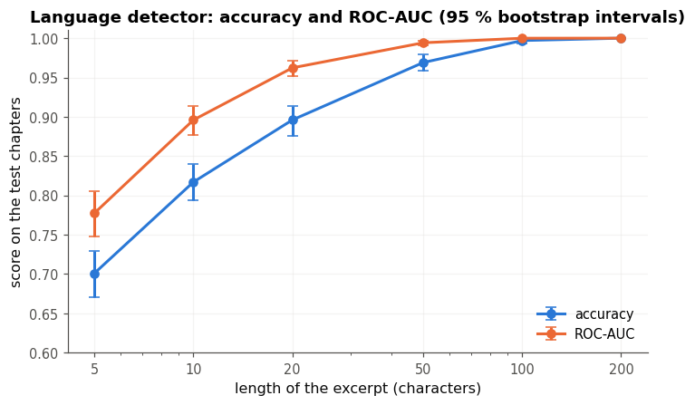
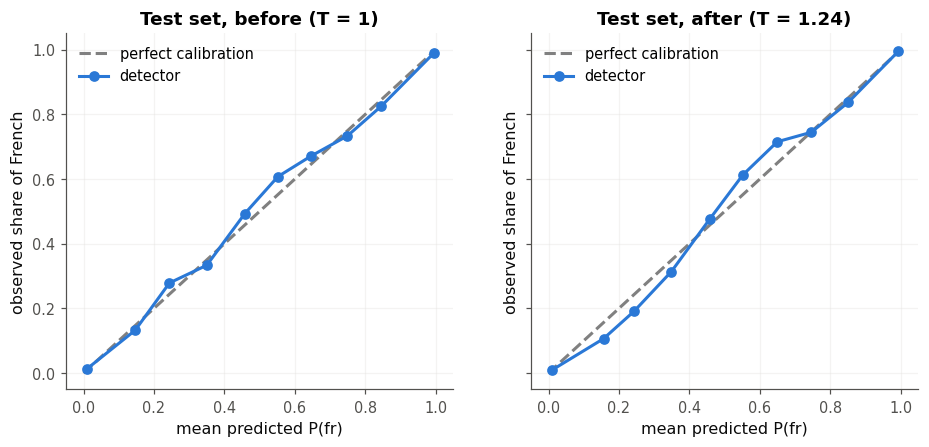

# Détecteur de langue anglais / français *from scratch*

> Un classifieur *Naive Bayes* sur les lettres, sans bibliothèque de machine learning, qui reconnaît l'anglais et le français avec 90 % d'accuracy sur des extraits de 20 caractères, et sans aucune erreur sur les 1 000 extraits de test de 200 caractères.

Mini-projet du checkpoint I du workbook *Deep Learning* (d'après A. Glassner), **solution de référence** : elle montre un résultat possible, et la façon de le présenter. Le modèle, l'évaluation et la calibration sont écrits avec la librairie `mylearn` construite aux chapitres 2 à 6 (statistiques, mesures de qualité, règle de Bayes, descente de gradient, théorie de l'information).

## Le problème

Un service client reçoit des messages en anglais et en français, souvent très courts, et doit les envoyer à la bonne équipe. Le détecteur doit dire, pour chaque message, s'il est en anglais ou en français, avec une probabilité honnête : un message classé avec 55 % de certitude peut être relu par un humain, pas un message classé à 99 %. Les deux erreurs coûtent à peu près autant (un message mal aiguillé est renvoyé), d'où l'**accuracy** comme mesure principale, la **ROC-AUC** pour la qualité du classement, et le **score de Brier** pour la calibration. Comme la longueur des messages varie, tout est mesuré **selon la longueur de l'extrait**, de 5 à 200 caractères.

## Les données

Deux romans du domaine public, versionnés dans le dépôt du workbook : *The Adventures of Sherlock Holmes* (A. Conan Doyle, 1892, Project Gutenberg n° 1661) pour l'anglais, et *Le Tour du monde en quatre-vingts jours* (J. Verne, 1873, Project Gutenberg n° 800) pour le français.

Le découpage se fait **par chapitres**, pour éviter les fuites : deux extraits voisins partagent des noms propres, des mots et un sujet, et un extrait de test tiré d'un chapitre d'entraînement serait trop facile. Le test simule ainsi des textes jamais vus.

| | Anglais (12 nouvelles) | Français (37 chapitres) |
|---|---|---|
| Entraînement | nouvelles 1 à 8 (366 639 caractères) | chapitres 1 à 25 (281 416 caractères) |
| Validation (réglage de la température) | nouvelles 9 et 10 (88 213) | chapitres 26 à 31 (80 861) |
| Test (mesure finale) | nouvelles 11 et 12 (103 473) | chapitres 32 à 37 (53 139) |

Les extraits ont 5, 10, 20, 50, 100 ou 200 caractères, tirés au hasard (graine fixée) dans les chapitres de validation (200 par langue et par longueur) et de test (500 par langue et par longueur, soit 6 000 extraits).

## La méthode

Chaque langue est décrite par la fréquence de ses 42 lettres (les 26 lettres et les 16 lettres accentuées ou liées du français), estimée sur les chapitres d'entraînement avec un **lissage de Laplace** (un pseudo-compte par lettre), pour qu'aucune lettre n'ait une probabilité nulle. Un texte reçoit, pour chaque langue, sa **log-vraisemblance** : la somme des logarithmes des probabilités de ses lettres. C'est l'hypothèse i.i.d. : les lettres sont traitées comme indépendantes. La **règle de Bayes** combine les deux log-vraisemblances avec un prior (uniforme par défaut) ; on retire d'abord la plus grande des deux (l'astuce log-sum-exp), car la vraisemblance s'effondre avec la longueur du texte : de l'ordre de $10^{-250}$ pour 200 lettres, elle vaudrait 0 en `float64` pour un chapitre entier. Enfin, une **température** $T$, ajustée par descente de gradient sur la log loss de la validation, peut adoucir ou durcir les probabilités ; avec le prior uniforme, elle ne change aucune décision.

## Les résultats

Sur les 6 000 extraits de test (intervalles de confiance bootstrap à 95 %, 1 000 rééchantillons) :

| Longueur | Accuracy | Intervalle | ROC-AUC | Intervalle | F1 (français) | Brier |
|---|---|---|---|---|---|---|
| 5 | 0,701 | [0,671 ; 0,729] | 0,777 | [0,747 ; 0,805] | 0,720 | 0,187 |
| 10 | 0,817 | [0,794 ; 0,840] | 0,896 | [0,877 ; 0,913] | 0,822 | 0,130 |
| 20 | 0,896 | [0,876 ; 0,914] | 0,962 | [0,952 ; 0,972] | 0,896 | 0,077 |
| 50 | 0,969 | [0,959 ; 0,979] | 0,994 | [0,990 ; 0,997] | 0,969 | 0,025 |
| 100 | 0,997 | [0,993 ; 1,000] | 1,000 | [1,000 ; 1,000] | 0,997 | 0,003 |
| 200 | 1,000 | [1,000 ; 1,000] | 1,000 | [1,000 ; 1,000] | 1,000 | 0,000 |

À 100 et 200 caractères, les intervalles percentiles se réduisent presque à un point : il ne reste (presque) plus d'erreur à rééchantillonner. Ce n'est pas une certitude : avec 0 erreur sur 1 000 extraits, la « règle de trois » borne le taux d'erreur à 0,3 % (accuracy d'au moins 0,997, avec 95 % de confiance), si les extraits étaient indépendants ; ils viennent de quelques chapitres et se chevauchent, donc cette borne est optimiste.



- **La longueur décide** : le détecteur dépasse 95 % d'accuracy à partir d'environ 50 caractères, une phrase courte. À 5 caractères, il n'a souvent que trois ou quatre lettres pour juger, et se trompe trois fois sur dix ; il penche alors vers le français (183 anglais classés en français, contre 116 français classés en anglais).
- **Les deux langues sont proches pour un modèle de lettres** : leurs entropies valent 4,17 bits (anglais) et 4,22 bits (français) par lettre, et coder le français avec les fréquences de l'anglais ne coûte que 0,45 bit de plus par lettre (une cross-entropy de 4,67 bits). C'est pourquoi il faut quelques dizaines de lettres pour décider sans hésiter.
- **La calibration est déjà bonne.** Le diagramme de fiabilité du test suit la diagonale. La température ajustée sur la validation vaut $T \approx 1{,}24$ : sur ces chapitres, le modèle était un peu trop sûr de lui, ce qui va dans le sens attendu pour un modèle naïf (l'hypothèse i.i.d. compte plusieurs fois des indices liés), sans plus. Mais l'effet est négligeable sur le test (Brier de 0,0704 à 0,0707, log loss de 0,2181 à 0,2179 nat), et il dépend du découpage : d'autres chapitres de validation peuvent donner $T < 1$. Une seule température pour toutes les longueurs est un compromis.



- **Le prior compte pour les textes courts.** Sur un site où 90 % des messages sont en français, les extraits de 10 caractères sont reconnus à 83,6 % avec le prior uniforme, moins bien que la règle triviale « toujours français » (90,1 %), et à 92,3 % avec le prior [0,1 ; 0,9] (Brier de 0,137 à 0,060). Sur 200 caractères, les lettres l'emportent sur le prior.

## Les limites

- **Deux livres du XIXᵉ siècle, deux auteurs** : le vocabulaire, l'orthographe et le style d'un message d'aujourd'hui (abréviations, émojis, anglicismes) sont différents ; les chiffres ci-dessus ne valent que pour ce genre de texte.
- **L'hypothèse i.i.d.** ignore l'ordre des lettres : « th », « qu » ou « ou » seraient de bien meilleurs indices.
- **Les noms propres et les textes mélangés** trompent le modèle : « Phileas Fogg », tiré du roman français, est classé anglais, comme « Merci beaucoup, see you tomorrow! ».
- **Deux langues seulement** : une troisième langue demanderait un problème multiclasse.
- **Des intervalles optimistes** : le bootstrap traite les extraits comme indépendants, alors qu'ils viennent de quelques chapitres et se chevauchent ; l'incertitude sur des textes vraiment nouveaux est plus grande.

## Pistes

- un modèle de bigrammes de caractères, pour gagner sur les extraits courts ;
- une troisième langue (un roman allemand ou espagnol du Project Gutenberg), avec un F1 macro ;
- comparer à `MultinomialNB` de scikit-learn, puis à un détecteur pré-entraîné (fastText `lid.176`) ;
- une température par tranche de longueur, ou une calibration de Platt (une pente et un biais).

## Reproduire

Depuis la racine du dépôt du workbook :

```bash
python -m pytest projets/partie_1_detecteur_langue/solution -q     # 15 tests du module
```

puis ouvrir `mp1_detecteur_langue.ipynb` et tout exécuter (environ 25 secondes sur un CPU, en mode rapide).
