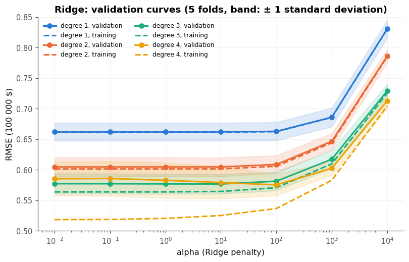
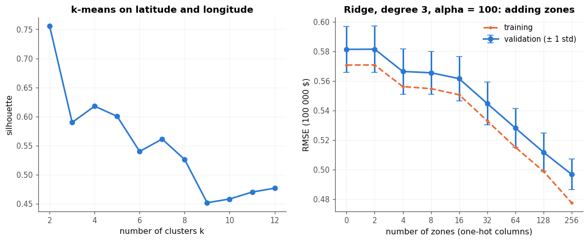
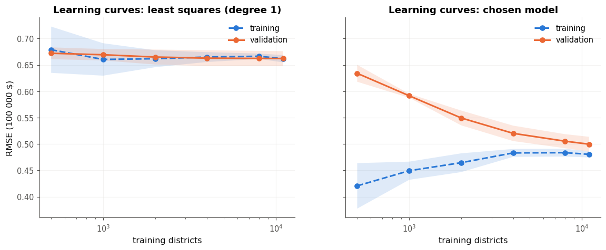
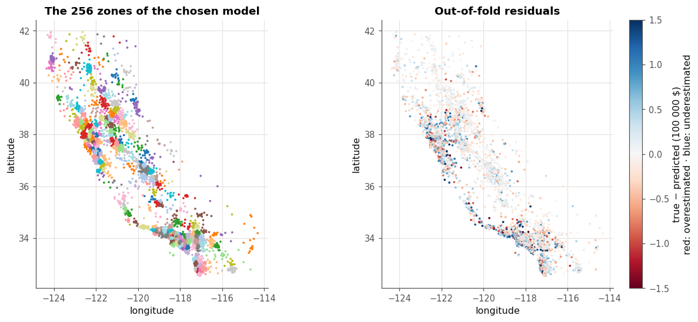

# Prix des logements californiens : un protocole d'évaluation honnête

> Des modèles linéaires écrits sans bibliothèque de machine learning, choisis par validation croisée sur 16 512 districts californiens ; le modèle retenu, mesuré une seule fois sur 4 128 districts mis de côté dès le départ, a une erreur typique (RMSE) de 0,478, soit environ 48 000 dollars (intervalle à 95 % : [0,459 ; 0,498]), contre 1,134 pour la référence naïve, soit $R^2 = 0{,}82$.

Mini-projet du checkpoint II du workbook *Deep Learning* (d'après A. Glassner), **solution de référence** : elle montre un résultat possible, et la façon de le présenter. Les modèles, les zones et la validation croisée sont écrits avec la librairie `mylearn` construite aux chapitres 7 à 9 (k-means, validation croisée, moindres carrés, Ridge et Lasso) ; scikit-learn ne sert qu'à vérifier les chiffres.

## Le problème

Un bureau d'études urbaines veut une première estimation de la valeur médiane des logements de chaque district de Californie, à partir de données de recensement, pour repérer les quartiers dont les prix s'écartent de ce qu'annoncent leurs caractéristiques. L'estimation ne vaut que si l'on sait **de combien elle se trompe** : la mesure suivie est la **RMSE** (la racine de l'erreur quadratique moyenne), dans l'unité de la cible, la centaine de milliers de dollars ; une RMSE de 0,5 veut dire une erreur typique de 50 000 dollars. Elle pénalise davantage les grosses erreurs, celles qui comptent pour repérer les quartiers atypiques.

## Les données

*California Housing* : le recensement américain de 1990, une ligne par *block group*, la plus petite unité pour laquelle le Bureau du recensement publie des données d'échantillon (un « district » de 600 à 3 000 habitants, le plus souvent). Le jeu est diffusé par StatLib et par scikit-learn (`fetch_california_housing`) ; la référence est Pace et Barry, « Sparse Spatial Autoregressions », *Statistics and Probability Letters* 33 (1997), p. 291-297 ; la documentation de scikit-learn n'indique pas de licence.

- **8 mesures** : le revenu médian (`MedInc`, en dizaines de milliers de dollars), l'âge médian des logements (`HouseAge`), les nombres moyens de pièces et de chambres par ménage (`AveRooms`, `AveBedrms`), la population (`Population`), la taille moyenne des ménages (`AveOccup`), la latitude et la longitude.
- **La cible**, `MedHouseVal`, est la valeur médiane des logements, en centaines de milliers de dollars. Elle est **plafonnée à 5** : 809 districts d'entraînement sur 16 512 (4,9 %) valent « 500 000 dollars ou plus ». `HouseAge` et `MedInc` sont plafonnés eux aussi (1 018 districts à 52 ans, 44 à un revenu de 15).
- **Des valeurs extrêmes** : jusqu'à 600 personnes par ménage en moyenne, 142 pièces, 35 682 habitants ; ce sont des districts avec très peu de ménages et beaucoup de logements vides ou collectifs.
- **Le jeu de test** : 4 128 districts (20 %), tirés avec `np.random.default_rng(2026)`, enregistrés dans `test_indices.npy` et **commités seuls le 3 octobre 2026, avant toute modélisation** (`git log -- test_indices.npy` montre ce commit, antérieur à tous les résultats).

## Le protocole

- **Cinq folds communs** (graine 0) sur les 16 512 districts d'entraînement : tous les modèles sont mesurés sur les mêmes découpages, ce qui permet de les comparer fold par fold.
- **Tout ce qui apprend des données apprend dans `fit`** : les bornes de chaque mesure (les percentiles 1 et 99), les deux standardisations, le k-means des zones et le modèle linéaire. La validation croisée refait `fit` dans chaque fold : les districts de validation ne voient jamais le prétraitement.
- **La règle d'une erreur type** décide : parmi les candidats rangés du plus simple au plus complexe, le premier dont le score moyen ne dépasse pas le meilleur de plus d'une erreur type. Celle-ci est estimée par $\sigma/\sqrt{5}$, l'écart-type entre folds du meilleur divisé par $\sqrt{5}$ : une approximation optimiste, puisque les folds partagent leurs données, mais un ordre de grandeur utile.
- **Le coffre** (`data.TestVault`) ne rend que les districts d'entraînement ; il n'a été ouvert qu'une fois, pour le modèle retenu, et `vault.json` garde la trace de cette ouverture (le 3 octobre 2026).

## Les résultats

| Modèle | RMSE en validation croisée (moyenne ± écart-type, 5 folds) | RMSE d'entraînement | RMSE du test |
|---|---|---|---|
| Référence : la moyenne | 1,159 ± 0,007 | 1,159 | 1,134 |
| Moindres carrés, les 8 mesures brutes | 0,735 ± 0,020 | 0,731 | |
| Moindres carrés, mesures bornées | 0,662 ± 0,015 | 0,662 | |
| Ridge, degré 3, α = 100 | 0,581 ± 0,015 | 0,571 | |
| **Ridge, degré 3, α = 300, 256 zones (retenu)** | **0,498 ± 0,010** | 0,481 | **0,478** [0,459 ; 0,498] |
| *Contrôle : la même chaîne construite avec scikit-learn* | 0,497 ± 0,012 | | |

Seul le modèle retenu a été mesuré sur le test ; l'intervalle est un bootstrap à 95 % des 4 128 districts de test (1 000 rééchantillons).

**Les bornes d'abord.** Les moindres carrés gagnent 43 % sur la référence (1,159 → 0,662), mais seulement si l'on borne les mesures : sans bornes, quelques districts aux valeurs extrêmes tirent la régression vers eux, et l'erreur monte à 0,735. Les bornes gagnent sur chacun des cinq folds, de 0,06 à 0,08.

**Le degré et la pénalité.** Aux degrés 1 et 2, l'entraînement et la validation restent collés : les modèles sous-apprennent, et la pénalité ne peut que les dégrader. Au degré 4 peu pénalisé, l'écart s'ouvre (0,519 à l'entraînement, 0,586 en validation) : c'est du surapprentissage, que α = 100 corrige. Le meilleur score de la grille est le degré 4 avec α = 100 (0,5755 ± 0,0177), mais le degré 3 avec α = 100 (0,5815) est à moins d'une erreur type (0,0079), avec 164 colonnes au lieu de 494 : la règle d'une erreur type le retient. Le Lasso ne fait pas mieux que Ridge au degré 2 (0,6055 contre 0,6048) ; il sert à simplifier : 16 colonnes sur 44 donnent 0,665, à peu près le score des moindres carrés sur les 8 mesures (0,662).



**Les zones.** La silhouette d'un k-means sur la latitude et la longitude préfère 2 groupes (0,755) : le nord et le sud de l'État. Mais 2 zones n'apportent rien à la prédiction (0,5816 contre 0,5815) : la silhouette mesure des groupes compacts et séparés, pas des groupes utiles pour prédire les prix. La validation croisée, elle, s'améliore jusqu'au haut de la grille : avec 256 zones, une colonne 0/1 par zone, le modèle apprend un niveau de prix par quartier (0,4970). Avec ces 256 colonnes de plus, α a été réajusté : la courbe est plate de 10 à 300, et la règle prend la pénalité la plus forte, α = 300 (0,4984 ± 0,0101).



**Le diagnostic.** Les courbes d'apprentissage des moindres carrés sont collées dès 1 000 districts : un biais pur, que plus de données ne corrigeraient pas. Le modèle retenu garde un écart de 0,02 entre l'entraînement et la validation, et sa courbe de validation descend encore avec 11 000 districts : un peu de variance, surtout du biais et du bruit. La variance des prédictions entre les modèles des folds va dans le même sens : 0,011 pour le modèle retenu, contre une erreur quadratique moyenne de 0,25 (une mesure relative, et plutôt basse, puisque ces modèles partagent une partie de leurs données). Les zones ont échangé beaucoup de biais contre un peu de variance.



**Le test.** La validation croisée annonçait 0,498 ± 0,010 ; le test donne 0,478, un peu mieux. L'écart tient surtout au hasard de l'échantillon de test (la demi-largeur de son intervalle est de 0,019) ; les districts d'entraînement en plus (16 512 au lieu d'environ 13 200 dans chaque fold) n'en expliquent que quelques millièmes, d'après la courbe d'apprentissage. Rien ne suggère que la sélection ait surajusté les folds. Sur la même matrice de design, le `Ridge` de scikit-learn redonne les prédictions de `mylearn` à $10^{-14}$ près ; la chaîne entière construite avec scikit-learn, avec son propre k-means, obtient le même score à l'incertitude près (0,497 ± 0,012).



## Les limites et l'équité

- **Des données de 1990** : les prix, les quartiers et les revenus ont changé ; le modèle ne dit rien des prix d'aujourd'hui.
- **La cible plafonnée** : le modèle sous-estime les 809 districts plafonnés de 64 000 dollars en moyenne (leur RMSE hors fold est de 1,06, contre 0,45 pour les autres), et davantage en réalité, puisque leur vraie valeur dépasse 500 000 dollars. Au-delà de ce seuil, il ne sait rien.
- **Des districts voisins de part et d'autre** : les folds et le test sont tirés au hasard, si bien que chaque district évalué a des voisins immédiats à l'entraînement, au prix très proche. Les 256 zones exploitent ce voisinage : les scores ci-dessus valent pour un district d'un quartier déjà connu, et sont optimistes pour un quartier nouveau. Une validation croisée par blocs géographiques mesurerait ce cas.
- **Des moyennes de quartier** : un district est un agrégat ; une estimation pour un district ne s'applique pas à un logement particulier.
- **Qui est mal servi** : en valeur absolue, les régions chères (Los Angeles : RMSE hors fold de 0,557 ; la baie de San Francisco : 0,541) ; en valeur relative, c'est l'inverse : l'erreur vaut 21 % de la valeur moyenne dans la baie et 23 % à Los Angeles, mais de 24 à 29 % ailleurs (29 % autour de Sacramento, 28,5 % à San Diego, 28 % autour de Fresno). Une décision prise avec ce modèle serait donc moins sûre, en proportion, hors des deux grandes métropoles.
- **L'emplacement comme indicateur indirect** : un modèle qui apprend le niveau de prix de chaque quartier reproduit les écarts entre quartiers, y compris ceux hérités de la ségrégation résidentielle. Le jeu de données ne contient aucune variable ethnique (le jeu *Boston Housing*, qui en contenait une, a été retiré de scikit-learn pour cette raison), mais la latitude et la longitude peuvent en jouer le rôle. Ce modèle ne doit pas servir à accorder un prêt ou une assurance sans un audit d'équité.

## Pistes

- une validation croisée spatiale (des folds faits de blocs géographiques), pour un score honnête sur des quartiers nouveaux ;
- des distances à la côte et aux grandes villes, au lieu de zones, moins dépendantes du voisinage ;
- traiter le plafond (un modèle pour données censurées, ou annoncer un intervalle « 500 000 dollars et plus ») ;
- comparer au *gradient boosting* (ch. 14), l'état de l'art des données tabulaires.

## Reproduire

Depuis la racine du dépôt du workbook :

```bash
python -m pytest projets/partie_2_california_validation/solution -q     # 25 tests du module
```

puis ouvrir `mp2_california.ipynb` et tout exécuter (moins de 2 minutes sur un CPU, en mode rapide). Les graines, les hyperparamètres retenus, les scores par fold, le score du test et les versions des bibliothèques sont dans `results.json`.
